cola Report for Hierarchical Partitioning - 'TCGA_LUSC_methylation'
==================

**Date**: 2021-07-22 17:42:41 CEST, **cola version**: 1.9.4

----------------------------------------------------------------

<style type='text/css'>

body, td, th {
   font-family: Arial,Helvetica,sans-serif;
   background-color: white;
   font-size: 13px;
  max-width: 800px;
  margin: auto;
  margin-left:210px;
  padding: 0px 10px 0px 10px;
  border-left: 1px solid #EEEEEE;
  line-height: 150%;
}

tt, code, pre {
   font-family: 'DejaVu Sans Mono', 'Droid Sans Mono', 'Lucida Console', Consolas, Monaco, 

monospace;
}

h1 {
   font-size:2.2em;
}

h2 {
   font-size:1.8em;
}

h3 {
   font-size:1.4em;
}

h4 {
   font-size:1.0em;
}

h5 {
   font-size:0.9em;
}

h6 {
   font-size:0.8em;
}

a {
  text-decoration: none;
  color: #0366d6;
}

a:hover {
  text-decoration: underline;
}

a:visited {
   color: #0366d6;
}

pre, img {
  max-width: 100%;
}
pre {
  overflow-x: auto;
}
pre code {
   display: block; padding: 0.5em;
}

code {
  font-size: 92%;
  border: 1px solid #ccc;
}

code[class] {
  background-color: #F8F8F8;
}

table, td, th {
  border: 1px solid #ccc;
}

blockquote {
   color:#666666;
   margin:0;
   padding-left: 1em;
   border-left: 0.5em #EEE solid;
}

hr {
   height: 0px;
   border-bottom: none;
   border-top-width: thin;
   border-top-style: dotted;
   border-top-color: #999999;
}

@media print {
   * {
      background: transparent !important;
      color: black !important;
      filter:none !important;
      -ms-filter: none !important;
   }

   body {
      font-size:12pt;
      max-width:100%;
   }

   a, a:visited {
      text-decoration: underline;
   }

   hr {
      visibility: hidden;
      page-break-before: always;
   }

   pre, blockquote {
      padding-right: 1em;
      page-break-inside: avoid;
   }

   tr, img {
      page-break-inside: avoid;
   }

   img {
      max-width: 100% !important;
   }

   @page :left {
      margin: 15mm 20mm 15mm 10mm;
   }

   @page :right {
      margin: 15mm 10mm 15mm 20mm;
   }

   p, h2, h3 {
      orphans: 3; widows: 3;
   }

   h2, h3 {
      page-break-after: avoid;
   }
}
</style>


## Summary


First the variable is renamed to `res_rh`.


```r
res_rh = rh
```


The partition hierarchy and all available functions which can be applied to `res_rh` object.


```r
res_rh
```

```
#> A 'HierarchicalPartition' object with 4 combinations of top-value methods and partitioning methods.
#>   On a matrix with 376105 rows and 415 columns.
#>   Performed in total 85400 partitions.
#>   There are 41 groups under the following parameters:
#>     - min_samples: 6
#>     - mean_silhouette_cutoff: 0.9
#>     - min_n_signatures: 1000 (signatures are selected based on:)
#>       - fdr_cutoff: 0.05
#>       - group_diff: 0.25
#> 
#> Hierarchy of the partition:
#>   0, 415 cols
#>   |-- 01, 54 cols, 30004 signatures
#>   |   |-- 011, 19 cols, 1446 signatures
#>   |   |   |-- 0111, 10 cols (b)
#>   |   |   |-- 0112, 4 cols (b)
#>   |   |   `-- 0113, 5 cols (b)
#>   |   |-- 012, 20 cols, 8499 signatures
#>   |   |   |-- 0121, 9 cols (b)
#>   |   |   |-- 0122, 5 cols (b)
#>   |   |   |-- 0123, 4 cols (b)
#>   |   |   `-- 0124, 2 cols (b)
#>   |   `-- 013, 15 cols, 793 signatures (c)
#>   |-- 02, 102 cols, 3504 signatures
#>   |   |-- 021, 37 cols, 190 signatures (c)
#>   |   |-- 022, 40 cols, 758 signatures (c)
#>   |   `-- 023, 25 cols, 414 signatures (c)
#>   |-- 03, 52 cols, 10519 signatures
#>   |   |-- 031, 14 cols, 3361 signatures
#>   |   |   |-- 0311, 10 cols (b)
#>   |   |   `-- 0312, 4 cols (b)
#>   |   |-- 032, 3 cols (b)
#>   |   |-- 033, 13 cols, 3580 signatures
#>   |   |   |-- 0331, 5 cols (b)
#>   |   |   `-- 0332, 8 cols (b)
#>   |   |-- 034, 16 cols, 3561 signatures
#>   |   |   |-- 0341, 10 cols (b)
#>   |   |   `-- 0342, 6 cols (b)
#>   |   `-- 035, 6 cols (b)
#>   |-- 04, 121 cols, 2419 signatures
#>   |   |-- 041, 54 cols, 7255 signatures
#>   |   |   |-- 0411, 25 cols, 954 signatures (c)
#>   |   |   |-- 0412, 23 cols, 5898 signatures
#>   |   |   |   |-- 04121, 16 cols, 12 signatures (c)
#>   |   |   |   |-- 04122, 5 cols (b)
#>   |   |   |   `-- 04123, 2 cols (b)
#>   |   |   `-- 0413, 6 cols (b)
#>   |   |-- 042, 37 cols, 12967 signatures
#>   |   |   |-- 0421, 23 cols, 74 signatures (c)
#>   |   |   |-- 0422, 6 cols (b)
#>   |   |   `-- 0423, 8 cols (b)
#>   |   `-- 043, 30 cols, 5353 signatures
#>   |       |-- 0431, 9 cols (b)
#>   |       |-- 0432, 12 cols, 2941 signatures
#>   |       |   |-- 04321, 4 cols (b)
#>   |       |   |-- 04322, 6 cols (b)
#>   |       |   `-- 04323, 2 cols (b)
#>   |       `-- 0433, 9 cols (b)
#>   `-- 05, 86 cols, 15755 signatures
#>       |-- 051, 26 cols, 9106 signatures
#>       |   |-- 0511, 11 cols (b)
#>       |   |-- 0512, 7 cols (b)
#>       |   `-- 0513, 8 cols (b)
#>       |-- 052, 29 cols, 2070 signatures
#>       |   |-- 0521, 13 cols, 2395 signatures
#>       |   |   |-- 05211, 2 cols (b)
#>       |   |   `-- 05212, 11 cols (b)
#>       |   `-- 0522, 16 cols, 232 signatures (c)
#>       `-- 053, 31 cols, 1851 signatures
#>           |-- 0531, 10 cols (b)
#>           |-- 0532, 10 cols (b)
#>           `-- 0533, 11 cols (b)
#> Stop reason:
#>   b) Subgroup had too few columns.
#>   c) There were too few signatures.
#> 
#> Following methods can be applied to this 'HierarchicalPartition' object:
#>  [1] "all_leaves"            "all_nodes"             "cola_report"           "collect_classes"      
#>  [5] "colnames"              "compare_signatures"    "dimension_reduction"   "functional_enrichment"
#>  [9] "get_anno_col"          "get_anno"              "get_children_nodes"    "get_classes"          
#> [13] "get_matrix"            "get_signatures"        "is_leaf_node"          "max_depth"            
#> [17] "merge_node"            "ncol"                  "node_info"             "node_level"           
#> [21] "nrow"                  "rownames"              "show"                  "split_node"           
#> [25] "suggest_best_k"        "test_to_known_factors" "top_rows_heatmap"      "top_rows_overlap"     
#> 
#> You can get result for a single node by e.g. object["01"]
```

The call of `hierarchical_partition()` was:


```
#> hierarchical_partition(data = mat, top_n = 1000, top_value_method = c("SD", "ATC"), 
#>     partition_method = c("kmeans", "skmeans"), subset = 500, group_diff = 0.25, min_n_signatures = 1000, 
#>     filter_fun = function(mat) {
#>         s = rowSds(mat)
#>         order(-s)[1:30000]
#>     }, max_k = 8, scale_rows = FALSE, cores = 4)
```

Dimension of the input matrix:


```r
mat = get_matrix(res_rh)
dim(mat)
```

```
#> [1] 376105    415
```

All the methods that were tried:


```r
res_rh@param$combination_method
```

```
#> [[1]]
#> [1] "SD"     "kmeans"
#> 
#> [[2]]
#> [1] "ATC"    "kmeans"
#> 
#> [[3]]
#> [1] "SD"      "skmeans"
#> 
#> [[4]]
#> [1] "ATC"     "skmeans"
```

### Density distribution

The density distribution for each sample is visualized as one column in the following heatmap.
The clustering is based on the distance which is the Kolmogorov-Smirnov statistic between two distributions.


```r
library(ComplexHeatmap)
densityHeatmap(mat, ylab = "value", cluster_columns = TRUE, show_column_names = FALSE,
    mc.cores = 1)
```

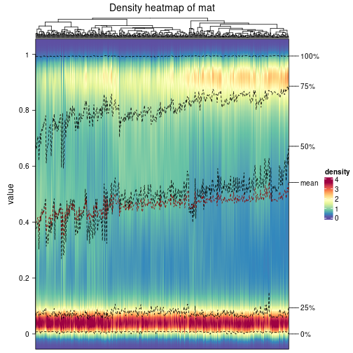


Some values about the hierarchy:


```r
all_nodes(res_rh)
```

```
#>  [1] "0"     "01"    "011"   "0111"  "0112"  "0113"  "012"   "0121"  "0122"  "0123"  "0124"  "013"  
#> [13] "02"    "021"   "022"   "023"   "03"    "031"   "0311"  "0312"  "032"   "033"   "0331"  "0332" 
#> [25] "034"   "0341"  "0342"  "035"   "04"    "041"   "0411"  "0412"  "04121" "04122" "04123" "0413" 
#> [37] "042"   "0421"  "0422"  "0423"  "043"   "0431"  "0432"  "04321" "04322" "04323" "0433"  "05"   
#> [49] "051"   "0511"  "0512"  "0513"  "052"   "0521"  "05211" "05212" "0522"  "053"   "0531"  "0532" 
#> [61] "0533"
```

```r
all_leaves(res_rh)
```

```
#>  [1] "0111"  "0112"  "0113"  "0121"  "0122"  "0123"  "0124"  "013"   "021"   "022"   "023"   "0311" 
#> [13] "0312"  "032"   "0331"  "0332"  "0341"  "0342"  "035"   "0411"  "04121" "04122" "04123" "0413" 
#> [25] "0421"  "0422"  "0423"  "0431"  "04321" "04322" "04323" "0433"  "0511"  "0512"  "0513"  "05211"
#> [37] "05212" "0522"  "0531"  "0532"  "0533"
```

```r
node_info(res_rh)
```

```
#>       id best_method depth best_k n_columns n_signatures p_signatures is_leaf
#> 1      0 ATC:skmeans     1      5       415        51178     1.36e-01   FALSE
#> 2     01  ATC:kmeans     2      3        54        30004     7.98e-02   FALSE
#> 3    011  ATC:kmeans     3      3        19         1446     3.84e-03   FALSE
#> 4   0111 not applied     4     NA        10           NA           NA    TRUE
#> 5   0112 not applied     4     NA         4           NA           NA    TRUE
#> 6   0113 not applied     4     NA         5           NA           NA    TRUE
#> 7    012  ATC:kmeans     3      4        20         8499     2.26e-02   FALSE
#> 8   0121 not applied     4     NA         9           NA           NA    TRUE
#> 9   0122 not applied     4     NA         5           NA           NA    TRUE
#> 10  0123 not applied     4     NA         4           NA           NA    TRUE
#> 11  0124 not applied     4     NA         2           NA           NA    TRUE
#> 12   013  ATC:kmeans     3      4        15          793     2.11e-03    TRUE
#> 13    02   SD:kmeans     2      3       102         3504     9.32e-03   FALSE
#> 14   021  ATC:kmeans     3      2        37          190     5.05e-04    TRUE
#> 15   022  ATC:kmeans     3      2        40          758     2.02e-03    TRUE
#> 16   023  ATC:kmeans     3      2        25          414     1.10e-03    TRUE
#> 17    03 ATC:skmeans     2      5        52        10519     2.80e-02   FALSE
#> 18   031  ATC:kmeans     3      2        14         3361     8.94e-03   FALSE
#> 19  0311 not applied     4     NA        10           NA           NA    TRUE
#> 20  0312 not applied     4     NA         4           NA           NA    TRUE
#> 21   032 not applied     3     NA         3           NA           NA    TRUE
#> 22   033   SD:kmeans     3      2        13         3580     9.52e-03   FALSE
#> 23  0331 not applied     4     NA         5           NA           NA    TRUE
#> 24  0332 not applied     4     NA         8           NA           NA    TRUE
#> 25   034  ATC:kmeans     3      2        16         3561     9.47e-03   FALSE
#> 26  0341 not applied     4     NA        10           NA           NA    TRUE
#> 27  0342 not applied     4     NA         6           NA           NA    TRUE
#> 28   035 not applied     3     NA         6           NA           NA    TRUE
#> 29    04  SD:skmeans     2      3       121         2419     6.43e-03   FALSE
#> 30   041  ATC:kmeans     3      3        54         7255     1.93e-02   FALSE
#> 31  0411 ATC:skmeans     4      3        25          954     2.54e-03    TRUE
#> 32  0412 ATC:skmeans     4      3        23         5898     1.57e-02   FALSE
#> 33 04121  ATC:kmeans     5      2        16           12     3.19e-05    TRUE
#> 34 04122 not applied     5     NA         5           NA           NA    TRUE
#> 35 04123 not applied     5     NA         2           NA           NA    TRUE
#> 36  0413 not applied     4     NA         6           NA           NA    TRUE
#> 37   042  ATC:kmeans     3      3        37        12967     3.45e-02   FALSE
#> 38  0421  ATC:kmeans     4      2        23           74     1.97e-04    TRUE
#> 39  0422 not applied     4     NA         6           NA           NA    TRUE
#> 40  0423 not applied     4     NA         8           NA           NA    TRUE
#> 41   043  ATC:kmeans     3      3        30         5353     1.42e-02   FALSE
#> 42  0431 not applied     4     NA         9           NA           NA    TRUE
#> 43  0432   SD:kmeans     4      3        12         2941     7.82e-03   FALSE
#> 44 04321 not applied     5     NA         4           NA           NA    TRUE
#> 45 04322 not applied     5     NA         6           NA           NA    TRUE
#> 46 04323 not applied     5     NA         2           NA           NA    TRUE
#> 47  0433 not applied     4     NA         9           NA           NA    TRUE
#> 48    05   SD:kmeans     2      3        86        15755     4.19e-02   FALSE
#> 49   051  ATC:kmeans     3      3        26         9106     2.42e-02   FALSE
#> 50  0511 not applied     4     NA        11           NA           NA    TRUE
#> 51  0512 not applied     4     NA         7           NA           NA    TRUE
#> 52  0513 not applied     4     NA         8           NA           NA    TRUE
#> 53   052  ATC:kmeans     3      2        29         2070     5.50e-03   FALSE
#> 54  0521  ATC:kmeans     4      2        13         2395     6.37e-03   FALSE
#> 55 05211 not applied     5     NA         2           NA           NA    TRUE
#> 56 05212 not applied     5     NA        11           NA           NA    TRUE
#> 57  0522 ATC:skmeans     4      3        16          232     6.17e-04    TRUE
#> 58   053 ATC:skmeans     3      3        31         1851     4.92e-03   FALSE
#> 59  0531 not applied     4     NA        10           NA           NA    TRUE
#> 60  0532 not applied     4     NA        10           NA           NA    TRUE
#> 61  0533 not applied     4     NA        11           NA           NA    TRUE
```

In the output from `node_info()`, there are the following columns:

- `id`: The node id.
- `best_method`: The best method selected.
- `depth`: Depth of the node in the hierarchy.
- `best_k`: Best number of groups of the partition on that node.
- `n_columns`: Number of columns in the submatrix.
- `n_signatures`: Number of signatures with the `best_k`.
- `p_signatures`: Proportion of hte signatures in total number of rows in the matrix.
- `is_leaf`: Whether the node is a leaf.

Labels of nodes are encoded in a special way. The number of digits
correspond to the depth of the node in the hierarchy and the value of the
digits correspond to the index of the subgroup in the current node, E.g. a label
of “012” means the node is the second subgroup of the partition which is the
first subgroup of the root node.

### Suggest the best k


Following table shows the best `k` (number of partitions) for each node in the
partition hierarchy. Clicking on the node name in the table goes to the
corresponding section for the partitioning on that node.

[The cola vignette](https://jokergoo.github.io/cola_vignettes/cola.html#toc_13)
explains the definition of the metrics used for determining the best
number of partitions.


```r
suggest_best_k(res_rh)
```


|Node                  |Best method                                         |Is leaf   |Best k |1-PAC |Mean silhouette |Concordance | #samples|   |
|:---------------------|:---------------------------------------------------|:---------|:------|:-----|:---------------|:-----------|--------:|:--|
|[Node0](#Node0)       |ATC:skmeans                                         |          |8      |0.92  |0.78            |0.89        |      415|*  |
|[Node01](#Node01)     |ATC:kmeans                                          |          |3      |1.00  |0.98            |0.99        |       54|** |
|[Node011](#Node011)   |ATC:kmeans                                          |          |3      |1.00  |0.98            |0.99        |       19|** |
|Node0111-leaf         |<span style='color:grey;'><i>not applied</i></span> |✓ (b)     |       |      |                |            |       10|   |
|Node0112-leaf         |<span style='color:grey;'><i>not applied</i></span> |✓ (b)     |       |      |                |            |        4|   |
|Node0113-leaf         |<span style='color:grey;'><i>not applied</i></span> |✓ (b)     |       |      |                |            |        5|   |
|[Node012](#Node012)   |ATC:kmeans                                          |          |3      |0.86  |0.92            |0.97        |       20|   |
|Node0121-leaf         |<span style='color:grey;'><i>not applied</i></span> |✓ (b)     |       |      |                |            |        9|   |
|Node0122-leaf         |<span style='color:grey;'><i>not applied</i></span> |✓ (b)     |       |      |                |            |        5|   |
|Node0123-leaf         |<span style='color:grey;'><i>not applied</i></span> |✓ (b)     |       |      |                |            |        4|   |
|Node0124-leaf         |<span style='color:grey;'><i>not applied</i></span> |✓ (b)     |       |      |                |            |        2|   |
|Node013-leaf          |ATC:kmeans                                          |✓ (&#99;) |2      |1.00  |1.00            |1.00        |       15|** |
|[Node02](#Node02)     |SD:kmeans                                           |          |2      |1.00  |1.00            |1.00        |      102|** |
|Node021-leaf          |ATC:kmeans                                          |✓ (&#99;) |3      |1.00  |0.94            |0.96        |       37|** |
|Node022-leaf          |ATC:kmeans                                          |✓ (&#99;) |2      |1.00  |1.00            |1.00        |       40|** |
|Node023-leaf          |ATC:kmeans                                          |✓ (&#99;) |2      |1.00  |0.99            |0.99        |       25|** |
|[Node03](#Node03)     |ATC:skmeans                                         |          |6      |1.00  |0.97            |0.99        |       52|** |
|[Node031](#Node031)   |ATC:kmeans                                          |          |2      |1.00  |1.00            |1.00        |       14|** |
|Node0311-leaf         |<span style='color:grey;'><i>not applied</i></span> |✓ (b)     |       |      |                |            |       10|   |
|Node0312-leaf         |<span style='color:grey;'><i>not applied</i></span> |✓ (b)     |       |      |                |            |        4|   |
|Node032-leaf          |<span style='color:grey;'><i>not applied</i></span> |✓ (b)     |       |      |                |            |        3|   |
|[Node033](#Node033)   |SD:kmeans                                           |          |2      |1.00  |1.00            |1.00        |       13|** |
|Node0331-leaf         |<span style='color:grey;'><i>not applied</i></span> |✓ (b)     |       |      |                |            |        5|   |
|Node0332-leaf         |<span style='color:grey;'><i>not applied</i></span> |✓ (b)     |       |      |                |            |        8|   |
|[Node034](#Node034)   |ATC:kmeans                                          |          |2      |1.00  |1.00            |1.00        |       16|** |
|Node0341-leaf         |<span style='color:grey;'><i>not applied</i></span> |✓ (b)     |       |      |                |            |       10|   |
|Node0342-leaf         |<span style='color:grey;'><i>not applied</i></span> |✓ (b)     |       |      |                |            |        6|   |
|Node035-leaf          |<span style='color:grey;'><i>not applied</i></span> |✓ (b)     |       |      |                |            |        6|   |
|[Node04](#Node04)     |SD:skmeans                                          |          |4      |0.96  |0.93            |0.97        |      121|** |
|[Node041](#Node041)   |ATC:kmeans                                          |          |3      |1.00  |0.97            |0.99        |       54|** |
|Node0411-leaf         |ATC:skmeans                                         |✓ (&#99;) |3      |1.00  |0.99            |0.99        |       25|** |
|[Node0412](#Node0412) |ATC:skmeans                                         |          |2      |1.00  |1.00            |1.00        |       23|** |
|Node04121-leaf        |ATC:kmeans                                          |✓ (&#99;) |2      |1.00  |0.99            |1.00        |       16|** |
|Node04122-leaf        |<span style='color:grey;'><i>not applied</i></span> |✓ (b)     |       |      |                |            |        5|   |
|Node04123-leaf        |<span style='color:grey;'><i>not applied</i></span> |✓ (b)     |       |      |                |            |        2|   |
|Node0413-leaf         |<span style='color:grey;'><i>not applied</i></span> |✓ (b)     |       |      |                |            |        6|   |
|[Node042](#Node042)   |ATC:kmeans                                          |          |3      |1.00  |1.00            |1.00        |       37|** |
|Node0421-leaf         |ATC:kmeans                                          |✓ (&#99;) |2      |1.00  |1.00            |1.00        |       23|** |
|Node0422-leaf         |<span style='color:grey;'><i>not applied</i></span> |✓ (b)     |       |      |                |            |        6|   |
|Node0423-leaf         |<span style='color:grey;'><i>not applied</i></span> |✓ (b)     |       |      |                |            |        8|   |
|[Node043](#Node043)   |ATC:kmeans                                          |          |3      |1.00  |0.99            |1.00        |       30|** |
|Node0431-leaf         |<span style='color:grey;'><i>not applied</i></span> |✓ (b)     |       |      |                |            |        9|   |
|[Node0432](#Node0432) |SD:kmeans                                           |          |2      |1.00  |0.99            |0.99        |       12|** |
|Node04321-leaf        |<span style='color:grey;'><i>not applied</i></span> |✓ (b)     |       |      |                |            |        4|   |
|Node04322-leaf        |<span style='color:grey;'><i>not applied</i></span> |✓ (b)     |       |      |                |            |        6|   |
|Node04323-leaf        |<span style='color:grey;'><i>not applied</i></span> |✓ (b)     |       |      |                |            |        2|   |
|Node0433-leaf         |<span style='color:grey;'><i>not applied</i></span> |✓ (b)     |       |      |                |            |        9|   |
|[Node05](#Node05)     |SD:kmeans                                           |          |3      |1.00  |0.96            |0.97        |       86|** |
|[Node051](#Node051)   |ATC:kmeans                                          |          |3      |1.00  |1.00            |1.00        |       26|** |
|Node0511-leaf         |<span style='color:grey;'><i>not applied</i></span> |✓ (b)     |       |      |                |            |       11|   |
|Node0512-leaf         |<span style='color:grey;'><i>not applied</i></span> |✓ (b)     |       |      |                |            |        7|   |
|Node0513-leaf         |<span style='color:grey;'><i>not applied</i></span> |✓ (b)     |       |      |                |            |        8|   |
|[Node052](#Node052)   |ATC:kmeans                                          |          |2      |1.00  |0.99            |0.99        |       29|** |
|[Node0521](#Node0521) |ATC:kmeans                                          |          |2      |1.00  |1.00            |1.00        |       13|** |
|Node05211-leaf        |<span style='color:grey;'><i>not applied</i></span> |✓ (b)     |       |      |                |            |        2|   |
|Node05212-leaf        |<span style='color:grey;'><i>not applied</i></span> |✓ (b)     |       |      |                |            |       11|   |
|Node0522-leaf         |ATC:skmeans                                         |✓ (&#99;) |3      |1.00  |0.99            |0.99        |       16|** |
|[Node053](#Node053)   |ATC:skmeans                                         |          |3      |1.00  |1.00            |1.00        |       31|** |
|Node0531-leaf         |<span style='color:grey;'><i>not applied</i></span> |✓ (b)     |       |      |                |            |       10|   |
|Node0532-leaf         |<span style='color:grey;'><i>not applied</i></span> |✓ (b)     |       |      |                |            |       10|   |
|Node0533-leaf         |<span style='color:grey;'><i>not applied</i></span> |✓ (b)     |       |      |                |            |       11|   |


Stop reason: b) Subgroup had too few columns. c) There were too few signatures. 

\*\*: 1-PAC > 0.95, \*: 1-PAC > 0.9


### Partition hierarchy

The nodes of the hierarchy can be merged by setting the `merge_node` parameters. Here we 
control the hierarchy with the `min_n_signatures` parameter. The value of `min_n_signatures` is
from `node_info()`.


<style type='text/css'>


.ui-helper-hidden {
	display: none;
}
.ui-helper-hidden-accessible {
	border: 0;
	clip: rect(0 0 0 0);
	height: 1px;
	margin: -1px;
	overflow: hidden;
	padding: 0;
	position: absolute;
	width: 1px;
}
.ui-helper-reset {
	margin: 0;
	padding: 0;
	border: 0;
	outline: 0;
	line-height: 1.3;
	text-decoration: none;
	font-size: 100%;
	list-style: none;
}
.ui-helper-clearfix:before,
.ui-helper-clearfix:after {
	content: "";
	display: table;
	border-collapse: collapse;
}
.ui-helper-clearfix:after {
	clear: both;
}
.ui-helper-zfix {
	width: 100%;
	height: 100%;
	top: 0;
	left: 0;
	position: absolute;
	opacity: 0;
	filter:Alpha(Opacity=0); 
}

.ui-front {
	z-index: 100;
}


.ui-state-disabled {
	cursor: default !important;
	pointer-events: none;
}


.ui-icon {
	display: inline-block;
	vertical-align: middle;
	margin-top: -.25em;
	position: relative;
	text-indent: -99999px;
	overflow: hidden;
	background-repeat: no-repeat;
}

.ui-widget-icon-block {
	left: 50%;
	margin-left: -8px;
	display: block;
}


.ui-widget-overlay {
	position: fixed;
	top: 0;
	left: 0;
	width: 100%;
	height: 100%;
}
.ui-accordion .ui-accordion-header {
	display: block;
	cursor: pointer;
	position: relative;
	margin: 2px 0 0 0;
	padding: .5em .5em .5em .7em;
	font-size: 100%;
}
.ui-accordion .ui-accordion-content {
	padding: 1em 2.2em;
	border-top: 0;
	overflow: auto;
}
.ui-autocomplete {
	position: absolute;
	top: 0;
	left: 0;
	cursor: default;
}
.ui-menu {
	list-style: none;
	padding: 0;
	margin: 0;
	display: block;
	outline: 0;
}
.ui-menu .ui-menu {
	position: absolute;
}
.ui-menu .ui-menu-item {
	margin: 0;
	cursor: pointer;
	
	list-style-image: url("data:image/gif;base64,R0lGODlhAQABAIAAAAAAAP///yH5BAEAAAAALAAAAAABAAEAAAIBRAA7");
}
.ui-menu .ui-menu-item-wrapper {
	position: relative;
	padding: 3px 1em 3px .4em;
}
.ui-menu .ui-menu-divider {
	margin: 5px 0;
	height: 0;
	font-size: 0;
	line-height: 0;
	border-width: 1px 0 0 0;
}
.ui-menu .ui-state-focus,
.ui-menu .ui-state-active {
	margin: -1px;
}


.ui-menu-icons {
	position: relative;
}
.ui-menu-icons .ui-menu-item-wrapper {
	padding-left: 2em;
}


.ui-menu .ui-icon {
	position: absolute;
	top: 0;
	bottom: 0;
	left: .2em;
	margin: auto 0;
}


.ui-menu .ui-menu-icon {
	left: auto;
	right: 0;
}
.ui-button {
	padding: .4em 1em;
	display: inline-block;
	position: relative;
	line-height: normal;
	margin-right: .1em;
	cursor: pointer;
	vertical-align: middle;
	text-align: center;
	-webkit-user-select: none;
	-moz-user-select: none;
	-ms-user-select: none;
	user-select: none;

	
	overflow: visible;
}

.ui-button,
.ui-button:link,
.ui-button:visited,
.ui-button:hover,
.ui-button:active {
	text-decoration: none;
}


.ui-button-icon-only {
	width: 2em;
	box-sizing: border-box;
	text-indent: -9999px;
	white-space: nowrap;
}


input.ui-button.ui-button-icon-only {
	text-indent: 0;
}


.ui-button-icon-only .ui-icon {
	position: absolute;
	top: 50%;
	left: 50%;
	margin-top: -8px;
	margin-left: -8px;
}

.ui-button.ui-icon-notext .ui-icon {
	padding: 0;
	width: 2.1em;
	height: 2.1em;
	text-indent: -9999px;
	white-space: nowrap;

}

input.ui-button.ui-icon-notext .ui-icon {
	width: auto;
	height: auto;
	text-indent: 0;
	white-space: normal;
	padding: .4em 1em;
}


input.ui-button::-moz-focus-inner,
button.ui-button::-moz-focus-inner {
	border: 0;
	padding: 0;
}
.ui-controlgroup {
	vertical-align: middle;
	display: inline-block;
}
.ui-controlgroup > .ui-controlgroup-item {
	float: left;
	margin-left: 0;
	margin-right: 0;
}
.ui-controlgroup > .ui-controlgroup-item:focus,
.ui-controlgroup > .ui-controlgroup-item.ui-visual-focus {
	z-index: 9999;
}
.ui-controlgroup-vertical > .ui-controlgroup-item {
	display: block;
	float: none;
	width: 100%;
	margin-top: 0;
	margin-bottom: 0;
	text-align: left;
}
.ui-controlgroup-vertical .ui-controlgroup-item {
	box-sizing: border-box;
}
.ui-controlgroup .ui-controlgroup-label {
	padding: .4em 1em;
}
.ui-controlgroup .ui-controlgroup-label span {
	font-size: 80%;
}
.ui-controlgroup-horizontal .ui-controlgroup-label + .ui-controlgroup-item {
	border-left: none;
}
.ui-controlgroup-vertical .ui-controlgroup-label + .ui-controlgroup-item {
	border-top: none;
}
.ui-controlgroup-horizontal .ui-controlgroup-label.ui-widget-content {
	border-right: none;
}
.ui-controlgroup-vertical .ui-controlgroup-label.ui-widget-content {
	border-bottom: none;
}


.ui-controlgroup-vertical .ui-spinner-input {

	
	width: 75%;
	width: calc( 100% - 2.4em );
}
.ui-controlgroup-vertical .ui-spinner .ui-spinner-up {
	border-top-style: solid;
}

.ui-checkboxradio-label .ui-icon-background {
	box-shadow: inset 1px 1px 1px #ccc;
	border-radius: .12em;
	border: none;
}
.ui-checkboxradio-radio-label .ui-icon-background {
	width: 16px;
	height: 16px;
	border-radius: 1em;
	overflow: visible;
	border: none;
}
.ui-checkboxradio-radio-label.ui-checkboxradio-checked .ui-icon,
.ui-checkboxradio-radio-label.ui-checkboxradio-checked:hover .ui-icon {
	background-image: none;
	width: 8px;
	height: 8px;
	border-width: 4px;
	border-style: solid;
}
.ui-checkboxradio-disabled {
	pointer-events: none;
}
.ui-datepicker {
	width: 17em;
	padding: .2em .2em 0;
	display: none;
}
.ui-datepicker .ui-datepicker-header {
	position: relative;
	padding: .2em 0;
}
.ui-datepicker .ui-datepicker-prev,
.ui-datepicker .ui-datepicker-next {
	position: absolute;
	top: 2px;
	width: 1.8em;
	height: 1.8em;
}
.ui-datepicker .ui-datepicker-prev-hover,
.ui-datepicker .ui-datepicker-next-hover {
	top: 1px;
}
.ui-datepicker .ui-datepicker-prev {
	left: 2px;
}
.ui-datepicker .ui-datepicker-next {
	right: 2px;
}
.ui-datepicker .ui-datepicker-prev-hover {
	left: 1px;
}
.ui-datepicker .ui-datepicker-next-hover {
	right: 1px;
}
.ui-datepicker .ui-datepicker-prev span,
.ui-datepicker .ui-datepicker-next span {
	display: block;
	position: absolute;
	left: 50%;
	margin-left: -8px;
	top: 50%;
	margin-top: -8px;
}
.ui-datepicker .ui-datepicker-title {
	margin: 0 2.3em;
	line-height: 1.8em;
	text-align: center;
}
.ui-datepicker .ui-datepicker-title select {
	font-size: 1em;
	margin: 1px 0;
}
.ui-datepicker select.ui-datepicker-month,
.ui-datepicker select.ui-datepicker-year {
	width: 45%;
}
.ui-datepicker table {
	width: 100%;
	font-size: .9em;
	border-collapse: collapse;
	margin: 0 0 .4em;
}
.ui-datepicker th {
	padding: .7em .3em;
	text-align: center;
	font-weight: bold;
	border: 0;
}
.ui-datepicker td {
	border: 0;
	padding: 1px;
}
.ui-datepicker td span,
.ui-datepicker td a {
	display: block;
	padding: .2em;
	text-align: right;
	text-decoration: none;
}
.ui-datepicker .ui-datepicker-buttonpane {
	background-image: none;
	margin: .7em 0 0 0;
	padding: 0 .2em;
	border-left: 0;
	border-right: 0;
	border-bottom: 0;
}
.ui-datepicker .ui-datepicker-buttonpane button {
	float: right;
	margin: .5em .2em .4em;
	cursor: pointer;
	padding: .2em .6em .3em .6em;
	width: auto;
	overflow: visible;
}
.ui-datepicker .ui-datepicker-buttonpane button.ui-datepicker-current {
	float: left;
}


.ui-datepicker.ui-datepicker-multi {
	width: auto;
}
.ui-datepicker-multi .ui-datepicker-group {
	float: left;
}
.ui-datepicker-multi .ui-datepicker-group table {
	width: 95%;
	margin: 0 auto .4em;
}
.ui-datepicker-multi-2 .ui-datepicker-group {
	width: 50%;
}
.ui-datepicker-multi-3 .ui-datepicker-group {
	width: 33.3%;
}
.ui-datepicker-multi-4 .ui-datepicker-group {
	width: 25%;
}
.ui-datepicker-multi .ui-datepicker-group-last .ui-datepicker-header,
.ui-datepicker-multi .ui-datepicker-group-middle .ui-datepicker-header {
	border-left-width: 0;
}
.ui-datepicker-multi .ui-datepicker-buttonpane {
	clear: left;
}
.ui-datepicker-row-break {
	clear: both;
	width: 100%;
	font-size: 0;
}


.ui-datepicker-rtl {
	direction: rtl;
}
.ui-datepicker-rtl .ui-datepicker-prev {
	right: 2px;
	left: auto;
}
.ui-datepicker-rtl .ui-datepicker-next {
	left: 2px;
	right: auto;
}
.ui-datepicker-rtl .ui-datepicker-prev:hover {
	right: 1px;
	left: auto;
}
.ui-datepicker-rtl .ui-datepicker-next:hover {
	left: 1px;
	right: auto;
}
.ui-datepicker-rtl .ui-datepicker-buttonpane {
	clear: right;
}
.ui-datepicker-rtl .ui-datepicker-buttonpane button {
	float: left;
}
.ui-datepicker-rtl .ui-datepicker-buttonpane button.ui-datepicker-current,
.ui-datepicker-rtl .ui-datepicker-group {
	float: right;
}
.ui-datepicker-rtl .ui-datepicker-group-last .ui-datepicker-header,
.ui-datepicker-rtl .ui-datepicker-group-middle .ui-datepicker-header {
	border-right-width: 0;
	border-left-width: 1px;
}


.ui-datepicker .ui-icon {
	display: block;
	text-indent: -99999px;
	overflow: hidden;
	background-repeat: no-repeat;
	left: .5em;
	top: .3em;
}
.ui-dialog {
	position: absolute;
	top: 0;
	left: 0;
	padding: .2em;
	outline: 0;
}
.ui-dialog .ui-dialog-titlebar {
	padding: .4em 1em;
	position: relative;
}
.ui-dialog .ui-dialog-title {
	float: left;
	margin: .1em 0;
	white-space: nowrap;
	width: 90%;
	overflow: hidden;
	text-overflow: ellipsis;
}
.ui-dialog .ui-dialog-titlebar-close {
	position: absolute;
	right: .3em;
	top: 50%;
	width: 20px;
	margin: -10px 0 0 0;
	padding: 1px;
	height: 20px;
}
.ui-dialog .ui-dialog-content {
	position: relative;
	border: 0;
	padding: .5em 1em;
	background: none;
	overflow: auto;
}
.ui-dialog .ui-dialog-buttonpane {
	text-align: left;
	border-width: 1px 0 0 0;
	background-image: none;
	margin-top: .5em;
	padding: .3em 1em .5em .4em;
}
.ui-dialog .ui-dialog-buttonpane .ui-dialog-buttonset {
	float: right;
}
.ui-dialog .ui-dialog-buttonpane button {
	margin: .5em .4em .5em 0;
	cursor: pointer;
}
.ui-dialog .ui-resizable-n {
	height: 2px;
	top: 0;
}
.ui-dialog .ui-resizable-e {
	width: 2px;
	right: 0;
}
.ui-dialog .ui-resizable-s {
	height: 2px;
	bottom: 0;
}
.ui-dialog .ui-resizable-w {
	width: 2px;
	left: 0;
}
.ui-dialog .ui-resizable-se,
.ui-dialog .ui-resizable-sw,
.ui-dialog .ui-resizable-ne,
.ui-dialog .ui-resizable-nw {
	width: 7px;
	height: 7px;
}
.ui-dialog .ui-resizable-se {
	right: 0;
	bottom: 0;
}
.ui-dialog .ui-resizable-sw {
	left: 0;
	bottom: 0;
}
.ui-dialog .ui-resizable-ne {
	right: 0;
	top: 0;
}
.ui-dialog .ui-resizable-nw {
	left: 0;
	top: 0;
}
.ui-draggable .ui-dialog-titlebar {
	cursor: move;
}
.ui-draggable-handle {
	-ms-touch-action: none;
	touch-action: none;
}
.ui-resizable {
	position: relative;
}
.ui-resizable-handle {
	position: absolute;
	font-size: 0.1px;
	display: block;
	-ms-touch-action: none;
	touch-action: none;
}
.ui-resizable-disabled .ui-resizable-handle,
.ui-resizable-autohide .ui-resizable-handle {
	display: none;
}
.ui-resizable-n {
	cursor: n-resize;
	height: 7px;
	width: 100%;
	top: -5px;
	left: 0;
}
.ui-resizable-s {
	cursor: s-resize;
	height: 7px;
	width: 100%;
	bottom: -5px;
	left: 0;
}
.ui-resizable-e {
	cursor: e-resize;
	width: 7px;
	right: -5px;
	top: 0;
	height: 100%;
}
.ui-resizable-w {
	cursor: w-resize;
	width: 7px;
	left: -5px;
	top: 0;
	height: 100%;
}
.ui-resizable-se {
	cursor: se-resize;
	width: 12px;
	height: 12px;
	right: 1px;
	bottom: 1px;
}
.ui-resizable-sw {
	cursor: sw-resize;
	width: 9px;
	height: 9px;
	left: -5px;
	bottom: -5px;
}
.ui-resizable-nw {
	cursor: nw-resize;
	width: 9px;
	height: 9px;
	left: -5px;
	top: -5px;
}
.ui-resizable-ne {
	cursor: ne-resize;
	width: 9px;
	height: 9px;
	right: -5px;
	top: -5px;
}
.ui-progressbar {
	height: 2em;
	text-align: left;
	overflow: hidden;
}
.ui-progressbar .ui-progressbar-value {
	margin: -1px;
	height: 100%;
}
.ui-progressbar .ui-progressbar-overlay {
	background: url("");
	height: 100%;
	filter: alpha(opacity=25); 
	opacity: 0.25;
}
.ui-progressbar-indeterminate .ui-progressbar-value {
	background-image: none;
}
.ui-selectable {
	-ms-touch-action: none;
	touch-action: none;
}
.ui-selectable-helper {
	position: absolute;
	z-index: 100;
	border: 1px dotted black;
}
.ui-selectmenu-menu {
	padding: 0;
	margin: 0;
	position: absolute;
	top: 0;
	left: 0;
	display: none;
}
.ui-selectmenu-menu .ui-menu {
	overflow: auto;
	overflow-x: hidden;
	padding-bottom: 1px;
}
.ui-selectmenu-menu .ui-menu .ui-selectmenu-optgroup {
	font-size: 1em;
	font-weight: bold;
	line-height: 1.5;
	padding: 2px 0.4em;
	margin: 0.5em 0 0 0;
	height: auto;
	border: 0;
}
.ui-selectmenu-open {
	display: block;
}
.ui-selectmenu-text {
	display: block;
	margin-right: 20px;
	overflow: hidden;
	text-overflow: ellipsis;
}
.ui-selectmenu-button.ui-button {
	text-align: left;
	white-space: nowrap;
	width: 14em;
}
.ui-selectmenu-icon.ui-icon {
	float: right;
	margin-top: 0;
}
.ui-slider {
	position: relative;
	text-align: left;
}
.ui-slider .ui-slider-handle {
	position: absolute;
	z-index: 2;
	width: 1.2em;
	height: 1.2em;
	cursor: default;
	-ms-touch-action: none;
	touch-action: none;
}
.ui-slider .ui-slider-range {
	position: absolute;
	z-index: 1;
	font-size: .7em;
	display: block;
	border: 0;
	background-position: 0 0;
}


.ui-slider.ui-state-disabled .ui-slider-handle,
.ui-slider.ui-state-disabled .ui-slider-range {
	filter: inherit;
}

.ui-slider-horizontal {
	height: .8em;
}
.ui-slider-horizontal .ui-slider-handle {
	top: -.3em;
	margin-left: -.6em;
}
.ui-slider-horizontal .ui-slider-range {
	top: 0;
	height: 100%;
}
.ui-slider-horizontal .ui-slider-range-min {
	left: 0;
}
.ui-slider-horizontal .ui-slider-range-max {
	right: 0;
}

.ui-slider-vertical {
	width: .8em;
	height: 100px;
}
.ui-slider-vertical .ui-slider-handle {
	left: -.3em;
	margin-left: 0;
	margin-bottom: -.6em;
}
.ui-slider-vertical .ui-slider-range {
	left: 0;
	width: 100%;
}
.ui-slider-vertical .ui-slider-range-min {
	bottom: 0;
}
.ui-slider-vertical .ui-slider-range-max {
	top: 0;
}
.ui-sortable-handle {
	-ms-touch-action: none;
	touch-action: none;
}
.ui-spinner {
	position: relative;
	display: inline-block;
	overflow: hidden;
	padding: 0;
	vertical-align: middle;
}
.ui-spinner-input {
	border: none;
	background: none;
	color: inherit;
	padding: .222em 0;
	margin: .2em 0;
	vertical-align: middle;
	margin-left: .4em;
	margin-right: 2em;
}
.ui-spinner-button {
	width: 1.6em;
	height: 50%;
	font-size: .5em;
	padding: 0;
	margin: 0;
	text-align: center;
	position: absolute;
	cursor: default;
	display: block;
	overflow: hidden;
	right: 0;
}

.ui-spinner a.ui-spinner-button {
	border-top-style: none;
	border-bottom-style: none;
	border-right-style: none;
}
.ui-spinner-up {
	top: 0;
}
.ui-spinner-down {
	bottom: 0;
}
.ui-tabs {
	position: relative;
	padding: .2em;
}
.ui-tabs .ui-tabs-nav {
	margin: 0;
	padding: .2em .2em 0;
}
.ui-tabs .ui-tabs-nav li {
	list-style: none;
	float: left;
	position: relative;
	top: 0;
	margin: 1px .2em 0 0;
	border-bottom-width: 0;
	padding: 0;
	white-space: nowrap;
}
.ui-tabs .ui-tabs-nav .ui-tabs-anchor {
	float: left;
	padding: .5em 1em;
	text-decoration: none;
}
.ui-tabs .ui-tabs-nav li.ui-tabs-active {
	margin-bottom: -1px;
	padding-bottom: 1px;
}
.ui-tabs .ui-tabs-nav li.ui-tabs-active .ui-tabs-anchor,
.ui-tabs .ui-tabs-nav li.ui-state-disabled .ui-tabs-anchor,
.ui-tabs .ui-tabs-nav li.ui-tabs-loading .ui-tabs-anchor {
	cursor: text;
}
.ui-tabs-collapsible .ui-tabs-nav li.ui-tabs-active .ui-tabs-anchor {
	cursor: pointer;
}
.ui-tabs .ui-tabs-panel {
	display: block;
	border-width: 0;
	padding: 1em 1.4em;
	background: none;
}
.ui-tooltip {
	padding: 8px;
	position: absolute;
	z-index: 9999;
	max-width: 300px;
}
body .ui-tooltip {
	border-width: 2px;
}

.ui-widget {
	font-family: Arial,Helvetica,sans-serif;
	font-size: 1em;
}
.ui-widget .ui-widget {
	font-size: 1em;
}
.ui-widget input,
.ui-widget select,
.ui-widget textarea,
.ui-widget button {
	font-family: Arial,Helvetica,sans-serif;
	font-size: 1em;
}
.ui-widget.ui-widget-content {
	border: 1px solid #c5c5c5;
}
.ui-widget-content {
	border: 1px solid #dddddd;
	background: #ffffff;
	color: #333333;
}
.ui-widget-content a {
	color: #333333;
}
.ui-widget-header {
	border: 1px solid #dddddd;
	background: #e9e9e9;
	color: #333333;
	font-weight: bold;
}
.ui-widget-header a {
	color: #333333;
}


.ui-state-default,
.ui-widget-content .ui-state-default,
.ui-widget-header .ui-state-default,
.ui-button,


html .ui-button.ui-state-disabled:hover,
html .ui-button.ui-state-disabled:active {
	border: 1px solid #c5c5c5;
	background: #f6f6f6;
	font-weight: normal;
	color: #454545;
}
.ui-state-default a,
.ui-state-default a:link,
.ui-state-default a:visited,
a.ui-button,
a:link.ui-button,
a:visited.ui-button,
.ui-button {
	color: #454545;
	text-decoration: none;
}
.ui-state-hover,
.ui-widget-content .ui-state-hover,
.ui-widget-header .ui-state-hover,
.ui-state-focus,
.ui-widget-content .ui-state-focus,
.ui-widget-header .ui-state-focus,
.ui-button:hover,
.ui-button:focus {
	border: 1px solid #cccccc;
	background: #ededed;
	font-weight: normal;
	color: #2b2b2b;
}
.ui-state-hover a,
.ui-state-hover a:hover,
.ui-state-hover a:link,
.ui-state-hover a:visited,
.ui-state-focus a,
.ui-state-focus a:hover,
.ui-state-focus a:link,
.ui-state-focus a:visited,
a.ui-button:hover,
a.ui-button:focus {
	color: #2b2b2b;
	text-decoration: none;
}

.ui-visual-focus {
	box-shadow: 0 0 3px 1px rgb(94, 158, 214);
}
.ui-state-active,
.ui-widget-content .ui-state-active,
.ui-widget-header .ui-state-active,
a.ui-button:active,
.ui-button:active,
.ui-button.ui-state-active:hover {
	border: 1px solid #003eff;
	background: #007fff;
	font-weight: normal;
	color: #ffffff;
}
.ui-icon-background,
.ui-state-active .ui-icon-background {
	border: #003eff;
	background-color: #ffffff;
}
.ui-state-active a,
.ui-state-active a:link,
.ui-state-active a:visited {
	color: #ffffff;
	text-decoration: none;
}


.ui-state-highlight,
.ui-widget-content .ui-state-highlight,
.ui-widget-header .ui-state-highlight {
	border: 1px solid #dad55e;
	background: #fffa90;
	color: #777620;
}
.ui-state-checked {
	border: 1px solid #dad55e;
	background: #fffa90;
}
.ui-state-highlight a,
.ui-widget-content .ui-state-highlight a,
.ui-widget-header .ui-state-highlight a {
	color: #777620;
}
.ui-state-error,
.ui-widget-content .ui-state-error,
.ui-widget-header .ui-state-error {
	border: 1px solid #f1a899;
	background: #fddfdf;
	color: #5f3f3f;
}
.ui-state-error a,
.ui-widget-content .ui-state-error a,
.ui-widget-header .ui-state-error a {
	color: #5f3f3f;
}
.ui-state-error-text,
.ui-widget-content .ui-state-error-text,
.ui-widget-header .ui-state-error-text {
	color: #5f3f3f;
}
.ui-priority-primary,
.ui-widget-content .ui-priority-primary,
.ui-widget-header .ui-priority-primary {
	font-weight: bold;
}
.ui-priority-secondary,
.ui-widget-content .ui-priority-secondary,
.ui-widget-header .ui-priority-secondary {
	opacity: .7;
	filter:Alpha(Opacity=70); 
	font-weight: normal;
}
.ui-state-disabled,
.ui-widget-content .ui-state-disabled,
.ui-widget-header .ui-state-disabled {
	opacity: .35;
	filter:Alpha(Opacity=35); 
	background-image: none;
}
.ui-state-disabled .ui-icon {
	filter:Alpha(Opacity=35); 
}


.ui-icon {
	width: 16px;
	height: 16px;
}
.ui-icon,
.ui-widget-content .ui-icon {
	background-image: url("images/ui-icons_444444_256x240.png");
}
.ui-widget-header .ui-icon {
	background-image: url("images/ui-icons_444444_256x240.png");
}
.ui-state-hover .ui-icon,
.ui-state-focus .ui-icon,
.ui-button:hover .ui-icon,
.ui-button:focus .ui-icon {
	background-image: url("images/ui-icons_555555_256x240.png");
}
.ui-state-active .ui-icon,
.ui-button:active .ui-icon {
	background-image: url("images/ui-icons_ffffff_256x240.png");
}
.ui-state-highlight .ui-icon,
.ui-button .ui-state-highlight.ui-icon {
	background-image: url("images/ui-icons_777620_256x240.png");
}
.ui-state-error .ui-icon,
.ui-state-error-text .ui-icon {
	background-image: url("images/ui-icons_cc0000_256x240.png");
}
.ui-button .ui-icon {
	background-image: url("images/ui-icons_777777_256x240.png");
}


.ui-icon-blank { background-position: 16px 16px; }
.ui-icon-caret-1-n { background-position: 0 0; }
.ui-icon-caret-1-ne { background-position: -16px 0; }
.ui-icon-caret-1-e { background-position: -32px 0; }
.ui-icon-caret-1-se { background-position: -48px 0; }
.ui-icon-caret-1-s { background-position: -65px 0; }
.ui-icon-caret-1-sw { background-position: -80px 0; }
.ui-icon-caret-1-w { background-position: -96px 0; }
.ui-icon-caret-1-nw { background-position: -112px 0; }
.ui-icon-caret-2-n-s { background-position: -128px 0; }
.ui-icon-caret-2-e-w { background-position: -144px 0; }
.ui-icon-triangle-1-n { background-position: 0 -16px; }
.ui-icon-triangle-1-ne { background-position: -16px -16px; }
.ui-icon-triangle-1-e { background-position: -32px -16px; }
.ui-icon-triangle-1-se { background-position: -48px -16px; }
.ui-icon-triangle-1-s { background-position: -65px -16px; }
.ui-icon-triangle-1-sw { background-position: -80px -16px; }
.ui-icon-triangle-1-w { background-position: -96px -16px; }
.ui-icon-triangle-1-nw { background-position: -112px -16px; }
.ui-icon-triangle-2-n-s { background-position: -128px -16px; }
.ui-icon-triangle-2-e-w { background-position: -144px -16px; }
.ui-icon-arrow-1-n { background-position: 0 -32px; }
.ui-icon-arrow-1-ne { background-position: -16px -32px; }
.ui-icon-arrow-1-e { background-position: -32px -32px; }
.ui-icon-arrow-1-se { background-position: -48px -32px; }
.ui-icon-arrow-1-s { background-position: -65px -32px; }
.ui-icon-arrow-1-sw { background-position: -80px -32px; }
.ui-icon-arrow-1-w { background-position: -96px -32px; }
.ui-icon-arrow-1-nw { background-position: -112px -32px; }
.ui-icon-arrow-2-n-s { background-position: -128px -32px; }
.ui-icon-arrow-2-ne-sw { background-position: -144px -32px; }
.ui-icon-arrow-2-e-w { background-position: -160px -32px; }
.ui-icon-arrow-2-se-nw { background-position: -176px -32px; }
.ui-icon-arrowstop-1-n { background-position: -192px -32px; }
.ui-icon-arrowstop-1-e { background-position: -208px -32px; }
.ui-icon-arrowstop-1-s { background-position: -224px -32px; }
.ui-icon-arrowstop-1-w { background-position: -240px -32px; }
.ui-icon-arrowthick-1-n { background-position: 1px -48px; }
.ui-icon-arrowthick-1-ne { background-position: -16px -48px; }
.ui-icon-arrowthick-1-e { background-position: -32px -48px; }
.ui-icon-arrowthick-1-se { background-position: -48px -48px; }
.ui-icon-arrowthick-1-s { background-position: -64px -48px; }
.ui-icon-arrowthick-1-sw { background-position: -80px -48px; }
.ui-icon-arrowthick-1-w { background-position: -96px -48px; }
.ui-icon-arrowthick-1-nw { background-position: -112px -48px; }
.ui-icon-arrowthick-2-n-s { background-position: -128px -48px; }
.ui-icon-arrowthick-2-ne-sw { background-position: -144px -48px; }
.ui-icon-arrowthick-2-e-w { background-position: -160px -48px; }
.ui-icon-arrowthick-2-se-nw { background-position: -176px -48px; }
.ui-icon-arrowthickstop-1-n { background-position: -192px -48px; }
.ui-icon-arrowthickstop-1-e { background-position: -208px -48px; }
.ui-icon-arrowthickstop-1-s { background-position: -224px -48px; }
.ui-icon-arrowthickstop-1-w { background-position: -240px -48px; }
.ui-icon-arrowreturnthick-1-w { background-position: 0 -64px; }
.ui-icon-arrowreturnthick-1-n { background-position: -16px -64px; }
.ui-icon-arrowreturnthick-1-e { background-position: -32px -64px; }
.ui-icon-arrowreturnthick-1-s { background-position: -48px -64px; }
.ui-icon-arrowreturn-1-w { background-position: -64px -64px; }
.ui-icon-arrowreturn-1-n { background-position: -80px -64px; }
.ui-icon-arrowreturn-1-e { background-position: -96px -64px; }
.ui-icon-arrowreturn-1-s { background-position: -112px -64px; }
.ui-icon-arrowrefresh-1-w { background-position: -128px -64px; }
.ui-icon-arrowrefresh-1-n { background-position: -144px -64px; }
.ui-icon-arrowrefresh-1-e { background-position: -160px -64px; }
.ui-icon-arrowrefresh-1-s { background-position: -176px -64px; }
.ui-icon-arrow-4 { background-position: 0 -80px; }
.ui-icon-arrow-4-diag { background-position: -16px -80px; }
.ui-icon-extlink { background-position: -32px -80px; }
.ui-icon-newwin { background-position: -48px -80px; }
.ui-icon-refresh { background-position: -64px -80px; }
.ui-icon-shuffle { background-position: -80px -80px; }
.ui-icon-transfer-e-w { background-position: -96px -80px; }
.ui-icon-transferthick-e-w { background-position: -112px -80px; }
.ui-icon-folder-collapsed { background-position: 0 -96px; }
.ui-icon-folder-open { background-position: -16px -96px; }
.ui-icon-document { background-position: -32px -96px; }
.ui-icon-document-b { background-position: -48px -96px; }
.ui-icon-note { background-position: -64px -96px; }
.ui-icon-mail-closed { background-position: -80px -96px; }
.ui-icon-mail-open { background-position: -96px -96px; }
.ui-icon-suitcase { background-position: -112px -96px; }
.ui-icon-comment { background-position: -128px -96px; }
.ui-icon-person { background-position: -144px -96px; }
.ui-icon-print { background-position: -160px -96px; }
.ui-icon-trash { background-position: -176px -96px; }
.ui-icon-locked { background-position: -192px -96px; }
.ui-icon-unlocked { background-position: -208px -96px; }
.ui-icon-bookmark { background-position: -224px -96px; }
.ui-icon-tag { background-position: -240px -96px; }
.ui-icon-home { background-position: 0 -112px; }
.ui-icon-flag { background-position: -16px -112px; }
.ui-icon-calendar { background-position: -32px -112px; }
.ui-icon-cart { background-position: -48px -112px; }
.ui-icon-pencil { background-position: -64px -112px; }
.ui-icon-clock { background-position: -80px -112px; }
.ui-icon-disk { background-position: -96px -112px; }
.ui-icon-calculator { background-position: -112px -112px; }
.ui-icon-zoomin { background-position: -128px -112px; }
.ui-icon-zoomout { background-position: -144px -112px; }
.ui-icon-search { background-position: -160px -112px; }
.ui-icon-wrench { background-position: -176px -112px; }
.ui-icon-gear { background-position: -192px -112px; }
.ui-icon-heart { background-position: -208px -112px; }
.ui-icon-star { background-position: -224px -112px; }
.ui-icon-link { background-position: -240px -112px; }
.ui-icon-cancel { background-position: 0 -128px; }
.ui-icon-plus { background-position: -16px -128px; }
.ui-icon-plusthick { background-position: -32px -128px; }
.ui-icon-minus { background-position: -48px -128px; }
.ui-icon-minusthick { background-position: -64px -128px; }
.ui-icon-close { background-position: -80px -128px; }
.ui-icon-closethick { background-position: -96px -128px; }
.ui-icon-key { background-position: -112px -128px; }
.ui-icon-lightbulb { background-position: -128px -128px; }
.ui-icon-scissors { background-position: -144px -128px; }
.ui-icon-clipboard { background-position: -160px -128px; }
.ui-icon-copy { background-position: -176px -128px; }
.ui-icon-contact { background-position: -192px -128px; }
.ui-icon-image { background-position: -208px -128px; }
.ui-icon-video { background-position: -224px -128px; }
.ui-icon-script { background-position: -240px -128px; }
.ui-icon-alert { background-position: 0 -144px; }
.ui-icon-info { background-position: -16px -144px; }
.ui-icon-notice { background-position: -32px -144px; }
.ui-icon-help { background-position: -48px -144px; }
.ui-icon-check { background-position: -64px -144px; }
.ui-icon-bullet { background-position: -80px -144px; }
.ui-icon-radio-on { background-position: -96px -144px; }
.ui-icon-radio-off { background-position: -112px -144px; }
.ui-icon-pin-w { background-position: -128px -144px; }
.ui-icon-pin-s { background-position: -144px -144px; }
.ui-icon-play { background-position: 0 -160px; }
.ui-icon-pause { background-position: -16px -160px; }
.ui-icon-seek-next { background-position: -32px -160px; }
.ui-icon-seek-prev { background-position: -48px -160px; }
.ui-icon-seek-end { background-position: -64px -160px; }
.ui-icon-seek-start { background-position: -80px -160px; }

.ui-icon-seek-first { background-position: -80px -160px; }
.ui-icon-stop { background-position: -96px -160px; }
.ui-icon-eject { background-position: -112px -160px; }
.ui-icon-volume-off { background-position: -128px -160px; }
.ui-icon-volume-on { background-position: -144px -160px; }
.ui-icon-power { background-position: 0 -176px; }
.ui-icon-signal-diag { background-position: -16px -176px; }
.ui-icon-signal { background-position: -32px -176px; }
.ui-icon-battery-0 { background-position: -48px -176px; }
.ui-icon-battery-1 { background-position: -64px -176px; }
.ui-icon-battery-2 { background-position: -80px -176px; }
.ui-icon-battery-3 { background-position: -96px -176px; }
.ui-icon-circle-plus { background-position: 0 -192px; }
.ui-icon-circle-minus { background-position: -16px -192px; }
.ui-icon-circle-close { background-position: -32px -192px; }
.ui-icon-circle-triangle-e { background-position: -48px -192px; }
.ui-icon-circle-triangle-s { background-position: -64px -192px; }
.ui-icon-circle-triangle-w { background-position: -80px -192px; }
.ui-icon-circle-triangle-n { background-position: -96px -192px; }
.ui-icon-circle-arrow-e { background-position: -112px -192px; }
.ui-icon-circle-arrow-s { background-position: -128px -192px; }
.ui-icon-circle-arrow-w { background-position: -144px -192px; }
.ui-icon-circle-arrow-n { background-position: -160px -192px; }
.ui-icon-circle-zoomin { background-position: -176px -192px; }
.ui-icon-circle-zoomout { background-position: -192px -192px; }
.ui-icon-circle-check { background-position: -208px -192px; }
.ui-icon-circlesmall-plus { background-position: 0 -208px; }
.ui-icon-circlesmall-minus { background-position: -16px -208px; }
.ui-icon-circlesmall-close { background-position: -32px -208px; }
.ui-icon-squaresmall-plus { background-position: -48px -208px; }
.ui-icon-squaresmall-minus { background-position: -64px -208px; }
.ui-icon-squaresmall-close { background-position: -80px -208px; }
.ui-icon-grip-dotted-vertical { background-position: 0 -224px; }
.ui-icon-grip-dotted-horizontal { background-position: -16px -224px; }
.ui-icon-grip-solid-vertical { background-position: -32px -224px; }
.ui-icon-grip-solid-horizontal { background-position: -48px -224px; }
.ui-icon-gripsmall-diagonal-se { background-position: -64px -224px; }
.ui-icon-grip-diagonal-se { background-position: -80px -224px; }


.ui-corner-all,
.ui-corner-top,
.ui-corner-left,
.ui-corner-tl {
	border-top-left-radius: 3px;
}
.ui-corner-all,
.ui-corner-top,
.ui-corner-right,
.ui-corner-tr {
	border-top-right-radius: 3px;
}
.ui-corner-all,
.ui-corner-bottom,
.ui-corner-left,
.ui-corner-bl {
	border-bottom-left-radius: 3px;
}
.ui-corner-all,
.ui-corner-bottom,
.ui-corner-right,
.ui-corner-br {
	border-bottom-right-radius: 3px;
}


.ui-widget-overlay {
	background: #aaaaaa;
	opacity: .3;
	filter: Alpha(Opacity=30); 
}
.ui-widget-shadow {
	-webkit-box-shadow: 0px 0px 5px #666666;
	box-shadow: 0px 0px 5px #666666;
} 
</style>
<script src='js/jquery-1.12.4.js'></script>
<script src='js/jquery-ui.js'></script>

<script>
$( function() {
	$( '#tabs-collect-classes-from-hierarchical-partition' ).tabs();
} );
</script>
<div id='tabs-collect-classes-from-hierarchical-partition'>
<ul>
<li><a href='#tab-collect-classes-from-hierarchical-partition-1'>n_signatures ≥ 1446</a></li>
<li><a href='#tab-collect-classes-from-hierarchical-partition-2'>n_signatures ≥ 1851</a></li>
<li><a href='#tab-collect-classes-from-hierarchical-partition-3'>n_signatures ≥ 2070</a></li>
<li><a href='#tab-collect-classes-from-hierarchical-partition-4'>n_signatures ≥ 2395</a></li>
<li><a href='#tab-collect-classes-from-hierarchical-partition-5'>n_signatures ≥ 2419</a></li>
<li><a href='#tab-collect-classes-from-hierarchical-partition-6'>n_signatures ≥ 2941</a></li>
<li><a href='#tab-collect-classes-from-hierarchical-partition-7'>n_signatures ≥ 3361</a></li>
<li><a href='#tab-collect-classes-from-hierarchical-partition-8'>n_signatures ≥ 3504</a></li>
<li><a href='#tab-collect-classes-from-hierarchical-partition-9'>n_signatures ≥ 3561</a></li>
<li><a href='#tab-collect-classes-from-hierarchical-partition-10'>n_signatures ≥ 3580</a></li>
<li><a href='#tab-collect-classes-from-hierarchical-partition-11'>n_signatures ≥ 5353</a></li>
<li><a href='#tab-collect-classes-from-hierarchical-partition-12'>n_signatures ≥ 5898</a></li>
<li><a href='#tab-collect-classes-from-hierarchical-partition-13'>n_signatures ≥ 7255</a></li>
<li><a href='#tab-collect-classes-from-hierarchical-partition-14'>n_signatures ≥ 8499</a></li>
<li><a href='#tab-collect-classes-from-hierarchical-partition-15'>n_signatures ≥ 9106</a></li>
<li><a href='#tab-collect-classes-from-hierarchical-partition-16'>n_signatures ≥ 10519</a></li>
<li><a href='#tab-collect-classes-from-hierarchical-partition-17'>n_signatures ≥ 12967</a></li>
<li><a href='#tab-collect-classes-from-hierarchical-partition-18'>n_signatures ≥ 15755</a></li>
<li><a href='#tab-collect-classes-from-hierarchical-partition-19'>n_signatures ≥ 30004</a></li>
<li><a href='#tab-collect-classes-from-hierarchical-partition-20'>n_signatures ≥ 51178</a></li>
</ul>
<div id='tab-collect-classes-from-hierarchical-partition-1'>
<pre><code class="r">collect_classes(res_rh, merge_node = merge_node_param(min_n_signatures = 1446))
</code></pre>

<p>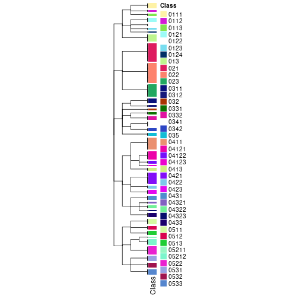</p>

</div>
<div id='tab-collect-classes-from-hierarchical-partition-2'>
<pre><code class="r">collect_classes(res_rh, merge_node = merge_node_param(min_n_signatures = 1851))
</code></pre>

<p>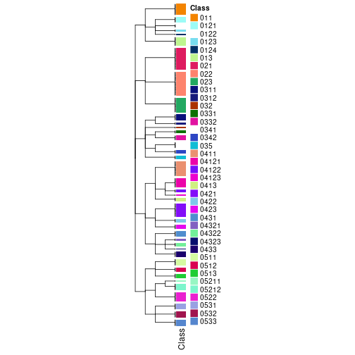</p>

</div>
<div id='tab-collect-classes-from-hierarchical-partition-3'>
<pre><code class="r">collect_classes(res_rh, merge_node = merge_node_param(min_n_signatures = 2070))
</code></pre>

<p>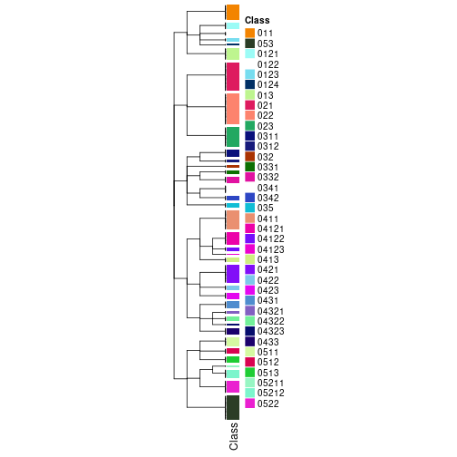</p>

</div>
<div id='tab-collect-classes-from-hierarchical-partition-4'>
<pre><code class="r">collect_classes(res_rh, merge_node = merge_node_param(min_n_signatures = 2395))
</code></pre>

<p>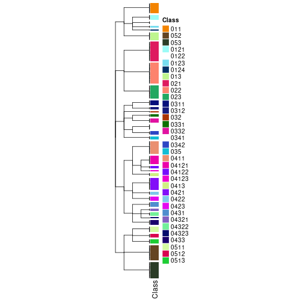</p>

</div>
<div id='tab-collect-classes-from-hierarchical-partition-5'>
<pre><code class="r">collect_classes(res_rh, merge_node = merge_node_param(min_n_signatures = 2419))
</code></pre>

<p></p>

</div>
<div id='tab-collect-classes-from-hierarchical-partition-6'>
<pre><code class="r">collect_classes(res_rh, merge_node = merge_node_param(min_n_signatures = 2941))
</code></pre>

<pre><code>#&gt; Error in lt[[hierarchy[i, 1]]]$AddChildNode({: attempt to apply non-function
</code></pre>

</div>
<div id='tab-collect-classes-from-hierarchical-partition-7'>
<pre><code class="r">collect_classes(res_rh, merge_node = merge_node_param(min_n_signatures = 3361))
</code></pre>

<pre><code>#&gt; Error in lt[[hierarchy[i, 1]]]$AddChildNode({: attempt to apply non-function
</code></pre>

</div>
<div id='tab-collect-classes-from-hierarchical-partition-8'>
<pre><code class="r">collect_classes(res_rh, merge_node = merge_node_param(min_n_signatures = 3504))
</code></pre>

<pre><code>#&gt; Error in lt[[hierarchy[i, 1]]]$AddChildNode({: attempt to apply non-function
</code></pre>

</div>
<div id='tab-collect-classes-from-hierarchical-partition-9'>
<pre><code class="r">collect_classes(res_rh, merge_node = merge_node_param(min_n_signatures = 3561))
</code></pre>

<pre><code>#&gt; Error in lt[[hierarchy[i, 1]]]$AddChildNode({: attempt to apply non-function
</code></pre>

</div>
<div id='tab-collect-classes-from-hierarchical-partition-10'>
<pre><code class="r">collect_classes(res_rh, merge_node = merge_node_param(min_n_signatures = 3580))
</code></pre>

<pre><code>#&gt; Error in lt[[hierarchy[i, 1]]]$AddChildNode({: attempt to apply non-function
</code></pre>

</div>
<div id='tab-collect-classes-from-hierarchical-partition-11'>
<pre><code class="r">collect_classes(res_rh, merge_node = merge_node_param(min_n_signatures = 5353))
</code></pre>

<pre><code>#&gt; Error in lt[[hierarchy[i, 1]]]$AddChildNode({: attempt to apply non-function
</code></pre>

</div>
<div id='tab-collect-classes-from-hierarchical-partition-12'>
<pre><code class="r">collect_classes(res_rh, merge_node = merge_node_param(min_n_signatures = 5898))
</code></pre>

<pre><code>#&gt; Error in lt[[hierarchy[i, 1]]]$AddChildNode({: attempt to apply non-function
</code></pre>

</div>
<div id='tab-collect-classes-from-hierarchical-partition-13'>
<pre><code class="r">collect_classes(res_rh, merge_node = merge_node_param(min_n_signatures = 7255))
</code></pre>

<p></p>

</div>
<div id='tab-collect-classes-from-hierarchical-partition-14'>
<pre><code class="r">collect_classes(res_rh, merge_node = merge_node_param(min_n_signatures = 8499))
</code></pre>

<p>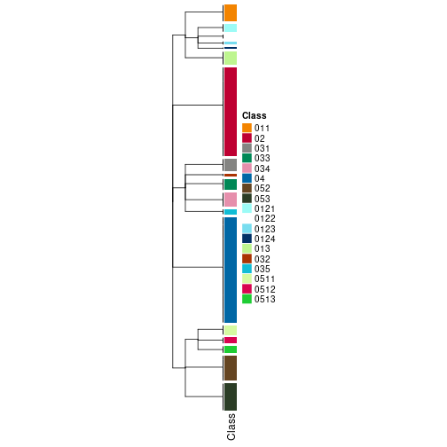</p>

</div>
<div id='tab-collect-classes-from-hierarchical-partition-15'>
<pre><code class="r">collect_classes(res_rh, merge_node = merge_node_param(min_n_signatures = 9106))
</code></pre>

<p>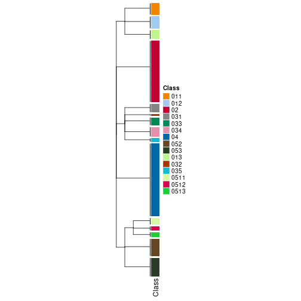</p>

</div>
<div id='tab-collect-classes-from-hierarchical-partition-16'>
<pre><code class="r">collect_classes(res_rh, merge_node = merge_node_param(min_n_signatures = 10519))
</code></pre>

<p>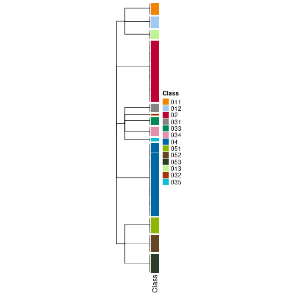</p>

</div>
<div id='tab-collect-classes-from-hierarchical-partition-17'>
<pre><code class="r">collect_classes(res_rh, merge_node = merge_node_param(min_n_signatures = 12967))
</code></pre>

<p></p>

</div>
<div id='tab-collect-classes-from-hierarchical-partition-18'>
<pre><code class="r">collect_classes(res_rh, merge_node = merge_node_param(min_n_signatures = 15755))
</code></pre>

<p>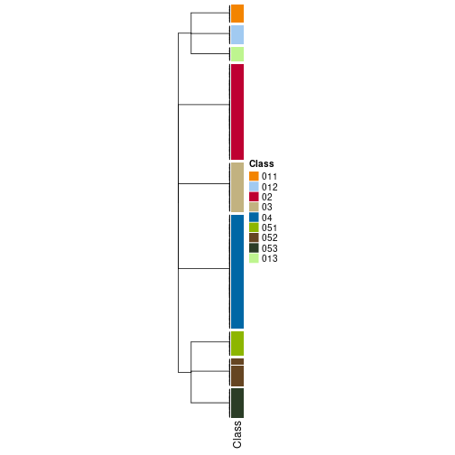</p>

</div>
<div id='tab-collect-classes-from-hierarchical-partition-19'>
<pre><code class="r">collect_classes(res_rh, merge_node = merge_node_param(min_n_signatures = 30004))
</code></pre>

<p>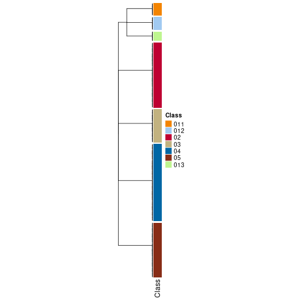</p>

</div>
<div id='tab-collect-classes-from-hierarchical-partition-20'>
<pre><code class="r">collect_classes(res_rh, merge_node = merge_node_param(min_n_signatures = 51178))
</code></pre>

<p>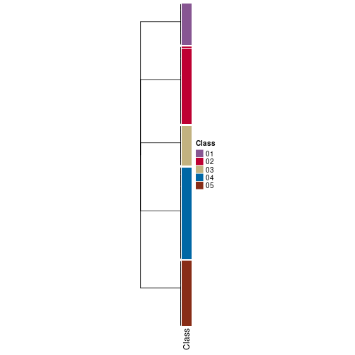</p>

</div>
</div>

Following shows the table of the partitions (You need to click the **show/hide
code output** link to see it).


<script>
$( function() {
	$( '#tabs-get-classes-from-hierarchical-partition' ).tabs();
} );
</script>
<div id='tabs-get-classes-from-hierarchical-partition'>
<ul>
<li><a href='#tab-get-classes-from-hierarchical-partition-1'>n_signatures ≥ 1446</a></li>
<li><a href='#tab-get-classes-from-hierarchical-partition-2'>n_signatures ≥ 1851</a></li>
<li><a href='#tab-get-classes-from-hierarchical-partition-3'>n_signatures ≥ 2070</a></li>
<li><a href='#tab-get-classes-from-hierarchical-partition-4'>n_signatures ≥ 2395</a></li>
<li><a href='#tab-get-classes-from-hierarchical-partition-5'>n_signatures ≥ 2419</a></li>
<li><a href='#tab-get-classes-from-hierarchical-partition-6'>n_signatures ≥ 2941</a></li>
<li><a href='#tab-get-classes-from-hierarchical-partition-7'>n_signatures ≥ 3361</a></li>
<li><a href='#tab-get-classes-from-hierarchical-partition-8'>n_signatures ≥ 3504</a></li>
<li><a href='#tab-get-classes-from-hierarchical-partition-9'>n_signatures ≥ 3561</a></li>
<li><a href='#tab-get-classes-from-hierarchical-partition-10'>n_signatures ≥ 3580</a></li>
<li><a href='#tab-get-classes-from-hierarchical-partition-11'>n_signatures ≥ 5353</a></li>
<li><a href='#tab-get-classes-from-hierarchical-partition-12'>n_signatures ≥ 5898</a></li>
<li><a href='#tab-get-classes-from-hierarchical-partition-13'>n_signatures ≥ 7255</a></li>
<li><a href='#tab-get-classes-from-hierarchical-partition-14'>n_signatures ≥ 8499</a></li>
<li><a href='#tab-get-classes-from-hierarchical-partition-15'>n_signatures ≥ 9106</a></li>
<li><a href='#tab-get-classes-from-hierarchical-partition-16'>n_signatures ≥ 10519</a></li>
<li><a href='#tab-get-classes-from-hierarchical-partition-17'>n_signatures ≥ 12967</a></li>
<li><a href='#tab-get-classes-from-hierarchical-partition-18'>n_signatures ≥ 15755</a></li>
<li><a href='#tab-get-classes-from-hierarchical-partition-19'>n_signatures ≥ 30004</a></li>
<li><a href='#tab-get-classes-from-hierarchical-partition-20'>n_signatures ≥ 51178</a></li>
</ul>

<div id='tab-get-classes-from-hierarchical-partition-1'>
<p><a id='tab-get-classes-from-hierarchical-partition-1-a' style='color:#0366d6' href='#'>show/hide code output</a></p>
<pre><code class="r">get_classes(res_rh, merge_node = merge_node_param(min_n_signatures = 1446))
</code></pre>

<pre><code>#&gt; TCGA.56.8201.01 TCGA.22.4601.01 TCGA.90.6837.01 TCGA.77.8140.01 TCGA.43.8115.01 TCGA.39.5028.01 
#&gt;           &quot;023&quot;          &quot;0522&quot;          &quot;0311&quot;          &quot;0433&quot;         &quot;04321&quot;           &quot;022&quot; 
#&gt; TCGA.39.5030.01 TCGA.22.5479.01 TCGA.85.8071.01 TCGA.63.7020.01 TCGA.6A.AB49.01 TCGA.33.4586.11 
#&gt;           &quot;021&quot;         &quot;04121&quot;          &quot;0121&quot;          &quot;0513&quot;          &quot;0512&quot;          &quot;0341&quot; 
#&gt; TCGA.77.8150.01 TCGA.79.5596.01 TCGA.18.4721.11 TCGA.33.AASI.01 TCGA.56.8083.01 TCGA.63.5131.01 
#&gt;           &quot;013&quot;          &quot;0511&quot;          &quot;0341&quot;          &quot;0421&quot;          &quot;0122&quot;          &quot;0511&quot; 
#&gt; TCGA.22.5481.01 TCGA.33.4589.01 TCGA.39.5037.11 TCGA.33.6738.01 TCGA.22.4613.01 TCGA.22.4613.11 
#&gt;          &quot;0422&quot;           &quot;021&quot;          &quot;0332&quot;           &quot;023&quot;          &quot;0513&quot;          &quot;0342&quot; 
#&gt; TCGA.77.8154.01 TCGA.33.AASL.01 TCGA.77.8138.01 TCGA.33.4586.01 TCGA.33.AASD.01 TCGA.39.5035.11 
#&gt;          &quot;0511&quot;           &quot;021&quot;           &quot;022&quot;          &quot;0411&quot;          &quot;0111&quot;          &quot;0331&quot; 
#&gt; TCGA.33.4579.11 TCGA.98.8023.01 TCGA.18.4721.01 TCGA.77.6845.01 TCGA.34.5241.01 TCGA.34.5240.01 
#&gt;          &quot;0312&quot;           &quot;022&quot;           &quot;023&quot;          &quot;0111&quot;           &quot;022&quot;         &quot;05212&quot; 
#&gt; TCGA.94.7033.01 TCGA.85.6798.01 TCGA.77.8148.01 TCGA.39.5028.11 TCGA.63.7023.01 TCGA.77.6844.01 
#&gt;          &quot;0421&quot;          &quot;0522&quot;          &quot;0123&quot;          &quot;0332&quot;           &quot;013&quot;          &quot;0511&quot; 
#&gt; TCGA.77.8136.01 TCGA.94.8035.01 TCGA.98.8022.01 TCGA.39.5035.01 TCGA.85.8049.01 TCGA.85.8070.01 
#&gt;           &quot;021&quot;          &quot;0433&quot;         &quot;04322&quot;          &quot;0421&quot;           &quot;023&quot;           &quot;013&quot; 
#&gt; TCGA.77.6842.01 TCGA.LA.A7SW.01 TCGA.63.7022.01 TCGA.56.8082.01 TCGA.63.5128.01 TCGA.77.8143.01 
#&gt;          &quot;0433&quot;          &quot;0411&quot;           &quot;021&quot;          &quot;0123&quot;          &quot;0111&quot;          &quot;0431&quot; 
#&gt; TCGA.77.6843.01 TCGA.77.8156.01 TCGA.39.5039.01 TCGA.77.8146.01 TCGA.98.8021.01 TCGA.56.A62T.01 
#&gt;          &quot;0522&quot;           &quot;022&quot;           &quot;022&quot;          &quot;0421&quot;          &quot;0423&quot;          &quot;0522&quot; 
#&gt; TCGA.33.4583.01 TCGA.33.4583.11 TCGA.85.8048.01 TCGA.85.8072.01 TCGA.33.AAS8.01 TCGA.77.8133.01 
#&gt;         &quot;05212&quot;          &quot;0341&quot;           &quot;022&quot;          &quot;0522&quot;          &quot;0512&quot;         &quot;04121&quot; 
#&gt; TCGA.39.5036.01 TCGA.77.8139.01 TCGA.39.5021.11 TCGA.39.5031.11 TCGA.98.8020.01 TCGA.33.4582.01 
#&gt;          &quot;0522&quot;          &quot;0431&quot;          &quot;0341&quot;          &quot;0342&quot;          &quot;0421&quot;          &quot;0512&quot; 
#&gt; TCGA.39.5037.01 TCGA.39.5030.11 TCGA.77.8131.01 TCGA.33.AASJ.01 TCGA.39.5011.11 TCGA.77.8130.01 
#&gt;          &quot;0531&quot;          &quot;0342&quot;           &quot;022&quot;         &quot;05212&quot;          &quot;0312&quot;          &quot;0421&quot; 
#&gt; TCGA.33.AASB.01 TCGA.43.6773.01 TCGA.63.7021.01 TCGA.XC.AA0X.01 TCGA.33.4579.01 TCGA.39.5029.01 
#&gt;         &quot;04123&quot;           &quot;022&quot;           &quot;022&quot;           &quot;021&quot;          &quot;0512&quot;          &quot;0431&quot; 
#&gt; TCGA.33.4589.11 TCGA.77.8145.01 TCGA.92.8063.01 TCGA.39.5034.11 TCGA.92.8064.01 TCGA.92.8065.01 
#&gt;          &quot;0342&quot;          &quot;0433&quot;          &quot;0411&quot;          &quot;0331&quot;         &quot;04121&quot;          &quot;0423&quot; 
#&gt; TCGA.39.5011.01 TCGA.56.7823.01 TCGA.77.8144.01 TCGA.NK.A7XE.01 TCGA.34.7107.01 TCGA.39.5034.01 
#&gt;           &quot;021&quot;          &quot;0121&quot;          &quot;0533&quot;           &quot;023&quot;          &quot;0531&quot;           &quot;021&quot; 
#&gt; TCGA.22.4599.01 TCGA.85.8052.01 TCGA.43.8116.01 TCGA.77.8128.01 TCGA.58.A46N.01 TCGA.85.7710.01 
#&gt;          &quot;0531&quot;          &quot;0411&quot;          &quot;0421&quot;           &quot;013&quot;          &quot;0111&quot;          &quot;0533&quot; 
#&gt; TCGA.21.5782.01 TCGA.52.7809.01 TCGA.22.5485.11 TCGA.22.4599.11 TCGA.52.7622.01 TCGA.22.5472.11 
#&gt;          &quot;0433&quot;          &quot;0411&quot;          &quot;0331&quot;          &quot;0342&quot;           &quot;021&quot;          &quot;0311&quot; 
#&gt; TCGA.56.A4BY.01 TCGA.58.A46M.01 TCGA.90.A4EE.01 TCGA.90.A4ED.01 TCGA.39.5040.01 TCGA.22.5473.11 
#&gt;          &quot;0522&quot;         &quot;05212&quot;           &quot;023&quot;           &quot;022&quot;           &quot;023&quot;          &quot;0341&quot; 
#&gt; TCGA.68.7755.01 TCGA.56.A4BX.01 TCGA.58.A46J.01 TCGA.85.A4PA.01 TCGA.33.4582.11 TCGA.34.5234.01 
#&gt;          &quot;0111&quot;          &quot;0121&quot;           &quot;022&quot;           &quot;032&quot;          &quot;0311&quot;           &quot;021&quot; 
#&gt; TCGA.21.5786.01 TCGA.39.5016.01 TCGA.37.5819.01 TCGA.22.5489.01 TCGA.39.5031.01 TCGA.56.7822.01 
#&gt;          &quot;0532&quot;         &quot;05212&quot;           &quot;022&quot;           &quot;022&quot;         &quot;04321&quot;          &quot;0421&quot; 
#&gt; TCGA.85.A4JC.01 TCGA.68.7756.01 TCGA.18.5592.11 TCGA.85.7698.01 TCGA.56.7730.01 TCGA.52.7811.01 
#&gt;           &quot;022&quot;          &quot;0421&quot;          &quot;0311&quot;         &quot;05212&quot;          &quot;0111&quot;           &quot;022&quot; 
#&gt; TCGA.18.5595.11 TCGA.22.4609.01 TCGA.22.5478.01 TCGA.43.3920.11 TCGA.96.A4JK.01 TCGA.22.5474.01 
#&gt;           &quot;035&quot;          &quot;0421&quot;          &quot;0433&quot;           &quot;035&quot;          &quot;0531&quot;         &quot;04121&quot; 
#&gt; TCGA.33.4566.11 TCGA.52.7812.01 TCGA.56.5898.01 TCGA.85.A4CN.01 TCGA.22.5485.01 TCGA.22.5471.01 
#&gt;          &quot;0332&quot;           &quot;023&quot;          &quot;0411&quot;         &quot;04121&quot;          &quot;0531&quot;          &quot;0533&quot; 
#&gt; TCGA.22.5472.01 TCGA.22.5477.01 TCGA.22.5473.01 TCGA.22.5491.01 TCGA.22.5492.11 TCGA.60.2697.01 
#&gt;          &quot;0421&quot;          &quot;0113&quot;          &quot;0522&quot;           &quot;013&quot;          &quot;0312&quot;           &quot;032&quot; 
#&gt; TCGA.33.4587.01 TCGA.43.5668.11 TCGA.L3.A4E7.01 TCGA.22.5477.11 TCGA.85.A4QR.01 TCGA.18.3417.01 
#&gt;          &quot;0513&quot;          &quot;0341&quot;           &quot;022&quot;          &quot;0341&quot;          &quot;0124&quot;         &quot;04122&quot; 
#&gt; TCGA.43.3394.11 TCGA.43.7657.01 TCGA.22.5491.11 TCGA.94.A4VJ.01 TCGA.22.4605.01 TCGA.43.7656.01 
#&gt;          &quot;0311&quot;          &quot;0411&quot;          &quot;0311&quot;          &quot;0532&quot;           &quot;021&quot;          &quot;0431&quot; 
#&gt; TCGA.22.4601.11 TCGA.52.7810.01 TCGA.85.7844.01 TCGA.22.5474.11 TCGA.85.7696.01 TCGA.39.5021.01 
#&gt;          &quot;0342&quot;          &quot;0512&quot;         &quot;04121&quot;           &quot;035&quot;          &quot;0531&quot;           &quot;022&quot; 
#&gt; TCGA.39.5036.11 TCGA.22.5478.11 TCGA.96.A4JL.01 TCGA.56.5897.01 TCGA.90.7766.01 TCGA.43.5670.01 
#&gt;          &quot;0341&quot;          &quot;0341&quot;           &quot;021&quot;           &quot;022&quot;          &quot;0511&quot;          &quot;0532&quot; 
#&gt; TCGA.22.5489.11 TCGA.39.5016.11 TCGA.90.7769.01 TCGA.22.5471.11 TCGA.21.5787.01 TCGA.90.7767.01 
#&gt;          &quot;0311&quot;          &quot;0332&quot;          &quot;0111&quot;          &quot;0311&quot;           &quot;022&quot;          &quot;0422&quot; 
#&gt; TCGA.22.5480.11 TCGA.22.5480.01 TCGA.85.7843.01 TCGA.21.5784.01 TCGA.85.7697.01 TCGA.94.7557.01 
#&gt;          &quot;0331&quot;          &quot;0422&quot;          &quot;0533&quot;           &quot;021&quot;           &quot;022&quot;          &quot;0433&quot; 
#&gt; TCGA.39.5029.11 TCGA.LA.A446.01 TCGA.22.5492.01 TCGA.33.4566.01 TCGA.22.5482.11 TCGA.56.7731.01 
#&gt;          &quot;0311&quot;          &quot;0411&quot;         &quot;04321&quot;          &quot;0413&quot;          &quot;0311&quot;           &quot;021&quot; 
#&gt; TCGA.43.5668.01 TCGA.85.7699.01 TCGA.22.5482.01 TCGA.18.5592.01 TCGA.18.5595.01 TCGA.43.7658.01 
#&gt;           &quot;023&quot;          &quot;0423&quot;          &quot;0522&quot;          &quot;0113&quot;           &quot;013&quot;          &quot;0422&quot; 
#&gt; TCGA.39.5039.11 TCGA.18.3417.11 TCGA.77.A5G8.01 TCGA.56.7223.01 TCGA.85.8584.01 TCGA.77.A5GH.01 
#&gt;          &quot;0341&quot;          &quot;0332&quot;         &quot;04121&quot;         &quot;05211&quot;           &quot;023&quot;          &quot;0423&quot; 
#&gt; TCGA.85.8479.01 TCGA.58.A46K.01 TCGA.96.7544.01 TCGA.43.A474.01 TCGA.22.A5C4.01 TCGA.94.7943.01 
#&gt;          &quot;0413&quot;         &quot;04121&quot;          &quot;0421&quot;          &quot;0511&quot;          &quot;0532&quot;          &quot;0512&quot; 
#&gt; TCGA.98.7454.01 TCGA.56.7222.01 TCGA.94.8491.01 TCGA.77.7335.01 TCGA.O2.A5IB.01 TCGA.77.8008.01 
#&gt;           &quot;021&quot;          &quot;0511&quot;          &quot;0413&quot;         &quot;04121&quot;          &quot;0422&quot;           &quot;022&quot; 
#&gt; TCGA.56.7579.01 TCGA.21.5783.01 TCGA.77.7138.01 TCGA.77.8007.01 TCGA.77.A5G7.01 TCGA.96.7545.01 
#&gt;          &quot;0511&quot;          &quot;0532&quot;           &quot;022&quot;           &quot;023&quot;          &quot;0421&quot;           &quot;023&quot; 
#&gt; TCGA.77.A5FZ.01 TCGA.34.A5IX.01 TCGA.85.8664.01 TCGA.77.8153.01 TCGA.77.A5G3.01 TCGA.63.A5MJ.01 
#&gt;           &quot;032&quot;         &quot;04122&quot;           &quot;013&quot;           &quot;013&quot;          &quot;0111&quot;         &quot;05212&quot; 
#&gt; TCGA.56.7582.01 TCGA.77.A5GB.01 TCGA.63.A5ML.01 TCGA.56.8504.01 TCGA.63.A5MW.01 TCGA.77.7140.01 
#&gt;          &quot;0112&quot;           &quot;022&quot;          &quot;0112&quot;         &quot;04121&quot;          &quot;0532&quot;           &quot;013&quot; 
#&gt; TCGA.77.7338.01 TCGA.77.A5G1.01 TCGA.85.8666.01 TCGA.77.7141.01 TCGA.58.8392.01 TCGA.90.A59Q.01 
#&gt;          &quot;0411&quot;           &quot;022&quot;           &quot;023&quot;          &quot;0522&quot;           &quot;013&quot;           &quot;021&quot; 
#&gt; TCGA.58.8390.01 TCGA.56.8624.01 TCGA.77.7465.01 TCGA.56.8628.01 TCGA.56.8623.01 TCGA.56.8626.01 
#&gt;          &quot;0122&quot;           &quot;022&quot;          &quot;0533&quot;         &quot;04322&quot;          &quot;0332&quot;          &quot;0411&quot; 
#&gt; TCGA.60.2704.01 TCGA.58.8393.01 TCGA.43.8118.01 TCGA.56.8304.01 TCGA.90.7964.01 TCGA.85.8582.01 
#&gt;           &quot;022&quot;           &quot;021&quot;          &quot;0411&quot;          &quot;0431&quot;          &quot;0512&quot;           &quot;023&quot; 
#&gt; TCGA.J1.A4AH.01 TCGA.94.8490.01 TCGA.63.A5MI.01 TCGA.77.A5G6.01 TCGA.NC.A5HD.01 TCGA.56.7221.01 
#&gt;          &quot;0411&quot;          &quot;0113&quot;          &quot;0513&quot;           &quot;013&quot;          &quot;0532&quot;          &quot;0511&quot; 
#&gt; TCGA.63.A5MP.01 TCGA.77.8009.01 TCGA.77.7139.01 TCGA.56.8622.01 TCGA.56.7580.01 TCGA.34.8456.01 
#&gt;         &quot;04121&quot;          &quot;0112&quot;          &quot;0121&quot;          &quot;0421&quot;         &quot;04322&quot;           &quot;013&quot; 
#&gt; TCGA.77.7337.01 TCGA.O2.A5IC.01 TCGA.43.A475.01 TCGA.85.8481.01 TCGA.56.A4BW.01 TCGA.85.8352.01 
#&gt;          &quot;0421&quot;           &quot;021&quot;           &quot;021&quot;           &quot;022&quot;          &quot;0411&quot;          &quot;0532&quot; 
#&gt; TCGA.85.8354.01 TCGA.56.A5DR.01 TCGA.63.A5MG.01 TCGA.85.8580.01 TCGA.58.8388.01 TCGA.77.A5GF.01 
#&gt;           &quot;013&quot;          &quot;0431&quot;           &quot;023&quot;           &quot;021&quot;          &quot;0422&quot;         &quot;05212&quot; 
#&gt; TCGA.63.A5MN.01 TCGA.56.A49D.01 TCGA.56.8503.01 TCGA.92.7340.01 TCGA.56.A5DS.01 TCGA.34.8454.01 
#&gt;           &quot;021&quot;          &quot;0431&quot;           &quot;021&quot;          &quot;0413&quot;           &quot;021&quot;           &quot;021&quot; 
#&gt; TCGA.63.A5MR.01 TCGA.63.A5MH.01 TCGA.34.8455.01 TCGA.37.A5EM.01 TCGA.63.A5M9.01 TCGA.92.7341.01 
#&gt;          &quot;0421&quot;           &quot;013&quot;          &quot;0421&quot;          &quot;0513&quot;          &quot;0522&quot;          &quot;0522&quot; 
#&gt; TCGA.56.8625.01 TCGA.60.2703.01 TCGA.58.8391.01 TCGA.51.6867.01 TCGA.77.7142.01 TCGA.77.A5GA.01 
#&gt;           &quot;021&quot;           &quot;022&quot;          &quot;0522&quot;          &quot;0522&quot;          &quot;0413&quot;         &quot;04121&quot; 
#&gt; TCGA.56.8629.01 TCGA.58.A46L.01 TCGA.94.A5I6.01 TCGA.85.7950.01 TCGA.33.A5GW.01 TCGA.77.7463.01 
#&gt;          &quot;0522&quot;          &quot;0411&quot;          &quot;0411&quot;          &quot;0423&quot;          &quot;0113&quot;          &quot;0431&quot; 
#&gt; TCGA.85.8277.01 TCGA.NC.A5HR.01 TCGA.85.8288.01 TCGA.85.8276.01 TCGA.58.8387.01 TCGA.43.6771.11 
#&gt;         &quot;05212&quot;          &quot;0533&quot;          &quot;0423&quot;         &quot;04121&quot;         &quot;04322&quot;          &quot;0332&quot; 
#&gt; TCGA.85.A5B5.01 TCGA.96.8169.01 TCGA.39.5019.11 TCGA.43.A56U.01 TCGA.85.A510.01 TCGA.85.6560.01 
#&gt;          &quot;0111&quot;          &quot;0433&quot;          &quot;0332&quot;           &quot;021&quot;           &quot;021&quot;           &quot;023&quot; 
#&gt; TCGA.33.6737.01 TCGA.NK.A5D1.01 TCGA.NK.A5CT.01 TCGA.O2.A52N.01 TCGA.34.5232.01 TCGA.85.A513.01 
#&gt;           &quot;023&quot;          &quot;0532&quot;           &quot;023&quot;         &quot;04122&quot;           &quot;021&quot;           &quot;021&quot; 
#&gt; TCGA.46.6026.01 TCGA.56.8307.01 TCGA.68.7757.01 TCGA.34.5928.01 TCGA.63.A5MB.01 TCGA.63.6202.01 
#&gt;          &quot;0122&quot;         &quot;04321&quot;           &quot;022&quot;          &quot;0411&quot;         &quot;05211&quot;           &quot;023&quot; 
#&gt; TCGA.85.6561.01 TCGA.43.6647.01 TCGA.85.A512.01 TCGA.96.8170.01 TCGA.NK.A5CR.01 TCGA.85.8350.01 
#&gt;         &quot;04121&quot;           &quot;021&quot;         &quot;05212&quot;           &quot;021&quot;          &quot;0123&quot;          &quot;0411&quot; 
#&gt; TCGA.NC.A5HE.01 TCGA.43.6771.01 TCGA.NC.A5HK.01 TCGA.98.A53J.01 TCGA.43.A56V.01 TCGA.63.A5MV.01 
#&gt;           &quot;023&quot;           &quot;023&quot;         &quot;04123&quot;         &quot;04121&quot;          &quot;0433&quot;          &quot;0421&quot; 
#&gt; TCGA.63.A5MT.01 TCGA.O2.A52W.01 TCGA.68.8250.01 TCGA.NC.A5HI.01 TCGA.NC.A5HH.01 TCGA.34.5927.01 
#&gt;           &quot;023&quot;         &quot;04323&quot;         &quot;04323&quot;          &quot;0513&quot;          &quot;0122&quot;          &quot;0511&quot; 
#&gt; TCGA.56.A4ZJ.01 TCGA.43.6770.01 TCGA.NC.A5HP.01 TCGA.34.5231.01 TCGA.21.A5DI.01 TCGA.L3.A524.01 
#&gt;          &quot;0331&quot;          &quot;0513&quot;          &quot;0531&quot;          &quot;0121&quot;          &quot;0421&quot;          &quot;0522&quot; 
#&gt; TCGA.63.A5MS.01 TCGA.22.5483.01 TCGA.56.6546.01 TCGA.63.A5MY.01 TCGA.56.6545.01 TCGA.33.A4WN.01 
#&gt;           &quot;023&quot;          &quot;0533&quot;           &quot;022&quot;          &quot;0123&quot;          &quot;0423&quot;          &quot;0411&quot; 
#&gt; TCGA.NC.A5HQ.01 TCGA.70.6722.01 TCGA.85.8355.01 TCGA.56.8305.01 TCGA.85.8351.01 TCGA.NC.A5HT.01 
#&gt;          &quot;0533&quot;           &quot;022&quot;           &quot;022&quot;          &quot;0411&quot;          &quot;0421&quot;          &quot;0121&quot; 
#&gt; TCGA.22.4593.01 TCGA.63.A5MU.01 TCGA.NK.A5CX.01 TCGA.39.5019.01 TCGA.39.5022.01 TCGA.43.6143.01 
#&gt;          &quot;0124&quot;          &quot;0121&quot;          &quot;0421&quot;          &quot;0411&quot;           &quot;023&quot;          &quot;0122&quot; 
#&gt; TCGA.85.8287.01 TCGA.56.8309.01 TCGA.85.6175.01 TCGA.85.A53L.01 TCGA.O2.A52Q.01 TCGA.56.8308.01 
#&gt;         &quot;04322&quot;           &quot;022&quot;           &quot;021&quot;          &quot;0411&quot;           &quot;021&quot;          &quot;0531&quot; 
#&gt; TCGA.O2.A52V.01 TCGA.39.5027.01 TCGA.85.8353.01 TCGA.NC.A5HJ.01 TCGA.34.5929.01 TCGA.68.8251.01 
#&gt;           &quot;021&quot;          &quot;0513&quot;           &quot;023&quot;           &quot;022&quot;          &quot;0511&quot;         &quot;04122&quot; 
#&gt; TCGA.85.A50Z.01 TCGA.94.A5I4.01 TCGA.34.5239.01 TCGA.98.A53B.01 TCGA.NC.A5HG.01 TCGA.34.5929.11 
#&gt;           &quot;022&quot;          &quot;0531&quot;          &quot;0423&quot;          &quot;0421&quot;          &quot;0121&quot;          &quot;0312&quot; 
#&gt; TCGA.NC.A5HL.01 TCGA.NC.A5HN.01 TCGA.60.2709.01 TCGA.63.A5MM.01 TCGA.46.6025.01 TCGA.NC.A5HF.01 
#&gt;         &quot;04121&quot;          &quot;0121&quot;           &quot;022&quot;           &quot;021&quot;          &quot;0533&quot;           &quot;013&quot; 
#&gt; TCGA.58.8386.01 TCGA.39.5024.01 TCGA.NC.A5HM.01 TCGA.68.A59J.01 TCGA.34.5236.01 TCGA.37.A5EL.01 
#&gt;          &quot;0421&quot;           &quot;021&quot;          &quot;0532&quot;          &quot;0411&quot;           &quot;022&quot;          &quot;0112&quot; 
#&gt; TCGA.NC.A5HO.01 TCGA.70.6723.01 TCGA.85.A4CL.01 TCGA.37.A5EN.01 TCGA.98.A539.01 TCGA.O2.A52S.01 
#&gt;          &quot;0533&quot;          &quot;0111&quot;          &quot;0411&quot;          &quot;0531&quot;          &quot;0411&quot;         &quot;05212&quot; 
#&gt; TCGA.85.A4QQ.01 TCGA.85.A4JB.01 TCGA.MF.A522.01 TCGA.85.A511.01 TCGA.56.A4ZK.01 TCGA.85.A50M.01 
#&gt;         &quot;04122&quot;         &quot;04322&quot;          &quot;0113&quot;           &quot;022&quot;          &quot;0411&quot;           &quot;022&quot; 
#&gt; TCGA.98.A53I.01 TCGA.98.A53D.01 TCGA.98.A53A.01 TCGA.68.A59I.01 TCGA.98.A538.01 TCGA.98.A53H.01 
#&gt;          &quot;0413&quot;           &quot;035&quot;          &quot;0533&quot;           &quot;021&quot;          &quot;0431&quot;           &quot;035&quot; 
#&gt; TCGA.98.A53C.01 
#&gt;           &quot;035&quot;
</code></pre>

<script>
$('#tab-get-classes-from-hierarchical-partition-1-a').parent().next().next().hide();
$('#tab-get-classes-from-hierarchical-partition-1-a').click(function(){
  $('#tab-get-classes-from-hierarchical-partition-1-a').parent().next().next().toggle();
  return(false);
});
</script>
</div>

<div id='tab-get-classes-from-hierarchical-partition-2'>
<p><a id='tab-get-classes-from-hierarchical-partition-2-a' style='color:#0366d6' href='#'>show/hide code output</a></p>
<pre><code class="r">get_classes(res_rh, merge_node = merge_node_param(min_n_signatures = 1851))
</code></pre>

<pre><code>#&gt; TCGA.56.8201.01 TCGA.22.4601.01 TCGA.90.6837.01 TCGA.77.8140.01 TCGA.43.8115.01 TCGA.39.5028.01 
#&gt;           &quot;023&quot;          &quot;0522&quot;          &quot;0311&quot;          &quot;0433&quot;         &quot;04321&quot;           &quot;022&quot; 
#&gt; TCGA.39.5030.01 TCGA.22.5479.01 TCGA.85.8071.01 TCGA.63.7020.01 TCGA.6A.AB49.01 TCGA.33.4586.11 
#&gt;           &quot;021&quot;         &quot;04121&quot;          &quot;0121&quot;          &quot;0513&quot;          &quot;0512&quot;          &quot;0341&quot; 
#&gt; TCGA.77.8150.01 TCGA.79.5596.01 TCGA.18.4721.11 TCGA.33.AASI.01 TCGA.56.8083.01 TCGA.63.5131.01 
#&gt;           &quot;013&quot;          &quot;0511&quot;          &quot;0341&quot;          &quot;0421&quot;          &quot;0122&quot;          &quot;0511&quot; 
#&gt; TCGA.22.5481.01 TCGA.33.4589.01 TCGA.39.5037.11 TCGA.33.6738.01 TCGA.22.4613.01 TCGA.22.4613.11 
#&gt;          &quot;0422&quot;           &quot;021&quot;          &quot;0332&quot;           &quot;023&quot;          &quot;0513&quot;          &quot;0342&quot; 
#&gt; TCGA.77.8154.01 TCGA.33.AASL.01 TCGA.77.8138.01 TCGA.33.4586.01 TCGA.33.AASD.01 TCGA.39.5035.11 
#&gt;          &quot;0511&quot;           &quot;021&quot;           &quot;022&quot;          &quot;0411&quot;           &quot;011&quot;          &quot;0331&quot; 
#&gt; TCGA.33.4579.11 TCGA.98.8023.01 TCGA.18.4721.01 TCGA.77.6845.01 TCGA.34.5241.01 TCGA.34.5240.01 
#&gt;          &quot;0312&quot;           &quot;022&quot;           &quot;023&quot;           &quot;011&quot;           &quot;022&quot;         &quot;05212&quot; 
#&gt; TCGA.94.7033.01 TCGA.85.6798.01 TCGA.77.8148.01 TCGA.39.5028.11 TCGA.63.7023.01 TCGA.77.6844.01 
#&gt;          &quot;0421&quot;          &quot;0522&quot;          &quot;0123&quot;          &quot;0332&quot;           &quot;013&quot;          &quot;0511&quot; 
#&gt; TCGA.77.8136.01 TCGA.94.8035.01 TCGA.98.8022.01 TCGA.39.5035.01 TCGA.85.8049.01 TCGA.85.8070.01 
#&gt;           &quot;021&quot;          &quot;0433&quot;         &quot;04322&quot;          &quot;0421&quot;           &quot;023&quot;           &quot;013&quot; 
#&gt; TCGA.77.6842.01 TCGA.LA.A7SW.01 TCGA.63.7022.01 TCGA.56.8082.01 TCGA.63.5128.01 TCGA.77.8143.01 
#&gt;          &quot;0433&quot;          &quot;0411&quot;           &quot;021&quot;          &quot;0123&quot;           &quot;011&quot;          &quot;0431&quot; 
#&gt; TCGA.77.6843.01 TCGA.77.8156.01 TCGA.39.5039.01 TCGA.77.8146.01 TCGA.98.8021.01 TCGA.56.A62T.01 
#&gt;          &quot;0522&quot;           &quot;022&quot;           &quot;022&quot;          &quot;0421&quot;          &quot;0423&quot;          &quot;0522&quot; 
#&gt; TCGA.33.4583.01 TCGA.33.4583.11 TCGA.85.8048.01 TCGA.85.8072.01 TCGA.33.AAS8.01 TCGA.77.8133.01 
#&gt;         &quot;05212&quot;          &quot;0341&quot;           &quot;022&quot;          &quot;0522&quot;          &quot;0512&quot;         &quot;04121&quot; 
#&gt; TCGA.39.5036.01 TCGA.77.8139.01 TCGA.39.5021.11 TCGA.39.5031.11 TCGA.98.8020.01 TCGA.33.4582.01 
#&gt;          &quot;0522&quot;          &quot;0431&quot;          &quot;0341&quot;          &quot;0342&quot;          &quot;0421&quot;          &quot;0512&quot; 
#&gt; TCGA.39.5037.01 TCGA.39.5030.11 TCGA.77.8131.01 TCGA.33.AASJ.01 TCGA.39.5011.11 TCGA.77.8130.01 
#&gt;          &quot;0531&quot;          &quot;0342&quot;           &quot;022&quot;         &quot;05212&quot;          &quot;0312&quot;          &quot;0421&quot; 
#&gt; TCGA.33.AASB.01 TCGA.43.6773.01 TCGA.63.7021.01 TCGA.XC.AA0X.01 TCGA.33.4579.01 TCGA.39.5029.01 
#&gt;         &quot;04123&quot;           &quot;022&quot;           &quot;022&quot;           &quot;021&quot;          &quot;0512&quot;          &quot;0431&quot; 
#&gt; TCGA.33.4589.11 TCGA.77.8145.01 TCGA.92.8063.01 TCGA.39.5034.11 TCGA.92.8064.01 TCGA.92.8065.01 
#&gt;          &quot;0342&quot;          &quot;0433&quot;          &quot;0411&quot;          &quot;0331&quot;         &quot;04121&quot;          &quot;0423&quot; 
#&gt; TCGA.39.5011.01 TCGA.56.7823.01 TCGA.77.8144.01 TCGA.NK.A7XE.01 TCGA.34.7107.01 TCGA.39.5034.01 
#&gt;           &quot;021&quot;          &quot;0121&quot;          &quot;0533&quot;           &quot;023&quot;          &quot;0531&quot;           &quot;021&quot; 
#&gt; TCGA.22.4599.01 TCGA.85.8052.01 TCGA.43.8116.01 TCGA.77.8128.01 TCGA.58.A46N.01 TCGA.85.7710.01 
#&gt;          &quot;0531&quot;          &quot;0411&quot;          &quot;0421&quot;           &quot;013&quot;           &quot;011&quot;          &quot;0533&quot; 
#&gt; TCGA.21.5782.01 TCGA.52.7809.01 TCGA.22.5485.11 TCGA.22.4599.11 TCGA.52.7622.01 TCGA.22.5472.11 
#&gt;          &quot;0433&quot;          &quot;0411&quot;          &quot;0331&quot;          &quot;0342&quot;           &quot;021&quot;          &quot;0311&quot; 
#&gt; TCGA.56.A4BY.01 TCGA.58.A46M.01 TCGA.90.A4EE.01 TCGA.90.A4ED.01 TCGA.39.5040.01 TCGA.22.5473.11 
#&gt;          &quot;0522&quot;         &quot;05212&quot;           &quot;023&quot;           &quot;022&quot;           &quot;023&quot;          &quot;0341&quot; 
#&gt; TCGA.68.7755.01 TCGA.56.A4BX.01 TCGA.58.A46J.01 TCGA.85.A4PA.01 TCGA.33.4582.11 TCGA.34.5234.01 
#&gt;           &quot;011&quot;          &quot;0121&quot;           &quot;022&quot;           &quot;032&quot;          &quot;0311&quot;           &quot;021&quot; 
#&gt; TCGA.21.5786.01 TCGA.39.5016.01 TCGA.37.5819.01 TCGA.22.5489.01 TCGA.39.5031.01 TCGA.56.7822.01 
#&gt;          &quot;0532&quot;         &quot;05212&quot;           &quot;022&quot;           &quot;022&quot;         &quot;04321&quot;          &quot;0421&quot; 
#&gt; TCGA.85.A4JC.01 TCGA.68.7756.01 TCGA.18.5592.11 TCGA.85.7698.01 TCGA.56.7730.01 TCGA.52.7811.01 
#&gt;           &quot;022&quot;          &quot;0421&quot;          &quot;0311&quot;         &quot;05212&quot;           &quot;011&quot;           &quot;022&quot; 
#&gt; TCGA.18.5595.11 TCGA.22.4609.01 TCGA.22.5478.01 TCGA.43.3920.11 TCGA.96.A4JK.01 TCGA.22.5474.01 
#&gt;           &quot;035&quot;          &quot;0421&quot;          &quot;0433&quot;           &quot;035&quot;          &quot;0531&quot;         &quot;04121&quot; 
#&gt; TCGA.33.4566.11 TCGA.52.7812.01 TCGA.56.5898.01 TCGA.85.A4CN.01 TCGA.22.5485.01 TCGA.22.5471.01 
#&gt;          &quot;0332&quot;           &quot;023&quot;          &quot;0411&quot;         &quot;04121&quot;          &quot;0531&quot;          &quot;0533&quot; 
#&gt; TCGA.22.5472.01 TCGA.22.5477.01 TCGA.22.5473.01 TCGA.22.5491.01 TCGA.22.5492.11 TCGA.60.2697.01 
#&gt;          &quot;0421&quot;           &quot;011&quot;          &quot;0522&quot;           &quot;013&quot;          &quot;0312&quot;           &quot;032&quot; 
#&gt; TCGA.33.4587.01 TCGA.43.5668.11 TCGA.L3.A4E7.01 TCGA.22.5477.11 TCGA.85.A4QR.01 TCGA.18.3417.01 
#&gt;          &quot;0513&quot;          &quot;0341&quot;           &quot;022&quot;          &quot;0341&quot;          &quot;0124&quot;         &quot;04122&quot; 
#&gt; TCGA.43.3394.11 TCGA.43.7657.01 TCGA.22.5491.11 TCGA.94.A4VJ.01 TCGA.22.4605.01 TCGA.43.7656.01 
#&gt;          &quot;0311&quot;          &quot;0411&quot;          &quot;0311&quot;          &quot;0532&quot;           &quot;021&quot;          &quot;0431&quot; 
#&gt; TCGA.22.4601.11 TCGA.52.7810.01 TCGA.85.7844.01 TCGA.22.5474.11 TCGA.85.7696.01 TCGA.39.5021.01 
#&gt;          &quot;0342&quot;          &quot;0512&quot;         &quot;04121&quot;           &quot;035&quot;          &quot;0531&quot;           &quot;022&quot; 
#&gt; TCGA.39.5036.11 TCGA.22.5478.11 TCGA.96.A4JL.01 TCGA.56.5897.01 TCGA.90.7766.01 TCGA.43.5670.01 
#&gt;          &quot;0341&quot;          &quot;0341&quot;           &quot;021&quot;           &quot;022&quot;          &quot;0511&quot;          &quot;0532&quot; 
#&gt; TCGA.22.5489.11 TCGA.39.5016.11 TCGA.90.7769.01 TCGA.22.5471.11 TCGA.21.5787.01 TCGA.90.7767.01 
#&gt;          &quot;0311&quot;          &quot;0332&quot;           &quot;011&quot;          &quot;0311&quot;           &quot;022&quot;          &quot;0422&quot; 
#&gt; TCGA.22.5480.11 TCGA.22.5480.01 TCGA.85.7843.01 TCGA.21.5784.01 TCGA.85.7697.01 TCGA.94.7557.01 
#&gt;          &quot;0331&quot;          &quot;0422&quot;          &quot;0533&quot;           &quot;021&quot;           &quot;022&quot;          &quot;0433&quot; 
#&gt; TCGA.39.5029.11 TCGA.LA.A446.01 TCGA.22.5492.01 TCGA.33.4566.01 TCGA.22.5482.11 TCGA.56.7731.01 
#&gt;          &quot;0311&quot;          &quot;0411&quot;         &quot;04321&quot;          &quot;0413&quot;          &quot;0311&quot;           &quot;021&quot; 
#&gt; TCGA.43.5668.01 TCGA.85.7699.01 TCGA.22.5482.01 TCGA.18.5592.01 TCGA.18.5595.01 TCGA.43.7658.01 
#&gt;           &quot;023&quot;          &quot;0423&quot;          &quot;0522&quot;           &quot;011&quot;           &quot;013&quot;          &quot;0422&quot; 
#&gt; TCGA.39.5039.11 TCGA.18.3417.11 TCGA.77.A5G8.01 TCGA.56.7223.01 TCGA.85.8584.01 TCGA.77.A5GH.01 
#&gt;          &quot;0341&quot;          &quot;0332&quot;         &quot;04121&quot;         &quot;05211&quot;           &quot;023&quot;          &quot;0423&quot; 
#&gt; TCGA.85.8479.01 TCGA.58.A46K.01 TCGA.96.7544.01 TCGA.43.A474.01 TCGA.22.A5C4.01 TCGA.94.7943.01 
#&gt;          &quot;0413&quot;         &quot;04121&quot;          &quot;0421&quot;          &quot;0511&quot;          &quot;0532&quot;          &quot;0512&quot; 
#&gt; TCGA.98.7454.01 TCGA.56.7222.01 TCGA.94.8491.01 TCGA.77.7335.01 TCGA.O2.A5IB.01 TCGA.77.8008.01 
#&gt;           &quot;021&quot;          &quot;0511&quot;          &quot;0413&quot;         &quot;04121&quot;          &quot;0422&quot;           &quot;022&quot; 
#&gt; TCGA.56.7579.01 TCGA.21.5783.01 TCGA.77.7138.01 TCGA.77.8007.01 TCGA.77.A5G7.01 TCGA.96.7545.01 
#&gt;          &quot;0511&quot;          &quot;0532&quot;           &quot;022&quot;           &quot;023&quot;          &quot;0421&quot;           &quot;023&quot; 
#&gt; TCGA.77.A5FZ.01 TCGA.34.A5IX.01 TCGA.85.8664.01 TCGA.77.8153.01 TCGA.77.A5G3.01 TCGA.63.A5MJ.01 
#&gt;           &quot;032&quot;         &quot;04122&quot;           &quot;013&quot;           &quot;013&quot;           &quot;011&quot;         &quot;05212&quot; 
#&gt; TCGA.56.7582.01 TCGA.77.A5GB.01 TCGA.63.A5ML.01 TCGA.56.8504.01 TCGA.63.A5MW.01 TCGA.77.7140.01 
#&gt;           &quot;011&quot;           &quot;022&quot;           &quot;011&quot;         &quot;04121&quot;          &quot;0532&quot;           &quot;013&quot; 
#&gt; TCGA.77.7338.01 TCGA.77.A5G1.01 TCGA.85.8666.01 TCGA.77.7141.01 TCGA.58.8392.01 TCGA.90.A59Q.01 
#&gt;          &quot;0411&quot;           &quot;022&quot;           &quot;023&quot;          &quot;0522&quot;           &quot;013&quot;           &quot;021&quot; 
#&gt; TCGA.58.8390.01 TCGA.56.8624.01 TCGA.77.7465.01 TCGA.56.8628.01 TCGA.56.8623.01 TCGA.56.8626.01 
#&gt;          &quot;0122&quot;           &quot;022&quot;          &quot;0533&quot;         &quot;04322&quot;          &quot;0332&quot;          &quot;0411&quot; 
#&gt; TCGA.60.2704.01 TCGA.58.8393.01 TCGA.43.8118.01 TCGA.56.8304.01 TCGA.90.7964.01 TCGA.85.8582.01 
#&gt;           &quot;022&quot;           &quot;021&quot;          &quot;0411&quot;          &quot;0431&quot;          &quot;0512&quot;           &quot;023&quot; 
#&gt; TCGA.J1.A4AH.01 TCGA.94.8490.01 TCGA.63.A5MI.01 TCGA.77.A5G6.01 TCGA.NC.A5HD.01 TCGA.56.7221.01 
#&gt;          &quot;0411&quot;           &quot;011&quot;          &quot;0513&quot;           &quot;013&quot;          &quot;0532&quot;          &quot;0511&quot; 
#&gt; TCGA.63.A5MP.01 TCGA.77.8009.01 TCGA.77.7139.01 TCGA.56.8622.01 TCGA.56.7580.01 TCGA.34.8456.01 
#&gt;         &quot;04121&quot;           &quot;011&quot;          &quot;0121&quot;          &quot;0421&quot;         &quot;04322&quot;           &quot;013&quot; 
#&gt; TCGA.77.7337.01 TCGA.O2.A5IC.01 TCGA.43.A475.01 TCGA.85.8481.01 TCGA.56.A4BW.01 TCGA.85.8352.01 
#&gt;          &quot;0421&quot;           &quot;021&quot;           &quot;021&quot;           &quot;022&quot;          &quot;0411&quot;          &quot;0532&quot; 
#&gt; TCGA.85.8354.01 TCGA.56.A5DR.01 TCGA.63.A5MG.01 TCGA.85.8580.01 TCGA.58.8388.01 TCGA.77.A5GF.01 
#&gt;           &quot;013&quot;          &quot;0431&quot;           &quot;023&quot;           &quot;021&quot;          &quot;0422&quot;         &quot;05212&quot; 
#&gt; TCGA.63.A5MN.01 TCGA.56.A49D.01 TCGA.56.8503.01 TCGA.92.7340.01 TCGA.56.A5DS.01 TCGA.34.8454.01 
#&gt;           &quot;021&quot;          &quot;0431&quot;           &quot;021&quot;          &quot;0413&quot;           &quot;021&quot;           &quot;021&quot; 
#&gt; TCGA.63.A5MR.01 TCGA.63.A5MH.01 TCGA.34.8455.01 TCGA.37.A5EM.01 TCGA.63.A5M9.01 TCGA.92.7341.01 
#&gt;          &quot;0421&quot;           &quot;013&quot;          &quot;0421&quot;          &quot;0513&quot;          &quot;0522&quot;          &quot;0522&quot; 
#&gt; TCGA.56.8625.01 TCGA.60.2703.01 TCGA.58.8391.01 TCGA.51.6867.01 TCGA.77.7142.01 TCGA.77.A5GA.01 
#&gt;           &quot;021&quot;           &quot;022&quot;          &quot;0522&quot;          &quot;0522&quot;          &quot;0413&quot;         &quot;04121&quot; 
#&gt; TCGA.56.8629.01 TCGA.58.A46L.01 TCGA.94.A5I6.01 TCGA.85.7950.01 TCGA.33.A5GW.01 TCGA.77.7463.01 
#&gt;          &quot;0522&quot;          &quot;0411&quot;          &quot;0411&quot;          &quot;0423&quot;           &quot;011&quot;          &quot;0431&quot; 
#&gt; TCGA.85.8277.01 TCGA.NC.A5HR.01 TCGA.85.8288.01 TCGA.85.8276.01 TCGA.58.8387.01 TCGA.43.6771.11 
#&gt;         &quot;05212&quot;          &quot;0533&quot;          &quot;0423&quot;         &quot;04121&quot;         &quot;04322&quot;          &quot;0332&quot; 
#&gt; TCGA.85.A5B5.01 TCGA.96.8169.01 TCGA.39.5019.11 TCGA.43.A56U.01 TCGA.85.A510.01 TCGA.85.6560.01 
#&gt;           &quot;011&quot;          &quot;0433&quot;          &quot;0332&quot;           &quot;021&quot;           &quot;021&quot;           &quot;023&quot; 
#&gt; TCGA.33.6737.01 TCGA.NK.A5D1.01 TCGA.NK.A5CT.01 TCGA.O2.A52N.01 TCGA.34.5232.01 TCGA.85.A513.01 
#&gt;           &quot;023&quot;          &quot;0532&quot;           &quot;023&quot;         &quot;04122&quot;           &quot;021&quot;           &quot;021&quot; 
#&gt; TCGA.46.6026.01 TCGA.56.8307.01 TCGA.68.7757.01 TCGA.34.5928.01 TCGA.63.A5MB.01 TCGA.63.6202.01 
#&gt;          &quot;0122&quot;         &quot;04321&quot;           &quot;022&quot;          &quot;0411&quot;         &quot;05211&quot;           &quot;023&quot; 
#&gt; TCGA.85.6561.01 TCGA.43.6647.01 TCGA.85.A512.01 TCGA.96.8170.01 TCGA.NK.A5CR.01 TCGA.85.8350.01 
#&gt;         &quot;04121&quot;           &quot;021&quot;         &quot;05212&quot;           &quot;021&quot;          &quot;0123&quot;          &quot;0411&quot; 
#&gt; TCGA.NC.A5HE.01 TCGA.43.6771.01 TCGA.NC.A5HK.01 TCGA.98.A53J.01 TCGA.43.A56V.01 TCGA.63.A5MV.01 
#&gt;           &quot;023&quot;           &quot;023&quot;         &quot;04123&quot;         &quot;04121&quot;          &quot;0433&quot;          &quot;0421&quot; 
#&gt; TCGA.63.A5MT.01 TCGA.O2.A52W.01 TCGA.68.8250.01 TCGA.NC.A5HI.01 TCGA.NC.A5HH.01 TCGA.34.5927.01 
#&gt;           &quot;023&quot;         &quot;04323&quot;         &quot;04323&quot;          &quot;0513&quot;          &quot;0122&quot;          &quot;0511&quot; 
#&gt; TCGA.56.A4ZJ.01 TCGA.43.6770.01 TCGA.NC.A5HP.01 TCGA.34.5231.01 TCGA.21.A5DI.01 TCGA.L3.A524.01 
#&gt;          &quot;0331&quot;          &quot;0513&quot;          &quot;0531&quot;          &quot;0121&quot;          &quot;0421&quot;          &quot;0522&quot; 
#&gt; TCGA.63.A5MS.01 TCGA.22.5483.01 TCGA.56.6546.01 TCGA.63.A5MY.01 TCGA.56.6545.01 TCGA.33.A4WN.01 
#&gt;           &quot;023&quot;          &quot;0533&quot;           &quot;022&quot;          &quot;0123&quot;          &quot;0423&quot;          &quot;0411&quot; 
#&gt; TCGA.NC.A5HQ.01 TCGA.70.6722.01 TCGA.85.8355.01 TCGA.56.8305.01 TCGA.85.8351.01 TCGA.NC.A5HT.01 
#&gt;          &quot;0533&quot;           &quot;022&quot;           &quot;022&quot;          &quot;0411&quot;          &quot;0421&quot;          &quot;0121&quot; 
#&gt; TCGA.22.4593.01 TCGA.63.A5MU.01 TCGA.NK.A5CX.01 TCGA.39.5019.01 TCGA.39.5022.01 TCGA.43.6143.01 
#&gt;          &quot;0124&quot;          &quot;0121&quot;          &quot;0421&quot;          &quot;0411&quot;           &quot;023&quot;          &quot;0122&quot; 
#&gt; TCGA.85.8287.01 TCGA.56.8309.01 TCGA.85.6175.01 TCGA.85.A53L.01 TCGA.O2.A52Q.01 TCGA.56.8308.01 
#&gt;         &quot;04322&quot;           &quot;022&quot;           &quot;021&quot;          &quot;0411&quot;           &quot;021&quot;          &quot;0531&quot; 
#&gt; TCGA.O2.A52V.01 TCGA.39.5027.01 TCGA.85.8353.01 TCGA.NC.A5HJ.01 TCGA.34.5929.01 TCGA.68.8251.01 
#&gt;           &quot;021&quot;          &quot;0513&quot;           &quot;023&quot;           &quot;022&quot;          &quot;0511&quot;         &quot;04122&quot; 
#&gt; TCGA.85.A50Z.01 TCGA.94.A5I4.01 TCGA.34.5239.01 TCGA.98.A53B.01 TCGA.NC.A5HG.01 TCGA.34.5929.11 
#&gt;           &quot;022&quot;          &quot;0531&quot;          &quot;0423&quot;          &quot;0421&quot;          &quot;0121&quot;          &quot;0312&quot; 
#&gt; TCGA.NC.A5HL.01 TCGA.NC.A5HN.01 TCGA.60.2709.01 TCGA.63.A5MM.01 TCGA.46.6025.01 TCGA.NC.A5HF.01 
#&gt;         &quot;04121&quot;          &quot;0121&quot;           &quot;022&quot;           &quot;021&quot;          &quot;0533&quot;           &quot;013&quot; 
#&gt; TCGA.58.8386.01 TCGA.39.5024.01 TCGA.NC.A5HM.01 TCGA.68.A59J.01 TCGA.34.5236.01 TCGA.37.A5EL.01 
#&gt;          &quot;0421&quot;           &quot;021&quot;          &quot;0532&quot;          &quot;0411&quot;           &quot;022&quot;           &quot;011&quot; 
#&gt; TCGA.NC.A5HO.01 TCGA.70.6723.01 TCGA.85.A4CL.01 TCGA.37.A5EN.01 TCGA.98.A539.01 TCGA.O2.A52S.01 
#&gt;          &quot;0533&quot;           &quot;011&quot;          &quot;0411&quot;          &quot;0531&quot;          &quot;0411&quot;         &quot;05212&quot; 
#&gt; TCGA.85.A4QQ.01 TCGA.85.A4JB.01 TCGA.MF.A522.01 TCGA.85.A511.01 TCGA.56.A4ZK.01 TCGA.85.A50M.01 
#&gt;         &quot;04122&quot;         &quot;04322&quot;           &quot;011&quot;           &quot;022&quot;          &quot;0411&quot;           &quot;022&quot; 
#&gt; TCGA.98.A53I.01 TCGA.98.A53D.01 TCGA.98.A53A.01 TCGA.68.A59I.01 TCGA.98.A538.01 TCGA.98.A53H.01 
#&gt;          &quot;0413&quot;           &quot;035&quot;          &quot;0533&quot;           &quot;021&quot;          &quot;0431&quot;           &quot;035&quot; 
#&gt; TCGA.98.A53C.01 
#&gt;           &quot;035&quot;
</code></pre>

<script>
$('#tab-get-classes-from-hierarchical-partition-2-a').parent().next().next().hide();
$('#tab-get-classes-from-hierarchical-partition-2-a').click(function(){
  $('#tab-get-classes-from-hierarchical-partition-2-a').parent().next().next().toggle();
  return(false);
});
</script>
</div>

<div id='tab-get-classes-from-hierarchical-partition-3'>
<p><a id='tab-get-classes-from-hierarchical-partition-3-a' style='color:#0366d6' href='#'>show/hide code output</a></p>
<pre><code class="r">get_classes(res_rh, merge_node = merge_node_param(min_n_signatures = 2070))
</code></pre>

<pre><code>#&gt; TCGA.56.8201.01 TCGA.22.4601.01 TCGA.90.6837.01 TCGA.77.8140.01 TCGA.43.8115.01 TCGA.39.5028.01 
#&gt;           &quot;023&quot;          &quot;0522&quot;          &quot;0311&quot;          &quot;0433&quot;         &quot;04321&quot;           &quot;022&quot; 
#&gt; TCGA.39.5030.01 TCGA.22.5479.01 TCGA.85.8071.01 TCGA.63.7020.01 TCGA.6A.AB49.01 TCGA.33.4586.11 
#&gt;           &quot;021&quot;         &quot;04121&quot;          &quot;0121&quot;          &quot;0513&quot;          &quot;0512&quot;          &quot;0341&quot; 
#&gt; TCGA.77.8150.01 TCGA.79.5596.01 TCGA.18.4721.11 TCGA.33.AASI.01 TCGA.56.8083.01 TCGA.63.5131.01 
#&gt;           &quot;013&quot;          &quot;0511&quot;          &quot;0341&quot;          &quot;0421&quot;          &quot;0122&quot;          &quot;0511&quot; 
#&gt; TCGA.22.5481.01 TCGA.33.4589.01 TCGA.39.5037.11 TCGA.33.6738.01 TCGA.22.4613.01 TCGA.22.4613.11 
#&gt;          &quot;0422&quot;           &quot;021&quot;          &quot;0332&quot;           &quot;023&quot;          &quot;0513&quot;          &quot;0342&quot; 
#&gt; TCGA.77.8154.01 TCGA.33.AASL.01 TCGA.77.8138.01 TCGA.33.4586.01 TCGA.33.AASD.01 TCGA.39.5035.11 
#&gt;          &quot;0511&quot;           &quot;021&quot;           &quot;022&quot;          &quot;0411&quot;           &quot;011&quot;          &quot;0331&quot; 
#&gt; TCGA.33.4579.11 TCGA.98.8023.01 TCGA.18.4721.01 TCGA.77.6845.01 TCGA.34.5241.01 TCGA.34.5240.01 
#&gt;          &quot;0312&quot;           &quot;022&quot;           &quot;023&quot;           &quot;011&quot;           &quot;022&quot;         &quot;05212&quot; 
#&gt; TCGA.94.7033.01 TCGA.85.6798.01 TCGA.77.8148.01 TCGA.39.5028.11 TCGA.63.7023.01 TCGA.77.6844.01 
#&gt;          &quot;0421&quot;          &quot;0522&quot;          &quot;0123&quot;          &quot;0332&quot;           &quot;013&quot;          &quot;0511&quot; 
#&gt; TCGA.77.8136.01 TCGA.94.8035.01 TCGA.98.8022.01 TCGA.39.5035.01 TCGA.85.8049.01 TCGA.85.8070.01 
#&gt;           &quot;021&quot;          &quot;0433&quot;         &quot;04322&quot;          &quot;0421&quot;           &quot;023&quot;           &quot;013&quot; 
#&gt; TCGA.77.6842.01 TCGA.LA.A7SW.01 TCGA.63.7022.01 TCGA.56.8082.01 TCGA.63.5128.01 TCGA.77.8143.01 
#&gt;          &quot;0433&quot;          &quot;0411&quot;           &quot;021&quot;          &quot;0123&quot;           &quot;011&quot;          &quot;0431&quot; 
#&gt; TCGA.77.6843.01 TCGA.77.8156.01 TCGA.39.5039.01 TCGA.77.8146.01 TCGA.98.8021.01 TCGA.56.A62T.01 
#&gt;          &quot;0522&quot;           &quot;022&quot;           &quot;022&quot;          &quot;0421&quot;          &quot;0423&quot;          &quot;0522&quot; 
#&gt; TCGA.33.4583.01 TCGA.33.4583.11 TCGA.85.8048.01 TCGA.85.8072.01 TCGA.33.AAS8.01 TCGA.77.8133.01 
#&gt;         &quot;05212&quot;          &quot;0341&quot;           &quot;022&quot;          &quot;0522&quot;          &quot;0512&quot;         &quot;04121&quot; 
#&gt; TCGA.39.5036.01 TCGA.77.8139.01 TCGA.39.5021.11 TCGA.39.5031.11 TCGA.98.8020.01 TCGA.33.4582.01 
#&gt;          &quot;0522&quot;          &quot;0431&quot;          &quot;0341&quot;          &quot;0342&quot;          &quot;0421&quot;          &quot;0512&quot; 
#&gt; TCGA.39.5037.01 TCGA.39.5030.11 TCGA.77.8131.01 TCGA.33.AASJ.01 TCGA.39.5011.11 TCGA.77.8130.01 
#&gt;           &quot;053&quot;          &quot;0342&quot;           &quot;022&quot;         &quot;05212&quot;          &quot;0312&quot;          &quot;0421&quot; 
#&gt; TCGA.33.AASB.01 TCGA.43.6773.01 TCGA.63.7021.01 TCGA.XC.AA0X.01 TCGA.33.4579.01 TCGA.39.5029.01 
#&gt;         &quot;04123&quot;           &quot;022&quot;           &quot;022&quot;           &quot;021&quot;          &quot;0512&quot;          &quot;0431&quot; 
#&gt; TCGA.33.4589.11 TCGA.77.8145.01 TCGA.92.8063.01 TCGA.39.5034.11 TCGA.92.8064.01 TCGA.92.8065.01 
#&gt;          &quot;0342&quot;          &quot;0433&quot;          &quot;0411&quot;          &quot;0331&quot;         &quot;04121&quot;          &quot;0423&quot; 
#&gt; TCGA.39.5011.01 TCGA.56.7823.01 TCGA.77.8144.01 TCGA.NK.A7XE.01 TCGA.34.7107.01 TCGA.39.5034.01 
#&gt;           &quot;021&quot;          &quot;0121&quot;           &quot;053&quot;           &quot;023&quot;           &quot;053&quot;           &quot;021&quot; 
#&gt; TCGA.22.4599.01 TCGA.85.8052.01 TCGA.43.8116.01 TCGA.77.8128.01 TCGA.58.A46N.01 TCGA.85.7710.01 
#&gt;           &quot;053&quot;          &quot;0411&quot;          &quot;0421&quot;           &quot;013&quot;           &quot;011&quot;           &quot;053&quot; 
#&gt; TCGA.21.5782.01 TCGA.52.7809.01 TCGA.22.5485.11 TCGA.22.4599.11 TCGA.52.7622.01 TCGA.22.5472.11 
#&gt;          &quot;0433&quot;          &quot;0411&quot;          &quot;0331&quot;          &quot;0342&quot;           &quot;021&quot;          &quot;0311&quot; 
#&gt; TCGA.56.A4BY.01 TCGA.58.A46M.01 TCGA.90.A4EE.01 TCGA.90.A4ED.01 TCGA.39.5040.01 TCGA.22.5473.11 
#&gt;          &quot;0522&quot;         &quot;05212&quot;           &quot;023&quot;           &quot;022&quot;           &quot;023&quot;          &quot;0341&quot; 
#&gt; TCGA.68.7755.01 TCGA.56.A4BX.01 TCGA.58.A46J.01 TCGA.85.A4PA.01 TCGA.33.4582.11 TCGA.34.5234.01 
#&gt;           &quot;011&quot;          &quot;0121&quot;           &quot;022&quot;           &quot;032&quot;          &quot;0311&quot;           &quot;021&quot; 
#&gt; TCGA.21.5786.01 TCGA.39.5016.01 TCGA.37.5819.01 TCGA.22.5489.01 TCGA.39.5031.01 TCGA.56.7822.01 
#&gt;           &quot;053&quot;         &quot;05212&quot;           &quot;022&quot;           &quot;022&quot;         &quot;04321&quot;          &quot;0421&quot; 
#&gt; TCGA.85.A4JC.01 TCGA.68.7756.01 TCGA.18.5592.11 TCGA.85.7698.01 TCGA.56.7730.01 TCGA.52.7811.01 
#&gt;           &quot;022&quot;          &quot;0421&quot;          &quot;0311&quot;         &quot;05212&quot;           &quot;011&quot;           &quot;022&quot; 
#&gt; TCGA.18.5595.11 TCGA.22.4609.01 TCGA.22.5478.01 TCGA.43.3920.11 TCGA.96.A4JK.01 TCGA.22.5474.01 
#&gt;           &quot;035&quot;          &quot;0421&quot;          &quot;0433&quot;           &quot;035&quot;           &quot;053&quot;         &quot;04121&quot; 
#&gt; TCGA.33.4566.11 TCGA.52.7812.01 TCGA.56.5898.01 TCGA.85.A4CN.01 TCGA.22.5485.01 TCGA.22.5471.01 
#&gt;          &quot;0332&quot;           &quot;023&quot;          &quot;0411&quot;         &quot;04121&quot;           &quot;053&quot;           &quot;053&quot; 
#&gt; TCGA.22.5472.01 TCGA.22.5477.01 TCGA.22.5473.01 TCGA.22.5491.01 TCGA.22.5492.11 TCGA.60.2697.01 
#&gt;          &quot;0421&quot;           &quot;011&quot;          &quot;0522&quot;           &quot;013&quot;          &quot;0312&quot;           &quot;032&quot; 
#&gt; TCGA.33.4587.01 TCGA.43.5668.11 TCGA.L3.A4E7.01 TCGA.22.5477.11 TCGA.85.A4QR.01 TCGA.18.3417.01 
#&gt;          &quot;0513&quot;          &quot;0341&quot;           &quot;022&quot;          &quot;0341&quot;          &quot;0124&quot;         &quot;04122&quot; 
#&gt; TCGA.43.3394.11 TCGA.43.7657.01 TCGA.22.5491.11 TCGA.94.A4VJ.01 TCGA.22.4605.01 TCGA.43.7656.01 
#&gt;          &quot;0311&quot;          &quot;0411&quot;          &quot;0311&quot;           &quot;053&quot;           &quot;021&quot;          &quot;0431&quot; 
#&gt; TCGA.22.4601.11 TCGA.52.7810.01 TCGA.85.7844.01 TCGA.22.5474.11 TCGA.85.7696.01 TCGA.39.5021.01 
#&gt;          &quot;0342&quot;          &quot;0512&quot;         &quot;04121&quot;           &quot;035&quot;           &quot;053&quot;           &quot;022&quot; 
#&gt; TCGA.39.5036.11 TCGA.22.5478.11 TCGA.96.A4JL.01 TCGA.56.5897.01 TCGA.90.7766.01 TCGA.43.5670.01 
#&gt;          &quot;0341&quot;          &quot;0341&quot;           &quot;021&quot;           &quot;022&quot;          &quot;0511&quot;           &quot;053&quot; 
#&gt; TCGA.22.5489.11 TCGA.39.5016.11 TCGA.90.7769.01 TCGA.22.5471.11 TCGA.21.5787.01 TCGA.90.7767.01 
#&gt;          &quot;0311&quot;          &quot;0332&quot;           &quot;011&quot;          &quot;0311&quot;           &quot;022&quot;          &quot;0422&quot; 
#&gt; TCGA.22.5480.11 TCGA.22.5480.01 TCGA.85.7843.01 TCGA.21.5784.01 TCGA.85.7697.01 TCGA.94.7557.01 
#&gt;          &quot;0331&quot;          &quot;0422&quot;           &quot;053&quot;           &quot;021&quot;           &quot;022&quot;          &quot;0433&quot; 
#&gt; TCGA.39.5029.11 TCGA.LA.A446.01 TCGA.22.5492.01 TCGA.33.4566.01 TCGA.22.5482.11 TCGA.56.7731.01 
#&gt;          &quot;0311&quot;          &quot;0411&quot;         &quot;04321&quot;          &quot;0413&quot;          &quot;0311&quot;           &quot;021&quot; 
#&gt; TCGA.43.5668.01 TCGA.85.7699.01 TCGA.22.5482.01 TCGA.18.5592.01 TCGA.18.5595.01 TCGA.43.7658.01 
#&gt;           &quot;023&quot;          &quot;0423&quot;          &quot;0522&quot;           &quot;011&quot;           &quot;013&quot;          &quot;0422&quot; 
#&gt; TCGA.39.5039.11 TCGA.18.3417.11 TCGA.77.A5G8.01 TCGA.56.7223.01 TCGA.85.8584.01 TCGA.77.A5GH.01 
#&gt;          &quot;0341&quot;          &quot;0332&quot;         &quot;04121&quot;         &quot;05211&quot;           &quot;023&quot;          &quot;0423&quot; 
#&gt; TCGA.85.8479.01 TCGA.58.A46K.01 TCGA.96.7544.01 TCGA.43.A474.01 TCGA.22.A5C4.01 TCGA.94.7943.01 
#&gt;          &quot;0413&quot;         &quot;04121&quot;          &quot;0421&quot;          &quot;0511&quot;           &quot;053&quot;          &quot;0512&quot; 
#&gt; TCGA.98.7454.01 TCGA.56.7222.01 TCGA.94.8491.01 TCGA.77.7335.01 TCGA.O2.A5IB.01 TCGA.77.8008.01 
#&gt;           &quot;021&quot;          &quot;0511&quot;          &quot;0413&quot;         &quot;04121&quot;          &quot;0422&quot;           &quot;022&quot; 
#&gt; TCGA.56.7579.01 TCGA.21.5783.01 TCGA.77.7138.01 TCGA.77.8007.01 TCGA.77.A5G7.01 TCGA.96.7545.01 
#&gt;          &quot;0511&quot;           &quot;053&quot;           &quot;022&quot;           &quot;023&quot;          &quot;0421&quot;           &quot;023&quot; 
#&gt; TCGA.77.A5FZ.01 TCGA.34.A5IX.01 TCGA.85.8664.01 TCGA.77.8153.01 TCGA.77.A5G3.01 TCGA.63.A5MJ.01 
#&gt;           &quot;032&quot;         &quot;04122&quot;           &quot;013&quot;           &quot;013&quot;           &quot;011&quot;         &quot;05212&quot; 
#&gt; TCGA.56.7582.01 TCGA.77.A5GB.01 TCGA.63.A5ML.01 TCGA.56.8504.01 TCGA.63.A5MW.01 TCGA.77.7140.01 
#&gt;           &quot;011&quot;           &quot;022&quot;           &quot;011&quot;         &quot;04121&quot;           &quot;053&quot;           &quot;013&quot; 
#&gt; TCGA.77.7338.01 TCGA.77.A5G1.01 TCGA.85.8666.01 TCGA.77.7141.01 TCGA.58.8392.01 TCGA.90.A59Q.01 
#&gt;          &quot;0411&quot;           &quot;022&quot;           &quot;023&quot;          &quot;0522&quot;           &quot;013&quot;           &quot;021&quot; 
#&gt; TCGA.58.8390.01 TCGA.56.8624.01 TCGA.77.7465.01 TCGA.56.8628.01 TCGA.56.8623.01 TCGA.56.8626.01 
#&gt;          &quot;0122&quot;           &quot;022&quot;           &quot;053&quot;         &quot;04322&quot;          &quot;0332&quot;          &quot;0411&quot; 
#&gt; TCGA.60.2704.01 TCGA.58.8393.01 TCGA.43.8118.01 TCGA.56.8304.01 TCGA.90.7964.01 TCGA.85.8582.01 
#&gt;           &quot;022&quot;           &quot;021&quot;          &quot;0411&quot;          &quot;0431&quot;          &quot;0512&quot;           &quot;023&quot; 
#&gt; TCGA.J1.A4AH.01 TCGA.94.8490.01 TCGA.63.A5MI.01 TCGA.77.A5G6.01 TCGA.NC.A5HD.01 TCGA.56.7221.01 
#&gt;          &quot;0411&quot;           &quot;011&quot;          &quot;0513&quot;           &quot;013&quot;           &quot;053&quot;          &quot;0511&quot; 
#&gt; TCGA.63.A5MP.01 TCGA.77.8009.01 TCGA.77.7139.01 TCGA.56.8622.01 TCGA.56.7580.01 TCGA.34.8456.01 
#&gt;         &quot;04121&quot;           &quot;011&quot;          &quot;0121&quot;          &quot;0421&quot;         &quot;04322&quot;           &quot;013&quot; 
#&gt; TCGA.77.7337.01 TCGA.O2.A5IC.01 TCGA.43.A475.01 TCGA.85.8481.01 TCGA.56.A4BW.01 TCGA.85.8352.01 
#&gt;          &quot;0421&quot;           &quot;021&quot;           &quot;021&quot;           &quot;022&quot;          &quot;0411&quot;           &quot;053&quot; 
#&gt; TCGA.85.8354.01 TCGA.56.A5DR.01 TCGA.63.A5MG.01 TCGA.85.8580.01 TCGA.58.8388.01 TCGA.77.A5GF.01 
#&gt;           &quot;013&quot;          &quot;0431&quot;           &quot;023&quot;           &quot;021&quot;          &quot;0422&quot;         &quot;05212&quot; 
#&gt; TCGA.63.A5MN.01 TCGA.56.A49D.01 TCGA.56.8503.01 TCGA.92.7340.01 TCGA.56.A5DS.01 TCGA.34.8454.01 
#&gt;           &quot;021&quot;          &quot;0431&quot;           &quot;021&quot;          &quot;0413&quot;           &quot;021&quot;           &quot;021&quot; 
#&gt; TCGA.63.A5MR.01 TCGA.63.A5MH.01 TCGA.34.8455.01 TCGA.37.A5EM.01 TCGA.63.A5M9.01 TCGA.92.7341.01 
#&gt;          &quot;0421&quot;           &quot;013&quot;          &quot;0421&quot;          &quot;0513&quot;          &quot;0522&quot;          &quot;0522&quot; 
#&gt; TCGA.56.8625.01 TCGA.60.2703.01 TCGA.58.8391.01 TCGA.51.6867.01 TCGA.77.7142.01 TCGA.77.A5GA.01 
#&gt;           &quot;021&quot;           &quot;022&quot;          &quot;0522&quot;          &quot;0522&quot;          &quot;0413&quot;         &quot;04121&quot; 
#&gt; TCGA.56.8629.01 TCGA.58.A46L.01 TCGA.94.A5I6.01 TCGA.85.7950.01 TCGA.33.A5GW.01 TCGA.77.7463.01 
#&gt;          &quot;0522&quot;          &quot;0411&quot;          &quot;0411&quot;          &quot;0423&quot;           &quot;011&quot;          &quot;0431&quot; 
#&gt; TCGA.85.8277.01 TCGA.NC.A5HR.01 TCGA.85.8288.01 TCGA.85.8276.01 TCGA.58.8387.01 TCGA.43.6771.11 
#&gt;         &quot;05212&quot;           &quot;053&quot;          &quot;0423&quot;         &quot;04121&quot;         &quot;04322&quot;          &quot;0332&quot; 
#&gt; TCGA.85.A5B5.01 TCGA.96.8169.01 TCGA.39.5019.11 TCGA.43.A56U.01 TCGA.85.A510.01 TCGA.85.6560.01 
#&gt;           &quot;011&quot;          &quot;0433&quot;          &quot;0332&quot;           &quot;021&quot;           &quot;021&quot;           &quot;023&quot; 
#&gt; TCGA.33.6737.01 TCGA.NK.A5D1.01 TCGA.NK.A5CT.01 TCGA.O2.A52N.01 TCGA.34.5232.01 TCGA.85.A513.01 
#&gt;           &quot;023&quot;           &quot;053&quot;           &quot;023&quot;         &quot;04122&quot;           &quot;021&quot;           &quot;021&quot; 
#&gt; TCGA.46.6026.01 TCGA.56.8307.01 TCGA.68.7757.01 TCGA.34.5928.01 TCGA.63.A5MB.01 TCGA.63.6202.01 
#&gt;          &quot;0122&quot;         &quot;04321&quot;           &quot;022&quot;          &quot;0411&quot;         &quot;05211&quot;           &quot;023&quot; 
#&gt; TCGA.85.6561.01 TCGA.43.6647.01 TCGA.85.A512.01 TCGA.96.8170.01 TCGA.NK.A5CR.01 TCGA.85.8350.01 
#&gt;         &quot;04121&quot;           &quot;021&quot;         &quot;05212&quot;           &quot;021&quot;          &quot;0123&quot;          &quot;0411&quot; 
#&gt; TCGA.NC.A5HE.01 TCGA.43.6771.01 TCGA.NC.A5HK.01 TCGA.98.A53J.01 TCGA.43.A56V.01 TCGA.63.A5MV.01 
#&gt;           &quot;023&quot;           &quot;023&quot;         &quot;04123&quot;         &quot;04121&quot;          &quot;0433&quot;          &quot;0421&quot; 
#&gt; TCGA.63.A5MT.01 TCGA.O2.A52W.01 TCGA.68.8250.01 TCGA.NC.A5HI.01 TCGA.NC.A5HH.01 TCGA.34.5927.01 
#&gt;           &quot;023&quot;         &quot;04323&quot;         &quot;04323&quot;          &quot;0513&quot;          &quot;0122&quot;          &quot;0511&quot; 
#&gt; TCGA.56.A4ZJ.01 TCGA.43.6770.01 TCGA.NC.A5HP.01 TCGA.34.5231.01 TCGA.21.A5DI.01 TCGA.L3.A524.01 
#&gt;          &quot;0331&quot;          &quot;0513&quot;           &quot;053&quot;          &quot;0121&quot;          &quot;0421&quot;          &quot;0522&quot; 
#&gt; TCGA.63.A5MS.01 TCGA.22.5483.01 TCGA.56.6546.01 TCGA.63.A5MY.01 TCGA.56.6545.01 TCGA.33.A4WN.01 
#&gt;           &quot;023&quot;           &quot;053&quot;           &quot;022&quot;          &quot;0123&quot;          &quot;0423&quot;          &quot;0411&quot; 
#&gt; TCGA.NC.A5HQ.01 TCGA.70.6722.01 TCGA.85.8355.01 TCGA.56.8305.01 TCGA.85.8351.01 TCGA.NC.A5HT.01 
#&gt;           &quot;053&quot;           &quot;022&quot;           &quot;022&quot;          &quot;0411&quot;          &quot;0421&quot;          &quot;0121&quot; 
#&gt; TCGA.22.4593.01 TCGA.63.A5MU.01 TCGA.NK.A5CX.01 TCGA.39.5019.01 TCGA.39.5022.01 TCGA.43.6143.01 
#&gt;          &quot;0124&quot;          &quot;0121&quot;          &quot;0421&quot;          &quot;0411&quot;           &quot;023&quot;          &quot;0122&quot; 
#&gt; TCGA.85.8287.01 TCGA.56.8309.01 TCGA.85.6175.01 TCGA.85.A53L.01 TCGA.O2.A52Q.01 TCGA.56.8308.01 
#&gt;         &quot;04322&quot;           &quot;022&quot;           &quot;021&quot;          &quot;0411&quot;           &quot;021&quot;           &quot;053&quot; 
#&gt; TCGA.O2.A52V.01 TCGA.39.5027.01 TCGA.85.8353.01 TCGA.NC.A5HJ.01 TCGA.34.5929.01 TCGA.68.8251.01 
#&gt;           &quot;021&quot;          &quot;0513&quot;           &quot;023&quot;           &quot;022&quot;          &quot;0511&quot;         &quot;04122&quot; 
#&gt; TCGA.85.A50Z.01 TCGA.94.A5I4.01 TCGA.34.5239.01 TCGA.98.A53B.01 TCGA.NC.A5HG.01 TCGA.34.5929.11 
#&gt;           &quot;022&quot;           &quot;053&quot;          &quot;0423&quot;          &quot;0421&quot;          &quot;0121&quot;          &quot;0312&quot; 
#&gt; TCGA.NC.A5HL.01 TCGA.NC.A5HN.01 TCGA.60.2709.01 TCGA.63.A5MM.01 TCGA.46.6025.01 TCGA.NC.A5HF.01 
#&gt;         &quot;04121&quot;          &quot;0121&quot;           &quot;022&quot;           &quot;021&quot;           &quot;053&quot;           &quot;013&quot; 
#&gt; TCGA.58.8386.01 TCGA.39.5024.01 TCGA.NC.A5HM.01 TCGA.68.A59J.01 TCGA.34.5236.01 TCGA.37.A5EL.01 
#&gt;          &quot;0421&quot;           &quot;021&quot;           &quot;053&quot;          &quot;0411&quot;           &quot;022&quot;           &quot;011&quot; 
#&gt; TCGA.NC.A5HO.01 TCGA.70.6723.01 TCGA.85.A4CL.01 TCGA.37.A5EN.01 TCGA.98.A539.01 TCGA.O2.A52S.01 
#&gt;           &quot;053&quot;           &quot;011&quot;          &quot;0411&quot;           &quot;053&quot;          &quot;0411&quot;         &quot;05212&quot; 
#&gt; TCGA.85.A4QQ.01 TCGA.85.A4JB.01 TCGA.MF.A522.01 TCGA.85.A511.01 TCGA.56.A4ZK.01 TCGA.85.A50M.01 
#&gt;         &quot;04122&quot;         &quot;04322&quot;           &quot;011&quot;           &quot;022&quot;          &quot;0411&quot;           &quot;022&quot; 
#&gt; TCGA.98.A53I.01 TCGA.98.A53D.01 TCGA.98.A53A.01 TCGA.68.A59I.01 TCGA.98.A538.01 TCGA.98.A53H.01 
#&gt;          &quot;0413&quot;           &quot;035&quot;           &quot;053&quot;           &quot;021&quot;          &quot;0431&quot;           &quot;035&quot; 
#&gt; TCGA.98.A53C.01 
#&gt;           &quot;035&quot;
</code></pre>

<script>
$('#tab-get-classes-from-hierarchical-partition-3-a').parent().next().next().hide();
$('#tab-get-classes-from-hierarchical-partition-3-a').click(function(){
  $('#tab-get-classes-from-hierarchical-partition-3-a').parent().next().next().toggle();
  return(false);
});
</script>
</div>

<div id='tab-get-classes-from-hierarchical-partition-4'>
<p><a id='tab-get-classes-from-hierarchical-partition-4-a' style='color:#0366d6' href='#'>show/hide code output</a></p>
<pre><code class="r">get_classes(res_rh, merge_node = merge_node_param(min_n_signatures = 2395))
</code></pre>

<pre><code>#&gt; TCGA.56.8201.01 TCGA.22.4601.01 TCGA.90.6837.01 TCGA.77.8140.01 TCGA.43.8115.01 TCGA.39.5028.01 
#&gt;           &quot;023&quot;           &quot;052&quot;          &quot;0311&quot;          &quot;0433&quot;         &quot;04321&quot;           &quot;022&quot; 
#&gt; TCGA.39.5030.01 TCGA.22.5479.01 TCGA.85.8071.01 TCGA.63.7020.01 TCGA.6A.AB49.01 TCGA.33.4586.11 
#&gt;           &quot;021&quot;         &quot;04121&quot;          &quot;0121&quot;          &quot;0513&quot;          &quot;0512&quot;          &quot;0341&quot; 
#&gt; TCGA.77.8150.01 TCGA.79.5596.01 TCGA.18.4721.11 TCGA.33.AASI.01 TCGA.56.8083.01 TCGA.63.5131.01 
#&gt;           &quot;013&quot;          &quot;0511&quot;          &quot;0341&quot;          &quot;0421&quot;          &quot;0122&quot;          &quot;0511&quot; 
#&gt; TCGA.22.5481.01 TCGA.33.4589.01 TCGA.39.5037.11 TCGA.33.6738.01 TCGA.22.4613.01 TCGA.22.4613.11 
#&gt;          &quot;0422&quot;           &quot;021&quot;          &quot;0332&quot;           &quot;023&quot;          &quot;0513&quot;          &quot;0342&quot; 
#&gt; TCGA.77.8154.01 TCGA.33.AASL.01 TCGA.77.8138.01 TCGA.33.4586.01 TCGA.33.AASD.01 TCGA.39.5035.11 
#&gt;          &quot;0511&quot;           &quot;021&quot;           &quot;022&quot;          &quot;0411&quot;           &quot;011&quot;          &quot;0331&quot; 
#&gt; TCGA.33.4579.11 TCGA.98.8023.01 TCGA.18.4721.01 TCGA.77.6845.01 TCGA.34.5241.01 TCGA.34.5240.01 
#&gt;          &quot;0312&quot;           &quot;022&quot;           &quot;023&quot;           &quot;011&quot;           &quot;022&quot;           &quot;052&quot; 
#&gt; TCGA.94.7033.01 TCGA.85.6798.01 TCGA.77.8148.01 TCGA.39.5028.11 TCGA.63.7023.01 TCGA.77.6844.01 
#&gt;          &quot;0421&quot;           &quot;052&quot;          &quot;0123&quot;          &quot;0332&quot;           &quot;013&quot;          &quot;0511&quot; 
#&gt; TCGA.77.8136.01 TCGA.94.8035.01 TCGA.98.8022.01 TCGA.39.5035.01 TCGA.85.8049.01 TCGA.85.8070.01 
#&gt;           &quot;021&quot;          &quot;0433&quot;         &quot;04322&quot;          &quot;0421&quot;           &quot;023&quot;           &quot;013&quot; 
#&gt; TCGA.77.6842.01 TCGA.LA.A7SW.01 TCGA.63.7022.01 TCGA.56.8082.01 TCGA.63.5128.01 TCGA.77.8143.01 
#&gt;          &quot;0433&quot;          &quot;0411&quot;           &quot;021&quot;          &quot;0123&quot;           &quot;011&quot;          &quot;0431&quot; 
#&gt; TCGA.77.6843.01 TCGA.77.8156.01 TCGA.39.5039.01 TCGA.77.8146.01 TCGA.98.8021.01 TCGA.56.A62T.01 
#&gt;           &quot;052&quot;           &quot;022&quot;           &quot;022&quot;          &quot;0421&quot;          &quot;0423&quot;           &quot;052&quot; 
#&gt; TCGA.33.4583.01 TCGA.33.4583.11 TCGA.85.8048.01 TCGA.85.8072.01 TCGA.33.AAS8.01 TCGA.77.8133.01 
#&gt;           &quot;052&quot;          &quot;0341&quot;           &quot;022&quot;           &quot;052&quot;          &quot;0512&quot;         &quot;04121&quot; 
#&gt; TCGA.39.5036.01 TCGA.77.8139.01 TCGA.39.5021.11 TCGA.39.5031.11 TCGA.98.8020.01 TCGA.33.4582.01 
#&gt;           &quot;052&quot;          &quot;0431&quot;          &quot;0341&quot;          &quot;0342&quot;          &quot;0421&quot;          &quot;0512&quot; 
#&gt; TCGA.39.5037.01 TCGA.39.5030.11 TCGA.77.8131.01 TCGA.33.AASJ.01 TCGA.39.5011.11 TCGA.77.8130.01 
#&gt;           &quot;053&quot;          &quot;0342&quot;           &quot;022&quot;           &quot;052&quot;          &quot;0312&quot;          &quot;0421&quot; 
#&gt; TCGA.33.AASB.01 TCGA.43.6773.01 TCGA.63.7021.01 TCGA.XC.AA0X.01 TCGA.33.4579.01 TCGA.39.5029.01 
#&gt;         &quot;04123&quot;           &quot;022&quot;           &quot;022&quot;           &quot;021&quot;          &quot;0512&quot;          &quot;0431&quot; 
#&gt; TCGA.33.4589.11 TCGA.77.8145.01 TCGA.92.8063.01 TCGA.39.5034.11 TCGA.92.8064.01 TCGA.92.8065.01 
#&gt;          &quot;0342&quot;          &quot;0433&quot;          &quot;0411&quot;          &quot;0331&quot;         &quot;04121&quot;          &quot;0423&quot; 
#&gt; TCGA.39.5011.01 TCGA.56.7823.01 TCGA.77.8144.01 TCGA.NK.A7XE.01 TCGA.34.7107.01 TCGA.39.5034.01 
#&gt;           &quot;021&quot;          &quot;0121&quot;           &quot;053&quot;           &quot;023&quot;           &quot;053&quot;           &quot;021&quot; 
#&gt; TCGA.22.4599.01 TCGA.85.8052.01 TCGA.43.8116.01 TCGA.77.8128.01 TCGA.58.A46N.01 TCGA.85.7710.01 
#&gt;           &quot;053&quot;          &quot;0411&quot;          &quot;0421&quot;           &quot;013&quot;           &quot;011&quot;           &quot;053&quot; 
#&gt; TCGA.21.5782.01 TCGA.52.7809.01 TCGA.22.5485.11 TCGA.22.4599.11 TCGA.52.7622.01 TCGA.22.5472.11 
#&gt;          &quot;0433&quot;          &quot;0411&quot;          &quot;0331&quot;          &quot;0342&quot;           &quot;021&quot;          &quot;0311&quot; 
#&gt; TCGA.56.A4BY.01 TCGA.58.A46M.01 TCGA.90.A4EE.01 TCGA.90.A4ED.01 TCGA.39.5040.01 TCGA.22.5473.11 
#&gt;           &quot;052&quot;           &quot;052&quot;           &quot;023&quot;           &quot;022&quot;           &quot;023&quot;          &quot;0341&quot; 
#&gt; TCGA.68.7755.01 TCGA.56.A4BX.01 TCGA.58.A46J.01 TCGA.85.A4PA.01 TCGA.33.4582.11 TCGA.34.5234.01 
#&gt;           &quot;011&quot;          &quot;0121&quot;           &quot;022&quot;           &quot;032&quot;          &quot;0311&quot;           &quot;021&quot; 
#&gt; TCGA.21.5786.01 TCGA.39.5016.01 TCGA.37.5819.01 TCGA.22.5489.01 TCGA.39.5031.01 TCGA.56.7822.01 
#&gt;           &quot;053&quot;           &quot;052&quot;           &quot;022&quot;           &quot;022&quot;         &quot;04321&quot;          &quot;0421&quot; 
#&gt; TCGA.85.A4JC.01 TCGA.68.7756.01 TCGA.18.5592.11 TCGA.85.7698.01 TCGA.56.7730.01 TCGA.52.7811.01 
#&gt;           &quot;022&quot;          &quot;0421&quot;          &quot;0311&quot;           &quot;052&quot;           &quot;011&quot;           &quot;022&quot; 
#&gt; TCGA.18.5595.11 TCGA.22.4609.01 TCGA.22.5478.01 TCGA.43.3920.11 TCGA.96.A4JK.01 TCGA.22.5474.01 
#&gt;           &quot;035&quot;          &quot;0421&quot;          &quot;0433&quot;           &quot;035&quot;           &quot;053&quot;         &quot;04121&quot; 
#&gt; TCGA.33.4566.11 TCGA.52.7812.01 TCGA.56.5898.01 TCGA.85.A4CN.01 TCGA.22.5485.01 TCGA.22.5471.01 
#&gt;          &quot;0332&quot;           &quot;023&quot;          &quot;0411&quot;         &quot;04121&quot;           &quot;053&quot;           &quot;053&quot; 
#&gt; TCGA.22.5472.01 TCGA.22.5477.01 TCGA.22.5473.01 TCGA.22.5491.01 TCGA.22.5492.11 TCGA.60.2697.01 
#&gt;          &quot;0421&quot;           &quot;011&quot;           &quot;052&quot;           &quot;013&quot;          &quot;0312&quot;           &quot;032&quot; 
#&gt; TCGA.33.4587.01 TCGA.43.5668.11 TCGA.L3.A4E7.01 TCGA.22.5477.11 TCGA.85.A4QR.01 TCGA.18.3417.01 
#&gt;          &quot;0513&quot;          &quot;0341&quot;           &quot;022&quot;          &quot;0341&quot;          &quot;0124&quot;         &quot;04122&quot; 
#&gt; TCGA.43.3394.11 TCGA.43.7657.01 TCGA.22.5491.11 TCGA.94.A4VJ.01 TCGA.22.4605.01 TCGA.43.7656.01 
#&gt;          &quot;0311&quot;          &quot;0411&quot;          &quot;0311&quot;           &quot;053&quot;           &quot;021&quot;          &quot;0431&quot; 
#&gt; TCGA.22.4601.11 TCGA.52.7810.01 TCGA.85.7844.01 TCGA.22.5474.11 TCGA.85.7696.01 TCGA.39.5021.01 
#&gt;          &quot;0342&quot;          &quot;0512&quot;         &quot;04121&quot;           &quot;035&quot;           &quot;053&quot;           &quot;022&quot; 
#&gt; TCGA.39.5036.11 TCGA.22.5478.11 TCGA.96.A4JL.01 TCGA.56.5897.01 TCGA.90.7766.01 TCGA.43.5670.01 
#&gt;          &quot;0341&quot;          &quot;0341&quot;           &quot;021&quot;           &quot;022&quot;          &quot;0511&quot;           &quot;053&quot; 
#&gt; TCGA.22.5489.11 TCGA.39.5016.11 TCGA.90.7769.01 TCGA.22.5471.11 TCGA.21.5787.01 TCGA.90.7767.01 
#&gt;          &quot;0311&quot;          &quot;0332&quot;           &quot;011&quot;          &quot;0311&quot;           &quot;022&quot;          &quot;0422&quot; 
#&gt; TCGA.22.5480.11 TCGA.22.5480.01 TCGA.85.7843.01 TCGA.21.5784.01 TCGA.85.7697.01 TCGA.94.7557.01 
#&gt;          &quot;0331&quot;          &quot;0422&quot;           &quot;053&quot;           &quot;021&quot;           &quot;022&quot;          &quot;0433&quot; 
#&gt; TCGA.39.5029.11 TCGA.LA.A446.01 TCGA.22.5492.01 TCGA.33.4566.01 TCGA.22.5482.11 TCGA.56.7731.01 
#&gt;          &quot;0311&quot;          &quot;0411&quot;         &quot;04321&quot;          &quot;0413&quot;          &quot;0311&quot;           &quot;021&quot; 
#&gt; TCGA.43.5668.01 TCGA.85.7699.01 TCGA.22.5482.01 TCGA.18.5592.01 TCGA.18.5595.01 TCGA.43.7658.01 
#&gt;           &quot;023&quot;          &quot;0423&quot;           &quot;052&quot;           &quot;011&quot;           &quot;013&quot;          &quot;0422&quot; 
#&gt; TCGA.39.5039.11 TCGA.18.3417.11 TCGA.77.A5G8.01 TCGA.56.7223.01 TCGA.85.8584.01 TCGA.77.A5GH.01 
#&gt;          &quot;0341&quot;          &quot;0332&quot;         &quot;04121&quot;           &quot;052&quot;           &quot;023&quot;          &quot;0423&quot; 
#&gt; TCGA.85.8479.01 TCGA.58.A46K.01 TCGA.96.7544.01 TCGA.43.A474.01 TCGA.22.A5C4.01 TCGA.94.7943.01 
#&gt;          &quot;0413&quot;         &quot;04121&quot;          &quot;0421&quot;          &quot;0511&quot;           &quot;053&quot;          &quot;0512&quot; 
#&gt; TCGA.98.7454.01 TCGA.56.7222.01 TCGA.94.8491.01 TCGA.77.7335.01 TCGA.O2.A5IB.01 TCGA.77.8008.01 
#&gt;           &quot;021&quot;          &quot;0511&quot;          &quot;0413&quot;         &quot;04121&quot;          &quot;0422&quot;           &quot;022&quot; 
#&gt; TCGA.56.7579.01 TCGA.21.5783.01 TCGA.77.7138.01 TCGA.77.8007.01 TCGA.77.A5G7.01 TCGA.96.7545.01 
#&gt;          &quot;0511&quot;           &quot;053&quot;           &quot;022&quot;           &quot;023&quot;          &quot;0421&quot;           &quot;023&quot; 
#&gt; TCGA.77.A5FZ.01 TCGA.34.A5IX.01 TCGA.85.8664.01 TCGA.77.8153.01 TCGA.77.A5G3.01 TCGA.63.A5MJ.01 
#&gt;           &quot;032&quot;         &quot;04122&quot;           &quot;013&quot;           &quot;013&quot;           &quot;011&quot;           &quot;052&quot; 
#&gt; TCGA.56.7582.01 TCGA.77.A5GB.01 TCGA.63.A5ML.01 TCGA.56.8504.01 TCGA.63.A5MW.01 TCGA.77.7140.01 
#&gt;           &quot;011&quot;           &quot;022&quot;           &quot;011&quot;         &quot;04121&quot;           &quot;053&quot;           &quot;013&quot; 
#&gt; TCGA.77.7338.01 TCGA.77.A5G1.01 TCGA.85.8666.01 TCGA.77.7141.01 TCGA.58.8392.01 TCGA.90.A59Q.01 
#&gt;          &quot;0411&quot;           &quot;022&quot;           &quot;023&quot;           &quot;052&quot;           &quot;013&quot;           &quot;021&quot; 
#&gt; TCGA.58.8390.01 TCGA.56.8624.01 TCGA.77.7465.01 TCGA.56.8628.01 TCGA.56.8623.01 TCGA.56.8626.01 
#&gt;          &quot;0122&quot;           &quot;022&quot;           &quot;053&quot;         &quot;04322&quot;          &quot;0332&quot;          &quot;0411&quot; 
#&gt; TCGA.60.2704.01 TCGA.58.8393.01 TCGA.43.8118.01 TCGA.56.8304.01 TCGA.90.7964.01 TCGA.85.8582.01 
#&gt;           &quot;022&quot;           &quot;021&quot;          &quot;0411&quot;          &quot;0431&quot;          &quot;0512&quot;           &quot;023&quot; 
#&gt; TCGA.J1.A4AH.01 TCGA.94.8490.01 TCGA.63.A5MI.01 TCGA.77.A5G6.01 TCGA.NC.A5HD.01 TCGA.56.7221.01 
#&gt;          &quot;0411&quot;           &quot;011&quot;          &quot;0513&quot;           &quot;013&quot;           &quot;053&quot;          &quot;0511&quot; 
#&gt; TCGA.63.A5MP.01 TCGA.77.8009.01 TCGA.77.7139.01 TCGA.56.8622.01 TCGA.56.7580.01 TCGA.34.8456.01 
#&gt;         &quot;04121&quot;           &quot;011&quot;          &quot;0121&quot;          &quot;0421&quot;         &quot;04322&quot;           &quot;013&quot; 
#&gt; TCGA.77.7337.01 TCGA.O2.A5IC.01 TCGA.43.A475.01 TCGA.85.8481.01 TCGA.56.A4BW.01 TCGA.85.8352.01 
#&gt;          &quot;0421&quot;           &quot;021&quot;           &quot;021&quot;           &quot;022&quot;          &quot;0411&quot;           &quot;053&quot; 
#&gt; TCGA.85.8354.01 TCGA.56.A5DR.01 TCGA.63.A5MG.01 TCGA.85.8580.01 TCGA.58.8388.01 TCGA.77.A5GF.01 
#&gt;           &quot;013&quot;          &quot;0431&quot;           &quot;023&quot;           &quot;021&quot;          &quot;0422&quot;           &quot;052&quot; 
#&gt; TCGA.63.A5MN.01 TCGA.56.A49D.01 TCGA.56.8503.01 TCGA.92.7340.01 TCGA.56.A5DS.01 TCGA.34.8454.01 
#&gt;           &quot;021&quot;          &quot;0431&quot;           &quot;021&quot;          &quot;0413&quot;           &quot;021&quot;           &quot;021&quot; 
#&gt; TCGA.63.A5MR.01 TCGA.63.A5MH.01 TCGA.34.8455.01 TCGA.37.A5EM.01 TCGA.63.A5M9.01 TCGA.92.7341.01 
#&gt;          &quot;0421&quot;           &quot;013&quot;          &quot;0421&quot;          &quot;0513&quot;           &quot;052&quot;           &quot;052&quot; 
#&gt; TCGA.56.8625.01 TCGA.60.2703.01 TCGA.58.8391.01 TCGA.51.6867.01 TCGA.77.7142.01 TCGA.77.A5GA.01 
#&gt;           &quot;021&quot;           &quot;022&quot;           &quot;052&quot;           &quot;052&quot;          &quot;0413&quot;         &quot;04121&quot; 
#&gt; TCGA.56.8629.01 TCGA.58.A46L.01 TCGA.94.A5I6.01 TCGA.85.7950.01 TCGA.33.A5GW.01 TCGA.77.7463.01 
#&gt;           &quot;052&quot;          &quot;0411&quot;          &quot;0411&quot;          &quot;0423&quot;           &quot;011&quot;          &quot;0431&quot; 
#&gt; TCGA.85.8277.01 TCGA.NC.A5HR.01 TCGA.85.8288.01 TCGA.85.8276.01 TCGA.58.8387.01 TCGA.43.6771.11 
#&gt;           &quot;052&quot;           &quot;053&quot;          &quot;0423&quot;         &quot;04121&quot;         &quot;04322&quot;          &quot;0332&quot; 
#&gt; TCGA.85.A5B5.01 TCGA.96.8169.01 TCGA.39.5019.11 TCGA.43.A56U.01 TCGA.85.A510.01 TCGA.85.6560.01 
#&gt;           &quot;011&quot;          &quot;0433&quot;          &quot;0332&quot;           &quot;021&quot;           &quot;021&quot;           &quot;023&quot; 
#&gt; TCGA.33.6737.01 TCGA.NK.A5D1.01 TCGA.NK.A5CT.01 TCGA.O2.A52N.01 TCGA.34.5232.01 TCGA.85.A513.01 
#&gt;           &quot;023&quot;           &quot;053&quot;           &quot;023&quot;         &quot;04122&quot;           &quot;021&quot;           &quot;021&quot; 
#&gt; TCGA.46.6026.01 TCGA.56.8307.01 TCGA.68.7757.01 TCGA.34.5928.01 TCGA.63.A5MB.01 TCGA.63.6202.01 
#&gt;          &quot;0122&quot;         &quot;04321&quot;           &quot;022&quot;          &quot;0411&quot;           &quot;052&quot;           &quot;023&quot; 
#&gt; TCGA.85.6561.01 TCGA.43.6647.01 TCGA.85.A512.01 TCGA.96.8170.01 TCGA.NK.A5CR.01 TCGA.85.8350.01 
#&gt;         &quot;04121&quot;           &quot;021&quot;           &quot;052&quot;           &quot;021&quot;          &quot;0123&quot;          &quot;0411&quot; 
#&gt; TCGA.NC.A5HE.01 TCGA.43.6771.01 TCGA.NC.A5HK.01 TCGA.98.A53J.01 TCGA.43.A56V.01 TCGA.63.A5MV.01 
#&gt;           &quot;023&quot;           &quot;023&quot;         &quot;04123&quot;         &quot;04121&quot;          &quot;0433&quot;          &quot;0421&quot; 
#&gt; TCGA.63.A5MT.01 TCGA.O2.A52W.01 TCGA.68.8250.01 TCGA.NC.A5HI.01 TCGA.NC.A5HH.01 TCGA.34.5927.01 
#&gt;           &quot;023&quot;         &quot;04323&quot;         &quot;04323&quot;          &quot;0513&quot;          &quot;0122&quot;          &quot;0511&quot; 
#&gt; TCGA.56.A4ZJ.01 TCGA.43.6770.01 TCGA.NC.A5HP.01 TCGA.34.5231.01 TCGA.21.A5DI.01 TCGA.L3.A524.01 
#&gt;          &quot;0331&quot;          &quot;0513&quot;           &quot;053&quot;          &quot;0121&quot;          &quot;0421&quot;           &quot;052&quot; 
#&gt; TCGA.63.A5MS.01 TCGA.22.5483.01 TCGA.56.6546.01 TCGA.63.A5MY.01 TCGA.56.6545.01 TCGA.33.A4WN.01 
#&gt;           &quot;023&quot;           &quot;053&quot;           &quot;022&quot;          &quot;0123&quot;          &quot;0423&quot;          &quot;0411&quot; 
#&gt; TCGA.NC.A5HQ.01 TCGA.70.6722.01 TCGA.85.8355.01 TCGA.56.8305.01 TCGA.85.8351.01 TCGA.NC.A5HT.01 
#&gt;           &quot;053&quot;           &quot;022&quot;           &quot;022&quot;          &quot;0411&quot;          &quot;0421&quot;          &quot;0121&quot; 
#&gt; TCGA.22.4593.01 TCGA.63.A5MU.01 TCGA.NK.A5CX.01 TCGA.39.5019.01 TCGA.39.5022.01 TCGA.43.6143.01 
#&gt;          &quot;0124&quot;          &quot;0121&quot;          &quot;0421&quot;          &quot;0411&quot;           &quot;023&quot;          &quot;0122&quot; 
#&gt; TCGA.85.8287.01 TCGA.56.8309.01 TCGA.85.6175.01 TCGA.85.A53L.01 TCGA.O2.A52Q.01 TCGA.56.8308.01 
#&gt;         &quot;04322&quot;           &quot;022&quot;           &quot;021&quot;          &quot;0411&quot;           &quot;021&quot;           &quot;053&quot; 
#&gt; TCGA.O2.A52V.01 TCGA.39.5027.01 TCGA.85.8353.01 TCGA.NC.A5HJ.01 TCGA.34.5929.01 TCGA.68.8251.01 
#&gt;           &quot;021&quot;          &quot;0513&quot;           &quot;023&quot;           &quot;022&quot;          &quot;0511&quot;         &quot;04122&quot; 
#&gt; TCGA.85.A50Z.01 TCGA.94.A5I4.01 TCGA.34.5239.01 TCGA.98.A53B.01 TCGA.NC.A5HG.01 TCGA.34.5929.11 
#&gt;           &quot;022&quot;           &quot;053&quot;          &quot;0423&quot;          &quot;0421&quot;          &quot;0121&quot;          &quot;0312&quot; 
#&gt; TCGA.NC.A5HL.01 TCGA.NC.A5HN.01 TCGA.60.2709.01 TCGA.63.A5MM.01 TCGA.46.6025.01 TCGA.NC.A5HF.01 
#&gt;         &quot;04121&quot;          &quot;0121&quot;           &quot;022&quot;           &quot;021&quot;           &quot;053&quot;           &quot;013&quot; 
#&gt; TCGA.58.8386.01 TCGA.39.5024.01 TCGA.NC.A5HM.01 TCGA.68.A59J.01 TCGA.34.5236.01 TCGA.37.A5EL.01 
#&gt;          &quot;0421&quot;           &quot;021&quot;           &quot;053&quot;          &quot;0411&quot;           &quot;022&quot;           &quot;011&quot; 
#&gt; TCGA.NC.A5HO.01 TCGA.70.6723.01 TCGA.85.A4CL.01 TCGA.37.A5EN.01 TCGA.98.A539.01 TCGA.O2.A52S.01 
#&gt;           &quot;053&quot;           &quot;011&quot;          &quot;0411&quot;           &quot;053&quot;          &quot;0411&quot;           &quot;052&quot; 
#&gt; TCGA.85.A4QQ.01 TCGA.85.A4JB.01 TCGA.MF.A522.01 TCGA.85.A511.01 TCGA.56.A4ZK.01 TCGA.85.A50M.01 
#&gt;         &quot;04122&quot;         &quot;04322&quot;           &quot;011&quot;           &quot;022&quot;          &quot;0411&quot;           &quot;022&quot; 
#&gt; TCGA.98.A53I.01 TCGA.98.A53D.01 TCGA.98.A53A.01 TCGA.68.A59I.01 TCGA.98.A538.01 TCGA.98.A53H.01 
#&gt;          &quot;0413&quot;           &quot;035&quot;           &quot;053&quot;           &quot;021&quot;          &quot;0431&quot;           &quot;035&quot; 
#&gt; TCGA.98.A53C.01 
#&gt;           &quot;035&quot;
</code></pre>

<script>
$('#tab-get-classes-from-hierarchical-partition-4-a').parent().next().next().hide();
$('#tab-get-classes-from-hierarchical-partition-4-a').click(function(){
  $('#tab-get-classes-from-hierarchical-partition-4-a').parent().next().next().toggle();
  return(false);
});
</script>
</div>

<div id='tab-get-classes-from-hierarchical-partition-5'>
<p><a id='tab-get-classes-from-hierarchical-partition-5-a' style='color:#0366d6' href='#'>show/hide code output</a></p>
<pre><code class="r">get_classes(res_rh, merge_node = merge_node_param(min_n_signatures = 2419))
</code></pre>

<pre><code>#&gt; TCGA.56.8201.01 TCGA.22.4601.01 TCGA.90.6837.01 TCGA.77.8140.01 TCGA.43.8115.01 TCGA.39.5028.01 
#&gt;           &quot;023&quot;           &quot;052&quot;          &quot;0311&quot;          &quot;0433&quot;         &quot;04321&quot;           &quot;022&quot; 
#&gt; TCGA.39.5030.01 TCGA.22.5479.01 TCGA.85.8071.01 TCGA.63.7020.01 TCGA.6A.AB49.01 TCGA.33.4586.11 
#&gt;           &quot;021&quot;         &quot;04121&quot;          &quot;0121&quot;          &quot;0513&quot;          &quot;0512&quot;          &quot;0341&quot; 
#&gt; TCGA.77.8150.01 TCGA.79.5596.01 TCGA.18.4721.11 TCGA.33.AASI.01 TCGA.56.8083.01 TCGA.63.5131.01 
#&gt;           &quot;013&quot;          &quot;0511&quot;          &quot;0341&quot;          &quot;0421&quot;          &quot;0122&quot;          &quot;0511&quot; 
#&gt; TCGA.22.5481.01 TCGA.33.4589.01 TCGA.39.5037.11 TCGA.33.6738.01 TCGA.22.4613.01 TCGA.22.4613.11 
#&gt;          &quot;0422&quot;           &quot;021&quot;          &quot;0332&quot;           &quot;023&quot;          &quot;0513&quot;          &quot;0342&quot; 
#&gt; TCGA.77.8154.01 TCGA.33.AASL.01 TCGA.77.8138.01 TCGA.33.4586.01 TCGA.33.AASD.01 TCGA.39.5035.11 
#&gt;          &quot;0511&quot;           &quot;021&quot;           &quot;022&quot;          &quot;0411&quot;           &quot;011&quot;          &quot;0331&quot; 
#&gt; TCGA.33.4579.11 TCGA.98.8023.01 TCGA.18.4721.01 TCGA.77.6845.01 TCGA.34.5241.01 TCGA.34.5240.01 
#&gt;          &quot;0312&quot;           &quot;022&quot;           &quot;023&quot;           &quot;011&quot;           &quot;022&quot;           &quot;052&quot; 
#&gt; TCGA.94.7033.01 TCGA.85.6798.01 TCGA.77.8148.01 TCGA.39.5028.11 TCGA.63.7023.01 TCGA.77.6844.01 
#&gt;          &quot;0421&quot;           &quot;052&quot;          &quot;0123&quot;          &quot;0332&quot;           &quot;013&quot;          &quot;0511&quot; 
#&gt; TCGA.77.8136.01 TCGA.94.8035.01 TCGA.98.8022.01 TCGA.39.5035.01 TCGA.85.8049.01 TCGA.85.8070.01 
#&gt;           &quot;021&quot;          &quot;0433&quot;         &quot;04322&quot;          &quot;0421&quot;           &quot;023&quot;           &quot;013&quot; 
#&gt; TCGA.77.6842.01 TCGA.LA.A7SW.01 TCGA.63.7022.01 TCGA.56.8082.01 TCGA.63.5128.01 TCGA.77.8143.01 
#&gt;          &quot;0433&quot;          &quot;0411&quot;           &quot;021&quot;          &quot;0123&quot;           &quot;011&quot;          &quot;0431&quot; 
#&gt; TCGA.77.6843.01 TCGA.77.8156.01 TCGA.39.5039.01 TCGA.77.8146.01 TCGA.98.8021.01 TCGA.56.A62T.01 
#&gt;           &quot;052&quot;           &quot;022&quot;           &quot;022&quot;          &quot;0421&quot;          &quot;0423&quot;           &quot;052&quot; 
#&gt; TCGA.33.4583.01 TCGA.33.4583.11 TCGA.85.8048.01 TCGA.85.8072.01 TCGA.33.AAS8.01 TCGA.77.8133.01 
#&gt;           &quot;052&quot;          &quot;0341&quot;           &quot;022&quot;           &quot;052&quot;          &quot;0512&quot;         &quot;04121&quot; 
#&gt; TCGA.39.5036.01 TCGA.77.8139.01 TCGA.39.5021.11 TCGA.39.5031.11 TCGA.98.8020.01 TCGA.33.4582.01 
#&gt;           &quot;052&quot;          &quot;0431&quot;          &quot;0341&quot;          &quot;0342&quot;          &quot;0421&quot;          &quot;0512&quot; 
#&gt; TCGA.39.5037.01 TCGA.39.5030.11 TCGA.77.8131.01 TCGA.33.AASJ.01 TCGA.39.5011.11 TCGA.77.8130.01 
#&gt;           &quot;053&quot;          &quot;0342&quot;           &quot;022&quot;           &quot;052&quot;          &quot;0312&quot;          &quot;0421&quot; 
#&gt; TCGA.33.AASB.01 TCGA.43.6773.01 TCGA.63.7021.01 TCGA.XC.AA0X.01 TCGA.33.4579.01 TCGA.39.5029.01 
#&gt;         &quot;04123&quot;           &quot;022&quot;           &quot;022&quot;           &quot;021&quot;          &quot;0512&quot;          &quot;0431&quot; 
#&gt; TCGA.33.4589.11 TCGA.77.8145.01 TCGA.92.8063.01 TCGA.39.5034.11 TCGA.92.8064.01 TCGA.92.8065.01 
#&gt;          &quot;0342&quot;          &quot;0433&quot;          &quot;0411&quot;          &quot;0331&quot;         &quot;04121&quot;          &quot;0423&quot; 
#&gt; TCGA.39.5011.01 TCGA.56.7823.01 TCGA.77.8144.01 TCGA.NK.A7XE.01 TCGA.34.7107.01 TCGA.39.5034.01 
#&gt;           &quot;021&quot;          &quot;0121&quot;           &quot;053&quot;           &quot;023&quot;           &quot;053&quot;           &quot;021&quot; 
#&gt; TCGA.22.4599.01 TCGA.85.8052.01 TCGA.43.8116.01 TCGA.77.8128.01 TCGA.58.A46N.01 TCGA.85.7710.01 
#&gt;           &quot;053&quot;          &quot;0411&quot;          &quot;0421&quot;           &quot;013&quot;           &quot;011&quot;           &quot;053&quot; 
#&gt; TCGA.21.5782.01 TCGA.52.7809.01 TCGA.22.5485.11 TCGA.22.4599.11 TCGA.52.7622.01 TCGA.22.5472.11 
#&gt;          &quot;0433&quot;          &quot;0411&quot;          &quot;0331&quot;          &quot;0342&quot;           &quot;021&quot;          &quot;0311&quot; 
#&gt; TCGA.56.A4BY.01 TCGA.58.A46M.01 TCGA.90.A4EE.01 TCGA.90.A4ED.01 TCGA.39.5040.01 TCGA.22.5473.11 
#&gt;           &quot;052&quot;           &quot;052&quot;           &quot;023&quot;           &quot;022&quot;           &quot;023&quot;          &quot;0341&quot; 
#&gt; TCGA.68.7755.01 TCGA.56.A4BX.01 TCGA.58.A46J.01 TCGA.85.A4PA.01 TCGA.33.4582.11 TCGA.34.5234.01 
#&gt;           &quot;011&quot;          &quot;0121&quot;           &quot;022&quot;           &quot;032&quot;          &quot;0311&quot;           &quot;021&quot; 
#&gt; TCGA.21.5786.01 TCGA.39.5016.01 TCGA.37.5819.01 TCGA.22.5489.01 TCGA.39.5031.01 TCGA.56.7822.01 
#&gt;           &quot;053&quot;           &quot;052&quot;           &quot;022&quot;           &quot;022&quot;         &quot;04321&quot;          &quot;0421&quot; 
#&gt; TCGA.85.A4JC.01 TCGA.68.7756.01 TCGA.18.5592.11 TCGA.85.7698.01 TCGA.56.7730.01 TCGA.52.7811.01 
#&gt;           &quot;022&quot;          &quot;0421&quot;          &quot;0311&quot;           &quot;052&quot;           &quot;011&quot;           &quot;022&quot; 
#&gt; TCGA.18.5595.11 TCGA.22.4609.01 TCGA.22.5478.01 TCGA.43.3920.11 TCGA.96.A4JK.01 TCGA.22.5474.01 
#&gt;           &quot;035&quot;          &quot;0421&quot;          &quot;0433&quot;           &quot;035&quot;           &quot;053&quot;         &quot;04121&quot; 
#&gt; TCGA.33.4566.11 TCGA.52.7812.01 TCGA.56.5898.01 TCGA.85.A4CN.01 TCGA.22.5485.01 TCGA.22.5471.01 
#&gt;          &quot;0332&quot;           &quot;023&quot;          &quot;0411&quot;         &quot;04121&quot;           &quot;053&quot;           &quot;053&quot; 
#&gt; TCGA.22.5472.01 TCGA.22.5477.01 TCGA.22.5473.01 TCGA.22.5491.01 TCGA.22.5492.11 TCGA.60.2697.01 
#&gt;          &quot;0421&quot;           &quot;011&quot;           &quot;052&quot;           &quot;013&quot;          &quot;0312&quot;           &quot;032&quot; 
#&gt; TCGA.33.4587.01 TCGA.43.5668.11 TCGA.L3.A4E7.01 TCGA.22.5477.11 TCGA.85.A4QR.01 TCGA.18.3417.01 
#&gt;          &quot;0513&quot;          &quot;0341&quot;           &quot;022&quot;          &quot;0341&quot;          &quot;0124&quot;         &quot;04122&quot; 
#&gt; TCGA.43.3394.11 TCGA.43.7657.01 TCGA.22.5491.11 TCGA.94.A4VJ.01 TCGA.22.4605.01 TCGA.43.7656.01 
#&gt;          &quot;0311&quot;          &quot;0411&quot;          &quot;0311&quot;           &quot;053&quot;           &quot;021&quot;          &quot;0431&quot; 
#&gt; TCGA.22.4601.11 TCGA.52.7810.01 TCGA.85.7844.01 TCGA.22.5474.11 TCGA.85.7696.01 TCGA.39.5021.01 
#&gt;          &quot;0342&quot;          &quot;0512&quot;         &quot;04121&quot;           &quot;035&quot;           &quot;053&quot;           &quot;022&quot; 
#&gt; TCGA.39.5036.11 TCGA.22.5478.11 TCGA.96.A4JL.01 TCGA.56.5897.01 TCGA.90.7766.01 TCGA.43.5670.01 
#&gt;          &quot;0341&quot;          &quot;0341&quot;           &quot;021&quot;           &quot;022&quot;          &quot;0511&quot;           &quot;053&quot; 
#&gt; TCGA.22.5489.11 TCGA.39.5016.11 TCGA.90.7769.01 TCGA.22.5471.11 TCGA.21.5787.01 TCGA.90.7767.01 
#&gt;          &quot;0311&quot;          &quot;0332&quot;           &quot;011&quot;          &quot;0311&quot;           &quot;022&quot;          &quot;0422&quot; 
#&gt; TCGA.22.5480.11 TCGA.22.5480.01 TCGA.85.7843.01 TCGA.21.5784.01 TCGA.85.7697.01 TCGA.94.7557.01 
#&gt;          &quot;0331&quot;          &quot;0422&quot;           &quot;053&quot;           &quot;021&quot;           &quot;022&quot;          &quot;0433&quot; 
#&gt; TCGA.39.5029.11 TCGA.LA.A446.01 TCGA.22.5492.01 TCGA.33.4566.01 TCGA.22.5482.11 TCGA.56.7731.01 
#&gt;          &quot;0311&quot;          &quot;0411&quot;         &quot;04321&quot;          &quot;0413&quot;          &quot;0311&quot;           &quot;021&quot; 
#&gt; TCGA.43.5668.01 TCGA.85.7699.01 TCGA.22.5482.01 TCGA.18.5592.01 TCGA.18.5595.01 TCGA.43.7658.01 
#&gt;           &quot;023&quot;          &quot;0423&quot;           &quot;052&quot;           &quot;011&quot;           &quot;013&quot;          &quot;0422&quot; 
#&gt; TCGA.39.5039.11 TCGA.18.3417.11 TCGA.77.A5G8.01 TCGA.56.7223.01 TCGA.85.8584.01 TCGA.77.A5GH.01 
#&gt;          &quot;0341&quot;          &quot;0332&quot;         &quot;04121&quot;           &quot;052&quot;           &quot;023&quot;          &quot;0423&quot; 
#&gt; TCGA.85.8479.01 TCGA.58.A46K.01 TCGA.96.7544.01 TCGA.43.A474.01 TCGA.22.A5C4.01 TCGA.94.7943.01 
#&gt;          &quot;0413&quot;         &quot;04121&quot;          &quot;0421&quot;          &quot;0511&quot;           &quot;053&quot;          &quot;0512&quot; 
#&gt; TCGA.98.7454.01 TCGA.56.7222.01 TCGA.94.8491.01 TCGA.77.7335.01 TCGA.O2.A5IB.01 TCGA.77.8008.01 
#&gt;           &quot;021&quot;          &quot;0511&quot;          &quot;0413&quot;         &quot;04121&quot;          &quot;0422&quot;           &quot;022&quot; 
#&gt; TCGA.56.7579.01 TCGA.21.5783.01 TCGA.77.7138.01 TCGA.77.8007.01 TCGA.77.A5G7.01 TCGA.96.7545.01 
#&gt;          &quot;0511&quot;           &quot;053&quot;           &quot;022&quot;           &quot;023&quot;          &quot;0421&quot;           &quot;023&quot; 
#&gt; TCGA.77.A5FZ.01 TCGA.34.A5IX.01 TCGA.85.8664.01 TCGA.77.8153.01 TCGA.77.A5G3.01 TCGA.63.A5MJ.01 
#&gt;           &quot;032&quot;         &quot;04122&quot;           &quot;013&quot;           &quot;013&quot;           &quot;011&quot;           &quot;052&quot; 
#&gt; TCGA.56.7582.01 TCGA.77.A5GB.01 TCGA.63.A5ML.01 TCGA.56.8504.01 TCGA.63.A5MW.01 TCGA.77.7140.01 
#&gt;           &quot;011&quot;           &quot;022&quot;           &quot;011&quot;         &quot;04121&quot;           &quot;053&quot;           &quot;013&quot; 
#&gt; TCGA.77.7338.01 TCGA.77.A5G1.01 TCGA.85.8666.01 TCGA.77.7141.01 TCGA.58.8392.01 TCGA.90.A59Q.01 
#&gt;          &quot;0411&quot;           &quot;022&quot;           &quot;023&quot;           &quot;052&quot;           &quot;013&quot;           &quot;021&quot; 
#&gt; TCGA.58.8390.01 TCGA.56.8624.01 TCGA.77.7465.01 TCGA.56.8628.01 TCGA.56.8623.01 TCGA.56.8626.01 
#&gt;          &quot;0122&quot;           &quot;022&quot;           &quot;053&quot;         &quot;04322&quot;          &quot;0332&quot;          &quot;0411&quot; 
#&gt; TCGA.60.2704.01 TCGA.58.8393.01 TCGA.43.8118.01 TCGA.56.8304.01 TCGA.90.7964.01 TCGA.85.8582.01 
#&gt;           &quot;022&quot;           &quot;021&quot;          &quot;0411&quot;          &quot;0431&quot;          &quot;0512&quot;           &quot;023&quot; 
#&gt; TCGA.J1.A4AH.01 TCGA.94.8490.01 TCGA.63.A5MI.01 TCGA.77.A5G6.01 TCGA.NC.A5HD.01 TCGA.56.7221.01 
#&gt;          &quot;0411&quot;           &quot;011&quot;          &quot;0513&quot;           &quot;013&quot;           &quot;053&quot;          &quot;0511&quot; 
#&gt; TCGA.63.A5MP.01 TCGA.77.8009.01 TCGA.77.7139.01 TCGA.56.8622.01 TCGA.56.7580.01 TCGA.34.8456.01 
#&gt;         &quot;04121&quot;           &quot;011&quot;          &quot;0121&quot;          &quot;0421&quot;         &quot;04322&quot;           &quot;013&quot; 
#&gt; TCGA.77.7337.01 TCGA.O2.A5IC.01 TCGA.43.A475.01 TCGA.85.8481.01 TCGA.56.A4BW.01 TCGA.85.8352.01 
#&gt;          &quot;0421&quot;           &quot;021&quot;           &quot;021&quot;           &quot;022&quot;          &quot;0411&quot;           &quot;053&quot; 
#&gt; TCGA.85.8354.01 TCGA.56.A5DR.01 TCGA.63.A5MG.01 TCGA.85.8580.01 TCGA.58.8388.01 TCGA.77.A5GF.01 
#&gt;           &quot;013&quot;          &quot;0431&quot;           &quot;023&quot;           &quot;021&quot;          &quot;0422&quot;           &quot;052&quot; 
#&gt; TCGA.63.A5MN.01 TCGA.56.A49D.01 TCGA.56.8503.01 TCGA.92.7340.01 TCGA.56.A5DS.01 TCGA.34.8454.01 
#&gt;           &quot;021&quot;          &quot;0431&quot;           &quot;021&quot;          &quot;0413&quot;           &quot;021&quot;           &quot;021&quot; 
#&gt; TCGA.63.A5MR.01 TCGA.63.A5MH.01 TCGA.34.8455.01 TCGA.37.A5EM.01 TCGA.63.A5M9.01 TCGA.92.7341.01 
#&gt;          &quot;0421&quot;           &quot;013&quot;          &quot;0421&quot;          &quot;0513&quot;           &quot;052&quot;           &quot;052&quot; 
#&gt; TCGA.56.8625.01 TCGA.60.2703.01 TCGA.58.8391.01 TCGA.51.6867.01 TCGA.77.7142.01 TCGA.77.A5GA.01 
#&gt;           &quot;021&quot;           &quot;022&quot;           &quot;052&quot;           &quot;052&quot;          &quot;0413&quot;         &quot;04121&quot; 
#&gt; TCGA.56.8629.01 TCGA.58.A46L.01 TCGA.94.A5I6.01 TCGA.85.7950.01 TCGA.33.A5GW.01 TCGA.77.7463.01 
#&gt;           &quot;052&quot;          &quot;0411&quot;          &quot;0411&quot;          &quot;0423&quot;           &quot;011&quot;          &quot;0431&quot; 
#&gt; TCGA.85.8277.01 TCGA.NC.A5HR.01 TCGA.85.8288.01 TCGA.85.8276.01 TCGA.58.8387.01 TCGA.43.6771.11 
#&gt;           &quot;052&quot;           &quot;053&quot;          &quot;0423&quot;         &quot;04121&quot;         &quot;04322&quot;          &quot;0332&quot; 
#&gt; TCGA.85.A5B5.01 TCGA.96.8169.01 TCGA.39.5019.11 TCGA.43.A56U.01 TCGA.85.A510.01 TCGA.85.6560.01 
#&gt;           &quot;011&quot;          &quot;0433&quot;          &quot;0332&quot;           &quot;021&quot;           &quot;021&quot;           &quot;023&quot; 
#&gt; TCGA.33.6737.01 TCGA.NK.A5D1.01 TCGA.NK.A5CT.01 TCGA.O2.A52N.01 TCGA.34.5232.01 TCGA.85.A513.01 
#&gt;           &quot;023&quot;           &quot;053&quot;           &quot;023&quot;         &quot;04122&quot;           &quot;021&quot;           &quot;021&quot; 
#&gt; TCGA.46.6026.01 TCGA.56.8307.01 TCGA.68.7757.01 TCGA.34.5928.01 TCGA.63.A5MB.01 TCGA.63.6202.01 
#&gt;          &quot;0122&quot;         &quot;04321&quot;           &quot;022&quot;          &quot;0411&quot;           &quot;052&quot;           &quot;023&quot; 
#&gt; TCGA.85.6561.01 TCGA.43.6647.01 TCGA.85.A512.01 TCGA.96.8170.01 TCGA.NK.A5CR.01 TCGA.85.8350.01 
#&gt;         &quot;04121&quot;           &quot;021&quot;           &quot;052&quot;           &quot;021&quot;          &quot;0123&quot;          &quot;0411&quot; 
#&gt; TCGA.NC.A5HE.01 TCGA.43.6771.01 TCGA.NC.A5HK.01 TCGA.98.A53J.01 TCGA.43.A56V.01 TCGA.63.A5MV.01 
#&gt;           &quot;023&quot;           &quot;023&quot;         &quot;04123&quot;         &quot;04121&quot;          &quot;0433&quot;          &quot;0421&quot; 
#&gt; TCGA.63.A5MT.01 TCGA.O2.A52W.01 TCGA.68.8250.01 TCGA.NC.A5HI.01 TCGA.NC.A5HH.01 TCGA.34.5927.01 
#&gt;           &quot;023&quot;         &quot;04323&quot;         &quot;04323&quot;          &quot;0513&quot;          &quot;0122&quot;          &quot;0511&quot; 
#&gt; TCGA.56.A4ZJ.01 TCGA.43.6770.01 TCGA.NC.A5HP.01 TCGA.34.5231.01 TCGA.21.A5DI.01 TCGA.L3.A524.01 
#&gt;          &quot;0331&quot;          &quot;0513&quot;           &quot;053&quot;          &quot;0121&quot;          &quot;0421&quot;           &quot;052&quot; 
#&gt; TCGA.63.A5MS.01 TCGA.22.5483.01 TCGA.56.6546.01 TCGA.63.A5MY.01 TCGA.56.6545.01 TCGA.33.A4WN.01 
#&gt;           &quot;023&quot;           &quot;053&quot;           &quot;022&quot;          &quot;0123&quot;          &quot;0423&quot;          &quot;0411&quot; 
#&gt; TCGA.NC.A5HQ.01 TCGA.70.6722.01 TCGA.85.8355.01 TCGA.56.8305.01 TCGA.85.8351.01 TCGA.NC.A5HT.01 
#&gt;           &quot;053&quot;           &quot;022&quot;           &quot;022&quot;          &quot;0411&quot;          &quot;0421&quot;          &quot;0121&quot; 
#&gt; TCGA.22.4593.01 TCGA.63.A5MU.01 TCGA.NK.A5CX.01 TCGA.39.5019.01 TCGA.39.5022.01 TCGA.43.6143.01 
#&gt;          &quot;0124&quot;          &quot;0121&quot;          &quot;0421&quot;          &quot;0411&quot;           &quot;023&quot;          &quot;0122&quot; 
#&gt; TCGA.85.8287.01 TCGA.56.8309.01 TCGA.85.6175.01 TCGA.85.A53L.01 TCGA.O2.A52Q.01 TCGA.56.8308.01 
#&gt;         &quot;04322&quot;           &quot;022&quot;           &quot;021&quot;          &quot;0411&quot;           &quot;021&quot;           &quot;053&quot; 
#&gt; TCGA.O2.A52V.01 TCGA.39.5027.01 TCGA.85.8353.01 TCGA.NC.A5HJ.01 TCGA.34.5929.01 TCGA.68.8251.01 
#&gt;           &quot;021&quot;          &quot;0513&quot;           &quot;023&quot;           &quot;022&quot;          &quot;0511&quot;         &quot;04122&quot; 
#&gt; TCGA.85.A50Z.01 TCGA.94.A5I4.01 TCGA.34.5239.01 TCGA.98.A53B.01 TCGA.NC.A5HG.01 TCGA.34.5929.11 
#&gt;           &quot;022&quot;           &quot;053&quot;          &quot;0423&quot;          &quot;0421&quot;          &quot;0121&quot;          &quot;0312&quot; 
#&gt; TCGA.NC.A5HL.01 TCGA.NC.A5HN.01 TCGA.60.2709.01 TCGA.63.A5MM.01 TCGA.46.6025.01 TCGA.NC.A5HF.01 
#&gt;         &quot;04121&quot;          &quot;0121&quot;           &quot;022&quot;           &quot;021&quot;           &quot;053&quot;           &quot;013&quot; 
#&gt; TCGA.58.8386.01 TCGA.39.5024.01 TCGA.NC.A5HM.01 TCGA.68.A59J.01 TCGA.34.5236.01 TCGA.37.A5EL.01 
#&gt;          &quot;0421&quot;           &quot;021&quot;           &quot;053&quot;          &quot;0411&quot;           &quot;022&quot;           &quot;011&quot; 
#&gt; TCGA.NC.A5HO.01 TCGA.70.6723.01 TCGA.85.A4CL.01 TCGA.37.A5EN.01 TCGA.98.A539.01 TCGA.O2.A52S.01 
#&gt;           &quot;053&quot;           &quot;011&quot;          &quot;0411&quot;           &quot;053&quot;          &quot;0411&quot;           &quot;052&quot; 
#&gt; TCGA.85.A4QQ.01 TCGA.85.A4JB.01 TCGA.MF.A522.01 TCGA.85.A511.01 TCGA.56.A4ZK.01 TCGA.85.A50M.01 
#&gt;         &quot;04122&quot;         &quot;04322&quot;           &quot;011&quot;           &quot;022&quot;          &quot;0411&quot;           &quot;022&quot; 
#&gt; TCGA.98.A53I.01 TCGA.98.A53D.01 TCGA.98.A53A.01 TCGA.68.A59I.01 TCGA.98.A538.01 TCGA.98.A53H.01 
#&gt;          &quot;0413&quot;           &quot;035&quot;           &quot;053&quot;           &quot;021&quot;          &quot;0431&quot;           &quot;035&quot; 
#&gt; TCGA.98.A53C.01 
#&gt;           &quot;035&quot;
</code></pre>

<script>
$('#tab-get-classes-from-hierarchical-partition-5-a').parent().next().next().hide();
$('#tab-get-classes-from-hierarchical-partition-5-a').click(function(){
  $('#tab-get-classes-from-hierarchical-partition-5-a').parent().next().next().toggle();
  return(false);
});
</script>
</div>

<div id='tab-get-classes-from-hierarchical-partition-6'>
<p><a id='tab-get-classes-from-hierarchical-partition-6-a' style='color:#0366d6' href='#'>show/hide code output</a></p>
<pre><code class="r">get_classes(res_rh, merge_node = merge_node_param(min_n_signatures = 2941))
</code></pre>

<pre><code>#&gt; TCGA.56.8201.01 TCGA.22.4601.01 TCGA.90.6837.01 TCGA.77.8140.01 TCGA.43.8115.01 TCGA.39.5028.01 
#&gt;           &quot;023&quot;           &quot;052&quot;          &quot;0311&quot;            &quot;04&quot;         &quot;04321&quot;           &quot;022&quot; 
#&gt; TCGA.39.5030.01 TCGA.22.5479.01 TCGA.85.8071.01 TCGA.63.7020.01 TCGA.6A.AB49.01 TCGA.33.4586.11 
#&gt;           &quot;021&quot;         &quot;04121&quot;          &quot;0121&quot;          &quot;0513&quot;          &quot;0512&quot;          &quot;0341&quot; 
#&gt; TCGA.77.8150.01 TCGA.79.5596.01 TCGA.18.4721.11 TCGA.33.AASI.01 TCGA.56.8083.01 TCGA.63.5131.01 
#&gt;           &quot;013&quot;          &quot;0511&quot;          &quot;0341&quot;            &quot;04&quot;          &quot;0122&quot;          &quot;0511&quot; 
#&gt; TCGA.22.5481.01 TCGA.33.4589.01 TCGA.39.5037.11 TCGA.33.6738.01 TCGA.22.4613.01 TCGA.22.4613.11 
#&gt;            &quot;04&quot;           &quot;021&quot;          &quot;0332&quot;           &quot;023&quot;          &quot;0513&quot;          &quot;0342&quot; 
#&gt; TCGA.77.8154.01 TCGA.33.AASL.01 TCGA.77.8138.01 TCGA.33.4586.01 TCGA.33.AASD.01 TCGA.39.5035.11 
#&gt;          &quot;0511&quot;           &quot;021&quot;           &quot;022&quot;            &quot;04&quot;           &quot;011&quot;          &quot;0331&quot; 
#&gt; TCGA.33.4579.11 TCGA.98.8023.01 TCGA.18.4721.01 TCGA.77.6845.01 TCGA.34.5241.01 TCGA.34.5240.01 
#&gt;          &quot;0312&quot;           &quot;022&quot;           &quot;023&quot;           &quot;011&quot;           &quot;022&quot;           &quot;052&quot; 
#&gt; TCGA.94.7033.01 TCGA.85.6798.01 TCGA.77.8148.01 TCGA.39.5028.11 TCGA.63.7023.01 TCGA.77.6844.01 
#&gt;            &quot;04&quot;           &quot;052&quot;          &quot;0123&quot;          &quot;0332&quot;           &quot;013&quot;          &quot;0511&quot; 
#&gt; TCGA.77.8136.01 TCGA.94.8035.01 TCGA.98.8022.01 TCGA.39.5035.01 TCGA.85.8049.01 TCGA.85.8070.01 
#&gt;           &quot;021&quot;            &quot;04&quot;         &quot;04322&quot;            &quot;04&quot;           &quot;023&quot;           &quot;013&quot; 
#&gt; TCGA.77.6842.01 TCGA.LA.A7SW.01 TCGA.63.7022.01 TCGA.56.8082.01 TCGA.63.5128.01 TCGA.77.8143.01 
#&gt;            &quot;04&quot;            &quot;04&quot;           &quot;021&quot;          &quot;0123&quot;           &quot;011&quot;            &quot;04&quot; 
#&gt; TCGA.77.6843.01 TCGA.77.8156.01 TCGA.39.5039.01 TCGA.77.8146.01 TCGA.98.8021.01 TCGA.56.A62T.01 
#&gt;           &quot;052&quot;           &quot;022&quot;           &quot;022&quot;            &quot;04&quot;            &quot;04&quot;           &quot;052&quot; 
#&gt; TCGA.33.4583.01 TCGA.33.4583.11 TCGA.85.8048.01 TCGA.85.8072.01 TCGA.33.AAS8.01 TCGA.77.8133.01 
#&gt;           &quot;052&quot;          &quot;0341&quot;           &quot;022&quot;           &quot;052&quot;          &quot;0512&quot;         &quot;04121&quot; 
#&gt; TCGA.39.5036.01 TCGA.77.8139.01 TCGA.39.5021.11 TCGA.39.5031.11 TCGA.98.8020.01 TCGA.33.4582.01 
#&gt;           &quot;052&quot;            &quot;04&quot;          &quot;0341&quot;          &quot;0342&quot;            &quot;04&quot;          &quot;0512&quot; 
#&gt; TCGA.39.5037.01 TCGA.39.5030.11 TCGA.77.8131.01 TCGA.33.AASJ.01 TCGA.39.5011.11 TCGA.77.8130.01 
#&gt;           &quot;053&quot;          &quot;0342&quot;           &quot;022&quot;           &quot;052&quot;          &quot;0312&quot;            &quot;04&quot; 
#&gt; TCGA.33.AASB.01 TCGA.43.6773.01 TCGA.63.7021.01 TCGA.XC.AA0X.01 TCGA.33.4579.01 TCGA.39.5029.01 
#&gt;         &quot;04123&quot;           &quot;022&quot;           &quot;022&quot;           &quot;021&quot;          &quot;0512&quot;            &quot;04&quot; 
#&gt; TCGA.33.4589.11 TCGA.77.8145.01 TCGA.92.8063.01 TCGA.39.5034.11 TCGA.92.8064.01 TCGA.92.8065.01 
#&gt;          &quot;0342&quot;            &quot;04&quot;            &quot;04&quot;          &quot;0331&quot;         &quot;04121&quot;            &quot;04&quot; 
#&gt; TCGA.39.5011.01 TCGA.56.7823.01 TCGA.77.8144.01 TCGA.NK.A7XE.01 TCGA.34.7107.01 TCGA.39.5034.01 
#&gt;           &quot;021&quot;          &quot;0121&quot;           &quot;053&quot;           &quot;023&quot;           &quot;053&quot;           &quot;021&quot; 
#&gt; TCGA.22.4599.01 TCGA.85.8052.01 TCGA.43.8116.01 TCGA.77.8128.01 TCGA.58.A46N.01 TCGA.85.7710.01 
#&gt;           &quot;053&quot;            &quot;04&quot;            &quot;04&quot;           &quot;013&quot;           &quot;011&quot;           &quot;053&quot; 
#&gt; TCGA.21.5782.01 TCGA.52.7809.01 TCGA.22.5485.11 TCGA.22.4599.11 TCGA.52.7622.01 TCGA.22.5472.11 
#&gt;            &quot;04&quot;            &quot;04&quot;          &quot;0331&quot;          &quot;0342&quot;           &quot;021&quot;          &quot;0311&quot; 
#&gt; TCGA.56.A4BY.01 TCGA.58.A46M.01 TCGA.90.A4EE.01 TCGA.90.A4ED.01 TCGA.39.5040.01 TCGA.22.5473.11 
#&gt;           &quot;052&quot;           &quot;052&quot;           &quot;023&quot;           &quot;022&quot;           &quot;023&quot;          &quot;0341&quot; 
#&gt; TCGA.68.7755.01 TCGA.56.A4BX.01 TCGA.58.A46J.01 TCGA.85.A4PA.01 TCGA.33.4582.11 TCGA.34.5234.01 
#&gt;           &quot;011&quot;          &quot;0121&quot;           &quot;022&quot;           &quot;032&quot;          &quot;0311&quot;           &quot;021&quot; 
#&gt; TCGA.21.5786.01 TCGA.39.5016.01 TCGA.37.5819.01 TCGA.22.5489.01 TCGA.39.5031.01 TCGA.56.7822.01 
#&gt;           &quot;053&quot;           &quot;052&quot;           &quot;022&quot;           &quot;022&quot;         &quot;04321&quot;            &quot;04&quot; 
#&gt; TCGA.85.A4JC.01 TCGA.68.7756.01 TCGA.18.5592.11 TCGA.85.7698.01 TCGA.56.7730.01 TCGA.52.7811.01 
#&gt;           &quot;022&quot;            &quot;04&quot;          &quot;0311&quot;           &quot;052&quot;           &quot;011&quot;           &quot;022&quot; 
#&gt; TCGA.18.5595.11 TCGA.22.4609.01 TCGA.22.5478.01 TCGA.43.3920.11 TCGA.96.A4JK.01 TCGA.22.5474.01 
#&gt;           &quot;035&quot;            &quot;04&quot;            &quot;04&quot;           &quot;035&quot;           &quot;053&quot;         &quot;04121&quot; 
#&gt; TCGA.33.4566.11 TCGA.52.7812.01 TCGA.56.5898.01 TCGA.85.A4CN.01 TCGA.22.5485.01 TCGA.22.5471.01 
#&gt;          &quot;0332&quot;           &quot;023&quot;            &quot;04&quot;         &quot;04121&quot;           &quot;053&quot;           &quot;053&quot; 
#&gt; TCGA.22.5472.01 TCGA.22.5477.01 TCGA.22.5473.01 TCGA.22.5491.01 TCGA.22.5492.11 TCGA.60.2697.01 
#&gt;            &quot;04&quot;           &quot;011&quot;           &quot;052&quot;           &quot;013&quot;          &quot;0312&quot;           &quot;032&quot; 
#&gt; TCGA.33.4587.01 TCGA.43.5668.11 TCGA.L3.A4E7.01 TCGA.22.5477.11 TCGA.85.A4QR.01 TCGA.18.3417.01 
#&gt;          &quot;0513&quot;          &quot;0341&quot;           &quot;022&quot;          &quot;0341&quot;          &quot;0124&quot;         &quot;04122&quot; 
#&gt; TCGA.43.3394.11 TCGA.43.7657.01 TCGA.22.5491.11 TCGA.94.A4VJ.01 TCGA.22.4605.01 TCGA.43.7656.01 
#&gt;          &quot;0311&quot;            &quot;04&quot;          &quot;0311&quot;           &quot;053&quot;           &quot;021&quot;            &quot;04&quot; 
#&gt; TCGA.22.4601.11 TCGA.52.7810.01 TCGA.85.7844.01 TCGA.22.5474.11 TCGA.85.7696.01 TCGA.39.5021.01 
#&gt;          &quot;0342&quot;          &quot;0512&quot;         &quot;04121&quot;           &quot;035&quot;           &quot;053&quot;           &quot;022&quot; 
#&gt; TCGA.39.5036.11 TCGA.22.5478.11 TCGA.96.A4JL.01 TCGA.56.5897.01 TCGA.90.7766.01 TCGA.43.5670.01 
#&gt;          &quot;0341&quot;          &quot;0341&quot;           &quot;021&quot;           &quot;022&quot;          &quot;0511&quot;           &quot;053&quot; 
#&gt; TCGA.22.5489.11 TCGA.39.5016.11 TCGA.90.7769.01 TCGA.22.5471.11 TCGA.21.5787.01 TCGA.90.7767.01 
#&gt;          &quot;0311&quot;          &quot;0332&quot;           &quot;011&quot;          &quot;0311&quot;           &quot;022&quot;            &quot;04&quot; 
#&gt; TCGA.22.5480.11 TCGA.22.5480.01 TCGA.85.7843.01 TCGA.21.5784.01 TCGA.85.7697.01 TCGA.94.7557.01 
#&gt;          &quot;0331&quot;            &quot;04&quot;           &quot;053&quot;           &quot;021&quot;           &quot;022&quot;            &quot;04&quot; 
#&gt; TCGA.39.5029.11 TCGA.LA.A446.01 TCGA.22.5492.01 TCGA.33.4566.01 TCGA.22.5482.11 TCGA.56.7731.01 
#&gt;          &quot;0311&quot;            &quot;04&quot;         &quot;04321&quot;            &quot;04&quot;          &quot;0311&quot;           &quot;021&quot; 
#&gt; TCGA.43.5668.01 TCGA.85.7699.01 TCGA.22.5482.01 TCGA.18.5592.01 TCGA.18.5595.01 TCGA.43.7658.01 
#&gt;           &quot;023&quot;            &quot;04&quot;           &quot;052&quot;           &quot;011&quot;           &quot;013&quot;            &quot;04&quot; 
#&gt; TCGA.39.5039.11 TCGA.18.3417.11 TCGA.77.A5G8.01 TCGA.56.7223.01 TCGA.85.8584.01 TCGA.77.A5GH.01 
#&gt;          &quot;0341&quot;          &quot;0332&quot;         &quot;04121&quot;           &quot;052&quot;           &quot;023&quot;            &quot;04&quot; 
#&gt; TCGA.85.8479.01 TCGA.58.A46K.01 TCGA.96.7544.01 TCGA.43.A474.01 TCGA.22.A5C4.01 TCGA.94.7943.01 
#&gt;            &quot;04&quot;         &quot;04121&quot;            &quot;04&quot;          &quot;0511&quot;           &quot;053&quot;          &quot;0512&quot; 
#&gt; TCGA.98.7454.01 TCGA.56.7222.01 TCGA.94.8491.01 TCGA.77.7335.01 TCGA.O2.A5IB.01 TCGA.77.8008.01 
#&gt;           &quot;021&quot;          &quot;0511&quot;            &quot;04&quot;         &quot;04121&quot;            &quot;04&quot;           &quot;022&quot; 
#&gt; TCGA.56.7579.01 TCGA.21.5783.01 TCGA.77.7138.01 TCGA.77.8007.01 TCGA.77.A5G7.01 TCGA.96.7545.01 
#&gt;          &quot;0511&quot;           &quot;053&quot;           &quot;022&quot;           &quot;023&quot;            &quot;04&quot;           &quot;023&quot; 
#&gt; TCGA.77.A5FZ.01 TCGA.34.A5IX.01 TCGA.85.8664.01 TCGA.77.8153.01 TCGA.77.A5G3.01 TCGA.63.A5MJ.01 
#&gt;           &quot;032&quot;         &quot;04122&quot;           &quot;013&quot;           &quot;013&quot;           &quot;011&quot;           &quot;052&quot; 
#&gt; TCGA.56.7582.01 TCGA.77.A5GB.01 TCGA.63.A5ML.01 TCGA.56.8504.01 TCGA.63.A5MW.01 TCGA.77.7140.01 
#&gt;           &quot;011&quot;           &quot;022&quot;           &quot;011&quot;         &quot;04121&quot;           &quot;053&quot;           &quot;013&quot; 
#&gt; TCGA.77.7338.01 TCGA.77.A5G1.01 TCGA.85.8666.01 TCGA.77.7141.01 TCGA.58.8392.01 TCGA.90.A59Q.01 
#&gt;            &quot;04&quot;           &quot;022&quot;           &quot;023&quot;           &quot;052&quot;           &quot;013&quot;           &quot;021&quot; 
#&gt; TCGA.58.8390.01 TCGA.56.8624.01 TCGA.77.7465.01 TCGA.56.8628.01 TCGA.56.8623.01 TCGA.56.8626.01 
#&gt;          &quot;0122&quot;           &quot;022&quot;           &quot;053&quot;         &quot;04322&quot;          &quot;0332&quot;            &quot;04&quot; 
#&gt; TCGA.60.2704.01 TCGA.58.8393.01 TCGA.43.8118.01 TCGA.56.8304.01 TCGA.90.7964.01 TCGA.85.8582.01 
#&gt;           &quot;022&quot;           &quot;021&quot;            &quot;04&quot;            &quot;04&quot;          &quot;0512&quot;           &quot;023&quot; 
#&gt; TCGA.J1.A4AH.01 TCGA.94.8490.01 TCGA.63.A5MI.01 TCGA.77.A5G6.01 TCGA.NC.A5HD.01 TCGA.56.7221.01 
#&gt;            &quot;04&quot;           &quot;011&quot;          &quot;0513&quot;           &quot;013&quot;           &quot;053&quot;          &quot;0511&quot; 
#&gt; TCGA.63.A5MP.01 TCGA.77.8009.01 TCGA.77.7139.01 TCGA.56.8622.01 TCGA.56.7580.01 TCGA.34.8456.01 
#&gt;         &quot;04121&quot;           &quot;011&quot;          &quot;0121&quot;            &quot;04&quot;         &quot;04322&quot;           &quot;013&quot; 
#&gt; TCGA.77.7337.01 TCGA.O2.A5IC.01 TCGA.43.A475.01 TCGA.85.8481.01 TCGA.56.A4BW.01 TCGA.85.8352.01 
#&gt;            &quot;04&quot;           &quot;021&quot;           &quot;021&quot;           &quot;022&quot;            &quot;04&quot;           &quot;053&quot; 
#&gt; TCGA.85.8354.01 TCGA.56.A5DR.01 TCGA.63.A5MG.01 TCGA.85.8580.01 TCGA.58.8388.01 TCGA.77.A5GF.01 
#&gt;           &quot;013&quot;            &quot;04&quot;           &quot;023&quot;           &quot;021&quot;            &quot;04&quot;           &quot;052&quot; 
#&gt; TCGA.63.A5MN.01 TCGA.56.A49D.01 TCGA.56.8503.01 TCGA.92.7340.01 TCGA.56.A5DS.01 TCGA.34.8454.01 
#&gt;           &quot;021&quot;            &quot;04&quot;           &quot;021&quot;            &quot;04&quot;           &quot;021&quot;           &quot;021&quot; 
#&gt; TCGA.63.A5MR.01 TCGA.63.A5MH.01 TCGA.34.8455.01 TCGA.37.A5EM.01 TCGA.63.A5M9.01 TCGA.92.7341.01 
#&gt;            &quot;04&quot;           &quot;013&quot;            &quot;04&quot;          &quot;0513&quot;           &quot;052&quot;           &quot;052&quot; 
#&gt; TCGA.56.8625.01 TCGA.60.2703.01 TCGA.58.8391.01 TCGA.51.6867.01 TCGA.77.7142.01 TCGA.77.A5GA.01 
#&gt;           &quot;021&quot;           &quot;022&quot;           &quot;052&quot;           &quot;052&quot;            &quot;04&quot;         &quot;04121&quot; 
#&gt; TCGA.56.8629.01 TCGA.58.A46L.01 TCGA.94.A5I6.01 TCGA.85.7950.01 TCGA.33.A5GW.01 TCGA.77.7463.01 
#&gt;           &quot;052&quot;            &quot;04&quot;            &quot;04&quot;            &quot;04&quot;           &quot;011&quot;            &quot;04&quot; 
#&gt; TCGA.85.8277.01 TCGA.NC.A5HR.01 TCGA.85.8288.01 TCGA.85.8276.01 TCGA.58.8387.01 TCGA.43.6771.11 
#&gt;           &quot;052&quot;           &quot;053&quot;            &quot;04&quot;         &quot;04121&quot;         &quot;04322&quot;          &quot;0332&quot; 
#&gt; TCGA.85.A5B5.01 TCGA.96.8169.01 TCGA.39.5019.11 TCGA.43.A56U.01 TCGA.85.A510.01 TCGA.85.6560.01 
#&gt;           &quot;011&quot;            &quot;04&quot;          &quot;0332&quot;           &quot;021&quot;           &quot;021&quot;           &quot;023&quot; 
#&gt; TCGA.33.6737.01 TCGA.NK.A5D1.01 TCGA.NK.A5CT.01 TCGA.O2.A52N.01 TCGA.34.5232.01 TCGA.85.A513.01 
#&gt;           &quot;023&quot;           &quot;053&quot;           &quot;023&quot;         &quot;04122&quot;           &quot;021&quot;           &quot;021&quot; 
#&gt; TCGA.46.6026.01 TCGA.56.8307.01 TCGA.68.7757.01 TCGA.34.5928.01 TCGA.63.A5MB.01 TCGA.63.6202.01 
#&gt;          &quot;0122&quot;         &quot;04321&quot;           &quot;022&quot;            &quot;04&quot;           &quot;052&quot;           &quot;023&quot; 
#&gt; TCGA.85.6561.01 TCGA.43.6647.01 TCGA.85.A512.01 TCGA.96.8170.01 TCGA.NK.A5CR.01 TCGA.85.8350.01 
#&gt;         &quot;04121&quot;           &quot;021&quot;           &quot;052&quot;           &quot;021&quot;          &quot;0123&quot;            &quot;04&quot; 
#&gt; TCGA.NC.A5HE.01 TCGA.43.6771.01 TCGA.NC.A5HK.01 TCGA.98.A53J.01 TCGA.43.A56V.01 TCGA.63.A5MV.01 
#&gt;           &quot;023&quot;           &quot;023&quot;         &quot;04123&quot;         &quot;04121&quot;            &quot;04&quot;            &quot;04&quot; 
#&gt; TCGA.63.A5MT.01 TCGA.O2.A52W.01 TCGA.68.8250.01 TCGA.NC.A5HI.01 TCGA.NC.A5HH.01 TCGA.34.5927.01 
#&gt;           &quot;023&quot;         &quot;04323&quot;         &quot;04323&quot;          &quot;0513&quot;          &quot;0122&quot;          &quot;0511&quot; 
#&gt; TCGA.56.A4ZJ.01 TCGA.43.6770.01 TCGA.NC.A5HP.01 TCGA.34.5231.01 TCGA.21.A5DI.01 TCGA.L3.A524.01 
#&gt;          &quot;0331&quot;          &quot;0513&quot;           &quot;053&quot;          &quot;0121&quot;            &quot;04&quot;           &quot;052&quot; 
#&gt; TCGA.63.A5MS.01 TCGA.22.5483.01 TCGA.56.6546.01 TCGA.63.A5MY.01 TCGA.56.6545.01 TCGA.33.A4WN.01 
#&gt;           &quot;023&quot;           &quot;053&quot;           &quot;022&quot;          &quot;0123&quot;            &quot;04&quot;            &quot;04&quot; 
#&gt; TCGA.NC.A5HQ.01 TCGA.70.6722.01 TCGA.85.8355.01 TCGA.56.8305.01 TCGA.85.8351.01 TCGA.NC.A5HT.01 
#&gt;           &quot;053&quot;           &quot;022&quot;           &quot;022&quot;            &quot;04&quot;            &quot;04&quot;          &quot;0121&quot; 
#&gt; TCGA.22.4593.01 TCGA.63.A5MU.01 TCGA.NK.A5CX.01 TCGA.39.5019.01 TCGA.39.5022.01 TCGA.43.6143.01 
#&gt;          &quot;0124&quot;          &quot;0121&quot;            &quot;04&quot;            &quot;04&quot;           &quot;023&quot;          &quot;0122&quot; 
#&gt; TCGA.85.8287.01 TCGA.56.8309.01 TCGA.85.6175.01 TCGA.85.A53L.01 TCGA.O2.A52Q.01 TCGA.56.8308.01 
#&gt;         &quot;04322&quot;           &quot;022&quot;           &quot;021&quot;            &quot;04&quot;           &quot;021&quot;           &quot;053&quot; 
#&gt; TCGA.O2.A52V.01 TCGA.39.5027.01 TCGA.85.8353.01 TCGA.NC.A5HJ.01 TCGA.34.5929.01 TCGA.68.8251.01 
#&gt;           &quot;021&quot;          &quot;0513&quot;           &quot;023&quot;           &quot;022&quot;          &quot;0511&quot;         &quot;04122&quot; 
#&gt; TCGA.85.A50Z.01 TCGA.94.A5I4.01 TCGA.34.5239.01 TCGA.98.A53B.01 TCGA.NC.A5HG.01 TCGA.34.5929.11 
#&gt;           &quot;022&quot;           &quot;053&quot;            &quot;04&quot;            &quot;04&quot;          &quot;0121&quot;          &quot;0312&quot; 
#&gt; TCGA.NC.A5HL.01 TCGA.NC.A5HN.01 TCGA.60.2709.01 TCGA.63.A5MM.01 TCGA.46.6025.01 TCGA.NC.A5HF.01 
#&gt;         &quot;04121&quot;          &quot;0121&quot;           &quot;022&quot;           &quot;021&quot;           &quot;053&quot;           &quot;013&quot; 
#&gt; TCGA.58.8386.01 TCGA.39.5024.01 TCGA.NC.A5HM.01 TCGA.68.A59J.01 TCGA.34.5236.01 TCGA.37.A5EL.01 
#&gt;            &quot;04&quot;           &quot;021&quot;           &quot;053&quot;            &quot;04&quot;           &quot;022&quot;           &quot;011&quot; 
#&gt; TCGA.NC.A5HO.01 TCGA.70.6723.01 TCGA.85.A4CL.01 TCGA.37.A5EN.01 TCGA.98.A539.01 TCGA.O2.A52S.01 
#&gt;           &quot;053&quot;           &quot;011&quot;            &quot;04&quot;           &quot;053&quot;            &quot;04&quot;           &quot;052&quot; 
#&gt; TCGA.85.A4QQ.01 TCGA.85.A4JB.01 TCGA.MF.A522.01 TCGA.85.A511.01 TCGA.56.A4ZK.01 TCGA.85.A50M.01 
#&gt;         &quot;04122&quot;         &quot;04322&quot;           &quot;011&quot;           &quot;022&quot;            &quot;04&quot;           &quot;022&quot; 
#&gt; TCGA.98.A53I.01 TCGA.98.A53D.01 TCGA.98.A53A.01 TCGA.68.A59I.01 TCGA.98.A538.01 TCGA.98.A53H.01 
#&gt;            &quot;04&quot;           &quot;035&quot;           &quot;053&quot;           &quot;021&quot;            &quot;04&quot;           &quot;035&quot; 
#&gt; TCGA.98.A53C.01 
#&gt;           &quot;035&quot;
</code></pre>

<script>
$('#tab-get-classes-from-hierarchical-partition-6-a').parent().next().next().hide();
$('#tab-get-classes-from-hierarchical-partition-6-a').click(function(){
  $('#tab-get-classes-from-hierarchical-partition-6-a').parent().next().next().toggle();
  return(false);
});
</script>
</div>

<div id='tab-get-classes-from-hierarchical-partition-7'>
<p><a id='tab-get-classes-from-hierarchical-partition-7-a' style='color:#0366d6' href='#'>show/hide code output</a></p>
<pre><code class="r">get_classes(res_rh, merge_node = merge_node_param(min_n_signatures = 3361))
</code></pre>

<pre><code>#&gt; TCGA.56.8201.01 TCGA.22.4601.01 TCGA.90.6837.01 TCGA.77.8140.01 TCGA.43.8115.01 TCGA.39.5028.01 
#&gt;           &quot;023&quot;           &quot;052&quot;          &quot;0311&quot;            &quot;04&quot;            &quot;04&quot;           &quot;022&quot; 
#&gt; TCGA.39.5030.01 TCGA.22.5479.01 TCGA.85.8071.01 TCGA.63.7020.01 TCGA.6A.AB49.01 TCGA.33.4586.11 
#&gt;           &quot;021&quot;         &quot;04121&quot;          &quot;0121&quot;          &quot;0513&quot;          &quot;0512&quot;          &quot;0341&quot; 
#&gt; TCGA.77.8150.01 TCGA.79.5596.01 TCGA.18.4721.11 TCGA.33.AASI.01 TCGA.56.8083.01 TCGA.63.5131.01 
#&gt;           &quot;013&quot;          &quot;0511&quot;          &quot;0341&quot;            &quot;04&quot;          &quot;0122&quot;          &quot;0511&quot; 
#&gt; TCGA.22.5481.01 TCGA.33.4589.01 TCGA.39.5037.11 TCGA.33.6738.01 TCGA.22.4613.01 TCGA.22.4613.11 
#&gt;            &quot;04&quot;           &quot;021&quot;          &quot;0332&quot;           &quot;023&quot;          &quot;0513&quot;          &quot;0342&quot; 
#&gt; TCGA.77.8154.01 TCGA.33.AASL.01 TCGA.77.8138.01 TCGA.33.4586.01 TCGA.33.AASD.01 TCGA.39.5035.11 
#&gt;          &quot;0511&quot;           &quot;021&quot;           &quot;022&quot;            &quot;04&quot;           &quot;011&quot;          &quot;0331&quot; 
#&gt; TCGA.33.4579.11 TCGA.98.8023.01 TCGA.18.4721.01 TCGA.77.6845.01 TCGA.34.5241.01 TCGA.34.5240.01 
#&gt;          &quot;0312&quot;           &quot;022&quot;           &quot;023&quot;           &quot;011&quot;           &quot;022&quot;           &quot;052&quot; 
#&gt; TCGA.94.7033.01 TCGA.85.6798.01 TCGA.77.8148.01 TCGA.39.5028.11 TCGA.63.7023.01 TCGA.77.6844.01 
#&gt;            &quot;04&quot;           &quot;052&quot;          &quot;0123&quot;          &quot;0332&quot;           &quot;013&quot;          &quot;0511&quot; 
#&gt; TCGA.77.8136.01 TCGA.94.8035.01 TCGA.98.8022.01 TCGA.39.5035.01 TCGA.85.8049.01 TCGA.85.8070.01 
#&gt;           &quot;021&quot;            &quot;04&quot;            &quot;04&quot;            &quot;04&quot;           &quot;023&quot;           &quot;013&quot; 
#&gt; TCGA.77.6842.01 TCGA.LA.A7SW.01 TCGA.63.7022.01 TCGA.56.8082.01 TCGA.63.5128.01 TCGA.77.8143.01 
#&gt;            &quot;04&quot;            &quot;04&quot;           &quot;021&quot;          &quot;0123&quot;           &quot;011&quot;            &quot;04&quot; 
#&gt; TCGA.77.6843.01 TCGA.77.8156.01 TCGA.39.5039.01 TCGA.77.8146.01 TCGA.98.8021.01 TCGA.56.A62T.01 
#&gt;           &quot;052&quot;           &quot;022&quot;           &quot;022&quot;            &quot;04&quot;            &quot;04&quot;           &quot;052&quot; 
#&gt; TCGA.33.4583.01 TCGA.33.4583.11 TCGA.85.8048.01 TCGA.85.8072.01 TCGA.33.AAS8.01 TCGA.77.8133.01 
#&gt;           &quot;052&quot;          &quot;0341&quot;           &quot;022&quot;           &quot;052&quot;          &quot;0512&quot;         &quot;04121&quot; 
#&gt; TCGA.39.5036.01 TCGA.77.8139.01 TCGA.39.5021.11 TCGA.39.5031.11 TCGA.98.8020.01 TCGA.33.4582.01 
#&gt;           &quot;052&quot;            &quot;04&quot;          &quot;0341&quot;          &quot;0342&quot;            &quot;04&quot;          &quot;0512&quot; 
#&gt; TCGA.39.5037.01 TCGA.39.5030.11 TCGA.77.8131.01 TCGA.33.AASJ.01 TCGA.39.5011.11 TCGA.77.8130.01 
#&gt;           &quot;053&quot;          &quot;0342&quot;           &quot;022&quot;           &quot;052&quot;          &quot;0312&quot;            &quot;04&quot; 
#&gt; TCGA.33.AASB.01 TCGA.43.6773.01 TCGA.63.7021.01 TCGA.XC.AA0X.01 TCGA.33.4579.01 TCGA.39.5029.01 
#&gt;         &quot;04123&quot;           &quot;022&quot;           &quot;022&quot;           &quot;021&quot;          &quot;0512&quot;            &quot;04&quot; 
#&gt; TCGA.33.4589.11 TCGA.77.8145.01 TCGA.92.8063.01 TCGA.39.5034.11 TCGA.92.8064.01 TCGA.92.8065.01 
#&gt;          &quot;0342&quot;            &quot;04&quot;            &quot;04&quot;          &quot;0331&quot;         &quot;04121&quot;            &quot;04&quot; 
#&gt; TCGA.39.5011.01 TCGA.56.7823.01 TCGA.77.8144.01 TCGA.NK.A7XE.01 TCGA.34.7107.01 TCGA.39.5034.01 
#&gt;           &quot;021&quot;          &quot;0121&quot;           &quot;053&quot;           &quot;023&quot;           &quot;053&quot;           &quot;021&quot; 
#&gt; TCGA.22.4599.01 TCGA.85.8052.01 TCGA.43.8116.01 TCGA.77.8128.01 TCGA.58.A46N.01 TCGA.85.7710.01 
#&gt;           &quot;053&quot;            &quot;04&quot;            &quot;04&quot;           &quot;013&quot;           &quot;011&quot;           &quot;053&quot; 
#&gt; TCGA.21.5782.01 TCGA.52.7809.01 TCGA.22.5485.11 TCGA.22.4599.11 TCGA.52.7622.01 TCGA.22.5472.11 
#&gt;            &quot;04&quot;            &quot;04&quot;          &quot;0331&quot;          &quot;0342&quot;           &quot;021&quot;          &quot;0311&quot; 
#&gt; TCGA.56.A4BY.01 TCGA.58.A46M.01 TCGA.90.A4EE.01 TCGA.90.A4ED.01 TCGA.39.5040.01 TCGA.22.5473.11 
#&gt;           &quot;052&quot;           &quot;052&quot;           &quot;023&quot;           &quot;022&quot;           &quot;023&quot;          &quot;0341&quot; 
#&gt; TCGA.68.7755.01 TCGA.56.A4BX.01 TCGA.58.A46J.01 TCGA.85.A4PA.01 TCGA.33.4582.11 TCGA.34.5234.01 
#&gt;           &quot;011&quot;          &quot;0121&quot;           &quot;022&quot;           &quot;032&quot;          &quot;0311&quot;           &quot;021&quot; 
#&gt; TCGA.21.5786.01 TCGA.39.5016.01 TCGA.37.5819.01 TCGA.22.5489.01 TCGA.39.5031.01 TCGA.56.7822.01 
#&gt;           &quot;053&quot;           &quot;052&quot;           &quot;022&quot;           &quot;022&quot;            &quot;04&quot;            &quot;04&quot; 
#&gt; TCGA.85.A4JC.01 TCGA.68.7756.01 TCGA.18.5592.11 TCGA.85.7698.01 TCGA.56.7730.01 TCGA.52.7811.01 
#&gt;           &quot;022&quot;            &quot;04&quot;          &quot;0311&quot;           &quot;052&quot;           &quot;011&quot;           &quot;022&quot; 
#&gt; TCGA.18.5595.11 TCGA.22.4609.01 TCGA.22.5478.01 TCGA.43.3920.11 TCGA.96.A4JK.01 TCGA.22.5474.01 
#&gt;           &quot;035&quot;            &quot;04&quot;            &quot;04&quot;           &quot;035&quot;           &quot;053&quot;         &quot;04121&quot; 
#&gt; TCGA.33.4566.11 TCGA.52.7812.01 TCGA.56.5898.01 TCGA.85.A4CN.01 TCGA.22.5485.01 TCGA.22.5471.01 
#&gt;          &quot;0332&quot;           &quot;023&quot;            &quot;04&quot;         &quot;04121&quot;           &quot;053&quot;           &quot;053&quot; 
#&gt; TCGA.22.5472.01 TCGA.22.5477.01 TCGA.22.5473.01 TCGA.22.5491.01 TCGA.22.5492.11 TCGA.60.2697.01 
#&gt;            &quot;04&quot;           &quot;011&quot;           &quot;052&quot;           &quot;013&quot;          &quot;0312&quot;           &quot;032&quot; 
#&gt; TCGA.33.4587.01 TCGA.43.5668.11 TCGA.L3.A4E7.01 TCGA.22.5477.11 TCGA.85.A4QR.01 TCGA.18.3417.01 
#&gt;          &quot;0513&quot;          &quot;0341&quot;           &quot;022&quot;          &quot;0341&quot;          &quot;0124&quot;         &quot;04122&quot; 
#&gt; TCGA.43.3394.11 TCGA.43.7657.01 TCGA.22.5491.11 TCGA.94.A4VJ.01 TCGA.22.4605.01 TCGA.43.7656.01 
#&gt;          &quot;0311&quot;            &quot;04&quot;          &quot;0311&quot;           &quot;053&quot;           &quot;021&quot;            &quot;04&quot; 
#&gt; TCGA.22.4601.11 TCGA.52.7810.01 TCGA.85.7844.01 TCGA.22.5474.11 TCGA.85.7696.01 TCGA.39.5021.01 
#&gt;          &quot;0342&quot;          &quot;0512&quot;         &quot;04121&quot;           &quot;035&quot;           &quot;053&quot;           &quot;022&quot; 
#&gt; TCGA.39.5036.11 TCGA.22.5478.11 TCGA.96.A4JL.01 TCGA.56.5897.01 TCGA.90.7766.01 TCGA.43.5670.01 
#&gt;          &quot;0341&quot;          &quot;0341&quot;           &quot;021&quot;           &quot;022&quot;          &quot;0511&quot;           &quot;053&quot; 
#&gt; TCGA.22.5489.11 TCGA.39.5016.11 TCGA.90.7769.01 TCGA.22.5471.11 TCGA.21.5787.01 TCGA.90.7767.01 
#&gt;          &quot;0311&quot;          &quot;0332&quot;           &quot;011&quot;          &quot;0311&quot;           &quot;022&quot;            &quot;04&quot; 
#&gt; TCGA.22.5480.11 TCGA.22.5480.01 TCGA.85.7843.01 TCGA.21.5784.01 TCGA.85.7697.01 TCGA.94.7557.01 
#&gt;          &quot;0331&quot;            &quot;04&quot;           &quot;053&quot;           &quot;021&quot;           &quot;022&quot;            &quot;04&quot; 
#&gt; TCGA.39.5029.11 TCGA.LA.A446.01 TCGA.22.5492.01 TCGA.33.4566.01 TCGA.22.5482.11 TCGA.56.7731.01 
#&gt;          &quot;0311&quot;            &quot;04&quot;            &quot;04&quot;            &quot;04&quot;          &quot;0311&quot;           &quot;021&quot; 
#&gt; TCGA.43.5668.01 TCGA.85.7699.01 TCGA.22.5482.01 TCGA.18.5592.01 TCGA.18.5595.01 TCGA.43.7658.01 
#&gt;           &quot;023&quot;            &quot;04&quot;           &quot;052&quot;           &quot;011&quot;           &quot;013&quot;            &quot;04&quot; 
#&gt; TCGA.39.5039.11 TCGA.18.3417.11 TCGA.77.A5G8.01 TCGA.56.7223.01 TCGA.85.8584.01 TCGA.77.A5GH.01 
#&gt;          &quot;0341&quot;          &quot;0332&quot;         &quot;04121&quot;           &quot;052&quot;           &quot;023&quot;            &quot;04&quot; 
#&gt; TCGA.85.8479.01 TCGA.58.A46K.01 TCGA.96.7544.01 TCGA.43.A474.01 TCGA.22.A5C4.01 TCGA.94.7943.01 
#&gt;            &quot;04&quot;         &quot;04121&quot;            &quot;04&quot;          &quot;0511&quot;           &quot;053&quot;          &quot;0512&quot; 
#&gt; TCGA.98.7454.01 TCGA.56.7222.01 TCGA.94.8491.01 TCGA.77.7335.01 TCGA.O2.A5IB.01 TCGA.77.8008.01 
#&gt;           &quot;021&quot;          &quot;0511&quot;            &quot;04&quot;         &quot;04121&quot;            &quot;04&quot;           &quot;022&quot; 
#&gt; TCGA.56.7579.01 TCGA.21.5783.01 TCGA.77.7138.01 TCGA.77.8007.01 TCGA.77.A5G7.01 TCGA.96.7545.01 
#&gt;          &quot;0511&quot;           &quot;053&quot;           &quot;022&quot;           &quot;023&quot;            &quot;04&quot;           &quot;023&quot; 
#&gt; TCGA.77.A5FZ.01 TCGA.34.A5IX.01 TCGA.85.8664.01 TCGA.77.8153.01 TCGA.77.A5G3.01 TCGA.63.A5MJ.01 
#&gt;           &quot;032&quot;         &quot;04122&quot;           &quot;013&quot;           &quot;013&quot;           &quot;011&quot;           &quot;052&quot; 
#&gt; TCGA.56.7582.01 TCGA.77.A5GB.01 TCGA.63.A5ML.01 TCGA.56.8504.01 TCGA.63.A5MW.01 TCGA.77.7140.01 
#&gt;           &quot;011&quot;           &quot;022&quot;           &quot;011&quot;         &quot;04121&quot;           &quot;053&quot;           &quot;013&quot; 
#&gt; TCGA.77.7338.01 TCGA.77.A5G1.01 TCGA.85.8666.01 TCGA.77.7141.01 TCGA.58.8392.01 TCGA.90.A59Q.01 
#&gt;            &quot;04&quot;           &quot;022&quot;           &quot;023&quot;           &quot;052&quot;           &quot;013&quot;           &quot;021&quot; 
#&gt; TCGA.58.8390.01 TCGA.56.8624.01 TCGA.77.7465.01 TCGA.56.8628.01 TCGA.56.8623.01 TCGA.56.8626.01 
#&gt;          &quot;0122&quot;           &quot;022&quot;           &quot;053&quot;            &quot;04&quot;          &quot;0332&quot;            &quot;04&quot; 
#&gt; TCGA.60.2704.01 TCGA.58.8393.01 TCGA.43.8118.01 TCGA.56.8304.01 TCGA.90.7964.01 TCGA.85.8582.01 
#&gt;           &quot;022&quot;           &quot;021&quot;            &quot;04&quot;            &quot;04&quot;          &quot;0512&quot;           &quot;023&quot; 
#&gt; TCGA.J1.A4AH.01 TCGA.94.8490.01 TCGA.63.A5MI.01 TCGA.77.A5G6.01 TCGA.NC.A5HD.01 TCGA.56.7221.01 
#&gt;            &quot;04&quot;           &quot;011&quot;          &quot;0513&quot;           &quot;013&quot;           &quot;053&quot;          &quot;0511&quot; 
#&gt; TCGA.63.A5MP.01 TCGA.77.8009.01 TCGA.77.7139.01 TCGA.56.8622.01 TCGA.56.7580.01 TCGA.34.8456.01 
#&gt;         &quot;04121&quot;           &quot;011&quot;          &quot;0121&quot;            &quot;04&quot;            &quot;04&quot;           &quot;013&quot; 
#&gt; TCGA.77.7337.01 TCGA.O2.A5IC.01 TCGA.43.A475.01 TCGA.85.8481.01 TCGA.56.A4BW.01 TCGA.85.8352.01 
#&gt;            &quot;04&quot;           &quot;021&quot;           &quot;021&quot;           &quot;022&quot;            &quot;04&quot;           &quot;053&quot; 
#&gt; TCGA.85.8354.01 TCGA.56.A5DR.01 TCGA.63.A5MG.01 TCGA.85.8580.01 TCGA.58.8388.01 TCGA.77.A5GF.01 
#&gt;           &quot;013&quot;            &quot;04&quot;           &quot;023&quot;           &quot;021&quot;            &quot;04&quot;           &quot;052&quot; 
#&gt; TCGA.63.A5MN.01 TCGA.56.A49D.01 TCGA.56.8503.01 TCGA.92.7340.01 TCGA.56.A5DS.01 TCGA.34.8454.01 
#&gt;           &quot;021&quot;            &quot;04&quot;           &quot;021&quot;            &quot;04&quot;           &quot;021&quot;           &quot;021&quot; 
#&gt; TCGA.63.A5MR.01 TCGA.63.A5MH.01 TCGA.34.8455.01 TCGA.37.A5EM.01 TCGA.63.A5M9.01 TCGA.92.7341.01 
#&gt;            &quot;04&quot;           &quot;013&quot;            &quot;04&quot;          &quot;0513&quot;           &quot;052&quot;           &quot;052&quot; 
#&gt; TCGA.56.8625.01 TCGA.60.2703.01 TCGA.58.8391.01 TCGA.51.6867.01 TCGA.77.7142.01 TCGA.77.A5GA.01 
#&gt;           &quot;021&quot;           &quot;022&quot;           &quot;052&quot;           &quot;052&quot;            &quot;04&quot;         &quot;04121&quot; 
#&gt; TCGA.56.8629.01 TCGA.58.A46L.01 TCGA.94.A5I6.01 TCGA.85.7950.01 TCGA.33.A5GW.01 TCGA.77.7463.01 
#&gt;           &quot;052&quot;            &quot;04&quot;            &quot;04&quot;            &quot;04&quot;           &quot;011&quot;            &quot;04&quot; 
#&gt; TCGA.85.8277.01 TCGA.NC.A5HR.01 TCGA.85.8288.01 TCGA.85.8276.01 TCGA.58.8387.01 TCGA.43.6771.11 
#&gt;           &quot;052&quot;           &quot;053&quot;            &quot;04&quot;         &quot;04121&quot;            &quot;04&quot;          &quot;0332&quot; 
#&gt; TCGA.85.A5B5.01 TCGA.96.8169.01 TCGA.39.5019.11 TCGA.43.A56U.01 TCGA.85.A510.01 TCGA.85.6560.01 
#&gt;           &quot;011&quot;            &quot;04&quot;          &quot;0332&quot;           &quot;021&quot;           &quot;021&quot;           &quot;023&quot; 
#&gt; TCGA.33.6737.01 TCGA.NK.A5D1.01 TCGA.NK.A5CT.01 TCGA.O2.A52N.01 TCGA.34.5232.01 TCGA.85.A513.01 
#&gt;           &quot;023&quot;           &quot;053&quot;           &quot;023&quot;         &quot;04122&quot;           &quot;021&quot;           &quot;021&quot; 
#&gt; TCGA.46.6026.01 TCGA.56.8307.01 TCGA.68.7757.01 TCGA.34.5928.01 TCGA.63.A5MB.01 TCGA.63.6202.01 
#&gt;          &quot;0122&quot;            &quot;04&quot;           &quot;022&quot;            &quot;04&quot;           &quot;052&quot;           &quot;023&quot; 
#&gt; TCGA.85.6561.01 TCGA.43.6647.01 TCGA.85.A512.01 TCGA.96.8170.01 TCGA.NK.A5CR.01 TCGA.85.8350.01 
#&gt;         &quot;04121&quot;           &quot;021&quot;           &quot;052&quot;           &quot;021&quot;          &quot;0123&quot;            &quot;04&quot; 
#&gt; TCGA.NC.A5HE.01 TCGA.43.6771.01 TCGA.NC.A5HK.01 TCGA.98.A53J.01 TCGA.43.A56V.01 TCGA.63.A5MV.01 
#&gt;           &quot;023&quot;           &quot;023&quot;         &quot;04123&quot;         &quot;04121&quot;            &quot;04&quot;            &quot;04&quot; 
#&gt; TCGA.63.A5MT.01 TCGA.O2.A52W.01 TCGA.68.8250.01 TCGA.NC.A5HI.01 TCGA.NC.A5HH.01 TCGA.34.5927.01 
#&gt;           &quot;023&quot;            &quot;04&quot;            &quot;04&quot;          &quot;0513&quot;          &quot;0122&quot;          &quot;0511&quot; 
#&gt; TCGA.56.A4ZJ.01 TCGA.43.6770.01 TCGA.NC.A5HP.01 TCGA.34.5231.01 TCGA.21.A5DI.01 TCGA.L3.A524.01 
#&gt;          &quot;0331&quot;          &quot;0513&quot;           &quot;053&quot;          &quot;0121&quot;            &quot;04&quot;           &quot;052&quot; 
#&gt; TCGA.63.A5MS.01 TCGA.22.5483.01 TCGA.56.6546.01 TCGA.63.A5MY.01 TCGA.56.6545.01 TCGA.33.A4WN.01 
#&gt;           &quot;023&quot;           &quot;053&quot;           &quot;022&quot;          &quot;0123&quot;            &quot;04&quot;            &quot;04&quot; 
#&gt; TCGA.NC.A5HQ.01 TCGA.70.6722.01 TCGA.85.8355.01 TCGA.56.8305.01 TCGA.85.8351.01 TCGA.NC.A5HT.01 
#&gt;           &quot;053&quot;           &quot;022&quot;           &quot;022&quot;            &quot;04&quot;            &quot;04&quot;          &quot;0121&quot; 
#&gt; TCGA.22.4593.01 TCGA.63.A5MU.01 TCGA.NK.A5CX.01 TCGA.39.5019.01 TCGA.39.5022.01 TCGA.43.6143.01 
#&gt;          &quot;0124&quot;          &quot;0121&quot;            &quot;04&quot;            &quot;04&quot;           &quot;023&quot;          &quot;0122&quot; 
#&gt; TCGA.85.8287.01 TCGA.56.8309.01 TCGA.85.6175.01 TCGA.85.A53L.01 TCGA.O2.A52Q.01 TCGA.56.8308.01 
#&gt;            &quot;04&quot;           &quot;022&quot;           &quot;021&quot;            &quot;04&quot;           &quot;021&quot;           &quot;053&quot; 
#&gt; TCGA.O2.A52V.01 TCGA.39.5027.01 TCGA.85.8353.01 TCGA.NC.A5HJ.01 TCGA.34.5929.01 TCGA.68.8251.01 
#&gt;           &quot;021&quot;          &quot;0513&quot;           &quot;023&quot;           &quot;022&quot;          &quot;0511&quot;         &quot;04122&quot; 
#&gt; TCGA.85.A50Z.01 TCGA.94.A5I4.01 TCGA.34.5239.01 TCGA.98.A53B.01 TCGA.NC.A5HG.01 TCGA.34.5929.11 
#&gt;           &quot;022&quot;           &quot;053&quot;            &quot;04&quot;            &quot;04&quot;          &quot;0121&quot;          &quot;0312&quot; 
#&gt; TCGA.NC.A5HL.01 TCGA.NC.A5HN.01 TCGA.60.2709.01 TCGA.63.A5MM.01 TCGA.46.6025.01 TCGA.NC.A5HF.01 
#&gt;         &quot;04121&quot;          &quot;0121&quot;           &quot;022&quot;           &quot;021&quot;           &quot;053&quot;           &quot;013&quot; 
#&gt; TCGA.58.8386.01 TCGA.39.5024.01 TCGA.NC.A5HM.01 TCGA.68.A59J.01 TCGA.34.5236.01 TCGA.37.A5EL.01 
#&gt;            &quot;04&quot;           &quot;021&quot;           &quot;053&quot;            &quot;04&quot;           &quot;022&quot;           &quot;011&quot; 
#&gt; TCGA.NC.A5HO.01 TCGA.70.6723.01 TCGA.85.A4CL.01 TCGA.37.A5EN.01 TCGA.98.A539.01 TCGA.O2.A52S.01 
#&gt;           &quot;053&quot;           &quot;011&quot;            &quot;04&quot;           &quot;053&quot;            &quot;04&quot;           &quot;052&quot; 
#&gt; TCGA.85.A4QQ.01 TCGA.85.A4JB.01 TCGA.MF.A522.01 TCGA.85.A511.01 TCGA.56.A4ZK.01 TCGA.85.A50M.01 
#&gt;         &quot;04122&quot;            &quot;04&quot;           &quot;011&quot;           &quot;022&quot;            &quot;04&quot;           &quot;022&quot; 
#&gt; TCGA.98.A53I.01 TCGA.98.A53D.01 TCGA.98.A53A.01 TCGA.68.A59I.01 TCGA.98.A538.01 TCGA.98.A53H.01 
#&gt;            &quot;04&quot;           &quot;035&quot;           &quot;053&quot;           &quot;021&quot;            &quot;04&quot;           &quot;035&quot; 
#&gt; TCGA.98.A53C.01 
#&gt;           &quot;035&quot;
</code></pre>

<script>
$('#tab-get-classes-from-hierarchical-partition-7-a').parent().next().next().hide();
$('#tab-get-classes-from-hierarchical-partition-7-a').click(function(){
  $('#tab-get-classes-from-hierarchical-partition-7-a').parent().next().next().toggle();
  return(false);
});
</script>
</div>

<div id='tab-get-classes-from-hierarchical-partition-8'>
<p><a id='tab-get-classes-from-hierarchical-partition-8-a' style='color:#0366d6' href='#'>show/hide code output</a></p>
<pre><code class="r">get_classes(res_rh, merge_node = merge_node_param(min_n_signatures = 3504))
</code></pre>

<pre><code>#&gt; TCGA.56.8201.01 TCGA.22.4601.01 TCGA.90.6837.01 TCGA.77.8140.01 TCGA.43.8115.01 TCGA.39.5028.01 
#&gt;           &quot;023&quot;           &quot;052&quot;           &quot;031&quot;            &quot;04&quot;            &quot;04&quot;           &quot;022&quot; 
#&gt; TCGA.39.5030.01 TCGA.22.5479.01 TCGA.85.8071.01 TCGA.63.7020.01 TCGA.6A.AB49.01 TCGA.33.4586.11 
#&gt;           &quot;021&quot;         &quot;04121&quot;          &quot;0121&quot;          &quot;0513&quot;          &quot;0512&quot;          &quot;0341&quot; 
#&gt; TCGA.77.8150.01 TCGA.79.5596.01 TCGA.18.4721.11 TCGA.33.AASI.01 TCGA.56.8083.01 TCGA.63.5131.01 
#&gt;           &quot;013&quot;          &quot;0511&quot;          &quot;0341&quot;            &quot;04&quot;          &quot;0122&quot;          &quot;0511&quot; 
#&gt; TCGA.22.5481.01 TCGA.33.4589.01 TCGA.39.5037.11 TCGA.33.6738.01 TCGA.22.4613.01 TCGA.22.4613.11 
#&gt;            &quot;04&quot;           &quot;021&quot;          &quot;0332&quot;           &quot;023&quot;          &quot;0513&quot;          &quot;0342&quot; 
#&gt; TCGA.77.8154.01 TCGA.33.AASL.01 TCGA.77.8138.01 TCGA.33.4586.01 TCGA.33.AASD.01 TCGA.39.5035.11 
#&gt;          &quot;0511&quot;           &quot;021&quot;           &quot;022&quot;            &quot;04&quot;           &quot;011&quot;          &quot;0331&quot; 
#&gt; TCGA.33.4579.11 TCGA.98.8023.01 TCGA.18.4721.01 TCGA.77.6845.01 TCGA.34.5241.01 TCGA.34.5240.01 
#&gt;           &quot;031&quot;           &quot;022&quot;           &quot;023&quot;           &quot;011&quot;           &quot;022&quot;           &quot;052&quot; 
#&gt; TCGA.94.7033.01 TCGA.85.6798.01 TCGA.77.8148.01 TCGA.39.5028.11 TCGA.63.7023.01 TCGA.77.6844.01 
#&gt;            &quot;04&quot;           &quot;052&quot;          &quot;0123&quot;          &quot;0332&quot;           &quot;013&quot;          &quot;0511&quot; 
#&gt; TCGA.77.8136.01 TCGA.94.8035.01 TCGA.98.8022.01 TCGA.39.5035.01 TCGA.85.8049.01 TCGA.85.8070.01 
#&gt;           &quot;021&quot;            &quot;04&quot;            &quot;04&quot;            &quot;04&quot;           &quot;023&quot;           &quot;013&quot; 
#&gt; TCGA.77.6842.01 TCGA.LA.A7SW.01 TCGA.63.7022.01 TCGA.56.8082.01 TCGA.63.5128.01 TCGA.77.8143.01 
#&gt;            &quot;04&quot;            &quot;04&quot;           &quot;021&quot;          &quot;0123&quot;           &quot;011&quot;            &quot;04&quot; 
#&gt; TCGA.77.6843.01 TCGA.77.8156.01 TCGA.39.5039.01 TCGA.77.8146.01 TCGA.98.8021.01 TCGA.56.A62T.01 
#&gt;           &quot;052&quot;           &quot;022&quot;           &quot;022&quot;            &quot;04&quot;            &quot;04&quot;           &quot;052&quot; 
#&gt; TCGA.33.4583.01 TCGA.33.4583.11 TCGA.85.8048.01 TCGA.85.8072.01 TCGA.33.AAS8.01 TCGA.77.8133.01 
#&gt;           &quot;052&quot;          &quot;0341&quot;           &quot;022&quot;           &quot;052&quot;          &quot;0512&quot;         &quot;04121&quot; 
#&gt; TCGA.39.5036.01 TCGA.77.8139.01 TCGA.39.5021.11 TCGA.39.5031.11 TCGA.98.8020.01 TCGA.33.4582.01 
#&gt;           &quot;052&quot;            &quot;04&quot;          &quot;0341&quot;          &quot;0342&quot;            &quot;04&quot;          &quot;0512&quot; 
#&gt; TCGA.39.5037.01 TCGA.39.5030.11 TCGA.77.8131.01 TCGA.33.AASJ.01 TCGA.39.5011.11 TCGA.77.8130.01 
#&gt;           &quot;053&quot;          &quot;0342&quot;           &quot;022&quot;           &quot;052&quot;           &quot;031&quot;            &quot;04&quot; 
#&gt; TCGA.33.AASB.01 TCGA.43.6773.01 TCGA.63.7021.01 TCGA.XC.AA0X.01 TCGA.33.4579.01 TCGA.39.5029.01 
#&gt;         &quot;04123&quot;           &quot;022&quot;           &quot;022&quot;           &quot;021&quot;          &quot;0512&quot;            &quot;04&quot; 
#&gt; TCGA.33.4589.11 TCGA.77.8145.01 TCGA.92.8063.01 TCGA.39.5034.11 TCGA.92.8064.01 TCGA.92.8065.01 
#&gt;          &quot;0342&quot;            &quot;04&quot;            &quot;04&quot;          &quot;0331&quot;         &quot;04121&quot;            &quot;04&quot; 
#&gt; TCGA.39.5011.01 TCGA.56.7823.01 TCGA.77.8144.01 TCGA.NK.A7XE.01 TCGA.34.7107.01 TCGA.39.5034.01 
#&gt;           &quot;021&quot;          &quot;0121&quot;           &quot;053&quot;           &quot;023&quot;           &quot;053&quot;           &quot;021&quot; 
#&gt; TCGA.22.4599.01 TCGA.85.8052.01 TCGA.43.8116.01 TCGA.77.8128.01 TCGA.58.A46N.01 TCGA.85.7710.01 
#&gt;           &quot;053&quot;            &quot;04&quot;            &quot;04&quot;           &quot;013&quot;           &quot;011&quot;           &quot;053&quot; 
#&gt; TCGA.21.5782.01 TCGA.52.7809.01 TCGA.22.5485.11 TCGA.22.4599.11 TCGA.52.7622.01 TCGA.22.5472.11 
#&gt;            &quot;04&quot;            &quot;04&quot;          &quot;0331&quot;          &quot;0342&quot;           &quot;021&quot;           &quot;031&quot; 
#&gt; TCGA.56.A4BY.01 TCGA.58.A46M.01 TCGA.90.A4EE.01 TCGA.90.A4ED.01 TCGA.39.5040.01 TCGA.22.5473.11 
#&gt;           &quot;052&quot;           &quot;052&quot;           &quot;023&quot;           &quot;022&quot;           &quot;023&quot;          &quot;0341&quot; 
#&gt; TCGA.68.7755.01 TCGA.56.A4BX.01 TCGA.58.A46J.01 TCGA.85.A4PA.01 TCGA.33.4582.11 TCGA.34.5234.01 
#&gt;           &quot;011&quot;          &quot;0121&quot;           &quot;022&quot;           &quot;032&quot;           &quot;031&quot;           &quot;021&quot; 
#&gt; TCGA.21.5786.01 TCGA.39.5016.01 TCGA.37.5819.01 TCGA.22.5489.01 TCGA.39.5031.01 TCGA.56.7822.01 
#&gt;           &quot;053&quot;           &quot;052&quot;           &quot;022&quot;           &quot;022&quot;            &quot;04&quot;            &quot;04&quot; 
#&gt; TCGA.85.A4JC.01 TCGA.68.7756.01 TCGA.18.5592.11 TCGA.85.7698.01 TCGA.56.7730.01 TCGA.52.7811.01 
#&gt;           &quot;022&quot;            &quot;04&quot;           &quot;031&quot;           &quot;052&quot;           &quot;011&quot;           &quot;022&quot; 
#&gt; TCGA.18.5595.11 TCGA.22.4609.01 TCGA.22.5478.01 TCGA.43.3920.11 TCGA.96.A4JK.01 TCGA.22.5474.01 
#&gt;           &quot;035&quot;            &quot;04&quot;            &quot;04&quot;           &quot;035&quot;           &quot;053&quot;         &quot;04121&quot; 
#&gt; TCGA.33.4566.11 TCGA.52.7812.01 TCGA.56.5898.01 TCGA.85.A4CN.01 TCGA.22.5485.01 TCGA.22.5471.01 
#&gt;          &quot;0332&quot;           &quot;023&quot;            &quot;04&quot;         &quot;04121&quot;           &quot;053&quot;           &quot;053&quot; 
#&gt; TCGA.22.5472.01 TCGA.22.5477.01 TCGA.22.5473.01 TCGA.22.5491.01 TCGA.22.5492.11 TCGA.60.2697.01 
#&gt;            &quot;04&quot;           &quot;011&quot;           &quot;052&quot;           &quot;013&quot;           &quot;031&quot;           &quot;032&quot; 
#&gt; TCGA.33.4587.01 TCGA.43.5668.11 TCGA.L3.A4E7.01 TCGA.22.5477.11 TCGA.85.A4QR.01 TCGA.18.3417.01 
#&gt;          &quot;0513&quot;          &quot;0341&quot;           &quot;022&quot;          &quot;0341&quot;          &quot;0124&quot;         &quot;04122&quot; 
#&gt; TCGA.43.3394.11 TCGA.43.7657.01 TCGA.22.5491.11 TCGA.94.A4VJ.01 TCGA.22.4605.01 TCGA.43.7656.01 
#&gt;           &quot;031&quot;            &quot;04&quot;           &quot;031&quot;           &quot;053&quot;           &quot;021&quot;            &quot;04&quot; 
#&gt; TCGA.22.4601.11 TCGA.52.7810.01 TCGA.85.7844.01 TCGA.22.5474.11 TCGA.85.7696.01 TCGA.39.5021.01 
#&gt;          &quot;0342&quot;          &quot;0512&quot;         &quot;04121&quot;           &quot;035&quot;           &quot;053&quot;           &quot;022&quot; 
#&gt; TCGA.39.5036.11 TCGA.22.5478.11 TCGA.96.A4JL.01 TCGA.56.5897.01 TCGA.90.7766.01 TCGA.43.5670.01 
#&gt;          &quot;0341&quot;          &quot;0341&quot;           &quot;021&quot;           &quot;022&quot;          &quot;0511&quot;           &quot;053&quot; 
#&gt; TCGA.22.5489.11 TCGA.39.5016.11 TCGA.90.7769.01 TCGA.22.5471.11 TCGA.21.5787.01 TCGA.90.7767.01 
#&gt;           &quot;031&quot;          &quot;0332&quot;           &quot;011&quot;           &quot;031&quot;           &quot;022&quot;            &quot;04&quot; 
#&gt; TCGA.22.5480.11 TCGA.22.5480.01 TCGA.85.7843.01 TCGA.21.5784.01 TCGA.85.7697.01 TCGA.94.7557.01 
#&gt;          &quot;0331&quot;            &quot;04&quot;           &quot;053&quot;           &quot;021&quot;           &quot;022&quot;            &quot;04&quot; 
#&gt; TCGA.39.5029.11 TCGA.LA.A446.01 TCGA.22.5492.01 TCGA.33.4566.01 TCGA.22.5482.11 TCGA.56.7731.01 
#&gt;           &quot;031&quot;            &quot;04&quot;            &quot;04&quot;            &quot;04&quot;           &quot;031&quot;           &quot;021&quot; 
#&gt; TCGA.43.5668.01 TCGA.85.7699.01 TCGA.22.5482.01 TCGA.18.5592.01 TCGA.18.5595.01 TCGA.43.7658.01 
#&gt;           &quot;023&quot;            &quot;04&quot;           &quot;052&quot;           &quot;011&quot;           &quot;013&quot;            &quot;04&quot; 
#&gt; TCGA.39.5039.11 TCGA.18.3417.11 TCGA.77.A5G8.01 TCGA.56.7223.01 TCGA.85.8584.01 TCGA.77.A5GH.01 
#&gt;          &quot;0341&quot;          &quot;0332&quot;         &quot;04121&quot;           &quot;052&quot;           &quot;023&quot;            &quot;04&quot; 
#&gt; TCGA.85.8479.01 TCGA.58.A46K.01 TCGA.96.7544.01 TCGA.43.A474.01 TCGA.22.A5C4.01 TCGA.94.7943.01 
#&gt;            &quot;04&quot;         &quot;04121&quot;            &quot;04&quot;          &quot;0511&quot;           &quot;053&quot;          &quot;0512&quot; 
#&gt; TCGA.98.7454.01 TCGA.56.7222.01 TCGA.94.8491.01 TCGA.77.7335.01 TCGA.O2.A5IB.01 TCGA.77.8008.01 
#&gt;           &quot;021&quot;          &quot;0511&quot;            &quot;04&quot;         &quot;04121&quot;            &quot;04&quot;           &quot;022&quot; 
#&gt; TCGA.56.7579.01 TCGA.21.5783.01 TCGA.77.7138.01 TCGA.77.8007.01 TCGA.77.A5G7.01 TCGA.96.7545.01 
#&gt;          &quot;0511&quot;           &quot;053&quot;           &quot;022&quot;           &quot;023&quot;            &quot;04&quot;           &quot;023&quot; 
#&gt; TCGA.77.A5FZ.01 TCGA.34.A5IX.01 TCGA.85.8664.01 TCGA.77.8153.01 TCGA.77.A5G3.01 TCGA.63.A5MJ.01 
#&gt;           &quot;032&quot;         &quot;04122&quot;           &quot;013&quot;           &quot;013&quot;           &quot;011&quot;           &quot;052&quot; 
#&gt; TCGA.56.7582.01 TCGA.77.A5GB.01 TCGA.63.A5ML.01 TCGA.56.8504.01 TCGA.63.A5MW.01 TCGA.77.7140.01 
#&gt;           &quot;011&quot;           &quot;022&quot;           &quot;011&quot;         &quot;04121&quot;           &quot;053&quot;           &quot;013&quot; 
#&gt; TCGA.77.7338.01 TCGA.77.A5G1.01 TCGA.85.8666.01 TCGA.77.7141.01 TCGA.58.8392.01 TCGA.90.A59Q.01 
#&gt;            &quot;04&quot;           &quot;022&quot;           &quot;023&quot;           &quot;052&quot;           &quot;013&quot;           &quot;021&quot; 
#&gt; TCGA.58.8390.01 TCGA.56.8624.01 TCGA.77.7465.01 TCGA.56.8628.01 TCGA.56.8623.01 TCGA.56.8626.01 
#&gt;          &quot;0122&quot;           &quot;022&quot;           &quot;053&quot;            &quot;04&quot;          &quot;0332&quot;            &quot;04&quot; 
#&gt; TCGA.60.2704.01 TCGA.58.8393.01 TCGA.43.8118.01 TCGA.56.8304.01 TCGA.90.7964.01 TCGA.85.8582.01 
#&gt;           &quot;022&quot;           &quot;021&quot;            &quot;04&quot;            &quot;04&quot;          &quot;0512&quot;           &quot;023&quot; 
#&gt; TCGA.J1.A4AH.01 TCGA.94.8490.01 TCGA.63.A5MI.01 TCGA.77.A5G6.01 TCGA.NC.A5HD.01 TCGA.56.7221.01 
#&gt;            &quot;04&quot;           &quot;011&quot;          &quot;0513&quot;           &quot;013&quot;           &quot;053&quot;          &quot;0511&quot; 
#&gt; TCGA.63.A5MP.01 TCGA.77.8009.01 TCGA.77.7139.01 TCGA.56.8622.01 TCGA.56.7580.01 TCGA.34.8456.01 
#&gt;         &quot;04121&quot;           &quot;011&quot;          &quot;0121&quot;            &quot;04&quot;            &quot;04&quot;           &quot;013&quot; 
#&gt; TCGA.77.7337.01 TCGA.O2.A5IC.01 TCGA.43.A475.01 TCGA.85.8481.01 TCGA.56.A4BW.01 TCGA.85.8352.01 
#&gt;            &quot;04&quot;           &quot;021&quot;           &quot;021&quot;           &quot;022&quot;            &quot;04&quot;           &quot;053&quot; 
#&gt; TCGA.85.8354.01 TCGA.56.A5DR.01 TCGA.63.A5MG.01 TCGA.85.8580.01 TCGA.58.8388.01 TCGA.77.A5GF.01 
#&gt;           &quot;013&quot;            &quot;04&quot;           &quot;023&quot;           &quot;021&quot;            &quot;04&quot;           &quot;052&quot; 
#&gt; TCGA.63.A5MN.01 TCGA.56.A49D.01 TCGA.56.8503.01 TCGA.92.7340.01 TCGA.56.A5DS.01 TCGA.34.8454.01 
#&gt;           &quot;021&quot;            &quot;04&quot;           &quot;021&quot;            &quot;04&quot;           &quot;021&quot;           &quot;021&quot; 
#&gt; TCGA.63.A5MR.01 TCGA.63.A5MH.01 TCGA.34.8455.01 TCGA.37.A5EM.01 TCGA.63.A5M9.01 TCGA.92.7341.01 
#&gt;            &quot;04&quot;           &quot;013&quot;            &quot;04&quot;          &quot;0513&quot;           &quot;052&quot;           &quot;052&quot; 
#&gt; TCGA.56.8625.01 TCGA.60.2703.01 TCGA.58.8391.01 TCGA.51.6867.01 TCGA.77.7142.01 TCGA.77.A5GA.01 
#&gt;           &quot;021&quot;           &quot;022&quot;           &quot;052&quot;           &quot;052&quot;            &quot;04&quot;         &quot;04121&quot; 
#&gt; TCGA.56.8629.01 TCGA.58.A46L.01 TCGA.94.A5I6.01 TCGA.85.7950.01 TCGA.33.A5GW.01 TCGA.77.7463.01 
#&gt;           &quot;052&quot;            &quot;04&quot;            &quot;04&quot;            &quot;04&quot;           &quot;011&quot;            &quot;04&quot; 
#&gt; TCGA.85.8277.01 TCGA.NC.A5HR.01 TCGA.85.8288.01 TCGA.85.8276.01 TCGA.58.8387.01 TCGA.43.6771.11 
#&gt;           &quot;052&quot;           &quot;053&quot;            &quot;04&quot;         &quot;04121&quot;            &quot;04&quot;          &quot;0332&quot; 
#&gt; TCGA.85.A5B5.01 TCGA.96.8169.01 TCGA.39.5019.11 TCGA.43.A56U.01 TCGA.85.A510.01 TCGA.85.6560.01 
#&gt;           &quot;011&quot;            &quot;04&quot;          &quot;0332&quot;           &quot;021&quot;           &quot;021&quot;           &quot;023&quot; 
#&gt; TCGA.33.6737.01 TCGA.NK.A5D1.01 TCGA.NK.A5CT.01 TCGA.O2.A52N.01 TCGA.34.5232.01 TCGA.85.A513.01 
#&gt;           &quot;023&quot;           &quot;053&quot;           &quot;023&quot;         &quot;04122&quot;           &quot;021&quot;           &quot;021&quot; 
#&gt; TCGA.46.6026.01 TCGA.56.8307.01 TCGA.68.7757.01 TCGA.34.5928.01 TCGA.63.A5MB.01 TCGA.63.6202.01 
#&gt;          &quot;0122&quot;            &quot;04&quot;           &quot;022&quot;            &quot;04&quot;           &quot;052&quot;           &quot;023&quot; 
#&gt; TCGA.85.6561.01 TCGA.43.6647.01 TCGA.85.A512.01 TCGA.96.8170.01 TCGA.NK.A5CR.01 TCGA.85.8350.01 
#&gt;         &quot;04121&quot;           &quot;021&quot;           &quot;052&quot;           &quot;021&quot;          &quot;0123&quot;            &quot;04&quot; 
#&gt; TCGA.NC.A5HE.01 TCGA.43.6771.01 TCGA.NC.A5HK.01 TCGA.98.A53J.01 TCGA.43.A56V.01 TCGA.63.A5MV.01 
#&gt;           &quot;023&quot;           &quot;023&quot;         &quot;04123&quot;         &quot;04121&quot;            &quot;04&quot;            &quot;04&quot; 
#&gt; TCGA.63.A5MT.01 TCGA.O2.A52W.01 TCGA.68.8250.01 TCGA.NC.A5HI.01 TCGA.NC.A5HH.01 TCGA.34.5927.01 
#&gt;           &quot;023&quot;            &quot;04&quot;            &quot;04&quot;          &quot;0513&quot;          &quot;0122&quot;          &quot;0511&quot; 
#&gt; TCGA.56.A4ZJ.01 TCGA.43.6770.01 TCGA.NC.A5HP.01 TCGA.34.5231.01 TCGA.21.A5DI.01 TCGA.L3.A524.01 
#&gt;          &quot;0331&quot;          &quot;0513&quot;           &quot;053&quot;          &quot;0121&quot;            &quot;04&quot;           &quot;052&quot; 
#&gt; TCGA.63.A5MS.01 TCGA.22.5483.01 TCGA.56.6546.01 TCGA.63.A5MY.01 TCGA.56.6545.01 TCGA.33.A4WN.01 
#&gt;           &quot;023&quot;           &quot;053&quot;           &quot;022&quot;          &quot;0123&quot;            &quot;04&quot;            &quot;04&quot; 
#&gt; TCGA.NC.A5HQ.01 TCGA.70.6722.01 TCGA.85.8355.01 TCGA.56.8305.01 TCGA.85.8351.01 TCGA.NC.A5HT.01 
#&gt;           &quot;053&quot;           &quot;022&quot;           &quot;022&quot;            &quot;04&quot;            &quot;04&quot;          &quot;0121&quot; 
#&gt; TCGA.22.4593.01 TCGA.63.A5MU.01 TCGA.NK.A5CX.01 TCGA.39.5019.01 TCGA.39.5022.01 TCGA.43.6143.01 
#&gt;          &quot;0124&quot;          &quot;0121&quot;            &quot;04&quot;            &quot;04&quot;           &quot;023&quot;          &quot;0122&quot; 
#&gt; TCGA.85.8287.01 TCGA.56.8309.01 TCGA.85.6175.01 TCGA.85.A53L.01 TCGA.O2.A52Q.01 TCGA.56.8308.01 
#&gt;            &quot;04&quot;           &quot;022&quot;           &quot;021&quot;            &quot;04&quot;           &quot;021&quot;           &quot;053&quot; 
#&gt; TCGA.O2.A52V.01 TCGA.39.5027.01 TCGA.85.8353.01 TCGA.NC.A5HJ.01 TCGA.34.5929.01 TCGA.68.8251.01 
#&gt;           &quot;021&quot;          &quot;0513&quot;           &quot;023&quot;           &quot;022&quot;          &quot;0511&quot;         &quot;04122&quot; 
#&gt; TCGA.85.A50Z.01 TCGA.94.A5I4.01 TCGA.34.5239.01 TCGA.98.A53B.01 TCGA.NC.A5HG.01 TCGA.34.5929.11 
#&gt;           &quot;022&quot;           &quot;053&quot;            &quot;04&quot;            &quot;04&quot;          &quot;0121&quot;           &quot;031&quot; 
#&gt; TCGA.NC.A5HL.01 TCGA.NC.A5HN.01 TCGA.60.2709.01 TCGA.63.A5MM.01 TCGA.46.6025.01 TCGA.NC.A5HF.01 
#&gt;         &quot;04121&quot;          &quot;0121&quot;           &quot;022&quot;           &quot;021&quot;           &quot;053&quot;           &quot;013&quot; 
#&gt; TCGA.58.8386.01 TCGA.39.5024.01 TCGA.NC.A5HM.01 TCGA.68.A59J.01 TCGA.34.5236.01 TCGA.37.A5EL.01 
#&gt;            &quot;04&quot;           &quot;021&quot;           &quot;053&quot;            &quot;04&quot;           &quot;022&quot;           &quot;011&quot; 
#&gt; TCGA.NC.A5HO.01 TCGA.70.6723.01 TCGA.85.A4CL.01 TCGA.37.A5EN.01 TCGA.98.A539.01 TCGA.O2.A52S.01 
#&gt;           &quot;053&quot;           &quot;011&quot;            &quot;04&quot;           &quot;053&quot;            &quot;04&quot;           &quot;052&quot; 
#&gt; TCGA.85.A4QQ.01 TCGA.85.A4JB.01 TCGA.MF.A522.01 TCGA.85.A511.01 TCGA.56.A4ZK.01 TCGA.85.A50M.01 
#&gt;         &quot;04122&quot;            &quot;04&quot;           &quot;011&quot;           &quot;022&quot;            &quot;04&quot;           &quot;022&quot; 
#&gt; TCGA.98.A53I.01 TCGA.98.A53D.01 TCGA.98.A53A.01 TCGA.68.A59I.01 TCGA.98.A538.01 TCGA.98.A53H.01 
#&gt;            &quot;04&quot;           &quot;035&quot;           &quot;053&quot;           &quot;021&quot;            &quot;04&quot;           &quot;035&quot; 
#&gt; TCGA.98.A53C.01 
#&gt;           &quot;035&quot;
</code></pre>

<script>
$('#tab-get-classes-from-hierarchical-partition-8-a').parent().next().next().hide();
$('#tab-get-classes-from-hierarchical-partition-8-a').click(function(){
  $('#tab-get-classes-from-hierarchical-partition-8-a').parent().next().next().toggle();
  return(false);
});
</script>
</div>

<div id='tab-get-classes-from-hierarchical-partition-9'>
<p><a id='tab-get-classes-from-hierarchical-partition-9-a' style='color:#0366d6' href='#'>show/hide code output</a></p>
<pre><code class="r">get_classes(res_rh, merge_node = merge_node_param(min_n_signatures = 3561))
</code></pre>

<pre><code>#&gt; TCGA.56.8201.01 TCGA.22.4601.01 TCGA.90.6837.01 TCGA.77.8140.01 TCGA.43.8115.01 TCGA.39.5028.01 
#&gt;            &quot;02&quot;           &quot;052&quot;           &quot;031&quot;            &quot;04&quot;            &quot;04&quot;            &quot;02&quot; 
#&gt; TCGA.39.5030.01 TCGA.22.5479.01 TCGA.85.8071.01 TCGA.63.7020.01 TCGA.6A.AB49.01 TCGA.33.4586.11 
#&gt;            &quot;02&quot;         &quot;04121&quot;          &quot;0121&quot;          &quot;0513&quot;          &quot;0512&quot;          &quot;0341&quot; 
#&gt; TCGA.77.8150.01 TCGA.79.5596.01 TCGA.18.4721.11 TCGA.33.AASI.01 TCGA.56.8083.01 TCGA.63.5131.01 
#&gt;           &quot;013&quot;          &quot;0511&quot;          &quot;0341&quot;            &quot;04&quot;          &quot;0122&quot;          &quot;0511&quot; 
#&gt; TCGA.22.5481.01 TCGA.33.4589.01 TCGA.39.5037.11 TCGA.33.6738.01 TCGA.22.4613.01 TCGA.22.4613.11 
#&gt;            &quot;04&quot;            &quot;02&quot;          &quot;0332&quot;            &quot;02&quot;          &quot;0513&quot;          &quot;0342&quot; 
#&gt; TCGA.77.8154.01 TCGA.33.AASL.01 TCGA.77.8138.01 TCGA.33.4586.01 TCGA.33.AASD.01 TCGA.39.5035.11 
#&gt;          &quot;0511&quot;            &quot;02&quot;            &quot;02&quot;            &quot;04&quot;           &quot;011&quot;          &quot;0331&quot; 
#&gt; TCGA.33.4579.11 TCGA.98.8023.01 TCGA.18.4721.01 TCGA.77.6845.01 TCGA.34.5241.01 TCGA.34.5240.01 
#&gt;           &quot;031&quot;            &quot;02&quot;            &quot;02&quot;           &quot;011&quot;            &quot;02&quot;           &quot;052&quot; 
#&gt; TCGA.94.7033.01 TCGA.85.6798.01 TCGA.77.8148.01 TCGA.39.5028.11 TCGA.63.7023.01 TCGA.77.6844.01 
#&gt;            &quot;04&quot;           &quot;052&quot;          &quot;0123&quot;          &quot;0332&quot;           &quot;013&quot;          &quot;0511&quot; 
#&gt; TCGA.77.8136.01 TCGA.94.8035.01 TCGA.98.8022.01 TCGA.39.5035.01 TCGA.85.8049.01 TCGA.85.8070.01 
#&gt;            &quot;02&quot;            &quot;04&quot;            &quot;04&quot;            &quot;04&quot;            &quot;02&quot;           &quot;013&quot; 
#&gt; TCGA.77.6842.01 TCGA.LA.A7SW.01 TCGA.63.7022.01 TCGA.56.8082.01 TCGA.63.5128.01 TCGA.77.8143.01 
#&gt;            &quot;04&quot;            &quot;04&quot;            &quot;02&quot;          &quot;0123&quot;           &quot;011&quot;            &quot;04&quot; 
#&gt; TCGA.77.6843.01 TCGA.77.8156.01 TCGA.39.5039.01 TCGA.77.8146.01 TCGA.98.8021.01 TCGA.56.A62T.01 
#&gt;           &quot;052&quot;            &quot;02&quot;            &quot;02&quot;            &quot;04&quot;            &quot;04&quot;           &quot;052&quot; 
#&gt; TCGA.33.4583.01 TCGA.33.4583.11 TCGA.85.8048.01 TCGA.85.8072.01 TCGA.33.AAS8.01 TCGA.77.8133.01 
#&gt;           &quot;052&quot;          &quot;0341&quot;            &quot;02&quot;           &quot;052&quot;          &quot;0512&quot;         &quot;04121&quot; 
#&gt; TCGA.39.5036.01 TCGA.77.8139.01 TCGA.39.5021.11 TCGA.39.5031.11 TCGA.98.8020.01 TCGA.33.4582.01 
#&gt;           &quot;052&quot;            &quot;04&quot;          &quot;0341&quot;          &quot;0342&quot;            &quot;04&quot;          &quot;0512&quot; 
#&gt; TCGA.39.5037.01 TCGA.39.5030.11 TCGA.77.8131.01 TCGA.33.AASJ.01 TCGA.39.5011.11 TCGA.77.8130.01 
#&gt;           &quot;053&quot;          &quot;0342&quot;            &quot;02&quot;           &quot;052&quot;           &quot;031&quot;            &quot;04&quot; 
#&gt; TCGA.33.AASB.01 TCGA.43.6773.01 TCGA.63.7021.01 TCGA.XC.AA0X.01 TCGA.33.4579.01 TCGA.39.5029.01 
#&gt;         &quot;04123&quot;            &quot;02&quot;            &quot;02&quot;            &quot;02&quot;          &quot;0512&quot;            &quot;04&quot; 
#&gt; TCGA.33.4589.11 TCGA.77.8145.01 TCGA.92.8063.01 TCGA.39.5034.11 TCGA.92.8064.01 TCGA.92.8065.01 
#&gt;          &quot;0342&quot;            &quot;04&quot;            &quot;04&quot;          &quot;0331&quot;         &quot;04121&quot;            &quot;04&quot; 
#&gt; TCGA.39.5011.01 TCGA.56.7823.01 TCGA.77.8144.01 TCGA.NK.A7XE.01 TCGA.34.7107.01 TCGA.39.5034.01 
#&gt;            &quot;02&quot;          &quot;0121&quot;           &quot;053&quot;            &quot;02&quot;           &quot;053&quot;            &quot;02&quot; 
#&gt; TCGA.22.4599.01 TCGA.85.8052.01 TCGA.43.8116.01 TCGA.77.8128.01 TCGA.58.A46N.01 TCGA.85.7710.01 
#&gt;           &quot;053&quot;            &quot;04&quot;            &quot;04&quot;           &quot;013&quot;           &quot;011&quot;           &quot;053&quot; 
#&gt; TCGA.21.5782.01 TCGA.52.7809.01 TCGA.22.5485.11 TCGA.22.4599.11 TCGA.52.7622.01 TCGA.22.5472.11 
#&gt;            &quot;04&quot;            &quot;04&quot;          &quot;0331&quot;          &quot;0342&quot;            &quot;02&quot;           &quot;031&quot; 
#&gt; TCGA.56.A4BY.01 TCGA.58.A46M.01 TCGA.90.A4EE.01 TCGA.90.A4ED.01 TCGA.39.5040.01 TCGA.22.5473.11 
#&gt;           &quot;052&quot;           &quot;052&quot;            &quot;02&quot;            &quot;02&quot;            &quot;02&quot;          &quot;0341&quot; 
#&gt; TCGA.68.7755.01 TCGA.56.A4BX.01 TCGA.58.A46J.01 TCGA.85.A4PA.01 TCGA.33.4582.11 TCGA.34.5234.01 
#&gt;           &quot;011&quot;          &quot;0121&quot;            &quot;02&quot;           &quot;032&quot;           &quot;031&quot;            &quot;02&quot; 
#&gt; TCGA.21.5786.01 TCGA.39.5016.01 TCGA.37.5819.01 TCGA.22.5489.01 TCGA.39.5031.01 TCGA.56.7822.01 
#&gt;           &quot;053&quot;           &quot;052&quot;            &quot;02&quot;            &quot;02&quot;            &quot;04&quot;            &quot;04&quot; 
#&gt; TCGA.85.A4JC.01 TCGA.68.7756.01 TCGA.18.5592.11 TCGA.85.7698.01 TCGA.56.7730.01 TCGA.52.7811.01 
#&gt;            &quot;02&quot;            &quot;04&quot;           &quot;031&quot;           &quot;052&quot;           &quot;011&quot;            &quot;02&quot; 
#&gt; TCGA.18.5595.11 TCGA.22.4609.01 TCGA.22.5478.01 TCGA.43.3920.11 TCGA.96.A4JK.01 TCGA.22.5474.01 
#&gt;           &quot;035&quot;            &quot;04&quot;            &quot;04&quot;           &quot;035&quot;           &quot;053&quot;         &quot;04121&quot; 
#&gt; TCGA.33.4566.11 TCGA.52.7812.01 TCGA.56.5898.01 TCGA.85.A4CN.01 TCGA.22.5485.01 TCGA.22.5471.01 
#&gt;          &quot;0332&quot;            &quot;02&quot;            &quot;04&quot;         &quot;04121&quot;           &quot;053&quot;           &quot;053&quot; 
#&gt; TCGA.22.5472.01 TCGA.22.5477.01 TCGA.22.5473.01 TCGA.22.5491.01 TCGA.22.5492.11 TCGA.60.2697.01 
#&gt;            &quot;04&quot;           &quot;011&quot;           &quot;052&quot;           &quot;013&quot;           &quot;031&quot;           &quot;032&quot; 
#&gt; TCGA.33.4587.01 TCGA.43.5668.11 TCGA.L3.A4E7.01 TCGA.22.5477.11 TCGA.85.A4QR.01 TCGA.18.3417.01 
#&gt;          &quot;0513&quot;          &quot;0341&quot;            &quot;02&quot;          &quot;0341&quot;          &quot;0124&quot;         &quot;04122&quot; 
#&gt; TCGA.43.3394.11 TCGA.43.7657.01 TCGA.22.5491.11 TCGA.94.A4VJ.01 TCGA.22.4605.01 TCGA.43.7656.01 
#&gt;           &quot;031&quot;            &quot;04&quot;           &quot;031&quot;           &quot;053&quot;            &quot;02&quot;            &quot;04&quot; 
#&gt; TCGA.22.4601.11 TCGA.52.7810.01 TCGA.85.7844.01 TCGA.22.5474.11 TCGA.85.7696.01 TCGA.39.5021.01 
#&gt;          &quot;0342&quot;          &quot;0512&quot;         &quot;04121&quot;           &quot;035&quot;           &quot;053&quot;            &quot;02&quot; 
#&gt; TCGA.39.5036.11 TCGA.22.5478.11 TCGA.96.A4JL.01 TCGA.56.5897.01 TCGA.90.7766.01 TCGA.43.5670.01 
#&gt;          &quot;0341&quot;          &quot;0341&quot;            &quot;02&quot;            &quot;02&quot;          &quot;0511&quot;           &quot;053&quot; 
#&gt; TCGA.22.5489.11 TCGA.39.5016.11 TCGA.90.7769.01 TCGA.22.5471.11 TCGA.21.5787.01 TCGA.90.7767.01 
#&gt;           &quot;031&quot;          &quot;0332&quot;           &quot;011&quot;           &quot;031&quot;            &quot;02&quot;            &quot;04&quot; 
#&gt; TCGA.22.5480.11 TCGA.22.5480.01 TCGA.85.7843.01 TCGA.21.5784.01 TCGA.85.7697.01 TCGA.94.7557.01 
#&gt;          &quot;0331&quot;            &quot;04&quot;           &quot;053&quot;            &quot;02&quot;            &quot;02&quot;            &quot;04&quot; 
#&gt; TCGA.39.5029.11 TCGA.LA.A446.01 TCGA.22.5492.01 TCGA.33.4566.01 TCGA.22.5482.11 TCGA.56.7731.01 
#&gt;           &quot;031&quot;            &quot;04&quot;            &quot;04&quot;            &quot;04&quot;           &quot;031&quot;            &quot;02&quot; 
#&gt; TCGA.43.5668.01 TCGA.85.7699.01 TCGA.22.5482.01 TCGA.18.5592.01 TCGA.18.5595.01 TCGA.43.7658.01 
#&gt;            &quot;02&quot;            &quot;04&quot;           &quot;052&quot;           &quot;011&quot;           &quot;013&quot;            &quot;04&quot; 
#&gt; TCGA.39.5039.11 TCGA.18.3417.11 TCGA.77.A5G8.01 TCGA.56.7223.01 TCGA.85.8584.01 TCGA.77.A5GH.01 
#&gt;          &quot;0341&quot;          &quot;0332&quot;         &quot;04121&quot;           &quot;052&quot;            &quot;02&quot;            &quot;04&quot; 
#&gt; TCGA.85.8479.01 TCGA.58.A46K.01 TCGA.96.7544.01 TCGA.43.A474.01 TCGA.22.A5C4.01 TCGA.94.7943.01 
#&gt;            &quot;04&quot;         &quot;04121&quot;            &quot;04&quot;          &quot;0511&quot;           &quot;053&quot;          &quot;0512&quot; 
#&gt; TCGA.98.7454.01 TCGA.56.7222.01 TCGA.94.8491.01 TCGA.77.7335.01 TCGA.O2.A5IB.01 TCGA.77.8008.01 
#&gt;            &quot;02&quot;          &quot;0511&quot;            &quot;04&quot;         &quot;04121&quot;            &quot;04&quot;            &quot;02&quot; 
#&gt; TCGA.56.7579.01 TCGA.21.5783.01 TCGA.77.7138.01 TCGA.77.8007.01 TCGA.77.A5G7.01 TCGA.96.7545.01 
#&gt;          &quot;0511&quot;           &quot;053&quot;            &quot;02&quot;            &quot;02&quot;            &quot;04&quot;            &quot;02&quot; 
#&gt; TCGA.77.A5FZ.01 TCGA.34.A5IX.01 TCGA.85.8664.01 TCGA.77.8153.01 TCGA.77.A5G3.01 TCGA.63.A5MJ.01 
#&gt;           &quot;032&quot;         &quot;04122&quot;           &quot;013&quot;           &quot;013&quot;           &quot;011&quot;           &quot;052&quot; 
#&gt; TCGA.56.7582.01 TCGA.77.A5GB.01 TCGA.63.A5ML.01 TCGA.56.8504.01 TCGA.63.A5MW.01 TCGA.77.7140.01 
#&gt;           &quot;011&quot;            &quot;02&quot;           &quot;011&quot;         &quot;04121&quot;           &quot;053&quot;           &quot;013&quot; 
#&gt; TCGA.77.7338.01 TCGA.77.A5G1.01 TCGA.85.8666.01 TCGA.77.7141.01 TCGA.58.8392.01 TCGA.90.A59Q.01 
#&gt;            &quot;04&quot;            &quot;02&quot;            &quot;02&quot;           &quot;052&quot;           &quot;013&quot;            &quot;02&quot; 
#&gt; TCGA.58.8390.01 TCGA.56.8624.01 TCGA.77.7465.01 TCGA.56.8628.01 TCGA.56.8623.01 TCGA.56.8626.01 
#&gt;          &quot;0122&quot;            &quot;02&quot;           &quot;053&quot;            &quot;04&quot;          &quot;0332&quot;            &quot;04&quot; 
#&gt; TCGA.60.2704.01 TCGA.58.8393.01 TCGA.43.8118.01 TCGA.56.8304.01 TCGA.90.7964.01 TCGA.85.8582.01 
#&gt;            &quot;02&quot;            &quot;02&quot;            &quot;04&quot;            &quot;04&quot;          &quot;0512&quot;            &quot;02&quot; 
#&gt; TCGA.J1.A4AH.01 TCGA.94.8490.01 TCGA.63.A5MI.01 TCGA.77.A5G6.01 TCGA.NC.A5HD.01 TCGA.56.7221.01 
#&gt;            &quot;04&quot;           &quot;011&quot;          &quot;0513&quot;           &quot;013&quot;           &quot;053&quot;          &quot;0511&quot; 
#&gt; TCGA.63.A5MP.01 TCGA.77.8009.01 TCGA.77.7139.01 TCGA.56.8622.01 TCGA.56.7580.01 TCGA.34.8456.01 
#&gt;         &quot;04121&quot;           &quot;011&quot;          &quot;0121&quot;            &quot;04&quot;            &quot;04&quot;           &quot;013&quot; 
#&gt; TCGA.77.7337.01 TCGA.O2.A5IC.01 TCGA.43.A475.01 TCGA.85.8481.01 TCGA.56.A4BW.01 TCGA.85.8352.01 
#&gt;            &quot;04&quot;            &quot;02&quot;            &quot;02&quot;            &quot;02&quot;            &quot;04&quot;           &quot;053&quot; 
#&gt; TCGA.85.8354.01 TCGA.56.A5DR.01 TCGA.63.A5MG.01 TCGA.85.8580.01 TCGA.58.8388.01 TCGA.77.A5GF.01 
#&gt;           &quot;013&quot;            &quot;04&quot;            &quot;02&quot;            &quot;02&quot;            &quot;04&quot;           &quot;052&quot; 
#&gt; TCGA.63.A5MN.01 TCGA.56.A49D.01 TCGA.56.8503.01 TCGA.92.7340.01 TCGA.56.A5DS.01 TCGA.34.8454.01 
#&gt;            &quot;02&quot;            &quot;04&quot;            &quot;02&quot;            &quot;04&quot;            &quot;02&quot;            &quot;02&quot; 
#&gt; TCGA.63.A5MR.01 TCGA.63.A5MH.01 TCGA.34.8455.01 TCGA.37.A5EM.01 TCGA.63.A5M9.01 TCGA.92.7341.01 
#&gt;            &quot;04&quot;           &quot;013&quot;            &quot;04&quot;          &quot;0513&quot;           &quot;052&quot;           &quot;052&quot; 
#&gt; TCGA.56.8625.01 TCGA.60.2703.01 TCGA.58.8391.01 TCGA.51.6867.01 TCGA.77.7142.01 TCGA.77.A5GA.01 
#&gt;            &quot;02&quot;            &quot;02&quot;           &quot;052&quot;           &quot;052&quot;            &quot;04&quot;         &quot;04121&quot; 
#&gt; TCGA.56.8629.01 TCGA.58.A46L.01 TCGA.94.A5I6.01 TCGA.85.7950.01 TCGA.33.A5GW.01 TCGA.77.7463.01 
#&gt;           &quot;052&quot;            &quot;04&quot;            &quot;04&quot;            &quot;04&quot;           &quot;011&quot;            &quot;04&quot; 
#&gt; TCGA.85.8277.01 TCGA.NC.A5HR.01 TCGA.85.8288.01 TCGA.85.8276.01 TCGA.58.8387.01 TCGA.43.6771.11 
#&gt;           &quot;052&quot;           &quot;053&quot;            &quot;04&quot;         &quot;04121&quot;            &quot;04&quot;          &quot;0332&quot; 
#&gt; TCGA.85.A5B5.01 TCGA.96.8169.01 TCGA.39.5019.11 TCGA.43.A56U.01 TCGA.85.A510.01 TCGA.85.6560.01 
#&gt;           &quot;011&quot;            &quot;04&quot;          &quot;0332&quot;            &quot;02&quot;            &quot;02&quot;            &quot;02&quot; 
#&gt; TCGA.33.6737.01 TCGA.NK.A5D1.01 TCGA.NK.A5CT.01 TCGA.O2.A52N.01 TCGA.34.5232.01 TCGA.85.A513.01 
#&gt;            &quot;02&quot;           &quot;053&quot;            &quot;02&quot;         &quot;04122&quot;            &quot;02&quot;            &quot;02&quot; 
#&gt; TCGA.46.6026.01 TCGA.56.8307.01 TCGA.68.7757.01 TCGA.34.5928.01 TCGA.63.A5MB.01 TCGA.63.6202.01 
#&gt;          &quot;0122&quot;            &quot;04&quot;            &quot;02&quot;            &quot;04&quot;           &quot;052&quot;            &quot;02&quot; 
#&gt; TCGA.85.6561.01 TCGA.43.6647.01 TCGA.85.A512.01 TCGA.96.8170.01 TCGA.NK.A5CR.01 TCGA.85.8350.01 
#&gt;         &quot;04121&quot;            &quot;02&quot;           &quot;052&quot;            &quot;02&quot;          &quot;0123&quot;            &quot;04&quot; 
#&gt; TCGA.NC.A5HE.01 TCGA.43.6771.01 TCGA.NC.A5HK.01 TCGA.98.A53J.01 TCGA.43.A56V.01 TCGA.63.A5MV.01 
#&gt;            &quot;02&quot;            &quot;02&quot;         &quot;04123&quot;         &quot;04121&quot;            &quot;04&quot;            &quot;04&quot; 
#&gt; TCGA.63.A5MT.01 TCGA.O2.A52W.01 TCGA.68.8250.01 TCGA.NC.A5HI.01 TCGA.NC.A5HH.01 TCGA.34.5927.01 
#&gt;            &quot;02&quot;            &quot;04&quot;            &quot;04&quot;          &quot;0513&quot;          &quot;0122&quot;          &quot;0511&quot; 
#&gt; TCGA.56.A4ZJ.01 TCGA.43.6770.01 TCGA.NC.A5HP.01 TCGA.34.5231.01 TCGA.21.A5DI.01 TCGA.L3.A524.01 
#&gt;          &quot;0331&quot;          &quot;0513&quot;           &quot;053&quot;          &quot;0121&quot;            &quot;04&quot;           &quot;052&quot; 
#&gt; TCGA.63.A5MS.01 TCGA.22.5483.01 TCGA.56.6546.01 TCGA.63.A5MY.01 TCGA.56.6545.01 TCGA.33.A4WN.01 
#&gt;            &quot;02&quot;           &quot;053&quot;            &quot;02&quot;          &quot;0123&quot;            &quot;04&quot;            &quot;04&quot; 
#&gt; TCGA.NC.A5HQ.01 TCGA.70.6722.01 TCGA.85.8355.01 TCGA.56.8305.01 TCGA.85.8351.01 TCGA.NC.A5HT.01 
#&gt;           &quot;053&quot;            &quot;02&quot;            &quot;02&quot;            &quot;04&quot;            &quot;04&quot;          &quot;0121&quot; 
#&gt; TCGA.22.4593.01 TCGA.63.A5MU.01 TCGA.NK.A5CX.01 TCGA.39.5019.01 TCGA.39.5022.01 TCGA.43.6143.01 
#&gt;          &quot;0124&quot;          &quot;0121&quot;            &quot;04&quot;            &quot;04&quot;            &quot;02&quot;          &quot;0122&quot; 
#&gt; TCGA.85.8287.01 TCGA.56.8309.01 TCGA.85.6175.01 TCGA.85.A53L.01 TCGA.O2.A52Q.01 TCGA.56.8308.01 
#&gt;            &quot;04&quot;            &quot;02&quot;            &quot;02&quot;            &quot;04&quot;            &quot;02&quot;           &quot;053&quot; 
#&gt; TCGA.O2.A52V.01 TCGA.39.5027.01 TCGA.85.8353.01 TCGA.NC.A5HJ.01 TCGA.34.5929.01 TCGA.68.8251.01 
#&gt;            &quot;02&quot;          &quot;0513&quot;            &quot;02&quot;            &quot;02&quot;          &quot;0511&quot;         &quot;04122&quot; 
#&gt; TCGA.85.A50Z.01 TCGA.94.A5I4.01 TCGA.34.5239.01 TCGA.98.A53B.01 TCGA.NC.A5HG.01 TCGA.34.5929.11 
#&gt;            &quot;02&quot;           &quot;053&quot;            &quot;04&quot;            &quot;04&quot;          &quot;0121&quot;           &quot;031&quot; 
#&gt; TCGA.NC.A5HL.01 TCGA.NC.A5HN.01 TCGA.60.2709.01 TCGA.63.A5MM.01 TCGA.46.6025.01 TCGA.NC.A5HF.01 
#&gt;         &quot;04121&quot;          &quot;0121&quot;            &quot;02&quot;            &quot;02&quot;           &quot;053&quot;           &quot;013&quot; 
#&gt; TCGA.58.8386.01 TCGA.39.5024.01 TCGA.NC.A5HM.01 TCGA.68.A59J.01 TCGA.34.5236.01 TCGA.37.A5EL.01 
#&gt;            &quot;04&quot;            &quot;02&quot;           &quot;053&quot;            &quot;04&quot;            &quot;02&quot;           &quot;011&quot; 
#&gt; TCGA.NC.A5HO.01 TCGA.70.6723.01 TCGA.85.A4CL.01 TCGA.37.A5EN.01 TCGA.98.A539.01 TCGA.O2.A52S.01 
#&gt;           &quot;053&quot;           &quot;011&quot;            &quot;04&quot;           &quot;053&quot;            &quot;04&quot;           &quot;052&quot; 
#&gt; TCGA.85.A4QQ.01 TCGA.85.A4JB.01 TCGA.MF.A522.01 TCGA.85.A511.01 TCGA.56.A4ZK.01 TCGA.85.A50M.01 
#&gt;         &quot;04122&quot;            &quot;04&quot;           &quot;011&quot;            &quot;02&quot;            &quot;04&quot;            &quot;02&quot; 
#&gt; TCGA.98.A53I.01 TCGA.98.A53D.01 TCGA.98.A53A.01 TCGA.68.A59I.01 TCGA.98.A538.01 TCGA.98.A53H.01 
#&gt;            &quot;04&quot;           &quot;035&quot;           &quot;053&quot;            &quot;02&quot;            &quot;04&quot;           &quot;035&quot; 
#&gt; TCGA.98.A53C.01 
#&gt;           &quot;035&quot;
</code></pre>

<script>
$('#tab-get-classes-from-hierarchical-partition-9-a').parent().next().next().hide();
$('#tab-get-classes-from-hierarchical-partition-9-a').click(function(){
  $('#tab-get-classes-from-hierarchical-partition-9-a').parent().next().next().toggle();
  return(false);
});
</script>
</div>

<div id='tab-get-classes-from-hierarchical-partition-10'>
<p><a id='tab-get-classes-from-hierarchical-partition-10-a' style='color:#0366d6' href='#'>show/hide code output</a></p>
<pre><code class="r">get_classes(res_rh, merge_node = merge_node_param(min_n_signatures = 3580))
</code></pre>

<pre><code>#&gt; TCGA.56.8201.01 TCGA.22.4601.01 TCGA.90.6837.01 TCGA.77.8140.01 TCGA.43.8115.01 TCGA.39.5028.01 
#&gt;            &quot;02&quot;           &quot;052&quot;           &quot;031&quot;            &quot;04&quot;            &quot;04&quot;            &quot;02&quot; 
#&gt; TCGA.39.5030.01 TCGA.22.5479.01 TCGA.85.8071.01 TCGA.63.7020.01 TCGA.6A.AB49.01 TCGA.33.4586.11 
#&gt;            &quot;02&quot;         &quot;04121&quot;          &quot;0121&quot;          &quot;0513&quot;          &quot;0512&quot;           &quot;034&quot; 
#&gt; TCGA.77.8150.01 TCGA.79.5596.01 TCGA.18.4721.11 TCGA.33.AASI.01 TCGA.56.8083.01 TCGA.63.5131.01 
#&gt;           &quot;013&quot;          &quot;0511&quot;           &quot;034&quot;            &quot;04&quot;          &quot;0122&quot;          &quot;0511&quot; 
#&gt; TCGA.22.5481.01 TCGA.33.4589.01 TCGA.39.5037.11 TCGA.33.6738.01 TCGA.22.4613.01 TCGA.22.4613.11 
#&gt;            &quot;04&quot;            &quot;02&quot;          &quot;0332&quot;            &quot;02&quot;          &quot;0513&quot;           &quot;034&quot; 
#&gt; TCGA.77.8154.01 TCGA.33.AASL.01 TCGA.77.8138.01 TCGA.33.4586.01 TCGA.33.AASD.01 TCGA.39.5035.11 
#&gt;          &quot;0511&quot;            &quot;02&quot;            &quot;02&quot;            &quot;04&quot;           &quot;011&quot;          &quot;0331&quot; 
#&gt; TCGA.33.4579.11 TCGA.98.8023.01 TCGA.18.4721.01 TCGA.77.6845.01 TCGA.34.5241.01 TCGA.34.5240.01 
#&gt;           &quot;031&quot;            &quot;02&quot;            &quot;02&quot;           &quot;011&quot;            &quot;02&quot;           &quot;052&quot; 
#&gt; TCGA.94.7033.01 TCGA.85.6798.01 TCGA.77.8148.01 TCGA.39.5028.11 TCGA.63.7023.01 TCGA.77.6844.01 
#&gt;            &quot;04&quot;           &quot;052&quot;          &quot;0123&quot;          &quot;0332&quot;           &quot;013&quot;          &quot;0511&quot; 
#&gt; TCGA.77.8136.01 TCGA.94.8035.01 TCGA.98.8022.01 TCGA.39.5035.01 TCGA.85.8049.01 TCGA.85.8070.01 
#&gt;            &quot;02&quot;            &quot;04&quot;            &quot;04&quot;            &quot;04&quot;            &quot;02&quot;           &quot;013&quot; 
#&gt; TCGA.77.6842.01 TCGA.LA.A7SW.01 TCGA.63.7022.01 TCGA.56.8082.01 TCGA.63.5128.01 TCGA.77.8143.01 
#&gt;            &quot;04&quot;            &quot;04&quot;            &quot;02&quot;          &quot;0123&quot;           &quot;011&quot;            &quot;04&quot; 
#&gt; TCGA.77.6843.01 TCGA.77.8156.01 TCGA.39.5039.01 TCGA.77.8146.01 TCGA.98.8021.01 TCGA.56.A62T.01 
#&gt;           &quot;052&quot;            &quot;02&quot;            &quot;02&quot;            &quot;04&quot;            &quot;04&quot;           &quot;052&quot; 
#&gt; TCGA.33.4583.01 TCGA.33.4583.11 TCGA.85.8048.01 TCGA.85.8072.01 TCGA.33.AAS8.01 TCGA.77.8133.01 
#&gt;           &quot;052&quot;           &quot;034&quot;            &quot;02&quot;           &quot;052&quot;          &quot;0512&quot;         &quot;04121&quot; 
#&gt; TCGA.39.5036.01 TCGA.77.8139.01 TCGA.39.5021.11 TCGA.39.5031.11 TCGA.98.8020.01 TCGA.33.4582.01 
#&gt;           &quot;052&quot;            &quot;04&quot;           &quot;034&quot;           &quot;034&quot;            &quot;04&quot;          &quot;0512&quot; 
#&gt; TCGA.39.5037.01 TCGA.39.5030.11 TCGA.77.8131.01 TCGA.33.AASJ.01 TCGA.39.5011.11 TCGA.77.8130.01 
#&gt;           &quot;053&quot;           &quot;034&quot;            &quot;02&quot;           &quot;052&quot;           &quot;031&quot;            &quot;04&quot; 
#&gt; TCGA.33.AASB.01 TCGA.43.6773.01 TCGA.63.7021.01 TCGA.XC.AA0X.01 TCGA.33.4579.01 TCGA.39.5029.01 
#&gt;         &quot;04123&quot;            &quot;02&quot;            &quot;02&quot;            &quot;02&quot;          &quot;0512&quot;            &quot;04&quot; 
#&gt; TCGA.33.4589.11 TCGA.77.8145.01 TCGA.92.8063.01 TCGA.39.5034.11 TCGA.92.8064.01 TCGA.92.8065.01 
#&gt;           &quot;034&quot;            &quot;04&quot;            &quot;04&quot;          &quot;0331&quot;         &quot;04121&quot;            &quot;04&quot; 
#&gt; TCGA.39.5011.01 TCGA.56.7823.01 TCGA.77.8144.01 TCGA.NK.A7XE.01 TCGA.34.7107.01 TCGA.39.5034.01 
#&gt;            &quot;02&quot;          &quot;0121&quot;           &quot;053&quot;            &quot;02&quot;           &quot;053&quot;            &quot;02&quot; 
#&gt; TCGA.22.4599.01 TCGA.85.8052.01 TCGA.43.8116.01 TCGA.77.8128.01 TCGA.58.A46N.01 TCGA.85.7710.01 
#&gt;           &quot;053&quot;            &quot;04&quot;            &quot;04&quot;           &quot;013&quot;           &quot;011&quot;           &quot;053&quot; 
#&gt; TCGA.21.5782.01 TCGA.52.7809.01 TCGA.22.5485.11 TCGA.22.4599.11 TCGA.52.7622.01 TCGA.22.5472.11 
#&gt;            &quot;04&quot;            &quot;04&quot;          &quot;0331&quot;           &quot;034&quot;            &quot;02&quot;           &quot;031&quot; 
#&gt; TCGA.56.A4BY.01 TCGA.58.A46M.01 TCGA.90.A4EE.01 TCGA.90.A4ED.01 TCGA.39.5040.01 TCGA.22.5473.11 
#&gt;           &quot;052&quot;           &quot;052&quot;            &quot;02&quot;            &quot;02&quot;            &quot;02&quot;           &quot;034&quot; 
#&gt; TCGA.68.7755.01 TCGA.56.A4BX.01 TCGA.58.A46J.01 TCGA.85.A4PA.01 TCGA.33.4582.11 TCGA.34.5234.01 
#&gt;           &quot;011&quot;          &quot;0121&quot;            &quot;02&quot;           &quot;032&quot;           &quot;031&quot;            &quot;02&quot; 
#&gt; TCGA.21.5786.01 TCGA.39.5016.01 TCGA.37.5819.01 TCGA.22.5489.01 TCGA.39.5031.01 TCGA.56.7822.01 
#&gt;           &quot;053&quot;           &quot;052&quot;            &quot;02&quot;            &quot;02&quot;            &quot;04&quot;            &quot;04&quot; 
#&gt; TCGA.85.A4JC.01 TCGA.68.7756.01 TCGA.18.5592.11 TCGA.85.7698.01 TCGA.56.7730.01 TCGA.52.7811.01 
#&gt;            &quot;02&quot;            &quot;04&quot;           &quot;031&quot;           &quot;052&quot;           &quot;011&quot;            &quot;02&quot; 
#&gt; TCGA.18.5595.11 TCGA.22.4609.01 TCGA.22.5478.01 TCGA.43.3920.11 TCGA.96.A4JK.01 TCGA.22.5474.01 
#&gt;           &quot;035&quot;            &quot;04&quot;            &quot;04&quot;           &quot;035&quot;           &quot;053&quot;         &quot;04121&quot; 
#&gt; TCGA.33.4566.11 TCGA.52.7812.01 TCGA.56.5898.01 TCGA.85.A4CN.01 TCGA.22.5485.01 TCGA.22.5471.01 
#&gt;          &quot;0332&quot;            &quot;02&quot;            &quot;04&quot;         &quot;04121&quot;           &quot;053&quot;           &quot;053&quot; 
#&gt; TCGA.22.5472.01 TCGA.22.5477.01 TCGA.22.5473.01 TCGA.22.5491.01 TCGA.22.5492.11 TCGA.60.2697.01 
#&gt;            &quot;04&quot;           &quot;011&quot;           &quot;052&quot;           &quot;013&quot;           &quot;031&quot;           &quot;032&quot; 
#&gt; TCGA.33.4587.01 TCGA.43.5668.11 TCGA.L3.A4E7.01 TCGA.22.5477.11 TCGA.85.A4QR.01 TCGA.18.3417.01 
#&gt;          &quot;0513&quot;           &quot;034&quot;            &quot;02&quot;           &quot;034&quot;          &quot;0124&quot;         &quot;04122&quot; 
#&gt; TCGA.43.3394.11 TCGA.43.7657.01 TCGA.22.5491.11 TCGA.94.A4VJ.01 TCGA.22.4605.01 TCGA.43.7656.01 
#&gt;           &quot;031&quot;            &quot;04&quot;           &quot;031&quot;           &quot;053&quot;            &quot;02&quot;            &quot;04&quot; 
#&gt; TCGA.22.4601.11 TCGA.52.7810.01 TCGA.85.7844.01 TCGA.22.5474.11 TCGA.85.7696.01 TCGA.39.5021.01 
#&gt;           &quot;034&quot;          &quot;0512&quot;         &quot;04121&quot;           &quot;035&quot;           &quot;053&quot;            &quot;02&quot; 
#&gt; TCGA.39.5036.11 TCGA.22.5478.11 TCGA.96.A4JL.01 TCGA.56.5897.01 TCGA.90.7766.01 TCGA.43.5670.01 
#&gt;           &quot;034&quot;           &quot;034&quot;            &quot;02&quot;            &quot;02&quot;          &quot;0511&quot;           &quot;053&quot; 
#&gt; TCGA.22.5489.11 TCGA.39.5016.11 TCGA.90.7769.01 TCGA.22.5471.11 TCGA.21.5787.01 TCGA.90.7767.01 
#&gt;           &quot;031&quot;          &quot;0332&quot;           &quot;011&quot;           &quot;031&quot;            &quot;02&quot;            &quot;04&quot; 
#&gt; TCGA.22.5480.11 TCGA.22.5480.01 TCGA.85.7843.01 TCGA.21.5784.01 TCGA.85.7697.01 TCGA.94.7557.01 
#&gt;          &quot;0331&quot;            &quot;04&quot;           &quot;053&quot;            &quot;02&quot;            &quot;02&quot;            &quot;04&quot; 
#&gt; TCGA.39.5029.11 TCGA.LA.A446.01 TCGA.22.5492.01 TCGA.33.4566.01 TCGA.22.5482.11 TCGA.56.7731.01 
#&gt;           &quot;031&quot;            &quot;04&quot;            &quot;04&quot;            &quot;04&quot;           &quot;031&quot;            &quot;02&quot; 
#&gt; TCGA.43.5668.01 TCGA.85.7699.01 TCGA.22.5482.01 TCGA.18.5592.01 TCGA.18.5595.01 TCGA.43.7658.01 
#&gt;            &quot;02&quot;            &quot;04&quot;           &quot;052&quot;           &quot;011&quot;           &quot;013&quot;            &quot;04&quot; 
#&gt; TCGA.39.5039.11 TCGA.18.3417.11 TCGA.77.A5G8.01 TCGA.56.7223.01 TCGA.85.8584.01 TCGA.77.A5GH.01 
#&gt;           &quot;034&quot;          &quot;0332&quot;         &quot;04121&quot;           &quot;052&quot;            &quot;02&quot;            &quot;04&quot; 
#&gt; TCGA.85.8479.01 TCGA.58.A46K.01 TCGA.96.7544.01 TCGA.43.A474.01 TCGA.22.A5C4.01 TCGA.94.7943.01 
#&gt;            &quot;04&quot;         &quot;04121&quot;            &quot;04&quot;          &quot;0511&quot;           &quot;053&quot;          &quot;0512&quot; 
#&gt; TCGA.98.7454.01 TCGA.56.7222.01 TCGA.94.8491.01 TCGA.77.7335.01 TCGA.O2.A5IB.01 TCGA.77.8008.01 
#&gt;            &quot;02&quot;          &quot;0511&quot;            &quot;04&quot;         &quot;04121&quot;            &quot;04&quot;            &quot;02&quot; 
#&gt; TCGA.56.7579.01 TCGA.21.5783.01 TCGA.77.7138.01 TCGA.77.8007.01 TCGA.77.A5G7.01 TCGA.96.7545.01 
#&gt;          &quot;0511&quot;           &quot;053&quot;            &quot;02&quot;            &quot;02&quot;            &quot;04&quot;            &quot;02&quot; 
#&gt; TCGA.77.A5FZ.01 TCGA.34.A5IX.01 TCGA.85.8664.01 TCGA.77.8153.01 TCGA.77.A5G3.01 TCGA.63.A5MJ.01 
#&gt;           &quot;032&quot;         &quot;04122&quot;           &quot;013&quot;           &quot;013&quot;           &quot;011&quot;           &quot;052&quot; 
#&gt; TCGA.56.7582.01 TCGA.77.A5GB.01 TCGA.63.A5ML.01 TCGA.56.8504.01 TCGA.63.A5MW.01 TCGA.77.7140.01 
#&gt;           &quot;011&quot;            &quot;02&quot;           &quot;011&quot;         &quot;04121&quot;           &quot;053&quot;           &quot;013&quot; 
#&gt; TCGA.77.7338.01 TCGA.77.A5G1.01 TCGA.85.8666.01 TCGA.77.7141.01 TCGA.58.8392.01 TCGA.90.A59Q.01 
#&gt;            &quot;04&quot;            &quot;02&quot;            &quot;02&quot;           &quot;052&quot;           &quot;013&quot;            &quot;02&quot; 
#&gt; TCGA.58.8390.01 TCGA.56.8624.01 TCGA.77.7465.01 TCGA.56.8628.01 TCGA.56.8623.01 TCGA.56.8626.01 
#&gt;          &quot;0122&quot;            &quot;02&quot;           &quot;053&quot;            &quot;04&quot;          &quot;0332&quot;            &quot;04&quot; 
#&gt; TCGA.60.2704.01 TCGA.58.8393.01 TCGA.43.8118.01 TCGA.56.8304.01 TCGA.90.7964.01 TCGA.85.8582.01 
#&gt;            &quot;02&quot;            &quot;02&quot;            &quot;04&quot;            &quot;04&quot;          &quot;0512&quot;            &quot;02&quot; 
#&gt; TCGA.J1.A4AH.01 TCGA.94.8490.01 TCGA.63.A5MI.01 TCGA.77.A5G6.01 TCGA.NC.A5HD.01 TCGA.56.7221.01 
#&gt;            &quot;04&quot;           &quot;011&quot;          &quot;0513&quot;           &quot;013&quot;           &quot;053&quot;          &quot;0511&quot; 
#&gt; TCGA.63.A5MP.01 TCGA.77.8009.01 TCGA.77.7139.01 TCGA.56.8622.01 TCGA.56.7580.01 TCGA.34.8456.01 
#&gt;         &quot;04121&quot;           &quot;011&quot;          &quot;0121&quot;            &quot;04&quot;            &quot;04&quot;           &quot;013&quot; 
#&gt; TCGA.77.7337.01 TCGA.O2.A5IC.01 TCGA.43.A475.01 TCGA.85.8481.01 TCGA.56.A4BW.01 TCGA.85.8352.01 
#&gt;            &quot;04&quot;            &quot;02&quot;            &quot;02&quot;            &quot;02&quot;            &quot;04&quot;           &quot;053&quot; 
#&gt; TCGA.85.8354.01 TCGA.56.A5DR.01 TCGA.63.A5MG.01 TCGA.85.8580.01 TCGA.58.8388.01 TCGA.77.A5GF.01 
#&gt;           &quot;013&quot;            &quot;04&quot;            &quot;02&quot;            &quot;02&quot;            &quot;04&quot;           &quot;052&quot; 
#&gt; TCGA.63.A5MN.01 TCGA.56.A49D.01 TCGA.56.8503.01 TCGA.92.7340.01 TCGA.56.A5DS.01 TCGA.34.8454.01 
#&gt;            &quot;02&quot;            &quot;04&quot;            &quot;02&quot;            &quot;04&quot;            &quot;02&quot;            &quot;02&quot; 
#&gt; TCGA.63.A5MR.01 TCGA.63.A5MH.01 TCGA.34.8455.01 TCGA.37.A5EM.01 TCGA.63.A5M9.01 TCGA.92.7341.01 
#&gt;            &quot;04&quot;           &quot;013&quot;            &quot;04&quot;          &quot;0513&quot;           &quot;052&quot;           &quot;052&quot; 
#&gt; TCGA.56.8625.01 TCGA.60.2703.01 TCGA.58.8391.01 TCGA.51.6867.01 TCGA.77.7142.01 TCGA.77.A5GA.01 
#&gt;            &quot;02&quot;            &quot;02&quot;           &quot;052&quot;           &quot;052&quot;            &quot;04&quot;         &quot;04121&quot; 
#&gt; TCGA.56.8629.01 TCGA.58.A46L.01 TCGA.94.A5I6.01 TCGA.85.7950.01 TCGA.33.A5GW.01 TCGA.77.7463.01 
#&gt;           &quot;052&quot;            &quot;04&quot;            &quot;04&quot;            &quot;04&quot;           &quot;011&quot;            &quot;04&quot; 
#&gt; TCGA.85.8277.01 TCGA.NC.A5HR.01 TCGA.85.8288.01 TCGA.85.8276.01 TCGA.58.8387.01 TCGA.43.6771.11 
#&gt;           &quot;052&quot;           &quot;053&quot;            &quot;04&quot;         &quot;04121&quot;            &quot;04&quot;          &quot;0332&quot; 
#&gt; TCGA.85.A5B5.01 TCGA.96.8169.01 TCGA.39.5019.11 TCGA.43.A56U.01 TCGA.85.A510.01 TCGA.85.6560.01 
#&gt;           &quot;011&quot;            &quot;04&quot;          &quot;0332&quot;            &quot;02&quot;            &quot;02&quot;            &quot;02&quot; 
#&gt; TCGA.33.6737.01 TCGA.NK.A5D1.01 TCGA.NK.A5CT.01 TCGA.O2.A52N.01 TCGA.34.5232.01 TCGA.85.A513.01 
#&gt;            &quot;02&quot;           &quot;053&quot;            &quot;02&quot;         &quot;04122&quot;            &quot;02&quot;            &quot;02&quot; 
#&gt; TCGA.46.6026.01 TCGA.56.8307.01 TCGA.68.7757.01 TCGA.34.5928.01 TCGA.63.A5MB.01 TCGA.63.6202.01 
#&gt;          &quot;0122&quot;            &quot;04&quot;            &quot;02&quot;            &quot;04&quot;           &quot;052&quot;            &quot;02&quot; 
#&gt; TCGA.85.6561.01 TCGA.43.6647.01 TCGA.85.A512.01 TCGA.96.8170.01 TCGA.NK.A5CR.01 TCGA.85.8350.01 
#&gt;         &quot;04121&quot;            &quot;02&quot;           &quot;052&quot;            &quot;02&quot;          &quot;0123&quot;            &quot;04&quot; 
#&gt; TCGA.NC.A5HE.01 TCGA.43.6771.01 TCGA.NC.A5HK.01 TCGA.98.A53J.01 TCGA.43.A56V.01 TCGA.63.A5MV.01 
#&gt;            &quot;02&quot;            &quot;02&quot;         &quot;04123&quot;         &quot;04121&quot;            &quot;04&quot;            &quot;04&quot; 
#&gt; TCGA.63.A5MT.01 TCGA.O2.A52W.01 TCGA.68.8250.01 TCGA.NC.A5HI.01 TCGA.NC.A5HH.01 TCGA.34.5927.01 
#&gt;            &quot;02&quot;            &quot;04&quot;            &quot;04&quot;          &quot;0513&quot;          &quot;0122&quot;          &quot;0511&quot; 
#&gt; TCGA.56.A4ZJ.01 TCGA.43.6770.01 TCGA.NC.A5HP.01 TCGA.34.5231.01 TCGA.21.A5DI.01 TCGA.L3.A524.01 
#&gt;          &quot;0331&quot;          &quot;0513&quot;           &quot;053&quot;          &quot;0121&quot;            &quot;04&quot;           &quot;052&quot; 
#&gt; TCGA.63.A5MS.01 TCGA.22.5483.01 TCGA.56.6546.01 TCGA.63.A5MY.01 TCGA.56.6545.01 TCGA.33.A4WN.01 
#&gt;            &quot;02&quot;           &quot;053&quot;            &quot;02&quot;          &quot;0123&quot;            &quot;04&quot;            &quot;04&quot; 
#&gt; TCGA.NC.A5HQ.01 TCGA.70.6722.01 TCGA.85.8355.01 TCGA.56.8305.01 TCGA.85.8351.01 TCGA.NC.A5HT.01 
#&gt;           &quot;053&quot;            &quot;02&quot;            &quot;02&quot;            &quot;04&quot;            &quot;04&quot;          &quot;0121&quot; 
#&gt; TCGA.22.4593.01 TCGA.63.A5MU.01 TCGA.NK.A5CX.01 TCGA.39.5019.01 TCGA.39.5022.01 TCGA.43.6143.01 
#&gt;          &quot;0124&quot;          &quot;0121&quot;            &quot;04&quot;            &quot;04&quot;            &quot;02&quot;          &quot;0122&quot; 
#&gt; TCGA.85.8287.01 TCGA.56.8309.01 TCGA.85.6175.01 TCGA.85.A53L.01 TCGA.O2.A52Q.01 TCGA.56.8308.01 
#&gt;            &quot;04&quot;            &quot;02&quot;            &quot;02&quot;            &quot;04&quot;            &quot;02&quot;           &quot;053&quot; 
#&gt; TCGA.O2.A52V.01 TCGA.39.5027.01 TCGA.85.8353.01 TCGA.NC.A5HJ.01 TCGA.34.5929.01 TCGA.68.8251.01 
#&gt;            &quot;02&quot;          &quot;0513&quot;            &quot;02&quot;            &quot;02&quot;          &quot;0511&quot;         &quot;04122&quot; 
#&gt; TCGA.85.A50Z.01 TCGA.94.A5I4.01 TCGA.34.5239.01 TCGA.98.A53B.01 TCGA.NC.A5HG.01 TCGA.34.5929.11 
#&gt;            &quot;02&quot;           &quot;053&quot;            &quot;04&quot;            &quot;04&quot;          &quot;0121&quot;           &quot;031&quot; 
#&gt; TCGA.NC.A5HL.01 TCGA.NC.A5HN.01 TCGA.60.2709.01 TCGA.63.A5MM.01 TCGA.46.6025.01 TCGA.NC.A5HF.01 
#&gt;         &quot;04121&quot;          &quot;0121&quot;            &quot;02&quot;            &quot;02&quot;           &quot;053&quot;           &quot;013&quot; 
#&gt; TCGA.58.8386.01 TCGA.39.5024.01 TCGA.NC.A5HM.01 TCGA.68.A59J.01 TCGA.34.5236.01 TCGA.37.A5EL.01 
#&gt;            &quot;04&quot;            &quot;02&quot;           &quot;053&quot;            &quot;04&quot;            &quot;02&quot;           &quot;011&quot; 
#&gt; TCGA.NC.A5HO.01 TCGA.70.6723.01 TCGA.85.A4CL.01 TCGA.37.A5EN.01 TCGA.98.A539.01 TCGA.O2.A52S.01 
#&gt;           &quot;053&quot;           &quot;011&quot;            &quot;04&quot;           &quot;053&quot;            &quot;04&quot;           &quot;052&quot; 
#&gt; TCGA.85.A4QQ.01 TCGA.85.A4JB.01 TCGA.MF.A522.01 TCGA.85.A511.01 TCGA.56.A4ZK.01 TCGA.85.A50M.01 
#&gt;         &quot;04122&quot;            &quot;04&quot;           &quot;011&quot;            &quot;02&quot;            &quot;04&quot;            &quot;02&quot; 
#&gt; TCGA.98.A53I.01 TCGA.98.A53D.01 TCGA.98.A53A.01 TCGA.68.A59I.01 TCGA.98.A538.01 TCGA.98.A53H.01 
#&gt;            &quot;04&quot;           &quot;035&quot;           &quot;053&quot;            &quot;02&quot;            &quot;04&quot;           &quot;035&quot; 
#&gt; TCGA.98.A53C.01 
#&gt;           &quot;035&quot;
</code></pre>

<script>
$('#tab-get-classes-from-hierarchical-partition-10-a').parent().next().next().hide();
$('#tab-get-classes-from-hierarchical-partition-10-a').click(function(){
  $('#tab-get-classes-from-hierarchical-partition-10-a').parent().next().next().toggle();
  return(false);
});
</script>
</div>

<div id='tab-get-classes-from-hierarchical-partition-11'>
<p><a id='tab-get-classes-from-hierarchical-partition-11-a' style='color:#0366d6' href='#'>show/hide code output</a></p>
<pre><code class="r">get_classes(res_rh, merge_node = merge_node_param(min_n_signatures = 5353))
</code></pre>

<pre><code>#&gt; TCGA.56.8201.01 TCGA.22.4601.01 TCGA.90.6837.01 TCGA.77.8140.01 TCGA.43.8115.01 TCGA.39.5028.01 
#&gt;            &quot;02&quot;           &quot;052&quot;           &quot;031&quot;            &quot;04&quot;            &quot;04&quot;            &quot;02&quot; 
#&gt; TCGA.39.5030.01 TCGA.22.5479.01 TCGA.85.8071.01 TCGA.63.7020.01 TCGA.6A.AB49.01 TCGA.33.4586.11 
#&gt;            &quot;02&quot;         &quot;04121&quot;          &quot;0121&quot;          &quot;0513&quot;          &quot;0512&quot;           &quot;034&quot; 
#&gt; TCGA.77.8150.01 TCGA.79.5596.01 TCGA.18.4721.11 TCGA.33.AASI.01 TCGA.56.8083.01 TCGA.63.5131.01 
#&gt;           &quot;013&quot;          &quot;0511&quot;           &quot;034&quot;            &quot;04&quot;          &quot;0122&quot;          &quot;0511&quot; 
#&gt; TCGA.22.5481.01 TCGA.33.4589.01 TCGA.39.5037.11 TCGA.33.6738.01 TCGA.22.4613.01 TCGA.22.4613.11 
#&gt;            &quot;04&quot;            &quot;02&quot;           &quot;033&quot;            &quot;02&quot;          &quot;0513&quot;           &quot;034&quot; 
#&gt; TCGA.77.8154.01 TCGA.33.AASL.01 TCGA.77.8138.01 TCGA.33.4586.01 TCGA.33.AASD.01 TCGA.39.5035.11 
#&gt;          &quot;0511&quot;            &quot;02&quot;            &quot;02&quot;            &quot;04&quot;           &quot;011&quot;           &quot;033&quot; 
#&gt; TCGA.33.4579.11 TCGA.98.8023.01 TCGA.18.4721.01 TCGA.77.6845.01 TCGA.34.5241.01 TCGA.34.5240.01 
#&gt;           &quot;031&quot;            &quot;02&quot;            &quot;02&quot;           &quot;011&quot;            &quot;02&quot;           &quot;052&quot; 
#&gt; TCGA.94.7033.01 TCGA.85.6798.01 TCGA.77.8148.01 TCGA.39.5028.11 TCGA.63.7023.01 TCGA.77.6844.01 
#&gt;            &quot;04&quot;           &quot;052&quot;          &quot;0123&quot;           &quot;033&quot;           &quot;013&quot;          &quot;0511&quot; 
#&gt; TCGA.77.8136.01 TCGA.94.8035.01 TCGA.98.8022.01 TCGA.39.5035.01 TCGA.85.8049.01 TCGA.85.8070.01 
#&gt;            &quot;02&quot;            &quot;04&quot;            &quot;04&quot;            &quot;04&quot;            &quot;02&quot;           &quot;013&quot; 
#&gt; TCGA.77.6842.01 TCGA.LA.A7SW.01 TCGA.63.7022.01 TCGA.56.8082.01 TCGA.63.5128.01 TCGA.77.8143.01 
#&gt;            &quot;04&quot;            &quot;04&quot;            &quot;02&quot;          &quot;0123&quot;           &quot;011&quot;            &quot;04&quot; 
#&gt; TCGA.77.6843.01 TCGA.77.8156.01 TCGA.39.5039.01 TCGA.77.8146.01 TCGA.98.8021.01 TCGA.56.A62T.01 
#&gt;           &quot;052&quot;            &quot;02&quot;            &quot;02&quot;            &quot;04&quot;            &quot;04&quot;           &quot;052&quot; 
#&gt; TCGA.33.4583.01 TCGA.33.4583.11 TCGA.85.8048.01 TCGA.85.8072.01 TCGA.33.AAS8.01 TCGA.77.8133.01 
#&gt;           &quot;052&quot;           &quot;034&quot;            &quot;02&quot;           &quot;052&quot;          &quot;0512&quot;         &quot;04121&quot; 
#&gt; TCGA.39.5036.01 TCGA.77.8139.01 TCGA.39.5021.11 TCGA.39.5031.11 TCGA.98.8020.01 TCGA.33.4582.01 
#&gt;           &quot;052&quot;            &quot;04&quot;           &quot;034&quot;           &quot;034&quot;            &quot;04&quot;          &quot;0512&quot; 
#&gt; TCGA.39.5037.01 TCGA.39.5030.11 TCGA.77.8131.01 TCGA.33.AASJ.01 TCGA.39.5011.11 TCGA.77.8130.01 
#&gt;           &quot;053&quot;           &quot;034&quot;            &quot;02&quot;           &quot;052&quot;           &quot;031&quot;            &quot;04&quot; 
#&gt; TCGA.33.AASB.01 TCGA.43.6773.01 TCGA.63.7021.01 TCGA.XC.AA0X.01 TCGA.33.4579.01 TCGA.39.5029.01 
#&gt;         &quot;04123&quot;            &quot;02&quot;            &quot;02&quot;            &quot;02&quot;          &quot;0512&quot;            &quot;04&quot; 
#&gt; TCGA.33.4589.11 TCGA.77.8145.01 TCGA.92.8063.01 TCGA.39.5034.11 TCGA.92.8064.01 TCGA.92.8065.01 
#&gt;           &quot;034&quot;            &quot;04&quot;            &quot;04&quot;           &quot;033&quot;         &quot;04121&quot;            &quot;04&quot; 
#&gt; TCGA.39.5011.01 TCGA.56.7823.01 TCGA.77.8144.01 TCGA.NK.A7XE.01 TCGA.34.7107.01 TCGA.39.5034.01 
#&gt;            &quot;02&quot;          &quot;0121&quot;           &quot;053&quot;            &quot;02&quot;           &quot;053&quot;            &quot;02&quot; 
#&gt; TCGA.22.4599.01 TCGA.85.8052.01 TCGA.43.8116.01 TCGA.77.8128.01 TCGA.58.A46N.01 TCGA.85.7710.01 
#&gt;           &quot;053&quot;            &quot;04&quot;            &quot;04&quot;           &quot;013&quot;           &quot;011&quot;           &quot;053&quot; 
#&gt; TCGA.21.5782.01 TCGA.52.7809.01 TCGA.22.5485.11 TCGA.22.4599.11 TCGA.52.7622.01 TCGA.22.5472.11 
#&gt;            &quot;04&quot;            &quot;04&quot;           &quot;033&quot;           &quot;034&quot;            &quot;02&quot;           &quot;031&quot; 
#&gt; TCGA.56.A4BY.01 TCGA.58.A46M.01 TCGA.90.A4EE.01 TCGA.90.A4ED.01 TCGA.39.5040.01 TCGA.22.5473.11 
#&gt;           &quot;052&quot;           &quot;052&quot;            &quot;02&quot;            &quot;02&quot;            &quot;02&quot;           &quot;034&quot; 
#&gt; TCGA.68.7755.01 TCGA.56.A4BX.01 TCGA.58.A46J.01 TCGA.85.A4PA.01 TCGA.33.4582.11 TCGA.34.5234.01 
#&gt;           &quot;011&quot;          &quot;0121&quot;            &quot;02&quot;           &quot;032&quot;           &quot;031&quot;            &quot;02&quot; 
#&gt; TCGA.21.5786.01 TCGA.39.5016.01 TCGA.37.5819.01 TCGA.22.5489.01 TCGA.39.5031.01 TCGA.56.7822.01 
#&gt;           &quot;053&quot;           &quot;052&quot;            &quot;02&quot;            &quot;02&quot;            &quot;04&quot;            &quot;04&quot; 
#&gt; TCGA.85.A4JC.01 TCGA.68.7756.01 TCGA.18.5592.11 TCGA.85.7698.01 TCGA.56.7730.01 TCGA.52.7811.01 
#&gt;            &quot;02&quot;            &quot;04&quot;           &quot;031&quot;           &quot;052&quot;           &quot;011&quot;            &quot;02&quot; 
#&gt; TCGA.18.5595.11 TCGA.22.4609.01 TCGA.22.5478.01 TCGA.43.3920.11 TCGA.96.A4JK.01 TCGA.22.5474.01 
#&gt;           &quot;035&quot;            &quot;04&quot;            &quot;04&quot;           &quot;035&quot;           &quot;053&quot;         &quot;04121&quot; 
#&gt; TCGA.33.4566.11 TCGA.52.7812.01 TCGA.56.5898.01 TCGA.85.A4CN.01 TCGA.22.5485.01 TCGA.22.5471.01 
#&gt;           &quot;033&quot;            &quot;02&quot;            &quot;04&quot;         &quot;04121&quot;           &quot;053&quot;           &quot;053&quot; 
#&gt; TCGA.22.5472.01 TCGA.22.5477.01 TCGA.22.5473.01 TCGA.22.5491.01 TCGA.22.5492.11 TCGA.60.2697.01 
#&gt;            &quot;04&quot;           &quot;011&quot;           &quot;052&quot;           &quot;013&quot;           &quot;031&quot;           &quot;032&quot; 
#&gt; TCGA.33.4587.01 TCGA.43.5668.11 TCGA.L3.A4E7.01 TCGA.22.5477.11 TCGA.85.A4QR.01 TCGA.18.3417.01 
#&gt;          &quot;0513&quot;           &quot;034&quot;            &quot;02&quot;           &quot;034&quot;          &quot;0124&quot;         &quot;04122&quot; 
#&gt; TCGA.43.3394.11 TCGA.43.7657.01 TCGA.22.5491.11 TCGA.94.A4VJ.01 TCGA.22.4605.01 TCGA.43.7656.01 
#&gt;           &quot;031&quot;            &quot;04&quot;           &quot;031&quot;           &quot;053&quot;            &quot;02&quot;            &quot;04&quot; 
#&gt; TCGA.22.4601.11 TCGA.52.7810.01 TCGA.85.7844.01 TCGA.22.5474.11 TCGA.85.7696.01 TCGA.39.5021.01 
#&gt;           &quot;034&quot;          &quot;0512&quot;         &quot;04121&quot;           &quot;035&quot;           &quot;053&quot;            &quot;02&quot; 
#&gt; TCGA.39.5036.11 TCGA.22.5478.11 TCGA.96.A4JL.01 TCGA.56.5897.01 TCGA.90.7766.01 TCGA.43.5670.01 
#&gt;           &quot;034&quot;           &quot;034&quot;            &quot;02&quot;            &quot;02&quot;          &quot;0511&quot;           &quot;053&quot; 
#&gt; TCGA.22.5489.11 TCGA.39.5016.11 TCGA.90.7769.01 TCGA.22.5471.11 TCGA.21.5787.01 TCGA.90.7767.01 
#&gt;           &quot;031&quot;           &quot;033&quot;           &quot;011&quot;           &quot;031&quot;            &quot;02&quot;            &quot;04&quot; 
#&gt; TCGA.22.5480.11 TCGA.22.5480.01 TCGA.85.7843.01 TCGA.21.5784.01 TCGA.85.7697.01 TCGA.94.7557.01 
#&gt;           &quot;033&quot;            &quot;04&quot;           &quot;053&quot;            &quot;02&quot;            &quot;02&quot;            &quot;04&quot; 
#&gt; TCGA.39.5029.11 TCGA.LA.A446.01 TCGA.22.5492.01 TCGA.33.4566.01 TCGA.22.5482.11 TCGA.56.7731.01 
#&gt;           &quot;031&quot;            &quot;04&quot;            &quot;04&quot;            &quot;04&quot;           &quot;031&quot;            &quot;02&quot; 
#&gt; TCGA.43.5668.01 TCGA.85.7699.01 TCGA.22.5482.01 TCGA.18.5592.01 TCGA.18.5595.01 TCGA.43.7658.01 
#&gt;            &quot;02&quot;            &quot;04&quot;           &quot;052&quot;           &quot;011&quot;           &quot;013&quot;            &quot;04&quot; 
#&gt; TCGA.39.5039.11 TCGA.18.3417.11 TCGA.77.A5G8.01 TCGA.56.7223.01 TCGA.85.8584.01 TCGA.77.A5GH.01 
#&gt;           &quot;034&quot;           &quot;033&quot;         &quot;04121&quot;           &quot;052&quot;            &quot;02&quot;            &quot;04&quot; 
#&gt; TCGA.85.8479.01 TCGA.58.A46K.01 TCGA.96.7544.01 TCGA.43.A474.01 TCGA.22.A5C4.01 TCGA.94.7943.01 
#&gt;            &quot;04&quot;         &quot;04121&quot;            &quot;04&quot;          &quot;0511&quot;           &quot;053&quot;          &quot;0512&quot; 
#&gt; TCGA.98.7454.01 TCGA.56.7222.01 TCGA.94.8491.01 TCGA.77.7335.01 TCGA.O2.A5IB.01 TCGA.77.8008.01 
#&gt;            &quot;02&quot;          &quot;0511&quot;            &quot;04&quot;         &quot;04121&quot;            &quot;04&quot;            &quot;02&quot; 
#&gt; TCGA.56.7579.01 TCGA.21.5783.01 TCGA.77.7138.01 TCGA.77.8007.01 TCGA.77.A5G7.01 TCGA.96.7545.01 
#&gt;          &quot;0511&quot;           &quot;053&quot;            &quot;02&quot;            &quot;02&quot;            &quot;04&quot;            &quot;02&quot; 
#&gt; TCGA.77.A5FZ.01 TCGA.34.A5IX.01 TCGA.85.8664.01 TCGA.77.8153.01 TCGA.77.A5G3.01 TCGA.63.A5MJ.01 
#&gt;           &quot;032&quot;         &quot;04122&quot;           &quot;013&quot;           &quot;013&quot;           &quot;011&quot;           &quot;052&quot; 
#&gt; TCGA.56.7582.01 TCGA.77.A5GB.01 TCGA.63.A5ML.01 TCGA.56.8504.01 TCGA.63.A5MW.01 TCGA.77.7140.01 
#&gt;           &quot;011&quot;            &quot;02&quot;           &quot;011&quot;         &quot;04121&quot;           &quot;053&quot;           &quot;013&quot; 
#&gt; TCGA.77.7338.01 TCGA.77.A5G1.01 TCGA.85.8666.01 TCGA.77.7141.01 TCGA.58.8392.01 TCGA.90.A59Q.01 
#&gt;            &quot;04&quot;            &quot;02&quot;            &quot;02&quot;           &quot;052&quot;           &quot;013&quot;            &quot;02&quot; 
#&gt; TCGA.58.8390.01 TCGA.56.8624.01 TCGA.77.7465.01 TCGA.56.8628.01 TCGA.56.8623.01 TCGA.56.8626.01 
#&gt;          &quot;0122&quot;            &quot;02&quot;           &quot;053&quot;            &quot;04&quot;           &quot;033&quot;            &quot;04&quot; 
#&gt; TCGA.60.2704.01 TCGA.58.8393.01 TCGA.43.8118.01 TCGA.56.8304.01 TCGA.90.7964.01 TCGA.85.8582.01 
#&gt;            &quot;02&quot;            &quot;02&quot;            &quot;04&quot;            &quot;04&quot;          &quot;0512&quot;            &quot;02&quot; 
#&gt; TCGA.J1.A4AH.01 TCGA.94.8490.01 TCGA.63.A5MI.01 TCGA.77.A5G6.01 TCGA.NC.A5HD.01 TCGA.56.7221.01 
#&gt;            &quot;04&quot;           &quot;011&quot;          &quot;0513&quot;           &quot;013&quot;           &quot;053&quot;          &quot;0511&quot; 
#&gt; TCGA.63.A5MP.01 TCGA.77.8009.01 TCGA.77.7139.01 TCGA.56.8622.01 TCGA.56.7580.01 TCGA.34.8456.01 
#&gt;         &quot;04121&quot;           &quot;011&quot;          &quot;0121&quot;            &quot;04&quot;            &quot;04&quot;           &quot;013&quot; 
#&gt; TCGA.77.7337.01 TCGA.O2.A5IC.01 TCGA.43.A475.01 TCGA.85.8481.01 TCGA.56.A4BW.01 TCGA.85.8352.01 
#&gt;            &quot;04&quot;            &quot;02&quot;            &quot;02&quot;            &quot;02&quot;            &quot;04&quot;           &quot;053&quot; 
#&gt; TCGA.85.8354.01 TCGA.56.A5DR.01 TCGA.63.A5MG.01 TCGA.85.8580.01 TCGA.58.8388.01 TCGA.77.A5GF.01 
#&gt;           &quot;013&quot;            &quot;04&quot;            &quot;02&quot;            &quot;02&quot;            &quot;04&quot;           &quot;052&quot; 
#&gt; TCGA.63.A5MN.01 TCGA.56.A49D.01 TCGA.56.8503.01 TCGA.92.7340.01 TCGA.56.A5DS.01 TCGA.34.8454.01 
#&gt;            &quot;02&quot;            &quot;04&quot;            &quot;02&quot;            &quot;04&quot;            &quot;02&quot;            &quot;02&quot; 
#&gt; TCGA.63.A5MR.01 TCGA.63.A5MH.01 TCGA.34.8455.01 TCGA.37.A5EM.01 TCGA.63.A5M9.01 TCGA.92.7341.01 
#&gt;            &quot;04&quot;           &quot;013&quot;            &quot;04&quot;          &quot;0513&quot;           &quot;052&quot;           &quot;052&quot; 
#&gt; TCGA.56.8625.01 TCGA.60.2703.01 TCGA.58.8391.01 TCGA.51.6867.01 TCGA.77.7142.01 TCGA.77.A5GA.01 
#&gt;            &quot;02&quot;            &quot;02&quot;           &quot;052&quot;           &quot;052&quot;            &quot;04&quot;         &quot;04121&quot; 
#&gt; TCGA.56.8629.01 TCGA.58.A46L.01 TCGA.94.A5I6.01 TCGA.85.7950.01 TCGA.33.A5GW.01 TCGA.77.7463.01 
#&gt;           &quot;052&quot;            &quot;04&quot;            &quot;04&quot;            &quot;04&quot;           &quot;011&quot;            &quot;04&quot; 
#&gt; TCGA.85.8277.01 TCGA.NC.A5HR.01 TCGA.85.8288.01 TCGA.85.8276.01 TCGA.58.8387.01 TCGA.43.6771.11 
#&gt;           &quot;052&quot;           &quot;053&quot;            &quot;04&quot;         &quot;04121&quot;            &quot;04&quot;           &quot;033&quot; 
#&gt; TCGA.85.A5B5.01 TCGA.96.8169.01 TCGA.39.5019.11 TCGA.43.A56U.01 TCGA.85.A510.01 TCGA.85.6560.01 
#&gt;           &quot;011&quot;            &quot;04&quot;           &quot;033&quot;            &quot;02&quot;            &quot;02&quot;            &quot;02&quot; 
#&gt; TCGA.33.6737.01 TCGA.NK.A5D1.01 TCGA.NK.A5CT.01 TCGA.O2.A52N.01 TCGA.34.5232.01 TCGA.85.A513.01 
#&gt;            &quot;02&quot;           &quot;053&quot;            &quot;02&quot;         &quot;04122&quot;            &quot;02&quot;            &quot;02&quot; 
#&gt; TCGA.46.6026.01 TCGA.56.8307.01 TCGA.68.7757.01 TCGA.34.5928.01 TCGA.63.A5MB.01 TCGA.63.6202.01 
#&gt;          &quot;0122&quot;            &quot;04&quot;            &quot;02&quot;            &quot;04&quot;           &quot;052&quot;            &quot;02&quot; 
#&gt; TCGA.85.6561.01 TCGA.43.6647.01 TCGA.85.A512.01 TCGA.96.8170.01 TCGA.NK.A5CR.01 TCGA.85.8350.01 
#&gt;         &quot;04121&quot;            &quot;02&quot;           &quot;052&quot;            &quot;02&quot;          &quot;0123&quot;            &quot;04&quot; 
#&gt; TCGA.NC.A5HE.01 TCGA.43.6771.01 TCGA.NC.A5HK.01 TCGA.98.A53J.01 TCGA.43.A56V.01 TCGA.63.A5MV.01 
#&gt;            &quot;02&quot;            &quot;02&quot;         &quot;04123&quot;         &quot;04121&quot;            &quot;04&quot;            &quot;04&quot; 
#&gt; TCGA.63.A5MT.01 TCGA.O2.A52W.01 TCGA.68.8250.01 TCGA.NC.A5HI.01 TCGA.NC.A5HH.01 TCGA.34.5927.01 
#&gt;            &quot;02&quot;            &quot;04&quot;            &quot;04&quot;          &quot;0513&quot;          &quot;0122&quot;          &quot;0511&quot; 
#&gt; TCGA.56.A4ZJ.01 TCGA.43.6770.01 TCGA.NC.A5HP.01 TCGA.34.5231.01 TCGA.21.A5DI.01 TCGA.L3.A524.01 
#&gt;           &quot;033&quot;          &quot;0513&quot;           &quot;053&quot;          &quot;0121&quot;            &quot;04&quot;           &quot;052&quot; 
#&gt; TCGA.63.A5MS.01 TCGA.22.5483.01 TCGA.56.6546.01 TCGA.63.A5MY.01 TCGA.56.6545.01 TCGA.33.A4WN.01 
#&gt;            &quot;02&quot;           &quot;053&quot;            &quot;02&quot;          &quot;0123&quot;            &quot;04&quot;            &quot;04&quot; 
#&gt; TCGA.NC.A5HQ.01 TCGA.70.6722.01 TCGA.85.8355.01 TCGA.56.8305.01 TCGA.85.8351.01 TCGA.NC.A5HT.01 
#&gt;           &quot;053&quot;            &quot;02&quot;            &quot;02&quot;            &quot;04&quot;            &quot;04&quot;          &quot;0121&quot; 
#&gt; TCGA.22.4593.01 TCGA.63.A5MU.01 TCGA.NK.A5CX.01 TCGA.39.5019.01 TCGA.39.5022.01 TCGA.43.6143.01 
#&gt;          &quot;0124&quot;          &quot;0121&quot;            &quot;04&quot;            &quot;04&quot;            &quot;02&quot;          &quot;0122&quot; 
#&gt; TCGA.85.8287.01 TCGA.56.8309.01 TCGA.85.6175.01 TCGA.85.A53L.01 TCGA.O2.A52Q.01 TCGA.56.8308.01 
#&gt;            &quot;04&quot;            &quot;02&quot;            &quot;02&quot;            &quot;04&quot;            &quot;02&quot;           &quot;053&quot; 
#&gt; TCGA.O2.A52V.01 TCGA.39.5027.01 TCGA.85.8353.01 TCGA.NC.A5HJ.01 TCGA.34.5929.01 TCGA.68.8251.01 
#&gt;            &quot;02&quot;          &quot;0513&quot;            &quot;02&quot;            &quot;02&quot;          &quot;0511&quot;         &quot;04122&quot; 
#&gt; TCGA.85.A50Z.01 TCGA.94.A5I4.01 TCGA.34.5239.01 TCGA.98.A53B.01 TCGA.NC.A5HG.01 TCGA.34.5929.11 
#&gt;            &quot;02&quot;           &quot;053&quot;            &quot;04&quot;            &quot;04&quot;          &quot;0121&quot;           &quot;031&quot; 
#&gt; TCGA.NC.A5HL.01 TCGA.NC.A5HN.01 TCGA.60.2709.01 TCGA.63.A5MM.01 TCGA.46.6025.01 TCGA.NC.A5HF.01 
#&gt;         &quot;04121&quot;          &quot;0121&quot;            &quot;02&quot;            &quot;02&quot;           &quot;053&quot;           &quot;013&quot; 
#&gt; TCGA.58.8386.01 TCGA.39.5024.01 TCGA.NC.A5HM.01 TCGA.68.A59J.01 TCGA.34.5236.01 TCGA.37.A5EL.01 
#&gt;            &quot;04&quot;            &quot;02&quot;           &quot;053&quot;            &quot;04&quot;            &quot;02&quot;           &quot;011&quot; 
#&gt; TCGA.NC.A5HO.01 TCGA.70.6723.01 TCGA.85.A4CL.01 TCGA.37.A5EN.01 TCGA.98.A539.01 TCGA.O2.A52S.01 
#&gt;           &quot;053&quot;           &quot;011&quot;            &quot;04&quot;           &quot;053&quot;            &quot;04&quot;           &quot;052&quot; 
#&gt; TCGA.85.A4QQ.01 TCGA.85.A4JB.01 TCGA.MF.A522.01 TCGA.85.A511.01 TCGA.56.A4ZK.01 TCGA.85.A50M.01 
#&gt;         &quot;04122&quot;            &quot;04&quot;           &quot;011&quot;            &quot;02&quot;            &quot;04&quot;            &quot;02&quot; 
#&gt; TCGA.98.A53I.01 TCGA.98.A53D.01 TCGA.98.A53A.01 TCGA.68.A59I.01 TCGA.98.A538.01 TCGA.98.A53H.01 
#&gt;            &quot;04&quot;           &quot;035&quot;           &quot;053&quot;            &quot;02&quot;            &quot;04&quot;           &quot;035&quot; 
#&gt; TCGA.98.A53C.01 
#&gt;           &quot;035&quot;
</code></pre>

<script>
$('#tab-get-classes-from-hierarchical-partition-11-a').parent().next().next().hide();
$('#tab-get-classes-from-hierarchical-partition-11-a').click(function(){
  $('#tab-get-classes-from-hierarchical-partition-11-a').parent().next().next().toggle();
  return(false);
});
</script>
</div>

<div id='tab-get-classes-from-hierarchical-partition-12'>
<p><a id='tab-get-classes-from-hierarchical-partition-12-a' style='color:#0366d6' href='#'>show/hide code output</a></p>
<pre><code class="r">get_classes(res_rh, merge_node = merge_node_param(min_n_signatures = 5898))
</code></pre>

<pre><code>#&gt; TCGA.56.8201.01 TCGA.22.4601.01 TCGA.90.6837.01 TCGA.77.8140.01 TCGA.43.8115.01 TCGA.39.5028.01 
#&gt;            &quot;02&quot;           &quot;052&quot;           &quot;031&quot;            &quot;04&quot;            &quot;04&quot;            &quot;02&quot; 
#&gt; TCGA.39.5030.01 TCGA.22.5479.01 TCGA.85.8071.01 TCGA.63.7020.01 TCGA.6A.AB49.01 TCGA.33.4586.11 
#&gt;            &quot;02&quot;         &quot;04121&quot;          &quot;0121&quot;          &quot;0513&quot;          &quot;0512&quot;           &quot;034&quot; 
#&gt; TCGA.77.8150.01 TCGA.79.5596.01 TCGA.18.4721.11 TCGA.33.AASI.01 TCGA.56.8083.01 TCGA.63.5131.01 
#&gt;           &quot;013&quot;          &quot;0511&quot;           &quot;034&quot;            &quot;04&quot;          &quot;0122&quot;          &quot;0511&quot; 
#&gt; TCGA.22.5481.01 TCGA.33.4589.01 TCGA.39.5037.11 TCGA.33.6738.01 TCGA.22.4613.01 TCGA.22.4613.11 
#&gt;            &quot;04&quot;            &quot;02&quot;           &quot;033&quot;            &quot;02&quot;          &quot;0513&quot;           &quot;034&quot; 
#&gt; TCGA.77.8154.01 TCGA.33.AASL.01 TCGA.77.8138.01 TCGA.33.4586.01 TCGA.33.AASD.01 TCGA.39.5035.11 
#&gt;          &quot;0511&quot;            &quot;02&quot;            &quot;02&quot;            &quot;04&quot;           &quot;011&quot;           &quot;033&quot; 
#&gt; TCGA.33.4579.11 TCGA.98.8023.01 TCGA.18.4721.01 TCGA.77.6845.01 TCGA.34.5241.01 TCGA.34.5240.01 
#&gt;           &quot;031&quot;            &quot;02&quot;            &quot;02&quot;           &quot;011&quot;            &quot;02&quot;           &quot;052&quot; 
#&gt; TCGA.94.7033.01 TCGA.85.6798.01 TCGA.77.8148.01 TCGA.39.5028.11 TCGA.63.7023.01 TCGA.77.6844.01 
#&gt;            &quot;04&quot;           &quot;052&quot;          &quot;0123&quot;           &quot;033&quot;           &quot;013&quot;          &quot;0511&quot; 
#&gt; TCGA.77.8136.01 TCGA.94.8035.01 TCGA.98.8022.01 TCGA.39.5035.01 TCGA.85.8049.01 TCGA.85.8070.01 
#&gt;            &quot;02&quot;            &quot;04&quot;            &quot;04&quot;            &quot;04&quot;            &quot;02&quot;           &quot;013&quot; 
#&gt; TCGA.77.6842.01 TCGA.LA.A7SW.01 TCGA.63.7022.01 TCGA.56.8082.01 TCGA.63.5128.01 TCGA.77.8143.01 
#&gt;            &quot;04&quot;            &quot;04&quot;            &quot;02&quot;          &quot;0123&quot;           &quot;011&quot;            &quot;04&quot; 
#&gt; TCGA.77.6843.01 TCGA.77.8156.01 TCGA.39.5039.01 TCGA.77.8146.01 TCGA.98.8021.01 TCGA.56.A62T.01 
#&gt;           &quot;052&quot;            &quot;02&quot;            &quot;02&quot;            &quot;04&quot;            &quot;04&quot;           &quot;052&quot; 
#&gt; TCGA.33.4583.01 TCGA.33.4583.11 TCGA.85.8048.01 TCGA.85.8072.01 TCGA.33.AAS8.01 TCGA.77.8133.01 
#&gt;           &quot;052&quot;           &quot;034&quot;            &quot;02&quot;           &quot;052&quot;          &quot;0512&quot;         &quot;04121&quot; 
#&gt; TCGA.39.5036.01 TCGA.77.8139.01 TCGA.39.5021.11 TCGA.39.5031.11 TCGA.98.8020.01 TCGA.33.4582.01 
#&gt;           &quot;052&quot;            &quot;04&quot;           &quot;034&quot;           &quot;034&quot;            &quot;04&quot;          &quot;0512&quot; 
#&gt; TCGA.39.5037.01 TCGA.39.5030.11 TCGA.77.8131.01 TCGA.33.AASJ.01 TCGA.39.5011.11 TCGA.77.8130.01 
#&gt;           &quot;053&quot;           &quot;034&quot;            &quot;02&quot;           &quot;052&quot;           &quot;031&quot;            &quot;04&quot; 
#&gt; TCGA.33.AASB.01 TCGA.43.6773.01 TCGA.63.7021.01 TCGA.XC.AA0X.01 TCGA.33.4579.01 TCGA.39.5029.01 
#&gt;         &quot;04123&quot;            &quot;02&quot;            &quot;02&quot;            &quot;02&quot;          &quot;0512&quot;            &quot;04&quot; 
#&gt; TCGA.33.4589.11 TCGA.77.8145.01 TCGA.92.8063.01 TCGA.39.5034.11 TCGA.92.8064.01 TCGA.92.8065.01 
#&gt;           &quot;034&quot;            &quot;04&quot;            &quot;04&quot;           &quot;033&quot;         &quot;04121&quot;            &quot;04&quot; 
#&gt; TCGA.39.5011.01 TCGA.56.7823.01 TCGA.77.8144.01 TCGA.NK.A7XE.01 TCGA.34.7107.01 TCGA.39.5034.01 
#&gt;            &quot;02&quot;          &quot;0121&quot;           &quot;053&quot;            &quot;02&quot;           &quot;053&quot;            &quot;02&quot; 
#&gt; TCGA.22.4599.01 TCGA.85.8052.01 TCGA.43.8116.01 TCGA.77.8128.01 TCGA.58.A46N.01 TCGA.85.7710.01 
#&gt;           &quot;053&quot;            &quot;04&quot;            &quot;04&quot;           &quot;013&quot;           &quot;011&quot;           &quot;053&quot; 
#&gt; TCGA.21.5782.01 TCGA.52.7809.01 TCGA.22.5485.11 TCGA.22.4599.11 TCGA.52.7622.01 TCGA.22.5472.11 
#&gt;            &quot;04&quot;            &quot;04&quot;           &quot;033&quot;           &quot;034&quot;            &quot;02&quot;           &quot;031&quot; 
#&gt; TCGA.56.A4BY.01 TCGA.58.A46M.01 TCGA.90.A4EE.01 TCGA.90.A4ED.01 TCGA.39.5040.01 TCGA.22.5473.11 
#&gt;           &quot;052&quot;           &quot;052&quot;            &quot;02&quot;            &quot;02&quot;            &quot;02&quot;           &quot;034&quot; 
#&gt; TCGA.68.7755.01 TCGA.56.A4BX.01 TCGA.58.A46J.01 TCGA.85.A4PA.01 TCGA.33.4582.11 TCGA.34.5234.01 
#&gt;           &quot;011&quot;          &quot;0121&quot;            &quot;02&quot;           &quot;032&quot;           &quot;031&quot;            &quot;02&quot; 
#&gt; TCGA.21.5786.01 TCGA.39.5016.01 TCGA.37.5819.01 TCGA.22.5489.01 TCGA.39.5031.01 TCGA.56.7822.01 
#&gt;           &quot;053&quot;           &quot;052&quot;            &quot;02&quot;            &quot;02&quot;            &quot;04&quot;            &quot;04&quot; 
#&gt; TCGA.85.A4JC.01 TCGA.68.7756.01 TCGA.18.5592.11 TCGA.85.7698.01 TCGA.56.7730.01 TCGA.52.7811.01 
#&gt;            &quot;02&quot;            &quot;04&quot;           &quot;031&quot;           &quot;052&quot;           &quot;011&quot;            &quot;02&quot; 
#&gt; TCGA.18.5595.11 TCGA.22.4609.01 TCGA.22.5478.01 TCGA.43.3920.11 TCGA.96.A4JK.01 TCGA.22.5474.01 
#&gt;           &quot;035&quot;            &quot;04&quot;            &quot;04&quot;           &quot;035&quot;           &quot;053&quot;         &quot;04121&quot; 
#&gt; TCGA.33.4566.11 TCGA.52.7812.01 TCGA.56.5898.01 TCGA.85.A4CN.01 TCGA.22.5485.01 TCGA.22.5471.01 
#&gt;           &quot;033&quot;            &quot;02&quot;            &quot;04&quot;         &quot;04121&quot;           &quot;053&quot;           &quot;053&quot; 
#&gt; TCGA.22.5472.01 TCGA.22.5477.01 TCGA.22.5473.01 TCGA.22.5491.01 TCGA.22.5492.11 TCGA.60.2697.01 
#&gt;            &quot;04&quot;           &quot;011&quot;           &quot;052&quot;           &quot;013&quot;           &quot;031&quot;           &quot;032&quot; 
#&gt; TCGA.33.4587.01 TCGA.43.5668.11 TCGA.L3.A4E7.01 TCGA.22.5477.11 TCGA.85.A4QR.01 TCGA.18.3417.01 
#&gt;          &quot;0513&quot;           &quot;034&quot;            &quot;02&quot;           &quot;034&quot;          &quot;0124&quot;         &quot;04122&quot; 
#&gt; TCGA.43.3394.11 TCGA.43.7657.01 TCGA.22.5491.11 TCGA.94.A4VJ.01 TCGA.22.4605.01 TCGA.43.7656.01 
#&gt;           &quot;031&quot;            &quot;04&quot;           &quot;031&quot;           &quot;053&quot;            &quot;02&quot;            &quot;04&quot; 
#&gt; TCGA.22.4601.11 TCGA.52.7810.01 TCGA.85.7844.01 TCGA.22.5474.11 TCGA.85.7696.01 TCGA.39.5021.01 
#&gt;           &quot;034&quot;          &quot;0512&quot;         &quot;04121&quot;           &quot;035&quot;           &quot;053&quot;            &quot;02&quot; 
#&gt; TCGA.39.5036.11 TCGA.22.5478.11 TCGA.96.A4JL.01 TCGA.56.5897.01 TCGA.90.7766.01 TCGA.43.5670.01 
#&gt;           &quot;034&quot;           &quot;034&quot;            &quot;02&quot;            &quot;02&quot;          &quot;0511&quot;           &quot;053&quot; 
#&gt; TCGA.22.5489.11 TCGA.39.5016.11 TCGA.90.7769.01 TCGA.22.5471.11 TCGA.21.5787.01 TCGA.90.7767.01 
#&gt;           &quot;031&quot;           &quot;033&quot;           &quot;011&quot;           &quot;031&quot;            &quot;02&quot;            &quot;04&quot; 
#&gt; TCGA.22.5480.11 TCGA.22.5480.01 TCGA.85.7843.01 TCGA.21.5784.01 TCGA.85.7697.01 TCGA.94.7557.01 
#&gt;           &quot;033&quot;            &quot;04&quot;           &quot;053&quot;            &quot;02&quot;            &quot;02&quot;            &quot;04&quot; 
#&gt; TCGA.39.5029.11 TCGA.LA.A446.01 TCGA.22.5492.01 TCGA.33.4566.01 TCGA.22.5482.11 TCGA.56.7731.01 
#&gt;           &quot;031&quot;            &quot;04&quot;            &quot;04&quot;            &quot;04&quot;           &quot;031&quot;            &quot;02&quot; 
#&gt; TCGA.43.5668.01 TCGA.85.7699.01 TCGA.22.5482.01 TCGA.18.5592.01 TCGA.18.5595.01 TCGA.43.7658.01 
#&gt;            &quot;02&quot;            &quot;04&quot;           &quot;052&quot;           &quot;011&quot;           &quot;013&quot;            &quot;04&quot; 
#&gt; TCGA.39.5039.11 TCGA.18.3417.11 TCGA.77.A5G8.01 TCGA.56.7223.01 TCGA.85.8584.01 TCGA.77.A5GH.01 
#&gt;           &quot;034&quot;           &quot;033&quot;         &quot;04121&quot;           &quot;052&quot;            &quot;02&quot;            &quot;04&quot; 
#&gt; TCGA.85.8479.01 TCGA.58.A46K.01 TCGA.96.7544.01 TCGA.43.A474.01 TCGA.22.A5C4.01 TCGA.94.7943.01 
#&gt;            &quot;04&quot;         &quot;04121&quot;            &quot;04&quot;          &quot;0511&quot;           &quot;053&quot;          &quot;0512&quot; 
#&gt; TCGA.98.7454.01 TCGA.56.7222.01 TCGA.94.8491.01 TCGA.77.7335.01 TCGA.O2.A5IB.01 TCGA.77.8008.01 
#&gt;            &quot;02&quot;          &quot;0511&quot;            &quot;04&quot;         &quot;04121&quot;            &quot;04&quot;            &quot;02&quot; 
#&gt; TCGA.56.7579.01 TCGA.21.5783.01 TCGA.77.7138.01 TCGA.77.8007.01 TCGA.77.A5G7.01 TCGA.96.7545.01 
#&gt;          &quot;0511&quot;           &quot;053&quot;            &quot;02&quot;            &quot;02&quot;            &quot;04&quot;            &quot;02&quot; 
#&gt; TCGA.77.A5FZ.01 TCGA.34.A5IX.01 TCGA.85.8664.01 TCGA.77.8153.01 TCGA.77.A5G3.01 TCGA.63.A5MJ.01 
#&gt;           &quot;032&quot;         &quot;04122&quot;           &quot;013&quot;           &quot;013&quot;           &quot;011&quot;           &quot;052&quot; 
#&gt; TCGA.56.7582.01 TCGA.77.A5GB.01 TCGA.63.A5ML.01 TCGA.56.8504.01 TCGA.63.A5MW.01 TCGA.77.7140.01 
#&gt;           &quot;011&quot;            &quot;02&quot;           &quot;011&quot;         &quot;04121&quot;           &quot;053&quot;           &quot;013&quot; 
#&gt; TCGA.77.7338.01 TCGA.77.A5G1.01 TCGA.85.8666.01 TCGA.77.7141.01 TCGA.58.8392.01 TCGA.90.A59Q.01 
#&gt;            &quot;04&quot;            &quot;02&quot;            &quot;02&quot;           &quot;052&quot;           &quot;013&quot;            &quot;02&quot; 
#&gt; TCGA.58.8390.01 TCGA.56.8624.01 TCGA.77.7465.01 TCGA.56.8628.01 TCGA.56.8623.01 TCGA.56.8626.01 
#&gt;          &quot;0122&quot;            &quot;02&quot;           &quot;053&quot;            &quot;04&quot;           &quot;033&quot;            &quot;04&quot; 
#&gt; TCGA.60.2704.01 TCGA.58.8393.01 TCGA.43.8118.01 TCGA.56.8304.01 TCGA.90.7964.01 TCGA.85.8582.01 
#&gt;            &quot;02&quot;            &quot;02&quot;            &quot;04&quot;            &quot;04&quot;          &quot;0512&quot;            &quot;02&quot; 
#&gt; TCGA.J1.A4AH.01 TCGA.94.8490.01 TCGA.63.A5MI.01 TCGA.77.A5G6.01 TCGA.NC.A5HD.01 TCGA.56.7221.01 
#&gt;            &quot;04&quot;           &quot;011&quot;          &quot;0513&quot;           &quot;013&quot;           &quot;053&quot;          &quot;0511&quot; 
#&gt; TCGA.63.A5MP.01 TCGA.77.8009.01 TCGA.77.7139.01 TCGA.56.8622.01 TCGA.56.7580.01 TCGA.34.8456.01 
#&gt;         &quot;04121&quot;           &quot;011&quot;          &quot;0121&quot;            &quot;04&quot;            &quot;04&quot;           &quot;013&quot; 
#&gt; TCGA.77.7337.01 TCGA.O2.A5IC.01 TCGA.43.A475.01 TCGA.85.8481.01 TCGA.56.A4BW.01 TCGA.85.8352.01 
#&gt;            &quot;04&quot;            &quot;02&quot;            &quot;02&quot;            &quot;02&quot;            &quot;04&quot;           &quot;053&quot; 
#&gt; TCGA.85.8354.01 TCGA.56.A5DR.01 TCGA.63.A5MG.01 TCGA.85.8580.01 TCGA.58.8388.01 TCGA.77.A5GF.01 
#&gt;           &quot;013&quot;            &quot;04&quot;            &quot;02&quot;            &quot;02&quot;            &quot;04&quot;           &quot;052&quot; 
#&gt; TCGA.63.A5MN.01 TCGA.56.A49D.01 TCGA.56.8503.01 TCGA.92.7340.01 TCGA.56.A5DS.01 TCGA.34.8454.01 
#&gt;            &quot;02&quot;            &quot;04&quot;            &quot;02&quot;            &quot;04&quot;            &quot;02&quot;            &quot;02&quot; 
#&gt; TCGA.63.A5MR.01 TCGA.63.A5MH.01 TCGA.34.8455.01 TCGA.37.A5EM.01 TCGA.63.A5M9.01 TCGA.92.7341.01 
#&gt;            &quot;04&quot;           &quot;013&quot;            &quot;04&quot;          &quot;0513&quot;           &quot;052&quot;           &quot;052&quot; 
#&gt; TCGA.56.8625.01 TCGA.60.2703.01 TCGA.58.8391.01 TCGA.51.6867.01 TCGA.77.7142.01 TCGA.77.A5GA.01 
#&gt;            &quot;02&quot;            &quot;02&quot;           &quot;052&quot;           &quot;052&quot;            &quot;04&quot;         &quot;04121&quot; 
#&gt; TCGA.56.8629.01 TCGA.58.A46L.01 TCGA.94.A5I6.01 TCGA.85.7950.01 TCGA.33.A5GW.01 TCGA.77.7463.01 
#&gt;           &quot;052&quot;            &quot;04&quot;            &quot;04&quot;            &quot;04&quot;           &quot;011&quot;            &quot;04&quot; 
#&gt; TCGA.85.8277.01 TCGA.NC.A5HR.01 TCGA.85.8288.01 TCGA.85.8276.01 TCGA.58.8387.01 TCGA.43.6771.11 
#&gt;           &quot;052&quot;           &quot;053&quot;            &quot;04&quot;         &quot;04121&quot;            &quot;04&quot;           &quot;033&quot; 
#&gt; TCGA.85.A5B5.01 TCGA.96.8169.01 TCGA.39.5019.11 TCGA.43.A56U.01 TCGA.85.A510.01 TCGA.85.6560.01 
#&gt;           &quot;011&quot;            &quot;04&quot;           &quot;033&quot;            &quot;02&quot;            &quot;02&quot;            &quot;02&quot; 
#&gt; TCGA.33.6737.01 TCGA.NK.A5D1.01 TCGA.NK.A5CT.01 TCGA.O2.A52N.01 TCGA.34.5232.01 TCGA.85.A513.01 
#&gt;            &quot;02&quot;           &quot;053&quot;            &quot;02&quot;         &quot;04122&quot;            &quot;02&quot;            &quot;02&quot; 
#&gt; TCGA.46.6026.01 TCGA.56.8307.01 TCGA.68.7757.01 TCGA.34.5928.01 TCGA.63.A5MB.01 TCGA.63.6202.01 
#&gt;          &quot;0122&quot;            &quot;04&quot;            &quot;02&quot;            &quot;04&quot;           &quot;052&quot;            &quot;02&quot; 
#&gt; TCGA.85.6561.01 TCGA.43.6647.01 TCGA.85.A512.01 TCGA.96.8170.01 TCGA.NK.A5CR.01 TCGA.85.8350.01 
#&gt;         &quot;04121&quot;            &quot;02&quot;           &quot;052&quot;            &quot;02&quot;          &quot;0123&quot;            &quot;04&quot; 
#&gt; TCGA.NC.A5HE.01 TCGA.43.6771.01 TCGA.NC.A5HK.01 TCGA.98.A53J.01 TCGA.43.A56V.01 TCGA.63.A5MV.01 
#&gt;            &quot;02&quot;            &quot;02&quot;         &quot;04123&quot;         &quot;04121&quot;            &quot;04&quot;            &quot;04&quot; 
#&gt; TCGA.63.A5MT.01 TCGA.O2.A52W.01 TCGA.68.8250.01 TCGA.NC.A5HI.01 TCGA.NC.A5HH.01 TCGA.34.5927.01 
#&gt;            &quot;02&quot;            &quot;04&quot;            &quot;04&quot;          &quot;0513&quot;          &quot;0122&quot;          &quot;0511&quot; 
#&gt; TCGA.56.A4ZJ.01 TCGA.43.6770.01 TCGA.NC.A5HP.01 TCGA.34.5231.01 TCGA.21.A5DI.01 TCGA.L3.A524.01 
#&gt;           &quot;033&quot;          &quot;0513&quot;           &quot;053&quot;          &quot;0121&quot;            &quot;04&quot;           &quot;052&quot; 
#&gt; TCGA.63.A5MS.01 TCGA.22.5483.01 TCGA.56.6546.01 TCGA.63.A5MY.01 TCGA.56.6545.01 TCGA.33.A4WN.01 
#&gt;            &quot;02&quot;           &quot;053&quot;            &quot;02&quot;          &quot;0123&quot;            &quot;04&quot;            &quot;04&quot; 
#&gt; TCGA.NC.A5HQ.01 TCGA.70.6722.01 TCGA.85.8355.01 TCGA.56.8305.01 TCGA.85.8351.01 TCGA.NC.A5HT.01 
#&gt;           &quot;053&quot;            &quot;02&quot;            &quot;02&quot;            &quot;04&quot;            &quot;04&quot;          &quot;0121&quot; 
#&gt; TCGA.22.4593.01 TCGA.63.A5MU.01 TCGA.NK.A5CX.01 TCGA.39.5019.01 TCGA.39.5022.01 TCGA.43.6143.01 
#&gt;          &quot;0124&quot;          &quot;0121&quot;            &quot;04&quot;            &quot;04&quot;            &quot;02&quot;          &quot;0122&quot; 
#&gt; TCGA.85.8287.01 TCGA.56.8309.01 TCGA.85.6175.01 TCGA.85.A53L.01 TCGA.O2.A52Q.01 TCGA.56.8308.01 
#&gt;            &quot;04&quot;            &quot;02&quot;            &quot;02&quot;            &quot;04&quot;            &quot;02&quot;           &quot;053&quot; 
#&gt; TCGA.O2.A52V.01 TCGA.39.5027.01 TCGA.85.8353.01 TCGA.NC.A5HJ.01 TCGA.34.5929.01 TCGA.68.8251.01 
#&gt;            &quot;02&quot;          &quot;0513&quot;            &quot;02&quot;            &quot;02&quot;          &quot;0511&quot;         &quot;04122&quot; 
#&gt; TCGA.85.A50Z.01 TCGA.94.A5I4.01 TCGA.34.5239.01 TCGA.98.A53B.01 TCGA.NC.A5HG.01 TCGA.34.5929.11 
#&gt;            &quot;02&quot;           &quot;053&quot;            &quot;04&quot;            &quot;04&quot;          &quot;0121&quot;           &quot;031&quot; 
#&gt; TCGA.NC.A5HL.01 TCGA.NC.A5HN.01 TCGA.60.2709.01 TCGA.63.A5MM.01 TCGA.46.6025.01 TCGA.NC.A5HF.01 
#&gt;         &quot;04121&quot;          &quot;0121&quot;            &quot;02&quot;            &quot;02&quot;           &quot;053&quot;           &quot;013&quot; 
#&gt; TCGA.58.8386.01 TCGA.39.5024.01 TCGA.NC.A5HM.01 TCGA.68.A59J.01 TCGA.34.5236.01 TCGA.37.A5EL.01 
#&gt;            &quot;04&quot;            &quot;02&quot;           &quot;053&quot;            &quot;04&quot;            &quot;02&quot;           &quot;011&quot; 
#&gt; TCGA.NC.A5HO.01 TCGA.70.6723.01 TCGA.85.A4CL.01 TCGA.37.A5EN.01 TCGA.98.A539.01 TCGA.O2.A52S.01 
#&gt;           &quot;053&quot;           &quot;011&quot;            &quot;04&quot;           &quot;053&quot;            &quot;04&quot;           &quot;052&quot; 
#&gt; TCGA.85.A4QQ.01 TCGA.85.A4JB.01 TCGA.MF.A522.01 TCGA.85.A511.01 TCGA.56.A4ZK.01 TCGA.85.A50M.01 
#&gt;         &quot;04122&quot;            &quot;04&quot;           &quot;011&quot;            &quot;02&quot;            &quot;04&quot;            &quot;02&quot; 
#&gt; TCGA.98.A53I.01 TCGA.98.A53D.01 TCGA.98.A53A.01 TCGA.68.A59I.01 TCGA.98.A538.01 TCGA.98.A53H.01 
#&gt;            &quot;04&quot;           &quot;035&quot;           &quot;053&quot;            &quot;02&quot;            &quot;04&quot;           &quot;035&quot; 
#&gt; TCGA.98.A53C.01 
#&gt;           &quot;035&quot;
</code></pre>

<script>
$('#tab-get-classes-from-hierarchical-partition-12-a').parent().next().next().hide();
$('#tab-get-classes-from-hierarchical-partition-12-a').click(function(){
  $('#tab-get-classes-from-hierarchical-partition-12-a').parent().next().next().toggle();
  return(false);
});
</script>
</div>

<div id='tab-get-classes-from-hierarchical-partition-13'>
<p><a id='tab-get-classes-from-hierarchical-partition-13-a' style='color:#0366d6' href='#'>show/hide code output</a></p>
<pre><code class="r">get_classes(res_rh, merge_node = merge_node_param(min_n_signatures = 7255))
</code></pre>

<pre><code>#&gt; TCGA.56.8201.01 TCGA.22.4601.01 TCGA.90.6837.01 TCGA.77.8140.01 TCGA.43.8115.01 TCGA.39.5028.01 
#&gt;            &quot;02&quot;           &quot;052&quot;           &quot;031&quot;            &quot;04&quot;            &quot;04&quot;            &quot;02&quot; 
#&gt; TCGA.39.5030.01 TCGA.22.5479.01 TCGA.85.8071.01 TCGA.63.7020.01 TCGA.6A.AB49.01 TCGA.33.4586.11 
#&gt;            &quot;02&quot;            &quot;04&quot;          &quot;0121&quot;          &quot;0513&quot;          &quot;0512&quot;           &quot;034&quot; 
#&gt; TCGA.77.8150.01 TCGA.79.5596.01 TCGA.18.4721.11 TCGA.33.AASI.01 TCGA.56.8083.01 TCGA.63.5131.01 
#&gt;           &quot;013&quot;          &quot;0511&quot;           &quot;034&quot;            &quot;04&quot;          &quot;0122&quot;          &quot;0511&quot; 
#&gt; TCGA.22.5481.01 TCGA.33.4589.01 TCGA.39.5037.11 TCGA.33.6738.01 TCGA.22.4613.01 TCGA.22.4613.11 
#&gt;            &quot;04&quot;            &quot;02&quot;           &quot;033&quot;            &quot;02&quot;          &quot;0513&quot;           &quot;034&quot; 
#&gt; TCGA.77.8154.01 TCGA.33.AASL.01 TCGA.77.8138.01 TCGA.33.4586.01 TCGA.33.AASD.01 TCGA.39.5035.11 
#&gt;          &quot;0511&quot;            &quot;02&quot;            &quot;02&quot;            &quot;04&quot;           &quot;011&quot;           &quot;033&quot; 
#&gt; TCGA.33.4579.11 TCGA.98.8023.01 TCGA.18.4721.01 TCGA.77.6845.01 TCGA.34.5241.01 TCGA.34.5240.01 
#&gt;           &quot;031&quot;            &quot;02&quot;            &quot;02&quot;           &quot;011&quot;            &quot;02&quot;           &quot;052&quot; 
#&gt; TCGA.94.7033.01 TCGA.85.6798.01 TCGA.77.8148.01 TCGA.39.5028.11 TCGA.63.7023.01 TCGA.77.6844.01 
#&gt;            &quot;04&quot;           &quot;052&quot;          &quot;0123&quot;           &quot;033&quot;           &quot;013&quot;          &quot;0511&quot; 
#&gt; TCGA.77.8136.01 TCGA.94.8035.01 TCGA.98.8022.01 TCGA.39.5035.01 TCGA.85.8049.01 TCGA.85.8070.01 
#&gt;            &quot;02&quot;            &quot;04&quot;            &quot;04&quot;            &quot;04&quot;            &quot;02&quot;           &quot;013&quot; 
#&gt; TCGA.77.6842.01 TCGA.LA.A7SW.01 TCGA.63.7022.01 TCGA.56.8082.01 TCGA.63.5128.01 TCGA.77.8143.01 
#&gt;            &quot;04&quot;            &quot;04&quot;            &quot;02&quot;          &quot;0123&quot;           &quot;011&quot;            &quot;04&quot; 
#&gt; TCGA.77.6843.01 TCGA.77.8156.01 TCGA.39.5039.01 TCGA.77.8146.01 TCGA.98.8021.01 TCGA.56.A62T.01 
#&gt;           &quot;052&quot;            &quot;02&quot;            &quot;02&quot;            &quot;04&quot;            &quot;04&quot;           &quot;052&quot; 
#&gt; TCGA.33.4583.01 TCGA.33.4583.11 TCGA.85.8048.01 TCGA.85.8072.01 TCGA.33.AAS8.01 TCGA.77.8133.01 
#&gt;           &quot;052&quot;           &quot;034&quot;            &quot;02&quot;           &quot;052&quot;          &quot;0512&quot;            &quot;04&quot; 
#&gt; TCGA.39.5036.01 TCGA.77.8139.01 TCGA.39.5021.11 TCGA.39.5031.11 TCGA.98.8020.01 TCGA.33.4582.01 
#&gt;           &quot;052&quot;            &quot;04&quot;           &quot;034&quot;           &quot;034&quot;            &quot;04&quot;          &quot;0512&quot; 
#&gt; TCGA.39.5037.01 TCGA.39.5030.11 TCGA.77.8131.01 TCGA.33.AASJ.01 TCGA.39.5011.11 TCGA.77.8130.01 
#&gt;           &quot;053&quot;           &quot;034&quot;            &quot;02&quot;           &quot;052&quot;           &quot;031&quot;            &quot;04&quot; 
#&gt; TCGA.33.AASB.01 TCGA.43.6773.01 TCGA.63.7021.01 TCGA.XC.AA0X.01 TCGA.33.4579.01 TCGA.39.5029.01 
#&gt;            &quot;04&quot;            &quot;02&quot;            &quot;02&quot;            &quot;02&quot;          &quot;0512&quot;            &quot;04&quot; 
#&gt; TCGA.33.4589.11 TCGA.77.8145.01 TCGA.92.8063.01 TCGA.39.5034.11 TCGA.92.8064.01 TCGA.92.8065.01 
#&gt;           &quot;034&quot;            &quot;04&quot;            &quot;04&quot;           &quot;033&quot;            &quot;04&quot;            &quot;04&quot; 
#&gt; TCGA.39.5011.01 TCGA.56.7823.01 TCGA.77.8144.01 TCGA.NK.A7XE.01 TCGA.34.7107.01 TCGA.39.5034.01 
#&gt;            &quot;02&quot;          &quot;0121&quot;           &quot;053&quot;            &quot;02&quot;           &quot;053&quot;            &quot;02&quot; 
#&gt; TCGA.22.4599.01 TCGA.85.8052.01 TCGA.43.8116.01 TCGA.77.8128.01 TCGA.58.A46N.01 TCGA.85.7710.01 
#&gt;           &quot;053&quot;            &quot;04&quot;            &quot;04&quot;           &quot;013&quot;           &quot;011&quot;           &quot;053&quot; 
#&gt; TCGA.21.5782.01 TCGA.52.7809.01 TCGA.22.5485.11 TCGA.22.4599.11 TCGA.52.7622.01 TCGA.22.5472.11 
#&gt;            &quot;04&quot;            &quot;04&quot;           &quot;033&quot;           &quot;034&quot;            &quot;02&quot;           &quot;031&quot; 
#&gt; TCGA.56.A4BY.01 TCGA.58.A46M.01 TCGA.90.A4EE.01 TCGA.90.A4ED.01 TCGA.39.5040.01 TCGA.22.5473.11 
#&gt;           &quot;052&quot;           &quot;052&quot;            &quot;02&quot;            &quot;02&quot;            &quot;02&quot;           &quot;034&quot; 
#&gt; TCGA.68.7755.01 TCGA.56.A4BX.01 TCGA.58.A46J.01 TCGA.85.A4PA.01 TCGA.33.4582.11 TCGA.34.5234.01 
#&gt;           &quot;011&quot;          &quot;0121&quot;            &quot;02&quot;           &quot;032&quot;           &quot;031&quot;            &quot;02&quot; 
#&gt; TCGA.21.5786.01 TCGA.39.5016.01 TCGA.37.5819.01 TCGA.22.5489.01 TCGA.39.5031.01 TCGA.56.7822.01 
#&gt;           &quot;053&quot;           &quot;052&quot;            &quot;02&quot;            &quot;02&quot;            &quot;04&quot;            &quot;04&quot; 
#&gt; TCGA.85.A4JC.01 TCGA.68.7756.01 TCGA.18.5592.11 TCGA.85.7698.01 TCGA.56.7730.01 TCGA.52.7811.01 
#&gt;            &quot;02&quot;            &quot;04&quot;           &quot;031&quot;           &quot;052&quot;           &quot;011&quot;            &quot;02&quot; 
#&gt; TCGA.18.5595.11 TCGA.22.4609.01 TCGA.22.5478.01 TCGA.43.3920.11 TCGA.96.A4JK.01 TCGA.22.5474.01 
#&gt;           &quot;035&quot;            &quot;04&quot;            &quot;04&quot;           &quot;035&quot;           &quot;053&quot;            &quot;04&quot; 
#&gt; TCGA.33.4566.11 TCGA.52.7812.01 TCGA.56.5898.01 TCGA.85.A4CN.01 TCGA.22.5485.01 TCGA.22.5471.01 
#&gt;           &quot;033&quot;            &quot;02&quot;            &quot;04&quot;            &quot;04&quot;           &quot;053&quot;           &quot;053&quot; 
#&gt; TCGA.22.5472.01 TCGA.22.5477.01 TCGA.22.5473.01 TCGA.22.5491.01 TCGA.22.5492.11 TCGA.60.2697.01 
#&gt;            &quot;04&quot;           &quot;011&quot;           &quot;052&quot;           &quot;013&quot;           &quot;031&quot;           &quot;032&quot; 
#&gt; TCGA.33.4587.01 TCGA.43.5668.11 TCGA.L3.A4E7.01 TCGA.22.5477.11 TCGA.85.A4QR.01 TCGA.18.3417.01 
#&gt;          &quot;0513&quot;           &quot;034&quot;            &quot;02&quot;           &quot;034&quot;          &quot;0124&quot;            &quot;04&quot; 
#&gt; TCGA.43.3394.11 TCGA.43.7657.01 TCGA.22.5491.11 TCGA.94.A4VJ.01 TCGA.22.4605.01 TCGA.43.7656.01 
#&gt;           &quot;031&quot;            &quot;04&quot;           &quot;031&quot;           &quot;053&quot;            &quot;02&quot;            &quot;04&quot; 
#&gt; TCGA.22.4601.11 TCGA.52.7810.01 TCGA.85.7844.01 TCGA.22.5474.11 TCGA.85.7696.01 TCGA.39.5021.01 
#&gt;           &quot;034&quot;          &quot;0512&quot;            &quot;04&quot;           &quot;035&quot;           &quot;053&quot;            &quot;02&quot; 
#&gt; TCGA.39.5036.11 TCGA.22.5478.11 TCGA.96.A4JL.01 TCGA.56.5897.01 TCGA.90.7766.01 TCGA.43.5670.01 
#&gt;           &quot;034&quot;           &quot;034&quot;            &quot;02&quot;            &quot;02&quot;          &quot;0511&quot;           &quot;053&quot; 
#&gt; TCGA.22.5489.11 TCGA.39.5016.11 TCGA.90.7769.01 TCGA.22.5471.11 TCGA.21.5787.01 TCGA.90.7767.01 
#&gt;           &quot;031&quot;           &quot;033&quot;           &quot;011&quot;           &quot;031&quot;            &quot;02&quot;            &quot;04&quot; 
#&gt; TCGA.22.5480.11 TCGA.22.5480.01 TCGA.85.7843.01 TCGA.21.5784.01 TCGA.85.7697.01 TCGA.94.7557.01 
#&gt;           &quot;033&quot;            &quot;04&quot;           &quot;053&quot;            &quot;02&quot;            &quot;02&quot;            &quot;04&quot; 
#&gt; TCGA.39.5029.11 TCGA.LA.A446.01 TCGA.22.5492.01 TCGA.33.4566.01 TCGA.22.5482.11 TCGA.56.7731.01 
#&gt;           &quot;031&quot;            &quot;04&quot;            &quot;04&quot;            &quot;04&quot;           &quot;031&quot;            &quot;02&quot; 
#&gt; TCGA.43.5668.01 TCGA.85.7699.01 TCGA.22.5482.01 TCGA.18.5592.01 TCGA.18.5595.01 TCGA.43.7658.01 
#&gt;            &quot;02&quot;            &quot;04&quot;           &quot;052&quot;           &quot;011&quot;           &quot;013&quot;            &quot;04&quot; 
#&gt; TCGA.39.5039.11 TCGA.18.3417.11 TCGA.77.A5G8.01 TCGA.56.7223.01 TCGA.85.8584.01 TCGA.77.A5GH.01 
#&gt;           &quot;034&quot;           &quot;033&quot;            &quot;04&quot;           &quot;052&quot;            &quot;02&quot;            &quot;04&quot; 
#&gt; TCGA.85.8479.01 TCGA.58.A46K.01 TCGA.96.7544.01 TCGA.43.A474.01 TCGA.22.A5C4.01 TCGA.94.7943.01 
#&gt;            &quot;04&quot;            &quot;04&quot;            &quot;04&quot;          &quot;0511&quot;           &quot;053&quot;          &quot;0512&quot; 
#&gt; TCGA.98.7454.01 TCGA.56.7222.01 TCGA.94.8491.01 TCGA.77.7335.01 TCGA.O2.A5IB.01 TCGA.77.8008.01 
#&gt;            &quot;02&quot;          &quot;0511&quot;            &quot;04&quot;            &quot;04&quot;            &quot;04&quot;            &quot;02&quot; 
#&gt; TCGA.56.7579.01 TCGA.21.5783.01 TCGA.77.7138.01 TCGA.77.8007.01 TCGA.77.A5G7.01 TCGA.96.7545.01 
#&gt;          &quot;0511&quot;           &quot;053&quot;            &quot;02&quot;            &quot;02&quot;            &quot;04&quot;            &quot;02&quot; 
#&gt; TCGA.77.A5FZ.01 TCGA.34.A5IX.01 TCGA.85.8664.01 TCGA.77.8153.01 TCGA.77.A5G3.01 TCGA.63.A5MJ.01 
#&gt;           &quot;032&quot;            &quot;04&quot;           &quot;013&quot;           &quot;013&quot;           &quot;011&quot;           &quot;052&quot; 
#&gt; TCGA.56.7582.01 TCGA.77.A5GB.01 TCGA.63.A5ML.01 TCGA.56.8504.01 TCGA.63.A5MW.01 TCGA.77.7140.01 
#&gt;           &quot;011&quot;            &quot;02&quot;           &quot;011&quot;            &quot;04&quot;           &quot;053&quot;           &quot;013&quot; 
#&gt; TCGA.77.7338.01 TCGA.77.A5G1.01 TCGA.85.8666.01 TCGA.77.7141.01 TCGA.58.8392.01 TCGA.90.A59Q.01 
#&gt;            &quot;04&quot;            &quot;02&quot;            &quot;02&quot;           &quot;052&quot;           &quot;013&quot;            &quot;02&quot; 
#&gt; TCGA.58.8390.01 TCGA.56.8624.01 TCGA.77.7465.01 TCGA.56.8628.01 TCGA.56.8623.01 TCGA.56.8626.01 
#&gt;          &quot;0122&quot;            &quot;02&quot;           &quot;053&quot;            &quot;04&quot;           &quot;033&quot;            &quot;04&quot; 
#&gt; TCGA.60.2704.01 TCGA.58.8393.01 TCGA.43.8118.01 TCGA.56.8304.01 TCGA.90.7964.01 TCGA.85.8582.01 
#&gt;            &quot;02&quot;            &quot;02&quot;            &quot;04&quot;            &quot;04&quot;          &quot;0512&quot;            &quot;02&quot; 
#&gt; TCGA.J1.A4AH.01 TCGA.94.8490.01 TCGA.63.A5MI.01 TCGA.77.A5G6.01 TCGA.NC.A5HD.01 TCGA.56.7221.01 
#&gt;            &quot;04&quot;           &quot;011&quot;          &quot;0513&quot;           &quot;013&quot;           &quot;053&quot;          &quot;0511&quot; 
#&gt; TCGA.63.A5MP.01 TCGA.77.8009.01 TCGA.77.7139.01 TCGA.56.8622.01 TCGA.56.7580.01 TCGA.34.8456.01 
#&gt;            &quot;04&quot;           &quot;011&quot;          &quot;0121&quot;            &quot;04&quot;            &quot;04&quot;           &quot;013&quot; 
#&gt; TCGA.77.7337.01 TCGA.O2.A5IC.01 TCGA.43.A475.01 TCGA.85.8481.01 TCGA.56.A4BW.01 TCGA.85.8352.01 
#&gt;            &quot;04&quot;            &quot;02&quot;            &quot;02&quot;            &quot;02&quot;            &quot;04&quot;           &quot;053&quot; 
#&gt; TCGA.85.8354.01 TCGA.56.A5DR.01 TCGA.63.A5MG.01 TCGA.85.8580.01 TCGA.58.8388.01 TCGA.77.A5GF.01 
#&gt;           &quot;013&quot;            &quot;04&quot;            &quot;02&quot;            &quot;02&quot;            &quot;04&quot;           &quot;052&quot; 
#&gt; TCGA.63.A5MN.01 TCGA.56.A49D.01 TCGA.56.8503.01 TCGA.92.7340.01 TCGA.56.A5DS.01 TCGA.34.8454.01 
#&gt;            &quot;02&quot;            &quot;04&quot;            &quot;02&quot;            &quot;04&quot;            &quot;02&quot;            &quot;02&quot; 
#&gt; TCGA.63.A5MR.01 TCGA.63.A5MH.01 TCGA.34.8455.01 TCGA.37.A5EM.01 TCGA.63.A5M9.01 TCGA.92.7341.01 
#&gt;            &quot;04&quot;           &quot;013&quot;            &quot;04&quot;          &quot;0513&quot;           &quot;052&quot;           &quot;052&quot; 
#&gt; TCGA.56.8625.01 TCGA.60.2703.01 TCGA.58.8391.01 TCGA.51.6867.01 TCGA.77.7142.01 TCGA.77.A5GA.01 
#&gt;            &quot;02&quot;            &quot;02&quot;           &quot;052&quot;           &quot;052&quot;            &quot;04&quot;            &quot;04&quot; 
#&gt; TCGA.56.8629.01 TCGA.58.A46L.01 TCGA.94.A5I6.01 TCGA.85.7950.01 TCGA.33.A5GW.01 TCGA.77.7463.01 
#&gt;           &quot;052&quot;            &quot;04&quot;            &quot;04&quot;            &quot;04&quot;           &quot;011&quot;            &quot;04&quot; 
#&gt; TCGA.85.8277.01 TCGA.NC.A5HR.01 TCGA.85.8288.01 TCGA.85.8276.01 TCGA.58.8387.01 TCGA.43.6771.11 
#&gt;           &quot;052&quot;           &quot;053&quot;            &quot;04&quot;            &quot;04&quot;            &quot;04&quot;           &quot;033&quot; 
#&gt; TCGA.85.A5B5.01 TCGA.96.8169.01 TCGA.39.5019.11 TCGA.43.A56U.01 TCGA.85.A510.01 TCGA.85.6560.01 
#&gt;           &quot;011&quot;            &quot;04&quot;           &quot;033&quot;            &quot;02&quot;            &quot;02&quot;            &quot;02&quot; 
#&gt; TCGA.33.6737.01 TCGA.NK.A5D1.01 TCGA.NK.A5CT.01 TCGA.O2.A52N.01 TCGA.34.5232.01 TCGA.85.A513.01 
#&gt;            &quot;02&quot;           &quot;053&quot;            &quot;02&quot;            &quot;04&quot;            &quot;02&quot;            &quot;02&quot; 
#&gt; TCGA.46.6026.01 TCGA.56.8307.01 TCGA.68.7757.01 TCGA.34.5928.01 TCGA.63.A5MB.01 TCGA.63.6202.01 
#&gt;          &quot;0122&quot;            &quot;04&quot;            &quot;02&quot;            &quot;04&quot;           &quot;052&quot;            &quot;02&quot; 
#&gt; TCGA.85.6561.01 TCGA.43.6647.01 TCGA.85.A512.01 TCGA.96.8170.01 TCGA.NK.A5CR.01 TCGA.85.8350.01 
#&gt;            &quot;04&quot;            &quot;02&quot;           &quot;052&quot;            &quot;02&quot;          &quot;0123&quot;            &quot;04&quot; 
#&gt; TCGA.NC.A5HE.01 TCGA.43.6771.01 TCGA.NC.A5HK.01 TCGA.98.A53J.01 TCGA.43.A56V.01 TCGA.63.A5MV.01 
#&gt;            &quot;02&quot;            &quot;02&quot;            &quot;04&quot;            &quot;04&quot;            &quot;04&quot;            &quot;04&quot; 
#&gt; TCGA.63.A5MT.01 TCGA.O2.A52W.01 TCGA.68.8250.01 TCGA.NC.A5HI.01 TCGA.NC.A5HH.01 TCGA.34.5927.01 
#&gt;            &quot;02&quot;            &quot;04&quot;            &quot;04&quot;          &quot;0513&quot;          &quot;0122&quot;          &quot;0511&quot; 
#&gt; TCGA.56.A4ZJ.01 TCGA.43.6770.01 TCGA.NC.A5HP.01 TCGA.34.5231.01 TCGA.21.A5DI.01 TCGA.L3.A524.01 
#&gt;           &quot;033&quot;          &quot;0513&quot;           &quot;053&quot;          &quot;0121&quot;            &quot;04&quot;           &quot;052&quot; 
#&gt; TCGA.63.A5MS.01 TCGA.22.5483.01 TCGA.56.6546.01 TCGA.63.A5MY.01 TCGA.56.6545.01 TCGA.33.A4WN.01 
#&gt;            &quot;02&quot;           &quot;053&quot;            &quot;02&quot;          &quot;0123&quot;            &quot;04&quot;            &quot;04&quot; 
#&gt; TCGA.NC.A5HQ.01 TCGA.70.6722.01 TCGA.85.8355.01 TCGA.56.8305.01 TCGA.85.8351.01 TCGA.NC.A5HT.01 
#&gt;           &quot;053&quot;            &quot;02&quot;            &quot;02&quot;            &quot;04&quot;            &quot;04&quot;          &quot;0121&quot; 
#&gt; TCGA.22.4593.01 TCGA.63.A5MU.01 TCGA.NK.A5CX.01 TCGA.39.5019.01 TCGA.39.5022.01 TCGA.43.6143.01 
#&gt;          &quot;0124&quot;          &quot;0121&quot;            &quot;04&quot;            &quot;04&quot;            &quot;02&quot;          &quot;0122&quot; 
#&gt; TCGA.85.8287.01 TCGA.56.8309.01 TCGA.85.6175.01 TCGA.85.A53L.01 TCGA.O2.A52Q.01 TCGA.56.8308.01 
#&gt;            &quot;04&quot;            &quot;02&quot;            &quot;02&quot;            &quot;04&quot;            &quot;02&quot;           &quot;053&quot; 
#&gt; TCGA.O2.A52V.01 TCGA.39.5027.01 TCGA.85.8353.01 TCGA.NC.A5HJ.01 TCGA.34.5929.01 TCGA.68.8251.01 
#&gt;            &quot;02&quot;          &quot;0513&quot;            &quot;02&quot;            &quot;02&quot;          &quot;0511&quot;            &quot;04&quot; 
#&gt; TCGA.85.A50Z.01 TCGA.94.A5I4.01 TCGA.34.5239.01 TCGA.98.A53B.01 TCGA.NC.A5HG.01 TCGA.34.5929.11 
#&gt;            &quot;02&quot;           &quot;053&quot;            &quot;04&quot;            &quot;04&quot;          &quot;0121&quot;           &quot;031&quot; 
#&gt; TCGA.NC.A5HL.01 TCGA.NC.A5HN.01 TCGA.60.2709.01 TCGA.63.A5MM.01 TCGA.46.6025.01 TCGA.NC.A5HF.01 
#&gt;            &quot;04&quot;          &quot;0121&quot;            &quot;02&quot;            &quot;02&quot;           &quot;053&quot;           &quot;013&quot; 
#&gt; TCGA.58.8386.01 TCGA.39.5024.01 TCGA.NC.A5HM.01 TCGA.68.A59J.01 TCGA.34.5236.01 TCGA.37.A5EL.01 
#&gt;            &quot;04&quot;            &quot;02&quot;           &quot;053&quot;            &quot;04&quot;            &quot;02&quot;           &quot;011&quot; 
#&gt; TCGA.NC.A5HO.01 TCGA.70.6723.01 TCGA.85.A4CL.01 TCGA.37.A5EN.01 TCGA.98.A539.01 TCGA.O2.A52S.01 
#&gt;           &quot;053&quot;           &quot;011&quot;            &quot;04&quot;           &quot;053&quot;            &quot;04&quot;           &quot;052&quot; 
#&gt; TCGA.85.A4QQ.01 TCGA.85.A4JB.01 TCGA.MF.A522.01 TCGA.85.A511.01 TCGA.56.A4ZK.01 TCGA.85.A50M.01 
#&gt;            &quot;04&quot;            &quot;04&quot;           &quot;011&quot;            &quot;02&quot;            &quot;04&quot;            &quot;02&quot; 
#&gt; TCGA.98.A53I.01 TCGA.98.A53D.01 TCGA.98.A53A.01 TCGA.68.A59I.01 TCGA.98.A538.01 TCGA.98.A53H.01 
#&gt;            &quot;04&quot;           &quot;035&quot;           &quot;053&quot;            &quot;02&quot;            &quot;04&quot;           &quot;035&quot; 
#&gt; TCGA.98.A53C.01 
#&gt;           &quot;035&quot;
</code></pre>

<script>
$('#tab-get-classes-from-hierarchical-partition-13-a').parent().next().next().hide();
$('#tab-get-classes-from-hierarchical-partition-13-a').click(function(){
  $('#tab-get-classes-from-hierarchical-partition-13-a').parent().next().next().toggle();
  return(false);
});
</script>
</div>

<div id='tab-get-classes-from-hierarchical-partition-14'>
<p><a id='tab-get-classes-from-hierarchical-partition-14-a' style='color:#0366d6' href='#'>show/hide code output</a></p>
<pre><code class="r">get_classes(res_rh, merge_node = merge_node_param(min_n_signatures = 8499))
</code></pre>

<pre><code>#&gt; TCGA.56.8201.01 TCGA.22.4601.01 TCGA.90.6837.01 TCGA.77.8140.01 TCGA.43.8115.01 TCGA.39.5028.01 
#&gt;            &quot;02&quot;           &quot;052&quot;           &quot;031&quot;            &quot;04&quot;            &quot;04&quot;            &quot;02&quot; 
#&gt; TCGA.39.5030.01 TCGA.22.5479.01 TCGA.85.8071.01 TCGA.63.7020.01 TCGA.6A.AB49.01 TCGA.33.4586.11 
#&gt;            &quot;02&quot;            &quot;04&quot;          &quot;0121&quot;          &quot;0513&quot;          &quot;0512&quot;           &quot;034&quot; 
#&gt; TCGA.77.8150.01 TCGA.79.5596.01 TCGA.18.4721.11 TCGA.33.AASI.01 TCGA.56.8083.01 TCGA.63.5131.01 
#&gt;           &quot;013&quot;          &quot;0511&quot;           &quot;034&quot;            &quot;04&quot;          &quot;0122&quot;          &quot;0511&quot; 
#&gt; TCGA.22.5481.01 TCGA.33.4589.01 TCGA.39.5037.11 TCGA.33.6738.01 TCGA.22.4613.01 TCGA.22.4613.11 
#&gt;            &quot;04&quot;            &quot;02&quot;           &quot;033&quot;            &quot;02&quot;          &quot;0513&quot;           &quot;034&quot; 
#&gt; TCGA.77.8154.01 TCGA.33.AASL.01 TCGA.77.8138.01 TCGA.33.4586.01 TCGA.33.AASD.01 TCGA.39.5035.11 
#&gt;          &quot;0511&quot;            &quot;02&quot;            &quot;02&quot;            &quot;04&quot;           &quot;011&quot;           &quot;033&quot; 
#&gt; TCGA.33.4579.11 TCGA.98.8023.01 TCGA.18.4721.01 TCGA.77.6845.01 TCGA.34.5241.01 TCGA.34.5240.01 
#&gt;           &quot;031&quot;            &quot;02&quot;            &quot;02&quot;           &quot;011&quot;            &quot;02&quot;           &quot;052&quot; 
#&gt; TCGA.94.7033.01 TCGA.85.6798.01 TCGA.77.8148.01 TCGA.39.5028.11 TCGA.63.7023.01 TCGA.77.6844.01 
#&gt;            &quot;04&quot;           &quot;052&quot;          &quot;0123&quot;           &quot;033&quot;           &quot;013&quot;          &quot;0511&quot; 
#&gt; TCGA.77.8136.01 TCGA.94.8035.01 TCGA.98.8022.01 TCGA.39.5035.01 TCGA.85.8049.01 TCGA.85.8070.01 
#&gt;            &quot;02&quot;            &quot;04&quot;            &quot;04&quot;            &quot;04&quot;            &quot;02&quot;           &quot;013&quot; 
#&gt; TCGA.77.6842.01 TCGA.LA.A7SW.01 TCGA.63.7022.01 TCGA.56.8082.01 TCGA.63.5128.01 TCGA.77.8143.01 
#&gt;            &quot;04&quot;            &quot;04&quot;            &quot;02&quot;          &quot;0123&quot;           &quot;011&quot;            &quot;04&quot; 
#&gt; TCGA.77.6843.01 TCGA.77.8156.01 TCGA.39.5039.01 TCGA.77.8146.01 TCGA.98.8021.01 TCGA.56.A62T.01 
#&gt;           &quot;052&quot;            &quot;02&quot;            &quot;02&quot;            &quot;04&quot;            &quot;04&quot;           &quot;052&quot; 
#&gt; TCGA.33.4583.01 TCGA.33.4583.11 TCGA.85.8048.01 TCGA.85.8072.01 TCGA.33.AAS8.01 TCGA.77.8133.01 
#&gt;           &quot;052&quot;           &quot;034&quot;            &quot;02&quot;           &quot;052&quot;          &quot;0512&quot;            &quot;04&quot; 
#&gt; TCGA.39.5036.01 TCGA.77.8139.01 TCGA.39.5021.11 TCGA.39.5031.11 TCGA.98.8020.01 TCGA.33.4582.01 
#&gt;           &quot;052&quot;            &quot;04&quot;           &quot;034&quot;           &quot;034&quot;            &quot;04&quot;          &quot;0512&quot; 
#&gt; TCGA.39.5037.01 TCGA.39.5030.11 TCGA.77.8131.01 TCGA.33.AASJ.01 TCGA.39.5011.11 TCGA.77.8130.01 
#&gt;           &quot;053&quot;           &quot;034&quot;            &quot;02&quot;           &quot;052&quot;           &quot;031&quot;            &quot;04&quot; 
#&gt; TCGA.33.AASB.01 TCGA.43.6773.01 TCGA.63.7021.01 TCGA.XC.AA0X.01 TCGA.33.4579.01 TCGA.39.5029.01 
#&gt;            &quot;04&quot;            &quot;02&quot;            &quot;02&quot;            &quot;02&quot;          &quot;0512&quot;            &quot;04&quot; 
#&gt; TCGA.33.4589.11 TCGA.77.8145.01 TCGA.92.8063.01 TCGA.39.5034.11 TCGA.92.8064.01 TCGA.92.8065.01 
#&gt;           &quot;034&quot;            &quot;04&quot;            &quot;04&quot;           &quot;033&quot;            &quot;04&quot;            &quot;04&quot; 
#&gt; TCGA.39.5011.01 TCGA.56.7823.01 TCGA.77.8144.01 TCGA.NK.A7XE.01 TCGA.34.7107.01 TCGA.39.5034.01 
#&gt;            &quot;02&quot;          &quot;0121&quot;           &quot;053&quot;            &quot;02&quot;           &quot;053&quot;            &quot;02&quot; 
#&gt; TCGA.22.4599.01 TCGA.85.8052.01 TCGA.43.8116.01 TCGA.77.8128.01 TCGA.58.A46N.01 TCGA.85.7710.01 
#&gt;           &quot;053&quot;            &quot;04&quot;            &quot;04&quot;           &quot;013&quot;           &quot;011&quot;           &quot;053&quot; 
#&gt; TCGA.21.5782.01 TCGA.52.7809.01 TCGA.22.5485.11 TCGA.22.4599.11 TCGA.52.7622.01 TCGA.22.5472.11 
#&gt;            &quot;04&quot;            &quot;04&quot;           &quot;033&quot;           &quot;034&quot;            &quot;02&quot;           &quot;031&quot; 
#&gt; TCGA.56.A4BY.01 TCGA.58.A46M.01 TCGA.90.A4EE.01 TCGA.90.A4ED.01 TCGA.39.5040.01 TCGA.22.5473.11 
#&gt;           &quot;052&quot;           &quot;052&quot;            &quot;02&quot;            &quot;02&quot;            &quot;02&quot;           &quot;034&quot; 
#&gt; TCGA.68.7755.01 TCGA.56.A4BX.01 TCGA.58.A46J.01 TCGA.85.A4PA.01 TCGA.33.4582.11 TCGA.34.5234.01 
#&gt;           &quot;011&quot;          &quot;0121&quot;            &quot;02&quot;           &quot;032&quot;           &quot;031&quot;            &quot;02&quot; 
#&gt; TCGA.21.5786.01 TCGA.39.5016.01 TCGA.37.5819.01 TCGA.22.5489.01 TCGA.39.5031.01 TCGA.56.7822.01 
#&gt;           &quot;053&quot;           &quot;052&quot;            &quot;02&quot;            &quot;02&quot;            &quot;04&quot;            &quot;04&quot; 
#&gt; TCGA.85.A4JC.01 TCGA.68.7756.01 TCGA.18.5592.11 TCGA.85.7698.01 TCGA.56.7730.01 TCGA.52.7811.01 
#&gt;            &quot;02&quot;            &quot;04&quot;           &quot;031&quot;           &quot;052&quot;           &quot;011&quot;            &quot;02&quot; 
#&gt; TCGA.18.5595.11 TCGA.22.4609.01 TCGA.22.5478.01 TCGA.43.3920.11 TCGA.96.A4JK.01 TCGA.22.5474.01 
#&gt;           &quot;035&quot;            &quot;04&quot;            &quot;04&quot;           &quot;035&quot;           &quot;053&quot;            &quot;04&quot; 
#&gt; TCGA.33.4566.11 TCGA.52.7812.01 TCGA.56.5898.01 TCGA.85.A4CN.01 TCGA.22.5485.01 TCGA.22.5471.01 
#&gt;           &quot;033&quot;            &quot;02&quot;            &quot;04&quot;            &quot;04&quot;           &quot;053&quot;           &quot;053&quot; 
#&gt; TCGA.22.5472.01 TCGA.22.5477.01 TCGA.22.5473.01 TCGA.22.5491.01 TCGA.22.5492.11 TCGA.60.2697.01 
#&gt;            &quot;04&quot;           &quot;011&quot;           &quot;052&quot;           &quot;013&quot;           &quot;031&quot;           &quot;032&quot; 
#&gt; TCGA.33.4587.01 TCGA.43.5668.11 TCGA.L3.A4E7.01 TCGA.22.5477.11 TCGA.85.A4QR.01 TCGA.18.3417.01 
#&gt;          &quot;0513&quot;           &quot;034&quot;            &quot;02&quot;           &quot;034&quot;          &quot;0124&quot;            &quot;04&quot; 
#&gt; TCGA.43.3394.11 TCGA.43.7657.01 TCGA.22.5491.11 TCGA.94.A4VJ.01 TCGA.22.4605.01 TCGA.43.7656.01 
#&gt;           &quot;031&quot;            &quot;04&quot;           &quot;031&quot;           &quot;053&quot;            &quot;02&quot;            &quot;04&quot; 
#&gt; TCGA.22.4601.11 TCGA.52.7810.01 TCGA.85.7844.01 TCGA.22.5474.11 TCGA.85.7696.01 TCGA.39.5021.01 
#&gt;           &quot;034&quot;          &quot;0512&quot;            &quot;04&quot;           &quot;035&quot;           &quot;053&quot;            &quot;02&quot; 
#&gt; TCGA.39.5036.11 TCGA.22.5478.11 TCGA.96.A4JL.01 TCGA.56.5897.01 TCGA.90.7766.01 TCGA.43.5670.01 
#&gt;           &quot;034&quot;           &quot;034&quot;            &quot;02&quot;            &quot;02&quot;          &quot;0511&quot;           &quot;053&quot; 
#&gt; TCGA.22.5489.11 TCGA.39.5016.11 TCGA.90.7769.01 TCGA.22.5471.11 TCGA.21.5787.01 TCGA.90.7767.01 
#&gt;           &quot;031&quot;           &quot;033&quot;           &quot;011&quot;           &quot;031&quot;            &quot;02&quot;            &quot;04&quot; 
#&gt; TCGA.22.5480.11 TCGA.22.5480.01 TCGA.85.7843.01 TCGA.21.5784.01 TCGA.85.7697.01 TCGA.94.7557.01 
#&gt;           &quot;033&quot;            &quot;04&quot;           &quot;053&quot;            &quot;02&quot;            &quot;02&quot;            &quot;04&quot; 
#&gt; TCGA.39.5029.11 TCGA.LA.A446.01 TCGA.22.5492.01 TCGA.33.4566.01 TCGA.22.5482.11 TCGA.56.7731.01 
#&gt;           &quot;031&quot;            &quot;04&quot;            &quot;04&quot;            &quot;04&quot;           &quot;031&quot;            &quot;02&quot; 
#&gt; TCGA.43.5668.01 TCGA.85.7699.01 TCGA.22.5482.01 TCGA.18.5592.01 TCGA.18.5595.01 TCGA.43.7658.01 
#&gt;            &quot;02&quot;            &quot;04&quot;           &quot;052&quot;           &quot;011&quot;           &quot;013&quot;            &quot;04&quot; 
#&gt; TCGA.39.5039.11 TCGA.18.3417.11 TCGA.77.A5G8.01 TCGA.56.7223.01 TCGA.85.8584.01 TCGA.77.A5GH.01 
#&gt;           &quot;034&quot;           &quot;033&quot;            &quot;04&quot;           &quot;052&quot;            &quot;02&quot;            &quot;04&quot; 
#&gt; TCGA.85.8479.01 TCGA.58.A46K.01 TCGA.96.7544.01 TCGA.43.A474.01 TCGA.22.A5C4.01 TCGA.94.7943.01 
#&gt;            &quot;04&quot;            &quot;04&quot;            &quot;04&quot;          &quot;0511&quot;           &quot;053&quot;          &quot;0512&quot; 
#&gt; TCGA.98.7454.01 TCGA.56.7222.01 TCGA.94.8491.01 TCGA.77.7335.01 TCGA.O2.A5IB.01 TCGA.77.8008.01 
#&gt;            &quot;02&quot;          &quot;0511&quot;            &quot;04&quot;            &quot;04&quot;            &quot;04&quot;            &quot;02&quot; 
#&gt; TCGA.56.7579.01 TCGA.21.5783.01 TCGA.77.7138.01 TCGA.77.8007.01 TCGA.77.A5G7.01 TCGA.96.7545.01 
#&gt;          &quot;0511&quot;           &quot;053&quot;            &quot;02&quot;            &quot;02&quot;            &quot;04&quot;            &quot;02&quot; 
#&gt; TCGA.77.A5FZ.01 TCGA.34.A5IX.01 TCGA.85.8664.01 TCGA.77.8153.01 TCGA.77.A5G3.01 TCGA.63.A5MJ.01 
#&gt;           &quot;032&quot;            &quot;04&quot;           &quot;013&quot;           &quot;013&quot;           &quot;011&quot;           &quot;052&quot; 
#&gt; TCGA.56.7582.01 TCGA.77.A5GB.01 TCGA.63.A5ML.01 TCGA.56.8504.01 TCGA.63.A5MW.01 TCGA.77.7140.01 
#&gt;           &quot;011&quot;            &quot;02&quot;           &quot;011&quot;            &quot;04&quot;           &quot;053&quot;           &quot;013&quot; 
#&gt; TCGA.77.7338.01 TCGA.77.A5G1.01 TCGA.85.8666.01 TCGA.77.7141.01 TCGA.58.8392.01 TCGA.90.A59Q.01 
#&gt;            &quot;04&quot;            &quot;02&quot;            &quot;02&quot;           &quot;052&quot;           &quot;013&quot;            &quot;02&quot; 
#&gt; TCGA.58.8390.01 TCGA.56.8624.01 TCGA.77.7465.01 TCGA.56.8628.01 TCGA.56.8623.01 TCGA.56.8626.01 
#&gt;          &quot;0122&quot;            &quot;02&quot;           &quot;053&quot;            &quot;04&quot;           &quot;033&quot;            &quot;04&quot; 
#&gt; TCGA.60.2704.01 TCGA.58.8393.01 TCGA.43.8118.01 TCGA.56.8304.01 TCGA.90.7964.01 TCGA.85.8582.01 
#&gt;            &quot;02&quot;            &quot;02&quot;            &quot;04&quot;            &quot;04&quot;          &quot;0512&quot;            &quot;02&quot; 
#&gt; TCGA.J1.A4AH.01 TCGA.94.8490.01 TCGA.63.A5MI.01 TCGA.77.A5G6.01 TCGA.NC.A5HD.01 TCGA.56.7221.01 
#&gt;            &quot;04&quot;           &quot;011&quot;          &quot;0513&quot;           &quot;013&quot;           &quot;053&quot;          &quot;0511&quot; 
#&gt; TCGA.63.A5MP.01 TCGA.77.8009.01 TCGA.77.7139.01 TCGA.56.8622.01 TCGA.56.7580.01 TCGA.34.8456.01 
#&gt;            &quot;04&quot;           &quot;011&quot;          &quot;0121&quot;            &quot;04&quot;            &quot;04&quot;           &quot;013&quot; 
#&gt; TCGA.77.7337.01 TCGA.O2.A5IC.01 TCGA.43.A475.01 TCGA.85.8481.01 TCGA.56.A4BW.01 TCGA.85.8352.01 
#&gt;            &quot;04&quot;            &quot;02&quot;            &quot;02&quot;            &quot;02&quot;            &quot;04&quot;           &quot;053&quot; 
#&gt; TCGA.85.8354.01 TCGA.56.A5DR.01 TCGA.63.A5MG.01 TCGA.85.8580.01 TCGA.58.8388.01 TCGA.77.A5GF.01 
#&gt;           &quot;013&quot;            &quot;04&quot;            &quot;02&quot;            &quot;02&quot;            &quot;04&quot;           &quot;052&quot; 
#&gt; TCGA.63.A5MN.01 TCGA.56.A49D.01 TCGA.56.8503.01 TCGA.92.7340.01 TCGA.56.A5DS.01 TCGA.34.8454.01 
#&gt;            &quot;02&quot;            &quot;04&quot;            &quot;02&quot;            &quot;04&quot;            &quot;02&quot;            &quot;02&quot; 
#&gt; TCGA.63.A5MR.01 TCGA.63.A5MH.01 TCGA.34.8455.01 TCGA.37.A5EM.01 TCGA.63.A5M9.01 TCGA.92.7341.01 
#&gt;            &quot;04&quot;           &quot;013&quot;            &quot;04&quot;          &quot;0513&quot;           &quot;052&quot;           &quot;052&quot; 
#&gt; TCGA.56.8625.01 TCGA.60.2703.01 TCGA.58.8391.01 TCGA.51.6867.01 TCGA.77.7142.01 TCGA.77.A5GA.01 
#&gt;            &quot;02&quot;            &quot;02&quot;           &quot;052&quot;           &quot;052&quot;            &quot;04&quot;            &quot;04&quot; 
#&gt; TCGA.56.8629.01 TCGA.58.A46L.01 TCGA.94.A5I6.01 TCGA.85.7950.01 TCGA.33.A5GW.01 TCGA.77.7463.01 
#&gt;           &quot;052&quot;            &quot;04&quot;            &quot;04&quot;            &quot;04&quot;           &quot;011&quot;            &quot;04&quot; 
#&gt; TCGA.85.8277.01 TCGA.NC.A5HR.01 TCGA.85.8288.01 TCGA.85.8276.01 TCGA.58.8387.01 TCGA.43.6771.11 
#&gt;           &quot;052&quot;           &quot;053&quot;            &quot;04&quot;            &quot;04&quot;            &quot;04&quot;           &quot;033&quot; 
#&gt; TCGA.85.A5B5.01 TCGA.96.8169.01 TCGA.39.5019.11 TCGA.43.A56U.01 TCGA.85.A510.01 TCGA.85.6560.01 
#&gt;           &quot;011&quot;            &quot;04&quot;           &quot;033&quot;            &quot;02&quot;            &quot;02&quot;            &quot;02&quot; 
#&gt; TCGA.33.6737.01 TCGA.NK.A5D1.01 TCGA.NK.A5CT.01 TCGA.O2.A52N.01 TCGA.34.5232.01 TCGA.85.A513.01 
#&gt;            &quot;02&quot;           &quot;053&quot;            &quot;02&quot;            &quot;04&quot;            &quot;02&quot;            &quot;02&quot; 
#&gt; TCGA.46.6026.01 TCGA.56.8307.01 TCGA.68.7757.01 TCGA.34.5928.01 TCGA.63.A5MB.01 TCGA.63.6202.01 
#&gt;          &quot;0122&quot;            &quot;04&quot;            &quot;02&quot;            &quot;04&quot;           &quot;052&quot;            &quot;02&quot; 
#&gt; TCGA.85.6561.01 TCGA.43.6647.01 TCGA.85.A512.01 TCGA.96.8170.01 TCGA.NK.A5CR.01 TCGA.85.8350.01 
#&gt;            &quot;04&quot;            &quot;02&quot;           &quot;052&quot;            &quot;02&quot;          &quot;0123&quot;            &quot;04&quot; 
#&gt; TCGA.NC.A5HE.01 TCGA.43.6771.01 TCGA.NC.A5HK.01 TCGA.98.A53J.01 TCGA.43.A56V.01 TCGA.63.A5MV.01 
#&gt;            &quot;02&quot;            &quot;02&quot;            &quot;04&quot;            &quot;04&quot;            &quot;04&quot;            &quot;04&quot; 
#&gt; TCGA.63.A5MT.01 TCGA.O2.A52W.01 TCGA.68.8250.01 TCGA.NC.A5HI.01 TCGA.NC.A5HH.01 TCGA.34.5927.01 
#&gt;            &quot;02&quot;            &quot;04&quot;            &quot;04&quot;          &quot;0513&quot;          &quot;0122&quot;          &quot;0511&quot; 
#&gt; TCGA.56.A4ZJ.01 TCGA.43.6770.01 TCGA.NC.A5HP.01 TCGA.34.5231.01 TCGA.21.A5DI.01 TCGA.L3.A524.01 
#&gt;           &quot;033&quot;          &quot;0513&quot;           &quot;053&quot;          &quot;0121&quot;            &quot;04&quot;           &quot;052&quot; 
#&gt; TCGA.63.A5MS.01 TCGA.22.5483.01 TCGA.56.6546.01 TCGA.63.A5MY.01 TCGA.56.6545.01 TCGA.33.A4WN.01 
#&gt;            &quot;02&quot;           &quot;053&quot;            &quot;02&quot;          &quot;0123&quot;            &quot;04&quot;            &quot;04&quot; 
#&gt; TCGA.NC.A5HQ.01 TCGA.70.6722.01 TCGA.85.8355.01 TCGA.56.8305.01 TCGA.85.8351.01 TCGA.NC.A5HT.01 
#&gt;           &quot;053&quot;            &quot;02&quot;            &quot;02&quot;            &quot;04&quot;            &quot;04&quot;          &quot;0121&quot; 
#&gt; TCGA.22.4593.01 TCGA.63.A5MU.01 TCGA.NK.A5CX.01 TCGA.39.5019.01 TCGA.39.5022.01 TCGA.43.6143.01 
#&gt;          &quot;0124&quot;          &quot;0121&quot;            &quot;04&quot;            &quot;04&quot;            &quot;02&quot;          &quot;0122&quot; 
#&gt; TCGA.85.8287.01 TCGA.56.8309.01 TCGA.85.6175.01 TCGA.85.A53L.01 TCGA.O2.A52Q.01 TCGA.56.8308.01 
#&gt;            &quot;04&quot;            &quot;02&quot;            &quot;02&quot;            &quot;04&quot;            &quot;02&quot;           &quot;053&quot; 
#&gt; TCGA.O2.A52V.01 TCGA.39.5027.01 TCGA.85.8353.01 TCGA.NC.A5HJ.01 TCGA.34.5929.01 TCGA.68.8251.01 
#&gt;            &quot;02&quot;          &quot;0513&quot;            &quot;02&quot;            &quot;02&quot;          &quot;0511&quot;            &quot;04&quot; 
#&gt; TCGA.85.A50Z.01 TCGA.94.A5I4.01 TCGA.34.5239.01 TCGA.98.A53B.01 TCGA.NC.A5HG.01 TCGA.34.5929.11 
#&gt;            &quot;02&quot;           &quot;053&quot;            &quot;04&quot;            &quot;04&quot;          &quot;0121&quot;           &quot;031&quot; 
#&gt; TCGA.NC.A5HL.01 TCGA.NC.A5HN.01 TCGA.60.2709.01 TCGA.63.A5MM.01 TCGA.46.6025.01 TCGA.NC.A5HF.01 
#&gt;            &quot;04&quot;          &quot;0121&quot;            &quot;02&quot;            &quot;02&quot;           &quot;053&quot;           &quot;013&quot; 
#&gt; TCGA.58.8386.01 TCGA.39.5024.01 TCGA.NC.A5HM.01 TCGA.68.A59J.01 TCGA.34.5236.01 TCGA.37.A5EL.01 
#&gt;            &quot;04&quot;            &quot;02&quot;           &quot;053&quot;            &quot;04&quot;            &quot;02&quot;           &quot;011&quot; 
#&gt; TCGA.NC.A5HO.01 TCGA.70.6723.01 TCGA.85.A4CL.01 TCGA.37.A5EN.01 TCGA.98.A539.01 TCGA.O2.A52S.01 
#&gt;           &quot;053&quot;           &quot;011&quot;            &quot;04&quot;           &quot;053&quot;            &quot;04&quot;           &quot;052&quot; 
#&gt; TCGA.85.A4QQ.01 TCGA.85.A4JB.01 TCGA.MF.A522.01 TCGA.85.A511.01 TCGA.56.A4ZK.01 TCGA.85.A50M.01 
#&gt;            &quot;04&quot;            &quot;04&quot;           &quot;011&quot;            &quot;02&quot;            &quot;04&quot;            &quot;02&quot; 
#&gt; TCGA.98.A53I.01 TCGA.98.A53D.01 TCGA.98.A53A.01 TCGA.68.A59I.01 TCGA.98.A538.01 TCGA.98.A53H.01 
#&gt;            &quot;04&quot;           &quot;035&quot;           &quot;053&quot;            &quot;02&quot;            &quot;04&quot;           &quot;035&quot; 
#&gt; TCGA.98.A53C.01 
#&gt;           &quot;035&quot;
</code></pre>

<script>
$('#tab-get-classes-from-hierarchical-partition-14-a').parent().next().next().hide();
$('#tab-get-classes-from-hierarchical-partition-14-a').click(function(){
  $('#tab-get-classes-from-hierarchical-partition-14-a').parent().next().next().toggle();
  return(false);
});
</script>
</div>

<div id='tab-get-classes-from-hierarchical-partition-15'>
<p><a id='tab-get-classes-from-hierarchical-partition-15-a' style='color:#0366d6' href='#'>show/hide code output</a></p>
<pre><code class="r">get_classes(res_rh, merge_node = merge_node_param(min_n_signatures = 9106))
</code></pre>

<pre><code>#&gt; TCGA.56.8201.01 TCGA.22.4601.01 TCGA.90.6837.01 TCGA.77.8140.01 TCGA.43.8115.01 TCGA.39.5028.01 
#&gt;            &quot;02&quot;           &quot;052&quot;           &quot;031&quot;            &quot;04&quot;            &quot;04&quot;            &quot;02&quot; 
#&gt; TCGA.39.5030.01 TCGA.22.5479.01 TCGA.85.8071.01 TCGA.63.7020.01 TCGA.6A.AB49.01 TCGA.33.4586.11 
#&gt;            &quot;02&quot;            &quot;04&quot;           &quot;012&quot;          &quot;0513&quot;          &quot;0512&quot;           &quot;034&quot; 
#&gt; TCGA.77.8150.01 TCGA.79.5596.01 TCGA.18.4721.11 TCGA.33.AASI.01 TCGA.56.8083.01 TCGA.63.5131.01 
#&gt;           &quot;013&quot;          &quot;0511&quot;           &quot;034&quot;            &quot;04&quot;           &quot;012&quot;          &quot;0511&quot; 
#&gt; TCGA.22.5481.01 TCGA.33.4589.01 TCGA.39.5037.11 TCGA.33.6738.01 TCGA.22.4613.01 TCGA.22.4613.11 
#&gt;            &quot;04&quot;            &quot;02&quot;           &quot;033&quot;            &quot;02&quot;          &quot;0513&quot;           &quot;034&quot; 
#&gt; TCGA.77.8154.01 TCGA.33.AASL.01 TCGA.77.8138.01 TCGA.33.4586.01 TCGA.33.AASD.01 TCGA.39.5035.11 
#&gt;          &quot;0511&quot;            &quot;02&quot;            &quot;02&quot;            &quot;04&quot;           &quot;011&quot;           &quot;033&quot; 
#&gt; TCGA.33.4579.11 TCGA.98.8023.01 TCGA.18.4721.01 TCGA.77.6845.01 TCGA.34.5241.01 TCGA.34.5240.01 
#&gt;           &quot;031&quot;            &quot;02&quot;            &quot;02&quot;           &quot;011&quot;            &quot;02&quot;           &quot;052&quot; 
#&gt; TCGA.94.7033.01 TCGA.85.6798.01 TCGA.77.8148.01 TCGA.39.5028.11 TCGA.63.7023.01 TCGA.77.6844.01 
#&gt;            &quot;04&quot;           &quot;052&quot;           &quot;012&quot;           &quot;033&quot;           &quot;013&quot;          &quot;0511&quot; 
#&gt; TCGA.77.8136.01 TCGA.94.8035.01 TCGA.98.8022.01 TCGA.39.5035.01 TCGA.85.8049.01 TCGA.85.8070.01 
#&gt;            &quot;02&quot;            &quot;04&quot;            &quot;04&quot;            &quot;04&quot;            &quot;02&quot;           &quot;013&quot; 
#&gt; TCGA.77.6842.01 TCGA.LA.A7SW.01 TCGA.63.7022.01 TCGA.56.8082.01 TCGA.63.5128.01 TCGA.77.8143.01 
#&gt;            &quot;04&quot;            &quot;04&quot;            &quot;02&quot;           &quot;012&quot;           &quot;011&quot;            &quot;04&quot; 
#&gt; TCGA.77.6843.01 TCGA.77.8156.01 TCGA.39.5039.01 TCGA.77.8146.01 TCGA.98.8021.01 TCGA.56.A62T.01 
#&gt;           &quot;052&quot;            &quot;02&quot;            &quot;02&quot;            &quot;04&quot;            &quot;04&quot;           &quot;052&quot; 
#&gt; TCGA.33.4583.01 TCGA.33.4583.11 TCGA.85.8048.01 TCGA.85.8072.01 TCGA.33.AAS8.01 TCGA.77.8133.01 
#&gt;           &quot;052&quot;           &quot;034&quot;            &quot;02&quot;           &quot;052&quot;          &quot;0512&quot;            &quot;04&quot; 
#&gt; TCGA.39.5036.01 TCGA.77.8139.01 TCGA.39.5021.11 TCGA.39.5031.11 TCGA.98.8020.01 TCGA.33.4582.01 
#&gt;           &quot;052&quot;            &quot;04&quot;           &quot;034&quot;           &quot;034&quot;            &quot;04&quot;          &quot;0512&quot; 
#&gt; TCGA.39.5037.01 TCGA.39.5030.11 TCGA.77.8131.01 TCGA.33.AASJ.01 TCGA.39.5011.11 TCGA.77.8130.01 
#&gt;           &quot;053&quot;           &quot;034&quot;            &quot;02&quot;           &quot;052&quot;           &quot;031&quot;            &quot;04&quot; 
#&gt; TCGA.33.AASB.01 TCGA.43.6773.01 TCGA.63.7021.01 TCGA.XC.AA0X.01 TCGA.33.4579.01 TCGA.39.5029.01 
#&gt;            &quot;04&quot;            &quot;02&quot;            &quot;02&quot;            &quot;02&quot;          &quot;0512&quot;            &quot;04&quot; 
#&gt; TCGA.33.4589.11 TCGA.77.8145.01 TCGA.92.8063.01 TCGA.39.5034.11 TCGA.92.8064.01 TCGA.92.8065.01 
#&gt;           &quot;034&quot;            &quot;04&quot;            &quot;04&quot;           &quot;033&quot;            &quot;04&quot;            &quot;04&quot; 
#&gt; TCGA.39.5011.01 TCGA.56.7823.01 TCGA.77.8144.01 TCGA.NK.A7XE.01 TCGA.34.7107.01 TCGA.39.5034.01 
#&gt;            &quot;02&quot;           &quot;012&quot;           &quot;053&quot;            &quot;02&quot;           &quot;053&quot;            &quot;02&quot; 
#&gt; TCGA.22.4599.01 TCGA.85.8052.01 TCGA.43.8116.01 TCGA.77.8128.01 TCGA.58.A46N.01 TCGA.85.7710.01 
#&gt;           &quot;053&quot;            &quot;04&quot;            &quot;04&quot;           &quot;013&quot;           &quot;011&quot;           &quot;053&quot; 
#&gt; TCGA.21.5782.01 TCGA.52.7809.01 TCGA.22.5485.11 TCGA.22.4599.11 TCGA.52.7622.01 TCGA.22.5472.11 
#&gt;            &quot;04&quot;            &quot;04&quot;           &quot;033&quot;           &quot;034&quot;            &quot;02&quot;           &quot;031&quot; 
#&gt; TCGA.56.A4BY.01 TCGA.58.A46M.01 TCGA.90.A4EE.01 TCGA.90.A4ED.01 TCGA.39.5040.01 TCGA.22.5473.11 
#&gt;           &quot;052&quot;           &quot;052&quot;            &quot;02&quot;            &quot;02&quot;            &quot;02&quot;           &quot;034&quot; 
#&gt; TCGA.68.7755.01 TCGA.56.A4BX.01 TCGA.58.A46J.01 TCGA.85.A4PA.01 TCGA.33.4582.11 TCGA.34.5234.01 
#&gt;           &quot;011&quot;           &quot;012&quot;            &quot;02&quot;           &quot;032&quot;           &quot;031&quot;            &quot;02&quot; 
#&gt; TCGA.21.5786.01 TCGA.39.5016.01 TCGA.37.5819.01 TCGA.22.5489.01 TCGA.39.5031.01 TCGA.56.7822.01 
#&gt;           &quot;053&quot;           &quot;052&quot;            &quot;02&quot;            &quot;02&quot;            &quot;04&quot;            &quot;04&quot; 
#&gt; TCGA.85.A4JC.01 TCGA.68.7756.01 TCGA.18.5592.11 TCGA.85.7698.01 TCGA.56.7730.01 TCGA.52.7811.01 
#&gt;            &quot;02&quot;            &quot;04&quot;           &quot;031&quot;           &quot;052&quot;           &quot;011&quot;            &quot;02&quot; 
#&gt; TCGA.18.5595.11 TCGA.22.4609.01 TCGA.22.5478.01 TCGA.43.3920.11 TCGA.96.A4JK.01 TCGA.22.5474.01 
#&gt;           &quot;035&quot;            &quot;04&quot;            &quot;04&quot;           &quot;035&quot;           &quot;053&quot;            &quot;04&quot; 
#&gt; TCGA.33.4566.11 TCGA.52.7812.01 TCGA.56.5898.01 TCGA.85.A4CN.01 TCGA.22.5485.01 TCGA.22.5471.01 
#&gt;           &quot;033&quot;            &quot;02&quot;            &quot;04&quot;            &quot;04&quot;           &quot;053&quot;           &quot;053&quot; 
#&gt; TCGA.22.5472.01 TCGA.22.5477.01 TCGA.22.5473.01 TCGA.22.5491.01 TCGA.22.5492.11 TCGA.60.2697.01 
#&gt;            &quot;04&quot;           &quot;011&quot;           &quot;052&quot;           &quot;013&quot;           &quot;031&quot;           &quot;032&quot; 
#&gt; TCGA.33.4587.01 TCGA.43.5668.11 TCGA.L3.A4E7.01 TCGA.22.5477.11 TCGA.85.A4QR.01 TCGA.18.3417.01 
#&gt;          &quot;0513&quot;           &quot;034&quot;            &quot;02&quot;           &quot;034&quot;           &quot;012&quot;            &quot;04&quot; 
#&gt; TCGA.43.3394.11 TCGA.43.7657.01 TCGA.22.5491.11 TCGA.94.A4VJ.01 TCGA.22.4605.01 TCGA.43.7656.01 
#&gt;           &quot;031&quot;            &quot;04&quot;           &quot;031&quot;           &quot;053&quot;            &quot;02&quot;            &quot;04&quot; 
#&gt; TCGA.22.4601.11 TCGA.52.7810.01 TCGA.85.7844.01 TCGA.22.5474.11 TCGA.85.7696.01 TCGA.39.5021.01 
#&gt;           &quot;034&quot;          &quot;0512&quot;            &quot;04&quot;           &quot;035&quot;           &quot;053&quot;            &quot;02&quot; 
#&gt; TCGA.39.5036.11 TCGA.22.5478.11 TCGA.96.A4JL.01 TCGA.56.5897.01 TCGA.90.7766.01 TCGA.43.5670.01 
#&gt;           &quot;034&quot;           &quot;034&quot;            &quot;02&quot;            &quot;02&quot;          &quot;0511&quot;           &quot;053&quot; 
#&gt; TCGA.22.5489.11 TCGA.39.5016.11 TCGA.90.7769.01 TCGA.22.5471.11 TCGA.21.5787.01 TCGA.90.7767.01 
#&gt;           &quot;031&quot;           &quot;033&quot;           &quot;011&quot;           &quot;031&quot;            &quot;02&quot;            &quot;04&quot; 
#&gt; TCGA.22.5480.11 TCGA.22.5480.01 TCGA.85.7843.01 TCGA.21.5784.01 TCGA.85.7697.01 TCGA.94.7557.01 
#&gt;           &quot;033&quot;            &quot;04&quot;           &quot;053&quot;            &quot;02&quot;            &quot;02&quot;            &quot;04&quot; 
#&gt; TCGA.39.5029.11 TCGA.LA.A446.01 TCGA.22.5492.01 TCGA.33.4566.01 TCGA.22.5482.11 TCGA.56.7731.01 
#&gt;           &quot;031&quot;            &quot;04&quot;            &quot;04&quot;            &quot;04&quot;           &quot;031&quot;            &quot;02&quot; 
#&gt; TCGA.43.5668.01 TCGA.85.7699.01 TCGA.22.5482.01 TCGA.18.5592.01 TCGA.18.5595.01 TCGA.43.7658.01 
#&gt;            &quot;02&quot;            &quot;04&quot;           &quot;052&quot;           &quot;011&quot;           &quot;013&quot;            &quot;04&quot; 
#&gt; TCGA.39.5039.11 TCGA.18.3417.11 TCGA.77.A5G8.01 TCGA.56.7223.01 TCGA.85.8584.01 TCGA.77.A5GH.01 
#&gt;           &quot;034&quot;           &quot;033&quot;            &quot;04&quot;           &quot;052&quot;            &quot;02&quot;            &quot;04&quot; 
#&gt; TCGA.85.8479.01 TCGA.58.A46K.01 TCGA.96.7544.01 TCGA.43.A474.01 TCGA.22.A5C4.01 TCGA.94.7943.01 
#&gt;            &quot;04&quot;            &quot;04&quot;            &quot;04&quot;          &quot;0511&quot;           &quot;053&quot;          &quot;0512&quot; 
#&gt; TCGA.98.7454.01 TCGA.56.7222.01 TCGA.94.8491.01 TCGA.77.7335.01 TCGA.O2.A5IB.01 TCGA.77.8008.01 
#&gt;            &quot;02&quot;          &quot;0511&quot;            &quot;04&quot;            &quot;04&quot;            &quot;04&quot;            &quot;02&quot; 
#&gt; TCGA.56.7579.01 TCGA.21.5783.01 TCGA.77.7138.01 TCGA.77.8007.01 TCGA.77.A5G7.01 TCGA.96.7545.01 
#&gt;          &quot;0511&quot;           &quot;053&quot;            &quot;02&quot;            &quot;02&quot;            &quot;04&quot;            &quot;02&quot; 
#&gt; TCGA.77.A5FZ.01 TCGA.34.A5IX.01 TCGA.85.8664.01 TCGA.77.8153.01 TCGA.77.A5G3.01 TCGA.63.A5MJ.01 
#&gt;           &quot;032&quot;            &quot;04&quot;           &quot;013&quot;           &quot;013&quot;           &quot;011&quot;           &quot;052&quot; 
#&gt; TCGA.56.7582.01 TCGA.77.A5GB.01 TCGA.63.A5ML.01 TCGA.56.8504.01 TCGA.63.A5MW.01 TCGA.77.7140.01 
#&gt;           &quot;011&quot;            &quot;02&quot;           &quot;011&quot;            &quot;04&quot;           &quot;053&quot;           &quot;013&quot; 
#&gt; TCGA.77.7338.01 TCGA.77.A5G1.01 TCGA.85.8666.01 TCGA.77.7141.01 TCGA.58.8392.01 TCGA.90.A59Q.01 
#&gt;            &quot;04&quot;            &quot;02&quot;            &quot;02&quot;           &quot;052&quot;           &quot;013&quot;            &quot;02&quot; 
#&gt; TCGA.58.8390.01 TCGA.56.8624.01 TCGA.77.7465.01 TCGA.56.8628.01 TCGA.56.8623.01 TCGA.56.8626.01 
#&gt;           &quot;012&quot;            &quot;02&quot;           &quot;053&quot;            &quot;04&quot;           &quot;033&quot;            &quot;04&quot; 
#&gt; TCGA.60.2704.01 TCGA.58.8393.01 TCGA.43.8118.01 TCGA.56.8304.01 TCGA.90.7964.01 TCGA.85.8582.01 
#&gt;            &quot;02&quot;            &quot;02&quot;            &quot;04&quot;            &quot;04&quot;          &quot;0512&quot;            &quot;02&quot; 
#&gt; TCGA.J1.A4AH.01 TCGA.94.8490.01 TCGA.63.A5MI.01 TCGA.77.A5G6.01 TCGA.NC.A5HD.01 TCGA.56.7221.01 
#&gt;            &quot;04&quot;           &quot;011&quot;          &quot;0513&quot;           &quot;013&quot;           &quot;053&quot;          &quot;0511&quot; 
#&gt; TCGA.63.A5MP.01 TCGA.77.8009.01 TCGA.77.7139.01 TCGA.56.8622.01 TCGA.56.7580.01 TCGA.34.8456.01 
#&gt;            &quot;04&quot;           &quot;011&quot;           &quot;012&quot;            &quot;04&quot;            &quot;04&quot;           &quot;013&quot; 
#&gt; TCGA.77.7337.01 TCGA.O2.A5IC.01 TCGA.43.A475.01 TCGA.85.8481.01 TCGA.56.A4BW.01 TCGA.85.8352.01 
#&gt;            &quot;04&quot;            &quot;02&quot;            &quot;02&quot;            &quot;02&quot;            &quot;04&quot;           &quot;053&quot; 
#&gt; TCGA.85.8354.01 TCGA.56.A5DR.01 TCGA.63.A5MG.01 TCGA.85.8580.01 TCGA.58.8388.01 TCGA.77.A5GF.01 
#&gt;           &quot;013&quot;            &quot;04&quot;            &quot;02&quot;            &quot;02&quot;            &quot;04&quot;           &quot;052&quot; 
#&gt; TCGA.63.A5MN.01 TCGA.56.A49D.01 TCGA.56.8503.01 TCGA.92.7340.01 TCGA.56.A5DS.01 TCGA.34.8454.01 
#&gt;            &quot;02&quot;            &quot;04&quot;            &quot;02&quot;            &quot;04&quot;            &quot;02&quot;            &quot;02&quot; 
#&gt; TCGA.63.A5MR.01 TCGA.63.A5MH.01 TCGA.34.8455.01 TCGA.37.A5EM.01 TCGA.63.A5M9.01 TCGA.92.7341.01 
#&gt;            &quot;04&quot;           &quot;013&quot;            &quot;04&quot;          &quot;0513&quot;           &quot;052&quot;           &quot;052&quot; 
#&gt; TCGA.56.8625.01 TCGA.60.2703.01 TCGA.58.8391.01 TCGA.51.6867.01 TCGA.77.7142.01 TCGA.77.A5GA.01 
#&gt;            &quot;02&quot;            &quot;02&quot;           &quot;052&quot;           &quot;052&quot;            &quot;04&quot;            &quot;04&quot; 
#&gt; TCGA.56.8629.01 TCGA.58.A46L.01 TCGA.94.A5I6.01 TCGA.85.7950.01 TCGA.33.A5GW.01 TCGA.77.7463.01 
#&gt;           &quot;052&quot;            &quot;04&quot;            &quot;04&quot;            &quot;04&quot;           &quot;011&quot;            &quot;04&quot; 
#&gt; TCGA.85.8277.01 TCGA.NC.A5HR.01 TCGA.85.8288.01 TCGA.85.8276.01 TCGA.58.8387.01 TCGA.43.6771.11 
#&gt;           &quot;052&quot;           &quot;053&quot;            &quot;04&quot;            &quot;04&quot;            &quot;04&quot;           &quot;033&quot; 
#&gt; TCGA.85.A5B5.01 TCGA.96.8169.01 TCGA.39.5019.11 TCGA.43.A56U.01 TCGA.85.A510.01 TCGA.85.6560.01 
#&gt;           &quot;011&quot;            &quot;04&quot;           &quot;033&quot;            &quot;02&quot;            &quot;02&quot;            &quot;02&quot; 
#&gt; TCGA.33.6737.01 TCGA.NK.A5D1.01 TCGA.NK.A5CT.01 TCGA.O2.A52N.01 TCGA.34.5232.01 TCGA.85.A513.01 
#&gt;            &quot;02&quot;           &quot;053&quot;            &quot;02&quot;            &quot;04&quot;            &quot;02&quot;            &quot;02&quot; 
#&gt; TCGA.46.6026.01 TCGA.56.8307.01 TCGA.68.7757.01 TCGA.34.5928.01 TCGA.63.A5MB.01 TCGA.63.6202.01 
#&gt;           &quot;012&quot;            &quot;04&quot;            &quot;02&quot;            &quot;04&quot;           &quot;052&quot;            &quot;02&quot; 
#&gt; TCGA.85.6561.01 TCGA.43.6647.01 TCGA.85.A512.01 TCGA.96.8170.01 TCGA.NK.A5CR.01 TCGA.85.8350.01 
#&gt;            &quot;04&quot;            &quot;02&quot;           &quot;052&quot;            &quot;02&quot;           &quot;012&quot;            &quot;04&quot; 
#&gt; TCGA.NC.A5HE.01 TCGA.43.6771.01 TCGA.NC.A5HK.01 TCGA.98.A53J.01 TCGA.43.A56V.01 TCGA.63.A5MV.01 
#&gt;            &quot;02&quot;            &quot;02&quot;            &quot;04&quot;            &quot;04&quot;            &quot;04&quot;            &quot;04&quot; 
#&gt; TCGA.63.A5MT.01 TCGA.O2.A52W.01 TCGA.68.8250.01 TCGA.NC.A5HI.01 TCGA.NC.A5HH.01 TCGA.34.5927.01 
#&gt;            &quot;02&quot;            &quot;04&quot;            &quot;04&quot;          &quot;0513&quot;           &quot;012&quot;          &quot;0511&quot; 
#&gt; TCGA.56.A4ZJ.01 TCGA.43.6770.01 TCGA.NC.A5HP.01 TCGA.34.5231.01 TCGA.21.A5DI.01 TCGA.L3.A524.01 
#&gt;           &quot;033&quot;          &quot;0513&quot;           &quot;053&quot;           &quot;012&quot;            &quot;04&quot;           &quot;052&quot; 
#&gt; TCGA.63.A5MS.01 TCGA.22.5483.01 TCGA.56.6546.01 TCGA.63.A5MY.01 TCGA.56.6545.01 TCGA.33.A4WN.01 
#&gt;            &quot;02&quot;           &quot;053&quot;            &quot;02&quot;           &quot;012&quot;            &quot;04&quot;            &quot;04&quot; 
#&gt; TCGA.NC.A5HQ.01 TCGA.70.6722.01 TCGA.85.8355.01 TCGA.56.8305.01 TCGA.85.8351.01 TCGA.NC.A5HT.01 
#&gt;           &quot;053&quot;            &quot;02&quot;            &quot;02&quot;            &quot;04&quot;            &quot;04&quot;           &quot;012&quot; 
#&gt; TCGA.22.4593.01 TCGA.63.A5MU.01 TCGA.NK.A5CX.01 TCGA.39.5019.01 TCGA.39.5022.01 TCGA.43.6143.01 
#&gt;           &quot;012&quot;           &quot;012&quot;            &quot;04&quot;            &quot;04&quot;            &quot;02&quot;           &quot;012&quot; 
#&gt; TCGA.85.8287.01 TCGA.56.8309.01 TCGA.85.6175.01 TCGA.85.A53L.01 TCGA.O2.A52Q.01 TCGA.56.8308.01 
#&gt;            &quot;04&quot;            &quot;02&quot;            &quot;02&quot;            &quot;04&quot;            &quot;02&quot;           &quot;053&quot; 
#&gt; TCGA.O2.A52V.01 TCGA.39.5027.01 TCGA.85.8353.01 TCGA.NC.A5HJ.01 TCGA.34.5929.01 TCGA.68.8251.01 
#&gt;            &quot;02&quot;          &quot;0513&quot;            &quot;02&quot;            &quot;02&quot;          &quot;0511&quot;            &quot;04&quot; 
#&gt; TCGA.85.A50Z.01 TCGA.94.A5I4.01 TCGA.34.5239.01 TCGA.98.A53B.01 TCGA.NC.A5HG.01 TCGA.34.5929.11 
#&gt;            &quot;02&quot;           &quot;053&quot;            &quot;04&quot;            &quot;04&quot;           &quot;012&quot;           &quot;031&quot; 
#&gt; TCGA.NC.A5HL.01 TCGA.NC.A5HN.01 TCGA.60.2709.01 TCGA.63.A5MM.01 TCGA.46.6025.01 TCGA.NC.A5HF.01 
#&gt;            &quot;04&quot;           &quot;012&quot;            &quot;02&quot;            &quot;02&quot;           &quot;053&quot;           &quot;013&quot; 
#&gt; TCGA.58.8386.01 TCGA.39.5024.01 TCGA.NC.A5HM.01 TCGA.68.A59J.01 TCGA.34.5236.01 TCGA.37.A5EL.01 
#&gt;            &quot;04&quot;            &quot;02&quot;           &quot;053&quot;            &quot;04&quot;            &quot;02&quot;           &quot;011&quot; 
#&gt; TCGA.NC.A5HO.01 TCGA.70.6723.01 TCGA.85.A4CL.01 TCGA.37.A5EN.01 TCGA.98.A539.01 TCGA.O2.A52S.01 
#&gt;           &quot;053&quot;           &quot;011&quot;            &quot;04&quot;           &quot;053&quot;            &quot;04&quot;           &quot;052&quot; 
#&gt; TCGA.85.A4QQ.01 TCGA.85.A4JB.01 TCGA.MF.A522.01 TCGA.85.A511.01 TCGA.56.A4ZK.01 TCGA.85.A50M.01 
#&gt;            &quot;04&quot;            &quot;04&quot;           &quot;011&quot;            &quot;02&quot;            &quot;04&quot;            &quot;02&quot; 
#&gt; TCGA.98.A53I.01 TCGA.98.A53D.01 TCGA.98.A53A.01 TCGA.68.A59I.01 TCGA.98.A538.01 TCGA.98.A53H.01 
#&gt;            &quot;04&quot;           &quot;035&quot;           &quot;053&quot;            &quot;02&quot;            &quot;04&quot;           &quot;035&quot; 
#&gt; TCGA.98.A53C.01 
#&gt;           &quot;035&quot;
</code></pre>

<script>
$('#tab-get-classes-from-hierarchical-partition-15-a').parent().next().next().hide();
$('#tab-get-classes-from-hierarchical-partition-15-a').click(function(){
  $('#tab-get-classes-from-hierarchical-partition-15-a').parent().next().next().toggle();
  return(false);
});
</script>
</div>

<div id='tab-get-classes-from-hierarchical-partition-16'>
<p><a id='tab-get-classes-from-hierarchical-partition-16-a' style='color:#0366d6' href='#'>show/hide code output</a></p>
<pre><code class="r">get_classes(res_rh, merge_node = merge_node_param(min_n_signatures = 10519))
</code></pre>

<pre><code>#&gt; TCGA.56.8201.01 TCGA.22.4601.01 TCGA.90.6837.01 TCGA.77.8140.01 TCGA.43.8115.01 TCGA.39.5028.01 
#&gt;            &quot;02&quot;           &quot;052&quot;           &quot;031&quot;            &quot;04&quot;            &quot;04&quot;            &quot;02&quot; 
#&gt; TCGA.39.5030.01 TCGA.22.5479.01 TCGA.85.8071.01 TCGA.63.7020.01 TCGA.6A.AB49.01 TCGA.33.4586.11 
#&gt;            &quot;02&quot;            &quot;04&quot;           &quot;012&quot;           &quot;051&quot;           &quot;051&quot;           &quot;034&quot; 
#&gt; TCGA.77.8150.01 TCGA.79.5596.01 TCGA.18.4721.11 TCGA.33.AASI.01 TCGA.56.8083.01 TCGA.63.5131.01 
#&gt;           &quot;013&quot;           &quot;051&quot;           &quot;034&quot;            &quot;04&quot;           &quot;012&quot;           &quot;051&quot; 
#&gt; TCGA.22.5481.01 TCGA.33.4589.01 TCGA.39.5037.11 TCGA.33.6738.01 TCGA.22.4613.01 TCGA.22.4613.11 
#&gt;            &quot;04&quot;            &quot;02&quot;           &quot;033&quot;            &quot;02&quot;           &quot;051&quot;           &quot;034&quot; 
#&gt; TCGA.77.8154.01 TCGA.33.AASL.01 TCGA.77.8138.01 TCGA.33.4586.01 TCGA.33.AASD.01 TCGA.39.5035.11 
#&gt;           &quot;051&quot;            &quot;02&quot;            &quot;02&quot;            &quot;04&quot;           &quot;011&quot;           &quot;033&quot; 
#&gt; TCGA.33.4579.11 TCGA.98.8023.01 TCGA.18.4721.01 TCGA.77.6845.01 TCGA.34.5241.01 TCGA.34.5240.01 
#&gt;           &quot;031&quot;            &quot;02&quot;            &quot;02&quot;           &quot;011&quot;            &quot;02&quot;           &quot;052&quot; 
#&gt; TCGA.94.7033.01 TCGA.85.6798.01 TCGA.77.8148.01 TCGA.39.5028.11 TCGA.63.7023.01 TCGA.77.6844.01 
#&gt;            &quot;04&quot;           &quot;052&quot;           &quot;012&quot;           &quot;033&quot;           &quot;013&quot;           &quot;051&quot; 
#&gt; TCGA.77.8136.01 TCGA.94.8035.01 TCGA.98.8022.01 TCGA.39.5035.01 TCGA.85.8049.01 TCGA.85.8070.01 
#&gt;            &quot;02&quot;            &quot;04&quot;            &quot;04&quot;            &quot;04&quot;            &quot;02&quot;           &quot;013&quot; 
#&gt; TCGA.77.6842.01 TCGA.LA.A7SW.01 TCGA.63.7022.01 TCGA.56.8082.01 TCGA.63.5128.01 TCGA.77.8143.01 
#&gt;            &quot;04&quot;            &quot;04&quot;            &quot;02&quot;           &quot;012&quot;           &quot;011&quot;            &quot;04&quot; 
#&gt; TCGA.77.6843.01 TCGA.77.8156.01 TCGA.39.5039.01 TCGA.77.8146.01 TCGA.98.8021.01 TCGA.56.A62T.01 
#&gt;           &quot;052&quot;            &quot;02&quot;            &quot;02&quot;            &quot;04&quot;            &quot;04&quot;           &quot;052&quot; 
#&gt; TCGA.33.4583.01 TCGA.33.4583.11 TCGA.85.8048.01 TCGA.85.8072.01 TCGA.33.AAS8.01 TCGA.77.8133.01 
#&gt;           &quot;052&quot;           &quot;034&quot;            &quot;02&quot;           &quot;052&quot;           &quot;051&quot;            &quot;04&quot; 
#&gt; TCGA.39.5036.01 TCGA.77.8139.01 TCGA.39.5021.11 TCGA.39.5031.11 TCGA.98.8020.01 TCGA.33.4582.01 
#&gt;           &quot;052&quot;            &quot;04&quot;           &quot;034&quot;           &quot;034&quot;            &quot;04&quot;           &quot;051&quot; 
#&gt; TCGA.39.5037.01 TCGA.39.5030.11 TCGA.77.8131.01 TCGA.33.AASJ.01 TCGA.39.5011.11 TCGA.77.8130.01 
#&gt;           &quot;053&quot;           &quot;034&quot;            &quot;02&quot;           &quot;052&quot;           &quot;031&quot;            &quot;04&quot; 
#&gt; TCGA.33.AASB.01 TCGA.43.6773.01 TCGA.63.7021.01 TCGA.XC.AA0X.01 TCGA.33.4579.01 TCGA.39.5029.01 
#&gt;            &quot;04&quot;            &quot;02&quot;            &quot;02&quot;            &quot;02&quot;           &quot;051&quot;            &quot;04&quot; 
#&gt; TCGA.33.4589.11 TCGA.77.8145.01 TCGA.92.8063.01 TCGA.39.5034.11 TCGA.92.8064.01 TCGA.92.8065.01 
#&gt;           &quot;034&quot;            &quot;04&quot;            &quot;04&quot;           &quot;033&quot;            &quot;04&quot;            &quot;04&quot; 
#&gt; TCGA.39.5011.01 TCGA.56.7823.01 TCGA.77.8144.01 TCGA.NK.A7XE.01 TCGA.34.7107.01 TCGA.39.5034.01 
#&gt;            &quot;02&quot;           &quot;012&quot;           &quot;053&quot;            &quot;02&quot;           &quot;053&quot;            &quot;02&quot; 
#&gt; TCGA.22.4599.01 TCGA.85.8052.01 TCGA.43.8116.01 TCGA.77.8128.01 TCGA.58.A46N.01 TCGA.85.7710.01 
#&gt;           &quot;053&quot;            &quot;04&quot;            &quot;04&quot;           &quot;013&quot;           &quot;011&quot;           &quot;053&quot; 
#&gt; TCGA.21.5782.01 TCGA.52.7809.01 TCGA.22.5485.11 TCGA.22.4599.11 TCGA.52.7622.01 TCGA.22.5472.11 
#&gt;            &quot;04&quot;            &quot;04&quot;           &quot;033&quot;           &quot;034&quot;            &quot;02&quot;           &quot;031&quot; 
#&gt; TCGA.56.A4BY.01 TCGA.58.A46M.01 TCGA.90.A4EE.01 TCGA.90.A4ED.01 TCGA.39.5040.01 TCGA.22.5473.11 
#&gt;           &quot;052&quot;           &quot;052&quot;            &quot;02&quot;            &quot;02&quot;            &quot;02&quot;           &quot;034&quot; 
#&gt; TCGA.68.7755.01 TCGA.56.A4BX.01 TCGA.58.A46J.01 TCGA.85.A4PA.01 TCGA.33.4582.11 TCGA.34.5234.01 
#&gt;           &quot;011&quot;           &quot;012&quot;            &quot;02&quot;           &quot;032&quot;           &quot;031&quot;            &quot;02&quot; 
#&gt; TCGA.21.5786.01 TCGA.39.5016.01 TCGA.37.5819.01 TCGA.22.5489.01 TCGA.39.5031.01 TCGA.56.7822.01 
#&gt;           &quot;053&quot;           &quot;052&quot;            &quot;02&quot;            &quot;02&quot;            &quot;04&quot;            &quot;04&quot; 
#&gt; TCGA.85.A4JC.01 TCGA.68.7756.01 TCGA.18.5592.11 TCGA.85.7698.01 TCGA.56.7730.01 TCGA.52.7811.01 
#&gt;            &quot;02&quot;            &quot;04&quot;           &quot;031&quot;           &quot;052&quot;           &quot;011&quot;            &quot;02&quot; 
#&gt; TCGA.18.5595.11 TCGA.22.4609.01 TCGA.22.5478.01 TCGA.43.3920.11 TCGA.96.A4JK.01 TCGA.22.5474.01 
#&gt;           &quot;035&quot;            &quot;04&quot;            &quot;04&quot;           &quot;035&quot;           &quot;053&quot;            &quot;04&quot; 
#&gt; TCGA.33.4566.11 TCGA.52.7812.01 TCGA.56.5898.01 TCGA.85.A4CN.01 TCGA.22.5485.01 TCGA.22.5471.01 
#&gt;           &quot;033&quot;            &quot;02&quot;            &quot;04&quot;            &quot;04&quot;           &quot;053&quot;           &quot;053&quot; 
#&gt; TCGA.22.5472.01 TCGA.22.5477.01 TCGA.22.5473.01 TCGA.22.5491.01 TCGA.22.5492.11 TCGA.60.2697.01 
#&gt;            &quot;04&quot;           &quot;011&quot;           &quot;052&quot;           &quot;013&quot;           &quot;031&quot;           &quot;032&quot; 
#&gt; TCGA.33.4587.01 TCGA.43.5668.11 TCGA.L3.A4E7.01 TCGA.22.5477.11 TCGA.85.A4QR.01 TCGA.18.3417.01 
#&gt;           &quot;051&quot;           &quot;034&quot;            &quot;02&quot;           &quot;034&quot;           &quot;012&quot;            &quot;04&quot; 
#&gt; TCGA.43.3394.11 TCGA.43.7657.01 TCGA.22.5491.11 TCGA.94.A4VJ.01 TCGA.22.4605.01 TCGA.43.7656.01 
#&gt;           &quot;031&quot;            &quot;04&quot;           &quot;031&quot;           &quot;053&quot;            &quot;02&quot;            &quot;04&quot; 
#&gt; TCGA.22.4601.11 TCGA.52.7810.01 TCGA.85.7844.01 TCGA.22.5474.11 TCGA.85.7696.01 TCGA.39.5021.01 
#&gt;           &quot;034&quot;           &quot;051&quot;            &quot;04&quot;           &quot;035&quot;           &quot;053&quot;            &quot;02&quot; 
#&gt; TCGA.39.5036.11 TCGA.22.5478.11 TCGA.96.A4JL.01 TCGA.56.5897.01 TCGA.90.7766.01 TCGA.43.5670.01 
#&gt;           &quot;034&quot;           &quot;034&quot;            &quot;02&quot;            &quot;02&quot;           &quot;051&quot;           &quot;053&quot; 
#&gt; TCGA.22.5489.11 TCGA.39.5016.11 TCGA.90.7769.01 TCGA.22.5471.11 TCGA.21.5787.01 TCGA.90.7767.01 
#&gt;           &quot;031&quot;           &quot;033&quot;           &quot;011&quot;           &quot;031&quot;            &quot;02&quot;            &quot;04&quot; 
#&gt; TCGA.22.5480.11 TCGA.22.5480.01 TCGA.85.7843.01 TCGA.21.5784.01 TCGA.85.7697.01 TCGA.94.7557.01 
#&gt;           &quot;033&quot;            &quot;04&quot;           &quot;053&quot;            &quot;02&quot;            &quot;02&quot;            &quot;04&quot; 
#&gt; TCGA.39.5029.11 TCGA.LA.A446.01 TCGA.22.5492.01 TCGA.33.4566.01 TCGA.22.5482.11 TCGA.56.7731.01 
#&gt;           &quot;031&quot;            &quot;04&quot;            &quot;04&quot;            &quot;04&quot;           &quot;031&quot;            &quot;02&quot; 
#&gt; TCGA.43.5668.01 TCGA.85.7699.01 TCGA.22.5482.01 TCGA.18.5592.01 TCGA.18.5595.01 TCGA.43.7658.01 
#&gt;            &quot;02&quot;            &quot;04&quot;           &quot;052&quot;           &quot;011&quot;           &quot;013&quot;            &quot;04&quot; 
#&gt; TCGA.39.5039.11 TCGA.18.3417.11 TCGA.77.A5G8.01 TCGA.56.7223.01 TCGA.85.8584.01 TCGA.77.A5GH.01 
#&gt;           &quot;034&quot;           &quot;033&quot;            &quot;04&quot;           &quot;052&quot;            &quot;02&quot;            &quot;04&quot; 
#&gt; TCGA.85.8479.01 TCGA.58.A46K.01 TCGA.96.7544.01 TCGA.43.A474.01 TCGA.22.A5C4.01 TCGA.94.7943.01 
#&gt;            &quot;04&quot;            &quot;04&quot;            &quot;04&quot;           &quot;051&quot;           &quot;053&quot;           &quot;051&quot; 
#&gt; TCGA.98.7454.01 TCGA.56.7222.01 TCGA.94.8491.01 TCGA.77.7335.01 TCGA.O2.A5IB.01 TCGA.77.8008.01 
#&gt;            &quot;02&quot;           &quot;051&quot;            &quot;04&quot;            &quot;04&quot;            &quot;04&quot;            &quot;02&quot; 
#&gt; TCGA.56.7579.01 TCGA.21.5783.01 TCGA.77.7138.01 TCGA.77.8007.01 TCGA.77.A5G7.01 TCGA.96.7545.01 
#&gt;           &quot;051&quot;           &quot;053&quot;            &quot;02&quot;            &quot;02&quot;            &quot;04&quot;            &quot;02&quot; 
#&gt; TCGA.77.A5FZ.01 TCGA.34.A5IX.01 TCGA.85.8664.01 TCGA.77.8153.01 TCGA.77.A5G3.01 TCGA.63.A5MJ.01 
#&gt;           &quot;032&quot;            &quot;04&quot;           &quot;013&quot;           &quot;013&quot;           &quot;011&quot;           &quot;052&quot; 
#&gt; TCGA.56.7582.01 TCGA.77.A5GB.01 TCGA.63.A5ML.01 TCGA.56.8504.01 TCGA.63.A5MW.01 TCGA.77.7140.01 
#&gt;           &quot;011&quot;            &quot;02&quot;           &quot;011&quot;            &quot;04&quot;           &quot;053&quot;           &quot;013&quot; 
#&gt; TCGA.77.7338.01 TCGA.77.A5G1.01 TCGA.85.8666.01 TCGA.77.7141.01 TCGA.58.8392.01 TCGA.90.A59Q.01 
#&gt;            &quot;04&quot;            &quot;02&quot;            &quot;02&quot;           &quot;052&quot;           &quot;013&quot;            &quot;02&quot; 
#&gt; TCGA.58.8390.01 TCGA.56.8624.01 TCGA.77.7465.01 TCGA.56.8628.01 TCGA.56.8623.01 TCGA.56.8626.01 
#&gt;           &quot;012&quot;            &quot;02&quot;           &quot;053&quot;            &quot;04&quot;           &quot;033&quot;            &quot;04&quot; 
#&gt; TCGA.60.2704.01 TCGA.58.8393.01 TCGA.43.8118.01 TCGA.56.8304.01 TCGA.90.7964.01 TCGA.85.8582.01 
#&gt;            &quot;02&quot;            &quot;02&quot;            &quot;04&quot;            &quot;04&quot;           &quot;051&quot;            &quot;02&quot; 
#&gt; TCGA.J1.A4AH.01 TCGA.94.8490.01 TCGA.63.A5MI.01 TCGA.77.A5G6.01 TCGA.NC.A5HD.01 TCGA.56.7221.01 
#&gt;            &quot;04&quot;           &quot;011&quot;           &quot;051&quot;           &quot;013&quot;           &quot;053&quot;           &quot;051&quot; 
#&gt; TCGA.63.A5MP.01 TCGA.77.8009.01 TCGA.77.7139.01 TCGA.56.8622.01 TCGA.56.7580.01 TCGA.34.8456.01 
#&gt;            &quot;04&quot;           &quot;011&quot;           &quot;012&quot;            &quot;04&quot;            &quot;04&quot;           &quot;013&quot; 
#&gt; TCGA.77.7337.01 TCGA.O2.A5IC.01 TCGA.43.A475.01 TCGA.85.8481.01 TCGA.56.A4BW.01 TCGA.85.8352.01 
#&gt;            &quot;04&quot;            &quot;02&quot;            &quot;02&quot;            &quot;02&quot;            &quot;04&quot;           &quot;053&quot; 
#&gt; TCGA.85.8354.01 TCGA.56.A5DR.01 TCGA.63.A5MG.01 TCGA.85.8580.01 TCGA.58.8388.01 TCGA.77.A5GF.01 
#&gt;           &quot;013&quot;            &quot;04&quot;            &quot;02&quot;            &quot;02&quot;            &quot;04&quot;           &quot;052&quot; 
#&gt; TCGA.63.A5MN.01 TCGA.56.A49D.01 TCGA.56.8503.01 TCGA.92.7340.01 TCGA.56.A5DS.01 TCGA.34.8454.01 
#&gt;            &quot;02&quot;            &quot;04&quot;            &quot;02&quot;            &quot;04&quot;            &quot;02&quot;            &quot;02&quot; 
#&gt; TCGA.63.A5MR.01 TCGA.63.A5MH.01 TCGA.34.8455.01 TCGA.37.A5EM.01 TCGA.63.A5M9.01 TCGA.92.7341.01 
#&gt;            &quot;04&quot;           &quot;013&quot;            &quot;04&quot;           &quot;051&quot;           &quot;052&quot;           &quot;052&quot; 
#&gt; TCGA.56.8625.01 TCGA.60.2703.01 TCGA.58.8391.01 TCGA.51.6867.01 TCGA.77.7142.01 TCGA.77.A5GA.01 
#&gt;            &quot;02&quot;            &quot;02&quot;           &quot;052&quot;           &quot;052&quot;            &quot;04&quot;            &quot;04&quot; 
#&gt; TCGA.56.8629.01 TCGA.58.A46L.01 TCGA.94.A5I6.01 TCGA.85.7950.01 TCGA.33.A5GW.01 TCGA.77.7463.01 
#&gt;           &quot;052&quot;            &quot;04&quot;            &quot;04&quot;            &quot;04&quot;           &quot;011&quot;            &quot;04&quot; 
#&gt; TCGA.85.8277.01 TCGA.NC.A5HR.01 TCGA.85.8288.01 TCGA.85.8276.01 TCGA.58.8387.01 TCGA.43.6771.11 
#&gt;           &quot;052&quot;           &quot;053&quot;            &quot;04&quot;            &quot;04&quot;            &quot;04&quot;           &quot;033&quot; 
#&gt; TCGA.85.A5B5.01 TCGA.96.8169.01 TCGA.39.5019.11 TCGA.43.A56U.01 TCGA.85.A510.01 TCGA.85.6560.01 
#&gt;           &quot;011&quot;            &quot;04&quot;           &quot;033&quot;            &quot;02&quot;            &quot;02&quot;            &quot;02&quot; 
#&gt; TCGA.33.6737.01 TCGA.NK.A5D1.01 TCGA.NK.A5CT.01 TCGA.O2.A52N.01 TCGA.34.5232.01 TCGA.85.A513.01 
#&gt;            &quot;02&quot;           &quot;053&quot;            &quot;02&quot;            &quot;04&quot;            &quot;02&quot;            &quot;02&quot; 
#&gt; TCGA.46.6026.01 TCGA.56.8307.01 TCGA.68.7757.01 TCGA.34.5928.01 TCGA.63.A5MB.01 TCGA.63.6202.01 
#&gt;           &quot;012&quot;            &quot;04&quot;            &quot;02&quot;            &quot;04&quot;           &quot;052&quot;            &quot;02&quot; 
#&gt; TCGA.85.6561.01 TCGA.43.6647.01 TCGA.85.A512.01 TCGA.96.8170.01 TCGA.NK.A5CR.01 TCGA.85.8350.01 
#&gt;            &quot;04&quot;            &quot;02&quot;           &quot;052&quot;            &quot;02&quot;           &quot;012&quot;            &quot;04&quot; 
#&gt; TCGA.NC.A5HE.01 TCGA.43.6771.01 TCGA.NC.A5HK.01 TCGA.98.A53J.01 TCGA.43.A56V.01 TCGA.63.A5MV.01 
#&gt;            &quot;02&quot;            &quot;02&quot;            &quot;04&quot;            &quot;04&quot;            &quot;04&quot;            &quot;04&quot; 
#&gt; TCGA.63.A5MT.01 TCGA.O2.A52W.01 TCGA.68.8250.01 TCGA.NC.A5HI.01 TCGA.NC.A5HH.01 TCGA.34.5927.01 
#&gt;            &quot;02&quot;            &quot;04&quot;            &quot;04&quot;           &quot;051&quot;           &quot;012&quot;           &quot;051&quot; 
#&gt; TCGA.56.A4ZJ.01 TCGA.43.6770.01 TCGA.NC.A5HP.01 TCGA.34.5231.01 TCGA.21.A5DI.01 TCGA.L3.A524.01 
#&gt;           &quot;033&quot;           &quot;051&quot;           &quot;053&quot;           &quot;012&quot;            &quot;04&quot;           &quot;052&quot; 
#&gt; TCGA.63.A5MS.01 TCGA.22.5483.01 TCGA.56.6546.01 TCGA.63.A5MY.01 TCGA.56.6545.01 TCGA.33.A4WN.01 
#&gt;            &quot;02&quot;           &quot;053&quot;            &quot;02&quot;           &quot;012&quot;            &quot;04&quot;            &quot;04&quot; 
#&gt; TCGA.NC.A5HQ.01 TCGA.70.6722.01 TCGA.85.8355.01 TCGA.56.8305.01 TCGA.85.8351.01 TCGA.NC.A5HT.01 
#&gt;           &quot;053&quot;            &quot;02&quot;            &quot;02&quot;            &quot;04&quot;            &quot;04&quot;           &quot;012&quot; 
#&gt; TCGA.22.4593.01 TCGA.63.A5MU.01 TCGA.NK.A5CX.01 TCGA.39.5019.01 TCGA.39.5022.01 TCGA.43.6143.01 
#&gt;           &quot;012&quot;           &quot;012&quot;            &quot;04&quot;            &quot;04&quot;            &quot;02&quot;           &quot;012&quot; 
#&gt; TCGA.85.8287.01 TCGA.56.8309.01 TCGA.85.6175.01 TCGA.85.A53L.01 TCGA.O2.A52Q.01 TCGA.56.8308.01 
#&gt;            &quot;04&quot;            &quot;02&quot;            &quot;02&quot;            &quot;04&quot;            &quot;02&quot;           &quot;053&quot; 
#&gt; TCGA.O2.A52V.01 TCGA.39.5027.01 TCGA.85.8353.01 TCGA.NC.A5HJ.01 TCGA.34.5929.01 TCGA.68.8251.01 
#&gt;            &quot;02&quot;           &quot;051&quot;            &quot;02&quot;            &quot;02&quot;           &quot;051&quot;            &quot;04&quot; 
#&gt; TCGA.85.A50Z.01 TCGA.94.A5I4.01 TCGA.34.5239.01 TCGA.98.A53B.01 TCGA.NC.A5HG.01 TCGA.34.5929.11 
#&gt;            &quot;02&quot;           &quot;053&quot;            &quot;04&quot;            &quot;04&quot;           &quot;012&quot;           &quot;031&quot; 
#&gt; TCGA.NC.A5HL.01 TCGA.NC.A5HN.01 TCGA.60.2709.01 TCGA.63.A5MM.01 TCGA.46.6025.01 TCGA.NC.A5HF.01 
#&gt;            &quot;04&quot;           &quot;012&quot;            &quot;02&quot;            &quot;02&quot;           &quot;053&quot;           &quot;013&quot; 
#&gt; TCGA.58.8386.01 TCGA.39.5024.01 TCGA.NC.A5HM.01 TCGA.68.A59J.01 TCGA.34.5236.01 TCGA.37.A5EL.01 
#&gt;            &quot;04&quot;            &quot;02&quot;           &quot;053&quot;            &quot;04&quot;            &quot;02&quot;           &quot;011&quot; 
#&gt; TCGA.NC.A5HO.01 TCGA.70.6723.01 TCGA.85.A4CL.01 TCGA.37.A5EN.01 TCGA.98.A539.01 TCGA.O2.A52S.01 
#&gt;           &quot;053&quot;           &quot;011&quot;            &quot;04&quot;           &quot;053&quot;            &quot;04&quot;           &quot;052&quot; 
#&gt; TCGA.85.A4QQ.01 TCGA.85.A4JB.01 TCGA.MF.A522.01 TCGA.85.A511.01 TCGA.56.A4ZK.01 TCGA.85.A50M.01 
#&gt;            &quot;04&quot;            &quot;04&quot;           &quot;011&quot;            &quot;02&quot;            &quot;04&quot;            &quot;02&quot; 
#&gt; TCGA.98.A53I.01 TCGA.98.A53D.01 TCGA.98.A53A.01 TCGA.68.A59I.01 TCGA.98.A538.01 TCGA.98.A53H.01 
#&gt;            &quot;04&quot;           &quot;035&quot;           &quot;053&quot;            &quot;02&quot;            &quot;04&quot;           &quot;035&quot; 
#&gt; TCGA.98.A53C.01 
#&gt;           &quot;035&quot;
</code></pre>

<script>
$('#tab-get-classes-from-hierarchical-partition-16-a').parent().next().next().hide();
$('#tab-get-classes-from-hierarchical-partition-16-a').click(function(){
  $('#tab-get-classes-from-hierarchical-partition-16-a').parent().next().next().toggle();
  return(false);
});
</script>
</div>

<div id='tab-get-classes-from-hierarchical-partition-17'>
<p><a id='tab-get-classes-from-hierarchical-partition-17-a' style='color:#0366d6' href='#'>show/hide code output</a></p>
<pre><code class="r">get_classes(res_rh, merge_node = merge_node_param(min_n_signatures = 12967))
</code></pre>

<pre><code>#&gt; TCGA.56.8201.01 TCGA.22.4601.01 TCGA.90.6837.01 TCGA.77.8140.01 TCGA.43.8115.01 TCGA.39.5028.01 
#&gt;            &quot;02&quot;           &quot;052&quot;            &quot;03&quot;            &quot;04&quot;            &quot;04&quot;            &quot;02&quot; 
#&gt; TCGA.39.5030.01 TCGA.22.5479.01 TCGA.85.8071.01 TCGA.63.7020.01 TCGA.6A.AB49.01 TCGA.33.4586.11 
#&gt;            &quot;02&quot;            &quot;04&quot;           &quot;012&quot;           &quot;051&quot;           &quot;051&quot;            &quot;03&quot; 
#&gt; TCGA.77.8150.01 TCGA.79.5596.01 TCGA.18.4721.11 TCGA.33.AASI.01 TCGA.56.8083.01 TCGA.63.5131.01 
#&gt;           &quot;013&quot;           &quot;051&quot;            &quot;03&quot;            &quot;04&quot;           &quot;012&quot;           &quot;051&quot; 
#&gt; TCGA.22.5481.01 TCGA.33.4589.01 TCGA.39.5037.11 TCGA.33.6738.01 TCGA.22.4613.01 TCGA.22.4613.11 
#&gt;            &quot;04&quot;            &quot;02&quot;            &quot;03&quot;            &quot;02&quot;           &quot;051&quot;            &quot;03&quot; 
#&gt; TCGA.77.8154.01 TCGA.33.AASL.01 TCGA.77.8138.01 TCGA.33.4586.01 TCGA.33.AASD.01 TCGA.39.5035.11 
#&gt;           &quot;051&quot;            &quot;02&quot;            &quot;02&quot;            &quot;04&quot;           &quot;011&quot;            &quot;03&quot; 
#&gt; TCGA.33.4579.11 TCGA.98.8023.01 TCGA.18.4721.01 TCGA.77.6845.01 TCGA.34.5241.01 TCGA.34.5240.01 
#&gt;            &quot;03&quot;            &quot;02&quot;            &quot;02&quot;           &quot;011&quot;            &quot;02&quot;           &quot;052&quot; 
#&gt; TCGA.94.7033.01 TCGA.85.6798.01 TCGA.77.8148.01 TCGA.39.5028.11 TCGA.63.7023.01 TCGA.77.6844.01 
#&gt;            &quot;04&quot;           &quot;052&quot;           &quot;012&quot;            &quot;03&quot;           &quot;013&quot;           &quot;051&quot; 
#&gt; TCGA.77.8136.01 TCGA.94.8035.01 TCGA.98.8022.01 TCGA.39.5035.01 TCGA.85.8049.01 TCGA.85.8070.01 
#&gt;            &quot;02&quot;            &quot;04&quot;            &quot;04&quot;            &quot;04&quot;            &quot;02&quot;           &quot;013&quot; 
#&gt; TCGA.77.6842.01 TCGA.LA.A7SW.01 TCGA.63.7022.01 TCGA.56.8082.01 TCGA.63.5128.01 TCGA.77.8143.01 
#&gt;            &quot;04&quot;            &quot;04&quot;            &quot;02&quot;           &quot;012&quot;           &quot;011&quot;            &quot;04&quot; 
#&gt; TCGA.77.6843.01 TCGA.77.8156.01 TCGA.39.5039.01 TCGA.77.8146.01 TCGA.98.8021.01 TCGA.56.A62T.01 
#&gt;           &quot;052&quot;            &quot;02&quot;            &quot;02&quot;            &quot;04&quot;            &quot;04&quot;           &quot;052&quot; 
#&gt; TCGA.33.4583.01 TCGA.33.4583.11 TCGA.85.8048.01 TCGA.85.8072.01 TCGA.33.AAS8.01 TCGA.77.8133.01 
#&gt;           &quot;052&quot;            &quot;03&quot;            &quot;02&quot;           &quot;052&quot;           &quot;051&quot;            &quot;04&quot; 
#&gt; TCGA.39.5036.01 TCGA.77.8139.01 TCGA.39.5021.11 TCGA.39.5031.11 TCGA.98.8020.01 TCGA.33.4582.01 
#&gt;           &quot;052&quot;            &quot;04&quot;            &quot;03&quot;            &quot;03&quot;            &quot;04&quot;           &quot;051&quot; 
#&gt; TCGA.39.5037.01 TCGA.39.5030.11 TCGA.77.8131.01 TCGA.33.AASJ.01 TCGA.39.5011.11 TCGA.77.8130.01 
#&gt;           &quot;053&quot;            &quot;03&quot;            &quot;02&quot;           &quot;052&quot;            &quot;03&quot;            &quot;04&quot; 
#&gt; TCGA.33.AASB.01 TCGA.43.6773.01 TCGA.63.7021.01 TCGA.XC.AA0X.01 TCGA.33.4579.01 TCGA.39.5029.01 
#&gt;            &quot;04&quot;            &quot;02&quot;            &quot;02&quot;            &quot;02&quot;           &quot;051&quot;            &quot;04&quot; 
#&gt; TCGA.33.4589.11 TCGA.77.8145.01 TCGA.92.8063.01 TCGA.39.5034.11 TCGA.92.8064.01 TCGA.92.8065.01 
#&gt;            &quot;03&quot;            &quot;04&quot;            &quot;04&quot;            &quot;03&quot;            &quot;04&quot;            &quot;04&quot; 
#&gt; TCGA.39.5011.01 TCGA.56.7823.01 TCGA.77.8144.01 TCGA.NK.A7XE.01 TCGA.34.7107.01 TCGA.39.5034.01 
#&gt;            &quot;02&quot;           &quot;012&quot;           &quot;053&quot;            &quot;02&quot;           &quot;053&quot;            &quot;02&quot; 
#&gt; TCGA.22.4599.01 TCGA.85.8052.01 TCGA.43.8116.01 TCGA.77.8128.01 TCGA.58.A46N.01 TCGA.85.7710.01 
#&gt;           &quot;053&quot;            &quot;04&quot;            &quot;04&quot;           &quot;013&quot;           &quot;011&quot;           &quot;053&quot; 
#&gt; TCGA.21.5782.01 TCGA.52.7809.01 TCGA.22.5485.11 TCGA.22.4599.11 TCGA.52.7622.01 TCGA.22.5472.11 
#&gt;            &quot;04&quot;            &quot;04&quot;            &quot;03&quot;            &quot;03&quot;            &quot;02&quot;            &quot;03&quot; 
#&gt; TCGA.56.A4BY.01 TCGA.58.A46M.01 TCGA.90.A4EE.01 TCGA.90.A4ED.01 TCGA.39.5040.01 TCGA.22.5473.11 
#&gt;           &quot;052&quot;           &quot;052&quot;            &quot;02&quot;            &quot;02&quot;            &quot;02&quot;            &quot;03&quot; 
#&gt; TCGA.68.7755.01 TCGA.56.A4BX.01 TCGA.58.A46J.01 TCGA.85.A4PA.01 TCGA.33.4582.11 TCGA.34.5234.01 
#&gt;           &quot;011&quot;           &quot;012&quot;            &quot;02&quot;            &quot;03&quot;            &quot;03&quot;            &quot;02&quot; 
#&gt; TCGA.21.5786.01 TCGA.39.5016.01 TCGA.37.5819.01 TCGA.22.5489.01 TCGA.39.5031.01 TCGA.56.7822.01 
#&gt;           &quot;053&quot;           &quot;052&quot;            &quot;02&quot;            &quot;02&quot;            &quot;04&quot;            &quot;04&quot; 
#&gt; TCGA.85.A4JC.01 TCGA.68.7756.01 TCGA.18.5592.11 TCGA.85.7698.01 TCGA.56.7730.01 TCGA.52.7811.01 
#&gt;            &quot;02&quot;            &quot;04&quot;            &quot;03&quot;           &quot;052&quot;           &quot;011&quot;            &quot;02&quot; 
#&gt; TCGA.18.5595.11 TCGA.22.4609.01 TCGA.22.5478.01 TCGA.43.3920.11 TCGA.96.A4JK.01 TCGA.22.5474.01 
#&gt;            &quot;03&quot;            &quot;04&quot;            &quot;04&quot;            &quot;03&quot;           &quot;053&quot;            &quot;04&quot; 
#&gt; TCGA.33.4566.11 TCGA.52.7812.01 TCGA.56.5898.01 TCGA.85.A4CN.01 TCGA.22.5485.01 TCGA.22.5471.01 
#&gt;            &quot;03&quot;            &quot;02&quot;            &quot;04&quot;            &quot;04&quot;           &quot;053&quot;           &quot;053&quot; 
#&gt; TCGA.22.5472.01 TCGA.22.5477.01 TCGA.22.5473.01 TCGA.22.5491.01 TCGA.22.5492.11 TCGA.60.2697.01 
#&gt;            &quot;04&quot;           &quot;011&quot;           &quot;052&quot;           &quot;013&quot;            &quot;03&quot;            &quot;03&quot; 
#&gt; TCGA.33.4587.01 TCGA.43.5668.11 TCGA.L3.A4E7.01 TCGA.22.5477.11 TCGA.85.A4QR.01 TCGA.18.3417.01 
#&gt;           &quot;051&quot;            &quot;03&quot;            &quot;02&quot;            &quot;03&quot;           &quot;012&quot;            &quot;04&quot; 
#&gt; TCGA.43.3394.11 TCGA.43.7657.01 TCGA.22.5491.11 TCGA.94.A4VJ.01 TCGA.22.4605.01 TCGA.43.7656.01 
#&gt;            &quot;03&quot;            &quot;04&quot;            &quot;03&quot;           &quot;053&quot;            &quot;02&quot;            &quot;04&quot; 
#&gt; TCGA.22.4601.11 TCGA.52.7810.01 TCGA.85.7844.01 TCGA.22.5474.11 TCGA.85.7696.01 TCGA.39.5021.01 
#&gt;            &quot;03&quot;           &quot;051&quot;            &quot;04&quot;            &quot;03&quot;           &quot;053&quot;            &quot;02&quot; 
#&gt; TCGA.39.5036.11 TCGA.22.5478.11 TCGA.96.A4JL.01 TCGA.56.5897.01 TCGA.90.7766.01 TCGA.43.5670.01 
#&gt;            &quot;03&quot;            &quot;03&quot;            &quot;02&quot;            &quot;02&quot;           &quot;051&quot;           &quot;053&quot; 
#&gt; TCGA.22.5489.11 TCGA.39.5016.11 TCGA.90.7769.01 TCGA.22.5471.11 TCGA.21.5787.01 TCGA.90.7767.01 
#&gt;            &quot;03&quot;            &quot;03&quot;           &quot;011&quot;            &quot;03&quot;            &quot;02&quot;            &quot;04&quot; 
#&gt; TCGA.22.5480.11 TCGA.22.5480.01 TCGA.85.7843.01 TCGA.21.5784.01 TCGA.85.7697.01 TCGA.94.7557.01 
#&gt;            &quot;03&quot;            &quot;04&quot;           &quot;053&quot;            &quot;02&quot;            &quot;02&quot;            &quot;04&quot; 
#&gt; TCGA.39.5029.11 TCGA.LA.A446.01 TCGA.22.5492.01 TCGA.33.4566.01 TCGA.22.5482.11 TCGA.56.7731.01 
#&gt;            &quot;03&quot;            &quot;04&quot;            &quot;04&quot;            &quot;04&quot;            &quot;03&quot;            &quot;02&quot; 
#&gt; TCGA.43.5668.01 TCGA.85.7699.01 TCGA.22.5482.01 TCGA.18.5592.01 TCGA.18.5595.01 TCGA.43.7658.01 
#&gt;            &quot;02&quot;            &quot;04&quot;           &quot;052&quot;           &quot;011&quot;           &quot;013&quot;            &quot;04&quot; 
#&gt; TCGA.39.5039.11 TCGA.18.3417.11 TCGA.77.A5G8.01 TCGA.56.7223.01 TCGA.85.8584.01 TCGA.77.A5GH.01 
#&gt;            &quot;03&quot;            &quot;03&quot;            &quot;04&quot;           &quot;052&quot;            &quot;02&quot;            &quot;04&quot; 
#&gt; TCGA.85.8479.01 TCGA.58.A46K.01 TCGA.96.7544.01 TCGA.43.A474.01 TCGA.22.A5C4.01 TCGA.94.7943.01 
#&gt;            &quot;04&quot;            &quot;04&quot;            &quot;04&quot;           &quot;051&quot;           &quot;053&quot;           &quot;051&quot; 
#&gt; TCGA.98.7454.01 TCGA.56.7222.01 TCGA.94.8491.01 TCGA.77.7335.01 TCGA.O2.A5IB.01 TCGA.77.8008.01 
#&gt;            &quot;02&quot;           &quot;051&quot;            &quot;04&quot;            &quot;04&quot;            &quot;04&quot;            &quot;02&quot; 
#&gt; TCGA.56.7579.01 TCGA.21.5783.01 TCGA.77.7138.01 TCGA.77.8007.01 TCGA.77.A5G7.01 TCGA.96.7545.01 
#&gt;           &quot;051&quot;           &quot;053&quot;            &quot;02&quot;            &quot;02&quot;            &quot;04&quot;            &quot;02&quot; 
#&gt; TCGA.77.A5FZ.01 TCGA.34.A5IX.01 TCGA.85.8664.01 TCGA.77.8153.01 TCGA.77.A5G3.01 TCGA.63.A5MJ.01 
#&gt;            &quot;03&quot;            &quot;04&quot;           &quot;013&quot;           &quot;013&quot;           &quot;011&quot;           &quot;052&quot; 
#&gt; TCGA.56.7582.01 TCGA.77.A5GB.01 TCGA.63.A5ML.01 TCGA.56.8504.01 TCGA.63.A5MW.01 TCGA.77.7140.01 
#&gt;           &quot;011&quot;            &quot;02&quot;           &quot;011&quot;            &quot;04&quot;           &quot;053&quot;           &quot;013&quot; 
#&gt; TCGA.77.7338.01 TCGA.77.A5G1.01 TCGA.85.8666.01 TCGA.77.7141.01 TCGA.58.8392.01 TCGA.90.A59Q.01 
#&gt;            &quot;04&quot;            &quot;02&quot;            &quot;02&quot;           &quot;052&quot;           &quot;013&quot;            &quot;02&quot; 
#&gt; TCGA.58.8390.01 TCGA.56.8624.01 TCGA.77.7465.01 TCGA.56.8628.01 TCGA.56.8623.01 TCGA.56.8626.01 
#&gt;           &quot;012&quot;            &quot;02&quot;           &quot;053&quot;            &quot;04&quot;            &quot;03&quot;            &quot;04&quot; 
#&gt; TCGA.60.2704.01 TCGA.58.8393.01 TCGA.43.8118.01 TCGA.56.8304.01 TCGA.90.7964.01 TCGA.85.8582.01 
#&gt;            &quot;02&quot;            &quot;02&quot;            &quot;04&quot;            &quot;04&quot;           &quot;051&quot;            &quot;02&quot; 
#&gt; TCGA.J1.A4AH.01 TCGA.94.8490.01 TCGA.63.A5MI.01 TCGA.77.A5G6.01 TCGA.NC.A5HD.01 TCGA.56.7221.01 
#&gt;            &quot;04&quot;           &quot;011&quot;           &quot;051&quot;           &quot;013&quot;           &quot;053&quot;           &quot;051&quot; 
#&gt; TCGA.63.A5MP.01 TCGA.77.8009.01 TCGA.77.7139.01 TCGA.56.8622.01 TCGA.56.7580.01 TCGA.34.8456.01 
#&gt;            &quot;04&quot;           &quot;011&quot;           &quot;012&quot;            &quot;04&quot;            &quot;04&quot;           &quot;013&quot; 
#&gt; TCGA.77.7337.01 TCGA.O2.A5IC.01 TCGA.43.A475.01 TCGA.85.8481.01 TCGA.56.A4BW.01 TCGA.85.8352.01 
#&gt;            &quot;04&quot;            &quot;02&quot;            &quot;02&quot;            &quot;02&quot;            &quot;04&quot;           &quot;053&quot; 
#&gt; TCGA.85.8354.01 TCGA.56.A5DR.01 TCGA.63.A5MG.01 TCGA.85.8580.01 TCGA.58.8388.01 TCGA.77.A5GF.01 
#&gt;           &quot;013&quot;            &quot;04&quot;            &quot;02&quot;            &quot;02&quot;            &quot;04&quot;           &quot;052&quot; 
#&gt; TCGA.63.A5MN.01 TCGA.56.A49D.01 TCGA.56.8503.01 TCGA.92.7340.01 TCGA.56.A5DS.01 TCGA.34.8454.01 
#&gt;            &quot;02&quot;            &quot;04&quot;            &quot;02&quot;            &quot;04&quot;            &quot;02&quot;            &quot;02&quot; 
#&gt; TCGA.63.A5MR.01 TCGA.63.A5MH.01 TCGA.34.8455.01 TCGA.37.A5EM.01 TCGA.63.A5M9.01 TCGA.92.7341.01 
#&gt;            &quot;04&quot;           &quot;013&quot;            &quot;04&quot;           &quot;051&quot;           &quot;052&quot;           &quot;052&quot; 
#&gt; TCGA.56.8625.01 TCGA.60.2703.01 TCGA.58.8391.01 TCGA.51.6867.01 TCGA.77.7142.01 TCGA.77.A5GA.01 
#&gt;            &quot;02&quot;            &quot;02&quot;           &quot;052&quot;           &quot;052&quot;            &quot;04&quot;            &quot;04&quot; 
#&gt; TCGA.56.8629.01 TCGA.58.A46L.01 TCGA.94.A5I6.01 TCGA.85.7950.01 TCGA.33.A5GW.01 TCGA.77.7463.01 
#&gt;           &quot;052&quot;            &quot;04&quot;            &quot;04&quot;            &quot;04&quot;           &quot;011&quot;            &quot;04&quot; 
#&gt; TCGA.85.8277.01 TCGA.NC.A5HR.01 TCGA.85.8288.01 TCGA.85.8276.01 TCGA.58.8387.01 TCGA.43.6771.11 
#&gt;           &quot;052&quot;           &quot;053&quot;            &quot;04&quot;            &quot;04&quot;            &quot;04&quot;            &quot;03&quot; 
#&gt; TCGA.85.A5B5.01 TCGA.96.8169.01 TCGA.39.5019.11 TCGA.43.A56U.01 TCGA.85.A510.01 TCGA.85.6560.01 
#&gt;           &quot;011&quot;            &quot;04&quot;            &quot;03&quot;            &quot;02&quot;            &quot;02&quot;            &quot;02&quot; 
#&gt; TCGA.33.6737.01 TCGA.NK.A5D1.01 TCGA.NK.A5CT.01 TCGA.O2.A52N.01 TCGA.34.5232.01 TCGA.85.A513.01 
#&gt;            &quot;02&quot;           &quot;053&quot;            &quot;02&quot;            &quot;04&quot;            &quot;02&quot;            &quot;02&quot; 
#&gt; TCGA.46.6026.01 TCGA.56.8307.01 TCGA.68.7757.01 TCGA.34.5928.01 TCGA.63.A5MB.01 TCGA.63.6202.01 
#&gt;           &quot;012&quot;            &quot;04&quot;            &quot;02&quot;            &quot;04&quot;           &quot;052&quot;            &quot;02&quot; 
#&gt; TCGA.85.6561.01 TCGA.43.6647.01 TCGA.85.A512.01 TCGA.96.8170.01 TCGA.NK.A5CR.01 TCGA.85.8350.01 
#&gt;            &quot;04&quot;            &quot;02&quot;           &quot;052&quot;            &quot;02&quot;           &quot;012&quot;            &quot;04&quot; 
#&gt; TCGA.NC.A5HE.01 TCGA.43.6771.01 TCGA.NC.A5HK.01 TCGA.98.A53J.01 TCGA.43.A56V.01 TCGA.63.A5MV.01 
#&gt;            &quot;02&quot;            &quot;02&quot;            &quot;04&quot;            &quot;04&quot;            &quot;04&quot;            &quot;04&quot; 
#&gt; TCGA.63.A5MT.01 TCGA.O2.A52W.01 TCGA.68.8250.01 TCGA.NC.A5HI.01 TCGA.NC.A5HH.01 TCGA.34.5927.01 
#&gt;            &quot;02&quot;            &quot;04&quot;            &quot;04&quot;           &quot;051&quot;           &quot;012&quot;           &quot;051&quot; 
#&gt; TCGA.56.A4ZJ.01 TCGA.43.6770.01 TCGA.NC.A5HP.01 TCGA.34.5231.01 TCGA.21.A5DI.01 TCGA.L3.A524.01 
#&gt;            &quot;03&quot;           &quot;051&quot;           &quot;053&quot;           &quot;012&quot;            &quot;04&quot;           &quot;052&quot; 
#&gt; TCGA.63.A5MS.01 TCGA.22.5483.01 TCGA.56.6546.01 TCGA.63.A5MY.01 TCGA.56.6545.01 TCGA.33.A4WN.01 
#&gt;            &quot;02&quot;           &quot;053&quot;            &quot;02&quot;           &quot;012&quot;            &quot;04&quot;            &quot;04&quot; 
#&gt; TCGA.NC.A5HQ.01 TCGA.70.6722.01 TCGA.85.8355.01 TCGA.56.8305.01 TCGA.85.8351.01 TCGA.NC.A5HT.01 
#&gt;           &quot;053&quot;            &quot;02&quot;            &quot;02&quot;            &quot;04&quot;            &quot;04&quot;           &quot;012&quot; 
#&gt; TCGA.22.4593.01 TCGA.63.A5MU.01 TCGA.NK.A5CX.01 TCGA.39.5019.01 TCGA.39.5022.01 TCGA.43.6143.01 
#&gt;           &quot;012&quot;           &quot;012&quot;            &quot;04&quot;            &quot;04&quot;            &quot;02&quot;           &quot;012&quot; 
#&gt; TCGA.85.8287.01 TCGA.56.8309.01 TCGA.85.6175.01 TCGA.85.A53L.01 TCGA.O2.A52Q.01 TCGA.56.8308.01 
#&gt;            &quot;04&quot;            &quot;02&quot;            &quot;02&quot;            &quot;04&quot;            &quot;02&quot;           &quot;053&quot; 
#&gt; TCGA.O2.A52V.01 TCGA.39.5027.01 TCGA.85.8353.01 TCGA.NC.A5HJ.01 TCGA.34.5929.01 TCGA.68.8251.01 
#&gt;            &quot;02&quot;           &quot;051&quot;            &quot;02&quot;            &quot;02&quot;           &quot;051&quot;            &quot;04&quot; 
#&gt; TCGA.85.A50Z.01 TCGA.94.A5I4.01 TCGA.34.5239.01 TCGA.98.A53B.01 TCGA.NC.A5HG.01 TCGA.34.5929.11 
#&gt;            &quot;02&quot;           &quot;053&quot;            &quot;04&quot;            &quot;04&quot;           &quot;012&quot;            &quot;03&quot; 
#&gt; TCGA.NC.A5HL.01 TCGA.NC.A5HN.01 TCGA.60.2709.01 TCGA.63.A5MM.01 TCGA.46.6025.01 TCGA.NC.A5HF.01 
#&gt;            &quot;04&quot;           &quot;012&quot;            &quot;02&quot;            &quot;02&quot;           &quot;053&quot;           &quot;013&quot; 
#&gt; TCGA.58.8386.01 TCGA.39.5024.01 TCGA.NC.A5HM.01 TCGA.68.A59J.01 TCGA.34.5236.01 TCGA.37.A5EL.01 
#&gt;            &quot;04&quot;            &quot;02&quot;           &quot;053&quot;            &quot;04&quot;            &quot;02&quot;           &quot;011&quot; 
#&gt; TCGA.NC.A5HO.01 TCGA.70.6723.01 TCGA.85.A4CL.01 TCGA.37.A5EN.01 TCGA.98.A539.01 TCGA.O2.A52S.01 
#&gt;           &quot;053&quot;           &quot;011&quot;            &quot;04&quot;           &quot;053&quot;            &quot;04&quot;           &quot;052&quot; 
#&gt; TCGA.85.A4QQ.01 TCGA.85.A4JB.01 TCGA.MF.A522.01 TCGA.85.A511.01 TCGA.56.A4ZK.01 TCGA.85.A50M.01 
#&gt;            &quot;04&quot;            &quot;04&quot;           &quot;011&quot;            &quot;02&quot;            &quot;04&quot;            &quot;02&quot; 
#&gt; TCGA.98.A53I.01 TCGA.98.A53D.01 TCGA.98.A53A.01 TCGA.68.A59I.01 TCGA.98.A538.01 TCGA.98.A53H.01 
#&gt;            &quot;04&quot;            &quot;03&quot;           &quot;053&quot;            &quot;02&quot;            &quot;04&quot;            &quot;03&quot; 
#&gt; TCGA.98.A53C.01 
#&gt;            &quot;03&quot;
</code></pre>

<script>
$('#tab-get-classes-from-hierarchical-partition-17-a').parent().next().next().hide();
$('#tab-get-classes-from-hierarchical-partition-17-a').click(function(){
  $('#tab-get-classes-from-hierarchical-partition-17-a').parent().next().next().toggle();
  return(false);
});
</script>
</div>

<div id='tab-get-classes-from-hierarchical-partition-18'>
<p><a id='tab-get-classes-from-hierarchical-partition-18-a' style='color:#0366d6' href='#'>show/hide code output</a></p>
<pre><code class="r">get_classes(res_rh, merge_node = merge_node_param(min_n_signatures = 15755))
</code></pre>

<pre><code>#&gt; TCGA.56.8201.01 TCGA.22.4601.01 TCGA.90.6837.01 TCGA.77.8140.01 TCGA.43.8115.01 TCGA.39.5028.01 
#&gt;            &quot;02&quot;           &quot;052&quot;            &quot;03&quot;            &quot;04&quot;            &quot;04&quot;            &quot;02&quot; 
#&gt; TCGA.39.5030.01 TCGA.22.5479.01 TCGA.85.8071.01 TCGA.63.7020.01 TCGA.6A.AB49.01 TCGA.33.4586.11 
#&gt;            &quot;02&quot;            &quot;04&quot;           &quot;012&quot;           &quot;051&quot;           &quot;051&quot;            &quot;03&quot; 
#&gt; TCGA.77.8150.01 TCGA.79.5596.01 TCGA.18.4721.11 TCGA.33.AASI.01 TCGA.56.8083.01 TCGA.63.5131.01 
#&gt;           &quot;013&quot;           &quot;051&quot;            &quot;03&quot;            &quot;04&quot;           &quot;012&quot;           &quot;051&quot; 
#&gt; TCGA.22.5481.01 TCGA.33.4589.01 TCGA.39.5037.11 TCGA.33.6738.01 TCGA.22.4613.01 TCGA.22.4613.11 
#&gt;            &quot;04&quot;            &quot;02&quot;            &quot;03&quot;            &quot;02&quot;           &quot;051&quot;            &quot;03&quot; 
#&gt; TCGA.77.8154.01 TCGA.33.AASL.01 TCGA.77.8138.01 TCGA.33.4586.01 TCGA.33.AASD.01 TCGA.39.5035.11 
#&gt;           &quot;051&quot;            &quot;02&quot;            &quot;02&quot;            &quot;04&quot;           &quot;011&quot;            &quot;03&quot; 
#&gt; TCGA.33.4579.11 TCGA.98.8023.01 TCGA.18.4721.01 TCGA.77.6845.01 TCGA.34.5241.01 TCGA.34.5240.01 
#&gt;            &quot;03&quot;            &quot;02&quot;            &quot;02&quot;           &quot;011&quot;            &quot;02&quot;           &quot;052&quot; 
#&gt; TCGA.94.7033.01 TCGA.85.6798.01 TCGA.77.8148.01 TCGA.39.5028.11 TCGA.63.7023.01 TCGA.77.6844.01 
#&gt;            &quot;04&quot;           &quot;052&quot;           &quot;012&quot;            &quot;03&quot;           &quot;013&quot;           &quot;051&quot; 
#&gt; TCGA.77.8136.01 TCGA.94.8035.01 TCGA.98.8022.01 TCGA.39.5035.01 TCGA.85.8049.01 TCGA.85.8070.01 
#&gt;            &quot;02&quot;            &quot;04&quot;            &quot;04&quot;            &quot;04&quot;            &quot;02&quot;           &quot;013&quot; 
#&gt; TCGA.77.6842.01 TCGA.LA.A7SW.01 TCGA.63.7022.01 TCGA.56.8082.01 TCGA.63.5128.01 TCGA.77.8143.01 
#&gt;            &quot;04&quot;            &quot;04&quot;            &quot;02&quot;           &quot;012&quot;           &quot;011&quot;            &quot;04&quot; 
#&gt; TCGA.77.6843.01 TCGA.77.8156.01 TCGA.39.5039.01 TCGA.77.8146.01 TCGA.98.8021.01 TCGA.56.A62T.01 
#&gt;           &quot;052&quot;            &quot;02&quot;            &quot;02&quot;            &quot;04&quot;            &quot;04&quot;           &quot;052&quot; 
#&gt; TCGA.33.4583.01 TCGA.33.4583.11 TCGA.85.8048.01 TCGA.85.8072.01 TCGA.33.AAS8.01 TCGA.77.8133.01 
#&gt;           &quot;052&quot;            &quot;03&quot;            &quot;02&quot;           &quot;052&quot;           &quot;051&quot;            &quot;04&quot; 
#&gt; TCGA.39.5036.01 TCGA.77.8139.01 TCGA.39.5021.11 TCGA.39.5031.11 TCGA.98.8020.01 TCGA.33.4582.01 
#&gt;           &quot;052&quot;            &quot;04&quot;            &quot;03&quot;            &quot;03&quot;            &quot;04&quot;           &quot;051&quot; 
#&gt; TCGA.39.5037.01 TCGA.39.5030.11 TCGA.77.8131.01 TCGA.33.AASJ.01 TCGA.39.5011.11 TCGA.77.8130.01 
#&gt;           &quot;053&quot;            &quot;03&quot;            &quot;02&quot;           &quot;052&quot;            &quot;03&quot;            &quot;04&quot; 
#&gt; TCGA.33.AASB.01 TCGA.43.6773.01 TCGA.63.7021.01 TCGA.XC.AA0X.01 TCGA.33.4579.01 TCGA.39.5029.01 
#&gt;            &quot;04&quot;            &quot;02&quot;            &quot;02&quot;            &quot;02&quot;           &quot;051&quot;            &quot;04&quot; 
#&gt; TCGA.33.4589.11 TCGA.77.8145.01 TCGA.92.8063.01 TCGA.39.5034.11 TCGA.92.8064.01 TCGA.92.8065.01 
#&gt;            &quot;03&quot;            &quot;04&quot;            &quot;04&quot;            &quot;03&quot;            &quot;04&quot;            &quot;04&quot; 
#&gt; TCGA.39.5011.01 TCGA.56.7823.01 TCGA.77.8144.01 TCGA.NK.A7XE.01 TCGA.34.7107.01 TCGA.39.5034.01 
#&gt;            &quot;02&quot;           &quot;012&quot;           &quot;053&quot;            &quot;02&quot;           &quot;053&quot;            &quot;02&quot; 
#&gt; TCGA.22.4599.01 TCGA.85.8052.01 TCGA.43.8116.01 TCGA.77.8128.01 TCGA.58.A46N.01 TCGA.85.7710.01 
#&gt;           &quot;053&quot;            &quot;04&quot;            &quot;04&quot;           &quot;013&quot;           &quot;011&quot;           &quot;053&quot; 
#&gt; TCGA.21.5782.01 TCGA.52.7809.01 TCGA.22.5485.11 TCGA.22.4599.11 TCGA.52.7622.01 TCGA.22.5472.11 
#&gt;            &quot;04&quot;            &quot;04&quot;            &quot;03&quot;            &quot;03&quot;            &quot;02&quot;            &quot;03&quot; 
#&gt; TCGA.56.A4BY.01 TCGA.58.A46M.01 TCGA.90.A4EE.01 TCGA.90.A4ED.01 TCGA.39.5040.01 TCGA.22.5473.11 
#&gt;           &quot;052&quot;           &quot;052&quot;            &quot;02&quot;            &quot;02&quot;            &quot;02&quot;            &quot;03&quot; 
#&gt; TCGA.68.7755.01 TCGA.56.A4BX.01 TCGA.58.A46J.01 TCGA.85.A4PA.01 TCGA.33.4582.11 TCGA.34.5234.01 
#&gt;           &quot;011&quot;           &quot;012&quot;            &quot;02&quot;            &quot;03&quot;            &quot;03&quot;            &quot;02&quot; 
#&gt; TCGA.21.5786.01 TCGA.39.5016.01 TCGA.37.5819.01 TCGA.22.5489.01 TCGA.39.5031.01 TCGA.56.7822.01 
#&gt;           &quot;053&quot;           &quot;052&quot;            &quot;02&quot;            &quot;02&quot;            &quot;04&quot;            &quot;04&quot; 
#&gt; TCGA.85.A4JC.01 TCGA.68.7756.01 TCGA.18.5592.11 TCGA.85.7698.01 TCGA.56.7730.01 TCGA.52.7811.01 
#&gt;            &quot;02&quot;            &quot;04&quot;            &quot;03&quot;           &quot;052&quot;           &quot;011&quot;            &quot;02&quot; 
#&gt; TCGA.18.5595.11 TCGA.22.4609.01 TCGA.22.5478.01 TCGA.43.3920.11 TCGA.96.A4JK.01 TCGA.22.5474.01 
#&gt;            &quot;03&quot;            &quot;04&quot;            &quot;04&quot;            &quot;03&quot;           &quot;053&quot;            &quot;04&quot; 
#&gt; TCGA.33.4566.11 TCGA.52.7812.01 TCGA.56.5898.01 TCGA.85.A4CN.01 TCGA.22.5485.01 TCGA.22.5471.01 
#&gt;            &quot;03&quot;            &quot;02&quot;            &quot;04&quot;            &quot;04&quot;           &quot;053&quot;           &quot;053&quot; 
#&gt; TCGA.22.5472.01 TCGA.22.5477.01 TCGA.22.5473.01 TCGA.22.5491.01 TCGA.22.5492.11 TCGA.60.2697.01 
#&gt;            &quot;04&quot;           &quot;011&quot;           &quot;052&quot;           &quot;013&quot;            &quot;03&quot;            &quot;03&quot; 
#&gt; TCGA.33.4587.01 TCGA.43.5668.11 TCGA.L3.A4E7.01 TCGA.22.5477.11 TCGA.85.A4QR.01 TCGA.18.3417.01 
#&gt;           &quot;051&quot;            &quot;03&quot;            &quot;02&quot;            &quot;03&quot;           &quot;012&quot;            &quot;04&quot; 
#&gt; TCGA.43.3394.11 TCGA.43.7657.01 TCGA.22.5491.11 TCGA.94.A4VJ.01 TCGA.22.4605.01 TCGA.43.7656.01 
#&gt;            &quot;03&quot;            &quot;04&quot;            &quot;03&quot;           &quot;053&quot;            &quot;02&quot;            &quot;04&quot; 
#&gt; TCGA.22.4601.11 TCGA.52.7810.01 TCGA.85.7844.01 TCGA.22.5474.11 TCGA.85.7696.01 TCGA.39.5021.01 
#&gt;            &quot;03&quot;           &quot;051&quot;            &quot;04&quot;            &quot;03&quot;           &quot;053&quot;            &quot;02&quot; 
#&gt; TCGA.39.5036.11 TCGA.22.5478.11 TCGA.96.A4JL.01 TCGA.56.5897.01 TCGA.90.7766.01 TCGA.43.5670.01 
#&gt;            &quot;03&quot;            &quot;03&quot;            &quot;02&quot;            &quot;02&quot;           &quot;051&quot;           &quot;053&quot; 
#&gt; TCGA.22.5489.11 TCGA.39.5016.11 TCGA.90.7769.01 TCGA.22.5471.11 TCGA.21.5787.01 TCGA.90.7767.01 
#&gt;            &quot;03&quot;            &quot;03&quot;           &quot;011&quot;            &quot;03&quot;            &quot;02&quot;            &quot;04&quot; 
#&gt; TCGA.22.5480.11 TCGA.22.5480.01 TCGA.85.7843.01 TCGA.21.5784.01 TCGA.85.7697.01 TCGA.94.7557.01 
#&gt;            &quot;03&quot;            &quot;04&quot;           &quot;053&quot;            &quot;02&quot;            &quot;02&quot;            &quot;04&quot; 
#&gt; TCGA.39.5029.11 TCGA.LA.A446.01 TCGA.22.5492.01 TCGA.33.4566.01 TCGA.22.5482.11 TCGA.56.7731.01 
#&gt;            &quot;03&quot;            &quot;04&quot;            &quot;04&quot;            &quot;04&quot;            &quot;03&quot;            &quot;02&quot; 
#&gt; TCGA.43.5668.01 TCGA.85.7699.01 TCGA.22.5482.01 TCGA.18.5592.01 TCGA.18.5595.01 TCGA.43.7658.01 
#&gt;            &quot;02&quot;            &quot;04&quot;           &quot;052&quot;           &quot;011&quot;           &quot;013&quot;            &quot;04&quot; 
#&gt; TCGA.39.5039.11 TCGA.18.3417.11 TCGA.77.A5G8.01 TCGA.56.7223.01 TCGA.85.8584.01 TCGA.77.A5GH.01 
#&gt;            &quot;03&quot;            &quot;03&quot;            &quot;04&quot;           &quot;052&quot;            &quot;02&quot;            &quot;04&quot; 
#&gt; TCGA.85.8479.01 TCGA.58.A46K.01 TCGA.96.7544.01 TCGA.43.A474.01 TCGA.22.A5C4.01 TCGA.94.7943.01 
#&gt;            &quot;04&quot;            &quot;04&quot;            &quot;04&quot;           &quot;051&quot;           &quot;053&quot;           &quot;051&quot; 
#&gt; TCGA.98.7454.01 TCGA.56.7222.01 TCGA.94.8491.01 TCGA.77.7335.01 TCGA.O2.A5IB.01 TCGA.77.8008.01 
#&gt;            &quot;02&quot;           &quot;051&quot;            &quot;04&quot;            &quot;04&quot;            &quot;04&quot;            &quot;02&quot; 
#&gt; TCGA.56.7579.01 TCGA.21.5783.01 TCGA.77.7138.01 TCGA.77.8007.01 TCGA.77.A5G7.01 TCGA.96.7545.01 
#&gt;           &quot;051&quot;           &quot;053&quot;            &quot;02&quot;            &quot;02&quot;            &quot;04&quot;            &quot;02&quot; 
#&gt; TCGA.77.A5FZ.01 TCGA.34.A5IX.01 TCGA.85.8664.01 TCGA.77.8153.01 TCGA.77.A5G3.01 TCGA.63.A5MJ.01 
#&gt;            &quot;03&quot;            &quot;04&quot;           &quot;013&quot;           &quot;013&quot;           &quot;011&quot;           &quot;052&quot; 
#&gt; TCGA.56.7582.01 TCGA.77.A5GB.01 TCGA.63.A5ML.01 TCGA.56.8504.01 TCGA.63.A5MW.01 TCGA.77.7140.01 
#&gt;           &quot;011&quot;            &quot;02&quot;           &quot;011&quot;            &quot;04&quot;           &quot;053&quot;           &quot;013&quot; 
#&gt; TCGA.77.7338.01 TCGA.77.A5G1.01 TCGA.85.8666.01 TCGA.77.7141.01 TCGA.58.8392.01 TCGA.90.A59Q.01 
#&gt;            &quot;04&quot;            &quot;02&quot;            &quot;02&quot;           &quot;052&quot;           &quot;013&quot;            &quot;02&quot; 
#&gt; TCGA.58.8390.01 TCGA.56.8624.01 TCGA.77.7465.01 TCGA.56.8628.01 TCGA.56.8623.01 TCGA.56.8626.01 
#&gt;           &quot;012&quot;            &quot;02&quot;           &quot;053&quot;            &quot;04&quot;            &quot;03&quot;            &quot;04&quot; 
#&gt; TCGA.60.2704.01 TCGA.58.8393.01 TCGA.43.8118.01 TCGA.56.8304.01 TCGA.90.7964.01 TCGA.85.8582.01 
#&gt;            &quot;02&quot;            &quot;02&quot;            &quot;04&quot;            &quot;04&quot;           &quot;051&quot;            &quot;02&quot; 
#&gt; TCGA.J1.A4AH.01 TCGA.94.8490.01 TCGA.63.A5MI.01 TCGA.77.A5G6.01 TCGA.NC.A5HD.01 TCGA.56.7221.01 
#&gt;            &quot;04&quot;           &quot;011&quot;           &quot;051&quot;           &quot;013&quot;           &quot;053&quot;           &quot;051&quot; 
#&gt; TCGA.63.A5MP.01 TCGA.77.8009.01 TCGA.77.7139.01 TCGA.56.8622.01 TCGA.56.7580.01 TCGA.34.8456.01 
#&gt;            &quot;04&quot;           &quot;011&quot;           &quot;012&quot;            &quot;04&quot;            &quot;04&quot;           &quot;013&quot; 
#&gt; TCGA.77.7337.01 TCGA.O2.A5IC.01 TCGA.43.A475.01 TCGA.85.8481.01 TCGA.56.A4BW.01 TCGA.85.8352.01 
#&gt;            &quot;04&quot;            &quot;02&quot;            &quot;02&quot;            &quot;02&quot;            &quot;04&quot;           &quot;053&quot; 
#&gt; TCGA.85.8354.01 TCGA.56.A5DR.01 TCGA.63.A5MG.01 TCGA.85.8580.01 TCGA.58.8388.01 TCGA.77.A5GF.01 
#&gt;           &quot;013&quot;            &quot;04&quot;            &quot;02&quot;            &quot;02&quot;            &quot;04&quot;           &quot;052&quot; 
#&gt; TCGA.63.A5MN.01 TCGA.56.A49D.01 TCGA.56.8503.01 TCGA.92.7340.01 TCGA.56.A5DS.01 TCGA.34.8454.01 
#&gt;            &quot;02&quot;            &quot;04&quot;            &quot;02&quot;            &quot;04&quot;            &quot;02&quot;            &quot;02&quot; 
#&gt; TCGA.63.A5MR.01 TCGA.63.A5MH.01 TCGA.34.8455.01 TCGA.37.A5EM.01 TCGA.63.A5M9.01 TCGA.92.7341.01 
#&gt;            &quot;04&quot;           &quot;013&quot;            &quot;04&quot;           &quot;051&quot;           &quot;052&quot;           &quot;052&quot; 
#&gt; TCGA.56.8625.01 TCGA.60.2703.01 TCGA.58.8391.01 TCGA.51.6867.01 TCGA.77.7142.01 TCGA.77.A5GA.01 
#&gt;            &quot;02&quot;            &quot;02&quot;           &quot;052&quot;           &quot;052&quot;            &quot;04&quot;            &quot;04&quot; 
#&gt; TCGA.56.8629.01 TCGA.58.A46L.01 TCGA.94.A5I6.01 TCGA.85.7950.01 TCGA.33.A5GW.01 TCGA.77.7463.01 
#&gt;           &quot;052&quot;            &quot;04&quot;            &quot;04&quot;            &quot;04&quot;           &quot;011&quot;            &quot;04&quot; 
#&gt; TCGA.85.8277.01 TCGA.NC.A5HR.01 TCGA.85.8288.01 TCGA.85.8276.01 TCGA.58.8387.01 TCGA.43.6771.11 
#&gt;           &quot;052&quot;           &quot;053&quot;            &quot;04&quot;            &quot;04&quot;            &quot;04&quot;            &quot;03&quot; 
#&gt; TCGA.85.A5B5.01 TCGA.96.8169.01 TCGA.39.5019.11 TCGA.43.A56U.01 TCGA.85.A510.01 TCGA.85.6560.01 
#&gt;           &quot;011&quot;            &quot;04&quot;            &quot;03&quot;            &quot;02&quot;            &quot;02&quot;            &quot;02&quot; 
#&gt; TCGA.33.6737.01 TCGA.NK.A5D1.01 TCGA.NK.A5CT.01 TCGA.O2.A52N.01 TCGA.34.5232.01 TCGA.85.A513.01 
#&gt;            &quot;02&quot;           &quot;053&quot;            &quot;02&quot;            &quot;04&quot;            &quot;02&quot;            &quot;02&quot; 
#&gt; TCGA.46.6026.01 TCGA.56.8307.01 TCGA.68.7757.01 TCGA.34.5928.01 TCGA.63.A5MB.01 TCGA.63.6202.01 
#&gt;           &quot;012&quot;            &quot;04&quot;            &quot;02&quot;            &quot;04&quot;           &quot;052&quot;            &quot;02&quot; 
#&gt; TCGA.85.6561.01 TCGA.43.6647.01 TCGA.85.A512.01 TCGA.96.8170.01 TCGA.NK.A5CR.01 TCGA.85.8350.01 
#&gt;            &quot;04&quot;            &quot;02&quot;           &quot;052&quot;            &quot;02&quot;           &quot;012&quot;            &quot;04&quot; 
#&gt; TCGA.NC.A5HE.01 TCGA.43.6771.01 TCGA.NC.A5HK.01 TCGA.98.A53J.01 TCGA.43.A56V.01 TCGA.63.A5MV.01 
#&gt;            &quot;02&quot;            &quot;02&quot;            &quot;04&quot;            &quot;04&quot;            &quot;04&quot;            &quot;04&quot; 
#&gt; TCGA.63.A5MT.01 TCGA.O2.A52W.01 TCGA.68.8250.01 TCGA.NC.A5HI.01 TCGA.NC.A5HH.01 TCGA.34.5927.01 
#&gt;            &quot;02&quot;            &quot;04&quot;            &quot;04&quot;           &quot;051&quot;           &quot;012&quot;           &quot;051&quot; 
#&gt; TCGA.56.A4ZJ.01 TCGA.43.6770.01 TCGA.NC.A5HP.01 TCGA.34.5231.01 TCGA.21.A5DI.01 TCGA.L3.A524.01 
#&gt;            &quot;03&quot;           &quot;051&quot;           &quot;053&quot;           &quot;012&quot;            &quot;04&quot;           &quot;052&quot; 
#&gt; TCGA.63.A5MS.01 TCGA.22.5483.01 TCGA.56.6546.01 TCGA.63.A5MY.01 TCGA.56.6545.01 TCGA.33.A4WN.01 
#&gt;            &quot;02&quot;           &quot;053&quot;            &quot;02&quot;           &quot;012&quot;            &quot;04&quot;            &quot;04&quot; 
#&gt; TCGA.NC.A5HQ.01 TCGA.70.6722.01 TCGA.85.8355.01 TCGA.56.8305.01 TCGA.85.8351.01 TCGA.NC.A5HT.01 
#&gt;           &quot;053&quot;            &quot;02&quot;            &quot;02&quot;            &quot;04&quot;            &quot;04&quot;           &quot;012&quot; 
#&gt; TCGA.22.4593.01 TCGA.63.A5MU.01 TCGA.NK.A5CX.01 TCGA.39.5019.01 TCGA.39.5022.01 TCGA.43.6143.01 
#&gt;           &quot;012&quot;           &quot;012&quot;            &quot;04&quot;            &quot;04&quot;            &quot;02&quot;           &quot;012&quot; 
#&gt; TCGA.85.8287.01 TCGA.56.8309.01 TCGA.85.6175.01 TCGA.85.A53L.01 TCGA.O2.A52Q.01 TCGA.56.8308.01 
#&gt;            &quot;04&quot;            &quot;02&quot;            &quot;02&quot;            &quot;04&quot;            &quot;02&quot;           &quot;053&quot; 
#&gt; TCGA.O2.A52V.01 TCGA.39.5027.01 TCGA.85.8353.01 TCGA.NC.A5HJ.01 TCGA.34.5929.01 TCGA.68.8251.01 
#&gt;            &quot;02&quot;           &quot;051&quot;            &quot;02&quot;            &quot;02&quot;           &quot;051&quot;            &quot;04&quot; 
#&gt; TCGA.85.A50Z.01 TCGA.94.A5I4.01 TCGA.34.5239.01 TCGA.98.A53B.01 TCGA.NC.A5HG.01 TCGA.34.5929.11 
#&gt;            &quot;02&quot;           &quot;053&quot;            &quot;04&quot;            &quot;04&quot;           &quot;012&quot;            &quot;03&quot; 
#&gt; TCGA.NC.A5HL.01 TCGA.NC.A5HN.01 TCGA.60.2709.01 TCGA.63.A5MM.01 TCGA.46.6025.01 TCGA.NC.A5HF.01 
#&gt;            &quot;04&quot;           &quot;012&quot;            &quot;02&quot;            &quot;02&quot;           &quot;053&quot;           &quot;013&quot; 
#&gt; TCGA.58.8386.01 TCGA.39.5024.01 TCGA.NC.A5HM.01 TCGA.68.A59J.01 TCGA.34.5236.01 TCGA.37.A5EL.01 
#&gt;            &quot;04&quot;            &quot;02&quot;           &quot;053&quot;            &quot;04&quot;            &quot;02&quot;           &quot;011&quot; 
#&gt; TCGA.NC.A5HO.01 TCGA.70.6723.01 TCGA.85.A4CL.01 TCGA.37.A5EN.01 TCGA.98.A539.01 TCGA.O2.A52S.01 
#&gt;           &quot;053&quot;           &quot;011&quot;            &quot;04&quot;           &quot;053&quot;            &quot;04&quot;           &quot;052&quot; 
#&gt; TCGA.85.A4QQ.01 TCGA.85.A4JB.01 TCGA.MF.A522.01 TCGA.85.A511.01 TCGA.56.A4ZK.01 TCGA.85.A50M.01 
#&gt;            &quot;04&quot;            &quot;04&quot;           &quot;011&quot;            &quot;02&quot;            &quot;04&quot;            &quot;02&quot; 
#&gt; TCGA.98.A53I.01 TCGA.98.A53D.01 TCGA.98.A53A.01 TCGA.68.A59I.01 TCGA.98.A538.01 TCGA.98.A53H.01 
#&gt;            &quot;04&quot;            &quot;03&quot;           &quot;053&quot;            &quot;02&quot;            &quot;04&quot;            &quot;03&quot; 
#&gt; TCGA.98.A53C.01 
#&gt;            &quot;03&quot;
</code></pre>

<script>
$('#tab-get-classes-from-hierarchical-partition-18-a').parent().next().next().hide();
$('#tab-get-classes-from-hierarchical-partition-18-a').click(function(){
  $('#tab-get-classes-from-hierarchical-partition-18-a').parent().next().next().toggle();
  return(false);
});
</script>
</div>

<div id='tab-get-classes-from-hierarchical-partition-19'>
<p><a id='tab-get-classes-from-hierarchical-partition-19-a' style='color:#0366d6' href='#'>show/hide code output</a></p>
<pre><code class="r">get_classes(res_rh, merge_node = merge_node_param(min_n_signatures = 30004))
</code></pre>

<pre><code>#&gt; TCGA.56.8201.01 TCGA.22.4601.01 TCGA.90.6837.01 TCGA.77.8140.01 TCGA.43.8115.01 TCGA.39.5028.01 
#&gt;            &quot;02&quot;            &quot;05&quot;            &quot;03&quot;            &quot;04&quot;            &quot;04&quot;            &quot;02&quot; 
#&gt; TCGA.39.5030.01 TCGA.22.5479.01 TCGA.85.8071.01 TCGA.63.7020.01 TCGA.6A.AB49.01 TCGA.33.4586.11 
#&gt;            &quot;02&quot;            &quot;04&quot;           &quot;012&quot;            &quot;05&quot;            &quot;05&quot;            &quot;03&quot; 
#&gt; TCGA.77.8150.01 TCGA.79.5596.01 TCGA.18.4721.11 TCGA.33.AASI.01 TCGA.56.8083.01 TCGA.63.5131.01 
#&gt;           &quot;013&quot;            &quot;05&quot;            &quot;03&quot;            &quot;04&quot;           &quot;012&quot;            &quot;05&quot; 
#&gt; TCGA.22.5481.01 TCGA.33.4589.01 TCGA.39.5037.11 TCGA.33.6738.01 TCGA.22.4613.01 TCGA.22.4613.11 
#&gt;            &quot;04&quot;            &quot;02&quot;            &quot;03&quot;            &quot;02&quot;            &quot;05&quot;            &quot;03&quot; 
#&gt; TCGA.77.8154.01 TCGA.33.AASL.01 TCGA.77.8138.01 TCGA.33.4586.01 TCGA.33.AASD.01 TCGA.39.5035.11 
#&gt;            &quot;05&quot;            &quot;02&quot;            &quot;02&quot;            &quot;04&quot;           &quot;011&quot;            &quot;03&quot; 
#&gt; TCGA.33.4579.11 TCGA.98.8023.01 TCGA.18.4721.01 TCGA.77.6845.01 TCGA.34.5241.01 TCGA.34.5240.01 
#&gt;            &quot;03&quot;            &quot;02&quot;            &quot;02&quot;           &quot;011&quot;            &quot;02&quot;            &quot;05&quot; 
#&gt; TCGA.94.7033.01 TCGA.85.6798.01 TCGA.77.8148.01 TCGA.39.5028.11 TCGA.63.7023.01 TCGA.77.6844.01 
#&gt;            &quot;04&quot;            &quot;05&quot;           &quot;012&quot;            &quot;03&quot;           &quot;013&quot;            &quot;05&quot; 
#&gt; TCGA.77.8136.01 TCGA.94.8035.01 TCGA.98.8022.01 TCGA.39.5035.01 TCGA.85.8049.01 TCGA.85.8070.01 
#&gt;            &quot;02&quot;            &quot;04&quot;            &quot;04&quot;            &quot;04&quot;            &quot;02&quot;           &quot;013&quot; 
#&gt; TCGA.77.6842.01 TCGA.LA.A7SW.01 TCGA.63.7022.01 TCGA.56.8082.01 TCGA.63.5128.01 TCGA.77.8143.01 
#&gt;            &quot;04&quot;            &quot;04&quot;            &quot;02&quot;           &quot;012&quot;           &quot;011&quot;            &quot;04&quot; 
#&gt; TCGA.77.6843.01 TCGA.77.8156.01 TCGA.39.5039.01 TCGA.77.8146.01 TCGA.98.8021.01 TCGA.56.A62T.01 
#&gt;            &quot;05&quot;            &quot;02&quot;            &quot;02&quot;            &quot;04&quot;            &quot;04&quot;            &quot;05&quot; 
#&gt; TCGA.33.4583.01 TCGA.33.4583.11 TCGA.85.8048.01 TCGA.85.8072.01 TCGA.33.AAS8.01 TCGA.77.8133.01 
#&gt;            &quot;05&quot;            &quot;03&quot;            &quot;02&quot;            &quot;05&quot;            &quot;05&quot;            &quot;04&quot; 
#&gt; TCGA.39.5036.01 TCGA.77.8139.01 TCGA.39.5021.11 TCGA.39.5031.11 TCGA.98.8020.01 TCGA.33.4582.01 
#&gt;            &quot;05&quot;            &quot;04&quot;            &quot;03&quot;            &quot;03&quot;            &quot;04&quot;            &quot;05&quot; 
#&gt; TCGA.39.5037.01 TCGA.39.5030.11 TCGA.77.8131.01 TCGA.33.AASJ.01 TCGA.39.5011.11 TCGA.77.8130.01 
#&gt;            &quot;05&quot;            &quot;03&quot;            &quot;02&quot;            &quot;05&quot;            &quot;03&quot;            &quot;04&quot; 
#&gt; TCGA.33.AASB.01 TCGA.43.6773.01 TCGA.63.7021.01 TCGA.XC.AA0X.01 TCGA.33.4579.01 TCGA.39.5029.01 
#&gt;            &quot;04&quot;            &quot;02&quot;            &quot;02&quot;            &quot;02&quot;            &quot;05&quot;            &quot;04&quot; 
#&gt; TCGA.33.4589.11 TCGA.77.8145.01 TCGA.92.8063.01 TCGA.39.5034.11 TCGA.92.8064.01 TCGA.92.8065.01 
#&gt;            &quot;03&quot;            &quot;04&quot;            &quot;04&quot;            &quot;03&quot;            &quot;04&quot;            &quot;04&quot; 
#&gt; TCGA.39.5011.01 TCGA.56.7823.01 TCGA.77.8144.01 TCGA.NK.A7XE.01 TCGA.34.7107.01 TCGA.39.5034.01 
#&gt;            &quot;02&quot;           &quot;012&quot;            &quot;05&quot;            &quot;02&quot;            &quot;05&quot;            &quot;02&quot; 
#&gt; TCGA.22.4599.01 TCGA.85.8052.01 TCGA.43.8116.01 TCGA.77.8128.01 TCGA.58.A46N.01 TCGA.85.7710.01 
#&gt;            &quot;05&quot;            &quot;04&quot;            &quot;04&quot;           &quot;013&quot;           &quot;011&quot;            &quot;05&quot; 
#&gt; TCGA.21.5782.01 TCGA.52.7809.01 TCGA.22.5485.11 TCGA.22.4599.11 TCGA.52.7622.01 TCGA.22.5472.11 
#&gt;            &quot;04&quot;            &quot;04&quot;            &quot;03&quot;            &quot;03&quot;            &quot;02&quot;            &quot;03&quot; 
#&gt; TCGA.56.A4BY.01 TCGA.58.A46M.01 TCGA.90.A4EE.01 TCGA.90.A4ED.01 TCGA.39.5040.01 TCGA.22.5473.11 
#&gt;            &quot;05&quot;            &quot;05&quot;            &quot;02&quot;            &quot;02&quot;            &quot;02&quot;            &quot;03&quot; 
#&gt; TCGA.68.7755.01 TCGA.56.A4BX.01 TCGA.58.A46J.01 TCGA.85.A4PA.01 TCGA.33.4582.11 TCGA.34.5234.01 
#&gt;           &quot;011&quot;           &quot;012&quot;            &quot;02&quot;            &quot;03&quot;            &quot;03&quot;            &quot;02&quot; 
#&gt; TCGA.21.5786.01 TCGA.39.5016.01 TCGA.37.5819.01 TCGA.22.5489.01 TCGA.39.5031.01 TCGA.56.7822.01 
#&gt;            &quot;05&quot;            &quot;05&quot;            &quot;02&quot;            &quot;02&quot;            &quot;04&quot;            &quot;04&quot; 
#&gt; TCGA.85.A4JC.01 TCGA.68.7756.01 TCGA.18.5592.11 TCGA.85.7698.01 TCGA.56.7730.01 TCGA.52.7811.01 
#&gt;            &quot;02&quot;            &quot;04&quot;            &quot;03&quot;            &quot;05&quot;           &quot;011&quot;            &quot;02&quot; 
#&gt; TCGA.18.5595.11 TCGA.22.4609.01 TCGA.22.5478.01 TCGA.43.3920.11 TCGA.96.A4JK.01 TCGA.22.5474.01 
#&gt;            &quot;03&quot;            &quot;04&quot;            &quot;04&quot;            &quot;03&quot;            &quot;05&quot;            &quot;04&quot; 
#&gt; TCGA.33.4566.11 TCGA.52.7812.01 TCGA.56.5898.01 TCGA.85.A4CN.01 TCGA.22.5485.01 TCGA.22.5471.01 
#&gt;            &quot;03&quot;            &quot;02&quot;            &quot;04&quot;            &quot;04&quot;            &quot;05&quot;            &quot;05&quot; 
#&gt; TCGA.22.5472.01 TCGA.22.5477.01 TCGA.22.5473.01 TCGA.22.5491.01 TCGA.22.5492.11 TCGA.60.2697.01 
#&gt;            &quot;04&quot;           &quot;011&quot;            &quot;05&quot;           &quot;013&quot;            &quot;03&quot;            &quot;03&quot; 
#&gt; TCGA.33.4587.01 TCGA.43.5668.11 TCGA.L3.A4E7.01 TCGA.22.5477.11 TCGA.85.A4QR.01 TCGA.18.3417.01 
#&gt;            &quot;05&quot;            &quot;03&quot;            &quot;02&quot;            &quot;03&quot;           &quot;012&quot;            &quot;04&quot; 
#&gt; TCGA.43.3394.11 TCGA.43.7657.01 TCGA.22.5491.11 TCGA.94.A4VJ.01 TCGA.22.4605.01 TCGA.43.7656.01 
#&gt;            &quot;03&quot;            &quot;04&quot;            &quot;03&quot;            &quot;05&quot;            &quot;02&quot;            &quot;04&quot; 
#&gt; TCGA.22.4601.11 TCGA.52.7810.01 TCGA.85.7844.01 TCGA.22.5474.11 TCGA.85.7696.01 TCGA.39.5021.01 
#&gt;            &quot;03&quot;            &quot;05&quot;            &quot;04&quot;            &quot;03&quot;            &quot;05&quot;            &quot;02&quot; 
#&gt; TCGA.39.5036.11 TCGA.22.5478.11 TCGA.96.A4JL.01 TCGA.56.5897.01 TCGA.90.7766.01 TCGA.43.5670.01 
#&gt;            &quot;03&quot;            &quot;03&quot;            &quot;02&quot;            &quot;02&quot;            &quot;05&quot;            &quot;05&quot; 
#&gt; TCGA.22.5489.11 TCGA.39.5016.11 TCGA.90.7769.01 TCGA.22.5471.11 TCGA.21.5787.01 TCGA.90.7767.01 
#&gt;            &quot;03&quot;            &quot;03&quot;           &quot;011&quot;            &quot;03&quot;            &quot;02&quot;            &quot;04&quot; 
#&gt; TCGA.22.5480.11 TCGA.22.5480.01 TCGA.85.7843.01 TCGA.21.5784.01 TCGA.85.7697.01 TCGA.94.7557.01 
#&gt;            &quot;03&quot;            &quot;04&quot;            &quot;05&quot;            &quot;02&quot;            &quot;02&quot;            &quot;04&quot; 
#&gt; TCGA.39.5029.11 TCGA.LA.A446.01 TCGA.22.5492.01 TCGA.33.4566.01 TCGA.22.5482.11 TCGA.56.7731.01 
#&gt;            &quot;03&quot;            &quot;04&quot;            &quot;04&quot;            &quot;04&quot;            &quot;03&quot;            &quot;02&quot; 
#&gt; TCGA.43.5668.01 TCGA.85.7699.01 TCGA.22.5482.01 TCGA.18.5592.01 TCGA.18.5595.01 TCGA.43.7658.01 
#&gt;            &quot;02&quot;            &quot;04&quot;            &quot;05&quot;           &quot;011&quot;           &quot;013&quot;            &quot;04&quot; 
#&gt; TCGA.39.5039.11 TCGA.18.3417.11 TCGA.77.A5G8.01 TCGA.56.7223.01 TCGA.85.8584.01 TCGA.77.A5GH.01 
#&gt;            &quot;03&quot;            &quot;03&quot;            &quot;04&quot;            &quot;05&quot;            &quot;02&quot;            &quot;04&quot; 
#&gt; TCGA.85.8479.01 TCGA.58.A46K.01 TCGA.96.7544.01 TCGA.43.A474.01 TCGA.22.A5C4.01 TCGA.94.7943.01 
#&gt;            &quot;04&quot;            &quot;04&quot;            &quot;04&quot;            &quot;05&quot;            &quot;05&quot;            &quot;05&quot; 
#&gt; TCGA.98.7454.01 TCGA.56.7222.01 TCGA.94.8491.01 TCGA.77.7335.01 TCGA.O2.A5IB.01 TCGA.77.8008.01 
#&gt;            &quot;02&quot;            &quot;05&quot;            &quot;04&quot;            &quot;04&quot;            &quot;04&quot;            &quot;02&quot; 
#&gt; TCGA.56.7579.01 TCGA.21.5783.01 TCGA.77.7138.01 TCGA.77.8007.01 TCGA.77.A5G7.01 TCGA.96.7545.01 
#&gt;            &quot;05&quot;            &quot;05&quot;            &quot;02&quot;            &quot;02&quot;            &quot;04&quot;            &quot;02&quot; 
#&gt; TCGA.77.A5FZ.01 TCGA.34.A5IX.01 TCGA.85.8664.01 TCGA.77.8153.01 TCGA.77.A5G3.01 TCGA.63.A5MJ.01 
#&gt;            &quot;03&quot;            &quot;04&quot;           &quot;013&quot;           &quot;013&quot;           &quot;011&quot;            &quot;05&quot; 
#&gt; TCGA.56.7582.01 TCGA.77.A5GB.01 TCGA.63.A5ML.01 TCGA.56.8504.01 TCGA.63.A5MW.01 TCGA.77.7140.01 
#&gt;           &quot;011&quot;            &quot;02&quot;           &quot;011&quot;            &quot;04&quot;            &quot;05&quot;           &quot;013&quot; 
#&gt; TCGA.77.7338.01 TCGA.77.A5G1.01 TCGA.85.8666.01 TCGA.77.7141.01 TCGA.58.8392.01 TCGA.90.A59Q.01 
#&gt;            &quot;04&quot;            &quot;02&quot;            &quot;02&quot;            &quot;05&quot;           &quot;013&quot;            &quot;02&quot; 
#&gt; TCGA.58.8390.01 TCGA.56.8624.01 TCGA.77.7465.01 TCGA.56.8628.01 TCGA.56.8623.01 TCGA.56.8626.01 
#&gt;           &quot;012&quot;            &quot;02&quot;            &quot;05&quot;            &quot;04&quot;            &quot;03&quot;            &quot;04&quot; 
#&gt; TCGA.60.2704.01 TCGA.58.8393.01 TCGA.43.8118.01 TCGA.56.8304.01 TCGA.90.7964.01 TCGA.85.8582.01 
#&gt;            &quot;02&quot;            &quot;02&quot;            &quot;04&quot;            &quot;04&quot;            &quot;05&quot;            &quot;02&quot; 
#&gt; TCGA.J1.A4AH.01 TCGA.94.8490.01 TCGA.63.A5MI.01 TCGA.77.A5G6.01 TCGA.NC.A5HD.01 TCGA.56.7221.01 
#&gt;            &quot;04&quot;           &quot;011&quot;            &quot;05&quot;           &quot;013&quot;            &quot;05&quot;            &quot;05&quot; 
#&gt; TCGA.63.A5MP.01 TCGA.77.8009.01 TCGA.77.7139.01 TCGA.56.8622.01 TCGA.56.7580.01 TCGA.34.8456.01 
#&gt;            &quot;04&quot;           &quot;011&quot;           &quot;012&quot;            &quot;04&quot;            &quot;04&quot;           &quot;013&quot; 
#&gt; TCGA.77.7337.01 TCGA.O2.A5IC.01 TCGA.43.A475.01 TCGA.85.8481.01 TCGA.56.A4BW.01 TCGA.85.8352.01 
#&gt;            &quot;04&quot;            &quot;02&quot;            &quot;02&quot;            &quot;02&quot;            &quot;04&quot;            &quot;05&quot; 
#&gt; TCGA.85.8354.01 TCGA.56.A5DR.01 TCGA.63.A5MG.01 TCGA.85.8580.01 TCGA.58.8388.01 TCGA.77.A5GF.01 
#&gt;           &quot;013&quot;            &quot;04&quot;            &quot;02&quot;            &quot;02&quot;            &quot;04&quot;            &quot;05&quot; 
#&gt; TCGA.63.A5MN.01 TCGA.56.A49D.01 TCGA.56.8503.01 TCGA.92.7340.01 TCGA.56.A5DS.01 TCGA.34.8454.01 
#&gt;            &quot;02&quot;            &quot;04&quot;            &quot;02&quot;            &quot;04&quot;            &quot;02&quot;            &quot;02&quot; 
#&gt; TCGA.63.A5MR.01 TCGA.63.A5MH.01 TCGA.34.8455.01 TCGA.37.A5EM.01 TCGA.63.A5M9.01 TCGA.92.7341.01 
#&gt;            &quot;04&quot;           &quot;013&quot;            &quot;04&quot;            &quot;05&quot;            &quot;05&quot;            &quot;05&quot; 
#&gt; TCGA.56.8625.01 TCGA.60.2703.01 TCGA.58.8391.01 TCGA.51.6867.01 TCGA.77.7142.01 TCGA.77.A5GA.01 
#&gt;            &quot;02&quot;            &quot;02&quot;            &quot;05&quot;            &quot;05&quot;            &quot;04&quot;            &quot;04&quot; 
#&gt; TCGA.56.8629.01 TCGA.58.A46L.01 TCGA.94.A5I6.01 TCGA.85.7950.01 TCGA.33.A5GW.01 TCGA.77.7463.01 
#&gt;            &quot;05&quot;            &quot;04&quot;            &quot;04&quot;            &quot;04&quot;           &quot;011&quot;            &quot;04&quot; 
#&gt; TCGA.85.8277.01 TCGA.NC.A5HR.01 TCGA.85.8288.01 TCGA.85.8276.01 TCGA.58.8387.01 TCGA.43.6771.11 
#&gt;            &quot;05&quot;            &quot;05&quot;            &quot;04&quot;            &quot;04&quot;            &quot;04&quot;            &quot;03&quot; 
#&gt; TCGA.85.A5B5.01 TCGA.96.8169.01 TCGA.39.5019.11 TCGA.43.A56U.01 TCGA.85.A510.01 TCGA.85.6560.01 
#&gt;           &quot;011&quot;            &quot;04&quot;            &quot;03&quot;            &quot;02&quot;            &quot;02&quot;            &quot;02&quot; 
#&gt; TCGA.33.6737.01 TCGA.NK.A5D1.01 TCGA.NK.A5CT.01 TCGA.O2.A52N.01 TCGA.34.5232.01 TCGA.85.A513.01 
#&gt;            &quot;02&quot;            &quot;05&quot;            &quot;02&quot;            &quot;04&quot;            &quot;02&quot;            &quot;02&quot; 
#&gt; TCGA.46.6026.01 TCGA.56.8307.01 TCGA.68.7757.01 TCGA.34.5928.01 TCGA.63.A5MB.01 TCGA.63.6202.01 
#&gt;           &quot;012&quot;            &quot;04&quot;            &quot;02&quot;            &quot;04&quot;            &quot;05&quot;            &quot;02&quot; 
#&gt; TCGA.85.6561.01 TCGA.43.6647.01 TCGA.85.A512.01 TCGA.96.8170.01 TCGA.NK.A5CR.01 TCGA.85.8350.01 
#&gt;            &quot;04&quot;            &quot;02&quot;            &quot;05&quot;            &quot;02&quot;           &quot;012&quot;            &quot;04&quot; 
#&gt; TCGA.NC.A5HE.01 TCGA.43.6771.01 TCGA.NC.A5HK.01 TCGA.98.A53J.01 TCGA.43.A56V.01 TCGA.63.A5MV.01 
#&gt;            &quot;02&quot;            &quot;02&quot;            &quot;04&quot;            &quot;04&quot;            &quot;04&quot;            &quot;04&quot; 
#&gt; TCGA.63.A5MT.01 TCGA.O2.A52W.01 TCGA.68.8250.01 TCGA.NC.A5HI.01 TCGA.NC.A5HH.01 TCGA.34.5927.01 
#&gt;            &quot;02&quot;            &quot;04&quot;            &quot;04&quot;            &quot;05&quot;           &quot;012&quot;            &quot;05&quot; 
#&gt; TCGA.56.A4ZJ.01 TCGA.43.6770.01 TCGA.NC.A5HP.01 TCGA.34.5231.01 TCGA.21.A5DI.01 TCGA.L3.A524.01 
#&gt;            &quot;03&quot;            &quot;05&quot;            &quot;05&quot;           &quot;012&quot;            &quot;04&quot;            &quot;05&quot; 
#&gt; TCGA.63.A5MS.01 TCGA.22.5483.01 TCGA.56.6546.01 TCGA.63.A5MY.01 TCGA.56.6545.01 TCGA.33.A4WN.01 
#&gt;            &quot;02&quot;            &quot;05&quot;            &quot;02&quot;           &quot;012&quot;            &quot;04&quot;            &quot;04&quot; 
#&gt; TCGA.NC.A5HQ.01 TCGA.70.6722.01 TCGA.85.8355.01 TCGA.56.8305.01 TCGA.85.8351.01 TCGA.NC.A5HT.01 
#&gt;            &quot;05&quot;            &quot;02&quot;            &quot;02&quot;            &quot;04&quot;            &quot;04&quot;           &quot;012&quot; 
#&gt; TCGA.22.4593.01 TCGA.63.A5MU.01 TCGA.NK.A5CX.01 TCGA.39.5019.01 TCGA.39.5022.01 TCGA.43.6143.01 
#&gt;           &quot;012&quot;           &quot;012&quot;            &quot;04&quot;            &quot;04&quot;            &quot;02&quot;           &quot;012&quot; 
#&gt; TCGA.85.8287.01 TCGA.56.8309.01 TCGA.85.6175.01 TCGA.85.A53L.01 TCGA.O2.A52Q.01 TCGA.56.8308.01 
#&gt;            &quot;04&quot;            &quot;02&quot;            &quot;02&quot;            &quot;04&quot;            &quot;02&quot;            &quot;05&quot; 
#&gt; TCGA.O2.A52V.01 TCGA.39.5027.01 TCGA.85.8353.01 TCGA.NC.A5HJ.01 TCGA.34.5929.01 TCGA.68.8251.01 
#&gt;            &quot;02&quot;            &quot;05&quot;            &quot;02&quot;            &quot;02&quot;            &quot;05&quot;            &quot;04&quot; 
#&gt; TCGA.85.A50Z.01 TCGA.94.A5I4.01 TCGA.34.5239.01 TCGA.98.A53B.01 TCGA.NC.A5HG.01 TCGA.34.5929.11 
#&gt;            &quot;02&quot;            &quot;05&quot;            &quot;04&quot;            &quot;04&quot;           &quot;012&quot;            &quot;03&quot; 
#&gt; TCGA.NC.A5HL.01 TCGA.NC.A5HN.01 TCGA.60.2709.01 TCGA.63.A5MM.01 TCGA.46.6025.01 TCGA.NC.A5HF.01 
#&gt;            &quot;04&quot;           &quot;012&quot;            &quot;02&quot;            &quot;02&quot;            &quot;05&quot;           &quot;013&quot; 
#&gt; TCGA.58.8386.01 TCGA.39.5024.01 TCGA.NC.A5HM.01 TCGA.68.A59J.01 TCGA.34.5236.01 TCGA.37.A5EL.01 
#&gt;            &quot;04&quot;            &quot;02&quot;            &quot;05&quot;            &quot;04&quot;            &quot;02&quot;           &quot;011&quot; 
#&gt; TCGA.NC.A5HO.01 TCGA.70.6723.01 TCGA.85.A4CL.01 TCGA.37.A5EN.01 TCGA.98.A539.01 TCGA.O2.A52S.01 
#&gt;            &quot;05&quot;           &quot;011&quot;            &quot;04&quot;            &quot;05&quot;            &quot;04&quot;            &quot;05&quot; 
#&gt; TCGA.85.A4QQ.01 TCGA.85.A4JB.01 TCGA.MF.A522.01 TCGA.85.A511.01 TCGA.56.A4ZK.01 TCGA.85.A50M.01 
#&gt;            &quot;04&quot;            &quot;04&quot;           &quot;011&quot;            &quot;02&quot;            &quot;04&quot;            &quot;02&quot; 
#&gt; TCGA.98.A53I.01 TCGA.98.A53D.01 TCGA.98.A53A.01 TCGA.68.A59I.01 TCGA.98.A538.01 TCGA.98.A53H.01 
#&gt;            &quot;04&quot;            &quot;03&quot;            &quot;05&quot;            &quot;02&quot;            &quot;04&quot;            &quot;03&quot; 
#&gt; TCGA.98.A53C.01 
#&gt;            &quot;03&quot;
</code></pre>

<script>
$('#tab-get-classes-from-hierarchical-partition-19-a').parent().next().next().hide();
$('#tab-get-classes-from-hierarchical-partition-19-a').click(function(){
  $('#tab-get-classes-from-hierarchical-partition-19-a').parent().next().next().toggle();
  return(false);
});
</script>
</div>

<div id='tab-get-classes-from-hierarchical-partition-20'>
<p><a id='tab-get-classes-from-hierarchical-partition-20-a' style='color:#0366d6' href='#'>show/hide code output</a></p>
<pre><code class="r">get_classes(res_rh, merge_node = merge_node_param(min_n_signatures = 51178))
</code></pre>

<pre><code>#&gt; TCGA.56.8201.01 TCGA.22.4601.01 TCGA.90.6837.01 TCGA.77.8140.01 TCGA.43.8115.01 TCGA.39.5028.01 
#&gt;            &quot;02&quot;            &quot;05&quot;            &quot;03&quot;            &quot;04&quot;            &quot;04&quot;            &quot;02&quot; 
#&gt; TCGA.39.5030.01 TCGA.22.5479.01 TCGA.85.8071.01 TCGA.63.7020.01 TCGA.6A.AB49.01 TCGA.33.4586.11 
#&gt;            &quot;02&quot;            &quot;04&quot;            &quot;01&quot;            &quot;05&quot;            &quot;05&quot;            &quot;03&quot; 
#&gt; TCGA.77.8150.01 TCGA.79.5596.01 TCGA.18.4721.11 TCGA.33.AASI.01 TCGA.56.8083.01 TCGA.63.5131.01 
#&gt;            &quot;01&quot;            &quot;05&quot;            &quot;03&quot;            &quot;04&quot;            &quot;01&quot;            &quot;05&quot; 
#&gt; TCGA.22.5481.01 TCGA.33.4589.01 TCGA.39.5037.11 TCGA.33.6738.01 TCGA.22.4613.01 TCGA.22.4613.11 
#&gt;            &quot;04&quot;            &quot;02&quot;            &quot;03&quot;            &quot;02&quot;            &quot;05&quot;            &quot;03&quot; 
#&gt; TCGA.77.8154.01 TCGA.33.AASL.01 TCGA.77.8138.01 TCGA.33.4586.01 TCGA.33.AASD.01 TCGA.39.5035.11 
#&gt;            &quot;05&quot;            &quot;02&quot;            &quot;02&quot;            &quot;04&quot;            &quot;01&quot;            &quot;03&quot; 
#&gt; TCGA.33.4579.11 TCGA.98.8023.01 TCGA.18.4721.01 TCGA.77.6845.01 TCGA.34.5241.01 TCGA.34.5240.01 
#&gt;            &quot;03&quot;            &quot;02&quot;            &quot;02&quot;            &quot;01&quot;            &quot;02&quot;            &quot;05&quot; 
#&gt; TCGA.94.7033.01 TCGA.85.6798.01 TCGA.77.8148.01 TCGA.39.5028.11 TCGA.63.7023.01 TCGA.77.6844.01 
#&gt;            &quot;04&quot;            &quot;05&quot;            &quot;01&quot;            &quot;03&quot;            &quot;01&quot;            &quot;05&quot; 
#&gt; TCGA.77.8136.01 TCGA.94.8035.01 TCGA.98.8022.01 TCGA.39.5035.01 TCGA.85.8049.01 TCGA.85.8070.01 
#&gt;            &quot;02&quot;            &quot;04&quot;            &quot;04&quot;            &quot;04&quot;            &quot;02&quot;            &quot;01&quot; 
#&gt; TCGA.77.6842.01 TCGA.LA.A7SW.01 TCGA.63.7022.01 TCGA.56.8082.01 TCGA.63.5128.01 TCGA.77.8143.01 
#&gt;            &quot;04&quot;            &quot;04&quot;            &quot;02&quot;            &quot;01&quot;            &quot;01&quot;            &quot;04&quot; 
#&gt; TCGA.77.6843.01 TCGA.77.8156.01 TCGA.39.5039.01 TCGA.77.8146.01 TCGA.98.8021.01 TCGA.56.A62T.01 
#&gt;            &quot;05&quot;            &quot;02&quot;            &quot;02&quot;            &quot;04&quot;            &quot;04&quot;            &quot;05&quot; 
#&gt; TCGA.33.4583.01 TCGA.33.4583.11 TCGA.85.8048.01 TCGA.85.8072.01 TCGA.33.AAS8.01 TCGA.77.8133.01 
#&gt;            &quot;05&quot;            &quot;03&quot;            &quot;02&quot;            &quot;05&quot;            &quot;05&quot;            &quot;04&quot; 
#&gt; TCGA.39.5036.01 TCGA.77.8139.01 TCGA.39.5021.11 TCGA.39.5031.11 TCGA.98.8020.01 TCGA.33.4582.01 
#&gt;            &quot;05&quot;            &quot;04&quot;            &quot;03&quot;            &quot;03&quot;            &quot;04&quot;            &quot;05&quot; 
#&gt; TCGA.39.5037.01 TCGA.39.5030.11 TCGA.77.8131.01 TCGA.33.AASJ.01 TCGA.39.5011.11 TCGA.77.8130.01 
#&gt;            &quot;05&quot;            &quot;03&quot;            &quot;02&quot;            &quot;05&quot;            &quot;03&quot;            &quot;04&quot; 
#&gt; TCGA.33.AASB.01 TCGA.43.6773.01 TCGA.63.7021.01 TCGA.XC.AA0X.01 TCGA.33.4579.01 TCGA.39.5029.01 
#&gt;            &quot;04&quot;            &quot;02&quot;            &quot;02&quot;            &quot;02&quot;            &quot;05&quot;            &quot;04&quot; 
#&gt; TCGA.33.4589.11 TCGA.77.8145.01 TCGA.92.8063.01 TCGA.39.5034.11 TCGA.92.8064.01 TCGA.92.8065.01 
#&gt;            &quot;03&quot;            &quot;04&quot;            &quot;04&quot;            &quot;03&quot;            &quot;04&quot;            &quot;04&quot; 
#&gt; TCGA.39.5011.01 TCGA.56.7823.01 TCGA.77.8144.01 TCGA.NK.A7XE.01 TCGA.34.7107.01 TCGA.39.5034.01 
#&gt;            &quot;02&quot;            &quot;01&quot;            &quot;05&quot;            &quot;02&quot;            &quot;05&quot;            &quot;02&quot; 
#&gt; TCGA.22.4599.01 TCGA.85.8052.01 TCGA.43.8116.01 TCGA.77.8128.01 TCGA.58.A46N.01 TCGA.85.7710.01 
#&gt;            &quot;05&quot;            &quot;04&quot;            &quot;04&quot;            &quot;01&quot;            &quot;01&quot;            &quot;05&quot; 
#&gt; TCGA.21.5782.01 TCGA.52.7809.01 TCGA.22.5485.11 TCGA.22.4599.11 TCGA.52.7622.01 TCGA.22.5472.11 
#&gt;            &quot;04&quot;            &quot;04&quot;            &quot;03&quot;            &quot;03&quot;            &quot;02&quot;            &quot;03&quot; 
#&gt; TCGA.56.A4BY.01 TCGA.58.A46M.01 TCGA.90.A4EE.01 TCGA.90.A4ED.01 TCGA.39.5040.01 TCGA.22.5473.11 
#&gt;            &quot;05&quot;            &quot;05&quot;            &quot;02&quot;            &quot;02&quot;            &quot;02&quot;            &quot;03&quot; 
#&gt; TCGA.68.7755.01 TCGA.56.A4BX.01 TCGA.58.A46J.01 TCGA.85.A4PA.01 TCGA.33.4582.11 TCGA.34.5234.01 
#&gt;            &quot;01&quot;            &quot;01&quot;            &quot;02&quot;            &quot;03&quot;            &quot;03&quot;            &quot;02&quot; 
#&gt; TCGA.21.5786.01 TCGA.39.5016.01 TCGA.37.5819.01 TCGA.22.5489.01 TCGA.39.5031.01 TCGA.56.7822.01 
#&gt;            &quot;05&quot;            &quot;05&quot;            &quot;02&quot;            &quot;02&quot;            &quot;04&quot;            &quot;04&quot; 
#&gt; TCGA.85.A4JC.01 TCGA.68.7756.01 TCGA.18.5592.11 TCGA.85.7698.01 TCGA.56.7730.01 TCGA.52.7811.01 
#&gt;            &quot;02&quot;            &quot;04&quot;            &quot;03&quot;            &quot;05&quot;            &quot;01&quot;            &quot;02&quot; 
#&gt; TCGA.18.5595.11 TCGA.22.4609.01 TCGA.22.5478.01 TCGA.43.3920.11 TCGA.96.A4JK.01 TCGA.22.5474.01 
#&gt;            &quot;03&quot;            &quot;04&quot;            &quot;04&quot;            &quot;03&quot;            &quot;05&quot;            &quot;04&quot; 
#&gt; TCGA.33.4566.11 TCGA.52.7812.01 TCGA.56.5898.01 TCGA.85.A4CN.01 TCGA.22.5485.01 TCGA.22.5471.01 
#&gt;            &quot;03&quot;            &quot;02&quot;            &quot;04&quot;            &quot;04&quot;            &quot;05&quot;            &quot;05&quot; 
#&gt; TCGA.22.5472.01 TCGA.22.5477.01 TCGA.22.5473.01 TCGA.22.5491.01 TCGA.22.5492.11 TCGA.60.2697.01 
#&gt;            &quot;04&quot;            &quot;01&quot;            &quot;05&quot;            &quot;01&quot;            &quot;03&quot;            &quot;03&quot; 
#&gt; TCGA.33.4587.01 TCGA.43.5668.11 TCGA.L3.A4E7.01 TCGA.22.5477.11 TCGA.85.A4QR.01 TCGA.18.3417.01 
#&gt;            &quot;05&quot;            &quot;03&quot;            &quot;02&quot;            &quot;03&quot;            &quot;01&quot;            &quot;04&quot; 
#&gt; TCGA.43.3394.11 TCGA.43.7657.01 TCGA.22.5491.11 TCGA.94.A4VJ.01 TCGA.22.4605.01 TCGA.43.7656.01 
#&gt;            &quot;03&quot;            &quot;04&quot;            &quot;03&quot;            &quot;05&quot;            &quot;02&quot;            &quot;04&quot; 
#&gt; TCGA.22.4601.11 TCGA.52.7810.01 TCGA.85.7844.01 TCGA.22.5474.11 TCGA.85.7696.01 TCGA.39.5021.01 
#&gt;            &quot;03&quot;            &quot;05&quot;            &quot;04&quot;            &quot;03&quot;            &quot;05&quot;            &quot;02&quot; 
#&gt; TCGA.39.5036.11 TCGA.22.5478.11 TCGA.96.A4JL.01 TCGA.56.5897.01 TCGA.90.7766.01 TCGA.43.5670.01 
#&gt;            &quot;03&quot;            &quot;03&quot;            &quot;02&quot;            &quot;02&quot;            &quot;05&quot;            &quot;05&quot; 
#&gt; TCGA.22.5489.11 TCGA.39.5016.11 TCGA.90.7769.01 TCGA.22.5471.11 TCGA.21.5787.01 TCGA.90.7767.01 
#&gt;            &quot;03&quot;            &quot;03&quot;            &quot;01&quot;            &quot;03&quot;            &quot;02&quot;            &quot;04&quot; 
#&gt; TCGA.22.5480.11 TCGA.22.5480.01 TCGA.85.7843.01 TCGA.21.5784.01 TCGA.85.7697.01 TCGA.94.7557.01 
#&gt;            &quot;03&quot;            &quot;04&quot;            &quot;05&quot;            &quot;02&quot;            &quot;02&quot;            &quot;04&quot; 
#&gt; TCGA.39.5029.11 TCGA.LA.A446.01 TCGA.22.5492.01 TCGA.33.4566.01 TCGA.22.5482.11 TCGA.56.7731.01 
#&gt;            &quot;03&quot;            &quot;04&quot;            &quot;04&quot;            &quot;04&quot;            &quot;03&quot;            &quot;02&quot; 
#&gt; TCGA.43.5668.01 TCGA.85.7699.01 TCGA.22.5482.01 TCGA.18.5592.01 TCGA.18.5595.01 TCGA.43.7658.01 
#&gt;            &quot;02&quot;            &quot;04&quot;            &quot;05&quot;            &quot;01&quot;            &quot;01&quot;            &quot;04&quot; 
#&gt; TCGA.39.5039.11 TCGA.18.3417.11 TCGA.77.A5G8.01 TCGA.56.7223.01 TCGA.85.8584.01 TCGA.77.A5GH.01 
#&gt;            &quot;03&quot;            &quot;03&quot;            &quot;04&quot;            &quot;05&quot;            &quot;02&quot;            &quot;04&quot; 
#&gt; TCGA.85.8479.01 TCGA.58.A46K.01 TCGA.96.7544.01 TCGA.43.A474.01 TCGA.22.A5C4.01 TCGA.94.7943.01 
#&gt;            &quot;04&quot;            &quot;04&quot;            &quot;04&quot;            &quot;05&quot;            &quot;05&quot;            &quot;05&quot; 
#&gt; TCGA.98.7454.01 TCGA.56.7222.01 TCGA.94.8491.01 TCGA.77.7335.01 TCGA.O2.A5IB.01 TCGA.77.8008.01 
#&gt;            &quot;02&quot;            &quot;05&quot;            &quot;04&quot;            &quot;04&quot;            &quot;04&quot;            &quot;02&quot; 
#&gt; TCGA.56.7579.01 TCGA.21.5783.01 TCGA.77.7138.01 TCGA.77.8007.01 TCGA.77.A5G7.01 TCGA.96.7545.01 
#&gt;            &quot;05&quot;            &quot;05&quot;            &quot;02&quot;            &quot;02&quot;            &quot;04&quot;            &quot;02&quot; 
#&gt; TCGA.77.A5FZ.01 TCGA.34.A5IX.01 TCGA.85.8664.01 TCGA.77.8153.01 TCGA.77.A5G3.01 TCGA.63.A5MJ.01 
#&gt;            &quot;03&quot;            &quot;04&quot;            &quot;01&quot;            &quot;01&quot;            &quot;01&quot;            &quot;05&quot; 
#&gt; TCGA.56.7582.01 TCGA.77.A5GB.01 TCGA.63.A5ML.01 TCGA.56.8504.01 TCGA.63.A5MW.01 TCGA.77.7140.01 
#&gt;            &quot;01&quot;            &quot;02&quot;            &quot;01&quot;            &quot;04&quot;            &quot;05&quot;            &quot;01&quot; 
#&gt; TCGA.77.7338.01 TCGA.77.A5G1.01 TCGA.85.8666.01 TCGA.77.7141.01 TCGA.58.8392.01 TCGA.90.A59Q.01 
#&gt;            &quot;04&quot;            &quot;02&quot;            &quot;02&quot;            &quot;05&quot;            &quot;01&quot;            &quot;02&quot; 
#&gt; TCGA.58.8390.01 TCGA.56.8624.01 TCGA.77.7465.01 TCGA.56.8628.01 TCGA.56.8623.01 TCGA.56.8626.01 
#&gt;            &quot;01&quot;            &quot;02&quot;            &quot;05&quot;            &quot;04&quot;            &quot;03&quot;            &quot;04&quot; 
#&gt; TCGA.60.2704.01 TCGA.58.8393.01 TCGA.43.8118.01 TCGA.56.8304.01 TCGA.90.7964.01 TCGA.85.8582.01 
#&gt;            &quot;02&quot;            &quot;02&quot;            &quot;04&quot;            &quot;04&quot;            &quot;05&quot;            &quot;02&quot; 
#&gt; TCGA.J1.A4AH.01 TCGA.94.8490.01 TCGA.63.A5MI.01 TCGA.77.A5G6.01 TCGA.NC.A5HD.01 TCGA.56.7221.01 
#&gt;            &quot;04&quot;            &quot;01&quot;            &quot;05&quot;            &quot;01&quot;            &quot;05&quot;            &quot;05&quot; 
#&gt; TCGA.63.A5MP.01 TCGA.77.8009.01 TCGA.77.7139.01 TCGA.56.8622.01 TCGA.56.7580.01 TCGA.34.8456.01 
#&gt;            &quot;04&quot;            &quot;01&quot;            &quot;01&quot;            &quot;04&quot;            &quot;04&quot;            &quot;01&quot; 
#&gt; TCGA.77.7337.01 TCGA.O2.A5IC.01 TCGA.43.A475.01 TCGA.85.8481.01 TCGA.56.A4BW.01 TCGA.85.8352.01 
#&gt;            &quot;04&quot;            &quot;02&quot;            &quot;02&quot;            &quot;02&quot;            &quot;04&quot;            &quot;05&quot; 
#&gt; TCGA.85.8354.01 TCGA.56.A5DR.01 TCGA.63.A5MG.01 TCGA.85.8580.01 TCGA.58.8388.01 TCGA.77.A5GF.01 
#&gt;            &quot;01&quot;            &quot;04&quot;            &quot;02&quot;            &quot;02&quot;            &quot;04&quot;            &quot;05&quot; 
#&gt; TCGA.63.A5MN.01 TCGA.56.A49D.01 TCGA.56.8503.01 TCGA.92.7340.01 TCGA.56.A5DS.01 TCGA.34.8454.01 
#&gt;            &quot;02&quot;            &quot;04&quot;            &quot;02&quot;            &quot;04&quot;            &quot;02&quot;            &quot;02&quot; 
#&gt; TCGA.63.A5MR.01 TCGA.63.A5MH.01 TCGA.34.8455.01 TCGA.37.A5EM.01 TCGA.63.A5M9.01 TCGA.92.7341.01 
#&gt;            &quot;04&quot;            &quot;01&quot;            &quot;04&quot;            &quot;05&quot;            &quot;05&quot;            &quot;05&quot; 
#&gt; TCGA.56.8625.01 TCGA.60.2703.01 TCGA.58.8391.01 TCGA.51.6867.01 TCGA.77.7142.01 TCGA.77.A5GA.01 
#&gt;            &quot;02&quot;            &quot;02&quot;            &quot;05&quot;            &quot;05&quot;            &quot;04&quot;            &quot;04&quot; 
#&gt; TCGA.56.8629.01 TCGA.58.A46L.01 TCGA.94.A5I6.01 TCGA.85.7950.01 TCGA.33.A5GW.01 TCGA.77.7463.01 
#&gt;            &quot;05&quot;            &quot;04&quot;            &quot;04&quot;            &quot;04&quot;            &quot;01&quot;            &quot;04&quot; 
#&gt; TCGA.85.8277.01 TCGA.NC.A5HR.01 TCGA.85.8288.01 TCGA.85.8276.01 TCGA.58.8387.01 TCGA.43.6771.11 
#&gt;            &quot;05&quot;            &quot;05&quot;            &quot;04&quot;            &quot;04&quot;            &quot;04&quot;            &quot;03&quot; 
#&gt; TCGA.85.A5B5.01 TCGA.96.8169.01 TCGA.39.5019.11 TCGA.43.A56U.01 TCGA.85.A510.01 TCGA.85.6560.01 
#&gt;            &quot;01&quot;            &quot;04&quot;            &quot;03&quot;            &quot;02&quot;            &quot;02&quot;            &quot;02&quot; 
#&gt; TCGA.33.6737.01 TCGA.NK.A5D1.01 TCGA.NK.A5CT.01 TCGA.O2.A52N.01 TCGA.34.5232.01 TCGA.85.A513.01 
#&gt;            &quot;02&quot;            &quot;05&quot;            &quot;02&quot;            &quot;04&quot;            &quot;02&quot;            &quot;02&quot; 
#&gt; TCGA.46.6026.01 TCGA.56.8307.01 TCGA.68.7757.01 TCGA.34.5928.01 TCGA.63.A5MB.01 TCGA.63.6202.01 
#&gt;            &quot;01&quot;            &quot;04&quot;            &quot;02&quot;            &quot;04&quot;            &quot;05&quot;            &quot;02&quot; 
#&gt; TCGA.85.6561.01 TCGA.43.6647.01 TCGA.85.A512.01 TCGA.96.8170.01 TCGA.NK.A5CR.01 TCGA.85.8350.01 
#&gt;            &quot;04&quot;            &quot;02&quot;            &quot;05&quot;            &quot;02&quot;            &quot;01&quot;            &quot;04&quot; 
#&gt; TCGA.NC.A5HE.01 TCGA.43.6771.01 TCGA.NC.A5HK.01 TCGA.98.A53J.01 TCGA.43.A56V.01 TCGA.63.A5MV.01 
#&gt;            &quot;02&quot;            &quot;02&quot;            &quot;04&quot;            &quot;04&quot;            &quot;04&quot;            &quot;04&quot; 
#&gt; TCGA.63.A5MT.01 TCGA.O2.A52W.01 TCGA.68.8250.01 TCGA.NC.A5HI.01 TCGA.NC.A5HH.01 TCGA.34.5927.01 
#&gt;            &quot;02&quot;            &quot;04&quot;            &quot;04&quot;            &quot;05&quot;            &quot;01&quot;            &quot;05&quot; 
#&gt; TCGA.56.A4ZJ.01 TCGA.43.6770.01 TCGA.NC.A5HP.01 TCGA.34.5231.01 TCGA.21.A5DI.01 TCGA.L3.A524.01 
#&gt;            &quot;03&quot;            &quot;05&quot;            &quot;05&quot;            &quot;01&quot;            &quot;04&quot;            &quot;05&quot; 
#&gt; TCGA.63.A5MS.01 TCGA.22.5483.01 TCGA.56.6546.01 TCGA.63.A5MY.01 TCGA.56.6545.01 TCGA.33.A4WN.01 
#&gt;            &quot;02&quot;            &quot;05&quot;            &quot;02&quot;            &quot;01&quot;            &quot;04&quot;            &quot;04&quot; 
#&gt; TCGA.NC.A5HQ.01 TCGA.70.6722.01 TCGA.85.8355.01 TCGA.56.8305.01 TCGA.85.8351.01 TCGA.NC.A5HT.01 
#&gt;            &quot;05&quot;            &quot;02&quot;            &quot;02&quot;            &quot;04&quot;            &quot;04&quot;            &quot;01&quot; 
#&gt; TCGA.22.4593.01 TCGA.63.A5MU.01 TCGA.NK.A5CX.01 TCGA.39.5019.01 TCGA.39.5022.01 TCGA.43.6143.01 
#&gt;            &quot;01&quot;            &quot;01&quot;            &quot;04&quot;            &quot;04&quot;            &quot;02&quot;            &quot;01&quot; 
#&gt; TCGA.85.8287.01 TCGA.56.8309.01 TCGA.85.6175.01 TCGA.85.A53L.01 TCGA.O2.A52Q.01 TCGA.56.8308.01 
#&gt;            &quot;04&quot;            &quot;02&quot;            &quot;02&quot;            &quot;04&quot;            &quot;02&quot;            &quot;05&quot; 
#&gt; TCGA.O2.A52V.01 TCGA.39.5027.01 TCGA.85.8353.01 TCGA.NC.A5HJ.01 TCGA.34.5929.01 TCGA.68.8251.01 
#&gt;            &quot;02&quot;            &quot;05&quot;            &quot;02&quot;            &quot;02&quot;            &quot;05&quot;            &quot;04&quot; 
#&gt; TCGA.85.A50Z.01 TCGA.94.A5I4.01 TCGA.34.5239.01 TCGA.98.A53B.01 TCGA.NC.A5HG.01 TCGA.34.5929.11 
#&gt;            &quot;02&quot;            &quot;05&quot;            &quot;04&quot;            &quot;04&quot;            &quot;01&quot;            &quot;03&quot; 
#&gt; TCGA.NC.A5HL.01 TCGA.NC.A5HN.01 TCGA.60.2709.01 TCGA.63.A5MM.01 TCGA.46.6025.01 TCGA.NC.A5HF.01 
#&gt;            &quot;04&quot;            &quot;01&quot;            &quot;02&quot;            &quot;02&quot;            &quot;05&quot;            &quot;01&quot; 
#&gt; TCGA.58.8386.01 TCGA.39.5024.01 TCGA.NC.A5HM.01 TCGA.68.A59J.01 TCGA.34.5236.01 TCGA.37.A5EL.01 
#&gt;            &quot;04&quot;            &quot;02&quot;            &quot;05&quot;            &quot;04&quot;            &quot;02&quot;            &quot;01&quot; 
#&gt; TCGA.NC.A5HO.01 TCGA.70.6723.01 TCGA.85.A4CL.01 TCGA.37.A5EN.01 TCGA.98.A539.01 TCGA.O2.A52S.01 
#&gt;            &quot;05&quot;            &quot;01&quot;            &quot;04&quot;            &quot;05&quot;            &quot;04&quot;            &quot;05&quot; 
#&gt; TCGA.85.A4QQ.01 TCGA.85.A4JB.01 TCGA.MF.A522.01 TCGA.85.A511.01 TCGA.56.A4ZK.01 TCGA.85.A50M.01 
#&gt;            &quot;04&quot;            &quot;04&quot;            &quot;01&quot;            &quot;02&quot;            &quot;04&quot;            &quot;02&quot; 
#&gt; TCGA.98.A53I.01 TCGA.98.A53D.01 TCGA.98.A53A.01 TCGA.68.A59I.01 TCGA.98.A538.01 TCGA.98.A53H.01 
#&gt;            &quot;04&quot;            &quot;03&quot;            &quot;05&quot;            &quot;02&quot;            &quot;04&quot;            &quot;03&quot; 
#&gt; TCGA.98.A53C.01 
#&gt;            &quot;03&quot;
</code></pre>

<script>
$('#tab-get-classes-from-hierarchical-partition-20-a').parent().next().next().hide();
$('#tab-get-classes-from-hierarchical-partition-20-a').click(function(){
  $('#tab-get-classes-from-hierarchical-partition-20-a').parent().next().next().toggle();
  return(false);
});
</script>
</div>
</div>


### Top rows heatmap

Heatmaps of the top rows:


```r
top_rows_heatmap(res_rh)
```


```
#> Error in h(simpleError(msg, call)) : 
#>   error in evaluating the argument 'object' in selecting a method for function 'draw': no applicable method for 'height' applied to an object of class "list"
```

Top rows on each node:


```r
top_rows_overlap(res_rh, method = "upset")
```

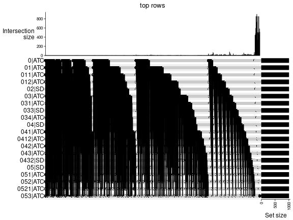


### UMAP plot

UMAP plot which shows how samples are separated.


<script>
$( function() {
	$( '#tabs-dimension-reduction-by-depth' ).tabs();
} );
</script>
<div id='tabs-dimension-reduction-by-depth'>
<ul>
<li><a href='#tab-dimension-reduction-by-depth-1'>n_signatures ≥ 1446</a></li>
<li><a href='#tab-dimension-reduction-by-depth-2'>n_signatures ≥ 1851</a></li>
<li><a href='#tab-dimension-reduction-by-depth-3'>n_signatures ≥ 2070</a></li>
<li><a href='#tab-dimension-reduction-by-depth-4'>n_signatures ≥ 2395</a></li>
<li><a href='#tab-dimension-reduction-by-depth-5'>n_signatures ≥ 2419</a></li>
<li><a href='#tab-dimension-reduction-by-depth-6'>n_signatures ≥ 2941</a></li>
<li><a href='#tab-dimension-reduction-by-depth-7'>n_signatures ≥ 3361</a></li>
<li><a href='#tab-dimension-reduction-by-depth-8'>n_signatures ≥ 3504</a></li>
<li><a href='#tab-dimension-reduction-by-depth-9'>n_signatures ≥ 3561</a></li>
<li><a href='#tab-dimension-reduction-by-depth-10'>n_signatures ≥ 3580</a></li>
<li><a href='#tab-dimension-reduction-by-depth-11'>n_signatures ≥ 5353</a></li>
<li><a href='#tab-dimension-reduction-by-depth-12'>n_signatures ≥ 5898</a></li>
<li><a href='#tab-dimension-reduction-by-depth-13'>n_signatures ≥ 7255</a></li>
<li><a href='#tab-dimension-reduction-by-depth-14'>n_signatures ≥ 8499</a></li>
<li><a href='#tab-dimension-reduction-by-depth-15'>n_signatures ≥ 9106</a></li>
<li><a href='#tab-dimension-reduction-by-depth-16'>n_signatures ≥ 10519</a></li>
<li><a href='#tab-dimension-reduction-by-depth-17'>n_signatures ≥ 12967</a></li>
<li><a href='#tab-dimension-reduction-by-depth-18'>n_signatures ≥ 15755</a></li>
<li><a href='#tab-dimension-reduction-by-depth-19'>n_signatures ≥ 30004</a></li>
<li><a href='#tab-dimension-reduction-by-depth-20'>n_signatures ≥ 51178</a></li>
</ul>
<div id='tab-dimension-reduction-by-depth-1'>
<pre><code class="r">par(mfrow = c(1, 2))
dimension_reduction(res_rh, merge_node = merge_node_param(min_n_signatures = 1446),
    method = &quot;UMAP&quot;, top_value_method = &quot;SD&quot;, top_n = 40000, scale_rows = FALSE)
dimension_reduction(res_rh, merge_node = merge_node_param(min_n_signatures = 1446),
    method = &quot;UMAP&quot;, top_value_method = &quot;ATC&quot;, top_n = 40000, scale_rows = TRUE)
</code></pre>

<p>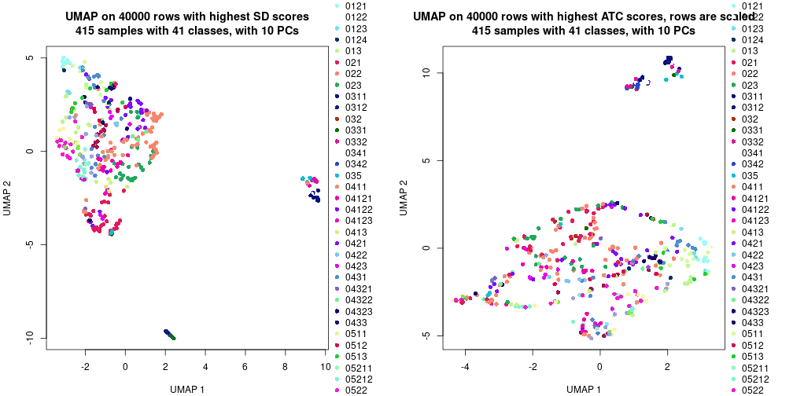</p>

</div>
<div id='tab-dimension-reduction-by-depth-2'>
<pre><code class="r">par(mfrow = c(1, 2))
dimension_reduction(res_rh, merge_node = merge_node_param(min_n_signatures = 1851),
    method = &quot;UMAP&quot;, top_value_method = &quot;SD&quot;, top_n = 40000, scale_rows = FALSE)
dimension_reduction(res_rh, merge_node = merge_node_param(min_n_signatures = 1851),
    method = &quot;UMAP&quot;, top_value_method = &quot;ATC&quot;, top_n = 40000, scale_rows = TRUE)
</code></pre>

<p>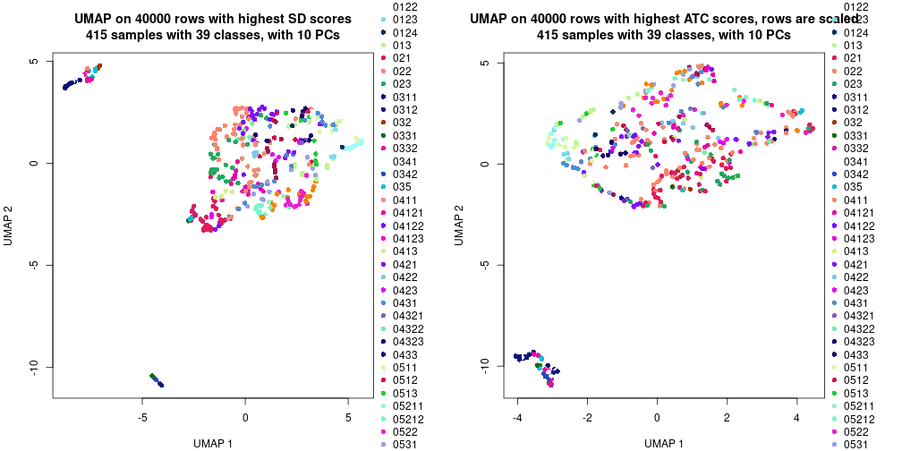</p>

</div>
<div id='tab-dimension-reduction-by-depth-3'>
<pre><code class="r">par(mfrow = c(1, 2))
dimension_reduction(res_rh, merge_node = merge_node_param(min_n_signatures = 2070),
    method = &quot;UMAP&quot;, top_value_method = &quot;SD&quot;, top_n = 40000, scale_rows = FALSE)
dimension_reduction(res_rh, merge_node = merge_node_param(min_n_signatures = 2070),
    method = &quot;UMAP&quot;, top_value_method = &quot;ATC&quot;, top_n = 40000, scale_rows = TRUE)
</code></pre>

<p>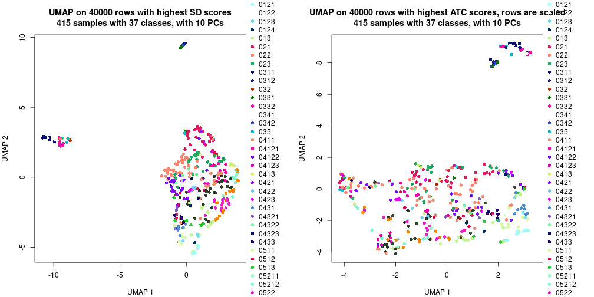</p>

</div>
<div id='tab-dimension-reduction-by-depth-4'>
<pre><code class="r">par(mfrow = c(1, 2))
dimension_reduction(res_rh, merge_node = merge_node_param(min_n_signatures = 2395),
    method = &quot;UMAP&quot;, top_value_method = &quot;SD&quot;, top_n = 40000, scale_rows = FALSE)
dimension_reduction(res_rh, merge_node = merge_node_param(min_n_signatures = 2395),
    method = &quot;UMAP&quot;, top_value_method = &quot;ATC&quot;, top_n = 40000, scale_rows = TRUE)
</code></pre>

<p>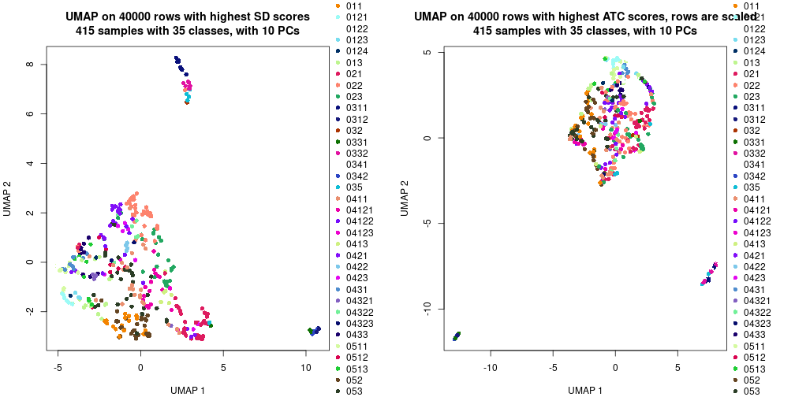</p>

</div>
<div id='tab-dimension-reduction-by-depth-5'>
<pre><code class="r">par(mfrow = c(1, 2))
dimension_reduction(res_rh, merge_node = merge_node_param(min_n_signatures = 2419),
    method = &quot;UMAP&quot;, top_value_method = &quot;SD&quot;, top_n = 40000, scale_rows = FALSE)
dimension_reduction(res_rh, merge_node = merge_node_param(min_n_signatures = 2419),
    method = &quot;UMAP&quot;, top_value_method = &quot;ATC&quot;, top_n = 40000, scale_rows = TRUE)
</code></pre>

<p>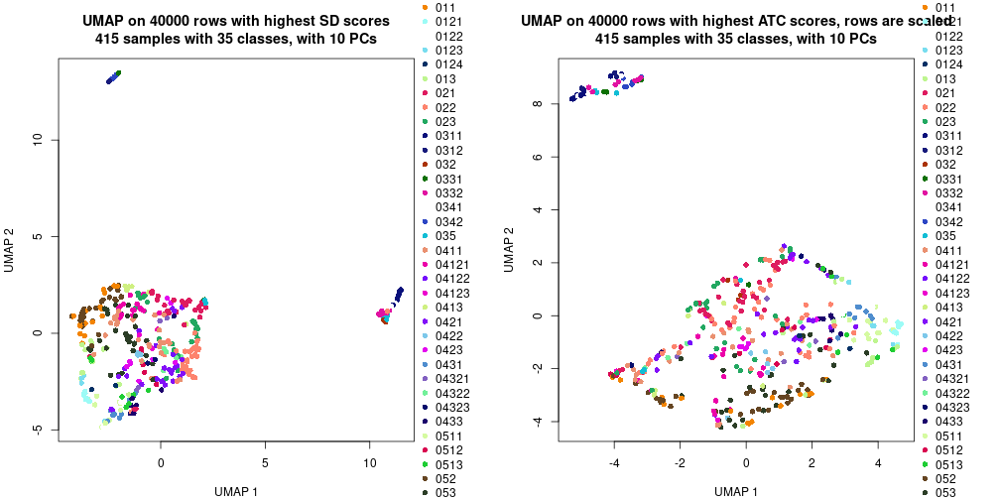</p>

</div>
<div id='tab-dimension-reduction-by-depth-6'>
<pre><code class="r">par(mfrow = c(1, 2))
dimension_reduction(res_rh, merge_node = merge_node_param(min_n_signatures = 2941),
    method = &quot;UMAP&quot;, top_value_method = &quot;SD&quot;, top_n = 40000, scale_rows = FALSE)
dimension_reduction(res_rh, merge_node = merge_node_param(min_n_signatures = 2941),
    method = &quot;UMAP&quot;, top_value_method = &quot;ATC&quot;, top_n = 40000, scale_rows = TRUE)
</code></pre>

<p>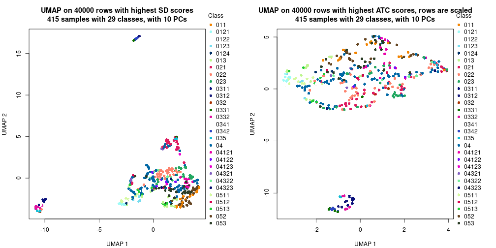</p>

</div>
<div id='tab-dimension-reduction-by-depth-7'>
<pre><code class="r">par(mfrow = c(1, 2))
dimension_reduction(res_rh, merge_node = merge_node_param(min_n_signatures = 3361),
    method = &quot;UMAP&quot;, top_value_method = &quot;SD&quot;, top_n = 40000, scale_rows = FALSE)
dimension_reduction(res_rh, merge_node = merge_node_param(min_n_signatures = 3361),
    method = &quot;UMAP&quot;, top_value_method = &quot;ATC&quot;, top_n = 40000, scale_rows = TRUE)
</code></pre>

<p>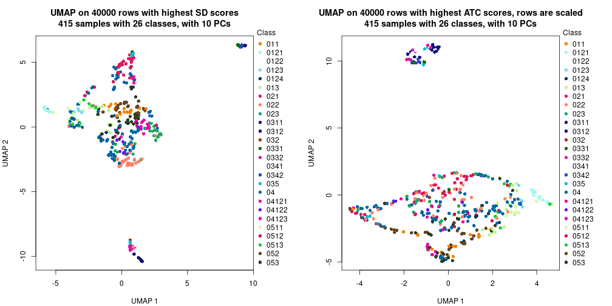</p>

</div>
<div id='tab-dimension-reduction-by-depth-8'>
<pre><code class="r">par(mfrow = c(1, 2))
dimension_reduction(res_rh, merge_node = merge_node_param(min_n_signatures = 3504),
    method = &quot;UMAP&quot;, top_value_method = &quot;SD&quot;, top_n = 40000, scale_rows = FALSE)
dimension_reduction(res_rh, merge_node = merge_node_param(min_n_signatures = 3504),
    method = &quot;UMAP&quot;, top_value_method = &quot;ATC&quot;, top_n = 40000, scale_rows = TRUE)
</code></pre>

<p>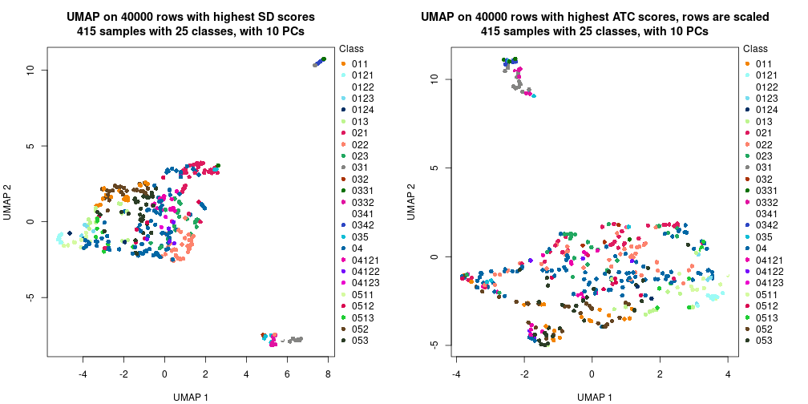</p>

</div>
<div id='tab-dimension-reduction-by-depth-9'>
<pre><code class="r">par(mfrow = c(1, 2))
dimension_reduction(res_rh, merge_node = merge_node_param(min_n_signatures = 3561),
    method = &quot;UMAP&quot;, top_value_method = &quot;SD&quot;, top_n = 40000, scale_rows = FALSE)
dimension_reduction(res_rh, merge_node = merge_node_param(min_n_signatures = 3561),
    method = &quot;UMAP&quot;, top_value_method = &quot;ATC&quot;, top_n = 40000, scale_rows = TRUE)
</code></pre>

<p>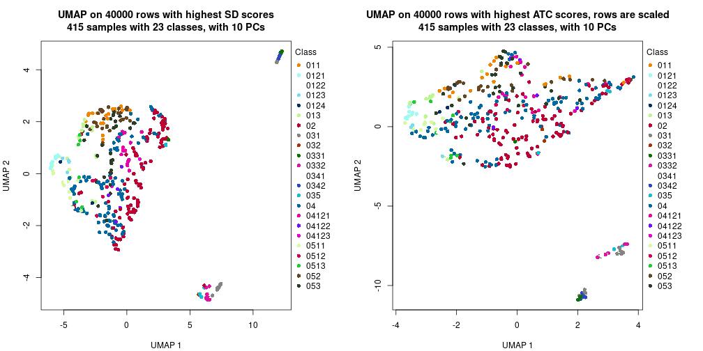</p>

</div>
<div id='tab-dimension-reduction-by-depth-10'>
<pre><code class="r">par(mfrow = c(1, 2))
dimension_reduction(res_rh, merge_node = merge_node_param(min_n_signatures = 3580),
    method = &quot;UMAP&quot;, top_value_method = &quot;SD&quot;, top_n = 40000, scale_rows = FALSE)
dimension_reduction(res_rh, merge_node = merge_node_param(min_n_signatures = 3580),
    method = &quot;UMAP&quot;, top_value_method = &quot;ATC&quot;, top_n = 40000, scale_rows = TRUE)
</code></pre>

<p>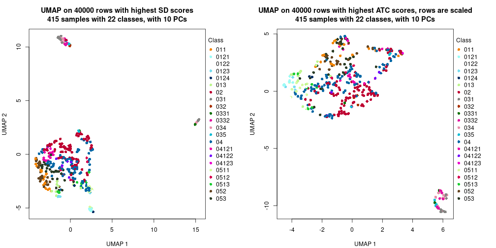</p>

</div>
<div id='tab-dimension-reduction-by-depth-11'>
<pre><code class="r">par(mfrow = c(1, 2))
dimension_reduction(res_rh, merge_node = merge_node_param(min_n_signatures = 5353),
    method = &quot;UMAP&quot;, top_value_method = &quot;SD&quot;, top_n = 40000, scale_rows = FALSE)
dimension_reduction(res_rh, merge_node = merge_node_param(min_n_signatures = 5353),
    method = &quot;UMAP&quot;, top_value_method = &quot;ATC&quot;, top_n = 40000, scale_rows = TRUE)
</code></pre>

<p>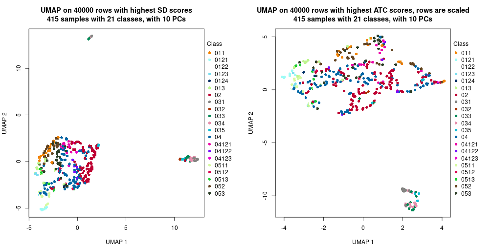</p>

</div>
<div id='tab-dimension-reduction-by-depth-12'>
<pre><code class="r">par(mfrow = c(1, 2))
dimension_reduction(res_rh, merge_node = merge_node_param(min_n_signatures = 5898),
    method = &quot;UMAP&quot;, top_value_method = &quot;SD&quot;, top_n = 40000, scale_rows = FALSE)
dimension_reduction(res_rh, merge_node = merge_node_param(min_n_signatures = 5898),
    method = &quot;UMAP&quot;, top_value_method = &quot;ATC&quot;, top_n = 40000, scale_rows = TRUE)
</code></pre>

<p>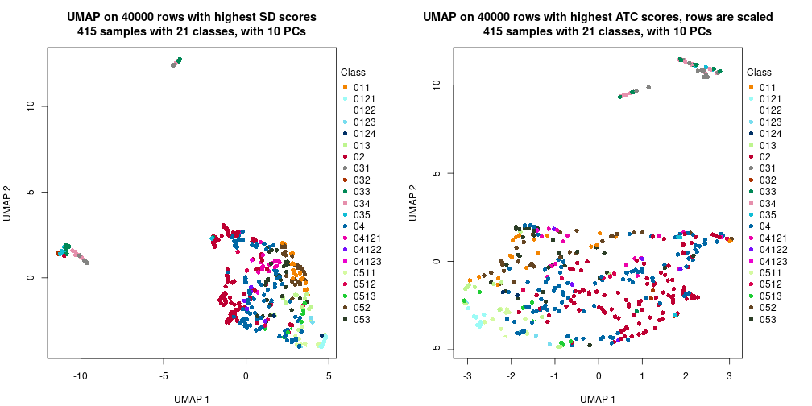</p>

</div>
<div id='tab-dimension-reduction-by-depth-13'>
<pre><code class="r">par(mfrow = c(1, 2))
dimension_reduction(res_rh, merge_node = merge_node_param(min_n_signatures = 7255),
    method = &quot;UMAP&quot;, top_value_method = &quot;SD&quot;, top_n = 40000, scale_rows = FALSE)
dimension_reduction(res_rh, merge_node = merge_node_param(min_n_signatures = 7255),
    method = &quot;UMAP&quot;, top_value_method = &quot;ATC&quot;, top_n = 40000, scale_rows = TRUE)
</code></pre>

<p>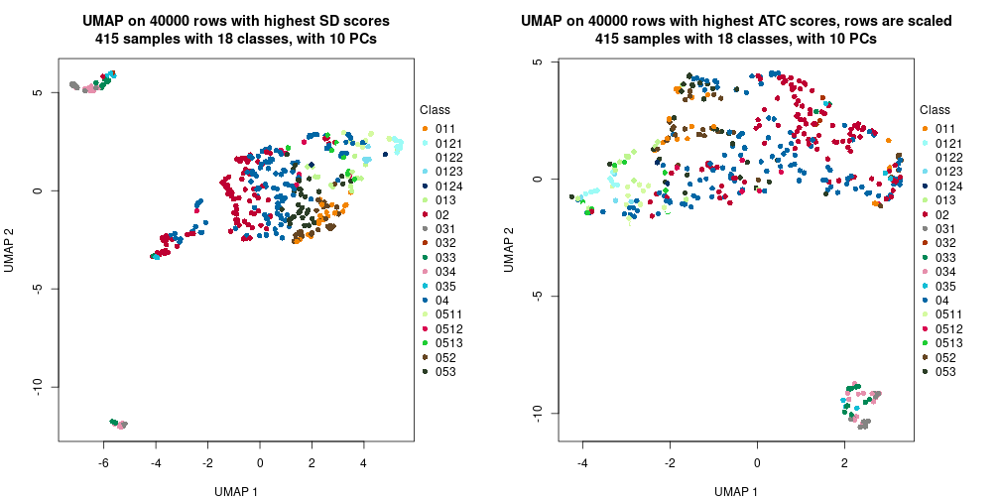</p>

</div>
<div id='tab-dimension-reduction-by-depth-14'>
<pre><code class="r">par(mfrow = c(1, 2))
dimension_reduction(res_rh, merge_node = merge_node_param(min_n_signatures = 8499),
    method = &quot;UMAP&quot;, top_value_method = &quot;SD&quot;, top_n = 40000, scale_rows = FALSE)
dimension_reduction(res_rh, merge_node = merge_node_param(min_n_signatures = 8499),
    method = &quot;UMAP&quot;, top_value_method = &quot;ATC&quot;, top_n = 40000, scale_rows = TRUE)
</code></pre>

<p>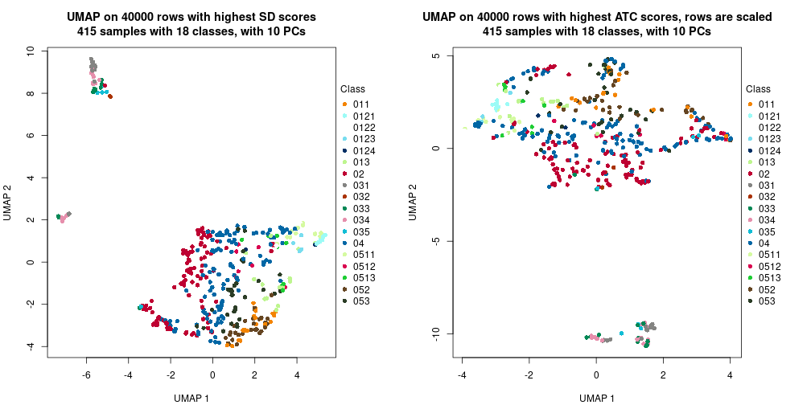</p>

</div>
<div id='tab-dimension-reduction-by-depth-15'>
<pre><code class="r">par(mfrow = c(1, 2))
dimension_reduction(res_rh, merge_node = merge_node_param(min_n_signatures = 9106),
    method = &quot;UMAP&quot;, top_value_method = &quot;SD&quot;, top_n = 40000, scale_rows = FALSE)
dimension_reduction(res_rh, merge_node = merge_node_param(min_n_signatures = 9106),
    method = &quot;UMAP&quot;, top_value_method = &quot;ATC&quot;, top_n = 40000, scale_rows = TRUE)
</code></pre>

<p>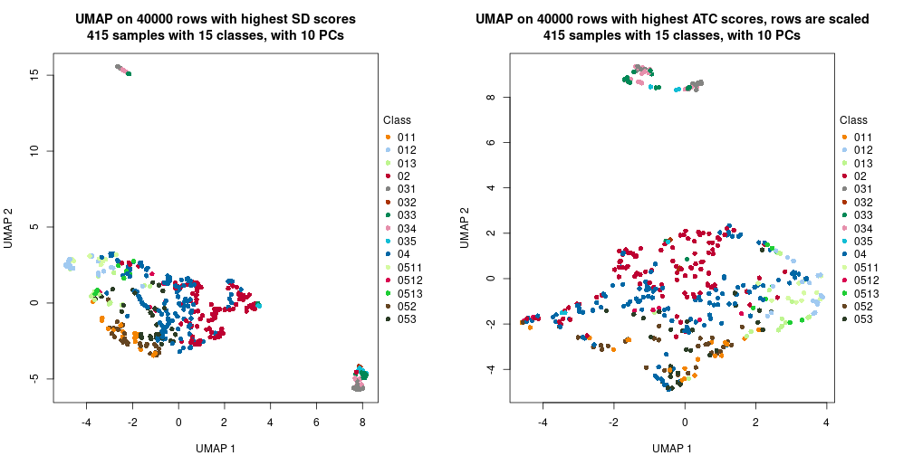</p>

</div>
<div id='tab-dimension-reduction-by-depth-16'>
<pre><code class="r">par(mfrow = c(1, 2))
dimension_reduction(res_rh, merge_node = merge_node_param(min_n_signatures = 10519),
    method = &quot;UMAP&quot;, top_value_method = &quot;SD&quot;, top_n = 40000, scale_rows = FALSE)
dimension_reduction(res_rh, merge_node = merge_node_param(min_n_signatures = 10519),
    method = &quot;UMAP&quot;, top_value_method = &quot;ATC&quot;, top_n = 40000, scale_rows = TRUE)
</code></pre>

<p>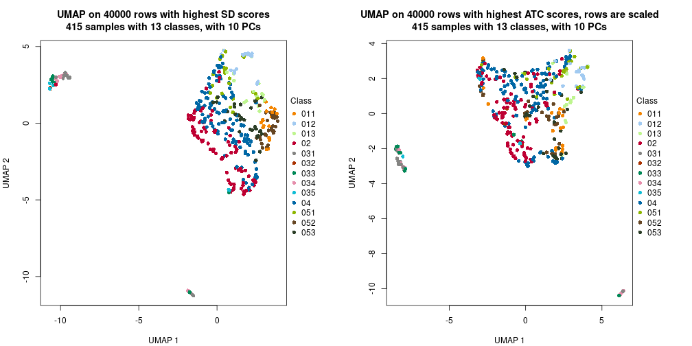</p>

</div>
<div id='tab-dimension-reduction-by-depth-17'>
<pre><code class="r">par(mfrow = c(1, 2))
dimension_reduction(res_rh, merge_node = merge_node_param(min_n_signatures = 12967),
    method = &quot;UMAP&quot;, top_value_method = &quot;SD&quot;, top_n = 40000, scale_rows = FALSE)
dimension_reduction(res_rh, merge_node = merge_node_param(min_n_signatures = 12967),
    method = &quot;UMAP&quot;, top_value_method = &quot;ATC&quot;, top_n = 40000, scale_rows = TRUE)
</code></pre>

<p>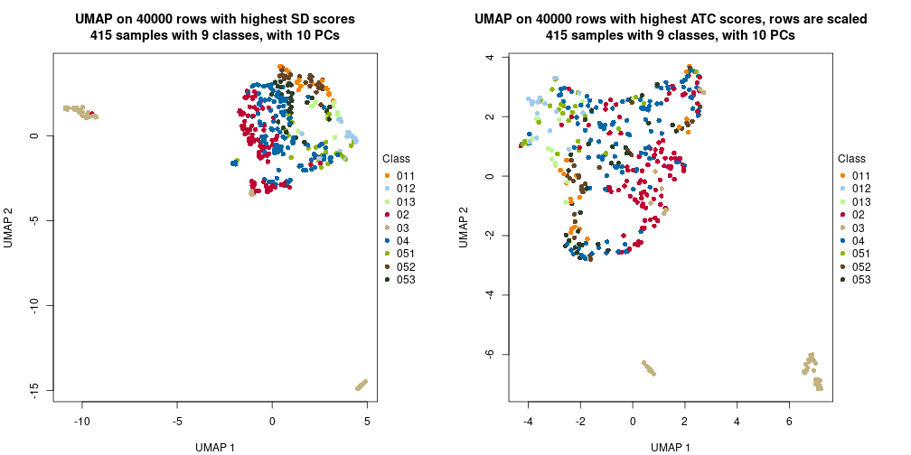</p>

</div>
<div id='tab-dimension-reduction-by-depth-18'>
<pre><code class="r">par(mfrow = c(1, 2))
dimension_reduction(res_rh, merge_node = merge_node_param(min_n_signatures = 15755),
    method = &quot;UMAP&quot;, top_value_method = &quot;SD&quot;, top_n = 40000, scale_rows = FALSE)
dimension_reduction(res_rh, merge_node = merge_node_param(min_n_signatures = 15755),
    method = &quot;UMAP&quot;, top_value_method = &quot;ATC&quot;, top_n = 40000, scale_rows = TRUE)
</code></pre>

<p>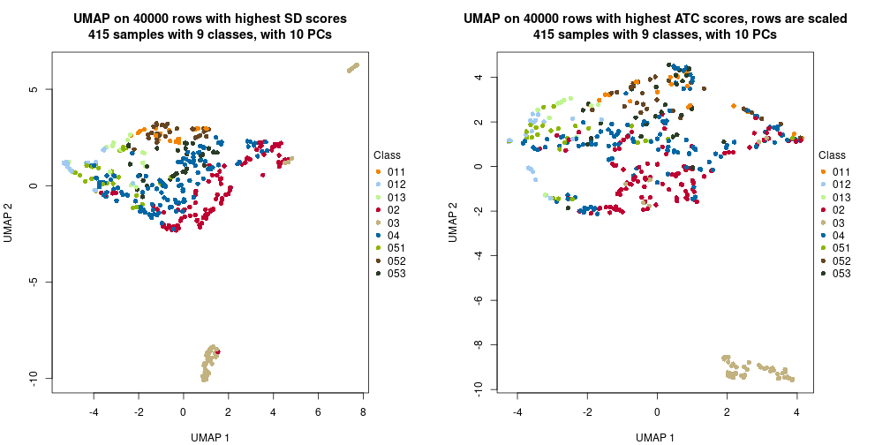</p>

</div>
<div id='tab-dimension-reduction-by-depth-19'>
<pre><code class="r">par(mfrow = c(1, 2))
dimension_reduction(res_rh, merge_node = merge_node_param(min_n_signatures = 30004),
    method = &quot;UMAP&quot;, top_value_method = &quot;SD&quot;, top_n = 40000, scale_rows = FALSE)
dimension_reduction(res_rh, merge_node = merge_node_param(min_n_signatures = 30004),
    method = &quot;UMAP&quot;, top_value_method = &quot;ATC&quot;, top_n = 40000, scale_rows = TRUE)
</code></pre>

<p>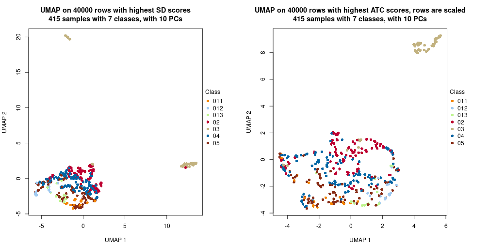</p>

</div>
<div id='tab-dimension-reduction-by-depth-20'>
<pre><code class="r">par(mfrow = c(1, 2))
dimension_reduction(res_rh, merge_node = merge_node_param(min_n_signatures = 51178),
    method = &quot;UMAP&quot;, top_value_method = &quot;SD&quot;, top_n = 40000, scale_rows = FALSE)
dimension_reduction(res_rh, merge_node = merge_node_param(min_n_signatures = 51178),
    method = &quot;UMAP&quot;, top_value_method = &quot;ATC&quot;, top_n = 40000, scale_rows = TRUE)
</code></pre>

<p>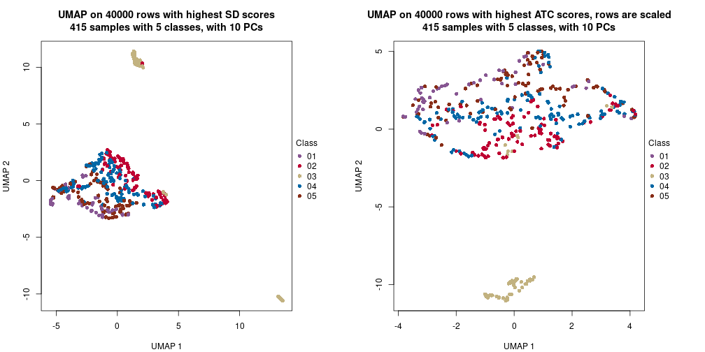</p>

</div>
</div>


### Signature heatmap

Signatures on the heatmap are the union of all signatures found on every node
on the hierarchy. The number of k-means on rows are automatically selected by the function.


<script>
$( function() {
	$( '#tabs-get-signatures-from-hierarchical-partition' ).tabs();
} );
</script>
<div id='tabs-get-signatures-from-hierarchical-partition'>
<ul>
<li><a href='#tab-get-signatures-from-hierarchical-partition-1'>n_signatures ≥ 1446</a></li>
<li><a href='#tab-get-signatures-from-hierarchical-partition-2'>n_signatures ≥ 1851</a></li>
<li><a href='#tab-get-signatures-from-hierarchical-partition-3'>n_signatures ≥ 2070</a></li>
<li><a href='#tab-get-signatures-from-hierarchical-partition-4'>n_signatures ≥ 2395</a></li>
<li><a href='#tab-get-signatures-from-hierarchical-partition-5'>n_signatures ≥ 2419</a></li>
<li><a href='#tab-get-signatures-from-hierarchical-partition-6'>n_signatures ≥ 2941</a></li>
<li><a href='#tab-get-signatures-from-hierarchical-partition-7'>n_signatures ≥ 3361</a></li>
<li><a href='#tab-get-signatures-from-hierarchical-partition-8'>n_signatures ≥ 3504</a></li>
<li><a href='#tab-get-signatures-from-hierarchical-partition-9'>n_signatures ≥ 3561</a></li>
<li><a href='#tab-get-signatures-from-hierarchical-partition-10'>n_signatures ≥ 3580</a></li>
<li><a href='#tab-get-signatures-from-hierarchical-partition-11'>n_signatures ≥ 5353</a></li>
<li><a href='#tab-get-signatures-from-hierarchical-partition-12'>n_signatures ≥ 5898</a></li>
<li><a href='#tab-get-signatures-from-hierarchical-partition-13'>n_signatures ≥ 7255</a></li>
<li><a href='#tab-get-signatures-from-hierarchical-partition-14'>n_signatures ≥ 8499</a></li>
<li><a href='#tab-get-signatures-from-hierarchical-partition-15'>n_signatures ≥ 9106</a></li>
<li><a href='#tab-get-signatures-from-hierarchical-partition-16'>n_signatures ≥ 10519</a></li>
<li><a href='#tab-get-signatures-from-hierarchical-partition-17'>n_signatures ≥ 12967</a></li>
<li><a href='#tab-get-signatures-from-hierarchical-partition-18'>n_signatures ≥ 15755</a></li>
<li><a href='#tab-get-signatures-from-hierarchical-partition-19'>n_signatures ≥ 30004</a></li>
<li><a href='#tab-get-signatures-from-hierarchical-partition-20'>n_signatures ≥ 51178</a></li>
</ul>
<div id='tab-get-signatures-from-hierarchical-partition-1'>
<pre><code class="r">get_signatures(res_rh, merge_node = merge_node_param(min_n_signatures = 1446))
</code></pre>

<p>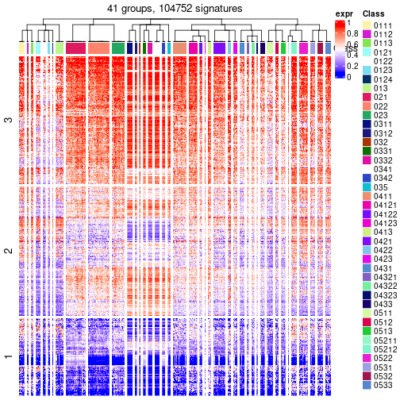</p>

</div>
<div id='tab-get-signatures-from-hierarchical-partition-2'>
<pre><code class="r">get_signatures(res_rh, merge_node = merge_node_param(min_n_signatures = 1851))
</code></pre>

<p>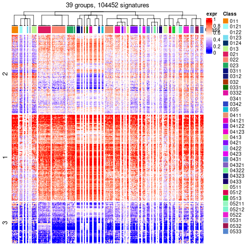</p>

</div>
<div id='tab-get-signatures-from-hierarchical-partition-3'>
<pre><code class="r">get_signatures(res_rh, merge_node = merge_node_param(min_n_signatures = 2070))
</code></pre>

<p>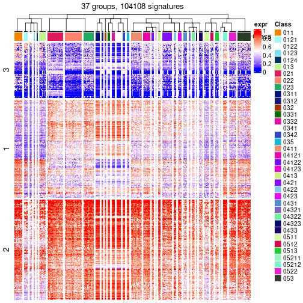</p>

</div>
<div id='tab-get-signatures-from-hierarchical-partition-4'>
<pre><code class="r">get_signatures(res_rh, merge_node = merge_node_param(min_n_signatures = 2395))
</code></pre>

<p>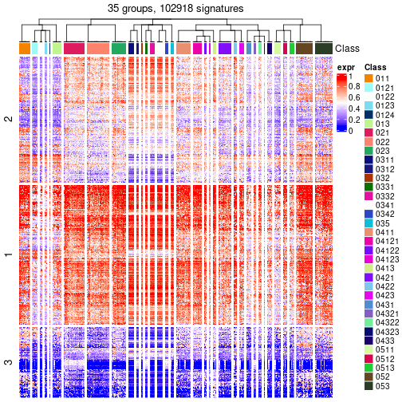</p>

</div>
<div id='tab-get-signatures-from-hierarchical-partition-5'>
<pre><code class="r">get_signatures(res_rh, merge_node = merge_node_param(min_n_signatures = 2419))
</code></pre>

<p></p>

</div>
<div id='tab-get-signatures-from-hierarchical-partition-6'>
<pre><code class="r">get_signatures(res_rh, merge_node = merge_node_param(min_n_signatures = 2941))
</code></pre>

<pre><code>#&gt; Error in lt[[hierarchy[i, 1]]]$AddChildNode({: attempt to apply non-function
</code></pre>

</div>
<div id='tab-get-signatures-from-hierarchical-partition-7'>
<pre><code class="r">get_signatures(res_rh, merge_node = merge_node_param(min_n_signatures = 3361))
</code></pre>

<pre><code>#&gt; Error in lt[[hierarchy[i, 1]]]$AddChildNode({: attempt to apply non-function
</code></pre>

</div>
<div id='tab-get-signatures-from-hierarchical-partition-8'>
<pre><code class="r">get_signatures(res_rh, merge_node = merge_node_param(min_n_signatures = 3504))
</code></pre>

<pre><code>#&gt; Error in lt[[hierarchy[i, 1]]]$AddChildNode({: attempt to apply non-function
</code></pre>

</div>
<div id='tab-get-signatures-from-hierarchical-partition-9'>
<pre><code class="r">get_signatures(res_rh, merge_node = merge_node_param(min_n_signatures = 3561))
</code></pre>

<pre><code>#&gt; Error in lt[[hierarchy[i, 1]]]$AddChildNode({: attempt to apply non-function
</code></pre>

</div>
<div id='tab-get-signatures-from-hierarchical-partition-10'>
<pre><code class="r">get_signatures(res_rh, merge_node = merge_node_param(min_n_signatures = 3580))
</code></pre>

<pre><code>#&gt; Error in lt[[hierarchy[i, 1]]]$AddChildNode({: attempt to apply non-function
</code></pre>

</div>
<div id='tab-get-signatures-from-hierarchical-partition-11'>
<pre><code class="r">get_signatures(res_rh, merge_node = merge_node_param(min_n_signatures = 5353))
</code></pre>

<pre><code>#&gt; Error in lt[[hierarchy[i, 1]]]$AddChildNode({: attempt to apply non-function
</code></pre>

</div>
<div id='tab-get-signatures-from-hierarchical-partition-12'>
<pre><code class="r">get_signatures(res_rh, merge_node = merge_node_param(min_n_signatures = 5898))
</code></pre>

<pre><code>#&gt; Error in lt[[hierarchy[i, 1]]]$AddChildNode({: attempt to apply non-function
</code></pre>

</div>
<div id='tab-get-signatures-from-hierarchical-partition-13'>
<pre><code class="r">get_signatures(res_rh, merge_node = merge_node_param(min_n_signatures = 7255))
</code></pre>

<p></p>

</div>
<div id='tab-get-signatures-from-hierarchical-partition-14'>
<pre><code class="r">get_signatures(res_rh, merge_node = merge_node_param(min_n_signatures = 8499))
</code></pre>

<p></p>

</div>
<div id='tab-get-signatures-from-hierarchical-partition-15'>
<pre><code class="r">get_signatures(res_rh, merge_node = merge_node_param(min_n_signatures = 9106))
</code></pre>

<p>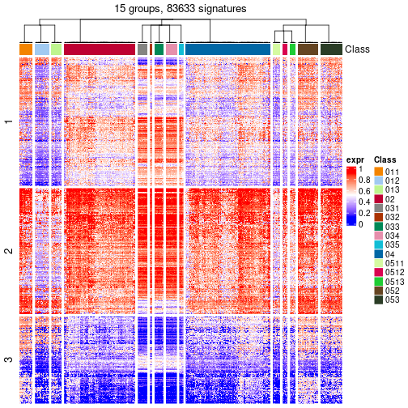</p>

</div>
<div id='tab-get-signatures-from-hierarchical-partition-16'>
<pre><code class="r">get_signatures(res_rh, merge_node = merge_node_param(min_n_signatures = 10519))
</code></pre>

<p>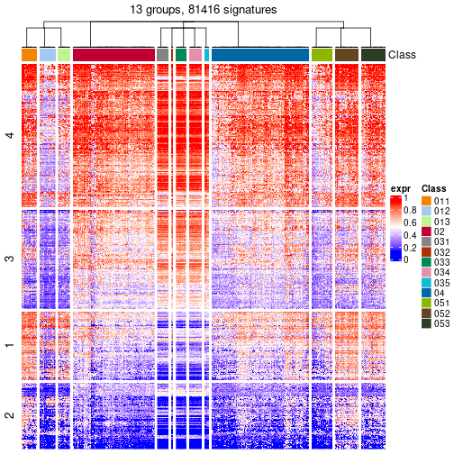</p>

</div>
<div id='tab-get-signatures-from-hierarchical-partition-17'>
<pre><code class="r">get_signatures(res_rh, merge_node = merge_node_param(min_n_signatures = 12967))
</code></pre>

<p>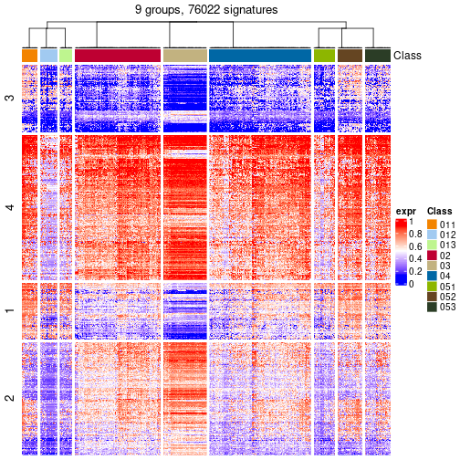</p>

</div>
<div id='tab-get-signatures-from-hierarchical-partition-18'>
<pre><code class="r">get_signatures(res_rh, merge_node = merge_node_param(min_n_signatures = 15755))
</code></pre>

<p></p>

</div>
<div id='tab-get-signatures-from-hierarchical-partition-19'>
<pre><code class="r">get_signatures(res_rh, merge_node = merge_node_param(min_n_signatures = 30004))
</code></pre>

<p>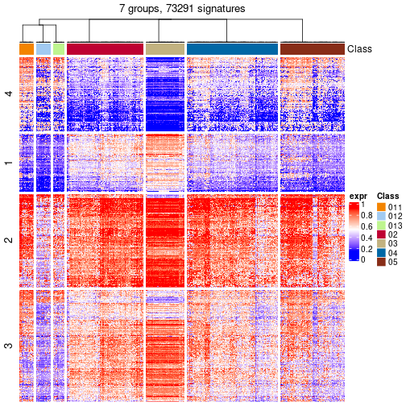</p>

</div>
<div id='tab-get-signatures-from-hierarchical-partition-20'>
<pre><code class="r">get_signatures(res_rh, merge_node = merge_node_param(min_n_signatures = 51178))
</code></pre>

<p>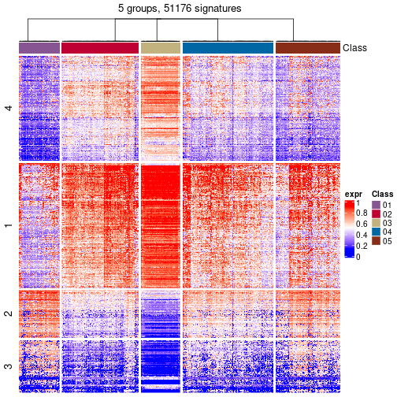</p>

</div>
</div>


Compare signatures from different nodes:


```r
compare_signatures(res_rh, verbose = FALSE)
```

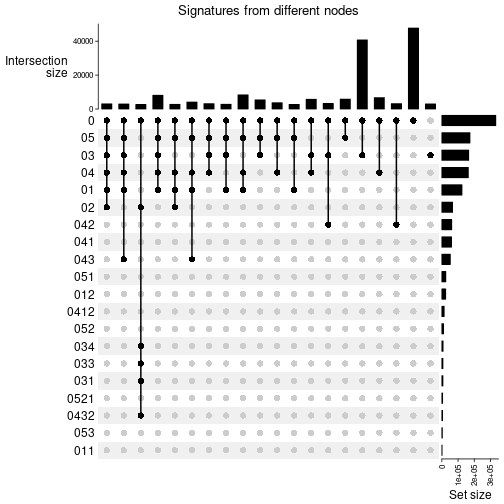

If there are too many signatures, `top_signatures = ...` can be set to only show the 
signatures with the highest FDRs. Note it only works on every node and the final signatures
are the union of all signatures of all nodes.


```r
# code only for demonstration
# e.g. to show the top 500 most significant rows on each node.
tb = get_signature(res_rh, top_signatures = 500)
```


## Results for each node


---------------------------------------------------


### Node0


Child nodes: 
                [Node01](#Node01)
        ,
                [Node02](#Node02)
        ,
                [Node03](#Node03)
        ,
                [Node04](#Node04)
        ,
                [Node05](#Node05)
        .


The object with results only for a single top-value method and a single partitioning method 
can be extracted as:

```r
res = res_rh["0"]
```

A summary of `res` and all the functions that can be applied to it:

```r
res
```

```
#> A 'ConsensusPartition' object with k = 2, 3, 4, 5, 6, 7, 8.
#>   On a matrix with 30000 rows and 415 columns.
#>   Top rows (1000) are extracted by 'ATC' method.
#>   Subgroups are detected by 'skmeans' method.
#>   Performed in total 350 partitions by row resampling.
#>   Best k for subgroups seems to be 8.
#> 
#> Following methods can be applied to this 'ConsensusPartition' object:
#>  [1] "cola_report"             "collect_classes"         "collect_plots"          
#>  [4] "collect_stats"           "colnames"                "compare_partitions"     
#>  [7] "compare_signatures"      "consensus_heatmap"       "dimension_reduction"    
#> [10] "functional_enrichment"   "get_anno_col"            "get_anno"               
#> [13] "get_classes"             "get_consensus"           "get_matrix"             
#> [16] "get_membership"          "get_param"               "get_signatures"         
#> [19] "get_stats"               "is_best_k"               "is_stable_k"            
#> [22] "membership_heatmap"      "ncol"                    "nrow"                   
#> [25] "plot_ecdf"               "predict_classes"         "rownames"               
#> [28] "select_partition_number" "show"                    "suggest_best_k"         
#> [31] "test_to_known_factors"   "top_rows_heatmap"
```

`collect_plots()` function collects all the plots made from `res` for all `k` (number of subgroups)
into one single page to provide an easy and fast comparison between different `k`.

```r
collect_plots(res)
```

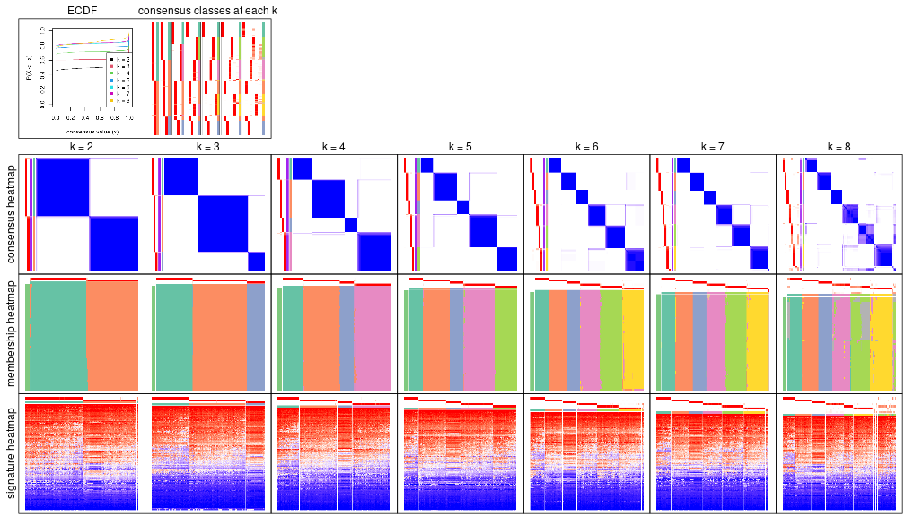

The plots are:

- The first row: a plot of the eCDF (empirical cumulative distribution
  function) curves of the consensus matrix for each `k` and the heatmap of
  predicted classes for each `k`.
- The second row: heatmaps of the consensus matrix for each `k`.
- The third row: heatmaps of the membership matrix for each `k`.
- The fouth row: heatmaps of the signatures for each `k`.

All the plots in panels can be made by individual functions and they are
plotted later in this section.

`select_partition_number()` produces several plots showing different
statistics for choosing "optimized" `k`. There are following statistics:

- eCDF curves of the consensus matrix for each `k`;
- 1-PAC. [The PAC score](https://en.wikipedia.org/wiki/Consensus_clustering#Over-interpretation_potential_of_consensus_clustering)
  measures the proportion of the ambiguous subgrouping.
- Mean silhouette score.
- Concordance. The mean probability of fiting the consensus subgroup labels in all
  partitions.
- Area increased. Denote $A_k$ as the area under the eCDF curve for current
  `k`, the area increased is defined as $A_k - A_{k-1}$.
- Rand index. The percent of pairs of samples that are both in a same cluster
  or both are not in a same cluster in the partition of k and k-1.
- Jaccard index. The ratio of pairs of samples are both in a same cluster in
  the partition of k and k-1 and the pairs of samples are both in a same
  cluster in the partition k or k-1.

The detailed explanations of these statistics can be found in [the _cola_
vignette](https://jokergoo.github.io/cola_vignettes/cola.html#toc_13).

Generally speaking, higher 1-PAC score, higher mean silhouette score or higher
concordance corresponds to better partition. Rand index and Jaccard index
measure how similar the current partition is compared to partition with `k-1`.
If they are too similar, we won't accept `k` is better than `k-1`.

```r
select_partition_number(res)
```

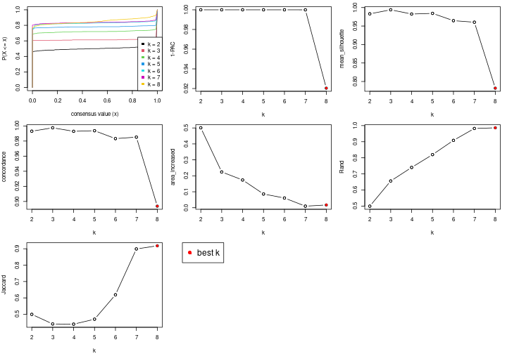

The numeric values for all these statistics can be obtained by `get_stats()`.

```r
get_stats(res)
```

```
#>   k 1-PAC mean_silhouette concordance area_increased  Rand Jaccard
#> 2 2  1.00           0.983       0.993        0.50094 0.499   0.499
#> 3 3  1.00           0.994       0.998        0.22408 0.656   0.441
#> 4 4  1.00           0.982       0.993        0.17380 0.740   0.440
#> 5 5  1.00           0.984       0.994        0.08586 0.820   0.470
#> 6 6  1.00           0.964       0.983        0.06074 0.908   0.619
#> 7 7  1.00           0.960       0.985        0.00973 0.982   0.899
#> 8 8  0.92           0.782       0.894        0.01714 0.986   0.918
```

`suggest_best_k()` suggests the best $k$ based on these statistics. The rules are as follows:

- All $k$ with Jaccard index larger than 0.95 are removed because increasing
  $k$ does not provide enough extra information. If all $k$ are removed, it is
  marked as no subgroup is detected.
- For all $k$ with 1-PAC score larger than 0.9, the maximal $k$ is taken as
  the best $k$, and other $k$ are marked as optional $k$.
- If it does not fit the second rule. The $k$ with the maximal vote of the
  highest 1-PAC score, highest mean silhouette, and highest concordance is
  taken as the best $k$.

```r
suggest_best_k(res)
```

```
#> [1] 8
#> attr(,"optional")
#> [1] 2 3 4 5 6 7
```

There is also optional best $k$ = 2 3 4 5 6 7 that is worth to check.

Following is the table of the partitions (You need to click the **show/hide
code output** link to see it). The membership matrix (columns with name `p*`)
is inferred by
[`clue::cl_consensus()`](https://www.rdocumentation.org/link/cl_consensus?package=clue)
function with the `SE` method. Basically the value in the membership matrix
represents the probability to belong to a certain group. The finall subgroup
label for an item is determined with the group with highest probability it
belongs to.

In `get_classes()` function, the entropy is calculated from the membership
matrix and the silhouette score is calculated from the consensus matrix.


<script>
$( function() {
	$( '#tabs-node-0-get-classes' ).tabs();
} );
</script>
<div id='tabs-node-0-get-classes'>
<ul>
<li><a href='#tab-node-0-get-classes-1'>k = 2</a></li>
<li><a href='#tab-node-0-get-classes-2'>k = 3</a></li>
<li><a href='#tab-node-0-get-classes-3'>k = 4</a></li>
<li><a href='#tab-node-0-get-classes-4'>k = 5</a></li>
<li><a href='#tab-node-0-get-classes-5'>k = 6</a></li>
<li><a href='#tab-node-0-get-classes-6'>k = 7</a></li>
<li><a href='#tab-node-0-get-classes-7'>k = 8</a></li>
</ul>

<div id='tab-node-0-get-classes-1'>
<p><a id='tab-node-0-get-classes-1-a' style='color:#0366d6' href='#'>show/hide code output</a></p>
<pre><code class="r">cbind(get_classes(res, k = 2), get_membership(res, k = 2))
</code></pre>

<pre><code>#&gt;                 class entropy silhouette   p1   p2
#&gt; TCGA.56.8201.01     2   0.000      0.993 0.00 1.00
#&gt; TCGA.22.4601.01     1   0.000      0.993 1.00 0.00
#&gt; TCGA.90.6837.01     2   0.000      0.993 0.00 1.00
#&gt; TCGA.77.8140.01     1   0.000      0.993 1.00 0.00
#&gt; TCGA.43.8115.01     2   0.680      0.780 0.18 0.82
#&gt; TCGA.39.5028.01     2   0.000      0.993 0.00 1.00
#&gt; TCGA.39.5030.01     2   0.000      0.993 0.00 1.00
#&gt; TCGA.22.5479.01     1   0.000      0.993 1.00 0.00
#&gt; TCGA.85.8071.01     1   0.000      0.993 1.00 0.00
#&gt; TCGA.63.7020.01     1   0.000      0.993 1.00 0.00
#&gt; TCGA.6A.AB49.01     1   0.000      0.993 1.00 0.00
#&gt; TCGA.33.4586.11     2   0.000      0.993 0.00 1.00
#&gt; TCGA.77.8150.01     1   0.000      0.993 1.00 0.00
#&gt; TCGA.79.5596.01     1   0.000      0.993 1.00 0.00
#&gt; TCGA.18.4721.11     2   0.000      0.993 0.00 1.00
#&gt; TCGA.33.AASI.01     1   0.000      0.993 1.00 0.00
#&gt; TCGA.56.8083.01     1   0.000      0.993 1.00 0.00
#&gt; TCGA.63.5131.01     1   0.000      0.993 1.00 0.00
#&gt; TCGA.22.5481.01     2   0.000      0.993 0.00 1.00
#&gt; TCGA.33.4589.01     2   0.000      0.993 0.00 1.00
#&gt; TCGA.39.5037.11     2   0.000      0.993 0.00 1.00
#&gt; TCGA.33.6738.01     2   0.000      0.993 0.00 1.00
#&gt; TCGA.22.4613.01     1   0.000      0.993 1.00 0.00
#&gt; TCGA.22.4613.11     2   0.000      0.993 0.00 1.00
#&gt; TCGA.77.8154.01     1   0.000      0.993 1.00 0.00
#&gt; TCGA.33.AASL.01     2   0.000      0.993 0.00 1.00
#&gt; TCGA.77.8138.01     2   0.000      0.993 0.00 1.00
#&gt; TCGA.33.4586.01     1   0.000      0.993 1.00 0.00
#&gt; TCGA.33.AASD.01     1   0.000      0.993 1.00 0.00
#&gt; TCGA.39.5035.11     2   0.000      0.993 0.00 1.00
#&gt; TCGA.33.4579.11     2   0.000      0.993 0.00 1.00
#&gt; TCGA.98.8023.01     2   0.000      0.993 0.00 1.00
#&gt; TCGA.18.4721.01     2   0.000      0.993 0.00 1.00
#&gt; TCGA.77.6845.01     1   0.000      0.993 1.00 0.00
#&gt; TCGA.34.5241.01     2   0.000      0.993 0.00 1.00
#&gt; TCGA.34.5240.01     1   0.000      0.993 1.00 0.00
#&gt; TCGA.94.7033.01     2   0.000      0.993 0.00 1.00
#&gt; TCGA.85.6798.01     1   0.000      0.993 1.00 0.00
#&gt; TCGA.77.8148.01     1   0.000      0.993 1.00 0.00
#&gt; TCGA.39.5028.11     2   0.000      0.993 0.00 1.00
#&gt; TCGA.63.7023.01     1   0.000      0.993 1.00 0.00
#&gt; TCGA.77.6844.01     1   0.000      0.993 1.00 0.00
#&gt; TCGA.77.8136.01     2   0.000      0.993 0.00 1.00
#&gt; TCGA.94.8035.01     2   0.000      0.993 0.00 1.00
#&gt; TCGA.98.8022.01     1   0.000      0.993 1.00 0.00
#&gt; TCGA.39.5035.01     1   0.000      0.993 1.00 0.00
#&gt; TCGA.85.8049.01     2   0.000      0.993 0.00 1.00
#&gt; TCGA.85.8070.01     1   0.000      0.993 1.00 0.00
#&gt; TCGA.77.6842.01     1   0.000      0.993 1.00 0.00
#&gt; TCGA.LA.A7SW.01     1   0.760      0.717 0.78 0.22
#&gt; TCGA.63.7022.01     2   0.000      0.993 0.00 1.00
#&gt; TCGA.56.8082.01     1   0.000      0.993 1.00 0.00
#&gt; TCGA.63.5128.01     1   0.000      0.993 1.00 0.00
#&gt; TCGA.77.8143.01     1   0.000      0.993 1.00 0.00
#&gt; TCGA.77.6843.01     1   0.000      0.993 1.00 0.00
#&gt; TCGA.77.8156.01     2   0.000      0.993 0.00 1.00
#&gt; TCGA.39.5039.01     2   0.000      0.993 0.00 1.00
#&gt; TCGA.77.8146.01     1   0.141      0.973 0.98 0.02
#&gt; TCGA.98.8021.01     1   0.000      0.993 1.00 0.00
#&gt; TCGA.56.A62T.01     1   0.000      0.993 1.00 0.00
#&gt; TCGA.33.4583.01     1   0.000      0.993 1.00 0.00
#&gt; TCGA.33.4583.11     2   0.000      0.993 0.00 1.00
#&gt; TCGA.85.8048.01     2   0.000      0.993 0.00 1.00
#&gt; TCGA.85.8072.01     1   0.000      0.993 1.00 0.00
#&gt; TCGA.33.AAS8.01     1   0.000      0.993 1.00 0.00
#&gt; TCGA.77.8133.01     1   0.000      0.993 1.00 0.00
#&gt; TCGA.39.5036.01     1   0.000      0.993 1.00 0.00
#&gt; TCGA.77.8139.01     2   0.469      0.886 0.10 0.90
#&gt; TCGA.39.5021.11     2   0.000      0.993 0.00 1.00
#&gt; TCGA.39.5031.11     2   0.000      0.993 0.00 1.00
#&gt; TCGA.98.8020.01     1   0.000      0.993 1.00 0.00
#&gt; TCGA.33.4582.01     1   0.000      0.993 1.00 0.00
#&gt; TCGA.39.5037.01     1   0.000      0.993 1.00 0.00
#&gt; TCGA.39.5030.11     2   0.000      0.993 0.00 1.00
#&gt; TCGA.77.8131.01     2   0.000      0.993 0.00 1.00
#&gt; TCGA.33.AASJ.01     1   0.000      0.993 1.00 0.00
#&gt; TCGA.39.5011.11     2   0.000      0.993 0.00 1.00
#&gt; TCGA.77.8130.01     1   0.402      0.909 0.92 0.08
#&gt; TCGA.33.AASB.01     2   0.000      0.993 0.00 1.00
#&gt; TCGA.43.6773.01     2   0.000      0.993 0.00 1.00
#&gt; TCGA.63.7021.01     2   0.000      0.993 0.00 1.00
#&gt; TCGA.XC.AA0X.01     2   0.000      0.993 0.00 1.00
#&gt; TCGA.33.4579.01     1   0.000      0.993 1.00 0.00
#&gt; TCGA.39.5029.01     1   0.000      0.993 1.00 0.00
#&gt; TCGA.33.4589.11     2   0.000      0.993 0.00 1.00
#&gt; TCGA.77.8145.01     1   0.995      0.146 0.54 0.46
#&gt; TCGA.92.8063.01     2   0.000      0.993 0.00 1.00
#&gt; TCGA.39.5034.11     2   0.000      0.993 0.00 1.00
#&gt; TCGA.92.8064.01     2   0.000      0.993 0.00 1.00
#&gt; TCGA.92.8065.01     2   0.000      0.993 0.00 1.00
#&gt; TCGA.39.5011.01     2   0.000      0.993 0.00 1.00
#&gt; TCGA.56.7823.01     1   0.000      0.993 1.00 0.00
#&gt; TCGA.77.8144.01     1   0.000      0.993 1.00 0.00
#&gt; TCGA.NK.A7XE.01     2   0.000      0.993 0.00 1.00
#&gt; TCGA.34.7107.01     1   0.000      0.993 1.00 0.00
#&gt; TCGA.39.5034.01     2   0.000      0.993 0.00 1.00
#&gt; TCGA.22.4599.01     1   0.000      0.993 1.00 0.00
#&gt; TCGA.85.8052.01     2   0.881      0.572 0.30 0.70
#&gt; TCGA.43.8116.01     1   0.000      0.993 1.00 0.00
#&gt; TCGA.77.8128.01     1   0.000      0.993 1.00 0.00
#&gt; TCGA.58.A46N.01     1   0.000      0.993 1.00 0.00
#&gt; TCGA.85.7710.01     1   0.000      0.993 1.00 0.00
#&gt; TCGA.21.5782.01     1   0.000      0.993 1.00 0.00
#&gt; TCGA.52.7809.01     1   0.000      0.993 1.00 0.00
#&gt; TCGA.22.5485.11     2   0.000      0.993 0.00 1.00
#&gt; TCGA.22.4599.11     2   0.000      0.993 0.00 1.00
#&gt; TCGA.52.7622.01     2   0.000      0.993 0.00 1.00
#&gt; TCGA.22.5472.11     2   0.000      0.993 0.00 1.00
#&gt; TCGA.56.A4BY.01     1   0.000      0.993 1.00 0.00
#&gt; TCGA.58.A46M.01     1   0.000      0.993 1.00 0.00
#&gt; TCGA.90.A4EE.01     2   0.000      0.993 0.00 1.00
#&gt; TCGA.90.A4ED.01     2   0.000      0.993 0.00 1.00
#&gt; TCGA.39.5040.01     2   0.000      0.993 0.00 1.00
#&gt; TCGA.22.5473.11     2   0.000      0.993 0.00 1.00
#&gt; TCGA.68.7755.01     1   0.000      0.993 1.00 0.00
#&gt; TCGA.56.A4BX.01     1   0.000      0.993 1.00 0.00
#&gt; TCGA.58.A46J.01     2   0.000      0.993 0.00 1.00
#&gt; TCGA.85.A4PA.01     2   0.000      0.993 0.00 1.00
#&gt; TCGA.33.4582.11     2   0.000      0.993 0.00 1.00
#&gt; TCGA.34.5234.01     2   0.000      0.993 0.00 1.00
#&gt; TCGA.21.5786.01     1   0.000      0.993 1.00 0.00
#&gt; TCGA.39.5016.01     1   0.000      0.993 1.00 0.00
#&gt; TCGA.37.5819.01     2   0.000      0.993 0.00 1.00
#&gt; TCGA.22.5489.01     2   0.000      0.993 0.00 1.00
#&gt; TCGA.39.5031.01     1   0.000      0.993 1.00 0.00
#&gt; TCGA.56.7822.01     2   0.000      0.993 0.00 1.00
#&gt; TCGA.85.A4JC.01     2   0.000      0.993 0.00 1.00
#&gt; TCGA.68.7756.01     2   0.000      0.993 0.00 1.00
#&gt; TCGA.18.5592.11     2   0.000      0.993 0.00 1.00
#&gt; TCGA.85.7698.01     1   0.000      0.993 1.00 0.00
#&gt; TCGA.56.7730.01     1   0.000      0.993 1.00 0.00
#&gt; TCGA.52.7811.01     2   0.000      0.993 0.00 1.00
#&gt; TCGA.18.5595.11     2   0.000      0.993 0.00 1.00
#&gt; TCGA.22.4609.01     2   0.000      0.993 0.00 1.00
#&gt; TCGA.22.5478.01     1   0.000      0.993 1.00 0.00
#&gt; TCGA.43.3920.11     2   0.000      0.993 0.00 1.00
#&gt; TCGA.96.A4JK.01     1   0.000      0.993 1.00 0.00
#&gt; TCGA.22.5474.01     1   0.000      0.993 1.00 0.00
#&gt; TCGA.33.4566.11     2   0.000      0.993 0.00 1.00
#&gt; TCGA.52.7812.01     2   0.000      0.993 0.00 1.00
#&gt; TCGA.56.5898.01     1   0.327      0.932 0.94 0.06
#&gt; TCGA.85.A4CN.01     1   0.000      0.993 1.00 0.00
#&gt; TCGA.22.5485.01     1   0.000      0.993 1.00 0.00
#&gt; TCGA.22.5471.01     1   0.000      0.993 1.00 0.00
#&gt; TCGA.22.5472.01     1   0.000      0.993 1.00 0.00
#&gt; TCGA.22.5477.01     1   0.000      0.993 1.00 0.00
#&gt; TCGA.22.5473.01     1   0.000      0.993 1.00 0.00
#&gt; TCGA.22.5491.01     1   0.000      0.993 1.00 0.00
#&gt; TCGA.22.5492.11     2   0.000      0.993 0.00 1.00
#&gt; TCGA.60.2697.01     2   0.000      0.993 0.00 1.00
#&gt; TCGA.33.4587.01     1   0.000      0.993 1.00 0.00
#&gt; TCGA.43.5668.11     2   0.000      0.993 0.00 1.00
#&gt; TCGA.L3.A4E7.01     2   0.000      0.993 0.00 1.00
#&gt; TCGA.22.5477.11     2   0.000      0.993 0.00 1.00
#&gt; TCGA.85.A4QR.01     1   0.000      0.993 1.00 0.00
#&gt; TCGA.18.3417.01     2   0.529      0.862 0.12 0.88
#&gt; TCGA.43.3394.11     2   0.000      0.993 0.00 1.00
#&gt; TCGA.43.7657.01     1   0.000      0.993 1.00 0.00
#&gt; TCGA.22.5491.11     2   0.000      0.993 0.00 1.00
#&gt; TCGA.94.A4VJ.01     1   0.000      0.993 1.00 0.00
#&gt; TCGA.22.4605.01     2   0.000      0.993 0.00 1.00
#&gt; TCGA.43.7656.01     1   0.000      0.993 1.00 0.00
#&gt; TCGA.22.4601.11     2   0.000      0.993 0.00 1.00
#&gt; TCGA.52.7810.01     1   0.000      0.993 1.00 0.00
#&gt; TCGA.85.7844.01     2   0.000      0.993 0.00 1.00
#&gt; TCGA.22.5474.11     2   0.000      0.993 0.00 1.00
#&gt; TCGA.85.7696.01     1   0.000      0.993 1.00 0.00
#&gt; TCGA.39.5021.01     2   0.000      0.993 0.00 1.00
#&gt; TCGA.39.5036.11     2   0.000      0.993 0.00 1.00
#&gt; TCGA.22.5478.11     2   0.000      0.993 0.00 1.00
#&gt; TCGA.96.A4JL.01     2   0.000      0.993 0.00 1.00
#&gt; TCGA.56.5897.01     2   0.000      0.993 0.00 1.00
#&gt; TCGA.90.7766.01     1   0.000      0.993 1.00 0.00
#&gt; TCGA.43.5670.01     1   0.000      0.993 1.00 0.00
#&gt; TCGA.22.5489.11     2   0.000      0.993 0.00 1.00
#&gt; TCGA.39.5016.11     2   0.000      0.993 0.00 1.00
#&gt; TCGA.90.7769.01     1   0.000      0.993 1.00 0.00
#&gt; TCGA.22.5471.11     2   0.000      0.993 0.00 1.00
#&gt; TCGA.21.5787.01     2   0.000      0.993 0.00 1.00
#&gt; TCGA.90.7767.01     1   0.000      0.993 1.00 0.00
#&gt; TCGA.22.5480.11     2   0.000      0.993 0.00 1.00
#&gt; TCGA.22.5480.01     1   0.000      0.993 1.00 0.00
#&gt; TCGA.85.7843.01     1   0.000      0.993 1.00 0.00
#&gt; TCGA.21.5784.01     2   0.000      0.993 0.00 1.00
#&gt; TCGA.85.7697.01     2   0.000      0.993 0.00 1.00
#&gt; TCGA.94.7557.01     1   0.141      0.973 0.98 0.02
#&gt; TCGA.39.5029.11     2   0.000      0.993 0.00 1.00
#&gt; TCGA.LA.A446.01     1   0.000      0.993 1.00 0.00
#&gt; TCGA.22.5492.01     1   0.000      0.993 1.00 0.00
#&gt; TCGA.33.4566.01     2   0.242      0.953 0.04 0.96
#&gt; TCGA.22.5482.11     2   0.000      0.993 0.00 1.00
#&gt; TCGA.56.7731.01     2   0.000      0.993 0.00 1.00
#&gt; TCGA.43.5668.01     2   0.000      0.993 0.00 1.00
#&gt; TCGA.85.7699.01     1   0.000      0.993 1.00 0.00
#&gt; TCGA.22.5482.01     1   0.000      0.993 1.00 0.00
#&gt; TCGA.18.5592.01     1   0.000      0.993 1.00 0.00
#&gt; TCGA.18.5595.01     1   0.000      0.993 1.00 0.00
#&gt; TCGA.43.7658.01     1   0.000      0.993 1.00 0.00
#&gt; TCGA.39.5039.11     2   0.000      0.993 0.00 1.00
#&gt; TCGA.18.3417.11     2   0.000      0.993 0.00 1.00
#&gt; TCGA.77.A5G8.01     1   0.000      0.993 1.00 0.00
#&gt; TCGA.56.7223.01     1   0.000      0.993 1.00 0.00
#&gt; TCGA.85.8584.01     2   0.000      0.993 0.00 1.00
#&gt; TCGA.77.A5GH.01     2   0.000      0.993 0.00 1.00
#&gt; TCGA.85.8479.01     1   0.000      0.993 1.00 0.00
#&gt; TCGA.58.A46K.01     1   0.000      0.993 1.00 0.00
#&gt; TCGA.96.7544.01     1   0.000      0.993 1.00 0.00
#&gt; TCGA.43.A474.01     1   0.000      0.993 1.00 0.00
#&gt; TCGA.22.A5C4.01     1   0.000      0.993 1.00 0.00
#&gt; TCGA.94.7943.01     1   0.000      0.993 1.00 0.00
#&gt; TCGA.98.7454.01     2   0.000      0.993 0.00 1.00
#&gt; TCGA.56.7222.01     1   0.000      0.993 1.00 0.00
#&gt; TCGA.94.8491.01     2   0.000      0.993 0.00 1.00
#&gt; TCGA.77.7335.01     2   0.000      0.993 0.00 1.00
#&gt; TCGA.O2.A5IB.01     1   0.000      0.993 1.00 0.00
#&gt; TCGA.77.8008.01     2   0.000      0.993 0.00 1.00
#&gt; TCGA.56.7579.01     1   0.000      0.993 1.00 0.00
#&gt; TCGA.21.5783.01     1   0.000      0.993 1.00 0.00
#&gt; TCGA.77.7138.01     2   0.000      0.993 0.00 1.00
#&gt; TCGA.77.8007.01     2   0.000      0.993 0.00 1.00
#&gt; TCGA.77.A5G7.01     1   0.000      0.993 1.00 0.00
#&gt; TCGA.96.7545.01     2   0.000      0.993 0.00 1.00
#&gt; TCGA.77.A5FZ.01     2   0.000      0.993 0.00 1.00
#&gt; TCGA.34.A5IX.01     2   0.000      0.993 0.00 1.00
#&gt; TCGA.85.8664.01     1   0.000      0.993 1.00 0.00
#&gt; TCGA.77.8153.01     1   0.000      0.993 1.00 0.00
#&gt; TCGA.77.A5G3.01     1   0.000      0.993 1.00 0.00
#&gt; TCGA.63.A5MJ.01     1   0.000      0.993 1.00 0.00
#&gt; TCGA.56.7582.01     1   0.000      0.993 1.00 0.00
#&gt; TCGA.77.A5GB.01     2   0.000      0.993 0.00 1.00
#&gt; TCGA.63.A5ML.01     1   0.000      0.993 1.00 0.00
#&gt; TCGA.56.8504.01     1   0.000      0.993 1.00 0.00
#&gt; TCGA.63.A5MW.01     1   0.000      0.993 1.00 0.00
#&gt; TCGA.77.7140.01     1   0.000      0.993 1.00 0.00
#&gt; TCGA.77.7338.01     1   0.000      0.993 1.00 0.00
#&gt; TCGA.77.A5G1.01     2   0.000      0.993 0.00 1.00
#&gt; TCGA.85.8666.01     2   0.000      0.993 0.00 1.00
#&gt; TCGA.77.7141.01     1   0.000      0.993 1.00 0.00
#&gt; TCGA.58.8392.01     1   0.000      0.993 1.00 0.00
#&gt; TCGA.90.A59Q.01     2   0.000      0.993 0.00 1.00
#&gt; TCGA.58.8390.01     1   0.000      0.993 1.00 0.00
#&gt; TCGA.56.8624.01     2   0.000      0.993 0.00 1.00
#&gt; TCGA.77.7465.01     1   0.000      0.993 1.00 0.00
#&gt; TCGA.56.8628.01     2   0.000      0.993 0.00 1.00
#&gt; TCGA.56.8623.01     2   0.000      0.993 0.00 1.00
#&gt; TCGA.56.8626.01     2   0.000      0.993 0.00 1.00
#&gt; TCGA.60.2704.01     2   0.000      0.993 0.00 1.00
#&gt; TCGA.58.8393.01     2   0.000      0.993 0.00 1.00
#&gt; TCGA.43.8118.01     2   0.000      0.993 0.00 1.00
#&gt; TCGA.56.8304.01     1   0.000      0.993 1.00 0.00
#&gt; TCGA.90.7964.01     1   0.000      0.993 1.00 0.00
#&gt; TCGA.85.8582.01     2   0.000      0.993 0.00 1.00
#&gt; TCGA.J1.A4AH.01     1   0.000      0.993 1.00 0.00
#&gt; TCGA.94.8490.01     1   0.000      0.993 1.00 0.00
#&gt; TCGA.63.A5MI.01     1   0.000      0.993 1.00 0.00
#&gt; TCGA.77.A5G6.01     1   0.000      0.993 1.00 0.00
#&gt; TCGA.NC.A5HD.01     1   0.000      0.993 1.00 0.00
#&gt; TCGA.56.7221.01     1   0.000      0.993 1.00 0.00
#&gt; TCGA.63.A5MP.01     2   0.000      0.993 0.00 1.00
#&gt; TCGA.77.8009.01     1   0.000      0.993 1.00 0.00
#&gt; TCGA.77.7139.01     1   0.000      0.993 1.00 0.00
#&gt; TCGA.56.8622.01     1   0.000      0.993 1.00 0.00
#&gt; TCGA.56.7580.01     1   0.000      0.993 1.00 0.00
#&gt; TCGA.34.8456.01     1   0.000      0.993 1.00 0.00
#&gt; TCGA.77.7337.01     1   0.000      0.993 1.00 0.00
#&gt; TCGA.O2.A5IC.01     2   0.000      0.993 0.00 1.00
#&gt; TCGA.43.A475.01     2   0.000      0.993 0.00 1.00
#&gt; TCGA.85.8481.01     2   0.000      0.993 0.00 1.00
#&gt; TCGA.56.A4BW.01     1   0.000      0.993 1.00 0.00
#&gt; TCGA.85.8352.01     1   0.000      0.993 1.00 0.00
#&gt; TCGA.85.8354.01     1   0.000      0.993 1.00 0.00
#&gt; TCGA.56.A5DR.01     1   0.000      0.993 1.00 0.00
#&gt; TCGA.63.A5MG.01     2   0.000      0.993 0.00 1.00
#&gt; TCGA.85.8580.01     2   0.000      0.993 0.00 1.00
#&gt; TCGA.58.8388.01     1   0.000      0.993 1.00 0.00
#&gt; TCGA.77.A5GF.01     1   0.000      0.993 1.00 0.00
#&gt; TCGA.63.A5MN.01     2   0.000      0.993 0.00 1.00
#&gt; TCGA.56.A49D.01     2   0.000      0.993 0.00 1.00
#&gt; TCGA.56.8503.01     2   0.000      0.993 0.00 1.00
#&gt; TCGA.92.7340.01     2   0.000      0.993 0.00 1.00
#&gt; TCGA.56.A5DS.01     2   0.000      0.993 0.00 1.00
#&gt; TCGA.34.8454.01     2   0.000      0.993 0.00 1.00
#&gt; TCGA.63.A5MR.01     2   0.000      0.993 0.00 1.00
#&gt; TCGA.63.A5MH.01     1   0.000      0.993 1.00 0.00
#&gt; TCGA.34.8455.01     1   0.000      0.993 1.00 0.00
#&gt; TCGA.37.A5EM.01     1   0.000      0.993 1.00 0.00
#&gt; TCGA.63.A5M9.01     1   0.000      0.993 1.00 0.00
#&gt; TCGA.92.7341.01     1   0.000      0.993 1.00 0.00
#&gt; TCGA.56.8625.01     2   0.000      0.993 0.00 1.00
#&gt; TCGA.60.2703.01     2   0.000      0.993 0.00 1.00
#&gt; TCGA.58.8391.01     1   0.000      0.993 1.00 0.00
#&gt; TCGA.51.6867.01     1   0.000      0.993 1.00 0.00
#&gt; TCGA.77.7142.01     2   0.000      0.993 0.00 1.00
#&gt; TCGA.77.A5GA.01     2   0.000      0.993 0.00 1.00
#&gt; TCGA.56.8629.01     1   0.000      0.993 1.00 0.00
#&gt; TCGA.58.A46L.01     1   0.000      0.993 1.00 0.00
#&gt; TCGA.94.A5I6.01     2   0.981      0.275 0.42 0.58
#&gt; TCGA.85.7950.01     1   0.000      0.993 1.00 0.00
#&gt; TCGA.33.A5GW.01     1   0.000      0.993 1.00 0.00
#&gt; TCGA.77.7463.01     1   0.000      0.993 1.00 0.00
#&gt; TCGA.85.8277.01     1   0.000      0.993 1.00 0.00
#&gt; TCGA.NC.A5HR.01     1   0.000      0.993 1.00 0.00
#&gt; TCGA.85.8288.01     1   0.000      0.993 1.00 0.00
#&gt; TCGA.85.8276.01     2   0.000      0.993 0.00 1.00
#&gt; TCGA.58.8387.01     2   0.000      0.993 0.00 1.00
#&gt; TCGA.43.6771.11     2   0.000      0.993 0.00 1.00
#&gt; TCGA.85.A5B5.01     1   0.000      0.993 1.00 0.00
#&gt; TCGA.96.8169.01     2   0.000      0.993 0.00 1.00
#&gt; TCGA.39.5019.11     2   0.000      0.993 0.00 1.00
#&gt; TCGA.43.A56U.01     2   0.000      0.993 0.00 1.00
#&gt; TCGA.85.A510.01     2   0.000      0.993 0.00 1.00
#&gt; TCGA.85.6560.01     2   0.000      0.993 0.00 1.00
#&gt; TCGA.33.6737.01     2   0.000      0.993 0.00 1.00
#&gt; TCGA.NK.A5D1.01     1   0.000      0.993 1.00 0.00
#&gt; TCGA.NK.A5CT.01     2   0.000      0.993 0.00 1.00
#&gt; TCGA.O2.A52N.01     1   0.000      0.993 1.00 0.00
#&gt; TCGA.34.5232.01     2   0.000      0.993 0.00 1.00
#&gt; TCGA.85.A513.01     2   0.000      0.993 0.00 1.00
#&gt; TCGA.46.6026.01     1   0.000      0.993 1.00 0.00
#&gt; TCGA.56.8307.01     1   0.000      0.993 1.00 0.00
#&gt; TCGA.68.7757.01     2   0.000      0.993 0.00 1.00
#&gt; TCGA.34.5928.01     1   0.000      0.993 1.00 0.00
#&gt; TCGA.63.A5MB.01     1   0.000      0.993 1.00 0.00
#&gt; TCGA.63.6202.01     2   0.000      0.993 0.00 1.00
#&gt; TCGA.85.6561.01     2   0.000      0.993 0.00 1.00
#&gt; TCGA.43.6647.01     2   0.000      0.993 0.00 1.00
#&gt; TCGA.85.A512.01     1   0.000      0.993 1.00 0.00
#&gt; TCGA.96.8170.01     2   0.000      0.993 0.00 1.00
#&gt; TCGA.NK.A5CR.01     1   0.000      0.993 1.00 0.00
#&gt; TCGA.85.8350.01     2   0.000      0.993 0.00 1.00
#&gt; TCGA.NC.A5HE.01     2   0.000      0.993 0.00 1.00
#&gt; TCGA.43.6771.01     2   0.000      0.993 0.00 1.00
#&gt; TCGA.NC.A5HK.01     1   0.000      0.993 1.00 0.00
#&gt; TCGA.98.A53J.01     1   0.000      0.993 1.00 0.00
#&gt; TCGA.43.A56V.01     1   0.000      0.993 1.00 0.00
#&gt; TCGA.63.A5MV.01     2   0.000      0.993 0.00 1.00
#&gt; TCGA.63.A5MT.01     2   0.000      0.993 0.00 1.00
#&gt; TCGA.O2.A52W.01     1   0.000      0.993 1.00 0.00
#&gt; TCGA.68.8250.01     1   0.000      0.993 1.00 0.00
#&gt; TCGA.NC.A5HI.01     1   0.000      0.993 1.00 0.00
#&gt; TCGA.NC.A5HH.01     1   0.000      0.993 1.00 0.00
#&gt; TCGA.34.5927.01     1   0.000      0.993 1.00 0.00
#&gt; TCGA.56.A4ZJ.01     2   0.000      0.993 0.00 1.00
#&gt; TCGA.43.6770.01     1   0.000      0.993 1.00 0.00
#&gt; TCGA.NC.A5HP.01     1   0.000      0.993 1.00 0.00
#&gt; TCGA.34.5231.01     1   0.000      0.993 1.00 0.00
#&gt; TCGA.21.A5DI.01     2   0.000      0.993 0.00 1.00
#&gt; TCGA.L3.A524.01     1   0.000      0.993 1.00 0.00
#&gt; TCGA.63.A5MS.01     2   0.000      0.993 0.00 1.00
#&gt; TCGA.22.5483.01     1   0.000      0.993 1.00 0.00
#&gt; TCGA.56.6546.01     2   0.000      0.993 0.00 1.00
#&gt; TCGA.63.A5MY.01     1   0.000      0.993 1.00 0.00
#&gt; TCGA.56.6545.01     2   0.000      0.993 0.00 1.00
#&gt; TCGA.33.A4WN.01     1   0.855      0.611 0.72 0.28
#&gt; TCGA.NC.A5HQ.01     1   0.000      0.993 1.00 0.00
#&gt; TCGA.70.6722.01     2   0.000      0.993 0.00 1.00
#&gt; TCGA.85.8355.01     2   0.000      0.993 0.00 1.00
#&gt; TCGA.56.8305.01     1   0.000      0.993 1.00 0.00
#&gt; TCGA.85.8351.01     1   0.000      0.993 1.00 0.00
#&gt; TCGA.NC.A5HT.01     1   0.000      0.993 1.00 0.00
#&gt; TCGA.22.4593.01     1   0.000      0.993 1.00 0.00
#&gt; TCGA.63.A5MU.01     1   0.000      0.993 1.00 0.00
#&gt; TCGA.NK.A5CX.01     2   0.000      0.993 0.00 1.00
#&gt; TCGA.39.5019.01     2   0.680      0.780 0.18 0.82
#&gt; TCGA.39.5022.01     2   0.000      0.993 0.00 1.00
#&gt; TCGA.43.6143.01     1   0.000      0.993 1.00 0.00
#&gt; TCGA.85.8287.01     2   0.000      0.993 0.00 1.00
#&gt; TCGA.56.8309.01     2   0.000      0.993 0.00 1.00
#&gt; TCGA.85.6175.01     2   0.000      0.993 0.00 1.00
#&gt; TCGA.85.A53L.01     2   0.000      0.993 0.00 1.00
#&gt; TCGA.O2.A52Q.01     2   0.000      0.993 0.00 1.00
#&gt; TCGA.56.8308.01     1   0.000      0.993 1.00 0.00
#&gt; TCGA.O2.A52V.01     2   0.000      0.993 0.00 1.00
#&gt; TCGA.39.5027.01     1   0.000      0.993 1.00 0.00
#&gt; TCGA.85.8353.01     2   0.000      0.993 0.00 1.00
#&gt; TCGA.NC.A5HJ.01     2   0.000      0.993 0.00 1.00
#&gt; TCGA.34.5929.01     1   0.000      0.993 1.00 0.00
#&gt; TCGA.68.8251.01     2   0.000      0.993 0.00 1.00
#&gt; TCGA.85.A50Z.01     2   0.000      0.993 0.00 1.00
#&gt; TCGA.94.A5I4.01     1   0.000      0.993 1.00 0.00
#&gt; TCGA.34.5239.01     1   0.000      0.993 1.00 0.00
#&gt; TCGA.98.A53B.01     1   0.242      0.953 0.96 0.04
#&gt; TCGA.NC.A5HG.01     1   0.000      0.993 1.00 0.00
#&gt; TCGA.34.5929.11     2   0.000      0.993 0.00 1.00
#&gt; TCGA.NC.A5HL.01     1   0.000      0.993 1.00 0.00
#&gt; TCGA.NC.A5HN.01     1   0.000      0.993 1.00 0.00
#&gt; TCGA.60.2709.01     2   0.000      0.993 0.00 1.00
#&gt; TCGA.63.A5MM.01     2   0.000      0.993 0.00 1.00
#&gt; TCGA.46.6025.01     1   0.000      0.993 1.00 0.00
#&gt; TCGA.NC.A5HF.01     1   0.000      0.993 1.00 0.00
#&gt; TCGA.58.8386.01     2   0.000      0.993 0.00 1.00
#&gt; TCGA.39.5024.01     2   0.000      0.993 0.00 1.00
#&gt; TCGA.NC.A5HM.01     1   0.000      0.993 1.00 0.00
#&gt; TCGA.68.A59J.01     1   0.000      0.993 1.00 0.00
#&gt; TCGA.34.5236.01     2   0.000      0.993 0.00 1.00
#&gt; TCGA.37.A5EL.01     1   0.000      0.993 1.00 0.00
#&gt; TCGA.NC.A5HO.01     1   0.000      0.993 1.00 0.00
#&gt; TCGA.70.6723.01     1   0.000      0.993 1.00 0.00
#&gt; TCGA.85.A4CL.01     1   0.000      0.993 1.00 0.00
#&gt; TCGA.37.A5EN.01     1   0.000      0.993 1.00 0.00
#&gt; TCGA.98.A539.01     2   0.000      0.993 0.00 1.00
#&gt; TCGA.O2.A52S.01     1   0.000      0.993 1.00 0.00
#&gt; TCGA.85.A4QQ.01     1   0.000      0.993 1.00 0.00
#&gt; TCGA.85.A4JB.01     2   0.000      0.993 0.00 1.00
#&gt; TCGA.MF.A522.01     1   0.000      0.993 1.00 0.00
#&gt; TCGA.85.A511.01     2   0.000      0.993 0.00 1.00
#&gt; TCGA.56.A4ZK.01     1   0.000      0.993 1.00 0.00
#&gt; TCGA.85.A50M.01     2   0.000      0.993 0.00 1.00
#&gt; TCGA.98.A53I.01     1   0.943      0.438 0.64 0.36
#&gt; TCGA.98.A53D.01     2   0.000      0.993 0.00 1.00
#&gt; TCGA.98.A53A.01     1   0.000      0.993 1.00 0.00
#&gt; TCGA.68.A59I.01     2   0.000      0.993 0.00 1.00
#&gt; TCGA.98.A538.01     1   0.000      0.993 1.00 0.00
#&gt; TCGA.98.A53H.01     2   0.000      0.993 0.00 1.00
#&gt; TCGA.98.A53C.01     2   0.000      0.993 0.00 1.00
</code></pre>

<script>
$('#tab-node-0-get-classes-1-a').parent().next().next().hide();
$('#tab-node-0-get-classes-1-a').click(function(){
  $('#tab-node-0-get-classes-1-a').parent().next().next().toggle();
  return(false);
});
</script>
</div>

<div id='tab-node-0-get-classes-2'>
<p><a id='tab-node-0-get-classes-2-a' style='color:#0366d6' href='#'>show/hide code output</a></p>
<pre><code class="r">cbind(get_classes(res, k = 3), get_membership(res, k = 3))
</code></pre>

<pre><code>#&gt;                 class entropy silhouette   p1   p2   p3
#&gt; TCGA.56.8201.01     2   0.000      0.997 0.00 1.00 0.00
#&gt; TCGA.22.4601.01     1   0.000      1.000 1.00 0.00 0.00
#&gt; TCGA.90.6837.01     3   0.000      0.992 0.00 0.00 1.00
#&gt; TCGA.77.8140.01     2   0.000      0.997 0.00 1.00 0.00
#&gt; TCGA.43.8115.01     2   0.000      0.997 0.00 1.00 0.00
#&gt; TCGA.39.5028.01     2   0.000      0.997 0.00 1.00 0.00
#&gt; TCGA.39.5030.01     2   0.000      0.997 0.00 1.00 0.00
#&gt; TCGA.22.5479.01     2   0.000      0.997 0.00 1.00 0.00
#&gt; TCGA.85.8071.01     1   0.000      1.000 1.00 0.00 0.00
#&gt; TCGA.63.7020.01     2   0.502      0.678 0.24 0.76 0.00
#&gt; TCGA.6A.AB49.01     1   0.000      1.000 1.00 0.00 0.00
#&gt; TCGA.33.4586.11     3   0.000      0.992 0.00 0.00 1.00
#&gt; TCGA.77.8150.01     1   0.000      1.000 1.00 0.00 0.00
#&gt; TCGA.79.5596.01     1   0.000      1.000 1.00 0.00 0.00
#&gt; TCGA.18.4721.11     3   0.000      0.992 0.00 0.00 1.00
#&gt; TCGA.33.AASI.01     2   0.000      0.997 0.00 1.00 0.00
#&gt; TCGA.56.8083.01     1   0.000      1.000 1.00 0.00 0.00
#&gt; TCGA.63.5131.01     1   0.000      1.000 1.00 0.00 0.00
#&gt; TCGA.22.5481.01     2   0.000      0.997 0.00 1.00 0.00
#&gt; TCGA.33.4589.01     2   0.000      0.997 0.00 1.00 0.00
#&gt; TCGA.39.5037.11     3   0.000      0.992 0.00 0.00 1.00
#&gt; TCGA.33.6738.01     2   0.000      0.997 0.00 1.00 0.00
#&gt; TCGA.22.4613.01     1   0.000      1.000 1.00 0.00 0.00
#&gt; TCGA.22.4613.11     3   0.000      0.992 0.00 0.00 1.00
#&gt; TCGA.77.8154.01     1   0.000      1.000 1.00 0.00 0.00
#&gt; TCGA.33.AASL.01     2   0.000      0.997 0.00 1.00 0.00
#&gt; TCGA.77.8138.01     2   0.000      0.997 0.00 1.00 0.00
#&gt; TCGA.33.4586.01     2   0.000      0.997 0.00 1.00 0.00
#&gt; TCGA.33.AASD.01     1   0.000      1.000 1.00 0.00 0.00
#&gt; TCGA.39.5035.11     3   0.000      0.992 0.00 0.00 1.00
#&gt; TCGA.33.4579.11     3   0.000      0.992 0.00 0.00 1.00
#&gt; TCGA.98.8023.01     2   0.000      0.997 0.00 1.00 0.00
#&gt; TCGA.18.4721.01     2   0.000      0.997 0.00 1.00 0.00
#&gt; TCGA.77.6845.01     1   0.000      1.000 1.00 0.00 0.00
#&gt; TCGA.34.5241.01     2   0.000      0.997 0.00 1.00 0.00
#&gt; TCGA.34.5240.01     1   0.000      1.000 1.00 0.00 0.00
#&gt; TCGA.94.7033.01     2   0.000      0.997 0.00 1.00 0.00
#&gt; TCGA.85.6798.01     1   0.000      1.000 1.00 0.00 0.00
#&gt; TCGA.77.8148.01     1   0.000      1.000 1.00 0.00 0.00
#&gt; TCGA.39.5028.11     3   0.000      0.992 0.00 0.00 1.00
#&gt; TCGA.63.7023.01     1   0.000      1.000 1.00 0.00 0.00
#&gt; TCGA.77.6844.01     1   0.000      1.000 1.00 0.00 0.00
#&gt; TCGA.77.8136.01     2   0.000      0.997 0.00 1.00 0.00
#&gt; TCGA.94.8035.01     2   0.000      0.997 0.00 1.00 0.00
#&gt; TCGA.98.8022.01     2   0.000      0.997 0.00 1.00 0.00
#&gt; TCGA.39.5035.01     2   0.000      0.997 0.00 1.00 0.00
#&gt; TCGA.85.8049.01     2   0.000      0.997 0.00 1.00 0.00
#&gt; TCGA.85.8070.01     1   0.000      1.000 1.00 0.00 0.00
#&gt; TCGA.77.6842.01     2   0.000      0.997 0.00 1.00 0.00
#&gt; TCGA.LA.A7SW.01     2   0.000      0.997 0.00 1.00 0.00
#&gt; TCGA.63.7022.01     2   0.000      0.997 0.00 1.00 0.00
#&gt; TCGA.56.8082.01     1   0.000      1.000 1.00 0.00 0.00
#&gt; TCGA.63.5128.01     1   0.000      1.000 1.00 0.00 0.00
#&gt; TCGA.77.8143.01     2   0.000      0.997 0.00 1.00 0.00
#&gt; TCGA.77.6843.01     1   0.000      1.000 1.00 0.00 0.00
#&gt; TCGA.77.8156.01     2   0.000      0.997 0.00 1.00 0.00
#&gt; TCGA.39.5039.01     2   0.000      0.997 0.00 1.00 0.00
#&gt; TCGA.77.8146.01     2   0.000      0.997 0.00 1.00 0.00
#&gt; TCGA.98.8021.01     2   0.000      0.997 0.00 1.00 0.00
#&gt; TCGA.56.A62T.01     1   0.000      1.000 1.00 0.00 0.00
#&gt; TCGA.33.4583.01     1   0.000      1.000 1.00 0.00 0.00
#&gt; TCGA.33.4583.11     3   0.000      0.992 0.00 0.00 1.00
#&gt; TCGA.85.8048.01     3   0.000      0.992 0.00 0.00 1.00
#&gt; TCGA.85.8072.01     1   0.000      1.000 1.00 0.00 0.00
#&gt; TCGA.33.AAS8.01     1   0.000      1.000 1.00 0.00 0.00
#&gt; TCGA.77.8133.01     2   0.000      0.997 0.00 1.00 0.00
#&gt; TCGA.39.5036.01     1   0.000      1.000 1.00 0.00 0.00
#&gt; TCGA.77.8139.01     2   0.000      0.997 0.00 1.00 0.00
#&gt; TCGA.39.5021.11     3   0.000      0.992 0.00 0.00 1.00
#&gt; TCGA.39.5031.11     3   0.000      0.992 0.00 0.00 1.00
#&gt; TCGA.98.8020.01     2   0.000      0.997 0.00 1.00 0.00
#&gt; TCGA.33.4582.01     1   0.000      1.000 1.00 0.00 0.00
#&gt; TCGA.39.5037.01     1   0.000      1.000 1.00 0.00 0.00
#&gt; TCGA.39.5030.11     3   0.000      0.992 0.00 0.00 1.00
#&gt; TCGA.77.8131.01     3   0.000      0.992 0.00 0.00 1.00
#&gt; TCGA.33.AASJ.01     1   0.000      1.000 1.00 0.00 0.00
#&gt; TCGA.39.5011.11     3   0.000      0.992 0.00 0.00 1.00
#&gt; TCGA.77.8130.01     2   0.000      0.997 0.00 1.00 0.00
#&gt; TCGA.33.AASB.01     2   0.000      0.997 0.00 1.00 0.00
#&gt; TCGA.43.6773.01     2   0.000      0.997 0.00 1.00 0.00
#&gt; TCGA.63.7021.01     2   0.000      0.997 0.00 1.00 0.00
#&gt; TCGA.XC.AA0X.01     2   0.000      0.997 0.00 1.00 0.00
#&gt; TCGA.33.4579.01     1   0.000      1.000 1.00 0.00 0.00
#&gt; TCGA.39.5029.01     2   0.000      0.997 0.00 1.00 0.00
#&gt; TCGA.33.4589.11     3   0.000      0.992 0.00 0.00 1.00
#&gt; TCGA.77.8145.01     2   0.000      0.997 0.00 1.00 0.00
#&gt; TCGA.92.8063.01     2   0.000      0.997 0.00 1.00 0.00
#&gt; TCGA.39.5034.11     3   0.000      0.992 0.00 0.00 1.00
#&gt; TCGA.92.8064.01     2   0.000      0.997 0.00 1.00 0.00
#&gt; TCGA.92.8065.01     2   0.000      0.997 0.00 1.00 0.00
#&gt; TCGA.39.5011.01     3   0.369      0.833 0.00 0.14 0.86
#&gt; TCGA.56.7823.01     1   0.000      1.000 1.00 0.00 0.00
#&gt; TCGA.77.8144.01     1   0.000      1.000 1.00 0.00 0.00
#&gt; TCGA.NK.A7XE.01     2   0.000      0.997 0.00 1.00 0.00
#&gt; TCGA.34.7107.01     1   0.000      1.000 1.00 0.00 0.00
#&gt; TCGA.39.5034.01     2   0.000      0.997 0.00 1.00 0.00
#&gt; TCGA.22.4599.01     1   0.000      1.000 1.00 0.00 0.00
#&gt; TCGA.85.8052.01     2   0.000      0.997 0.00 1.00 0.00
#&gt; TCGA.43.8116.01     2   0.000      0.997 0.00 1.00 0.00
#&gt; TCGA.77.8128.01     1   0.000      1.000 1.00 0.00 0.00
#&gt; TCGA.58.A46N.01     1   0.000      1.000 1.00 0.00 0.00
#&gt; TCGA.85.7710.01     1   0.000      1.000 1.00 0.00 0.00
#&gt; TCGA.21.5782.01     2   0.000      0.997 0.00 1.00 0.00
#&gt; TCGA.52.7809.01     2   0.000      0.997 0.00 1.00 0.00
#&gt; TCGA.22.5485.11     3   0.000      0.992 0.00 0.00 1.00
#&gt; TCGA.22.4599.11     3   0.000      0.992 0.00 0.00 1.00
#&gt; TCGA.52.7622.01     2   0.000      0.997 0.00 1.00 0.00
#&gt; TCGA.22.5472.11     3   0.000      0.992 0.00 0.00 1.00
#&gt; TCGA.56.A4BY.01     1   0.000      1.000 1.00 0.00 0.00
#&gt; TCGA.58.A46M.01     1   0.000      1.000 1.00 0.00 0.00
#&gt; TCGA.90.A4EE.01     2   0.000      0.997 0.00 1.00 0.00
#&gt; TCGA.90.A4ED.01     2   0.000      0.997 0.00 1.00 0.00
#&gt; TCGA.39.5040.01     2   0.000      0.997 0.00 1.00 0.00
#&gt; TCGA.22.5473.11     3   0.000      0.992 0.00 0.00 1.00
#&gt; TCGA.68.7755.01     1   0.000      1.000 1.00 0.00 0.00
#&gt; TCGA.56.A4BX.01     1   0.000      1.000 1.00 0.00 0.00
#&gt; TCGA.58.A46J.01     2   0.000      0.997 0.00 1.00 0.00
#&gt; TCGA.85.A4PA.01     3   0.000      0.992 0.00 0.00 1.00
#&gt; TCGA.33.4582.11     3   0.000      0.992 0.00 0.00 1.00
#&gt; TCGA.34.5234.01     3   0.000      0.992 0.00 0.00 1.00
#&gt; TCGA.21.5786.01     1   0.000      1.000 1.00 0.00 0.00
#&gt; TCGA.39.5016.01     1   0.000      1.000 1.00 0.00 0.00
#&gt; TCGA.37.5819.01     2   0.000      0.997 0.00 1.00 0.00
#&gt; TCGA.22.5489.01     2   0.000      0.997 0.00 1.00 0.00
#&gt; TCGA.39.5031.01     2   0.000      0.997 0.00 1.00 0.00
#&gt; TCGA.56.7822.01     2   0.000      0.997 0.00 1.00 0.00
#&gt; TCGA.85.A4JC.01     2   0.000      0.997 0.00 1.00 0.00
#&gt; TCGA.68.7756.01     2   0.000      0.997 0.00 1.00 0.00
#&gt; TCGA.18.5592.11     3   0.000      0.992 0.00 0.00 1.00
#&gt; TCGA.85.7698.01     1   0.000      1.000 1.00 0.00 0.00
#&gt; TCGA.56.7730.01     1   0.000      1.000 1.00 0.00 0.00
#&gt; TCGA.52.7811.01     2   0.000      0.997 0.00 1.00 0.00
#&gt; TCGA.18.5595.11     3   0.000      0.992 0.00 0.00 1.00
#&gt; TCGA.22.4609.01     2   0.000      0.997 0.00 1.00 0.00
#&gt; TCGA.22.5478.01     2   0.000      0.997 0.00 1.00 0.00
#&gt; TCGA.43.3920.11     3   0.000      0.992 0.00 0.00 1.00
#&gt; TCGA.96.A4JK.01     1   0.000      1.000 1.00 0.00 0.00
#&gt; TCGA.22.5474.01     2   0.000      0.997 0.00 1.00 0.00
#&gt; TCGA.33.4566.11     3   0.000      0.992 0.00 0.00 1.00
#&gt; TCGA.52.7812.01     2   0.000      0.997 0.00 1.00 0.00
#&gt; TCGA.56.5898.01     2   0.000      0.997 0.00 1.00 0.00
#&gt; TCGA.85.A4CN.01     2   0.000      0.997 0.00 1.00 0.00
#&gt; TCGA.22.5485.01     1   0.000      1.000 1.00 0.00 0.00
#&gt; TCGA.22.5471.01     1   0.000      1.000 1.00 0.00 0.00
#&gt; TCGA.22.5472.01     2   0.000      0.997 0.00 1.00 0.00
#&gt; TCGA.22.5477.01     1   0.000      1.000 1.00 0.00 0.00
#&gt; TCGA.22.5473.01     1   0.000      1.000 1.00 0.00 0.00
#&gt; TCGA.22.5491.01     1   0.000      1.000 1.00 0.00 0.00
#&gt; TCGA.22.5492.11     3   0.000      0.992 0.00 0.00 1.00
#&gt; TCGA.60.2697.01     3   0.000      0.992 0.00 0.00 1.00
#&gt; TCGA.33.4587.01     1   0.000      1.000 1.00 0.00 0.00
#&gt; TCGA.43.5668.11     3   0.000      0.992 0.00 0.00 1.00
#&gt; TCGA.L3.A4E7.01     2   0.000      0.997 0.00 1.00 0.00
#&gt; TCGA.22.5477.11     3   0.000      0.992 0.00 0.00 1.00
#&gt; TCGA.85.A4QR.01     1   0.000      1.000 1.00 0.00 0.00
#&gt; TCGA.18.3417.01     2   0.000      0.997 0.00 1.00 0.00
#&gt; TCGA.43.3394.11     3   0.000      0.992 0.00 0.00 1.00
#&gt; TCGA.43.7657.01     2   0.000      0.997 0.00 1.00 0.00
#&gt; TCGA.22.5491.11     3   0.000      0.992 0.00 0.00 1.00
#&gt; TCGA.94.A4VJ.01     1   0.000      1.000 1.00 0.00 0.00
#&gt; TCGA.22.4605.01     2   0.000      0.997 0.00 1.00 0.00
#&gt; TCGA.43.7656.01     2   0.000      0.997 0.00 1.00 0.00
#&gt; TCGA.22.4601.11     3   0.000      0.992 0.00 0.00 1.00
#&gt; TCGA.52.7810.01     1   0.000      1.000 1.00 0.00 0.00
#&gt; TCGA.85.7844.01     2   0.000      0.997 0.00 1.00 0.00
#&gt; TCGA.22.5474.11     3   0.000      0.992 0.00 0.00 1.00
#&gt; TCGA.85.7696.01     1   0.000      1.000 1.00 0.00 0.00
#&gt; TCGA.39.5021.01     2   0.000      0.997 0.00 1.00 0.00
#&gt; TCGA.39.5036.11     3   0.000      0.992 0.00 0.00 1.00
#&gt; TCGA.22.5478.11     3   0.000      0.992 0.00 0.00 1.00
#&gt; TCGA.96.A4JL.01     2   0.000      0.997 0.00 1.00 0.00
#&gt; TCGA.56.5897.01     2   0.000      0.997 0.00 1.00 0.00
#&gt; TCGA.90.7766.01     1   0.000      1.000 1.00 0.00 0.00
#&gt; TCGA.43.5670.01     1   0.000      1.000 1.00 0.00 0.00
#&gt; TCGA.22.5489.11     3   0.000      0.992 0.00 0.00 1.00
#&gt; TCGA.39.5016.11     3   0.000      0.992 0.00 0.00 1.00
#&gt; TCGA.90.7769.01     1   0.000      1.000 1.00 0.00 0.00
#&gt; TCGA.22.5471.11     3   0.000      0.992 0.00 0.00 1.00
#&gt; TCGA.21.5787.01     2   0.000      0.997 0.00 1.00 0.00
#&gt; TCGA.90.7767.01     2   0.000      0.997 0.00 1.00 0.00
#&gt; TCGA.22.5480.11     3   0.000      0.992 0.00 0.00 1.00
#&gt; TCGA.22.5480.01     2   0.000      0.997 0.00 1.00 0.00
#&gt; TCGA.85.7843.01     1   0.000      1.000 1.00 0.00 0.00
#&gt; TCGA.21.5784.01     3   0.000      0.992 0.00 0.00 1.00
#&gt; TCGA.85.7697.01     2   0.000      0.997 0.00 1.00 0.00
#&gt; TCGA.94.7557.01     2   0.000      0.997 0.00 1.00 0.00
#&gt; TCGA.39.5029.11     3   0.000      0.992 0.00 0.00 1.00
#&gt; TCGA.LA.A446.01     2   0.000      0.997 0.00 1.00 0.00
#&gt; TCGA.22.5492.01     2   0.000      0.997 0.00 1.00 0.00
#&gt; TCGA.33.4566.01     2   0.000      0.997 0.00 1.00 0.00
#&gt; TCGA.22.5482.11     3   0.000      0.992 0.00 0.00 1.00
#&gt; TCGA.56.7731.01     3   0.000      0.992 0.00 0.00 1.00
#&gt; TCGA.43.5668.01     2   0.000      0.997 0.00 1.00 0.00
#&gt; TCGA.85.7699.01     2   0.000      0.997 0.00 1.00 0.00
#&gt; TCGA.22.5482.01     1   0.000      1.000 1.00 0.00 0.00
#&gt; TCGA.18.5592.01     1   0.000      1.000 1.00 0.00 0.00
#&gt; TCGA.18.5595.01     1   0.000      1.000 1.00 0.00 0.00
#&gt; TCGA.43.7658.01     2   0.000      0.997 0.00 1.00 0.00
#&gt; TCGA.39.5039.11     3   0.000      0.992 0.00 0.00 1.00
#&gt; TCGA.18.3417.11     3   0.000      0.992 0.00 0.00 1.00
#&gt; TCGA.77.A5G8.01     2   0.000      0.997 0.00 1.00 0.00
#&gt; TCGA.56.7223.01     1   0.000      1.000 1.00 0.00 0.00
#&gt; TCGA.85.8584.01     2   0.000      0.997 0.00 1.00 0.00
#&gt; TCGA.77.A5GH.01     2   0.000      0.997 0.00 1.00 0.00
#&gt; TCGA.85.8479.01     2   0.000      0.997 0.00 1.00 0.00
#&gt; TCGA.58.A46K.01     2   0.000      0.997 0.00 1.00 0.00
#&gt; TCGA.96.7544.01     2   0.000      0.997 0.00 1.00 0.00
#&gt; TCGA.43.A474.01     1   0.000      1.000 1.00 0.00 0.00
#&gt; TCGA.22.A5C4.01     1   0.000      1.000 1.00 0.00 0.00
#&gt; TCGA.94.7943.01     1   0.000      1.000 1.00 0.00 0.00
#&gt; TCGA.98.7454.01     3   0.000      0.992 0.00 0.00 1.00
#&gt; TCGA.56.7222.01     1   0.000      1.000 1.00 0.00 0.00
#&gt; TCGA.94.8491.01     2   0.000      0.997 0.00 1.00 0.00
#&gt; TCGA.77.7335.01     2   0.000      0.997 0.00 1.00 0.00
#&gt; TCGA.O2.A5IB.01     2   0.000      0.997 0.00 1.00 0.00
#&gt; TCGA.77.8008.01     3   0.571      0.531 0.00 0.32 0.68
#&gt; TCGA.56.7579.01     1   0.000      1.000 1.00 0.00 0.00
#&gt; TCGA.21.5783.01     1   0.000      1.000 1.00 0.00 0.00
#&gt; TCGA.77.7138.01     2   0.571      0.524 0.00 0.68 0.32
#&gt; TCGA.77.8007.01     3   0.000      0.992 0.00 0.00 1.00
#&gt; TCGA.77.A5G7.01     2   0.000      0.997 0.00 1.00 0.00
#&gt; TCGA.96.7545.01     2   0.000      0.997 0.00 1.00 0.00
#&gt; TCGA.77.A5FZ.01     3   0.000      0.992 0.00 0.00 1.00
#&gt; TCGA.34.A5IX.01     2   0.000      0.997 0.00 1.00 0.00
#&gt; TCGA.85.8664.01     1   0.000      1.000 1.00 0.00 0.00
#&gt; TCGA.77.8153.01     1   0.000      1.000 1.00 0.00 0.00
#&gt; TCGA.77.A5G3.01     1   0.000      1.000 1.00 0.00 0.00
#&gt; TCGA.63.A5MJ.01     1   0.000      1.000 1.00 0.00 0.00
#&gt; TCGA.56.7582.01     1   0.000      1.000 1.00 0.00 0.00
#&gt; TCGA.77.A5GB.01     2   0.000      0.997 0.00 1.00 0.00
#&gt; TCGA.63.A5ML.01     1   0.000      1.000 1.00 0.00 0.00
#&gt; TCGA.56.8504.01     2   0.000      0.997 0.00 1.00 0.00
#&gt; TCGA.63.A5MW.01     1   0.000      1.000 1.00 0.00 0.00
#&gt; TCGA.77.7140.01     1   0.000      1.000 1.00 0.00 0.00
#&gt; TCGA.77.7338.01     2   0.000      0.997 0.00 1.00 0.00
#&gt; TCGA.77.A5G1.01     3   0.000      0.992 0.00 0.00 1.00
#&gt; TCGA.85.8666.01     2   0.000      0.997 0.00 1.00 0.00
#&gt; TCGA.77.7141.01     1   0.000      1.000 1.00 0.00 0.00
#&gt; TCGA.58.8392.01     1   0.000      1.000 1.00 0.00 0.00
#&gt; TCGA.90.A59Q.01     2   0.000      0.997 0.00 1.00 0.00
#&gt; TCGA.58.8390.01     1   0.000      1.000 1.00 0.00 0.00
#&gt; TCGA.56.8624.01     2   0.000      0.997 0.00 1.00 0.00
#&gt; TCGA.77.7465.01     1   0.000      1.000 1.00 0.00 0.00
#&gt; TCGA.56.8628.01     2   0.000      0.997 0.00 1.00 0.00
#&gt; TCGA.56.8623.01     3   0.000      0.992 0.00 0.00 1.00
#&gt; TCGA.56.8626.01     2   0.000      0.997 0.00 1.00 0.00
#&gt; TCGA.60.2704.01     2   0.000      0.997 0.00 1.00 0.00
#&gt; TCGA.58.8393.01     2   0.000      0.997 0.00 1.00 0.00
#&gt; TCGA.43.8118.01     2   0.000      0.997 0.00 1.00 0.00
#&gt; TCGA.56.8304.01     2   0.000      0.997 0.00 1.00 0.00
#&gt; TCGA.90.7964.01     1   0.000      1.000 1.00 0.00 0.00
#&gt; TCGA.85.8582.01     2   0.000      0.997 0.00 1.00 0.00
#&gt; TCGA.J1.A4AH.01     2   0.000      0.997 0.00 1.00 0.00
#&gt; TCGA.94.8490.01     1   0.000      1.000 1.00 0.00 0.00
#&gt; TCGA.63.A5MI.01     1   0.000      1.000 1.00 0.00 0.00
#&gt; TCGA.77.A5G6.01     1   0.000      1.000 1.00 0.00 0.00
#&gt; TCGA.NC.A5HD.01     1   0.000      1.000 1.00 0.00 0.00
#&gt; TCGA.56.7221.01     1   0.000      1.000 1.00 0.00 0.00
#&gt; TCGA.63.A5MP.01     2   0.000      0.997 0.00 1.00 0.00
#&gt; TCGA.77.8009.01     1   0.000      1.000 1.00 0.00 0.00
#&gt; TCGA.77.7139.01     1   0.000      1.000 1.00 0.00 0.00
#&gt; TCGA.56.8622.01     2   0.000      0.997 0.00 1.00 0.00
#&gt; TCGA.56.7580.01     2   0.000      0.997 0.00 1.00 0.00
#&gt; TCGA.34.8456.01     1   0.000      1.000 1.00 0.00 0.00
#&gt; TCGA.77.7337.01     2   0.000      0.997 0.00 1.00 0.00
#&gt; TCGA.O2.A5IC.01     2   0.000      0.997 0.00 1.00 0.00
#&gt; TCGA.43.A475.01     2   0.000      0.997 0.00 1.00 0.00
#&gt; TCGA.85.8481.01     2   0.000      0.997 0.00 1.00 0.00
#&gt; TCGA.56.A4BW.01     2   0.000      0.997 0.00 1.00 0.00
#&gt; TCGA.85.8352.01     1   0.000      1.000 1.00 0.00 0.00
#&gt; TCGA.85.8354.01     1   0.000      1.000 1.00 0.00 0.00
#&gt; TCGA.56.A5DR.01     2   0.000      0.997 0.00 1.00 0.00
#&gt; TCGA.63.A5MG.01     2   0.000      0.997 0.00 1.00 0.00
#&gt; TCGA.85.8580.01     2   0.000      0.997 0.00 1.00 0.00
#&gt; TCGA.58.8388.01     2   0.000      0.997 0.00 1.00 0.00
#&gt; TCGA.77.A5GF.01     1   0.000      1.000 1.00 0.00 0.00
#&gt; TCGA.63.A5MN.01     3   0.000      0.992 0.00 0.00 1.00
#&gt; TCGA.56.A49D.01     2   0.000      0.997 0.00 1.00 0.00
#&gt; TCGA.56.8503.01     3   0.000      0.992 0.00 0.00 1.00
#&gt; TCGA.92.7340.01     2   0.000      0.997 0.00 1.00 0.00
#&gt; TCGA.56.A5DS.01     2   0.000      0.997 0.00 1.00 0.00
#&gt; TCGA.34.8454.01     2   0.000      0.997 0.00 1.00 0.00
#&gt; TCGA.63.A5MR.01     2   0.000      0.997 0.00 1.00 0.00
#&gt; TCGA.63.A5MH.01     1   0.000      1.000 1.00 0.00 0.00
#&gt; TCGA.34.8455.01     2   0.000      0.997 0.00 1.00 0.00
#&gt; TCGA.37.A5EM.01     1   0.000      1.000 1.00 0.00 0.00
#&gt; TCGA.63.A5M9.01     1   0.000      1.000 1.00 0.00 0.00
#&gt; TCGA.92.7341.01     1   0.000      1.000 1.00 0.00 0.00
#&gt; TCGA.56.8625.01     2   0.000      0.997 0.00 1.00 0.00
#&gt; TCGA.60.2703.01     2   0.000      0.997 0.00 1.00 0.00
#&gt; TCGA.58.8391.01     1   0.000      1.000 1.00 0.00 0.00
#&gt; TCGA.51.6867.01     1   0.000      1.000 1.00 0.00 0.00
#&gt; TCGA.77.7142.01     2   0.000      0.997 0.00 1.00 0.00
#&gt; TCGA.77.A5GA.01     2   0.000      0.997 0.00 1.00 0.00
#&gt; TCGA.56.8629.01     1   0.000      1.000 1.00 0.00 0.00
#&gt; TCGA.58.A46L.01     2   0.000      0.997 0.00 1.00 0.00
#&gt; TCGA.94.A5I6.01     2   0.000      0.997 0.00 1.00 0.00
#&gt; TCGA.85.7950.01     2   0.000      0.997 0.00 1.00 0.00
#&gt; TCGA.33.A5GW.01     1   0.000      1.000 1.00 0.00 0.00
#&gt; TCGA.77.7463.01     2   0.000      0.997 0.00 1.00 0.00
#&gt; TCGA.85.8277.01     1   0.000      1.000 1.00 0.00 0.00
#&gt; TCGA.NC.A5HR.01     1   0.000      1.000 1.00 0.00 0.00
#&gt; TCGA.85.8288.01     2   0.000      0.997 0.00 1.00 0.00
#&gt; TCGA.85.8276.01     2   0.000      0.997 0.00 1.00 0.00
#&gt; TCGA.58.8387.01     2   0.000      0.997 0.00 1.00 0.00
#&gt; TCGA.43.6771.11     3   0.000      0.992 0.00 0.00 1.00
#&gt; TCGA.85.A5B5.01     1   0.000      1.000 1.00 0.00 0.00
#&gt; TCGA.96.8169.01     2   0.000      0.997 0.00 1.00 0.00
#&gt; TCGA.39.5019.11     3   0.000      0.992 0.00 0.00 1.00
#&gt; TCGA.43.A56U.01     2   0.000      0.997 0.00 1.00 0.00
#&gt; TCGA.85.A510.01     2   0.000      0.997 0.00 1.00 0.00
#&gt; TCGA.85.6560.01     2   0.000      0.997 0.00 1.00 0.00
#&gt; TCGA.33.6737.01     2   0.000      0.997 0.00 1.00 0.00
#&gt; TCGA.NK.A5D1.01     1   0.000      1.000 1.00 0.00 0.00
#&gt; TCGA.NK.A5CT.01     2   0.000      0.997 0.00 1.00 0.00
#&gt; TCGA.O2.A52N.01     2   0.000      0.997 0.00 1.00 0.00
#&gt; TCGA.34.5232.01     2   0.000      0.997 0.00 1.00 0.00
#&gt; TCGA.85.A513.01     3   0.000      0.992 0.00 0.00 1.00
#&gt; TCGA.46.6026.01     1   0.000      1.000 1.00 0.00 0.00
#&gt; TCGA.56.8307.01     2   0.000      0.997 0.00 1.00 0.00
#&gt; TCGA.68.7757.01     2   0.000      0.997 0.00 1.00 0.00
#&gt; TCGA.34.5928.01     2   0.000      0.997 0.00 1.00 0.00
#&gt; TCGA.63.A5MB.01     1   0.000      1.000 1.00 0.00 0.00
#&gt; TCGA.63.6202.01     2   0.000      0.997 0.00 1.00 0.00
#&gt; TCGA.85.6561.01     2   0.000      0.997 0.00 1.00 0.00
#&gt; TCGA.43.6647.01     3   0.000      0.992 0.00 0.00 1.00
#&gt; TCGA.85.A512.01     1   0.000      1.000 1.00 0.00 0.00
#&gt; TCGA.96.8170.01     2   0.000      0.997 0.00 1.00 0.00
#&gt; TCGA.NK.A5CR.01     1   0.000      1.000 1.00 0.00 0.00
#&gt; TCGA.85.8350.01     2   0.000      0.997 0.00 1.00 0.00
#&gt; TCGA.NC.A5HE.01     2   0.000      0.997 0.00 1.00 0.00
#&gt; TCGA.43.6771.01     2   0.000      0.997 0.00 1.00 0.00
#&gt; TCGA.NC.A5HK.01     2   0.000      0.997 0.00 1.00 0.00
#&gt; TCGA.98.A53J.01     2   0.000      0.997 0.00 1.00 0.00
#&gt; TCGA.43.A56V.01     2   0.000      0.997 0.00 1.00 0.00
#&gt; TCGA.63.A5MV.01     2   0.000      0.997 0.00 1.00 0.00
#&gt; TCGA.63.A5MT.01     2   0.000      0.997 0.00 1.00 0.00
#&gt; TCGA.O2.A52W.01     2   0.000      0.997 0.00 1.00 0.00
#&gt; TCGA.68.8250.01     2   0.000      0.997 0.00 1.00 0.00
#&gt; TCGA.NC.A5HI.01     1   0.000      1.000 1.00 0.00 0.00
#&gt; TCGA.NC.A5HH.01     1   0.000      1.000 1.00 0.00 0.00
#&gt; TCGA.34.5927.01     1   0.000      1.000 1.00 0.00 0.00
#&gt; TCGA.56.A4ZJ.01     3   0.000      0.992 0.00 0.00 1.00
#&gt; TCGA.43.6770.01     1   0.000      1.000 1.00 0.00 0.00
#&gt; TCGA.NC.A5HP.01     1   0.000      1.000 1.00 0.00 0.00
#&gt; TCGA.34.5231.01     1   0.000      1.000 1.00 0.00 0.00
#&gt; TCGA.21.A5DI.01     2   0.000      0.997 0.00 1.00 0.00
#&gt; TCGA.L3.A524.01     1   0.000      1.000 1.00 0.00 0.00
#&gt; TCGA.63.A5MS.01     2   0.000      0.997 0.00 1.00 0.00
#&gt; TCGA.22.5483.01     1   0.000      1.000 1.00 0.00 0.00
#&gt; TCGA.56.6546.01     2   0.000      0.997 0.00 1.00 0.00
#&gt; TCGA.63.A5MY.01     1   0.000      1.000 1.00 0.00 0.00
#&gt; TCGA.56.6545.01     2   0.000      0.997 0.00 1.00 0.00
#&gt; TCGA.33.A4WN.01     2   0.000      0.997 0.00 1.00 0.00
#&gt; TCGA.NC.A5HQ.01     1   0.000      1.000 1.00 0.00 0.00
#&gt; TCGA.70.6722.01     3   0.000      0.992 0.00 0.00 1.00
#&gt; TCGA.85.8355.01     2   0.000      0.997 0.00 1.00 0.00
#&gt; TCGA.56.8305.01     2   0.000      0.997 0.00 1.00 0.00
#&gt; TCGA.85.8351.01     2   0.000      0.997 0.00 1.00 0.00
#&gt; TCGA.NC.A5HT.01     1   0.000      1.000 1.00 0.00 0.00
#&gt; TCGA.22.4593.01     1   0.000      1.000 1.00 0.00 0.00
#&gt; TCGA.63.A5MU.01     1   0.000      1.000 1.00 0.00 0.00
#&gt; TCGA.NK.A5CX.01     2   0.000      0.997 0.00 1.00 0.00
#&gt; TCGA.39.5019.01     2   0.000      0.997 0.00 1.00 0.00
#&gt; TCGA.39.5022.01     2   0.000      0.997 0.00 1.00 0.00
#&gt; TCGA.43.6143.01     1   0.000      1.000 1.00 0.00 0.00
#&gt; TCGA.85.8287.01     2   0.000      0.997 0.00 1.00 0.00
#&gt; TCGA.56.8309.01     2   0.000      0.997 0.00 1.00 0.00
#&gt; TCGA.85.6175.01     2   0.000      0.997 0.00 1.00 0.00
#&gt; TCGA.85.A53L.01     2   0.000      0.997 0.00 1.00 0.00
#&gt; TCGA.O2.A52Q.01     2   0.000      0.997 0.00 1.00 0.00
#&gt; TCGA.56.8308.01     1   0.000      1.000 1.00 0.00 0.00
#&gt; TCGA.O2.A52V.01     2   0.000      0.997 0.00 1.00 0.00
#&gt; TCGA.39.5027.01     1   0.000      1.000 1.00 0.00 0.00
#&gt; TCGA.85.8353.01     2   0.000      0.997 0.00 1.00 0.00
#&gt; TCGA.NC.A5HJ.01     3   0.000      0.992 0.00 0.00 1.00
#&gt; TCGA.34.5929.01     1   0.000      1.000 1.00 0.00 0.00
#&gt; TCGA.68.8251.01     2   0.000      0.997 0.00 1.00 0.00
#&gt; TCGA.85.A50Z.01     2   0.000      0.997 0.00 1.00 0.00
#&gt; TCGA.94.A5I4.01     1   0.000      1.000 1.00 0.00 0.00
#&gt; TCGA.34.5239.01     2   0.000      0.997 0.00 1.00 0.00
#&gt; TCGA.98.A53B.01     2   0.000      0.997 0.00 1.00 0.00
#&gt; TCGA.NC.A5HG.01     1   0.000      1.000 1.00 0.00 0.00
#&gt; TCGA.34.5929.11     3   0.000      0.992 0.00 0.00 1.00
#&gt; TCGA.NC.A5HL.01     2   0.000      0.997 0.00 1.00 0.00
#&gt; TCGA.NC.A5HN.01     1   0.000      1.000 1.00 0.00 0.00
#&gt; TCGA.60.2709.01     3   0.000      0.992 0.00 0.00 1.00
#&gt; TCGA.63.A5MM.01     2   0.000      0.997 0.00 1.00 0.00
#&gt; TCGA.46.6025.01     1   0.000      1.000 1.00 0.00 0.00
#&gt; TCGA.NC.A5HF.01     1   0.000      1.000 1.00 0.00 0.00
#&gt; TCGA.58.8386.01     2   0.000      0.997 0.00 1.00 0.00
#&gt; TCGA.39.5024.01     2   0.000      0.997 0.00 1.00 0.00
#&gt; TCGA.NC.A5HM.01     1   0.000      1.000 1.00 0.00 0.00
#&gt; TCGA.68.A59J.01     2   0.000      0.997 0.00 1.00 0.00
#&gt; TCGA.34.5236.01     2   0.000      0.997 0.00 1.00 0.00
#&gt; TCGA.37.A5EL.01     1   0.000      1.000 1.00 0.00 0.00
#&gt; TCGA.NC.A5HO.01     1   0.000      1.000 1.00 0.00 0.00
#&gt; TCGA.70.6723.01     1   0.000      1.000 1.00 0.00 0.00
#&gt; TCGA.85.A4CL.01     2   0.000      0.997 0.00 1.00 0.00
#&gt; TCGA.37.A5EN.01     1   0.000      1.000 1.00 0.00 0.00
#&gt; TCGA.98.A539.01     2   0.000      0.997 0.00 1.00 0.00
#&gt; TCGA.O2.A52S.01     1   0.000      1.000 1.00 0.00 0.00
#&gt; TCGA.85.A4QQ.01     2   0.000      0.997 0.00 1.00 0.00
#&gt; TCGA.85.A4JB.01     2   0.000      0.997 0.00 1.00 0.00
#&gt; TCGA.MF.A522.01     1   0.000      1.000 1.00 0.00 0.00
#&gt; TCGA.85.A511.01     2   0.000      0.997 0.00 1.00 0.00
#&gt; TCGA.56.A4ZK.01     2   0.000      0.997 0.00 1.00 0.00
#&gt; TCGA.85.A50M.01     2   0.000      0.997 0.00 1.00 0.00
#&gt; TCGA.98.A53I.01     2   0.000      0.997 0.00 1.00 0.00
#&gt; TCGA.98.A53D.01     3   0.000      0.992 0.00 0.00 1.00
#&gt; TCGA.98.A53A.01     1   0.000      1.000 1.00 0.00 0.00
#&gt; TCGA.68.A59I.01     2   0.000      0.997 0.00 1.00 0.00
#&gt; TCGA.98.A538.01     2   0.000      0.997 0.00 1.00 0.00
#&gt; TCGA.98.A53H.01     3   0.000      0.992 0.00 0.00 1.00
#&gt; TCGA.98.A53C.01     3   0.000      0.992 0.00 0.00 1.00
</code></pre>

<script>
$('#tab-node-0-get-classes-2-a').parent().next().next().hide();
$('#tab-node-0-get-classes-2-a').click(function(){
  $('#tab-node-0-get-classes-2-a').parent().next().next().toggle();
  return(false);
});
</script>
</div>

<div id='tab-node-0-get-classes-3'>
<p><a id='tab-node-0-get-classes-3-a' style='color:#0366d6' href='#'>show/hide code output</a></p>
<pre><code class="r">cbind(get_classes(res, k = 4), get_membership(res, k = 4))
</code></pre>

<pre><code>#&gt;                 class entropy silhouette   p1   p2   p3   p4
#&gt; TCGA.56.8201.01     2  0.0000      0.996 0.00 1.00 0.00 0.00
#&gt; TCGA.22.4601.01     1  0.0000      0.996 1.00 0.00 0.00 0.00
#&gt; TCGA.90.6837.01     3  0.0000      0.994 0.00 0.00 1.00 0.00
#&gt; TCGA.77.8140.01     4  0.0000      0.984 0.00 0.00 0.00 1.00
#&gt; TCGA.43.8115.01     4  0.3400      0.761 0.00 0.18 0.00 0.82
#&gt; TCGA.39.5028.01     2  0.0000      0.996 0.00 1.00 0.00 0.00
#&gt; TCGA.39.5030.01     2  0.0000      0.996 0.00 1.00 0.00 0.00
#&gt; TCGA.22.5479.01     4  0.0000      0.984 0.00 0.00 0.00 1.00
#&gt; TCGA.85.8071.01     1  0.0000      0.996 1.00 0.00 0.00 0.00
#&gt; TCGA.63.7020.01     4  0.0000      0.984 0.00 0.00 0.00 1.00
#&gt; TCGA.6A.AB49.01     1  0.0000      0.996 1.00 0.00 0.00 0.00
#&gt; TCGA.33.4586.11     3  0.0000      0.994 0.00 0.00 1.00 0.00
#&gt; TCGA.77.8150.01     1  0.0000      0.996 1.00 0.00 0.00 0.00
#&gt; TCGA.79.5596.01     1  0.0000      0.996 1.00 0.00 0.00 0.00
#&gt; TCGA.18.4721.11     3  0.0000      0.994 0.00 0.00 1.00 0.00
#&gt; TCGA.33.AASI.01     4  0.0000      0.984 0.00 0.00 0.00 1.00
#&gt; TCGA.56.8083.01     1  0.0000      0.996 1.00 0.00 0.00 0.00
#&gt; TCGA.63.5131.01     4  0.0000      0.984 0.00 0.00 0.00 1.00
#&gt; TCGA.22.5481.01     2  0.0000      0.996 0.00 1.00 0.00 0.00
#&gt; TCGA.33.4589.01     2  0.0000      0.996 0.00 1.00 0.00 0.00
#&gt; TCGA.39.5037.11     3  0.0000      0.994 0.00 0.00 1.00 0.00
#&gt; TCGA.33.6738.01     2  0.0000      0.996 0.00 1.00 0.00 0.00
#&gt; TCGA.22.4613.01     4  0.0000      0.984 0.00 0.00 0.00 1.00
#&gt; TCGA.22.4613.11     3  0.0000      0.994 0.00 0.00 1.00 0.00
#&gt; TCGA.77.8154.01     4  0.3801      0.719 0.22 0.00 0.00 0.78
#&gt; TCGA.33.AASL.01     2  0.0000      0.996 0.00 1.00 0.00 0.00
#&gt; TCGA.77.8138.01     2  0.0000      0.996 0.00 1.00 0.00 0.00
#&gt; TCGA.33.4586.01     4  0.0000      0.984 0.00 0.00 0.00 1.00
#&gt; TCGA.33.AASD.01     1  0.0000      0.996 1.00 0.00 0.00 0.00
#&gt; TCGA.39.5035.11     3  0.0000      0.994 0.00 0.00 1.00 0.00
#&gt; TCGA.33.4579.11     3  0.0000      0.994 0.00 0.00 1.00 0.00
#&gt; TCGA.98.8023.01     2  0.0000      0.996 0.00 1.00 0.00 0.00
#&gt; TCGA.18.4721.01     2  0.0000      0.996 0.00 1.00 0.00 0.00
#&gt; TCGA.77.6845.01     1  0.0000      0.996 1.00 0.00 0.00 0.00
#&gt; TCGA.34.5241.01     2  0.0000      0.996 0.00 1.00 0.00 0.00
#&gt; TCGA.34.5240.01     1  0.0000      0.996 1.00 0.00 0.00 0.00
#&gt; TCGA.94.7033.01     2  0.0000      0.996 0.00 1.00 0.00 0.00
#&gt; TCGA.85.6798.01     4  0.0000      0.984 0.00 0.00 0.00 1.00
#&gt; TCGA.77.8148.01     1  0.0000      0.996 1.00 0.00 0.00 0.00
#&gt; TCGA.39.5028.11     3  0.0000      0.994 0.00 0.00 1.00 0.00
#&gt; TCGA.63.7023.01     1  0.0000      0.996 1.00 0.00 0.00 0.00
#&gt; TCGA.77.6844.01     4  0.0000      0.984 0.00 0.00 0.00 1.00
#&gt; TCGA.77.8136.01     2  0.0000      0.996 0.00 1.00 0.00 0.00
#&gt; TCGA.94.8035.01     2  0.0000      0.996 0.00 1.00 0.00 0.00
#&gt; TCGA.98.8022.01     4  0.0000      0.984 0.00 0.00 0.00 1.00
#&gt; TCGA.39.5035.01     4  0.0000      0.984 0.00 0.00 0.00 1.00
#&gt; TCGA.85.8049.01     2  0.0000      0.996 0.00 1.00 0.00 0.00
#&gt; TCGA.85.8070.01     1  0.0000      0.996 1.00 0.00 0.00 0.00
#&gt; TCGA.77.6842.01     4  0.0000      0.984 0.00 0.00 0.00 1.00
#&gt; TCGA.LA.A7SW.01     4  0.1211      0.941 0.00 0.04 0.00 0.96
#&gt; TCGA.63.7022.01     2  0.0000      0.996 0.00 1.00 0.00 0.00
#&gt; TCGA.56.8082.01     1  0.0000      0.996 1.00 0.00 0.00 0.00
#&gt; TCGA.63.5128.01     1  0.0000      0.996 1.00 0.00 0.00 0.00
#&gt; TCGA.77.8143.01     4  0.0000      0.984 0.00 0.00 0.00 1.00
#&gt; TCGA.77.6843.01     4  0.0000      0.984 0.00 0.00 0.00 1.00
#&gt; TCGA.77.8156.01     2  0.0000      0.996 0.00 1.00 0.00 0.00
#&gt; TCGA.39.5039.01     2  0.0000      0.996 0.00 1.00 0.00 0.00
#&gt; TCGA.77.8146.01     4  0.0000      0.984 0.00 0.00 0.00 1.00
#&gt; TCGA.98.8021.01     4  0.0000      0.984 0.00 0.00 0.00 1.00
#&gt; TCGA.56.A62T.01     4  0.0000      0.984 0.00 0.00 0.00 1.00
#&gt; TCGA.33.4583.01     4  0.0000      0.984 0.00 0.00 0.00 1.00
#&gt; TCGA.33.4583.11     3  0.0000      0.994 0.00 0.00 1.00 0.00
#&gt; TCGA.85.8048.01     2  0.0000      0.996 0.00 1.00 0.00 0.00
#&gt; TCGA.85.8072.01     4  0.0000      0.984 0.00 0.00 0.00 1.00
#&gt; TCGA.33.AAS8.01     4  0.0000      0.984 0.00 0.00 0.00 1.00
#&gt; TCGA.77.8133.01     4  0.0000      0.984 0.00 0.00 0.00 1.00
#&gt; TCGA.39.5036.01     4  0.0000      0.984 0.00 0.00 0.00 1.00
#&gt; TCGA.77.8139.01     2  0.4134      0.636 0.00 0.74 0.00 0.26
#&gt; TCGA.39.5021.11     3  0.0000      0.994 0.00 0.00 1.00 0.00
#&gt; TCGA.39.5031.11     3  0.0000      0.994 0.00 0.00 1.00 0.00
#&gt; TCGA.98.8020.01     4  0.0000      0.984 0.00 0.00 0.00 1.00
#&gt; TCGA.33.4582.01     4  0.0000      0.984 0.00 0.00 0.00 1.00
#&gt; TCGA.39.5037.01     1  0.0000      0.996 1.00 0.00 0.00 0.00
#&gt; TCGA.39.5030.11     3  0.0000      0.994 0.00 0.00 1.00 0.00
#&gt; TCGA.77.8131.01     2  0.1637      0.934 0.00 0.94 0.06 0.00
#&gt; TCGA.33.AASJ.01     1  0.0000      0.996 1.00 0.00 0.00 0.00
#&gt; TCGA.39.5011.11     3  0.0000      0.994 0.00 0.00 1.00 0.00
#&gt; TCGA.77.8130.01     4  0.0000      0.984 0.00 0.00 0.00 1.00
#&gt; TCGA.33.AASB.01     2  0.0000      0.996 0.00 1.00 0.00 0.00
#&gt; TCGA.43.6773.01     2  0.0000      0.996 0.00 1.00 0.00 0.00
#&gt; TCGA.63.7021.01     2  0.0000      0.996 0.00 1.00 0.00 0.00
#&gt; TCGA.XC.AA0X.01     2  0.0000      0.996 0.00 1.00 0.00 0.00
#&gt; TCGA.33.4579.01     4  0.0000      0.984 0.00 0.00 0.00 1.00
#&gt; TCGA.39.5029.01     4  0.0000      0.984 0.00 0.00 0.00 1.00
#&gt; TCGA.33.4589.11     3  0.0000      0.994 0.00 0.00 1.00 0.00
#&gt; TCGA.77.8145.01     4  0.1211      0.941 0.00 0.04 0.00 0.96
#&gt; TCGA.92.8063.01     2  0.2011      0.898 0.00 0.92 0.00 0.08
#&gt; TCGA.39.5034.11     3  0.0000      0.994 0.00 0.00 1.00 0.00
#&gt; TCGA.92.8064.01     2  0.0000      0.996 0.00 1.00 0.00 0.00
#&gt; TCGA.92.8065.01     2  0.0000      0.996 0.00 1.00 0.00 0.00
#&gt; TCGA.39.5011.01     2  0.0000      0.996 0.00 1.00 0.00 0.00
#&gt; TCGA.56.7823.01     1  0.0000      0.996 1.00 0.00 0.00 0.00
#&gt; TCGA.77.8144.01     4  0.0000      0.984 0.00 0.00 0.00 1.00
#&gt; TCGA.NK.A7XE.01     2  0.0000      0.996 0.00 1.00 0.00 0.00
#&gt; TCGA.34.7107.01     1  0.0000      0.996 1.00 0.00 0.00 0.00
#&gt; TCGA.39.5034.01     2  0.0000      0.996 0.00 1.00 0.00 0.00
#&gt; TCGA.22.4599.01     4  0.0000      0.984 0.00 0.00 0.00 1.00
#&gt; TCGA.85.8052.01     4  0.1211      0.941 0.00 0.04 0.00 0.96
#&gt; TCGA.43.8116.01     4  0.0000      0.984 0.00 0.00 0.00 1.00
#&gt; TCGA.77.8128.01     1  0.0000      0.996 1.00 0.00 0.00 0.00
#&gt; TCGA.58.A46N.01     1  0.0000      0.996 1.00 0.00 0.00 0.00
#&gt; TCGA.85.7710.01     1  0.0000      0.996 1.00 0.00 0.00 0.00
#&gt; TCGA.21.5782.01     4  0.0000      0.984 0.00 0.00 0.00 1.00
#&gt; TCGA.52.7809.01     4  0.0000      0.984 0.00 0.00 0.00 1.00
#&gt; TCGA.22.5485.11     3  0.0000      0.994 0.00 0.00 1.00 0.00
#&gt; TCGA.22.4599.11     3  0.0000      0.994 0.00 0.00 1.00 0.00
#&gt; TCGA.52.7622.01     2  0.0000      0.996 0.00 1.00 0.00 0.00
#&gt; TCGA.22.5472.11     3  0.0000      0.994 0.00 0.00 1.00 0.00
#&gt; TCGA.56.A4BY.01     4  0.0000      0.984 0.00 0.00 0.00 1.00
#&gt; TCGA.58.A46M.01     4  0.0000      0.984 0.00 0.00 0.00 1.00
#&gt; TCGA.90.A4EE.01     2  0.0000      0.996 0.00 1.00 0.00 0.00
#&gt; TCGA.90.A4ED.01     2  0.0000      0.996 0.00 1.00 0.00 0.00
#&gt; TCGA.39.5040.01     2  0.0000      0.996 0.00 1.00 0.00 0.00
#&gt; TCGA.22.5473.11     3  0.0000      0.994 0.00 0.00 1.00 0.00
#&gt; TCGA.68.7755.01     1  0.0000      0.996 1.00 0.00 0.00 0.00
#&gt; TCGA.56.A4BX.01     1  0.0000      0.996 1.00 0.00 0.00 0.00
#&gt; TCGA.58.A46J.01     2  0.0000      0.996 0.00 1.00 0.00 0.00
#&gt; TCGA.85.A4PA.01     3  0.0000      0.994 0.00 0.00 1.00 0.00
#&gt; TCGA.33.4582.11     3  0.0000      0.994 0.00 0.00 1.00 0.00
#&gt; TCGA.34.5234.01     2  0.0000      0.996 0.00 1.00 0.00 0.00
#&gt; TCGA.21.5786.01     4  0.0000      0.984 0.00 0.00 0.00 1.00
#&gt; TCGA.39.5016.01     4  0.0000      0.984 0.00 0.00 0.00 1.00
#&gt; TCGA.37.5819.01     2  0.0000      0.996 0.00 1.00 0.00 0.00
#&gt; TCGA.22.5489.01     2  0.0000      0.996 0.00 1.00 0.00 0.00
#&gt; TCGA.39.5031.01     4  0.0000      0.984 0.00 0.00 0.00 1.00
#&gt; TCGA.56.7822.01     2  0.0000      0.996 0.00 1.00 0.00 0.00
#&gt; TCGA.85.A4JC.01     2  0.0000      0.996 0.00 1.00 0.00 0.00
#&gt; TCGA.68.7756.01     2  0.0000      0.996 0.00 1.00 0.00 0.00
#&gt; TCGA.18.5592.11     3  0.0000      0.994 0.00 0.00 1.00 0.00
#&gt; TCGA.85.7698.01     4  0.0000      0.984 0.00 0.00 0.00 1.00
#&gt; TCGA.56.7730.01     1  0.0000      0.996 1.00 0.00 0.00 0.00
#&gt; TCGA.52.7811.01     2  0.0000      0.996 0.00 1.00 0.00 0.00
#&gt; TCGA.18.5595.11     3  0.0000      0.994 0.00 0.00 1.00 0.00
#&gt; TCGA.22.4609.01     2  0.0000      0.996 0.00 1.00 0.00 0.00
#&gt; TCGA.22.5478.01     4  0.0000      0.984 0.00 0.00 0.00 1.00
#&gt; TCGA.43.3920.11     3  0.0000      0.994 0.00 0.00 1.00 0.00
#&gt; TCGA.96.A4JK.01     4  0.0000      0.984 0.00 0.00 0.00 1.00
#&gt; TCGA.22.5474.01     4  0.0000      0.984 0.00 0.00 0.00 1.00
#&gt; TCGA.33.4566.11     3  0.0000      0.994 0.00 0.00 1.00 0.00
#&gt; TCGA.52.7812.01     2  0.0000      0.996 0.00 1.00 0.00 0.00
#&gt; TCGA.56.5898.01     4  0.0000      0.984 0.00 0.00 0.00 1.00
#&gt; TCGA.85.A4CN.01     4  0.0000      0.984 0.00 0.00 0.00 1.00
#&gt; TCGA.22.5485.01     1  0.0000      0.996 1.00 0.00 0.00 0.00
#&gt; TCGA.22.5471.01     4  0.0000      0.984 0.00 0.00 0.00 1.00
#&gt; TCGA.22.5472.01     4  0.0000      0.984 0.00 0.00 0.00 1.00
#&gt; TCGA.22.5477.01     1  0.0000      0.996 1.00 0.00 0.00 0.00
#&gt; TCGA.22.5473.01     1  0.0000      0.996 1.00 0.00 0.00 0.00
#&gt; TCGA.22.5491.01     1  0.0000      0.996 1.00 0.00 0.00 0.00
#&gt; TCGA.22.5492.11     3  0.0000      0.994 0.00 0.00 1.00 0.00
#&gt; TCGA.60.2697.01     3  0.0000      0.994 0.00 0.00 1.00 0.00
#&gt; TCGA.33.4587.01     4  0.0000      0.984 0.00 0.00 0.00 1.00
#&gt; TCGA.43.5668.11     3  0.0000      0.994 0.00 0.00 1.00 0.00
#&gt; TCGA.L3.A4E7.01     2  0.0000      0.996 0.00 1.00 0.00 0.00
#&gt; TCGA.22.5477.11     3  0.0000      0.994 0.00 0.00 1.00 0.00
#&gt; TCGA.85.A4QR.01     1  0.0000      0.996 1.00 0.00 0.00 0.00
#&gt; TCGA.18.3417.01     4  0.4522      0.538 0.00 0.32 0.00 0.68
#&gt; TCGA.43.3394.11     3  0.0000      0.994 0.00 0.00 1.00 0.00
#&gt; TCGA.43.7657.01     4  0.0000      0.984 0.00 0.00 0.00 1.00
#&gt; TCGA.22.5491.11     3  0.0000      0.994 0.00 0.00 1.00 0.00
#&gt; TCGA.94.A4VJ.01     4  0.0000      0.984 0.00 0.00 0.00 1.00
#&gt; TCGA.22.4605.01     2  0.0000      0.996 0.00 1.00 0.00 0.00
#&gt; TCGA.43.7656.01     4  0.0000      0.984 0.00 0.00 0.00 1.00
#&gt; TCGA.22.4601.11     3  0.0000      0.994 0.00 0.00 1.00 0.00
#&gt; TCGA.52.7810.01     4  0.0000      0.984 0.00 0.00 0.00 1.00
#&gt; TCGA.85.7844.01     2  0.0000      0.996 0.00 1.00 0.00 0.00
#&gt; TCGA.22.5474.11     3  0.0000      0.994 0.00 0.00 1.00 0.00
#&gt; TCGA.85.7696.01     4  0.0000      0.984 0.00 0.00 0.00 1.00
#&gt; TCGA.39.5021.01     2  0.0000      0.996 0.00 1.00 0.00 0.00
#&gt; TCGA.39.5036.11     3  0.0000      0.994 0.00 0.00 1.00 0.00
#&gt; TCGA.22.5478.11     3  0.0000      0.994 0.00 0.00 1.00 0.00
#&gt; TCGA.96.A4JL.01     2  0.0000      0.996 0.00 1.00 0.00 0.00
#&gt; TCGA.56.5897.01     2  0.0000      0.996 0.00 1.00 0.00 0.00
#&gt; TCGA.90.7766.01     4  0.0000      0.984 0.00 0.00 0.00 1.00
#&gt; TCGA.43.5670.01     4  0.0000      0.984 0.00 0.00 0.00 1.00
#&gt; TCGA.22.5489.11     3  0.0000      0.994 0.00 0.00 1.00 0.00
#&gt; TCGA.39.5016.11     3  0.0000      0.994 0.00 0.00 1.00 0.00
#&gt; TCGA.90.7769.01     1  0.0000      0.996 1.00 0.00 0.00 0.00
#&gt; TCGA.22.5471.11     3  0.0000      0.994 0.00 0.00 1.00 0.00
#&gt; TCGA.21.5787.01     2  0.0000      0.996 0.00 1.00 0.00 0.00
#&gt; TCGA.90.7767.01     4  0.0000      0.984 0.00 0.00 0.00 1.00
#&gt; TCGA.22.5480.11     3  0.0000      0.994 0.00 0.00 1.00 0.00
#&gt; TCGA.22.5480.01     4  0.0000      0.984 0.00 0.00 0.00 1.00
#&gt; TCGA.85.7843.01     4  0.0000      0.984 0.00 0.00 0.00 1.00
#&gt; TCGA.21.5784.01     2  0.0000      0.996 0.00 1.00 0.00 0.00
#&gt; TCGA.85.7697.01     2  0.0000      0.996 0.00 1.00 0.00 0.00
#&gt; TCGA.94.7557.01     4  0.0000      0.984 0.00 0.00 0.00 1.00
#&gt; TCGA.39.5029.11     3  0.0000      0.994 0.00 0.00 1.00 0.00
#&gt; TCGA.LA.A446.01     4  0.0000      0.984 0.00 0.00 0.00 1.00
#&gt; TCGA.22.5492.01     4  0.0000      0.984 0.00 0.00 0.00 1.00
#&gt; TCGA.33.4566.01     2  0.1211      0.949 0.00 0.96 0.00 0.04
#&gt; TCGA.22.5482.11     3  0.0000      0.994 0.00 0.00 1.00 0.00
#&gt; TCGA.56.7731.01     2  0.0000      0.996 0.00 1.00 0.00 0.00
#&gt; TCGA.43.5668.01     2  0.0000      0.996 0.00 1.00 0.00 0.00
#&gt; TCGA.85.7699.01     4  0.0000      0.984 0.00 0.00 0.00 1.00
#&gt; TCGA.22.5482.01     1  0.0000      0.996 1.00 0.00 0.00 0.00
#&gt; TCGA.18.5592.01     1  0.0000      0.996 1.00 0.00 0.00 0.00
#&gt; TCGA.18.5595.01     1  0.0000      0.996 1.00 0.00 0.00 0.00
#&gt; TCGA.43.7658.01     4  0.0000      0.984 0.00 0.00 0.00 1.00
#&gt; TCGA.39.5039.11     3  0.0000      0.994 0.00 0.00 1.00 0.00
#&gt; TCGA.18.3417.11     3  0.0000      0.994 0.00 0.00 1.00 0.00
#&gt; TCGA.77.A5G8.01     4  0.0000      0.984 0.00 0.00 0.00 1.00
#&gt; TCGA.56.7223.01     4  0.3610      0.750 0.20 0.00 0.00 0.80
#&gt; TCGA.85.8584.01     2  0.0000      0.996 0.00 1.00 0.00 0.00
#&gt; TCGA.77.A5GH.01     2  0.0000      0.996 0.00 1.00 0.00 0.00
#&gt; TCGA.85.8479.01     4  0.0000      0.984 0.00 0.00 0.00 1.00
#&gt; TCGA.58.A46K.01     4  0.0000      0.984 0.00 0.00 0.00 1.00
#&gt; TCGA.96.7544.01     4  0.0000      0.984 0.00 0.00 0.00 1.00
#&gt; TCGA.43.A474.01     1  0.0000      0.996 1.00 0.00 0.00 0.00
#&gt; TCGA.22.A5C4.01     4  0.0000      0.984 0.00 0.00 0.00 1.00
#&gt; TCGA.94.7943.01     4  0.0000      0.984 0.00 0.00 0.00 1.00
#&gt; TCGA.98.7454.01     2  0.0000      0.996 0.00 1.00 0.00 0.00
#&gt; TCGA.56.7222.01     1  0.0000      0.996 1.00 0.00 0.00 0.00
#&gt; TCGA.94.8491.01     2  0.0000      0.996 0.00 1.00 0.00 0.00
#&gt; TCGA.77.7335.01     2  0.0000      0.996 0.00 1.00 0.00 0.00
#&gt; TCGA.O2.A5IB.01     4  0.0000      0.984 0.00 0.00 0.00 1.00
#&gt; TCGA.77.8008.01     2  0.0000      0.996 0.00 1.00 0.00 0.00
#&gt; TCGA.56.7579.01     4  0.0000      0.984 0.00 0.00 0.00 1.00
#&gt; TCGA.21.5783.01     4  0.0000      0.984 0.00 0.00 0.00 1.00
#&gt; TCGA.77.7138.01     2  0.0000      0.996 0.00 1.00 0.00 0.00
#&gt; TCGA.77.8007.01     2  0.0000      0.996 0.00 1.00 0.00 0.00
#&gt; TCGA.77.A5G7.01     4  0.0000      0.984 0.00 0.00 0.00 1.00
#&gt; TCGA.96.7545.01     2  0.0000      0.996 0.00 1.00 0.00 0.00
#&gt; TCGA.77.A5FZ.01     3  0.0000      0.994 0.00 0.00 1.00 0.00
#&gt; TCGA.34.A5IX.01     2  0.0000      0.996 0.00 1.00 0.00 0.00
#&gt; TCGA.85.8664.01     1  0.0000      0.996 1.00 0.00 0.00 0.00
#&gt; TCGA.77.8153.01     1  0.0000      0.996 1.00 0.00 0.00 0.00
#&gt; TCGA.77.A5G3.01     1  0.0000      0.996 1.00 0.00 0.00 0.00
#&gt; TCGA.63.A5MJ.01     4  0.0000      0.984 0.00 0.00 0.00 1.00
#&gt; TCGA.56.7582.01     1  0.0000      0.996 1.00 0.00 0.00 0.00
#&gt; TCGA.77.A5GB.01     2  0.0000      0.996 0.00 1.00 0.00 0.00
#&gt; TCGA.63.A5ML.01     1  0.0000      0.996 1.00 0.00 0.00 0.00
#&gt; TCGA.56.8504.01     4  0.0000      0.984 0.00 0.00 0.00 1.00
#&gt; TCGA.63.A5MW.01     1  0.0000      0.996 1.00 0.00 0.00 0.00
#&gt; TCGA.77.7140.01     1  0.0000      0.996 1.00 0.00 0.00 0.00
#&gt; TCGA.77.7338.01     4  0.0000      0.984 0.00 0.00 0.00 1.00
#&gt; TCGA.77.A5G1.01     2  0.0000      0.996 0.00 1.00 0.00 0.00
#&gt; TCGA.85.8666.01     2  0.0000      0.996 0.00 1.00 0.00 0.00
#&gt; TCGA.77.7141.01     4  0.0000      0.984 0.00 0.00 0.00 1.00
#&gt; TCGA.58.8392.01     1  0.0000      0.996 1.00 0.00 0.00 0.00
#&gt; TCGA.90.A59Q.01     2  0.0000      0.996 0.00 1.00 0.00 0.00
#&gt; TCGA.58.8390.01     1  0.0000      0.996 1.00 0.00 0.00 0.00
#&gt; TCGA.56.8624.01     2  0.0000      0.996 0.00 1.00 0.00 0.00
#&gt; TCGA.77.7465.01     4  0.0000      0.984 0.00 0.00 0.00 1.00
#&gt; TCGA.56.8628.01     2  0.0000      0.996 0.00 1.00 0.00 0.00
#&gt; TCGA.56.8623.01     3  0.0000      0.994 0.00 0.00 1.00 0.00
#&gt; TCGA.56.8626.01     2  0.0000      0.996 0.00 1.00 0.00 0.00
#&gt; TCGA.60.2704.01     2  0.0000      0.996 0.00 1.00 0.00 0.00
#&gt; TCGA.58.8393.01     2  0.0000      0.996 0.00 1.00 0.00 0.00
#&gt; TCGA.43.8118.01     2  0.0000      0.996 0.00 1.00 0.00 0.00
#&gt; TCGA.56.8304.01     4  0.0000      0.984 0.00 0.00 0.00 1.00
#&gt; TCGA.90.7964.01     4  0.0000      0.984 0.00 0.00 0.00 1.00
#&gt; TCGA.85.8582.01     2  0.0000      0.996 0.00 1.00 0.00 0.00
#&gt; TCGA.J1.A4AH.01     4  0.0000      0.984 0.00 0.00 0.00 1.00
#&gt; TCGA.94.8490.01     1  0.0000      0.996 1.00 0.00 0.00 0.00
#&gt; TCGA.63.A5MI.01     4  0.0000      0.984 0.00 0.00 0.00 1.00
#&gt; TCGA.77.A5G6.01     1  0.0000      0.996 1.00 0.00 0.00 0.00
#&gt; TCGA.NC.A5HD.01     4  0.0000      0.984 0.00 0.00 0.00 1.00
#&gt; TCGA.56.7221.01     4  0.0000      0.984 0.00 0.00 0.00 1.00
#&gt; TCGA.63.A5MP.01     2  0.0000      0.996 0.00 1.00 0.00 0.00
#&gt; TCGA.77.8009.01     1  0.0000      0.996 1.00 0.00 0.00 0.00
#&gt; TCGA.77.7139.01     1  0.0000      0.996 1.00 0.00 0.00 0.00
#&gt; TCGA.56.8622.01     4  0.0000      0.984 0.00 0.00 0.00 1.00
#&gt; TCGA.56.7580.01     4  0.0000      0.984 0.00 0.00 0.00 1.00
#&gt; TCGA.34.8456.01     1  0.0000      0.996 1.00 0.00 0.00 0.00
#&gt; TCGA.77.7337.01     4  0.0000      0.984 0.00 0.00 0.00 1.00
#&gt; TCGA.O2.A5IC.01     2  0.0000      0.996 0.00 1.00 0.00 0.00
#&gt; TCGA.43.A475.01     2  0.0000      0.996 0.00 1.00 0.00 0.00
#&gt; TCGA.85.8481.01     2  0.0000      0.996 0.00 1.00 0.00 0.00
#&gt; TCGA.56.A4BW.01     4  0.0000      0.984 0.00 0.00 0.00 1.00
#&gt; TCGA.85.8352.01     4  0.1637      0.924 0.06 0.00 0.00 0.94
#&gt; TCGA.85.8354.01     1  0.0000      0.996 1.00 0.00 0.00 0.00
#&gt; TCGA.56.A5DR.01     4  0.0000      0.984 0.00 0.00 0.00 1.00
#&gt; TCGA.63.A5MG.01     2  0.0000      0.996 0.00 1.00 0.00 0.00
#&gt; TCGA.85.8580.01     2  0.0000      0.996 0.00 1.00 0.00 0.00
#&gt; TCGA.58.8388.01     4  0.0000      0.984 0.00 0.00 0.00 1.00
#&gt; TCGA.77.A5GF.01     4  0.0000      0.984 0.00 0.00 0.00 1.00
#&gt; TCGA.63.A5MN.01     3  0.3400      0.776 0.00 0.18 0.82 0.00
#&gt; TCGA.56.A49D.01     2  0.0000      0.996 0.00 1.00 0.00 0.00
#&gt; TCGA.56.8503.01     2  0.0000      0.996 0.00 1.00 0.00 0.00
#&gt; TCGA.92.7340.01     2  0.0000      0.996 0.00 1.00 0.00 0.00
#&gt; TCGA.56.A5DS.01     2  0.0000      0.996 0.00 1.00 0.00 0.00
#&gt; TCGA.34.8454.01     2  0.0000      0.996 0.00 1.00 0.00 0.00
#&gt; TCGA.63.A5MR.01     2  0.0000      0.996 0.00 1.00 0.00 0.00
#&gt; TCGA.63.A5MH.01     1  0.0000      0.996 1.00 0.00 0.00 0.00
#&gt; TCGA.34.8455.01     4  0.0000      0.984 0.00 0.00 0.00 1.00
#&gt; TCGA.37.A5EM.01     4  0.0000      0.984 0.00 0.00 0.00 1.00
#&gt; TCGA.63.A5M9.01     4  0.0000      0.984 0.00 0.00 0.00 1.00
#&gt; TCGA.92.7341.01     4  0.0707      0.965 0.02 0.00 0.00 0.98
#&gt; TCGA.56.8625.01     2  0.0000      0.996 0.00 1.00 0.00 0.00
#&gt; TCGA.60.2703.01     2  0.0000      0.996 0.00 1.00 0.00 0.00
#&gt; TCGA.58.8391.01     1  0.0000      0.996 1.00 0.00 0.00 0.00
#&gt; TCGA.51.6867.01     1  0.0000      0.996 1.00 0.00 0.00 0.00
#&gt; TCGA.77.7142.01     4  0.4855      0.343 0.00 0.40 0.00 0.60
#&gt; TCGA.77.A5GA.01     2  0.0000      0.996 0.00 1.00 0.00 0.00
#&gt; TCGA.56.8629.01     1  0.0000      0.996 1.00 0.00 0.00 0.00
#&gt; TCGA.58.A46L.01     4  0.0000      0.984 0.00 0.00 0.00 1.00
#&gt; TCGA.94.A5I6.01     4  0.0707      0.963 0.00 0.02 0.00 0.98
#&gt; TCGA.85.7950.01     4  0.0000      0.984 0.00 0.00 0.00 1.00
#&gt; TCGA.33.A5GW.01     1  0.0000      0.996 1.00 0.00 0.00 0.00
#&gt; TCGA.77.7463.01     4  0.0000      0.984 0.00 0.00 0.00 1.00
#&gt; TCGA.85.8277.01     4  0.0000      0.984 0.00 0.00 0.00 1.00
#&gt; TCGA.NC.A5HR.01     4  0.0000      0.984 0.00 0.00 0.00 1.00
#&gt; TCGA.85.8288.01     4  0.0000      0.984 0.00 0.00 0.00 1.00
#&gt; TCGA.85.8276.01     2  0.0000      0.996 0.00 1.00 0.00 0.00
#&gt; TCGA.58.8387.01     2  0.0000      0.996 0.00 1.00 0.00 0.00
#&gt; TCGA.43.6771.11     3  0.0000      0.994 0.00 0.00 1.00 0.00
#&gt; TCGA.85.A5B5.01     1  0.0000      0.996 1.00 0.00 0.00 0.00
#&gt; TCGA.96.8169.01     2  0.0000      0.996 0.00 1.00 0.00 0.00
#&gt; TCGA.39.5019.11     3  0.0000      0.994 0.00 0.00 1.00 0.00
#&gt; TCGA.43.A56U.01     2  0.0000      0.996 0.00 1.00 0.00 0.00
#&gt; TCGA.85.A510.01     2  0.0000      0.996 0.00 1.00 0.00 0.00
#&gt; TCGA.85.6560.01     2  0.0000      0.996 0.00 1.00 0.00 0.00
#&gt; TCGA.33.6737.01     2  0.0000      0.996 0.00 1.00 0.00 0.00
#&gt; TCGA.NK.A5D1.01     4  0.0000      0.984 0.00 0.00 0.00 1.00
#&gt; TCGA.NK.A5CT.01     2  0.0000      0.996 0.00 1.00 0.00 0.00
#&gt; TCGA.O2.A52N.01     4  0.0000      0.984 0.00 0.00 0.00 1.00
#&gt; TCGA.34.5232.01     2  0.0000      0.996 0.00 1.00 0.00 0.00
#&gt; TCGA.85.A513.01     3  0.0000      0.994 0.00 0.00 1.00 0.00
#&gt; TCGA.46.6026.01     1  0.0000      0.996 1.00 0.00 0.00 0.00
#&gt; TCGA.56.8307.01     4  0.0000      0.984 0.00 0.00 0.00 1.00
#&gt; TCGA.68.7757.01     2  0.0000      0.996 0.00 1.00 0.00 0.00
#&gt; TCGA.34.5928.01     4  0.0000      0.984 0.00 0.00 0.00 1.00
#&gt; TCGA.63.A5MB.01     4  0.0000      0.984 0.00 0.00 0.00 1.00
#&gt; TCGA.63.6202.01     2  0.0000      0.996 0.00 1.00 0.00 0.00
#&gt; TCGA.85.6561.01     2  0.0000      0.996 0.00 1.00 0.00 0.00
#&gt; TCGA.43.6647.01     2  0.0000      0.996 0.00 1.00 0.00 0.00
#&gt; TCGA.85.A512.01     1  0.0000      0.996 1.00 0.00 0.00 0.00
#&gt; TCGA.96.8170.01     2  0.0000      0.996 0.00 1.00 0.00 0.00
#&gt; TCGA.NK.A5CR.01     1  0.0000      0.996 1.00 0.00 0.00 0.00
#&gt; TCGA.85.8350.01     2  0.0000      0.996 0.00 1.00 0.00 0.00
#&gt; TCGA.NC.A5HE.01     2  0.0000      0.996 0.00 1.00 0.00 0.00
#&gt; TCGA.43.6771.01     2  0.0000      0.996 0.00 1.00 0.00 0.00
#&gt; TCGA.NC.A5HK.01     4  0.0000      0.984 0.00 0.00 0.00 1.00
#&gt; TCGA.98.A53J.01     4  0.0000      0.984 0.00 0.00 0.00 1.00
#&gt; TCGA.43.A56V.01     4  0.0000      0.984 0.00 0.00 0.00 1.00
#&gt; TCGA.63.A5MV.01     2  0.0000      0.996 0.00 1.00 0.00 0.00
#&gt; TCGA.63.A5MT.01     2  0.0000      0.996 0.00 1.00 0.00 0.00
#&gt; TCGA.O2.A52W.01     4  0.0000      0.984 0.00 0.00 0.00 1.00
#&gt; TCGA.68.8250.01     4  0.0000      0.984 0.00 0.00 0.00 1.00
#&gt; TCGA.NC.A5HI.01     4  0.0000      0.984 0.00 0.00 0.00 1.00
#&gt; TCGA.NC.A5HH.01     1  0.0000      0.996 1.00 0.00 0.00 0.00
#&gt; TCGA.34.5927.01     1  0.0000      0.996 1.00 0.00 0.00 0.00
#&gt; TCGA.56.A4ZJ.01     3  0.0000      0.994 0.00 0.00 1.00 0.00
#&gt; TCGA.43.6770.01     4  0.0000      0.984 0.00 0.00 0.00 1.00
#&gt; TCGA.NC.A5HP.01     1  0.0000      0.996 1.00 0.00 0.00 0.00
#&gt; TCGA.34.5231.01     1  0.0000      0.996 1.00 0.00 0.00 0.00
#&gt; TCGA.21.A5DI.01     2  0.0000      0.996 0.00 1.00 0.00 0.00
#&gt; TCGA.L3.A524.01     1  0.0000      0.996 1.00 0.00 0.00 0.00
#&gt; TCGA.63.A5MS.01     2  0.0000      0.996 0.00 1.00 0.00 0.00
#&gt; TCGA.22.5483.01     4  0.0000      0.984 0.00 0.00 0.00 1.00
#&gt; TCGA.56.6546.01     2  0.0000      0.996 0.00 1.00 0.00 0.00
#&gt; TCGA.63.A5MY.01     1  0.0000      0.996 1.00 0.00 0.00 0.00
#&gt; TCGA.56.6545.01     2  0.0000      0.996 0.00 1.00 0.00 0.00
#&gt; TCGA.33.A4WN.01     4  0.0000      0.984 0.00 0.00 0.00 1.00
#&gt; TCGA.NC.A5HQ.01     4  0.0000      0.984 0.00 0.00 0.00 1.00
#&gt; TCGA.70.6722.01     2  0.0000      0.996 0.00 1.00 0.00 0.00
#&gt; TCGA.85.8355.01     2  0.0000      0.996 0.00 1.00 0.00 0.00
#&gt; TCGA.56.8305.01     4  0.0000      0.984 0.00 0.00 0.00 1.00
#&gt; TCGA.85.8351.01     4  0.0000      0.984 0.00 0.00 0.00 1.00
#&gt; TCGA.NC.A5HT.01     1  0.0000      0.996 1.00 0.00 0.00 0.00
#&gt; TCGA.22.4593.01     1  0.0000      0.996 1.00 0.00 0.00 0.00
#&gt; TCGA.63.A5MU.01     1  0.0000      0.996 1.00 0.00 0.00 0.00
#&gt; TCGA.NK.A5CX.01     2  0.0000      0.996 0.00 1.00 0.00 0.00
#&gt; TCGA.39.5019.01     4  0.3172      0.789 0.00 0.16 0.00 0.84
#&gt; TCGA.39.5022.01     2  0.0000      0.996 0.00 1.00 0.00 0.00
#&gt; TCGA.43.6143.01     1  0.0000      0.996 1.00 0.00 0.00 0.00
#&gt; TCGA.85.8287.01     2  0.0000      0.996 0.00 1.00 0.00 0.00
#&gt; TCGA.56.8309.01     2  0.0000      0.996 0.00 1.00 0.00 0.00
#&gt; TCGA.85.6175.01     2  0.0000      0.996 0.00 1.00 0.00 0.00
#&gt; TCGA.85.A53L.01     2  0.0000      0.996 0.00 1.00 0.00 0.00
#&gt; TCGA.O2.A52Q.01     2  0.0000      0.996 0.00 1.00 0.00 0.00
#&gt; TCGA.56.8308.01     4  0.0000      0.984 0.00 0.00 0.00 1.00
#&gt; TCGA.O2.A52V.01     2  0.0000      0.996 0.00 1.00 0.00 0.00
#&gt; TCGA.39.5027.01     1  0.0707      0.971 0.98 0.00 0.00 0.02
#&gt; TCGA.85.8353.01     2  0.0000      0.996 0.00 1.00 0.00 0.00
#&gt; TCGA.NC.A5HJ.01     3  0.2345      0.877 0.00 0.10 0.90 0.00
#&gt; TCGA.34.5929.01     1  0.0000      0.996 1.00 0.00 0.00 0.00
#&gt; TCGA.68.8251.01     2  0.0000      0.996 0.00 1.00 0.00 0.00
#&gt; TCGA.85.A50Z.01     2  0.0000      0.996 0.00 1.00 0.00 0.00
#&gt; TCGA.94.A5I4.01     4  0.4134      0.650 0.26 0.00 0.00 0.74
#&gt; TCGA.34.5239.01     4  0.0000      0.984 0.00 0.00 0.00 1.00
#&gt; TCGA.98.A53B.01     4  0.0000      0.984 0.00 0.00 0.00 1.00
#&gt; TCGA.NC.A5HG.01     1  0.0000      0.996 1.00 0.00 0.00 0.00
#&gt; TCGA.34.5929.11     3  0.0000      0.994 0.00 0.00 1.00 0.00
#&gt; TCGA.NC.A5HL.01     4  0.0000      0.984 0.00 0.00 0.00 1.00
#&gt; TCGA.NC.A5HN.01     1  0.0000      0.996 1.00 0.00 0.00 0.00
#&gt; TCGA.60.2709.01     2  0.0000      0.996 0.00 1.00 0.00 0.00
#&gt; TCGA.63.A5MM.01     2  0.0000      0.996 0.00 1.00 0.00 0.00
#&gt; TCGA.46.6025.01     4  0.0000      0.984 0.00 0.00 0.00 1.00
#&gt; TCGA.NC.A5HF.01     1  0.0000      0.996 1.00 0.00 0.00 0.00
#&gt; TCGA.58.8386.01     2  0.0000      0.996 0.00 1.00 0.00 0.00
#&gt; TCGA.39.5024.01     2  0.0000      0.996 0.00 1.00 0.00 0.00
#&gt; TCGA.NC.A5HM.01     4  0.0000      0.984 0.00 0.00 0.00 1.00
#&gt; TCGA.68.A59J.01     4  0.0000      0.984 0.00 0.00 0.00 1.00
#&gt; TCGA.34.5236.01     2  0.0000      0.996 0.00 1.00 0.00 0.00
#&gt; TCGA.37.A5EL.01     1  0.0000      0.996 1.00 0.00 0.00 0.00
#&gt; TCGA.NC.A5HO.01     4  0.0000      0.984 0.00 0.00 0.00 1.00
#&gt; TCGA.70.6723.01     1  0.0000      0.996 1.00 0.00 0.00 0.00
#&gt; TCGA.85.A4CL.01     4  0.0000      0.984 0.00 0.00 0.00 1.00
#&gt; TCGA.37.A5EN.01     1  0.0000      0.996 1.00 0.00 0.00 0.00
#&gt; TCGA.98.A539.01     2  0.0000      0.996 0.00 1.00 0.00 0.00
#&gt; TCGA.O2.A52S.01     1  0.0000      0.996 1.00 0.00 0.00 0.00
#&gt; TCGA.85.A4QQ.01     4  0.0000      0.984 0.00 0.00 0.00 1.00
#&gt; TCGA.85.A4JB.01     2  0.0000      0.996 0.00 1.00 0.00 0.00
#&gt; TCGA.MF.A522.01     1  0.0000      0.996 1.00 0.00 0.00 0.00
#&gt; TCGA.85.A511.01     2  0.0000      0.996 0.00 1.00 0.00 0.00
#&gt; TCGA.56.A4ZK.01     4  0.0000      0.984 0.00 0.00 0.00 1.00
#&gt; TCGA.85.A50M.01     2  0.0000      0.996 0.00 1.00 0.00 0.00
#&gt; TCGA.98.A53I.01     4  0.0000      0.984 0.00 0.00 0.00 1.00
#&gt; TCGA.98.A53D.01     3  0.0000      0.994 0.00 0.00 1.00 0.00
#&gt; TCGA.98.A53A.01     1  0.3975      0.662 0.76 0.00 0.00 0.24
#&gt; TCGA.68.A59I.01     2  0.0000      0.996 0.00 1.00 0.00 0.00
#&gt; TCGA.98.A538.01     4  0.0000      0.984 0.00 0.00 0.00 1.00
#&gt; TCGA.98.A53H.01     3  0.0000      0.994 0.00 0.00 1.00 0.00
#&gt; TCGA.98.A53C.01     3  0.0000      0.994 0.00 0.00 1.00 0.00
</code></pre>

<script>
$('#tab-node-0-get-classes-3-a').parent().next().next().hide();
$('#tab-node-0-get-classes-3-a').click(function(){
  $('#tab-node-0-get-classes-3-a').parent().next().next().toggle();
  return(false);
});
</script>
</div>

<div id='tab-node-0-get-classes-4'>
<p><a id='tab-node-0-get-classes-4-a' style='color:#0366d6' href='#'>show/hide code output</a></p>
<pre><code class="r">cbind(get_classes(res, k = 5), get_membership(res, k = 5))
</code></pre>

<pre><code>#&gt;                 class entropy silhouette   p1   p2 p3   p4   p5
#&gt; TCGA.56.8201.01     2  0.0000     0.9929 0.00 1.00  0 0.00 0.00
#&gt; TCGA.22.4601.01     5  0.0000     0.9992 0.00 0.00  0 0.00 1.00
#&gt; TCGA.90.6837.01     3  0.0000     1.0000 0.00 0.00  1 0.00 0.00
#&gt; TCGA.77.8140.01     4  0.0000     0.9819 0.00 0.00  0 1.00 0.00
#&gt; TCGA.43.8115.01     4  0.0000     0.9819 0.00 0.00  0 1.00 0.00
#&gt; TCGA.39.5028.01     2  0.0000     0.9929 0.00 1.00  0 0.00 0.00
#&gt; TCGA.39.5030.01     2  0.0000     0.9929 0.00 1.00  0 0.00 0.00
#&gt; TCGA.22.5479.01     4  0.0000     0.9819 0.00 0.00  0 1.00 0.00
#&gt; TCGA.85.8071.01     1  0.0000     1.0000 1.00 0.00  0 0.00 0.00
#&gt; TCGA.63.7020.01     5  0.1043     0.9502 0.00 0.00  0 0.04 0.96
#&gt; TCGA.6A.AB49.01     5  0.0000     0.9992 0.00 0.00  0 0.00 1.00
#&gt; TCGA.33.4586.11     3  0.0000     1.0000 0.00 0.00  1 0.00 0.00
#&gt; TCGA.77.8150.01     1  0.0000     1.0000 1.00 0.00  0 0.00 0.00
#&gt; TCGA.79.5596.01     5  0.0000     0.9992 0.00 0.00  0 0.00 1.00
#&gt; TCGA.18.4721.11     3  0.0000     1.0000 0.00 0.00  1 0.00 0.00
#&gt; TCGA.33.AASI.01     4  0.0000     0.9819 0.00 0.00  0 1.00 0.00
#&gt; TCGA.56.8083.01     1  0.0000     1.0000 1.00 0.00  0 0.00 0.00
#&gt; TCGA.63.5131.01     5  0.0000     0.9992 0.00 0.00  0 0.00 1.00
#&gt; TCGA.22.5481.01     4  0.0000     0.9819 0.00 0.00  0 1.00 0.00
#&gt; TCGA.33.4589.01     2  0.0000     0.9929 0.00 1.00  0 0.00 0.00
#&gt; TCGA.39.5037.11     3  0.0000     1.0000 0.00 0.00  1 0.00 0.00
#&gt; TCGA.33.6738.01     2  0.2280     0.8491 0.00 0.88  0 0.12 0.00
#&gt; TCGA.22.4613.01     5  0.0000     0.9992 0.00 0.00  0 0.00 1.00
#&gt; TCGA.22.4613.11     3  0.0000     1.0000 0.00 0.00  1 0.00 0.00
#&gt; TCGA.77.8154.01     5  0.0000     0.9992 0.00 0.00  0 0.00 1.00
#&gt; TCGA.33.AASL.01     2  0.0000     0.9929 0.00 1.00  0 0.00 0.00
#&gt; TCGA.77.8138.01     2  0.0000     0.9929 0.00 1.00  0 0.00 0.00
#&gt; TCGA.33.4586.01     4  0.0000     0.9819 0.00 0.00  0 1.00 0.00
#&gt; TCGA.33.AASD.01     1  0.0000     1.0000 1.00 0.00  0 0.00 0.00
#&gt; TCGA.39.5035.11     3  0.0000     1.0000 0.00 0.00  1 0.00 0.00
#&gt; TCGA.33.4579.11     3  0.0000     1.0000 0.00 0.00  1 0.00 0.00
#&gt; TCGA.98.8023.01     2  0.0000     0.9929 0.00 1.00  0 0.00 0.00
#&gt; TCGA.18.4721.01     2  0.0000     0.9929 0.00 1.00  0 0.00 0.00
#&gt; TCGA.77.6845.01     1  0.0000     1.0000 1.00 0.00  0 0.00 0.00
#&gt; TCGA.34.5241.01     2  0.0000     0.9929 0.00 1.00  0 0.00 0.00
#&gt; TCGA.34.5240.01     5  0.0000     0.9992 0.00 0.00  0 0.00 1.00
#&gt; TCGA.94.7033.01     4  0.0000     0.9819 0.00 0.00  0 1.00 0.00
#&gt; TCGA.85.6798.01     5  0.0000     0.9992 0.00 0.00  0 0.00 1.00
#&gt; TCGA.77.8148.01     1  0.0000     1.0000 1.00 0.00  0 0.00 0.00
#&gt; TCGA.39.5028.11     3  0.0000     1.0000 0.00 0.00  1 0.00 0.00
#&gt; TCGA.63.7023.01     1  0.0000     1.0000 1.00 0.00  0 0.00 0.00
#&gt; TCGA.77.6844.01     5  0.0000     0.9992 0.00 0.00  0 0.00 1.00
#&gt; TCGA.77.8136.01     2  0.0000     0.9929 0.00 1.00  0 0.00 0.00
#&gt; TCGA.94.8035.01     4  0.0000     0.9819 0.00 0.00  0 1.00 0.00
#&gt; TCGA.98.8022.01     4  0.0000     0.9819 0.00 0.00  0 1.00 0.00
#&gt; TCGA.39.5035.01     4  0.0000     0.9819 0.00 0.00  0 1.00 0.00
#&gt; TCGA.85.8049.01     2  0.0000     0.9929 0.00 1.00  0 0.00 0.00
#&gt; TCGA.85.8070.01     1  0.0000     1.0000 1.00 0.00  0 0.00 0.00
#&gt; TCGA.77.6842.01     4  0.0000     0.9819 0.00 0.00  0 1.00 0.00
#&gt; TCGA.LA.A7SW.01     4  0.0000     0.9819 0.00 0.00  0 1.00 0.00
#&gt; TCGA.63.7022.01     2  0.0000     0.9929 0.00 1.00  0 0.00 0.00
#&gt; TCGA.56.8082.01     1  0.0000     1.0000 1.00 0.00  0 0.00 0.00
#&gt; TCGA.63.5128.01     1  0.0000     1.0000 1.00 0.00  0 0.00 0.00
#&gt; TCGA.77.8143.01     4  0.0000     0.9819 0.00 0.00  0 1.00 0.00
#&gt; TCGA.77.6843.01     5  0.0000     0.9992 0.00 0.00  0 0.00 1.00
#&gt; TCGA.77.8156.01     2  0.0000     0.9929 0.00 1.00  0 0.00 0.00
#&gt; TCGA.39.5039.01     2  0.0000     0.9929 0.00 1.00  0 0.00 0.00
#&gt; TCGA.77.8146.01     4  0.0000     0.9819 0.00 0.00  0 1.00 0.00
#&gt; TCGA.98.8021.01     4  0.0000     0.9819 0.00 0.00  0 1.00 0.00
#&gt; TCGA.56.A62T.01     5  0.0000     0.9992 0.00 0.00  0 0.00 1.00
#&gt; TCGA.33.4583.01     5  0.0000     0.9992 0.00 0.00  0 0.00 1.00
#&gt; TCGA.33.4583.11     3  0.0000     1.0000 0.00 0.00  1 0.00 0.00
#&gt; TCGA.85.8048.01     2  0.0000     0.9929 0.00 1.00  0 0.00 0.00
#&gt; TCGA.85.8072.01     5  0.0000     0.9992 0.00 0.00  0 0.00 1.00
#&gt; TCGA.33.AAS8.01     5  0.0000     0.9992 0.00 0.00  0 0.00 1.00
#&gt; TCGA.77.8133.01     4  0.0000     0.9819 0.00 0.00  0 1.00 0.00
#&gt; TCGA.39.5036.01     5  0.0000     0.9992 0.00 0.00  0 0.00 1.00
#&gt; TCGA.77.8139.01     4  0.0000     0.9819 0.00 0.00  0 1.00 0.00
#&gt; TCGA.39.5021.11     3  0.0000     1.0000 0.00 0.00  1 0.00 0.00
#&gt; TCGA.39.5031.11     3  0.0000     1.0000 0.00 0.00  1 0.00 0.00
#&gt; TCGA.98.8020.01     4  0.0000     0.9819 0.00 0.00  0 1.00 0.00
#&gt; TCGA.33.4582.01     5  0.0000     0.9992 0.00 0.00  0 0.00 1.00
#&gt; TCGA.39.5037.01     5  0.0000     0.9992 0.00 0.00  0 0.00 1.00
#&gt; TCGA.39.5030.11     3  0.0000     1.0000 0.00 0.00  1 0.00 0.00
#&gt; TCGA.77.8131.01     2  0.0000     0.9929 0.00 1.00  0 0.00 0.00
#&gt; TCGA.33.AASJ.01     5  0.0000     0.9992 0.00 0.00  0 0.00 1.00
#&gt; TCGA.39.5011.11     3  0.0000     1.0000 0.00 0.00  1 0.00 0.00
#&gt; TCGA.77.8130.01     4  0.0000     0.9819 0.00 0.00  0 1.00 0.00
#&gt; TCGA.33.AASB.01     4  0.4302     0.0675 0.00 0.48  0 0.52 0.00
#&gt; TCGA.43.6773.01     2  0.0000     0.9929 0.00 1.00  0 0.00 0.00
#&gt; TCGA.63.7021.01     2  0.0000     0.9929 0.00 1.00  0 0.00 0.00
#&gt; TCGA.XC.AA0X.01     2  0.0000     0.9929 0.00 1.00  0 0.00 0.00
#&gt; TCGA.33.4579.01     5  0.0000     0.9992 0.00 0.00  0 0.00 1.00
#&gt; TCGA.39.5029.01     4  0.0000     0.9819 0.00 0.00  0 1.00 0.00
#&gt; TCGA.33.4589.11     3  0.0000     1.0000 0.00 0.00  1 0.00 0.00
#&gt; TCGA.77.8145.01     4  0.0000     0.9819 0.00 0.00  0 1.00 0.00
#&gt; TCGA.92.8063.01     4  0.0000     0.9819 0.00 0.00  0 1.00 0.00
#&gt; TCGA.39.5034.11     3  0.0000     1.0000 0.00 0.00  1 0.00 0.00
#&gt; TCGA.92.8064.01     4  0.0000     0.9819 0.00 0.00  0 1.00 0.00
#&gt; TCGA.92.8065.01     4  0.0000     0.9819 0.00 0.00  0 1.00 0.00
#&gt; TCGA.39.5011.01     2  0.0000     0.9929 0.00 1.00  0 0.00 0.00
#&gt; TCGA.56.7823.01     1  0.0000     1.0000 1.00 0.00  0 0.00 0.00
#&gt; TCGA.77.8144.01     5  0.0000     0.9992 0.00 0.00  0 0.00 1.00
#&gt; TCGA.NK.A7XE.01     2  0.0000     0.9929 0.00 1.00  0 0.00 0.00
#&gt; TCGA.34.7107.01     5  0.0000     0.9992 0.00 0.00  0 0.00 1.00
#&gt; TCGA.39.5034.01     2  0.0000     0.9929 0.00 1.00  0 0.00 0.00
#&gt; TCGA.22.4599.01     5  0.0000     0.9992 0.00 0.00  0 0.00 1.00
#&gt; TCGA.85.8052.01     4  0.0000     0.9819 0.00 0.00  0 1.00 0.00
#&gt; TCGA.43.8116.01     4  0.0000     0.9819 0.00 0.00  0 1.00 0.00
#&gt; TCGA.77.8128.01     1  0.0000     1.0000 1.00 0.00  0 0.00 0.00
#&gt; TCGA.58.A46N.01     1  0.0000     1.0000 1.00 0.00  0 0.00 0.00
#&gt; TCGA.85.7710.01     5  0.0000     0.9992 0.00 0.00  0 0.00 1.00
#&gt; TCGA.21.5782.01     4  0.0000     0.9819 0.00 0.00  0 1.00 0.00
#&gt; TCGA.52.7809.01     4  0.0000     0.9819 0.00 0.00  0 1.00 0.00
#&gt; TCGA.22.5485.11     3  0.0000     1.0000 0.00 0.00  1 0.00 0.00
#&gt; TCGA.22.4599.11     3  0.0000     1.0000 0.00 0.00  1 0.00 0.00
#&gt; TCGA.52.7622.01     2  0.0000     0.9929 0.00 1.00  0 0.00 0.00
#&gt; TCGA.22.5472.11     3  0.0000     1.0000 0.00 0.00  1 0.00 0.00
#&gt; TCGA.56.A4BY.01     5  0.0000     0.9992 0.00 0.00  0 0.00 1.00
#&gt; TCGA.58.A46M.01     5  0.0000     0.9992 0.00 0.00  0 0.00 1.00
#&gt; TCGA.90.A4EE.01     2  0.0000     0.9929 0.00 1.00  0 0.00 0.00
#&gt; TCGA.90.A4ED.01     2  0.0000     0.9929 0.00 1.00  0 0.00 0.00
#&gt; TCGA.39.5040.01     2  0.0000     0.9929 0.00 1.00  0 0.00 0.00
#&gt; TCGA.22.5473.11     3  0.0000     1.0000 0.00 0.00  1 0.00 0.00
#&gt; TCGA.68.7755.01     1  0.0000     1.0000 1.00 0.00  0 0.00 0.00
#&gt; TCGA.56.A4BX.01     1  0.0000     1.0000 1.00 0.00  0 0.00 0.00
#&gt; TCGA.58.A46J.01     2  0.0000     0.9929 0.00 1.00  0 0.00 0.00
#&gt; TCGA.85.A4PA.01     3  0.0000     1.0000 0.00 0.00  1 0.00 0.00
#&gt; TCGA.33.4582.11     3  0.0000     1.0000 0.00 0.00  1 0.00 0.00
#&gt; TCGA.34.5234.01     2  0.0000     0.9929 0.00 1.00  0 0.00 0.00
#&gt; TCGA.21.5786.01     5  0.0000     0.9992 0.00 0.00  0 0.00 1.00
#&gt; TCGA.39.5016.01     5  0.0000     0.9992 0.00 0.00  0 0.00 1.00
#&gt; TCGA.37.5819.01     2  0.0000     0.9929 0.00 1.00  0 0.00 0.00
#&gt; TCGA.22.5489.01     2  0.0000     0.9929 0.00 1.00  0 0.00 0.00
#&gt; TCGA.39.5031.01     4  0.0000     0.9819 0.00 0.00  0 1.00 0.00
#&gt; TCGA.56.7822.01     4  0.0000     0.9819 0.00 0.00  0 1.00 0.00
#&gt; TCGA.85.A4JC.01     2  0.0000     0.9929 0.00 1.00  0 0.00 0.00
#&gt; TCGA.68.7756.01     4  0.0609     0.9616 0.00 0.02  0 0.98 0.00
#&gt; TCGA.18.5592.11     3  0.0000     1.0000 0.00 0.00  1 0.00 0.00
#&gt; TCGA.85.7698.01     5  0.0000     0.9992 0.00 0.00  0 0.00 1.00
#&gt; TCGA.56.7730.01     1  0.0000     1.0000 1.00 0.00  0 0.00 0.00
#&gt; TCGA.52.7811.01     2  0.0000     0.9929 0.00 1.00  0 0.00 0.00
#&gt; TCGA.18.5595.11     3  0.0000     1.0000 0.00 0.00  1 0.00 0.00
#&gt; TCGA.22.4609.01     4  0.0609     0.9616 0.00 0.02  0 0.98 0.00
#&gt; TCGA.22.5478.01     4  0.0000     0.9819 0.00 0.00  0 1.00 0.00
#&gt; TCGA.43.3920.11     3  0.0000     1.0000 0.00 0.00  1 0.00 0.00
#&gt; TCGA.96.A4JK.01     5  0.0000     0.9992 0.00 0.00  0 0.00 1.00
#&gt; TCGA.22.5474.01     4  0.0000     0.9819 0.00 0.00  0 1.00 0.00
#&gt; TCGA.33.4566.11     3  0.0000     1.0000 0.00 0.00  1 0.00 0.00
#&gt; TCGA.52.7812.01     2  0.0000     0.9929 0.00 1.00  0 0.00 0.00
#&gt; TCGA.56.5898.01     4  0.0000     0.9819 0.00 0.00  0 1.00 0.00
#&gt; TCGA.85.A4CN.01     4  0.0000     0.9819 0.00 0.00  0 1.00 0.00
#&gt; TCGA.22.5485.01     5  0.0000     0.9992 0.00 0.00  0 0.00 1.00
#&gt; TCGA.22.5471.01     5  0.0000     0.9992 0.00 0.00  0 0.00 1.00
#&gt; TCGA.22.5472.01     4  0.0000     0.9819 0.00 0.00  0 1.00 0.00
#&gt; TCGA.22.5477.01     1  0.0000     1.0000 1.00 0.00  0 0.00 0.00
#&gt; TCGA.22.5473.01     5  0.0000     0.9992 0.00 0.00  0 0.00 1.00
#&gt; TCGA.22.5491.01     1  0.0000     1.0000 1.00 0.00  0 0.00 0.00
#&gt; TCGA.22.5492.11     3  0.0000     1.0000 0.00 0.00  1 0.00 0.00
#&gt; TCGA.60.2697.01     3  0.0000     1.0000 0.00 0.00  1 0.00 0.00
#&gt; TCGA.33.4587.01     5  0.0000     0.9992 0.00 0.00  0 0.00 1.00
#&gt; TCGA.43.5668.11     3  0.0000     1.0000 0.00 0.00  1 0.00 0.00
#&gt; TCGA.L3.A4E7.01     2  0.0000     0.9929 0.00 1.00  0 0.00 0.00
#&gt; TCGA.22.5477.11     3  0.0000     1.0000 0.00 0.00  1 0.00 0.00
#&gt; TCGA.85.A4QR.01     1  0.0000     1.0000 1.00 0.00  0 0.00 0.00
#&gt; TCGA.18.3417.01     4  0.0000     0.9819 0.00 0.00  0 1.00 0.00
#&gt; TCGA.43.3394.11     3  0.0000     1.0000 0.00 0.00  1 0.00 0.00
#&gt; TCGA.43.7657.01     4  0.0000     0.9819 0.00 0.00  0 1.00 0.00
#&gt; TCGA.22.5491.11     3  0.0000     1.0000 0.00 0.00  1 0.00 0.00
#&gt; TCGA.94.A4VJ.01     5  0.0000     0.9992 0.00 0.00  0 0.00 1.00
#&gt; TCGA.22.4605.01     2  0.0000     0.9929 0.00 1.00  0 0.00 0.00
#&gt; TCGA.43.7656.01     4  0.0000     0.9819 0.00 0.00  0 1.00 0.00
#&gt; TCGA.22.4601.11     3  0.0000     1.0000 0.00 0.00  1 0.00 0.00
#&gt; TCGA.52.7810.01     5  0.0000     0.9992 0.00 0.00  0 0.00 1.00
#&gt; TCGA.85.7844.01     4  0.0000     0.9819 0.00 0.00  0 1.00 0.00
#&gt; TCGA.22.5474.11     3  0.0000     1.0000 0.00 0.00  1 0.00 0.00
#&gt; TCGA.85.7696.01     5  0.0000     0.9992 0.00 0.00  0 0.00 1.00
#&gt; TCGA.39.5021.01     2  0.3561     0.6509 0.00 0.74  0 0.26 0.00
#&gt; TCGA.39.5036.11     3  0.0000     1.0000 0.00 0.00  1 0.00 0.00
#&gt; TCGA.22.5478.11     3  0.0000     1.0000 0.00 0.00  1 0.00 0.00
#&gt; TCGA.96.A4JL.01     2  0.0000     0.9929 0.00 1.00  0 0.00 0.00
#&gt; TCGA.56.5897.01     2  0.0000     0.9929 0.00 1.00  0 0.00 0.00
#&gt; TCGA.90.7766.01     5  0.0000     0.9992 0.00 0.00  0 0.00 1.00
#&gt; TCGA.43.5670.01     5  0.0000     0.9992 0.00 0.00  0 0.00 1.00
#&gt; TCGA.22.5489.11     3  0.0000     1.0000 0.00 0.00  1 0.00 0.00
#&gt; TCGA.39.5016.11     3  0.0000     1.0000 0.00 0.00  1 0.00 0.00
#&gt; TCGA.90.7769.01     1  0.0000     1.0000 1.00 0.00  0 0.00 0.00
#&gt; TCGA.22.5471.11     3  0.0000     1.0000 0.00 0.00  1 0.00 0.00
#&gt; TCGA.21.5787.01     2  0.0000     0.9929 0.00 1.00  0 0.00 0.00
#&gt; TCGA.90.7767.01     4  0.0000     0.9819 0.00 0.00  0 1.00 0.00
#&gt; TCGA.22.5480.11     3  0.0000     1.0000 0.00 0.00  1 0.00 0.00
#&gt; TCGA.22.5480.01     4  0.0000     0.9819 0.00 0.00  0 1.00 0.00
#&gt; TCGA.85.7843.01     5  0.0000     0.9992 0.00 0.00  0 0.00 1.00
#&gt; TCGA.21.5784.01     2  0.0000     0.9929 0.00 1.00  0 0.00 0.00
#&gt; TCGA.85.7697.01     2  0.0000     0.9929 0.00 1.00  0 0.00 0.00
#&gt; TCGA.94.7557.01     4  0.0000     0.9819 0.00 0.00  0 1.00 0.00
#&gt; TCGA.39.5029.11     3  0.0000     1.0000 0.00 0.00  1 0.00 0.00
#&gt; TCGA.LA.A446.01     4  0.0000     0.9819 0.00 0.00  0 1.00 0.00
#&gt; TCGA.22.5492.01     4  0.0000     0.9819 0.00 0.00  0 1.00 0.00
#&gt; TCGA.33.4566.01     4  0.0000     0.9819 0.00 0.00  0 1.00 0.00
#&gt; TCGA.22.5482.11     3  0.0000     1.0000 0.00 0.00  1 0.00 0.00
#&gt; TCGA.56.7731.01     2  0.0000     0.9929 0.00 1.00  0 0.00 0.00
#&gt; TCGA.43.5668.01     2  0.0000     0.9929 0.00 1.00  0 0.00 0.00
#&gt; TCGA.85.7699.01     4  0.2929     0.7810 0.00 0.00  0 0.82 0.18
#&gt; TCGA.22.5482.01     5  0.0000     0.9992 0.00 0.00  0 0.00 1.00
#&gt; TCGA.18.5592.01     1  0.0000     1.0000 1.00 0.00  0 0.00 0.00
#&gt; TCGA.18.5595.01     1  0.0000     1.0000 1.00 0.00  0 0.00 0.00
#&gt; TCGA.43.7658.01     4  0.0000     0.9819 0.00 0.00  0 1.00 0.00
#&gt; TCGA.39.5039.11     3  0.0000     1.0000 0.00 0.00  1 0.00 0.00
#&gt; TCGA.18.3417.11     3  0.0000     1.0000 0.00 0.00  1 0.00 0.00
#&gt; TCGA.77.A5G8.01     4  0.0000     0.9819 0.00 0.00  0 1.00 0.00
#&gt; TCGA.56.7223.01     5  0.0000     0.9992 0.00 0.00  0 0.00 1.00
#&gt; TCGA.85.8584.01     2  0.0000     0.9929 0.00 1.00  0 0.00 0.00
#&gt; TCGA.77.A5GH.01     4  0.0000     0.9819 0.00 0.00  0 1.00 0.00
#&gt; TCGA.85.8479.01     4  0.0000     0.9819 0.00 0.00  0 1.00 0.00
#&gt; TCGA.58.A46K.01     4  0.0000     0.9819 0.00 0.00  0 1.00 0.00
#&gt; TCGA.96.7544.01     4  0.3561     0.6567 0.00 0.00  0 0.74 0.26
#&gt; TCGA.43.A474.01     5  0.0609     0.9791 0.02 0.00  0 0.00 0.98
#&gt; TCGA.22.A5C4.01     5  0.0000     0.9992 0.00 0.00  0 0.00 1.00
#&gt; TCGA.94.7943.01     5  0.0000     0.9992 0.00 0.00  0 0.00 1.00
#&gt; TCGA.98.7454.01     2  0.0000     0.9929 0.00 1.00  0 0.00 0.00
#&gt; TCGA.56.7222.01     5  0.0000     0.9992 0.00 0.00  0 0.00 1.00
#&gt; TCGA.94.8491.01     4  0.0000     0.9819 0.00 0.00  0 1.00 0.00
#&gt; TCGA.77.7335.01     4  0.0000     0.9819 0.00 0.00  0 1.00 0.00
#&gt; TCGA.O2.A5IB.01     4  0.0000     0.9819 0.00 0.00  0 1.00 0.00
#&gt; TCGA.77.8008.01     2  0.0000     0.9929 0.00 1.00  0 0.00 0.00
#&gt; TCGA.56.7579.01     5  0.0000     0.9992 0.00 0.00  0 0.00 1.00
#&gt; TCGA.21.5783.01     5  0.0000     0.9992 0.00 0.00  0 0.00 1.00
#&gt; TCGA.77.7138.01     2  0.0000     0.9929 0.00 1.00  0 0.00 0.00
#&gt; TCGA.77.8007.01     2  0.0000     0.9929 0.00 1.00  0 0.00 0.00
#&gt; TCGA.77.A5G7.01     4  0.0000     0.9819 0.00 0.00  0 1.00 0.00
#&gt; TCGA.96.7545.01     2  0.0000     0.9929 0.00 1.00  0 0.00 0.00
#&gt; TCGA.77.A5FZ.01     3  0.0000     1.0000 0.00 0.00  1 0.00 0.00
#&gt; TCGA.34.A5IX.01     4  0.0000     0.9819 0.00 0.00  0 1.00 0.00
#&gt; TCGA.85.8664.01     1  0.0000     1.0000 1.00 0.00  0 0.00 0.00
#&gt; TCGA.77.8153.01     1  0.0000     1.0000 1.00 0.00  0 0.00 0.00
#&gt; TCGA.77.A5G3.01     1  0.0000     1.0000 1.00 0.00  0 0.00 0.00
#&gt; TCGA.63.A5MJ.01     5  0.0000     0.9992 0.00 0.00  0 0.00 1.00
#&gt; TCGA.56.7582.01     1  0.0000     1.0000 1.00 0.00  0 0.00 0.00
#&gt; TCGA.77.A5GB.01     2  0.0000     0.9929 0.00 1.00  0 0.00 0.00
#&gt; TCGA.63.A5ML.01     1  0.0000     1.0000 1.00 0.00  0 0.00 0.00
#&gt; TCGA.56.8504.01     4  0.0000     0.9819 0.00 0.00  0 1.00 0.00
#&gt; TCGA.63.A5MW.01     5  0.0000     0.9992 0.00 0.00  0 0.00 1.00
#&gt; TCGA.77.7140.01     1  0.0000     1.0000 1.00 0.00  0 0.00 0.00
#&gt; TCGA.77.7338.01     4  0.0000     0.9819 0.00 0.00  0 1.00 0.00
#&gt; TCGA.77.A5G1.01     2  0.0000     0.9929 0.00 1.00  0 0.00 0.00
#&gt; TCGA.85.8666.01     2  0.0000     0.9929 0.00 1.00  0 0.00 0.00
#&gt; TCGA.77.7141.01     5  0.0000     0.9992 0.00 0.00  0 0.00 1.00
#&gt; TCGA.58.8392.01     1  0.0000     1.0000 1.00 0.00  0 0.00 0.00
#&gt; TCGA.90.A59Q.01     2  0.0000     0.9929 0.00 1.00  0 0.00 0.00
#&gt; TCGA.58.8390.01     1  0.0000     1.0000 1.00 0.00  0 0.00 0.00
#&gt; TCGA.56.8624.01     2  0.0000     0.9929 0.00 1.00  0 0.00 0.00
#&gt; TCGA.77.7465.01     5  0.0000     0.9992 0.00 0.00  0 0.00 1.00
#&gt; TCGA.56.8628.01     4  0.0000     0.9819 0.00 0.00  0 1.00 0.00
#&gt; TCGA.56.8623.01     3  0.0000     1.0000 0.00 0.00  1 0.00 0.00
#&gt; TCGA.56.8626.01     4  0.0000     0.9819 0.00 0.00  0 1.00 0.00
#&gt; TCGA.60.2704.01     2  0.0000     0.9929 0.00 1.00  0 0.00 0.00
#&gt; TCGA.58.8393.01     2  0.0000     0.9929 0.00 1.00  0 0.00 0.00
#&gt; TCGA.43.8118.01     4  0.0000     0.9819 0.00 0.00  0 1.00 0.00
#&gt; TCGA.56.8304.01     4  0.0000     0.9819 0.00 0.00  0 1.00 0.00
#&gt; TCGA.90.7964.01     5  0.0000     0.9992 0.00 0.00  0 0.00 1.00
#&gt; TCGA.85.8582.01     2  0.0000     0.9929 0.00 1.00  0 0.00 0.00
#&gt; TCGA.J1.A4AH.01     4  0.0000     0.9819 0.00 0.00  0 1.00 0.00
#&gt; TCGA.94.8490.01     1  0.0000     1.0000 1.00 0.00  0 0.00 0.00
#&gt; TCGA.63.A5MI.01     5  0.0000     0.9992 0.00 0.00  0 0.00 1.00
#&gt; TCGA.77.A5G6.01     1  0.0000     1.0000 1.00 0.00  0 0.00 0.00
#&gt; TCGA.NC.A5HD.01     5  0.0000     0.9992 0.00 0.00  0 0.00 1.00
#&gt; TCGA.56.7221.01     5  0.0000     0.9992 0.00 0.00  0 0.00 1.00
#&gt; TCGA.63.A5MP.01     4  0.0000     0.9819 0.00 0.00  0 1.00 0.00
#&gt; TCGA.77.8009.01     1  0.0000     1.0000 1.00 0.00  0 0.00 0.00
#&gt; TCGA.77.7139.01     1  0.0000     1.0000 1.00 0.00  0 0.00 0.00
#&gt; TCGA.56.8622.01     4  0.0000     0.9819 0.00 0.00  0 1.00 0.00
#&gt; TCGA.56.7580.01     4  0.0000     0.9819 0.00 0.00  0 1.00 0.00
#&gt; TCGA.34.8456.01     1  0.0000     1.0000 1.00 0.00  0 0.00 0.00
#&gt; TCGA.77.7337.01     4  0.0000     0.9819 0.00 0.00  0 1.00 0.00
#&gt; TCGA.O2.A5IC.01     2  0.0000     0.9929 0.00 1.00  0 0.00 0.00
#&gt; TCGA.43.A475.01     2  0.0000     0.9929 0.00 1.00  0 0.00 0.00
#&gt; TCGA.85.8481.01     2  0.0000     0.9929 0.00 1.00  0 0.00 0.00
#&gt; TCGA.56.A4BW.01     4  0.0609     0.9622 0.00 0.00  0 0.98 0.02
#&gt; TCGA.85.8352.01     5  0.0000     0.9992 0.00 0.00  0 0.00 1.00
#&gt; TCGA.85.8354.01     1  0.0000     1.0000 1.00 0.00  0 0.00 0.00
#&gt; TCGA.56.A5DR.01     4  0.0000     0.9819 0.00 0.00  0 1.00 0.00
#&gt; TCGA.63.A5MG.01     2  0.0000     0.9929 0.00 1.00  0 0.00 0.00
#&gt; TCGA.85.8580.01     2  0.0000     0.9929 0.00 1.00  0 0.00 0.00
#&gt; TCGA.58.8388.01     4  0.3109     0.7531 0.00 0.00  0 0.80 0.20
#&gt; TCGA.77.A5GF.01     5  0.0000     0.9992 0.00 0.00  0 0.00 1.00
#&gt; TCGA.63.A5MN.01     2  0.0000     0.9929 0.00 1.00  0 0.00 0.00
#&gt; TCGA.56.A49D.01     4  0.0000     0.9819 0.00 0.00  0 1.00 0.00
#&gt; TCGA.56.8503.01     2  0.0000     0.9929 0.00 1.00  0 0.00 0.00
#&gt; TCGA.92.7340.01     4  0.2732     0.7942 0.00 0.16  0 0.84 0.00
#&gt; TCGA.56.A5DS.01     2  0.0000     0.9929 0.00 1.00  0 0.00 0.00
#&gt; TCGA.34.8454.01     2  0.0000     0.9929 0.00 1.00  0 0.00 0.00
#&gt; TCGA.63.A5MR.01     4  0.0000     0.9819 0.00 0.00  0 1.00 0.00
#&gt; TCGA.63.A5MH.01     1  0.0000     1.0000 1.00 0.00  0 0.00 0.00
#&gt; TCGA.34.8455.01     4  0.0000     0.9819 0.00 0.00  0 1.00 0.00
#&gt; TCGA.37.A5EM.01     5  0.0000     0.9992 0.00 0.00  0 0.00 1.00
#&gt; TCGA.63.A5M9.01     5  0.0000     0.9992 0.00 0.00  0 0.00 1.00
#&gt; TCGA.92.7341.01     5  0.0000     0.9992 0.00 0.00  0 0.00 1.00
#&gt; TCGA.56.8625.01     2  0.0000     0.9929 0.00 1.00  0 0.00 0.00
#&gt; TCGA.60.2703.01     2  0.0000     0.9929 0.00 1.00  0 0.00 0.00
#&gt; TCGA.58.8391.01     5  0.0000     0.9992 0.00 0.00  0 0.00 1.00
#&gt; TCGA.51.6867.01     5  0.0000     0.9992 0.00 0.00  0 0.00 1.00
#&gt; TCGA.77.7142.01     4  0.0000     0.9819 0.00 0.00  0 1.00 0.00
#&gt; TCGA.77.A5GA.01     4  0.0000     0.9819 0.00 0.00  0 1.00 0.00
#&gt; TCGA.56.8629.01     5  0.0000     0.9992 0.00 0.00  0 0.00 1.00
#&gt; TCGA.58.A46L.01     4  0.0000     0.9819 0.00 0.00  0 1.00 0.00
#&gt; TCGA.94.A5I6.01     4  0.0000     0.9819 0.00 0.00  0 1.00 0.00
#&gt; TCGA.85.7950.01     4  0.0000     0.9819 0.00 0.00  0 1.00 0.00
#&gt; TCGA.33.A5GW.01     1  0.0000     1.0000 1.00 0.00  0 0.00 0.00
#&gt; TCGA.77.7463.01     4  0.0000     0.9819 0.00 0.00  0 1.00 0.00
#&gt; TCGA.85.8277.01     5  0.0000     0.9992 0.00 0.00  0 0.00 1.00
#&gt; TCGA.NC.A5HR.01     5  0.0000     0.9992 0.00 0.00  0 0.00 1.00
#&gt; TCGA.85.8288.01     4  0.0000     0.9819 0.00 0.00  0 1.00 0.00
#&gt; TCGA.85.8276.01     4  0.0000     0.9819 0.00 0.00  0 1.00 0.00
#&gt; TCGA.58.8387.01     4  0.0000     0.9819 0.00 0.00  0 1.00 0.00
#&gt; TCGA.43.6771.11     3  0.0000     1.0000 0.00 0.00  1 0.00 0.00
#&gt; TCGA.85.A5B5.01     1  0.0000     1.0000 1.00 0.00  0 0.00 0.00
#&gt; TCGA.96.8169.01     4  0.0000     0.9819 0.00 0.00  0 1.00 0.00
#&gt; TCGA.39.5019.11     3  0.0000     1.0000 0.00 0.00  1 0.00 0.00
#&gt; TCGA.43.A56U.01     2  0.0000     0.9929 0.00 1.00  0 0.00 0.00
#&gt; TCGA.85.A510.01     2  0.2516     0.8228 0.00 0.86  0 0.14 0.00
#&gt; TCGA.85.6560.01     2  0.0000     0.9929 0.00 1.00  0 0.00 0.00
#&gt; TCGA.33.6737.01     2  0.0000     0.9929 0.00 1.00  0 0.00 0.00
#&gt; TCGA.NK.A5D1.01     5  0.0000     0.9992 0.00 0.00  0 0.00 1.00
#&gt; TCGA.NK.A5CT.01     2  0.0000     0.9929 0.00 1.00  0 0.00 0.00
#&gt; TCGA.O2.A52N.01     4  0.0000     0.9819 0.00 0.00  0 1.00 0.00
#&gt; TCGA.34.5232.01     2  0.0000     0.9929 0.00 1.00  0 0.00 0.00
#&gt; TCGA.85.A513.01     2  0.0000     0.9929 0.00 1.00  0 0.00 0.00
#&gt; TCGA.46.6026.01     1  0.0000     1.0000 1.00 0.00  0 0.00 0.00
#&gt; TCGA.56.8307.01     4  0.0000     0.9819 0.00 0.00  0 1.00 0.00
#&gt; TCGA.68.7757.01     2  0.0000     0.9929 0.00 1.00  0 0.00 0.00
#&gt; TCGA.34.5928.01     4  0.0000     0.9819 0.00 0.00  0 1.00 0.00
#&gt; TCGA.63.A5MB.01     5  0.0000     0.9992 0.00 0.00  0 0.00 1.00
#&gt; TCGA.63.6202.01     2  0.0000     0.9929 0.00 1.00  0 0.00 0.00
#&gt; TCGA.85.6561.01     4  0.0000     0.9819 0.00 0.00  0 1.00 0.00
#&gt; TCGA.43.6647.01     2  0.0000     0.9929 0.00 1.00  0 0.00 0.00
#&gt; TCGA.85.A512.01     5  0.0000     0.9992 0.00 0.00  0 0.00 1.00
#&gt; TCGA.96.8170.01     2  0.0000     0.9929 0.00 1.00  0 0.00 0.00
#&gt; TCGA.NK.A5CR.01     1  0.0000     1.0000 1.00 0.00  0 0.00 0.00
#&gt; TCGA.85.8350.01     4  0.0000     0.9819 0.00 0.00  0 1.00 0.00
#&gt; TCGA.NC.A5HE.01     2  0.0000     0.9929 0.00 1.00  0 0.00 0.00
#&gt; TCGA.43.6771.01     2  0.0000     0.9929 0.00 1.00  0 0.00 0.00
#&gt; TCGA.NC.A5HK.01     4  0.0000     0.9819 0.00 0.00  0 1.00 0.00
#&gt; TCGA.98.A53J.01     4  0.0000     0.9819 0.00 0.00  0 1.00 0.00
#&gt; TCGA.43.A56V.01     4  0.0000     0.9819 0.00 0.00  0 1.00 0.00
#&gt; TCGA.63.A5MV.01     4  0.0000     0.9819 0.00 0.00  0 1.00 0.00
#&gt; TCGA.63.A5MT.01     2  0.0000     0.9929 0.00 1.00  0 0.00 0.00
#&gt; TCGA.O2.A52W.01     4  0.0000     0.9819 0.00 0.00  0 1.00 0.00
#&gt; TCGA.68.8250.01     4  0.0000     0.9819 0.00 0.00  0 1.00 0.00
#&gt; TCGA.NC.A5HI.01     5  0.0000     0.9992 0.00 0.00  0 0.00 1.00
#&gt; TCGA.NC.A5HH.01     1  0.0000     1.0000 1.00 0.00  0 0.00 0.00
#&gt; TCGA.34.5927.01     5  0.0000     0.9992 0.00 0.00  0 0.00 1.00
#&gt; TCGA.56.A4ZJ.01     3  0.0000     1.0000 0.00 0.00  1 0.00 0.00
#&gt; TCGA.43.6770.01     5  0.0000     0.9992 0.00 0.00  0 0.00 1.00
#&gt; TCGA.NC.A5HP.01     5  0.0000     0.9992 0.00 0.00  0 0.00 1.00
#&gt; TCGA.34.5231.01     1  0.0000     1.0000 1.00 0.00  0 0.00 0.00
#&gt; TCGA.21.A5DI.01     4  0.0000     0.9819 0.00 0.00  0 1.00 0.00
#&gt; TCGA.L3.A524.01     5  0.0000     0.9992 0.00 0.00  0 0.00 1.00
#&gt; TCGA.63.A5MS.01     2  0.0000     0.9929 0.00 1.00  0 0.00 0.00
#&gt; TCGA.22.5483.01     5  0.0000     0.9992 0.00 0.00  0 0.00 1.00
#&gt; TCGA.56.6546.01     2  0.0000     0.9929 0.00 1.00  0 0.00 0.00
#&gt; TCGA.63.A5MY.01     1  0.0000     1.0000 1.00 0.00  0 0.00 0.00
#&gt; TCGA.56.6545.01     4  0.0000     0.9819 0.00 0.00  0 1.00 0.00
#&gt; TCGA.33.A4WN.01     4  0.0000     0.9819 0.00 0.00  0 1.00 0.00
#&gt; TCGA.NC.A5HQ.01     5  0.0000     0.9992 0.00 0.00  0 0.00 1.00
#&gt; TCGA.70.6722.01     2  0.0000     0.9929 0.00 1.00  0 0.00 0.00
#&gt; TCGA.85.8355.01     2  0.0000     0.9929 0.00 1.00  0 0.00 0.00
#&gt; TCGA.56.8305.01     4  0.0000     0.9819 0.00 0.00  0 1.00 0.00
#&gt; TCGA.85.8351.01     4  0.0000     0.9819 0.00 0.00  0 1.00 0.00
#&gt; TCGA.NC.A5HT.01     1  0.0000     1.0000 1.00 0.00  0 0.00 0.00
#&gt; TCGA.22.4593.01     1  0.0000     1.0000 1.00 0.00  0 0.00 0.00
#&gt; TCGA.63.A5MU.01     1  0.0000     1.0000 1.00 0.00  0 0.00 0.00
#&gt; TCGA.NK.A5CX.01     4  0.0000     0.9819 0.00 0.00  0 1.00 0.00
#&gt; TCGA.39.5019.01     4  0.0000     0.9819 0.00 0.00  0 1.00 0.00
#&gt; TCGA.39.5022.01     2  0.0000     0.9929 0.00 1.00  0 0.00 0.00
#&gt; TCGA.43.6143.01     1  0.0000     1.0000 1.00 0.00  0 0.00 0.00
#&gt; TCGA.85.8287.01     4  0.0000     0.9819 0.00 0.00  0 1.00 0.00
#&gt; TCGA.56.8309.01     2  0.0000     0.9929 0.00 1.00  0 0.00 0.00
#&gt; TCGA.85.6175.01     2  0.0000     0.9929 0.00 1.00  0 0.00 0.00
#&gt; TCGA.85.A53L.01     4  0.0609     0.9616 0.00 0.02  0 0.98 0.00
#&gt; TCGA.O2.A52Q.01     2  0.1732     0.8996 0.00 0.92  0 0.08 0.00
#&gt; TCGA.56.8308.01     5  0.0000     0.9992 0.00 0.00  0 0.00 1.00
#&gt; TCGA.O2.A52V.01     2  0.0000     0.9929 0.00 1.00  0 0.00 0.00
#&gt; TCGA.39.5027.01     5  0.0000     0.9992 0.00 0.00  0 0.00 1.00
#&gt; TCGA.85.8353.01     2  0.0000     0.9929 0.00 1.00  0 0.00 0.00
#&gt; TCGA.NC.A5HJ.01     2  0.0000     0.9929 0.00 1.00  0 0.00 0.00
#&gt; TCGA.34.5929.01     5  0.0000     0.9992 0.00 0.00  0 0.00 1.00
#&gt; TCGA.68.8251.01     4  0.0000     0.9819 0.00 0.00  0 1.00 0.00
#&gt; TCGA.85.A50Z.01     2  0.0000     0.9929 0.00 1.00  0 0.00 0.00
#&gt; TCGA.94.A5I4.01     5  0.0000     0.9992 0.00 0.00  0 0.00 1.00
#&gt; TCGA.34.5239.01     4  0.0000     0.9819 0.00 0.00  0 1.00 0.00
#&gt; TCGA.98.A53B.01     4  0.0000     0.9819 0.00 0.00  0 1.00 0.00
#&gt; TCGA.NC.A5HG.01     1  0.0000     1.0000 1.00 0.00  0 0.00 0.00
#&gt; TCGA.34.5929.11     3  0.0000     1.0000 0.00 0.00  1 0.00 0.00
#&gt; TCGA.NC.A5HL.01     4  0.0000     0.9819 0.00 0.00  0 1.00 0.00
#&gt; TCGA.NC.A5HN.01     1  0.0000     1.0000 1.00 0.00  0 0.00 0.00
#&gt; TCGA.60.2709.01     2  0.0000     0.9929 0.00 1.00  0 0.00 0.00
#&gt; TCGA.63.A5MM.01     2  0.0000     0.9929 0.00 1.00  0 0.00 0.00
#&gt; TCGA.46.6025.01     5  0.0000     0.9992 0.00 0.00  0 0.00 1.00
#&gt; TCGA.NC.A5HF.01     1  0.0000     1.0000 1.00 0.00  0 0.00 0.00
#&gt; TCGA.58.8386.01     4  0.0000     0.9819 0.00 0.00  0 1.00 0.00
#&gt; TCGA.39.5024.01     2  0.0000     0.9929 0.00 1.00  0 0.00 0.00
#&gt; TCGA.NC.A5HM.01     5  0.0000     0.9992 0.00 0.00  0 0.00 1.00
#&gt; TCGA.68.A59J.01     4  0.0000     0.9819 0.00 0.00  0 1.00 0.00
#&gt; TCGA.34.5236.01     2  0.0000     0.9929 0.00 1.00  0 0.00 0.00
#&gt; TCGA.37.A5EL.01     1  0.0000     1.0000 1.00 0.00  0 0.00 0.00
#&gt; TCGA.NC.A5HO.01     5  0.0000     0.9992 0.00 0.00  0 0.00 1.00
#&gt; TCGA.70.6723.01     1  0.0000     1.0000 1.00 0.00  0 0.00 0.00
#&gt; TCGA.85.A4CL.01     4  0.3796     0.5828 0.00 0.00  0 0.70 0.30
#&gt; TCGA.37.A5EN.01     5  0.0000     0.9992 0.00 0.00  0 0.00 1.00
#&gt; TCGA.98.A539.01     4  0.0000     0.9819 0.00 0.00  0 1.00 0.00
#&gt; TCGA.O2.A52S.01     5  0.0000     0.9992 0.00 0.00  0 0.00 1.00
#&gt; TCGA.85.A4QQ.01     4  0.3796     0.5826 0.00 0.00  0 0.70 0.30
#&gt; TCGA.85.A4JB.01     4  0.0000     0.9819 0.00 0.00  0 1.00 0.00
#&gt; TCGA.MF.A522.01     1  0.0000     1.0000 1.00 0.00  0 0.00 0.00
#&gt; TCGA.85.A511.01     2  0.0000     0.9929 0.00 1.00  0 0.00 0.00
#&gt; TCGA.56.A4ZK.01     4  0.0000     0.9819 0.00 0.00  0 1.00 0.00
#&gt; TCGA.85.A50M.01     2  0.0000     0.9929 0.00 1.00  0 0.00 0.00
#&gt; TCGA.98.A53I.01     4  0.0000     0.9819 0.00 0.00  0 1.00 0.00
#&gt; TCGA.98.A53D.01     3  0.0000     1.0000 0.00 0.00  1 0.00 0.00
#&gt; TCGA.98.A53A.01     5  0.0000     0.9992 0.00 0.00  0 0.00 1.00
#&gt; TCGA.68.A59I.01     2  0.0000     0.9929 0.00 1.00  0 0.00 0.00
#&gt; TCGA.98.A538.01     4  0.0000     0.9819 0.00 0.00  0 1.00 0.00
#&gt; TCGA.98.A53H.01     3  0.0000     1.0000 0.00 0.00  1 0.00 0.00
#&gt; TCGA.98.A53C.01     3  0.0000     1.0000 0.00 0.00  1 0.00 0.00
</code></pre>

<script>
$('#tab-node-0-get-classes-4-a').parent().next().next().hide();
$('#tab-node-0-get-classes-4-a').click(function(){
  $('#tab-node-0-get-classes-4-a').parent().next().next().toggle();
  return(false);
});
</script>
</div>

<div id='tab-node-0-get-classes-5'>
<p><a id='tab-node-0-get-classes-5-a' style='color:#0366d6' href='#'>show/hide code output</a></p>
<pre><code class="r">cbind(get_classes(res, k = 6), get_membership(res, k = 6))
</code></pre>

<pre><code>#&gt;                 class entropy silhouette   p1   p2 p3   p4   p5   p6
#&gt; TCGA.56.8201.01     2  0.0000      0.999 0.00 1.00  0 0.00 0.00 0.00
#&gt; TCGA.22.4601.01     5  0.0000      0.982 0.00 0.00  0 0.00 1.00 0.00
#&gt; TCGA.90.6837.01     3  0.0000      1.000 0.00 0.00  1 0.00 0.00 0.00
#&gt; TCGA.77.8140.01     4  0.0000      0.978 0.00 0.00  0 1.00 0.00 0.00
#&gt; TCGA.43.8115.01     6  0.1556      0.907 0.00 0.00  0 0.08 0.00 0.92
#&gt; TCGA.39.5028.01     2  0.0000      0.999 0.00 1.00  0 0.00 0.00 0.00
#&gt; TCGA.39.5030.01     2  0.0000      0.999 0.00 1.00  0 0.00 0.00 0.00
#&gt; TCGA.22.5479.01     4  0.0000      0.978 0.00 0.00  0 1.00 0.00 0.00
#&gt; TCGA.85.8071.01     1  0.0000      0.999 1.00 0.00  0 0.00 0.00 0.00
#&gt; TCGA.63.7020.01     4  0.0000      0.978 0.00 0.00  0 1.00 0.00 0.00
#&gt; TCGA.6A.AB49.01     5  0.0000      0.982 0.00 0.00  0 0.00 1.00 0.00
#&gt; TCGA.33.4586.11     3  0.0000      1.000 0.00 0.00  1 0.00 0.00 0.00
#&gt; TCGA.77.8150.01     1  0.0000      0.999 1.00 0.00  0 0.00 0.00 0.00
#&gt; TCGA.79.5596.01     5  0.0000      0.982 0.00 0.00  0 0.00 1.00 0.00
#&gt; TCGA.18.4721.11     3  0.0000      1.000 0.00 0.00  1 0.00 0.00 0.00
#&gt; TCGA.33.AASI.01     4  0.0000      0.978 0.00 0.00  0 1.00 0.00 0.00
#&gt; TCGA.56.8083.01     1  0.0000      0.999 1.00 0.00  0 0.00 0.00 0.00
#&gt; TCGA.63.5131.01     5  0.0000      0.982 0.00 0.00  0 0.00 1.00 0.00
#&gt; TCGA.22.5481.01     6  0.0000      0.951 0.00 0.00  0 0.00 0.00 1.00
#&gt; TCGA.33.4589.01     6  0.2454      0.813 0.00 0.16  0 0.00 0.00 0.84
#&gt; TCGA.39.5037.11     3  0.0000      1.000 0.00 0.00  1 0.00 0.00 0.00
#&gt; TCGA.33.6738.01     6  0.0547      0.954 0.00 0.02  0 0.00 0.00 0.98
#&gt; TCGA.22.4613.01     5  0.0000      0.982 0.00 0.00  0 0.00 1.00 0.00
#&gt; TCGA.22.4613.11     3  0.0000      1.000 0.00 0.00  1 0.00 0.00 0.00
#&gt; TCGA.77.8154.01     5  0.0000      0.982 0.00 0.00  0 0.00 1.00 0.00
#&gt; TCGA.33.AASL.01     2  0.0000      0.999 0.00 1.00  0 0.00 0.00 0.00
#&gt; TCGA.77.8138.01     2  0.0000      0.999 0.00 1.00  0 0.00 0.00 0.00
#&gt; TCGA.33.4586.01     4  0.0000      0.978 0.00 0.00  0 1.00 0.00 0.00
#&gt; TCGA.33.AASD.01     1  0.0000      0.999 1.00 0.00  0 0.00 0.00 0.00
#&gt; TCGA.39.5035.11     3  0.0000      1.000 0.00 0.00  1 0.00 0.00 0.00
#&gt; TCGA.33.4579.11     3  0.0000      1.000 0.00 0.00  1 0.00 0.00 0.00
#&gt; TCGA.98.8023.01     6  0.0547      0.954 0.00 0.02  0 0.00 0.00 0.98
#&gt; TCGA.18.4721.01     6  0.0547      0.954 0.00 0.02  0 0.00 0.00 0.98
#&gt; TCGA.77.6845.01     1  0.0000      0.999 1.00 0.00  0 0.00 0.00 0.00
#&gt; TCGA.34.5241.01     2  0.0000      0.999 0.00 1.00  0 0.00 0.00 0.00
#&gt; TCGA.34.5240.01     5  0.0000      0.982 0.00 0.00  0 0.00 1.00 0.00
#&gt; TCGA.94.7033.01     6  0.0547      0.956 0.00 0.00  0 0.02 0.00 0.98
#&gt; TCGA.85.6798.01     5  0.0000      0.982 0.00 0.00  0 0.00 1.00 0.00
#&gt; TCGA.77.8148.01     1  0.0000      0.999 1.00 0.00  0 0.00 0.00 0.00
#&gt; TCGA.39.5028.11     3  0.0000      1.000 0.00 0.00  1 0.00 0.00 0.00
#&gt; TCGA.63.7023.01     1  0.0000      0.999 1.00 0.00  0 0.00 0.00 0.00
#&gt; TCGA.77.6844.01     5  0.0000      0.982 0.00 0.00  0 0.00 1.00 0.00
#&gt; TCGA.77.8136.01     2  0.0000      0.999 0.00 1.00  0 0.00 0.00 0.00
#&gt; TCGA.94.8035.01     6  0.0547      0.956 0.00 0.00  0 0.02 0.00 0.98
#&gt; TCGA.98.8022.01     4  0.0000      0.978 0.00 0.00  0 1.00 0.00 0.00
#&gt; TCGA.39.5035.01     4  0.0000      0.978 0.00 0.00  0 1.00 0.00 0.00
#&gt; TCGA.85.8049.01     2  0.0000      0.999 0.00 1.00  0 0.00 0.00 0.00
#&gt; TCGA.85.8070.01     1  0.0000      0.999 1.00 0.00  0 0.00 0.00 0.00
#&gt; TCGA.77.6842.01     4  0.0000      0.978 0.00 0.00  0 1.00 0.00 0.00
#&gt; TCGA.LA.A7SW.01     4  0.3076      0.670 0.00 0.00  0 0.76 0.00 0.24
#&gt; TCGA.63.7022.01     2  0.0000      0.999 0.00 1.00  0 0.00 0.00 0.00
#&gt; TCGA.56.8082.01     1  0.0000      0.999 1.00 0.00  0 0.00 0.00 0.00
#&gt; TCGA.63.5128.01     1  0.0000      0.999 1.00 0.00  0 0.00 0.00 0.00
#&gt; TCGA.77.8143.01     4  0.0000      0.978 0.00 0.00  0 1.00 0.00 0.00
#&gt; TCGA.77.6843.01     5  0.0000      0.982 0.00 0.00  0 0.00 1.00 0.00
#&gt; TCGA.77.8156.01     6  0.0547      0.954 0.00 0.02  0 0.00 0.00 0.98
#&gt; TCGA.39.5039.01     2  0.0000      0.999 0.00 1.00  0 0.00 0.00 0.00
#&gt; TCGA.77.8146.01     4  0.0547      0.960 0.00 0.00  0 0.98 0.00 0.02
#&gt; TCGA.98.8021.01     4  0.0000      0.978 0.00 0.00  0 1.00 0.00 0.00
#&gt; TCGA.56.A62T.01     5  0.0000      0.982 0.00 0.00  0 0.00 1.00 0.00
#&gt; TCGA.33.4583.01     5  0.0000      0.982 0.00 0.00  0 0.00 1.00 0.00
#&gt; TCGA.33.4583.11     3  0.0000      1.000 0.00 0.00  1 0.00 0.00 0.00
#&gt; TCGA.85.8048.01     2  0.0000      0.999 0.00 1.00  0 0.00 0.00 0.00
#&gt; TCGA.85.8072.01     5  0.0000      0.982 0.00 0.00  0 0.00 1.00 0.00
#&gt; TCGA.33.AAS8.01     5  0.3076      0.696 0.00 0.00  0 0.24 0.76 0.00
#&gt; TCGA.77.8133.01     4  0.0000      0.978 0.00 0.00  0 1.00 0.00 0.00
#&gt; TCGA.39.5036.01     5  0.0000      0.982 0.00 0.00  0 0.00 1.00 0.00
#&gt; TCGA.77.8139.01     6  0.1556      0.907 0.00 0.00  0 0.08 0.00 0.92
#&gt; TCGA.39.5021.11     3  0.0000      1.000 0.00 0.00  1 0.00 0.00 0.00
#&gt; TCGA.39.5031.11     3  0.0000      1.000 0.00 0.00  1 0.00 0.00 0.00
#&gt; TCGA.98.8020.01     4  0.0000      0.978 0.00 0.00  0 1.00 0.00 0.00
#&gt; TCGA.33.4582.01     5  0.0000      0.982 0.00 0.00  0 0.00 1.00 0.00
#&gt; TCGA.39.5037.01     5  0.0000      0.982 0.00 0.00  0 0.00 1.00 0.00
#&gt; TCGA.39.5030.11     3  0.0000      1.000 0.00 0.00  1 0.00 0.00 0.00
#&gt; TCGA.77.8131.01     2  0.0000      0.999 0.00 1.00  0 0.00 0.00 0.00
#&gt; TCGA.33.AASJ.01     5  0.0000      0.982 0.00 0.00  0 0.00 1.00 0.00
#&gt; TCGA.39.5011.11     3  0.0000      1.000 0.00 0.00  1 0.00 0.00 0.00
#&gt; TCGA.77.8130.01     4  0.0000      0.978 0.00 0.00  0 1.00 0.00 0.00
#&gt; TCGA.33.AASB.01     6  0.0000      0.951 0.00 0.00  0 0.00 0.00 1.00
#&gt; TCGA.43.6773.01     2  0.0000      0.999 0.00 1.00  0 0.00 0.00 0.00
#&gt; TCGA.63.7021.01     2  0.0000      0.999 0.00 1.00  0 0.00 0.00 0.00
#&gt; TCGA.XC.AA0X.01     2  0.0547      0.977 0.00 0.98  0 0.00 0.00 0.02
#&gt; TCGA.33.4579.01     5  0.3828      0.235 0.00 0.00  0 0.44 0.56 0.00
#&gt; TCGA.39.5029.01     4  0.0000      0.978 0.00 0.00  0 1.00 0.00 0.00
#&gt; TCGA.33.4589.11     3  0.0000      1.000 0.00 0.00  1 0.00 0.00 0.00
#&gt; TCGA.77.8145.01     6  0.3851      0.189 0.00 0.00  0 0.46 0.00 0.54
#&gt; TCGA.92.8063.01     6  0.0547      0.956 0.00 0.00  0 0.02 0.00 0.98
#&gt; TCGA.39.5034.11     3  0.0000      1.000 0.00 0.00  1 0.00 0.00 0.00
#&gt; TCGA.92.8064.01     6  0.0547      0.956 0.00 0.00  0 0.02 0.00 0.98
#&gt; TCGA.92.8065.01     6  0.0547      0.956 0.00 0.00  0 0.02 0.00 0.98
#&gt; TCGA.39.5011.01     2  0.0000      0.999 0.00 1.00  0 0.00 0.00 0.00
#&gt; TCGA.56.7823.01     1  0.0000      0.999 1.00 0.00  0 0.00 0.00 0.00
#&gt; TCGA.77.8144.01     5  0.0000      0.982 0.00 0.00  0 0.00 1.00 0.00
#&gt; TCGA.NK.A7XE.01     6  0.0547      0.954 0.00 0.02  0 0.00 0.00 0.98
#&gt; TCGA.34.7107.01     5  0.0000      0.982 0.00 0.00  0 0.00 1.00 0.00
#&gt; TCGA.39.5034.01     6  0.0547      0.943 0.00 0.02  0 0.00 0.00 0.98
#&gt; TCGA.22.4599.01     5  0.0000      0.982 0.00 0.00  0 0.00 1.00 0.00
#&gt; TCGA.85.8052.01     6  0.3851      0.188 0.00 0.00  0 0.46 0.00 0.54
#&gt; TCGA.43.8116.01     4  0.0000      0.978 0.00 0.00  0 1.00 0.00 0.00
#&gt; TCGA.77.8128.01     1  0.0000      0.999 1.00 0.00  0 0.00 0.00 0.00
#&gt; TCGA.58.A46N.01     1  0.0000      0.999 1.00 0.00  0 0.00 0.00 0.00
#&gt; TCGA.85.7710.01     5  0.0000      0.982 0.00 0.00  0 0.00 1.00 0.00
#&gt; TCGA.21.5782.01     4  0.0000      0.978 0.00 0.00  0 1.00 0.00 0.00
#&gt; TCGA.52.7809.01     4  0.0000      0.978 0.00 0.00  0 1.00 0.00 0.00
#&gt; TCGA.22.5485.11     3  0.0000      1.000 0.00 0.00  1 0.00 0.00 0.00
#&gt; TCGA.22.4599.11     3  0.0000      1.000 0.00 0.00  1 0.00 0.00 0.00
#&gt; TCGA.52.7622.01     6  0.0547      0.954 0.00 0.02  0 0.00 0.00 0.98
#&gt; TCGA.22.5472.11     3  0.0000      1.000 0.00 0.00  1 0.00 0.00 0.00
#&gt; TCGA.56.A4BY.01     5  0.0000      0.982 0.00 0.00  0 0.00 1.00 0.00
#&gt; TCGA.58.A46M.01     5  0.0000      0.982 0.00 0.00  0 0.00 1.00 0.00
#&gt; TCGA.90.A4EE.01     6  0.0547      0.954 0.00 0.02  0 0.00 0.00 0.98
#&gt; TCGA.90.A4ED.01     6  0.2260      0.840 0.00 0.14  0 0.00 0.00 0.86
#&gt; TCGA.39.5040.01     6  0.0547      0.954 0.00 0.02  0 0.00 0.00 0.98
#&gt; TCGA.22.5473.11     3  0.0000      1.000 0.00 0.00  1 0.00 0.00 0.00
#&gt; TCGA.68.7755.01     1  0.0000      0.999 1.00 0.00  0 0.00 0.00 0.00
#&gt; TCGA.56.A4BX.01     1  0.0000      0.999 1.00 0.00  0 0.00 0.00 0.00
#&gt; TCGA.58.A46J.01     2  0.0000      0.999 0.00 1.00  0 0.00 0.00 0.00
#&gt; TCGA.85.A4PA.01     3  0.0000      1.000 0.00 0.00  1 0.00 0.00 0.00
#&gt; TCGA.33.4582.11     3  0.0000      1.000 0.00 0.00  1 0.00 0.00 0.00
#&gt; TCGA.34.5234.01     2  0.0000      0.999 0.00 1.00  0 0.00 0.00 0.00
#&gt; TCGA.21.5786.01     5  0.0000      0.982 0.00 0.00  0 0.00 1.00 0.00
#&gt; TCGA.39.5016.01     5  0.0000      0.982 0.00 0.00  0 0.00 1.00 0.00
#&gt; TCGA.37.5819.01     6  0.1267      0.910 0.00 0.06  0 0.00 0.00 0.94
#&gt; TCGA.22.5489.01     6  0.0547      0.954 0.00 0.02  0 0.00 0.00 0.98
#&gt; TCGA.39.5031.01     4  0.0000      0.978 0.00 0.00  0 1.00 0.00 0.00
#&gt; TCGA.56.7822.01     6  0.0547      0.956 0.00 0.00  0 0.02 0.00 0.98
#&gt; TCGA.85.A4JC.01     2  0.0000      0.999 0.00 1.00  0 0.00 0.00 0.00
#&gt; TCGA.68.7756.01     6  0.0547      0.956 0.00 0.00  0 0.02 0.00 0.98
#&gt; TCGA.18.5592.11     3  0.0000      1.000 0.00 0.00  1 0.00 0.00 0.00
#&gt; TCGA.85.7698.01     5  0.0000      0.982 0.00 0.00  0 0.00 1.00 0.00
#&gt; TCGA.56.7730.01     1  0.0000      0.999 1.00 0.00  0 0.00 0.00 0.00
#&gt; TCGA.52.7811.01     6  0.0547      0.954 0.00 0.02  0 0.00 0.00 0.98
#&gt; TCGA.18.5595.11     3  0.0000      1.000 0.00 0.00  1 0.00 0.00 0.00
#&gt; TCGA.22.4609.01     6  0.0547      0.956 0.00 0.00  0 0.02 0.00 0.98
#&gt; TCGA.22.5478.01     4  0.0000      0.978 0.00 0.00  0 1.00 0.00 0.00
#&gt; TCGA.43.3920.11     3  0.0000      1.000 0.00 0.00  1 0.00 0.00 0.00
#&gt; TCGA.96.A4JK.01     5  0.0000      0.982 0.00 0.00  0 0.00 1.00 0.00
#&gt; TCGA.22.5474.01     4  0.0000      0.978 0.00 0.00  0 1.00 0.00 0.00
#&gt; TCGA.33.4566.11     3  0.0000      1.000 0.00 0.00  1 0.00 0.00 0.00
#&gt; TCGA.52.7812.01     2  0.0000      0.999 0.00 1.00  0 0.00 0.00 0.00
#&gt; TCGA.56.5898.01     4  0.0547      0.960 0.00 0.00  0 0.98 0.00 0.02
#&gt; TCGA.85.A4CN.01     4  0.0000      0.978 0.00 0.00  0 1.00 0.00 0.00
#&gt; TCGA.22.5485.01     5  0.0000      0.982 0.00 0.00  0 0.00 1.00 0.00
#&gt; TCGA.22.5471.01     5  0.0000      0.982 0.00 0.00  0 0.00 1.00 0.00
#&gt; TCGA.22.5472.01     4  0.0000      0.978 0.00 0.00  0 1.00 0.00 0.00
#&gt; TCGA.22.5477.01     1  0.0000      0.999 1.00 0.00  0 0.00 0.00 0.00
#&gt; TCGA.22.5473.01     5  0.0000      0.982 0.00 0.00  0 0.00 1.00 0.00
#&gt; TCGA.22.5491.01     1  0.0000      0.999 1.00 0.00  0 0.00 0.00 0.00
#&gt; TCGA.22.5492.11     3  0.0000      1.000 0.00 0.00  1 0.00 0.00 0.00
#&gt; TCGA.60.2697.01     3  0.0000      1.000 0.00 0.00  1 0.00 0.00 0.00
#&gt; TCGA.33.4587.01     5  0.1807      0.915 0.00 0.00  0 0.06 0.92 0.02
#&gt; TCGA.43.5668.11     3  0.0000      1.000 0.00 0.00  1 0.00 0.00 0.00
#&gt; TCGA.L3.A4E7.01     2  0.0547      0.977 0.00 0.98  0 0.00 0.00 0.02
#&gt; TCGA.22.5477.11     3  0.0000      1.000 0.00 0.00  1 0.00 0.00 0.00
#&gt; TCGA.85.A4QR.01     1  0.0000      0.999 1.00 0.00  0 0.00 0.00 0.00
#&gt; TCGA.18.3417.01     6  0.2793      0.760 0.00 0.00  0 0.20 0.00 0.80
#&gt; TCGA.43.3394.11     3  0.0000      1.000 0.00 0.00  1 0.00 0.00 0.00
#&gt; TCGA.43.7657.01     4  0.0000      0.978 0.00 0.00  0 1.00 0.00 0.00
#&gt; TCGA.22.5491.11     3  0.0000      1.000 0.00 0.00  1 0.00 0.00 0.00
#&gt; TCGA.94.A4VJ.01     5  0.0000      0.982 0.00 0.00  0 0.00 1.00 0.00
#&gt; TCGA.22.4605.01     6  0.1267      0.923 0.00 0.06  0 0.00 0.00 0.94
#&gt; TCGA.43.7656.01     4  0.0000      0.978 0.00 0.00  0 1.00 0.00 0.00
#&gt; TCGA.22.4601.11     3  0.0000      1.000 0.00 0.00  1 0.00 0.00 0.00
#&gt; TCGA.52.7810.01     5  0.0000      0.982 0.00 0.00  0 0.00 1.00 0.00
#&gt; TCGA.85.7844.01     6  0.0547      0.956 0.00 0.00  0 0.02 0.00 0.98
#&gt; TCGA.22.5474.11     3  0.0000      1.000 0.00 0.00  1 0.00 0.00 0.00
#&gt; TCGA.85.7696.01     5  0.0000      0.982 0.00 0.00  0 0.00 1.00 0.00
#&gt; TCGA.39.5021.01     6  0.0547      0.954 0.00 0.02  0 0.00 0.00 0.98
#&gt; TCGA.39.5036.11     3  0.0000      1.000 0.00 0.00  1 0.00 0.00 0.00
#&gt; TCGA.22.5478.11     3  0.0000      1.000 0.00 0.00  1 0.00 0.00 0.00
#&gt; TCGA.96.A4JL.01     2  0.0000      0.999 0.00 1.00  0 0.00 0.00 0.00
#&gt; TCGA.56.5897.01     2  0.0000      0.999 0.00 1.00  0 0.00 0.00 0.00
#&gt; TCGA.90.7766.01     5  0.0937      0.946 0.00 0.00  0 0.04 0.96 0.00
#&gt; TCGA.43.5670.01     5  0.2048      0.864 0.00 0.00  0 0.12 0.88 0.00
#&gt; TCGA.22.5489.11     3  0.0000      1.000 0.00 0.00  1 0.00 0.00 0.00
#&gt; TCGA.39.5016.11     3  0.0000      1.000 0.00 0.00  1 0.00 0.00 0.00
#&gt; TCGA.90.7769.01     1  0.0000      0.999 1.00 0.00  0 0.00 0.00 0.00
#&gt; TCGA.22.5471.11     3  0.0000      1.000 0.00 0.00  1 0.00 0.00 0.00
#&gt; TCGA.21.5787.01     6  0.2260      0.821 0.00 0.14  0 0.00 0.00 0.86
#&gt; TCGA.90.7767.01     4  0.0000      0.978 0.00 0.00  0 1.00 0.00 0.00
#&gt; TCGA.22.5480.11     3  0.0000      1.000 0.00 0.00  1 0.00 0.00 0.00
#&gt; TCGA.22.5480.01     4  0.0000      0.978 0.00 0.00  0 1.00 0.00 0.00
#&gt; TCGA.85.7843.01     5  0.0000      0.982 0.00 0.00  0 0.00 1.00 0.00
#&gt; TCGA.21.5784.01     2  0.0000      0.999 0.00 1.00  0 0.00 0.00 0.00
#&gt; TCGA.85.7697.01     6  0.0547      0.954 0.00 0.02  0 0.00 0.00 0.98
#&gt; TCGA.94.7557.01     4  0.0000      0.978 0.00 0.00  0 1.00 0.00 0.00
#&gt; TCGA.39.5029.11     3  0.0000      1.000 0.00 0.00  1 0.00 0.00 0.00
#&gt; TCGA.LA.A446.01     4  0.0000      0.978 0.00 0.00  0 1.00 0.00 0.00
#&gt; TCGA.22.5492.01     4  0.0000      0.978 0.00 0.00  0 1.00 0.00 0.00
#&gt; TCGA.33.4566.01     6  0.0000      0.951 0.00 0.00  0 0.00 0.00 1.00
#&gt; TCGA.22.5482.11     3  0.0000      1.000 0.00 0.00  1 0.00 0.00 0.00
#&gt; TCGA.56.7731.01     2  0.0000      0.999 0.00 1.00  0 0.00 0.00 0.00
#&gt; TCGA.43.5668.01     2  0.0000      0.999 0.00 1.00  0 0.00 0.00 0.00
#&gt; TCGA.85.7699.01     4  0.0000      0.978 0.00 0.00  0 1.00 0.00 0.00
#&gt; TCGA.22.5482.01     5  0.0000      0.982 0.00 0.00  0 0.00 1.00 0.00
#&gt; TCGA.18.5592.01     1  0.0000      0.999 1.00 0.00  0 0.00 0.00 0.00
#&gt; TCGA.18.5595.01     1  0.0000      0.999 1.00 0.00  0 0.00 0.00 0.00
#&gt; TCGA.43.7658.01     4  0.0547      0.961 0.00 0.00  0 0.98 0.00 0.02
#&gt; TCGA.39.5039.11     3  0.0000      1.000 0.00 0.00  1 0.00 0.00 0.00
#&gt; TCGA.18.3417.11     3  0.0000      1.000 0.00 0.00  1 0.00 0.00 0.00
#&gt; TCGA.77.A5G8.01     4  0.0000      0.978 0.00 0.00  0 1.00 0.00 0.00
#&gt; TCGA.56.7223.01     5  0.0000      0.982 0.00 0.00  0 0.00 1.00 0.00
#&gt; TCGA.85.8584.01     2  0.0000      0.999 0.00 1.00  0 0.00 0.00 0.00
#&gt; TCGA.77.A5GH.01     6  0.0547      0.956 0.00 0.00  0 0.02 0.00 0.98
#&gt; TCGA.85.8479.01     4  0.0000      0.978 0.00 0.00  0 1.00 0.00 0.00
#&gt; TCGA.58.A46K.01     4  0.0000      0.978 0.00 0.00  0 1.00 0.00 0.00
#&gt; TCGA.96.7544.01     4  0.0000      0.978 0.00 0.00  0 1.00 0.00 0.00
#&gt; TCGA.43.A474.01     5  0.0000      0.982 0.00 0.00  0 0.00 1.00 0.00
#&gt; TCGA.22.A5C4.01     5  0.0000      0.982 0.00 0.00  0 0.00 1.00 0.00
#&gt; TCGA.94.7943.01     5  0.2260      0.841 0.00 0.00  0 0.14 0.86 0.00
#&gt; TCGA.98.7454.01     2  0.0000      0.999 0.00 1.00  0 0.00 0.00 0.00
#&gt; TCGA.56.7222.01     5  0.0000      0.982 0.00 0.00  0 0.00 1.00 0.00
#&gt; TCGA.94.8491.01     6  0.0547      0.956 0.00 0.00  0 0.02 0.00 0.98
#&gt; TCGA.77.7335.01     6  0.0547      0.956 0.00 0.00  0 0.02 0.00 0.98
#&gt; TCGA.O2.A5IB.01     4  0.0547      0.961 0.00 0.00  0 0.98 0.00 0.02
#&gt; TCGA.77.8008.01     2  0.0000      0.999 0.00 1.00  0 0.00 0.00 0.00
#&gt; TCGA.56.7579.01     5  0.0937      0.946 0.00 0.00  0 0.04 0.96 0.00
#&gt; TCGA.21.5783.01     5  0.0000      0.982 0.00 0.00  0 0.00 1.00 0.00
#&gt; TCGA.77.7138.01     2  0.0000      0.999 0.00 1.00  0 0.00 0.00 0.00
#&gt; TCGA.77.8007.01     2  0.0000      0.999 0.00 1.00  0 0.00 0.00 0.00
#&gt; TCGA.77.A5G7.01     4  0.0000      0.978 0.00 0.00  0 1.00 0.00 0.00
#&gt; TCGA.96.7545.01     6  0.0547      0.954 0.00 0.02  0 0.00 0.00 0.98
#&gt; TCGA.77.A5FZ.01     3  0.0000      1.000 0.00 0.00  1 0.00 0.00 0.00
#&gt; TCGA.34.A5IX.01     6  0.0547      0.956 0.00 0.00  0 0.02 0.00 0.98
#&gt; TCGA.85.8664.01     1  0.0000      0.999 1.00 0.00  0 0.00 0.00 0.00
#&gt; TCGA.77.8153.01     1  0.0000      0.999 1.00 0.00  0 0.00 0.00 0.00
#&gt; TCGA.77.A5G3.01     1  0.0000      0.999 1.00 0.00  0 0.00 0.00 0.00
#&gt; TCGA.63.A5MJ.01     5  0.0000      0.982 0.00 0.00  0 0.00 1.00 0.00
#&gt; TCGA.56.7582.01     1  0.0000      0.999 1.00 0.00  0 0.00 0.00 0.00
#&gt; TCGA.77.A5GB.01     2  0.0000      0.999 0.00 1.00  0 0.00 0.00 0.00
#&gt; TCGA.63.A5ML.01     1  0.0000      0.999 1.00 0.00  0 0.00 0.00 0.00
#&gt; TCGA.56.8504.01     4  0.0000      0.978 0.00 0.00  0 1.00 0.00 0.00
#&gt; TCGA.63.A5MW.01     5  0.0000      0.982 0.00 0.00  0 0.00 1.00 0.00
#&gt; TCGA.77.7140.01     1  0.0000      0.999 1.00 0.00  0 0.00 0.00 0.00
#&gt; TCGA.77.7338.01     4  0.0000      0.978 0.00 0.00  0 1.00 0.00 0.00
#&gt; TCGA.77.A5G1.01     2  0.0000      0.999 0.00 1.00  0 0.00 0.00 0.00
#&gt; TCGA.85.8666.01     6  0.0547      0.954 0.00 0.02  0 0.00 0.00 0.98
#&gt; TCGA.77.7141.01     5  0.0000      0.982 0.00 0.00  0 0.00 1.00 0.00
#&gt; TCGA.58.8392.01     1  0.0000      0.999 1.00 0.00  0 0.00 0.00 0.00
#&gt; TCGA.90.A59Q.01     2  0.0000      0.999 0.00 1.00  0 0.00 0.00 0.00
#&gt; TCGA.58.8390.01     1  0.0000      0.999 1.00 0.00  0 0.00 0.00 0.00
#&gt; TCGA.56.8624.01     2  0.0000      0.999 0.00 1.00  0 0.00 0.00 0.00
#&gt; TCGA.77.7465.01     5  0.0000      0.982 0.00 0.00  0 0.00 1.00 0.00
#&gt; TCGA.56.8628.01     6  0.0547      0.956 0.00 0.00  0 0.02 0.00 0.98
#&gt; TCGA.56.8623.01     3  0.0000      1.000 0.00 0.00  1 0.00 0.00 0.00
#&gt; TCGA.56.8626.01     6  0.0547      0.956 0.00 0.00  0 0.02 0.00 0.98
#&gt; TCGA.60.2704.01     2  0.0000      0.999 0.00 1.00  0 0.00 0.00 0.00
#&gt; TCGA.58.8393.01     2  0.0000      0.999 0.00 1.00  0 0.00 0.00 0.00
#&gt; TCGA.43.8118.01     6  0.0547      0.956 0.00 0.00  0 0.02 0.00 0.98
#&gt; TCGA.56.8304.01     4  0.0000      0.978 0.00 0.00  0 1.00 0.00 0.00
#&gt; TCGA.90.7964.01     5  0.3409      0.589 0.00 0.00  0 0.30 0.70 0.00
#&gt; TCGA.85.8582.01     2  0.0000      0.999 0.00 1.00  0 0.00 0.00 0.00
#&gt; TCGA.J1.A4AH.01     4  0.0000      0.978 0.00 0.00  0 1.00 0.00 0.00
#&gt; TCGA.94.8490.01     1  0.0000      0.999 1.00 0.00  0 0.00 0.00 0.00
#&gt; TCGA.63.A5MI.01     5  0.0000      0.982 0.00 0.00  0 0.00 1.00 0.00
#&gt; TCGA.77.A5G6.01     1  0.0000      0.999 1.00 0.00  0 0.00 0.00 0.00
#&gt; TCGA.NC.A5HD.01     5  0.0000      0.982 0.00 0.00  0 0.00 1.00 0.00
#&gt; TCGA.56.7221.01     4  0.3647      0.412 0.00 0.00  0 0.64 0.36 0.00
#&gt; TCGA.63.A5MP.01     6  0.0547      0.956 0.00 0.00  0 0.02 0.00 0.98
#&gt; TCGA.77.8009.01     1  0.0000      0.999 1.00 0.00  0 0.00 0.00 0.00
#&gt; TCGA.77.7139.01     1  0.0000      0.999 1.00 0.00  0 0.00 0.00 0.00
#&gt; TCGA.56.8622.01     4  0.0000      0.978 0.00 0.00  0 1.00 0.00 0.00
#&gt; TCGA.56.7580.01     4  0.0000      0.978 0.00 0.00  0 1.00 0.00 0.00
#&gt; TCGA.34.8456.01     1  0.0000      0.999 1.00 0.00  0 0.00 0.00 0.00
#&gt; TCGA.77.7337.01     4  0.0000      0.978 0.00 0.00  0 1.00 0.00 0.00
#&gt; TCGA.O2.A5IC.01     2  0.0000      0.999 0.00 1.00  0 0.00 0.00 0.00
#&gt; TCGA.43.A475.01     6  0.0547      0.954 0.00 0.02  0 0.00 0.00 0.98
#&gt; TCGA.85.8481.01     2  0.0000      0.999 0.00 1.00  0 0.00 0.00 0.00
#&gt; TCGA.56.A4BW.01     4  0.0000      0.978 0.00 0.00  0 1.00 0.00 0.00
#&gt; TCGA.85.8352.01     5  0.0000      0.982 0.00 0.00  0 0.00 1.00 0.00
#&gt; TCGA.85.8354.01     1  0.0000      0.999 1.00 0.00  0 0.00 0.00 0.00
#&gt; TCGA.56.A5DR.01     4  0.0000      0.978 0.00 0.00  0 1.00 0.00 0.00
#&gt; TCGA.63.A5MG.01     2  0.0000      0.999 0.00 1.00  0 0.00 0.00 0.00
#&gt; TCGA.85.8580.01     6  0.0547      0.954 0.00 0.02  0 0.00 0.00 0.98
#&gt; TCGA.58.8388.01     4  0.0000      0.978 0.00 0.00  0 1.00 0.00 0.00
#&gt; TCGA.77.A5GF.01     5  0.0000      0.982 0.00 0.00  0 0.00 1.00 0.00
#&gt; TCGA.63.A5MN.01     2  0.0000      0.999 0.00 1.00  0 0.00 0.00 0.00
#&gt; TCGA.56.A49D.01     6  0.0547      0.956 0.00 0.00  0 0.02 0.00 0.98
#&gt; TCGA.56.8503.01     2  0.0000      0.999 0.00 1.00  0 0.00 0.00 0.00
#&gt; TCGA.92.7340.01     6  0.0547      0.956 0.00 0.00  0 0.02 0.00 0.98
#&gt; TCGA.56.A5DS.01     6  0.0547      0.954 0.00 0.02  0 0.00 0.00 0.98
#&gt; TCGA.34.8454.01     6  0.0547      0.954 0.00 0.02  0 0.00 0.00 0.98
#&gt; TCGA.63.A5MR.01     6  0.0547      0.956 0.00 0.00  0 0.02 0.00 0.98
#&gt; TCGA.63.A5MH.01     1  0.0000      0.999 1.00 0.00  0 0.00 0.00 0.00
#&gt; TCGA.34.8455.01     4  0.0000      0.978 0.00 0.00  0 1.00 0.00 0.00
#&gt; TCGA.37.A5EM.01     5  0.0000      0.982 0.00 0.00  0 0.00 1.00 0.00
#&gt; TCGA.63.A5M9.01     5  0.0000      0.982 0.00 0.00  0 0.00 1.00 0.00
#&gt; TCGA.92.7341.01     5  0.0000      0.982 0.00 0.00  0 0.00 1.00 0.00
#&gt; TCGA.56.8625.01     6  0.0547      0.954 0.00 0.02  0 0.00 0.00 0.98
#&gt; TCGA.60.2703.01     2  0.0000      0.999 0.00 1.00  0 0.00 0.00 0.00
#&gt; TCGA.58.8391.01     5  0.0000      0.982 0.00 0.00  0 0.00 1.00 0.00
#&gt; TCGA.51.6867.01     5  0.0000      0.982 0.00 0.00  0 0.00 1.00 0.00
#&gt; TCGA.77.7142.01     4  0.2260      0.822 0.00 0.00  0 0.86 0.00 0.14
#&gt; TCGA.77.A5GA.01     6  0.0547      0.956 0.00 0.00  0 0.02 0.00 0.98
#&gt; TCGA.56.8629.01     5  0.0000      0.982 0.00 0.00  0 0.00 1.00 0.00
#&gt; TCGA.58.A46L.01     4  0.0000      0.978 0.00 0.00  0 1.00 0.00 0.00
#&gt; TCGA.94.A5I6.01     4  0.3797      0.233 0.00 0.00  0 0.58 0.00 0.42
#&gt; TCGA.85.7950.01     4  0.0000      0.978 0.00 0.00  0 1.00 0.00 0.00
#&gt; TCGA.33.A5GW.01     1  0.0000      0.999 1.00 0.00  0 0.00 0.00 0.00
#&gt; TCGA.77.7463.01     4  0.0000      0.978 0.00 0.00  0 1.00 0.00 0.00
#&gt; TCGA.85.8277.01     5  0.0000      0.982 0.00 0.00  0 0.00 1.00 0.00
#&gt; TCGA.NC.A5HR.01     5  0.0000      0.982 0.00 0.00  0 0.00 1.00 0.00
#&gt; TCGA.85.8288.01     4  0.0000      0.978 0.00 0.00  0 1.00 0.00 0.00
#&gt; TCGA.85.8276.01     6  0.0547      0.956 0.00 0.00  0 0.02 0.00 0.98
#&gt; TCGA.58.8387.01     6  0.0547      0.956 0.00 0.00  0 0.02 0.00 0.98
#&gt; TCGA.43.6771.11     3  0.0000      1.000 0.00 0.00  1 0.00 0.00 0.00
#&gt; TCGA.85.A5B5.01     1  0.0000      0.999 1.00 0.00  0 0.00 0.00 0.00
#&gt; TCGA.96.8169.01     6  0.0547      0.956 0.00 0.00  0 0.02 0.00 0.98
#&gt; TCGA.39.5019.11     3  0.0000      1.000 0.00 0.00  1 0.00 0.00 0.00
#&gt; TCGA.43.A56U.01     2  0.0000      0.999 0.00 1.00  0 0.00 0.00 0.00
#&gt; TCGA.85.A510.01     6  0.0000      0.951 0.00 0.00  0 0.00 0.00 1.00
#&gt; TCGA.85.6560.01     6  0.0547      0.954 0.00 0.02  0 0.00 0.00 0.98
#&gt; TCGA.33.6737.01     6  0.0000      0.951 0.00 0.00  0 0.00 0.00 1.00
#&gt; TCGA.NK.A5D1.01     5  0.0000      0.982 0.00 0.00  0 0.00 1.00 0.00
#&gt; TCGA.NK.A5CT.01     6  0.0547      0.954 0.00 0.02  0 0.00 0.00 0.98
#&gt; TCGA.O2.A52N.01     4  0.0000      0.978 0.00 0.00  0 1.00 0.00 0.00
#&gt; TCGA.34.5232.01     2  0.0000      0.999 0.00 1.00  0 0.00 0.00 0.00
#&gt; TCGA.85.A513.01     2  0.0000      0.999 0.00 1.00  0 0.00 0.00 0.00
#&gt; TCGA.46.6026.01     1  0.0000      0.999 1.00 0.00  0 0.00 0.00 0.00
#&gt; TCGA.56.8307.01     4  0.0000      0.978 0.00 0.00  0 1.00 0.00 0.00
#&gt; TCGA.68.7757.01     2  0.0000      0.999 0.00 1.00  0 0.00 0.00 0.00
#&gt; TCGA.34.5928.01     4  0.0000      0.978 0.00 0.00  0 1.00 0.00 0.00
#&gt; TCGA.63.A5MB.01     5  0.0000      0.982 0.00 0.00  0 0.00 1.00 0.00
#&gt; TCGA.63.6202.01     2  0.0000      0.999 0.00 1.00  0 0.00 0.00 0.00
#&gt; TCGA.85.6561.01     6  0.0547      0.956 0.00 0.00  0 0.02 0.00 0.98
#&gt; TCGA.43.6647.01     2  0.0000      0.999 0.00 1.00  0 0.00 0.00 0.00
#&gt; TCGA.85.A512.01     5  0.0000      0.982 0.00 0.00  0 0.00 1.00 0.00
#&gt; TCGA.96.8170.01     6  0.0547      0.954 0.00 0.02  0 0.00 0.00 0.98
#&gt; TCGA.NK.A5CR.01     1  0.0000      0.999 1.00 0.00  0 0.00 0.00 0.00
#&gt; TCGA.85.8350.01     6  0.0547      0.956 0.00 0.00  0 0.02 0.00 0.98
#&gt; TCGA.NC.A5HE.01     2  0.0000      0.999 0.00 1.00  0 0.00 0.00 0.00
#&gt; TCGA.43.6771.01     6  0.0547      0.954 0.00 0.02  0 0.00 0.00 0.98
#&gt; TCGA.NC.A5HK.01     4  0.0000      0.978 0.00 0.00  0 1.00 0.00 0.00
#&gt; TCGA.98.A53J.01     4  0.0000      0.978 0.00 0.00  0 1.00 0.00 0.00
#&gt; TCGA.43.A56V.01     4  0.0000      0.978 0.00 0.00  0 1.00 0.00 0.00
#&gt; TCGA.63.A5MV.01     6  0.0547      0.956 0.00 0.00  0 0.02 0.00 0.98
#&gt; TCGA.63.A5MT.01     6  0.0547      0.954 0.00 0.02  0 0.00 0.00 0.98
#&gt; TCGA.O2.A52W.01     4  0.0000      0.978 0.00 0.00  0 1.00 0.00 0.00
#&gt; TCGA.68.8250.01     4  0.0000      0.978 0.00 0.00  0 1.00 0.00 0.00
#&gt; TCGA.NC.A5HI.01     5  0.0000      0.982 0.00 0.00  0 0.00 1.00 0.00
#&gt; TCGA.NC.A5HH.01     1  0.0000      0.999 1.00 0.00  0 0.00 0.00 0.00
#&gt; TCGA.34.5927.01     5  0.0000      0.982 0.00 0.00  0 0.00 1.00 0.00
#&gt; TCGA.56.A4ZJ.01     3  0.0000      1.000 0.00 0.00  1 0.00 0.00 0.00
#&gt; TCGA.43.6770.01     5  0.0000      0.982 0.00 0.00  0 0.00 1.00 0.00
#&gt; TCGA.NC.A5HP.01     5  0.0000      0.982 0.00 0.00  0 0.00 1.00 0.00
#&gt; TCGA.34.5231.01     1  0.0000      0.999 1.00 0.00  0 0.00 0.00 0.00
#&gt; TCGA.21.A5DI.01     6  0.0547      0.956 0.00 0.00  0 0.02 0.00 0.98
#&gt; TCGA.L3.A524.01     5  0.0000      0.982 0.00 0.00  0 0.00 1.00 0.00
#&gt; TCGA.63.A5MS.01     6  0.0547      0.954 0.00 0.02  0 0.00 0.00 0.98
#&gt; TCGA.22.5483.01     5  0.0547      0.967 0.00 0.00  0 0.00 0.98 0.02
#&gt; TCGA.56.6546.01     2  0.0000      0.999 0.00 1.00  0 0.00 0.00 0.00
#&gt; TCGA.63.A5MY.01     1  0.0000      0.999 1.00 0.00  0 0.00 0.00 0.00
#&gt; TCGA.56.6545.01     6  0.0547      0.956 0.00 0.00  0 0.02 0.00 0.98
#&gt; TCGA.33.A4WN.01     6  0.3499      0.553 0.00 0.00  0 0.32 0.00 0.68
#&gt; TCGA.NC.A5HQ.01     5  0.0000      0.982 0.00 0.00  0 0.00 1.00 0.00
#&gt; TCGA.70.6722.01     2  0.0000      0.999 0.00 1.00  0 0.00 0.00 0.00
#&gt; TCGA.85.8355.01     2  0.0000      0.999 0.00 1.00  0 0.00 0.00 0.00
#&gt; TCGA.56.8305.01     4  0.0000      0.978 0.00 0.00  0 1.00 0.00 0.00
#&gt; TCGA.85.8351.01     4  0.0000      0.978 0.00 0.00  0 1.00 0.00 0.00
#&gt; TCGA.NC.A5HT.01     1  0.1267      0.930 0.94 0.00  0 0.00 0.06 0.00
#&gt; TCGA.22.4593.01     1  0.0000      0.999 1.00 0.00  0 0.00 0.00 0.00
#&gt; TCGA.63.A5MU.01     1  0.0000      0.999 1.00 0.00  0 0.00 0.00 0.00
#&gt; TCGA.NK.A5CX.01     6  0.0547      0.956 0.00 0.00  0 0.02 0.00 0.98
#&gt; TCGA.39.5019.01     6  0.3864      0.118 0.00 0.00  0 0.48 0.00 0.52
#&gt; TCGA.39.5022.01     2  0.0000      0.999 0.00 1.00  0 0.00 0.00 0.00
#&gt; TCGA.43.6143.01     1  0.0000      0.999 1.00 0.00  0 0.00 0.00 0.00
#&gt; TCGA.85.8287.01     6  0.0547      0.956 0.00 0.00  0 0.02 0.00 0.98
#&gt; TCGA.56.8309.01     2  0.0000      0.999 0.00 1.00  0 0.00 0.00 0.00
#&gt; TCGA.85.6175.01     2  0.0000      0.999 0.00 1.00  0 0.00 0.00 0.00
#&gt; TCGA.85.A53L.01     6  0.0547      0.956 0.00 0.00  0 0.02 0.00 0.98
#&gt; TCGA.O2.A52Q.01     6  0.0000      0.951 0.00 0.00  0 0.00 0.00 1.00
#&gt; TCGA.56.8308.01     5  0.0000      0.982 0.00 0.00  0 0.00 1.00 0.00
#&gt; TCGA.O2.A52V.01     6  0.0547      0.954 0.00 0.02  0 0.00 0.00 0.98
#&gt; TCGA.39.5027.01     5  0.0000      0.982 0.00 0.00  0 0.00 1.00 0.00
#&gt; TCGA.85.8353.01     6  0.0547      0.954 0.00 0.02  0 0.00 0.00 0.98
#&gt; TCGA.NC.A5HJ.01     2  0.0000      0.999 0.00 1.00  0 0.00 0.00 0.00
#&gt; TCGA.34.5929.01     5  0.0000      0.982 0.00 0.00  0 0.00 1.00 0.00
#&gt; TCGA.68.8251.01     6  0.0547      0.956 0.00 0.00  0 0.02 0.00 0.98
#&gt; TCGA.85.A50Z.01     2  0.0000      0.999 0.00 1.00  0 0.00 0.00 0.00
#&gt; TCGA.94.A5I4.01     5  0.0000      0.982 0.00 0.00  0 0.00 1.00 0.00
#&gt; TCGA.34.5239.01     4  0.0000      0.978 0.00 0.00  0 1.00 0.00 0.00
#&gt; TCGA.98.A53B.01     4  0.0547      0.960 0.00 0.00  0 0.98 0.00 0.02
#&gt; TCGA.NC.A5HG.01     1  0.0000      0.999 1.00 0.00  0 0.00 0.00 0.00
#&gt; TCGA.34.5929.11     3  0.0000      1.000 0.00 0.00  1 0.00 0.00 0.00
#&gt; TCGA.NC.A5HL.01     4  0.0000      0.978 0.00 0.00  0 1.00 0.00 0.00
#&gt; TCGA.NC.A5HN.01     1  0.0000      0.999 1.00 0.00  0 0.00 0.00 0.00
#&gt; TCGA.60.2709.01     2  0.0000      0.999 0.00 1.00  0 0.00 0.00 0.00
#&gt; TCGA.63.A5MM.01     2  0.0000      0.999 0.00 1.00  0 0.00 0.00 0.00
#&gt; TCGA.46.6025.01     5  0.0000      0.982 0.00 0.00  0 0.00 1.00 0.00
#&gt; TCGA.NC.A5HF.01     1  0.0000      0.999 1.00 0.00  0 0.00 0.00 0.00
#&gt; TCGA.58.8386.01     6  0.0547      0.956 0.00 0.00  0 0.02 0.00 0.98
#&gt; TCGA.39.5024.01     2  0.0000      0.999 0.00 1.00  0 0.00 0.00 0.00
#&gt; TCGA.NC.A5HM.01     5  0.0000      0.982 0.00 0.00  0 0.00 1.00 0.00
#&gt; TCGA.68.A59J.01     4  0.0000      0.978 0.00 0.00  0 1.00 0.00 0.00
#&gt; TCGA.34.5236.01     2  0.0000      0.999 0.00 1.00  0 0.00 0.00 0.00
#&gt; TCGA.37.A5EL.01     1  0.0000      0.999 1.00 0.00  0 0.00 0.00 0.00
#&gt; TCGA.NC.A5HO.01     5  0.0000      0.982 0.00 0.00  0 0.00 1.00 0.00
#&gt; TCGA.70.6723.01     1  0.0000      0.999 1.00 0.00  0 0.00 0.00 0.00
#&gt; TCGA.85.A4CL.01     4  0.0000      0.978 0.00 0.00  0 1.00 0.00 0.00
#&gt; TCGA.37.A5EN.01     5  0.0000      0.982 0.00 0.00  0 0.00 1.00 0.00
#&gt; TCGA.98.A539.01     6  0.0547      0.956 0.00 0.00  0 0.02 0.00 0.98
#&gt; TCGA.O2.A52S.01     5  0.0000      0.982 0.00 0.00  0 0.00 1.00 0.00
#&gt; TCGA.85.A4QQ.01     4  0.0000      0.978 0.00 0.00  0 1.00 0.00 0.00
#&gt; TCGA.85.A4JB.01     6  0.0547      0.956 0.00 0.00  0 0.02 0.00 0.98
#&gt; TCGA.MF.A522.01     1  0.0000      0.999 1.00 0.00  0 0.00 0.00 0.00
#&gt; TCGA.85.A511.01     6  0.0547      0.954 0.00 0.02  0 0.00 0.00 0.98
#&gt; TCGA.56.A4ZK.01     4  0.0000      0.978 0.00 0.00  0 1.00 0.00 0.00
#&gt; TCGA.85.A50M.01     2  0.0000      0.999 0.00 1.00  0 0.00 0.00 0.00
#&gt; TCGA.98.A53I.01     4  0.3076      0.668 0.00 0.00  0 0.76 0.00 0.24
#&gt; TCGA.98.A53D.01     3  0.0000      1.000 0.00 0.00  1 0.00 0.00 0.00
#&gt; TCGA.98.A53A.01     5  0.0000      0.982 0.00 0.00  0 0.00 1.00 0.00
#&gt; TCGA.68.A59I.01     2  0.0000      0.999 0.00 1.00  0 0.00 0.00 0.00
#&gt; TCGA.98.A538.01     4  0.0000      0.978 0.00 0.00  0 1.00 0.00 0.00
#&gt; TCGA.98.A53H.01     3  0.0000      1.000 0.00 0.00  1 0.00 0.00 0.00
#&gt; TCGA.98.A53C.01     3  0.0000      1.000 0.00 0.00  1 0.00 0.00 0.00
</code></pre>

<script>
$('#tab-node-0-get-classes-5-a').parent().next().next().hide();
$('#tab-node-0-get-classes-5-a').click(function(){
  $('#tab-node-0-get-classes-5-a').parent().next().next().toggle();
  return(false);
});
</script>
</div>

<div id='tab-node-0-get-classes-6'>
<p><a id='tab-node-0-get-classes-6-a' style='color:#0366d6' href='#'>show/hide code output</a></p>
<pre><code class="r">cbind(get_classes(res, k = 7), get_membership(res, k = 7))
</code></pre>

<pre><code>#&gt;                 class entropy silhouette   p1   p2 p3   p4   p5   p6   p7
#&gt; TCGA.56.8201.01     2  0.0000     0.9890 0.00 1.00  0 0.00 0.00 0.00 0.00
#&gt; TCGA.22.4601.01     5  0.0000     0.9691 0.00 0.00  0 0.00 1.00 0.00 0.00
#&gt; TCGA.90.6837.01     3  0.0000     1.0000 0.00 0.00  1 0.00 0.00 0.00 0.00
#&gt; TCGA.77.8140.01     4  0.0000     0.9723 0.00 0.00  0 1.00 0.00 0.00 0.00
#&gt; TCGA.43.8115.01     6  0.0000     0.9717 0.00 0.00  0 0.00 0.00 1.00 0.00
#&gt; TCGA.39.5028.01     2  0.0000     0.9890 0.00 1.00  0 0.00 0.00 0.00 0.00
#&gt; TCGA.39.5030.01     2  0.0000     0.9890 0.00 1.00  0 0.00 0.00 0.00 0.00
#&gt; TCGA.22.5479.01     4  0.0000     0.9723 0.00 0.00  0 1.00 0.00 0.00 0.00
#&gt; TCGA.85.8071.01     1  0.0000     0.9983 1.00 0.00  0 0.00 0.00 0.00 0.00
#&gt; TCGA.63.7020.01     4  0.0000     0.9723 0.00 0.00  0 1.00 0.00 0.00 0.00
#&gt; TCGA.6A.AB49.01     5  0.0000     0.9691 0.00 0.00  0 0.00 1.00 0.00 0.00
#&gt; TCGA.33.4586.11     3  0.0000     1.0000 0.00 0.00  1 0.00 0.00 0.00 0.00
#&gt; TCGA.77.8150.01     1  0.0000     0.9983 1.00 0.00  0 0.00 0.00 0.00 0.00
#&gt; TCGA.79.5596.01     5  0.0000     0.9691 0.00 0.00  0 0.00 1.00 0.00 0.00
#&gt; TCGA.18.4721.11     3  0.0000     1.0000 0.00 0.00  1 0.00 0.00 0.00 0.00
#&gt; TCGA.33.AASI.01     4  0.0000     0.9723 0.00 0.00  0 1.00 0.00 0.00 0.00
#&gt; TCGA.56.8083.01     1  0.0000     0.9983 1.00 0.00  0 0.00 0.00 0.00 0.00
#&gt; TCGA.63.5131.01     5  0.0000     0.9691 0.00 0.00  0 0.00 1.00 0.00 0.00
#&gt; TCGA.22.5481.01     7  0.0863     0.9632 0.00 0.00  0 0.00 0.00 0.04 0.96
#&gt; TCGA.33.4589.01     6  0.2945     0.5676 0.00 0.26  0 0.00 0.00 0.74 0.00
#&gt; TCGA.39.5037.11     3  0.0000     1.0000 0.00 0.00  1 0.00 0.00 0.00 0.00
#&gt; TCGA.33.6738.01     6  0.0000     0.9717 0.00 0.00  0 0.00 0.00 1.00 0.00
#&gt; TCGA.22.4613.01     5  0.0000     0.9691 0.00 0.00  0 0.00 1.00 0.00 0.00
#&gt; TCGA.22.4613.11     3  0.0000     1.0000 0.00 0.00  1 0.00 0.00 0.00 0.00
#&gt; TCGA.77.8154.01     5  0.0000     0.9691 0.00 0.00  0 0.00 1.00 0.00 0.00
#&gt; TCGA.33.AASL.01     2  0.0000     0.9890 0.00 1.00  0 0.00 0.00 0.00 0.00
#&gt; TCGA.77.8138.01     2  0.0000     0.9890 0.00 1.00  0 0.00 0.00 0.00 0.00
#&gt; TCGA.33.4586.01     4  0.0000     0.9723 0.00 0.00  0 1.00 0.00 0.00 0.00
#&gt; TCGA.33.AASD.01     1  0.0000     0.9983 1.00 0.00  0 0.00 0.00 0.00 0.00
#&gt; TCGA.39.5035.11     3  0.0000     1.0000 0.00 0.00  1 0.00 0.00 0.00 0.00
#&gt; TCGA.33.4579.11     3  0.0000     1.0000 0.00 0.00  1 0.00 0.00 0.00 0.00
#&gt; TCGA.98.8023.01     6  0.0000     0.9717 0.00 0.00  0 0.00 0.00 1.00 0.00
#&gt; TCGA.18.4721.01     6  0.0000     0.9717 0.00 0.00  0 0.00 0.00 1.00 0.00
#&gt; TCGA.77.6845.01     1  0.0000     0.9983 1.00 0.00  0 0.00 0.00 0.00 0.00
#&gt; TCGA.34.5241.01     2  0.0000     0.9890 0.00 1.00  0 0.00 0.00 0.00 0.00
#&gt; TCGA.34.5240.01     5  0.0000     0.9691 0.00 0.00  0 0.00 1.00 0.00 0.00
#&gt; TCGA.94.7033.01     6  0.0000     0.9717 0.00 0.00  0 0.00 0.00 1.00 0.00
#&gt; TCGA.85.6798.01     5  0.0000     0.9691 0.00 0.00  0 0.00 1.00 0.00 0.00
#&gt; TCGA.77.8148.01     1  0.0000     0.9983 1.00 0.00  0 0.00 0.00 0.00 0.00
#&gt; TCGA.39.5028.11     3  0.0000     1.0000 0.00 0.00  1 0.00 0.00 0.00 0.00
#&gt; TCGA.63.7023.01     1  0.0000     0.9983 1.00 0.00  0 0.00 0.00 0.00 0.00
#&gt; TCGA.77.6844.01     5  0.0000     0.9691 0.00 0.00  0 0.00 1.00 0.00 0.00
#&gt; TCGA.77.8136.01     2  0.0000     0.9890 0.00 1.00  0 0.00 0.00 0.00 0.00
#&gt; TCGA.94.8035.01     6  0.0000     0.9717 0.00 0.00  0 0.00 0.00 1.00 0.00
#&gt; TCGA.98.8022.01     4  0.0000     0.9723 0.00 0.00  0 1.00 0.00 0.00 0.00
#&gt; TCGA.39.5035.01     4  0.0000     0.9723 0.00 0.00  0 1.00 0.00 0.00 0.00
#&gt; TCGA.85.8049.01     2  0.0000     0.9890 0.00 1.00  0 0.00 0.00 0.00 0.00
#&gt; TCGA.85.8070.01     1  0.0000     0.9983 1.00 0.00  0 0.00 0.00 0.00 0.00
#&gt; TCGA.77.6842.01     4  0.0000     0.9723 0.00 0.00  0 1.00 0.00 0.00 0.00
#&gt; TCGA.LA.A7SW.01     6  0.3413     0.3361 0.00 0.00  0 0.38 0.00 0.62 0.00
#&gt; TCGA.63.7022.01     2  0.0000     0.9890 0.00 1.00  0 0.00 0.00 0.00 0.00
#&gt; TCGA.56.8082.01     1  0.0000     0.9983 1.00 0.00  0 0.00 0.00 0.00 0.00
#&gt; TCGA.63.5128.01     1  0.0000     0.9983 1.00 0.00  0 0.00 0.00 0.00 0.00
#&gt; TCGA.77.8143.01     4  0.0000     0.9723 0.00 0.00  0 1.00 0.00 0.00 0.00
#&gt; TCGA.77.6843.01     5  0.0000     0.9691 0.00 0.00  0 0.00 1.00 0.00 0.00
#&gt; TCGA.77.8156.01     6  0.0000     0.9717 0.00 0.00  0 0.00 0.00 1.00 0.00
#&gt; TCGA.39.5039.01     2  0.0000     0.9890 0.00 1.00  0 0.00 0.00 0.00 0.00
#&gt; TCGA.77.8146.01     4  0.1886     0.8135 0.00 0.00  0 0.88 0.00 0.12 0.00
#&gt; TCGA.98.8021.01     4  0.0000     0.9723 0.00 0.00  0 1.00 0.00 0.00 0.00
#&gt; TCGA.56.A62T.01     5  0.0000     0.9691 0.00 0.00  0 0.00 1.00 0.00 0.00
#&gt; TCGA.33.4583.01     5  0.0000     0.9691 0.00 0.00  0 0.00 1.00 0.00 0.00
#&gt; TCGA.33.4583.11     3  0.0000     1.0000 0.00 0.00  1 0.00 0.00 0.00 0.00
#&gt; TCGA.85.8048.01     2  0.0000     0.9890 0.00 1.00  0 0.00 0.00 0.00 0.00
#&gt; TCGA.85.8072.01     5  0.0863     0.9272 0.00 0.00  0 0.04 0.96 0.00 0.00
#&gt; TCGA.33.AAS8.01     5  0.3413     0.3885 0.00 0.00  0 0.38 0.62 0.00 0.00
#&gt; TCGA.77.8133.01     4  0.0000     0.9723 0.00 0.00  0 1.00 0.00 0.00 0.00
#&gt; TCGA.39.5036.01     5  0.0000     0.9691 0.00 0.00  0 0.00 1.00 0.00 0.00
#&gt; TCGA.77.8139.01     6  0.0000     0.9717 0.00 0.00  0 0.00 0.00 1.00 0.00
#&gt; TCGA.39.5021.11     3  0.0000     1.0000 0.00 0.00  1 0.00 0.00 0.00 0.00
#&gt; TCGA.39.5031.11     3  0.0000     1.0000 0.00 0.00  1 0.00 0.00 0.00 0.00
#&gt; TCGA.98.8020.01     4  0.0000     0.9723 0.00 0.00  0 1.00 0.00 0.00 0.00
#&gt; TCGA.33.4582.01     5  0.0000     0.9691 0.00 0.00  0 0.00 1.00 0.00 0.00
#&gt; TCGA.39.5037.01     5  0.0000     0.9691 0.00 0.00  0 0.00 1.00 0.00 0.00
#&gt; TCGA.39.5030.11     3  0.0000     1.0000 0.00 0.00  1 0.00 0.00 0.00 0.00
#&gt; TCGA.77.8131.01     2  0.0000     0.9890 0.00 1.00  0 0.00 0.00 0.00 0.00
#&gt; TCGA.33.AASJ.01     5  0.0000     0.9691 0.00 0.00  0 0.00 1.00 0.00 0.00
#&gt; TCGA.39.5011.11     3  0.0000     1.0000 0.00 0.00  1 0.00 0.00 0.00 0.00
#&gt; TCGA.77.8130.01     4  0.1671     0.8440 0.00 0.00  0 0.90 0.00 0.10 0.00
#&gt; TCGA.33.AASB.01     6  0.1886     0.8508 0.00 0.00  0 0.00 0.00 0.88 0.12
#&gt; TCGA.43.6773.01     2  0.0000     0.9890 0.00 1.00  0 0.00 0.00 0.00 0.00
#&gt; TCGA.63.7021.01     2  0.0000     0.9890 0.00 1.00  0 0.00 0.00 0.00 0.00
#&gt; TCGA.XC.AA0X.01     2  0.0000     0.9890 0.00 1.00  0 0.00 0.00 0.00 0.00
#&gt; TCGA.33.4579.01     5  0.4505     0.1223 0.00 0.00  0 0.44 0.50 0.00 0.06
#&gt; TCGA.39.5029.01     4  0.0000     0.9723 0.00 0.00  0 1.00 0.00 0.00 0.00
#&gt; TCGA.33.4589.11     3  0.0000     1.0000 0.00 0.00  1 0.00 0.00 0.00 0.00
#&gt; TCGA.77.8145.01     6  0.1166     0.9047 0.00 0.00  0 0.06 0.00 0.94 0.00
#&gt; TCGA.92.8063.01     6  0.0000     0.9717 0.00 0.00  0 0.00 0.00 1.00 0.00
#&gt; TCGA.39.5034.11     3  0.0000     1.0000 0.00 0.00  1 0.00 0.00 0.00 0.00
#&gt; TCGA.92.8064.01     6  0.0000     0.9717 0.00 0.00  0 0.00 0.00 1.00 0.00
#&gt; TCGA.92.8065.01     6  0.0000     0.9717 0.00 0.00  0 0.00 0.00 1.00 0.00
#&gt; TCGA.39.5011.01     2  0.0000     0.9890 0.00 1.00  0 0.00 0.00 0.00 0.00
#&gt; TCGA.56.7823.01     1  0.0000     0.9983 1.00 0.00  0 0.00 0.00 0.00 0.00
#&gt; TCGA.77.8144.01     5  0.0000     0.9691 0.00 0.00  0 0.00 1.00 0.00 0.00
#&gt; TCGA.NK.A7XE.01     6  0.0000     0.9717 0.00 0.00  0 0.00 0.00 1.00 0.00
#&gt; TCGA.34.7107.01     5  0.0000     0.9691 0.00 0.00  0 0.00 1.00 0.00 0.00
#&gt; TCGA.39.5034.01     7  0.1166     0.9622 0.00 0.00  0 0.00 0.00 0.06 0.94
#&gt; TCGA.22.4599.01     5  0.0000     0.9691 0.00 0.00  0 0.00 1.00 0.00 0.00
#&gt; TCGA.85.8052.01     6  0.0504     0.9516 0.00 0.00  0 0.02 0.00 0.98 0.00
#&gt; TCGA.43.8116.01     4  0.0000     0.9723 0.00 0.00  0 1.00 0.00 0.00 0.00
#&gt; TCGA.77.8128.01     1  0.0000     0.9983 1.00 0.00  0 0.00 0.00 0.00 0.00
#&gt; TCGA.58.A46N.01     1  0.0000     0.9983 1.00 0.00  0 0.00 0.00 0.00 0.00
#&gt; TCGA.85.7710.01     5  0.0000     0.9691 0.00 0.00  0 0.00 1.00 0.00 0.00
#&gt; TCGA.21.5782.01     4  0.0000     0.9723 0.00 0.00  0 1.00 0.00 0.00 0.00
#&gt; TCGA.52.7809.01     4  0.0000     0.9723 0.00 0.00  0 1.00 0.00 0.00 0.00
#&gt; TCGA.22.5485.11     3  0.0000     1.0000 0.00 0.00  1 0.00 0.00 0.00 0.00
#&gt; TCGA.22.4599.11     3  0.0000     1.0000 0.00 0.00  1 0.00 0.00 0.00 0.00
#&gt; TCGA.52.7622.01     6  0.0000     0.9717 0.00 0.00  0 0.00 0.00 1.00 0.00
#&gt; TCGA.22.5472.11     3  0.0000     1.0000 0.00 0.00  1 0.00 0.00 0.00 0.00
#&gt; TCGA.56.A4BY.01     5  0.0000     0.9691 0.00 0.00  0 0.00 1.00 0.00 0.00
#&gt; TCGA.58.A46M.01     5  0.0000     0.9691 0.00 0.00  0 0.00 1.00 0.00 0.00
#&gt; TCGA.90.A4EE.01     6  0.0000     0.9717 0.00 0.00  0 0.00 0.00 1.00 0.00
#&gt; TCGA.90.A4ED.01     2  0.3994     0.0240 0.00 0.50  0 0.00 0.00 0.48 0.02
#&gt; TCGA.39.5040.01     6  0.0000     0.9717 0.00 0.00  0 0.00 0.00 1.00 0.00
#&gt; TCGA.22.5473.11     3  0.0000     1.0000 0.00 0.00  1 0.00 0.00 0.00 0.00
#&gt; TCGA.68.7755.01     1  0.0000     0.9983 1.00 0.00  0 0.00 0.00 0.00 0.00
#&gt; TCGA.56.A4BX.01     1  0.0000     0.9983 1.00 0.00  0 0.00 0.00 0.00 0.00
#&gt; TCGA.58.A46J.01     2  0.0000     0.9890 0.00 1.00  0 0.00 0.00 0.00 0.00
#&gt; TCGA.85.A4PA.01     3  0.0000     1.0000 0.00 0.00  1 0.00 0.00 0.00 0.00
#&gt; TCGA.33.4582.11     3  0.0000     1.0000 0.00 0.00  1 0.00 0.00 0.00 0.00
#&gt; TCGA.34.5234.01     2  0.0000     0.9890 0.00 1.00  0 0.00 0.00 0.00 0.00
#&gt; TCGA.21.5786.01     5  0.0000     0.9691 0.00 0.00  0 0.00 1.00 0.00 0.00
#&gt; TCGA.39.5016.01     5  0.0000     0.9691 0.00 0.00  0 0.00 1.00 0.00 0.00
#&gt; TCGA.37.5819.01     7  0.1166     0.9622 0.00 0.00  0 0.00 0.00 0.06 0.94
#&gt; TCGA.22.5489.01     6  0.0000     0.9717 0.00 0.00  0 0.00 0.00 1.00 0.00
#&gt; TCGA.39.5031.01     4  0.0000     0.9723 0.00 0.00  0 1.00 0.00 0.00 0.00
#&gt; TCGA.56.7822.01     6  0.0000     0.9717 0.00 0.00  0 0.00 0.00 1.00 0.00
#&gt; TCGA.85.A4JC.01     2  0.0000     0.9890 0.00 1.00  0 0.00 0.00 0.00 0.00
#&gt; TCGA.68.7756.01     6  0.0000     0.9717 0.00 0.00  0 0.00 0.00 1.00 0.00
#&gt; TCGA.18.5592.11     3  0.0000     1.0000 0.00 0.00  1 0.00 0.00 0.00 0.00
#&gt; TCGA.85.7698.01     5  0.0000     0.9691 0.00 0.00  0 0.00 1.00 0.00 0.00
#&gt; TCGA.56.7730.01     1  0.0000     0.9983 1.00 0.00  0 0.00 0.00 0.00 0.00
#&gt; TCGA.52.7811.01     6  0.0000     0.9717 0.00 0.00  0 0.00 0.00 1.00 0.00
#&gt; TCGA.18.5595.11     3  0.0000     1.0000 0.00 0.00  1 0.00 0.00 0.00 0.00
#&gt; TCGA.22.4609.01     6  0.0000     0.9717 0.00 0.00  0 0.00 0.00 1.00 0.00
#&gt; TCGA.22.5478.01     4  0.0000     0.9723 0.00 0.00  0 1.00 0.00 0.00 0.00
#&gt; TCGA.43.3920.11     3  0.0000     1.0000 0.00 0.00  1 0.00 0.00 0.00 0.00
#&gt; TCGA.96.A4JK.01     5  0.0000     0.9691 0.00 0.00  0 0.00 1.00 0.00 0.00
#&gt; TCGA.22.5474.01     4  0.0000     0.9723 0.00 0.00  0 1.00 0.00 0.00 0.00
#&gt; TCGA.33.4566.11     3  0.0000     1.0000 0.00 0.00  1 0.00 0.00 0.00 0.00
#&gt; TCGA.52.7812.01     2  0.0000     0.9890 0.00 1.00  0 0.00 0.00 0.00 0.00
#&gt; TCGA.56.5898.01     4  0.2259     0.7462 0.00 0.00  0 0.84 0.00 0.16 0.00
#&gt; TCGA.85.A4CN.01     4  0.0000     0.9723 0.00 0.00  0 1.00 0.00 0.00 0.00
#&gt; TCGA.22.5485.01     5  0.0000     0.9691 0.00 0.00  0 0.00 1.00 0.00 0.00
#&gt; TCGA.22.5471.01     5  0.0000     0.9691 0.00 0.00  0 0.00 1.00 0.00 0.00
#&gt; TCGA.22.5472.01     4  0.0000     0.9723 0.00 0.00  0 1.00 0.00 0.00 0.00
#&gt; TCGA.22.5477.01     1  0.0000     0.9983 1.00 0.00  0 0.00 0.00 0.00 0.00
#&gt; TCGA.22.5473.01     5  0.0000     0.9691 0.00 0.00  0 0.00 1.00 0.00 0.00
#&gt; TCGA.22.5491.01     1  0.0000     0.9983 1.00 0.00  0 0.00 0.00 0.00 0.00
#&gt; TCGA.22.5492.11     3  0.0000     1.0000 0.00 0.00  1 0.00 0.00 0.00 0.00
#&gt; TCGA.60.2697.01     3  0.0000     1.0000 0.00 0.00  1 0.00 0.00 0.00 0.00
#&gt; TCGA.33.4587.01     7  0.0504     0.9426 0.00 0.00  0 0.00 0.02 0.00 0.98
#&gt; TCGA.43.5668.11     3  0.0000     1.0000 0.00 0.00  1 0.00 0.00 0.00 0.00
#&gt; TCGA.L3.A4E7.01     2  0.0504     0.9613 0.00 0.98  0 0.00 0.00 0.02 0.00
#&gt; TCGA.22.5477.11     3  0.0000     1.0000 0.00 0.00  1 0.00 0.00 0.00 0.00
#&gt; TCGA.85.A4QR.01     1  0.0000     0.9983 1.00 0.00  0 0.00 0.00 0.00 0.00
#&gt; TCGA.18.3417.01     6  0.0504     0.9516 0.00 0.00  0 0.02 0.00 0.98 0.00
#&gt; TCGA.43.3394.11     3  0.0000     1.0000 0.00 0.00  1 0.00 0.00 0.00 0.00
#&gt; TCGA.43.7657.01     4  0.0000     0.9723 0.00 0.00  0 1.00 0.00 0.00 0.00
#&gt; TCGA.22.5491.11     3  0.0000     1.0000 0.00 0.00  1 0.00 0.00 0.00 0.00
#&gt; TCGA.94.A4VJ.01     5  0.0000     0.9691 0.00 0.00  0 0.00 1.00 0.00 0.00
#&gt; TCGA.22.4605.01     6  0.1433     0.8738 0.00 0.08  0 0.00 0.00 0.92 0.00
#&gt; TCGA.43.7656.01     4  0.0000     0.9723 0.00 0.00  0 1.00 0.00 0.00 0.00
#&gt; TCGA.22.4601.11     3  0.0000     1.0000 0.00 0.00  1 0.00 0.00 0.00 0.00
#&gt; TCGA.52.7810.01     5  0.0000     0.9691 0.00 0.00  0 0.00 1.00 0.00 0.00
#&gt; TCGA.85.7844.01     6  0.0000     0.9717 0.00 0.00  0 0.00 0.00 1.00 0.00
#&gt; TCGA.22.5474.11     3  0.0000     1.0000 0.00 0.00  1 0.00 0.00 0.00 0.00
#&gt; TCGA.85.7696.01     5  0.0863     0.9357 0.00 0.00  0 0.00 0.96 0.00 0.04
#&gt; TCGA.39.5021.01     6  0.0000     0.9717 0.00 0.00  0 0.00 0.00 1.00 0.00
#&gt; TCGA.39.5036.11     3  0.0000     1.0000 0.00 0.00  1 0.00 0.00 0.00 0.00
#&gt; TCGA.22.5478.11     3  0.0000     1.0000 0.00 0.00  1 0.00 0.00 0.00 0.00
#&gt; TCGA.96.A4JL.01     2  0.0000     0.9890 0.00 1.00  0 0.00 0.00 0.00 0.00
#&gt; TCGA.56.5897.01     2  0.0000     0.9890 0.00 1.00  0 0.00 0.00 0.00 0.00
#&gt; TCGA.90.7766.01     5  0.2708     0.6770 0.00 0.00  0 0.22 0.78 0.00 0.00
#&gt; TCGA.43.5670.01     5  0.2832     0.6439 0.00 0.00  0 0.24 0.76 0.00 0.00
#&gt; TCGA.22.5489.11     3  0.0000     1.0000 0.00 0.00  1 0.00 0.00 0.00 0.00
#&gt; TCGA.39.5016.11     3  0.0000     1.0000 0.00 0.00  1 0.00 0.00 0.00 0.00
#&gt; TCGA.90.7769.01     1  0.0000     0.9983 1.00 0.00  0 0.00 0.00 0.00 0.00
#&gt; TCGA.22.5471.11     3  0.0000     1.0000 0.00 0.00  1 0.00 0.00 0.00 0.00
#&gt; TCGA.21.5787.01     7  0.1664     0.9527 0.00 0.02  0 0.00 0.00 0.06 0.92
#&gt; TCGA.90.7767.01     4  0.1166     0.9250 0.00 0.00  0 0.94 0.00 0.00 0.06
#&gt; TCGA.22.5480.11     3  0.0000     1.0000 0.00 0.00  1 0.00 0.00 0.00 0.00
#&gt; TCGA.22.5480.01     4  0.1166     0.9250 0.00 0.00  0 0.94 0.00 0.00 0.06
#&gt; TCGA.85.7843.01     5  0.0000     0.9691 0.00 0.00  0 0.00 1.00 0.00 0.00
#&gt; TCGA.21.5784.01     2  0.0000     0.9890 0.00 1.00  0 0.00 0.00 0.00 0.00
#&gt; TCGA.85.7697.01     6  0.0000     0.9717 0.00 0.00  0 0.00 0.00 1.00 0.00
#&gt; TCGA.94.7557.01     4  0.0000     0.9723 0.00 0.00  0 1.00 0.00 0.00 0.00
#&gt; TCGA.39.5029.11     3  0.0000     1.0000 0.00 0.00  1 0.00 0.00 0.00 0.00
#&gt; TCGA.LA.A446.01     4  0.0000     0.9723 0.00 0.00  0 1.00 0.00 0.00 0.00
#&gt; TCGA.22.5492.01     4  0.0000     0.9723 0.00 0.00  0 1.00 0.00 0.00 0.00
#&gt; TCGA.33.4566.01     6  0.0000     0.9717 0.00 0.00  0 0.00 0.00 1.00 0.00
#&gt; TCGA.22.5482.11     3  0.0000     1.0000 0.00 0.00  1 0.00 0.00 0.00 0.00
#&gt; TCGA.56.7731.01     2  0.0000     0.9890 0.00 1.00  0 0.00 0.00 0.00 0.00
#&gt; TCGA.43.5668.01     2  0.0000     0.9890 0.00 1.00  0 0.00 0.00 0.00 0.00
#&gt; TCGA.85.7699.01     4  0.0000     0.9723 0.00 0.00  0 1.00 0.00 0.00 0.00
#&gt; TCGA.22.5482.01     5  0.0000     0.9691 0.00 0.00  0 0.00 1.00 0.00 0.00
#&gt; TCGA.18.5592.01     1  0.0000     0.9983 1.00 0.00  0 0.00 0.00 0.00 0.00
#&gt; TCGA.18.5595.01     1  0.0000     0.9983 1.00 0.00  0 0.00 0.00 0.00 0.00
#&gt; TCGA.43.7658.01     7  0.0000     0.9473 0.00 0.00  0 0.00 0.00 0.00 1.00
#&gt; TCGA.39.5039.11     3  0.0000     1.0000 0.00 0.00  1 0.00 0.00 0.00 0.00
#&gt; TCGA.18.3417.11     3  0.0000     1.0000 0.00 0.00  1 0.00 0.00 0.00 0.00
#&gt; TCGA.77.A5G8.01     4  0.0000     0.9723 0.00 0.00  0 1.00 0.00 0.00 0.00
#&gt; TCGA.56.7223.01     5  0.0000     0.9691 0.00 0.00  0 0.00 1.00 0.00 0.00
#&gt; TCGA.85.8584.01     2  0.0000     0.9890 0.00 1.00  0 0.00 0.00 0.00 0.00
#&gt; TCGA.77.A5GH.01     6  0.0000     0.9717 0.00 0.00  0 0.00 0.00 1.00 0.00
#&gt; TCGA.85.8479.01     4  0.0000     0.9723 0.00 0.00  0 1.00 0.00 0.00 0.00
#&gt; TCGA.58.A46K.01     4  0.0000     0.9723 0.00 0.00  0 1.00 0.00 0.00 0.00
#&gt; TCGA.96.7544.01     4  0.0000     0.9723 0.00 0.00  0 1.00 0.00 0.00 0.00
#&gt; TCGA.43.A474.01     5  0.0000     0.9691 0.00 0.00  0 0.00 1.00 0.00 0.00
#&gt; TCGA.22.A5C4.01     5  0.0000     0.9691 0.00 0.00  0 0.00 1.00 0.00 0.00
#&gt; TCGA.94.7943.01     5  0.2945     0.6102 0.00 0.00  0 0.26 0.74 0.00 0.00
#&gt; TCGA.98.7454.01     2  0.0000     0.9890 0.00 1.00  0 0.00 0.00 0.00 0.00
#&gt; TCGA.56.7222.01     5  0.0000     0.9691 0.00 0.00  0 0.00 1.00 0.00 0.00
#&gt; TCGA.94.8491.01     6  0.0000     0.9717 0.00 0.00  0 0.00 0.00 1.00 0.00
#&gt; TCGA.77.7335.01     6  0.0000     0.9717 0.00 0.00  0 0.00 0.00 1.00 0.00
#&gt; TCGA.O2.A5IB.01     7  0.0000     0.9473 0.00 0.00  0 0.00 0.00 0.00 1.00
#&gt; TCGA.77.8008.01     2  0.0000     0.9890 0.00 1.00  0 0.00 0.00 0.00 0.00
#&gt; TCGA.56.7579.01     5  0.2081     0.7981 0.00 0.00  0 0.14 0.86 0.00 0.00
#&gt; TCGA.21.5783.01     5  0.0000     0.9691 0.00 0.00  0 0.00 1.00 0.00 0.00
#&gt; TCGA.77.7138.01     2  0.0000     0.9890 0.00 1.00  0 0.00 0.00 0.00 0.00
#&gt; TCGA.77.8007.01     2  0.0000     0.9890 0.00 1.00  0 0.00 0.00 0.00 0.00
#&gt; TCGA.77.A5G7.01     4  0.0000     0.9723 0.00 0.00  0 1.00 0.00 0.00 0.00
#&gt; TCGA.96.7545.01     6  0.0000     0.9717 0.00 0.00  0 0.00 0.00 1.00 0.00
#&gt; TCGA.77.A5FZ.01     3  0.0000     1.0000 0.00 0.00  1 0.00 0.00 0.00 0.00
#&gt; TCGA.34.A5IX.01     6  0.0000     0.9717 0.00 0.00  0 0.00 0.00 1.00 0.00
#&gt; TCGA.85.8664.01     1  0.0000     0.9983 1.00 0.00  0 0.00 0.00 0.00 0.00
#&gt; TCGA.77.8153.01     1  0.0000     0.9983 1.00 0.00  0 0.00 0.00 0.00 0.00
#&gt; TCGA.77.A5G3.01     1  0.0000     0.9983 1.00 0.00  0 0.00 0.00 0.00 0.00
#&gt; TCGA.63.A5MJ.01     5  0.0000     0.9691 0.00 0.00  0 0.00 1.00 0.00 0.00
#&gt; TCGA.56.7582.01     1  0.0000     0.9983 1.00 0.00  0 0.00 0.00 0.00 0.00
#&gt; TCGA.77.A5GB.01     2  0.0000     0.9890 0.00 1.00  0 0.00 0.00 0.00 0.00
#&gt; TCGA.63.A5ML.01     1  0.0000     0.9983 1.00 0.00  0 0.00 0.00 0.00 0.00
#&gt; TCGA.56.8504.01     4  0.0000     0.9723 0.00 0.00  0 1.00 0.00 0.00 0.00
#&gt; TCGA.63.A5MW.01     5  0.0000     0.9691 0.00 0.00  0 0.00 1.00 0.00 0.00
#&gt; TCGA.77.7140.01     1  0.0000     0.9983 1.00 0.00  0 0.00 0.00 0.00 0.00
#&gt; TCGA.77.7338.01     4  0.0000     0.9723 0.00 0.00  0 1.00 0.00 0.00 0.00
#&gt; TCGA.77.A5G1.01     2  0.0000     0.9890 0.00 1.00  0 0.00 0.00 0.00 0.00
#&gt; TCGA.85.8666.01     6  0.0000     0.9717 0.00 0.00  0 0.00 0.00 1.00 0.00
#&gt; TCGA.77.7141.01     5  0.0000     0.9691 0.00 0.00  0 0.00 1.00 0.00 0.00
#&gt; TCGA.58.8392.01     1  0.0000     0.9983 1.00 0.00  0 0.00 0.00 0.00 0.00
#&gt; TCGA.90.A59Q.01     2  0.0000     0.9890 0.00 1.00  0 0.00 0.00 0.00 0.00
#&gt; TCGA.58.8390.01     1  0.0000     0.9983 1.00 0.00  0 0.00 0.00 0.00 0.00
#&gt; TCGA.56.8624.01     2  0.0000     0.9890 0.00 1.00  0 0.00 0.00 0.00 0.00
#&gt; TCGA.77.7465.01     5  0.0000     0.9691 0.00 0.00  0 0.00 1.00 0.00 0.00
#&gt; TCGA.56.8628.01     6  0.0000     0.9717 0.00 0.00  0 0.00 0.00 1.00 0.00
#&gt; TCGA.56.8623.01     3  0.0000     1.0000 0.00 0.00  1 0.00 0.00 0.00 0.00
#&gt; TCGA.56.8626.01     6  0.0000     0.9717 0.00 0.00  0 0.00 0.00 1.00 0.00
#&gt; TCGA.60.2704.01     2  0.0000     0.9890 0.00 1.00  0 0.00 0.00 0.00 0.00
#&gt; TCGA.58.8393.01     2  0.0000     0.9890 0.00 1.00  0 0.00 0.00 0.00 0.00
#&gt; TCGA.43.8118.01     6  0.0000     0.9717 0.00 0.00  0 0.00 0.00 1.00 0.00
#&gt; TCGA.56.8304.01     4  0.0000     0.9723 0.00 0.00  0 1.00 0.00 0.00 0.00
#&gt; TCGA.90.7964.01     4  0.3558     0.0278 0.00 0.00  0 0.52 0.48 0.00 0.00
#&gt; TCGA.85.8582.01     2  0.0000     0.9890 0.00 1.00  0 0.00 0.00 0.00 0.00
#&gt; TCGA.J1.A4AH.01     4  0.0000     0.9723 0.00 0.00  0 1.00 0.00 0.00 0.00
#&gt; TCGA.94.8490.01     1  0.0000     0.9983 1.00 0.00  0 0.00 0.00 0.00 0.00
#&gt; TCGA.63.A5MI.01     5  0.0000     0.9691 0.00 0.00  0 0.00 1.00 0.00 0.00
#&gt; TCGA.77.A5G6.01     1  0.0000     0.9983 1.00 0.00  0 0.00 0.00 0.00 0.00
#&gt; TCGA.NC.A5HD.01     5  0.0000     0.9691 0.00 0.00  0 0.00 1.00 0.00 0.00
#&gt; TCGA.56.7221.01     4  0.2708     0.6376 0.00 0.00  0 0.78 0.22 0.00 0.00
#&gt; TCGA.63.A5MP.01     6  0.0000     0.9717 0.00 0.00  0 0.00 0.00 1.00 0.00
#&gt; TCGA.77.8009.01     1  0.0000     0.9983 1.00 0.00  0 0.00 0.00 0.00 0.00
#&gt; TCGA.77.7139.01     1  0.0000     0.9983 1.00 0.00  0 0.00 0.00 0.00 0.00
#&gt; TCGA.56.8622.01     4  0.0000     0.9723 0.00 0.00  0 1.00 0.00 0.00 0.00
#&gt; TCGA.56.7580.01     4  0.0000     0.9723 0.00 0.00  0 1.00 0.00 0.00 0.00
#&gt; TCGA.34.8456.01     1  0.0000     0.9983 1.00 0.00  0 0.00 0.00 0.00 0.00
#&gt; TCGA.77.7337.01     4  0.0000     0.9723 0.00 0.00  0 1.00 0.00 0.00 0.00
#&gt; TCGA.O2.A5IC.01     2  0.0000     0.9890 0.00 1.00  0 0.00 0.00 0.00 0.00
#&gt; TCGA.43.A475.01     6  0.0000     0.9717 0.00 0.00  0 0.00 0.00 1.00 0.00
#&gt; TCGA.85.8481.01     2  0.0000     0.9890 0.00 1.00  0 0.00 0.00 0.00 0.00
#&gt; TCGA.56.A4BW.01     4  0.0000     0.9723 0.00 0.00  0 1.00 0.00 0.00 0.00
#&gt; TCGA.85.8352.01     5  0.0000     0.9691 0.00 0.00  0 0.00 1.00 0.00 0.00
#&gt; TCGA.85.8354.01     1  0.0000     0.9983 1.00 0.00  0 0.00 0.00 0.00 0.00
#&gt; TCGA.56.A5DR.01     4  0.0000     0.9723 0.00 0.00  0 1.00 0.00 0.00 0.00
#&gt; TCGA.63.A5MG.01     2  0.0000     0.9890 0.00 1.00  0 0.00 0.00 0.00 0.00
#&gt; TCGA.85.8580.01     6  0.0000     0.9717 0.00 0.00  0 0.00 0.00 1.00 0.00
#&gt; TCGA.58.8388.01     4  0.1166     0.9250 0.00 0.00  0 0.94 0.00 0.00 0.06
#&gt; TCGA.77.A5GF.01     5  0.0000     0.9691 0.00 0.00  0 0.00 1.00 0.00 0.00
#&gt; TCGA.63.A5MN.01     2  0.0000     0.9890 0.00 1.00  0 0.00 0.00 0.00 0.00
#&gt; TCGA.56.A49D.01     6  0.0000     0.9717 0.00 0.00  0 0.00 0.00 1.00 0.00
#&gt; TCGA.56.8503.01     2  0.0000     0.9890 0.00 1.00  0 0.00 0.00 0.00 0.00
#&gt; TCGA.92.7340.01     6  0.0000     0.9717 0.00 0.00  0 0.00 0.00 1.00 0.00
#&gt; TCGA.56.A5DS.01     6  0.0000     0.9717 0.00 0.00  0 0.00 0.00 1.00 0.00
#&gt; TCGA.34.8454.01     6  0.0000     0.9717 0.00 0.00  0 0.00 0.00 1.00 0.00
#&gt; TCGA.63.A5MR.01     6  0.0000     0.9717 0.00 0.00  0 0.00 0.00 1.00 0.00
#&gt; TCGA.63.A5MH.01     1  0.0000     0.9983 1.00 0.00  0 0.00 0.00 0.00 0.00
#&gt; TCGA.34.8455.01     4  0.0000     0.9723 0.00 0.00  0 1.00 0.00 0.00 0.00
#&gt; TCGA.37.A5EM.01     5  0.0000     0.9691 0.00 0.00  0 0.00 1.00 0.00 0.00
#&gt; TCGA.63.A5M9.01     5  0.0000     0.9691 0.00 0.00  0 0.00 1.00 0.00 0.00
#&gt; TCGA.92.7341.01     5  0.0000     0.9691 0.00 0.00  0 0.00 1.00 0.00 0.00
#&gt; TCGA.56.8625.01     6  0.0000     0.9717 0.00 0.00  0 0.00 0.00 1.00 0.00
#&gt; TCGA.60.2703.01     2  0.0000     0.9890 0.00 1.00  0 0.00 0.00 0.00 0.00
#&gt; TCGA.58.8391.01     5  0.0000     0.9691 0.00 0.00  0 0.00 1.00 0.00 0.00
#&gt; TCGA.51.6867.01     5  0.0000     0.9691 0.00 0.00  0 0.00 1.00 0.00 0.00
#&gt; TCGA.77.7142.01     6  0.3519     0.6008 0.00 0.00  0 0.22 0.00 0.74 0.04
#&gt; TCGA.77.A5GA.01     6  0.0000     0.9717 0.00 0.00  0 0.00 0.00 1.00 0.00
#&gt; TCGA.56.8629.01     5  0.0000     0.9691 0.00 0.00  0 0.00 1.00 0.00 0.00
#&gt; TCGA.58.A46L.01     4  0.0000     0.9723 0.00 0.00  0 1.00 0.00 0.00 0.00
#&gt; TCGA.94.A5I6.01     6  0.0863     0.9297 0.00 0.00  0 0.04 0.00 0.96 0.00
#&gt; TCGA.85.7950.01     4  0.0000     0.9723 0.00 0.00  0 1.00 0.00 0.00 0.00
#&gt; TCGA.33.A5GW.01     1  0.0000     0.9983 1.00 0.00  0 0.00 0.00 0.00 0.00
#&gt; TCGA.77.7463.01     4  0.0000     0.9723 0.00 0.00  0 1.00 0.00 0.00 0.00
#&gt; TCGA.85.8277.01     5  0.0000     0.9691 0.00 0.00  0 0.00 1.00 0.00 0.00
#&gt; TCGA.NC.A5HR.01     5  0.0000     0.9691 0.00 0.00  0 0.00 1.00 0.00 0.00
#&gt; TCGA.85.8288.01     4  0.0000     0.9723 0.00 0.00  0 1.00 0.00 0.00 0.00
#&gt; TCGA.85.8276.01     6  0.0000     0.9717 0.00 0.00  0 0.00 0.00 1.00 0.00
#&gt; TCGA.58.8387.01     6  0.0000     0.9717 0.00 0.00  0 0.00 0.00 1.00 0.00
#&gt; TCGA.43.6771.11     3  0.0000     1.0000 0.00 0.00  1 0.00 0.00 0.00 0.00
#&gt; TCGA.85.A5B5.01     1  0.0000     0.9983 1.00 0.00  0 0.00 0.00 0.00 0.00
#&gt; TCGA.96.8169.01     6  0.0000     0.9717 0.00 0.00  0 0.00 0.00 1.00 0.00
#&gt; TCGA.39.5019.11     3  0.0000     1.0000 0.00 0.00  1 0.00 0.00 0.00 0.00
#&gt; TCGA.43.A56U.01     2  0.0000     0.9890 0.00 1.00  0 0.00 0.00 0.00 0.00
#&gt; TCGA.85.A510.01     7  0.1166     0.9622 0.00 0.00  0 0.00 0.00 0.06 0.94
#&gt; TCGA.85.6560.01     6  0.0000     0.9717 0.00 0.00  0 0.00 0.00 1.00 0.00
#&gt; TCGA.33.6737.01     6  0.1886     0.8508 0.00 0.00  0 0.00 0.00 0.88 0.12
#&gt; TCGA.NK.A5D1.01     5  0.0000     0.9691 0.00 0.00  0 0.00 1.00 0.00 0.00
#&gt; TCGA.NK.A5CT.01     6  0.0000     0.9717 0.00 0.00  0 0.00 0.00 1.00 0.00
#&gt; TCGA.O2.A52N.01     4  0.0504     0.9575 0.00 0.00  0 0.98 0.00 0.00 0.02
#&gt; TCGA.34.5232.01     2  0.0000     0.9890 0.00 1.00  0 0.00 0.00 0.00 0.00
#&gt; TCGA.85.A513.01     2  0.0000     0.9890 0.00 1.00  0 0.00 0.00 0.00 0.00
#&gt; TCGA.46.6026.01     1  0.0000     0.9983 1.00 0.00  0 0.00 0.00 0.00 0.00
#&gt; TCGA.56.8307.01     4  0.0504     0.9575 0.00 0.00  0 0.98 0.00 0.00 0.02
#&gt; TCGA.68.7757.01     2  0.0000     0.9890 0.00 1.00  0 0.00 0.00 0.00 0.00
#&gt; TCGA.34.5928.01     4  0.0000     0.9723 0.00 0.00  0 1.00 0.00 0.00 0.00
#&gt; TCGA.63.A5MB.01     5  0.0863     0.9357 0.00 0.00  0 0.00 0.96 0.00 0.04
#&gt; TCGA.63.6202.01     2  0.0000     0.9890 0.00 1.00  0 0.00 0.00 0.00 0.00
#&gt; TCGA.85.6561.01     6  0.0000     0.9717 0.00 0.00  0 0.00 0.00 1.00 0.00
#&gt; TCGA.43.6647.01     2  0.0000     0.9890 0.00 1.00  0 0.00 0.00 0.00 0.00
#&gt; TCGA.85.A512.01     5  0.0000     0.9691 0.00 0.00  0 0.00 1.00 0.00 0.00
#&gt; TCGA.96.8170.01     6  0.0000     0.9717 0.00 0.00  0 0.00 0.00 1.00 0.00
#&gt; TCGA.NK.A5CR.01     1  0.0000     0.9983 1.00 0.00  0 0.00 0.00 0.00 0.00
#&gt; TCGA.85.8350.01     6  0.0000     0.9717 0.00 0.00  0 0.00 0.00 1.00 0.00
#&gt; TCGA.NC.A5HE.01     2  0.0000     0.9890 0.00 1.00  0 0.00 0.00 0.00 0.00
#&gt; TCGA.43.6771.01     6  0.0504     0.9502 0.00 0.02  0 0.00 0.00 0.98 0.00
#&gt; TCGA.NC.A5HK.01     4  0.0000     0.9723 0.00 0.00  0 1.00 0.00 0.00 0.00
#&gt; TCGA.98.A53J.01     4  0.0504     0.9575 0.00 0.00  0 0.98 0.00 0.00 0.02
#&gt; TCGA.43.A56V.01     4  0.0000     0.9723 0.00 0.00  0 1.00 0.00 0.00 0.00
#&gt; TCGA.63.A5MV.01     6  0.0000     0.9717 0.00 0.00  0 0.00 0.00 1.00 0.00
#&gt; TCGA.63.A5MT.01     6  0.0000     0.9717 0.00 0.00  0 0.00 0.00 1.00 0.00
#&gt; TCGA.O2.A52W.01     4  0.0000     0.9723 0.00 0.00  0 1.00 0.00 0.00 0.00
#&gt; TCGA.68.8250.01     4  0.0000     0.9723 0.00 0.00  0 1.00 0.00 0.00 0.00
#&gt; TCGA.NC.A5HI.01     5  0.1166     0.9031 0.00 0.00  0 0.06 0.94 0.00 0.00
#&gt; TCGA.NC.A5HH.01     1  0.0000     0.9983 1.00 0.00  0 0.00 0.00 0.00 0.00
#&gt; TCGA.34.5927.01     5  0.0000     0.9691 0.00 0.00  0 0.00 1.00 0.00 0.00
#&gt; TCGA.56.A4ZJ.01     3  0.0000     1.0000 0.00 0.00  1 0.00 0.00 0.00 0.00
#&gt; TCGA.43.6770.01     5  0.0504     0.9491 0.00 0.00  0 0.02 0.98 0.00 0.00
#&gt; TCGA.NC.A5HP.01     5  0.0000     0.9691 0.00 0.00  0 0.00 1.00 0.00 0.00
#&gt; TCGA.34.5231.01     1  0.0000     0.9983 1.00 0.00  0 0.00 0.00 0.00 0.00
#&gt; TCGA.21.A5DI.01     6  0.0000     0.9717 0.00 0.00  0 0.00 0.00 1.00 0.00
#&gt; TCGA.L3.A524.01     5  0.0000     0.9691 0.00 0.00  0 0.00 1.00 0.00 0.00
#&gt; TCGA.63.A5MS.01     6  0.0000     0.9717 0.00 0.00  0 0.00 0.00 1.00 0.00
#&gt; TCGA.22.5483.01     5  0.0504     0.9524 0.00 0.00  0 0.00 0.98 0.00 0.02
#&gt; TCGA.56.6546.01     2  0.0000     0.9890 0.00 1.00  0 0.00 0.00 0.00 0.00
#&gt; TCGA.63.A5MY.01     1  0.0000     0.9983 1.00 0.00  0 0.00 0.00 0.00 0.00
#&gt; TCGA.56.6545.01     6  0.0000     0.9717 0.00 0.00  0 0.00 0.00 1.00 0.00
#&gt; TCGA.33.A4WN.01     6  0.0863     0.9297 0.00 0.00  0 0.04 0.00 0.96 0.00
#&gt; TCGA.NC.A5HQ.01     5  0.0000     0.9691 0.00 0.00  0 0.00 1.00 0.00 0.00
#&gt; TCGA.70.6722.01     2  0.0000     0.9890 0.00 1.00  0 0.00 0.00 0.00 0.00
#&gt; TCGA.85.8355.01     2  0.0000     0.9890 0.00 1.00  0 0.00 0.00 0.00 0.00
#&gt; TCGA.56.8305.01     4  0.0000     0.9723 0.00 0.00  0 1.00 0.00 0.00 0.00
#&gt; TCGA.85.8351.01     4  0.0000     0.9723 0.00 0.00  0 1.00 0.00 0.00 0.00
#&gt; TCGA.NC.A5HT.01     1  0.1166     0.9068 0.94 0.00  0 0.00 0.06 0.00 0.00
#&gt; TCGA.22.4593.01     1  0.0000     0.9983 1.00 0.00  0 0.00 0.00 0.00 0.00
#&gt; TCGA.63.A5MU.01     1  0.0000     0.9983 1.00 0.00  0 0.00 0.00 0.00 0.00
#&gt; TCGA.NK.A5CX.01     6  0.0000     0.9717 0.00 0.00  0 0.00 0.00 1.00 0.00
#&gt; TCGA.39.5019.01     6  0.0504     0.9516 0.00 0.00  0 0.02 0.00 0.98 0.00
#&gt; TCGA.39.5022.01     2  0.0000     0.9890 0.00 1.00  0 0.00 0.00 0.00 0.00
#&gt; TCGA.43.6143.01     1  0.0000     0.9983 1.00 0.00  0 0.00 0.00 0.00 0.00
#&gt; TCGA.85.8287.01     6  0.0000     0.9717 0.00 0.00  0 0.00 0.00 1.00 0.00
#&gt; TCGA.56.8309.01     2  0.0000     0.9890 0.00 1.00  0 0.00 0.00 0.00 0.00
#&gt; TCGA.85.6175.01     2  0.0000     0.9890 0.00 1.00  0 0.00 0.00 0.00 0.00
#&gt; TCGA.85.A53L.01     6  0.0000     0.9717 0.00 0.00  0 0.00 0.00 1.00 0.00
#&gt; TCGA.O2.A52Q.01     6  0.1671     0.8743 0.00 0.00  0 0.00 0.00 0.90 0.10
#&gt; TCGA.56.8308.01     5  0.0504     0.9491 0.00 0.00  0 0.02 0.98 0.00 0.00
#&gt; TCGA.O2.A52V.01     6  0.0000     0.9717 0.00 0.00  0 0.00 0.00 1.00 0.00
#&gt; TCGA.39.5027.01     5  0.0000     0.9691 0.00 0.00  0 0.00 1.00 0.00 0.00
#&gt; TCGA.85.8353.01     6  0.0000     0.9717 0.00 0.00  0 0.00 0.00 1.00 0.00
#&gt; TCGA.NC.A5HJ.01     2  0.0000     0.9890 0.00 1.00  0 0.00 0.00 0.00 0.00
#&gt; TCGA.34.5929.01     5  0.0000     0.9691 0.00 0.00  0 0.00 1.00 0.00 0.00
#&gt; TCGA.68.8251.01     6  0.0000     0.9717 0.00 0.00  0 0.00 0.00 1.00 0.00
#&gt; TCGA.85.A50Z.01     2  0.0000     0.9890 0.00 1.00  0 0.00 0.00 0.00 0.00
#&gt; TCGA.94.A5I4.01     5  0.0000     0.9691 0.00 0.00  0 0.00 1.00 0.00 0.00
#&gt; TCGA.34.5239.01     4  0.0863     0.9420 0.00 0.00  0 0.96 0.00 0.00 0.04
#&gt; TCGA.98.A53B.01     4  0.1671     0.8432 0.00 0.00  0 0.90 0.00 0.10 0.00
#&gt; TCGA.NC.A5HG.01     1  0.0000     0.9983 1.00 0.00  0 0.00 0.00 0.00 0.00
#&gt; TCGA.34.5929.11     3  0.0000     1.0000 0.00 0.00  1 0.00 0.00 0.00 0.00
#&gt; TCGA.NC.A5HL.01     4  0.0000     0.9723 0.00 0.00  0 1.00 0.00 0.00 0.00
#&gt; TCGA.NC.A5HN.01     1  0.0000     0.9983 1.00 0.00  0 0.00 0.00 0.00 0.00
#&gt; TCGA.60.2709.01     2  0.0000     0.9890 0.00 1.00  0 0.00 0.00 0.00 0.00
#&gt; TCGA.63.A5MM.01     2  0.0000     0.9890 0.00 1.00  0 0.00 0.00 0.00 0.00
#&gt; TCGA.46.6025.01     5  0.0000     0.9691 0.00 0.00  0 0.00 1.00 0.00 0.00
#&gt; TCGA.NC.A5HF.01     1  0.0000     0.9983 1.00 0.00  0 0.00 0.00 0.00 0.00
#&gt; TCGA.58.8386.01     6  0.0000     0.9717 0.00 0.00  0 0.00 0.00 1.00 0.00
#&gt; TCGA.39.5024.01     2  0.0000     0.9890 0.00 1.00  0 0.00 0.00 0.00 0.00
#&gt; TCGA.NC.A5HM.01     5  0.0000     0.9691 0.00 0.00  0 0.00 1.00 0.00 0.00
#&gt; TCGA.68.A59J.01     4  0.0000     0.9723 0.00 0.00  0 1.00 0.00 0.00 0.00
#&gt; TCGA.34.5236.01     2  0.0000     0.9890 0.00 1.00  0 0.00 0.00 0.00 0.00
#&gt; TCGA.37.A5EL.01     1  0.0000     0.9983 1.00 0.00  0 0.00 0.00 0.00 0.00
#&gt; TCGA.NC.A5HO.01     5  0.0000     0.9691 0.00 0.00  0 0.00 1.00 0.00 0.00
#&gt; TCGA.70.6723.01     1  0.0000     0.9983 1.00 0.00  0 0.00 0.00 0.00 0.00
#&gt; TCGA.85.A4CL.01     4  0.0863     0.9420 0.00 0.00  0 0.96 0.00 0.00 0.04
#&gt; TCGA.37.A5EN.01     5  0.0000     0.9691 0.00 0.00  0 0.00 1.00 0.00 0.00
#&gt; TCGA.98.A539.01     6  0.0000     0.9717 0.00 0.00  0 0.00 0.00 1.00 0.00
#&gt; TCGA.O2.A52S.01     5  0.0000     0.9691 0.00 0.00  0 0.00 1.00 0.00 0.00
#&gt; TCGA.85.A4QQ.01     4  0.0000     0.9723 0.00 0.00  0 1.00 0.00 0.00 0.00
#&gt; TCGA.85.A4JB.01     6  0.0000     0.9717 0.00 0.00  0 0.00 0.00 1.00 0.00
#&gt; TCGA.MF.A522.01     1  0.0000     0.9983 1.00 0.00  0 0.00 0.00 0.00 0.00
#&gt; TCGA.85.A511.01     6  0.0000     0.9717 0.00 0.00  0 0.00 0.00 1.00 0.00
#&gt; TCGA.56.A4ZK.01     4  0.0000     0.9723 0.00 0.00  0 1.00 0.00 0.00 0.00
#&gt; TCGA.85.A50M.01     2  0.0000     0.9890 0.00 1.00  0 0.00 0.00 0.00 0.00
#&gt; TCGA.98.A53I.01     6  0.2708     0.6533 0.00 0.00  0 0.22 0.00 0.78 0.00
#&gt; TCGA.98.A53D.01     3  0.0000     1.0000 0.00 0.00  1 0.00 0.00 0.00 0.00
#&gt; TCGA.98.A53A.01     5  0.0000     0.9691 0.00 0.00  0 0.00 1.00 0.00 0.00
#&gt; TCGA.68.A59I.01     2  0.0000     0.9890 0.00 1.00  0 0.00 0.00 0.00 0.00
#&gt; TCGA.98.A538.01     4  0.0000     0.9723 0.00 0.00  0 1.00 0.00 0.00 0.00
#&gt; TCGA.98.A53H.01     3  0.0000     1.0000 0.00 0.00  1 0.00 0.00 0.00 0.00
#&gt; TCGA.98.A53C.01     3  0.0000     1.0000 0.00 0.00  1 0.00 0.00 0.00 0.00
</code></pre>

<script>
$('#tab-node-0-get-classes-6-a').parent().next().next().hide();
$('#tab-node-0-get-classes-6-a').click(function(){
  $('#tab-node-0-get-classes-6-a').parent().next().next().toggle();
  return(false);
});
</script>
</div>

<div id='tab-node-0-get-classes-7'>
<p><a id='tab-node-0-get-classes-7-a' style='color:#0366d6' href='#'>show/hide code output</a></p>
<pre><code class="r">cbind(get_classes(res, k = 8), get_membership(res, k = 8))
</code></pre>

<pre><code>#&gt;                 class entropy silhouette   p1   p2 p3   p4   p5   p6   p7   p8
#&gt; TCGA.56.8201.01     2  0.0000     0.9768 0.00 1.00  0 0.00 0.00 0.00 0.00 0.00
#&gt; TCGA.22.4601.01     5  0.0000     0.5762 0.00 0.00  0 0.00 1.00 0.00 0.00 0.00
#&gt; TCGA.90.6837.01     3  0.0000     1.0000 0.00 0.00  1 0.00 0.00 0.00 0.00 0.00
#&gt; TCGA.77.8140.01     4  0.0000     0.9127 0.00 0.00  0 1.00 0.00 0.00 0.00 0.00
#&gt; TCGA.43.8115.01     6  0.1947     0.7816 0.00 0.00  0 0.14 0.00 0.86 0.00 0.00
#&gt; TCGA.39.5028.01     2  0.0471     0.9586 0.00 0.98  0 0.00 0.00 0.02 0.00 0.00
#&gt; TCGA.39.5030.01     2  0.0000     0.9768 0.00 1.00  0 0.00 0.00 0.00 0.00 0.00
#&gt; TCGA.22.5479.01     4  0.0000     0.9127 0.00 0.00  0 1.00 0.00 0.00 0.00 0.00
#&gt; TCGA.85.8071.01     1  0.0000     0.9106 1.00 0.00  0 0.00 0.00 0.00 0.00 0.00
#&gt; TCGA.63.7020.01     4  0.3237     0.1699 0.00 0.00  0 0.60 0.00 0.00 0.00 0.40
#&gt; TCGA.6A.AB49.01     5  0.0000     0.5762 0.00 0.00  0 0.00 1.00 0.00 0.00 0.00
#&gt; TCGA.33.4586.11     3  0.0000     1.0000 0.00 0.00  1 0.00 0.00 0.00 0.00 0.00
#&gt; TCGA.77.8150.01     1  0.3193     0.4988 0.62 0.00  0 0.00 0.38 0.00 0.00 0.00
#&gt; TCGA.79.5596.01     5  0.0000     0.5762 0.00 0.00  0 0.00 1.00 0.00 0.00 0.00
#&gt; TCGA.18.4721.11     3  0.0000     1.0000 0.00 0.00  1 0.00 0.00 0.00 0.00 0.00
#&gt; TCGA.33.AASI.01     4  0.0000     0.9127 0.00 0.00  0 1.00 0.00 0.00 0.00 0.00
#&gt; TCGA.56.8083.01     1  0.0000     0.9106 1.00 0.00  0 0.00 0.00 0.00 0.00 0.00
#&gt; TCGA.63.5131.01     5  0.3299     0.2973 0.00 0.00  0 0.00 0.56 0.00 0.00 0.44
#&gt; TCGA.22.5481.01     7  0.1557     0.8197 0.00 0.00  0 0.00 0.00 0.02 0.92 0.06
#&gt; TCGA.33.4589.01     6  0.1947     0.7428 0.00 0.14  0 0.00 0.00 0.86 0.00 0.00
#&gt; TCGA.39.5037.11     3  0.0000     1.0000 0.00 0.00  1 0.00 0.00 0.00 0.00 0.00
#&gt; TCGA.33.6738.01     6  0.3198     0.5876 0.00 0.00  0 0.00 0.00 0.72 0.02 0.26
#&gt; TCGA.22.4613.01     5  0.3299     0.2973 0.00 0.00  0 0.00 0.56 0.00 0.00 0.44
#&gt; TCGA.22.4613.11     3  0.0000     1.0000 0.00 0.00  1 0.00 0.00 0.00 0.00 0.00
#&gt; TCGA.77.8154.01     5  0.0000     0.5762 0.00 0.00  0 0.00 1.00 0.00 0.00 0.00
#&gt; TCGA.33.AASL.01     2  0.1091     0.9121 0.00 0.94  0 0.00 0.00 0.06 0.00 0.00
#&gt; TCGA.77.8138.01     2  0.0000     0.9768 0.00 1.00  0 0.00 0.00 0.00 0.00 0.00
#&gt; TCGA.33.4586.01     4  0.0000     0.9127 0.00 0.00  0 1.00 0.00 0.00 0.00 0.00
#&gt; TCGA.33.AASD.01     1  0.0000     0.9106 1.00 0.00  0 0.00 0.00 0.00 0.00 0.00
#&gt; TCGA.39.5035.11     3  0.0000     1.0000 0.00 0.00  1 0.00 0.00 0.00 0.00 0.00
#&gt; TCGA.33.4579.11     3  0.0000     1.0000 0.00 0.00  1 0.00 0.00 0.00 0.00 0.00
#&gt; TCGA.98.8023.01     6  0.0000     0.9059 0.00 0.00  0 0.00 0.00 1.00 0.00 0.00
#&gt; TCGA.18.4721.01     6  0.0000     0.9059 0.00 0.00  0 0.00 0.00 1.00 0.00 0.00
#&gt; TCGA.77.6845.01     1  0.0000     0.9106 1.00 0.00  0 0.00 0.00 0.00 0.00 0.00
#&gt; TCGA.34.5241.01     2  0.0808     0.9364 0.00 0.96  0 0.00 0.00 0.04 0.00 0.00
#&gt; TCGA.34.5240.01     5  0.0000     0.5762 0.00 0.00  0 0.00 1.00 0.00 0.00 0.00
#&gt; TCGA.94.7033.01     6  0.0000     0.9059 0.00 0.00  0 0.00 0.00 1.00 0.00 0.00
#&gt; TCGA.85.6798.01     5  0.3329     0.1614 0.00 0.00  0 0.00 0.52 0.00 0.00 0.48
#&gt; TCGA.77.8148.01     1  0.0000     0.9106 1.00 0.00  0 0.00 0.00 0.00 0.00 0.00
#&gt; TCGA.39.5028.11     3  0.0000     1.0000 0.00 0.00  1 0.00 0.00 0.00 0.00 0.00
#&gt; TCGA.63.7023.01     1  0.0000     0.9106 1.00 0.00  0 0.00 0.00 0.00 0.00 0.00
#&gt; TCGA.77.6844.01     5  0.3272     0.3364 0.00 0.00  0 0.00 0.58 0.00 0.00 0.42
#&gt; TCGA.77.8136.01     2  0.0000     0.9768 0.00 1.00  0 0.00 0.00 0.00 0.00 0.00
#&gt; TCGA.94.8035.01     6  0.0000     0.9059 0.00 0.00  0 0.00 0.00 1.00 0.00 0.00
#&gt; TCGA.98.8022.01     4  0.0000     0.9127 0.00 0.00  0 1.00 0.00 0.00 0.00 0.00
#&gt; TCGA.39.5035.01     4  0.0000     0.9127 0.00 0.00  0 1.00 0.00 0.00 0.00 0.00
#&gt; TCGA.85.8049.01     2  0.0471     0.9586 0.00 0.98  0 0.00 0.00 0.02 0.00 0.00
#&gt; TCGA.85.8070.01     1  0.0000     0.9106 1.00 0.00  0 0.00 0.00 0.00 0.00 0.00
#&gt; TCGA.77.6842.01     4  0.0000     0.9127 0.00 0.00  0 1.00 0.00 0.00 0.00 0.00
#&gt; TCGA.LA.A7SW.01     4  0.3333    -0.1000 0.00 0.00  0 0.50 0.00 0.50 0.00 0.00
#&gt; TCGA.63.7022.01     2  0.0000     0.9768 0.00 1.00  0 0.00 0.00 0.00 0.00 0.00
#&gt; TCGA.56.8082.01     1  0.0000     0.9106 1.00 0.00  0 0.00 0.00 0.00 0.00 0.00
#&gt; TCGA.63.5128.01     1  0.0000     0.9106 1.00 0.00  0 0.00 0.00 0.00 0.00 0.00
#&gt; TCGA.77.8143.01     4  0.1947     0.8212 0.00 0.00  0 0.86 0.00 0.00 0.00 0.14
#&gt; TCGA.77.6843.01     5  0.2852     0.4523 0.00 0.00  0 0.00 0.72 0.00 0.00 0.28
#&gt; TCGA.77.8156.01     6  0.0000     0.9059 0.00 0.00  0 0.00 0.00 1.00 0.00 0.00
#&gt; TCGA.39.5039.01     2  0.0000     0.9768 0.00 1.00  0 0.00 0.00 0.00 0.00 0.00
#&gt; TCGA.77.8146.01     4  0.0000     0.9127 0.00 0.00  0 1.00 0.00 0.00 0.00 0.00
#&gt; TCGA.98.8021.01     4  0.1091     0.9102 0.00 0.00  0 0.94 0.00 0.00 0.00 0.06
#&gt; TCGA.56.A62T.01     5  0.0000     0.5762 0.00 0.00  0 0.00 1.00 0.00 0.00 0.00
#&gt; TCGA.33.4583.01     5  0.3193     0.3781 0.00 0.00  0 0.00 0.62 0.00 0.00 0.38
#&gt; TCGA.33.4583.11     3  0.0000     1.0000 0.00 0.00  1 0.00 0.00 0.00 0.00 0.00
#&gt; TCGA.85.8048.01     2  0.0000     0.9768 0.00 1.00  0 0.00 0.00 0.00 0.00 0.00
#&gt; TCGA.85.8072.01     8  0.4224     0.1247 0.00 0.00  0 0.06 0.46 0.00 0.00 0.48
#&gt; TCGA.33.AAS8.01     8  0.5055     0.5999 0.00 0.00  0 0.28 0.24 0.00 0.00 0.48
#&gt; TCGA.77.8133.01     4  0.0808     0.9116 0.00 0.00  0 0.96 0.00 0.00 0.00 0.04
#&gt; TCGA.39.5036.01     5  0.3299     0.2973 0.00 0.00  0 0.00 0.56 0.00 0.00 0.44
#&gt; TCGA.77.8139.01     6  0.1341     0.8457 0.00 0.00  0 0.08 0.00 0.92 0.00 0.00
#&gt; TCGA.39.5021.11     3  0.0000     1.0000 0.00 0.00  1 0.00 0.00 0.00 0.00 0.00
#&gt; TCGA.39.5031.11     3  0.0000     1.0000 0.00 0.00  1 0.00 0.00 0.00 0.00 0.00
#&gt; TCGA.98.8020.01     4  0.0000     0.9127 0.00 0.00  0 1.00 0.00 0.00 0.00 0.00
#&gt; TCGA.33.4582.01     5  0.3272     0.3364 0.00 0.00  0 0.00 0.58 0.00 0.00 0.42
#&gt; TCGA.39.5037.01     5  0.0000     0.5762 0.00 0.00  0 0.00 1.00 0.00 0.00 0.00
#&gt; TCGA.39.5030.11     3  0.0000     1.0000 0.00 0.00  1 0.00 0.00 0.00 0.00 0.00
#&gt; TCGA.77.8131.01     2  0.0000     0.9768 0.00 1.00  0 0.00 0.00 0.00 0.00 0.00
#&gt; TCGA.33.AASJ.01     5  0.0000     0.5762 0.00 0.00  0 0.00 1.00 0.00 0.00 0.00
#&gt; TCGA.39.5011.11     3  0.0000     1.0000 0.00 0.00  1 0.00 0.00 0.00 0.00 0.00
#&gt; TCGA.77.8130.01     4  0.1765     0.7895 0.00 0.00  0 0.88 0.00 0.12 0.00 0.00
#&gt; TCGA.33.AASB.01     6  0.4813    -0.1429 0.00 0.00  0 0.00 0.00 0.44 0.14 0.42
#&gt; TCGA.43.6773.01     2  0.0000     0.9768 0.00 1.00  0 0.00 0.00 0.00 0.00 0.00
#&gt; TCGA.63.7021.01     2  0.0000     0.9768 0.00 1.00  0 0.00 0.00 0.00 0.00 0.00
#&gt; TCGA.XC.AA0X.01     2  0.1091     0.9121 0.00 0.94  0 0.00 0.00 0.06 0.00 0.00
#&gt; TCGA.33.4579.01     8  0.6129     0.3988 0.00 0.00  0 0.12 0.18 0.00 0.26 0.44
#&gt; TCGA.39.5029.01     4  0.1091     0.9052 0.00 0.00  0 0.94 0.00 0.00 0.00 0.06
#&gt; TCGA.33.4589.11     3  0.0000     1.0000 0.00 0.00  1 0.00 0.00 0.00 0.00 0.00
#&gt; TCGA.77.8145.01     6  0.2756     0.6188 0.00 0.00  0 0.26 0.00 0.74 0.00 0.00
#&gt; TCGA.92.8063.01     6  0.0808     0.8807 0.00 0.00  0 0.04 0.00 0.96 0.00 0.00
#&gt; TCGA.39.5034.11     3  0.0000     1.0000 0.00 0.00  1 0.00 0.00 0.00 0.00 0.00
#&gt; TCGA.92.8064.01     6  0.0000     0.9059 0.00 0.00  0 0.00 0.00 1.00 0.00 0.00
#&gt; TCGA.92.8065.01     6  0.0471     0.8943 0.00 0.00  0 0.02 0.00 0.98 0.00 0.00
#&gt; TCGA.39.5011.01     2  0.0000     0.9768 0.00 1.00  0 0.00 0.00 0.00 0.00 0.00
#&gt; TCGA.56.7823.01     1  0.0000     0.9106 1.00 0.00  0 0.00 0.00 0.00 0.00 0.00
#&gt; TCGA.77.8144.01     5  0.3193     0.3781 0.00 0.00  0 0.00 0.62 0.00 0.00 0.38
#&gt; TCGA.NK.A7XE.01     6  0.0000     0.9059 0.00 0.00  0 0.00 0.00 1.00 0.00 0.00
#&gt; TCGA.34.7107.01     5  0.0000     0.5762 0.00 0.00  0 0.00 1.00 0.00 0.00 0.00
#&gt; TCGA.39.5034.01     7  0.4216     0.8248 0.00 0.00  0 0.00 0.00 0.06 0.50 0.44
#&gt; TCGA.22.4599.01     5  0.3299     0.2973 0.00 0.00  0 0.00 0.56 0.00 0.00 0.44
#&gt; TCGA.85.8052.01     6  0.2756     0.6177 0.00 0.00  0 0.26 0.00 0.74 0.00 0.00
#&gt; TCGA.43.8116.01     4  0.1091     0.9052 0.00 0.00  0 0.94 0.00 0.00 0.00 0.06
#&gt; TCGA.77.8128.01     1  0.0000     0.9106 1.00 0.00  0 0.00 0.00 0.00 0.00 0.00
#&gt; TCGA.58.A46N.01     1  0.0000     0.9106 1.00 0.00  0 0.00 0.00 0.00 0.00 0.00
#&gt; TCGA.85.7710.01     5  0.0000     0.5762 0.00 0.00  0 0.00 1.00 0.00 0.00 0.00
#&gt; TCGA.21.5782.01     4  0.0000     0.9127 0.00 0.00  0 1.00 0.00 0.00 0.00 0.00
#&gt; TCGA.52.7809.01     4  0.1091     0.9052 0.00 0.00  0 0.94 0.00 0.00 0.00 0.06
#&gt; TCGA.22.5485.11     3  0.0000     1.0000 0.00 0.00  1 0.00 0.00 0.00 0.00 0.00
#&gt; TCGA.22.4599.11     3  0.0000     1.0000 0.00 0.00  1 0.00 0.00 0.00 0.00 0.00
#&gt; TCGA.52.7622.01     6  0.0000     0.9059 0.00 0.00  0 0.00 0.00 1.00 0.00 0.00
#&gt; TCGA.22.5472.11     3  0.0000     1.0000 0.00 0.00  1 0.00 0.00 0.00 0.00 0.00
#&gt; TCGA.56.A4BY.01     5  0.3299     0.2973 0.00 0.00  0 0.00 0.56 0.00 0.00 0.44
#&gt; TCGA.58.A46M.01     5  0.2756     0.4647 0.00 0.00  0 0.00 0.74 0.00 0.00 0.26
#&gt; TCGA.90.A4EE.01     6  0.0000     0.9059 0.00 0.00  0 0.00 0.00 1.00 0.00 0.00
#&gt; TCGA.90.A4ED.01     6  0.4415     0.2866 0.00 0.32  0 0.00 0.00 0.60 0.06 0.02
#&gt; TCGA.39.5040.01     6  0.1563     0.8254 0.00 0.00  0 0.00 0.00 0.90 0.00 0.10
#&gt; TCGA.22.5473.11     3  0.0000     1.0000 0.00 0.00  1 0.00 0.00 0.00 0.00 0.00
#&gt; TCGA.68.7755.01     1  0.0000     0.9106 1.00 0.00  0 0.00 0.00 0.00 0.00 0.00
#&gt; TCGA.56.A4BX.01     1  0.0000     0.9106 1.00 0.00  0 0.00 0.00 0.00 0.00 0.00
#&gt; TCGA.58.A46J.01     2  0.0000     0.9768 0.00 1.00  0 0.00 0.00 0.00 0.00 0.00
#&gt; TCGA.85.A4PA.01     3  0.0000     1.0000 0.00 0.00  1 0.00 0.00 0.00 0.00 0.00
#&gt; TCGA.33.4582.11     3  0.0000     1.0000 0.00 0.00  1 0.00 0.00 0.00 0.00 0.00
#&gt; TCGA.34.5234.01     2  0.0000     0.9768 0.00 1.00  0 0.00 0.00 0.00 0.00 0.00
#&gt; TCGA.21.5786.01     5  0.3329     0.1614 0.00 0.00  0 0.00 0.52 0.00 0.00 0.48
#&gt; TCGA.39.5016.01     5  0.3318     0.2368 0.00 0.00  0 0.00 0.54 0.00 0.00 0.46
#&gt; TCGA.37.5819.01     7  0.4216     0.8248 0.00 0.00  0 0.00 0.00 0.06 0.50 0.44
#&gt; TCGA.22.5489.01     6  0.0000     0.9059 0.00 0.00  0 0.00 0.00 1.00 0.00 0.00
#&gt; TCGA.39.5031.01     4  0.0000     0.9127 0.00 0.00  0 1.00 0.00 0.00 0.00 0.00
#&gt; TCGA.56.7822.01     6  0.0000     0.9059 0.00 0.00  0 0.00 0.00 1.00 0.00 0.00
#&gt; TCGA.85.A4JC.01     2  0.0000     0.9768 0.00 1.00  0 0.00 0.00 0.00 0.00 0.00
#&gt; TCGA.68.7756.01     6  0.0000     0.9059 0.00 0.00  0 0.00 0.00 1.00 0.00 0.00
#&gt; TCGA.18.5592.11     3  0.0000     1.0000 0.00 0.00  1 0.00 0.00 0.00 0.00 0.00
#&gt; TCGA.85.7698.01     5  0.3329     0.1614 0.00 0.00  0 0.00 0.52 0.00 0.00 0.48
#&gt; TCGA.56.7730.01     1  0.0000     0.9106 1.00 0.00  0 0.00 0.00 0.00 0.00 0.00
#&gt; TCGA.52.7811.01     6  0.0000     0.9059 0.00 0.00  0 0.00 0.00 1.00 0.00 0.00
#&gt; TCGA.18.5595.11     3  0.0000     1.0000 0.00 0.00  1 0.00 0.00 0.00 0.00 0.00
#&gt; TCGA.22.4609.01     6  0.0000     0.9059 0.00 0.00  0 0.00 0.00 1.00 0.00 0.00
#&gt; TCGA.22.5478.01     4  0.0808     0.9116 0.00 0.00  0 0.96 0.00 0.00 0.00 0.04
#&gt; TCGA.43.3920.11     3  0.0000     1.0000 0.00 0.00  1 0.00 0.00 0.00 0.00 0.00
#&gt; TCGA.96.A4JK.01     5  0.3272     0.3364 0.00 0.00  0 0.00 0.58 0.00 0.00 0.42
#&gt; TCGA.22.5474.01     4  0.0000     0.9127 0.00 0.00  0 1.00 0.00 0.00 0.00 0.00
#&gt; TCGA.33.4566.11     3  0.0000     1.0000 0.00 0.00  1 0.00 0.00 0.00 0.00 0.00
#&gt; TCGA.52.7812.01     2  0.1557     0.9004 0.00 0.92  0 0.00 0.00 0.00 0.02 0.06
#&gt; TCGA.56.5898.01     4  0.1765     0.7888 0.00 0.00  0 0.88 0.00 0.12 0.00 0.00
#&gt; TCGA.85.A4CN.01     4  0.0000     0.9127 0.00 0.00  0 1.00 0.00 0.00 0.00 0.00
#&gt; TCGA.22.5485.01     5  0.0000     0.5762 0.00 0.00  0 0.00 1.00 0.00 0.00 0.00
#&gt; TCGA.22.5471.01     5  0.3329     0.1614 0.00 0.00  0 0.00 0.52 0.00 0.00 0.48
#&gt; TCGA.22.5472.01     4  0.0808     0.9116 0.00 0.00  0 0.96 0.00 0.00 0.00 0.04
#&gt; TCGA.22.5477.01     1  0.0000     0.9106 1.00 0.00  0 0.00 0.00 0.00 0.00 0.00
#&gt; TCGA.22.5473.01     5  0.0000     0.5762 0.00 0.00  0 0.00 1.00 0.00 0.00 0.00
#&gt; TCGA.22.5491.01     1  0.0000     0.9106 1.00 0.00  0 0.00 0.00 0.00 0.00 0.00
#&gt; TCGA.22.5492.11     3  0.0000     1.0000 0.00 0.00  1 0.00 0.00 0.00 0.00 0.00
#&gt; TCGA.60.2697.01     3  0.0000     1.0000 0.00 0.00  1 0.00 0.00 0.00 0.00 0.00
#&gt; TCGA.33.4587.01     7  0.1341     0.7769 0.00 0.00  0 0.00 0.00 0.00 0.92 0.08
#&gt; TCGA.43.5668.11     3  0.0000     1.0000 0.00 0.00  1 0.00 0.00 0.00 0.00 0.00
#&gt; TCGA.L3.A4E7.01     2  0.1563     0.8540 0.00 0.90  0 0.00 0.00 0.10 0.00 0.00
#&gt; TCGA.22.5477.11     3  0.0000     1.0000 0.00 0.00  1 0.00 0.00 0.00 0.00 0.00
#&gt; TCGA.85.A4QR.01     1  0.0000     0.9106 1.00 0.00  0 0.00 0.00 0.00 0.00 0.00
#&gt; TCGA.18.3417.01     6  0.2114     0.7575 0.00 0.00  0 0.16 0.00 0.84 0.00 0.00
#&gt; TCGA.43.3394.11     3  0.0000     1.0000 0.00 0.00  1 0.00 0.00 0.00 0.00 0.00
#&gt; TCGA.43.7657.01     4  0.0808     0.8954 0.00 0.00  0 0.96 0.00 0.00 0.00 0.04
#&gt; TCGA.22.5491.11     3  0.0000     1.0000 0.00 0.00  1 0.00 0.00 0.00 0.00 0.00
#&gt; TCGA.94.A4VJ.01     5  0.3083     0.4107 0.00 0.00  0 0.00 0.66 0.00 0.00 0.34
#&gt; TCGA.22.4605.01     6  0.0471     0.8897 0.00 0.02  0 0.00 0.00 0.98 0.00 0.00
#&gt; TCGA.43.7656.01     4  0.0000     0.9127 0.00 0.00  0 1.00 0.00 0.00 0.00 0.00
#&gt; TCGA.22.4601.11     3  0.0000     1.0000 0.00 0.00  1 0.00 0.00 0.00 0.00 0.00
#&gt; TCGA.52.7810.01     5  0.3299     0.2973 0.00 0.00  0 0.00 0.56 0.00 0.00 0.44
#&gt; TCGA.85.7844.01     6  0.1091     0.8653 0.00 0.00  0 0.06 0.00 0.94 0.00 0.00
#&gt; TCGA.22.5474.11     3  0.0000     1.0000 0.00 0.00  1 0.00 0.00 0.00 0.00 0.00
#&gt; TCGA.85.7696.01     5  0.3922     0.3351 0.00 0.00  0 0.00 0.64 0.00 0.06 0.30
#&gt; TCGA.39.5021.01     6  0.0000     0.9059 0.00 0.00  0 0.00 0.00 1.00 0.00 0.00
#&gt; TCGA.39.5036.11     3  0.0000     1.0000 0.00 0.00  1 0.00 0.00 0.00 0.00 0.00
#&gt; TCGA.22.5478.11     3  0.0000     1.0000 0.00 0.00  1 0.00 0.00 0.00 0.00 0.00
#&gt; TCGA.96.A4JL.01     2  0.0000     0.9768 0.00 1.00  0 0.00 0.00 0.00 0.00 0.00
#&gt; TCGA.56.5897.01     2  0.0000     0.9768 0.00 1.00  0 0.00 0.00 0.00 0.00 0.00
#&gt; TCGA.90.7766.01     8  0.4873     0.5643 0.00 0.00  0 0.16 0.36 0.00 0.00 0.48
#&gt; TCGA.43.5670.01     8  0.4943     0.5972 0.00 0.00  0 0.18 0.34 0.00 0.00 0.48
#&gt; TCGA.22.5489.11     3  0.0000     1.0000 0.00 0.00  1 0.00 0.00 0.00 0.00 0.00
#&gt; TCGA.39.5016.11     3  0.0000     1.0000 0.00 0.00  1 0.00 0.00 0.00 0.00 0.00
#&gt; TCGA.90.7769.01     1  0.0000     0.9106 1.00 0.00  0 0.00 0.00 0.00 0.00 0.00
#&gt; TCGA.22.5471.11     3  0.0000     1.0000 0.00 0.00  1 0.00 0.00 0.00 0.00 0.00
#&gt; TCGA.21.5787.01     7  0.4886     0.7969 0.00 0.06  0 0.00 0.00 0.04 0.46 0.44
#&gt; TCGA.90.7767.01     4  0.2862     0.7861 0.00 0.00  0 0.82 0.00 0.00 0.10 0.08
#&gt; TCGA.22.5480.11     3  0.0000     1.0000 0.00 0.00  1 0.00 0.00 0.00 0.00 0.00
#&gt; TCGA.22.5480.01     4  0.3073     0.7913 0.00 0.00  0 0.80 0.00 0.00 0.10 0.10
#&gt; TCGA.85.7843.01     5  0.3272     0.3364 0.00 0.00  0 0.00 0.58 0.00 0.00 0.42
#&gt; TCGA.21.5784.01     2  0.0000     0.9768 0.00 1.00  0 0.00 0.00 0.00 0.00 0.00
#&gt; TCGA.85.7697.01     6  0.0000     0.9059 0.00 0.00  0 0.00 0.00 1.00 0.00 0.00
#&gt; TCGA.94.7557.01     4  0.0000     0.9127 0.00 0.00  0 1.00 0.00 0.00 0.00 0.00
#&gt; TCGA.39.5029.11     3  0.0000     1.0000 0.00 0.00  1 0.00 0.00 0.00 0.00 0.00
#&gt; TCGA.LA.A446.01     4  0.1091     0.9052 0.00 0.00  0 0.94 0.00 0.00 0.00 0.06
#&gt; TCGA.22.5492.01     4  0.1341     0.8904 0.00 0.00  0 0.92 0.00 0.00 0.00 0.08
#&gt; TCGA.33.4566.01     6  0.5273    -0.0749 0.00 0.00  0 0.06 0.00 0.44 0.08 0.42
#&gt; TCGA.22.5482.11     3  0.0000     1.0000 0.00 0.00  1 0.00 0.00 0.00 0.00 0.00
#&gt; TCGA.56.7731.01     2  0.0000     0.9768 0.00 1.00  0 0.00 0.00 0.00 0.00 0.00
#&gt; TCGA.43.5668.01     2  0.3658     0.2970 0.00 0.58  0 0.00 0.00 0.00 0.02 0.40
#&gt; TCGA.85.7699.01     4  0.2406     0.7257 0.00 0.00  0 0.80 0.00 0.00 0.00 0.20
#&gt; TCGA.22.5482.01     5  0.0000     0.5762 0.00 0.00  0 0.00 1.00 0.00 0.00 0.00
#&gt; TCGA.18.5592.01     1  0.0000     0.9106 1.00 0.00  0 0.00 0.00 0.00 0.00 0.00
#&gt; TCGA.18.5595.01     1  0.0000     0.9106 1.00 0.00  0 0.00 0.00 0.00 0.00 0.00
#&gt; TCGA.43.7658.01     7  0.0471     0.7963 0.00 0.00  0 0.02 0.00 0.00 0.98 0.00
#&gt; TCGA.39.5039.11     3  0.0000     1.0000 0.00 0.00  1 0.00 0.00 0.00 0.00 0.00
#&gt; TCGA.18.3417.11     3  0.0000     1.0000 0.00 0.00  1 0.00 0.00 0.00 0.00 0.00
#&gt; TCGA.77.A5G8.01     4  0.1341     0.8899 0.00 0.00  0 0.92 0.00 0.00 0.00 0.08
#&gt; TCGA.56.7223.01     5  0.2114     0.5180 0.00 0.00  0 0.00 0.84 0.00 0.00 0.16
#&gt; TCGA.85.8584.01     2  0.3570     0.3984 0.00 0.62  0 0.00 0.00 0.00 0.02 0.36
#&gt; TCGA.77.A5GH.01     6  0.0808     0.8807 0.00 0.00  0 0.04 0.00 0.96 0.00 0.00
#&gt; TCGA.85.8479.01     4  0.1563     0.8919 0.00 0.00  0 0.90 0.00 0.00 0.00 0.10
#&gt; TCGA.58.A46K.01     4  0.1091     0.9052 0.00 0.00  0 0.94 0.00 0.00 0.00 0.06
#&gt; TCGA.96.7544.01     4  0.2938     0.5053 0.00 0.00  0 0.70 0.00 0.00 0.00 0.30
#&gt; TCGA.43.A474.01     5  0.0000     0.5762 0.00 0.00  0 0.00 1.00 0.00 0.00 0.00
#&gt; TCGA.22.A5C4.01     5  0.3272     0.3364 0.00 0.00  0 0.00 0.58 0.00 0.00 0.42
#&gt; TCGA.94.7943.01     8  0.4873     0.5662 0.00 0.00  0 0.16 0.36 0.00 0.00 0.48
#&gt; TCGA.98.7454.01     2  0.0000     0.9768 0.00 1.00  0 0.00 0.00 0.00 0.00 0.00
#&gt; TCGA.56.7222.01     5  0.0000     0.5762 0.00 0.00  0 0.00 1.00 0.00 0.00 0.00
#&gt; TCGA.94.8491.01     6  0.1091     0.8653 0.00 0.00  0 0.06 0.00 0.94 0.00 0.00
#&gt; TCGA.77.7335.01     6  0.0471     0.8943 0.00 0.00  0 0.02 0.00 0.98 0.00 0.00
#&gt; TCGA.O2.A5IB.01     7  0.0471     0.7963 0.00 0.00  0 0.02 0.00 0.00 0.98 0.00
#&gt; TCGA.77.8008.01     2  0.0000     0.9768 0.00 1.00  0 0.00 0.00 0.00 0.00 0.00
#&gt; TCGA.56.7579.01     8  0.4943     0.5985 0.00 0.00  0 0.18 0.34 0.00 0.00 0.48
#&gt; TCGA.21.5783.01     5  0.3318     0.2353 0.00 0.00  0 0.00 0.54 0.00 0.00 0.46
#&gt; TCGA.77.7138.01     2  0.0000     0.9768 0.00 1.00  0 0.00 0.00 0.00 0.00 0.00
#&gt; TCGA.77.8007.01     2  0.0000     0.9768 0.00 1.00  0 0.00 0.00 0.00 0.00 0.00
#&gt; TCGA.77.A5G7.01     4  0.1091     0.9052 0.00 0.00  0 0.94 0.00 0.00 0.00 0.06
#&gt; TCGA.96.7545.01     6  0.0000     0.9059 0.00 0.00  0 0.00 0.00 1.00 0.00 0.00
#&gt; TCGA.77.A5FZ.01     3  0.0000     1.0000 0.00 0.00  1 0.00 0.00 0.00 0.00 0.00
#&gt; TCGA.34.A5IX.01     6  0.0000     0.9059 0.00 0.00  0 0.00 0.00 1.00 0.00 0.00
#&gt; TCGA.85.8664.01     1  0.3299     0.4153 0.56 0.00  0 0.00 0.44 0.00 0.00 0.00
#&gt; TCGA.77.8153.01     1  0.0000     0.9106 1.00 0.00  0 0.00 0.00 0.00 0.00 0.00
#&gt; TCGA.77.A5G3.01     1  0.0000     0.9106 1.00 0.00  0 0.00 0.00 0.00 0.00 0.00
#&gt; TCGA.63.A5MJ.01     5  0.3318     0.2368 0.00 0.00  0 0.00 0.54 0.00 0.00 0.46
#&gt; TCGA.56.7582.01     1  0.3299     0.4153 0.56 0.00  0 0.00 0.44 0.00 0.00 0.00
#&gt; TCGA.77.A5GB.01     2  0.0000     0.9768 0.00 1.00  0 0.00 0.00 0.00 0.00 0.00
#&gt; TCGA.63.A5ML.01     1  0.3299     0.4153 0.56 0.00  0 0.00 0.44 0.00 0.00 0.00
#&gt; TCGA.56.8504.01     4  0.1091     0.9052 0.00 0.00  0 0.94 0.00 0.00 0.00 0.06
#&gt; TCGA.63.A5MW.01     5  0.0000     0.5762 0.00 0.00  0 0.00 1.00 0.00 0.00 0.00
#&gt; TCGA.77.7140.01     1  0.0000     0.9106 1.00 0.00  0 0.00 0.00 0.00 0.00 0.00
#&gt; TCGA.77.7338.01     4  0.0000     0.9127 0.00 0.00  0 1.00 0.00 0.00 0.00 0.00
#&gt; TCGA.77.A5G1.01     2  0.0000     0.9768 0.00 1.00  0 0.00 0.00 0.00 0.00 0.00
#&gt; TCGA.85.8666.01     6  0.0000     0.9059 0.00 0.00  0 0.00 0.00 1.00 0.00 0.00
#&gt; TCGA.77.7141.01     5  0.3237     0.3587 0.00 0.00  0 0.00 0.60 0.00 0.00 0.40
#&gt; TCGA.58.8392.01     1  0.3193     0.4988 0.62 0.00  0 0.00 0.38 0.00 0.00 0.00
#&gt; TCGA.90.A59Q.01     2  0.0000     0.9768 0.00 1.00  0 0.00 0.00 0.00 0.00 0.00
#&gt; TCGA.58.8390.01     1  0.0000     0.9106 1.00 0.00  0 0.00 0.00 0.00 0.00 0.00
#&gt; TCGA.56.8624.01     2  0.0000     0.9768 0.00 1.00  0 0.00 0.00 0.00 0.00 0.00
#&gt; TCGA.77.7465.01     5  0.3272     0.3364 0.00 0.00  0 0.00 0.58 0.00 0.00 0.42
#&gt; TCGA.56.8628.01     6  0.0000     0.9059 0.00 0.00  0 0.00 0.00 1.00 0.00 0.00
#&gt; TCGA.56.8623.01     3  0.0000     1.0000 0.00 0.00  1 0.00 0.00 0.00 0.00 0.00
#&gt; TCGA.56.8626.01     6  0.0000     0.9059 0.00 0.00  0 0.00 0.00 1.00 0.00 0.00
#&gt; TCGA.60.2704.01     2  0.0000     0.9768 0.00 1.00  0 0.00 0.00 0.00 0.00 0.00
#&gt; TCGA.58.8393.01     2  0.0471     0.9586 0.00 0.98  0 0.00 0.00 0.02 0.00 0.00
#&gt; TCGA.43.8118.01     6  0.0000     0.9059 0.00 0.00  0 0.00 0.00 1.00 0.00 0.00
#&gt; TCGA.56.8304.01     4  0.1091     0.9052 0.00 0.00  0 0.94 0.00 0.00 0.00 0.06
#&gt; TCGA.90.7964.01     8  0.4786     0.5474 0.00 0.00  0 0.38 0.14 0.00 0.00 0.48
#&gt; TCGA.85.8582.01     2  0.0000     0.9768 0.00 1.00  0 0.00 0.00 0.00 0.00 0.00
#&gt; TCGA.J1.A4AH.01     4  0.1091     0.9052 0.00 0.00  0 0.94 0.00 0.00 0.00 0.06
#&gt; TCGA.94.8490.01     1  0.0000     0.9106 1.00 0.00  0 0.00 0.00 0.00 0.00 0.00
#&gt; TCGA.63.A5MI.01     5  0.3329     0.1614 0.00 0.00  0 0.00 0.52 0.00 0.00 0.48
#&gt; TCGA.77.A5G6.01     1  0.0000     0.9106 1.00 0.00  0 0.00 0.00 0.00 0.00 0.00
#&gt; TCGA.NC.A5HD.01     5  0.3299     0.2973 0.00 0.00  0 0.00 0.56 0.00 0.00 0.44
#&gt; TCGA.56.7221.01     8  0.4224     0.3432 0.00 0.00  0 0.46 0.06 0.00 0.00 0.48
#&gt; TCGA.63.A5MP.01     6  0.0471     0.8943 0.00 0.00  0 0.02 0.00 0.98 0.00 0.00
#&gt; TCGA.77.8009.01     1  0.3193     0.4981 0.62 0.00  0 0.00 0.38 0.00 0.00 0.00
#&gt; TCGA.77.7139.01     1  0.0000     0.9106 1.00 0.00  0 0.00 0.00 0.00 0.00 0.00
#&gt; TCGA.56.8622.01     4  0.0000     0.9127 0.00 0.00  0 1.00 0.00 0.00 0.00 0.00
#&gt; TCGA.56.7580.01     4  0.0000     0.9127 0.00 0.00  0 1.00 0.00 0.00 0.00 0.00
#&gt; TCGA.34.8456.01     1  0.3193     0.4988 0.62 0.00  0 0.00 0.38 0.00 0.00 0.00
#&gt; TCGA.77.7337.01     4  0.0000     0.9127 0.00 0.00  0 1.00 0.00 0.00 0.00 0.00
#&gt; TCGA.O2.A5IC.01     2  0.0000     0.9768 0.00 1.00  0 0.00 0.00 0.00 0.00 0.00
#&gt; TCGA.43.A475.01     6  0.0000     0.9059 0.00 0.00  0 0.00 0.00 1.00 0.00 0.00
#&gt; TCGA.85.8481.01     2  0.0000     0.9768 0.00 1.00  0 0.00 0.00 0.00 0.00 0.00
#&gt; TCGA.56.A4BW.01     4  0.1091     0.9052 0.00 0.00  0 0.94 0.00 0.00 0.00 0.06
#&gt; TCGA.85.8352.01     5  0.3142     0.3925 0.00 0.00  0 0.00 0.64 0.00 0.00 0.36
#&gt; TCGA.85.8354.01     1  0.0000     0.9106 1.00 0.00  0 0.00 0.00 0.00 0.00 0.00
#&gt; TCGA.56.A5DR.01     4  0.1341     0.8899 0.00 0.00  0 0.92 0.00 0.00 0.00 0.08
#&gt; TCGA.63.A5MG.01     2  0.0471     0.9586 0.00 0.98  0 0.00 0.00 0.02 0.00 0.00
#&gt; TCGA.85.8580.01     6  0.0000     0.9059 0.00 0.00  0 0.00 0.00 1.00 0.00 0.00
#&gt; TCGA.58.8388.01     4  0.3073     0.7913 0.00 0.00  0 0.80 0.00 0.00 0.10 0.10
#&gt; TCGA.77.A5GF.01     5  0.3193     0.3781 0.00 0.00  0 0.00 0.62 0.00 0.00 0.38
#&gt; TCGA.63.A5MN.01     2  0.0000     0.9768 0.00 1.00  0 0.00 0.00 0.00 0.00 0.00
#&gt; TCGA.56.A49D.01     6  0.0000     0.9059 0.00 0.00  0 0.00 0.00 1.00 0.00 0.00
#&gt; TCGA.56.8503.01     2  0.0000     0.9768 0.00 1.00  0 0.00 0.00 0.00 0.00 0.00
#&gt; TCGA.92.7340.01     6  0.0000     0.9059 0.00 0.00  0 0.00 0.00 1.00 0.00 0.00
#&gt; TCGA.56.A5DS.01     6  0.0000     0.9059 0.00 0.00  0 0.00 0.00 1.00 0.00 0.00
#&gt; TCGA.34.8454.01     6  0.0000     0.9059 0.00 0.00  0 0.00 0.00 1.00 0.00 0.00
#&gt; TCGA.63.A5MR.01     6  0.0000     0.9059 0.00 0.00  0 0.00 0.00 1.00 0.00 0.00
#&gt; TCGA.63.A5MH.01     1  0.0000     0.9106 1.00 0.00  0 0.00 0.00 0.00 0.00 0.00
#&gt; TCGA.34.8455.01     4  0.0808     0.9116 0.00 0.00  0 0.96 0.00 0.00 0.00 0.04
#&gt; TCGA.37.A5EM.01     5  0.3299     0.2973 0.00 0.00  0 0.00 0.56 0.00 0.00 0.44
#&gt; TCGA.63.A5M9.01     5  0.0000     0.5762 0.00 0.00  0 0.00 1.00 0.00 0.00 0.00
#&gt; TCGA.92.7341.01     5  0.0471     0.5705 0.00 0.00  0 0.00 0.98 0.00 0.00 0.02
#&gt; TCGA.56.8625.01     6  0.0000     0.9059 0.00 0.00  0 0.00 0.00 1.00 0.00 0.00
#&gt; TCGA.60.2703.01     2  0.0000     0.9768 0.00 1.00  0 0.00 0.00 0.00 0.00 0.00
#&gt; TCGA.58.8391.01     5  0.0000     0.5762 0.00 0.00  0 0.00 1.00 0.00 0.00 0.00
#&gt; TCGA.51.6867.01     5  0.0000     0.5762 0.00 0.00  0 0.00 1.00 0.00 0.00 0.00
#&gt; TCGA.77.7142.01     6  0.5017     0.3666 0.00 0.00  0 0.28 0.00 0.58 0.06 0.08
#&gt; TCGA.77.A5GA.01     6  0.0471     0.8943 0.00 0.00  0 0.02 0.00 0.98 0.00 0.00
#&gt; TCGA.56.8629.01     5  0.0000     0.5762 0.00 0.00  0 0.00 1.00 0.00 0.00 0.00
#&gt; TCGA.58.A46L.01     4  0.1091     0.9052 0.00 0.00  0 0.94 0.00 0.00 0.00 0.06
#&gt; TCGA.94.A5I6.01     6  0.2938     0.5532 0.00 0.00  0 0.30 0.00 0.70 0.00 0.00
#&gt; TCGA.85.7950.01     4  0.0471     0.9130 0.00 0.00  0 0.98 0.00 0.00 0.00 0.02
#&gt; TCGA.33.A5GW.01     1  0.0000     0.9106 1.00 0.00  0 0.00 0.00 0.00 0.00 0.00
#&gt; TCGA.77.7463.01     4  0.0808     0.9116 0.00 0.00  0 0.96 0.00 0.00 0.00 0.04
#&gt; TCGA.85.8277.01     5  0.3237     0.3587 0.00 0.00  0 0.00 0.60 0.00 0.00 0.40
#&gt; TCGA.NC.A5HR.01     5  0.3737     0.0453 0.00 0.00  0 0.02 0.50 0.00 0.00 0.48
#&gt; TCGA.85.8288.01     4  0.0808     0.9116 0.00 0.00  0 0.96 0.00 0.00 0.00 0.04
#&gt; TCGA.85.8276.01     6  0.0000     0.9059 0.00 0.00  0 0.00 0.00 1.00 0.00 0.00
#&gt; TCGA.58.8387.01     6  0.0000     0.9059 0.00 0.00  0 0.00 0.00 1.00 0.00 0.00
#&gt; TCGA.43.6771.11     3  0.0000     1.0000 0.00 0.00  1 0.00 0.00 0.00 0.00 0.00
#&gt; TCGA.85.A5B5.01     1  0.0000     0.9106 1.00 0.00  0 0.00 0.00 0.00 0.00 0.00
#&gt; TCGA.96.8169.01     6  0.0000     0.9059 0.00 0.00  0 0.00 0.00 1.00 0.00 0.00
#&gt; TCGA.39.5019.11     3  0.0000     1.0000 0.00 0.00  1 0.00 0.00 0.00 0.00 0.00
#&gt; TCGA.43.A56U.01     2  0.0000     0.9768 0.00 1.00  0 0.00 0.00 0.00 0.00 0.00
#&gt; TCGA.85.A510.01     7  0.4216     0.8248 0.00 0.00  0 0.00 0.00 0.06 0.50 0.44
#&gt; TCGA.85.6560.01     6  0.3728     0.5180 0.00 0.02  0 0.00 0.00 0.68 0.02 0.28
#&gt; TCGA.33.6737.01     6  0.4813    -0.1429 0.00 0.00  0 0.00 0.00 0.44 0.14 0.42
#&gt; TCGA.NK.A5D1.01     5  0.2224     0.5273 0.00 0.00  0 0.00 0.86 0.00 0.02 0.12
#&gt; TCGA.NK.A5CT.01     6  0.0000     0.9059 0.00 0.00  0 0.00 0.00 1.00 0.00 0.00
#&gt; TCGA.O2.A52N.01     4  0.2132     0.8417 0.00 0.00  0 0.88 0.00 0.00 0.04 0.08
#&gt; TCGA.34.5232.01     2  0.1091     0.9121 0.00 0.94  0 0.00 0.00 0.06 0.00 0.00
#&gt; TCGA.85.A513.01     2  0.0000     0.9768 0.00 1.00  0 0.00 0.00 0.00 0.00 0.00
#&gt; TCGA.46.6026.01     1  0.0000     0.9106 1.00 0.00  0 0.00 0.00 0.00 0.00 0.00
#&gt; TCGA.56.8307.01     4  0.2132     0.8417 0.00 0.00  0 0.88 0.00 0.00 0.04 0.08
#&gt; TCGA.68.7757.01     2  0.0000     0.9768 0.00 1.00  0 0.00 0.00 0.00 0.00 0.00
#&gt; TCGA.34.5928.01     4  0.0808     0.8831 0.00 0.00  0 0.96 0.00 0.04 0.00 0.00
#&gt; TCGA.63.A5MB.01     5  0.3922     0.3351 0.00 0.00  0 0.00 0.64 0.00 0.06 0.30
#&gt; TCGA.63.6202.01     2  0.0000     0.9768 0.00 1.00  0 0.00 0.00 0.00 0.00 0.00
#&gt; TCGA.85.6561.01     6  0.0000     0.9059 0.00 0.00  0 0.00 0.00 1.00 0.00 0.00
#&gt; TCGA.43.6647.01     2  0.0000     0.9768 0.00 1.00  0 0.00 0.00 0.00 0.00 0.00
#&gt; TCGA.85.A512.01     5  0.0000     0.5762 0.00 0.00  0 0.00 1.00 0.00 0.00 0.00
#&gt; TCGA.96.8170.01     6  0.0000     0.9059 0.00 0.00  0 0.00 0.00 1.00 0.00 0.00
#&gt; TCGA.NK.A5CR.01     1  0.0000     0.9106 1.00 0.00  0 0.00 0.00 0.00 0.00 0.00
#&gt; TCGA.85.8350.01     6  0.1091     0.8653 0.00 0.00  0 0.06 0.00 0.94 0.00 0.00
#&gt; TCGA.NC.A5HE.01     2  0.0000     0.9768 0.00 1.00  0 0.00 0.00 0.00 0.00 0.00
#&gt; TCGA.43.6771.01     6  0.0471     0.8896 0.00 0.02  0 0.00 0.00 0.98 0.00 0.00
#&gt; TCGA.NC.A5HK.01     4  0.0471     0.9131 0.00 0.00  0 0.98 0.00 0.00 0.00 0.02
#&gt; TCGA.98.A53J.01     4  0.2132     0.8417 0.00 0.00  0 0.88 0.00 0.00 0.04 0.08
#&gt; TCGA.43.A56V.01     4  0.1091     0.9052 0.00 0.00  0 0.94 0.00 0.00 0.00 0.06
#&gt; TCGA.63.A5MV.01     6  0.0000     0.9059 0.00 0.00  0 0.00 0.00 1.00 0.00 0.00
#&gt; TCGA.63.A5MT.01     6  0.0000     0.9059 0.00 0.00  0 0.00 0.00 1.00 0.00 0.00
#&gt; TCGA.O2.A52W.01     4  0.0000     0.9127 0.00 0.00  0 1.00 0.00 0.00 0.00 0.00
#&gt; TCGA.68.8250.01     4  0.0808     0.9116 0.00 0.00  0 0.96 0.00 0.00 0.00 0.04
#&gt; TCGA.NC.A5HI.01     8  0.4554     0.3446 0.00 0.00  0 0.10 0.42 0.00 0.00 0.48
#&gt; TCGA.NC.A5HH.01     1  0.0000     0.9106 1.00 0.00  0 0.00 0.00 0.00 0.00 0.00
#&gt; TCGA.34.5927.01     5  0.0000     0.5762 0.00 0.00  0 0.00 1.00 0.00 0.00 0.00
#&gt; TCGA.56.A4ZJ.01     3  0.0000     1.0000 0.00 0.00  1 0.00 0.00 0.00 0.00 0.00
#&gt; TCGA.43.6770.01     5  0.3737     0.0453 0.00 0.00  0 0.02 0.50 0.00 0.00 0.48
#&gt; TCGA.NC.A5HP.01     5  0.0000     0.5762 0.00 0.00  0 0.00 1.00 0.00 0.00 0.00
#&gt; TCGA.34.5231.01     1  0.0000     0.9106 1.00 0.00  0 0.00 0.00 0.00 0.00 0.00
#&gt; TCGA.21.A5DI.01     6  0.0000     0.9059 0.00 0.00  0 0.00 0.00 1.00 0.00 0.00
#&gt; TCGA.L3.A524.01     5  0.0000     0.5762 0.00 0.00  0 0.00 1.00 0.00 0.00 0.00
#&gt; TCGA.63.A5MS.01     6  0.0000     0.9059 0.00 0.00  0 0.00 0.00 1.00 0.00 0.00
#&gt; TCGA.22.5483.01     5  0.3714     0.2391 0.00 0.00  0 0.00 0.54 0.00 0.02 0.44
#&gt; TCGA.56.6546.01     2  0.0000     0.9768 0.00 1.00  0 0.00 0.00 0.00 0.00 0.00
#&gt; TCGA.63.A5MY.01     1  0.0000     0.9106 1.00 0.00  0 0.00 0.00 0.00 0.00 0.00
#&gt; TCGA.56.6545.01     6  0.0000     0.9059 0.00 0.00  0 0.00 0.00 1.00 0.00 0.00
#&gt; TCGA.33.A4WN.01     6  0.3015     0.5178 0.00 0.00  0 0.32 0.00 0.68 0.00 0.00
#&gt; TCGA.NC.A5HQ.01     5  0.3329     0.1614 0.00 0.00  0 0.00 0.52 0.00 0.00 0.48
#&gt; TCGA.70.6722.01     2  0.0000     0.9768 0.00 1.00  0 0.00 0.00 0.00 0.00 0.00
#&gt; TCGA.85.8355.01     2  0.0000     0.9768 0.00 1.00  0 0.00 0.00 0.00 0.00 0.00
#&gt; TCGA.56.8305.01     4  0.1091     0.9052 0.00 0.00  0 0.94 0.00 0.00 0.00 0.06
#&gt; TCGA.85.8351.01     4  0.0808     0.9116 0.00 0.00  0 0.96 0.00 0.00 0.00 0.04
#&gt; TCGA.NC.A5HT.01     5  0.3299    -0.2515 0.44 0.00  0 0.00 0.56 0.00 0.00 0.00
#&gt; TCGA.22.4593.01     1  0.0000     0.9106 1.00 0.00  0 0.00 0.00 0.00 0.00 0.00
#&gt; TCGA.63.A5MU.01     1  0.0000     0.9106 1.00 0.00  0 0.00 0.00 0.00 0.00 0.00
#&gt; TCGA.NK.A5CX.01     6  0.0000     0.9059 0.00 0.00  0 0.00 0.00 1.00 0.00 0.00
#&gt; TCGA.39.5019.01     6  0.2650     0.6486 0.00 0.00  0 0.24 0.00 0.76 0.00 0.00
#&gt; TCGA.39.5022.01     2  0.0000     0.9768 0.00 1.00  0 0.00 0.00 0.00 0.00 0.00
#&gt; TCGA.43.6143.01     1  0.0000     0.9106 1.00 0.00  0 0.00 0.00 0.00 0.00 0.00
#&gt; TCGA.85.8287.01     6  0.0000     0.9059 0.00 0.00  0 0.00 0.00 1.00 0.00 0.00
#&gt; TCGA.56.8309.01     2  0.0000     0.9768 0.00 1.00  0 0.00 0.00 0.00 0.00 0.00
#&gt; TCGA.85.6175.01     2  0.0000     0.9768 0.00 1.00  0 0.00 0.00 0.00 0.00 0.00
#&gt; TCGA.85.A53L.01     6  0.0000     0.9059 0.00 0.00  0 0.00 0.00 1.00 0.00 0.00
#&gt; TCGA.O2.A52Q.01     6  0.4693    -0.0748 0.00 0.00  0 0.00 0.00 0.46 0.12 0.42
#&gt; TCGA.56.8308.01     5  0.3737     0.0453 0.00 0.00  0 0.02 0.50 0.00 0.00 0.48
#&gt; TCGA.O2.A52V.01     6  0.0000     0.9059 0.00 0.00  0 0.00 0.00 1.00 0.00 0.00
#&gt; TCGA.39.5027.01     5  0.0000     0.5762 0.00 0.00  0 0.00 1.00 0.00 0.00 0.00
#&gt; TCGA.85.8353.01     6  0.0000     0.9059 0.00 0.00  0 0.00 0.00 1.00 0.00 0.00
#&gt; TCGA.NC.A5HJ.01     2  0.0000     0.9768 0.00 1.00  0 0.00 0.00 0.00 0.00 0.00
#&gt; TCGA.34.5929.01     5  0.0000     0.5762 0.00 0.00  0 0.00 1.00 0.00 0.00 0.00
#&gt; TCGA.68.8251.01     6  0.0471     0.8943 0.00 0.00  0 0.02 0.00 0.98 0.00 0.00
#&gt; TCGA.85.A50Z.01     2  0.0000     0.9768 0.00 1.00  0 0.00 0.00 0.00 0.00 0.00
#&gt; TCGA.94.A5I4.01     5  0.0000     0.5762 0.00 0.00  0 0.00 1.00 0.00 0.00 0.00
#&gt; TCGA.34.5239.01     4  0.2407     0.8248 0.00 0.00  0 0.86 0.00 0.00 0.06 0.08
#&gt; TCGA.98.A53B.01     4  0.1765     0.7897 0.00 0.00  0 0.88 0.00 0.12 0.00 0.00
#&gt; TCGA.NC.A5HG.01     1  0.0000     0.9106 1.00 0.00  0 0.00 0.00 0.00 0.00 0.00
#&gt; TCGA.34.5929.11     3  0.0000     1.0000 0.00 0.00  1 0.00 0.00 0.00 0.00 0.00
#&gt; TCGA.NC.A5HL.01     4  0.0808     0.9116 0.00 0.00  0 0.96 0.00 0.00 0.00 0.04
#&gt; TCGA.NC.A5HN.01     1  0.0000     0.9106 1.00 0.00  0 0.00 0.00 0.00 0.00 0.00
#&gt; TCGA.60.2709.01     2  0.0000     0.9768 0.00 1.00  0 0.00 0.00 0.00 0.00 0.00
#&gt; TCGA.63.A5MM.01     2  0.0000     0.9768 0.00 1.00  0 0.00 0.00 0.00 0.00 0.00
#&gt; TCGA.46.6025.01     5  0.3299     0.2973 0.00 0.00  0 0.00 0.56 0.00 0.00 0.44
#&gt; TCGA.NC.A5HF.01     1  0.3237     0.4719 0.60 0.00  0 0.00 0.40 0.00 0.00 0.00
#&gt; TCGA.58.8386.01     6  0.0000     0.9059 0.00 0.00  0 0.00 0.00 1.00 0.00 0.00
#&gt; TCGA.39.5024.01     2  0.0000     0.9768 0.00 1.00  0 0.00 0.00 0.00 0.00 0.00
#&gt; TCGA.NC.A5HM.01     5  0.3272     0.3364 0.00 0.00  0 0.00 0.58 0.00 0.00 0.42
#&gt; TCGA.68.A59J.01     4  0.0000     0.9127 0.00 0.00  0 1.00 0.00 0.00 0.00 0.00
#&gt; TCGA.34.5236.01     2  0.0000     0.9768 0.00 1.00  0 0.00 0.00 0.00 0.00 0.00
#&gt; TCGA.37.A5EL.01     1  0.3299     0.4153 0.56 0.00  0 0.00 0.44 0.00 0.00 0.00
#&gt; TCGA.NC.A5HO.01     5  0.3329     0.1614 0.00 0.00  0 0.00 0.52 0.00 0.00 0.48
#&gt; TCGA.70.6723.01     1  0.0000     0.9106 1.00 0.00  0 0.00 0.00 0.00 0.00 0.00
#&gt; TCGA.85.A4CL.01     4  0.2818     0.8122 0.00 0.00  0 0.82 0.00 0.00 0.06 0.12
#&gt; TCGA.37.A5EN.01     5  0.0000     0.5762 0.00 0.00  0 0.00 1.00 0.00 0.00 0.00
#&gt; TCGA.98.A539.01     6  0.0000     0.9059 0.00 0.00  0 0.00 0.00 1.00 0.00 0.00
#&gt; TCGA.O2.A52S.01     5  0.0000     0.5762 0.00 0.00  0 0.00 1.00 0.00 0.00 0.00
#&gt; TCGA.85.A4QQ.01     4  0.2756     0.6030 0.00 0.00  0 0.74 0.00 0.00 0.00 0.26
#&gt; TCGA.85.A4JB.01     6  0.0000     0.9059 0.00 0.00  0 0.00 0.00 1.00 0.00 0.00
#&gt; TCGA.MF.A522.01     1  0.0000     0.9106 1.00 0.00  0 0.00 0.00 0.00 0.00 0.00
#&gt; TCGA.85.A511.01     6  0.0000     0.9059 0.00 0.00  0 0.00 0.00 1.00 0.00 0.00
#&gt; TCGA.56.A4ZK.01     4  0.0000     0.9127 0.00 0.00  0 1.00 0.00 0.00 0.00 0.00
#&gt; TCGA.85.A50M.01     2  0.0000     0.9768 0.00 1.00  0 0.00 0.00 0.00 0.00 0.00
#&gt; TCGA.98.A53I.01     6  0.2938     0.5532 0.00 0.00  0 0.30 0.00 0.70 0.00 0.00
#&gt; TCGA.98.A53D.01     3  0.0000     1.0000 0.00 0.00  1 0.00 0.00 0.00 0.00 0.00
#&gt; TCGA.98.A53A.01     5  0.0000     0.5762 0.00 0.00  0 0.00 1.00 0.00 0.00 0.00
#&gt; TCGA.68.A59I.01     2  0.0471     0.9586 0.00 0.98  0 0.00 0.00 0.02 0.00 0.00
#&gt; TCGA.98.A538.01     4  0.1091     0.9052 0.00 0.00  0 0.94 0.00 0.00 0.00 0.06
#&gt; TCGA.98.A53H.01     3  0.0000     1.0000 0.00 0.00  1 0.00 0.00 0.00 0.00 0.00
#&gt; TCGA.98.A53C.01     3  0.0000     1.0000 0.00 0.00  1 0.00 0.00 0.00 0.00 0.00
</code></pre>

<script>
$('#tab-node-0-get-classes-7-a').parent().next().next().hide();
$('#tab-node-0-get-classes-7-a').click(function(){
  $('#tab-node-0-get-classes-7-a').parent().next().next().toggle();
  return(false);
});
</script>
</div>
</div>

Heatmaps for the consensus matrix. It visualizes the probability of two
samples to be in a same group.


<script>
$( function() {
	$( '#tabs-node-0-consensus-heatmap' ).tabs();
} );
</script>
<div id='tabs-node-0-consensus-heatmap'>
<ul>
<li><a href='#tab-node-0-consensus-heatmap-1'>k = 2</a></li>
<li><a href='#tab-node-0-consensus-heatmap-2'>k = 3</a></li>
<li><a href='#tab-node-0-consensus-heatmap-3'>k = 4</a></li>
<li><a href='#tab-node-0-consensus-heatmap-4'>k = 5</a></li>
<li><a href='#tab-node-0-consensus-heatmap-5'>k = 6</a></li>
<li><a href='#tab-node-0-consensus-heatmap-6'>k = 7</a></li>
<li><a href='#tab-node-0-consensus-heatmap-7'>k = 8</a></li>
</ul>
<div id='tab-node-0-consensus-heatmap-1'>
<pre><code class="r">consensus_heatmap(res, k = 2)
</code></pre>

<p></p>

</div>
<div id='tab-node-0-consensus-heatmap-2'>
<pre><code class="r">consensus_heatmap(res, k = 3)
</code></pre>

<p>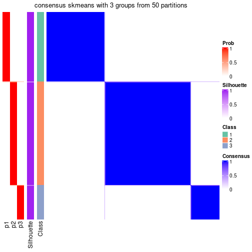</p>

</div>
<div id='tab-node-0-consensus-heatmap-3'>
<pre><code class="r">consensus_heatmap(res, k = 4)
</code></pre>

<p>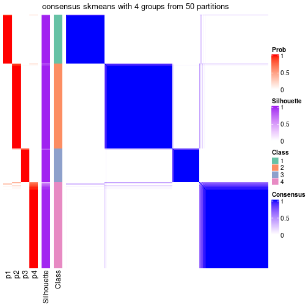</p>

</div>
<div id='tab-node-0-consensus-heatmap-4'>
<pre><code class="r">consensus_heatmap(res, k = 5)
</code></pre>

<p>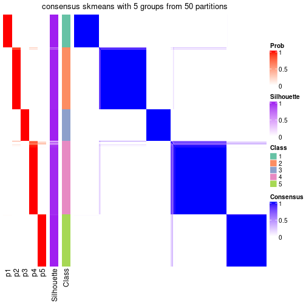</p>

</div>
<div id='tab-node-0-consensus-heatmap-5'>
<pre><code class="r">consensus_heatmap(res, k = 6)
</code></pre>

<p>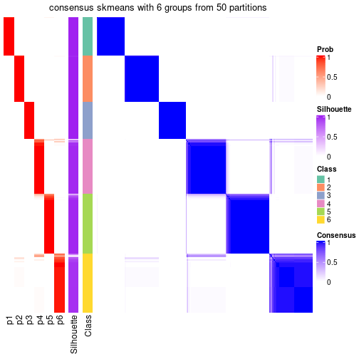</p>

</div>
<div id='tab-node-0-consensus-heatmap-6'>
<pre><code class="r">consensus_heatmap(res, k = 7)
</code></pre>

<p>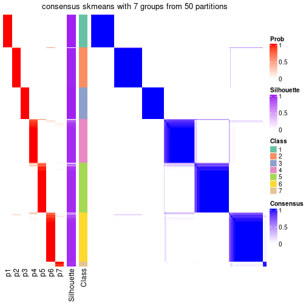</p>

</div>
<div id='tab-node-0-consensus-heatmap-7'>
<pre><code class="r">consensus_heatmap(res, k = 8)
</code></pre>

<p>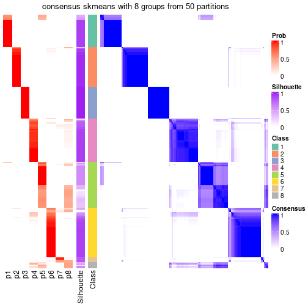</p>

</div>
</div>

Heatmaps for the membership of samples in all partitions to see how consistent they are:


<script>
$( function() {
	$( '#tabs-node-0-membership-heatmap' ).tabs();
} );
</script>
<div id='tabs-node-0-membership-heatmap'>
<ul>
<li><a href='#tab-node-0-membership-heatmap-1'>k = 2</a></li>
<li><a href='#tab-node-0-membership-heatmap-2'>k = 3</a></li>
<li><a href='#tab-node-0-membership-heatmap-3'>k = 4</a></li>
<li><a href='#tab-node-0-membership-heatmap-4'>k = 5</a></li>
<li><a href='#tab-node-0-membership-heatmap-5'>k = 6</a></li>
<li><a href='#tab-node-0-membership-heatmap-6'>k = 7</a></li>
<li><a href='#tab-node-0-membership-heatmap-7'>k = 8</a></li>
</ul>
<div id='tab-node-0-membership-heatmap-1'>
<pre><code class="r">membership_heatmap(res, k = 2)
</code></pre>

<p>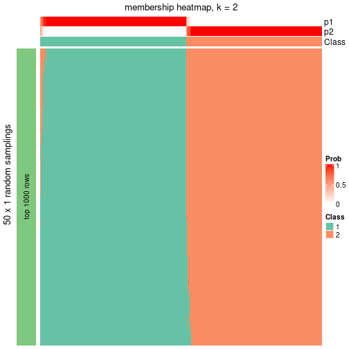</p>

</div>
<div id='tab-node-0-membership-heatmap-2'>
<pre><code class="r">membership_heatmap(res, k = 3)
</code></pre>

<p>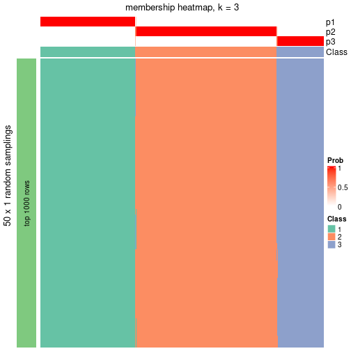</p>

</div>
<div id='tab-node-0-membership-heatmap-3'>
<pre><code class="r">membership_heatmap(res, k = 4)
</code></pre>

<p>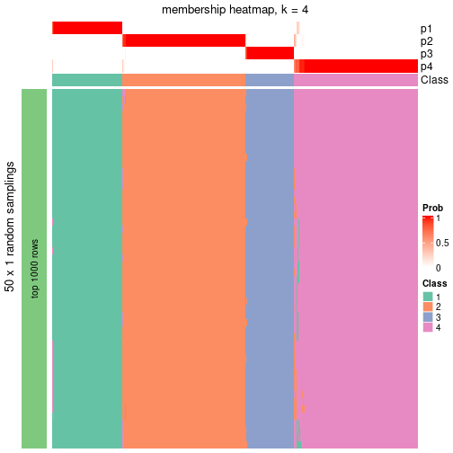</p>

</div>
<div id='tab-node-0-membership-heatmap-4'>
<pre><code class="r">membership_heatmap(res, k = 5)
</code></pre>

<p>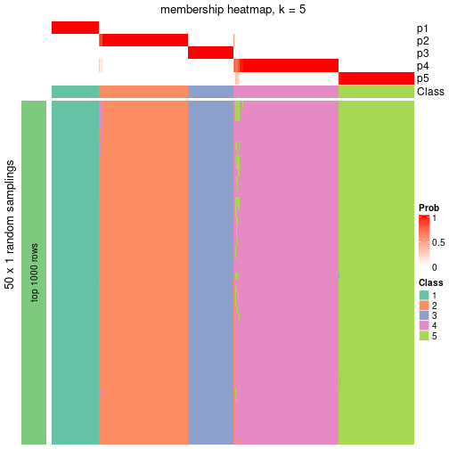</p>

</div>
<div id='tab-node-0-membership-heatmap-5'>
<pre><code class="r">membership_heatmap(res, k = 6)
</code></pre>

<p>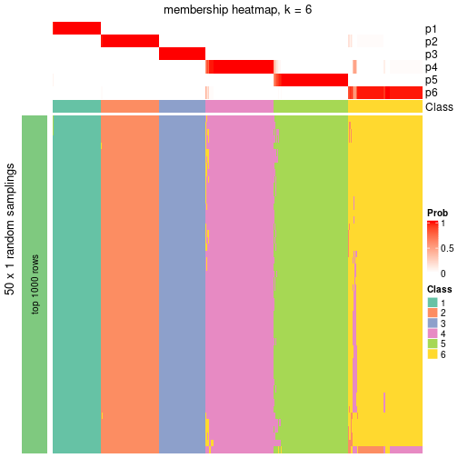</p>

</div>
<div id='tab-node-0-membership-heatmap-6'>
<pre><code class="r">membership_heatmap(res, k = 7)
</code></pre>

<p>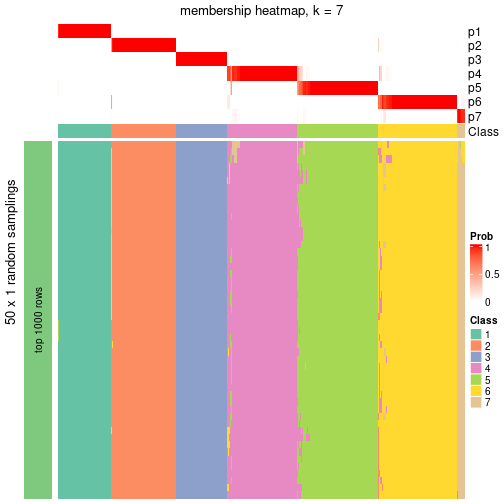</p>

</div>
<div id='tab-node-0-membership-heatmap-7'>
<pre><code class="r">membership_heatmap(res, k = 8)
</code></pre>

<p>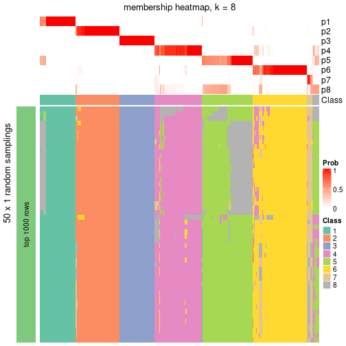</p>

</div>
</div>

As soon as the classes for columns are determined, the signatures
that are significantly different between subgroups can be looked for. 
Following are the heatmaps for signatures.


<script>
$( function() {
	$( '#tabs-node-0-get-signatures' ).tabs();
} );
</script>
<div id='tabs-node-0-get-signatures'>
<ul>
<li><a href='#tab-node-0-get-signatures-1'>k = 2</a></li>
<li><a href='#tab-node-0-get-signatures-2'>k = 3</a></li>
<li><a href='#tab-node-0-get-signatures-3'>k = 4</a></li>
<li><a href='#tab-node-0-get-signatures-4'>k = 5</a></li>
<li><a href='#tab-node-0-get-signatures-5'>k = 6</a></li>
<li><a href='#tab-node-0-get-signatures-6'>k = 7</a></li>
<li><a href='#tab-node-0-get-signatures-7'>k = 8</a></li>
</ul>
<div id='tab-node-0-get-signatures-1'>
<pre><code class="r">get_signatures(res, k = 2)
</code></pre>

<p></p>

</div>
<div id='tab-node-0-get-signatures-2'>
<pre><code class="r">get_signatures(res, k = 3)
</code></pre>

<p>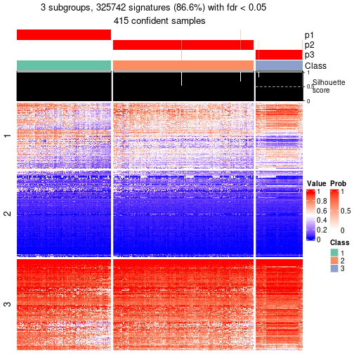</p>

</div>
<div id='tab-node-0-get-signatures-3'>
<pre><code class="r">get_signatures(res, k = 4)
</code></pre>

<p>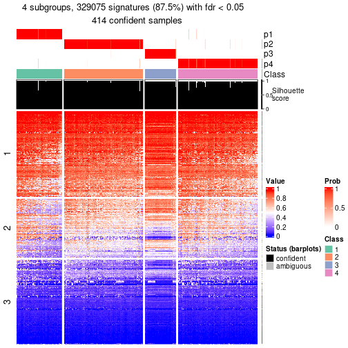</p>

</div>
<div id='tab-node-0-get-signatures-4'>
<pre><code class="r">get_signatures(res, k = 5)
</code></pre>

<p>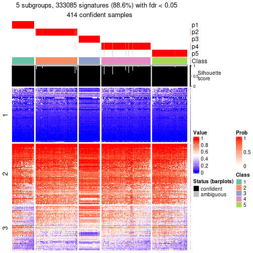</p>

</div>
<div id='tab-node-0-get-signatures-5'>
<pre><code class="r">get_signatures(res, k = 6)
</code></pre>

<p>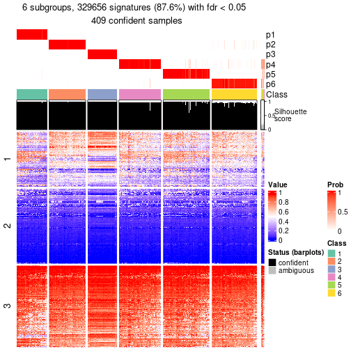</p>

</div>
<div id='tab-node-0-get-signatures-6'>
<pre><code class="r">get_signatures(res, k = 7)
</code></pre>

<p>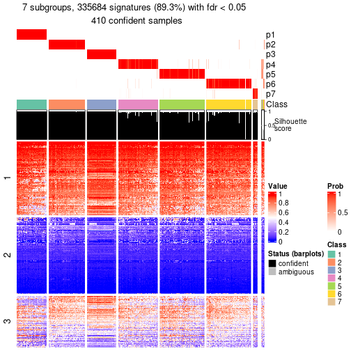</p>

</div>
<div id='tab-node-0-get-signatures-7'>
<pre><code class="r">get_signatures(res, k = 8)
</code></pre>

<p>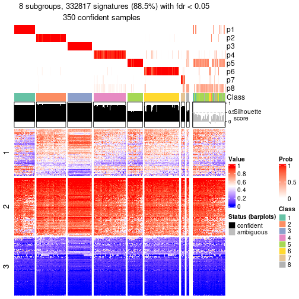</p>

</div>
</div>


Compare the overlap of signatures from different k:

```r
compare_signatures(res)
```

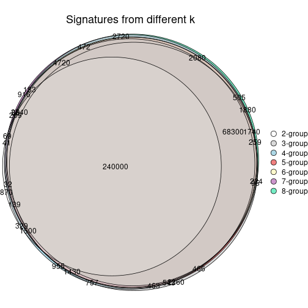

`get_signature()` returns a data frame invisibly. To get the list of signatures, the function
call should be assigned to a variable explicitly. In following code, if `plot` argument is set
to `FALSE`, no heatmap is plotted while only the differential analysis is performed.

```r
# code only for demonstration
tb = get_signature(res, k = ..., plot = FALSE)
```

An example of the output of `tb` is:

```
#>   which_row         fdr    mean_1    mean_2 scaled_mean_1 scaled_mean_2 km
#> 1        38 0.042760348  8.373488  9.131774    -0.5533452     0.5164555  1
#> 2        40 0.018707592  7.106213  8.469186    -0.6173731     0.5762149  1
#> 3        55 0.019134737 10.221463 11.207825    -0.6159697     0.5749050  1
#> 4        59 0.006059896  5.921854  7.869574    -0.6899429     0.6439467  1
#> 5        60 0.018055526  8.928898 10.211722    -0.6204761     0.5791110  1
#> 6        98 0.009384629 15.714769 14.887706     0.6635654    -0.6193277  2
...
```

The columns in `tb` are:

1. `which_row`: row indices corresponding to the input matrix.
2. `fdr`: FDR for the differential test. 
3. `mean_x`: The mean value in group x.
4. `scaled_mean_x`: The mean value in group x after rows are scaled.
5. `km`: Row groups if k-means clustering is applied to rows (which is done by automatically selecting number of clusters).

If there are too many signatures, `top_signatures = ...` can be set to only show the 
signatures with the highest FDRs:

```r
# code only for demonstration
# e.g. to show the top 500 most significant rows
tb = get_signature(res, k = ..., top_signatures = 500)
```

If the signatures are defined as these which are uniquely high in current group, `diff_method` argument
can be set to `"uniquely_high_in_one_group"`:

```r
# code only for demonstration
tb = get_signature(res, k = ..., diff_method = "uniquely_high_in_one_group")
```


UMAP plot which shows how samples are separated.


<script>
$( function() {
	$( '#tabs-node-0-dimension-reduction' ).tabs();
} );
</script>
<div id='tabs-node-0-dimension-reduction'>
<ul>
<li><a href='#tab-node-0-dimension-reduction-1'>k = 2</a></li>
<li><a href='#tab-node-0-dimension-reduction-2'>k = 3</a></li>
<li><a href='#tab-node-0-dimension-reduction-3'>k = 4</a></li>
<li><a href='#tab-node-0-dimension-reduction-4'>k = 5</a></li>
<li><a href='#tab-node-0-dimension-reduction-5'>k = 6</a></li>
<li><a href='#tab-node-0-dimension-reduction-6'>k = 7</a></li>
<li><a href='#tab-node-0-dimension-reduction-7'>k = 8</a></li>
</ul>
<div id='tab-node-0-dimension-reduction-1'>
<pre><code class="r">dimension_reduction(res, k = 2, method = &quot;UMAP&quot;)
</code></pre>

<p>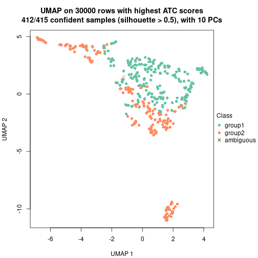</p>

</div>
<div id='tab-node-0-dimension-reduction-2'>
<pre><code class="r">dimension_reduction(res, k = 3, method = &quot;UMAP&quot;)
</code></pre>

<p>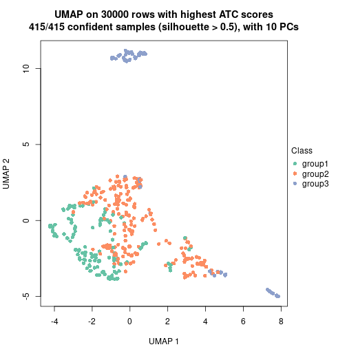</p>

</div>
<div id='tab-node-0-dimension-reduction-3'>
<pre><code class="r">dimension_reduction(res, k = 4, method = &quot;UMAP&quot;)
</code></pre>

<p>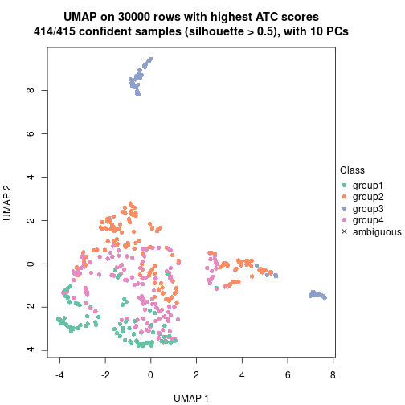</p>

</div>
<div id='tab-node-0-dimension-reduction-4'>
<pre><code class="r">dimension_reduction(res, k = 5, method = &quot;UMAP&quot;)
</code></pre>

<p>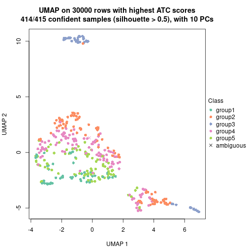</p>

</div>
<div id='tab-node-0-dimension-reduction-5'>
<pre><code class="r">dimension_reduction(res, k = 6, method = &quot;UMAP&quot;)
</code></pre>

<p>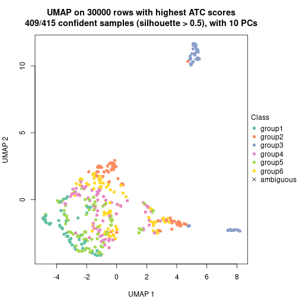</p>

</div>
<div id='tab-node-0-dimension-reduction-6'>
<pre><code class="r">dimension_reduction(res, k = 7, method = &quot;UMAP&quot;)
</code></pre>

<p>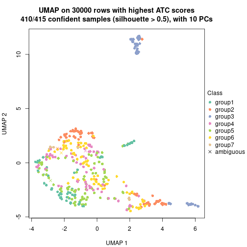</p>

</div>
<div id='tab-node-0-dimension-reduction-7'>
<pre><code class="r">dimension_reduction(res, k = 8, method = &quot;UMAP&quot;)
</code></pre>

<p>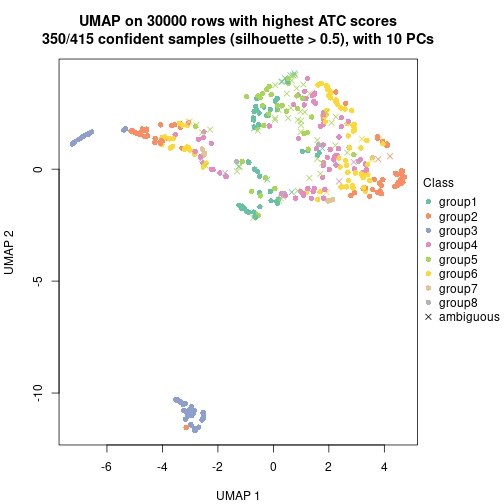</p>

</div>
</div>


Following heatmap shows how subgroups are split when increasing `k`:

```r
collect_classes(res)
```

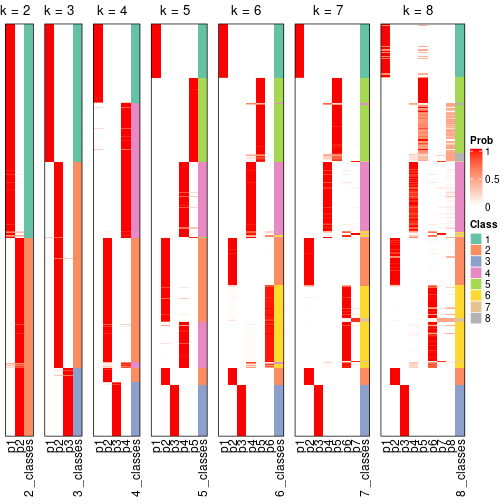


If matrix rows can be associated to genes, consider to use `functional_enrichment(res,
...)` to perform function enrichment for the signature genes. See [this vignette](https://jokergoo.github.io/cola_vignettes/functional_enrichment.html) for more detailed explanations.


 

---------------------------------------------------


### Node01


Parent node: [Node0](#Node0).
Child nodes: 
                [Node011](#Node011)
        ,
                [Node012](#Node012)
        ,
                Node013-leaf
        ,
                Node021-leaf
        ,
                Node022-leaf
        ,
                Node023-leaf
        ,
                [Node031](#Node031)
        ,
                Node032-leaf
        ,
                [Node033](#Node033)
        ,
                [Node034](#Node034)
        ,
                Node035-leaf
        ,
                [Node041](#Node041)
        ,
                [Node042](#Node042)
        ,
                [Node043](#Node043)
        ,
                [Node051](#Node051)
        ,
                [Node052](#Node052)
        ,
                [Node053](#Node053)
        .


The object with results only for a single top-value method and a single partitioning method 
can be extracted as:

```r
res = res_rh["01"]
```

A summary of `res` and all the functions that can be applied to it:

```r
res
```

```
#> A 'ConsensusPartition' object with k = 2, 3, 4, 5, 6, 7, 8.
#>   On a matrix with 30000 rows and 54 columns.
#>   Top rows (1000) are extracted by 'ATC' method.
#>   Subgroups are detected by 'kmeans' method.
#>   Performed in total 350 partitions by row resampling.
#>   Best k for subgroups seems to be 3.
#> 
#> Following methods can be applied to this 'ConsensusPartition' object:
#>  [1] "cola_report"             "collect_classes"         "collect_plots"          
#>  [4] "collect_stats"           "colnames"                "compare_partitions"     
#>  [7] "compare_signatures"      "consensus_heatmap"       "dimension_reduction"    
#> [10] "functional_enrichment"   "get_anno_col"            "get_anno"               
#> [13] "get_classes"             "get_consensus"           "get_matrix"             
#> [16] "get_membership"          "get_param"               "get_signatures"         
#> [19] "get_stats"               "is_best_k"               "is_stable_k"            
#> [22] "membership_heatmap"      "ncol"                    "nrow"                   
#> [25] "plot_ecdf"               "predict_classes"         "rownames"               
#> [28] "select_partition_number" "show"                    "suggest_best_k"         
#> [31] "test_to_known_factors"   "top_rows_heatmap"
```

`collect_plots()` function collects all the plots made from `res` for all `k` (number of subgroups)
into one single page to provide an easy and fast comparison between different `k`.

```r
collect_plots(res)
```

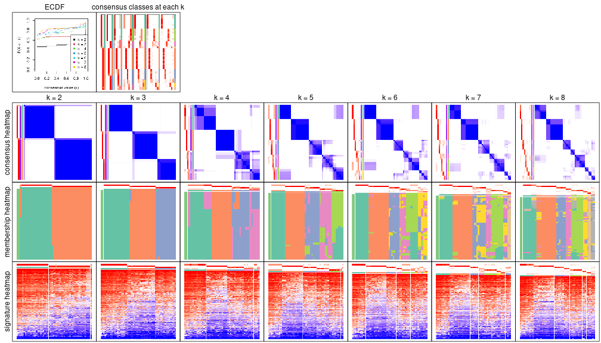

The plots are:

- The first row: a plot of the eCDF (empirical cumulative distribution
  function) curves of the consensus matrix for each `k` and the heatmap of
  predicted classes for each `k`.
- The second row: heatmaps of the consensus matrix for each `k`.
- The third row: heatmaps of the membership matrix for each `k`.
- The fouth row: heatmaps of the signatures for each `k`.

All the plots in panels can be made by individual functions and they are
plotted later in this section.

`select_partition_number()` produces several plots showing different
statistics for choosing "optimized" `k`. There are following statistics:

- eCDF curves of the consensus matrix for each `k`;
- 1-PAC. [The PAC score](https://en.wikipedia.org/wiki/Consensus_clustering#Over-interpretation_potential_of_consensus_clustering)
  measures the proportion of the ambiguous subgrouping.
- Mean silhouette score.
- Concordance. The mean probability of fiting the consensus subgroup labels in all
  partitions.
- Area increased. Denote $A_k$ as the area under the eCDF curve for current
  `k`, the area increased is defined as $A_k - A_{k-1}$.
- Rand index. The percent of pairs of samples that are both in a same cluster
  or both are not in a same cluster in the partition of k and k-1.
- Jaccard index. The ratio of pairs of samples are both in a same cluster in
  the partition of k and k-1 and the pairs of samples are both in a same
  cluster in the partition k or k-1.

The detailed explanations of these statistics can be found in [the _cola_
vignette](https://jokergoo.github.io/cola_vignettes/cola.html#toc_13).

Generally speaking, higher 1-PAC score, higher mean silhouette score or higher
concordance corresponds to better partition. Rand index and Jaccard index
measure how similar the current partition is compared to partition with `k-1`.
If they are too similar, we won't accept `k` is better than `k-1`.

```r
select_partition_number(res)
```

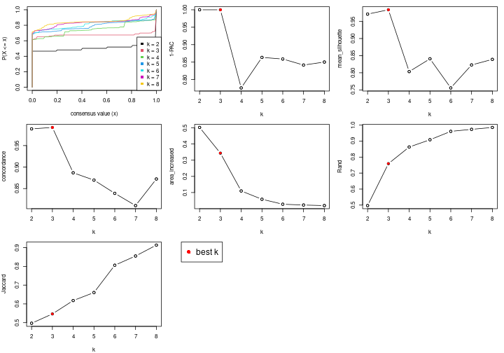

The numeric values for all these statistics can be obtained by `get_stats()`.

```r
get_stats(res)
```

```
#>   k 1-PAC mean_silhouette concordance area_increased  Rand Jaccard
#> 2 2 1.000           0.971       0.989         0.5024 0.497   0.497
#> 3 3 1.000           0.984       0.992         0.3435 0.759   0.547
#> 4 4 0.776           0.803       0.887         0.1098 0.863   0.618
#> 5 5 0.863           0.841       0.870         0.0584 0.908   0.661
#> 6 6 0.859           0.756       0.839         0.0279 0.961   0.806
#> 7 7 0.842           0.823       0.810         0.0229 0.973   0.856
#> 8 8 0.850           0.839       0.872         0.0195 0.985   0.914
```

`suggest_best_k()` suggests the best $k$ based on these statistics. The rules are as follows:

- All $k$ with Jaccard index larger than 0.95 are removed because increasing
  $k$ does not provide enough extra information. If all $k$ are removed, it is
  marked as no subgroup is detected.
- For all $k$ with 1-PAC score larger than 0.9, the maximal $k$ is taken as
  the best $k$, and other $k$ are marked as optional $k$.
- If it does not fit the second rule. The $k$ with the maximal vote of the
  highest 1-PAC score, highest mean silhouette, and highest concordance is
  taken as the best $k$.

```r
suggest_best_k(res)
```

```
#> [1] 3
#> attr(,"optional")
#> [1] 2
```

There is also optional best $k$ = 2 that is worth to check.

Following is the table of the partitions (You need to click the **show/hide
code output** link to see it). The membership matrix (columns with name `p*`)
is inferred by
[`clue::cl_consensus()`](https://www.rdocumentation.org/link/cl_consensus?package=clue)
function with the `SE` method. Basically the value in the membership matrix
represents the probability to belong to a certain group. The finall subgroup
label for an item is determined with the group with highest probability it
belongs to.

In `get_classes()` function, the entropy is calculated from the membership
matrix and the silhouette score is calculated from the consensus matrix.


<script>
$( function() {
	$( '#tabs-node-01-get-classes' ).tabs();
} );
</script>
<div id='tabs-node-01-get-classes'>
<ul>
<li><a href='#tab-node-01-get-classes-1'>k = 2</a></li>
<li><a href='#tab-node-01-get-classes-2'>k = 3</a></li>
<li><a href='#tab-node-01-get-classes-3'>k = 4</a></li>
<li><a href='#tab-node-01-get-classes-4'>k = 5</a></li>
<li><a href='#tab-node-01-get-classes-5'>k = 6</a></li>
<li><a href='#tab-node-01-get-classes-6'>k = 7</a></li>
<li><a href='#tab-node-01-get-classes-7'>k = 8</a></li>
</ul>

<div id='tab-node-01-get-classes-1'>
<p><a id='tab-node-01-get-classes-1-a' style='color:#0366d6' href='#'>show/hide code output</a></p>
<pre><code class="r">cbind(get_classes(res, k = 2), get_membership(res, k = 2))
</code></pre>

<pre><code>#&gt;                 class entropy silhouette  p1  p2
#&gt; TCGA.85.8071.01     2   0.000      0.993 0.0 1.0
#&gt; TCGA.77.8150.01     1   0.000      0.982 1.0 0.0
#&gt; TCGA.56.8083.01     2   0.000      0.993 0.0 1.0
#&gt; TCGA.33.AASD.01     1   0.000      0.982 1.0 0.0
#&gt; TCGA.77.6845.01     1   0.000      0.982 1.0 0.0
#&gt; TCGA.77.8148.01     2   0.000      0.993 0.0 1.0
#&gt; TCGA.63.7023.01     2   0.000      0.993 0.0 1.0
#&gt; TCGA.85.8070.01     2   0.000      0.993 0.0 1.0
#&gt; TCGA.56.8082.01     2   0.000      0.993 0.0 1.0
#&gt; TCGA.63.5128.01     1   0.000      0.982 1.0 0.0
#&gt; TCGA.56.7823.01     2   0.000      0.993 0.0 1.0
#&gt; TCGA.77.8128.01     2   0.000      0.993 0.0 1.0
#&gt; TCGA.58.A46N.01     1   0.000      0.982 1.0 0.0
#&gt; TCGA.68.7755.01     1   0.000      0.982 1.0 0.0
#&gt; TCGA.56.A4BX.01     2   0.000      0.993 0.0 1.0
#&gt; TCGA.56.7730.01     1   0.000      0.982 1.0 0.0
#&gt; TCGA.22.5477.01     1   0.000      0.982 1.0 0.0
#&gt; TCGA.22.5491.01     1   0.000      0.982 1.0 0.0
#&gt; TCGA.85.A4QR.01     2   0.000      0.993 0.0 1.0
#&gt; TCGA.90.7769.01     1   0.000      0.982 1.0 0.0
#&gt; TCGA.18.5592.01     1   0.000      0.982 1.0 0.0
#&gt; TCGA.18.5595.01     1   0.000      0.982 1.0 0.0
#&gt; TCGA.85.8664.01     2   0.722      0.742 0.2 0.8
#&gt; TCGA.77.8153.01     2   0.000      0.993 0.0 1.0
#&gt; TCGA.77.A5G3.01     1   0.000      0.982 1.0 0.0
#&gt; TCGA.56.7582.01     1   0.000      0.982 1.0 0.0
#&gt; TCGA.63.A5ML.01     1   0.000      0.982 1.0 0.0
#&gt; TCGA.77.7140.01     2   0.000      0.993 0.0 1.0
#&gt; TCGA.58.8392.01     2   0.000      0.993 0.0 1.0
#&gt; TCGA.58.8390.01     2   0.000      0.993 0.0 1.0
#&gt; TCGA.94.8490.01     1   0.000      0.982 1.0 0.0
#&gt; TCGA.77.A5G6.01     1   0.971      0.320 0.6 0.4
#&gt; TCGA.77.8009.01     1   0.000      0.982 1.0 0.0
#&gt; TCGA.77.7139.01     2   0.000      0.993 0.0 1.0
#&gt; TCGA.34.8456.01     2   0.000      0.993 0.0 1.0
#&gt; TCGA.85.8354.01     1   0.000      0.982 1.0 0.0
#&gt; TCGA.63.A5MH.01     2   0.000      0.993 0.0 1.0
#&gt; TCGA.33.A5GW.01     1   0.000      0.982 1.0 0.0
#&gt; TCGA.85.A5B5.01     1   0.000      0.982 1.0 0.0
#&gt; TCGA.46.6026.01     2   0.000      0.993 0.0 1.0
#&gt; TCGA.NK.A5CR.01     2   0.000      0.993 0.0 1.0
#&gt; TCGA.NC.A5HH.01     2   0.000      0.993 0.0 1.0
#&gt; TCGA.34.5231.01     2   0.000      0.993 0.0 1.0
#&gt; TCGA.63.A5MY.01     2   0.000      0.993 0.0 1.0
#&gt; TCGA.NC.A5HT.01     2   0.000      0.993 0.0 1.0
#&gt; TCGA.22.4593.01     2   0.000      0.993 0.0 1.0
#&gt; TCGA.63.A5MU.01     2   0.000      0.993 0.0 1.0
#&gt; TCGA.43.6143.01     2   0.000      0.993 0.0 1.0
#&gt; TCGA.NC.A5HG.01     2   0.000      0.993 0.0 1.0
#&gt; TCGA.NC.A5HN.01     2   0.000      0.993 0.0 1.0
#&gt; TCGA.NC.A5HF.01     2   0.000      0.993 0.0 1.0
#&gt; TCGA.37.A5EL.01     1   0.000      0.982 1.0 0.0
#&gt; TCGA.70.6723.01     1   0.000      0.982 1.0 0.0
#&gt; TCGA.MF.A522.01     1   0.000      0.982 1.0 0.0
</code></pre>

<script>
$('#tab-node-01-get-classes-1-a').parent().next().next().hide();
$('#tab-node-01-get-classes-1-a').click(function(){
  $('#tab-node-01-get-classes-1-a').parent().next().next().toggle();
  return(false);
});
</script>
</div>

<div id='tab-node-01-get-classes-2'>
<p><a id='tab-node-01-get-classes-2-a' style='color:#0366d6' href='#'>show/hide code output</a></p>
<pre><code class="r">cbind(get_classes(res, k = 3), get_membership(res, k = 3))
</code></pre>

<pre><code>#&gt;                 class entropy silhouette   p1   p2   p3
#&gt; TCGA.85.8071.01     2  0.0000      0.983 0.00 1.00 0.00
#&gt; TCGA.77.8150.01     3  0.0000      0.993 0.00 0.00 1.00
#&gt; TCGA.56.8083.01     2  0.0000      0.983 0.00 1.00 0.00
#&gt; TCGA.33.AASD.01     1  0.0000      1.000 1.00 0.00 0.00
#&gt; TCGA.77.6845.01     1  0.0000      1.000 1.00 0.00 0.00
#&gt; TCGA.77.8148.01     2  0.0000      0.983 0.00 1.00 0.00
#&gt; TCGA.63.7023.01     3  0.0000      0.993 0.00 0.00 1.00
#&gt; TCGA.85.8070.01     3  0.0000      0.993 0.00 0.00 1.00
#&gt; TCGA.56.8082.01     2  0.0000      0.983 0.00 1.00 0.00
#&gt; TCGA.63.5128.01     1  0.0000      1.000 1.00 0.00 0.00
#&gt; TCGA.56.7823.01     2  0.0000      0.983 0.00 1.00 0.00
#&gt; TCGA.77.8128.01     3  0.1529      0.960 0.00 0.04 0.96
#&gt; TCGA.58.A46N.01     1  0.0000      1.000 1.00 0.00 0.00
#&gt; TCGA.68.7755.01     1  0.0000      1.000 1.00 0.00 0.00
#&gt; TCGA.56.A4BX.01     2  0.0000      0.983 0.00 1.00 0.00
#&gt; TCGA.56.7730.01     1  0.0000      1.000 1.00 0.00 0.00
#&gt; TCGA.22.5477.01     1  0.0000      1.000 1.00 0.00 0.00
#&gt; TCGA.22.5491.01     3  0.0000      0.993 0.00 0.00 1.00
#&gt; TCGA.85.A4QR.01     2  0.0000      0.983 0.00 1.00 0.00
#&gt; TCGA.90.7769.01     1  0.0000      1.000 1.00 0.00 0.00
#&gt; TCGA.18.5592.01     1  0.0000      1.000 1.00 0.00 0.00
#&gt; TCGA.18.5595.01     3  0.0892      0.976 0.02 0.00 0.98
#&gt; TCGA.85.8664.01     3  0.0000      0.993 0.00 0.00 1.00
#&gt; TCGA.77.8153.01     3  0.0000      0.993 0.00 0.00 1.00
#&gt; TCGA.77.A5G3.01     1  0.0000      1.000 1.00 0.00 0.00
#&gt; TCGA.56.7582.01     1  0.0000      1.000 1.00 0.00 0.00
#&gt; TCGA.63.A5ML.01     1  0.0000      1.000 1.00 0.00 0.00
#&gt; TCGA.77.7140.01     3  0.0000      0.993 0.00 0.00 1.00
#&gt; TCGA.58.8392.01     3  0.0000      0.993 0.00 0.00 1.00
#&gt; TCGA.58.8390.01     2  0.0000      0.983 0.00 1.00 0.00
#&gt; TCGA.94.8490.01     1  0.0000      1.000 1.00 0.00 0.00
#&gt; TCGA.77.A5G6.01     3  0.0000      0.993 0.00 0.00 1.00
#&gt; TCGA.77.8009.01     1  0.0000      1.000 1.00 0.00 0.00
#&gt; TCGA.77.7139.01     2  0.0000      0.983 0.00 1.00 0.00
#&gt; TCGA.34.8456.01     3  0.0000      0.993 0.00 0.00 1.00
#&gt; TCGA.85.8354.01     3  0.0000      0.993 0.00 0.00 1.00
#&gt; TCGA.63.A5MH.01     3  0.0000      0.993 0.00 0.00 1.00
#&gt; TCGA.33.A5GW.01     1  0.0000      1.000 1.00 0.00 0.00
#&gt; TCGA.85.A5B5.01     1  0.0000      1.000 1.00 0.00 0.00
#&gt; TCGA.46.6026.01     2  0.0000      0.983 0.00 1.00 0.00
#&gt; TCGA.NK.A5CR.01     2  0.0000      0.983 0.00 1.00 0.00
#&gt; TCGA.NC.A5HH.01     2  0.0000      0.983 0.00 1.00 0.00
#&gt; TCGA.34.5231.01     2  0.0000      0.983 0.00 1.00 0.00
#&gt; TCGA.63.A5MY.01     2  0.3686      0.842 0.00 0.86 0.14
#&gt; TCGA.NC.A5HT.01     2  0.0000      0.983 0.00 1.00 0.00
#&gt; TCGA.22.4593.01     2  0.4291      0.790 0.00 0.82 0.18
#&gt; TCGA.63.A5MU.01     2  0.0000      0.983 0.00 1.00 0.00
#&gt; TCGA.43.6143.01     2  0.0000      0.983 0.00 1.00 0.00
#&gt; TCGA.NC.A5HG.01     2  0.0000      0.983 0.00 1.00 0.00
#&gt; TCGA.NC.A5HN.01     2  0.0000      0.983 0.00 1.00 0.00
#&gt; TCGA.NC.A5HF.01     3  0.1529      0.960 0.00 0.04 0.96
#&gt; TCGA.37.A5EL.01     1  0.0000      1.000 1.00 0.00 0.00
#&gt; TCGA.70.6723.01     1  0.0000      1.000 1.00 0.00 0.00
#&gt; TCGA.MF.A522.01     1  0.0000      1.000 1.00 0.00 0.00
</code></pre>

<script>
$('#tab-node-01-get-classes-2-a').parent().next().next().hide();
$('#tab-node-01-get-classes-2-a').click(function(){
  $('#tab-node-01-get-classes-2-a').parent().next().next().toggle();
  return(false);
});
</script>
</div>

<div id='tab-node-01-get-classes-3'>
<p><a id='tab-node-01-get-classes-3-a' style='color:#0366d6' href='#'>show/hide code output</a></p>
<pre><code class="r">cbind(get_classes(res, k = 4), get_membership(res, k = 4))
</code></pre>

<pre><code>#&gt;                 class entropy silhouette   p1   p2   p3   p4
#&gt; TCGA.85.8071.01     2   0.000      1.000 0.00 1.00 0.00 0.00
#&gt; TCGA.77.8150.01     4   0.413      0.827 0.00 0.00 0.26 0.74
#&gt; TCGA.56.8083.01     2   0.000      1.000 0.00 1.00 0.00 0.00
#&gt; TCGA.33.AASD.01     1   0.413      0.854 0.74 0.00 0.00 0.26
#&gt; TCGA.77.6845.01     1   0.000      0.800 1.00 0.00 0.00 0.00
#&gt; TCGA.77.8148.01     2   0.000      1.000 0.00 1.00 0.00 0.00
#&gt; TCGA.63.7023.01     3   0.121      0.757 0.00 0.00 0.96 0.04
#&gt; TCGA.85.8070.01     3   0.292      0.635 0.00 0.00 0.86 0.14
#&gt; TCGA.56.8082.01     2   0.000      1.000 0.00 1.00 0.00 0.00
#&gt; TCGA.63.5128.01     4   0.441      0.618 0.30 0.00 0.00 0.70
#&gt; TCGA.56.7823.01     2   0.000      1.000 0.00 1.00 0.00 0.00
#&gt; TCGA.77.8128.01     3   0.000      0.769 0.00 0.00 1.00 0.00
#&gt; TCGA.58.A46N.01     1   0.000      0.800 1.00 0.00 0.00 0.00
#&gt; TCGA.68.7755.01     1   0.000      0.800 1.00 0.00 0.00 0.00
#&gt; TCGA.56.A4BX.01     3   0.413      0.639 0.00 0.26 0.74 0.00
#&gt; TCGA.56.7730.01     1   0.413      0.854 0.74 0.00 0.00 0.26
#&gt; TCGA.22.5477.01     1   0.000      0.800 1.00 0.00 0.00 0.00
#&gt; TCGA.22.5491.01     4   0.413      0.827 0.00 0.00 0.26 0.74
#&gt; TCGA.85.A4QR.01     3   0.413      0.639 0.00 0.26 0.74 0.00
#&gt; TCGA.90.7769.01     1   0.000      0.800 1.00 0.00 0.00 0.00
#&gt; TCGA.18.5592.01     1   0.413      0.854 0.74 0.00 0.00 0.26
#&gt; TCGA.18.5595.01     4   0.413      0.652 0.26 0.00 0.00 0.74
#&gt; TCGA.85.8664.01     4   0.413      0.827 0.00 0.00 0.26 0.74
#&gt; TCGA.77.8153.01     3   0.499     -0.396 0.00 0.00 0.52 0.48
#&gt; TCGA.77.A5G3.01     1   0.413      0.473 0.74 0.00 0.00 0.26
#&gt; TCGA.56.7582.01     1   0.413      0.854 0.74 0.00 0.00 0.26
#&gt; TCGA.63.A5ML.01     1   0.413      0.854 0.74 0.00 0.00 0.26
#&gt; TCGA.77.7140.01     3   0.121      0.757 0.00 0.00 0.96 0.04
#&gt; TCGA.58.8392.01     3   0.000      0.769 0.00 0.00 1.00 0.00
#&gt; TCGA.58.8390.01     2   0.000      1.000 0.00 1.00 0.00 0.00
#&gt; TCGA.94.8490.01     1   0.413      0.854 0.74 0.00 0.00 0.26
#&gt; TCGA.77.A5G6.01     4   0.413      0.827 0.00 0.00 0.26 0.74
#&gt; TCGA.77.8009.01     1   0.413      0.854 0.74 0.00 0.00 0.26
#&gt; TCGA.77.7139.01     2   0.000      1.000 0.00 1.00 0.00 0.00
#&gt; TCGA.34.8456.01     3   0.121      0.757 0.00 0.00 0.96 0.04
#&gt; TCGA.85.8354.01     4   0.413      0.827 0.00 0.00 0.26 0.74
#&gt; TCGA.63.A5MH.01     4   0.498      0.457 0.00 0.00 0.46 0.54
#&gt; TCGA.33.A5GW.01     1   0.413      0.854 0.74 0.00 0.00 0.26
#&gt; TCGA.85.A5B5.01     1   0.413      0.473 0.74 0.00 0.00 0.26
#&gt; TCGA.46.6026.01     2   0.000      1.000 0.00 1.00 0.00 0.00
#&gt; TCGA.NK.A5CR.01     3   0.413      0.639 0.00 0.26 0.74 0.00
#&gt; TCGA.NC.A5HH.01     2   0.000      1.000 0.00 1.00 0.00 0.00
#&gt; TCGA.34.5231.01     2   0.000      1.000 0.00 1.00 0.00 0.00
#&gt; TCGA.63.A5MY.01     3   0.234      0.751 0.00 0.10 0.90 0.00
#&gt; TCGA.NC.A5HT.01     2   0.000      1.000 0.00 1.00 0.00 0.00
#&gt; TCGA.22.4593.01     3   0.234      0.751 0.00 0.10 0.90 0.00
#&gt; TCGA.63.A5MU.01     2   0.000      1.000 0.00 1.00 0.00 0.00
#&gt; TCGA.43.6143.01     2   0.000      1.000 0.00 1.00 0.00 0.00
#&gt; TCGA.NC.A5HG.01     2   0.000      1.000 0.00 1.00 0.00 0.00
#&gt; TCGA.NC.A5HN.01     2   0.000      1.000 0.00 1.00 0.00 0.00
#&gt; TCGA.NC.A5HF.01     3   0.000      0.769 0.00 0.00 1.00 0.00
#&gt; TCGA.37.A5EL.01     1   0.413      0.854 0.74 0.00 0.00 0.26
#&gt; TCGA.70.6723.01     1   0.000      0.800 1.00 0.00 0.00 0.00
#&gt; TCGA.MF.A522.01     1   0.413      0.854 0.74 0.00 0.00 0.26
</code></pre>

<script>
$('#tab-node-01-get-classes-3-a').parent().next().next().hide();
$('#tab-node-01-get-classes-3-a').click(function(){
  $('#tab-node-01-get-classes-3-a').parent().next().next().toggle();
  return(false);
});
</script>
</div>

<div id='tab-node-01-get-classes-4'>
<p><a id='tab-node-01-get-classes-4-a' style='color:#0366d6' href='#'>show/hide code output</a></p>
<pre><code class="r">cbind(get_classes(res, k = 5), get_membership(res, k = 5))
</code></pre>

<pre><code>#&gt;                 class entropy silhouette   p1   p2   p3   p4   p5
#&gt; TCGA.85.8071.01     2  0.0000      0.995 0.00 1.00 0.00 0.00 0.00
#&gt; TCGA.77.8150.01     4  0.0609      0.784 0.00 0.00 0.00 0.98 0.02
#&gt; TCGA.56.8083.01     2  0.0000      0.995 0.00 1.00 0.00 0.00 0.00
#&gt; TCGA.33.AASD.01     1  0.4287      1.000 0.54 0.00 0.00 0.00 0.46
#&gt; TCGA.77.6845.01     5  0.1043      0.712 0.04 0.00 0.00 0.00 0.96
#&gt; TCGA.77.8148.01     2  0.0000      0.995 0.00 1.00 0.00 0.00 0.00
#&gt; TCGA.63.7023.01     3  0.6033      0.533 0.22 0.00 0.58 0.20 0.00
#&gt; TCGA.85.8070.01     4  0.5498      0.612 0.34 0.00 0.08 0.58 0.00
#&gt; TCGA.56.8082.01     2  0.0609      0.987 0.02 0.98 0.00 0.00 0.00
#&gt; TCGA.63.5128.01     5  0.4262      0.231 0.00 0.00 0.00 0.44 0.56
#&gt; TCGA.56.7823.01     2  0.0000      0.995 0.00 1.00 0.00 0.00 0.00
#&gt; TCGA.77.8128.01     3  0.1043      0.836 0.04 0.00 0.96 0.00 0.00
#&gt; TCGA.58.A46N.01     5  0.0000      0.748 0.00 0.00 0.00 0.00 1.00
#&gt; TCGA.68.7755.01     5  0.1043      0.712 0.04 0.00 0.00 0.00 0.96
#&gt; TCGA.56.A4BX.01     3  0.0000      0.840 0.00 0.00 1.00 0.00 0.00
#&gt; TCGA.56.7730.01     1  0.4287      1.000 0.54 0.00 0.00 0.00 0.46
#&gt; TCGA.22.5477.01     5  0.0609      0.738 0.02 0.00 0.00 0.00 0.98
#&gt; TCGA.22.5491.01     4  0.0609      0.784 0.00 0.00 0.00 0.98 0.02
#&gt; TCGA.85.A4QR.01     3  0.0000      0.840 0.00 0.00 1.00 0.00 0.00
#&gt; TCGA.90.7769.01     5  0.0000      0.748 0.00 0.00 0.00 0.00 1.00
#&gt; TCGA.18.5592.01     1  0.4287      1.000 0.54 0.00 0.00 0.00 0.46
#&gt; TCGA.18.5595.01     4  0.3109      0.568 0.00 0.00 0.00 0.80 0.20
#&gt; TCGA.85.8664.01     4  0.3424      0.795 0.24 0.00 0.00 0.76 0.00
#&gt; TCGA.77.8153.01     4  0.5156      0.654 0.32 0.00 0.06 0.62 0.00
#&gt; TCGA.77.A5G3.01     5  0.3274      0.662 0.00 0.00 0.00 0.22 0.78
#&gt; TCGA.56.7582.01     1  0.4287      1.000 0.54 0.00 0.00 0.00 0.46
#&gt; TCGA.63.A5ML.01     1  0.4287      1.000 0.54 0.00 0.00 0.00 0.46
#&gt; TCGA.77.7140.01     3  0.6610      0.252 0.26 0.00 0.46 0.28 0.00
#&gt; TCGA.58.8392.01     3  0.2732      0.787 0.16 0.00 0.84 0.00 0.00
#&gt; TCGA.58.8390.01     2  0.0609      0.987 0.02 0.98 0.00 0.00 0.00
#&gt; TCGA.94.8490.01     1  0.4287      1.000 0.54 0.00 0.00 0.00 0.46
#&gt; TCGA.77.A5G6.01     4  0.3109      0.802 0.20 0.00 0.00 0.80 0.00
#&gt; TCGA.77.8009.01     1  0.4287      1.000 0.54 0.00 0.00 0.00 0.46
#&gt; TCGA.77.7139.01     2  0.0000      0.995 0.00 1.00 0.00 0.00 0.00
#&gt; TCGA.34.8456.01     3  0.6033      0.533 0.22 0.00 0.58 0.20 0.00
#&gt; TCGA.85.8354.01     4  0.1410      0.804 0.06 0.00 0.00 0.94 0.00
#&gt; TCGA.63.A5MH.01     4  0.3999      0.787 0.24 0.00 0.02 0.74 0.00
#&gt; TCGA.33.A5GW.01     1  0.4287      1.000 0.54 0.00 0.00 0.00 0.46
#&gt; TCGA.85.A5B5.01     5  0.3274      0.662 0.00 0.00 0.00 0.22 0.78
#&gt; TCGA.46.6026.01     2  0.0000      0.995 0.00 1.00 0.00 0.00 0.00
#&gt; TCGA.NK.A5CR.01     3  0.1410      0.833 0.06 0.00 0.94 0.00 0.00
#&gt; TCGA.NC.A5HH.01     2  0.0609      0.987 0.02 0.98 0.00 0.00 0.00
#&gt; TCGA.34.5231.01     2  0.0000      0.995 0.00 1.00 0.00 0.00 0.00
#&gt; TCGA.63.A5MY.01     3  0.0609      0.834 0.02 0.00 0.98 0.00 0.00
#&gt; TCGA.NC.A5HT.01     2  0.0000      0.995 0.00 1.00 0.00 0.00 0.00
#&gt; TCGA.22.4593.01     3  0.0000      0.840 0.00 0.00 1.00 0.00 0.00
#&gt; TCGA.63.A5MU.01     2  0.0609      0.987 0.02 0.98 0.00 0.00 0.00
#&gt; TCGA.43.6143.01     2  0.0000      0.995 0.00 1.00 0.00 0.00 0.00
#&gt; TCGA.NC.A5HG.01     2  0.0000      0.995 0.00 1.00 0.00 0.00 0.00
#&gt; TCGA.NC.A5HN.01     2  0.0000      0.995 0.00 1.00 0.00 0.00 0.00
#&gt; TCGA.NC.A5HF.01     3  0.0000      0.840 0.00 0.00 1.00 0.00 0.00
#&gt; TCGA.37.A5EL.01     1  0.4287      1.000 0.54 0.00 0.00 0.00 0.46
#&gt; TCGA.70.6723.01     5  0.0609      0.738 0.02 0.00 0.00 0.00 0.98
#&gt; TCGA.MF.A522.01     1  0.4287      1.000 0.54 0.00 0.00 0.00 0.46
</code></pre>

<script>
$('#tab-node-01-get-classes-4-a').parent().next().next().hide();
$('#tab-node-01-get-classes-4-a').click(function(){
  $('#tab-node-01-get-classes-4-a').parent().next().next().toggle();
  return(false);
});
</script>
</div>

<div id='tab-node-01-get-classes-5'>
<p><a id='tab-node-01-get-classes-5-a' style='color:#0366d6' href='#'>show/hide code output</a></p>
<pre><code class="r">cbind(get_classes(res, k = 6), get_membership(res, k = 6))
</code></pre>

<pre><code>#&gt;                 class entropy silhouette   p1   p2   p3   p4   p5   p6
#&gt; TCGA.85.8071.01     2  0.0000     0.9794 0.00 1.00 0.00 0.00 0.00 0.00
#&gt; TCGA.77.8150.01     4  0.1814     0.7236 0.00 0.00 0.00 0.90 0.00 0.10
#&gt; TCGA.56.8083.01     2  0.0000     0.9794 0.00 1.00 0.00 0.00 0.00 0.00
#&gt; TCGA.33.AASD.01     1  0.0000     1.0000 1.00 0.00 0.00 0.00 0.00 0.00
#&gt; TCGA.77.6845.01     5  0.3851     0.6588 0.46 0.00 0.00 0.00 0.54 0.00
#&gt; TCGA.77.8148.01     2  0.0000     0.9794 0.00 1.00 0.00 0.00 0.00 0.00
#&gt; TCGA.63.7023.01     6  0.6938     0.2136 0.00 0.00 0.36 0.12 0.12 0.40
#&gt; TCGA.85.8070.01     6  0.2454     0.4555 0.00 0.00 0.00 0.16 0.00 0.84
#&gt; TCGA.56.8082.01     2  0.2725     0.9001 0.00 0.88 0.02 0.00 0.04 0.06
#&gt; TCGA.63.5128.01     5  0.3797     0.2506 0.00 0.00 0.00 0.42 0.58 0.00
#&gt; TCGA.56.7823.01     2  0.0000     0.9794 0.00 1.00 0.00 0.00 0.00 0.00
#&gt; TCGA.77.8128.01     3  0.1556     0.8166 0.00 0.00 0.92 0.00 0.00 0.08
#&gt; TCGA.58.A46N.01     5  0.3797     0.7119 0.42 0.00 0.00 0.00 0.58 0.00
#&gt; TCGA.68.7755.01     5  0.3851     0.6588 0.46 0.00 0.00 0.00 0.54 0.00
#&gt; TCGA.56.A4BX.01     3  0.0000     0.8528 0.00 0.00 1.00 0.00 0.00 0.00
#&gt; TCGA.56.7730.01     1  0.0000     1.0000 1.00 0.00 0.00 0.00 0.00 0.00
#&gt; TCGA.22.5477.01     5  0.3797     0.7119 0.42 0.00 0.00 0.00 0.58 0.00
#&gt; TCGA.22.5491.01     4  0.0000     0.7259 0.00 0.00 0.00 1.00 0.00 0.00
#&gt; TCGA.85.A4QR.01     3  0.1865     0.8369 0.00 0.00 0.92 0.00 0.04 0.04
#&gt; TCGA.90.7769.01     5  0.3797     0.7119 0.42 0.00 0.00 0.00 0.58 0.00
#&gt; TCGA.18.5592.01     1  0.0000     1.0000 1.00 0.00 0.00 0.00 0.00 0.00
#&gt; TCGA.18.5595.01     4  0.2260     0.6474 0.00 0.00 0.00 0.86 0.14 0.00
#&gt; TCGA.85.8664.01     6  0.6047     0.0932 0.00 0.00 0.00 0.34 0.26 0.40
#&gt; TCGA.77.8153.01     6  0.4121     0.4561 0.00 0.00 0.06 0.22 0.00 0.72
#&gt; TCGA.77.A5G3.01     5  0.4758     0.4083 0.06 0.00 0.00 0.36 0.58 0.00
#&gt; TCGA.56.7582.01     1  0.0000     1.0000 1.00 0.00 0.00 0.00 0.00 0.00
#&gt; TCGA.63.A5ML.01     1  0.0000     1.0000 1.00 0.00 0.00 0.00 0.00 0.00
#&gt; TCGA.77.7140.01     6  0.4306     0.4903 0.00 0.00 0.12 0.10 0.02 0.76
#&gt; TCGA.58.8392.01     3  0.5083     0.2587 0.00 0.00 0.58 0.00 0.10 0.32
#&gt; TCGA.58.8390.01     2  0.1807     0.9344 0.00 0.92 0.02 0.00 0.00 0.06
#&gt; TCGA.94.8490.01     1  0.0000     1.0000 1.00 0.00 0.00 0.00 0.00 0.00
#&gt; TCGA.77.A5G6.01     4  0.5438     0.1540 0.00 0.00 0.00 0.56 0.28 0.16
#&gt; TCGA.77.8009.01     1  0.0000     1.0000 1.00 0.00 0.00 0.00 0.00 0.00
#&gt; TCGA.77.7139.01     2  0.0000     0.9794 0.00 1.00 0.00 0.00 0.00 0.00
#&gt; TCGA.34.8456.01     6  0.6938     0.2136 0.00 0.00 0.36 0.12 0.12 0.40
#&gt; TCGA.85.8354.01     4  0.2048     0.7173 0.00 0.00 0.00 0.88 0.00 0.12
#&gt; TCGA.63.A5MH.01     6  0.6070     0.1230 0.00 0.00 0.00 0.32 0.28 0.40
#&gt; TCGA.33.A5GW.01     1  0.0000     1.0000 1.00 0.00 0.00 0.00 0.00 0.00
#&gt; TCGA.85.A5B5.01     5  0.4758     0.4083 0.06 0.00 0.00 0.36 0.58 0.00
#&gt; TCGA.46.6026.01     2  0.0000     0.9794 0.00 1.00 0.00 0.00 0.00 0.00
#&gt; TCGA.NK.A5CR.01     3  0.2190     0.8299 0.00 0.00 0.90 0.00 0.04 0.06
#&gt; TCGA.NC.A5HH.01     2  0.1807     0.9344 0.00 0.92 0.02 0.00 0.00 0.06
#&gt; TCGA.34.5231.01     2  0.0000     0.9794 0.00 1.00 0.00 0.00 0.00 0.00
#&gt; TCGA.63.A5MY.01     3  0.3270     0.7755 0.00 0.00 0.82 0.00 0.06 0.12
#&gt; TCGA.NC.A5HT.01     2  0.0000     0.9794 0.00 1.00 0.00 0.00 0.00 0.00
#&gt; TCGA.22.4593.01     3  0.1480     0.8476 0.00 0.00 0.94 0.00 0.02 0.04
#&gt; TCGA.63.A5MU.01     2  0.1092     0.9590 0.00 0.96 0.02 0.00 0.00 0.02
#&gt; TCGA.43.6143.01     2  0.0000     0.9794 0.00 1.00 0.00 0.00 0.00 0.00
#&gt; TCGA.NC.A5HG.01     2  0.0000     0.9794 0.00 1.00 0.00 0.00 0.00 0.00
#&gt; TCGA.NC.A5HN.01     2  0.0000     0.9794 0.00 1.00 0.00 0.00 0.00 0.00
#&gt; TCGA.NC.A5HF.01     3  0.0547     0.8504 0.00 0.00 0.98 0.00 0.02 0.00
#&gt; TCGA.37.A5EL.01     1  0.0000     1.0000 1.00 0.00 0.00 0.00 0.00 0.00
#&gt; TCGA.70.6723.01     5  0.3797     0.7119 0.42 0.00 0.00 0.00 0.58 0.00
#&gt; TCGA.MF.A522.01     1  0.0000     1.0000 1.00 0.00 0.00 0.00 0.00 0.00
</code></pre>

<script>
$('#tab-node-01-get-classes-5-a').parent().next().next().hide();
$('#tab-node-01-get-classes-5-a').click(function(){
  $('#tab-node-01-get-classes-5-a').parent().next().next().toggle();
  return(false);
});
</script>
</div>

<div id='tab-node-01-get-classes-6'>
<p><a id='tab-node-01-get-classes-6-a' style='color:#0366d6' href='#'>show/hide code output</a></p>
<pre><code class="r">cbind(get_classes(res, k = 7), get_membership(res, k = 7))
</code></pre>

<pre><code>#&gt;                 class entropy silhouette   p1   p2   p3   p4   p5   p6   p7
#&gt; TCGA.85.8071.01     2  0.0000      0.963 0.00 1.00 0.00 0.00 0.00 0.00 0.00
#&gt; TCGA.77.8150.01     4  0.6404      0.709 0.00 0.00 0.00 0.38 0.18 0.36 0.08
#&gt; TCGA.56.8083.01     2  0.0000      0.963 0.00 1.00 0.00 0.00 0.00 0.00 0.00
#&gt; TCGA.33.AASD.01     1  0.1363      0.956 0.94 0.00 0.00 0.00 0.02 0.00 0.04
#&gt; TCGA.77.6845.01     5  0.3388      0.846 0.20 0.00 0.00 0.00 0.76 0.00 0.04
#&gt; TCGA.77.8148.01     2  0.0000      0.963 0.00 1.00 0.00 0.00 0.00 0.00 0.00
#&gt; TCGA.63.7023.01     3  0.6661      0.352 0.00 0.00 0.40 0.30 0.00 0.16 0.14
#&gt; TCGA.85.8070.01     6  0.1886      0.778 0.00 0.00 0.00 0.12 0.00 0.88 0.00
#&gt; TCGA.56.8082.01     2  0.2081      0.887 0.00 0.86 0.00 0.14 0.00 0.00 0.00
#&gt; TCGA.63.5128.01     5  0.1363      0.668 0.00 0.00 0.00 0.04 0.94 0.00 0.02
#&gt; TCGA.56.7823.01     2  0.0000      0.963 0.00 1.00 0.00 0.00 0.00 0.00 0.00
#&gt; TCGA.77.8128.01     3  0.2376      0.679 0.00 0.00 0.86 0.02 0.00 0.12 0.00
#&gt; TCGA.58.A46N.01     5  0.2906      0.851 0.18 0.00 0.00 0.00 0.80 0.00 0.02
#&gt; TCGA.68.7755.01     5  0.3388      0.846 0.20 0.00 0.00 0.00 0.76 0.00 0.04
#&gt; TCGA.56.A4BX.01     3  0.0504      0.714 0.00 0.00 0.98 0.02 0.00 0.00 0.00
#&gt; TCGA.56.7730.01     1  0.1363      0.956 0.94 0.00 0.00 0.00 0.02 0.00 0.04
#&gt; TCGA.22.5477.01     5  0.3052      0.850 0.20 0.00 0.00 0.00 0.78 0.00 0.02
#&gt; TCGA.22.5491.01     4  0.6368      0.716 0.00 0.00 0.00 0.50 0.18 0.14 0.18
#&gt; TCGA.85.A4QR.01     3  0.1433      0.701 0.00 0.00 0.92 0.08 0.00 0.00 0.00
#&gt; TCGA.90.7769.01     5  0.2906      0.851 0.18 0.00 0.00 0.00 0.80 0.00 0.02
#&gt; TCGA.18.5592.01     1  0.1363      0.956 0.94 0.00 0.00 0.00 0.02 0.00 0.04
#&gt; TCGA.18.5595.01     4  0.6355      0.666 0.00 0.00 0.00 0.42 0.34 0.10 0.14
#&gt; TCGA.85.8664.01     7  0.2081      0.877 0.00 0.00 0.00 0.00 0.00 0.14 0.86
#&gt; TCGA.77.8153.01     6  0.1718      0.804 0.00 0.00 0.00 0.04 0.00 0.92 0.04
#&gt; TCGA.77.A5G3.01     5  0.1006      0.726 0.02 0.00 0.00 0.02 0.96 0.00 0.00
#&gt; TCGA.56.7582.01     1  0.0000      0.972 1.00 0.00 0.00 0.00 0.00 0.00 0.00
#&gt; TCGA.63.A5ML.01     1  0.0000      0.972 1.00 0.00 0.00 0.00 0.00 0.00 0.00
#&gt; TCGA.77.7140.01     6  0.1664      0.828 0.00 0.00 0.06 0.00 0.00 0.92 0.02
#&gt; TCGA.58.8392.01     3  0.5128      0.483 0.00 0.00 0.54 0.28 0.00 0.18 0.00
#&gt; TCGA.58.8390.01     2  0.2081      0.887 0.00 0.86 0.00 0.14 0.00 0.00 0.00
#&gt; TCGA.94.8490.01     1  0.0000      0.972 1.00 0.00 0.00 0.00 0.00 0.00 0.00
#&gt; TCGA.77.A5G6.01     7  0.2864      0.730 0.00 0.00 0.00 0.12 0.02 0.02 0.84
#&gt; TCGA.77.8009.01     1  0.0000      0.972 1.00 0.00 0.00 0.00 0.00 0.00 0.00
#&gt; TCGA.77.7139.01     2  0.0000      0.963 0.00 1.00 0.00 0.00 0.00 0.00 0.00
#&gt; TCGA.34.8456.01     3  0.6661      0.352 0.00 0.00 0.40 0.30 0.00 0.16 0.14
#&gt; TCGA.85.8354.01     4  0.6468      0.732 0.00 0.00 0.00 0.42 0.14 0.32 0.12
#&gt; TCGA.63.A5MH.01     7  0.2081      0.877 0.00 0.00 0.00 0.00 0.00 0.14 0.86
#&gt; TCGA.33.A5GW.01     1  0.1363      0.956 0.94 0.00 0.00 0.00 0.02 0.00 0.04
#&gt; TCGA.85.A5B5.01     5  0.1505      0.722 0.02 0.00 0.00 0.02 0.94 0.00 0.02
#&gt; TCGA.46.6026.01     2  0.0000      0.963 0.00 1.00 0.00 0.00 0.00 0.00 0.00
#&gt; TCGA.NK.A5CR.01     3  0.4418      0.404 0.00 0.00 0.62 0.08 0.00 0.30 0.00
#&gt; TCGA.NC.A5HH.01     2  0.2081      0.887 0.00 0.86 0.00 0.14 0.00 0.00 0.00
#&gt; TCGA.34.5231.01     2  0.0000      0.963 0.00 1.00 0.00 0.00 0.00 0.00 0.00
#&gt; TCGA.63.A5MY.01     3  0.3263      0.610 0.00 0.00 0.80 0.12 0.00 0.08 0.00
#&gt; TCGA.NC.A5HT.01     2  0.0000      0.963 0.00 1.00 0.00 0.00 0.00 0.00 0.00
#&gt; TCGA.22.4593.01     3  0.0504      0.713 0.00 0.00 0.98 0.02 0.00 0.00 0.00
#&gt; TCGA.63.A5MU.01     2  0.1886      0.899 0.00 0.88 0.00 0.12 0.00 0.00 0.00
#&gt; TCGA.43.6143.01     2  0.0000      0.963 0.00 1.00 0.00 0.00 0.00 0.00 0.00
#&gt; TCGA.NC.A5HG.01     2  0.0000      0.963 0.00 1.00 0.00 0.00 0.00 0.00 0.00
#&gt; TCGA.NC.A5HN.01     2  0.0000      0.963 0.00 1.00 0.00 0.00 0.00 0.00 0.00
#&gt; TCGA.NC.A5HF.01     3  0.0000      0.713 0.00 0.00 1.00 0.00 0.00 0.00 0.00
#&gt; TCGA.37.A5EL.01     1  0.0000      0.972 1.00 0.00 0.00 0.00 0.00 0.00 0.00
#&gt; TCGA.70.6723.01     5  0.4139      0.828 0.20 0.00 0.00 0.02 0.72 0.00 0.06
#&gt; TCGA.MF.A522.01     1  0.0000      0.972 1.00 0.00 0.00 0.00 0.00 0.00 0.00
</code></pre>

<script>
$('#tab-node-01-get-classes-6-a').parent().next().next().hide();
$('#tab-node-01-get-classes-6-a').click(function(){
  $('#tab-node-01-get-classes-6-a').parent().next().next().toggle();
  return(false);
});
</script>
</div>

<div id='tab-node-01-get-classes-7'>
<p><a id='tab-node-01-get-classes-7-a' style='color:#0366d6' href='#'>show/hide code output</a></p>
<pre><code class="r">cbind(get_classes(res, k = 8), get_membership(res, k = 8))
</code></pre>

<pre><code>#&gt;                 class entropy silhouette   p1   p2   p3   p4   p5   p6   p7   p8
#&gt; TCGA.85.8071.01     2  0.0000      0.939 0.00 1.00 0.00 0.00 0.00 0.00 0.00 0.00
#&gt; TCGA.77.8150.01     4  0.3021      0.821 0.00 0.00 0.00 0.80 0.02 0.16 0.02 0.00
#&gt; TCGA.56.8083.01     2  0.0000      0.939 0.00 1.00 0.00 0.00 0.00 0.00 0.00 0.00
#&gt; TCGA.33.AASD.01     1  0.2534      0.841 0.78 0.00 0.00 0.00 0.00 0.00 0.00 0.22
#&gt; TCGA.77.6845.01     5  0.4333      0.726 0.12 0.00 0.00 0.00 0.62 0.00 0.00 0.26
#&gt; TCGA.77.8148.01     2  0.0000      0.939 0.00 1.00 0.00 0.00 0.00 0.00 0.00 0.00
#&gt; TCGA.63.7023.01     8  0.6570      0.833 0.00 0.00 0.12 0.08 0.00 0.18 0.12 0.50
#&gt; TCGA.85.8070.01     6  0.2807      0.810 0.00 0.00 0.00 0.02 0.06 0.86 0.02 0.04
#&gt; TCGA.56.8082.01     2  0.4075      0.794 0.00 0.76 0.00 0.04 0.02 0.02 0.02 0.14
#&gt; TCGA.63.5128.01     5  0.1341      0.771 0.00 0.00 0.00 0.08 0.92 0.00 0.00 0.00
#&gt; TCGA.56.7823.01     2  0.0000      0.939 0.00 1.00 0.00 0.00 0.00 0.00 0.00 0.00
#&gt; TCGA.77.8128.01     3  0.2547      0.721 0.00 0.00 0.84 0.00 0.00 0.12 0.00 0.04
#&gt; TCGA.58.A46N.01     5  0.1341      0.813 0.08 0.00 0.00 0.00 0.92 0.00 0.00 0.00
#&gt; TCGA.68.7755.01     5  0.4333      0.726 0.12 0.00 0.00 0.00 0.62 0.00 0.00 0.26
#&gt; TCGA.56.A4BX.01     3  0.1607      0.839 0.00 0.00 0.92 0.00 0.00 0.04 0.00 0.04
#&gt; TCGA.56.7730.01     1  0.2756      0.811 0.74 0.00 0.00 0.00 0.00 0.00 0.00 0.26
#&gt; TCGA.22.5477.01     5  0.3073      0.801 0.10 0.00 0.00 0.00 0.80 0.00 0.00 0.10
#&gt; TCGA.22.5491.01     4  0.1741      0.789 0.00 0.00 0.00 0.92 0.02 0.00 0.02 0.04
#&gt; TCGA.85.A4QR.01     3  0.1804      0.843 0.00 0.00 0.90 0.00 0.00 0.02 0.00 0.08
#&gt; TCGA.90.7769.01     5  0.1341      0.813 0.08 0.00 0.00 0.00 0.92 0.00 0.00 0.00
#&gt; TCGA.18.5592.01     1  0.2534      0.840 0.78 0.00 0.00 0.00 0.00 0.00 0.00 0.22
#&gt; TCGA.18.5595.01     4  0.2025      0.815 0.00 0.00 0.00 0.88 0.10 0.02 0.00 0.00
#&gt; TCGA.85.8664.01     7  0.1275      0.906 0.00 0.00 0.00 0.02 0.00 0.04 0.94 0.00
#&gt; TCGA.77.8153.01     6  0.2224      0.809 0.00 0.00 0.00 0.12 0.00 0.86 0.02 0.00
#&gt; TCGA.77.A5G3.01     5  0.1804      0.776 0.00 0.00 0.00 0.08 0.90 0.00 0.00 0.02
#&gt; TCGA.56.7582.01     1  0.0000      0.885 1.00 0.00 0.00 0.00 0.00 0.00 0.00 0.00
#&gt; TCGA.63.A5ML.01     1  0.0000      0.885 1.00 0.00 0.00 0.00 0.00 0.00 0.00 0.00
#&gt; TCGA.77.7140.01     6  0.1557      0.808 0.00 0.00 0.06 0.02 0.00 0.92 0.00 0.00
#&gt; TCGA.58.8392.01     8  0.5708      0.650 0.00 0.00 0.32 0.02 0.00 0.18 0.02 0.46
#&gt; TCGA.58.8390.01     2  0.3903      0.812 0.00 0.78 0.00 0.04 0.02 0.02 0.02 0.12
#&gt; TCGA.94.8490.01     1  0.0000      0.885 1.00 0.00 0.00 0.00 0.00 0.00 0.00 0.00
#&gt; TCGA.77.A5G6.01     7  0.2888      0.800 0.00 0.00 0.00 0.16 0.00 0.00 0.80 0.04
#&gt; TCGA.77.8009.01     1  0.0000      0.885 1.00 0.00 0.00 0.00 0.00 0.00 0.00 0.00
#&gt; TCGA.77.7139.01     2  0.0000      0.939 0.00 1.00 0.00 0.00 0.00 0.00 0.00 0.00
#&gt; TCGA.34.8456.01     8  0.6570      0.833 0.00 0.00 0.12 0.08 0.00 0.18 0.12 0.50
#&gt; TCGA.85.8354.01     4  0.2404      0.834 0.00 0.00 0.00 0.84 0.00 0.14 0.02 0.00
#&gt; TCGA.63.A5MH.01     7  0.1275      0.906 0.00 0.00 0.00 0.02 0.00 0.04 0.94 0.00
#&gt; TCGA.33.A5GW.01     1  0.2650      0.828 0.76 0.00 0.00 0.00 0.00 0.00 0.00 0.24
#&gt; TCGA.85.A5B5.01     5  0.1341      0.771 0.00 0.00 0.00 0.08 0.92 0.00 0.00 0.00
#&gt; TCGA.46.6026.01     2  0.0000      0.939 0.00 1.00 0.00 0.00 0.00 0.00 0.00 0.00
#&gt; TCGA.NK.A5CR.01     3  0.3675      0.745 0.00 0.00 0.76 0.00 0.02 0.14 0.00 0.08
#&gt; TCGA.NC.A5HH.01     2  0.3903      0.812 0.00 0.78 0.00 0.04 0.02 0.02 0.02 0.12
#&gt; TCGA.34.5231.01     2  0.0000      0.939 0.00 1.00 0.00 0.00 0.00 0.00 0.00 0.00
#&gt; TCGA.63.A5MY.01     3  0.3454      0.743 0.00 0.00 0.80 0.00 0.06 0.06 0.00 0.08
#&gt; TCGA.NC.A5HT.01     2  0.0000      0.939 0.00 1.00 0.00 0.00 0.00 0.00 0.00 0.00
#&gt; TCGA.22.4593.01     3  0.0808      0.843 0.00 0.00 0.96 0.00 0.00 0.00 0.00 0.04
#&gt; TCGA.63.A5MU.01     2  0.3714      0.826 0.00 0.80 0.00 0.04 0.02 0.02 0.02 0.10
#&gt; TCGA.43.6143.01     2  0.0000      0.939 0.00 1.00 0.00 0.00 0.00 0.00 0.00 0.00
#&gt; TCGA.NC.A5HG.01     2  0.0000      0.939 0.00 1.00 0.00 0.00 0.00 0.00 0.00 0.00
#&gt; TCGA.NC.A5HN.01     2  0.0000      0.939 0.00 1.00 0.00 0.00 0.00 0.00 0.00 0.00
#&gt; TCGA.NC.A5HF.01     3  0.0471      0.843 0.00 0.00 0.98 0.00 0.00 0.00 0.00 0.02
#&gt; TCGA.37.A5EL.01     1  0.0000      0.885 1.00 0.00 0.00 0.00 0.00 0.00 0.00 0.00
#&gt; TCGA.70.6723.01     5  0.4672      0.722 0.10 0.00 0.00 0.00 0.60 0.00 0.02 0.28
#&gt; TCGA.MF.A522.01     1  0.1091      0.881 0.94 0.00 0.00 0.00 0.00 0.00 0.00 0.06
</code></pre>

<script>
$('#tab-node-01-get-classes-7-a').parent().next().next().hide();
$('#tab-node-01-get-classes-7-a').click(function(){
  $('#tab-node-01-get-classes-7-a').parent().next().next().toggle();
  return(false);
});
</script>
</div>
</div>

Heatmaps for the consensus matrix. It visualizes the probability of two
samples to be in a same group.


<script>
$( function() {
	$( '#tabs-node-01-consensus-heatmap' ).tabs();
} );
</script>
<div id='tabs-node-01-consensus-heatmap'>
<ul>
<li><a href='#tab-node-01-consensus-heatmap-1'>k = 2</a></li>
<li><a href='#tab-node-01-consensus-heatmap-2'>k = 3</a></li>
<li><a href='#tab-node-01-consensus-heatmap-3'>k = 4</a></li>
<li><a href='#tab-node-01-consensus-heatmap-4'>k = 5</a></li>
<li><a href='#tab-node-01-consensus-heatmap-5'>k = 6</a></li>
<li><a href='#tab-node-01-consensus-heatmap-6'>k = 7</a></li>
<li><a href='#tab-node-01-consensus-heatmap-7'>k = 8</a></li>
</ul>
<div id='tab-node-01-consensus-heatmap-1'>
<pre><code class="r">consensus_heatmap(res, k = 2)
</code></pre>

<p>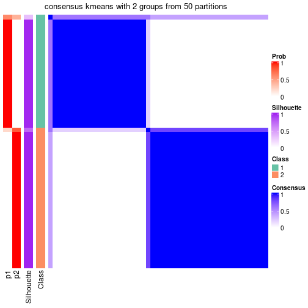</p>

</div>
<div id='tab-node-01-consensus-heatmap-2'>
<pre><code class="r">consensus_heatmap(res, k = 3)
</code></pre>

<p>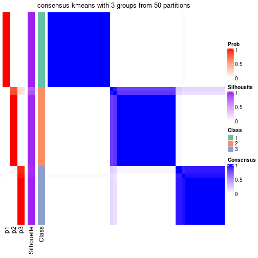</p>

</div>
<div id='tab-node-01-consensus-heatmap-3'>
<pre><code class="r">consensus_heatmap(res, k = 4)
</code></pre>

<p>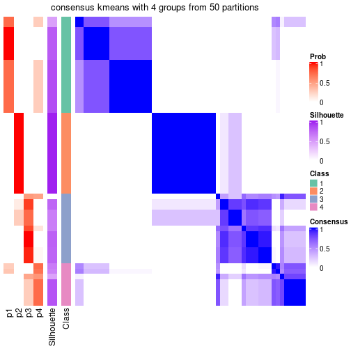</p>

</div>
<div id='tab-node-01-consensus-heatmap-4'>
<pre><code class="r">consensus_heatmap(res, k = 5)
</code></pre>

<p>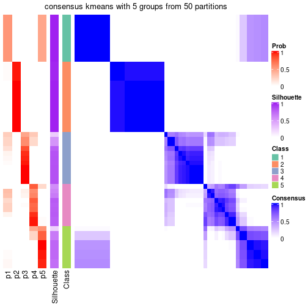</p>

</div>
<div id='tab-node-01-consensus-heatmap-5'>
<pre><code class="r">consensus_heatmap(res, k = 6)
</code></pre>

<p>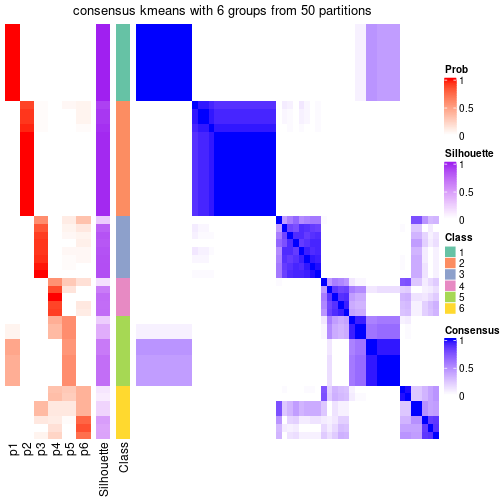</p>

</div>
<div id='tab-node-01-consensus-heatmap-6'>
<pre><code class="r">consensus_heatmap(res, k = 7)
</code></pre>

<p>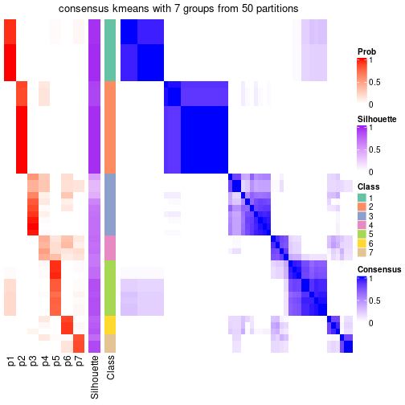</p>

</div>
<div id='tab-node-01-consensus-heatmap-7'>
<pre><code class="r">consensus_heatmap(res, k = 8)
</code></pre>

<p>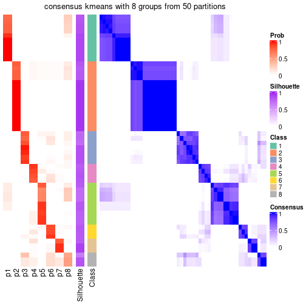</p>

</div>
</div>

Heatmaps for the membership of samples in all partitions to see how consistent they are:


<script>
$( function() {
	$( '#tabs-node-01-membership-heatmap' ).tabs();
} );
</script>
<div id='tabs-node-01-membership-heatmap'>
<ul>
<li><a href='#tab-node-01-membership-heatmap-1'>k = 2</a></li>
<li><a href='#tab-node-01-membership-heatmap-2'>k = 3</a></li>
<li><a href='#tab-node-01-membership-heatmap-3'>k = 4</a></li>
<li><a href='#tab-node-01-membership-heatmap-4'>k = 5</a></li>
<li><a href='#tab-node-01-membership-heatmap-5'>k = 6</a></li>
<li><a href='#tab-node-01-membership-heatmap-6'>k = 7</a></li>
<li><a href='#tab-node-01-membership-heatmap-7'>k = 8</a></li>
</ul>
<div id='tab-node-01-membership-heatmap-1'>
<pre><code class="r">membership_heatmap(res, k = 2)
</code></pre>

<p></p>

</div>
<div id='tab-node-01-membership-heatmap-2'>
<pre><code class="r">membership_heatmap(res, k = 3)
</code></pre>

<p>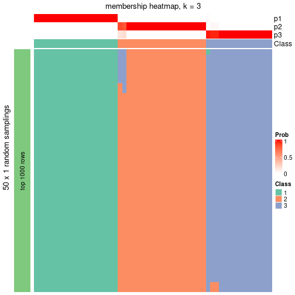</p>

</div>
<div id='tab-node-01-membership-heatmap-3'>
<pre><code class="r">membership_heatmap(res, k = 4)
</code></pre>

<p>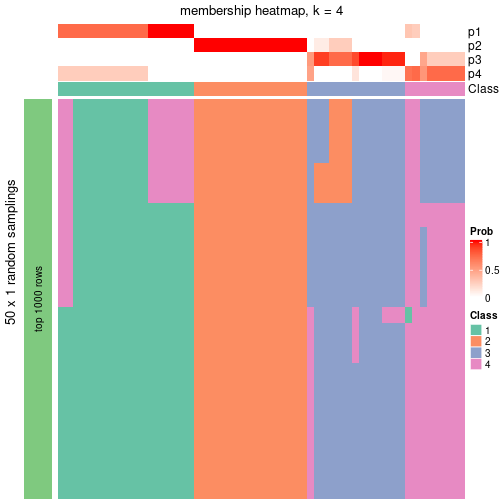</p>

</div>
<div id='tab-node-01-membership-heatmap-4'>
<pre><code class="r">membership_heatmap(res, k = 5)
</code></pre>

<p>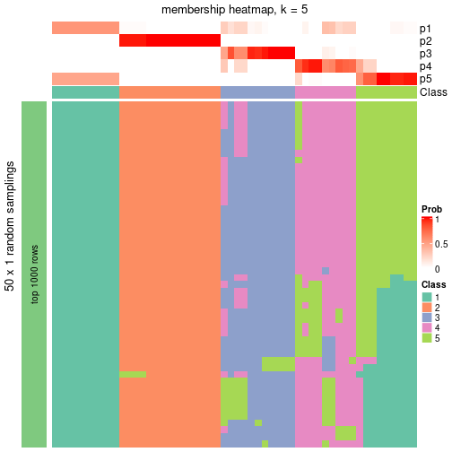</p>

</div>
<div id='tab-node-01-membership-heatmap-5'>
<pre><code class="r">membership_heatmap(res, k = 6)
</code></pre>

<p>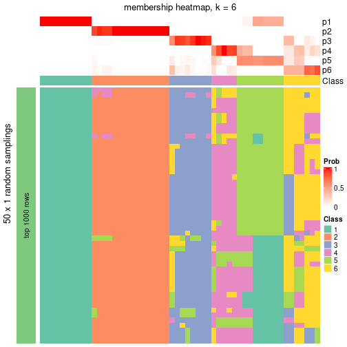</p>

</div>
<div id='tab-node-01-membership-heatmap-6'>
<pre><code class="r">membership_heatmap(res, k = 7)
</code></pre>

<p>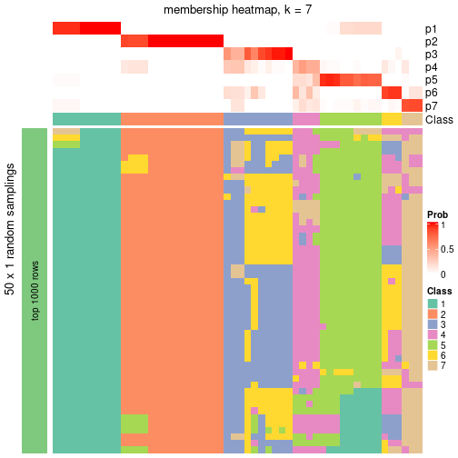</p>

</div>
<div id='tab-node-01-membership-heatmap-7'>
<pre><code class="r">membership_heatmap(res, k = 8)
</code></pre>

<p>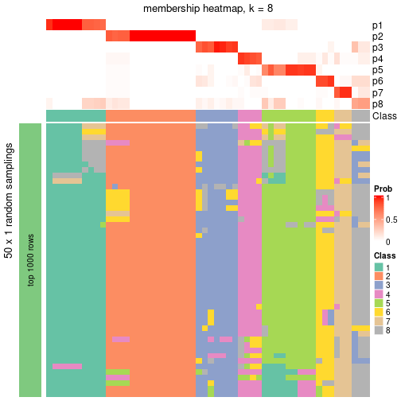</p>

</div>
</div>

As soon as the classes for columns are determined, the signatures
that are significantly different between subgroups can be looked for. 
Following are the heatmaps for signatures.


<script>
$( function() {
	$( '#tabs-node-01-get-signatures' ).tabs();
} );
</script>
<div id='tabs-node-01-get-signatures'>
<ul>
<li><a href='#tab-node-01-get-signatures-1'>k = 2</a></li>
<li><a href='#tab-node-01-get-signatures-2'>k = 3</a></li>
<li><a href='#tab-node-01-get-signatures-3'>k = 4</a></li>
<li><a href='#tab-node-01-get-signatures-4'>k = 5</a></li>
<li><a href='#tab-node-01-get-signatures-5'>k = 6</a></li>
<li><a href='#tab-node-01-get-signatures-6'>k = 7</a></li>
<li><a href='#tab-node-01-get-signatures-7'>k = 8</a></li>
</ul>
<div id='tab-node-01-get-signatures-1'>
<pre><code class="r">get_signatures(res, k = 2)
</code></pre>

<p>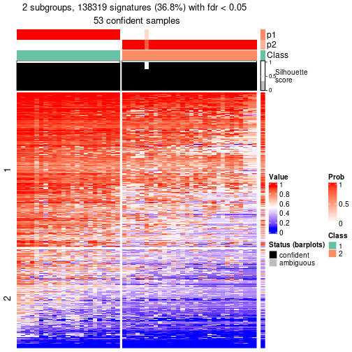</p>

</div>
<div id='tab-node-01-get-signatures-2'>
<pre><code class="r">get_signatures(res, k = 3)
</code></pre>

<p>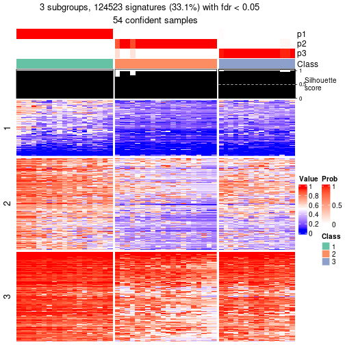</p>

</div>
<div id='tab-node-01-get-signatures-3'>
<pre><code class="r">get_signatures(res, k = 4)
</code></pre>

<p>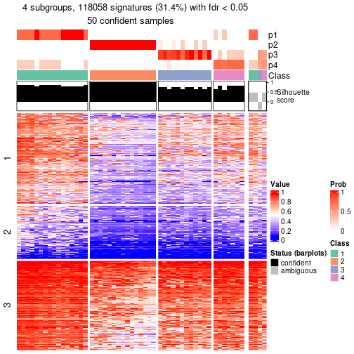</p>

</div>
<div id='tab-node-01-get-signatures-4'>
<pre><code class="r">get_signatures(res, k = 5)
</code></pre>

<p>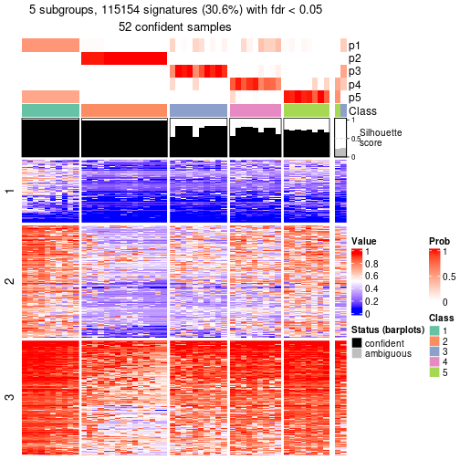</p>

</div>
<div id='tab-node-01-get-signatures-5'>
<pre><code class="r">get_signatures(res, k = 6)
</code></pre>

<p>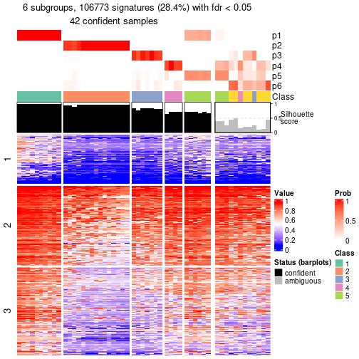</p>

</div>
<div id='tab-node-01-get-signatures-6'>
<pre><code class="r">get_signatures(res, k = 7)
</code></pre>

<p>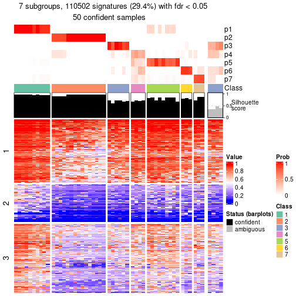</p>

</div>
<div id='tab-node-01-get-signatures-7'>
<pre><code class="r">get_signatures(res, k = 8)
</code></pre>

<p>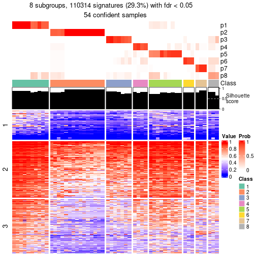</p>

</div>
</div>


Compare the overlap of signatures from different k:

```r
compare_signatures(res)
```

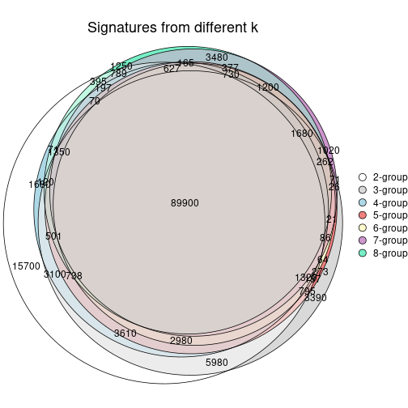

`get_signature()` returns a data frame invisibly. To get the list of signatures, the function
call should be assigned to a variable explicitly. In following code, if `plot` argument is set
to `FALSE`, no heatmap is plotted while only the differential analysis is performed.

```r
# code only for demonstration
tb = get_signature(res, k = ..., plot = FALSE)
```

An example of the output of `tb` is:

```
#>   which_row         fdr    mean_1    mean_2 scaled_mean_1 scaled_mean_2 km
#> 1        38 0.042760348  8.373488  9.131774    -0.5533452     0.5164555  1
#> 2        40 0.018707592  7.106213  8.469186    -0.6173731     0.5762149  1
#> 3        55 0.019134737 10.221463 11.207825    -0.6159697     0.5749050  1
#> 4        59 0.006059896  5.921854  7.869574    -0.6899429     0.6439467  1
#> 5        60 0.018055526  8.928898 10.211722    -0.6204761     0.5791110  1
#> 6        98 0.009384629 15.714769 14.887706     0.6635654    -0.6193277  2
...
```

The columns in `tb` are:

1. `which_row`: row indices corresponding to the input matrix.
2. `fdr`: FDR for the differential test. 
3. `mean_x`: The mean value in group x.
4. `scaled_mean_x`: The mean value in group x after rows are scaled.
5. `km`: Row groups if k-means clustering is applied to rows (which is done by automatically selecting number of clusters).

If there are too many signatures, `top_signatures = ...` can be set to only show the 
signatures with the highest FDRs:

```r
# code only for demonstration
# e.g. to show the top 500 most significant rows
tb = get_signature(res, k = ..., top_signatures = 500)
```

If the signatures are defined as these which are uniquely high in current group, `diff_method` argument
can be set to `"uniquely_high_in_one_group"`:

```r
# code only for demonstration
tb = get_signature(res, k = ..., diff_method = "uniquely_high_in_one_group")
```


UMAP plot which shows how samples are separated.


<script>
$( function() {
	$( '#tabs-node-01-dimension-reduction' ).tabs();
} );
</script>
<div id='tabs-node-01-dimension-reduction'>
<ul>
<li><a href='#tab-node-01-dimension-reduction-1'>k = 2</a></li>
<li><a href='#tab-node-01-dimension-reduction-2'>k = 3</a></li>
<li><a href='#tab-node-01-dimension-reduction-3'>k = 4</a></li>
<li><a href='#tab-node-01-dimension-reduction-4'>k = 5</a></li>
<li><a href='#tab-node-01-dimension-reduction-5'>k = 6</a></li>
<li><a href='#tab-node-01-dimension-reduction-6'>k = 7</a></li>
<li><a href='#tab-node-01-dimension-reduction-7'>k = 8</a></li>
</ul>
<div id='tab-node-01-dimension-reduction-1'>
<pre><code class="r">dimension_reduction(res, k = 2, method = &quot;UMAP&quot;)
</code></pre>

<p>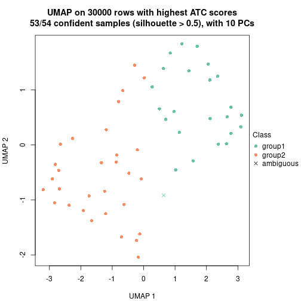</p>

</div>
<div id='tab-node-01-dimension-reduction-2'>
<pre><code class="r">dimension_reduction(res, k = 3, method = &quot;UMAP&quot;)
</code></pre>

<p>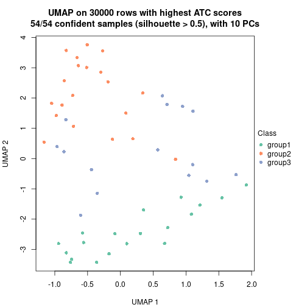</p>

</div>
<div id='tab-node-01-dimension-reduction-3'>
<pre><code class="r">dimension_reduction(res, k = 4, method = &quot;UMAP&quot;)
</code></pre>

<p>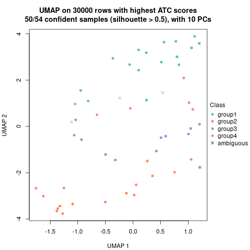</p>

</div>
<div id='tab-node-01-dimension-reduction-4'>
<pre><code class="r">dimension_reduction(res, k = 5, method = &quot;UMAP&quot;)
</code></pre>

<p>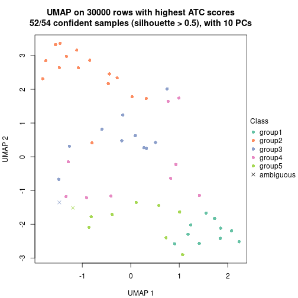</p>

</div>
<div id='tab-node-01-dimension-reduction-5'>
<pre><code class="r">dimension_reduction(res, k = 6, method = &quot;UMAP&quot;)
</code></pre>

<p>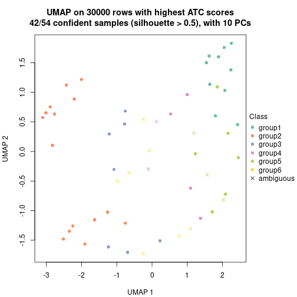</p>

</div>
<div id='tab-node-01-dimension-reduction-6'>
<pre><code class="r">dimension_reduction(res, k = 7, method = &quot;UMAP&quot;)
</code></pre>

<p>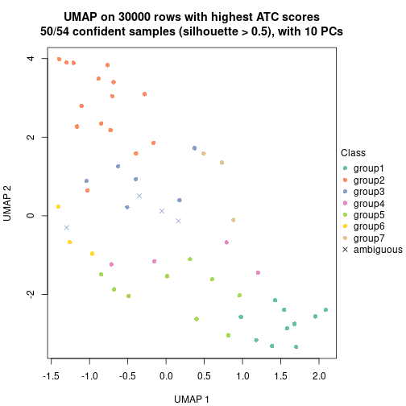</p>

</div>
<div id='tab-node-01-dimension-reduction-7'>
<pre><code class="r">dimension_reduction(res, k = 8, method = &quot;UMAP&quot;)
</code></pre>

<p>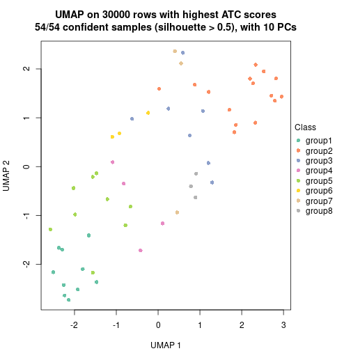</p>

</div>
</div>


Following heatmap shows how subgroups are split when increasing `k`:

```r
collect_classes(res)
```

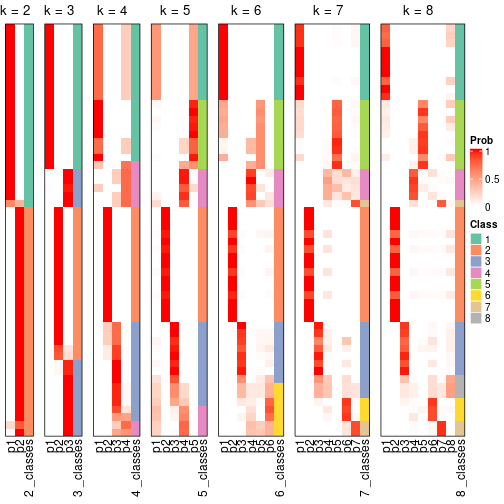


If matrix rows can be associated to genes, consider to use `functional_enrichment(res,
...)` to perform function enrichment for the signature genes. See [this vignette](https://jokergoo.github.io/cola_vignettes/functional_enrichment.html) for more detailed explanations.


 

---------------------------------------------------


### Node011


Parent node: [Node01](#Node01).
Child nodes: 
                Node0111-leaf
        ,
                Node0112-leaf
        ,
                Node0113-leaf
        ,
                Node0121-leaf
        ,
                Node0122-leaf
        ,
                Node0123-leaf
        ,
                Node0124-leaf
        ,
                Node0311-leaf
        ,
                Node0312-leaf
        ,
                Node0331-leaf
        ,
                Node0332-leaf
        ,
                Node0341-leaf
        ,
                Node0342-leaf
        ,
                Node0411-leaf
        ,
                [Node0412](#Node0412)
        ,
                Node0413-leaf
        ,
                Node0421-leaf
        ,
                Node0422-leaf
        ,
                Node0423-leaf
        ,
                Node0431-leaf
        ,
                [Node0432](#Node0432)
        ,
                Node0433-leaf
        ,
                Node0511-leaf
        ,
                Node0512-leaf
        ,
                Node0513-leaf
        ,
                [Node0521](#Node0521)
        ,
                Node0522-leaf
        ,
                Node0531-leaf
        ,
                Node0532-leaf
        ,
                Node0533-leaf
        .


The object with results only for a single top-value method and a single partitioning method 
can be extracted as:

```r
res = res_rh["011"]
```

A summary of `res` and all the functions that can be applied to it:

```r
res
```

```
#> A 'ConsensusPartition' object with k = 2, 3, 4, 5, 6, 7, 8.
#>   On a matrix with 30000 rows and 19 columns.
#>   Top rows (1000) are extracted by 'ATC' method.
#>   Subgroups are detected by 'kmeans' method.
#>   Performed in total 350 partitions by row resampling.
#>   Best k for subgroups seems to be 3.
#> 
#> Following methods can be applied to this 'ConsensusPartition' object:
#>  [1] "cola_report"             "collect_classes"         "collect_plots"          
#>  [4] "collect_stats"           "colnames"                "compare_partitions"     
#>  [7] "compare_signatures"      "consensus_heatmap"       "dimension_reduction"    
#> [10] "functional_enrichment"   "get_anno_col"            "get_anno"               
#> [13] "get_classes"             "get_consensus"           "get_matrix"             
#> [16] "get_membership"          "get_param"               "get_signatures"         
#> [19] "get_stats"               "is_best_k"               "is_stable_k"            
#> [22] "membership_heatmap"      "ncol"                    "nrow"                   
#> [25] "plot_ecdf"               "predict_classes"         "rownames"               
#> [28] "select_partition_number" "show"                    "suggest_best_k"         
#> [31] "test_to_known_factors"   "top_rows_heatmap"
```

`collect_plots()` function collects all the plots made from `res` for all `k` (number of subgroups)
into one single page to provide an easy and fast comparison between different `k`.

```r
collect_plots(res)
```

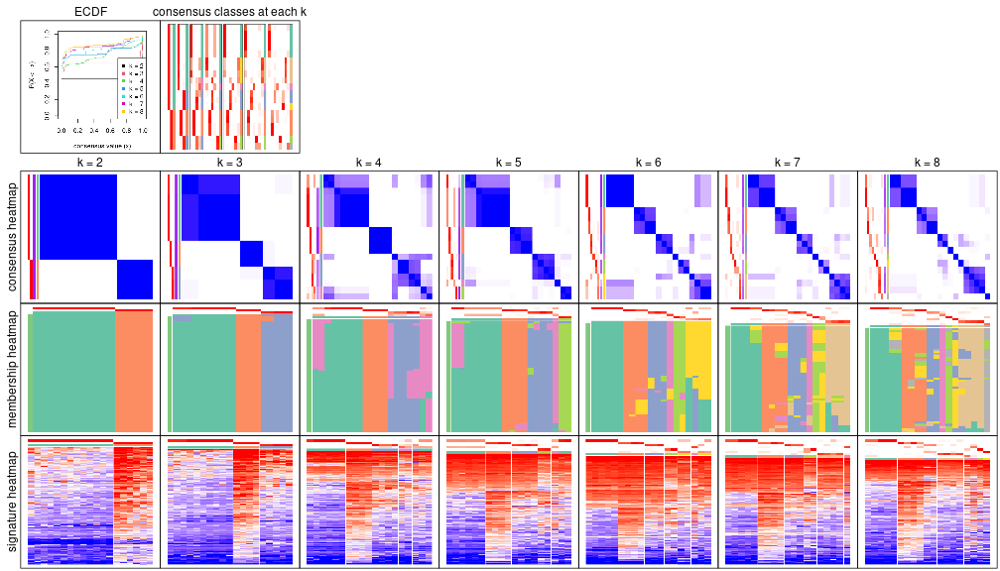

The plots are:

- The first row: a plot of the eCDF (empirical cumulative distribution
  function) curves of the consensus matrix for each `k` and the heatmap of
  predicted classes for each `k`.
- The second row: heatmaps of the consensus matrix for each `k`.
- The third row: heatmaps of the membership matrix for each `k`.
- The fouth row: heatmaps of the signatures for each `k`.

All the plots in panels can be made by individual functions and they are
plotted later in this section.

`select_partition_number()` produces several plots showing different
statistics for choosing "optimized" `k`. There are following statistics:

- eCDF curves of the consensus matrix for each `k`;
- 1-PAC. [The PAC score](https://en.wikipedia.org/wiki/Consensus_clustering#Over-interpretation_potential_of_consensus_clustering)
  measures the proportion of the ambiguous subgrouping.
- Mean silhouette score.
- Concordance. The mean probability of fiting the consensus subgroup labels in all
  partitions.
- Area increased. Denote $A_k$ as the area under the eCDF curve for current
  `k`, the area increased is defined as $A_k - A_{k-1}$.
- Rand index. The percent of pairs of samples that are both in a same cluster
  or both are not in a same cluster in the partition of k and k-1.
- Jaccard index. The ratio of pairs of samples are both in a same cluster in
  the partition of k and k-1 and the pairs of samples are both in a same
  cluster in the partition k or k-1.

The detailed explanations of these statistics can be found in [the _cola_
vignette](https://jokergoo.github.io/cola_vignettes/cola.html#toc_13).

Generally speaking, higher 1-PAC score, higher mean silhouette score or higher
concordance corresponds to better partition. Rand index and Jaccard index
measure how similar the current partition is compared to partition with `k-1`.
If they are too similar, we won't accept `k` is better than `k-1`.

```r
select_partition_number(res)
```

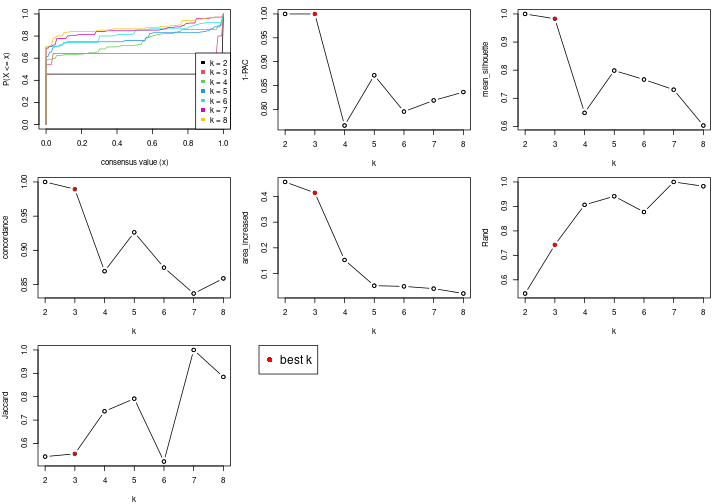

The numeric values for all these statistics can be obtained by `get_stats()`.

```r
get_stats(res)
```

```
#>   k 1-PAC mean_silhouette concordance area_increased  Rand Jaccard
#> 2 2 1.000           1.000       1.000         0.4567 0.544   0.544
#> 3 3 1.000           0.983       0.989         0.4144 0.743   0.556
#> 4 4 0.766           0.648       0.869         0.1528 0.906   0.738
#> 5 5 0.871           0.799       0.926         0.0526 0.942   0.792
#> 6 6 0.795           0.767       0.875         0.0498 0.877   0.523
#> 7 7 0.819           0.731       0.837         0.0411 1.000   1.000
#> 8 8 0.836           0.603       0.859         0.0220 0.982   0.885
```

`suggest_best_k()` suggests the best $k$ based on these statistics. The rules are as follows:

- All $k$ with Jaccard index larger than 0.95 are removed because increasing
  $k$ does not provide enough extra information. If all $k$ are removed, it is
  marked as no subgroup is detected.
- For all $k$ with 1-PAC score larger than 0.9, the maximal $k$ is taken as
  the best $k$, and other $k$ are marked as optional $k$.
- If it does not fit the second rule. The $k$ with the maximal vote of the
  highest 1-PAC score, highest mean silhouette, and highest concordance is
  taken as the best $k$.

```r
suggest_best_k(res)
```

```
#> [1] 3
#> attr(,"optional")
#> [1] 2
```

There is also optional best $k$ = 2 that is worth to check.

Following is the table of the partitions (You need to click the **show/hide
code output** link to see it). The membership matrix (columns with name `p*`)
is inferred by
[`clue::cl_consensus()`](https://www.rdocumentation.org/link/cl_consensus?package=clue)
function with the `SE` method. Basically the value in the membership matrix
represents the probability to belong to a certain group. The finall subgroup
label for an item is determined with the group with highest probability it
belongs to.

In `get_classes()` function, the entropy is calculated from the membership
matrix and the silhouette score is calculated from the consensus matrix.


<script>
$( function() {
	$( '#tabs-node-011-get-classes' ).tabs();
} );
</script>
<div id='tabs-node-011-get-classes'>
<ul>
<li><a href='#tab-node-011-get-classes-1'>k = 2</a></li>
<li><a href='#tab-node-011-get-classes-2'>k = 3</a></li>
<li><a href='#tab-node-011-get-classes-3'>k = 4</a></li>
<li><a href='#tab-node-011-get-classes-4'>k = 5</a></li>
<li><a href='#tab-node-011-get-classes-5'>k = 6</a></li>
<li><a href='#tab-node-011-get-classes-6'>k = 7</a></li>
<li><a href='#tab-node-011-get-classes-7'>k = 8</a></li>
</ul>

<div id='tab-node-011-get-classes-1'>
<p><a id='tab-node-011-get-classes-1-a' style='color:#0366d6' href='#'>show/hide code output</a></p>
<pre><code class="r">cbind(get_classes(res, k = 2), get_membership(res, k = 2))
</code></pre>

<pre><code>#&gt;                 class entropy silhouette p1 p2
#&gt; TCGA.33.AASD.01     1       0          1  1  0
#&gt; TCGA.77.6845.01     1       0          1  1  0
#&gt; TCGA.63.5128.01     1       0          1  1  0
#&gt; TCGA.58.A46N.01     1       0          1  1  0
#&gt; TCGA.68.7755.01     1       0          1  1  0
#&gt; TCGA.56.7730.01     1       0          1  1  0
#&gt; TCGA.22.5477.01     1       0          1  1  0
#&gt; TCGA.90.7769.01     1       0          1  1  0
#&gt; TCGA.18.5592.01     2       0          1  0  1
#&gt; TCGA.77.A5G3.01     1       0          1  1  0
#&gt; TCGA.56.7582.01     2       0          1  0  1
#&gt; TCGA.63.A5ML.01     2       0          1  0  1
#&gt; TCGA.94.8490.01     1       0          1  1  0
#&gt; TCGA.77.8009.01     2       0          1  0  1
#&gt; TCGA.33.A5GW.01     1       0          1  1  0
#&gt; TCGA.85.A5B5.01     1       0          1  1  0
#&gt; TCGA.37.A5EL.01     2       0          1  0  1
#&gt; TCGA.70.6723.01     1       0          1  1  0
#&gt; TCGA.MF.A522.01     2       0          1  0  1
</code></pre>

<script>
$('#tab-node-011-get-classes-1-a').parent().next().next().hide();
$('#tab-node-011-get-classes-1-a').click(function(){
  $('#tab-node-011-get-classes-1-a').parent().next().next().toggle();
  return(false);
});
</script>
</div>

<div id='tab-node-011-get-classes-2'>
<p><a id='tab-node-011-get-classes-2-a' style='color:#0366d6' href='#'>show/hide code output</a></p>
<pre><code class="r">cbind(get_classes(res, k = 3), get_membership(res, k = 3))
</code></pre>

<pre><code>#&gt;                 class entropy silhouette   p1   p2   p3
#&gt; TCGA.33.AASD.01     1   0.153      0.969 0.96 0.00 0.04
#&gt; TCGA.77.6845.01     1   0.000      0.987 1.00 0.00 0.00
#&gt; TCGA.63.5128.01     1   0.000      0.987 1.00 0.00 0.00
#&gt; TCGA.58.A46N.01     1   0.000      0.987 1.00 0.00 0.00
#&gt; TCGA.68.7755.01     1   0.000      0.987 1.00 0.00 0.00
#&gt; TCGA.56.7730.01     1   0.153      0.969 0.96 0.00 0.04
#&gt; TCGA.22.5477.01     3   0.000      0.977 0.00 0.00 1.00
#&gt; TCGA.90.7769.01     1   0.000      0.987 1.00 0.00 0.00
#&gt; TCGA.18.5592.01     3   0.153      0.964 0.00 0.04 0.96
#&gt; TCGA.77.A5G3.01     1   0.153      0.969 0.96 0.00 0.04
#&gt; TCGA.56.7582.01     2   0.000      1.000 0.00 1.00 0.00
#&gt; TCGA.63.A5ML.01     2   0.000      1.000 0.00 1.00 0.00
#&gt; TCGA.94.8490.01     3   0.000      0.977 0.00 0.00 1.00
#&gt; TCGA.77.8009.01     2   0.000      1.000 0.00 1.00 0.00
#&gt; TCGA.33.A5GW.01     3   0.000      0.977 0.00 0.00 1.00
#&gt; TCGA.85.A5B5.01     1   0.000      0.987 1.00 0.00 0.00
#&gt; TCGA.37.A5EL.01     2   0.000      1.000 0.00 1.00 0.00
#&gt; TCGA.70.6723.01     1   0.000      0.987 1.00 0.00 0.00
#&gt; TCGA.MF.A522.01     3   0.153      0.964 0.00 0.04 0.96
</code></pre>

<script>
$('#tab-node-011-get-classes-2-a').parent().next().next().hide();
$('#tab-node-011-get-classes-2-a').click(function(){
  $('#tab-node-011-get-classes-2-a').parent().next().next().toggle();
  return(false);
});
</script>
</div>

<div id='tab-node-011-get-classes-3'>
<p><a id='tab-node-011-get-classes-3-a' style='color:#0366d6' href='#'>show/hide code output</a></p>
<pre><code class="r">cbind(get_classes(res, k = 4), get_membership(res, k = 4))
</code></pre>

<pre><code>#&gt;                 class entropy silhouette   p1 p2   p3   p4
#&gt; TCGA.33.AASD.01     4   0.495     0.5281 0.06  0 0.18 0.76
#&gt; TCGA.77.6845.01     1   0.000     0.8135 1.00  0 0.00 0.00
#&gt; TCGA.63.5128.01     1   0.000     0.8135 1.00  0 0.00 0.00
#&gt; TCGA.58.A46N.01     1   0.000     0.8135 1.00  0 0.00 0.00
#&gt; TCGA.68.7755.01     1   0.495    -0.0051 0.56  0 0.00 0.44
#&gt; TCGA.56.7730.01     1   0.498    -0.0835 0.54  0 0.00 0.46
#&gt; TCGA.22.5477.01     3   0.121     0.6659 0.00  0 0.96 0.04
#&gt; TCGA.90.7769.01     1   0.121     0.7871 0.96  0 0.00 0.04
#&gt; TCGA.18.5592.01     3   0.398     0.6815 0.00  0 0.76 0.24
#&gt; TCGA.77.A5G3.01     4   0.765     0.5153 0.30  0 0.24 0.46
#&gt; TCGA.56.7582.01     2   0.000     1.0000 0.00  1 0.00 0.00
#&gt; TCGA.63.A5ML.01     2   0.000     1.0000 0.00  1 0.00 0.00
#&gt; TCGA.94.8490.01     3   0.491    -0.2099 0.00  0 0.58 0.42
#&gt; TCGA.77.8009.01     2   0.000     1.0000 0.00  1 0.00 0.00
#&gt; TCGA.33.A5GW.01     3   0.000     0.6863 0.00  0 1.00 0.00
#&gt; TCGA.85.A5B5.01     1   0.000     0.8135 1.00  0 0.00 0.00
#&gt; TCGA.37.A5EL.01     2   0.000     1.0000 0.00  1 0.00 0.00
#&gt; TCGA.70.6723.01     1   0.000     0.8135 1.00  0 0.00 0.00
#&gt; TCGA.MF.A522.01     3   0.398     0.6815 0.00  0 0.76 0.24
</code></pre>

<script>
$('#tab-node-011-get-classes-3-a').parent().next().next().hide();
$('#tab-node-011-get-classes-3-a').click(function(){
  $('#tab-node-011-get-classes-3-a').parent().next().next().toggle();
  return(false);
});
</script>
</div>

<div id='tab-node-011-get-classes-4'>
<p><a id='tab-node-011-get-classes-4-a' style='color:#0366d6' href='#'>show/hide code output</a></p>
<pre><code class="r">cbind(get_classes(res, k = 5), get_membership(res, k = 5))
</code></pre>

<pre><code>#&gt;                 class entropy silhouette   p1   p2   p3   p4   p5
#&gt; TCGA.33.AASD.01     4  0.5684      0.000 0.44 0.00 0.04 0.50 0.02
#&gt; TCGA.77.6845.01     1  0.4227      0.854 0.58 0.00 0.00 0.42 0.00
#&gt; TCGA.63.5128.01     1  0.4227      0.854 0.58 0.00 0.00 0.42 0.00
#&gt; TCGA.58.A46N.01     1  0.4227      0.854 0.58 0.00 0.00 0.42 0.00
#&gt; TCGA.68.7755.01     1  0.0000      0.348 1.00 0.00 0.00 0.00 0.00
#&gt; TCGA.56.7730.01     1  0.0609      0.309 0.98 0.00 0.02 0.00 0.00
#&gt; TCGA.22.5477.01     3  0.0000      0.912 0.00 0.00 1.00 0.00 0.00
#&gt; TCGA.90.7769.01     1  0.4182      0.844 0.60 0.00 0.00 0.40 0.00
#&gt; TCGA.18.5592.01     5  0.0609      0.981 0.00 0.00 0.02 0.00 0.98
#&gt; TCGA.77.A5G3.01     3  0.1732      0.908 0.08 0.00 0.92 0.00 0.00
#&gt; TCGA.56.7582.01     2  0.0609      0.950 0.00 0.98 0.00 0.02 0.00
#&gt; TCGA.63.A5ML.01     2  0.0000      0.958 0.00 1.00 0.00 0.00 0.00
#&gt; TCGA.94.8490.01     3  0.1410      0.921 0.06 0.00 0.94 0.00 0.00
#&gt; TCGA.77.8009.01     2  0.1410      0.961 0.00 0.94 0.00 0.06 0.00
#&gt; TCGA.33.A5GW.01     3  0.2020      0.868 0.00 0.00 0.90 0.00 0.10
#&gt; TCGA.85.A5B5.01     1  0.4227      0.854 0.58 0.00 0.00 0.42 0.00
#&gt; TCGA.37.A5EL.01     2  0.1410      0.961 0.00 0.94 0.00 0.06 0.00
#&gt; TCGA.70.6723.01     1  0.4227      0.854 0.58 0.00 0.00 0.42 0.00
#&gt; TCGA.MF.A522.01     5  0.1216      0.981 0.00 0.00 0.02 0.02 0.96
</code></pre>

<script>
$('#tab-node-011-get-classes-4-a').parent().next().next().hide();
$('#tab-node-011-get-classes-4-a').click(function(){
  $('#tab-node-011-get-classes-4-a').parent().next().next().toggle();
  return(false);
});
</script>
</div>

<div id='tab-node-011-get-classes-5'>
<p><a id='tab-node-011-get-classes-5-a' style='color:#0366d6' href='#'>show/hide code output</a></p>
<pre><code class="r">cbind(get_classes(res, k = 6), get_membership(res, k = 6))
</code></pre>

<pre><code>#&gt;                 class entropy silhouette  p1   p2   p3   p4   p5   p6
#&gt; TCGA.33.AASD.01     4  0.1814     0.0000 0.0 0.00 0.00 0.90 0.00 0.10
#&gt; TCGA.77.6845.01     1  0.0000     1.0000 1.0 0.00 0.00 0.00 0.00 0.00
#&gt; TCGA.63.5128.01     1  0.0000     1.0000 1.0 0.00 0.00 0.00 0.00 0.00
#&gt; TCGA.58.A46N.01     1  0.0000     1.0000 1.0 0.00 0.00 0.00 0.00 0.00
#&gt; TCGA.68.7755.01     6  0.3409     0.6871 0.3 0.00 0.00 0.00 0.00 0.70
#&gt; TCGA.56.7730.01     6  0.3409     0.6871 0.3 0.00 0.00 0.00 0.00 0.70
#&gt; TCGA.22.5477.01     3  0.0547     0.8872 0.0 0.00 0.98 0.02 0.00 0.00
#&gt; TCGA.90.7769.01     6  0.3869     0.3857 0.5 0.00 0.00 0.00 0.00 0.50
#&gt; TCGA.18.5592.01     5  0.0000     0.8079 0.0 0.00 0.00 0.00 1.00 0.00
#&gt; TCGA.77.A5G3.01     6  0.3797     0.0114 0.0 0.00 0.42 0.00 0.00 0.58
#&gt; TCGA.56.7582.01     2  0.0547     0.8831 0.0 0.98 0.00 0.00 0.00 0.02
#&gt; TCGA.63.A5ML.01     2  0.0000     0.8911 0.0 1.00 0.00 0.00 0.00 0.00
#&gt; TCGA.94.8490.01     3  0.1814     0.8566 0.0 0.00 0.90 0.00 0.00 0.10
#&gt; TCGA.77.8009.01     2  0.2790     0.8947 0.0 0.84 0.00 0.02 0.00 0.14
#&gt; TCGA.33.A5GW.01     3  0.1556     0.8740 0.0 0.00 0.92 0.00 0.08 0.00
#&gt; TCGA.85.A5B5.01     1  0.0000     1.0000 1.0 0.00 0.00 0.00 0.00 0.00
#&gt; TCGA.37.A5EL.01     2  0.2790     0.8947 0.0 0.84 0.00 0.02 0.00 0.14
#&gt; TCGA.70.6723.01     1  0.0000     1.0000 1.0 0.00 0.00 0.00 0.00 0.00
#&gt; TCGA.MF.A522.01     5  0.3660     0.8079 0.0 0.00 0.00 0.06 0.78 0.16
</code></pre>

<script>
$('#tab-node-011-get-classes-5-a').parent().next().next().hide();
$('#tab-node-011-get-classes-5-a').click(function(){
  $('#tab-node-011-get-classes-5-a').parent().next().next().toggle();
  return(false);
});
</script>
</div>

<div id='tab-node-011-get-classes-6'>
<p><a id='tab-node-011-get-classes-6-a' style='color:#0366d6' href='#'>show/hide code output</a></p>
<pre><code class="r">cbind(get_classes(res, k = 7), get_membership(res, k = 7))
</code></pre>

<pre><code>#&gt;                 class entropy silhouette   p1   p2   p3   p4   p5   p6   p7
#&gt; TCGA.33.AASD.01     4   0.189      0.000 0.00 0.00 0.00 0.88 0.00 0.00 0.12
#&gt; TCGA.77.6845.01     1   0.226      0.882 0.84 0.00 0.00 0.00 0.00 0.16 0.00
#&gt; TCGA.63.5128.01     1   0.000      0.924 1.00 0.00 0.00 0.00 0.00 0.00 0.00
#&gt; TCGA.58.A46N.01     1   0.000      0.924 1.00 0.00 0.00 0.00 0.00 0.00 0.00
#&gt; TCGA.68.7755.01     7   0.231      0.771 0.06 0.00 0.00 0.00 0.00 0.06 0.88
#&gt; TCGA.56.7730.01     7   0.117      0.775 0.06 0.00 0.00 0.00 0.00 0.00 0.94
#&gt; TCGA.22.5477.01     3   0.291      0.727 0.00 0.00 0.82 0.04 0.00 0.14 0.00
#&gt; TCGA.90.7769.01     7   0.411      0.604 0.28 0.00 0.00 0.00 0.00 0.06 0.66
#&gt; TCGA.18.5592.01     5   0.000      0.531 0.00 0.00 0.00 0.00 1.00 0.00 0.00
#&gt; TCGA.77.A5G3.01     7   0.226      0.681 0.00 0.00 0.16 0.00 0.00 0.00 0.84
#&gt; TCGA.56.7582.01     2   0.172      0.774 0.00 0.92 0.00 0.00 0.00 0.04 0.04
#&gt; TCGA.63.A5ML.01     2   0.000      0.813 0.00 1.00 0.00 0.00 0.00 0.00 0.00
#&gt; TCGA.94.8490.01     3   0.242      0.706 0.00 0.00 0.82 0.00 0.00 0.00 0.18
#&gt; TCGA.77.8009.01     2   0.393      0.825 0.00 0.76 0.00 0.08 0.00 0.14 0.02
#&gt; TCGA.33.A5GW.01     3   0.101      0.782 0.00 0.00 0.96 0.00 0.02 0.02 0.00
#&gt; TCGA.85.A5B5.01     1   0.000      0.924 1.00 0.00 0.00 0.00 0.00 0.00 0.00
#&gt; TCGA.37.A5EL.01     2   0.393      0.825 0.00 0.76 0.00 0.08 0.00 0.14 0.02
#&gt; TCGA.70.6723.01     1   0.226      0.882 0.84 0.00 0.00 0.00 0.00 0.16 0.00
#&gt; TCGA.MF.A522.01     5   0.356      0.531 0.00 0.00 0.00 0.00 0.50 0.50 0.00
</code></pre>

<script>
$('#tab-node-011-get-classes-6-a').parent().next().next().hide();
$('#tab-node-011-get-classes-6-a').click(function(){
  $('#tab-node-011-get-classes-6-a').parent().next().next().toggle();
  return(false);
});
</script>
</div>

<div id='tab-node-011-get-classes-7'>
<p><a id='tab-node-011-get-classes-7-a' style='color:#0366d6' href='#'>show/hide code output</a></p>
<pre><code class="r">cbind(get_classes(res, k = 8), get_membership(res, k = 8))
</code></pre>

<pre><code>#&gt;                 class entropy silhouette   p1   p2   p3   p4   p5   p6   p7   p8
#&gt; TCGA.33.AASD.01     4  0.4345      0.000 0.00 0.00 0.18 0.68 0.00 0.00 0.02 0.12
#&gt; TCGA.77.6845.01     1  0.3385      0.815 0.76 0.00 0.08 0.00 0.00 0.00 0.00 0.16
#&gt; TCGA.63.5128.01     1  0.0000      0.882 1.00 0.00 0.00 0.00 0.00 0.00 0.00 0.00
#&gt; TCGA.58.A46N.01     1  0.0000      0.882 1.00 0.00 0.00 0.00 0.00 0.00 0.00 0.00
#&gt; TCGA.68.7755.01     7  0.0808      0.846 0.04 0.00 0.00 0.00 0.00 0.00 0.96 0.00
#&gt; TCGA.56.7730.01     7  0.2350      0.846 0.04 0.00 0.10 0.00 0.00 0.00 0.86 0.00
#&gt; TCGA.22.5477.01     6  0.0000      0.000 0.00 0.00 0.00 0.00 0.00 1.00 0.00 0.00
#&gt; TCGA.90.7769.01     7  0.1563      0.814 0.10 0.00 0.00 0.00 0.00 0.00 0.90 0.00
#&gt; TCGA.18.5592.01     5  0.0000      0.000 0.00 0.00 0.00 0.00 1.00 0.00 0.00 0.00
#&gt; TCGA.77.A5G3.01     7  0.3619      0.721 0.00 0.00 0.14 0.00 0.00 0.12 0.74 0.00
#&gt; TCGA.56.7582.01     2  0.4938      0.664 0.00 0.56 0.06 0.32 0.00 0.00 0.00 0.06
#&gt; TCGA.63.A5ML.01     2  0.3746      0.715 0.00 0.64 0.00 0.32 0.00 0.00 0.04 0.00
#&gt; TCGA.94.8490.01     3  0.3862      0.557 0.00 0.00 0.60 0.00 0.00 0.36 0.04 0.00
#&gt; TCGA.77.8009.01     2  0.0000      0.741 0.00 1.00 0.00 0.00 0.00 0.00 0.00 0.00
#&gt; TCGA.33.A5GW.01     3  0.4141      0.539 0.00 0.00 0.56 0.00 0.06 0.38 0.00 0.00
#&gt; TCGA.85.A5B5.01     1  0.0000      0.882 1.00 0.00 0.00 0.00 0.00 0.00 0.00 0.00
#&gt; TCGA.37.A5EL.01     2  0.0000      0.741 0.00 1.00 0.00 0.00 0.00 0.00 0.00 0.00
#&gt; TCGA.70.6723.01     1  0.3385      0.815 0.76 0.00 0.08 0.00 0.00 0.00 0.00 0.16
#&gt; TCGA.MF.A522.01     8  0.2852      0.000 0.00 0.00 0.00 0.00 0.28 0.00 0.00 0.72
</code></pre>

<script>
$('#tab-node-011-get-classes-7-a').parent().next().next().hide();
$('#tab-node-011-get-classes-7-a').click(function(){
  $('#tab-node-011-get-classes-7-a').parent().next().next().toggle();
  return(false);
});
</script>
</div>
</div>

Heatmaps for the consensus matrix. It visualizes the probability of two
samples to be in a same group.


<script>
$( function() {
	$( '#tabs-node-011-consensus-heatmap' ).tabs();
} );
</script>
<div id='tabs-node-011-consensus-heatmap'>
<ul>
<li><a href='#tab-node-011-consensus-heatmap-1'>k = 2</a></li>
<li><a href='#tab-node-011-consensus-heatmap-2'>k = 3</a></li>
<li><a href='#tab-node-011-consensus-heatmap-3'>k = 4</a></li>
<li><a href='#tab-node-011-consensus-heatmap-4'>k = 5</a></li>
<li><a href='#tab-node-011-consensus-heatmap-5'>k = 6</a></li>
<li><a href='#tab-node-011-consensus-heatmap-6'>k = 7</a></li>
<li><a href='#tab-node-011-consensus-heatmap-7'>k = 8</a></li>
</ul>
<div id='tab-node-011-consensus-heatmap-1'>
<pre><code class="r">consensus_heatmap(res, k = 2)
</code></pre>

<p>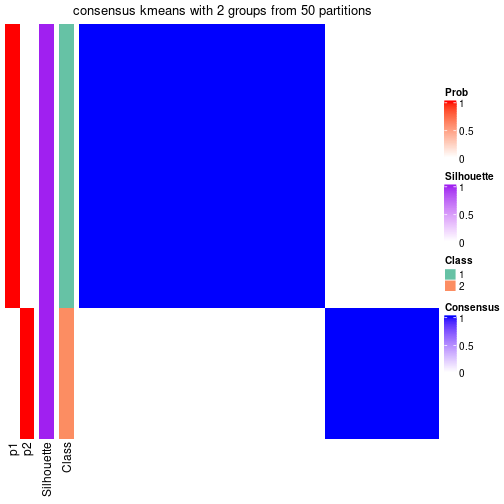</p>

</div>
<div id='tab-node-011-consensus-heatmap-2'>
<pre><code class="r">consensus_heatmap(res, k = 3)
</code></pre>

<p>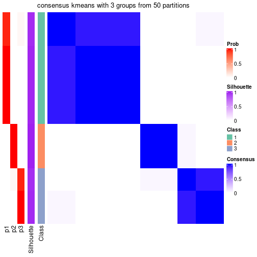</p>

</div>
<div id='tab-node-011-consensus-heatmap-3'>
<pre><code class="r">consensus_heatmap(res, k = 4)
</code></pre>

<p>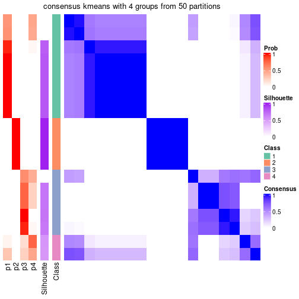</p>

</div>
<div id='tab-node-011-consensus-heatmap-4'>
<pre><code class="r">consensus_heatmap(res, k = 5)
</code></pre>

<p>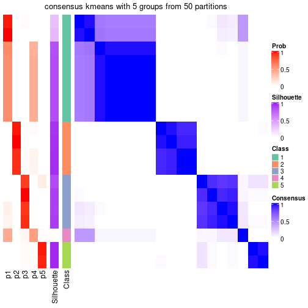</p>

</div>
<div id='tab-node-011-consensus-heatmap-5'>
<pre><code class="r">consensus_heatmap(res, k = 6)
</code></pre>

<p>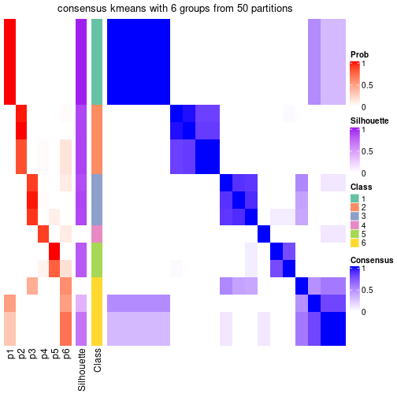</p>

</div>
<div id='tab-node-011-consensus-heatmap-6'>
<pre><code class="r">consensus_heatmap(res, k = 7)
</code></pre>

<p>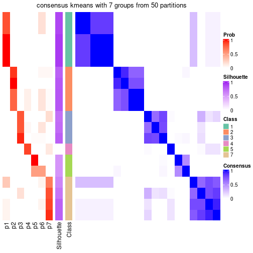</p>

</div>
<div id='tab-node-011-consensus-heatmap-7'>
<pre><code class="r">consensus_heatmap(res, k = 8)
</code></pre>

<p>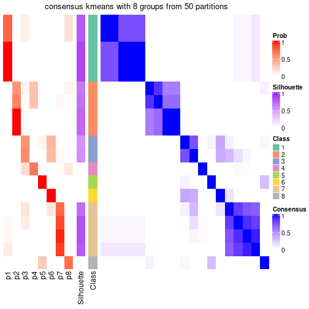</p>

</div>
</div>

Heatmaps for the membership of samples in all partitions to see how consistent they are:


<script>
$( function() {
	$( '#tabs-node-011-membership-heatmap' ).tabs();
} );
</script>
<div id='tabs-node-011-membership-heatmap'>
<ul>
<li><a href='#tab-node-011-membership-heatmap-1'>k = 2</a></li>
<li><a href='#tab-node-011-membership-heatmap-2'>k = 3</a></li>
<li><a href='#tab-node-011-membership-heatmap-3'>k = 4</a></li>
<li><a href='#tab-node-011-membership-heatmap-4'>k = 5</a></li>
<li><a href='#tab-node-011-membership-heatmap-5'>k = 6</a></li>
<li><a href='#tab-node-011-membership-heatmap-6'>k = 7</a></li>
<li><a href='#tab-node-011-membership-heatmap-7'>k = 8</a></li>
</ul>
<div id='tab-node-011-membership-heatmap-1'>
<pre><code class="r">membership_heatmap(res, k = 2)
</code></pre>

<p>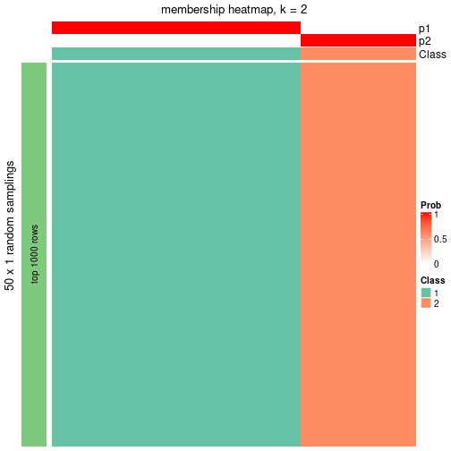</p>

</div>
<div id='tab-node-011-membership-heatmap-2'>
<pre><code class="r">membership_heatmap(res, k = 3)
</code></pre>

<p>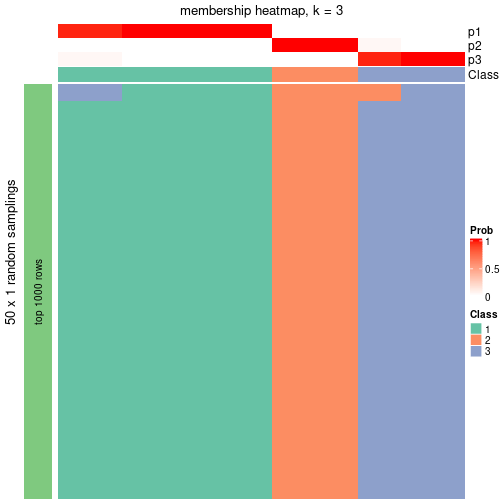</p>

</div>
<div id='tab-node-011-membership-heatmap-3'>
<pre><code class="r">membership_heatmap(res, k = 4)
</code></pre>

<p>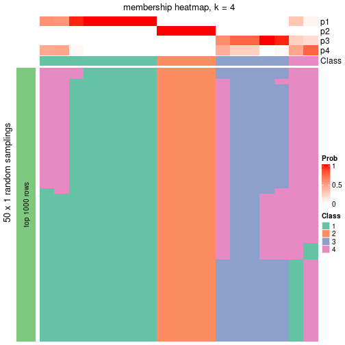</p>

</div>
<div id='tab-node-011-membership-heatmap-4'>
<pre><code class="r">membership_heatmap(res, k = 5)
</code></pre>

<p>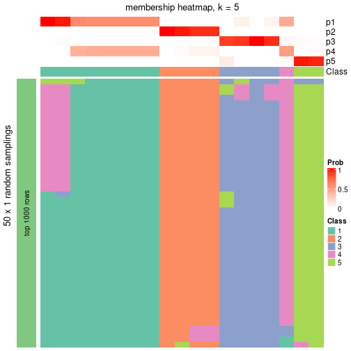</p>

</div>
<div id='tab-node-011-membership-heatmap-5'>
<pre><code class="r">membership_heatmap(res, k = 6)
</code></pre>

<p>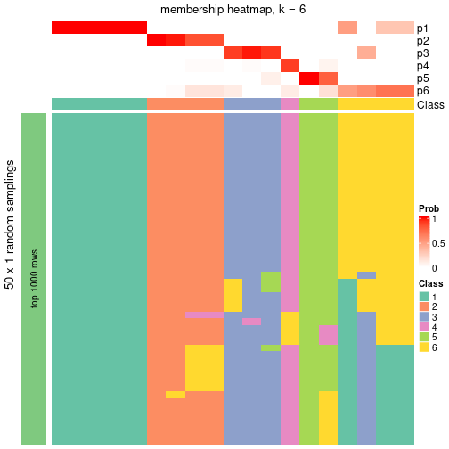</p>

</div>
<div id='tab-node-011-membership-heatmap-6'>
<pre><code class="r">membership_heatmap(res, k = 7)
</code></pre>

<p>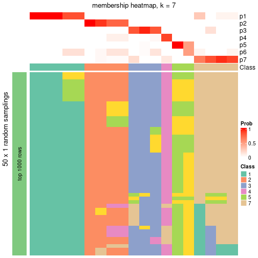</p>

</div>
<div id='tab-node-011-membership-heatmap-7'>
<pre><code class="r">membership_heatmap(res, k = 8)
</code></pre>

<p>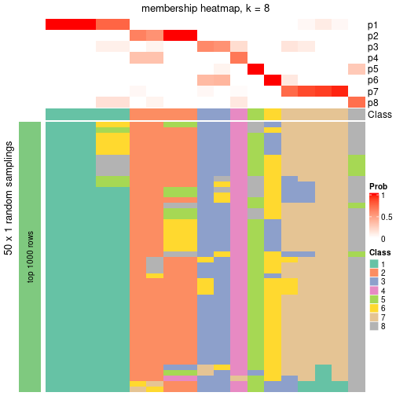</p>

</div>
</div>

As soon as the classes for columns are determined, the signatures
that are significantly different between subgroups can be looked for. 
Following are the heatmaps for signatures.


<script>
$( function() {
	$( '#tabs-node-011-get-signatures' ).tabs();
} );
</script>
<div id='tabs-node-011-get-signatures'>
<ul>
<li><a href='#tab-node-011-get-signatures-1'>k = 2</a></li>
<li><a href='#tab-node-011-get-signatures-2'>k = 3</a></li>
<li><a href='#tab-node-011-get-signatures-3'>k = 4</a></li>
<li><a href='#tab-node-011-get-signatures-4'>k = 5</a></li>
<li><a href='#tab-node-011-get-signatures-5'>k = 6</a></li>
<li><a href='#tab-node-011-get-signatures-6'>k = 7</a></li>
<li><a href='#tab-node-011-get-signatures-7'>k = 8</a></li>
</ul>
<div id='tab-node-011-get-signatures-1'>
<pre><code class="r">get_signatures(res, k = 2)
</code></pre>

<p>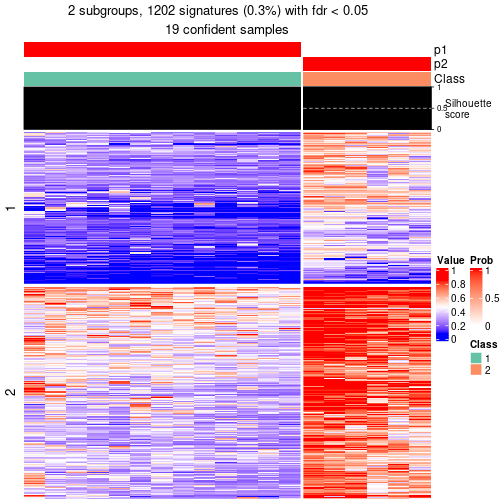</p>

</div>
<div id='tab-node-011-get-signatures-2'>
<pre><code class="r">get_signatures(res, k = 3)
</code></pre>

<p>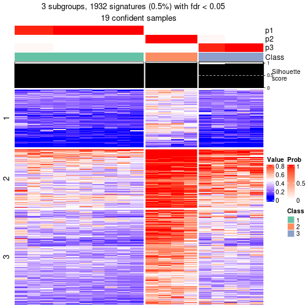</p>

</div>
<div id='tab-node-011-get-signatures-3'>
<pre><code class="r">get_signatures(res, k = 4)
</code></pre>

<p>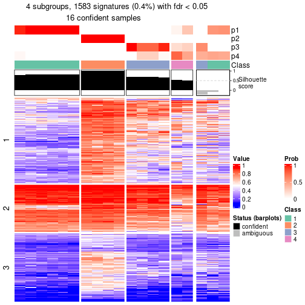</p>

</div>
<div id='tab-node-011-get-signatures-4'>
<pre><code class="r">get_signatures(res, k = 5)
</code></pre>

<p>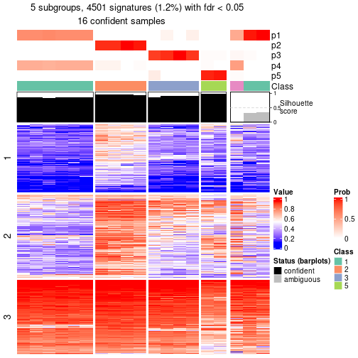</p>

</div>
<div id='tab-node-011-get-signatures-5'>
<pre><code class="r">get_signatures(res, k = 6)
</code></pre>

<p>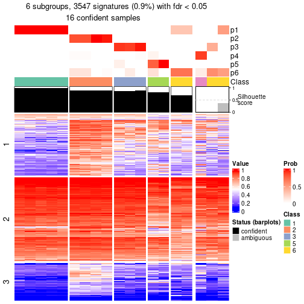</p>

</div>
<div id='tab-node-011-get-signatures-6'>
<pre><code class="r">get_signatures(res, k = 7)
</code></pre>

<p>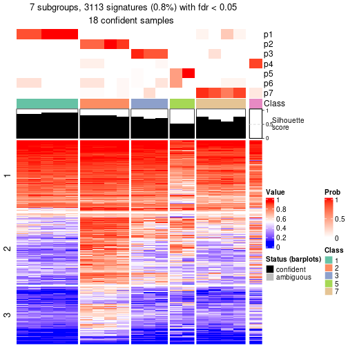</p>

</div>
<div id='tab-node-011-get-signatures-7'>
<pre><code class="r">get_signatures(res, k = 8)
</code></pre>

<p>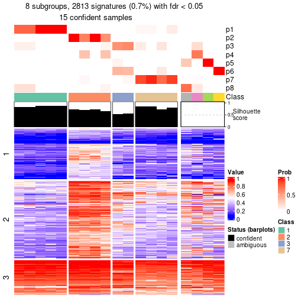</p>

</div>
</div>


Compare the overlap of signatures from different k:

```r
compare_signatures(res)
```


`get_signature()` returns a data frame invisibly. To get the list of signatures, the function
call should be assigned to a variable explicitly. In following code, if `plot` argument is set
to `FALSE`, no heatmap is plotted while only the differential analysis is performed.

```r
# code only for demonstration
tb = get_signature(res, k = ..., plot = FALSE)
```

An example of the output of `tb` is:

```
#>   which_row         fdr    mean_1    mean_2 scaled_mean_1 scaled_mean_2 km
#> 1        38 0.042760348  8.373488  9.131774    -0.5533452     0.5164555  1
#> 2        40 0.018707592  7.106213  8.469186    -0.6173731     0.5762149  1
#> 3        55 0.019134737 10.221463 11.207825    -0.6159697     0.5749050  1
#> 4        59 0.006059896  5.921854  7.869574    -0.6899429     0.6439467  1
#> 5        60 0.018055526  8.928898 10.211722    -0.6204761     0.5791110  1
#> 6        98 0.009384629 15.714769 14.887706     0.6635654    -0.6193277  2
...
```

The columns in `tb` are:

1. `which_row`: row indices corresponding to the input matrix.
2. `fdr`: FDR for the differential test. 
3. `mean_x`: The mean value in group x.
4. `scaled_mean_x`: The mean value in group x after rows are scaled.
5. `km`: Row groups if k-means clustering is applied to rows (which is done by automatically selecting number of clusters).

If there are too many signatures, `top_signatures = ...` can be set to only show the 
signatures with the highest FDRs:

```r
# code only for demonstration
# e.g. to show the top 500 most significant rows
tb = get_signature(res, k = ..., top_signatures = 500)
```

If the signatures are defined as these which are uniquely high in current group, `diff_method` argument
can be set to `"uniquely_high_in_one_group"`:

```r
# code only for demonstration
tb = get_signature(res, k = ..., diff_method = "uniquely_high_in_one_group")
```


UMAP plot which shows how samples are separated.


<script>
$( function() {
	$( '#tabs-node-011-dimension-reduction' ).tabs();
} );
</script>
<div id='tabs-node-011-dimension-reduction'>
<ul>
<li><a href='#tab-node-011-dimension-reduction-1'>k = 2</a></li>
<li><a href='#tab-node-011-dimension-reduction-2'>k = 3</a></li>
<li><a href='#tab-node-011-dimension-reduction-3'>k = 4</a></li>
<li><a href='#tab-node-011-dimension-reduction-4'>k = 5</a></li>
<li><a href='#tab-node-011-dimension-reduction-5'>k = 6</a></li>
<li><a href='#tab-node-011-dimension-reduction-6'>k = 7</a></li>
<li><a href='#tab-node-011-dimension-reduction-7'>k = 8</a></li>
</ul>
<div id='tab-node-011-dimension-reduction-1'>
<pre><code class="r">dimension_reduction(res, k = 2, method = &quot;UMAP&quot;)
</code></pre>

<p>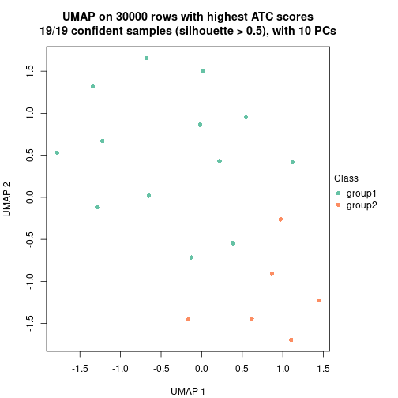</p>

</div>
<div id='tab-node-011-dimension-reduction-2'>
<pre><code class="r">dimension_reduction(res, k = 3, method = &quot;UMAP&quot;)
</code></pre>

<p>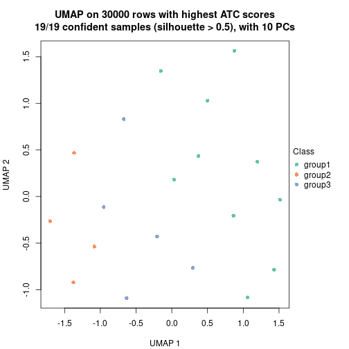</p>

</div>
<div id='tab-node-011-dimension-reduction-3'>
<pre><code class="r">dimension_reduction(res, k = 4, method = &quot;UMAP&quot;)
</code></pre>

<p>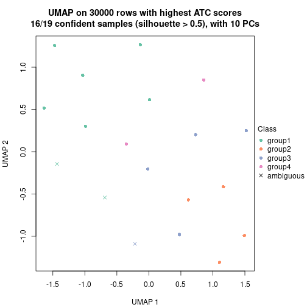</p>

</div>
<div id='tab-node-011-dimension-reduction-4'>
<pre><code class="r">dimension_reduction(res, k = 5, method = &quot;UMAP&quot;)
</code></pre>

<p>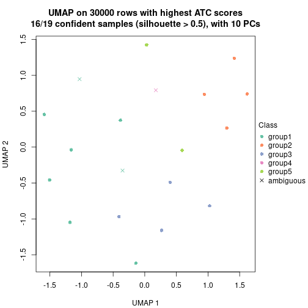</p>

</div>
<div id='tab-node-011-dimension-reduction-5'>
<pre><code class="r">dimension_reduction(res, k = 6, method = &quot;UMAP&quot;)
</code></pre>

<p>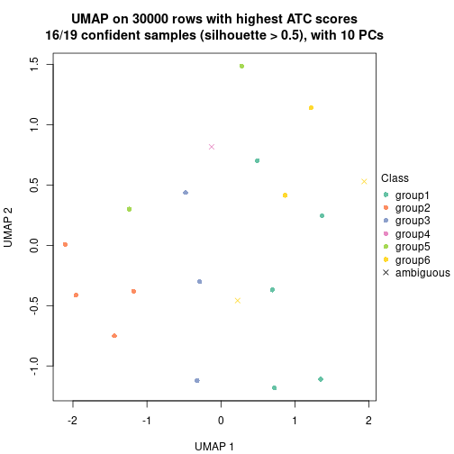</p>

</div>
<div id='tab-node-011-dimension-reduction-6'>
<pre><code class="r">dimension_reduction(res, k = 7, method = &quot;UMAP&quot;)
</code></pre>

<p>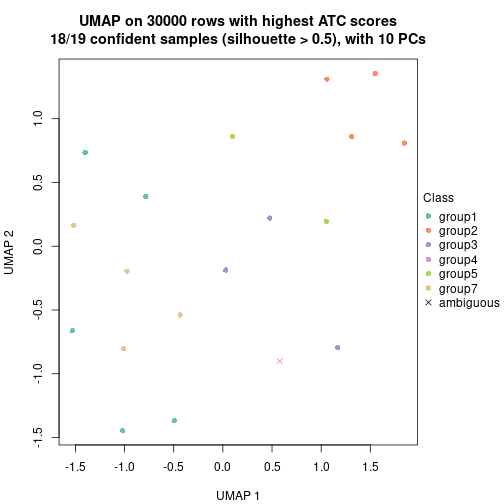</p>

</div>
<div id='tab-node-011-dimension-reduction-7'>
<pre><code class="r">dimension_reduction(res, k = 8, method = &quot;UMAP&quot;)
</code></pre>

<p>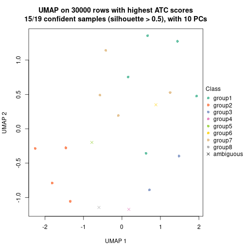</p>

</div>
</div>


Following heatmap shows how subgroups are split when increasing `k`:

```r
collect_classes(res)
```

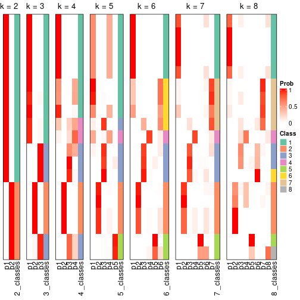


If matrix rows can be associated to genes, consider to use `functional_enrichment(res,
...)` to perform function enrichment for the signature genes. See [this vignette](https://jokergoo.github.io/cola_vignettes/functional_enrichment.html) for more detailed explanations.


 

---------------------------------------------------


### Node012


Parent node: [Node01](#Node01).
Child nodes: 
                Node0111-leaf
        ,
                Node0112-leaf
        ,
                Node0113-leaf
        ,
                Node0121-leaf
        ,
                Node0122-leaf
        ,
                Node0123-leaf
        ,
                Node0124-leaf
        ,
                Node0311-leaf
        ,
                Node0312-leaf
        ,
                Node0331-leaf
        ,
                Node0332-leaf
        ,
                Node0341-leaf
        ,
                Node0342-leaf
        ,
                Node0411-leaf
        ,
                [Node0412](#Node0412)
        ,
                Node0413-leaf
        ,
                Node0421-leaf
        ,
                Node0422-leaf
        ,
                Node0423-leaf
        ,
                Node0431-leaf
        ,
                [Node0432](#Node0432)
        ,
                Node0433-leaf
        ,
                Node0511-leaf
        ,
                Node0512-leaf
        ,
                Node0513-leaf
        ,
                [Node0521](#Node0521)
        ,
                Node0522-leaf
        ,
                Node0531-leaf
        ,
                Node0532-leaf
        ,
                Node0533-leaf
        .


The object with results only for a single top-value method and a single partitioning method 
can be extracted as:

```r
res = res_rh["012"]
```

A summary of `res` and all the functions that can be applied to it:

```r
res
```

```
#> A 'ConsensusPartition' object with k = 2, 3, 4, 5, 6, 7, 8.
#>   On a matrix with 30000 rows and 20 columns.
#>   Top rows (1000) are extracted by 'ATC' method.
#>   Subgroups are detected by 'kmeans' method.
#>   Performed in total 350 partitions by row resampling.
#>   Best k for subgroups seems to be 3.
#> 
#> Following methods can be applied to this 'ConsensusPartition' object:
#>  [1] "cola_report"             "collect_classes"         "collect_plots"          
#>  [4] "collect_stats"           "colnames"                "compare_partitions"     
#>  [7] "compare_signatures"      "consensus_heatmap"       "dimension_reduction"    
#> [10] "functional_enrichment"   "get_anno_col"            "get_anno"               
#> [13] "get_classes"             "get_consensus"           "get_matrix"             
#> [16] "get_membership"          "get_param"               "get_signatures"         
#> [19] "get_stats"               "is_best_k"               "is_stable_k"            
#> [22] "membership_heatmap"      "ncol"                    "nrow"                   
#> [25] "plot_ecdf"               "predict_classes"         "rownames"               
#> [28] "select_partition_number" "show"                    "suggest_best_k"         
#> [31] "test_to_known_factors"   "top_rows_heatmap"
```

`collect_plots()` function collects all the plots made from `res` for all `k` (number of subgroups)
into one single page to provide an easy and fast comparison between different `k`.

```r
collect_plots(res)
```

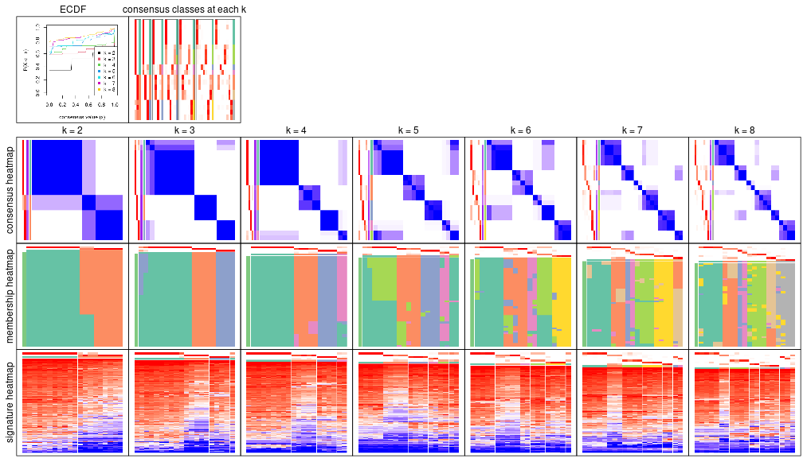

The plots are:

- The first row: a plot of the eCDF (empirical cumulative distribution
  function) curves of the consensus matrix for each `k` and the heatmap of
  predicted classes for each `k`.
- The second row: heatmaps of the consensus matrix for each `k`.
- The third row: heatmaps of the membership matrix for each `k`.
- The fouth row: heatmaps of the signatures for each `k`.

All the plots in panels can be made by individual functions and they are
plotted later in this section.

`select_partition_number()` produces several plots showing different
statistics for choosing "optimized" `k`. There are following statistics:

- eCDF curves of the consensus matrix for each `k`;
- 1-PAC. [The PAC score](https://en.wikipedia.org/wiki/Consensus_clustering#Over-interpretation_potential_of_consensus_clustering)
  measures the proportion of the ambiguous subgrouping.
- Mean silhouette score.
- Concordance. The mean probability of fiting the consensus subgroup labels in all
  partitions.
- Area increased. Denote $A_k$ as the area under the eCDF curve for current
  `k`, the area increased is defined as $A_k - A_{k-1}$.
- Rand index. The percent of pairs of samples that are both in a same cluster
  or both are not in a same cluster in the partition of k and k-1.
- Jaccard index. The ratio of pairs of samples are both in a same cluster in
  the partition of k and k-1 and the pairs of samples are both in a same
  cluster in the partition k or k-1.

The detailed explanations of these statistics can be found in [the _cola_
vignette](https://jokergoo.github.io/cola_vignettes/cola.html#toc_13).

Generally speaking, higher 1-PAC score, higher mean silhouette score or higher
concordance corresponds to better partition. Rand index and Jaccard index
measure how similar the current partition is compared to partition with `k-1`.
If they are too similar, we won't accept `k` is better than `k-1`.

```r
select_partition_number(res)
```

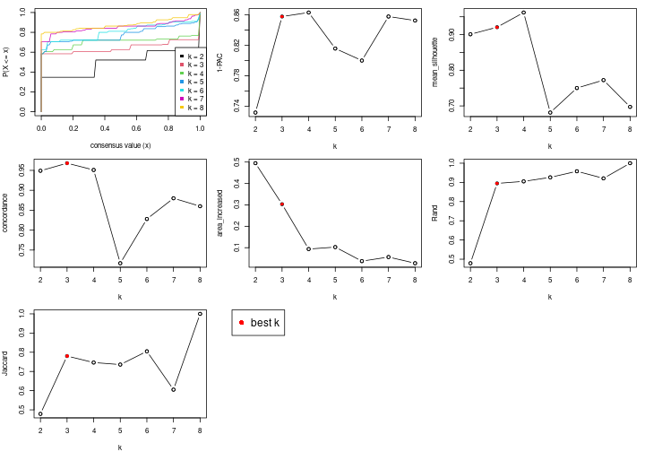

The numeric values for all these statistics can be obtained by `get_stats()`.

```r
get_stats(res)
```

```
#>   k 1-PAC mean_silhouette concordance area_increased  Rand Jaccard
#> 2 2 0.732           0.901       0.949         0.4947 0.479   0.479
#> 3 3 0.858           0.921       0.968         0.3032 0.895   0.780
#> 4 4 0.863           0.962       0.951         0.0937 0.905   0.746
#> 5 5 0.816           0.681       0.717         0.1029 0.926   0.736
#> 6 6 0.800           0.750       0.828         0.0373 0.958   0.805
#> 7 7 0.858           0.772       0.880         0.0564 0.921   0.605
#> 8 8 0.853           0.697       0.860         0.0275 1.000   1.000
```

`suggest_best_k()` suggests the best $k$ based on these statistics. The rules are as follows:

- All $k$ with Jaccard index larger than 0.95 are removed because increasing
  $k$ does not provide enough extra information. If all $k$ are removed, it is
  marked as no subgroup is detected.
- For all $k$ with 1-PAC score larger than 0.9, the maximal $k$ is taken as
  the best $k$, and other $k$ are marked as optional $k$.
- If it does not fit the second rule. The $k$ with the maximal vote of the
  highest 1-PAC score, highest mean silhouette, and highest concordance is
  taken as the best $k$.

```r
suggest_best_k(res)
```

```
#> [1] 3
```


Following is the table of the partitions (You need to click the **show/hide
code output** link to see it). The membership matrix (columns with name `p*`)
is inferred by
[`clue::cl_consensus()`](https://www.rdocumentation.org/link/cl_consensus?package=clue)
function with the `SE` method. Basically the value in the membership matrix
represents the probability to belong to a certain group. The finall subgroup
label for an item is determined with the group with highest probability it
belongs to.

In `get_classes()` function, the entropy is calculated from the membership
matrix and the silhouette score is calculated from the consensus matrix.


<script>
$( function() {
	$( '#tabs-node-012-get-classes' ).tabs();
} );
</script>
<div id='tabs-node-012-get-classes'>
<ul>
<li><a href='#tab-node-012-get-classes-1'>k = 2</a></li>
<li><a href='#tab-node-012-get-classes-2'>k = 3</a></li>
<li><a href='#tab-node-012-get-classes-3'>k = 4</a></li>
<li><a href='#tab-node-012-get-classes-4'>k = 5</a></li>
<li><a href='#tab-node-012-get-classes-5'>k = 6</a></li>
<li><a href='#tab-node-012-get-classes-6'>k = 7</a></li>
<li><a href='#tab-node-012-get-classes-7'>k = 8</a></li>
</ul>

<div id='tab-node-012-get-classes-1'>
<p><a id='tab-node-012-get-classes-1-a' style='color:#0366d6' href='#'>show/hide code output</a></p>
<pre><code class="r">cbind(get_classes(res, k = 2), get_membership(res, k = 2))
</code></pre>

<pre><code>#&gt;                 class entropy silhouette   p1   p2
#&gt; TCGA.85.8071.01     1   0.000      1.000 1.00 0.00
#&gt; TCGA.56.8083.01     2   0.000      0.863 0.00 1.00
#&gt; TCGA.77.8148.01     2   0.925      0.614 0.34 0.66
#&gt; TCGA.56.8082.01     2   0.000      0.863 0.00 1.00
#&gt; TCGA.56.7823.01     1   0.000      1.000 1.00 0.00
#&gt; TCGA.56.A4BX.01     1   0.000      1.000 1.00 0.00
#&gt; TCGA.85.A4QR.01     1   0.000      1.000 1.00 0.00
#&gt; TCGA.58.8390.01     2   0.000      0.863 0.00 1.00
#&gt; TCGA.77.7139.01     1   0.000      1.000 1.00 0.00
#&gt; TCGA.46.6026.01     2   0.000      0.863 0.00 1.00
#&gt; TCGA.NK.A5CR.01     2   0.925      0.614 0.34 0.66
#&gt; TCGA.NC.A5HH.01     2   0.000      0.863 0.00 1.00
#&gt; TCGA.34.5231.01     1   0.000      1.000 1.00 0.00
#&gt; TCGA.63.A5MY.01     2   0.925      0.614 0.34 0.66
#&gt; TCGA.NC.A5HT.01     1   0.000      1.000 1.00 0.00
#&gt; TCGA.22.4593.01     1   0.000      1.000 1.00 0.00
#&gt; TCGA.63.A5MU.01     1   0.000      1.000 1.00 0.00
#&gt; TCGA.43.6143.01     2   0.000      0.863 0.00 1.00
#&gt; TCGA.NC.A5HG.01     1   0.000      1.000 1.00 0.00
#&gt; TCGA.NC.A5HN.01     1   0.000      1.000 1.00 0.00
</code></pre>

<script>
$('#tab-node-012-get-classes-1-a').parent().next().next().hide();
$('#tab-node-012-get-classes-1-a').click(function(){
  $('#tab-node-012-get-classes-1-a').parent().next().next().toggle();
  return(false);
});
</script>
</div>

<div id='tab-node-012-get-classes-2'>
<p><a id='tab-node-012-get-classes-2-a' style='color:#0366d6' href='#'>show/hide code output</a></p>
<pre><code class="r">cbind(get_classes(res, k = 3), get_membership(res, k = 3))
</code></pre>

<pre><code>#&gt;                 class entropy silhouette   p1 p2   p3
#&gt; TCGA.85.8071.01     1   0.000      0.934 1.00  0 0.00
#&gt; TCGA.56.8083.01     2   0.000      1.000 0.00  1 0.00
#&gt; TCGA.77.8148.01     3   0.000      1.000 0.00  0 1.00
#&gt; TCGA.56.8082.01     3   0.000      1.000 0.00  0 1.00
#&gt; TCGA.56.7823.01     1   0.000      0.934 1.00  0 0.00
#&gt; TCGA.56.A4BX.01     1   0.000      0.934 1.00  0 0.00
#&gt; TCGA.85.A4QR.01     1   0.455      0.738 0.80  0 0.20
#&gt; TCGA.58.8390.01     2   0.000      1.000 0.00  1 0.00
#&gt; TCGA.77.7139.01     1   0.000      0.934 1.00  0 0.00
#&gt; TCGA.46.6026.01     2   0.000      1.000 0.00  1 0.00
#&gt; TCGA.NK.A5CR.01     3   0.000      1.000 0.00  0 1.00
#&gt; TCGA.NC.A5HH.01     2   0.000      1.000 0.00  1 0.00
#&gt; TCGA.34.5231.01     1   0.000      0.934 1.00  0 0.00
#&gt; TCGA.63.A5MY.01     3   0.000      1.000 0.00  0 1.00
#&gt; TCGA.NC.A5HT.01     1   0.000      0.934 1.00  0 0.00
#&gt; TCGA.22.4593.01     1   0.624      0.274 0.56  0 0.44
#&gt; TCGA.63.A5MU.01     1   0.000      0.934 1.00  0 0.00
#&gt; TCGA.43.6143.01     2   0.000      1.000 0.00  1 0.00
#&gt; TCGA.NC.A5HG.01     1   0.000      0.934 1.00  0 0.00
#&gt; TCGA.NC.A5HN.01     1   0.000      0.934 1.00  0 0.00
</code></pre>

<script>
$('#tab-node-012-get-classes-2-a').parent().next().next().hide();
$('#tab-node-012-get-classes-2-a').click(function(){
  $('#tab-node-012-get-classes-2-a').parent().next().next().toggle();
  return(false);
});
</script>
</div>

<div id='tab-node-012-get-classes-3'>
<p><a id='tab-node-012-get-classes-3-a' style='color:#0366d6' href='#'>show/hide code output</a></p>
<pre><code class="r">cbind(get_classes(res, k = 4), get_membership(res, k = 4))
</code></pre>

<pre><code>#&gt;                 class entropy silhouette   p1   p2   p3   p4
#&gt; TCGA.85.8071.01     1   0.000      1.000 1.00 0.00 0.00 0.00
#&gt; TCGA.56.8083.01     2   0.000      0.909 0.00 1.00 0.00 0.00
#&gt; TCGA.77.8148.01     3   0.000      1.000 0.00 0.00 1.00 0.00
#&gt; TCGA.56.8082.01     3   0.000      1.000 0.00 0.00 1.00 0.00
#&gt; TCGA.56.7823.01     1   0.000      1.000 1.00 0.00 0.00 0.00
#&gt; TCGA.56.A4BX.01     1   0.000      1.000 1.00 0.00 0.00 0.00
#&gt; TCGA.85.A4QR.01     4   0.480      0.905 0.26 0.00 0.02 0.72
#&gt; TCGA.58.8390.01     2   0.292      0.890 0.00 0.86 0.00 0.14
#&gt; TCGA.77.7139.01     1   0.000      1.000 1.00 0.00 0.00 0.00
#&gt; TCGA.46.6026.01     2   0.292      0.836 0.00 0.86 0.00 0.14
#&gt; TCGA.NK.A5CR.01     3   0.000      1.000 0.00 0.00 1.00 0.00
#&gt; TCGA.NC.A5HH.01     2   0.292      0.890 0.00 0.86 0.00 0.14
#&gt; TCGA.34.5231.01     1   0.000      1.000 1.00 0.00 0.00 0.00
#&gt; TCGA.63.A5MY.01     3   0.000      1.000 0.00 0.00 1.00 0.00
#&gt; TCGA.NC.A5HT.01     1   0.000      1.000 1.00 0.00 0.00 0.00
#&gt; TCGA.22.4593.01     4   0.549      0.900 0.20 0.00 0.08 0.72
#&gt; TCGA.63.A5MU.01     1   0.000      1.000 1.00 0.00 0.00 0.00
#&gt; TCGA.43.6143.01     2   0.000      0.909 0.00 1.00 0.00 0.00
#&gt; TCGA.NC.A5HG.01     1   0.000      1.000 1.00 0.00 0.00 0.00
#&gt; TCGA.NC.A5HN.01     1   0.000      1.000 1.00 0.00 0.00 0.00
</code></pre>

<script>
$('#tab-node-012-get-classes-3-a').parent().next().next().hide();
$('#tab-node-012-get-classes-3-a').click(function(){
  $('#tab-node-012-get-classes-3-a').parent().next().next().toggle();
  return(false);
});
</script>
</div>

<div id='tab-node-012-get-classes-4'>
<p><a id='tab-node-012-get-classes-4-a' style='color:#0366d6' href='#'>show/hide code output</a></p>
<pre><code class="r">cbind(get_classes(res, k = 5), get_membership(res, k = 5))
</code></pre>

<pre><code>#&gt;                 class entropy silhouette   p1   p2   p3   p4   p5
#&gt; TCGA.85.8071.01     1  0.0000      0.712 1.00 0.00 0.00 0.00 0.00
#&gt; TCGA.56.8083.01     2  0.3561      0.839 0.00 0.74 0.00 0.00 0.26
#&gt; TCGA.77.8148.01     3  0.0000      0.983 0.00 0.00 1.00 0.00 0.00
#&gt; TCGA.56.8082.01     3  0.1043      0.963 0.00 0.00 0.96 0.00 0.04
#&gt; TCGA.56.7823.01     1  0.4302     -0.948 0.52 0.00 0.00 0.00 0.48
#&gt; TCGA.56.A4BX.01     5  0.4307      1.000 0.50 0.00 0.00 0.00 0.50
#&gt; TCGA.85.A4QR.01     4  0.5005      0.809 0.06 0.00 0.02 0.72 0.20
#&gt; TCGA.58.8390.01     2  0.0609      0.791 0.00 0.98 0.00 0.02 0.00
#&gt; TCGA.77.7139.01     5  0.4307      1.000 0.50 0.00 0.00 0.00 0.50
#&gt; TCGA.46.6026.01     2  0.5068      0.778 0.00 0.64 0.00 0.06 0.30
#&gt; TCGA.NK.A5CR.01     3  0.0000      0.983 0.00 0.00 1.00 0.00 0.00
#&gt; TCGA.NC.A5HH.01     2  0.0609      0.791 0.00 0.98 0.00 0.00 0.02
#&gt; TCGA.34.5231.01     1  0.0000      0.712 1.00 0.00 0.00 0.00 0.00
#&gt; TCGA.63.A5MY.01     3  0.0609      0.975 0.00 0.00 0.98 0.00 0.02
#&gt; TCGA.NC.A5HT.01     1  0.0000      0.712 1.00 0.00 0.00 0.00 0.00
#&gt; TCGA.22.4593.01     4  0.2077      0.815 0.04 0.00 0.04 0.92 0.00
#&gt; TCGA.63.A5MU.01     1  0.4060     -0.552 0.64 0.00 0.00 0.00 0.36
#&gt; TCGA.43.6143.01     2  0.3561      0.839 0.00 0.74 0.00 0.00 0.26
#&gt; TCGA.NC.A5HG.01     1  0.0000      0.712 1.00 0.00 0.00 0.00 0.00
#&gt; TCGA.NC.A5HN.01     1  0.0000      0.712 1.00 0.00 0.00 0.00 0.00
</code></pre>

<script>
$('#tab-node-012-get-classes-4-a').parent().next().next().hide();
$('#tab-node-012-get-classes-4-a').click(function(){
  $('#tab-node-012-get-classes-4-a').parent().next().next().toggle();
  return(false);
});
</script>
</div>

<div id='tab-node-012-get-classes-5'>
<p><a id='tab-node-012-get-classes-5-a' style='color:#0366d6' href='#'>show/hide code output</a></p>
<pre><code class="r">cbind(get_classes(res, k = 6), get_membership(res, k = 6))
</code></pre>

<pre><code>#&gt;                 class entropy silhouette   p1   p2   p3   p4   p5   p6
#&gt; TCGA.85.8071.01     1  0.0000      0.847 1.00 0.00 0.00 0.00 0.00 0.00
#&gt; TCGA.56.8083.01     2  0.0000      0.735 0.00 1.00 0.00 0.00 0.00 0.00
#&gt; TCGA.77.8148.01     6  0.0000      0.928 0.00 0.00 0.00 0.00 0.00 1.00
#&gt; TCGA.56.8082.01     6  0.0547      0.921 0.00 0.00 0.00 0.00 0.02 0.98
#&gt; TCGA.56.7823.01     5  0.3647      1.000 0.36 0.00 0.00 0.00 0.64 0.00
#&gt; TCGA.56.A4BX.01     5  0.3647      1.000 0.36 0.00 0.00 0.00 0.64 0.00
#&gt; TCGA.85.A4QR.01     4  0.5750      0.702 0.04 0.00 0.34 0.54 0.08 0.00
#&gt; TCGA.58.8390.01     2  0.3756      0.672 0.00 0.60 0.40 0.00 0.00 0.00
#&gt; TCGA.77.7139.01     5  0.3647      1.000 0.36 0.00 0.00 0.00 0.64 0.00
#&gt; TCGA.46.6026.01     2  0.4613      0.574 0.00 0.66 0.08 0.00 0.26 0.00
#&gt; TCGA.NK.A5CR.01     6  0.0000      0.928 0.00 0.00 0.00 0.00 0.00 1.00
#&gt; TCGA.NC.A5HH.01     2  0.4913      0.672 0.00 0.60 0.34 0.04 0.02 0.00
#&gt; TCGA.34.5231.01     1  0.0547      0.832 0.98 0.00 0.02 0.00 0.00 0.00
#&gt; TCGA.63.A5MY.01     6  0.3660      0.784 0.00 0.00 0.16 0.00 0.06 0.78
#&gt; TCGA.NC.A5HT.01     1  0.0000      0.847 1.00 0.00 0.00 0.00 0.00 0.00
#&gt; TCGA.22.4593.01     4  0.0937      0.701 0.04 0.00 0.00 0.96 0.00 0.00
#&gt; TCGA.63.A5MU.01     1  0.4310     -0.568 0.54 0.00 0.02 0.00 0.44 0.00
#&gt; TCGA.43.6143.01     2  0.0000      0.735 0.00 1.00 0.00 0.00 0.00 0.00
#&gt; TCGA.NC.A5HG.01     1  0.0000      0.847 1.00 0.00 0.00 0.00 0.00 0.00
#&gt; TCGA.NC.A5HN.01     1  0.0000      0.847 1.00 0.00 0.00 0.00 0.00 0.00
</code></pre>

<script>
$('#tab-node-012-get-classes-5-a').parent().next().next().hide();
$('#tab-node-012-get-classes-5-a').click(function(){
  $('#tab-node-012-get-classes-5-a').parent().next().next().toggle();
  return(false);
});
</script>
</div>

<div id='tab-node-012-get-classes-6'>
<p><a id='tab-node-012-get-classes-6-a' style='color:#0366d6' href='#'>show/hide code output</a></p>
<pre><code class="r">cbind(get_classes(res, k = 7), get_membership(res, k = 7))
</code></pre>

<pre><code>#&gt;                 class entropy silhouette   p1   p2   p3   p4   p5   p6   p7
#&gt; TCGA.85.8071.01     1  0.0863      0.930 0.96 0.04 0.00 0.00 0.00 0.00 0.00
#&gt; TCGA.56.8083.01     2  0.3558      0.756 0.00 0.52 0.00 0.00 0.00 0.00 0.48
#&gt; TCGA.77.8148.01     6  0.0000      0.947 0.00 0.00 0.00 0.00 0.00 1.00 0.00
#&gt; TCGA.56.8082.01     6  0.1860      0.916 0.00 0.02 0.00 0.04 0.02 0.92 0.00
#&gt; TCGA.56.7823.01     5  0.1664      0.861 0.06 0.02 0.00 0.00 0.92 0.00 0.00
#&gt; TCGA.56.A4BX.01     5  0.2016      0.854 0.06 0.04 0.00 0.00 0.90 0.00 0.00
#&gt; TCGA.85.A4QR.01     4  0.1671      0.000 0.00 0.00 0.00 0.90 0.10 0.00 0.00
#&gt; TCGA.58.8390.01     7  0.0000      0.950 0.00 0.00 0.00 0.00 0.00 0.00 1.00
#&gt; TCGA.77.7139.01     5  0.1166      0.862 0.06 0.00 0.00 0.00 0.94 0.00 0.00
#&gt; TCGA.46.6026.01     2  0.5474      0.556 0.00 0.56 0.02 0.06 0.04 0.00 0.32
#&gt; TCGA.NK.A5CR.01     6  0.0000      0.947 0.00 0.00 0.00 0.00 0.00 1.00 0.00
#&gt; TCGA.NC.A5HH.01     7  0.0863      0.950 0.00 0.00 0.04 0.00 0.00 0.00 0.96
#&gt; TCGA.34.5231.01     1  0.2259      0.826 0.84 0.16 0.00 0.00 0.00 0.00 0.00
#&gt; TCGA.63.A5MY.01     6  0.2016      0.903 0.00 0.04 0.06 0.00 0.00 0.90 0.00
#&gt; TCGA.NC.A5HT.01     1  0.0504      0.932 0.98 0.00 0.02 0.00 0.00 0.00 0.00
#&gt; TCGA.22.4593.01     3  0.2081      0.000 0.00 0.00 0.86 0.14 0.00 0.00 0.00
#&gt; TCGA.63.A5MU.01     5  0.4353      0.640 0.24 0.10 0.00 0.00 0.66 0.00 0.00
#&gt; TCGA.43.6143.01     2  0.3558      0.756 0.00 0.52 0.00 0.00 0.00 0.00 0.48
#&gt; TCGA.NC.A5HG.01     1  0.0504      0.932 0.98 0.00 0.02 0.00 0.00 0.00 0.00
#&gt; TCGA.NC.A5HN.01     1  0.0863      0.930 0.96 0.04 0.00 0.00 0.00 0.00 0.00
</code></pre>

<script>
$('#tab-node-012-get-classes-6-a').parent().next().next().hide();
$('#tab-node-012-get-classes-6-a').click(function(){
  $('#tab-node-012-get-classes-6-a').parent().next().next().toggle();
  return(false);
});
</script>
</div>

<div id='tab-node-012-get-classes-7'>
<p><a id='tab-node-012-get-classes-7-a' style='color:#0366d6' href='#'>show/hide code output</a></p>
<pre><code class="r">cbind(get_classes(res, k = 8), get_membership(res, k = 8))
</code></pre>

<pre><code>#&gt;                 class entropy silhouette   p1   p2   p3   p4   p5   p6   p7   p8
#&gt; TCGA.85.8071.01     1  0.0471      0.898 0.98 0.00 0.00 0.00 0.00 0.02 0.00 0.00
#&gt; TCGA.56.8083.01     2  0.3237      0.698 0.00 0.60 0.00 0.00 0.00 0.00 0.40 0.00
#&gt; TCGA.77.8148.01     8  0.0000      0.857 0.00 0.00 0.00 0.00 0.00 0.00 0.00 1.00
#&gt; TCGA.56.8082.01     8  0.3078      0.776 0.00 0.06 0.00 0.02 0.00 0.10 0.00 0.82
#&gt; TCGA.56.7823.01     5  0.0808      0.779 0.00 0.00 0.00 0.00 0.96 0.04 0.00 0.00
#&gt; TCGA.56.A4BX.01     5  0.2623      0.739 0.00 0.06 0.00 0.00 0.84 0.10 0.00 0.00
#&gt; TCGA.85.A4QR.01     4  0.2404      0.000 0.00 0.00 0.14 0.84 0.02 0.00 0.00 0.00
#&gt; TCGA.58.8390.01     7  0.0000      0.910 0.00 0.00 0.00 0.00 0.00 0.00 1.00 0.00
#&gt; TCGA.77.7139.01     5  0.0941      0.774 0.00 0.02 0.00 0.00 0.96 0.02 0.00 0.00
#&gt; TCGA.46.6026.01     2  0.5494      0.448 0.00 0.56 0.00 0.10 0.00 0.12 0.22 0.00
#&gt; TCGA.NK.A5CR.01     8  0.0000      0.857 0.00 0.00 0.00 0.00 0.00 0.00 0.00 1.00
#&gt; TCGA.NC.A5HH.01     7  0.1607      0.910 0.00 0.00 0.00 0.04 0.00 0.04 0.92 0.00
#&gt; TCGA.34.5231.01     1  0.2756      0.708 0.74 0.00 0.00 0.00 0.00 0.26 0.00 0.00
#&gt; TCGA.63.A5MY.01     8  0.2852      0.694 0.00 0.00 0.00 0.00 0.00 0.28 0.00 0.72
#&gt; TCGA.NC.A5HT.01     1  0.1091      0.895 0.94 0.06 0.00 0.00 0.00 0.00 0.00 0.00
#&gt; TCGA.22.4593.01     3  0.0000      0.000 0.00 0.00 1.00 0.00 0.00 0.00 0.00 0.00
#&gt; TCGA.63.A5MU.01     5  0.4982      0.513 0.18 0.02 0.00 0.00 0.58 0.22 0.00 0.00
#&gt; TCGA.43.6143.01     2  0.3237      0.698 0.00 0.60 0.00 0.00 0.00 0.00 0.40 0.00
#&gt; TCGA.NC.A5HG.01     1  0.1091      0.895 0.94 0.06 0.00 0.00 0.00 0.00 0.00 0.00
#&gt; TCGA.NC.A5HN.01     1  0.0471      0.898 0.98 0.00 0.00 0.00 0.00 0.02 0.00 0.00
</code></pre>

<script>
$('#tab-node-012-get-classes-7-a').parent().next().next().hide();
$('#tab-node-012-get-classes-7-a').click(function(){
  $('#tab-node-012-get-classes-7-a').parent().next().next().toggle();
  return(false);
});
</script>
</div>
</div>

Heatmaps for the consensus matrix. It visualizes the probability of two
samples to be in a same group.


<script>
$( function() {
	$( '#tabs-node-012-consensus-heatmap' ).tabs();
} );
</script>
<div id='tabs-node-012-consensus-heatmap'>
<ul>
<li><a href='#tab-node-012-consensus-heatmap-1'>k = 2</a></li>
<li><a href='#tab-node-012-consensus-heatmap-2'>k = 3</a></li>
<li><a href='#tab-node-012-consensus-heatmap-3'>k = 4</a></li>
<li><a href='#tab-node-012-consensus-heatmap-4'>k = 5</a></li>
<li><a href='#tab-node-012-consensus-heatmap-5'>k = 6</a></li>
<li><a href='#tab-node-012-consensus-heatmap-6'>k = 7</a></li>
<li><a href='#tab-node-012-consensus-heatmap-7'>k = 8</a></li>
</ul>
<div id='tab-node-012-consensus-heatmap-1'>
<pre><code class="r">consensus_heatmap(res, k = 2)
</code></pre>

<p>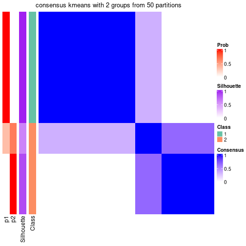</p>

</div>
<div id='tab-node-012-consensus-heatmap-2'>
<pre><code class="r">consensus_heatmap(res, k = 3)
</code></pre>

<p>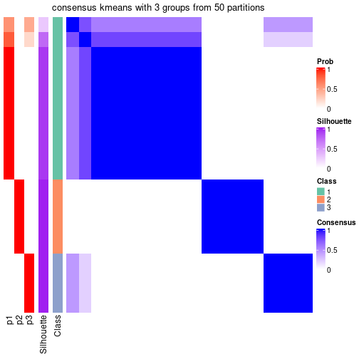</p>

</div>
<div id='tab-node-012-consensus-heatmap-3'>
<pre><code class="r">consensus_heatmap(res, k = 4)
</code></pre>

<p>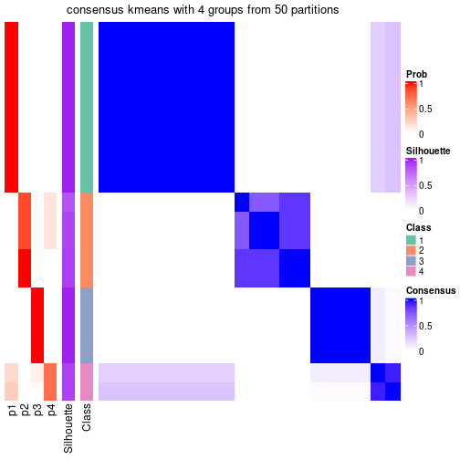</p>

</div>
<div id='tab-node-012-consensus-heatmap-4'>
<pre><code class="r">consensus_heatmap(res, k = 5)
</code></pre>

<p>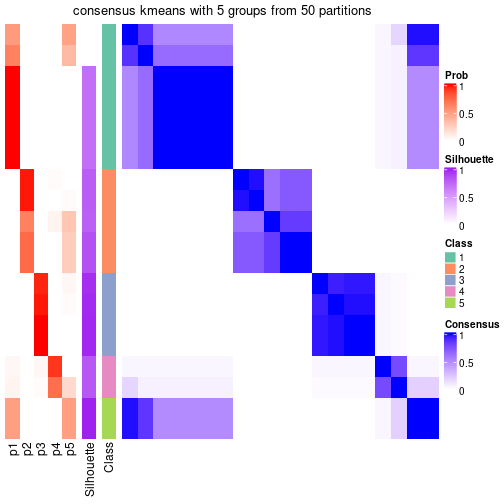</p>

</div>
<div id='tab-node-012-consensus-heatmap-5'>
<pre><code class="r">consensus_heatmap(res, k = 6)
</code></pre>

<p>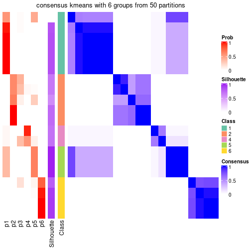</p>

</div>
<div id='tab-node-012-consensus-heatmap-6'>
<pre><code class="r">consensus_heatmap(res, k = 7)
</code></pre>

<p>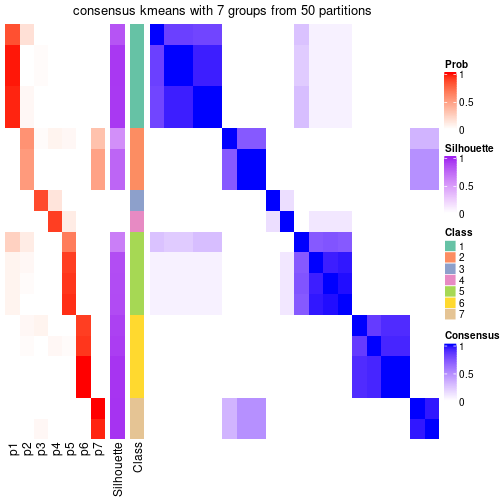</p>

</div>
<div id='tab-node-012-consensus-heatmap-7'>
<pre><code class="r">consensus_heatmap(res, k = 8)
</code></pre>

<p>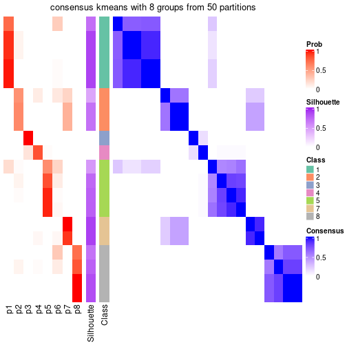</p>

</div>
</div>

Heatmaps for the membership of samples in all partitions to see how consistent they are:


<script>
$( function() {
	$( '#tabs-node-012-membership-heatmap' ).tabs();
} );
</script>
<div id='tabs-node-012-membership-heatmap'>
<ul>
<li><a href='#tab-node-012-membership-heatmap-1'>k = 2</a></li>
<li><a href='#tab-node-012-membership-heatmap-2'>k = 3</a></li>
<li><a href='#tab-node-012-membership-heatmap-3'>k = 4</a></li>
<li><a href='#tab-node-012-membership-heatmap-4'>k = 5</a></li>
<li><a href='#tab-node-012-membership-heatmap-5'>k = 6</a></li>
<li><a href='#tab-node-012-membership-heatmap-6'>k = 7</a></li>
<li><a href='#tab-node-012-membership-heatmap-7'>k = 8</a></li>
</ul>
<div id='tab-node-012-membership-heatmap-1'>
<pre><code class="r">membership_heatmap(res, k = 2)
</code></pre>

<p>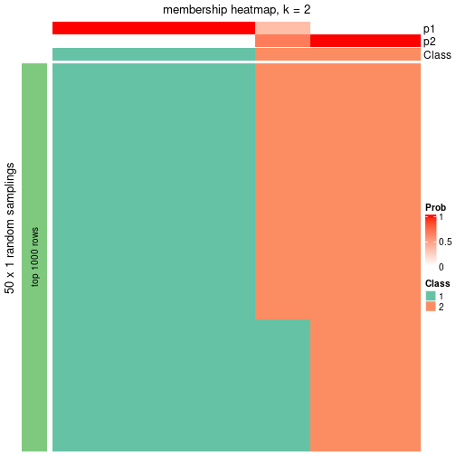</p>

</div>
<div id='tab-node-012-membership-heatmap-2'>
<pre><code class="r">membership_heatmap(res, k = 3)
</code></pre>

<p>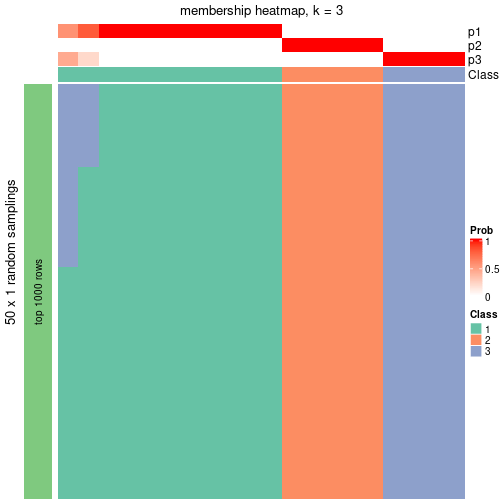</p>

</div>
<div id='tab-node-012-membership-heatmap-3'>
<pre><code class="r">membership_heatmap(res, k = 4)
</code></pre>

<p>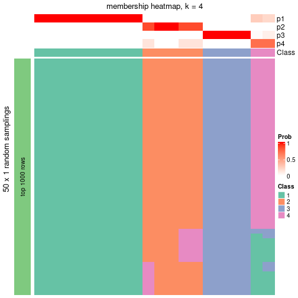</p>

</div>
<div id='tab-node-012-membership-heatmap-4'>
<pre><code class="r">membership_heatmap(res, k = 5)
</code></pre>

<p>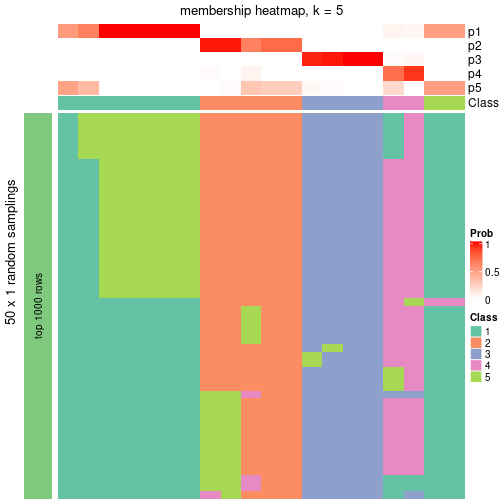</p>

</div>
<div id='tab-node-012-membership-heatmap-5'>
<pre><code class="r">membership_heatmap(res, k = 6)
</code></pre>

<p>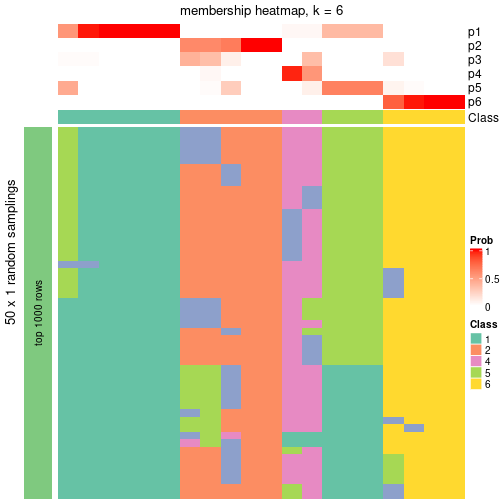</p>

</div>
<div id='tab-node-012-membership-heatmap-6'>
<pre><code class="r">membership_heatmap(res, k = 7)
</code></pre>

<p>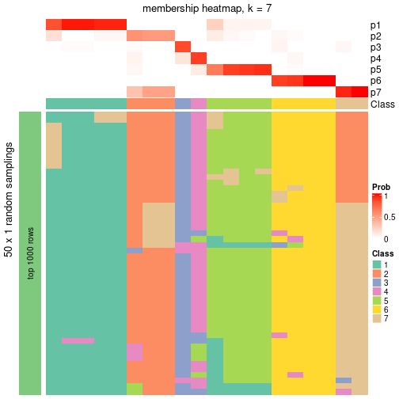</p>

</div>
<div id='tab-node-012-membership-heatmap-7'>
<pre><code class="r">membership_heatmap(res, k = 8)
</code></pre>

<p>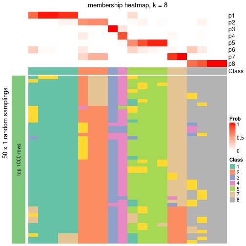</p>

</div>
</div>

As soon as the classes for columns are determined, the signatures
that are significantly different between subgroups can be looked for. 
Following are the heatmaps for signatures.


<script>
$( function() {
	$( '#tabs-node-012-get-signatures' ).tabs();
} );
</script>
<div id='tabs-node-012-get-signatures'>
<ul>
<li><a href='#tab-node-012-get-signatures-1'>k = 2</a></li>
<li><a href='#tab-node-012-get-signatures-2'>k = 3</a></li>
<li><a href='#tab-node-012-get-signatures-3'>k = 4</a></li>
<li><a href='#tab-node-012-get-signatures-4'>k = 5</a></li>
<li><a href='#tab-node-012-get-signatures-5'>k = 6</a></li>
<li><a href='#tab-node-012-get-signatures-6'>k = 7</a></li>
<li><a href='#tab-node-012-get-signatures-7'>k = 8</a></li>
</ul>
<div id='tab-node-012-get-signatures-1'>
<pre><code class="r">get_signatures(res, k = 2)
</code></pre>

<p>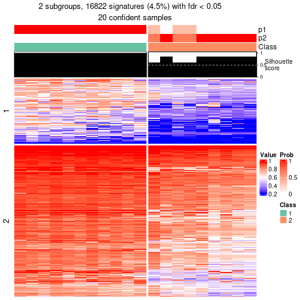</p>

</div>
<div id='tab-node-012-get-signatures-2'>
<pre><code class="r">get_signatures(res, k = 3)
</code></pre>

<p>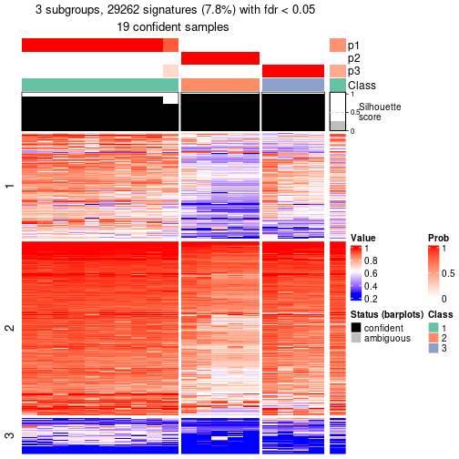</p>

</div>
<div id='tab-node-012-get-signatures-3'>
<pre><code class="r">get_signatures(res, k = 4)
</code></pre>

<p>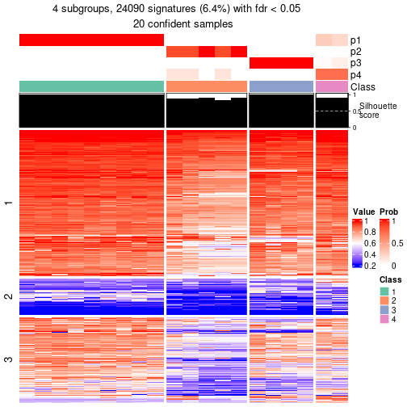</p>

</div>
<div id='tab-node-012-get-signatures-4'>
<pre><code class="r">get_signatures(res, k = 5)
</code></pre>

<p>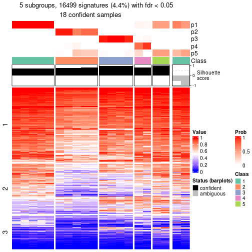</p>

</div>
<div id='tab-node-012-get-signatures-5'>
<pre><code class="r">get_signatures(res, k = 6)
</code></pre>

<p>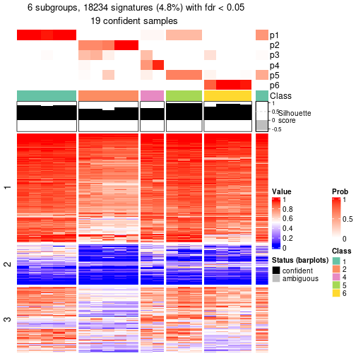</p>

</div>
<div id='tab-node-012-get-signatures-6'>
<pre><code class="r">get_signatures(res, k = 7)
</code></pre>

<p>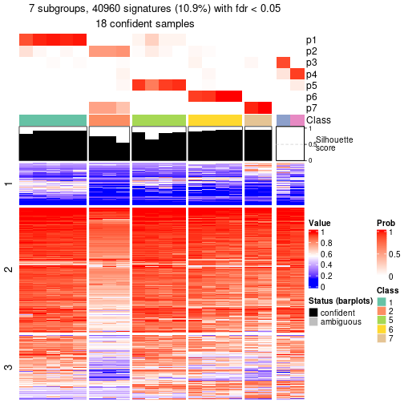</p>

</div>
<div id='tab-node-012-get-signatures-7'>
<pre><code class="r">get_signatures(res, k = 8)
</code></pre>

<p>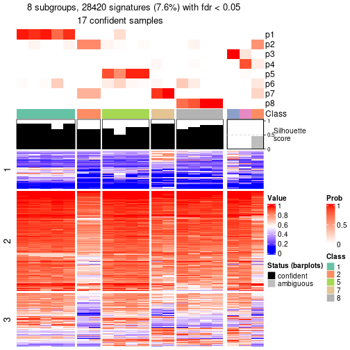</p>

</div>
</div>


Compare the overlap of signatures from different k:

```r
compare_signatures(res)
```

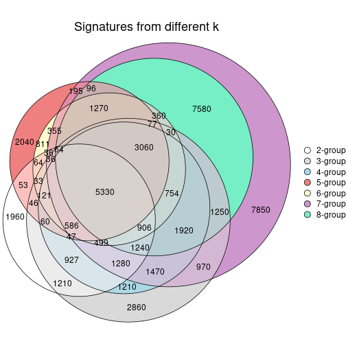

`get_signature()` returns a data frame invisibly. To get the list of signatures, the function
call should be assigned to a variable explicitly. In following code, if `plot` argument is set
to `FALSE`, no heatmap is plotted while only the differential analysis is performed.

```r
# code only for demonstration
tb = get_signature(res, k = ..., plot = FALSE)
```

An example of the output of `tb` is:

```
#>   which_row         fdr    mean_1    mean_2 scaled_mean_1 scaled_mean_2 km
#> 1        38 0.042760348  8.373488  9.131774    -0.5533452     0.5164555  1
#> 2        40 0.018707592  7.106213  8.469186    -0.6173731     0.5762149  1
#> 3        55 0.019134737 10.221463 11.207825    -0.6159697     0.5749050  1
#> 4        59 0.006059896  5.921854  7.869574    -0.6899429     0.6439467  1
#> 5        60 0.018055526  8.928898 10.211722    -0.6204761     0.5791110  1
#> 6        98 0.009384629 15.714769 14.887706     0.6635654    -0.6193277  2
...
```

The columns in `tb` are:

1. `which_row`: row indices corresponding to the input matrix.
2. `fdr`: FDR for the differential test. 
3. `mean_x`: The mean value in group x.
4. `scaled_mean_x`: The mean value in group x after rows are scaled.
5. `km`: Row groups if k-means clustering is applied to rows (which is done by automatically selecting number of clusters).

If there are too many signatures, `top_signatures = ...` can be set to only show the 
signatures with the highest FDRs:

```r
# code only for demonstration
# e.g. to show the top 500 most significant rows
tb = get_signature(res, k = ..., top_signatures = 500)
```

If the signatures are defined as these which are uniquely high in current group, `diff_method` argument
can be set to `"uniquely_high_in_one_group"`:

```r
# code only for demonstration
tb = get_signature(res, k = ..., diff_method = "uniquely_high_in_one_group")
```


UMAP plot which shows how samples are separated.


<script>
$( function() {
	$( '#tabs-node-012-dimension-reduction' ).tabs();
} );
</script>
<div id='tabs-node-012-dimension-reduction'>
<ul>
<li><a href='#tab-node-012-dimension-reduction-1'>k = 2</a></li>
<li><a href='#tab-node-012-dimension-reduction-2'>k = 3</a></li>
<li><a href='#tab-node-012-dimension-reduction-3'>k = 4</a></li>
<li><a href='#tab-node-012-dimension-reduction-4'>k = 5</a></li>
<li><a href='#tab-node-012-dimension-reduction-5'>k = 6</a></li>
<li><a href='#tab-node-012-dimension-reduction-6'>k = 7</a></li>
<li><a href='#tab-node-012-dimension-reduction-7'>k = 8</a></li>
</ul>
<div id='tab-node-012-dimension-reduction-1'>
<pre><code class="r">dimension_reduction(res, k = 2, method = &quot;UMAP&quot;)
</code></pre>

<p>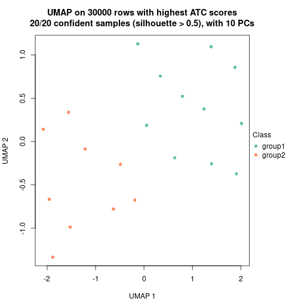</p>

</div>
<div id='tab-node-012-dimension-reduction-2'>
<pre><code class="r">dimension_reduction(res, k = 3, method = &quot;UMAP&quot;)
</code></pre>

<p>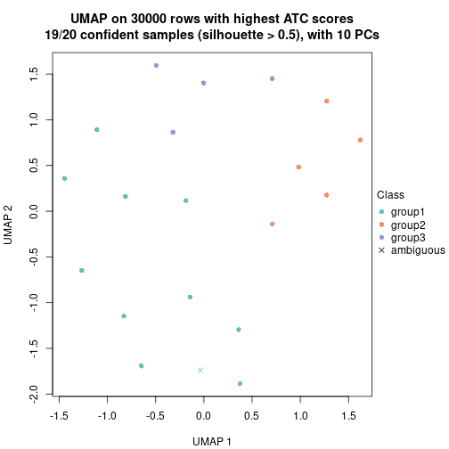</p>

</div>
<div id='tab-node-012-dimension-reduction-3'>
<pre><code class="r">dimension_reduction(res, k = 4, method = &quot;UMAP&quot;)
</code></pre>

<p>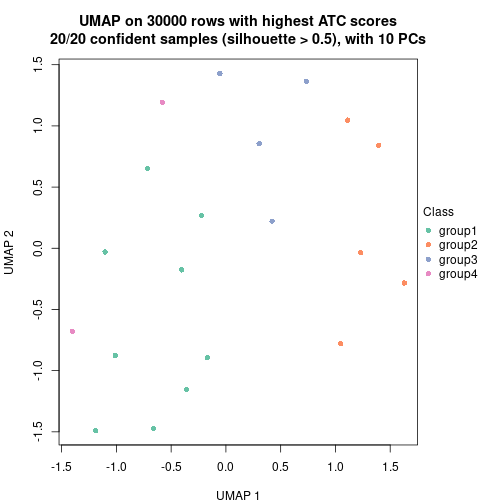</p>

</div>
<div id='tab-node-012-dimension-reduction-4'>
<pre><code class="r">dimension_reduction(res, k = 5, method = &quot;UMAP&quot;)
</code></pre>

<p>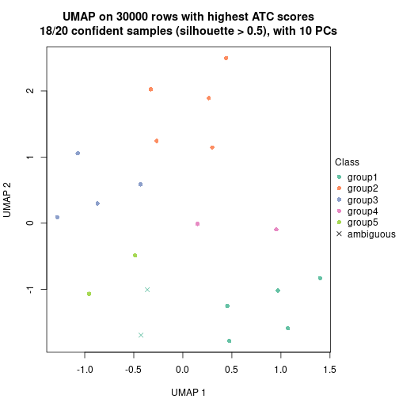</p>

</div>
<div id='tab-node-012-dimension-reduction-5'>
<pre><code class="r">dimension_reduction(res, k = 6, method = &quot;UMAP&quot;)
</code></pre>

<p>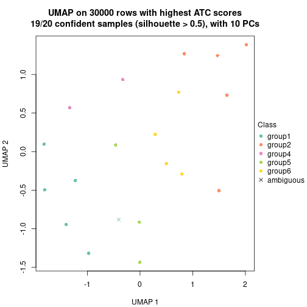</p>

</div>
<div id='tab-node-012-dimension-reduction-6'>
<pre><code class="r">dimension_reduction(res, k = 7, method = &quot;UMAP&quot;)
</code></pre>

<p>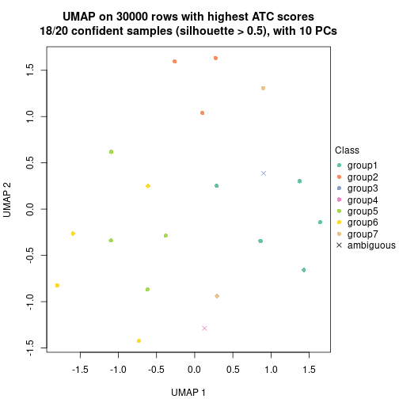</p>

</div>
<div id='tab-node-012-dimension-reduction-7'>
<pre><code class="r">dimension_reduction(res, k = 8, method = &quot;UMAP&quot;)
</code></pre>

<p>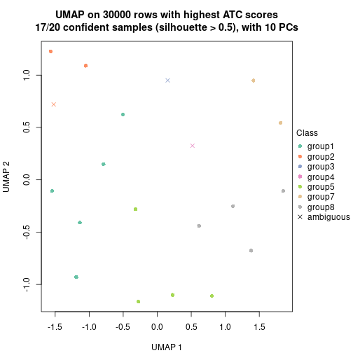</p>

</div>
</div>


Following heatmap shows how subgroups are split when increasing `k`:

```r
collect_classes(res)
```

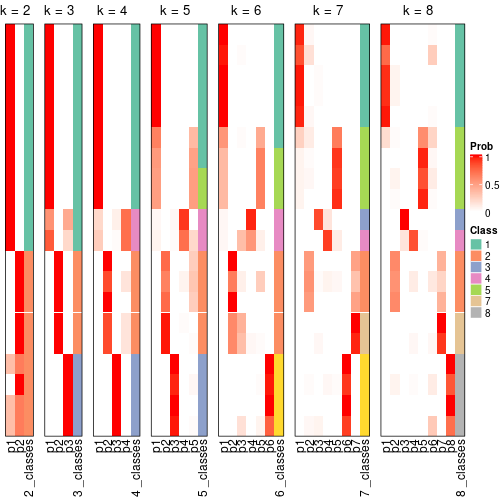


If matrix rows can be associated to genes, consider to use `functional_enrichment(res,
...)` to perform function enrichment for the signature genes. See [this vignette](https://jokergoo.github.io/cola_vignettes/functional_enrichment.html) for more detailed explanations.


 

---------------------------------------------------


### Node02


Parent node: [Node0](#Node0).
Child nodes: 
                [Node011](#Node011)
        ,
                [Node012](#Node012)
        ,
                Node013-leaf
        ,
                Node021-leaf
        ,
                Node022-leaf
        ,
                Node023-leaf
        ,
                [Node031](#Node031)
        ,
                Node032-leaf
        ,
                [Node033](#Node033)
        ,
                [Node034](#Node034)
        ,
                Node035-leaf
        ,
                [Node041](#Node041)
        ,
                [Node042](#Node042)
        ,
                [Node043](#Node043)
        ,
                [Node051](#Node051)
        ,
                [Node052](#Node052)
        ,
                [Node053](#Node053)
        .


The object with results only for a single top-value method and a single partitioning method 
can be extracted as:

```r
res = res_rh["02"]
```

A summary of `res` and all the functions that can be applied to it:

```r
res
```

```
#> A 'ConsensusPartition' object with k = 2, 3, 4, 5, 6, 7, 8.
#>   On a matrix with 30000 rows and 102 columns.
#>   Top rows (1000) are extracted by 'SD' method.
#>   Subgroups are detected by 'kmeans' method.
#>   Performed in total 350 partitions by row resampling.
#>   Best k for subgroups seems to be 2.
#> 
#> Following methods can be applied to this 'ConsensusPartition' object:
#>  [1] "cola_report"             "collect_classes"         "collect_plots"          
#>  [4] "collect_stats"           "colnames"                "compare_partitions"     
#>  [7] "compare_signatures"      "consensus_heatmap"       "dimension_reduction"    
#> [10] "functional_enrichment"   "get_anno_col"            "get_anno"               
#> [13] "get_classes"             "get_consensus"           "get_matrix"             
#> [16] "get_membership"          "get_param"               "get_signatures"         
#> [19] "get_stats"               "is_best_k"               "is_stable_k"            
#> [22] "membership_heatmap"      "ncol"                    "nrow"                   
#> [25] "plot_ecdf"               "predict_classes"         "rownames"               
#> [28] "select_partition_number" "show"                    "suggest_best_k"         
#> [31] "test_to_known_factors"   "top_rows_heatmap"
```

`collect_plots()` function collects all the plots made from `res` for all `k` (number of subgroups)
into one single page to provide an easy and fast comparison between different `k`.

```r
collect_plots(res)
```


The plots are:

- The first row: a plot of the eCDF (empirical cumulative distribution
  function) curves of the consensus matrix for each `k` and the heatmap of
  predicted classes for each `k`.
- The second row: heatmaps of the consensus matrix for each `k`.
- The third row: heatmaps of the membership matrix for each `k`.
- The fouth row: heatmaps of the signatures for each `k`.

All the plots in panels can be made by individual functions and they are
plotted later in this section.

`select_partition_number()` produces several plots showing different
statistics for choosing "optimized" `k`. There are following statistics:

- eCDF curves of the consensus matrix for each `k`;
- 1-PAC. [The PAC score](https://en.wikipedia.org/wiki/Consensus_clustering#Over-interpretation_potential_of_consensus_clustering)
  measures the proportion of the ambiguous subgrouping.
- Mean silhouette score.
- Concordance. The mean probability of fiting the consensus subgroup labels in all
  partitions.
- Area increased. Denote $A_k$ as the area under the eCDF curve for current
  `k`, the area increased is defined as $A_k - A_{k-1}$.
- Rand index. The percent of pairs of samples that are both in a same cluster
  or both are not in a same cluster in the partition of k and k-1.
- Jaccard index. The ratio of pairs of samples are both in a same cluster in
  the partition of k and k-1 and the pairs of samples are both in a same
  cluster in the partition k or k-1.

The detailed explanations of these statistics can be found in [the _cola_
vignette](https://jokergoo.github.io/cola_vignettes/cola.html#toc_13).

Generally speaking, higher 1-PAC score, higher mean silhouette score or higher
concordance corresponds to better partition. Rand index and Jaccard index
measure how similar the current partition is compared to partition with `k-1`.
If they are too similar, we won't accept `k` is better than `k-1`.

```r
select_partition_number(res)
```

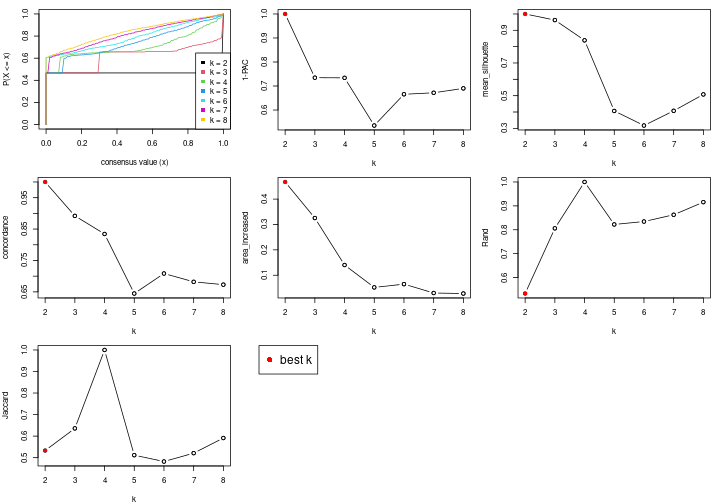

The numeric values for all these statistics can be obtained by `get_stats()`.

```r
get_stats(res)
```

```
#>   k 1-PAC mean_silhouette concordance area_increased  Rand Jaccard
#> 2 2 1.000           1.000       1.000         0.4674 0.533   0.533
#> 3 3 0.735           0.963       0.892         0.3253 0.806   0.636
#> 4 4 0.734           0.839       0.834         0.1402 1.000   1.000
#> 5 5 0.535           0.406       0.645         0.0520 0.822   0.511
#> 6 6 0.666           0.317       0.708         0.0649 0.834   0.482
#> 7 7 0.672           0.407       0.682         0.0299 0.863   0.521
#> 8 8 0.690           0.508       0.673         0.0279 0.916   0.591
```

`suggest_best_k()` suggests the best $k$ based on these statistics. The rules are as follows:

- All $k$ with Jaccard index larger than 0.95 are removed because increasing
  $k$ does not provide enough extra information. If all $k$ are removed, it is
  marked as no subgroup is detected.
- For all $k$ with 1-PAC score larger than 0.9, the maximal $k$ is taken as
  the best $k$, and other $k$ are marked as optional $k$.
- If it does not fit the second rule. The $k$ with the maximal vote of the
  highest 1-PAC score, highest mean silhouette, and highest concordance is
  taken as the best $k$.

```r
suggest_best_k(res)
```

```
#> [1] 2
```


Following is the table of the partitions (You need to click the **show/hide
code output** link to see it). The membership matrix (columns with name `p*`)
is inferred by
[`clue::cl_consensus()`](https://www.rdocumentation.org/link/cl_consensus?package=clue)
function with the `SE` method. Basically the value in the membership matrix
represents the probability to belong to a certain group. The finall subgroup
label for an item is determined with the group with highest probability it
belongs to.

In `get_classes()` function, the entropy is calculated from the membership
matrix and the silhouette score is calculated from the consensus matrix.


<script>
$( function() {
	$( '#tabs-node-02-get-classes' ).tabs();
} );
</script>
<div id='tabs-node-02-get-classes'>
<ul>
<li><a href='#tab-node-02-get-classes-1'>k = 2</a></li>
<li><a href='#tab-node-02-get-classes-2'>k = 3</a></li>
<li><a href='#tab-node-02-get-classes-3'>k = 4</a></li>
<li><a href='#tab-node-02-get-classes-4'>k = 5</a></li>
<li><a href='#tab-node-02-get-classes-5'>k = 6</a></li>
<li><a href='#tab-node-02-get-classes-6'>k = 7</a></li>
<li><a href='#tab-node-02-get-classes-7'>k = 8</a></li>
</ul>

<div id='tab-node-02-get-classes-1'>
<p><a id='tab-node-02-get-classes-1-a' style='color:#0366d6' href='#'>show/hide code output</a></p>
<pre><code class="r">cbind(get_classes(res, k = 2), get_membership(res, k = 2))
</code></pre>

<pre><code>#&gt;                 class entropy silhouette p1 p2
#&gt; TCGA.56.8201.01     2       0          1  0  1
#&gt; TCGA.39.5028.01     2       0          1  0  1
#&gt; TCGA.39.5030.01     1       0          1  1  0
#&gt; TCGA.33.4589.01     1       0          1  1  0
#&gt; TCGA.33.6738.01     2       0          1  0  1
#&gt; TCGA.33.AASL.01     1       0          1  1  0
#&gt; TCGA.77.8138.01     2       0          1  0  1
#&gt; TCGA.98.8023.01     2       0          1  0  1
#&gt; TCGA.18.4721.01     2       0          1  0  1
#&gt; TCGA.34.5241.01     2       0          1  0  1
#&gt; TCGA.77.8136.01     1       0          1  1  0
#&gt; TCGA.85.8049.01     2       0          1  0  1
#&gt; TCGA.63.7022.01     1       0          1  1  0
#&gt; TCGA.77.8156.01     2       0          1  0  1
#&gt; TCGA.39.5039.01     2       0          1  0  1
#&gt; TCGA.85.8048.01     2       0          1  0  1
#&gt; TCGA.77.8131.01     2       0          1  0  1
#&gt; TCGA.43.6773.01     2       0          1  0  1
#&gt; TCGA.63.7021.01     2       0          1  0  1
#&gt; TCGA.XC.AA0X.01     1       0          1  1  0
#&gt; TCGA.39.5011.01     1       0          1  1  0
#&gt; TCGA.NK.A7XE.01     2       0          1  0  1
#&gt; TCGA.39.5034.01     1       0          1  1  0
#&gt; TCGA.52.7622.01     1       0          1  1  0
#&gt; TCGA.90.A4EE.01     2       0          1  0  1
#&gt; TCGA.90.A4ED.01     2       0          1  0  1
#&gt; TCGA.39.5040.01     2       0          1  0  1
#&gt; TCGA.58.A46J.01     2       0          1  0  1
#&gt; TCGA.34.5234.01     1       0          1  1  0
#&gt; TCGA.37.5819.01     2       0          1  0  1
#&gt; TCGA.22.5489.01     2       0          1  0  1
#&gt; TCGA.85.A4JC.01     2       0          1  0  1
#&gt; TCGA.52.7811.01     2       0          1  0  1
#&gt; TCGA.52.7812.01     2       0          1  0  1
#&gt; TCGA.L3.A4E7.01     2       0          1  0  1
#&gt; TCGA.22.4605.01     1       0          1  1  0
#&gt; TCGA.39.5021.01     2       0          1  0  1
#&gt; TCGA.96.A4JL.01     1       0          1  1  0
#&gt; TCGA.56.5897.01     2       0          1  0  1
#&gt; TCGA.21.5787.01     2       0          1  0  1
#&gt; TCGA.21.5784.01     1       0          1  1  0
#&gt; TCGA.85.7697.01     2       0          1  0  1
#&gt; TCGA.56.7731.01     1       0          1  1  0
#&gt; TCGA.43.5668.01     2       0          1  0  1
#&gt; TCGA.85.8584.01     2       0          1  0  1
#&gt; TCGA.98.7454.01     1       0          1  1  0
#&gt; TCGA.77.8008.01     2       0          1  0  1
#&gt; TCGA.77.7138.01     2       0          1  0  1
#&gt; TCGA.77.8007.01     2       0          1  0  1
#&gt; TCGA.96.7545.01     2       0          1  0  1
#&gt; TCGA.77.A5GB.01     2       0          1  0  1
#&gt; TCGA.77.A5G1.01     2       0          1  0  1
#&gt; TCGA.85.8666.01     2       0          1  0  1
#&gt; TCGA.90.A59Q.01     1       0          1  1  0
#&gt; TCGA.56.8624.01     2       0          1  0  1
#&gt; TCGA.60.2704.01     2       0          1  0  1
#&gt; TCGA.58.8393.01     1       0          1  1  0
#&gt; TCGA.85.8582.01     2       0          1  0  1
#&gt; TCGA.O2.A5IC.01     1       0          1  1  0
#&gt; TCGA.43.A475.01     1       0          1  1  0
#&gt; TCGA.85.8481.01     2       0          1  0  1
#&gt; TCGA.63.A5MG.01     2       0          1  0  1
#&gt; TCGA.85.8580.01     1       0          1  1  0
#&gt; TCGA.63.A5MN.01     1       0          1  1  0
#&gt; TCGA.56.8503.01     1       0          1  1  0
#&gt; TCGA.56.A5DS.01     1       0          1  1  0
#&gt; TCGA.34.8454.01     1       0          1  1  0
#&gt; TCGA.56.8625.01     1       0          1  1  0
#&gt; TCGA.60.2703.01     2       0          1  0  1
#&gt; TCGA.43.A56U.01     1       0          1  1  0
#&gt; TCGA.85.A510.01     1       0          1  1  0
#&gt; TCGA.85.6560.01     2       0          1  0  1
#&gt; TCGA.33.6737.01     2       0          1  0  1
#&gt; TCGA.NK.A5CT.01     2       0          1  0  1
#&gt; TCGA.34.5232.01     1       0          1  1  0
#&gt; TCGA.85.A513.01     1       0          1  1  0
#&gt; TCGA.68.7757.01     2       0          1  0  1
#&gt; TCGA.63.6202.01     2       0          1  0  1
#&gt; TCGA.43.6647.01     1       0          1  1  0
#&gt; TCGA.96.8170.01     1       0          1  1  0
#&gt; TCGA.NC.A5HE.01     2       0          1  0  1
#&gt; TCGA.43.6771.01     2       0          1  0  1
#&gt; TCGA.63.A5MT.01     2       0          1  0  1
#&gt; TCGA.63.A5MS.01     2       0          1  0  1
#&gt; TCGA.56.6546.01     2       0          1  0  1
#&gt; TCGA.70.6722.01     2       0          1  0  1
#&gt; TCGA.85.8355.01     2       0          1  0  1
#&gt; TCGA.39.5022.01     2       0          1  0  1
#&gt; TCGA.56.8309.01     2       0          1  0  1
#&gt; TCGA.85.6175.01     1       0          1  1  0
#&gt; TCGA.O2.A52Q.01     1       0          1  1  0
#&gt; TCGA.O2.A52V.01     1       0          1  1  0
#&gt; TCGA.85.8353.01     2       0          1  0  1
#&gt; TCGA.NC.A5HJ.01     2       0          1  0  1
#&gt; TCGA.85.A50Z.01     2       0          1  0  1
#&gt; TCGA.60.2709.01     2       0          1  0  1
#&gt; TCGA.63.A5MM.01     1       0          1  1  0
#&gt; TCGA.39.5024.01     1       0          1  1  0
#&gt; TCGA.34.5236.01     2       0          1  0  1
#&gt; TCGA.85.A511.01     2       0          1  0  1
#&gt; TCGA.85.A50M.01     2       0          1  0  1
#&gt; TCGA.68.A59I.01     1       0          1  1  0
</code></pre>

<script>
$('#tab-node-02-get-classes-1-a').parent().next().next().hide();
$('#tab-node-02-get-classes-1-a').click(function(){
  $('#tab-node-02-get-classes-1-a').parent().next().next().toggle();
  return(false);
});
</script>
</div>

<div id='tab-node-02-get-classes-2'>
<p><a id='tab-node-02-get-classes-2-a' style='color:#0366d6' href='#'>show/hide code output</a></p>
<pre><code class="r">cbind(get_classes(res, k = 3), get_membership(res, k = 3))
</code></pre>

<pre><code>#&gt;                 class entropy silhouette   p1   p2   p3
#&gt; TCGA.56.8201.01     3  0.5560      1.000 0.00 0.30 0.70
#&gt; TCGA.39.5028.01     2  0.0000      0.990 0.00 1.00 0.00
#&gt; TCGA.39.5030.01     1  0.1529      0.940 0.96 0.00 0.04
#&gt; TCGA.33.4589.01     1  0.2959      0.934 0.90 0.00 0.10
#&gt; TCGA.33.6738.01     3  0.5560      1.000 0.00 0.30 0.70
#&gt; TCGA.33.AASL.01     1  0.4555      0.901 0.80 0.00 0.20
#&gt; TCGA.77.8138.01     2  0.0000      0.990 0.00 1.00 0.00
#&gt; TCGA.98.8023.01     2  0.0000      0.990 0.00 1.00 0.00
#&gt; TCGA.18.4721.01     3  0.5560      1.000 0.00 0.30 0.70
#&gt; TCGA.34.5241.01     2  0.0000      0.990 0.00 1.00 0.00
#&gt; TCGA.77.8136.01     1  0.0000      0.939 1.00 0.00 0.00
#&gt; TCGA.85.8049.01     3  0.5560      1.000 0.00 0.30 0.70
#&gt; TCGA.63.7022.01     1  0.0000      0.939 1.00 0.00 0.00
#&gt; TCGA.77.8156.01     2  0.0000      0.990 0.00 1.00 0.00
#&gt; TCGA.39.5039.01     2  0.0000      0.990 0.00 1.00 0.00
#&gt; TCGA.85.8048.01     2  0.0000      0.990 0.00 1.00 0.00
#&gt; TCGA.77.8131.01     2  0.0000      0.990 0.00 1.00 0.00
#&gt; TCGA.43.6773.01     2  0.0000      0.990 0.00 1.00 0.00
#&gt; TCGA.63.7021.01     2  0.0000      0.990 0.00 1.00 0.00
#&gt; TCGA.XC.AA0X.01     1  0.2066      0.938 0.94 0.00 0.06
#&gt; TCGA.39.5011.01     1  0.4002      0.905 0.84 0.00 0.16
#&gt; TCGA.NK.A7XE.01     3  0.5560      1.000 0.00 0.30 0.70
#&gt; TCGA.39.5034.01     1  0.2066      0.924 0.94 0.00 0.06
#&gt; TCGA.52.7622.01     1  0.2066      0.938 0.94 0.00 0.06
#&gt; TCGA.90.A4EE.01     3  0.5560      1.000 0.00 0.30 0.70
#&gt; TCGA.90.A4ED.01     2  0.0000      0.990 0.00 1.00 0.00
#&gt; TCGA.39.5040.01     3  0.5560      1.000 0.00 0.30 0.70
#&gt; TCGA.58.A46J.01     2  0.0000      0.990 0.00 1.00 0.00
#&gt; TCGA.34.5234.01     1  0.0892      0.940 0.98 0.00 0.02
#&gt; TCGA.37.5819.01     2  0.0000      0.990 0.00 1.00 0.00
#&gt; TCGA.22.5489.01     2  0.5216      0.409 0.00 0.74 0.26
#&gt; TCGA.85.A4JC.01     2  0.0000      0.990 0.00 1.00 0.00
#&gt; TCGA.52.7811.01     2  0.0000      0.990 0.00 1.00 0.00
#&gt; TCGA.52.7812.01     3  0.5560      1.000 0.00 0.30 0.70
#&gt; TCGA.L3.A4E7.01     2  0.0000      0.990 0.00 1.00 0.00
#&gt; TCGA.22.4605.01     1  0.0892      0.941 0.98 0.00 0.02
#&gt; TCGA.39.5021.01     2  0.0000      0.990 0.00 1.00 0.00
#&gt; TCGA.96.A4JL.01     1  0.5016      0.885 0.76 0.00 0.24
#&gt; TCGA.56.5897.01     2  0.0000      0.990 0.00 1.00 0.00
#&gt; TCGA.21.5787.01     2  0.0000      0.990 0.00 1.00 0.00
#&gt; TCGA.21.5784.01     1  0.0000      0.939 1.00 0.00 0.00
#&gt; TCGA.85.7697.01     2  0.0000      0.990 0.00 1.00 0.00
#&gt; TCGA.56.7731.01     1  0.0000      0.939 1.00 0.00 0.00
#&gt; TCGA.43.5668.01     3  0.5560      1.000 0.00 0.30 0.70
#&gt; TCGA.85.8584.01     3  0.5560      1.000 0.00 0.30 0.70
#&gt; TCGA.98.7454.01     1  0.5016      0.885 0.76 0.00 0.24
#&gt; TCGA.77.8008.01     2  0.0000      0.990 0.00 1.00 0.00
#&gt; TCGA.77.7138.01     2  0.0000      0.990 0.00 1.00 0.00
#&gt; TCGA.77.8007.01     3  0.5560      1.000 0.00 0.30 0.70
#&gt; TCGA.96.7545.01     3  0.5560      1.000 0.00 0.30 0.70
#&gt; TCGA.77.A5GB.01     2  0.0000      0.990 0.00 1.00 0.00
#&gt; TCGA.77.A5G1.01     2  0.0000      0.990 0.00 1.00 0.00
#&gt; TCGA.85.8666.01     3  0.5560      1.000 0.00 0.30 0.70
#&gt; TCGA.90.A59Q.01     1  0.1529      0.937 0.96 0.00 0.04
#&gt; TCGA.56.8624.01     2  0.0000      0.990 0.00 1.00 0.00
#&gt; TCGA.60.2704.01     2  0.0000      0.990 0.00 1.00 0.00
#&gt; TCGA.58.8393.01     1  0.5016      0.885 0.76 0.00 0.24
#&gt; TCGA.85.8582.01     3  0.5560      1.000 0.00 0.30 0.70
#&gt; TCGA.O2.A5IC.01     1  0.1529      0.938 0.96 0.00 0.04
#&gt; TCGA.43.A475.01     1  0.2066      0.938 0.94 0.00 0.06
#&gt; TCGA.85.8481.01     2  0.0000      0.990 0.00 1.00 0.00
#&gt; TCGA.63.A5MG.01     3  0.5560      1.000 0.00 0.30 0.70
#&gt; TCGA.85.8580.01     1  0.3340      0.924 0.88 0.00 0.12
#&gt; TCGA.63.A5MN.01     1  0.0892      0.940 0.98 0.00 0.02
#&gt; TCGA.56.8503.01     1  0.0000      0.939 1.00 0.00 0.00
#&gt; TCGA.56.A5DS.01     1  0.0892      0.941 0.98 0.00 0.02
#&gt; TCGA.34.8454.01     1  0.0000      0.939 1.00 0.00 0.00
#&gt; TCGA.56.8625.01     1  0.4796      0.894 0.78 0.00 0.22
#&gt; TCGA.60.2703.01     2  0.0000      0.990 0.00 1.00 0.00
#&gt; TCGA.43.A56U.01     1  0.0892      0.941 0.98 0.00 0.02
#&gt; TCGA.85.A510.01     1  0.2066      0.924 0.94 0.00 0.06
#&gt; TCGA.85.6560.01     3  0.5560      1.000 0.00 0.30 0.70
#&gt; TCGA.33.6737.01     3  0.5560      1.000 0.00 0.30 0.70
#&gt; TCGA.NK.A5CT.01     3  0.5560      1.000 0.00 0.30 0.70
#&gt; TCGA.34.5232.01     1  0.4555      0.901 0.80 0.00 0.20
#&gt; TCGA.85.A513.01     1  0.5016      0.885 0.76 0.00 0.24
#&gt; TCGA.68.7757.01     2  0.0000      0.990 0.00 1.00 0.00
#&gt; TCGA.63.6202.01     3  0.5560      1.000 0.00 0.30 0.70
#&gt; TCGA.43.6647.01     1  0.0000      0.939 1.00 0.00 0.00
#&gt; TCGA.96.8170.01     1  0.0000      0.939 1.00 0.00 0.00
#&gt; TCGA.NC.A5HE.01     3  0.5560      1.000 0.00 0.30 0.70
#&gt; TCGA.43.6771.01     3  0.5560      1.000 0.00 0.30 0.70
#&gt; TCGA.63.A5MT.01     3  0.5560      1.000 0.00 0.30 0.70
#&gt; TCGA.63.A5MS.01     3  0.5560      1.000 0.00 0.30 0.70
#&gt; TCGA.56.6546.01     2  0.0000      0.990 0.00 1.00 0.00
#&gt; TCGA.70.6722.01     2  0.0000      0.990 0.00 1.00 0.00
#&gt; TCGA.85.8355.01     2  0.0000      0.990 0.00 1.00 0.00
#&gt; TCGA.39.5022.01     3  0.5560      1.000 0.00 0.30 0.70
#&gt; TCGA.56.8309.01     2  0.0000      0.990 0.00 1.00 0.00
#&gt; TCGA.85.6175.01     1  0.3340      0.917 0.88 0.00 0.12
#&gt; TCGA.O2.A52Q.01     1  0.5397      0.870 0.72 0.00 0.28
#&gt; TCGA.O2.A52V.01     1  0.3686      0.918 0.86 0.00 0.14
#&gt; TCGA.85.8353.01     3  0.5560      1.000 0.00 0.30 0.70
#&gt; TCGA.NC.A5HJ.01     2  0.0000      0.990 0.00 1.00 0.00
#&gt; TCGA.85.A50Z.01     2  0.0000      0.990 0.00 1.00 0.00
#&gt; TCGA.60.2709.01     2  0.0000      0.990 0.00 1.00 0.00
#&gt; TCGA.63.A5MM.01     1  0.5216      0.878 0.74 0.00 0.26
#&gt; TCGA.39.5024.01     1  0.0000      0.939 1.00 0.00 0.00
#&gt; TCGA.34.5236.01     2  0.0000      0.990 0.00 1.00 0.00
#&gt; TCGA.85.A511.01     2  0.0000      0.990 0.00 1.00 0.00
#&gt; TCGA.85.A50M.01     2  0.0000      0.990 0.00 1.00 0.00
#&gt; TCGA.68.A59I.01     1  0.1529      0.940 0.96 0.00 0.04
</code></pre>

<script>
$('#tab-node-02-get-classes-2-a').parent().next().next().hide();
$('#tab-node-02-get-classes-2-a').click(function(){
  $('#tab-node-02-get-classes-2-a').parent().next().next().toggle();
  return(false);
});
</script>
</div>

<div id='tab-node-02-get-classes-3'>
<p><a id='tab-node-02-get-classes-3-a' style='color:#0366d6' href='#'>show/hide code output</a></p>
<pre><code class="r">cbind(get_classes(res, k = 4), get_membership(res, k = 4))
</code></pre>

<pre><code>#&gt;                 class entropy silhouette   p1   p2   p3   p4
#&gt; TCGA.56.8201.01     4  0.5962      0.859 0.00 0.08 0.26 0.66
#&gt; TCGA.39.5028.01     2  0.3801      0.787 0.00 0.78 0.22 0.00
#&gt; TCGA.39.5030.01     1  0.1913      0.865 0.94 0.00 0.04 0.02
#&gt; TCGA.33.4589.01     1  0.5713      0.803 0.62 0.00 0.34 0.04
#&gt; TCGA.33.6738.01     4  0.3198      0.869 0.00 0.08 0.04 0.88
#&gt; TCGA.33.AASL.01     1  0.4855      0.792 0.60 0.00 0.40 0.00
#&gt; TCGA.77.8138.01     2  0.2011      0.872 0.00 0.92 0.08 0.00
#&gt; TCGA.98.8023.01     2  0.0000      0.884 0.00 1.00 0.00 0.00
#&gt; TCGA.18.4721.01     4  0.3198      0.869 0.00 0.08 0.04 0.88
#&gt; TCGA.34.5241.01     2  0.1211      0.883 0.00 0.96 0.04 0.00
#&gt; TCGA.77.8136.01     1  0.2335      0.863 0.92 0.00 0.06 0.02
#&gt; TCGA.85.8049.01     4  0.2011      0.879 0.00 0.08 0.00 0.92
#&gt; TCGA.63.7022.01     1  0.0000      0.864 1.00 0.00 0.00 0.00
#&gt; TCGA.77.8156.01     2  0.2647      0.857 0.00 0.88 0.12 0.00
#&gt; TCGA.39.5039.01     2  0.1211      0.879 0.00 0.96 0.04 0.00
#&gt; TCGA.85.8048.01     2  0.0707      0.884 0.00 0.98 0.02 0.00
#&gt; TCGA.77.8131.01     2  0.1211      0.883 0.00 0.96 0.04 0.00
#&gt; TCGA.43.6773.01     2  0.3172      0.829 0.00 0.84 0.16 0.00
#&gt; TCGA.63.7021.01     2  0.0000      0.884 0.00 1.00 0.00 0.00
#&gt; TCGA.XC.AA0X.01     1  0.4642      0.833 0.74 0.00 0.24 0.02
#&gt; TCGA.39.5011.01     1  0.4079      0.821 0.80 0.00 0.18 0.02
#&gt; TCGA.NK.A7XE.01     4  0.4292      0.832 0.00 0.10 0.08 0.82
#&gt; TCGA.39.5034.01     1  0.3198      0.849 0.88 0.00 0.04 0.08
#&gt; TCGA.52.7622.01     1  0.4642      0.833 0.74 0.00 0.24 0.02
#&gt; TCGA.90.A4EE.01     4  0.2011      0.879 0.00 0.08 0.00 0.92
#&gt; TCGA.90.A4ED.01     2  0.2345      0.864 0.00 0.90 0.10 0.00
#&gt; TCGA.39.5040.01     4  0.3198      0.869 0.00 0.08 0.04 0.88
#&gt; TCGA.58.A46J.01     2  0.0707      0.882 0.00 0.98 0.02 0.00
#&gt; TCGA.34.5234.01     1  0.0707      0.864 0.98 0.00 0.02 0.00
#&gt; TCGA.37.5819.01     2  0.3172      0.843 0.00 0.84 0.16 0.00
#&gt; TCGA.22.5489.01     2  0.4977      0.179 0.00 0.54 0.00 0.46
#&gt; TCGA.85.A4JC.01     2  0.1211      0.883 0.00 0.96 0.04 0.00
#&gt; TCGA.52.7811.01     2  0.2647      0.857 0.00 0.88 0.12 0.00
#&gt; TCGA.52.7812.01     4  0.5962      0.859 0.00 0.08 0.26 0.66
#&gt; TCGA.L3.A4E7.01     2  0.5512      0.635 0.00 0.66 0.30 0.04
#&gt; TCGA.22.4605.01     1  0.2706      0.863 0.90 0.00 0.08 0.02
#&gt; TCGA.39.5021.01     2  0.2647      0.857 0.00 0.88 0.12 0.00
#&gt; TCGA.96.A4JL.01     1  0.4977      0.762 0.54 0.00 0.46 0.00
#&gt; TCGA.56.5897.01     2  0.1211      0.883 0.00 0.96 0.04 0.00
#&gt; TCGA.21.5787.01     2  0.3172      0.843 0.00 0.84 0.16 0.00
#&gt; TCGA.21.5784.01     1  0.0000      0.864 1.00 0.00 0.00 0.00
#&gt; TCGA.85.7697.01     2  0.1211      0.883 0.00 0.96 0.04 0.00
#&gt; TCGA.56.7731.01     1  0.0000      0.864 1.00 0.00 0.00 0.00
#&gt; TCGA.43.5668.01     4  0.6201      0.844 0.00 0.08 0.30 0.62
#&gt; TCGA.85.8584.01     4  0.6201      0.844 0.00 0.08 0.30 0.62
#&gt; TCGA.98.7454.01     1  0.4624      0.803 0.66 0.00 0.34 0.00
#&gt; TCGA.77.8008.01     2  0.1211      0.883 0.00 0.96 0.04 0.00
#&gt; TCGA.77.7138.01     2  0.4522      0.684 0.00 0.68 0.32 0.00
#&gt; TCGA.77.8007.01     4  0.5291      0.877 0.00 0.08 0.18 0.74
#&gt; TCGA.96.7545.01     4  0.2011      0.879 0.00 0.08 0.00 0.92
#&gt; TCGA.77.A5GB.01     2  0.4936      0.693 0.00 0.70 0.28 0.02
#&gt; TCGA.77.A5G1.01     2  0.2011      0.872 0.00 0.92 0.08 0.00
#&gt; TCGA.85.8666.01     4  0.2011      0.879 0.00 0.08 0.00 0.92
#&gt; TCGA.90.A59Q.01     1  0.1211      0.863 0.96 0.00 0.04 0.00
#&gt; TCGA.56.8624.01     2  0.1637      0.879 0.00 0.94 0.06 0.00
#&gt; TCGA.60.2704.01     2  0.0000      0.884 0.00 1.00 0.00 0.00
#&gt; TCGA.58.8393.01     1  0.4977      0.762 0.54 0.00 0.46 0.00
#&gt; TCGA.85.8582.01     4  0.5962      0.859 0.00 0.08 0.26 0.66
#&gt; TCGA.O2.A5IC.01     1  0.1211      0.863 0.96 0.00 0.04 0.00
#&gt; TCGA.43.A475.01     1  0.4797      0.827 0.72 0.00 0.26 0.02
#&gt; TCGA.85.8481.01     2  0.2647      0.857 0.00 0.88 0.12 0.00
#&gt; TCGA.63.A5MG.01     4  0.5077      0.880 0.00 0.08 0.16 0.76
#&gt; TCGA.85.8580.01     1  0.4936      0.821 0.70 0.00 0.28 0.02
#&gt; TCGA.63.A5MN.01     1  0.1211      0.863 0.96 0.00 0.04 0.00
#&gt; TCGA.56.8503.01     1  0.0000      0.864 1.00 0.00 0.00 0.00
#&gt; TCGA.56.A5DS.01     1  0.0000      0.864 1.00 0.00 0.00 0.00
#&gt; TCGA.34.8454.01     1  0.0000      0.864 1.00 0.00 0.00 0.00
#&gt; TCGA.56.8625.01     1  0.4855      0.792 0.60 0.00 0.40 0.00
#&gt; TCGA.60.2703.01     2  0.2647      0.857 0.00 0.88 0.12 0.00
#&gt; TCGA.43.A56U.01     1  0.0000      0.864 1.00 0.00 0.00 0.00
#&gt; TCGA.85.A510.01     1  0.3198      0.849 0.88 0.00 0.04 0.08
#&gt; TCGA.85.6560.01     4  0.3198      0.869 0.00 0.08 0.04 0.88
#&gt; TCGA.33.6737.01     4  0.6201      0.844 0.00 0.08 0.30 0.62
#&gt; TCGA.NK.A5CT.01     4  0.6201      0.844 0.00 0.08 0.30 0.62
#&gt; TCGA.34.5232.01     1  0.4855      0.792 0.60 0.00 0.40 0.00
#&gt; TCGA.85.A513.01     1  0.4522      0.808 0.68 0.00 0.32 0.00
#&gt; TCGA.68.7757.01     2  0.3400      0.815 0.00 0.82 0.18 0.00
#&gt; TCGA.63.6202.01     4  0.5291      0.877 0.00 0.08 0.18 0.74
#&gt; TCGA.43.6647.01     1  0.0000      0.864 1.00 0.00 0.00 0.00
#&gt; TCGA.96.8170.01     1  0.0000      0.864 1.00 0.00 0.00 0.00
#&gt; TCGA.NC.A5HE.01     4  0.2011      0.879 0.00 0.08 0.00 0.92
#&gt; TCGA.43.6771.01     4  0.5962      0.859 0.00 0.08 0.26 0.66
#&gt; TCGA.63.A5MT.01     4  0.5962      0.859 0.00 0.08 0.26 0.66
#&gt; TCGA.63.A5MS.01     4  0.2011      0.879 0.00 0.08 0.00 0.92
#&gt; TCGA.56.6546.01     2  0.2647      0.857 0.00 0.88 0.12 0.00
#&gt; TCGA.70.6722.01     2  0.3801      0.794 0.00 0.78 0.22 0.00
#&gt; TCGA.85.8355.01     2  0.0000      0.884 0.00 1.00 0.00 0.00
#&gt; TCGA.39.5022.01     4  0.4894      0.872 0.00 0.10 0.12 0.78
#&gt; TCGA.56.8309.01     2  0.2011      0.872 0.00 0.92 0.08 0.00
#&gt; TCGA.85.6175.01     1  0.4079      0.821 0.80 0.00 0.18 0.02
#&gt; TCGA.O2.A52Q.01     1  0.5000      0.742 0.50 0.00 0.50 0.00
#&gt; TCGA.O2.A52V.01     1  0.5271      0.803 0.64 0.00 0.34 0.02
#&gt; TCGA.85.8353.01     4  0.2706      0.875 0.00 0.08 0.02 0.90
#&gt; TCGA.NC.A5HJ.01     2  0.1211      0.883 0.00 0.96 0.04 0.00
#&gt; TCGA.85.A50Z.01     2  0.2345      0.871 0.00 0.90 0.10 0.00
#&gt; TCGA.60.2709.01     2  0.4227      0.825 0.00 0.82 0.12 0.06
#&gt; TCGA.63.A5MM.01     1  0.4790      0.788 0.62 0.00 0.38 0.00
#&gt; TCGA.39.5024.01     1  0.2335      0.863 0.92 0.00 0.06 0.02
#&gt; TCGA.34.5236.01     2  0.2647      0.857 0.00 0.88 0.12 0.00
#&gt; TCGA.85.A511.01     2  0.2647      0.857 0.00 0.88 0.12 0.00
#&gt; TCGA.85.A50M.01     2  0.4522      0.684 0.00 0.68 0.32 0.00
#&gt; TCGA.68.A59I.01     1  0.2011      0.868 0.92 0.00 0.08 0.00
</code></pre>

<script>
$('#tab-node-02-get-classes-3-a').parent().next().next().hide();
$('#tab-node-02-get-classes-3-a').click(function(){
  $('#tab-node-02-get-classes-3-a').parent().next().next().toggle();
  return(false);
});
</script>
</div>

<div id='tab-node-02-get-classes-4'>
<p><a id='tab-node-02-get-classes-4-a' style='color:#0366d6' href='#'>show/hide code output</a></p>
<pre><code class="r">cbind(get_classes(res, k = 5), get_membership(res, k = 5))
</code></pre>

<pre><code>#&gt;                 class entropy silhouette   p1   p2   p3   p4   p5
#&gt; TCGA.56.8201.01     4   0.482     0.6603 0.02 0.46 0.00 0.52 0.00
#&gt; TCGA.39.5028.01     2   0.225     0.2903 0.02 0.92 0.00 0.02 0.04
#&gt; TCGA.39.5030.01     1   0.620     0.5969 0.52 0.00 0.32 0.00 0.16
#&gt; TCGA.33.4589.01     3   0.655    -0.1814 0.38 0.00 0.42 0.00 0.20
#&gt; TCGA.33.6738.01     4   0.321     0.8136 0.02 0.10 0.00 0.86 0.02
#&gt; TCGA.33.AASL.01     3   0.541     0.5008 0.10 0.00 0.72 0.04 0.14
#&gt; TCGA.77.8138.01     2   0.342     0.1818 0.00 0.76 0.00 0.00 0.24
#&gt; TCGA.98.8023.01     2   0.430    -0.2745 0.00 0.52 0.00 0.00 0.48
#&gt; TCGA.18.4721.01     4   0.321     0.8136 0.02 0.10 0.00 0.86 0.02
#&gt; TCGA.34.5241.01     2   0.426    -0.1294 0.00 0.56 0.00 0.00 0.44
#&gt; TCGA.77.8136.01     1   0.566     0.6699 0.58 0.00 0.32 0.00 0.10
#&gt; TCGA.85.8049.01     4   0.228     0.8209 0.00 0.12 0.00 0.88 0.00
#&gt; TCGA.63.7022.01     1   0.464     0.7495 0.68 0.00 0.28 0.00 0.04
#&gt; TCGA.77.8156.01     5   0.505     0.8185 0.04 0.38 0.00 0.00 0.58
#&gt; TCGA.39.5039.01     2   0.430    -0.2745 0.00 0.52 0.00 0.00 0.48
#&gt; TCGA.85.8048.01     2   0.426    -0.1294 0.00 0.56 0.00 0.00 0.44
#&gt; TCGA.77.8131.01     2   0.418    -0.0489 0.00 0.60 0.00 0.00 0.40
#&gt; TCGA.43.6773.01     2   0.202     0.2840 0.00 0.90 0.00 0.00 0.10
#&gt; TCGA.63.7021.01     2   0.426    -0.1294 0.00 0.56 0.00 0.00 0.44
#&gt; TCGA.XC.AA0X.01     3   0.662    -0.1081 0.36 0.00 0.42 0.00 0.22
#&gt; TCGA.39.5011.01     3   0.389    -0.0268 0.32 0.00 0.68 0.00 0.00
#&gt; TCGA.NK.A7XE.01     4   0.704     0.6254 0.12 0.12 0.00 0.58 0.18
#&gt; TCGA.39.5034.01     1   0.651     0.5765 0.60 0.00 0.24 0.06 0.10
#&gt; TCGA.52.7622.01     3   0.659    -0.0209 0.34 0.00 0.44 0.00 0.22
#&gt; TCGA.90.A4EE.01     4   0.228     0.8209 0.00 0.12 0.00 0.88 0.00
#&gt; TCGA.90.A4ED.01     5   0.418     0.7172 0.00 0.40 0.00 0.00 0.60
#&gt; TCGA.39.5040.01     4   0.321     0.8136 0.02 0.10 0.00 0.86 0.02
#&gt; TCGA.58.A46J.01     2   0.430    -0.2745 0.00 0.52 0.00 0.00 0.48
#&gt; TCGA.34.5234.01     1   0.423     0.6286 0.58 0.00 0.42 0.00 0.00
#&gt; TCGA.37.5819.01     5   0.630     0.6823 0.16 0.36 0.00 0.00 0.48
#&gt; TCGA.22.5489.01     4   0.642     0.0274 0.00 0.36 0.00 0.46 0.18
#&gt; TCGA.85.A4JC.01     2   0.426    -0.1294 0.00 0.56 0.00 0.00 0.44
#&gt; TCGA.52.7811.01     5   0.505     0.8185 0.04 0.38 0.00 0.00 0.58
#&gt; TCGA.52.7812.01     4   0.482     0.6603 0.02 0.46 0.00 0.52 0.00
#&gt; TCGA.L3.A4E7.01     2   0.000     0.2936 0.00 1.00 0.00 0.00 0.00
#&gt; TCGA.22.4605.01     1   0.620     0.5969 0.52 0.00 0.32 0.00 0.16
#&gt; TCGA.39.5021.01     5   0.505     0.8185 0.04 0.38 0.00 0.00 0.58
#&gt; TCGA.96.A4JL.01     3   0.104     0.5340 0.00 0.00 0.96 0.04 0.00
#&gt; TCGA.56.5897.01     2   0.418    -0.0489 0.00 0.60 0.00 0.00 0.40
#&gt; TCGA.21.5787.01     5   0.697     0.4856 0.20 0.32 0.00 0.02 0.46
#&gt; TCGA.21.5784.01     1   0.389     0.7414 0.68 0.00 0.32 0.00 0.00
#&gt; TCGA.85.7697.01     2   0.418    -0.0489 0.00 0.60 0.00 0.00 0.40
#&gt; TCGA.56.7731.01     1   0.368     0.7592 0.72 0.00 0.28 0.00 0.00
#&gt; TCGA.43.5668.01     2   0.774    -0.5305 0.18 0.38 0.00 0.36 0.08
#&gt; TCGA.85.8584.01     2   0.603    -0.5986 0.04 0.48 0.00 0.44 0.04
#&gt; TCGA.98.7454.01     3   0.173     0.4749 0.08 0.00 0.92 0.00 0.00
#&gt; TCGA.77.8008.01     2   0.426    -0.1294 0.00 0.56 0.00 0.00 0.44
#&gt; TCGA.77.7138.01     2   0.122     0.2876 0.02 0.96 0.00 0.00 0.02
#&gt; TCGA.77.8007.01     4   0.443     0.7956 0.02 0.22 0.00 0.74 0.02
#&gt; TCGA.96.7545.01     4   0.228     0.8209 0.00 0.12 0.00 0.88 0.00
#&gt; TCGA.77.A5GB.01     2   0.000     0.2936 0.00 1.00 0.00 0.00 0.00
#&gt; TCGA.77.A5G1.01     2   0.342     0.1818 0.00 0.76 0.00 0.00 0.24
#&gt; TCGA.85.8666.01     4   0.287     0.8172 0.00 0.12 0.00 0.86 0.02
#&gt; TCGA.90.A59Q.01     1   0.426     0.5933 0.56 0.00 0.44 0.00 0.00
#&gt; TCGA.56.8624.01     2   0.413    -0.0170 0.00 0.62 0.00 0.00 0.38
#&gt; TCGA.60.2704.01     2   0.429    -0.1965 0.00 0.54 0.00 0.00 0.46
#&gt; TCGA.58.8393.01     3   0.104     0.5340 0.00 0.00 0.96 0.04 0.00
#&gt; TCGA.85.8582.01     4   0.482     0.6603 0.02 0.46 0.00 0.52 0.00
#&gt; TCGA.O2.A5IC.01     1   0.429     0.5672 0.54 0.00 0.46 0.00 0.00
#&gt; TCGA.43.A475.01     3   0.659    -0.0209 0.34 0.00 0.44 0.00 0.22
#&gt; TCGA.85.8481.01     5   0.413     0.7724 0.00 0.38 0.00 0.00 0.62
#&gt; TCGA.63.A5MG.01     4   0.409     0.8063 0.02 0.18 0.00 0.78 0.02
#&gt; TCGA.85.8580.01     3   0.616     0.3188 0.22 0.00 0.56 0.00 0.22
#&gt; TCGA.63.A5MN.01     1   0.429     0.5672 0.54 0.00 0.46 0.00 0.00
#&gt; TCGA.56.8503.01     1   0.389     0.7414 0.68 0.00 0.32 0.00 0.00
#&gt; TCGA.56.A5DS.01     1   0.573     0.6981 0.56 0.00 0.34 0.00 0.10
#&gt; TCGA.34.8454.01     1   0.368     0.7592 0.72 0.00 0.28 0.00 0.00
#&gt; TCGA.56.8625.01     3   0.541     0.5008 0.10 0.00 0.72 0.04 0.14
#&gt; TCGA.60.2703.01     5   0.468     0.8001 0.02 0.38 0.00 0.00 0.60
#&gt; TCGA.43.A56U.01     1   0.558     0.6997 0.60 0.00 0.30 0.00 0.10
#&gt; TCGA.85.A510.01     1   0.651     0.5765 0.60 0.00 0.24 0.06 0.10
#&gt; TCGA.85.6560.01     4   0.321     0.8136 0.02 0.10 0.00 0.86 0.02
#&gt; TCGA.33.6737.01     2   0.764    -0.5306 0.16 0.40 0.00 0.36 0.08
#&gt; TCGA.NK.A5CT.01     2   0.595    -0.5886 0.02 0.50 0.00 0.42 0.06
#&gt; TCGA.34.5232.01     3   0.541     0.5008 0.10 0.00 0.72 0.04 0.14
#&gt; TCGA.85.A513.01     3   0.104     0.5110 0.04 0.00 0.96 0.00 0.00
#&gt; TCGA.68.7757.01     2   0.141     0.2943 0.00 0.94 0.00 0.00 0.06
#&gt; TCGA.63.6202.01     4   0.443     0.7956 0.02 0.22 0.00 0.74 0.02
#&gt; TCGA.43.6647.01     1   0.368     0.7592 0.72 0.00 0.28 0.00 0.00
#&gt; TCGA.96.8170.01     1   0.368     0.7592 0.72 0.00 0.28 0.00 0.00
#&gt; TCGA.NC.A5HE.01     4   0.262     0.8159 0.00 0.10 0.00 0.88 0.02
#&gt; TCGA.43.6771.01     4   0.482     0.6603 0.02 0.46 0.00 0.52 0.00
#&gt; TCGA.63.A5MT.01     4   0.430     0.6477 0.00 0.48 0.00 0.52 0.00
#&gt; TCGA.63.A5MS.01     4   0.228     0.8209 0.00 0.12 0.00 0.88 0.00
#&gt; TCGA.56.6546.01     5   0.556     0.7673 0.08 0.36 0.00 0.00 0.56
#&gt; TCGA.70.6722.01     2   0.311     0.2589 0.08 0.86 0.00 0.00 0.06
#&gt; TCGA.85.8355.01     2   0.429    -0.1965 0.00 0.54 0.00 0.00 0.46
#&gt; TCGA.39.5022.01     4   0.477     0.6552 0.00 0.42 0.00 0.56 0.02
#&gt; TCGA.56.8309.01     2   0.380     0.1022 0.00 0.70 0.00 0.00 0.30
#&gt; TCGA.85.6175.01     3   0.406    -0.1465 0.36 0.00 0.64 0.00 0.00
#&gt; TCGA.O2.A52Q.01     3   0.000     0.5296 0.00 0.00 1.00 0.00 0.00
#&gt; TCGA.O2.A52V.01     3   0.657     0.3334 0.22 0.00 0.56 0.02 0.20
#&gt; TCGA.85.8353.01     4   0.262     0.8159 0.00 0.10 0.00 0.88 0.02
#&gt; TCGA.NC.A5HJ.01     2   0.418    -0.0489 0.00 0.60 0.00 0.00 0.40
#&gt; TCGA.85.A50Z.01     2   0.342     0.1285 0.00 0.76 0.00 0.00 0.24
#&gt; TCGA.60.2709.01     5   0.711     0.5952 0.10 0.32 0.00 0.08 0.50
#&gt; TCGA.63.A5MM.01     3   0.104     0.5110 0.04 0.00 0.96 0.00 0.00
#&gt; TCGA.39.5024.01     1   0.604     0.6310 0.54 0.00 0.32 0.00 0.14
#&gt; TCGA.34.5236.01     5   0.505     0.8185 0.04 0.38 0.00 0.00 0.58
#&gt; TCGA.85.A511.01     5   0.413     0.7724 0.00 0.38 0.00 0.00 0.62
#&gt; TCGA.85.A50M.01     2   0.165     0.2806 0.04 0.94 0.00 0.00 0.02
#&gt; TCGA.68.A59I.01     1   0.598     0.6388 0.52 0.00 0.36 0.00 0.12
</code></pre>

<script>
$('#tab-node-02-get-classes-4-a').parent().next().next().hide();
$('#tab-node-02-get-classes-4-a').click(function(){
  $('#tab-node-02-get-classes-4-a').parent().next().next().toggle();
  return(false);
});
</script>
</div>

<div id='tab-node-02-get-classes-5'>
<p><a id='tab-node-02-get-classes-5-a' style='color:#0366d6' href='#'>show/hide code output</a></p>
<pre><code class="r">cbind(get_classes(res, k = 6), get_membership(res, k = 6))
</code></pre>

<pre><code>#&gt;                 class entropy silhouette   p1   p2   p3   p4   p5   p6
#&gt; TCGA.56.8201.01     6  0.2190     0.6992 0.00 0.00 0.04 0.06 0.00 0.90
#&gt; TCGA.39.5028.01     2  0.6718     0.2382 0.00 0.50 0.22 0.00 0.08 0.20
#&gt; TCGA.39.5030.01     1  0.3592     0.2328 0.74 0.00 0.24 0.00 0.02 0.00
#&gt; TCGA.33.4589.01     1  0.4420    -0.1438 0.62 0.00 0.34 0.00 0.04 0.00
#&gt; TCGA.33.6738.01     4  0.4345     0.7381 0.00 0.00 0.06 0.74 0.02 0.18
#&gt; TCGA.33.AASL.01     3  0.5106     0.9766 0.44 0.00 0.50 0.02 0.04 0.00
#&gt; TCGA.77.8138.01     2  0.4345     0.4127 0.00 0.74 0.18 0.00 0.02 0.06
#&gt; TCGA.98.8023.01     2  0.1814     0.3565 0.00 0.90 0.00 0.00 0.10 0.00
#&gt; TCGA.18.4721.01     4  0.3873     0.7557 0.00 0.00 0.04 0.78 0.02 0.16
#&gt; TCGA.34.5241.01     2  0.1092     0.4372 0.00 0.96 0.02 0.00 0.02 0.00
#&gt; TCGA.77.8136.01     1  0.3679     0.2827 0.76 0.00 0.20 0.00 0.04 0.00
#&gt; TCGA.85.8049.01     4  0.3198     0.7970 0.00 0.00 0.00 0.74 0.00 0.26
#&gt; TCGA.63.7022.01     1  0.0000     0.4971 1.00 0.00 0.00 0.00 0.00 0.00
#&gt; TCGA.77.8156.01     2  0.3797    -0.2993 0.00 0.58 0.00 0.00 0.42 0.00
#&gt; TCGA.39.5039.01     2  0.3076     0.0722 0.00 0.76 0.00 0.00 0.24 0.00
#&gt; TCGA.85.8048.01     2  0.0547     0.4259 0.00 0.98 0.00 0.00 0.02 0.00
#&gt; TCGA.77.8131.01     2  0.2048     0.4535 0.00 0.88 0.12 0.00 0.00 0.00
#&gt; TCGA.43.6773.01     2  0.4890     0.3654 0.00 0.66 0.18 0.00 0.00 0.16
#&gt; TCGA.63.7021.01     2  0.0547     0.4263 0.00 0.98 0.00 0.00 0.02 0.00
#&gt; TCGA.XC.AA0X.01     1  0.4078    -0.0618 0.64 0.00 0.34 0.00 0.02 0.00
#&gt; TCGA.39.5011.01     1  0.5422     0.1153 0.66 0.00 0.16 0.14 0.04 0.00
#&gt; TCGA.NK.A7XE.01     4  0.6161     0.3982 0.00 0.02 0.00 0.48 0.32 0.18
#&gt; TCGA.39.5034.01     1  0.3544     0.3703 0.80 0.00 0.08 0.00 0.12 0.00
#&gt; TCGA.52.7622.01     1  0.4078    -0.0618 0.64 0.00 0.34 0.00 0.02 0.00
#&gt; TCGA.90.A4EE.01     4  0.3198     0.7970 0.00 0.00 0.00 0.74 0.00 0.26
#&gt; TCGA.90.A4ED.01     2  0.3647    -0.2059 0.00 0.64 0.00 0.00 0.36 0.00
#&gt; TCGA.39.5040.01     4  0.4345     0.7381 0.00 0.00 0.06 0.74 0.02 0.18
#&gt; TCGA.58.A46J.01     2  0.1814     0.3563 0.00 0.90 0.00 0.00 0.10 0.00
#&gt; TCGA.34.5234.01     1  0.2350     0.4247 0.88 0.00 0.10 0.02 0.00 0.00
#&gt; TCGA.37.5819.01     5  0.5347     0.5411 0.00 0.42 0.06 0.00 0.50 0.02
#&gt; TCGA.22.5489.01     4  0.6956     0.3285 0.00 0.26 0.00 0.46 0.10 0.18
#&gt; TCGA.85.A4JC.01     2  0.1092     0.4372 0.00 0.96 0.02 0.00 0.02 0.00
#&gt; TCGA.52.7811.01     2  0.3756    -0.2635 0.00 0.60 0.00 0.00 0.40 0.00
#&gt; TCGA.52.7812.01     6  0.1807     0.7031 0.00 0.00 0.00 0.06 0.02 0.92
#&gt; TCGA.L3.A4E7.01     2  0.6228     0.1994 0.00 0.44 0.18 0.00 0.02 0.36
#&gt; TCGA.22.4605.01     1  0.3982     0.2494 0.74 0.00 0.20 0.00 0.06 0.00
#&gt; TCGA.39.5021.01     2  0.3756    -0.2635 0.00 0.60 0.00 0.00 0.40 0.00
#&gt; TCGA.96.A4JL.01     1  0.6920    -0.5135 0.40 0.00 0.36 0.14 0.10 0.00
#&gt; TCGA.56.5897.01     2  0.1814     0.4536 0.00 0.90 0.10 0.00 0.00 0.00
#&gt; TCGA.21.5787.01     5  0.5735     0.5277 0.00 0.26 0.08 0.00 0.60 0.06
#&gt; TCGA.21.5784.01     1  0.0547     0.4919 0.98 0.00 0.02 0.00 0.00 0.00
#&gt; TCGA.85.7697.01     2  0.2581     0.4522 0.00 0.86 0.12 0.00 0.00 0.02
#&gt; TCGA.56.7731.01     1  0.0000     0.4971 1.00 0.00 0.00 0.00 0.00 0.00
#&gt; TCGA.43.5668.01     6  0.4798     0.5579 0.00 0.00 0.08 0.00 0.30 0.62
#&gt; TCGA.85.8584.01     6  0.4444     0.6397 0.00 0.00 0.08 0.02 0.16 0.74
#&gt; TCGA.98.7454.01     1  0.6653    -0.3007 0.50 0.00 0.26 0.16 0.08 0.00
#&gt; TCGA.77.8008.01     2  0.0547     0.4282 0.00 0.98 0.00 0.00 0.02 0.00
#&gt; TCGA.77.7138.01     2  0.7415     0.0700 0.00 0.34 0.20 0.00 0.14 0.32
#&gt; TCGA.77.8007.01     6  0.3076     0.5192 0.00 0.00 0.00 0.24 0.00 0.76
#&gt; TCGA.96.7545.01     4  0.3711     0.7851 0.00 0.00 0.00 0.72 0.02 0.26
#&gt; TCGA.77.A5GB.01     2  0.6200     0.2149 0.00 0.46 0.18 0.00 0.02 0.34
#&gt; TCGA.77.A5G1.01     2  0.3829     0.4237 0.00 0.76 0.18 0.00 0.00 0.06
#&gt; TCGA.85.8666.01     4  0.3198     0.7970 0.00 0.00 0.00 0.74 0.00 0.26
#&gt; TCGA.90.A59Q.01     1  0.2581     0.4025 0.86 0.00 0.12 0.02 0.00 0.00
#&gt; TCGA.56.8624.01     2  0.2790     0.4491 0.00 0.84 0.14 0.00 0.00 0.02
#&gt; TCGA.60.2704.01     2  0.2581     0.3480 0.00 0.86 0.00 0.00 0.12 0.02
#&gt; TCGA.58.8393.01     1  0.6862    -0.5029 0.40 0.00 0.36 0.16 0.08 0.00
#&gt; TCGA.85.8582.01     6  0.2728     0.6813 0.00 0.00 0.04 0.10 0.00 0.86
#&gt; TCGA.O2.A5IC.01     1  0.2581     0.4025 0.86 0.00 0.12 0.02 0.00 0.00
#&gt; TCGA.43.A475.01     1  0.4144    -0.1322 0.62 0.00 0.36 0.00 0.02 0.00
#&gt; TCGA.85.8481.01     2  0.3706    -0.2378 0.00 0.62 0.00 0.00 0.38 0.00
#&gt; TCGA.63.A5MG.01     6  0.3499     0.3044 0.00 0.00 0.00 0.32 0.00 0.68
#&gt; TCGA.85.8580.01     1  0.4282    -0.3719 0.56 0.00 0.42 0.00 0.02 0.00
#&gt; TCGA.63.A5MN.01     1  0.2581     0.4025 0.86 0.00 0.12 0.02 0.00 0.00
#&gt; TCGA.56.8503.01     1  0.0547     0.4919 0.98 0.00 0.02 0.00 0.00 0.00
#&gt; TCGA.56.A5DS.01     1  0.1092     0.4856 0.96 0.00 0.02 0.00 0.02 0.00
#&gt; TCGA.34.8454.01     1  0.0000     0.4971 1.00 0.00 0.00 0.00 0.00 0.00
#&gt; TCGA.56.8625.01     3  0.5106     0.9766 0.44 0.00 0.50 0.02 0.04 0.00
#&gt; TCGA.60.2703.01     2  0.3647    -0.2059 0.00 0.64 0.00 0.00 0.36 0.00
#&gt; TCGA.43.A56U.01     1  0.0937     0.4840 0.96 0.00 0.04 0.00 0.00 0.00
#&gt; TCGA.85.A510.01     1  0.3544     0.3703 0.80 0.00 0.08 0.00 0.12 0.00
#&gt; TCGA.85.6560.01     4  0.4345     0.7381 0.00 0.00 0.06 0.74 0.02 0.18
#&gt; TCGA.33.6737.01     6  0.4711     0.5651 0.00 0.00 0.08 0.00 0.28 0.64
#&gt; TCGA.NK.A5CT.01     6  0.2794     0.6817 0.00 0.00 0.08 0.00 0.06 0.86
#&gt; TCGA.34.5232.01     3  0.5361     0.9530 0.44 0.00 0.48 0.02 0.06 0.00
#&gt; TCGA.85.A513.01     1  0.6653    -0.3007 0.50 0.00 0.26 0.16 0.08 0.00
#&gt; TCGA.68.7757.01     2  0.5666     0.3236 0.00 0.60 0.18 0.00 0.02 0.20
#&gt; TCGA.63.6202.01     6  0.3076     0.5192 0.00 0.00 0.00 0.24 0.00 0.76
#&gt; TCGA.43.6647.01     1  0.0000     0.4971 1.00 0.00 0.00 0.00 0.00 0.00
#&gt; TCGA.96.8170.01     1  0.0000     0.4971 1.00 0.00 0.00 0.00 0.00 0.00
#&gt; TCGA.NC.A5HE.01     4  0.3076     0.7868 0.00 0.00 0.00 0.76 0.00 0.24
#&gt; TCGA.43.6771.01     6  0.1480     0.7063 0.00 0.00 0.00 0.04 0.02 0.94
#&gt; TCGA.63.A5MT.01     6  0.3073     0.6896 0.00 0.00 0.08 0.08 0.00 0.84
#&gt; TCGA.63.A5MS.01     4  0.3198     0.7970 0.00 0.00 0.00 0.74 0.00 0.26
#&gt; TCGA.56.6546.01     2  0.3797    -0.3215 0.00 0.58 0.00 0.00 0.42 0.00
#&gt; TCGA.70.6722.01     2  0.7234     0.1280 0.00 0.44 0.22 0.00 0.16 0.18
#&gt; TCGA.85.8355.01     2  0.2581     0.3480 0.00 0.86 0.00 0.00 0.12 0.02
#&gt; TCGA.39.5022.01     6  0.7365    -0.1525 0.00 0.08 0.04 0.36 0.12 0.40
#&gt; TCGA.56.8309.01     2  0.3523     0.4309 0.00 0.78 0.18 0.00 0.00 0.04
#&gt; TCGA.85.6175.01     1  0.5068     0.1954 0.70 0.00 0.14 0.12 0.04 0.00
#&gt; TCGA.O2.A52Q.01     1  0.7049    -0.5052 0.40 0.00 0.34 0.14 0.12 0.00
#&gt; TCGA.O2.A52V.01     1  0.4282    -0.4147 0.56 0.00 0.42 0.00 0.02 0.00
#&gt; TCGA.85.8353.01     4  0.3198     0.7970 0.00 0.00 0.00 0.74 0.00 0.26
#&gt; TCGA.NC.A5HJ.01     2  0.2048     0.4535 0.00 0.88 0.12 0.00 0.00 0.00
#&gt; TCGA.85.A50Z.01     2  0.5925     0.1557 0.00 0.62 0.08 0.00 0.18 0.12
#&gt; TCGA.60.2709.01     5  0.6245     0.5148 0.00 0.38 0.00 0.18 0.42 0.02
#&gt; TCGA.63.A5MM.01     1  0.6774    -0.3777 0.46 0.00 0.30 0.16 0.08 0.00
#&gt; TCGA.39.5024.01     1  0.3679     0.2827 0.76 0.00 0.20 0.00 0.04 0.00
#&gt; TCGA.34.5236.01     2  0.3756    -0.2635 0.00 0.60 0.00 0.00 0.40 0.00
#&gt; TCGA.85.A511.01     2  0.3756    -0.2719 0.00 0.60 0.00 0.00 0.40 0.00
#&gt; TCGA.85.A50M.01     2  0.7465     0.0406 0.00 0.32 0.22 0.00 0.14 0.32
#&gt; TCGA.68.A59I.01     1  0.2094     0.4553 0.90 0.00 0.08 0.00 0.02 0.00
</code></pre>

<script>
$('#tab-node-02-get-classes-5-a').parent().next().next().hide();
$('#tab-node-02-get-classes-5-a').click(function(){
  $('#tab-node-02-get-classes-5-a').parent().next().next().toggle();
  return(false);
});
</script>
</div>

<div id='tab-node-02-get-classes-6'>
<p><a id='tab-node-02-get-classes-6-a' style='color:#0366d6' href='#'>show/hide code output</a></p>
<pre><code class="r">cbind(get_classes(res, k = 7), get_membership(res, k = 7))
</code></pre>

<pre><code>#&gt;                 class entropy silhouette   p1   p2   p3   p4   p5   p6   p7
#&gt; TCGA.56.8201.01     6  0.3530    0.50753 0.02 0.02 0.00 0.20 0.00 0.76 0.00
#&gt; TCGA.39.5028.01     6  0.5831    0.07190 0.02 0.42 0.00 0.00 0.08 0.44 0.04
#&gt; TCGA.39.5030.01     3  0.2945    0.18406 0.26 0.00 0.74 0.00 0.00 0.00 0.00
#&gt; TCGA.33.4589.01     3  0.1505    0.55196 0.02 0.00 0.94 0.02 0.02 0.00 0.00
#&gt; TCGA.33.6738.01     4  0.3530    0.71519 0.00 0.02 0.00 0.76 0.02 0.00 0.20
#&gt; TCGA.33.AASL.01     3  0.4574    0.05929 0.02 0.00 0.68 0.00 0.02 0.04 0.24
#&gt; TCGA.77.8138.01     2  0.4298    0.44944 0.00 0.74 0.00 0.00 0.10 0.12 0.04
#&gt; TCGA.98.8023.01     2  0.1433    0.52088 0.00 0.92 0.00 0.00 0.08 0.00 0.00
#&gt; TCGA.18.4721.01     4  0.3055    0.73495 0.00 0.02 0.00 0.82 0.02 0.00 0.14
#&gt; TCGA.34.5241.01     2  0.0000    0.55396 0.00 1.00 0.00 0.00 0.00 0.00 0.00
#&gt; TCGA.77.8136.01     3  0.3517    0.10637 0.28 0.00 0.70 0.00 0.02 0.00 0.00
#&gt; TCGA.85.8049.01     4  0.1006    0.76121 0.00 0.02 0.00 0.96 0.00 0.02 0.00
#&gt; TCGA.63.7022.01     1  0.3994    0.59481 0.50 0.00 0.48 0.00 0.02 0.00 0.00
#&gt; TCGA.77.8156.01     2  0.3546   -0.32911 0.00 0.54 0.00 0.00 0.46 0.00 0.00
#&gt; TCGA.39.5039.01     2  0.2422    0.36921 0.00 0.82 0.00 0.00 0.18 0.00 0.00
#&gt; TCGA.85.8048.01     2  0.0863    0.54482 0.00 0.96 0.00 0.00 0.04 0.00 0.00
#&gt; TCGA.77.8131.01     2  0.1664    0.54653 0.00 0.92 0.00 0.00 0.06 0.00 0.02
#&gt; TCGA.43.6773.01     2  0.5300    0.24476 0.00 0.58 0.00 0.00 0.10 0.28 0.04
#&gt; TCGA.63.7021.01     2  0.0863    0.53620 0.00 0.96 0.00 0.00 0.04 0.00 0.00
#&gt; TCGA.XC.AA0X.01     3  0.0504    0.55776 0.02 0.00 0.98 0.00 0.00 0.00 0.00
#&gt; TCGA.39.5011.01     7  0.5259    0.48103 0.26 0.00 0.22 0.00 0.00 0.00 0.52
#&gt; TCGA.NK.A7XE.01     4  0.6239    0.43722 0.10 0.02 0.00 0.54 0.24 0.10 0.00
#&gt; TCGA.39.5034.01     1  0.5474    0.31821 0.42 0.00 0.36 0.00 0.22 0.00 0.00
#&gt; TCGA.52.7622.01     3  0.0504    0.56332 0.00 0.00 0.98 0.00 0.02 0.00 0.00
#&gt; TCGA.90.A4EE.01     4  0.1006    0.76121 0.00 0.02 0.00 0.96 0.00 0.02 0.00
#&gt; TCGA.90.A4ED.01     2  0.3221    0.03397 0.00 0.68 0.00 0.00 0.32 0.00 0.00
#&gt; TCGA.39.5040.01     4  0.3530    0.71519 0.00 0.02 0.00 0.76 0.02 0.00 0.20
#&gt; TCGA.58.A46J.01     2  0.2259    0.42193 0.00 0.84 0.00 0.00 0.16 0.00 0.00
#&gt; TCGA.34.5234.01     1  0.4681    0.68942 0.58 0.00 0.32 0.00 0.00 0.00 0.10
#&gt; TCGA.37.5819.01     5  0.5602    0.56149 0.06 0.38 0.00 0.00 0.50 0.02 0.04
#&gt; TCGA.22.5489.01     4  0.5431    0.26809 0.00 0.30 0.00 0.56 0.08 0.06 0.00
#&gt; TCGA.85.A4JC.01     2  0.0000    0.55396 0.00 1.00 0.00 0.00 0.00 0.00 0.00
#&gt; TCGA.52.7811.01     2  0.3496   -0.24054 0.00 0.58 0.00 0.00 0.42 0.00 0.00
#&gt; TCGA.52.7812.01     6  0.3876    0.54102 0.00 0.02 0.00 0.14 0.02 0.78 0.04
#&gt; TCGA.L3.A4E7.01     6  0.5574    0.15934 0.00 0.42 0.00 0.00 0.10 0.44 0.04
#&gt; TCGA.22.4605.01     3  0.3086    0.37048 0.16 0.00 0.80 0.00 0.04 0.00 0.00
#&gt; TCGA.39.5021.01     2  0.3496   -0.24054 0.00 0.58 0.00 0.00 0.42 0.00 0.00
#&gt; TCGA.96.A4JL.01     7  0.5025    0.69535 0.02 0.00 0.36 0.00 0.02 0.04 0.56
#&gt; TCGA.56.5897.01     2  0.0863    0.55251 0.00 0.96 0.00 0.00 0.04 0.00 0.00
#&gt; TCGA.21.5787.01     5  0.7519    0.50769 0.20 0.26 0.00 0.00 0.36 0.12 0.06
#&gt; TCGA.21.5784.01     1  0.3867    0.72072 0.60 0.00 0.38 0.00 0.00 0.00 0.02
#&gt; TCGA.85.7697.01     2  0.1664    0.54653 0.00 0.92 0.00 0.00 0.06 0.00 0.02
#&gt; TCGA.56.7731.01     1  0.3525    0.67314 0.56 0.00 0.44 0.00 0.00 0.00 0.00
#&gt; TCGA.43.5668.01     6  0.6480    0.44906 0.24 0.02 0.00 0.02 0.16 0.52 0.04
#&gt; TCGA.85.8584.01     6  0.5359    0.53642 0.16 0.02 0.00 0.04 0.02 0.68 0.08
#&gt; TCGA.98.7454.01     7  0.4451    0.79005 0.10 0.00 0.26 0.00 0.00 0.00 0.64
#&gt; TCGA.77.8008.01     2  0.0000    0.55396 0.00 1.00 0.00 0.00 0.00 0.00 0.00
#&gt; TCGA.77.7138.01     6  0.7040    0.41766 0.10 0.26 0.00 0.00 0.08 0.46 0.10
#&gt; TCGA.77.8007.01     6  0.5569    0.09091 0.00 0.02 0.00 0.36 0.04 0.52 0.06
#&gt; TCGA.96.7545.01     4  0.1363    0.75701 0.00 0.02 0.00 0.94 0.00 0.04 0.00
#&gt; TCGA.77.A5GB.01     2  0.5574   -0.17987 0.00 0.44 0.00 0.00 0.10 0.42 0.04
#&gt; TCGA.77.A5G1.01     2  0.4298    0.44944 0.00 0.74 0.00 0.00 0.10 0.12 0.04
#&gt; TCGA.85.8666.01     4  0.2421    0.73866 0.02 0.02 0.00 0.88 0.00 0.08 0.00
#&gt; TCGA.90.A59Q.01     1  0.4939    0.65811 0.56 0.00 0.30 0.00 0.00 0.00 0.14
#&gt; TCGA.56.8624.01     2  0.3630    0.48599 0.00 0.80 0.00 0.00 0.10 0.06 0.04
#&gt; TCGA.60.2704.01     2  0.1886    0.48670 0.00 0.88 0.00 0.00 0.12 0.00 0.00
#&gt; TCGA.58.8393.01     7  0.5325    0.71058 0.04 0.00 0.36 0.00 0.02 0.04 0.54
#&gt; TCGA.85.8582.01     6  0.3661    0.49191 0.02 0.02 0.00 0.22 0.00 0.74 0.00
#&gt; TCGA.O2.A5IC.01     1  0.5073    0.63694 0.54 0.00 0.30 0.00 0.00 0.00 0.16
#&gt; TCGA.43.A475.01     3  0.0000    0.56458 0.00 0.00 1.00 0.00 0.00 0.00 0.00
#&gt; TCGA.85.8481.01     2  0.3413   -0.11750 0.00 0.62 0.00 0.00 0.38 0.00 0.00
#&gt; TCGA.63.A5MG.01     4  0.5560   -0.01241 0.02 0.02 0.00 0.46 0.04 0.44 0.02
#&gt; TCGA.85.8580.01     3  0.0863    0.55788 0.00 0.00 0.96 0.00 0.00 0.00 0.04
#&gt; TCGA.63.A5MN.01     1  0.5190    0.61676 0.52 0.00 0.30 0.00 0.00 0.00 0.18
#&gt; TCGA.56.8503.01     1  0.3867    0.72072 0.60 0.00 0.38 0.00 0.00 0.00 0.02
#&gt; TCGA.56.A5DS.01     3  0.3985   -0.51266 0.46 0.00 0.52 0.00 0.02 0.00 0.00
#&gt; TCGA.34.8454.01     1  0.3968    0.66790 0.54 0.00 0.44 0.02 0.00 0.00 0.00
#&gt; TCGA.56.8625.01     3  0.4675    0.00121 0.02 0.00 0.66 0.00 0.02 0.04 0.26
#&gt; TCGA.60.2703.01     2  0.3413   -0.14648 0.00 0.62 0.00 0.00 0.38 0.00 0.00
#&gt; TCGA.43.A56U.01     3  0.3968   -0.49699 0.44 0.00 0.54 0.00 0.02 0.00 0.00
#&gt; TCGA.85.A510.01     1  0.5474    0.31821 0.42 0.00 0.36 0.00 0.22 0.00 0.00
#&gt; TCGA.85.6560.01     4  0.3530    0.71519 0.00 0.02 0.00 0.76 0.02 0.00 0.20
#&gt; TCGA.33.6737.01     6  0.6350    0.46407 0.24 0.02 0.00 0.02 0.14 0.54 0.04
#&gt; TCGA.NK.A5CT.01     6  0.3346    0.57034 0.04 0.02 0.00 0.06 0.04 0.84 0.00
#&gt; TCGA.34.5232.01     3  0.4574    0.05929 0.02 0.00 0.68 0.00 0.02 0.04 0.24
#&gt; TCGA.85.A513.01     7  0.4451    0.79005 0.10 0.00 0.26 0.00 0.00 0.00 0.64
#&gt; TCGA.68.7757.01     2  0.5429    0.13479 0.00 0.54 0.00 0.00 0.10 0.32 0.04
#&gt; TCGA.63.6202.01     6  0.5569    0.09091 0.00 0.02 0.00 0.36 0.04 0.52 0.06
#&gt; TCGA.43.6647.01     1  0.3909    0.71281 0.58 0.00 0.40 0.00 0.00 0.00 0.02
#&gt; TCGA.96.8170.01     1  0.3985    0.63847 0.52 0.00 0.46 0.00 0.02 0.00 0.00
#&gt; TCGA.NC.A5HE.01     4  0.1860    0.75526 0.00 0.02 0.00 0.92 0.02 0.00 0.04
#&gt; TCGA.43.6771.01     6  0.3691    0.55009 0.00 0.02 0.00 0.12 0.02 0.80 0.04
#&gt; TCGA.63.A5MT.01     6  0.3864    0.52335 0.02 0.02 0.00 0.18 0.02 0.76 0.00
#&gt; TCGA.63.A5MS.01     4  0.1006    0.76121 0.00 0.02 0.00 0.96 0.00 0.02 0.00
#&gt; TCGA.56.6546.01     5  0.3562    0.25844 0.00 0.50 0.00 0.00 0.50 0.00 0.00
#&gt; TCGA.70.6722.01     6  0.7502    0.29447 0.10 0.28 0.00 0.00 0.14 0.38 0.10
#&gt; TCGA.85.8355.01     2  0.2163    0.48399 0.00 0.88 0.00 0.00 0.10 0.02 0.00
#&gt; TCGA.39.5022.01     4  0.6850    0.11063 0.04 0.08 0.00 0.46 0.08 0.32 0.02
#&gt; TCGA.56.8309.01     2  0.3879    0.47382 0.00 0.78 0.00 0.00 0.10 0.08 0.04
#&gt; TCGA.85.6175.01     7  0.5756    0.42004 0.28 0.00 0.22 0.02 0.00 0.00 0.48
#&gt; TCGA.O2.A52Q.01     7  0.3685    0.75699 0.02 0.00 0.32 0.00 0.00 0.00 0.66
#&gt; TCGA.O2.A52V.01     3  0.0863    0.55788 0.00 0.00 0.96 0.00 0.00 0.00 0.04
#&gt; TCGA.85.8353.01     4  0.0504    0.76280 0.00 0.02 0.00 0.98 0.00 0.00 0.00
#&gt; TCGA.NC.A5HJ.01     2  0.1664    0.54653 0.00 0.92 0.00 0.00 0.06 0.00 0.02
#&gt; TCGA.85.A50Z.01     2  0.5526    0.18733 0.02 0.54 0.00 0.00 0.20 0.24 0.00
#&gt; TCGA.60.2709.01     5  0.6881    0.56578 0.06 0.28 0.00 0.12 0.46 0.08 0.00
#&gt; TCGA.63.A5MM.01     7  0.4338    0.78854 0.08 0.00 0.28 0.00 0.00 0.00 0.64
#&gt; TCGA.39.5024.01     3  0.3388    0.28246 0.20 0.00 0.76 0.00 0.04 0.00 0.00
#&gt; TCGA.34.5236.01     2  0.3525   -0.26009 0.00 0.56 0.00 0.00 0.44 0.00 0.00
#&gt; TCGA.85.A511.01     2  0.3413   -0.08823 0.00 0.62 0.00 0.00 0.38 0.00 0.00
#&gt; TCGA.85.A50M.01     6  0.6807    0.46526 0.10 0.20 0.00 0.00 0.08 0.52 0.10
#&gt; TCGA.68.A59I.01     3  0.3525   -0.43659 0.44 0.00 0.56 0.00 0.00 0.00 0.00
</code></pre>

<script>
$('#tab-node-02-get-classes-6-a').parent().next().next().hide();
$('#tab-node-02-get-classes-6-a').click(function(){
  $('#tab-node-02-get-classes-6-a').parent().next().next().toggle();
  return(false);
});
</script>
</div>

<div id='tab-node-02-get-classes-7'>
<p><a id='tab-node-02-get-classes-7-a' style='color:#0366d6' href='#'>show/hide code output</a></p>
<pre><code class="r">cbind(get_classes(res, k = 8), get_membership(res, k = 8))
</code></pre>

<pre><code>#&gt;                 class entropy silhouette   p1   p2   p3   p4   p5   p6   p7   p8
#&gt; TCGA.56.8201.01     6  0.3263     0.6588 0.00 0.00 0.00 0.10 0.00 0.78 0.00 0.12
#&gt; TCGA.39.5028.01     2  0.5395    -0.4669 0.00 0.46 0.00 0.02 0.00 0.20 0.00 0.32
#&gt; TCGA.39.5030.01     1  0.2756     0.3891 0.74 0.00 0.26 0.00 0.00 0.00 0.00 0.00
#&gt; TCGA.33.4589.01     3  0.3570     0.6395 0.36 0.00 0.62 0.00 0.00 0.00 0.02 0.00
#&gt; TCGA.33.6738.01     4  0.5024     0.5958 0.00 0.00 0.02 0.64 0.10 0.00 0.20 0.04
#&gt; TCGA.33.AASL.01     3  0.5164     0.5643 0.20 0.00 0.64 0.00 0.06 0.04 0.06 0.00
#&gt; TCGA.77.8138.01     2  0.2406     0.4674 0.00 0.80 0.00 0.00 0.00 0.00 0.00 0.20
#&gt; TCGA.98.8023.01     2  0.1804     0.5403 0.00 0.90 0.02 0.00 0.08 0.00 0.00 0.00
#&gt; TCGA.18.4721.01     4  0.2348     0.7288 0.00 0.00 0.00 0.88 0.06 0.00 0.04 0.02
#&gt; TCGA.34.5241.01     2  0.1275     0.5865 0.00 0.94 0.00 0.00 0.00 0.00 0.04 0.02
#&gt; TCGA.77.8136.01     1  0.3015     0.2831 0.68 0.00 0.32 0.00 0.00 0.00 0.00 0.00
#&gt; TCGA.85.8049.01     4  0.0471     0.7618 0.00 0.00 0.00 0.98 0.00 0.02 0.00 0.00
#&gt; TCGA.63.7022.01     1  0.0000     0.7164 1.00 0.00 0.00 0.00 0.00 0.00 0.00 0.00
#&gt; TCGA.77.8156.01     5  0.3142     0.7001 0.00 0.36 0.00 0.00 0.64 0.00 0.00 0.00
#&gt; TCGA.39.5039.01     2  0.4280     0.0317 0.00 0.68 0.02 0.00 0.24 0.00 0.04 0.02
#&gt; TCGA.85.8048.01     2  0.0000     0.5965 0.00 1.00 0.00 0.00 0.00 0.00 0.00 0.00
#&gt; TCGA.77.8131.01     2  0.1563     0.5621 0.00 0.90 0.00 0.00 0.00 0.00 0.00 0.10
#&gt; TCGA.43.6773.01     2  0.4097     0.2911 0.00 0.70 0.02 0.00 0.00 0.08 0.00 0.20
#&gt; TCGA.63.7021.01     2  0.0000     0.5965 0.00 1.00 0.00 0.00 0.00 0.00 0.00 0.00
#&gt; TCGA.XC.AA0X.01     3  0.3272     0.6133 0.42 0.00 0.58 0.00 0.00 0.00 0.00 0.00
#&gt; TCGA.39.5011.01     7  0.4318     0.6281 0.30 0.00 0.10 0.00 0.00 0.00 0.60 0.00
#&gt; TCGA.NK.A7XE.01     4  0.4471     0.4824 0.00 0.00 0.00 0.58 0.34 0.02 0.06 0.00
#&gt; TCGA.39.5034.01     1  0.4740     0.3488 0.58 0.00 0.10 0.00 0.00 0.00 0.02 0.30
#&gt; TCGA.52.7622.01     3  0.3272     0.6267 0.42 0.00 0.58 0.00 0.00 0.00 0.00 0.00
#&gt; TCGA.90.A4EE.01     4  0.0471     0.7618 0.00 0.00 0.00 0.98 0.00 0.02 0.00 0.00
#&gt; TCGA.90.A4ED.01     2  0.4636    -0.4532 0.00 0.52 0.04 0.00 0.40 0.00 0.04 0.00
#&gt; TCGA.39.5040.01     4  0.5024     0.5958 0.00 0.00 0.02 0.64 0.10 0.00 0.20 0.04
#&gt; TCGA.58.A46J.01     2  0.3494     0.3727 0.00 0.78 0.04 0.00 0.14 0.00 0.04 0.00
#&gt; TCGA.34.5234.01     1  0.2856     0.5972 0.78 0.00 0.00 0.00 0.00 0.00 0.20 0.02
#&gt; TCGA.37.5819.01     5  0.6411     0.5109 0.00 0.22 0.10 0.00 0.50 0.00 0.06 0.12
#&gt; TCGA.22.5489.01     4  0.5555     0.4518 0.00 0.22 0.02 0.60 0.10 0.02 0.00 0.04
#&gt; TCGA.85.A4JC.01     2  0.1275     0.5865 0.00 0.94 0.00 0.00 0.00 0.00 0.04 0.02
#&gt; TCGA.52.7811.01     5  0.3690     0.6582 0.00 0.42 0.02 0.00 0.56 0.00 0.00 0.00
#&gt; TCGA.52.7812.01     6  0.2348     0.6569 0.00 0.00 0.00 0.06 0.00 0.88 0.04 0.02
#&gt; TCGA.L3.A4E7.01     2  0.5221    -0.4316 0.00 0.38 0.00 0.00 0.00 0.36 0.00 0.26
#&gt; TCGA.22.4605.01     1  0.3083     0.1616 0.66 0.00 0.34 0.00 0.00 0.00 0.00 0.00
#&gt; TCGA.39.5021.01     5  0.3237     0.6881 0.00 0.40 0.00 0.00 0.60 0.00 0.00 0.00
#&gt; TCGA.96.A4JL.01     7  0.6908     0.5191 0.16 0.00 0.32 0.00 0.12 0.02 0.36 0.02
#&gt; TCGA.56.5897.01     2  0.1091     0.5766 0.00 0.94 0.00 0.00 0.00 0.00 0.00 0.06
#&gt; TCGA.21.5787.01     5  0.7168     0.2083 0.00 0.10 0.08 0.02 0.46 0.02 0.08 0.24
#&gt; TCGA.21.5784.01     1  0.1275     0.7146 0.94 0.00 0.00 0.00 0.00 0.00 0.04 0.02
#&gt; TCGA.85.7697.01     2  0.1341     0.5745 0.00 0.92 0.00 0.00 0.00 0.00 0.00 0.08
#&gt; TCGA.56.7731.01     1  0.0471     0.7182 0.98 0.00 0.00 0.00 0.00 0.00 0.00 0.02
#&gt; TCGA.43.5668.01     6  0.7339     0.2631 0.00 0.00 0.08 0.06 0.18 0.38 0.04 0.26
#&gt; TCGA.85.8584.01     6  0.4867     0.4780 0.00 0.00 0.00 0.06 0.06 0.66 0.02 0.20
#&gt; TCGA.98.7454.01     7  0.4882     0.7588 0.20 0.00 0.18 0.00 0.02 0.00 0.60 0.00
#&gt; TCGA.77.8008.01     2  0.1275     0.5865 0.00 0.94 0.00 0.00 0.00 0.00 0.04 0.02
#&gt; TCGA.77.7138.01     8  0.5577     0.9485 0.00 0.32 0.00 0.00 0.02 0.26 0.00 0.40
#&gt; TCGA.77.8007.01     6  0.4622     0.5470 0.00 0.00 0.00 0.26 0.02 0.64 0.06 0.02
#&gt; TCGA.96.7545.01     4  0.1408     0.7533 0.00 0.00 0.00 0.94 0.02 0.02 0.00 0.02
#&gt; TCGA.77.A5GB.01     2  0.5211    -0.4206 0.00 0.40 0.00 0.00 0.00 0.34 0.00 0.26
#&gt; TCGA.77.A5G1.01     2  0.2406     0.4674 0.00 0.80 0.00 0.00 0.00 0.00 0.00 0.20
#&gt; TCGA.85.8666.01     4  0.2348     0.7263 0.00 0.00 0.00 0.88 0.06 0.02 0.04 0.00
#&gt; TCGA.90.A59Q.01     1  0.3374     0.4172 0.68 0.00 0.00 0.00 0.00 0.00 0.30 0.02
#&gt; TCGA.56.8624.01     2  0.1563     0.5502 0.00 0.90 0.00 0.00 0.00 0.00 0.00 0.10
#&gt; TCGA.60.2704.01     2  0.3002     0.5082 0.00 0.82 0.02 0.00 0.12 0.00 0.00 0.04
#&gt; TCGA.58.8393.01     7  0.6383     0.5939 0.16 0.00 0.30 0.00 0.10 0.02 0.42 0.00
#&gt; TCGA.85.8582.01     6  0.3450     0.6583 0.00 0.00 0.00 0.12 0.00 0.76 0.00 0.12
#&gt; TCGA.O2.A5IC.01     1  0.2856     0.5835 0.78 0.00 0.00 0.00 0.00 0.00 0.20 0.02
#&gt; TCGA.43.A475.01     3  0.3193     0.6814 0.38 0.00 0.62 0.00 0.00 0.00 0.00 0.00
#&gt; TCGA.85.8481.01     2  0.4670    -0.5316 0.00 0.48 0.04 0.00 0.44 0.00 0.04 0.00
#&gt; TCGA.63.A5MG.01     6  0.4284     0.4540 0.00 0.00 0.00 0.36 0.02 0.58 0.00 0.04
#&gt; TCGA.85.8580.01     3  0.3015     0.7275 0.32 0.00 0.68 0.00 0.00 0.00 0.00 0.00
#&gt; TCGA.63.A5MN.01     1  0.3374     0.4172 0.68 0.00 0.00 0.00 0.00 0.00 0.30 0.02
#&gt; TCGA.56.8503.01     1  0.1275     0.7146 0.94 0.00 0.00 0.00 0.00 0.00 0.04 0.02
#&gt; TCGA.56.A5DS.01     1  0.0808     0.7032 0.96 0.00 0.04 0.00 0.00 0.00 0.00 0.00
#&gt; TCGA.34.8454.01     1  0.0941     0.7154 0.96 0.00 0.02 0.00 0.00 0.00 0.00 0.02
#&gt; TCGA.56.8625.01     3  0.5081     0.5581 0.20 0.00 0.64 0.00 0.08 0.02 0.06 0.00
#&gt; TCGA.60.2703.01     2  0.4399    -0.5245 0.00 0.50 0.02 0.00 0.44 0.00 0.04 0.00
#&gt; TCGA.43.A56U.01     1  0.1091     0.6924 0.94 0.00 0.06 0.00 0.00 0.00 0.00 0.00
#&gt; TCGA.85.A510.01     1  0.4740     0.3488 0.58 0.00 0.10 0.00 0.00 0.00 0.02 0.30
#&gt; TCGA.85.6560.01     4  0.5024     0.5958 0.00 0.00 0.02 0.64 0.10 0.00 0.20 0.04
#&gt; TCGA.33.6737.01     6  0.6988     0.2805 0.00 0.00 0.06 0.06 0.14 0.44 0.04 0.26
#&gt; TCGA.NK.A5CT.01     6  0.3178     0.6184 0.00 0.00 0.02 0.04 0.00 0.80 0.00 0.14
#&gt; TCGA.34.5232.01     3  0.5376     0.5290 0.20 0.00 0.62 0.00 0.06 0.04 0.08 0.00
#&gt; TCGA.85.A513.01     7  0.4458     0.7543 0.20 0.00 0.18 0.00 0.00 0.00 0.62 0.00
#&gt; TCGA.68.7757.01     2  0.4921    -0.2286 0.00 0.52 0.00 0.00 0.00 0.22 0.00 0.26
#&gt; TCGA.63.6202.01     6  0.4622     0.5470 0.00 0.00 0.00 0.26 0.02 0.64 0.06 0.02
#&gt; TCGA.43.6647.01     1  0.0941     0.7179 0.96 0.00 0.00 0.00 0.00 0.00 0.02 0.02
#&gt; TCGA.96.8170.01     1  0.0000     0.7164 1.00 0.00 0.00 0.00 0.00 0.00 0.00 0.00
#&gt; TCGA.NC.A5HE.01     4  0.1275     0.7574 0.00 0.00 0.00 0.94 0.04 0.02 0.00 0.00
#&gt; TCGA.43.6771.01     6  0.2348     0.6569 0.00 0.00 0.00 0.06 0.00 0.88 0.04 0.02
#&gt; TCGA.63.A5MT.01     6  0.3830     0.6089 0.00 0.02 0.00 0.08 0.00 0.74 0.00 0.16
#&gt; TCGA.63.A5MS.01     4  0.0941     0.7596 0.00 0.00 0.00 0.96 0.02 0.02 0.00 0.00
#&gt; TCGA.56.6546.01     5  0.3142     0.6999 0.00 0.36 0.00 0.00 0.64 0.00 0.00 0.00
#&gt; TCGA.70.6722.01     8  0.5529     0.9276 0.00 0.32 0.00 0.00 0.02 0.24 0.00 0.42
#&gt; TCGA.85.8355.01     2  0.3002     0.5082 0.00 0.82 0.02 0.00 0.12 0.00 0.00 0.04
#&gt; TCGA.39.5022.01     4  0.6464     0.3856 0.00 0.10 0.02 0.56 0.12 0.12 0.00 0.08
#&gt; TCGA.56.8309.01     2  0.2719     0.5005 0.00 0.80 0.02 0.00 0.00 0.00 0.00 0.18
#&gt; TCGA.85.6175.01     7  0.4740     0.6046 0.30 0.00 0.10 0.00 0.00 0.00 0.58 0.02
#&gt; TCGA.O2.A52Q.01     7  0.5811     0.6846 0.12 0.00 0.28 0.00 0.04 0.00 0.52 0.04
#&gt; TCGA.O2.A52V.01     3  0.3095     0.6852 0.24 0.00 0.74 0.00 0.00 0.02 0.00 0.00
#&gt; TCGA.85.8353.01     4  0.0471     0.7609 0.00 0.00 0.00 0.98 0.02 0.00 0.00 0.00
#&gt; TCGA.NC.A5HJ.01     2  0.1341     0.5661 0.00 0.92 0.00 0.00 0.00 0.00 0.00 0.08
#&gt; TCGA.85.A50Z.01     2  0.6991     0.0296 0.00 0.48 0.06 0.00 0.08 0.16 0.04 0.18
#&gt; TCGA.60.2709.01     5  0.4293     0.4720 0.00 0.10 0.00 0.20 0.68 0.00 0.02 0.00
#&gt; TCGA.63.A5MM.01     7  0.4882     0.7542 0.18 0.00 0.20 0.00 0.02 0.00 0.60 0.00
#&gt; TCGA.39.5024.01     1  0.3015     0.2378 0.68 0.00 0.32 0.00 0.00 0.00 0.00 0.00
#&gt; TCGA.34.5236.01     5  0.3237     0.6881 0.00 0.40 0.00 0.00 0.60 0.00 0.00 0.00
#&gt; TCGA.85.A511.01     5  0.4399     0.5593 0.00 0.44 0.04 0.00 0.50 0.00 0.02 0.00
#&gt; TCGA.85.A50M.01     8  0.5590     0.9463 0.00 0.30 0.00 0.00 0.02 0.28 0.00 0.40
#&gt; TCGA.68.A59I.01     1  0.2265     0.6645 0.88 0.00 0.08 0.00 0.00 0.02 0.02 0.00
</code></pre>

<script>
$('#tab-node-02-get-classes-7-a').parent().next().next().hide();
$('#tab-node-02-get-classes-7-a').click(function(){
  $('#tab-node-02-get-classes-7-a').parent().next().next().toggle();
  return(false);
});
</script>
</div>
</div>

Heatmaps for the consensus matrix. It visualizes the probability of two
samples to be in a same group.


<script>
$( function() {
	$( '#tabs-node-02-consensus-heatmap' ).tabs();
} );
</script>
<div id='tabs-node-02-consensus-heatmap'>
<ul>
<li><a href='#tab-node-02-consensus-heatmap-1'>k = 2</a></li>
<li><a href='#tab-node-02-consensus-heatmap-2'>k = 3</a></li>
<li><a href='#tab-node-02-consensus-heatmap-3'>k = 4</a></li>
<li><a href='#tab-node-02-consensus-heatmap-4'>k = 5</a></li>
<li><a href='#tab-node-02-consensus-heatmap-5'>k = 6</a></li>
<li><a href='#tab-node-02-consensus-heatmap-6'>k = 7</a></li>
<li><a href='#tab-node-02-consensus-heatmap-7'>k = 8</a></li>
</ul>
<div id='tab-node-02-consensus-heatmap-1'>
<pre><code class="r">consensus_heatmap(res, k = 2)
</code></pre>

<p>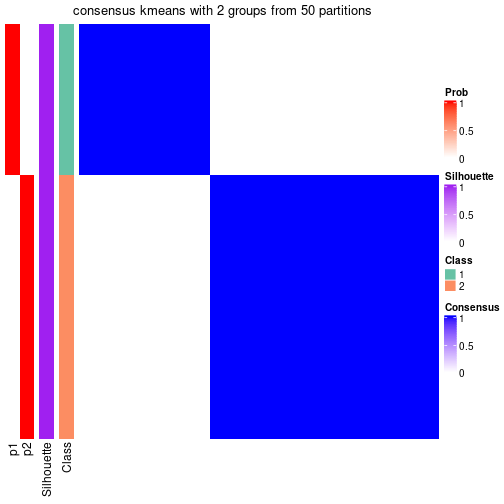</p>

</div>
<div id='tab-node-02-consensus-heatmap-2'>
<pre><code class="r">consensus_heatmap(res, k = 3)
</code></pre>

<p>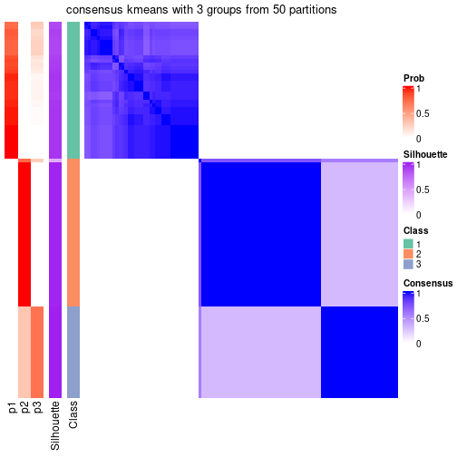</p>

</div>
<div id='tab-node-02-consensus-heatmap-3'>
<pre><code class="r">consensus_heatmap(res, k = 4)
</code></pre>

<p>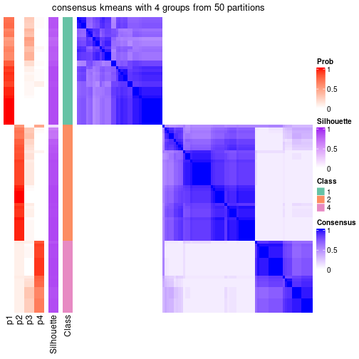</p>

</div>
<div id='tab-node-02-consensus-heatmap-4'>
<pre><code class="r">consensus_heatmap(res, k = 5)
</code></pre>

<p>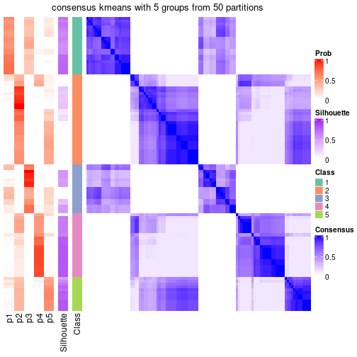</p>

</div>
<div id='tab-node-02-consensus-heatmap-5'>
<pre><code class="r">consensus_heatmap(res, k = 6)
</code></pre>

<p>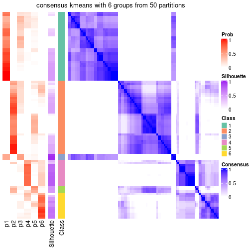</p>

</div>
<div id='tab-node-02-consensus-heatmap-6'>
<pre><code class="r">consensus_heatmap(res, k = 7)
</code></pre>

<p>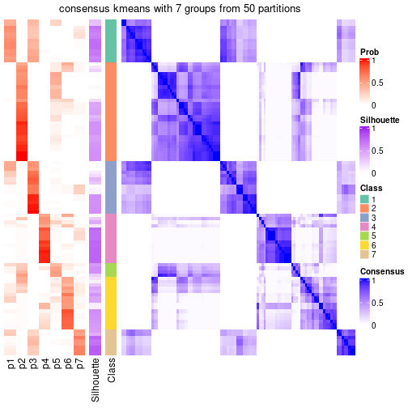</p>

</div>
<div id='tab-node-02-consensus-heatmap-7'>
<pre><code class="r">consensus_heatmap(res, k = 8)
</code></pre>

<p></p>

</div>
</div>

Heatmaps for the membership of samples in all partitions to see how consistent they are:


<script>
$( function() {
	$( '#tabs-node-02-membership-heatmap' ).tabs();
} );
</script>
<div id='tabs-node-02-membership-heatmap'>
<ul>
<li><a href='#tab-node-02-membership-heatmap-1'>k = 2</a></li>
<li><a href='#tab-node-02-membership-heatmap-2'>k = 3</a></li>
<li><a href='#tab-node-02-membership-heatmap-3'>k = 4</a></li>
<li><a href='#tab-node-02-membership-heatmap-4'>k = 5</a></li>
<li><a href='#tab-node-02-membership-heatmap-5'>k = 6</a></li>
<li><a href='#tab-node-02-membership-heatmap-6'>k = 7</a></li>
<li><a href='#tab-node-02-membership-heatmap-7'>k = 8</a></li>
</ul>
<div id='tab-node-02-membership-heatmap-1'>
<pre><code class="r">membership_heatmap(res, k = 2)
</code></pre>

<p></p>

</div>
<div id='tab-node-02-membership-heatmap-2'>
<pre><code class="r">membership_heatmap(res, k = 3)
</code></pre>

<p>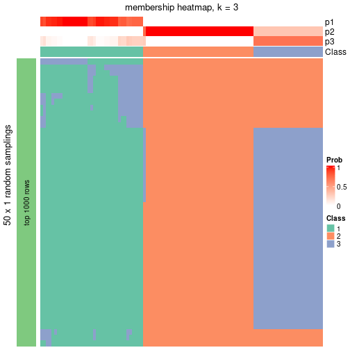</p>

</div>
<div id='tab-node-02-membership-heatmap-3'>
<pre><code class="r">membership_heatmap(res, k = 4)
</code></pre>

<p>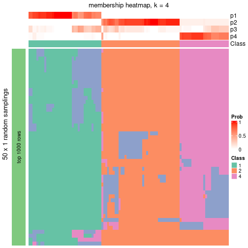</p>

</div>
<div id='tab-node-02-membership-heatmap-4'>
<pre><code class="r">membership_heatmap(res, k = 5)
</code></pre>

<p>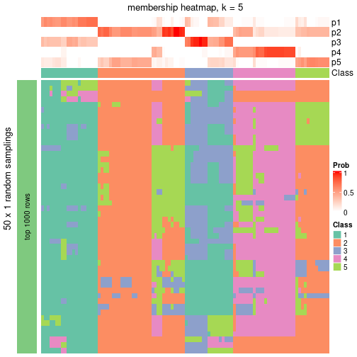</p>

</div>
<div id='tab-node-02-membership-heatmap-5'>
<pre><code class="r">membership_heatmap(res, k = 6)
</code></pre>

<p>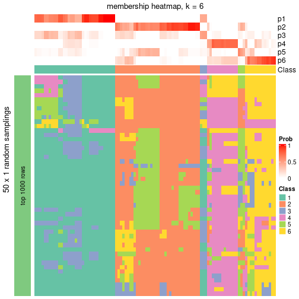</p>

</div>
<div id='tab-node-02-membership-heatmap-6'>
<pre><code class="r">membership_heatmap(res, k = 7)
</code></pre>

<p>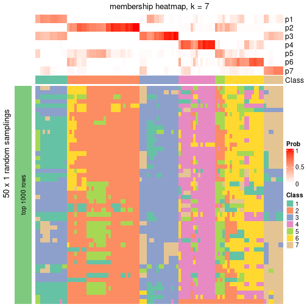</p>

</div>
<div id='tab-node-02-membership-heatmap-7'>
<pre><code class="r">membership_heatmap(res, k = 8)
</code></pre>

<p>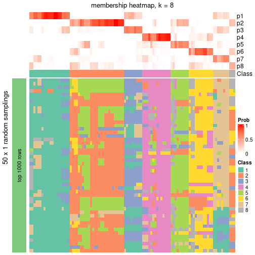</p>

</div>
</div>

As soon as the classes for columns are determined, the signatures
that are significantly different between subgroups can be looked for. 
Following are the heatmaps for signatures.


<script>
$( function() {
	$( '#tabs-node-02-get-signatures' ).tabs();
} );
</script>
<div id='tabs-node-02-get-signatures'>
<ul>
<li><a href='#tab-node-02-get-signatures-1'>k = 2</a></li>
<li><a href='#tab-node-02-get-signatures-2'>k = 3</a></li>
<li><a href='#tab-node-02-get-signatures-3'>k = 4</a></li>
<li><a href='#tab-node-02-get-signatures-4'>k = 5</a></li>
<li><a href='#tab-node-02-get-signatures-5'>k = 6</a></li>
<li><a href='#tab-node-02-get-signatures-6'>k = 7</a></li>
<li><a href='#tab-node-02-get-signatures-7'>k = 8</a></li>
</ul>
<div id='tab-node-02-get-signatures-1'>
<pre><code class="r">get_signatures(res, k = 2)
</code></pre>

<p>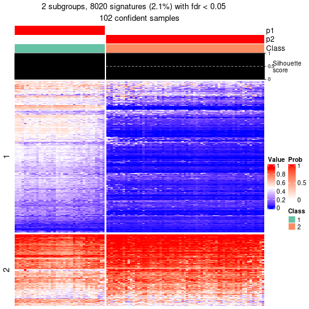</p>

</div>
<div id='tab-node-02-get-signatures-2'>
<pre><code class="r">get_signatures(res, k = 3)
</code></pre>

<p>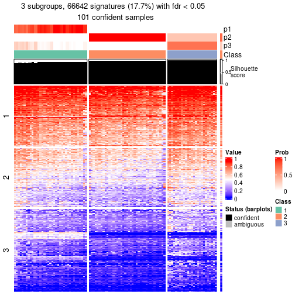</p>

</div>
<div id='tab-node-02-get-signatures-3'>
<pre><code class="r">get_signatures(res, k = 4)
</code></pre>

<p></p>

</div>
<div id='tab-node-02-get-signatures-4'>
<pre><code class="r">get_signatures(res, k = 5)
</code></pre>

<p>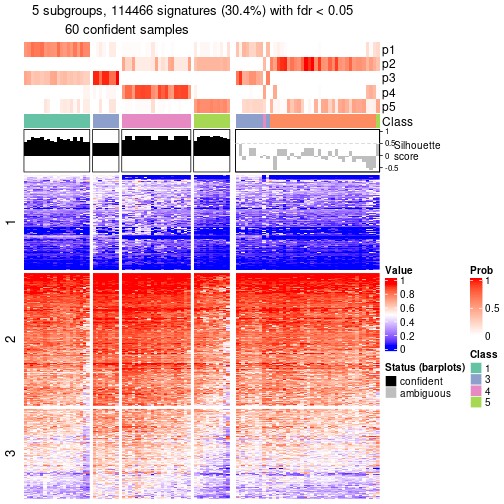</p>

</div>
<div id='tab-node-02-get-signatures-5'>
<pre><code class="r">get_signatures(res, k = 6)
</code></pre>

<p>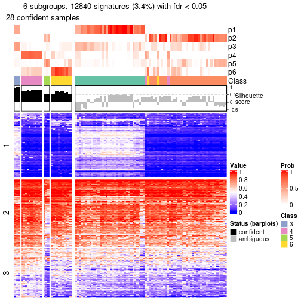</p>

</div>
<div id='tab-node-02-get-signatures-6'>
<pre><code class="r">get_signatures(res, k = 7)
</code></pre>

<p>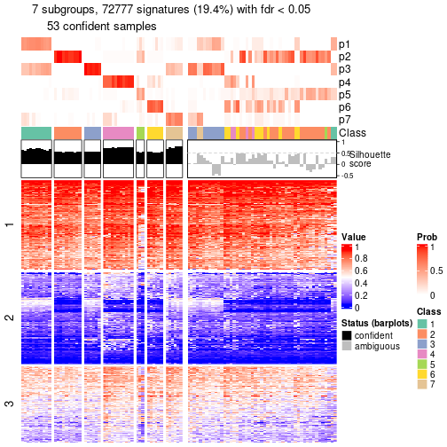</p>

</div>
<div id='tab-node-02-get-signatures-7'>
<pre><code class="r">get_signatures(res, k = 8)
</code></pre>

<p>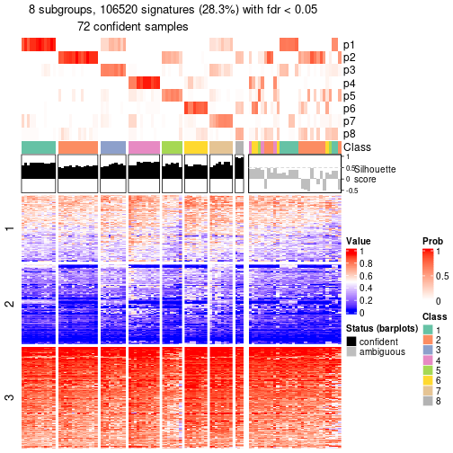</p>

</div>
</div>


Compare the overlap of signatures from different k:

```r
compare_signatures(res)
```

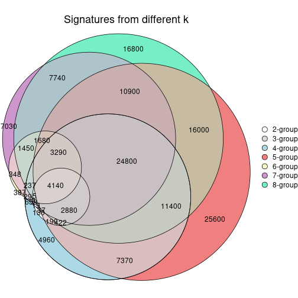

`get_signature()` returns a data frame invisibly. To get the list of signatures, the function
call should be assigned to a variable explicitly. In following code, if `plot` argument is set
to `FALSE`, no heatmap is plotted while only the differential analysis is performed.

```r
# code only for demonstration
tb = get_signature(res, k = ..., plot = FALSE)
```

An example of the output of `tb` is:

```
#>   which_row         fdr    mean_1    mean_2 scaled_mean_1 scaled_mean_2 km
#> 1        38 0.042760348  8.373488  9.131774    -0.5533452     0.5164555  1
#> 2        40 0.018707592  7.106213  8.469186    -0.6173731     0.5762149  1
#> 3        55 0.019134737 10.221463 11.207825    -0.6159697     0.5749050  1
#> 4        59 0.006059896  5.921854  7.869574    -0.6899429     0.6439467  1
#> 5        60 0.018055526  8.928898 10.211722    -0.6204761     0.5791110  1
#> 6        98 0.009384629 15.714769 14.887706     0.6635654    -0.6193277  2
...
```

The columns in `tb` are:

1. `which_row`: row indices corresponding to the input matrix.
2. `fdr`: FDR for the differential test. 
3. `mean_x`: The mean value in group x.
4. `scaled_mean_x`: The mean value in group x after rows are scaled.
5. `km`: Row groups if k-means clustering is applied to rows (which is done by automatically selecting number of clusters).

If there are too many signatures, `top_signatures = ...` can be set to only show the 
signatures with the highest FDRs:

```r
# code only for demonstration
# e.g. to show the top 500 most significant rows
tb = get_signature(res, k = ..., top_signatures = 500)
```

If the signatures are defined as these which are uniquely high in current group, `diff_method` argument
can be set to `"uniquely_high_in_one_group"`:

```r
# code only for demonstration
tb = get_signature(res, k = ..., diff_method = "uniquely_high_in_one_group")
```


UMAP plot which shows how samples are separated.


<script>
$( function() {
	$( '#tabs-node-02-dimension-reduction' ).tabs();
} );
</script>
<div id='tabs-node-02-dimension-reduction'>
<ul>
<li><a href='#tab-node-02-dimension-reduction-1'>k = 2</a></li>
<li><a href='#tab-node-02-dimension-reduction-2'>k = 3</a></li>
<li><a href='#tab-node-02-dimension-reduction-3'>k = 4</a></li>
<li><a href='#tab-node-02-dimension-reduction-4'>k = 5</a></li>
<li><a href='#tab-node-02-dimension-reduction-5'>k = 6</a></li>
<li><a href='#tab-node-02-dimension-reduction-6'>k = 7</a></li>
<li><a href='#tab-node-02-dimension-reduction-7'>k = 8</a></li>
</ul>
<div id='tab-node-02-dimension-reduction-1'>
<pre><code class="r">dimension_reduction(res, k = 2, method = &quot;UMAP&quot;)
</code></pre>

<p>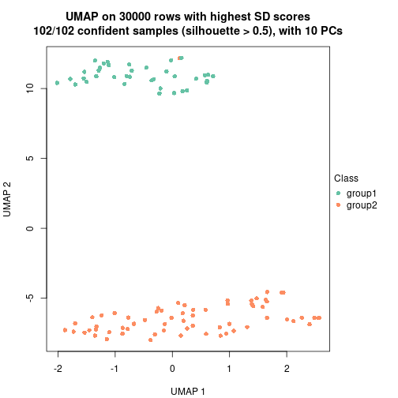</p>

</div>
<div id='tab-node-02-dimension-reduction-2'>
<pre><code class="r">dimension_reduction(res, k = 3, method = &quot;UMAP&quot;)
</code></pre>

<p>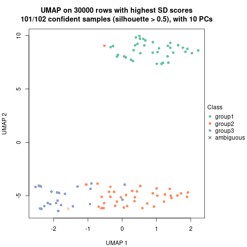</p>

</div>
<div id='tab-node-02-dimension-reduction-3'>
<pre><code class="r">dimension_reduction(res, k = 4, method = &quot;UMAP&quot;)
</code></pre>

<p>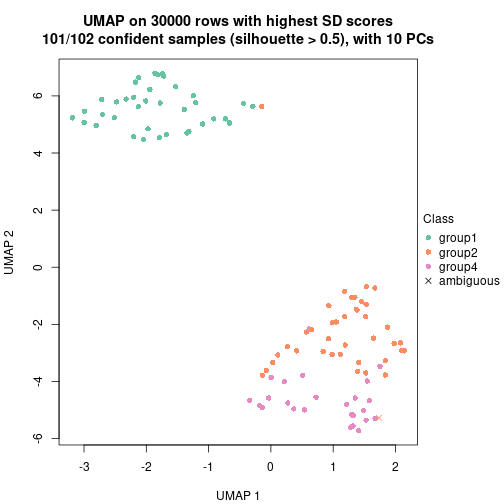</p>

</div>
<div id='tab-node-02-dimension-reduction-4'>
<pre><code class="r">dimension_reduction(res, k = 5, method = &quot;UMAP&quot;)
</code></pre>

<p>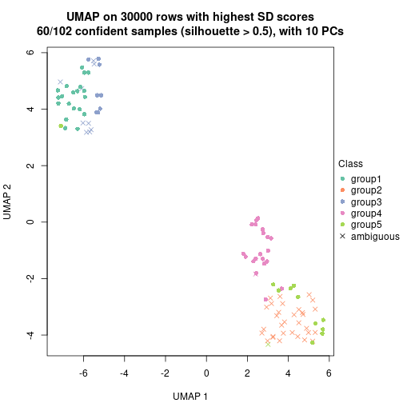</p>

</div>
<div id='tab-node-02-dimension-reduction-5'>
<pre><code class="r">dimension_reduction(res, k = 6, method = &quot;UMAP&quot;)
</code></pre>

<p>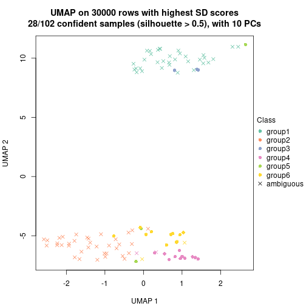</p>

</div>
<div id='tab-node-02-dimension-reduction-6'>
<pre><code class="r">dimension_reduction(res, k = 7, method = &quot;UMAP&quot;)
</code></pre>

<p>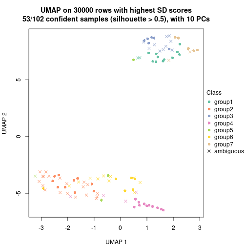</p>

</div>
<div id='tab-node-02-dimension-reduction-7'>
<pre><code class="r">dimension_reduction(res, k = 8, method = &quot;UMAP&quot;)
</code></pre>

<p>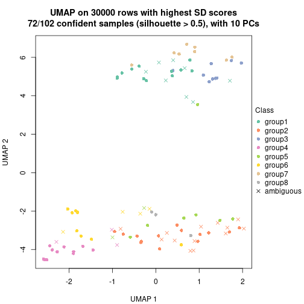</p>

</div>
</div>


Following heatmap shows how subgroups are split when increasing `k`:

```r
collect_classes(res)
```

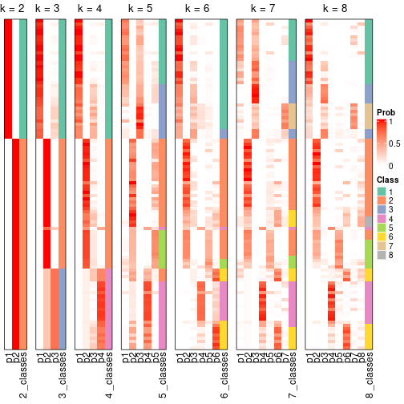


If matrix rows can be associated to genes, consider to use `functional_enrichment(res,
...)` to perform function enrichment for the signature genes. See [this vignette](https://jokergoo.github.io/cola_vignettes/functional_enrichment.html) for more detailed explanations.


 

---------------------------------------------------


### Node03


Parent node: [Node0](#Node0).
Child nodes: 
                [Node011](#Node011)
        ,
                [Node012](#Node012)
        ,
                Node013-leaf
        ,
                Node021-leaf
        ,
                Node022-leaf
        ,
                Node023-leaf
        ,
                [Node031](#Node031)
        ,
                Node032-leaf
        ,
                [Node033](#Node033)
        ,
                [Node034](#Node034)
        ,
                Node035-leaf
        ,
                [Node041](#Node041)
        ,
                [Node042](#Node042)
        ,
                [Node043](#Node043)
        ,
                [Node051](#Node051)
        ,
                [Node052](#Node052)
        ,
                [Node053](#Node053)
        .


The object with results only for a single top-value method and a single partitioning method 
can be extracted as:

```r
res = res_rh["03"]
```

A summary of `res` and all the functions that can be applied to it:

```r
res
```

```
#> A 'ConsensusPartition' object with k = 2, 3, 4, 5, 6, 7, 8.
#>   On a matrix with 30000 rows and 52 columns.
#>   Top rows (1000) are extracted by 'ATC' method.
#>   Subgroups are detected by 'skmeans' method.
#>   Performed in total 350 partitions by row resampling.
#>   Best k for subgroups seems to be 6.
#> 
#> Following methods can be applied to this 'ConsensusPartition' object:
#>  [1] "cola_report"             "collect_classes"         "collect_plots"          
#>  [4] "collect_stats"           "colnames"                "compare_partitions"     
#>  [7] "compare_signatures"      "consensus_heatmap"       "dimension_reduction"    
#> [10] "functional_enrichment"   "get_anno_col"            "get_anno"               
#> [13] "get_classes"             "get_consensus"           "get_matrix"             
#> [16] "get_membership"          "get_param"               "get_signatures"         
#> [19] "get_stats"               "is_best_k"               "is_stable_k"            
#> [22] "membership_heatmap"      "ncol"                    "nrow"                   
#> [25] "plot_ecdf"               "predict_classes"         "rownames"               
#> [28] "select_partition_number" "show"                    "suggest_best_k"         
#> [31] "test_to_known_factors"   "top_rows_heatmap"
```

`collect_plots()` function collects all the plots made from `res` for all `k` (number of subgroups)
into one single page to provide an easy and fast comparison between different `k`.

```r
collect_plots(res)
```

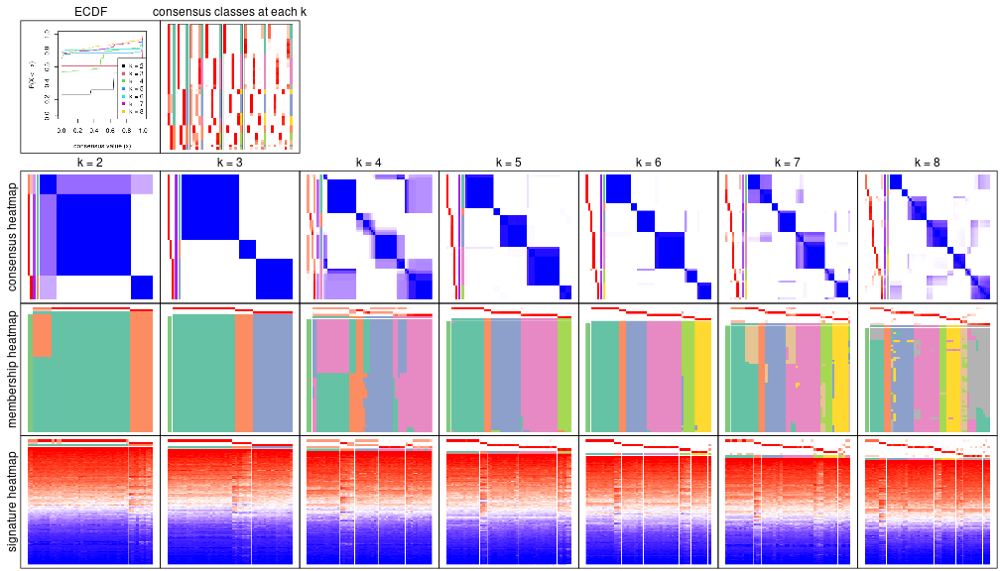

The plots are:

- The first row: a plot of the eCDF (empirical cumulative distribution
  function) curves of the consensus matrix for each `k` and the heatmap of
  predicted classes for each `k`.
- The second row: heatmaps of the consensus matrix for each `k`.
- The third row: heatmaps of the membership matrix for each `k`.
- The fouth row: heatmaps of the signatures for each `k`.

All the plots in panels can be made by individual functions and they are
plotted later in this section.

`select_partition_number()` produces several plots showing different
statistics for choosing "optimized" `k`. There are following statistics:

- eCDF curves of the consensus matrix for each `k`;
- 1-PAC. [The PAC score](https://en.wikipedia.org/wiki/Consensus_clustering#Over-interpretation_potential_of_consensus_clustering)
  measures the proportion of the ambiguous subgrouping.
- Mean silhouette score.
- Concordance. The mean probability of fiting the consensus subgroup labels in all
  partitions.
- Area increased. Denote $A_k$ as the area under the eCDF curve for current
  `k`, the area increased is defined as $A_k - A_{k-1}$.
- Rand index. The percent of pairs of samples that are both in a same cluster
  or both are not in a same cluster in the partition of k and k-1.
- Jaccard index. The ratio of pairs of samples are both in a same cluster in
  the partition of k and k-1 and the pairs of samples are both in a same
  cluster in the partition k or k-1.

The detailed explanations of these statistics can be found in [the _cola_
vignette](https://jokergoo.github.io/cola_vignettes/cola.html#toc_13).

Generally speaking, higher 1-PAC score, higher mean silhouette score or higher
concordance corresponds to better partition. Rand index and Jaccard index
measure how similar the current partition is compared to partition with `k-1`.
If they are too similar, we won't accept `k` is better than `k-1`.

```r
select_partition_number(res)
```

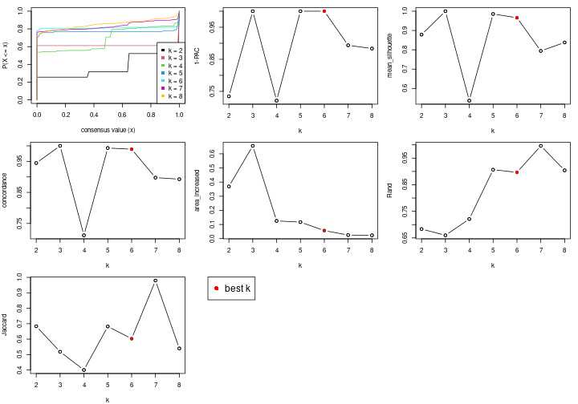

The numeric values for all these statistics can be obtained by `get_stats()`.

```r
get_stats(res)
```

```
#>   k 1-PAC mean_silhouette concordance area_increased  Rand Jaccard
#> 2 2 0.735           0.879       0.945         0.3695 0.683   0.683
#> 3 3 1.000           1.000       1.000         0.6565 0.660   0.518
#> 4 4 0.721           0.537       0.712         0.1255 0.721   0.400
#> 5 5 1.000           0.985       0.993         0.1168 0.906   0.682
#> 6 6 1.000           0.966       0.989         0.0570 0.897   0.603
#> 7 7 0.894           0.794       0.898         0.0252 0.996   0.980
#> 8 8 0.884           0.838       0.893         0.0237 0.904   0.540
```

`suggest_best_k()` suggests the best $k$ based on these statistics. The rules are as follows:

- All $k$ with Jaccard index larger than 0.95 are removed because increasing
  $k$ does not provide enough extra information. If all $k$ are removed, it is
  marked as no subgroup is detected.
- For all $k$ with 1-PAC score larger than 0.9, the maximal $k$ is taken as
  the best $k$, and other $k$ are marked as optional $k$.
- If it does not fit the second rule. The $k$ with the maximal vote of the
  highest 1-PAC score, highest mean silhouette, and highest concordance is
  taken as the best $k$.

```r
suggest_best_k(res)
```

```
#> [1] 6
#> attr(,"optional")
#> [1] 3 5
```

There is also optional best $k$ = 3 5 that is worth to check.

Following is the table of the partitions (You need to click the **show/hide
code output** link to see it). The membership matrix (columns with name `p*`)
is inferred by
[`clue::cl_consensus()`](https://www.rdocumentation.org/link/cl_consensus?package=clue)
function with the `SE` method. Basically the value in the membership matrix
represents the probability to belong to a certain group. The finall subgroup
label for an item is determined with the group with highest probability it
belongs to.

In `get_classes()` function, the entropy is calculated from the membership
matrix and the silhouette score is calculated from the consensus matrix.


<script>
$( function() {
	$( '#tabs-node-03-get-classes' ).tabs();
} );
</script>
<div id='tabs-node-03-get-classes'>
<ul>
<li><a href='#tab-node-03-get-classes-1'>k = 2</a></li>
<li><a href='#tab-node-03-get-classes-2'>k = 3</a></li>
<li><a href='#tab-node-03-get-classes-3'>k = 4</a></li>
<li><a href='#tab-node-03-get-classes-4'>k = 5</a></li>
<li><a href='#tab-node-03-get-classes-5'>k = 6</a></li>
<li><a href='#tab-node-03-get-classes-6'>k = 7</a></li>
<li><a href='#tab-node-03-get-classes-7'>k = 8</a></li>
</ul>

<div id='tab-node-03-get-classes-1'>
<p><a id='tab-node-03-get-classes-1-a' style='color:#0366d6' href='#'>show/hide code output</a></p>
<pre><code class="r">cbind(get_classes(res, k = 2), get_membership(res, k = 2))
</code></pre>

<pre><code>#&gt;                 class entropy silhouette   p1   p2
#&gt; TCGA.90.6837.01     1   0.000      0.924 1.00 0.00
#&gt; TCGA.33.4586.11     1   0.000      0.924 1.00 0.00
#&gt; TCGA.18.4721.11     1   0.000      0.924 1.00 0.00
#&gt; TCGA.39.5037.11     1   0.943      0.534 0.64 0.36
#&gt; TCGA.22.4613.11     1   0.000      0.924 1.00 0.00
#&gt; TCGA.39.5035.11     1   0.943      0.534 0.64 0.36
#&gt; TCGA.33.4579.11     1   0.000      0.924 1.00 0.00
#&gt; TCGA.39.5028.11     1   0.943      0.534 0.64 0.36
#&gt; TCGA.33.4583.11     1   0.000      0.924 1.00 0.00
#&gt; TCGA.39.5021.11     1   0.000      0.924 1.00 0.00
#&gt; TCGA.39.5031.11     1   0.000      0.924 1.00 0.00
#&gt; TCGA.39.5030.11     1   0.000      0.924 1.00 0.00
#&gt; TCGA.39.5011.11     1   0.000      0.924 1.00 0.00
#&gt; TCGA.33.4589.11     1   0.000      0.924 1.00 0.00
#&gt; TCGA.39.5034.11     1   0.943      0.534 0.64 0.36
#&gt; TCGA.22.5485.11     1   0.000      0.924 1.00 0.00
#&gt; TCGA.22.4599.11     1   0.000      0.924 1.00 0.00
#&gt; TCGA.22.5472.11     1   0.000      0.924 1.00 0.00
#&gt; TCGA.22.5473.11     1   0.000      0.924 1.00 0.00
#&gt; TCGA.85.A4PA.01     2   0.000      1.000 0.00 1.00
#&gt; TCGA.33.4582.11     1   0.000      0.924 1.00 0.00
#&gt; TCGA.18.5592.11     1   0.000      0.924 1.00 0.00
#&gt; TCGA.18.5595.11     2   0.000      1.000 0.00 1.00
#&gt; TCGA.43.3920.11     2   0.000      1.000 0.00 1.00
#&gt; TCGA.33.4566.11     1   0.000      0.924 1.00 0.00
#&gt; TCGA.22.5492.11     1   0.000      0.924 1.00 0.00
#&gt; TCGA.60.2697.01     2   0.000      1.000 0.00 1.00
#&gt; TCGA.43.5668.11     1   0.000      0.924 1.00 0.00
#&gt; TCGA.22.5477.11     1   0.000      0.924 1.00 0.00
#&gt; TCGA.43.3394.11     1   0.000      0.924 1.00 0.00
#&gt; TCGA.22.5491.11     1   0.000      0.924 1.00 0.00
#&gt; TCGA.22.4601.11     1   0.000      0.924 1.00 0.00
#&gt; TCGA.22.5474.11     2   0.000      1.000 0.00 1.00
#&gt; TCGA.39.5036.11     1   0.000      0.924 1.00 0.00
#&gt; TCGA.22.5478.11     1   0.000      0.924 1.00 0.00
#&gt; TCGA.22.5489.11     1   0.000      0.924 1.00 0.00
#&gt; TCGA.39.5016.11     1   0.000      0.924 1.00 0.00
#&gt; TCGA.22.5471.11     1   0.000      0.924 1.00 0.00
#&gt; TCGA.22.5480.11     1   0.943      0.534 0.64 0.36
#&gt; TCGA.39.5029.11     1   0.000      0.924 1.00 0.00
#&gt; TCGA.22.5482.11     1   0.000      0.924 1.00 0.00
#&gt; TCGA.39.5039.11     1   0.000      0.924 1.00 0.00
#&gt; TCGA.18.3417.11     1   0.000      0.924 1.00 0.00
#&gt; TCGA.77.A5FZ.01     2   0.000      1.000 0.00 1.00
#&gt; TCGA.56.8623.01     1   0.943      0.534 0.64 0.36
#&gt; TCGA.43.6771.11     1   0.943      0.534 0.64 0.36
#&gt; TCGA.39.5019.11     1   0.943      0.534 0.64 0.36
#&gt; TCGA.56.A4ZJ.01     2   0.000      1.000 0.00 1.00
#&gt; TCGA.34.5929.11     1   0.000      0.924 1.00 0.00
#&gt; TCGA.98.A53D.01     2   0.000      1.000 0.00 1.00
#&gt; TCGA.98.A53H.01     2   0.000      1.000 0.00 1.00
#&gt; TCGA.98.A53C.01     2   0.000      1.000 0.00 1.00
</code></pre>

<script>
$('#tab-node-03-get-classes-1-a').parent().next().next().hide();
$('#tab-node-03-get-classes-1-a').click(function(){
  $('#tab-node-03-get-classes-1-a').parent().next().next().toggle();
  return(false);
});
</script>
</div>

<div id='tab-node-03-get-classes-2'>
<p><a id='tab-node-03-get-classes-2-a' style='color:#0366d6' href='#'>show/hide code output</a></p>
<pre><code class="r">cbind(get_classes(res, k = 3), get_membership(res, k = 3))
</code></pre>

<pre><code>#&gt;                 class entropy silhouette p1 p2 p3
#&gt; TCGA.90.6837.01     1       0          1  1  0  0
#&gt; TCGA.33.4586.11     1       0          1  1  0  0
#&gt; TCGA.18.4721.11     1       0          1  1  0  0
#&gt; TCGA.39.5037.11     3       0          1  0  0  1
#&gt; TCGA.22.4613.11     1       0          1  1  0  0
#&gt; TCGA.39.5035.11     3       0          1  0  0  1
#&gt; TCGA.33.4579.11     1       0          1  1  0  0
#&gt; TCGA.39.5028.11     3       0          1  0  0  1
#&gt; TCGA.33.4583.11     1       0          1  1  0  0
#&gt; TCGA.39.5021.11     1       0          1  1  0  0
#&gt; TCGA.39.5031.11     3       0          1  0  0  1
#&gt; TCGA.39.5030.11     3       0          1  0  0  1
#&gt; TCGA.39.5011.11     1       0          1  1  0  0
#&gt; TCGA.33.4589.11     1       0          1  1  0  0
#&gt; TCGA.39.5034.11     3       0          1  0  0  1
#&gt; TCGA.22.5485.11     3       0          1  0  0  1
#&gt; TCGA.22.4599.11     1       0          1  1  0  0
#&gt; TCGA.22.5472.11     1       0          1  1  0  0
#&gt; TCGA.22.5473.11     1       0          1  1  0  0
#&gt; TCGA.85.A4PA.01     2       0          1  0  1  0
#&gt; TCGA.33.4582.11     1       0          1  1  0  0
#&gt; TCGA.18.5592.11     1       0          1  1  0  0
#&gt; TCGA.18.5595.11     3       0          1  0  0  1
#&gt; TCGA.43.3920.11     2       0          1  0  1  0
#&gt; TCGA.33.4566.11     3       0          1  0  0  1
#&gt; TCGA.22.5492.11     1       0          1  1  0  0
#&gt; TCGA.60.2697.01     2       0          1  0  1  0
#&gt; TCGA.43.5668.11     1       0          1  1  0  0
#&gt; TCGA.22.5477.11     3       0          1  0  0  1
#&gt; TCGA.43.3394.11     1       0          1  1  0  0
#&gt; TCGA.22.5491.11     1       0          1  1  0  0
#&gt; TCGA.22.4601.11     1       0          1  1  0  0
#&gt; TCGA.22.5474.11     2       0          1  0  1  0
#&gt; TCGA.39.5036.11     1       0          1  1  0  0
#&gt; TCGA.22.5478.11     1       0          1  1  0  0
#&gt; TCGA.22.5489.11     1       0          1  1  0  0
#&gt; TCGA.39.5016.11     3       0          1  0  0  1
#&gt; TCGA.22.5471.11     1       0          1  1  0  0
#&gt; TCGA.22.5480.11     3       0          1  0  0  1
#&gt; TCGA.39.5029.11     1       0          1  1  0  0
#&gt; TCGA.22.5482.11     1       0          1  1  0  0
#&gt; TCGA.39.5039.11     1       0          1  1  0  0
#&gt; TCGA.18.3417.11     3       0          1  0  0  1
#&gt; TCGA.77.A5FZ.01     2       0          1  0  1  0
#&gt; TCGA.56.8623.01     3       0          1  0  0  1
#&gt; TCGA.43.6771.11     3       0          1  0  0  1
#&gt; TCGA.39.5019.11     3       0          1  0  0  1
#&gt; TCGA.56.A4ZJ.01     3       0          1  0  0  1
#&gt; TCGA.34.5929.11     1       0          1  1  0  0
#&gt; TCGA.98.A53D.01     2       0          1  0  1  0
#&gt; TCGA.98.A53H.01     2       0          1  0  1  0
#&gt; TCGA.98.A53C.01     2       0          1  0  1  0
</code></pre>

<script>
$('#tab-node-03-get-classes-2-a').parent().next().next().hide();
$('#tab-node-03-get-classes-2-a').click(function(){
  $('#tab-node-03-get-classes-2-a').parent().next().next().toggle();
  return(false);
});
</script>
</div>

<div id='tab-node-03-get-classes-3'>
<p><a id='tab-node-03-get-classes-3-a' style='color:#0366d6' href='#'>show/hide code output</a></p>
<pre><code class="r">cbind(get_classes(res, k = 4), get_membership(res, k = 4))
</code></pre>

<pre><code>#&gt;                 class entropy silhouette   p1   p2   p3   p4
#&gt; TCGA.90.6837.01     1   0.499     0.7848 0.52 0.00 0.00 0.48
#&gt; TCGA.33.4586.11     4   0.121     0.5730 0.04 0.00 0.00 0.96
#&gt; TCGA.18.4721.11     4   0.000     0.6207 0.00 0.00 0.00 1.00
#&gt; TCGA.39.5037.11     3   0.499     0.8216 0.48 0.00 0.52 0.00
#&gt; TCGA.22.4613.11     4   0.121     0.5730 0.04 0.00 0.00 0.96
#&gt; TCGA.39.5035.11     3   0.499     0.8216 0.48 0.00 0.52 0.00
#&gt; TCGA.33.4579.11     1   0.499     0.7848 0.52 0.00 0.00 0.48
#&gt; TCGA.39.5028.11     3   0.499     0.8216 0.48 0.00 0.52 0.00
#&gt; TCGA.33.4583.11     4   0.499    -0.7397 0.48 0.00 0.00 0.52
#&gt; TCGA.39.5021.11     4   0.441    -0.2747 0.30 0.00 0.00 0.70
#&gt; TCGA.39.5031.11     4   0.499     0.0515 0.48 0.00 0.00 0.52
#&gt; TCGA.39.5030.11     4   0.499     0.0515 0.48 0.00 0.00 0.52
#&gt; TCGA.39.5011.11     1   0.499     0.7848 0.52 0.00 0.00 0.48
#&gt; TCGA.33.4589.11     4   0.121     0.5730 0.04 0.00 0.00 0.96
#&gt; TCGA.39.5034.11     3   0.499     0.8216 0.48 0.00 0.52 0.00
#&gt; TCGA.22.5485.11     1   0.718    -0.5021 0.48 0.00 0.14 0.38
#&gt; TCGA.22.4599.11     4   0.000     0.6207 0.00 0.00 0.00 1.00
#&gt; TCGA.22.5472.11     1   0.499     0.7848 0.52 0.00 0.00 0.48
#&gt; TCGA.22.5473.11     4   0.000     0.6207 0.00 0.00 0.00 1.00
#&gt; TCGA.85.A4PA.01     2   0.000     0.7583 0.00 1.00 0.00 0.00
#&gt; TCGA.33.4582.11     1   0.499     0.7848 0.52 0.00 0.00 0.48
#&gt; TCGA.18.5592.11     1   0.499     0.7848 0.52 0.00 0.00 0.48
#&gt; TCGA.18.5595.11     3   0.000     0.1542 0.00 0.00 1.00 0.00
#&gt; TCGA.43.3920.11     3   0.479    -0.6381 0.00 0.38 0.62 0.00
#&gt; TCGA.33.4566.11     4   0.601    -0.0467 0.48 0.00 0.04 0.48
#&gt; TCGA.22.5492.11     1   0.499     0.7848 0.52 0.00 0.00 0.48
#&gt; TCGA.60.2697.01     2   0.000     0.7583 0.00 1.00 0.00 0.00
#&gt; TCGA.43.5668.11     4   0.000     0.6207 0.00 0.00 0.00 1.00
#&gt; TCGA.22.5477.11     4   0.499     0.0515 0.48 0.00 0.00 0.52
#&gt; TCGA.43.3394.11     1   0.499     0.7848 0.52 0.00 0.00 0.48
#&gt; TCGA.22.5491.11     1   0.499     0.7848 0.52 0.00 0.00 0.48
#&gt; TCGA.22.4601.11     4   0.000     0.6207 0.00 0.00 0.00 1.00
#&gt; TCGA.22.5474.11     3   0.292    -0.1919 0.00 0.14 0.86 0.00
#&gt; TCGA.39.5036.11     4   0.000     0.6207 0.00 0.00 0.00 1.00
#&gt; TCGA.22.5478.11     4   0.000     0.6207 0.00 0.00 0.00 1.00
#&gt; TCGA.22.5489.11     1   0.499     0.7848 0.52 0.00 0.00 0.48
#&gt; TCGA.39.5016.11     3   0.499     0.8216 0.48 0.00 0.52 0.00
#&gt; TCGA.22.5471.11     1   0.499     0.7848 0.52 0.00 0.00 0.48
#&gt; TCGA.22.5480.11     3   0.499     0.8216 0.48 0.00 0.52 0.00
#&gt; TCGA.39.5029.11     1   0.499     0.7848 0.52 0.00 0.00 0.48
#&gt; TCGA.22.5482.11     1   0.499     0.7848 0.52 0.00 0.00 0.48
#&gt; TCGA.39.5039.11     4   0.000     0.6207 0.00 0.00 0.00 1.00
#&gt; TCGA.18.3417.11     1   0.601    -0.4073 0.48 0.00 0.04 0.48
#&gt; TCGA.77.A5FZ.01     2   0.000     0.7583 0.00 1.00 0.00 0.00
#&gt; TCGA.56.8623.01     3   0.499     0.8216 0.48 0.00 0.52 0.00
#&gt; TCGA.43.6771.11     3   0.499     0.8216 0.48 0.00 0.52 0.00
#&gt; TCGA.39.5019.11     3   0.499     0.8216 0.48 0.00 0.52 0.00
#&gt; TCGA.56.A4ZJ.01     3   0.499     0.8216 0.48 0.00 0.52 0.00
#&gt; TCGA.34.5929.11     1   0.499     0.7848 0.52 0.00 0.00 0.48
#&gt; TCGA.98.A53D.01     2   0.499     0.7471 0.00 0.52 0.48 0.00
#&gt; TCGA.98.A53H.01     2   0.499     0.7471 0.00 0.52 0.48 0.00
#&gt; TCGA.98.A53C.01     2   0.499     0.7471 0.00 0.52 0.48 0.00
</code></pre>

<script>
$('#tab-node-03-get-classes-3-a').parent().next().next().hide();
$('#tab-node-03-get-classes-3-a').click(function(){
  $('#tab-node-03-get-classes-3-a').parent().next().next().toggle();
  return(false);
});
</script>
</div>

<div id='tab-node-03-get-classes-4'>
<p><a id='tab-node-03-get-classes-4-a' style='color:#0366d6' href='#'>show/hide code output</a></p>
<pre><code class="r">cbind(get_classes(res, k = 5), get_membership(res, k = 5))
</code></pre>

<pre><code>#&gt;                 class entropy silhouette   p1   p2   p3   p4   p5
#&gt; TCGA.90.6837.01     1  0.0000      0.996 1.00 0.00 0.00 0.00 0.00
#&gt; TCGA.33.4586.11     4  0.0000      0.985 0.00 0.00 0.00 1.00 0.00
#&gt; TCGA.18.4721.11     4  0.0000      0.985 0.00 0.00 0.00 1.00 0.00
#&gt; TCGA.39.5037.11     3  0.0000      0.993 0.00 0.00 1.00 0.00 0.00
#&gt; TCGA.22.4613.11     4  0.0000      0.985 0.00 0.00 0.00 1.00 0.00
#&gt; TCGA.39.5035.11     3  0.0609      0.983 0.00 0.00 0.98 0.00 0.02
#&gt; TCGA.33.4579.11     1  0.0000      0.996 1.00 0.00 0.00 0.00 0.00
#&gt; TCGA.39.5028.11     3  0.0609      0.983 0.00 0.00 0.98 0.00 0.02
#&gt; TCGA.33.4583.11     4  0.2280      0.835 0.12 0.00 0.00 0.88 0.00
#&gt; TCGA.39.5021.11     4  0.0000      0.985 0.00 0.00 0.00 1.00 0.00
#&gt; TCGA.39.5031.11     4  0.0609      0.971 0.00 0.00 0.02 0.98 0.00
#&gt; TCGA.39.5030.11     4  0.0609      0.971 0.00 0.00 0.02 0.98 0.00
#&gt; TCGA.39.5011.11     1  0.0000      0.996 1.00 0.00 0.00 0.00 0.00
#&gt; TCGA.33.4589.11     4  0.0000      0.985 0.00 0.00 0.00 1.00 0.00
#&gt; TCGA.39.5034.11     3  0.0000      0.993 0.00 0.00 1.00 0.00 0.00
#&gt; TCGA.22.5485.11     3  0.0000      0.993 0.00 0.00 1.00 0.00 0.00
#&gt; TCGA.22.4599.11     4  0.0000      0.985 0.00 0.00 0.00 1.00 0.00
#&gt; TCGA.22.5472.11     1  0.1043      0.947 0.96 0.00 0.00 0.04 0.00
#&gt; TCGA.22.5473.11     4  0.0000      0.985 0.00 0.00 0.00 1.00 0.00
#&gt; TCGA.85.A4PA.01     2  0.0000      1.000 0.00 1.00 0.00 0.00 0.00
#&gt; TCGA.33.4582.11     1  0.0000      0.996 1.00 0.00 0.00 0.00 0.00
#&gt; TCGA.18.5592.11     1  0.0000      0.996 1.00 0.00 0.00 0.00 0.00
#&gt; TCGA.18.5595.11     5  0.0000      0.985 0.00 0.00 0.00 0.00 1.00
#&gt; TCGA.43.3920.11     5  0.0000      0.985 0.00 0.00 0.00 0.00 1.00
#&gt; TCGA.33.4566.11     3  0.0000      0.993 0.00 0.00 1.00 0.00 0.00
#&gt; TCGA.22.5492.11     1  0.0000      0.996 1.00 0.00 0.00 0.00 0.00
#&gt; TCGA.60.2697.01     2  0.0000      1.000 0.00 1.00 0.00 0.00 0.00
#&gt; TCGA.43.5668.11     4  0.0000      0.985 0.00 0.00 0.00 1.00 0.00
#&gt; TCGA.22.5477.11     4  0.0609      0.971 0.00 0.00 0.02 0.98 0.00
#&gt; TCGA.43.3394.11     1  0.0000      0.996 1.00 0.00 0.00 0.00 0.00
#&gt; TCGA.22.5491.11     1  0.0000      0.996 1.00 0.00 0.00 0.00 0.00
#&gt; TCGA.22.4601.11     4  0.0000      0.985 0.00 0.00 0.00 1.00 0.00
#&gt; TCGA.22.5474.11     5  0.0000      0.985 0.00 0.00 0.00 0.00 1.00
#&gt; TCGA.39.5036.11     4  0.0000      0.985 0.00 0.00 0.00 1.00 0.00
#&gt; TCGA.22.5478.11     4  0.0000      0.985 0.00 0.00 0.00 1.00 0.00
#&gt; TCGA.22.5489.11     1  0.0000      0.996 1.00 0.00 0.00 0.00 0.00
#&gt; TCGA.39.5016.11     3  0.0000      0.993 0.00 0.00 1.00 0.00 0.00
#&gt; TCGA.22.5471.11     1  0.0000      0.996 1.00 0.00 0.00 0.00 0.00
#&gt; TCGA.22.5480.11     3  0.0000      0.993 0.00 0.00 1.00 0.00 0.00
#&gt; TCGA.39.5029.11     1  0.0000      0.996 1.00 0.00 0.00 0.00 0.00
#&gt; TCGA.22.5482.11     1  0.0000      0.996 1.00 0.00 0.00 0.00 0.00
#&gt; TCGA.39.5039.11     4  0.0000      0.985 0.00 0.00 0.00 1.00 0.00
#&gt; TCGA.18.3417.11     3  0.0000      0.993 0.00 0.00 1.00 0.00 0.00
#&gt; TCGA.77.A5FZ.01     2  0.0000      1.000 0.00 1.00 0.00 0.00 0.00
#&gt; TCGA.56.8623.01     3  0.0000      0.993 0.00 0.00 1.00 0.00 0.00
#&gt; TCGA.43.6771.11     3  0.0609      0.983 0.00 0.00 0.98 0.00 0.02
#&gt; TCGA.39.5019.11     3  0.0000      0.993 0.00 0.00 1.00 0.00 0.00
#&gt; TCGA.56.A4ZJ.01     3  0.0609      0.983 0.00 0.00 0.98 0.00 0.02
#&gt; TCGA.34.5929.11     1  0.0000      0.996 1.00 0.00 0.00 0.00 0.00
#&gt; TCGA.98.A53D.01     5  0.0609      0.985 0.00 0.02 0.00 0.00 0.98
#&gt; TCGA.98.A53H.01     5  0.0609      0.985 0.00 0.02 0.00 0.00 0.98
#&gt; TCGA.98.A53C.01     5  0.0609      0.985 0.00 0.02 0.00 0.00 0.98
</code></pre>

<script>
$('#tab-node-03-get-classes-4-a').parent().next().next().hide();
$('#tab-node-03-get-classes-4-a').click(function(){
  $('#tab-node-03-get-classes-4-a').parent().next().next().toggle();
  return(false);
});
</script>
</div>

<div id='tab-node-03-get-classes-5'>
<p><a id='tab-node-03-get-classes-5-a' style='color:#0366d6' href='#'>show/hide code output</a></p>
<pre><code class="r">cbind(get_classes(res, k = 6), get_membership(res, k = 6))
</code></pre>

<pre><code>#&gt;                 class entropy silhouette   p1 p2   p3   p4   p5   p6
#&gt; TCGA.90.6837.01     1  0.0000     1.0000 1.00  0 0.00 0.00 0.00 0.00
#&gt; TCGA.33.4586.11     4  0.0000     0.9965 0.00  0 0.00 1.00 0.00 0.00
#&gt; TCGA.18.4721.11     4  0.0000     0.9965 0.00  0 0.00 1.00 0.00 0.00
#&gt; TCGA.39.5037.11     3  0.0000     1.0000 0.00  0 1.00 0.00 0.00 0.00
#&gt; TCGA.22.4613.11     4  0.0000     0.9965 0.00  0 0.00 1.00 0.00 0.00
#&gt; TCGA.39.5035.11     3  0.0000     1.0000 0.00  0 1.00 0.00 0.00 0.00
#&gt; TCGA.33.4579.11     1  0.0000     1.0000 1.00  0 0.00 0.00 0.00 0.00
#&gt; TCGA.39.5028.11     3  0.0000     1.0000 0.00  0 1.00 0.00 0.00 0.00
#&gt; TCGA.33.4583.11     4  0.0000     0.9965 0.00  0 0.00 1.00 0.00 0.00
#&gt; TCGA.39.5021.11     4  0.0000     0.9965 0.00  0 0.00 1.00 0.00 0.00
#&gt; TCGA.39.5031.11     6  0.0000     0.9915 0.00  0 0.00 0.00 0.00 1.00
#&gt; TCGA.39.5030.11     6  0.0000     0.9915 0.00  0 0.00 0.00 0.00 1.00
#&gt; TCGA.39.5011.11     1  0.0000     1.0000 1.00  0 0.00 0.00 0.00 0.00
#&gt; TCGA.33.4589.11     4  0.0000     0.9965 0.00  0 0.00 1.00 0.00 0.00
#&gt; TCGA.39.5034.11     3  0.0000     1.0000 0.00  0 1.00 0.00 0.00 0.00
#&gt; TCGA.22.5485.11     6  0.0000     0.9915 0.00  0 0.00 0.00 0.00 1.00
#&gt; TCGA.22.4599.11     4  0.0000     0.9965 0.00  0 0.00 1.00 0.00 0.00
#&gt; TCGA.22.5472.11     4  0.0547     0.9769 0.02  0 0.00 0.98 0.00 0.00
#&gt; TCGA.22.5473.11     4  0.0000     0.9965 0.00  0 0.00 1.00 0.00 0.00
#&gt; TCGA.85.A4PA.01     2  0.0000     1.0000 0.00  1 0.00 0.00 0.00 0.00
#&gt; TCGA.33.4582.11     1  0.0000     1.0000 1.00  0 0.00 0.00 0.00 0.00
#&gt; TCGA.18.5592.11     1  0.0000     1.0000 1.00  0 0.00 0.00 0.00 0.00
#&gt; TCGA.18.5595.11     5  0.3864     0.0769 0.00  0 0.48 0.00 0.52 0.00
#&gt; TCGA.43.3920.11     5  0.0000     0.8707 0.00  0 0.00 0.00 1.00 0.00
#&gt; TCGA.33.4566.11     6  0.0000     0.9915 0.00  0 0.00 0.00 0.00 1.00
#&gt; TCGA.22.5492.11     1  0.0000     1.0000 1.00  0 0.00 0.00 0.00 0.00
#&gt; TCGA.60.2697.01     2  0.0000     1.0000 0.00  1 0.00 0.00 0.00 0.00
#&gt; TCGA.43.5668.11     4  0.0000     0.9965 0.00  0 0.00 1.00 0.00 0.00
#&gt; TCGA.22.5477.11     6  0.0000     0.9915 0.00  0 0.00 0.00 0.00 1.00
#&gt; TCGA.43.3394.11     1  0.0000     1.0000 1.00  0 0.00 0.00 0.00 0.00
#&gt; TCGA.22.5491.11     1  0.0000     1.0000 1.00  0 0.00 0.00 0.00 0.00
#&gt; TCGA.22.4601.11     4  0.0000     0.9965 0.00  0 0.00 1.00 0.00 0.00
#&gt; TCGA.22.5474.11     5  0.0000     0.8707 0.00  0 0.00 0.00 1.00 0.00
#&gt; TCGA.39.5036.11     4  0.0000     0.9965 0.00  0 0.00 1.00 0.00 0.00
#&gt; TCGA.22.5478.11     4  0.0000     0.9965 0.00  0 0.00 1.00 0.00 0.00
#&gt; TCGA.22.5489.11     1  0.0000     1.0000 1.00  0 0.00 0.00 0.00 0.00
#&gt; TCGA.39.5016.11     6  0.0937     0.9478 0.00  0 0.04 0.00 0.00 0.96
#&gt; TCGA.22.5471.11     1  0.0000     1.0000 1.00  0 0.00 0.00 0.00 0.00
#&gt; TCGA.22.5480.11     3  0.0000     1.0000 0.00  0 1.00 0.00 0.00 0.00
#&gt; TCGA.39.5029.11     1  0.0000     1.0000 1.00  0 0.00 0.00 0.00 0.00
#&gt; TCGA.22.5482.11     4  0.0547     0.9769 0.02  0 0.00 0.98 0.00 0.00
#&gt; TCGA.39.5039.11     4  0.0000     0.9965 0.00  0 0.00 1.00 0.00 0.00
#&gt; TCGA.18.3417.11     6  0.0000     0.9915 0.00  0 0.00 0.00 0.00 1.00
#&gt; TCGA.77.A5FZ.01     2  0.0000     1.0000 0.00  1 0.00 0.00 0.00 0.00
#&gt; TCGA.56.8623.01     3  0.0000     1.0000 0.00  0 1.00 0.00 0.00 0.00
#&gt; TCGA.43.6771.11     3  0.0000     1.0000 0.00  0 1.00 0.00 0.00 0.00
#&gt; TCGA.39.5019.11     3  0.0000     1.0000 0.00  0 1.00 0.00 0.00 0.00
#&gt; TCGA.56.A4ZJ.01     3  0.0000     1.0000 0.00  0 1.00 0.00 0.00 0.00
#&gt; TCGA.34.5929.11     1  0.0000     1.0000 1.00  0 0.00 0.00 0.00 0.00
#&gt; TCGA.98.A53D.01     5  0.0000     0.8707 0.00  0 0.00 0.00 1.00 0.00
#&gt; TCGA.98.A53H.01     5  0.0000     0.8707 0.00  0 0.00 0.00 1.00 0.00
#&gt; TCGA.98.A53C.01     5  0.0000     0.8707 0.00  0 0.00 0.00 1.00 0.00
</code></pre>

<script>
$('#tab-node-03-get-classes-5-a').parent().next().next().hide();
$('#tab-node-03-get-classes-5-a').click(function(){
  $('#tab-node-03-get-classes-5-a').parent().next().next().toggle();
  return(false);
});
</script>
</div>

<div id='tab-node-03-get-classes-6'>
<p><a id='tab-node-03-get-classes-6-a' style='color:#0366d6' href='#'>show/hide code output</a></p>
<pre><code class="r">cbind(get_classes(res, k = 7), get_membership(res, k = 7))
</code></pre>

<pre><code>#&gt;                 class entropy silhouette   p1 p2   p3   p4   p5   p6   p7
#&gt; TCGA.90.6837.01     1  0.3358      0.769 0.64  0 0.00 0.00 0.00 0.00 0.36
#&gt; TCGA.33.4586.11     4  0.0000      0.868 0.00  0 0.00 1.00 0.00 0.00 0.00
#&gt; TCGA.18.4721.11     4  0.0000      0.868 0.00  0 0.00 1.00 0.00 0.00 0.00
#&gt; TCGA.39.5037.11     3  0.0000      0.973 0.00  0 1.00 0.00 0.00 0.00 0.00
#&gt; TCGA.22.4613.11     4  0.0000      0.868 0.00  0 0.00 1.00 0.00 0.00 0.00
#&gt; TCGA.39.5035.11     3  0.0000      0.973 0.00  0 1.00 0.00 0.00 0.00 0.00
#&gt; TCGA.33.4579.11     1  0.3358      0.769 0.64  0 0.00 0.00 0.00 0.00 0.36
#&gt; TCGA.39.5028.11     3  0.0000      0.973 0.00  0 1.00 0.00 0.00 0.00 0.00
#&gt; TCGA.33.4583.11     4  0.3358      0.582 0.36  0 0.00 0.64 0.00 0.00 0.00
#&gt; TCGA.39.5021.11     4  0.2832      0.697 0.24  0 0.00 0.76 0.00 0.00 0.00
#&gt; TCGA.39.5031.11     6  0.0000      0.910 0.00  0 0.00 0.00 0.00 1.00 0.00
#&gt; TCGA.39.5030.11     6  0.0000      0.910 0.00  0 0.00 0.00 0.00 1.00 0.00
#&gt; TCGA.39.5011.11     1  0.3358      0.769 0.64  0 0.00 0.00 0.00 0.00 0.36
#&gt; TCGA.33.4589.11     4  0.0000      0.868 0.00  0 0.00 1.00 0.00 0.00 0.00
#&gt; TCGA.39.5034.11     3  0.0000      0.973 0.00  0 1.00 0.00 0.00 0.00 0.00
#&gt; TCGA.22.5485.11     6  0.0000      0.910 0.00  0 0.00 0.00 0.00 1.00 0.00
#&gt; TCGA.22.4599.11     4  0.1166      0.822 0.00  0 0.00 0.94 0.00 0.06 0.00
#&gt; TCGA.22.5472.11     4  0.3525      0.488 0.44  0 0.00 0.56 0.00 0.00 0.00
#&gt; TCGA.22.5473.11     4  0.0000      0.868 0.00  0 0.00 1.00 0.00 0.00 0.00
#&gt; TCGA.85.A4PA.01     2  0.0000      1.000 0.00  1 0.00 0.00 0.00 0.00 0.00
#&gt; TCGA.33.4582.11     1  0.0504      0.772 0.98  0 0.00 0.00 0.00 0.00 0.02
#&gt; TCGA.18.5592.11     1  0.3358      0.769 0.64  0 0.00 0.00 0.00 0.00 0.36
#&gt; TCGA.18.5595.11     7  0.4594      0.000 0.00  0 0.14 0.00 0.22 0.00 0.64
#&gt; TCGA.43.3920.11     5  0.2945      0.552 0.00  0 0.00 0.00 0.74 0.00 0.26
#&gt; TCGA.33.4566.11     6  0.0000      0.910 0.00  0 0.00 0.00 0.00 1.00 0.00
#&gt; TCGA.22.5492.11     1  0.3358      0.769 0.64  0 0.00 0.00 0.00 0.00 0.36
#&gt; TCGA.60.2697.01     2  0.0000      1.000 0.00  1 0.00 0.00 0.00 0.00 0.00
#&gt; TCGA.43.5668.11     4  0.0000      0.868 0.00  0 0.00 1.00 0.00 0.00 0.00
#&gt; TCGA.22.5477.11     6  0.0000      0.910 0.00  0 0.00 0.00 0.00 1.00 0.00
#&gt; TCGA.43.3394.11     1  0.0504      0.772 0.98  0 0.00 0.00 0.00 0.00 0.02
#&gt; TCGA.22.5491.11     1  0.0000      0.766 1.00  0 0.00 0.00 0.00 0.00 0.00
#&gt; TCGA.22.4601.11     4  0.0000      0.868 0.00  0 0.00 1.00 0.00 0.00 0.00
#&gt; TCGA.22.5474.11     5  0.3496      0.203 0.00  0 0.00 0.00 0.58 0.00 0.42
#&gt; TCGA.39.5036.11     4  0.0504      0.855 0.00  0 0.00 0.98 0.00 0.02 0.00
#&gt; TCGA.22.5478.11     4  0.0000      0.868 0.00  0 0.00 1.00 0.00 0.00 0.00
#&gt; TCGA.22.5489.11     1  0.0000      0.766 1.00  0 0.00 0.00 0.00 0.00 0.00
#&gt; TCGA.39.5016.11     6  0.3459      0.332 0.00  0 0.40 0.00 0.00 0.60 0.00
#&gt; TCGA.22.5471.11     1  0.0000      0.766 1.00  0 0.00 0.00 0.00 0.00 0.00
#&gt; TCGA.22.5480.11     3  0.0000      0.973 0.00  0 1.00 0.00 0.00 0.00 0.00
#&gt; TCGA.39.5029.11     1  0.0000      0.766 1.00  0 0.00 0.00 0.00 0.00 0.00
#&gt; TCGA.22.5482.11     4  0.3546      0.449 0.46  0 0.00 0.54 0.00 0.00 0.00
#&gt; TCGA.39.5039.11     4  0.0000      0.868 0.00  0 0.00 1.00 0.00 0.00 0.00
#&gt; TCGA.18.3417.11     6  0.0000      0.910 0.00  0 0.00 0.00 0.00 1.00 0.00
#&gt; TCGA.77.A5FZ.01     2  0.0000      1.000 0.00  1 0.00 0.00 0.00 0.00 0.00
#&gt; TCGA.56.8623.01     3  0.0000      0.973 0.00  0 1.00 0.00 0.00 0.00 0.00
#&gt; TCGA.43.6771.11     3  0.0000      0.973 0.00  0 1.00 0.00 0.00 0.00 0.00
#&gt; TCGA.39.5019.11     3  0.0000      0.973 0.00  0 1.00 0.00 0.00 0.00 0.00
#&gt; TCGA.56.A4ZJ.01     3  0.2422      0.744 0.00  0 0.82 0.00 0.00 0.00 0.18
#&gt; TCGA.34.5929.11     1  0.3358      0.769 0.64  0 0.00 0.00 0.00 0.00 0.36
#&gt; TCGA.98.A53D.01     5  0.0000      0.762 0.00  0 0.00 0.00 1.00 0.00 0.00
#&gt; TCGA.98.A53H.01     5  0.0000      0.762 0.00  0 0.00 0.00 1.00 0.00 0.00
#&gt; TCGA.98.A53C.01     5  0.0000      0.762 0.00  0 0.00 0.00 1.00 0.00 0.00
</code></pre>

<script>
$('#tab-node-03-get-classes-6-a').parent().next().next().hide();
$('#tab-node-03-get-classes-6-a').click(function(){
  $('#tab-node-03-get-classes-6-a').parent().next().next().toggle();
  return(false);
});
</script>
</div>

<div id='tab-node-03-get-classes-7'>
<p><a id='tab-node-03-get-classes-7-a' style='color:#0366d6' href='#'>show/hide code output</a></p>
<pre><code class="r">cbind(get_classes(res, k = 8), get_membership(res, k = 8))
</code></pre>

<pre><code>#&gt;                 class entropy silhouette   p1 p2   p3   p4   p5   p6   p7   p8
#&gt; TCGA.90.6837.01     1  0.2756      1.000 0.74  0 0.00 0.00 0.00 0.00 0.00 0.26
#&gt; TCGA.33.4586.11     4  0.2650      0.707 0.00  0 0.00 0.76 0.00 0.00 0.00 0.24
#&gt; TCGA.18.4721.11     4  0.0471      0.906 0.00  0 0.00 0.98 0.00 0.00 0.00 0.02
#&gt; TCGA.39.5037.11     3  0.0471      0.890 0.00  0 0.98 0.00 0.00 0.02 0.00 0.00
#&gt; TCGA.22.4613.11     4  0.2267      0.789 0.00  0 0.00 0.82 0.00 0.00 0.00 0.18
#&gt; TCGA.39.5035.11     3  0.0000      0.888 0.00  0 1.00 0.00 0.00 0.00 0.00 0.00
#&gt; TCGA.33.4579.11     1  0.2756      1.000 0.74  0 0.00 0.00 0.00 0.00 0.00 0.26
#&gt; TCGA.39.5028.11     3  0.0000      0.888 0.00  0 1.00 0.00 0.00 0.00 0.00 0.00
#&gt; TCGA.33.4583.11     8  0.2756      0.597 0.00  0 0.00 0.26 0.00 0.00 0.00 0.74
#&gt; TCGA.39.5021.11     8  0.3237      0.302 0.00  0 0.00 0.40 0.00 0.00 0.00 0.60
#&gt; TCGA.39.5031.11     6  0.1275      0.961 0.02  0 0.00 0.04 0.00 0.94 0.00 0.00
#&gt; TCGA.39.5030.11     6  0.1275      0.961 0.02  0 0.00 0.04 0.00 0.94 0.00 0.00
#&gt; TCGA.39.5011.11     1  0.2756      1.000 0.74  0 0.00 0.00 0.00 0.00 0.00 0.26
#&gt; TCGA.33.4589.11     4  0.2406      0.766 0.00  0 0.00 0.80 0.00 0.00 0.00 0.20
#&gt; TCGA.39.5034.11     3  0.0471      0.890 0.00  0 0.98 0.00 0.00 0.02 0.00 0.00
#&gt; TCGA.22.5485.11     6  0.0471      0.945 0.00  0 0.02 0.00 0.00 0.98 0.00 0.00
#&gt; TCGA.22.4599.11     4  0.0471      0.911 0.02  0 0.00 0.98 0.00 0.00 0.00 0.00
#&gt; TCGA.22.5472.11     8  0.2267      0.712 0.00  0 0.00 0.18 0.00 0.00 0.00 0.82
#&gt; TCGA.22.5473.11     4  0.0471      0.911 0.02  0 0.00 0.98 0.00 0.00 0.00 0.00
#&gt; TCGA.85.A4PA.01     2  0.0000      1.000 0.00  1 0.00 0.00 0.00 0.00 0.00 0.00
#&gt; TCGA.33.4582.11     8  0.2406      0.473 0.20  0 0.00 0.00 0.00 0.00 0.00 0.80
#&gt; TCGA.18.5592.11     1  0.2756      1.000 0.74  0 0.00 0.00 0.00 0.00 0.00 0.26
#&gt; TCGA.18.5595.11     7  0.0471      0.643 0.00  0 0.00 0.00 0.02 0.00 0.98 0.00
#&gt; TCGA.43.3920.11     7  0.3237      0.587 0.00  0 0.00 0.00 0.40 0.00 0.60 0.00
#&gt; TCGA.33.4566.11     6  0.0471      0.968 0.00  0 0.00 0.02 0.00 0.98 0.00 0.00
#&gt; TCGA.22.5492.11     1  0.2756      1.000 0.74  0 0.00 0.00 0.00 0.00 0.00 0.26
#&gt; TCGA.60.2697.01     2  0.0000      1.000 0.00  1 0.00 0.00 0.00 0.00 0.00 0.00
#&gt; TCGA.43.5668.11     4  0.0000      0.914 0.00  0 0.00 1.00 0.00 0.00 0.00 0.00
#&gt; TCGA.22.5477.11     6  0.0808      0.967 0.00  0 0.00 0.04 0.00 0.96 0.00 0.00
#&gt; TCGA.43.3394.11     8  0.1563      0.664 0.10  0 0.00 0.00 0.00 0.00 0.00 0.90
#&gt; TCGA.22.5491.11     8  0.0000      0.734 0.00  0 0.00 0.00 0.00 0.00 0.00 1.00
#&gt; TCGA.22.4601.11     4  0.0471      0.911 0.02  0 0.00 0.98 0.00 0.00 0.00 0.00
#&gt; TCGA.22.5474.11     7  0.2756      0.727 0.00  0 0.00 0.00 0.26 0.00 0.74 0.00
#&gt; TCGA.39.5036.11     4  0.0471      0.911 0.02  0 0.00 0.98 0.00 0.00 0.00 0.00
#&gt; TCGA.22.5478.11     4  0.0000      0.914 0.00  0 0.00 1.00 0.00 0.00 0.00 0.00
#&gt; TCGA.22.5489.11     8  0.1341      0.684 0.08  0 0.00 0.00 0.00 0.00 0.00 0.92
#&gt; TCGA.39.5016.11     3  0.3237      0.371 0.00  0 0.60 0.00 0.00 0.40 0.00 0.00
#&gt; TCGA.22.5471.11     8  0.0808      0.717 0.04  0 0.00 0.00 0.00 0.00 0.00 0.96
#&gt; TCGA.22.5480.11     3  0.0471      0.890 0.00  0 0.98 0.00 0.00 0.02 0.00 0.00
#&gt; TCGA.39.5029.11     8  0.0000      0.734 0.00  0 0.00 0.00 0.00 0.00 0.00 1.00
#&gt; TCGA.22.5482.11     8  0.2267      0.712 0.00  0 0.00 0.18 0.00 0.00 0.00 0.82
#&gt; TCGA.39.5039.11     4  0.0000      0.914 0.00  0 0.00 1.00 0.00 0.00 0.00 0.00
#&gt; TCGA.18.3417.11     6  0.0471      0.968 0.00  0 0.00 0.02 0.00 0.98 0.00 0.00
#&gt; TCGA.77.A5FZ.01     2  0.0000      1.000 0.00  1 0.00 0.00 0.00 0.00 0.00 0.00
#&gt; TCGA.56.8623.01     3  0.0000      0.888 0.00  0 1.00 0.00 0.00 0.00 0.00 0.00
#&gt; TCGA.43.6771.11     3  0.1741      0.870 0.04  0 0.92 0.00 0.00 0.02 0.02 0.00
#&gt; TCGA.39.5019.11     3  0.1741      0.870 0.04  0 0.92 0.00 0.00 0.02 0.02 0.00
#&gt; TCGA.56.A4ZJ.01     3  0.4621      0.524 0.20  0 0.64 0.00 0.00 0.02 0.14 0.00
#&gt; TCGA.34.5929.11     1  0.2756      1.000 0.74  0 0.00 0.00 0.00 0.00 0.00 0.26
#&gt; TCGA.98.A53D.01     5  0.0000      1.000 0.00  0 0.00 0.00 1.00 0.00 0.00 0.00
#&gt; TCGA.98.A53H.01     5  0.0000      1.000 0.00  0 0.00 0.00 1.00 0.00 0.00 0.00
#&gt; TCGA.98.A53C.01     5  0.0000      1.000 0.00  0 0.00 0.00 1.00 0.00 0.00 0.00
</code></pre>

<script>
$('#tab-node-03-get-classes-7-a').parent().next().next().hide();
$('#tab-node-03-get-classes-7-a').click(function(){
  $('#tab-node-03-get-classes-7-a').parent().next().next().toggle();
  return(false);
});
</script>
</div>
</div>

Heatmaps for the consensus matrix. It visualizes the probability of two
samples to be in a same group.


<script>
$( function() {
	$( '#tabs-node-03-consensus-heatmap' ).tabs();
} );
</script>
<div id='tabs-node-03-consensus-heatmap'>
<ul>
<li><a href='#tab-node-03-consensus-heatmap-1'>k = 2</a></li>
<li><a href='#tab-node-03-consensus-heatmap-2'>k = 3</a></li>
<li><a href='#tab-node-03-consensus-heatmap-3'>k = 4</a></li>
<li><a href='#tab-node-03-consensus-heatmap-4'>k = 5</a></li>
<li><a href='#tab-node-03-consensus-heatmap-5'>k = 6</a></li>
<li><a href='#tab-node-03-consensus-heatmap-6'>k = 7</a></li>
<li><a href='#tab-node-03-consensus-heatmap-7'>k = 8</a></li>
</ul>
<div id='tab-node-03-consensus-heatmap-1'>
<pre><code class="r">consensus_heatmap(res, k = 2)
</code></pre>

<p>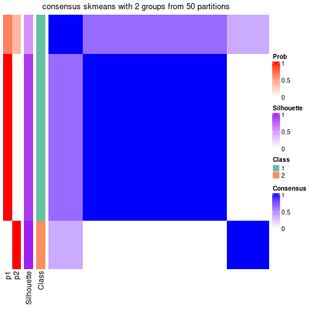</p>

</div>
<div id='tab-node-03-consensus-heatmap-2'>
<pre><code class="r">consensus_heatmap(res, k = 3)
</code></pre>

<p>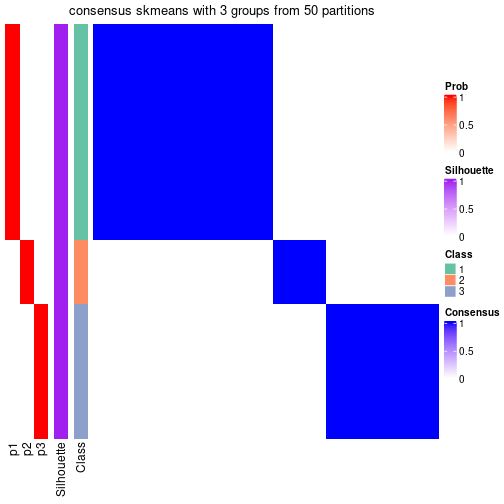</p>

</div>
<div id='tab-node-03-consensus-heatmap-3'>
<pre><code class="r">consensus_heatmap(res, k = 4)
</code></pre>

<p>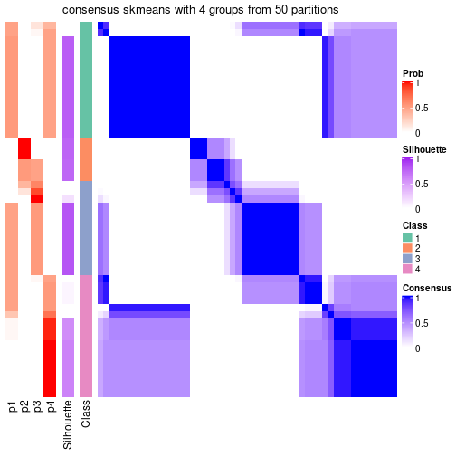</p>

</div>
<div id='tab-node-03-consensus-heatmap-4'>
<pre><code class="r">consensus_heatmap(res, k = 5)
</code></pre>

<p>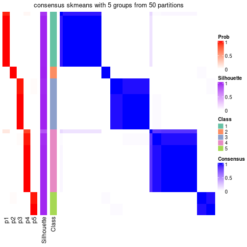</p>

</div>
<div id='tab-node-03-consensus-heatmap-5'>
<pre><code class="r">consensus_heatmap(res, k = 6)
</code></pre>

<p>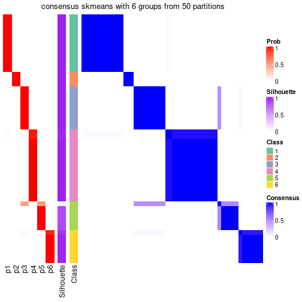</p>

</div>
<div id='tab-node-03-consensus-heatmap-6'>
<pre><code class="r">consensus_heatmap(res, k = 7)
</code></pre>

<p>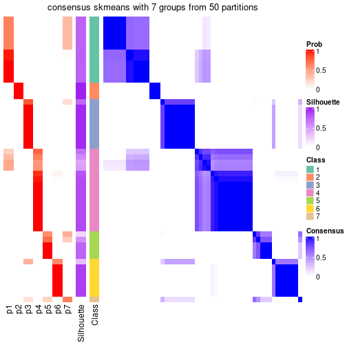</p>

</div>
<div id='tab-node-03-consensus-heatmap-7'>
<pre><code class="r">consensus_heatmap(res, k = 8)
</code></pre>

<p>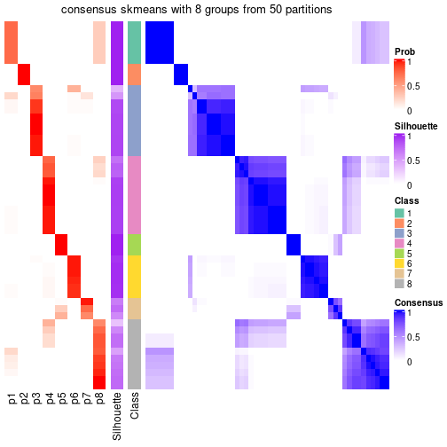</p>

</div>
</div>

Heatmaps for the membership of samples in all partitions to see how consistent they are:


<script>
$( function() {
	$( '#tabs-node-03-membership-heatmap' ).tabs();
} );
</script>
<div id='tabs-node-03-membership-heatmap'>
<ul>
<li><a href='#tab-node-03-membership-heatmap-1'>k = 2</a></li>
<li><a href='#tab-node-03-membership-heatmap-2'>k = 3</a></li>
<li><a href='#tab-node-03-membership-heatmap-3'>k = 4</a></li>
<li><a href='#tab-node-03-membership-heatmap-4'>k = 5</a></li>
<li><a href='#tab-node-03-membership-heatmap-5'>k = 6</a></li>
<li><a href='#tab-node-03-membership-heatmap-6'>k = 7</a></li>
<li><a href='#tab-node-03-membership-heatmap-7'>k = 8</a></li>
</ul>
<div id='tab-node-03-membership-heatmap-1'>
<pre><code class="r">membership_heatmap(res, k = 2)
</code></pre>

<p>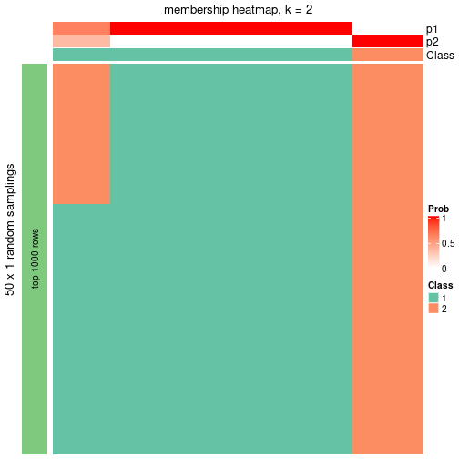</p>

</div>
<div id='tab-node-03-membership-heatmap-2'>
<pre><code class="r">membership_heatmap(res, k = 3)
</code></pre>

<p>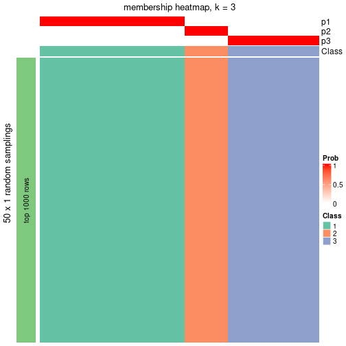</p>

</div>
<div id='tab-node-03-membership-heatmap-3'>
<pre><code class="r">membership_heatmap(res, k = 4)
</code></pre>

<p>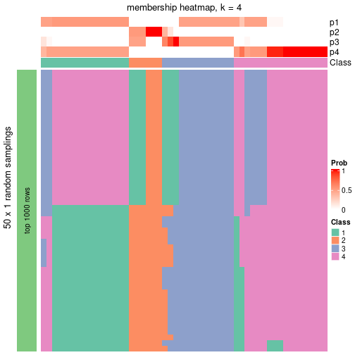</p>

</div>
<div id='tab-node-03-membership-heatmap-4'>
<pre><code class="r">membership_heatmap(res, k = 5)
</code></pre>

<p>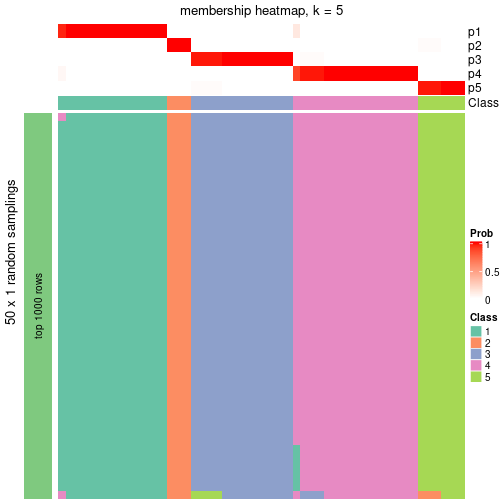</p>

</div>
<div id='tab-node-03-membership-heatmap-5'>
<pre><code class="r">membership_heatmap(res, k = 6)
</code></pre>

<p>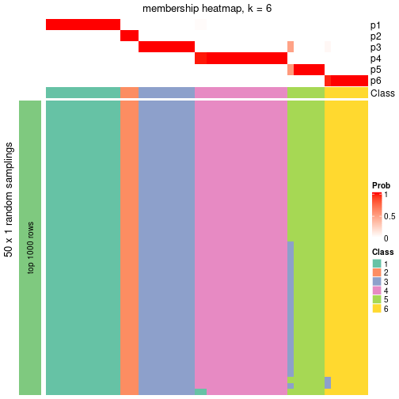</p>

</div>
<div id='tab-node-03-membership-heatmap-6'>
<pre><code class="r">membership_heatmap(res, k = 7)
</code></pre>

<p>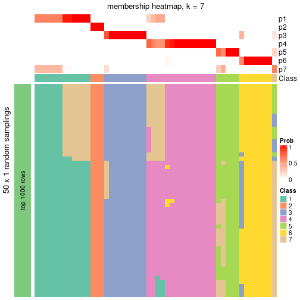</p>

</div>
<div id='tab-node-03-membership-heatmap-7'>
<pre><code class="r">membership_heatmap(res, k = 8)
</code></pre>

<p>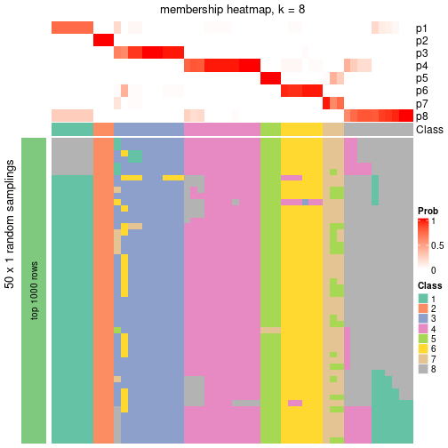</p>

</div>
</div>

As soon as the classes for columns are determined, the signatures
that are significantly different between subgroups can be looked for. 
Following are the heatmaps for signatures.


<script>
$( function() {
	$( '#tabs-node-03-get-signatures' ).tabs();
} );
</script>
<div id='tabs-node-03-get-signatures'>
<ul>
<li><a href='#tab-node-03-get-signatures-1'>k = 2</a></li>
<li><a href='#tab-node-03-get-signatures-2'>k = 3</a></li>
<li><a href='#tab-node-03-get-signatures-3'>k = 4</a></li>
<li><a href='#tab-node-03-get-signatures-4'>k = 5</a></li>
<li><a href='#tab-node-03-get-signatures-5'>k = 6</a></li>
<li><a href='#tab-node-03-get-signatures-6'>k = 7</a></li>
<li><a href='#tab-node-03-get-signatures-7'>k = 8</a></li>
</ul>
<div id='tab-node-03-get-signatures-1'>
<pre><code class="r">get_signatures(res, k = 2)
</code></pre>

<p>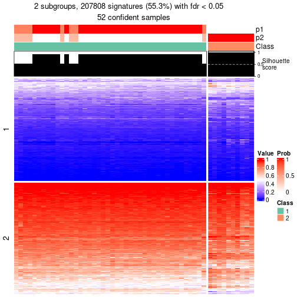</p>

</div>
<div id='tab-node-03-get-signatures-2'>
<pre><code class="r">get_signatures(res, k = 3)
</code></pre>

<p>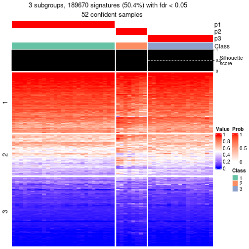</p>

</div>
<div id='tab-node-03-get-signatures-3'>
<pre><code class="r">get_signatures(res, k = 4)
</code></pre>

<p>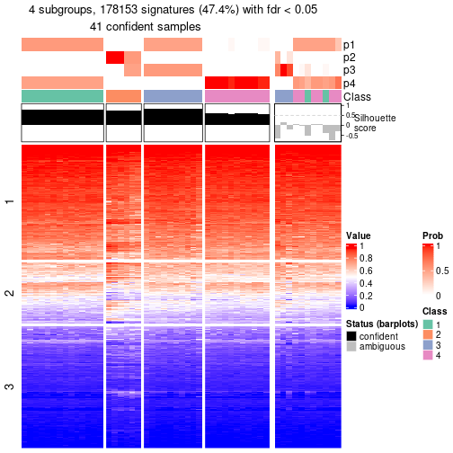</p>

</div>
<div id='tab-node-03-get-signatures-4'>
<pre><code class="r">get_signatures(res, k = 5)
</code></pre>

<p>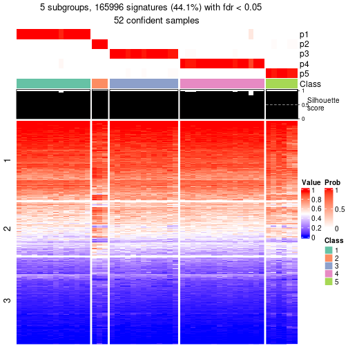</p>

</div>
<div id='tab-node-03-get-signatures-5'>
<pre><code class="r">get_signatures(res, k = 6)
</code></pre>

<p>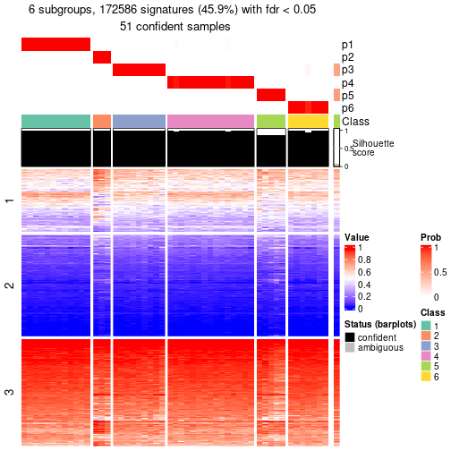</p>

</div>
<div id='tab-node-03-get-signatures-6'>
<pre><code class="r">get_signatures(res, k = 7)
</code></pre>

<p>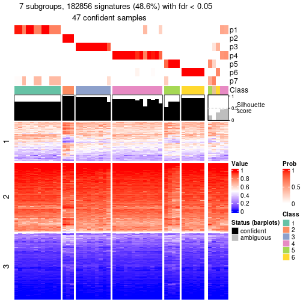</p>

</div>
<div id='tab-node-03-get-signatures-7'>
<pre><code class="r">get_signatures(res, k = 8)
</code></pre>

<p>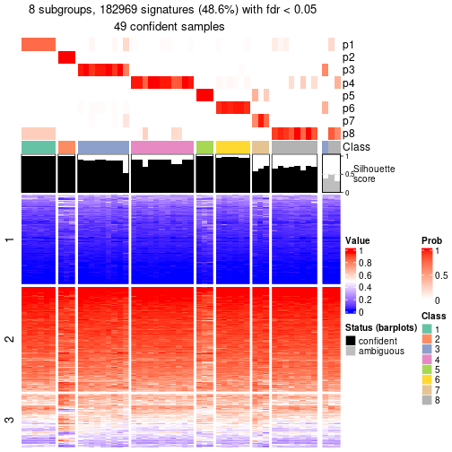</p>

</div>
</div>


Compare the overlap of signatures from different k:

```r
compare_signatures(res)
```

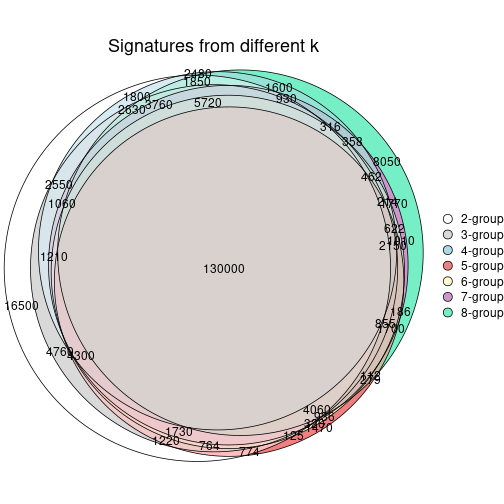

`get_signature()` returns a data frame invisibly. To get the list of signatures, the function
call should be assigned to a variable explicitly. In following code, if `plot` argument is set
to `FALSE`, no heatmap is plotted while only the differential analysis is performed.

```r
# code only for demonstration
tb = get_signature(res, k = ..., plot = FALSE)
```

An example of the output of `tb` is:

```
#>   which_row         fdr    mean_1    mean_2 scaled_mean_1 scaled_mean_2 km
#> 1        38 0.042760348  8.373488  9.131774    -0.5533452     0.5164555  1
#> 2        40 0.018707592  7.106213  8.469186    -0.6173731     0.5762149  1
#> 3        55 0.019134737 10.221463 11.207825    -0.6159697     0.5749050  1
#> 4        59 0.006059896  5.921854  7.869574    -0.6899429     0.6439467  1
#> 5        60 0.018055526  8.928898 10.211722    -0.6204761     0.5791110  1
#> 6        98 0.009384629 15.714769 14.887706     0.6635654    -0.6193277  2
...
```

The columns in `tb` are:

1. `which_row`: row indices corresponding to the input matrix.
2. `fdr`: FDR for the differential test. 
3. `mean_x`: The mean value in group x.
4. `scaled_mean_x`: The mean value in group x after rows are scaled.
5. `km`: Row groups if k-means clustering is applied to rows (which is done by automatically selecting number of clusters).

If there are too many signatures, `top_signatures = ...` can be set to only show the 
signatures with the highest FDRs:

```r
# code only for demonstration
# e.g. to show the top 500 most significant rows
tb = get_signature(res, k = ..., top_signatures = 500)
```

If the signatures are defined as these which are uniquely high in current group, `diff_method` argument
can be set to `"uniquely_high_in_one_group"`:

```r
# code only for demonstration
tb = get_signature(res, k = ..., diff_method = "uniquely_high_in_one_group")
```


UMAP plot which shows how samples are separated.


<script>
$( function() {
	$( '#tabs-node-03-dimension-reduction' ).tabs();
} );
</script>
<div id='tabs-node-03-dimension-reduction'>
<ul>
<li><a href='#tab-node-03-dimension-reduction-1'>k = 2</a></li>
<li><a href='#tab-node-03-dimension-reduction-2'>k = 3</a></li>
<li><a href='#tab-node-03-dimension-reduction-3'>k = 4</a></li>
<li><a href='#tab-node-03-dimension-reduction-4'>k = 5</a></li>
<li><a href='#tab-node-03-dimension-reduction-5'>k = 6</a></li>
<li><a href='#tab-node-03-dimension-reduction-6'>k = 7</a></li>
<li><a href='#tab-node-03-dimension-reduction-7'>k = 8</a></li>
</ul>
<div id='tab-node-03-dimension-reduction-1'>
<pre><code class="r">dimension_reduction(res, k = 2, method = &quot;UMAP&quot;)
</code></pre>

<p>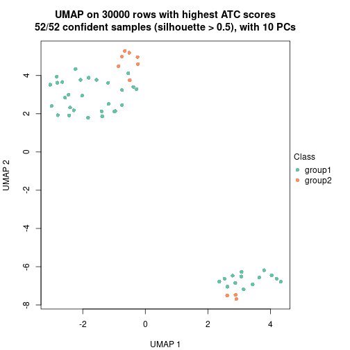</p>

</div>
<div id='tab-node-03-dimension-reduction-2'>
<pre><code class="r">dimension_reduction(res, k = 3, method = &quot;UMAP&quot;)
</code></pre>

<p>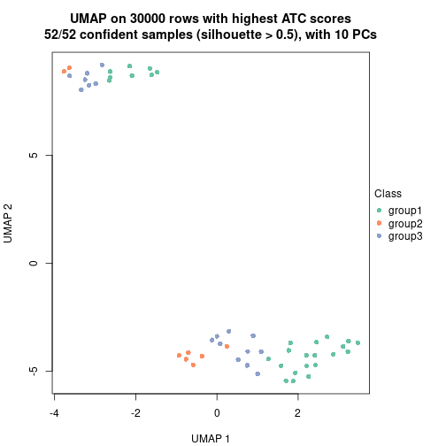</p>

</div>
<div id='tab-node-03-dimension-reduction-3'>
<pre><code class="r">dimension_reduction(res, k = 4, method = &quot;UMAP&quot;)
</code></pre>

<p>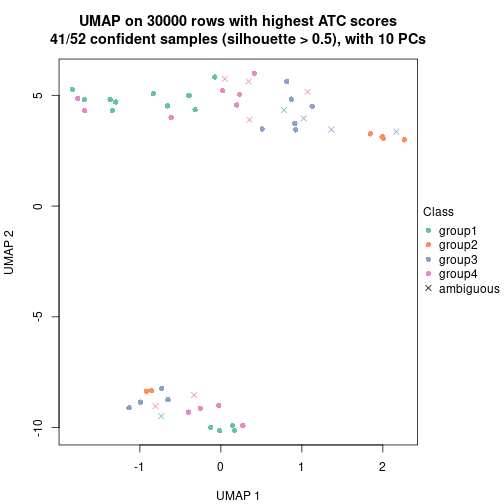</p>

</div>
<div id='tab-node-03-dimension-reduction-4'>
<pre><code class="r">dimension_reduction(res, k = 5, method = &quot;UMAP&quot;)
</code></pre>

<p>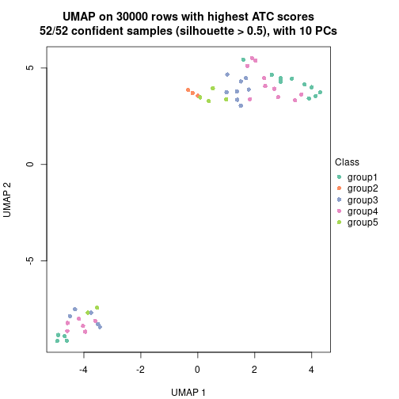</p>

</div>
<div id='tab-node-03-dimension-reduction-5'>
<pre><code class="r">dimension_reduction(res, k = 6, method = &quot;UMAP&quot;)
</code></pre>

<p>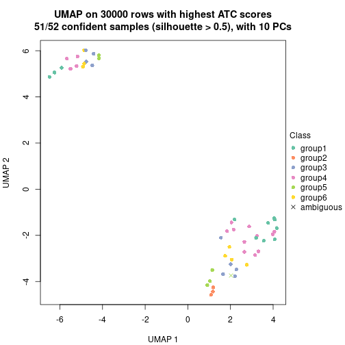</p>

</div>
<div id='tab-node-03-dimension-reduction-6'>
<pre><code class="r">dimension_reduction(res, k = 7, method = &quot;UMAP&quot;)
</code></pre>

<p>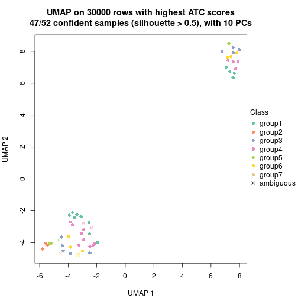</p>

</div>
<div id='tab-node-03-dimension-reduction-7'>
<pre><code class="r">dimension_reduction(res, k = 8, method = &quot;UMAP&quot;)
</code></pre>

<p>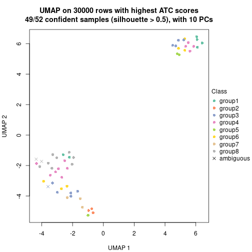</p>

</div>
</div>


Following heatmap shows how subgroups are split when increasing `k`:

```r
collect_classes(res)
```

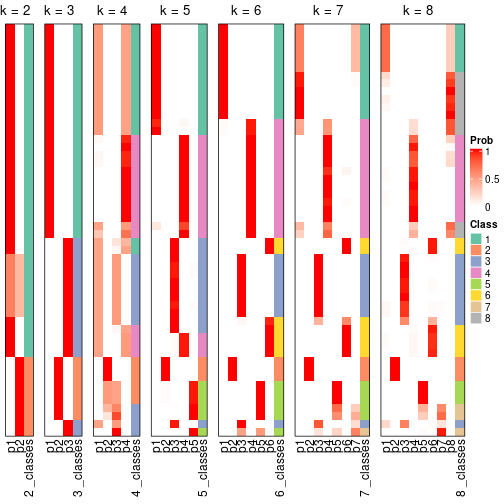


If matrix rows can be associated to genes, consider to use `functional_enrichment(res,
...)` to perform function enrichment for the signature genes. See [this vignette](https://jokergoo.github.io/cola_vignettes/functional_enrichment.html) for more detailed explanations.


 

---------------------------------------------------


### Node031


Parent node: [Node03](#Node03).
Child nodes: 
                Node0111-leaf
        ,
                Node0112-leaf
        ,
                Node0113-leaf
        ,
                Node0121-leaf
        ,
                Node0122-leaf
        ,
                Node0123-leaf
        ,
                Node0124-leaf
        ,
                Node0311-leaf
        ,
                Node0312-leaf
        ,
                Node0331-leaf
        ,
                Node0332-leaf
        ,
                Node0341-leaf
        ,
                Node0342-leaf
        ,
                Node0411-leaf
        ,
                [Node0412](#Node0412)
        ,
                Node0413-leaf
        ,
                Node0421-leaf
        ,
                Node0422-leaf
        ,
                Node0423-leaf
        ,
                Node0431-leaf
        ,
                [Node0432](#Node0432)
        ,
                Node0433-leaf
        ,
                Node0511-leaf
        ,
                Node0512-leaf
        ,
                Node0513-leaf
        ,
                [Node0521](#Node0521)
        ,
                Node0522-leaf
        ,
                Node0531-leaf
        ,
                Node0532-leaf
        ,
                Node0533-leaf
        .


The object with results only for a single top-value method and a single partitioning method 
can be extracted as:

```r
res = res_rh["031"]
```

A summary of `res` and all the functions that can be applied to it:

```r
res
```

```
#> A 'ConsensusPartition' object with k = 2, 3, 4, 5, 6, 7, 8.
#>   On a matrix with 30000 rows and 14 columns.
#>   Top rows (1000) are extracted by 'ATC' method.
#>   Subgroups are detected by 'kmeans' method.
#>   Performed in total 350 partitions by row resampling.
#>   Best k for subgroups seems to be 2.
#> 
#> Following methods can be applied to this 'ConsensusPartition' object:
#>  [1] "cola_report"             "collect_classes"         "collect_plots"          
#>  [4] "collect_stats"           "colnames"                "compare_partitions"     
#>  [7] "compare_signatures"      "consensus_heatmap"       "dimension_reduction"    
#> [10] "functional_enrichment"   "get_anno_col"            "get_anno"               
#> [13] "get_classes"             "get_consensus"           "get_matrix"             
#> [16] "get_membership"          "get_param"               "get_signatures"         
#> [19] "get_stats"               "is_best_k"               "is_stable_k"            
#> [22] "membership_heatmap"      "ncol"                    "nrow"                   
#> [25] "plot_ecdf"               "predict_classes"         "rownames"               
#> [28] "select_partition_number" "show"                    "suggest_best_k"         
#> [31] "test_to_known_factors"   "top_rows_heatmap"
```

`collect_plots()` function collects all the plots made from `res` for all `k` (number of subgroups)
into one single page to provide an easy and fast comparison between different `k`.

```r
collect_plots(res)
```

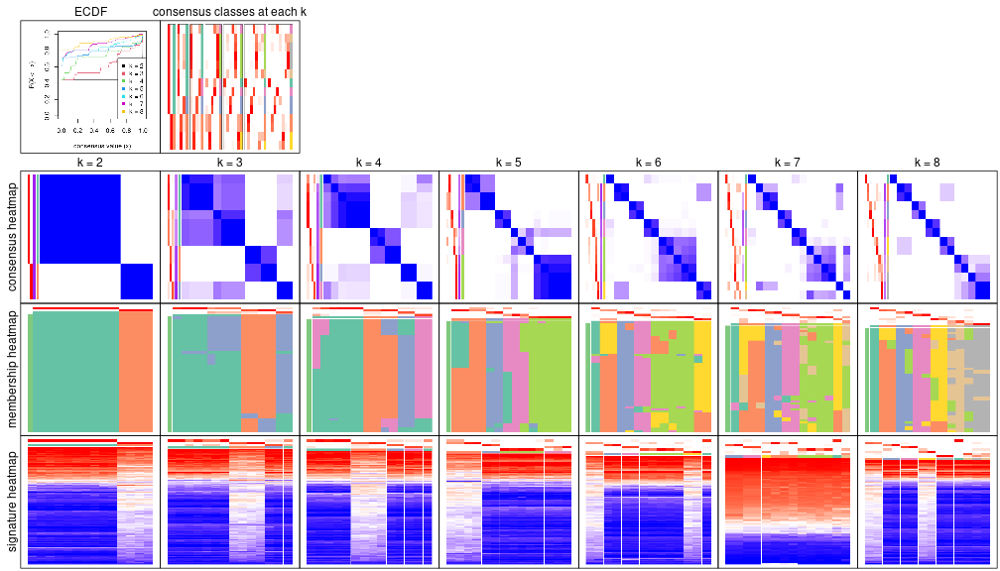

The plots are:

- The first row: a plot of the eCDF (empirical cumulative distribution
  function) curves of the consensus matrix for each `k` and the heatmap of
  predicted classes for each `k`.
- The second row: heatmaps of the consensus matrix for each `k`.
- The third row: heatmaps of the membership matrix for each `k`.
- The fouth row: heatmaps of the signatures for each `k`.

All the plots in panels can be made by individual functions and they are
plotted later in this section.

`select_partition_number()` produces several plots showing different
statistics for choosing "optimized" `k`. There are following statistics:

- eCDF curves of the consensus matrix for each `k`;
- 1-PAC. [The PAC score](https://en.wikipedia.org/wiki/Consensus_clustering#Over-interpretation_potential_of_consensus_clustering)
  measures the proportion of the ambiguous subgrouping.
- Mean silhouette score.
- Concordance. The mean probability of fiting the consensus subgroup labels in all
  partitions.
- Area increased. Denote $A_k$ as the area under the eCDF curve for current
  `k`, the area increased is defined as $A_k - A_{k-1}$.
- Rand index. The percent of pairs of samples that are both in a same cluster
  or both are not in a same cluster in the partition of k and k-1.
- Jaccard index. The ratio of pairs of samples are both in a same cluster in
  the partition of k and k-1 and the pairs of samples are both in a same
  cluster in the partition k or k-1.

The detailed explanations of these statistics can be found in [the _cola_
vignette](https://jokergoo.github.io/cola_vignettes/cola.html#toc_13).

Generally speaking, higher 1-PAC score, higher mean silhouette score or higher
concordance corresponds to better partition. Rand index and Jaccard index
measure how similar the current partition is compared to partition with `k-1`.
If they are too similar, we won't accept `k` is better than `k-1`.

```r
select_partition_number(res)
```


The numeric values for all these statistics can be obtained by `get_stats()`.

```r
get_stats(res)
```

```
#>   k 1-PAC mean_silhouette concordance area_increased  Rand Jaccard
#> 2 2 1.000           1.000       1.000         0.4401 0.560   0.560
#> 3 3 0.571           0.770       0.853         0.4243 0.824   0.686
#> 4 4 0.637           0.828       0.877         0.1828 0.868   0.657
#> 5 5 0.835           0.768       0.864         0.0807 0.923   0.720
#> 6 6 0.802           0.790       0.844         0.0568 0.934   0.700
#> 7 7 0.802           0.311       0.787         0.0383 0.923   0.562
#> 8 8 0.824           0.665       0.831         0.0359 0.923   0.462
```

`suggest_best_k()` suggests the best $k$ based on these statistics. The rules are as follows:

- All $k$ with Jaccard index larger than 0.95 are removed because increasing
  $k$ does not provide enough extra information. If all $k$ are removed, it is
  marked as no subgroup is detected.
- For all $k$ with 1-PAC score larger than 0.9, the maximal $k$ is taken as
  the best $k$, and other $k$ are marked as optional $k$.
- If it does not fit the second rule. The $k$ with the maximal vote of the
  highest 1-PAC score, highest mean silhouette, and highest concordance is
  taken as the best $k$.

```r
suggest_best_k(res)
```

```
#> [1] 2
```


Following is the table of the partitions (You need to click the **show/hide
code output** link to see it). The membership matrix (columns with name `p*`)
is inferred by
[`clue::cl_consensus()`](https://www.rdocumentation.org/link/cl_consensus?package=clue)
function with the `SE` method. Basically the value in the membership matrix
represents the probability to belong to a certain group. The finall subgroup
label for an item is determined with the group with highest probability it
belongs to.

In `get_classes()` function, the entropy is calculated from the membership
matrix and the silhouette score is calculated from the consensus matrix.


<script>
$( function() {
	$( '#tabs-node-031-get-classes' ).tabs();
} );
</script>
<div id='tabs-node-031-get-classes'>
<ul>
<li><a href='#tab-node-031-get-classes-1'>k = 2</a></li>
<li><a href='#tab-node-031-get-classes-2'>k = 3</a></li>
<li><a href='#tab-node-031-get-classes-3'>k = 4</a></li>
<li><a href='#tab-node-031-get-classes-4'>k = 5</a></li>
<li><a href='#tab-node-031-get-classes-5'>k = 6</a></li>
<li><a href='#tab-node-031-get-classes-6'>k = 7</a></li>
<li><a href='#tab-node-031-get-classes-7'>k = 8</a></li>
</ul>

<div id='tab-node-031-get-classes-1'>
<p><a id='tab-node-031-get-classes-1-a' style='color:#0366d6' href='#'>show/hide code output</a></p>
<pre><code class="r">cbind(get_classes(res, k = 2), get_membership(res, k = 2))
</code></pre>

<pre><code>#&gt;                 class entropy silhouette p1 p2
#&gt; TCGA.90.6837.01     1       0          1  1  0
#&gt; TCGA.33.4579.11     2       0          1  0  1
#&gt; TCGA.39.5011.11     2       0          1  0  1
#&gt; TCGA.22.5472.11     1       0          1  1  0
#&gt; TCGA.33.4582.11     1       0          1  1  0
#&gt; TCGA.18.5592.11     1       0          1  1  0
#&gt; TCGA.22.5492.11     2       0          1  0  1
#&gt; TCGA.43.3394.11     1       0          1  1  0
#&gt; TCGA.22.5491.11     1       0          1  1  0
#&gt; TCGA.22.5489.11     1       0          1  1  0
#&gt; TCGA.22.5471.11     1       0          1  1  0
#&gt; TCGA.39.5029.11     1       0          1  1  0
#&gt; TCGA.22.5482.11     1       0          1  1  0
#&gt; TCGA.34.5929.11     2       0          1  0  1
</code></pre>

<script>
$('#tab-node-031-get-classes-1-a').parent().next().next().hide();
$('#tab-node-031-get-classes-1-a').click(function(){
  $('#tab-node-031-get-classes-1-a').parent().next().next().toggle();
  return(false);
});
</script>
</div>

<div id='tab-node-031-get-classes-2'>
<p><a id='tab-node-031-get-classes-2-a' style='color:#0366d6' href='#'>show/hide code output</a></p>
<pre><code class="r">cbind(get_classes(res, k = 3), get_membership(res, k = 3))
</code></pre>

<pre><code>#&gt;                 class entropy silhouette   p1   p2   p3
#&gt; TCGA.90.6837.01     1   0.571      0.626 0.68 0.00 0.32
#&gt; TCGA.33.4579.11     2   0.400      0.917 0.00 0.84 0.16
#&gt; TCGA.39.5011.11     2   0.400      0.917 0.00 0.84 0.16
#&gt; TCGA.22.5472.11     1   0.153      0.708 0.96 0.00 0.04
#&gt; TCGA.33.4582.11     1   0.571      0.626 0.68 0.00 0.32
#&gt; TCGA.18.5592.11     1   0.571      0.626 0.68 0.00 0.32
#&gt; TCGA.22.5492.11     2   0.000      0.917 0.00 1.00 0.00
#&gt; TCGA.43.3394.11     3   0.400      1.000 0.16 0.00 0.84
#&gt; TCGA.22.5491.11     1   0.000      0.705 1.00 0.00 0.00
#&gt; TCGA.22.5489.11     1   0.619      0.414 0.58 0.00 0.42
#&gt; TCGA.22.5471.11     3   0.400      1.000 0.16 0.00 0.84
#&gt; TCGA.39.5029.11     1   0.000      0.705 1.00 0.00 0.00
#&gt; TCGA.22.5482.11     1   0.000      0.705 1.00 0.00 0.00
#&gt; TCGA.34.5929.11     2   0.000      0.917 0.00 1.00 0.00
</code></pre>

<script>
$('#tab-node-031-get-classes-2-a').parent().next().next().hide();
$('#tab-node-031-get-classes-2-a').click(function(){
  $('#tab-node-031-get-classes-2-a').parent().next().next().toggle();
  return(false);
});
</script>
</div>

<div id='tab-node-031-get-classes-3'>
<p><a id='tab-node-031-get-classes-3-a' style='color:#0366d6' href='#'>show/hide code output</a></p>
<pre><code class="r">cbind(get_classes(res, k = 4), get_membership(res, k = 4))
</code></pre>

<pre><code>#&gt;                 class entropy silhouette   p1   p2   p3   p4
#&gt; TCGA.90.6837.01     1  0.0000     0.8470 1.00 0.00 0.00 0.00
#&gt; TCGA.33.4579.11     2  0.4841     0.8540 0.00 0.78 0.14 0.08
#&gt; TCGA.39.5011.11     2  0.4841     0.8540 0.00 0.78 0.14 0.08
#&gt; TCGA.22.5472.11     1  0.2921     0.7302 0.86 0.00 0.00 0.14
#&gt; TCGA.33.4582.11     1  0.0000     0.8470 1.00 0.00 0.00 0.00
#&gt; TCGA.18.5592.11     1  0.0000     0.8470 1.00 0.00 0.00 0.00
#&gt; TCGA.22.5492.11     2  0.1211     0.8446 0.00 0.96 0.04 0.00
#&gt; TCGA.43.3394.11     3  0.3400     1.0000 0.18 0.00 0.82 0.00
#&gt; TCGA.22.5491.11     1  0.4948     0.0959 0.56 0.00 0.00 0.44
#&gt; TCGA.22.5489.11     1  0.0707     0.8287 0.98 0.00 0.02 0.00
#&gt; TCGA.22.5471.11     3  0.3400     1.0000 0.18 0.00 0.82 0.00
#&gt; TCGA.39.5029.11     4  0.2647     1.0000 0.12 0.00 0.00 0.88
#&gt; TCGA.22.5482.11     4  0.2647     1.0000 0.12 0.00 0.00 0.88
#&gt; TCGA.34.5929.11     2  0.1211     0.8446 0.00 0.96 0.00 0.04
</code></pre>

<script>
$('#tab-node-031-get-classes-3-a').parent().next().next().hide();
$('#tab-node-031-get-classes-3-a').click(function(){
  $('#tab-node-031-get-classes-3-a').parent().next().next().toggle();
  return(false);
});
</script>
</div>

<div id='tab-node-031-get-classes-4'>
<p><a id='tab-node-031-get-classes-4-a' style='color:#0366d6' href='#'>show/hide code output</a></p>
<pre><code class="r">cbind(get_classes(res, k = 5), get_membership(res, k = 5))
</code></pre>

<pre><code>#&gt;                 class entropy silhouette   p1   p2   p3   p4   p5
#&gt; TCGA.90.6837.01     5  0.0000      0.969 0.00 0.00 0.00 0.00 1.00
#&gt; TCGA.33.4579.11     2  0.4227      0.735 0.42 0.58 0.00 0.00 0.00
#&gt; TCGA.39.5011.11     2  0.4227      0.735 0.42 0.58 0.00 0.00 0.00
#&gt; TCGA.22.5472.11     5  0.0609      0.952 0.00 0.00 0.00 0.02 0.98
#&gt; TCGA.33.4582.11     5  0.0000      0.969 0.00 0.00 0.00 0.00 1.00
#&gt; TCGA.18.5592.11     5  0.0000      0.969 0.00 0.00 0.00 0.00 1.00
#&gt; TCGA.22.5492.11     2  0.0609      0.729 0.00 0.98 0.02 0.00 0.00
#&gt; TCGA.43.3394.11     3  0.0609      0.899 0.00 0.00 0.98 0.00 0.02
#&gt; TCGA.22.5491.11     4  0.3983      0.337 0.00 0.00 0.00 0.66 0.34
#&gt; TCGA.22.5489.11     5  0.1732      0.900 0.08 0.00 0.00 0.00 0.92
#&gt; TCGA.22.5471.11     3  0.2873      0.899 0.12 0.00 0.86 0.00 0.02
#&gt; TCGA.39.5029.11     4  0.0000      0.537 0.00 0.00 0.00 1.00 0.00
#&gt; TCGA.22.5482.11     4  0.4287      0.391 0.46 0.00 0.00 0.54 0.00
#&gt; TCGA.34.5929.11     2  0.0000      0.729 0.00 1.00 0.00 0.00 0.00
</code></pre>

<script>
$('#tab-node-031-get-classes-4-a').parent().next().next().hide();
$('#tab-node-031-get-classes-4-a').click(function(){
  $('#tab-node-031-get-classes-4-a').parent().next().next().toggle();
  return(false);
});
</script>
</div>

<div id='tab-node-031-get-classes-5'>
<p><a id='tab-node-031-get-classes-5-a' style='color:#0366d6' href='#'>show/hide code output</a></p>
<pre><code class="r">cbind(get_classes(res, k = 6), get_membership(res, k = 6))
</code></pre>

<pre><code>#&gt;                 class entropy silhouette   p1   p2   p3   p4   p5   p6
#&gt; TCGA.90.6837.01     5  0.2790      0.756 0.00 0.14 0.00 0.02 0.84 0.00
#&gt; TCGA.33.4579.11     2  0.3851      0.972 0.00 0.54 0.00 0.00 0.00 0.46
#&gt; TCGA.39.5011.11     2  0.4328      0.972 0.02 0.52 0.00 0.00 0.00 0.46
#&gt; TCGA.22.5472.11     5  0.3916      0.742 0.00 0.30 0.00 0.02 0.68 0.00
#&gt; TCGA.33.4582.11     5  0.3460      0.766 0.00 0.22 0.00 0.02 0.76 0.00
#&gt; TCGA.18.5592.11     5  0.0000      0.814 0.00 0.00 0.00 0.00 1.00 0.00
#&gt; TCGA.22.5492.11     6  0.2190      0.862 0.04 0.00 0.00 0.06 0.00 0.90
#&gt; TCGA.43.3394.11     3  0.2094      0.915 0.00 0.08 0.90 0.02 0.00 0.00
#&gt; TCGA.22.5491.11     4  0.1814      0.844 0.00 0.00 0.00 0.90 0.10 0.00
#&gt; TCGA.22.5489.11     5  0.0937      0.803 0.00 0.00 0.04 0.00 0.96 0.00
#&gt; TCGA.22.5471.11     3  0.0000      0.915 0.00 0.00 1.00 0.00 0.00 0.00
#&gt; TCGA.39.5029.11     4  0.2350      0.836 0.10 0.00 0.00 0.88 0.02 0.00
#&gt; TCGA.22.5482.11     1  0.1480      0.000 0.94 0.00 0.00 0.04 0.02 0.00
#&gt; TCGA.34.5929.11     6  0.0000      0.862 0.00 0.00 0.00 0.00 0.00 1.00
</code></pre>

<script>
$('#tab-node-031-get-classes-5-a').parent().next().next().hide();
$('#tab-node-031-get-classes-5-a').click(function(){
  $('#tab-node-031-get-classes-5-a').parent().next().next().toggle();
  return(false);
});
</script>
</div>

<div id='tab-node-031-get-classes-6'>
<p><a id='tab-node-031-get-classes-6-a' style='color:#0366d6' href='#'>show/hide code output</a></p>
<pre><code class="r">cbind(get_classes(res, k = 7), get_membership(res, k = 7))
</code></pre>

<pre><code>#&gt;                 class entropy silhouette   p1   p2   p3   p4   p5   p6   p7
#&gt; TCGA.90.6837.01     5  0.4587      0.286 0.00 0.00 0.00 0.02 0.68 0.20 0.10
#&gt; TCGA.33.4579.11     2  0.0000      0.463 0.00 1.00 0.00 0.00 0.00 0.00 0.00
#&gt; TCGA.39.5011.11     2  0.1363      0.463 0.04 0.94 0.00 0.02 0.00 0.00 0.00
#&gt; TCGA.22.5472.11     7  0.3525      0.000 0.00 0.00 0.00 0.00 0.44 0.00 0.56
#&gt; TCGA.33.4582.11     5  0.4070     -0.547 0.00 0.00 0.00 0.00 0.62 0.04 0.34
#&gt; TCGA.18.5592.11     5  0.0000      0.491 0.00 0.00 0.00 0.00 1.00 0.00 0.00
#&gt; TCGA.22.5492.11     6  0.3294      0.000 0.00 0.34 0.00 0.00 0.00 0.66 0.00
#&gt; TCGA.43.3394.11     3  0.3343      0.841 0.00 0.00 0.82 0.04 0.00 0.10 0.04
#&gt; TCGA.22.5491.11     4  0.2278      0.813 0.00 0.00 0.00 0.88 0.08 0.04 0.00
#&gt; TCGA.22.5489.11     5  0.1166      0.487 0.00 0.00 0.06 0.00 0.94 0.00 0.00
#&gt; TCGA.22.5471.11     3  0.0000      0.841 0.00 0.00 1.00 0.00 0.00 0.00 0.00
#&gt; TCGA.39.5029.11     4  0.1671      0.802 0.10 0.00 0.00 0.90 0.00 0.00 0.00
#&gt; TCGA.22.5482.11     1  0.0863      0.000 0.96 0.00 0.00 0.04 0.00 0.00 0.00
#&gt; TCGA.34.5929.11     2  0.6035     -0.584 0.00 0.34 0.00 0.02 0.00 0.32 0.32
</code></pre>

<script>
$('#tab-node-031-get-classes-6-a').parent().next().next().hide();
$('#tab-node-031-get-classes-6-a').click(function(){
  $('#tab-node-031-get-classes-6-a').parent().next().next().toggle();
  return(false);
});
</script>
</div>

<div id='tab-node-031-get-classes-7'>
<p><a id='tab-node-031-get-classes-7-a' style='color:#0366d6' href='#'>show/hide code output</a></p>
<pre><code class="r">cbind(get_classes(res, k = 8), get_membership(res, k = 8))
</code></pre>

<pre><code>#&gt;                 class entropy silhouette p1   p2   p3   p4   p5   p6   p7   p8
#&gt; TCGA.90.6837.01     8   0.548      0.442  0 0.12 0.00 0.00 0.14 0.00 0.16 0.58
#&gt; TCGA.33.4579.11     2   0.253      0.919  0 0.78 0.00 0.00 0.00 0.22 0.00 0.00
#&gt; TCGA.39.5011.11     2   0.377      0.919  0 0.70 0.00 0.00 0.00 0.22 0.08 0.00
#&gt; TCGA.22.5472.11     7   0.211      0.566  0 0.00 0.00 0.00 0.00 0.00 0.84 0.16
#&gt; TCGA.33.4582.11     7   0.529      0.500  0 0.02 0.00 0.00 0.16 0.00 0.44 0.38
#&gt; TCGA.18.5592.11     8   0.000      0.720  0 0.00 0.00 0.00 0.00 0.00 0.00 1.00
#&gt; TCGA.22.5492.11     6   0.294      0.695  0 0.00 0.00 0.00 0.30 0.70 0.00 0.00
#&gt; TCGA.43.3394.11     3   0.314      0.672  0 0.00 0.64 0.00 0.36 0.00 0.00 0.00
#&gt; TCGA.22.5491.11     4   0.213      0.898  0 0.08 0.00 0.88 0.04 0.00 0.00 0.00
#&gt; TCGA.22.5489.11     8   0.000      0.720  0 0.00 0.00 0.00 0.00 0.00 0.00 1.00
#&gt; TCGA.22.5471.11     3   0.000      0.672  0 0.00 1.00 0.00 0.00 0.00 0.00 0.00
#&gt; TCGA.39.5029.11     4   0.000      0.898  0 0.00 0.00 1.00 0.00 0.00 0.00 0.00
#&gt; TCGA.22.5482.11     1   0.000      0.000  1 0.00 0.00 0.00 0.00 0.00 0.00 0.00
#&gt; TCGA.34.5929.11     6   0.000      0.695  0 0.00 0.00 0.00 0.00 1.00 0.00 0.00
</code></pre>

<script>
$('#tab-node-031-get-classes-7-a').parent().next().next().hide();
$('#tab-node-031-get-classes-7-a').click(function(){
  $('#tab-node-031-get-classes-7-a').parent().next().next().toggle();
  return(false);
});
</script>
</div>
</div>

Heatmaps for the consensus matrix. It visualizes the probability of two
samples to be in a same group.


<script>
$( function() {
	$( '#tabs-node-031-consensus-heatmap' ).tabs();
} );
</script>
<div id='tabs-node-031-consensus-heatmap'>
<ul>
<li><a href='#tab-node-031-consensus-heatmap-1'>k = 2</a></li>
<li><a href='#tab-node-031-consensus-heatmap-2'>k = 3</a></li>
<li><a href='#tab-node-031-consensus-heatmap-3'>k = 4</a></li>
<li><a href='#tab-node-031-consensus-heatmap-4'>k = 5</a></li>
<li><a href='#tab-node-031-consensus-heatmap-5'>k = 6</a></li>
<li><a href='#tab-node-031-consensus-heatmap-6'>k = 7</a></li>
<li><a href='#tab-node-031-consensus-heatmap-7'>k = 8</a></li>
</ul>
<div id='tab-node-031-consensus-heatmap-1'>
<pre><code class="r">consensus_heatmap(res, k = 2)
</code></pre>

<p>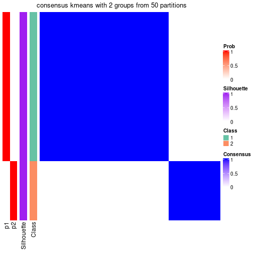</p>

</div>
<div id='tab-node-031-consensus-heatmap-2'>
<pre><code class="r">consensus_heatmap(res, k = 3)
</code></pre>

<p>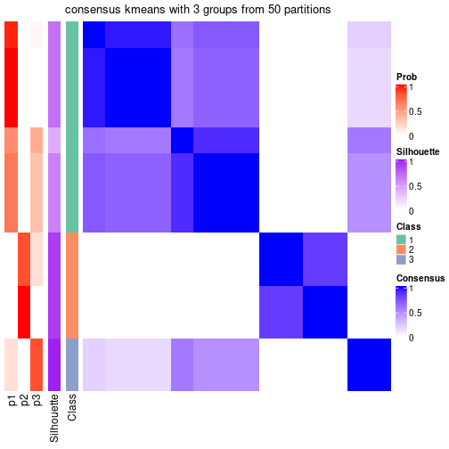</p>

</div>
<div id='tab-node-031-consensus-heatmap-3'>
<pre><code class="r">consensus_heatmap(res, k = 4)
</code></pre>

<p>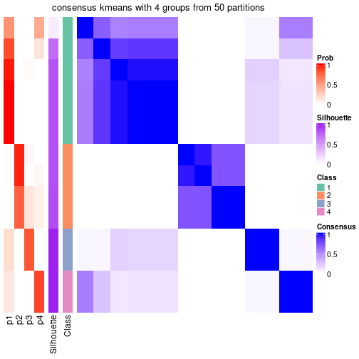</p>

</div>
<div id='tab-node-031-consensus-heatmap-4'>
<pre><code class="r">consensus_heatmap(res, k = 5)
</code></pre>

<p>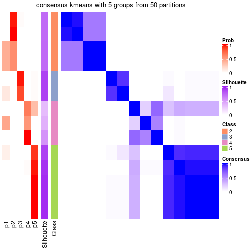</p>

</div>
<div id='tab-node-031-consensus-heatmap-5'>
<pre><code class="r">consensus_heatmap(res, k = 6)
</code></pre>

<p>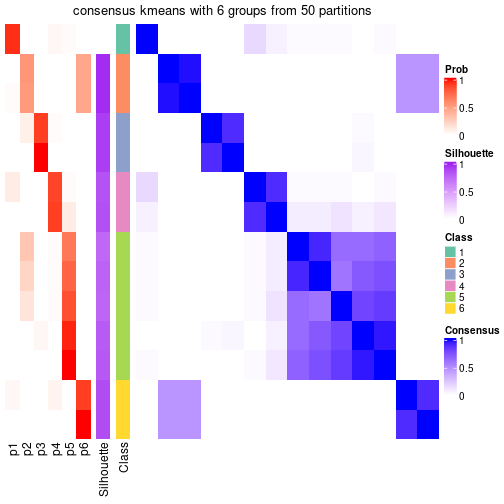</p>

</div>
<div id='tab-node-031-consensus-heatmap-6'>
<pre><code class="r">consensus_heatmap(res, k = 7)
</code></pre>

<p>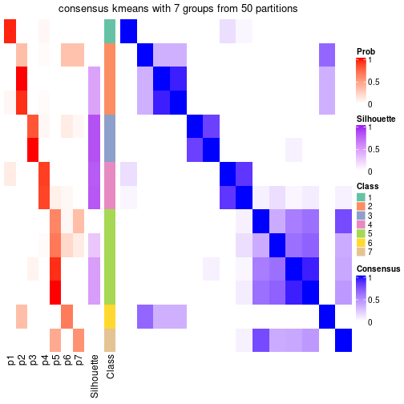</p>

</div>
<div id='tab-node-031-consensus-heatmap-7'>
<pre><code class="r">consensus_heatmap(res, k = 8)
</code></pre>

<p>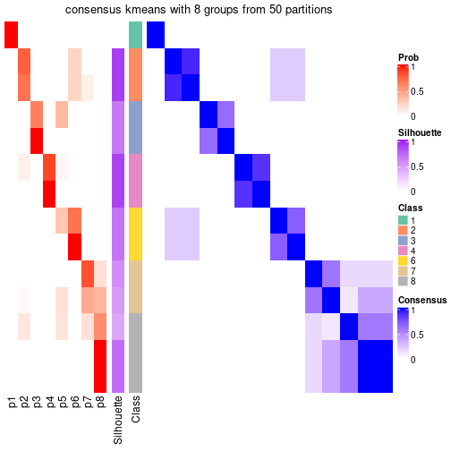</p>

</div>
</div>

Heatmaps for the membership of samples in all partitions to see how consistent they are:


<script>
$( function() {
	$( '#tabs-node-031-membership-heatmap' ).tabs();
} );
</script>
<div id='tabs-node-031-membership-heatmap'>
<ul>
<li><a href='#tab-node-031-membership-heatmap-1'>k = 2</a></li>
<li><a href='#tab-node-031-membership-heatmap-2'>k = 3</a></li>
<li><a href='#tab-node-031-membership-heatmap-3'>k = 4</a></li>
<li><a href='#tab-node-031-membership-heatmap-4'>k = 5</a></li>
<li><a href='#tab-node-031-membership-heatmap-5'>k = 6</a></li>
<li><a href='#tab-node-031-membership-heatmap-6'>k = 7</a></li>
<li><a href='#tab-node-031-membership-heatmap-7'>k = 8</a></li>
</ul>
<div id='tab-node-031-membership-heatmap-1'>
<pre><code class="r">membership_heatmap(res, k = 2)
</code></pre>

<p>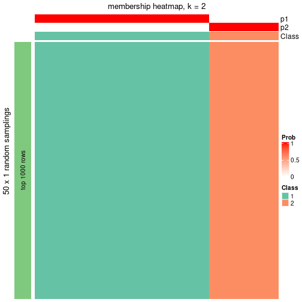</p>

</div>
<div id='tab-node-031-membership-heatmap-2'>
<pre><code class="r">membership_heatmap(res, k = 3)
</code></pre>

<p>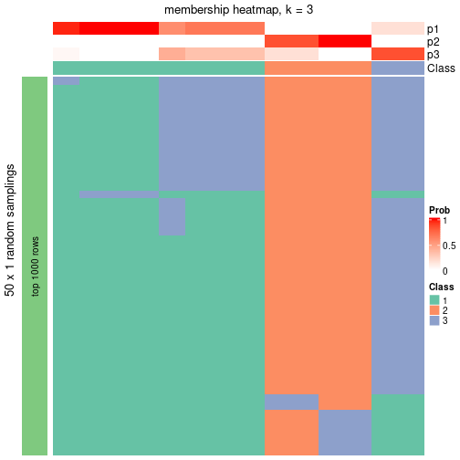</p>

</div>
<div id='tab-node-031-membership-heatmap-3'>
<pre><code class="r">membership_heatmap(res, k = 4)
</code></pre>

<p>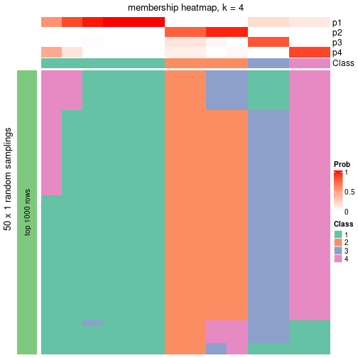</p>

</div>
<div id='tab-node-031-membership-heatmap-4'>
<pre><code class="r">membership_heatmap(res, k = 5)
</code></pre>

<p>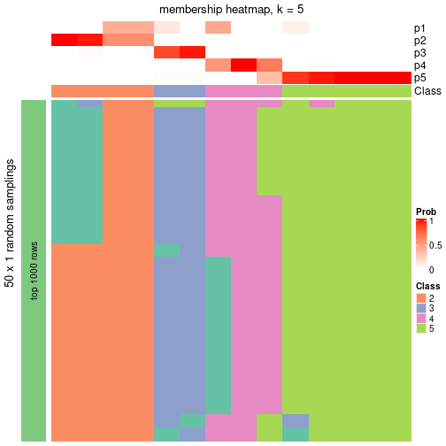</p>

</div>
<div id='tab-node-031-membership-heatmap-5'>
<pre><code class="r">membership_heatmap(res, k = 6)
</code></pre>

<p>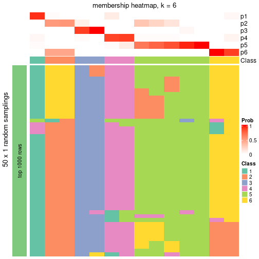</p>

</div>
<div id='tab-node-031-membership-heatmap-6'>
<pre><code class="r">membership_heatmap(res, k = 7)
</code></pre>

<p>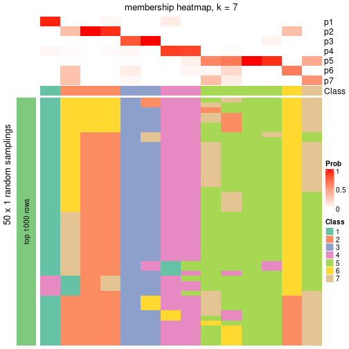</p>

</div>
<div id='tab-node-031-membership-heatmap-7'>
<pre><code class="r">membership_heatmap(res, k = 8)
</code></pre>

<p>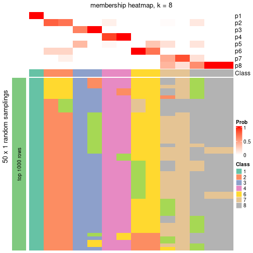</p>

</div>
</div>

As soon as the classes for columns are determined, the signatures
that are significantly different between subgroups can be looked for. 
Following are the heatmaps for signatures.


<script>
$( function() {
	$( '#tabs-node-031-get-signatures' ).tabs();
} );
</script>
<div id='tabs-node-031-get-signatures'>
<ul>
<li><a href='#tab-node-031-get-signatures-1'>k = 2</a></li>
<li><a href='#tab-node-031-get-signatures-2'>k = 3</a></li>
<li><a href='#tab-node-031-get-signatures-3'>k = 4</a></li>
<li><a href='#tab-node-031-get-signatures-4'>k = 5</a></li>
<li><a href='#tab-node-031-get-signatures-5'>k = 6</a></li>
<li><a href='#tab-node-031-get-signatures-6'>k = 7</a></li>
<li><a href='#tab-node-031-get-signatures-7'>k = 8</a></li>
</ul>
<div id='tab-node-031-get-signatures-1'>
<pre><code class="r">get_signatures(res, k = 2)
</code></pre>

<p>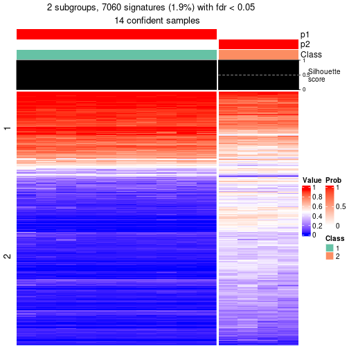</p>

</div>
<div id='tab-node-031-get-signatures-2'>
<pre><code class="r">get_signatures(res, k = 3)
</code></pre>

<p>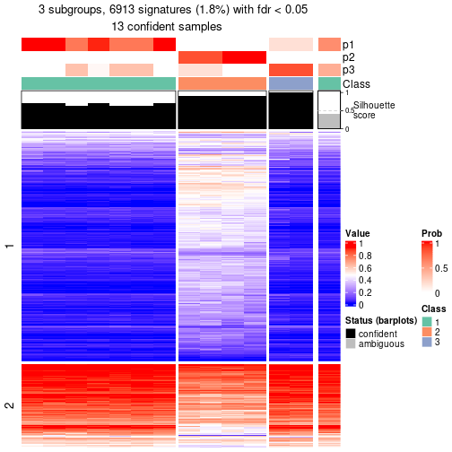</p>

</div>
<div id='tab-node-031-get-signatures-3'>
<pre><code class="r">get_signatures(res, k = 4)
</code></pre>

<p>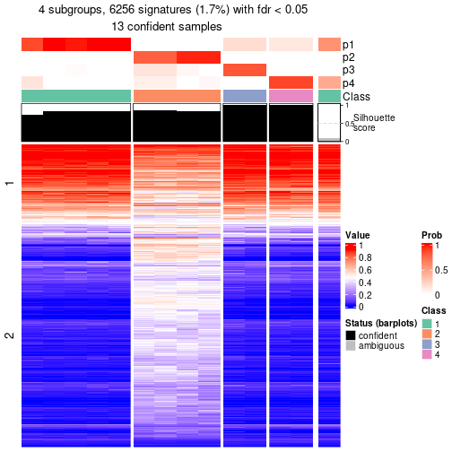</p>

</div>
<div id='tab-node-031-get-signatures-4'>
<pre><code class="r">get_signatures(res, k = 5)
</code></pre>

<p>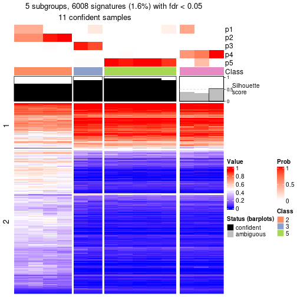</p>

</div>
<div id='tab-node-031-get-signatures-5'>
<pre><code class="r">get_signatures(res, k = 6)
</code></pre>

<p>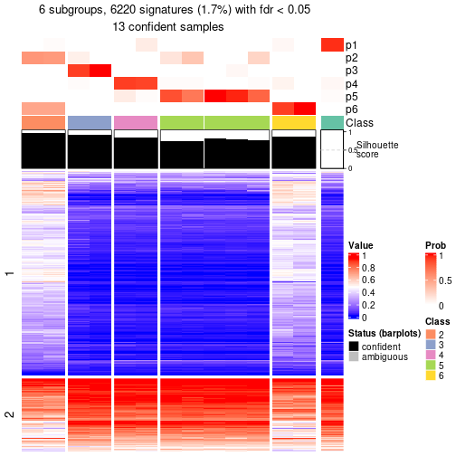</p>

</div>
<div id='tab-node-031-get-signatures-6'>
<pre><code class="r">get_signatures(res, k = 7)
</code></pre>

<p>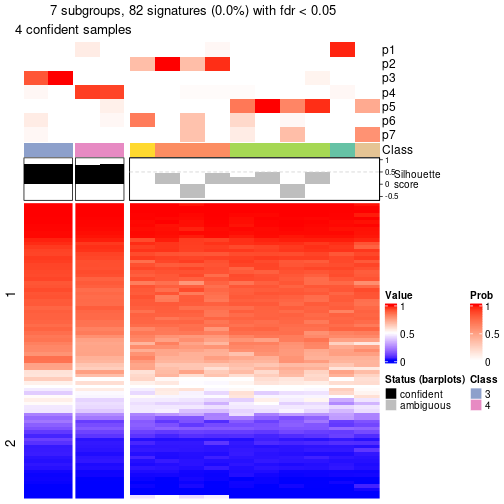</p>

</div>
<div id='tab-node-031-get-signatures-7'>
<pre><code class="r">get_signatures(res, k = 8)
</code></pre>

<p>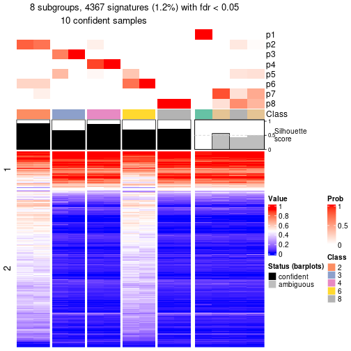</p>

</div>
</div>


Compare the overlap of signatures from different k:

```r
compare_signatures(res)
```

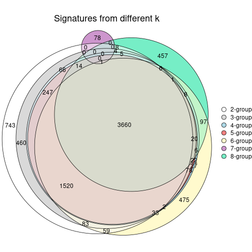

`get_signature()` returns a data frame invisibly. To get the list of signatures, the function
call should be assigned to a variable explicitly. In following code, if `plot` argument is set
to `FALSE`, no heatmap is plotted while only the differential analysis is performed.

```r
# code only for demonstration
tb = get_signature(res, k = ..., plot = FALSE)
```

An example of the output of `tb` is:

```
#>   which_row         fdr    mean_1    mean_2 scaled_mean_1 scaled_mean_2 km
#> 1        38 0.042760348  8.373488  9.131774    -0.5533452     0.5164555  1
#> 2        40 0.018707592  7.106213  8.469186    -0.6173731     0.5762149  1
#> 3        55 0.019134737 10.221463 11.207825    -0.6159697     0.5749050  1
#> 4        59 0.006059896  5.921854  7.869574    -0.6899429     0.6439467  1
#> 5        60 0.018055526  8.928898 10.211722    -0.6204761     0.5791110  1
#> 6        98 0.009384629 15.714769 14.887706     0.6635654    -0.6193277  2
...
```

The columns in `tb` are:

1. `which_row`: row indices corresponding to the input matrix.
2. `fdr`: FDR for the differential test. 
3. `mean_x`: The mean value in group x.
4. `scaled_mean_x`: The mean value in group x after rows are scaled.
5. `km`: Row groups if k-means clustering is applied to rows (which is done by automatically selecting number of clusters).

If there are too many signatures, `top_signatures = ...` can be set to only show the 
signatures with the highest FDRs:

```r
# code only for demonstration
# e.g. to show the top 500 most significant rows
tb = get_signature(res, k = ..., top_signatures = 500)
```

If the signatures are defined as these which are uniquely high in current group, `diff_method` argument
can be set to `"uniquely_high_in_one_group"`:

```r
# code only for demonstration
tb = get_signature(res, k = ..., diff_method = "uniquely_high_in_one_group")
```


UMAP plot which shows how samples are separated.


<script>
$( function() {
	$( '#tabs-node-031-dimension-reduction' ).tabs();
} );
</script>
<div id='tabs-node-031-dimension-reduction'>
<ul>
<li><a href='#tab-node-031-dimension-reduction-1'>k = 2</a></li>
<li><a href='#tab-node-031-dimension-reduction-2'>k = 3</a></li>
<li><a href='#tab-node-031-dimension-reduction-3'>k = 4</a></li>
<li><a href='#tab-node-031-dimension-reduction-4'>k = 5</a></li>
<li><a href='#tab-node-031-dimension-reduction-5'>k = 6</a></li>
<li><a href='#tab-node-031-dimension-reduction-6'>k = 7</a></li>
<li><a href='#tab-node-031-dimension-reduction-7'>k = 8</a></li>
</ul>
<div id='tab-node-031-dimension-reduction-1'>
<pre><code class="r">dimension_reduction(res, k = 2, method = &quot;UMAP&quot;)
</code></pre>

<p>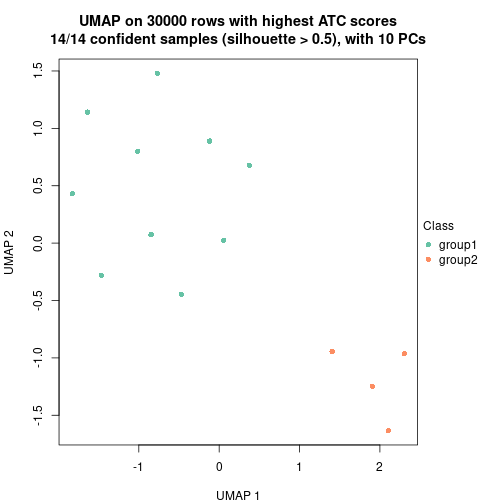</p>

</div>
<div id='tab-node-031-dimension-reduction-2'>
<pre><code class="r">dimension_reduction(res, k = 3, method = &quot;UMAP&quot;)
</code></pre>

<p>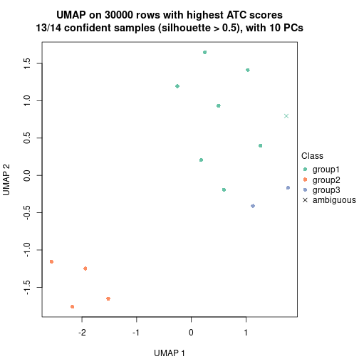</p>

</div>
<div id='tab-node-031-dimension-reduction-3'>
<pre><code class="r">dimension_reduction(res, k = 4, method = &quot;UMAP&quot;)
</code></pre>

<p>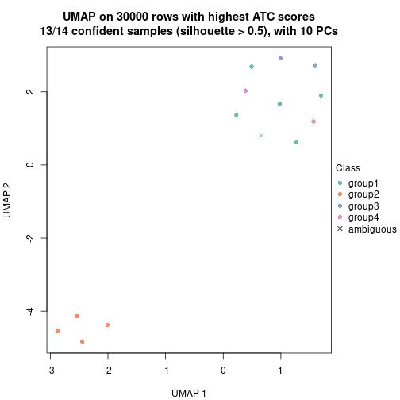</p>

</div>
<div id='tab-node-031-dimension-reduction-4'>
<pre><code class="r">dimension_reduction(res, k = 5, method = &quot;UMAP&quot;)
</code></pre>

<p>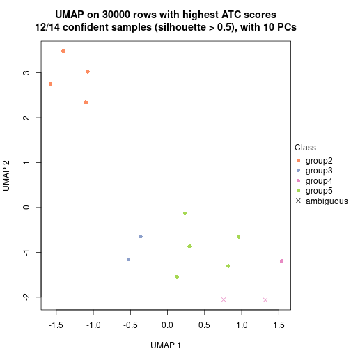</p>

</div>
<div id='tab-node-031-dimension-reduction-5'>
<pre><code class="r">dimension_reduction(res, k = 6, method = &quot;UMAP&quot;)
</code></pre>

<p>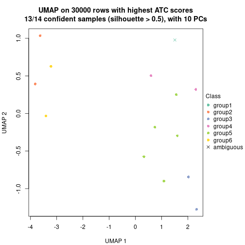</p>

</div>
<div id='tab-node-031-dimension-reduction-6'>
<pre><code class="r">dimension_reduction(res, k = 7, method = &quot;UMAP&quot;)
</code></pre>

<p>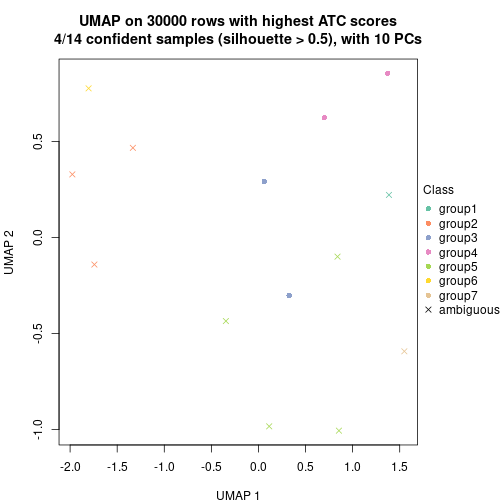</p>

</div>
<div id='tab-node-031-dimension-reduction-7'>
<pre><code class="r">dimension_reduction(res, k = 8, method = &quot;UMAP&quot;)
</code></pre>

<p>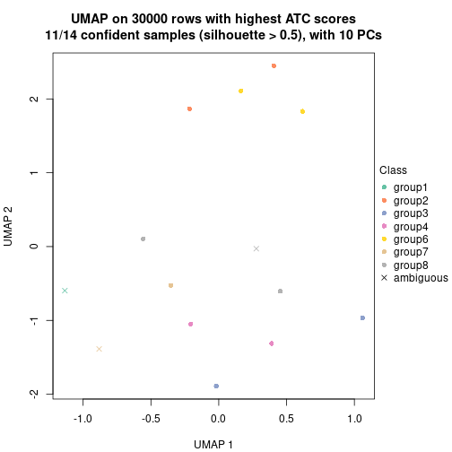</p>

</div>
</div>


Following heatmap shows how subgroups are split when increasing `k`:

```r
collect_classes(res)
```

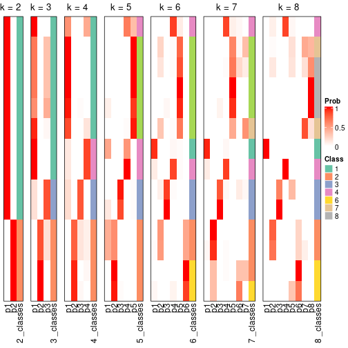


If matrix rows can be associated to genes, consider to use `functional_enrichment(res,
...)` to perform function enrichment for the signature genes. See [this vignette](https://jokergoo.github.io/cola_vignettes/functional_enrichment.html) for more detailed explanations.


 

---------------------------------------------------


### Node033


Parent node: [Node03](#Node03).
Child nodes: 
                Node0111-leaf
        ,
                Node0112-leaf
        ,
                Node0113-leaf
        ,
                Node0121-leaf
        ,
                Node0122-leaf
        ,
                Node0123-leaf
        ,
                Node0124-leaf
        ,
                Node0311-leaf
        ,
                Node0312-leaf
        ,
                Node0331-leaf
        ,
                Node0332-leaf
        ,
                Node0341-leaf
        ,
                Node0342-leaf
        ,
                Node0411-leaf
        ,
                [Node0412](#Node0412)
        ,
                Node0413-leaf
        ,
                Node0421-leaf
        ,
                Node0422-leaf
        ,
                Node0423-leaf
        ,
                Node0431-leaf
        ,
                [Node0432](#Node0432)
        ,
                Node0433-leaf
        ,
                Node0511-leaf
        ,
                Node0512-leaf
        ,
                Node0513-leaf
        ,
                [Node0521](#Node0521)
        ,
                Node0522-leaf
        ,
                Node0531-leaf
        ,
                Node0532-leaf
        ,
                Node0533-leaf
        .


The object with results only for a single top-value method and a single partitioning method 
can be extracted as:

```r
res = res_rh["033"]
```

A summary of `res` and all the functions that can be applied to it:

```r
res
```

```
#> A 'ConsensusPartition' object with k = 2, 3, 4, 5, 6, 7, 8.
#>   On a matrix with 30000 rows and 13 columns.
#>   Top rows (1000) are extracted by 'SD' method.
#>   Subgroups are detected by 'kmeans' method.
#>   Performed in total 350 partitions by row resampling.
#>   Best k for subgroups seems to be 2.
#> 
#> Following methods can be applied to this 'ConsensusPartition' object:
#>  [1] "cola_report"             "collect_classes"         "collect_plots"          
#>  [4] "collect_stats"           "colnames"                "compare_partitions"     
#>  [7] "compare_signatures"      "consensus_heatmap"       "dimension_reduction"    
#> [10] "functional_enrichment"   "get_anno_col"            "get_anno"               
#> [13] "get_classes"             "get_consensus"           "get_matrix"             
#> [16] "get_membership"          "get_param"               "get_signatures"         
#> [19] "get_stats"               "is_best_k"               "is_stable_k"            
#> [22] "membership_heatmap"      "ncol"                    "nrow"                   
#> [25] "plot_ecdf"               "predict_classes"         "rownames"               
#> [28] "select_partition_number" "show"                    "suggest_best_k"         
#> [31] "test_to_known_factors"   "top_rows_heatmap"
```

`collect_plots()` function collects all the plots made from `res` for all `k` (number of subgroups)
into one single page to provide an easy and fast comparison between different `k`.

```r
collect_plots(res)
```

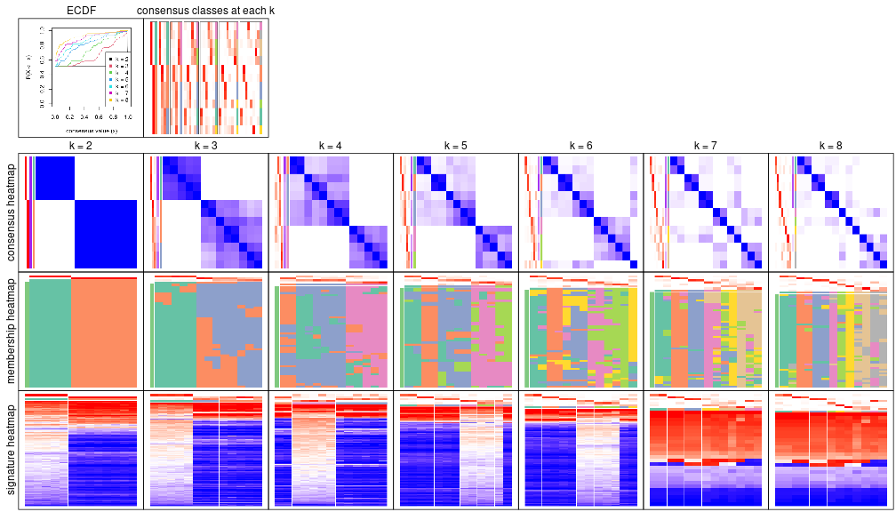

The plots are:

- The first row: a plot of the eCDF (empirical cumulative distribution
  function) curves of the consensus matrix for each `k` and the heatmap of
  predicted classes for each `k`.
- The second row: heatmaps of the consensus matrix for each `k`.
- The third row: heatmaps of the membership matrix for each `k`.
- The fouth row: heatmaps of the signatures for each `k`.

All the plots in panels can be made by individual functions and they are
plotted later in this section.

`select_partition_number()` produces several plots showing different
statistics for choosing "optimized" `k`. There are following statistics:

- eCDF curves of the consensus matrix for each `k`;
- 1-PAC. [The PAC score](https://en.wikipedia.org/wiki/Consensus_clustering#Over-interpretation_potential_of_consensus_clustering)
  measures the proportion of the ambiguous subgrouping.
- Mean silhouette score.
- Concordance. The mean probability of fiting the consensus subgroup labels in all
  partitions.
- Area increased. Denote $A_k$ as the area under the eCDF curve for current
  `k`, the area increased is defined as $A_k - A_{k-1}$.
- Rand index. The percent of pairs of samples that are both in a same cluster
  or both are not in a same cluster in the partition of k and k-1.
- Jaccard index. The ratio of pairs of samples are both in a same cluster in
  the partition of k and k-1 and the pairs of samples are both in a same
  cluster in the partition k or k-1.

The detailed explanations of these statistics can be found in [the _cola_
vignette](https://jokergoo.github.io/cola_vignettes/cola.html#toc_13).

Generally speaking, higher 1-PAC score, higher mean silhouette score or higher
concordance corresponds to better partition. Rand index and Jaccard index
measure how similar the current partition is compared to partition with `k-1`.
If they are too similar, we won't accept `k` is better than `k-1`.

```r
select_partition_number(res)
```

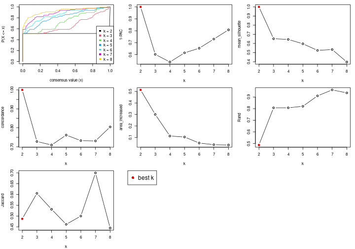

The numeric values for all these statistics can be obtained by `get_stats()`.

```r
get_stats(res)
```

```
#>   k 1-PAC mean_silhouette concordance area_increased  Rand Jaccard
#> 2 2 1.000           1.000       1.000         0.5133 0.487   0.487
#> 3 3 0.603           0.652       0.728         0.3001 0.808   0.605
#> 4 4 0.538           0.644       0.709         0.1127 0.808   0.531
#> 5 5 0.615           0.597       0.762         0.1040 0.821   0.462
#> 6 6 0.654           0.524       0.732         0.0517 0.910   0.500
#> 7 7 0.731           0.534       0.731         0.0371 0.962   0.700
#> 8 8 0.808           0.397       0.805         0.0344 0.936   0.444
```

`suggest_best_k()` suggests the best $k$ based on these statistics. The rules are as follows:

- All $k$ with Jaccard index larger than 0.95 are removed because increasing
  $k$ does not provide enough extra information. If all $k$ are removed, it is
  marked as no subgroup is detected.
- For all $k$ with 1-PAC score larger than 0.9, the maximal $k$ is taken as
  the best $k$, and other $k$ are marked as optional $k$.
- If it does not fit the second rule. The $k$ with the maximal vote of the
  highest 1-PAC score, highest mean silhouette, and highest concordance is
  taken as the best $k$.

```r
suggest_best_k(res)
```

```
#> [1] 2
```


Following is the table of the partitions (You need to click the **show/hide
code output** link to see it). The membership matrix (columns with name `p*`)
is inferred by
[`clue::cl_consensus()`](https://www.rdocumentation.org/link/cl_consensus?package=clue)
function with the `SE` method. Basically the value in the membership matrix
represents the probability to belong to a certain group. The finall subgroup
label for an item is determined with the group with highest probability it
belongs to.

In `get_classes()` function, the entropy is calculated from the membership
matrix and the silhouette score is calculated from the consensus matrix.


<script>
$( function() {
	$( '#tabs-node-033-get-classes' ).tabs();
} );
</script>
<div id='tabs-node-033-get-classes'>
<ul>
<li><a href='#tab-node-033-get-classes-1'>k = 2</a></li>
<li><a href='#tab-node-033-get-classes-2'>k = 3</a></li>
<li><a href='#tab-node-033-get-classes-3'>k = 4</a></li>
<li><a href='#tab-node-033-get-classes-4'>k = 5</a></li>
<li><a href='#tab-node-033-get-classes-5'>k = 6</a></li>
<li><a href='#tab-node-033-get-classes-6'>k = 7</a></li>
<li><a href='#tab-node-033-get-classes-7'>k = 8</a></li>
</ul>

<div id='tab-node-033-get-classes-1'>
<p><a id='tab-node-033-get-classes-1-a' style='color:#0366d6' href='#'>show/hide code output</a></p>
<pre><code class="r">cbind(get_classes(res, k = 2), get_membership(res, k = 2))
</code></pre>

<pre><code>#&gt;                 class entropy silhouette p1 p2
#&gt; TCGA.39.5037.11     2       0          1  0  1
#&gt; TCGA.39.5035.11     1       0          1  1  0
#&gt; TCGA.39.5028.11     2       0          1  0  1
#&gt; TCGA.39.5034.11     1       0          1  1  0
#&gt; TCGA.22.5485.11     1       0          1  1  0
#&gt; TCGA.33.4566.11     2       0          1  0  1
#&gt; TCGA.39.5016.11     2       0          1  0  1
#&gt; TCGA.22.5480.11     1       0          1  1  0
#&gt; TCGA.18.3417.11     2       0          1  0  1
#&gt; TCGA.56.8623.01     2       0          1  0  1
#&gt; TCGA.43.6771.11     2       0          1  0  1
#&gt; TCGA.39.5019.11     2       0          1  0  1
#&gt; TCGA.56.A4ZJ.01     1       0          1  1  0
</code></pre>

<script>
$('#tab-node-033-get-classes-1-a').parent().next().next().hide();
$('#tab-node-033-get-classes-1-a').click(function(){
  $('#tab-node-033-get-classes-1-a').parent().next().next().toggle();
  return(false);
});
</script>
</div>

<div id='tab-node-033-get-classes-2'>
<p><a id='tab-node-033-get-classes-2-a' style='color:#0366d6' href='#'>show/hide code output</a></p>
<pre><code class="r">cbind(get_classes(res, k = 3), get_membership(res, k = 3))
</code></pre>

<pre><code>#&gt;                 class entropy silhouette   p1   p2   p3
#&gt; TCGA.39.5037.11     3  0.5948      0.538 0.00 0.36 0.64
#&gt; TCGA.39.5035.11     1  0.2537      0.920 0.92 0.00 0.08
#&gt; TCGA.39.5028.11     2  0.6045      0.367 0.00 0.62 0.38
#&gt; TCGA.39.5034.11     1  0.3340      0.906 0.88 0.00 0.12
#&gt; TCGA.22.5485.11     1  0.2066      0.925 0.94 0.00 0.06
#&gt; TCGA.33.4566.11     2  0.0000      0.489 0.00 1.00 0.00
#&gt; TCGA.39.5016.11     2  0.1529      0.481 0.00 0.96 0.04
#&gt; TCGA.22.5480.11     1  0.2959      0.914 0.90 0.00 0.10
#&gt; TCGA.18.3417.11     3  0.5016      0.752 0.00 0.24 0.76
#&gt; TCGA.56.8623.01     2  0.6126      0.119 0.00 0.60 0.40
#&gt; TCGA.43.6771.11     3  0.5560      0.737 0.00 0.30 0.70
#&gt; TCGA.39.5019.11     2  0.5948      0.398 0.00 0.64 0.36
#&gt; TCGA.56.A4ZJ.01     1  0.0892      0.929 0.98 0.00 0.02
</code></pre>

<script>
$('#tab-node-033-get-classes-2-a').parent().next().next().hide();
$('#tab-node-033-get-classes-2-a').click(function(){
  $('#tab-node-033-get-classes-2-a').parent().next().next().toggle();
  return(false);
});
</script>
</div>

<div id='tab-node-033-get-classes-3'>
<p><a id='tab-node-033-get-classes-3-a' style='color:#0366d6' href='#'>show/hide code output</a></p>
<pre><code class="r">cbind(get_classes(res, k = 4), get_membership(res, k = 4))
</code></pre>

<pre><code>#&gt;                 class entropy silhouette   p1   p2   p3   p4
#&gt; TCGA.39.5037.11     3   0.353      0.496 0.10 0.04 0.86 0.00
#&gt; TCGA.39.5035.11     4   0.141      0.745 0.02 0.02 0.00 0.96
#&gt; TCGA.39.5028.11     3   0.566      0.460 0.08 0.22 0.70 0.00
#&gt; TCGA.39.5034.11     4   0.561      0.699 0.48 0.02 0.00 0.50
#&gt; TCGA.22.5485.11     4   0.361      0.765 0.06 0.08 0.00 0.86
#&gt; TCGA.33.4566.11     2   0.361      0.966 0.00 0.80 0.20 0.00
#&gt; TCGA.39.5016.11     2   0.340      0.966 0.00 0.82 0.18 0.00
#&gt; TCGA.22.5480.11     4   0.694      0.727 0.36 0.12 0.00 0.52
#&gt; TCGA.18.3417.11     3   0.553      0.411 0.42 0.02 0.56 0.00
#&gt; TCGA.56.8623.01     3   0.515      0.468 0.06 0.20 0.74 0.00
#&gt; TCGA.43.6771.11     3   0.630      0.435 0.42 0.06 0.52 0.00
#&gt; TCGA.39.5019.11     3   0.428      0.471 0.02 0.20 0.78 0.00
#&gt; TCGA.56.A4ZJ.01     4   0.361      0.764 0.08 0.06 0.00 0.86
</code></pre>

<script>
$('#tab-node-033-get-classes-3-a').parent().next().next().hide();
$('#tab-node-033-get-classes-3-a').click(function(){
  $('#tab-node-033-get-classes-3-a').parent().next().next().toggle();
  return(false);
});
</script>
</div>

<div id='tab-node-033-get-classes-4'>
<p><a id='tab-node-033-get-classes-4-a' style='color:#0366d6' href='#'>show/hide code output</a></p>
<pre><code class="r">cbind(get_classes(res, k = 5), get_membership(res, k = 5))
</code></pre>

<pre><code>#&gt;                 class entropy silhouette   p1   p2   p3   p4   p5
#&gt; TCGA.39.5037.11     3   0.730      0.225 0.22 0.04 0.46 0.00 0.28
#&gt; TCGA.39.5035.11     5   0.380      0.718 0.00 0.00 0.00 0.30 0.70
#&gt; TCGA.39.5028.11     3   0.444      0.595 0.10 0.14 0.76 0.00 0.00
#&gt; TCGA.39.5034.11     4   0.321      0.522 0.10 0.00 0.02 0.86 0.02
#&gt; TCGA.22.5485.11     5   0.480      0.683 0.00 0.00 0.02 0.44 0.54
#&gt; TCGA.33.4566.11     2   0.104      0.966 0.00 0.96 0.04 0.00 0.00
#&gt; TCGA.39.5016.11     2   0.122      0.966 0.02 0.96 0.02 0.00 0.00
#&gt; TCGA.22.5480.11     4   0.122      0.529 0.00 0.02 0.00 0.96 0.02
#&gt; TCGA.18.3417.11     1   0.388      0.805 0.82 0.02 0.12 0.00 0.04
#&gt; TCGA.56.8623.01     3   0.638      0.549 0.08 0.18 0.64 0.00 0.10
#&gt; TCGA.43.6771.11     1   0.410      0.799 0.76 0.04 0.20 0.00 0.00
#&gt; TCGA.39.5019.11     3   0.351      0.639 0.02 0.18 0.80 0.00 0.00
#&gt; TCGA.56.A4ZJ.01     4   0.509     -0.239 0.00 0.02 0.02 0.62 0.34
</code></pre>

<script>
$('#tab-node-033-get-classes-4-a').parent().next().next().hide();
$('#tab-node-033-get-classes-4-a').click(function(){
  $('#tab-node-033-get-classes-4-a').parent().next().next().toggle();
  return(false);
});
</script>
</div>

<div id='tab-node-033-get-classes-5'>
<p><a id='tab-node-033-get-classes-5-a' style='color:#0366d6' href='#'>show/hide code output</a></p>
<pre><code class="r">cbind(get_classes(res, k = 6), get_membership(res, k = 6))
</code></pre>

<pre><code>#&gt;                 class entropy silhouette   p1   p2   p3   p4   p5   p6
#&gt; TCGA.39.5037.11     6   0.717     0.0000 0.20 0.00 0.32 0.10 0.00 0.38
#&gt; TCGA.39.5035.11     5   0.279     0.5104 0.00 0.00 0.00 0.00 0.80 0.20
#&gt; TCGA.39.5028.11     3   0.354     0.5516 0.02 0.08 0.84 0.02 0.00 0.04
#&gt; TCGA.39.5034.11     4   0.279     0.6572 0.00 0.00 0.00 0.80 0.20 0.00
#&gt; TCGA.22.5485.11     5   0.247     0.4657 0.00 0.00 0.00 0.08 0.88 0.04
#&gt; TCGA.33.4566.11     2   0.209     0.9627 0.00 0.90 0.08 0.02 0.00 0.00
#&gt; TCGA.39.5016.11     2   0.209     0.9627 0.00 0.90 0.08 0.00 0.00 0.02
#&gt; TCGA.22.5480.11     4   0.567     0.6374 0.02 0.04 0.00 0.58 0.32 0.04
#&gt; TCGA.18.3417.11     1   0.148     0.6487 0.94 0.02 0.04 0.00 0.00 0.00
#&gt; TCGA.56.8623.01     3   0.497     0.0126 0.04 0.02 0.58 0.00 0.00 0.36
#&gt; TCGA.43.6771.11     1   0.548     0.6612 0.70 0.02 0.12 0.06 0.00 0.10
#&gt; TCGA.39.5019.11     3   0.219     0.5278 0.04 0.06 0.90 0.00 0.00 0.00
#&gt; TCGA.56.A4ZJ.01     5   0.663     0.2189 0.02 0.04 0.02 0.22 0.58 0.12
</code></pre>

<script>
$('#tab-node-033-get-classes-5-a').parent().next().next().hide();
$('#tab-node-033-get-classes-5-a').click(function(){
  $('#tab-node-033-get-classes-5-a').parent().next().next().toggle();
  return(false);
});
</script>
</div>

<div id='tab-node-033-get-classes-6'>
<p><a id='tab-node-033-get-classes-6-a' style='color:#0366d6' href='#'>show/hide code output</a></p>
<pre><code class="r">cbind(get_classes(res, k = 7), get_membership(res, k = 7))
</code></pre>

<pre><code>#&gt;                 class entropy silhouette   p1   p2   p3   p4   p5   p6   p7
#&gt; TCGA.39.5037.11     6  0.7275     0.1732 0.16 0.00 0.08 0.12 0.18 0.46 0.00
#&gt; TCGA.39.5035.11     7  0.5417     0.4091 0.00 0.00 0.02 0.00 0.24 0.18 0.56
#&gt; TCGA.39.5028.11     3  0.0863     0.9357 0.00 0.04 0.96 0.00 0.00 0.00 0.00
#&gt; TCGA.39.5034.11     4  0.1886     0.5017 0.00 0.00 0.00 0.88 0.00 0.00 0.12
#&gt; TCGA.22.5485.11     7  0.0504     0.3296 0.00 0.00 0.00 0.02 0.00 0.00 0.98
#&gt; TCGA.33.4566.11     2  0.0000     0.8634 0.00 1.00 0.00 0.00 0.00 0.00 0.00
#&gt; TCGA.39.5016.11     2  0.2259     0.8634 0.00 0.84 0.00 0.00 0.16 0.00 0.00
#&gt; TCGA.22.5480.11     4  0.5625     0.4448 0.04 0.00 0.02 0.48 0.06 0.00 0.40
#&gt; TCGA.18.3417.11     1  0.1433     0.6806 0.92 0.00 0.08 0.00 0.00 0.00 0.00
#&gt; TCGA.56.8623.01     6  0.5166    -0.0673 0.04 0.06 0.38 0.00 0.00 0.52 0.00
#&gt; TCGA.43.6771.11     1  0.4937     0.6699 0.68 0.00 0.14 0.00 0.06 0.12 0.00
#&gt; TCGA.39.5019.11     3  0.1860     0.9353 0.02 0.04 0.92 0.02 0.00 0.00 0.00
#&gt; TCGA.56.A4ZJ.01     7  0.5332     0.1970 0.00 0.00 0.00 0.18 0.38 0.00 0.44
</code></pre>

<script>
$('#tab-node-033-get-classes-6-a').parent().next().next().hide();
$('#tab-node-033-get-classes-6-a').click(function(){
  $('#tab-node-033-get-classes-6-a').parent().next().next().toggle();
  return(false);
});
</script>
</div>

<div id='tab-node-033-get-classes-7'>
<p><a id='tab-node-033-get-classes-7-a' style='color:#0366d6' href='#'>show/hide code output</a></p>
<pre><code class="r">cbind(get_classes(res, k = 8), get_membership(res, k = 8))
</code></pre>

<pre><code>#&gt;                 class entropy silhouette   p1   p2   p3   p4   p5   p6   p7   p8
#&gt; TCGA.39.5037.11     6  0.0471    0.00000 0.00 0.00 0.02 0.00 0.00 0.98 0.00 0.00
#&gt; TCGA.39.5035.11     7  0.0000    0.20379 0.00 0.00 0.00 0.00 0.00 0.00 1.00 0.00
#&gt; TCGA.39.5028.11     3  0.0941    0.84997 0.02 0.00 0.96 0.00 0.00 0.00 0.00 0.02
#&gt; TCGA.39.5034.11     4  0.0808    0.00000 0.00 0.00 0.00 0.96 0.00 0.00 0.04 0.00
#&gt; TCGA.22.5485.11     8  0.5203    0.00555 0.02 0.00 0.00 0.02 0.04 0.02 0.44 0.46
#&gt; TCGA.33.4566.11     2  0.0000    0.86215 0.00 1.00 0.00 0.00 0.00 0.00 0.00 0.00
#&gt; TCGA.39.5016.11     2  0.3048    0.86215 0.02 0.84 0.00 0.02 0.04 0.00 0.00 0.08
#&gt; TCGA.22.5480.11     8  0.3862   -0.01866 0.00 0.00 0.00 0.36 0.00 0.00 0.04 0.60
#&gt; TCGA.18.3417.11     1  0.2348    0.68209 0.88 0.02 0.04 0.00 0.00 0.06 0.00 0.00
#&gt; TCGA.56.8623.01     5  0.4097    0.00000 0.00 0.02 0.20 0.00 0.70 0.08 0.00 0.00
#&gt; TCGA.43.6771.11     1  0.5239    0.66797 0.64 0.02 0.08 0.00 0.16 0.00 0.00 0.10
#&gt; TCGA.39.5019.11     3  0.1741    0.84671 0.02 0.00 0.92 0.02 0.00 0.04 0.00 0.00
#&gt; TCGA.56.A4ZJ.01     7  0.6886    0.20170 0.06 0.00 0.00 0.10 0.18 0.00 0.38 0.28
</code></pre>

<script>
$('#tab-node-033-get-classes-7-a').parent().next().next().hide();
$('#tab-node-033-get-classes-7-a').click(function(){
  $('#tab-node-033-get-classes-7-a').parent().next().next().toggle();
  return(false);
});
</script>
</div>
</div>

Heatmaps for the consensus matrix. It visualizes the probability of two
samples to be in a same group.


<script>
$( function() {
	$( '#tabs-node-033-consensus-heatmap' ).tabs();
} );
</script>
<div id='tabs-node-033-consensus-heatmap'>
<ul>
<li><a href='#tab-node-033-consensus-heatmap-1'>k = 2</a></li>
<li><a href='#tab-node-033-consensus-heatmap-2'>k = 3</a></li>
<li><a href='#tab-node-033-consensus-heatmap-3'>k = 4</a></li>
<li><a href='#tab-node-033-consensus-heatmap-4'>k = 5</a></li>
<li><a href='#tab-node-033-consensus-heatmap-5'>k = 6</a></li>
<li><a href='#tab-node-033-consensus-heatmap-6'>k = 7</a></li>
<li><a href='#tab-node-033-consensus-heatmap-7'>k = 8</a></li>
</ul>
<div id='tab-node-033-consensus-heatmap-1'>
<pre><code class="r">consensus_heatmap(res, k = 2)
</code></pre>

<p>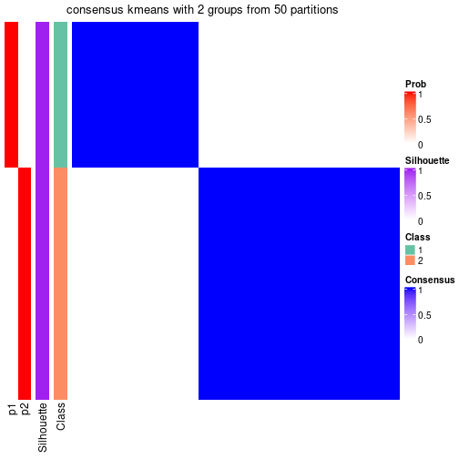</p>

</div>
<div id='tab-node-033-consensus-heatmap-2'>
<pre><code class="r">consensus_heatmap(res, k = 3)
</code></pre>

<p>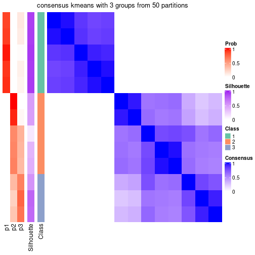</p>

</div>
<div id='tab-node-033-consensus-heatmap-3'>
<pre><code class="r">consensus_heatmap(res, k = 4)
</code></pre>

<p>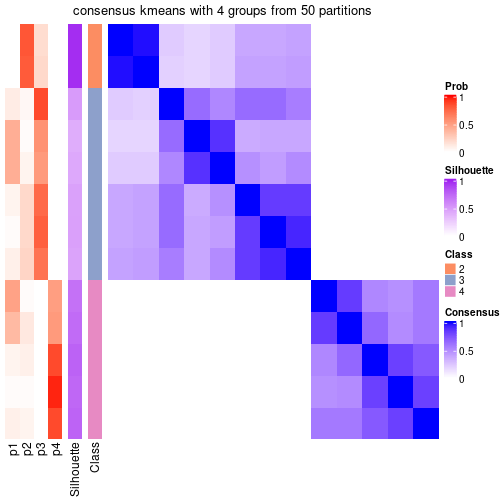</p>

</div>
<div id='tab-node-033-consensus-heatmap-4'>
<pre><code class="r">consensus_heatmap(res, k = 5)
</code></pre>

<p>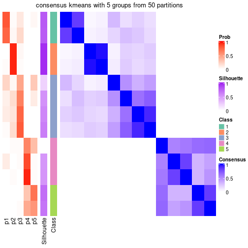</p>

</div>
<div id='tab-node-033-consensus-heatmap-5'>
<pre><code class="r">consensus_heatmap(res, k = 6)
</code></pre>

<p>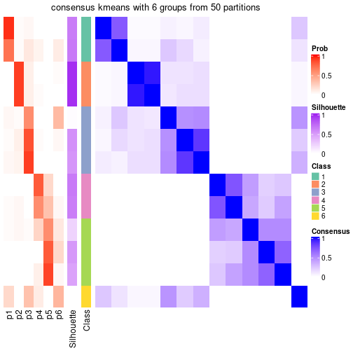</p>

</div>
<div id='tab-node-033-consensus-heatmap-6'>
<pre><code class="r">consensus_heatmap(res, k = 7)
</code></pre>

<p>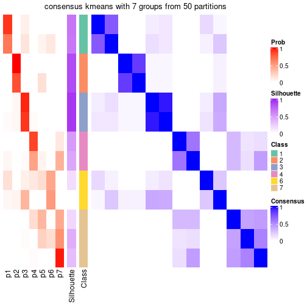</p>

</div>
<div id='tab-node-033-consensus-heatmap-7'>
<pre><code class="r">consensus_heatmap(res, k = 8)
</code></pre>

<p>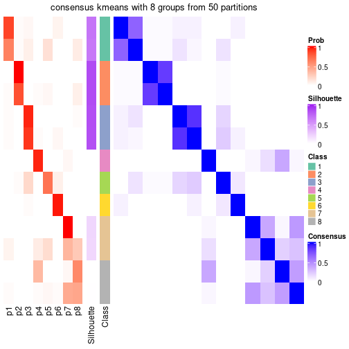</p>

</div>
</div>

Heatmaps for the membership of samples in all partitions to see how consistent they are:


<script>
$( function() {
	$( '#tabs-node-033-membership-heatmap' ).tabs();
} );
</script>
<div id='tabs-node-033-membership-heatmap'>
<ul>
<li><a href='#tab-node-033-membership-heatmap-1'>k = 2</a></li>
<li><a href='#tab-node-033-membership-heatmap-2'>k = 3</a></li>
<li><a href='#tab-node-033-membership-heatmap-3'>k = 4</a></li>
<li><a href='#tab-node-033-membership-heatmap-4'>k = 5</a></li>
<li><a href='#tab-node-033-membership-heatmap-5'>k = 6</a></li>
<li><a href='#tab-node-033-membership-heatmap-6'>k = 7</a></li>
<li><a href='#tab-node-033-membership-heatmap-7'>k = 8</a></li>
</ul>
<div id='tab-node-033-membership-heatmap-1'>
<pre><code class="r">membership_heatmap(res, k = 2)
</code></pre>

<p></p>

</div>
<div id='tab-node-033-membership-heatmap-2'>
<pre><code class="r">membership_heatmap(res, k = 3)
</code></pre>

<p>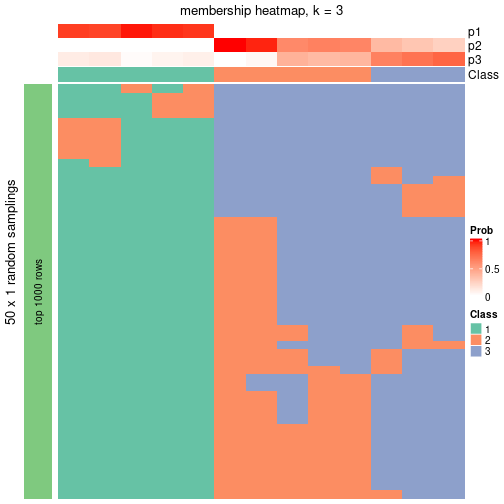</p>

</div>
<div id='tab-node-033-membership-heatmap-3'>
<pre><code class="r">membership_heatmap(res, k = 4)
</code></pre>

<p>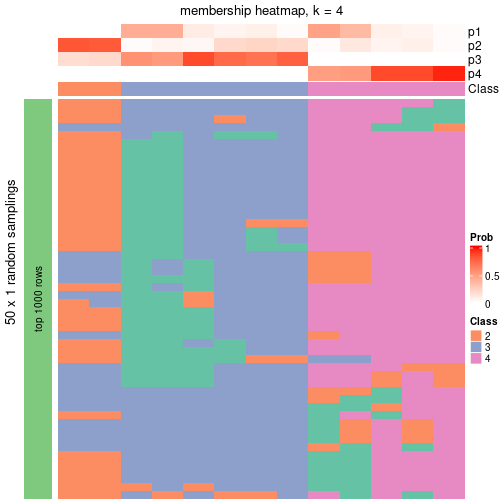</p>

</div>
<div id='tab-node-033-membership-heatmap-4'>
<pre><code class="r">membership_heatmap(res, k = 5)
</code></pre>

<p>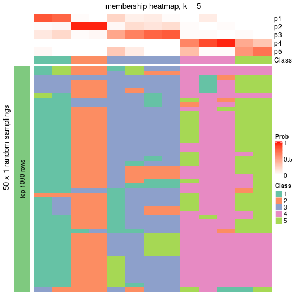</p>

</div>
<div id='tab-node-033-membership-heatmap-5'>
<pre><code class="r">membership_heatmap(res, k = 6)
</code></pre>

<p>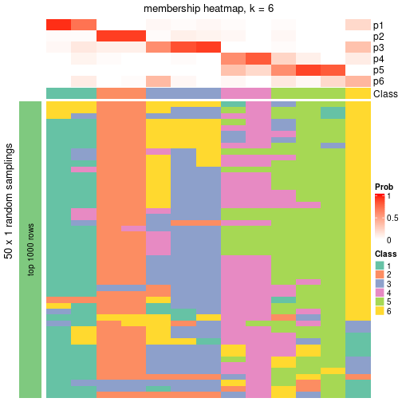</p>

</div>
<div id='tab-node-033-membership-heatmap-6'>
<pre><code class="r">membership_heatmap(res, k = 7)
</code></pre>

<p>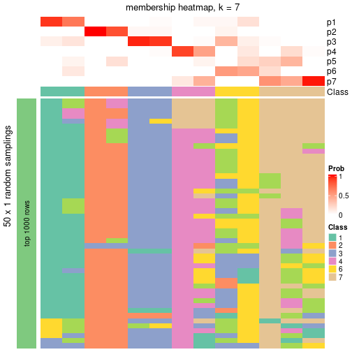</p>

</div>
<div id='tab-node-033-membership-heatmap-7'>
<pre><code class="r">membership_heatmap(res, k = 8)
</code></pre>

<p>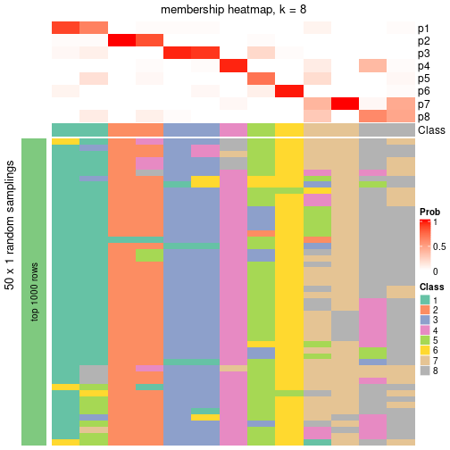</p>

</div>
</div>

As soon as the classes for columns are determined, the signatures
that are significantly different between subgroups can be looked for. 
Following are the heatmaps for signatures.


<script>
$( function() {
	$( '#tabs-node-033-get-signatures' ).tabs();
} );
</script>
<div id='tabs-node-033-get-signatures'>
<ul>
<li><a href='#tab-node-033-get-signatures-1'>k = 2</a></li>
<li><a href='#tab-node-033-get-signatures-2'>k = 3</a></li>
<li><a href='#tab-node-033-get-signatures-3'>k = 4</a></li>
<li><a href='#tab-node-033-get-signatures-4'>k = 5</a></li>
<li><a href='#tab-node-033-get-signatures-5'>k = 6</a></li>
<li><a href='#tab-node-033-get-signatures-6'>k = 7</a></li>
<li><a href='#tab-node-033-get-signatures-7'>k = 8</a></li>
</ul>
<div id='tab-node-033-get-signatures-1'>
<pre><code class="r">get_signatures(res, k = 2)
</code></pre>

<p>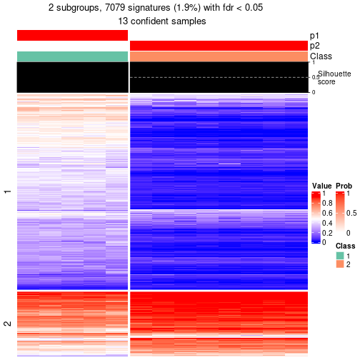</p>

</div>
<div id='tab-node-033-get-signatures-2'>
<pre><code class="r">get_signatures(res, k = 3)
</code></pre>

<p>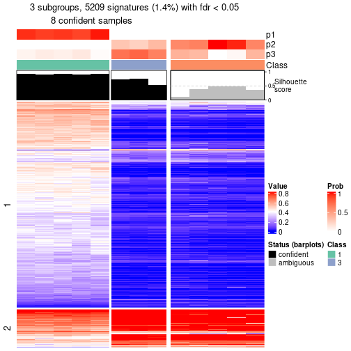</p>

</div>
<div id='tab-node-033-get-signatures-3'>
<pre><code class="r">get_signatures(res, k = 4)
</code></pre>

<p>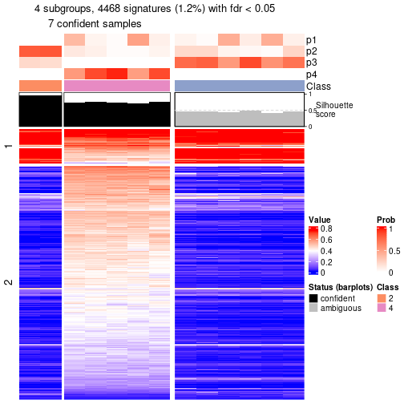</p>

</div>
<div id='tab-node-033-get-signatures-4'>
<pre><code class="r">get_signatures(res, k = 5)
</code></pre>

<p>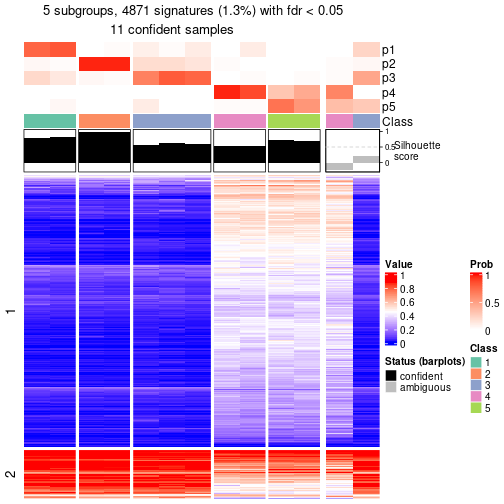</p>

</div>
<div id='tab-node-033-get-signatures-5'>
<pre><code class="r">get_signatures(res, k = 6)
</code></pre>

<p>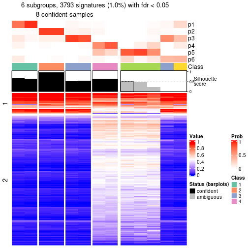</p>

</div>
<div id='tab-node-033-get-signatures-6'>
<pre><code class="r">get_signatures(res, k = 7)
</code></pre>

<p>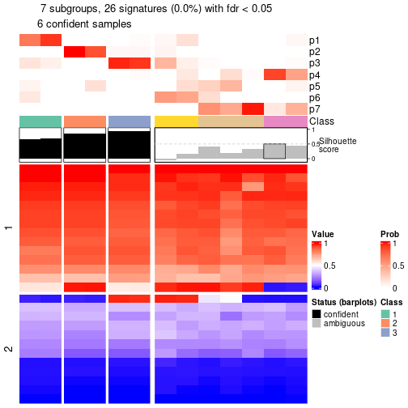</p>

</div>
<div id='tab-node-033-get-signatures-7'>
<pre><code class="r">get_signatures(res, k = 8)
</code></pre>

<p>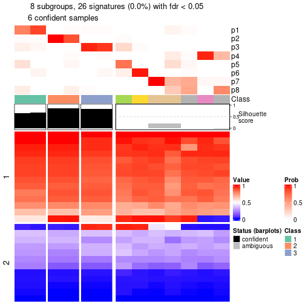</p>

</div>
</div>


Compare the overlap of signatures from different k:

```r
compare_signatures(res)
```

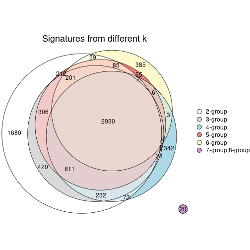

`get_signature()` returns a data frame invisibly. To get the list of signatures, the function
call should be assigned to a variable explicitly. In following code, if `plot` argument is set
to `FALSE`, no heatmap is plotted while only the differential analysis is performed.

```r
# code only for demonstration
tb = get_signature(res, k = ..., plot = FALSE)
```

An example of the output of `tb` is:

```
#>   which_row         fdr    mean_1    mean_2 scaled_mean_1 scaled_mean_2 km
#> 1        38 0.042760348  8.373488  9.131774    -0.5533452     0.5164555  1
#> 2        40 0.018707592  7.106213  8.469186    -0.6173731     0.5762149  1
#> 3        55 0.019134737 10.221463 11.207825    -0.6159697     0.5749050  1
#> 4        59 0.006059896  5.921854  7.869574    -0.6899429     0.6439467  1
#> 5        60 0.018055526  8.928898 10.211722    -0.6204761     0.5791110  1
#> 6        98 0.009384629 15.714769 14.887706     0.6635654    -0.6193277  2
...
```

The columns in `tb` are:

1. `which_row`: row indices corresponding to the input matrix.
2. `fdr`: FDR for the differential test. 
3. `mean_x`: The mean value in group x.
4. `scaled_mean_x`: The mean value in group x after rows are scaled.
5. `km`: Row groups if k-means clustering is applied to rows (which is done by automatically selecting number of clusters).

If there are too many signatures, `top_signatures = ...` can be set to only show the 
signatures with the highest FDRs:

```r
# code only for demonstration
# e.g. to show the top 500 most significant rows
tb = get_signature(res, k = ..., top_signatures = 500)
```

If the signatures are defined as these which are uniquely high in current group, `diff_method` argument
can be set to `"uniquely_high_in_one_group"`:

```r
# code only for demonstration
tb = get_signature(res, k = ..., diff_method = "uniquely_high_in_one_group")
```


UMAP plot which shows how samples are separated.


<script>
$( function() {
	$( '#tabs-node-033-dimension-reduction' ).tabs();
} );
</script>
<div id='tabs-node-033-dimension-reduction'>
<ul>
<li><a href='#tab-node-033-dimension-reduction-1'>k = 2</a></li>
<li><a href='#tab-node-033-dimension-reduction-2'>k = 3</a></li>
<li><a href='#tab-node-033-dimension-reduction-3'>k = 4</a></li>
<li><a href='#tab-node-033-dimension-reduction-4'>k = 5</a></li>
<li><a href='#tab-node-033-dimension-reduction-5'>k = 6</a></li>
<li><a href='#tab-node-033-dimension-reduction-6'>k = 7</a></li>
<li><a href='#tab-node-033-dimension-reduction-7'>k = 8</a></li>
</ul>
<div id='tab-node-033-dimension-reduction-1'>
<pre><code class="r">dimension_reduction(res, k = 2, method = &quot;UMAP&quot;)
</code></pre>

<p>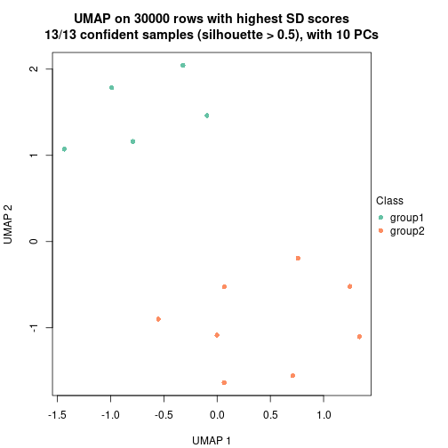</p>

</div>
<div id='tab-node-033-dimension-reduction-2'>
<pre><code class="r">dimension_reduction(res, k = 3, method = &quot;UMAP&quot;)
</code></pre>

<p>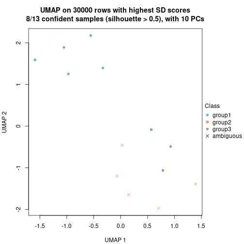</p>

</div>
<div id='tab-node-033-dimension-reduction-3'>
<pre><code class="r">dimension_reduction(res, k = 4, method = &quot;UMAP&quot;)
</code></pre>

<p>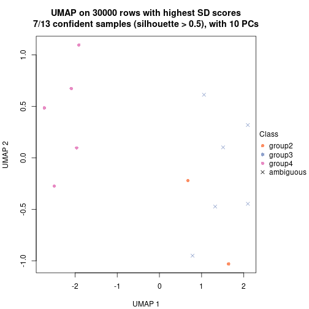</p>

</div>
<div id='tab-node-033-dimension-reduction-4'>
<pre><code class="r">dimension_reduction(res, k = 5, method = &quot;UMAP&quot;)
</code></pre>

<p>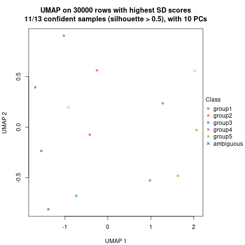</p>

</div>
<div id='tab-node-033-dimension-reduction-5'>
<pre><code class="r">dimension_reduction(res, k = 6, method = &quot;UMAP&quot;)
</code></pre>

<p>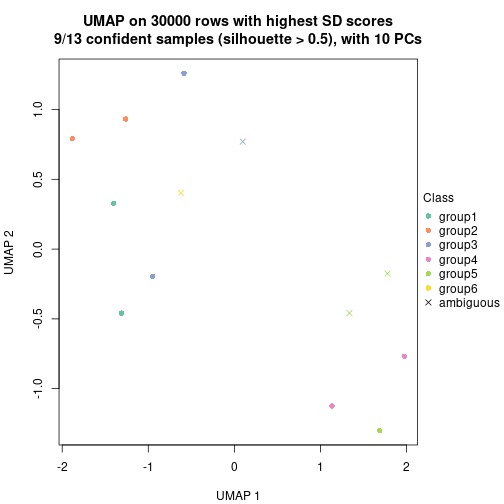</p>

</div>
<div id='tab-node-033-dimension-reduction-6'>
<pre><code class="r">dimension_reduction(res, k = 7, method = &quot;UMAP&quot;)
</code></pre>

<p>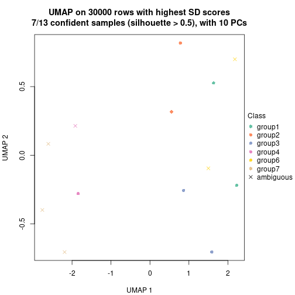</p>

</div>
<div id='tab-node-033-dimension-reduction-7'>
<pre><code class="r">dimension_reduction(res, k = 8, method = &quot;UMAP&quot;)
</code></pre>

<p>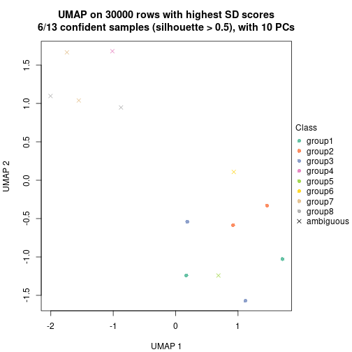</p>

</div>
</div>


Following heatmap shows how subgroups are split when increasing `k`:

```r
collect_classes(res)
```

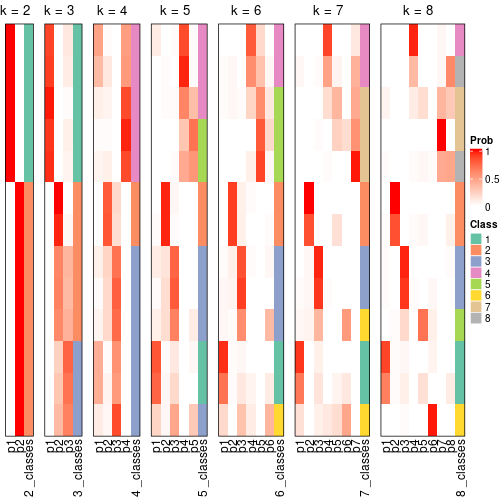


If matrix rows can be associated to genes, consider to use `functional_enrichment(res,
...)` to perform function enrichment for the signature genes. See [this vignette](https://jokergoo.github.io/cola_vignettes/functional_enrichment.html) for more detailed explanations.


 

---------------------------------------------------


### Node034


Parent node: [Node03](#Node03).
Child nodes: 
                Node0111-leaf
        ,
                Node0112-leaf
        ,
                Node0113-leaf
        ,
                Node0121-leaf
        ,
                Node0122-leaf
        ,
                Node0123-leaf
        ,
                Node0124-leaf
        ,
                Node0311-leaf
        ,
                Node0312-leaf
        ,
                Node0331-leaf
        ,
                Node0332-leaf
        ,
                Node0341-leaf
        ,
                Node0342-leaf
        ,
                Node0411-leaf
        ,
                [Node0412](#Node0412)
        ,
                Node0413-leaf
        ,
                Node0421-leaf
        ,
                Node0422-leaf
        ,
                Node0423-leaf
        ,
                Node0431-leaf
        ,
                [Node0432](#Node0432)
        ,
                Node0433-leaf
        ,
                Node0511-leaf
        ,
                Node0512-leaf
        ,
                Node0513-leaf
        ,
                [Node0521](#Node0521)
        ,
                Node0522-leaf
        ,
                Node0531-leaf
        ,
                Node0532-leaf
        ,
                Node0533-leaf
        .


The object with results only for a single top-value method and a single partitioning method 
can be extracted as:

```r
res = res_rh["034"]
```

A summary of `res` and all the functions that can be applied to it:

```r
res
```

```
#> A 'ConsensusPartition' object with k = 2, 3, 4, 5, 6, 7, 8.
#>   On a matrix with 30000 rows and 16 columns.
#>   Top rows (1000) are extracted by 'ATC' method.
#>   Subgroups are detected by 'kmeans' method.
#>   Performed in total 350 partitions by row resampling.
#>   Best k for subgroups seems to be 2.
#> 
#> Following methods can be applied to this 'ConsensusPartition' object:
#>  [1] "cola_report"             "collect_classes"         "collect_plots"          
#>  [4] "collect_stats"           "colnames"                "compare_partitions"     
#>  [7] "compare_signatures"      "consensus_heatmap"       "dimension_reduction"    
#> [10] "functional_enrichment"   "get_anno_col"            "get_anno"               
#> [13] "get_classes"             "get_consensus"           "get_matrix"             
#> [16] "get_membership"          "get_param"               "get_signatures"         
#> [19] "get_stats"               "is_best_k"               "is_stable_k"            
#> [22] "membership_heatmap"      "ncol"                    "nrow"                   
#> [25] "plot_ecdf"               "predict_classes"         "rownames"               
#> [28] "select_partition_number" "show"                    "suggest_best_k"         
#> [31] "test_to_known_factors"   "top_rows_heatmap"
```

`collect_plots()` function collects all the plots made from `res` for all `k` (number of subgroups)
into one single page to provide an easy and fast comparison between different `k`.

```r
collect_plots(res)
```

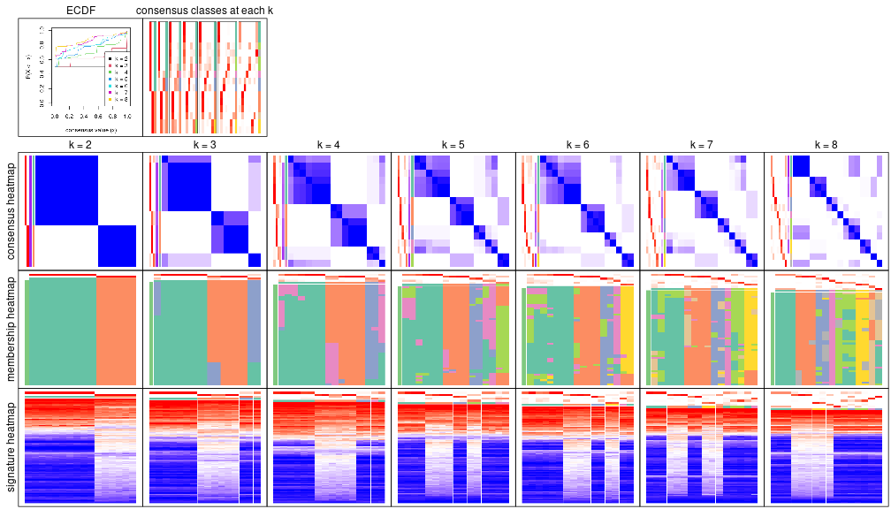

The plots are:

- The first row: a plot of the eCDF (empirical cumulative distribution
  function) curves of the consensus matrix for each `k` and the heatmap of
  predicted classes for each `k`.
- The second row: heatmaps of the consensus matrix for each `k`.
- The third row: heatmaps of the membership matrix for each `k`.
- The fouth row: heatmaps of the signatures for each `k`.

All the plots in panels can be made by individual functions and they are
plotted later in this section.

`select_partition_number()` produces several plots showing different
statistics for choosing "optimized" `k`. There are following statistics:

- eCDF curves of the consensus matrix for each `k`;
- 1-PAC. [The PAC score](https://en.wikipedia.org/wiki/Consensus_clustering#Over-interpretation_potential_of_consensus_clustering)
  measures the proportion of the ambiguous subgrouping.
- Mean silhouette score.
- Concordance. The mean probability of fiting the consensus subgroup labels in all
  partitions.
- Area increased. Denote $A_k$ as the area under the eCDF curve for current
  `k`, the area increased is defined as $A_k - A_{k-1}$.
- Rand index. The percent of pairs of samples that are both in a same cluster
  or both are not in a same cluster in the partition of k and k-1.
- Jaccard index. The ratio of pairs of samples are both in a same cluster in
  the partition of k and k-1 and the pairs of samples are both in a same
  cluster in the partition k or k-1.

The detailed explanations of these statistics can be found in [the _cola_
vignette](https://jokergoo.github.io/cola_vignettes/cola.html#toc_13).

Generally speaking, higher 1-PAC score, higher mean silhouette score or higher
concordance corresponds to better partition. Rand index and Jaccard index
measure how similar the current partition is compared to partition with `k-1`.
If they are too similar, we won't accept `k` is better than `k-1`.

```r
select_partition_number(res)
```

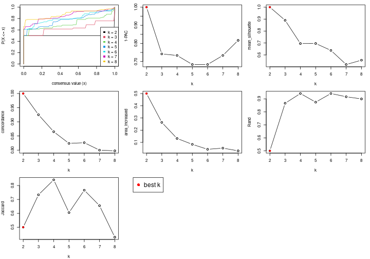

The numeric values for all these statistics can be obtained by `get_stats()`.

```r
get_stats(res)
```

```
#>   k 1-PAC mean_silhouette concordance area_increased  Rand Jaccard
#> 2 2 1.000           1.000       1.000         0.5005 0.500   0.500
#> 3 3 0.742           0.890       0.925         0.2635 0.867   0.733
#> 4 4 0.733           0.696       0.865         0.1319 0.942   0.841
#> 5 5 0.683           0.696       0.824         0.0836 0.875   0.605
#> 6 6 0.683           0.638       0.826         0.0431 0.942   0.767
#> 7 7 0.733           0.520       0.800         0.0528 0.917   0.655
#> 8 8 0.817           0.556       0.797         0.0305 0.900   0.429
```

`suggest_best_k()` suggests the best $k$ based on these statistics. The rules are as follows:

- All $k$ with Jaccard index larger than 0.95 are removed because increasing
  $k$ does not provide enough extra information. If all $k$ are removed, it is
  marked as no subgroup is detected.
- For all $k$ with 1-PAC score larger than 0.9, the maximal $k$ is taken as
  the best $k$, and other $k$ are marked as optional $k$.
- If it does not fit the second rule. The $k$ with the maximal vote of the
  highest 1-PAC score, highest mean silhouette, and highest concordance is
  taken as the best $k$.

```r
suggest_best_k(res)
```

```
#> [1] 2
```


Following is the table of the partitions (You need to click the **show/hide
code output** link to see it). The membership matrix (columns with name `p*`)
is inferred by
[`clue::cl_consensus()`](https://www.rdocumentation.org/link/cl_consensus?package=clue)
function with the `SE` method. Basically the value in the membership matrix
represents the probability to belong to a certain group. The finall subgroup
label for an item is determined with the group with highest probability it
belongs to.

In `get_classes()` function, the entropy is calculated from the membership
matrix and the silhouette score is calculated from the consensus matrix.


<script>
$( function() {
	$( '#tabs-node-034-get-classes' ).tabs();
} );
</script>
<div id='tabs-node-034-get-classes'>
<ul>
<li><a href='#tab-node-034-get-classes-1'>k = 2</a></li>
<li><a href='#tab-node-034-get-classes-2'>k = 3</a></li>
<li><a href='#tab-node-034-get-classes-3'>k = 4</a></li>
<li><a href='#tab-node-034-get-classes-4'>k = 5</a></li>
<li><a href='#tab-node-034-get-classes-5'>k = 6</a></li>
<li><a href='#tab-node-034-get-classes-6'>k = 7</a></li>
<li><a href='#tab-node-034-get-classes-7'>k = 8</a></li>
</ul>

<div id='tab-node-034-get-classes-1'>
<p><a id='tab-node-034-get-classes-1-a' style='color:#0366d6' href='#'>show/hide code output</a></p>
<pre><code class="r">cbind(get_classes(res, k = 2), get_membership(res, k = 2))
</code></pre>

<pre><code>#&gt;                 class entropy silhouette p1 p2
#&gt; TCGA.33.4586.11     1       0          1  1  0
#&gt; TCGA.18.4721.11     1       0          1  1  0
#&gt; TCGA.22.4613.11     2       0          1  0  1
#&gt; TCGA.33.4583.11     1       0          1  1  0
#&gt; TCGA.39.5021.11     1       0          1  1  0
#&gt; TCGA.39.5031.11     2       0          1  0  1
#&gt; TCGA.39.5030.11     2       0          1  0  1
#&gt; TCGA.33.4589.11     2       0          1  0  1
#&gt; TCGA.22.4599.11     2       0          1  0  1
#&gt; TCGA.22.5473.11     1       0          1  1  0
#&gt; TCGA.43.5668.11     1       0          1  1  0
#&gt; TCGA.22.5477.11     1       0          1  1  0
#&gt; TCGA.22.4601.11     2       0          1  0  1
#&gt; TCGA.39.5036.11     1       0          1  1  0
#&gt; TCGA.22.5478.11     1       0          1  1  0
#&gt; TCGA.39.5039.11     1       0          1  1  0
</code></pre>

<script>
$('#tab-node-034-get-classes-1-a').parent().next().next().hide();
$('#tab-node-034-get-classes-1-a').click(function(){
  $('#tab-node-034-get-classes-1-a').parent().next().next().toggle();
  return(false);
});
</script>
</div>

<div id='tab-node-034-get-classes-2'>
<p><a id='tab-node-034-get-classes-2-a' style='color:#0366d6' href='#'>show/hide code output</a></p>
<pre><code class="r">cbind(get_classes(res, k = 3), get_membership(res, k = 3))
</code></pre>

<pre><code>#&gt;                 class entropy silhouette   p1   p2   p3
#&gt; TCGA.33.4586.11     1   0.000      0.938 1.00 0.00 0.00
#&gt; TCGA.18.4721.11     1   0.000      0.938 1.00 0.00 0.00
#&gt; TCGA.22.4613.11     2   0.000      0.923 0.00 1.00 0.00
#&gt; TCGA.33.4583.11     3   0.480      1.000 0.22 0.00 0.78
#&gt; TCGA.39.5021.11     1   0.000      0.938 1.00 0.00 0.00
#&gt; TCGA.39.5031.11     2   0.000      0.923 0.00 1.00 0.00
#&gt; TCGA.39.5030.11     2   0.000      0.923 0.00 1.00 0.00
#&gt; TCGA.33.4589.11     2   0.480      0.838 0.00 0.78 0.22
#&gt; TCGA.22.4599.11     2   0.480      0.838 0.00 0.78 0.22
#&gt; TCGA.22.5473.11     1   0.000      0.938 1.00 0.00 0.00
#&gt; TCGA.43.5668.11     1   0.000      0.938 1.00 0.00 0.00
#&gt; TCGA.22.5477.11     1   0.000      0.938 1.00 0.00 0.00
#&gt; TCGA.22.4601.11     2   0.000      0.923 0.00 1.00 0.00
#&gt; TCGA.39.5036.11     1   0.571      0.304 0.68 0.00 0.32
#&gt; TCGA.22.5478.11     1   0.000      0.938 1.00 0.00 0.00
#&gt; TCGA.39.5039.11     3   0.480      1.000 0.22 0.00 0.78
</code></pre>

<script>
$('#tab-node-034-get-classes-2-a').parent().next().next().hide();
$('#tab-node-034-get-classes-2-a').click(function(){
  $('#tab-node-034-get-classes-2-a').parent().next().next().toggle();
  return(false);
});
</script>
</div>

<div id='tab-node-034-get-classes-3'>
<p><a id='tab-node-034-get-classes-3-a' style='color:#0366d6' href='#'>show/hide code output</a></p>
<pre><code class="r">cbind(get_classes(res, k = 4), get_membership(res, k = 4))
</code></pre>

<pre><code>#&gt;                 class entropy silhouette   p1   p2   p3   p4
#&gt; TCGA.33.4586.11     1   0.234      0.771 0.90 0.00 0.00 0.10
#&gt; TCGA.18.4721.11     1   0.304      0.754 0.88 0.00 0.02 0.10
#&gt; TCGA.22.4613.11     2   0.000      0.837 0.00 1.00 0.00 0.00
#&gt; TCGA.33.4583.11     3   0.621      0.952 0.06 0.00 0.56 0.38
#&gt; TCGA.39.5021.11     1   0.615     -0.194 0.58 0.00 0.06 0.36
#&gt; TCGA.39.5031.11     2   0.121      0.828 0.00 0.96 0.00 0.04
#&gt; TCGA.39.5030.11     2   0.000      0.837 0.00 1.00 0.00 0.00
#&gt; TCGA.33.4589.11     2   0.549      0.651 0.00 0.58 0.40 0.02
#&gt; TCGA.22.4599.11     2   0.491      0.651 0.00 0.58 0.42 0.00
#&gt; TCGA.22.5473.11     1   0.121      0.790 0.96 0.00 0.00 0.04
#&gt; TCGA.43.5668.11     1   0.000      0.821 1.00 0.00 0.00 0.00
#&gt; TCGA.22.5477.11     1   0.000      0.821 1.00 0.00 0.00 0.00
#&gt; TCGA.22.4601.11     2   0.000      0.837 0.00 1.00 0.00 0.00
#&gt; TCGA.39.5036.11     4   0.452      0.000 0.32 0.00 0.00 0.68
#&gt; TCGA.22.5478.11     1   0.000      0.821 1.00 0.00 0.00 0.00
#&gt; TCGA.39.5039.11     3   0.630      0.952 0.06 0.00 0.52 0.42
</code></pre>

<script>
$('#tab-node-034-get-classes-3-a').parent().next().next().hide();
$('#tab-node-034-get-classes-3-a').click(function(){
  $('#tab-node-034-get-classes-3-a').parent().next().next().toggle();
  return(false);
});
</script>
</div>

<div id='tab-node-034-get-classes-4'>
<p><a id='tab-node-034-get-classes-4-a' style='color:#0366d6' href='#'>show/hide code output</a></p>
<pre><code class="r">cbind(get_classes(res, k = 5), get_membership(res, k = 5))
</code></pre>

<pre><code>#&gt;                 class entropy silhouette   p1   p2   p3   p4   p5
#&gt; TCGA.33.4586.11     1  0.4360      0.341 0.68 0.00 0.00 0.30 0.02
#&gt; TCGA.18.4721.11     1  0.3983      0.286 0.66 0.00 0.00 0.34 0.00
#&gt; TCGA.22.4613.11     2  0.0000      0.895 0.00 1.00 0.00 0.00 0.00
#&gt; TCGA.33.4583.11     3  0.1648      0.886 0.04 0.00 0.94 0.02 0.00
#&gt; TCGA.39.5021.11     4  0.4182      0.235 0.40 0.00 0.00 0.60 0.00
#&gt; TCGA.39.5031.11     2  0.3274      0.706 0.00 0.78 0.00 0.22 0.00
#&gt; TCGA.39.5030.11     2  0.0000      0.895 0.00 1.00 0.00 0.00 0.00
#&gt; TCGA.33.4589.11     5  0.4456      0.981 0.00 0.32 0.00 0.02 0.66
#&gt; TCGA.22.4599.11     5  0.3895      0.981 0.00 0.32 0.00 0.00 0.68
#&gt; TCGA.22.5473.11     1  0.3697      0.561 0.82 0.00 0.00 0.08 0.10
#&gt; TCGA.43.5668.11     1  0.0000      0.722 1.00 0.00 0.00 0.00 0.00
#&gt; TCGA.22.5477.11     1  0.0000      0.722 1.00 0.00 0.00 0.00 0.00
#&gt; TCGA.22.4601.11     2  0.1043      0.883 0.00 0.96 0.04 0.00 0.00
#&gt; TCGA.39.5036.11     4  0.7076      0.439 0.16 0.00 0.12 0.58 0.14
#&gt; TCGA.22.5478.11     1  0.0609      0.714 0.98 0.00 0.00 0.00 0.02
#&gt; TCGA.39.5039.11     3  0.3291      0.887 0.04 0.00 0.84 0.00 0.12
</code></pre>

<script>
$('#tab-node-034-get-classes-4-a').parent().next().next().hide();
$('#tab-node-034-get-classes-4-a').click(function(){
  $('#tab-node-034-get-classes-4-a').parent().next().next().toggle();
  return(false);
});
</script>
</div>

<div id='tab-node-034-get-classes-5'>
<p><a id='tab-node-034-get-classes-5-a' style='color:#0366d6' href='#'>show/hide code output</a></p>
<pre><code class="r">cbind(get_classes(res, k = 6), get_membership(res, k = 6))
</code></pre>

<pre><code>#&gt;                 class entropy silhouette   p1   p2   p3   p4   p5   p6
#&gt; TCGA.33.4586.11     1  0.4377     0.6083 0.72 0.00 0.00 0.16 0.12 0.00
#&gt; TCGA.18.4721.11     1  0.5184     0.5591 0.66 0.00 0.00 0.12 0.20 0.02
#&gt; TCGA.22.4613.11     2  0.0000     0.8713 0.00 1.00 0.00 0.00 0.00 0.00
#&gt; TCGA.33.4583.11     3  0.0000     0.6303 0.00 0.00 1.00 0.00 0.00 0.00
#&gt; TCGA.39.5021.11     1  0.7933    -0.0667 0.32 0.00 0.18 0.18 0.30 0.02
#&gt; TCGA.39.5031.11     2  0.3647     0.6015 0.00 0.64 0.00 0.00 0.36 0.00
#&gt; TCGA.39.5030.11     2  0.0547     0.8686 0.00 0.98 0.00 0.02 0.00 0.00
#&gt; TCGA.33.4589.11     6  0.3270     0.9526 0.00 0.12 0.00 0.06 0.00 0.82
#&gt; TCGA.22.4599.11     6  0.2048     0.9526 0.00 0.12 0.00 0.00 0.00 0.88
#&gt; TCGA.22.5473.11     1  0.3942     0.5940 0.80 0.00 0.00 0.10 0.04 0.06
#&gt; TCGA.43.5668.11     1  0.0000     0.7128 1.00 0.00 0.00 0.00 0.00 0.00
#&gt; TCGA.22.5477.11     1  0.0000     0.7128 1.00 0.00 0.00 0.00 0.00 0.00
#&gt; TCGA.22.4601.11     2  0.0547     0.8686 0.00 0.98 0.00 0.02 0.00 0.00
#&gt; TCGA.39.5036.11     4  0.2728     0.0000 0.10 0.00 0.04 0.86 0.00 0.00
#&gt; TCGA.22.5478.11     1  0.0000     0.7128 1.00 0.00 0.00 0.00 0.00 0.00
#&gt; TCGA.39.5039.11     3  0.5049     0.6315 0.00 0.00 0.62 0.06 0.30 0.02
</code></pre>

<script>
$('#tab-node-034-get-classes-5-a').parent().next().next().hide();
$('#tab-node-034-get-classes-5-a').click(function(){
  $('#tab-node-034-get-classes-5-a').parent().next().next().toggle();
  return(false);
});
</script>
</div>

<div id='tab-node-034-get-classes-6'>
<p><a id='tab-node-034-get-classes-6-a' style='color:#0366d6' href='#'>show/hide code output</a></p>
<pre><code class="r">cbind(get_classes(res, k = 7), get_membership(res, k = 7))
</code></pre>

<pre><code>#&gt;                 class entropy silhouette   p1   p2   p3   p4   p5   p6   p7
#&gt; TCGA.33.4586.11     1  0.5866     -0.500 0.44 0.00 0.00 0.06 0.42 0.02 0.06
#&gt; TCGA.18.4721.11     5  0.5256      0.214 0.38 0.00 0.00 0.00 0.50 0.02 0.10
#&gt; TCGA.22.4613.11     2  0.0504      0.812 0.00 0.98 0.00 0.00 0.02 0.00 0.00
#&gt; TCGA.33.4583.11     3  0.4821      0.685 0.00 0.00 0.66 0.04 0.08 0.00 0.22
#&gt; TCGA.39.5021.11     5  0.1433      0.319 0.08 0.00 0.00 0.00 0.92 0.00 0.00
#&gt; TCGA.39.5031.11     2  0.3546      0.439 0.00 0.54 0.00 0.00 0.00 0.00 0.46
#&gt; TCGA.39.5030.11     2  0.0000      0.812 0.00 1.00 0.00 0.00 0.00 0.00 0.00
#&gt; TCGA.33.4589.11     6  0.2259      0.901 0.00 0.16 0.00 0.00 0.00 0.84 0.00
#&gt; TCGA.22.4599.11     6  0.4654      0.901 0.00 0.16 0.00 0.06 0.02 0.72 0.04
#&gt; TCGA.22.5473.11     1  0.6400      0.306 0.54 0.00 0.00 0.06 0.04 0.16 0.20
#&gt; TCGA.43.5668.11     1  0.0504      0.650 0.98 0.00 0.00 0.00 0.02 0.00 0.00
#&gt; TCGA.22.5477.11     1  0.0504      0.650 0.98 0.00 0.00 0.00 0.02 0.00 0.00
#&gt; TCGA.22.4601.11     2  0.1433      0.796 0.00 0.92 0.00 0.08 0.00 0.00 0.00
#&gt; TCGA.39.5036.11     4  0.2569      0.000 0.02 0.00 0.00 0.84 0.14 0.00 0.00
#&gt; TCGA.22.5478.11     1  0.0000      0.646 1.00 0.00 0.00 0.00 0.00 0.00 0.00
#&gt; TCGA.39.5039.11     3  0.0000      0.690 0.00 0.00 1.00 0.00 0.00 0.00 0.00
</code></pre>

<script>
$('#tab-node-034-get-classes-6-a').parent().next().next().hide();
$('#tab-node-034-get-classes-6-a').click(function(){
  $('#tab-node-034-get-classes-6-a').parent().next().next().toggle();
  return(false);
});
</script>
</div>

<div id='tab-node-034-get-classes-7'>
<p><a id='tab-node-034-get-classes-7-a' style='color:#0366d6' href='#'>show/hide code output</a></p>
<pre><code class="r">cbind(get_classes(res, k = 8), get_membership(res, k = 8))
</code></pre>

<pre><code>#&gt;                 class entropy silhouette   p1   p2   p3   p4   p5   p6   p7   p8
#&gt; TCGA.33.4586.11     5  0.5158     0.2880 0.26 0.00 0.00 0.00 0.44 0.00 0.00 0.30
#&gt; TCGA.18.4721.11     5  0.4921     0.4064 0.26 0.00 0.00 0.00 0.52 0.00 0.00 0.22
#&gt; TCGA.22.4613.11     2  0.0000     0.8674 0.00 1.00 0.00 0.00 0.00 0.00 0.00 0.00
#&gt; TCGA.33.4583.11     3  0.6473     0.4734 0.16 0.00 0.46 0.02 0.18 0.00 0.18 0.00
#&gt; TCGA.39.5021.11     5  0.2724     0.0975 0.02 0.00 0.00 0.02 0.86 0.02 0.08 0.00
#&gt; TCGA.39.5031.11     7  0.2938     0.0000 0.00 0.30 0.00 0.00 0.00 0.00 0.70 0.00
#&gt; TCGA.39.5030.11     2  0.0808     0.8541 0.04 0.96 0.00 0.00 0.00 0.00 0.00 0.00
#&gt; TCGA.33.4589.11     6  0.0471     0.8444 0.00 0.02 0.00 0.00 0.00 0.98 0.00 0.00
#&gt; TCGA.22.4599.11     6  0.3821     0.8444 0.08 0.02 0.00 0.04 0.02 0.80 0.04 0.00
#&gt; TCGA.22.5473.11     8  0.0000     0.0000 0.00 0.00 0.00 0.00 0.00 0.00 0.00 1.00
#&gt; TCGA.43.5668.11     1  0.3272     1.0000 0.58 0.00 0.00 0.00 0.00 0.00 0.00 0.42
#&gt; TCGA.22.5477.11     1  0.3272     1.0000 0.58 0.00 0.00 0.00 0.00 0.00 0.00 0.42
#&gt; TCGA.22.4601.11     2  0.2404     0.7631 0.14 0.84 0.00 0.00 0.02 0.00 0.00 0.00
#&gt; TCGA.39.5036.11     4  0.1275     0.0000 0.00 0.00 0.02 0.94 0.00 0.00 0.00 0.04
#&gt; TCGA.22.5478.11     1  0.3272     1.0000 0.58 0.00 0.00 0.00 0.00 0.00 0.00 0.42
#&gt; TCGA.39.5039.11     3  0.0000     0.4628 0.00 0.00 1.00 0.00 0.00 0.00 0.00 0.00
</code></pre>

<script>
$('#tab-node-034-get-classes-7-a').parent().next().next().hide();
$('#tab-node-034-get-classes-7-a').click(function(){
  $('#tab-node-034-get-classes-7-a').parent().next().next().toggle();
  return(false);
});
</script>
</div>
</div>

Heatmaps for the consensus matrix. It visualizes the probability of two
samples to be in a same group.


<script>
$( function() {
	$( '#tabs-node-034-consensus-heatmap' ).tabs();
} );
</script>
<div id='tabs-node-034-consensus-heatmap'>
<ul>
<li><a href='#tab-node-034-consensus-heatmap-1'>k = 2</a></li>
<li><a href='#tab-node-034-consensus-heatmap-2'>k = 3</a></li>
<li><a href='#tab-node-034-consensus-heatmap-3'>k = 4</a></li>
<li><a href='#tab-node-034-consensus-heatmap-4'>k = 5</a></li>
<li><a href='#tab-node-034-consensus-heatmap-5'>k = 6</a></li>
<li><a href='#tab-node-034-consensus-heatmap-6'>k = 7</a></li>
<li><a href='#tab-node-034-consensus-heatmap-7'>k = 8</a></li>
</ul>
<div id='tab-node-034-consensus-heatmap-1'>
<pre><code class="r">consensus_heatmap(res, k = 2)
</code></pre>

<p>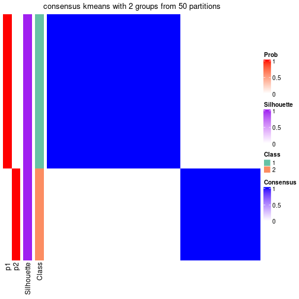</p>

</div>
<div id='tab-node-034-consensus-heatmap-2'>
<pre><code class="r">consensus_heatmap(res, k = 3)
</code></pre>

<p>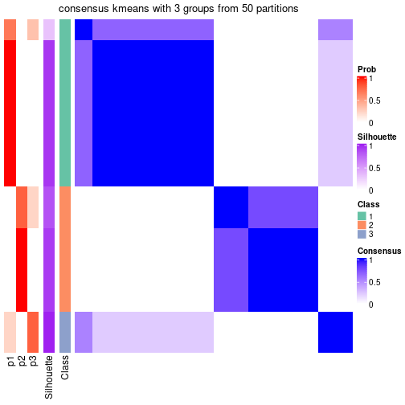</p>

</div>
<div id='tab-node-034-consensus-heatmap-3'>
<pre><code class="r">consensus_heatmap(res, k = 4)
</code></pre>

<p>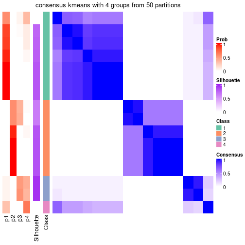</p>

</div>
<div id='tab-node-034-consensus-heatmap-4'>
<pre><code class="r">consensus_heatmap(res, k = 5)
</code></pre>

<p>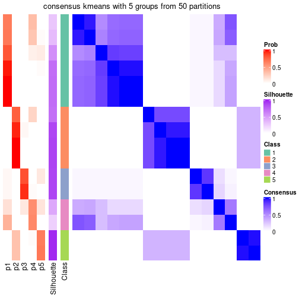</p>

</div>
<div id='tab-node-034-consensus-heatmap-5'>
<pre><code class="r">consensus_heatmap(res, k = 6)
</code></pre>

<p>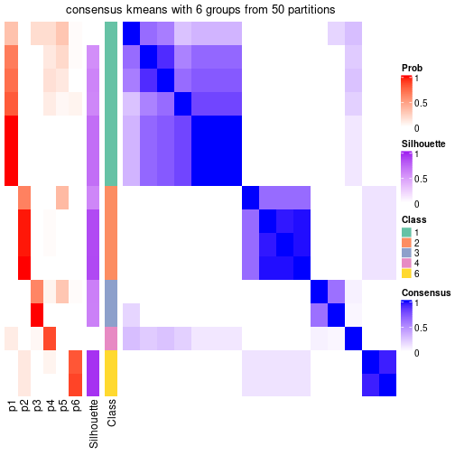</p>

</div>
<div id='tab-node-034-consensus-heatmap-6'>
<pre><code class="r">consensus_heatmap(res, k = 7)
</code></pre>

<p>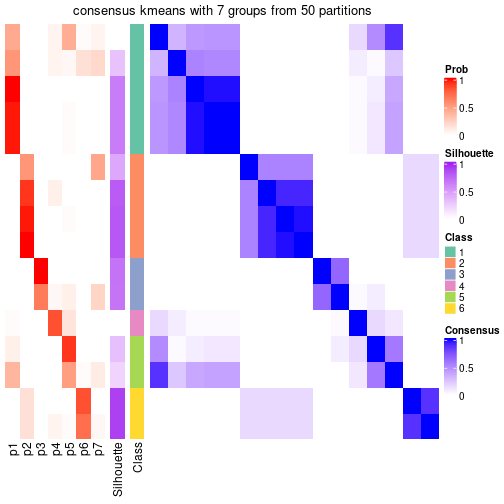</p>

</div>
<div id='tab-node-034-consensus-heatmap-7'>
<pre><code class="r">consensus_heatmap(res, k = 8)
</code></pre>

<p>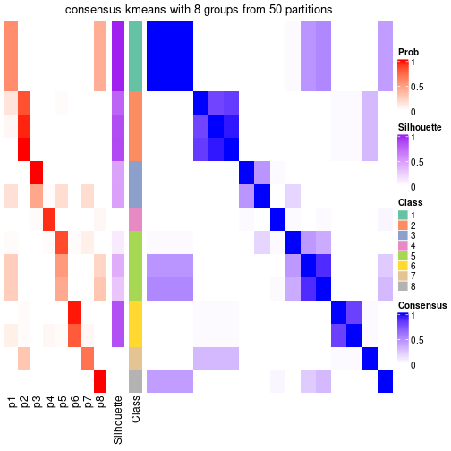</p>

</div>
</div>

Heatmaps for the membership of samples in all partitions to see how consistent they are:


<script>
$( function() {
	$( '#tabs-node-034-membership-heatmap' ).tabs();
} );
</script>
<div id='tabs-node-034-membership-heatmap'>
<ul>
<li><a href='#tab-node-034-membership-heatmap-1'>k = 2</a></li>
<li><a href='#tab-node-034-membership-heatmap-2'>k = 3</a></li>
<li><a href='#tab-node-034-membership-heatmap-3'>k = 4</a></li>
<li><a href='#tab-node-034-membership-heatmap-4'>k = 5</a></li>
<li><a href='#tab-node-034-membership-heatmap-5'>k = 6</a></li>
<li><a href='#tab-node-034-membership-heatmap-6'>k = 7</a></li>
<li><a href='#tab-node-034-membership-heatmap-7'>k = 8</a></li>
</ul>
<div id='tab-node-034-membership-heatmap-1'>
<pre><code class="r">membership_heatmap(res, k = 2)
</code></pre>

<p></p>

</div>
<div id='tab-node-034-membership-heatmap-2'>
<pre><code class="r">membership_heatmap(res, k = 3)
</code></pre>

<p>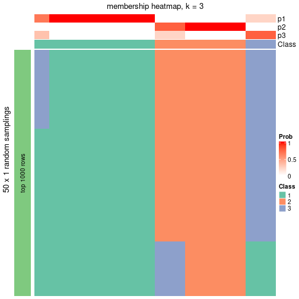</p>

</div>
<div id='tab-node-034-membership-heatmap-3'>
<pre><code class="r">membership_heatmap(res, k = 4)
</code></pre>

<p>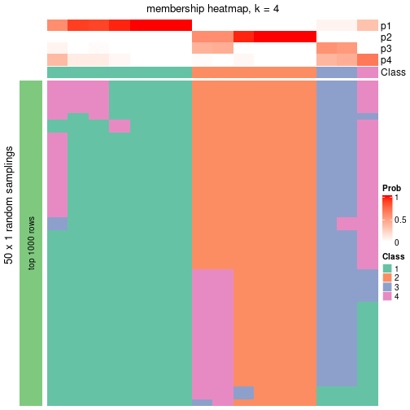</p>

</div>
<div id='tab-node-034-membership-heatmap-4'>
<pre><code class="r">membership_heatmap(res, k = 5)
</code></pre>

<p>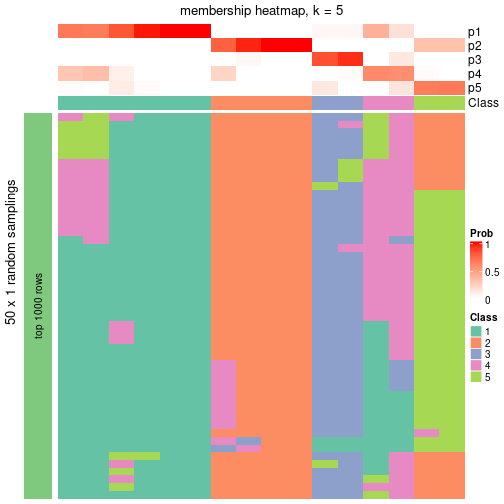</p>

</div>
<div id='tab-node-034-membership-heatmap-5'>
<pre><code class="r">membership_heatmap(res, k = 6)
</code></pre>

<p>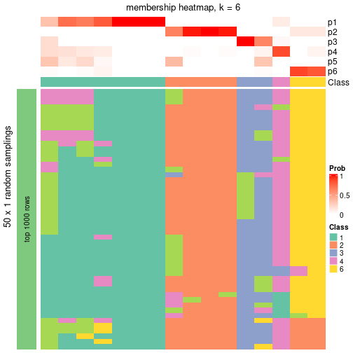</p>

</div>
<div id='tab-node-034-membership-heatmap-6'>
<pre><code class="r">membership_heatmap(res, k = 7)
</code></pre>

<p>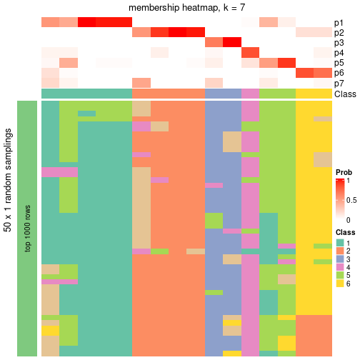</p>

</div>
<div id='tab-node-034-membership-heatmap-7'>
<pre><code class="r">membership_heatmap(res, k = 8)
</code></pre>

<p>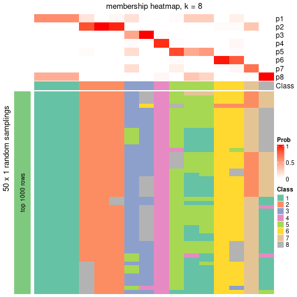</p>

</div>
</div>

As soon as the classes for columns are determined, the signatures
that are significantly different between subgroups can be looked for. 
Following are the heatmaps for signatures.


<script>
$( function() {
	$( '#tabs-node-034-get-signatures' ).tabs();
} );
</script>
<div id='tabs-node-034-get-signatures'>
<ul>
<li><a href='#tab-node-034-get-signatures-1'>k = 2</a></li>
<li><a href='#tab-node-034-get-signatures-2'>k = 3</a></li>
<li><a href='#tab-node-034-get-signatures-3'>k = 4</a></li>
<li><a href='#tab-node-034-get-signatures-4'>k = 5</a></li>
<li><a href='#tab-node-034-get-signatures-5'>k = 6</a></li>
<li><a href='#tab-node-034-get-signatures-6'>k = 7</a></li>
<li><a href='#tab-node-034-get-signatures-7'>k = 8</a></li>
</ul>
<div id='tab-node-034-get-signatures-1'>
<pre><code class="r">get_signatures(res, k = 2)
</code></pre>

<p>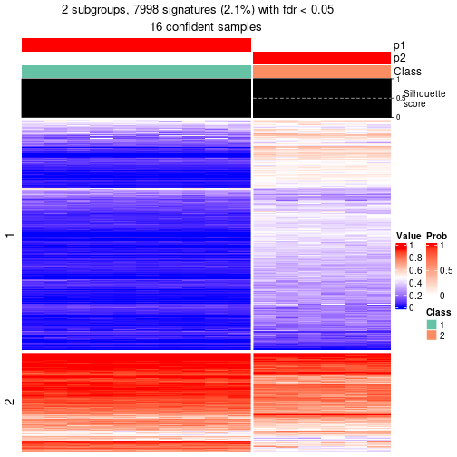</p>

</div>
<div id='tab-node-034-get-signatures-2'>
<pre><code class="r">get_signatures(res, k = 3)
</code></pre>

<p>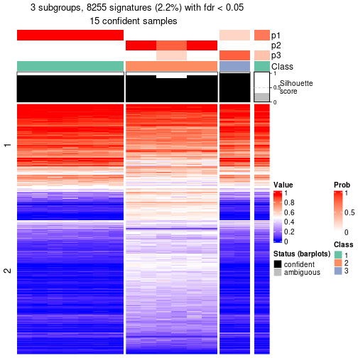</p>

</div>
<div id='tab-node-034-get-signatures-3'>
<pre><code class="r">get_signatures(res, k = 4)
</code></pre>

<p>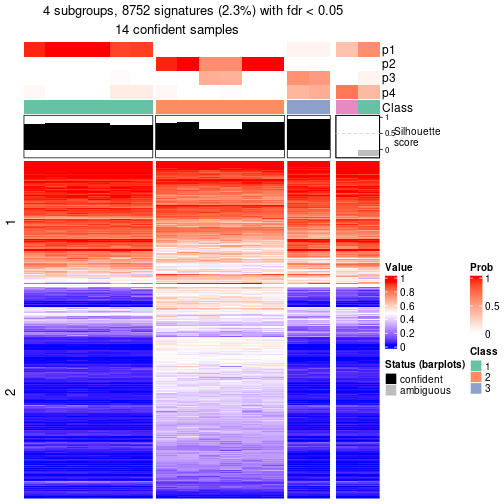</p>

</div>
<div id='tab-node-034-get-signatures-4'>
<pre><code class="r">get_signatures(res, k = 5)
</code></pre>

<p>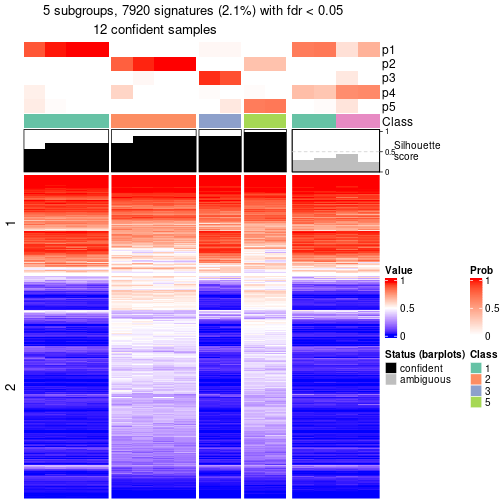</p>

</div>
<div id='tab-node-034-get-signatures-5'>
<pre><code class="r">get_signatures(res, k = 6)
</code></pre>

<p>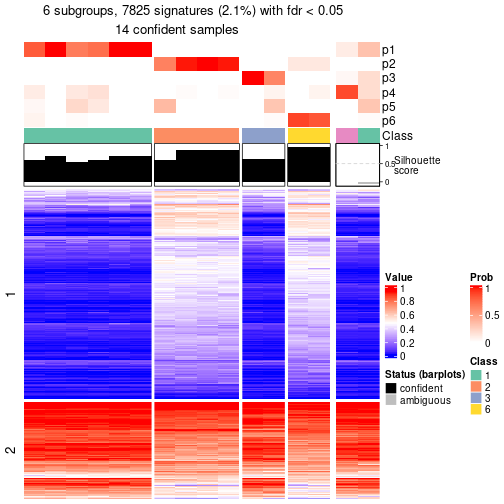</p>

</div>
<div id='tab-node-034-get-signatures-6'>
<pre><code class="r">get_signatures(res, k = 7)
</code></pre>

<p>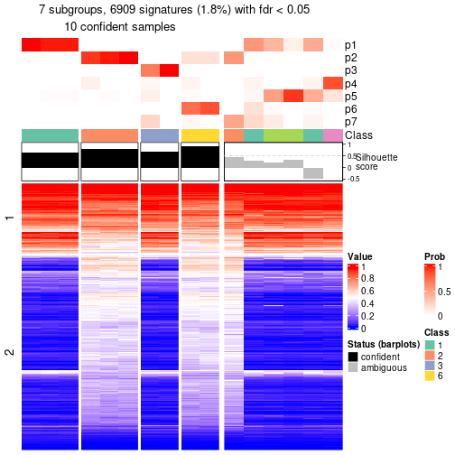</p>

</div>
<div id='tab-node-034-get-signatures-7'>
<pre><code class="r">get_signatures(res, k = 8)
</code></pre>

<p>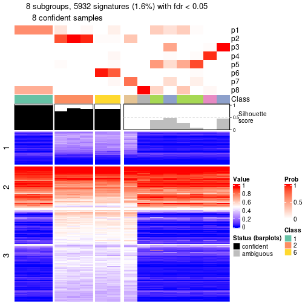</p>

</div>
</div>


Compare the overlap of signatures from different k:

```r
compare_signatures(res)
```

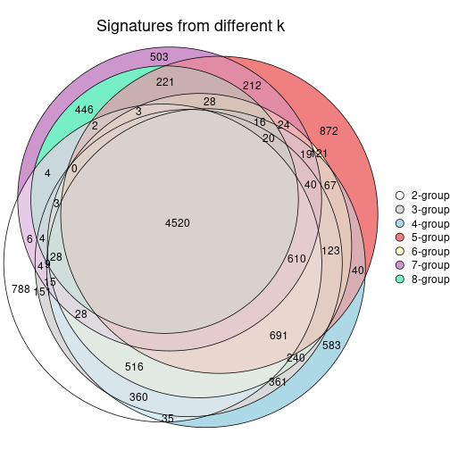

`get_signature()` returns a data frame invisibly. To get the list of signatures, the function
call should be assigned to a variable explicitly. In following code, if `plot` argument is set
to `FALSE`, no heatmap is plotted while only the differential analysis is performed.

```r
# code only for demonstration
tb = get_signature(res, k = ..., plot = FALSE)
```

An example of the output of `tb` is:

```
#>   which_row         fdr    mean_1    mean_2 scaled_mean_1 scaled_mean_2 km
#> 1        38 0.042760348  8.373488  9.131774    -0.5533452     0.5164555  1
#> 2        40 0.018707592  7.106213  8.469186    -0.6173731     0.5762149  1
#> 3        55 0.019134737 10.221463 11.207825    -0.6159697     0.5749050  1
#> 4        59 0.006059896  5.921854  7.869574    -0.6899429     0.6439467  1
#> 5        60 0.018055526  8.928898 10.211722    -0.6204761     0.5791110  1
#> 6        98 0.009384629 15.714769 14.887706     0.6635654    -0.6193277  2
...
```

The columns in `tb` are:

1. `which_row`: row indices corresponding to the input matrix.
2. `fdr`: FDR for the differential test. 
3. `mean_x`: The mean value in group x.
4. `scaled_mean_x`: The mean value in group x after rows are scaled.
5. `km`: Row groups if k-means clustering is applied to rows (which is done by automatically selecting number of clusters).

If there are too many signatures, `top_signatures = ...` can be set to only show the 
signatures with the highest FDRs:

```r
# code only for demonstration
# e.g. to show the top 500 most significant rows
tb = get_signature(res, k = ..., top_signatures = 500)
```

If the signatures are defined as these which are uniquely high in current group, `diff_method` argument
can be set to `"uniquely_high_in_one_group"`:

```r
# code only for demonstration
tb = get_signature(res, k = ..., diff_method = "uniquely_high_in_one_group")
```


UMAP plot which shows how samples are separated.


<script>
$( function() {
	$( '#tabs-node-034-dimension-reduction' ).tabs();
} );
</script>
<div id='tabs-node-034-dimension-reduction'>
<ul>
<li><a href='#tab-node-034-dimension-reduction-1'>k = 2</a></li>
<li><a href='#tab-node-034-dimension-reduction-2'>k = 3</a></li>
<li><a href='#tab-node-034-dimension-reduction-3'>k = 4</a></li>
<li><a href='#tab-node-034-dimension-reduction-4'>k = 5</a></li>
<li><a href='#tab-node-034-dimension-reduction-5'>k = 6</a></li>
<li><a href='#tab-node-034-dimension-reduction-6'>k = 7</a></li>
<li><a href='#tab-node-034-dimension-reduction-7'>k = 8</a></li>
</ul>
<div id='tab-node-034-dimension-reduction-1'>
<pre><code class="r">dimension_reduction(res, k = 2, method = &quot;UMAP&quot;)
</code></pre>

<p>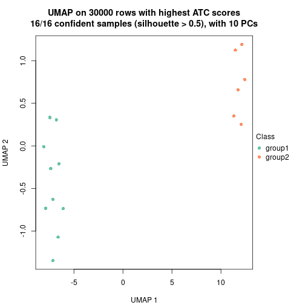</p>

</div>
<div id='tab-node-034-dimension-reduction-2'>
<pre><code class="r">dimension_reduction(res, k = 3, method = &quot;UMAP&quot;)
</code></pre>

<p>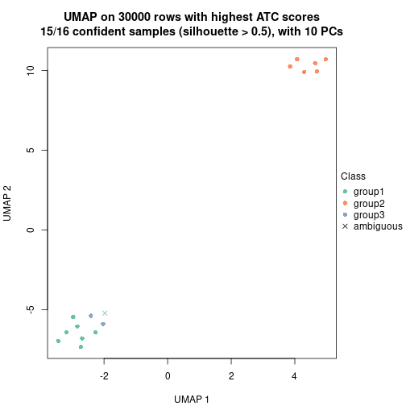</p>

</div>
<div id='tab-node-034-dimension-reduction-3'>
<pre><code class="r">dimension_reduction(res, k = 4, method = &quot;UMAP&quot;)
</code></pre>

<p>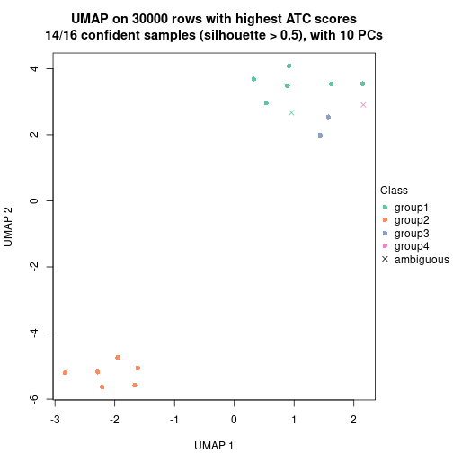</p>

</div>
<div id='tab-node-034-dimension-reduction-4'>
<pre><code class="r">dimension_reduction(res, k = 5, method = &quot;UMAP&quot;)
</code></pre>

<p>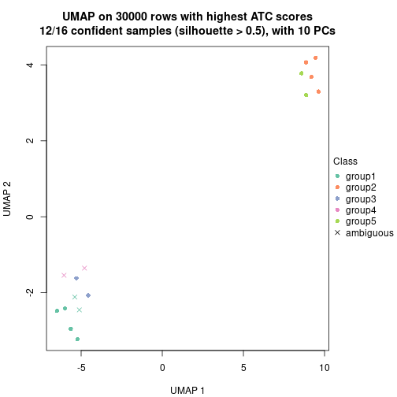</p>

</div>
<div id='tab-node-034-dimension-reduction-5'>
<pre><code class="r">dimension_reduction(res, k = 6, method = &quot;UMAP&quot;)
</code></pre>

<p>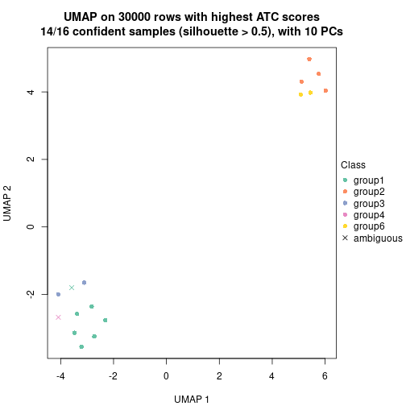</p>

</div>
<div id='tab-node-034-dimension-reduction-6'>
<pre><code class="r">dimension_reduction(res, k = 7, method = &quot;UMAP&quot;)
</code></pre>

<p>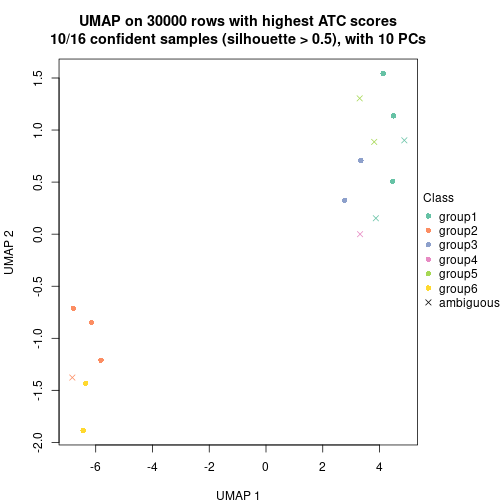</p>

</div>
<div id='tab-node-034-dimension-reduction-7'>
<pre><code class="r">dimension_reduction(res, k = 8, method = &quot;UMAP&quot;)
</code></pre>

<p>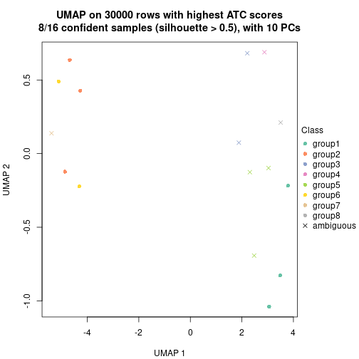</p>

</div>
</div>


Following heatmap shows how subgroups are split when increasing `k`:

```r
collect_classes(res)
```

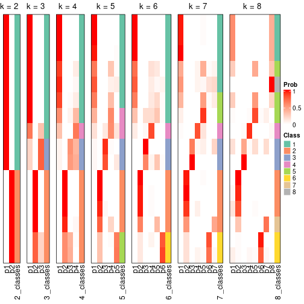


If matrix rows can be associated to genes, consider to use `functional_enrichment(res,
...)` to perform function enrichment for the signature genes. See [this vignette](https://jokergoo.github.io/cola_vignettes/functional_enrichment.html) for more detailed explanations.


 

---------------------------------------------------


### Node04


Parent node: [Node0](#Node0).
Child nodes: 
                [Node011](#Node011)
        ,
                [Node012](#Node012)
        ,
                Node013-leaf
        ,
                Node021-leaf
        ,
                Node022-leaf
        ,
                Node023-leaf
        ,
                [Node031](#Node031)
        ,
                Node032-leaf
        ,
                [Node033](#Node033)
        ,
                [Node034](#Node034)
        ,
                Node035-leaf
        ,
                [Node041](#Node041)
        ,
                [Node042](#Node042)
        ,
                [Node043](#Node043)
        ,
                [Node051](#Node051)
        ,
                [Node052](#Node052)
        ,
                [Node053](#Node053)
        .


The object with results only for a single top-value method and a single partitioning method 
can be extracted as:

```r
res = res_rh["04"]
```

A summary of `res` and all the functions that can be applied to it:

```r
res
```

```
#> A 'ConsensusPartition' object with k = 2, 3, 4, 5, 6, 7, 8.
#>   On a matrix with 30000 rows and 121 columns.
#>   Top rows (1000) are extracted by 'SD' method.
#>   Subgroups are detected by 'skmeans' method.
#>   Performed in total 350 partitions by row resampling.
#>   Best k for subgroups seems to be 4.
#> 
#> Following methods can be applied to this 'ConsensusPartition' object:
#>  [1] "cola_report"             "collect_classes"         "collect_plots"          
#>  [4] "collect_stats"           "colnames"                "compare_partitions"     
#>  [7] "compare_signatures"      "consensus_heatmap"       "dimension_reduction"    
#> [10] "functional_enrichment"   "get_anno_col"            "get_anno"               
#> [13] "get_classes"             "get_consensus"           "get_matrix"             
#> [16] "get_membership"          "get_param"               "get_signatures"         
#> [19] "get_stats"               "is_best_k"               "is_stable_k"            
#> [22] "membership_heatmap"      "ncol"                    "nrow"                   
#> [25] "plot_ecdf"               "predict_classes"         "rownames"               
#> [28] "select_partition_number" "show"                    "suggest_best_k"         
#> [31] "test_to_known_factors"   "top_rows_heatmap"
```

`collect_plots()` function collects all the plots made from `res` for all `k` (number of subgroups)
into one single page to provide an easy and fast comparison between different `k`.

```r
collect_plots(res)
```

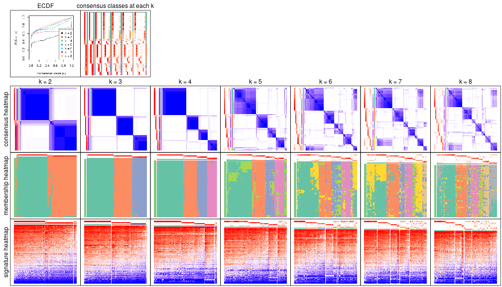

The plots are:

- The first row: a plot of the eCDF (empirical cumulative distribution
  function) curves of the consensus matrix for each `k` and the heatmap of
  predicted classes for each `k`.
- The second row: heatmaps of the consensus matrix for each `k`.
- The third row: heatmaps of the membership matrix for each `k`.
- The fouth row: heatmaps of the signatures for each `k`.

All the plots in panels can be made by individual functions and they are
plotted later in this section.

`select_partition_number()` produces several plots showing different
statistics for choosing "optimized" `k`. There are following statistics:

- eCDF curves of the consensus matrix for each `k`;
- 1-PAC. [The PAC score](https://en.wikipedia.org/wiki/Consensus_clustering#Over-interpretation_potential_of_consensus_clustering)
  measures the proportion of the ambiguous subgrouping.
- Mean silhouette score.
- Concordance. The mean probability of fiting the consensus subgroup labels in all
  partitions.
- Area increased. Denote $A_k$ as the area under the eCDF curve for current
  `k`, the area increased is defined as $A_k - A_{k-1}$.
- Rand index. The percent of pairs of samples that are both in a same cluster
  or both are not in a same cluster in the partition of k and k-1.
- Jaccard index. The ratio of pairs of samples are both in a same cluster in
  the partition of k and k-1 and the pairs of samples are both in a same
  cluster in the partition k or k-1.

The detailed explanations of these statistics can be found in [the _cola_
vignette](https://jokergoo.github.io/cola_vignettes/cola.html#toc_13).

Generally speaking, higher 1-PAC score, higher mean silhouette score or higher
concordance corresponds to better partition. Rand index and Jaccard index
measure how similar the current partition is compared to partition with `k-1`.
If they are too similar, we won't accept `k` is better than `k-1`.

```r
select_partition_number(res)
```

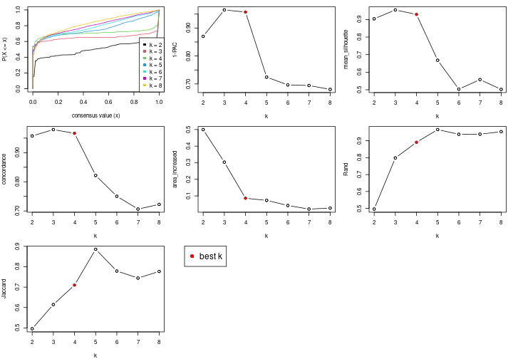

The numeric values for all these statistics can be obtained by `get_stats()`.

```r
get_stats(res)
```

```
#>   k 1-PAC mean_silhouette concordance area_increased  Rand Jaccard
#> 2 2 0.870           0.904       0.958         0.4997 0.496   0.496
#> 3 3 0.965           0.954       0.979         0.3036 0.798   0.615
#> 4 4 0.957           0.929       0.966         0.0861 0.891   0.710
#> 5 5 0.724           0.668       0.822         0.0733 0.966   0.886
#> 6 6 0.696           0.503       0.750         0.0423 0.938   0.779
#> 7 7 0.694           0.558       0.706         0.0208 0.939   0.745
#> 8 8 0.680           0.502       0.722         0.0267 0.954   0.777
```

`suggest_best_k()` suggests the best $k$ based on these statistics. The rules are as follows:

- All $k$ with Jaccard index larger than 0.95 are removed because increasing
  $k$ does not provide enough extra information. If all $k$ are removed, it is
  marked as no subgroup is detected.
- For all $k$ with 1-PAC score larger than 0.9, the maximal $k$ is taken as
  the best $k$, and other $k$ are marked as optional $k$.
- If it does not fit the second rule. The $k$ with the maximal vote of the
  highest 1-PAC score, highest mean silhouette, and highest concordance is
  taken as the best $k$.

```r
suggest_best_k(res)
```

```
#> [1] 4
#> attr(,"optional")
#> [1] 3
```

There is also optional best $k$ = 3 that is worth to check.

Following is the table of the partitions (You need to click the **show/hide
code output** link to see it). The membership matrix (columns with name `p*`)
is inferred by
[`clue::cl_consensus()`](https://www.rdocumentation.org/link/cl_consensus?package=clue)
function with the `SE` method. Basically the value in the membership matrix
represents the probability to belong to a certain group. The finall subgroup
label for an item is determined with the group with highest probability it
belongs to.

In `get_classes()` function, the entropy is calculated from the membership
matrix and the silhouette score is calculated from the consensus matrix.


<script>
$( function() {
	$( '#tabs-node-04-get-classes' ).tabs();
} );
</script>
<div id='tabs-node-04-get-classes'>
<ul>
<li><a href='#tab-node-04-get-classes-1'>k = 2</a></li>
<li><a href='#tab-node-04-get-classes-2'>k = 3</a></li>
<li><a href='#tab-node-04-get-classes-3'>k = 4</a></li>
<li><a href='#tab-node-04-get-classes-4'>k = 5</a></li>
<li><a href='#tab-node-04-get-classes-5'>k = 6</a></li>
<li><a href='#tab-node-04-get-classes-6'>k = 7</a></li>
<li><a href='#tab-node-04-get-classes-7'>k = 8</a></li>
</ul>

<div id='tab-node-04-get-classes-1'>
<p><a id='tab-node-04-get-classes-1-a' style='color:#0366d6' href='#'>show/hide code output</a></p>
<pre><code class="r">cbind(get_classes(res, k = 2), get_membership(res, k = 2))
</code></pre>

<pre><code>#&gt;                 class entropy silhouette   p1   p2
#&gt; TCGA.77.8140.01     2   0.000     0.9284 0.00 1.00
#&gt; TCGA.43.8115.01     1   0.141     0.9620 0.98 0.02
#&gt; TCGA.22.5479.01     1   0.000     0.9784 1.00 0.00
#&gt; TCGA.33.AASI.01     2   0.242     0.9193 0.04 0.96
#&gt; TCGA.22.5481.01     2   0.000     0.9284 0.00 1.00
#&gt; TCGA.33.4586.01     1   0.000     0.9784 1.00 0.00
#&gt; TCGA.94.7033.01     2   0.000     0.9284 0.00 1.00
#&gt; TCGA.94.8035.01     2   0.000     0.9284 0.00 1.00
#&gt; TCGA.98.8022.01     2   0.000     0.9284 0.00 1.00
#&gt; TCGA.39.5035.01     2   0.141     0.9315 0.02 0.98
#&gt; TCGA.77.6842.01     2   0.000     0.9284 0.00 1.00
#&gt; TCGA.LA.A7SW.01     1   0.000     0.9784 1.00 0.00
#&gt; TCGA.77.8143.01     2   0.958     0.4271 0.38 0.62
#&gt; TCGA.77.8146.01     2   0.141     0.9315 0.02 0.98
#&gt; TCGA.98.8021.01     2   0.141     0.9315 0.02 0.98
#&gt; TCGA.77.8133.01     1   0.000     0.9784 1.00 0.00
#&gt; TCGA.77.8139.01     2   0.000     0.9284 0.00 1.00
#&gt; TCGA.98.8020.01     2   0.000     0.9284 0.00 1.00
#&gt; TCGA.77.8130.01     2   0.141     0.9315 0.02 0.98
#&gt; TCGA.33.AASB.01     1   0.000     0.9784 1.00 0.00
#&gt; TCGA.39.5029.01     2   0.999     0.1268 0.48 0.52
#&gt; TCGA.77.8145.01     2   0.000     0.9284 0.00 1.00
#&gt; TCGA.92.8063.01     1   0.000     0.9784 1.00 0.00
#&gt; TCGA.92.8064.01     1   0.000     0.9784 1.00 0.00
#&gt; TCGA.92.8065.01     2   0.141     0.9315 0.02 0.98
#&gt; TCGA.85.8052.01     1   0.000     0.9784 1.00 0.00
#&gt; TCGA.43.8116.01     2   0.141     0.9315 0.02 0.98
#&gt; TCGA.21.5782.01     2   0.000     0.9284 0.00 1.00
#&gt; TCGA.52.7809.01     1   0.141     0.9620 0.98 0.02
#&gt; TCGA.39.5031.01     1   0.327     0.9279 0.94 0.06
#&gt; TCGA.56.7822.01     2   0.000     0.9284 0.00 1.00
#&gt; TCGA.68.7756.01     2   0.141     0.9315 0.02 0.98
#&gt; TCGA.22.4609.01     2   0.141     0.9315 0.02 0.98
#&gt; TCGA.22.5478.01     2   0.584     0.8166 0.14 0.86
#&gt; TCGA.22.5474.01     1   0.000     0.9784 1.00 0.00
#&gt; TCGA.56.5898.01     1   0.000     0.9784 1.00 0.00
#&gt; TCGA.85.A4CN.01     1   0.000     0.9784 1.00 0.00
#&gt; TCGA.22.5472.01     2   0.141     0.9315 0.02 0.98
#&gt; TCGA.18.3417.01     1   0.000     0.9784 1.00 0.00
#&gt; TCGA.43.7657.01     1   0.000     0.9784 1.00 0.00
#&gt; TCGA.43.7656.01     2   0.000     0.9284 0.00 1.00
#&gt; TCGA.85.7844.01     1   0.000     0.9784 1.00 0.00
#&gt; TCGA.90.7767.01     2   0.925     0.5194 0.34 0.66
#&gt; TCGA.22.5480.01     2   0.925     0.5194 0.34 0.66
#&gt; TCGA.94.7557.01     2   0.000     0.9284 0.00 1.00
#&gt; TCGA.LA.A446.01     1   0.000     0.9784 1.00 0.00
#&gt; TCGA.22.5492.01     2   0.000     0.9284 0.00 1.00
#&gt; TCGA.33.4566.01     1   0.000     0.9784 1.00 0.00
#&gt; TCGA.85.7699.01     1   0.242     0.9400 0.96 0.04
#&gt; TCGA.43.7658.01     2   0.000     0.9284 0.00 1.00
#&gt; TCGA.77.A5G8.01     1   0.000     0.9784 1.00 0.00
#&gt; TCGA.77.A5GH.01     2   0.141     0.9315 0.02 0.98
#&gt; TCGA.85.8479.01     1   0.000     0.9784 1.00 0.00
#&gt; TCGA.58.A46K.01     1   0.000     0.9784 1.00 0.00
#&gt; TCGA.96.7544.01     2   0.141     0.9315 0.02 0.98
#&gt; TCGA.94.8491.01     1   0.000     0.9784 1.00 0.00
#&gt; TCGA.77.7335.01     1   0.000     0.9784 1.00 0.00
#&gt; TCGA.O2.A5IB.01     2   0.584     0.8269 0.14 0.86
#&gt; TCGA.77.A5G7.01     2   0.141     0.9315 0.02 0.98
#&gt; TCGA.34.A5IX.01     1   0.000     0.9784 1.00 0.00
#&gt; TCGA.56.8504.01     1   0.000     0.9784 1.00 0.00
#&gt; TCGA.77.7338.01     1   0.000     0.9784 1.00 0.00
#&gt; TCGA.56.8628.01     2   0.680     0.7709 0.18 0.82
#&gt; TCGA.56.8626.01     1   0.000     0.9784 1.00 0.00
#&gt; TCGA.43.8118.01     1   0.141     0.9620 0.98 0.02
#&gt; TCGA.56.8304.01     2   0.000     0.9284 0.00 1.00
#&gt; TCGA.J1.A4AH.01     1   0.000     0.9784 1.00 0.00
#&gt; TCGA.63.A5MP.01     1   0.000     0.9784 1.00 0.00
#&gt; TCGA.56.8622.01     2   0.141     0.9315 0.02 0.98
#&gt; TCGA.56.7580.01     2   0.760     0.7189 0.22 0.78
#&gt; TCGA.77.7337.01     2   0.141     0.9315 0.02 0.98
#&gt; TCGA.56.A4BW.01     1   0.000     0.9784 1.00 0.00
#&gt; TCGA.56.A5DR.01     2   0.958     0.4272 0.38 0.62
#&gt; TCGA.58.8388.01     2   0.141     0.9315 0.02 0.98
#&gt; TCGA.56.A49D.01     2   0.925     0.5152 0.34 0.66
#&gt; TCGA.92.7340.01     1   0.000     0.9784 1.00 0.00
#&gt; TCGA.63.A5MR.01     2   0.141     0.9315 0.02 0.98
#&gt; TCGA.34.8455.01     2   0.141     0.9315 0.02 0.98
#&gt; TCGA.77.7142.01     1   0.000     0.9784 1.00 0.00
#&gt; TCGA.77.A5GA.01     1   0.000     0.9784 1.00 0.00
#&gt; TCGA.58.A46L.01     1   0.000     0.9784 1.00 0.00
#&gt; TCGA.94.A5I6.01     1   0.000     0.9784 1.00 0.00
#&gt; TCGA.85.7950.01     2   0.141     0.9315 0.02 0.98
#&gt; TCGA.77.7463.01     2   0.958     0.4271 0.38 0.62
#&gt; TCGA.85.8288.01     2   0.141     0.9315 0.02 0.98
#&gt; TCGA.85.8276.01     1   0.000     0.9784 1.00 0.00
#&gt; TCGA.58.8387.01     1   0.469     0.8810 0.90 0.10
#&gt; TCGA.96.8169.01     2   0.000     0.9284 0.00 1.00
#&gt; TCGA.O2.A52N.01     1   0.000     0.9784 1.00 0.00
#&gt; TCGA.56.8307.01     2   0.000     0.9284 0.00 1.00
#&gt; TCGA.34.5928.01     1   0.141     0.9605 0.98 0.02
#&gt; TCGA.85.6561.01     1   0.000     0.9784 1.00 0.00
#&gt; TCGA.85.8350.01     1   0.000     0.9784 1.00 0.00
#&gt; TCGA.NC.A5HK.01     1   0.000     0.9784 1.00 0.00
#&gt; TCGA.98.A53J.01     1   0.000     0.9784 1.00 0.00
#&gt; TCGA.43.A56V.01     1   0.995     0.0771 0.54 0.46
#&gt; TCGA.63.A5MV.01     2   0.000     0.9284 0.00 1.00
#&gt; TCGA.O2.A52W.01     1   0.141     0.9620 0.98 0.02
#&gt; TCGA.68.8250.01     1   0.981     0.2185 0.58 0.42
#&gt; TCGA.21.A5DI.01     2   0.141     0.9315 0.02 0.98
#&gt; TCGA.56.6545.01     2   0.141     0.9315 0.02 0.98
#&gt; TCGA.33.A4WN.01     1   0.000     0.9784 1.00 0.00
#&gt; TCGA.56.8305.01     1   0.000     0.9784 1.00 0.00
#&gt; TCGA.85.8351.01     2   0.141     0.9315 0.02 0.98
#&gt; TCGA.NK.A5CX.01     2   0.141     0.9315 0.02 0.98
#&gt; TCGA.39.5019.01     1   0.000     0.9784 1.00 0.00
#&gt; TCGA.85.8287.01     2   0.242     0.9080 0.04 0.96
#&gt; TCGA.85.A53L.01     1   0.000     0.9784 1.00 0.00
#&gt; TCGA.68.8251.01     1   0.000     0.9784 1.00 0.00
#&gt; TCGA.34.5239.01     2   0.141     0.9315 0.02 0.98
#&gt; TCGA.98.A53B.01     2   0.141     0.9315 0.02 0.98
#&gt; TCGA.NC.A5HL.01     1   0.000     0.9784 1.00 0.00
#&gt; TCGA.58.8386.01     2   0.141     0.9315 0.02 0.98
#&gt; TCGA.68.A59J.01     1   0.000     0.9784 1.00 0.00
#&gt; TCGA.85.A4CL.01     1   0.000     0.9784 1.00 0.00
#&gt; TCGA.98.A539.01     1   0.141     0.9609 0.98 0.02
#&gt; TCGA.85.A4QQ.01     1   0.000     0.9784 1.00 0.00
#&gt; TCGA.85.A4JB.01     1   0.141     0.9620 0.98 0.02
#&gt; TCGA.56.A4ZK.01     1   0.000     0.9784 1.00 0.00
#&gt; TCGA.98.A53I.01     1   0.000     0.9784 1.00 0.00
#&gt; TCGA.98.A538.01     2   0.000     0.9284 0.00 1.00
</code></pre>

<script>
$('#tab-node-04-get-classes-1-a').parent().next().next().hide();
$('#tab-node-04-get-classes-1-a').click(function(){
  $('#tab-node-04-get-classes-1-a').parent().next().next().toggle();
  return(false);
});
</script>
</div>

<div id='tab-node-04-get-classes-2'>
<p><a id='tab-node-04-get-classes-2-a' style='color:#0366d6' href='#'>show/hide code output</a></p>
<pre><code class="r">cbind(get_classes(res, k = 3), get_membership(res, k = 3))
</code></pre>

<pre><code>#&gt;                 class entropy silhouette   p1   p2   p3
#&gt; TCGA.77.8140.01     3  0.1529      0.948 0.00 0.04 0.96
#&gt; TCGA.43.8115.01     3  0.3340      0.859 0.12 0.00 0.88
#&gt; TCGA.22.5479.01     1  0.0000      0.986 1.00 0.00 0.00
#&gt; TCGA.33.AASI.01     2  0.0000      0.975 0.00 1.00 0.00
#&gt; TCGA.22.5481.01     2  0.0000      0.975 0.00 1.00 0.00
#&gt; TCGA.33.4586.01     1  0.0000      0.986 1.00 0.00 0.00
#&gt; TCGA.94.7033.01     2  0.0000      0.975 0.00 1.00 0.00
#&gt; TCGA.94.8035.01     3  0.4002      0.820 0.00 0.16 0.84
#&gt; TCGA.98.8022.01     3  0.0000      0.965 0.00 0.00 1.00
#&gt; TCGA.39.5035.01     2  0.0000      0.975 0.00 1.00 0.00
#&gt; TCGA.77.6842.01     3  0.0000      0.965 0.00 0.00 1.00
#&gt; TCGA.LA.A7SW.01     1  0.0000      0.986 1.00 0.00 0.00
#&gt; TCGA.77.8143.01     3  0.0000      0.965 0.00 0.00 1.00
#&gt; TCGA.77.8146.01     2  0.0000      0.975 0.00 1.00 0.00
#&gt; TCGA.98.8021.01     2  0.0000      0.975 0.00 1.00 0.00
#&gt; TCGA.77.8133.01     1  0.0000      0.986 1.00 0.00 0.00
#&gt; TCGA.77.8139.01     3  0.0000      0.965 0.00 0.00 1.00
#&gt; TCGA.98.8020.01     2  0.0000      0.975 0.00 1.00 0.00
#&gt; TCGA.77.8130.01     2  0.0000      0.975 0.00 1.00 0.00
#&gt; TCGA.33.AASB.01     1  0.0000      0.986 1.00 0.00 0.00
#&gt; TCGA.39.5029.01     3  0.0000      0.965 0.00 0.00 1.00
#&gt; TCGA.77.8145.01     3  0.0000      0.965 0.00 0.00 1.00
#&gt; TCGA.92.8063.01     1  0.0000      0.986 1.00 0.00 0.00
#&gt; TCGA.92.8064.01     1  0.0000      0.986 1.00 0.00 0.00
#&gt; TCGA.92.8065.01     2  0.0000      0.975 0.00 1.00 0.00
#&gt; TCGA.85.8052.01     1  0.0000      0.986 1.00 0.00 0.00
#&gt; TCGA.43.8116.01     2  0.0000      0.975 0.00 1.00 0.00
#&gt; TCGA.21.5782.01     3  0.2066      0.932 0.00 0.06 0.94
#&gt; TCGA.52.7809.01     1  0.5835      0.479 0.66 0.00 0.34
#&gt; TCGA.39.5031.01     3  0.4002      0.812 0.16 0.00 0.84
#&gt; TCGA.56.7822.01     2  0.4796      0.712 0.00 0.78 0.22
#&gt; TCGA.68.7756.01     2  0.0000      0.975 0.00 1.00 0.00
#&gt; TCGA.22.4609.01     2  0.0000      0.975 0.00 1.00 0.00
#&gt; TCGA.22.5478.01     3  0.0000      0.965 0.00 0.00 1.00
#&gt; TCGA.22.5474.01     1  0.0000      0.986 1.00 0.00 0.00
#&gt; TCGA.56.5898.01     1  0.0000      0.986 1.00 0.00 0.00
#&gt; TCGA.85.A4CN.01     1  0.0000      0.986 1.00 0.00 0.00
#&gt; TCGA.22.5472.01     2  0.0000      0.975 0.00 1.00 0.00
#&gt; TCGA.18.3417.01     1  0.0000      0.986 1.00 0.00 0.00
#&gt; TCGA.43.7657.01     1  0.0000      0.986 1.00 0.00 0.00
#&gt; TCGA.43.7656.01     3  0.0000      0.965 0.00 0.00 1.00
#&gt; TCGA.85.7844.01     1  0.0000      0.986 1.00 0.00 0.00
#&gt; TCGA.90.7767.01     2  0.0000      0.975 0.00 1.00 0.00
#&gt; TCGA.22.5480.01     2  0.0000      0.975 0.00 1.00 0.00
#&gt; TCGA.94.7557.01     3  0.4555      0.755 0.00 0.20 0.80
#&gt; TCGA.LA.A446.01     1  0.0000      0.986 1.00 0.00 0.00
#&gt; TCGA.22.5492.01     3  0.1529      0.948 0.00 0.04 0.96
#&gt; TCGA.33.4566.01     1  0.0000      0.986 1.00 0.00 0.00
#&gt; TCGA.85.7699.01     2  0.5706      0.530 0.32 0.68 0.00
#&gt; TCGA.43.7658.01     2  0.0000      0.975 0.00 1.00 0.00
#&gt; TCGA.77.A5G8.01     1  0.0000      0.986 1.00 0.00 0.00
#&gt; TCGA.77.A5GH.01     2  0.0000      0.975 0.00 1.00 0.00
#&gt; TCGA.85.8479.01     1  0.0000      0.986 1.00 0.00 0.00
#&gt; TCGA.58.A46K.01     1  0.0000      0.986 1.00 0.00 0.00
#&gt; TCGA.96.7544.01     2  0.0000      0.975 0.00 1.00 0.00
#&gt; TCGA.94.8491.01     1  0.0000      0.986 1.00 0.00 0.00
#&gt; TCGA.77.7335.01     1  0.0000      0.986 1.00 0.00 0.00
#&gt; TCGA.O2.A5IB.01     2  0.0000      0.975 0.00 1.00 0.00
#&gt; TCGA.77.A5G7.01     2  0.0000      0.975 0.00 1.00 0.00
#&gt; TCGA.34.A5IX.01     1  0.0000      0.986 1.00 0.00 0.00
#&gt; TCGA.56.8504.01     1  0.0000      0.986 1.00 0.00 0.00
#&gt; TCGA.77.7338.01     1  0.0000      0.986 1.00 0.00 0.00
#&gt; TCGA.56.8628.01     3  0.0000      0.965 0.00 0.00 1.00
#&gt; TCGA.56.8626.01     1  0.0000      0.986 1.00 0.00 0.00
#&gt; TCGA.43.8118.01     1  0.2537      0.905 0.92 0.00 0.08
#&gt; TCGA.56.8304.01     3  0.1529      0.948 0.00 0.04 0.96
#&gt; TCGA.J1.A4AH.01     1  0.0000      0.986 1.00 0.00 0.00
#&gt; TCGA.63.A5MP.01     1  0.0000      0.986 1.00 0.00 0.00
#&gt; TCGA.56.8622.01     2  0.0000      0.975 0.00 1.00 0.00
#&gt; TCGA.56.7580.01     3  0.1781      0.949 0.02 0.02 0.96
#&gt; TCGA.77.7337.01     2  0.0000      0.975 0.00 1.00 0.00
#&gt; TCGA.56.A4BW.01     1  0.0000      0.986 1.00 0.00 0.00
#&gt; TCGA.56.A5DR.01     3  0.0000      0.965 0.00 0.00 1.00
#&gt; TCGA.58.8388.01     2  0.0000      0.975 0.00 1.00 0.00
#&gt; TCGA.56.A49D.01     3  0.0000      0.965 0.00 0.00 1.00
#&gt; TCGA.92.7340.01     1  0.0000      0.986 1.00 0.00 0.00
#&gt; TCGA.63.A5MR.01     2  0.0000      0.975 0.00 1.00 0.00
#&gt; TCGA.34.8455.01     2  0.0000      0.975 0.00 1.00 0.00
#&gt; TCGA.77.7142.01     1  0.0000      0.986 1.00 0.00 0.00
#&gt; TCGA.77.A5GA.01     1  0.0000      0.986 1.00 0.00 0.00
#&gt; TCGA.58.A46L.01     1  0.0000      0.986 1.00 0.00 0.00
#&gt; TCGA.94.A5I6.01     1  0.0000      0.986 1.00 0.00 0.00
#&gt; TCGA.85.7950.01     2  0.4291      0.771 0.00 0.82 0.18
#&gt; TCGA.77.7463.01     3  0.0000      0.965 0.00 0.00 1.00
#&gt; TCGA.85.8288.01     2  0.0000      0.975 0.00 1.00 0.00
#&gt; TCGA.85.8276.01     1  0.0000      0.986 1.00 0.00 0.00
#&gt; TCGA.58.8387.01     3  0.0000      0.965 0.00 0.00 1.00
#&gt; TCGA.96.8169.01     3  0.0892      0.958 0.00 0.02 0.98
#&gt; TCGA.O2.A52N.01     1  0.0000      0.986 1.00 0.00 0.00
#&gt; TCGA.56.8307.01     3  0.1529      0.948 0.00 0.04 0.96
#&gt; TCGA.34.5928.01     1  0.5216      0.646 0.74 0.00 0.26
#&gt; TCGA.85.6561.01     1  0.0000      0.986 1.00 0.00 0.00
#&gt; TCGA.85.8350.01     1  0.0000      0.986 1.00 0.00 0.00
#&gt; TCGA.NC.A5HK.01     1  0.0000      0.986 1.00 0.00 0.00
#&gt; TCGA.98.A53J.01     1  0.0000      0.986 1.00 0.00 0.00
#&gt; TCGA.43.A56V.01     3  0.0000      0.965 0.00 0.00 1.00
#&gt; TCGA.63.A5MV.01     2  0.2537      0.898 0.00 0.92 0.08
#&gt; TCGA.O2.A52W.01     3  0.0000      0.965 0.00 0.00 1.00
#&gt; TCGA.68.8250.01     3  0.0000      0.965 0.00 0.00 1.00
#&gt; TCGA.21.A5DI.01     2  0.0000      0.975 0.00 1.00 0.00
#&gt; TCGA.56.6545.01     2  0.0892      0.957 0.00 0.98 0.02
#&gt; TCGA.33.A4WN.01     1  0.0000      0.986 1.00 0.00 0.00
#&gt; TCGA.56.8305.01     1  0.0000      0.986 1.00 0.00 0.00
#&gt; TCGA.85.8351.01     2  0.0000      0.975 0.00 1.00 0.00
#&gt; TCGA.NK.A5CX.01     2  0.0000      0.975 0.00 1.00 0.00
#&gt; TCGA.39.5019.01     1  0.0000      0.986 1.00 0.00 0.00
#&gt; TCGA.85.8287.01     3  0.1781      0.947 0.02 0.02 0.96
#&gt; TCGA.85.A53L.01     1  0.0000      0.986 1.00 0.00 0.00
#&gt; TCGA.68.8251.01     1  0.2066      0.924 0.94 0.06 0.00
#&gt; TCGA.34.5239.01     2  0.0000      0.975 0.00 1.00 0.00
#&gt; TCGA.98.A53B.01     2  0.0000      0.975 0.00 1.00 0.00
#&gt; TCGA.NC.A5HL.01     1  0.0000      0.986 1.00 0.00 0.00
#&gt; TCGA.58.8386.01     2  0.0000      0.975 0.00 1.00 0.00
#&gt; TCGA.68.A59J.01     1  0.0000      0.986 1.00 0.00 0.00
#&gt; TCGA.85.A4CL.01     1  0.0000      0.986 1.00 0.00 0.00
#&gt; TCGA.98.A539.01     1  0.0000      0.986 1.00 0.00 0.00
#&gt; TCGA.85.A4QQ.01     1  0.0000      0.986 1.00 0.00 0.00
#&gt; TCGA.85.A4JB.01     3  0.0000      0.965 0.00 0.00 1.00
#&gt; TCGA.56.A4ZK.01     1  0.0000      0.986 1.00 0.00 0.00
#&gt; TCGA.98.A53I.01     1  0.0000      0.986 1.00 0.00 0.00
#&gt; TCGA.98.A538.01     3  0.0000      0.965 0.00 0.00 1.00
</code></pre>

<script>
$('#tab-node-04-get-classes-2-a').parent().next().next().hide();
$('#tab-node-04-get-classes-2-a').click(function(){
  $('#tab-node-04-get-classes-2-a').parent().next().next().toggle();
  return(false);
});
</script>
</div>

<div id='tab-node-04-get-classes-3'>
<p><a id='tab-node-04-get-classes-3-a' style='color:#0366d6' href='#'>show/hide code output</a></p>
<pre><code class="r">cbind(get_classes(res, k = 4), get_membership(res, k = 4))
</code></pre>

<pre><code>#&gt;                 class entropy silhouette   p1   p2   p3   p4
#&gt; TCGA.77.8140.01     4  0.1211     0.9350 0.00 0.00 0.04 0.96
#&gt; TCGA.43.8115.01     4  0.0707     0.9440 0.00 0.00 0.02 0.98
#&gt; TCGA.22.5479.01     1  0.0000     0.9880 1.00 0.00 0.00 0.00
#&gt; TCGA.33.AASI.01     2  0.1211     0.9052 0.04 0.96 0.00 0.00
#&gt; TCGA.22.5481.01     4  0.0000     0.9455 0.00 0.00 0.00 1.00
#&gt; TCGA.33.4586.01     1  0.0000     0.9880 1.00 0.00 0.00 0.00
#&gt; TCGA.94.7033.01     2  0.0000     0.9488 0.00 1.00 0.00 0.00
#&gt; TCGA.94.8035.01     2  0.4977     0.0633 0.00 0.54 0.46 0.00
#&gt; TCGA.98.8022.01     3  0.1411     0.9243 0.00 0.02 0.96 0.02
#&gt; TCGA.39.5035.01     2  0.0000     0.9488 0.00 1.00 0.00 0.00
#&gt; TCGA.77.6842.01     3  0.0000     0.9400 0.00 0.00 1.00 0.00
#&gt; TCGA.LA.A7SW.01     1  0.0000     0.9880 1.00 0.00 0.00 0.00
#&gt; TCGA.77.8143.01     3  0.0000     0.9400 0.00 0.00 1.00 0.00
#&gt; TCGA.77.8146.01     2  0.0000     0.9488 0.00 1.00 0.00 0.00
#&gt; TCGA.98.8021.01     4  0.0000     0.9455 0.00 0.00 0.00 1.00
#&gt; TCGA.77.8133.01     1  0.0000     0.9880 1.00 0.00 0.00 0.00
#&gt; TCGA.77.8139.01     3  0.2921     0.8358 0.00 0.14 0.86 0.00
#&gt; TCGA.98.8020.01     4  0.2921     0.8489 0.00 0.14 0.00 0.86
#&gt; TCGA.77.8130.01     2  0.0000     0.9488 0.00 1.00 0.00 0.00
#&gt; TCGA.33.AASB.01     1  0.0000     0.9880 1.00 0.00 0.00 0.00
#&gt; TCGA.39.5029.01     3  0.0000     0.9400 0.00 0.00 1.00 0.00
#&gt; TCGA.77.8145.01     3  0.1913     0.9123 0.00 0.02 0.94 0.04
#&gt; TCGA.92.8063.01     1  0.0000     0.9880 1.00 0.00 0.00 0.00
#&gt; TCGA.92.8064.01     1  0.0000     0.9880 1.00 0.00 0.00 0.00
#&gt; TCGA.92.8065.01     4  0.2647     0.8693 0.00 0.12 0.00 0.88
#&gt; TCGA.85.8052.01     1  0.0000     0.9880 1.00 0.00 0.00 0.00
#&gt; TCGA.43.8116.01     2  0.0000     0.9488 0.00 1.00 0.00 0.00
#&gt; TCGA.21.5782.01     4  0.0707     0.9440 0.00 0.00 0.02 0.98
#&gt; TCGA.52.7809.01     1  0.6286     0.5569 0.66 0.00 0.14 0.20
#&gt; TCGA.39.5031.01     4  0.0707     0.9440 0.00 0.00 0.02 0.98
#&gt; TCGA.56.7822.01     4  0.0000     0.9455 0.00 0.00 0.00 1.00
#&gt; TCGA.68.7756.01     2  0.0000     0.9488 0.00 1.00 0.00 0.00
#&gt; TCGA.22.4609.01     2  0.0000     0.9488 0.00 1.00 0.00 0.00
#&gt; TCGA.22.5478.01     3  0.0000     0.9400 0.00 0.00 1.00 0.00
#&gt; TCGA.22.5474.01     1  0.0000     0.9880 1.00 0.00 0.00 0.00
#&gt; TCGA.56.5898.01     1  0.0000     0.9880 1.00 0.00 0.00 0.00
#&gt; TCGA.85.A4CN.01     1  0.0000     0.9880 1.00 0.00 0.00 0.00
#&gt; TCGA.22.5472.01     2  0.0000     0.9488 0.00 1.00 0.00 0.00
#&gt; TCGA.18.3417.01     1  0.0000     0.9880 1.00 0.00 0.00 0.00
#&gt; TCGA.43.7657.01     1  0.1637     0.9319 0.94 0.00 0.00 0.06
#&gt; TCGA.43.7656.01     3  0.0707     0.9296 0.00 0.00 0.98 0.02
#&gt; TCGA.85.7844.01     1  0.0000     0.9880 1.00 0.00 0.00 0.00
#&gt; TCGA.90.7767.01     2  0.5077     0.7092 0.08 0.76 0.00 0.16
#&gt; TCGA.22.5480.01     4  0.0707     0.9409 0.00 0.02 0.00 0.98
#&gt; TCGA.94.7557.01     3  0.4907     0.3061 0.00 0.42 0.58 0.00
#&gt; TCGA.LA.A446.01     1  0.0000     0.9880 1.00 0.00 0.00 0.00
#&gt; TCGA.22.5492.01     4  0.0707     0.9440 0.00 0.00 0.02 0.98
#&gt; TCGA.33.4566.01     1  0.0000     0.9880 1.00 0.00 0.00 0.00
#&gt; TCGA.85.7699.01     1  0.2411     0.9174 0.92 0.04 0.00 0.04
#&gt; TCGA.43.7658.01     4  0.0707     0.9409 0.00 0.02 0.00 0.98
#&gt; TCGA.77.A5G8.01     1  0.0000     0.9880 1.00 0.00 0.00 0.00
#&gt; TCGA.77.A5GH.01     2  0.0000     0.9488 0.00 1.00 0.00 0.00
#&gt; TCGA.85.8479.01     1  0.0000     0.9880 1.00 0.00 0.00 0.00
#&gt; TCGA.58.A46K.01     1  0.0000     0.9880 1.00 0.00 0.00 0.00
#&gt; TCGA.96.7544.01     2  0.0000     0.9488 0.00 1.00 0.00 0.00
#&gt; TCGA.94.8491.01     1  0.0000     0.9880 1.00 0.00 0.00 0.00
#&gt; TCGA.77.7335.01     1  0.0000     0.9880 1.00 0.00 0.00 0.00
#&gt; TCGA.O2.A5IB.01     4  0.0707     0.9409 0.00 0.02 0.00 0.98
#&gt; TCGA.77.A5G7.01     2  0.0000     0.9488 0.00 1.00 0.00 0.00
#&gt; TCGA.34.A5IX.01     1  0.1211     0.9548 0.96 0.00 0.00 0.04
#&gt; TCGA.56.8504.01     1  0.0000     0.9880 1.00 0.00 0.00 0.00
#&gt; TCGA.77.7338.01     1  0.0000     0.9880 1.00 0.00 0.00 0.00
#&gt; TCGA.56.8628.01     3  0.3335     0.8513 0.00 0.12 0.86 0.02
#&gt; TCGA.56.8626.01     1  0.0000     0.9880 1.00 0.00 0.00 0.00
#&gt; TCGA.43.8118.01     4  0.3400     0.7415 0.18 0.00 0.00 0.82
#&gt; TCGA.56.8304.01     4  0.2011     0.9092 0.00 0.00 0.08 0.92
#&gt; TCGA.J1.A4AH.01     1  0.0000     0.9880 1.00 0.00 0.00 0.00
#&gt; TCGA.63.A5MP.01     1  0.0000     0.9880 1.00 0.00 0.00 0.00
#&gt; TCGA.56.8622.01     2  0.0000     0.9488 0.00 1.00 0.00 0.00
#&gt; TCGA.56.7580.01     3  0.5380     0.7970 0.04 0.12 0.78 0.06
#&gt; TCGA.77.7337.01     2  0.0000     0.9488 0.00 1.00 0.00 0.00
#&gt; TCGA.56.A4BW.01     1  0.0000     0.9880 1.00 0.00 0.00 0.00
#&gt; TCGA.56.A5DR.01     3  0.0000     0.9400 0.00 0.00 1.00 0.00
#&gt; TCGA.58.8388.01     2  0.0707     0.9363 0.00 0.98 0.00 0.02
#&gt; TCGA.56.A49D.01     3  0.0000     0.9400 0.00 0.00 1.00 0.00
#&gt; TCGA.92.7340.01     1  0.0000     0.9880 1.00 0.00 0.00 0.00
#&gt; TCGA.63.A5MR.01     4  0.2011     0.9051 0.00 0.08 0.00 0.92
#&gt; TCGA.34.8455.01     2  0.0000     0.9488 0.00 1.00 0.00 0.00
#&gt; TCGA.77.7142.01     1  0.0000     0.9880 1.00 0.00 0.00 0.00
#&gt; TCGA.77.A5GA.01     1  0.0000     0.9880 1.00 0.00 0.00 0.00
#&gt; TCGA.58.A46L.01     1  0.0000     0.9880 1.00 0.00 0.00 0.00
#&gt; TCGA.94.A5I6.01     1  0.0000     0.9880 1.00 0.00 0.00 0.00
#&gt; TCGA.85.7950.01     2  0.7198     0.3264 0.00 0.52 0.16 0.32
#&gt; TCGA.77.7463.01     3  0.0000     0.9400 0.00 0.00 1.00 0.00
#&gt; TCGA.85.8288.01     2  0.0707     0.9363 0.00 0.98 0.00 0.02
#&gt; TCGA.85.8276.01     1  0.0000     0.9880 1.00 0.00 0.00 0.00
#&gt; TCGA.58.8387.01     3  0.0000     0.9400 0.00 0.00 1.00 0.00
#&gt; TCGA.96.8169.01     4  0.2647     0.8722 0.00 0.00 0.12 0.88
#&gt; TCGA.O2.A52N.01     1  0.0000     0.9880 1.00 0.00 0.00 0.00
#&gt; TCGA.56.8307.01     4  0.0000     0.9455 0.00 0.00 0.00 1.00
#&gt; TCGA.34.5928.01     4  0.0707     0.9350 0.02 0.00 0.00 0.98
#&gt; TCGA.85.6561.01     1  0.0000     0.9880 1.00 0.00 0.00 0.00
#&gt; TCGA.85.8350.01     1  0.1411     0.9560 0.96 0.00 0.02 0.02
#&gt; TCGA.NC.A5HK.01     1  0.0707     0.9716 0.98 0.00 0.00 0.02
#&gt; TCGA.98.A53J.01     1  0.0000     0.9880 1.00 0.00 0.00 0.00
#&gt; TCGA.43.A56V.01     3  0.0000     0.9400 0.00 0.00 1.00 0.00
#&gt; TCGA.63.A5MV.01     2  0.0707     0.9331 0.00 0.98 0.02 0.00
#&gt; TCGA.O2.A52W.01     3  0.0000     0.9400 0.00 0.00 1.00 0.00
#&gt; TCGA.68.8250.01     3  0.0000     0.9400 0.00 0.00 1.00 0.00
#&gt; TCGA.21.A5DI.01     2  0.0000     0.9488 0.00 1.00 0.00 0.00
#&gt; TCGA.56.6545.01     4  0.0000     0.9455 0.00 0.00 0.00 1.00
#&gt; TCGA.33.A4WN.01     1  0.0000     0.9880 1.00 0.00 0.00 0.00
#&gt; TCGA.56.8305.01     1  0.0000     0.9880 1.00 0.00 0.00 0.00
#&gt; TCGA.85.8351.01     2  0.0000     0.9488 0.00 1.00 0.00 0.00
#&gt; TCGA.NK.A5CX.01     2  0.0000     0.9488 0.00 1.00 0.00 0.00
#&gt; TCGA.39.5019.01     1  0.0000     0.9880 1.00 0.00 0.00 0.00
#&gt; TCGA.85.8287.01     3  0.4211     0.8467 0.02 0.04 0.84 0.10
#&gt; TCGA.85.A53L.01     1  0.0707     0.9712 0.98 0.00 0.02 0.00
#&gt; TCGA.68.8251.01     1  0.1211     0.9548 0.96 0.00 0.00 0.04
#&gt; TCGA.34.5239.01     2  0.0707     0.9363 0.00 0.98 0.00 0.02
#&gt; TCGA.98.A53B.01     2  0.0000     0.9488 0.00 1.00 0.00 0.00
#&gt; TCGA.NC.A5HL.01     1  0.0000     0.9880 1.00 0.00 0.00 0.00
#&gt; TCGA.58.8386.01     2  0.0000     0.9488 0.00 1.00 0.00 0.00
#&gt; TCGA.68.A59J.01     1  0.0000     0.9880 1.00 0.00 0.00 0.00
#&gt; TCGA.85.A4CL.01     1  0.0000     0.9880 1.00 0.00 0.00 0.00
#&gt; TCGA.98.A539.01     1  0.0000     0.9880 1.00 0.00 0.00 0.00
#&gt; TCGA.85.A4QQ.01     1  0.0000     0.9880 1.00 0.00 0.00 0.00
#&gt; TCGA.85.A4JB.01     3  0.0000     0.9400 0.00 0.00 1.00 0.00
#&gt; TCGA.56.A4ZK.01     1  0.0000     0.9880 1.00 0.00 0.00 0.00
#&gt; TCGA.98.A53I.01     1  0.0000     0.9880 1.00 0.00 0.00 0.00
#&gt; TCGA.98.A538.01     3  0.0000     0.9400 0.00 0.00 1.00 0.00
</code></pre>

<script>
$('#tab-node-04-get-classes-3-a').parent().next().next().hide();
$('#tab-node-04-get-classes-3-a').click(function(){
  $('#tab-node-04-get-classes-3-a').parent().next().next().toggle();
  return(false);
});
</script>
</div>

<div id='tab-node-04-get-classes-4'>
<p><a id='tab-node-04-get-classes-4-a' style='color:#0366d6' href='#'>show/hide code output</a></p>
<pre><code class="r">cbind(get_classes(res, k = 5), get_membership(res, k = 5))
</code></pre>

<pre><code>#&gt;                 class entropy silhouette   p1   p2   p3   p4   p5
#&gt; TCGA.77.8140.01     4  0.0000      0.834 0.00 0.00 0.00 1.00 0.00
#&gt; TCGA.43.8115.01     4  0.0609      0.836 0.00 0.00 0.00 0.98 0.02
#&gt; TCGA.22.5479.01     1  0.0000      0.766 1.00 0.00 0.00 0.00 0.00
#&gt; TCGA.33.AASI.01     2  0.6263      0.277 0.30 0.58 0.00 0.04 0.08
#&gt; TCGA.22.5481.01     4  0.4227      0.518 0.00 0.00 0.00 0.58 0.42
#&gt; TCGA.33.4586.01     1  0.3796      0.695 0.70 0.00 0.00 0.00 0.30
#&gt; TCGA.94.7033.01     2  0.0609      0.867 0.00 0.98 0.00 0.02 0.00
#&gt; TCGA.94.8035.01     2  0.6381      0.392 0.00 0.62 0.18 0.04 0.16
#&gt; TCGA.98.8022.01     3  0.5589      0.705 0.00 0.04 0.64 0.04 0.28
#&gt; TCGA.39.5035.01     2  0.1216      0.866 0.00 0.96 0.00 0.02 0.02
#&gt; TCGA.77.6842.01     3  0.3868      0.769 0.00 0.00 0.80 0.06 0.14
#&gt; TCGA.LA.A7SW.01     1  0.3983      0.653 0.66 0.00 0.00 0.00 0.34
#&gt; TCGA.77.8143.01     3  0.0000      0.773 0.00 0.00 1.00 0.00 0.00
#&gt; TCGA.77.8146.01     2  0.0000      0.873 0.00 1.00 0.00 0.00 0.00
#&gt; TCGA.98.8021.01     4  0.2331      0.820 0.00 0.02 0.00 0.90 0.08
#&gt; TCGA.77.8133.01     1  0.0000      0.766 1.00 0.00 0.00 0.00 0.00
#&gt; TCGA.77.8139.01     3  0.5925      0.293 0.00 0.40 0.52 0.02 0.06
#&gt; TCGA.98.8020.01     4  0.2516      0.736 0.00 0.14 0.00 0.86 0.00
#&gt; TCGA.77.8130.01     2  0.0609      0.870 0.00 0.98 0.00 0.00 0.02
#&gt; TCGA.33.AASB.01     1  0.2438      0.702 0.90 0.04 0.00 0.00 0.06
#&gt; TCGA.39.5029.01     3  0.0609      0.777 0.00 0.00 0.98 0.00 0.02
#&gt; TCGA.77.8145.01     3  0.6949      0.601 0.00 0.16 0.52 0.04 0.28
#&gt; TCGA.92.8063.01     1  0.4126      0.620 0.62 0.00 0.00 0.00 0.38
#&gt; TCGA.92.8064.01     1  0.0000      0.766 1.00 0.00 0.00 0.00 0.00
#&gt; TCGA.92.8065.01     4  0.1732      0.795 0.00 0.08 0.00 0.92 0.00
#&gt; TCGA.85.8052.01     1  0.3796      0.695 0.70 0.00 0.00 0.00 0.30
#&gt; TCGA.43.8116.01     2  0.1732      0.843 0.00 0.92 0.00 0.00 0.08
#&gt; TCGA.21.5782.01     4  0.0000      0.834 0.00 0.00 0.00 1.00 0.00
#&gt; TCGA.52.7809.01     5  0.6727      0.204 0.40 0.00 0.04 0.10 0.46
#&gt; TCGA.39.5031.01     4  0.0609      0.836 0.00 0.00 0.00 0.98 0.02
#&gt; TCGA.56.7822.01     4  0.0609      0.835 0.00 0.00 0.00 0.98 0.02
#&gt; TCGA.68.7756.01     2  0.0000      0.873 0.00 1.00 0.00 0.00 0.00
#&gt; TCGA.22.4609.01     2  0.0000      0.873 0.00 1.00 0.00 0.00 0.00
#&gt; TCGA.22.5478.01     3  0.2616      0.782 0.00 0.00 0.88 0.02 0.10
#&gt; TCGA.22.5474.01     1  0.0609      0.758 0.98 0.00 0.00 0.00 0.02
#&gt; TCGA.56.5898.01     1  0.3684      0.707 0.72 0.00 0.00 0.00 0.28
#&gt; TCGA.85.A4CN.01     1  0.0000      0.766 1.00 0.00 0.00 0.00 0.00
#&gt; TCGA.22.5472.01     2  0.0000      0.873 0.00 1.00 0.00 0.00 0.00
#&gt; TCGA.18.3417.01     1  0.1410      0.735 0.94 0.00 0.00 0.00 0.06
#&gt; TCGA.43.7657.01     1  0.4748      0.657 0.66 0.00 0.00 0.04 0.30
#&gt; TCGA.43.7656.01     3  0.4748      0.712 0.00 0.00 0.66 0.04 0.30
#&gt; TCGA.85.7844.01     1  0.2516      0.763 0.86 0.00 0.00 0.00 0.14
#&gt; TCGA.90.7767.01     5  0.6671      0.339 0.36 0.14 0.00 0.02 0.48
#&gt; TCGA.22.5480.01     5  0.6047     -0.265 0.12 0.00 0.00 0.40 0.48
#&gt; TCGA.94.7557.01     2  0.7426     -0.242 0.00 0.40 0.34 0.04 0.22
#&gt; TCGA.LA.A446.01     1  0.2929      0.751 0.82 0.00 0.00 0.00 0.18
#&gt; TCGA.22.5492.01     4  0.0609      0.836 0.00 0.00 0.00 0.98 0.02
#&gt; TCGA.33.4566.01     1  0.2438      0.701 0.90 0.04 0.00 0.00 0.06
#&gt; TCGA.85.7699.01     1  0.4767     -0.122 0.56 0.02 0.00 0.00 0.42
#&gt; TCGA.43.7658.01     4  0.4227      0.518 0.00 0.00 0.00 0.58 0.42
#&gt; TCGA.77.A5G8.01     1  0.0000      0.766 1.00 0.00 0.00 0.00 0.00
#&gt; TCGA.77.A5GH.01     2  0.1410      0.847 0.00 0.94 0.00 0.00 0.06
#&gt; TCGA.85.8479.01     1  0.1410      0.735 0.94 0.00 0.00 0.00 0.06
#&gt; TCGA.58.A46K.01     1  0.3561      0.717 0.74 0.00 0.00 0.00 0.26
#&gt; TCGA.96.7544.01     2  0.1043      0.861 0.00 0.96 0.00 0.00 0.04
#&gt; TCGA.94.8491.01     1  0.1410      0.735 0.94 0.00 0.00 0.00 0.06
#&gt; TCGA.77.7335.01     1  0.1043      0.747 0.96 0.00 0.00 0.00 0.04
#&gt; TCGA.O2.A5IB.01     4  0.4262      0.482 0.00 0.00 0.00 0.56 0.44
#&gt; TCGA.77.A5G7.01     2  0.0609      0.870 0.00 0.98 0.00 0.00 0.02
#&gt; TCGA.34.A5IX.01     1  0.4182      0.407 0.60 0.00 0.00 0.00 0.40
#&gt; TCGA.56.8504.01     1  0.1043      0.771 0.96 0.00 0.00 0.00 0.04
#&gt; TCGA.77.7338.01     1  0.1043      0.772 0.96 0.00 0.00 0.00 0.04
#&gt; TCGA.56.8628.01     3  0.7815      0.499 0.02 0.22 0.44 0.04 0.28
#&gt; TCGA.56.8626.01     5  0.5350     -0.444 0.48 0.00 0.02 0.02 0.48
#&gt; TCGA.43.8118.01     4  0.4872      0.462 0.12 0.00 0.00 0.72 0.16
#&gt; TCGA.56.8304.01     4  0.0000      0.834 0.00 0.00 0.00 1.00 0.00
#&gt; TCGA.J1.A4AH.01     1  0.2020      0.770 0.90 0.00 0.00 0.00 0.10
#&gt; TCGA.63.A5MP.01     1  0.0000      0.766 1.00 0.00 0.00 0.00 0.00
#&gt; TCGA.56.8622.01     2  0.0000      0.873 0.00 1.00 0.00 0.00 0.00
#&gt; TCGA.56.7580.01     3  0.7820      0.363 0.16 0.02 0.46 0.06 0.30
#&gt; TCGA.77.7337.01     2  0.0609      0.870 0.00 0.98 0.00 0.00 0.02
#&gt; TCGA.56.A4BW.01     1  0.2929      0.756 0.82 0.00 0.00 0.00 0.18
#&gt; TCGA.56.A5DR.01     3  0.4252      0.678 0.00 0.00 0.70 0.02 0.28
#&gt; TCGA.58.8388.01     2  0.3796      0.631 0.00 0.70 0.00 0.00 0.30
#&gt; TCGA.56.A49D.01     3  0.2331      0.779 0.00 0.00 0.90 0.02 0.08
#&gt; TCGA.92.7340.01     1  0.1410      0.735 0.94 0.00 0.00 0.00 0.06
#&gt; TCGA.63.A5MR.01     4  0.1043      0.821 0.00 0.04 0.00 0.96 0.00
#&gt; TCGA.34.8455.01     2  0.0000      0.873 0.00 1.00 0.00 0.00 0.00
#&gt; TCGA.77.7142.01     1  0.1043      0.747 0.96 0.00 0.00 0.00 0.04
#&gt; TCGA.77.A5GA.01     1  0.0000      0.766 1.00 0.00 0.00 0.00 0.00
#&gt; TCGA.58.A46L.01     1  0.3796      0.695 0.70 0.00 0.00 0.00 0.30
#&gt; TCGA.94.A5I6.01     1  0.3796      0.695 0.70 0.00 0.00 0.00 0.30
#&gt; TCGA.85.7950.01     5  0.7542      0.170 0.04 0.18 0.10 0.10 0.58
#&gt; TCGA.77.7463.01     3  0.0000      0.773 0.00 0.00 1.00 0.00 0.00
#&gt; TCGA.85.8288.01     2  0.4967      0.579 0.06 0.66 0.00 0.00 0.28
#&gt; TCGA.85.8276.01     1  0.0609      0.758 0.98 0.00 0.00 0.00 0.02
#&gt; TCGA.58.8387.01     3  0.4312      0.763 0.02 0.00 0.78 0.04 0.16
#&gt; TCGA.96.8169.01     4  0.1410      0.805 0.00 0.00 0.06 0.94 0.00
#&gt; TCGA.O2.A52N.01     1  0.3796      0.695 0.70 0.00 0.00 0.00 0.30
#&gt; TCGA.56.8307.01     4  0.2929      0.760 0.00 0.00 0.00 0.82 0.18
#&gt; TCGA.34.5928.01     4  0.4748      0.606 0.04 0.00 0.00 0.66 0.30
#&gt; TCGA.85.6561.01     1  0.2020      0.769 0.90 0.00 0.00 0.00 0.10
#&gt; TCGA.85.8350.01     1  0.4818      0.401 0.52 0.00 0.02 0.00 0.46
#&gt; TCGA.NC.A5HK.01     1  0.1410      0.735 0.94 0.00 0.00 0.00 0.06
#&gt; TCGA.98.A53J.01     1  0.3109      0.746 0.80 0.00 0.00 0.00 0.20
#&gt; TCGA.43.A56V.01     3  0.0000      0.773 0.00 0.00 1.00 0.00 0.00
#&gt; TCGA.63.A5MV.01     2  0.2616      0.799 0.00 0.88 0.00 0.02 0.10
#&gt; TCGA.O2.A52W.01     3  0.0000      0.773 0.00 0.00 1.00 0.00 0.00
#&gt; TCGA.68.8250.01     3  0.2331      0.776 0.00 0.00 0.90 0.02 0.08
#&gt; TCGA.21.A5DI.01     2  0.0000      0.873 0.00 1.00 0.00 0.00 0.00
#&gt; TCGA.56.6545.01     4  0.1043      0.834 0.00 0.00 0.00 0.96 0.04
#&gt; TCGA.33.A4WN.01     1  0.3274      0.736 0.78 0.00 0.00 0.00 0.22
#&gt; TCGA.56.8305.01     1  0.3796      0.695 0.70 0.00 0.00 0.00 0.30
#&gt; TCGA.85.8351.01     2  0.0000      0.873 0.00 1.00 0.00 0.00 0.00
#&gt; TCGA.NK.A5CX.01     2  0.0000      0.873 0.00 1.00 0.00 0.00 0.00
#&gt; TCGA.39.5019.01     1  0.3796      0.695 0.70 0.00 0.00 0.00 0.30
#&gt; TCGA.85.8287.01     5  0.5887     -0.448 0.02 0.00 0.38 0.06 0.54
#&gt; TCGA.85.A53L.01     1  0.3424      0.724 0.76 0.00 0.00 0.00 0.24
#&gt; TCGA.68.8251.01     1  0.4287     -0.175 0.54 0.00 0.00 0.00 0.46
#&gt; TCGA.34.5239.01     2  0.3895      0.606 0.00 0.68 0.00 0.00 0.32
#&gt; TCGA.98.A53B.01     2  0.2516      0.781 0.00 0.86 0.00 0.00 0.14
#&gt; TCGA.NC.A5HL.01     1  0.2280      0.768 0.88 0.00 0.00 0.00 0.12
#&gt; TCGA.58.8386.01     2  0.0609      0.870 0.00 0.98 0.00 0.00 0.02
#&gt; TCGA.68.A59J.01     1  0.3796      0.695 0.70 0.00 0.00 0.00 0.30
#&gt; TCGA.85.A4CL.01     1  0.3684      0.707 0.72 0.00 0.00 0.00 0.28
#&gt; TCGA.98.A539.01     1  0.4060      0.627 0.64 0.00 0.00 0.00 0.36
#&gt; TCGA.85.A4QQ.01     1  0.1410      0.735 0.94 0.00 0.00 0.00 0.06
#&gt; TCGA.85.A4JB.01     3  0.4644      0.723 0.00 0.00 0.68 0.04 0.28
#&gt; TCGA.56.A4ZK.01     1  0.1732      0.705 0.92 0.00 0.00 0.08 0.00
#&gt; TCGA.98.A53I.01     1  0.0000      0.766 1.00 0.00 0.00 0.00 0.00
#&gt; TCGA.98.A538.01     3  0.0000      0.773 0.00 0.00 1.00 0.00 0.00
</code></pre>

<script>
$('#tab-node-04-get-classes-4-a').parent().next().next().hide();
$('#tab-node-04-get-classes-4-a').click(function(){
  $('#tab-node-04-get-classes-4-a').parent().next().next().toggle();
  return(false);
});
</script>
</div>

<div id='tab-node-04-get-classes-5'>
<p><a id='tab-node-04-get-classes-5-a' style='color:#0366d6' href='#'>show/hide code output</a></p>
<pre><code class="r">cbind(get_classes(res, k = 6), get_membership(res, k = 6))
</code></pre>

<pre><code>#&gt;                 class entropy silhouette   p1   p2   p3   p4   p5   p6
#&gt; TCGA.77.8140.01     4  0.0000     0.7711 0.00 0.00 0.00 1.00 0.00 0.00
#&gt; TCGA.43.8115.01     4  0.1807     0.7674 0.00 0.00 0.00 0.92 0.06 0.02
#&gt; TCGA.22.5479.01     1  0.0000     0.6370 1.00 0.00 0.00 0.00 0.00 0.00
#&gt; TCGA.33.AASI.01     1  0.6429    -0.2392 0.44 0.42 0.00 0.06 0.04 0.04
#&gt; TCGA.22.5481.01     4  0.4310     0.3631 0.00 0.00 0.00 0.54 0.44 0.02
#&gt; TCGA.33.4586.01     1  0.3864    -0.5734 0.52 0.00 0.00 0.00 0.00 0.48
#&gt; TCGA.94.7033.01     2  0.0000     0.8378 0.00 1.00 0.00 0.00 0.00 0.00
#&gt; TCGA.94.8035.01     2  0.6817     0.3050 0.00 0.54 0.22 0.02 0.08 0.14
#&gt; TCGA.98.8022.01     3  0.5226     0.5966 0.00 0.00 0.66 0.02 0.14 0.18
#&gt; TCGA.39.5035.01     2  0.1267     0.8372 0.00 0.94 0.00 0.00 0.06 0.00
#&gt; TCGA.77.6842.01     3  0.2794     0.6667 0.00 0.00 0.86 0.00 0.06 0.08
#&gt; TCGA.LA.A7SW.01     6  0.4328     0.5865 0.46 0.00 0.00 0.00 0.02 0.52
#&gt; TCGA.77.8143.01     3  0.4680     0.5846 0.00 0.00 0.68 0.00 0.20 0.12
#&gt; TCGA.77.8146.01     2  0.0937     0.8345 0.00 0.96 0.00 0.00 0.00 0.04
#&gt; TCGA.98.8021.01     4  0.2790     0.7353 0.00 0.02 0.00 0.84 0.14 0.00
#&gt; TCGA.77.8133.01     1  0.0000     0.6370 1.00 0.00 0.00 0.00 0.00 0.00
#&gt; TCGA.77.8139.01     3  0.5795     0.1957 0.00 0.40 0.50 0.02 0.02 0.06
#&gt; TCGA.98.8020.01     4  0.4345     0.5222 0.00 0.18 0.00 0.74 0.06 0.02
#&gt; TCGA.77.8130.01     2  0.1556     0.8345 0.00 0.92 0.00 0.00 0.08 0.00
#&gt; TCGA.33.AASB.01     1  0.2020     0.6070 0.92 0.02 0.00 0.00 0.02 0.04
#&gt; TCGA.39.5029.01     3  0.3073     0.6534 0.00 0.00 0.84 0.00 0.08 0.08
#&gt; TCGA.77.8145.01     3  0.6352     0.5500 0.00 0.02 0.58 0.04 0.16 0.20
#&gt; TCGA.92.8063.01     1  0.4328    -0.4221 0.52 0.00 0.02 0.00 0.00 0.46
#&gt; TCGA.92.8064.01     1  0.0000     0.6370 1.00 0.00 0.00 0.00 0.00 0.00
#&gt; TCGA.92.8065.01     4  0.4179     0.6284 0.00 0.16 0.00 0.76 0.06 0.02
#&gt; TCGA.85.8052.01     6  0.3869     0.5756 0.50 0.00 0.00 0.00 0.00 0.50
#&gt; TCGA.43.8116.01     2  0.2793     0.7736 0.00 0.80 0.00 0.00 0.20 0.00
#&gt; TCGA.21.5782.01     4  0.0000     0.7711 0.00 0.00 0.00 1.00 0.00 0.00
#&gt; TCGA.52.7809.01     5  0.8344     0.2749 0.22 0.00 0.16 0.06 0.34 0.22
#&gt; TCGA.39.5031.01     4  0.1267     0.7703 0.00 0.00 0.00 0.94 0.06 0.00
#&gt; TCGA.56.7822.01     4  0.0937     0.7721 0.00 0.00 0.00 0.96 0.04 0.00
#&gt; TCGA.68.7756.01     2  0.0937     0.8345 0.00 0.96 0.00 0.00 0.00 0.04
#&gt; TCGA.22.4609.01     2  0.0937     0.8345 0.00 0.96 0.00 0.00 0.00 0.04
#&gt; TCGA.22.5478.01     3  0.0937     0.6733 0.00 0.00 0.96 0.00 0.04 0.00
#&gt; TCGA.22.5474.01     1  0.0000     0.6370 1.00 0.00 0.00 0.00 0.00 0.00
#&gt; TCGA.56.5898.01     1  0.4282    -0.4248 0.56 0.00 0.00 0.00 0.02 0.42
#&gt; TCGA.85.A4CN.01     1  0.0000     0.6370 1.00 0.00 0.00 0.00 0.00 0.00
#&gt; TCGA.22.5472.01     2  0.0937     0.8345 0.00 0.96 0.00 0.00 0.00 0.04
#&gt; TCGA.18.3417.01     1  0.1807     0.6118 0.92 0.00 0.00 0.00 0.02 0.06
#&gt; TCGA.43.7657.01     6  0.6519     0.5366 0.34 0.00 0.00 0.14 0.06 0.46
#&gt; TCGA.43.7656.01     3  0.5073     0.6097 0.00 0.00 0.68 0.02 0.14 0.16
#&gt; TCGA.85.7844.01     1  0.3156     0.4182 0.80 0.00 0.00 0.00 0.02 0.18
#&gt; TCGA.90.7767.01     5  0.5244     0.4528 0.36 0.06 0.00 0.02 0.56 0.00
#&gt; TCGA.22.5480.01     5  0.5235    -0.1226 0.10 0.00 0.00 0.38 0.52 0.00
#&gt; TCGA.94.7557.01     2  0.7386    -0.1125 0.00 0.38 0.34 0.02 0.08 0.18
#&gt; TCGA.LA.A446.01     1  0.3819     0.1676 0.70 0.00 0.00 0.00 0.02 0.28
#&gt; TCGA.22.5492.01     4  0.0000     0.7711 0.00 0.00 0.00 1.00 0.00 0.00
#&gt; TCGA.33.4566.01     1  0.1480     0.6216 0.94 0.00 0.00 0.00 0.02 0.04
#&gt; TCGA.85.7699.01     1  0.4575     0.0733 0.62 0.02 0.00 0.00 0.34 0.02
#&gt; TCGA.43.7658.01     4  0.4328     0.3308 0.00 0.00 0.00 0.52 0.46 0.02
#&gt; TCGA.77.A5G8.01     1  0.0547     0.6294 0.98 0.00 0.00 0.00 0.00 0.02
#&gt; TCGA.77.A5GH.01     2  0.3163     0.7921 0.00 0.82 0.00 0.00 0.14 0.04
#&gt; TCGA.85.8479.01     1  0.1480     0.6216 0.94 0.00 0.00 0.00 0.02 0.04
#&gt; TCGA.58.A46K.01     1  0.3647    -0.1449 0.64 0.00 0.00 0.00 0.00 0.36
#&gt; TCGA.96.7544.01     2  0.2728     0.8092 0.04 0.86 0.00 0.00 0.10 0.00
#&gt; TCGA.94.8491.01     1  0.1480     0.6216 0.94 0.00 0.00 0.00 0.02 0.04
#&gt; TCGA.77.7335.01     1  0.0547     0.6341 0.98 0.00 0.00 0.00 0.02 0.00
#&gt; TCGA.O2.A5IB.01     4  0.4328     0.3308 0.00 0.00 0.00 0.52 0.46 0.02
#&gt; TCGA.77.A5G7.01     2  0.1556     0.8345 0.00 0.92 0.00 0.00 0.08 0.00
#&gt; TCGA.34.A5IX.01     1  0.5039     0.2532 0.64 0.00 0.00 0.00 0.18 0.18
#&gt; TCGA.56.8504.01     1  0.1556     0.5992 0.92 0.00 0.00 0.00 0.00 0.08
#&gt; TCGA.77.7338.01     1  0.2793     0.3935 0.80 0.00 0.00 0.00 0.00 0.20
#&gt; TCGA.56.8628.01     3  0.7697     0.4477 0.04 0.08 0.48 0.02 0.14 0.24
#&gt; TCGA.56.8626.01     6  0.6088     0.4761 0.24 0.00 0.10 0.00 0.08 0.58
#&gt; TCGA.43.8118.01     4  0.3873     0.6019 0.02 0.00 0.00 0.78 0.04 0.16
#&gt; TCGA.56.8304.01     4  0.0937     0.7566 0.00 0.00 0.00 0.96 0.04 0.00
#&gt; TCGA.J1.A4AH.01     1  0.3315     0.3975 0.78 0.00 0.00 0.00 0.02 0.20
#&gt; TCGA.63.A5MP.01     1  0.0000     0.6370 1.00 0.00 0.00 0.00 0.00 0.00
#&gt; TCGA.56.8622.01     2  0.2094     0.8373 0.00 0.90 0.00 0.00 0.08 0.02
#&gt; TCGA.56.7580.01     3  0.8103     0.3407 0.14 0.04 0.44 0.02 0.14 0.22
#&gt; TCGA.77.7337.01     2  0.1556     0.8345 0.00 0.92 0.00 0.00 0.08 0.00
#&gt; TCGA.56.A4BW.01     1  0.3315     0.4589 0.78 0.00 0.00 0.00 0.02 0.20
#&gt; TCGA.56.A5DR.01     3  0.4631     0.5790 0.00 0.00 0.62 0.00 0.06 0.32
#&gt; TCGA.58.8388.01     2  0.3916     0.5910 0.00 0.68 0.00 0.00 0.30 0.02
#&gt; TCGA.56.A49D.01     3  0.3324     0.6683 0.00 0.00 0.84 0.02 0.06 0.08
#&gt; TCGA.92.7340.01     1  0.1480     0.6216 0.94 0.00 0.00 0.00 0.02 0.04
#&gt; TCGA.63.A5MR.01     4  0.1092     0.7719 0.00 0.02 0.00 0.96 0.02 0.00
#&gt; TCGA.34.8455.01     2  0.0937     0.8345 0.00 0.96 0.00 0.00 0.00 0.04
#&gt; TCGA.77.7142.01     1  0.0547     0.6341 0.98 0.00 0.00 0.00 0.02 0.00
#&gt; TCGA.77.A5GA.01     1  0.0000     0.6370 1.00 0.00 0.00 0.00 0.00 0.00
#&gt; TCGA.58.A46L.01     1  0.4282    -0.4470 0.56 0.00 0.00 0.00 0.02 0.42
#&gt; TCGA.94.A5I6.01     6  0.3869     0.5756 0.50 0.00 0.00 0.00 0.00 0.50
#&gt; TCGA.85.7950.01     5  0.7509     0.3516 0.06 0.08 0.12 0.08 0.58 0.08
#&gt; TCGA.77.7463.01     3  0.4680     0.5846 0.00 0.00 0.68 0.00 0.20 0.12
#&gt; TCGA.85.8288.01     2  0.4360     0.6182 0.06 0.68 0.00 0.00 0.26 0.00
#&gt; TCGA.85.8276.01     1  0.0547     0.6309 0.98 0.00 0.00 0.00 0.02 0.00
#&gt; TCGA.58.8387.01     3  0.5054     0.6185 0.06 0.00 0.72 0.02 0.04 0.16
#&gt; TCGA.96.8169.01     4  0.2094     0.7104 0.00 0.00 0.08 0.90 0.00 0.02
#&gt; TCGA.O2.A52N.01     1  0.4337    -0.5888 0.50 0.00 0.00 0.00 0.02 0.48
#&gt; TCGA.56.8307.01     4  0.4462     0.5635 0.00 0.00 0.00 0.66 0.28 0.06
#&gt; TCGA.34.5928.01     4  0.5183     0.4877 0.00 0.00 0.04 0.60 0.32 0.04
#&gt; TCGA.85.6561.01     1  0.2631     0.4382 0.82 0.00 0.00 0.00 0.00 0.18
#&gt; TCGA.85.8350.01     6  0.5397     0.4590 0.20 0.00 0.08 0.00 0.06 0.66
#&gt; TCGA.NC.A5HK.01     1  0.3103     0.5439 0.86 0.00 0.00 0.06 0.04 0.04
#&gt; TCGA.98.A53J.01     1  0.3309     0.1995 0.72 0.00 0.00 0.00 0.00 0.28
#&gt; TCGA.43.A56V.01     3  0.4393     0.6252 0.00 0.00 0.72 0.00 0.14 0.14
#&gt; TCGA.63.A5MV.01     2  0.4969     0.6627 0.00 0.74 0.10 0.02 0.04 0.10
#&gt; TCGA.O2.A52W.01     3  0.4566     0.6213 0.00 0.00 0.70 0.00 0.16 0.14
#&gt; TCGA.68.8250.01     3  0.4213     0.6475 0.04 0.00 0.78 0.00 0.10 0.08
#&gt; TCGA.21.A5DI.01     2  0.0937     0.8345 0.00 0.96 0.00 0.00 0.00 0.04
#&gt; TCGA.56.6545.01     4  0.0937     0.7728 0.00 0.00 0.00 0.96 0.04 0.00
#&gt; TCGA.33.A4WN.01     1  0.3916     0.0941 0.68 0.00 0.00 0.00 0.02 0.30
#&gt; TCGA.56.8305.01     1  0.4310    -0.4916 0.54 0.00 0.00 0.00 0.02 0.44
#&gt; TCGA.85.8351.01     2  0.1267     0.8380 0.00 0.94 0.00 0.00 0.06 0.00
#&gt; TCGA.NK.A5CX.01     2  0.0547     0.8389 0.00 0.98 0.00 0.00 0.02 0.00
#&gt; TCGA.39.5019.01     6  0.3851     0.6145 0.46 0.00 0.00 0.00 0.00 0.54
#&gt; TCGA.85.8287.01     3  0.6417     0.2764 0.00 0.02 0.42 0.00 0.32 0.24
#&gt; TCGA.85.A53L.01     1  0.5103     0.2059 0.66 0.00 0.06 0.00 0.04 0.24
#&gt; TCGA.68.8251.01     1  0.4246     0.0368 0.58 0.00 0.00 0.00 0.40 0.02
#&gt; TCGA.34.5239.01     2  0.3315     0.7426 0.02 0.78 0.00 0.00 0.20 0.00
#&gt; TCGA.98.A53B.01     2  0.6156     0.5011 0.00 0.64 0.12 0.02 0.10 0.12
#&gt; TCGA.NC.A5HL.01     1  0.3198     0.2402 0.74 0.00 0.00 0.00 0.00 0.26
#&gt; TCGA.58.8386.01     2  0.1556     0.8345 0.00 0.92 0.00 0.00 0.08 0.00
#&gt; TCGA.68.A59J.01     6  0.3869     0.5756 0.50 0.00 0.00 0.00 0.00 0.50
#&gt; TCGA.85.A4CL.01     1  0.4576    -0.4269 0.56 0.00 0.00 0.00 0.04 0.40
#&gt; TCGA.98.A539.01     6  0.5068     0.5837 0.34 0.02 0.02 0.00 0.02 0.60
#&gt; TCGA.85.A4QQ.01     1  0.0937     0.6288 0.96 0.00 0.00 0.00 0.00 0.04
#&gt; TCGA.85.A4JB.01     3  0.3795     0.6537 0.00 0.00 0.80 0.02 0.06 0.12
#&gt; TCGA.56.A4ZK.01     1  0.0937     0.6189 0.96 0.00 0.00 0.04 0.00 0.00
#&gt; TCGA.98.A53I.01     1  0.0000     0.6370 1.00 0.00 0.00 0.00 0.00 0.00
#&gt; TCGA.98.A538.01     3  0.4004     0.6270 0.00 0.00 0.76 0.00 0.12 0.12
</code></pre>

<script>
$('#tab-node-04-get-classes-5-a').parent().next().next().hide();
$('#tab-node-04-get-classes-5-a').click(function(){
  $('#tab-node-04-get-classes-5-a').parent().next().next().toggle();
  return(false);
});
</script>
</div>

<div id='tab-node-04-get-classes-6'>
<p><a id='tab-node-04-get-classes-6-a' style='color:#0366d6' href='#'>show/hide code output</a></p>
<pre><code class="r">cbind(get_classes(res, k = 7), get_membership(res, k = 7))
</code></pre>

<pre><code>#&gt;                 class entropy silhouette   p1   p2   p3   p4   p5   p6   p7
#&gt; TCGA.77.8140.01     4  0.0000     0.8133 0.00 0.00 0.00 1.00 0.00 0.00 0.00
#&gt; TCGA.43.8115.01     4  0.1433     0.7858 0.00 0.00 0.00 0.92 0.08 0.00 0.00
#&gt; TCGA.22.5479.01     1  0.1505     0.6911 0.94 0.02 0.00 0.00 0.02 0.02 0.00
#&gt; TCGA.33.AASI.01     1  0.6318     0.1341 0.52 0.28 0.00 0.04 0.08 0.08 0.00
#&gt; TCGA.22.5481.01     5  0.4479     0.6601 0.00 0.00 0.02 0.26 0.66 0.06 0.00
#&gt; TCGA.33.4586.01     6  0.3546     0.6802 0.46 0.00 0.00 0.00 0.00 0.54 0.00
#&gt; TCGA.94.7033.01     2  0.1363     0.7787 0.00 0.94 0.04 0.00 0.00 0.02 0.00
#&gt; TCGA.94.8035.01     2  0.6052     0.1362 0.00 0.46 0.40 0.02 0.02 0.06 0.04
#&gt; TCGA.98.8022.01     3  0.2159     0.5153 0.00 0.02 0.90 0.00 0.02 0.00 0.06
#&gt; TCGA.39.5035.01     2  0.3257     0.7565 0.00 0.84 0.00 0.02 0.04 0.08 0.02
#&gt; TCGA.77.6842.01     3  0.5325    -0.0442 0.00 0.00 0.54 0.04 0.02 0.04 0.36
#&gt; TCGA.LA.A7SW.01     6  0.4787     0.7163 0.30 0.00 0.12 0.00 0.00 0.58 0.00
#&gt; TCGA.77.8143.01     7  0.1718     0.6050 0.00 0.00 0.04 0.00 0.04 0.00 0.92
#&gt; TCGA.77.8146.01     2  0.2016     0.7719 0.00 0.90 0.04 0.00 0.00 0.06 0.00
#&gt; TCGA.98.8021.01     4  0.1928     0.7814 0.00 0.00 0.00 0.90 0.08 0.00 0.02
#&gt; TCGA.77.8133.01     1  0.0000     0.7137 1.00 0.00 0.00 0.00 0.00 0.00 0.00
#&gt; TCGA.77.8139.01     2  0.6985     0.2005 0.00 0.46 0.22 0.04 0.02 0.04 0.22
#&gt; TCGA.98.8020.01     4  0.5043     0.5574 0.00 0.10 0.00 0.70 0.06 0.12 0.02
#&gt; TCGA.77.8130.01     2  0.2313     0.7666 0.00 0.88 0.00 0.00 0.06 0.06 0.00
#&gt; TCGA.33.AASB.01     1  0.0000     0.7137 1.00 0.00 0.00 0.00 0.00 0.00 0.00
#&gt; TCGA.39.5029.01     7  0.4146     0.6614 0.00 0.00 0.32 0.00 0.02 0.02 0.64
#&gt; TCGA.77.8145.01     3  0.4136     0.5295 0.00 0.02 0.78 0.00 0.08 0.08 0.04
#&gt; TCGA.92.8063.01     1  0.5755    -0.6025 0.40 0.00 0.18 0.00 0.00 0.40 0.02
#&gt; TCGA.92.8064.01     1  0.0000     0.7137 1.00 0.00 0.00 0.00 0.00 0.00 0.00
#&gt; TCGA.92.8065.01     4  0.3600     0.7441 0.00 0.04 0.00 0.82 0.04 0.08 0.02
#&gt; TCGA.85.8052.01     6  0.3943     0.7437 0.42 0.00 0.02 0.00 0.00 0.56 0.00
#&gt; TCGA.43.8116.01     2  0.3734     0.7323 0.00 0.78 0.04 0.00 0.14 0.04 0.00
#&gt; TCGA.21.5782.01     4  0.0000     0.8133 0.00 0.00 0.00 1.00 0.00 0.00 0.00
#&gt; TCGA.52.7809.01     3  0.8056     0.1332 0.22 0.00 0.36 0.08 0.16 0.16 0.02
#&gt; TCGA.39.5031.01     4  0.1006     0.8134 0.00 0.00 0.00 0.96 0.02 0.02 0.00
#&gt; TCGA.56.7822.01     4  0.1363     0.8130 0.00 0.00 0.00 0.94 0.04 0.02 0.00
#&gt; TCGA.68.7756.01     2  0.2572     0.7587 0.00 0.86 0.08 0.00 0.00 0.06 0.00
#&gt; TCGA.22.4609.01     2  0.1363     0.7784 0.00 0.94 0.02 0.00 0.00 0.04 0.00
#&gt; TCGA.22.5478.01     7  0.3994     0.3932 0.00 0.00 0.48 0.00 0.00 0.02 0.50
#&gt; TCGA.22.5474.01     1  0.0000     0.7137 1.00 0.00 0.00 0.00 0.00 0.00 0.00
#&gt; TCGA.56.5898.01     6  0.4408     0.6907 0.44 0.00 0.02 0.00 0.02 0.52 0.00
#&gt; TCGA.85.A4CN.01     1  0.0000     0.7137 1.00 0.00 0.00 0.00 0.00 0.00 0.00
#&gt; TCGA.22.5472.01     2  0.0504     0.7821 0.00 0.98 0.00 0.00 0.00 0.02 0.00
#&gt; TCGA.18.3417.01     1  0.0863     0.7026 0.96 0.00 0.00 0.00 0.00 0.04 0.00
#&gt; TCGA.43.7657.01     6  0.5535     0.6562 0.26 0.00 0.02 0.12 0.02 0.58 0.00
#&gt; TCGA.43.7656.01     3  0.3061     0.5207 0.00 0.00 0.84 0.00 0.06 0.02 0.08
#&gt; TCGA.85.7844.01     1  0.2422     0.5313 0.82 0.00 0.00 0.00 0.00 0.18 0.00
#&gt; TCGA.90.7767.01     5  0.4491     0.5353 0.14 0.06 0.04 0.00 0.74 0.02 0.00
#&gt; TCGA.22.5480.01     5  0.3744     0.6935 0.08 0.00 0.02 0.12 0.78 0.00 0.00
#&gt; TCGA.94.7557.01     2  0.6102     0.0725 0.00 0.44 0.40 0.00 0.04 0.08 0.04
#&gt; TCGA.LA.A446.01     1  0.3358    -0.0333 0.64 0.00 0.00 0.00 0.00 0.36 0.00
#&gt; TCGA.22.5492.01     4  0.0504     0.8126 0.00 0.00 0.00 0.98 0.00 0.02 0.00
#&gt; TCGA.33.4566.01     1  0.1860     0.6758 0.92 0.02 0.00 0.00 0.02 0.04 0.00
#&gt; TCGA.85.7699.01     1  0.3991     0.4595 0.72 0.02 0.00 0.00 0.22 0.04 0.00
#&gt; TCGA.43.7658.01     5  0.3911     0.6893 0.00 0.00 0.00 0.24 0.70 0.06 0.00
#&gt; TCGA.77.A5G8.01     1  0.0504     0.7075 0.98 0.00 0.00 0.00 0.00 0.02 0.00
#&gt; TCGA.77.A5GH.01     2  0.2563     0.7705 0.00 0.88 0.04 0.00 0.04 0.04 0.00
#&gt; TCGA.85.8479.01     1  0.1363     0.6919 0.94 0.00 0.00 0.00 0.04 0.02 0.00
#&gt; TCGA.58.A46K.01     1  0.3358    -0.0900 0.64 0.00 0.00 0.00 0.00 0.36 0.00
#&gt; TCGA.96.7544.01     2  0.4187     0.6937 0.08 0.76 0.00 0.00 0.08 0.08 0.00
#&gt; TCGA.94.8491.01     1  0.1363     0.6919 0.94 0.00 0.00 0.00 0.04 0.02 0.00
#&gt; TCGA.77.7335.01     1  0.0504     0.7094 0.98 0.00 0.00 0.00 0.00 0.02 0.00
#&gt; TCGA.O2.A5IB.01     5  0.3637     0.6920 0.00 0.00 0.00 0.24 0.72 0.04 0.00
#&gt; TCGA.77.A5G7.01     2  0.3058     0.7430 0.00 0.82 0.00 0.00 0.10 0.08 0.00
#&gt; TCGA.34.A5IX.01     1  0.5536     0.1671 0.60 0.00 0.06 0.00 0.18 0.16 0.00
#&gt; TCGA.56.8504.01     1  0.1166     0.6829 0.94 0.00 0.00 0.00 0.00 0.06 0.00
#&gt; TCGA.77.7338.01     1  0.2745     0.5501 0.82 0.00 0.00 0.00 0.02 0.16 0.00
#&gt; TCGA.56.8628.01     3  0.5201     0.3302 0.00 0.20 0.66 0.02 0.00 0.06 0.06
#&gt; TCGA.56.8626.01     6  0.5312     0.3542 0.18 0.00 0.36 0.00 0.00 0.46 0.00
#&gt; TCGA.43.8118.01     4  0.4574     0.4391 0.04 0.00 0.02 0.68 0.02 0.24 0.00
#&gt; TCGA.56.8304.01     4  0.1860     0.7902 0.00 0.00 0.00 0.92 0.02 0.02 0.04
#&gt; TCGA.J1.A4AH.01     1  0.3139     0.2297 0.70 0.00 0.00 0.00 0.00 0.30 0.00
#&gt; TCGA.63.A5MP.01     1  0.0504     0.7075 0.98 0.00 0.00 0.00 0.00 0.02 0.00
#&gt; TCGA.56.8622.01     2  0.2512     0.7697 0.00 0.86 0.00 0.00 0.04 0.10 0.00
#&gt; TCGA.56.7580.01     3  0.5064     0.4802 0.10 0.02 0.74 0.02 0.02 0.04 0.06
#&gt; TCGA.77.7337.01     2  0.2829     0.7514 0.00 0.84 0.00 0.00 0.08 0.08 0.00
#&gt; TCGA.56.A4BW.01     1  0.4092     0.4344 0.74 0.00 0.08 0.00 0.02 0.16 0.00
#&gt; TCGA.56.A5DR.01     3  0.5860     0.1714 0.00 0.02 0.54 0.00 0.02 0.18 0.24
#&gt; TCGA.58.8388.01     2  0.4003     0.5197 0.00 0.64 0.00 0.00 0.32 0.04 0.00
#&gt; TCGA.56.A49D.01     7  0.4175     0.5517 0.00 0.00 0.38 0.00 0.04 0.00 0.58
#&gt; TCGA.92.7340.01     1  0.1363     0.6919 0.94 0.00 0.00 0.00 0.04 0.02 0.00
#&gt; TCGA.63.A5MR.01     4  0.1860     0.8091 0.00 0.00 0.00 0.92 0.04 0.02 0.02
#&gt; TCGA.34.8455.01     2  0.1664     0.7759 0.00 0.92 0.02 0.00 0.00 0.06 0.00
#&gt; TCGA.77.7142.01     1  0.0000     0.7137 1.00 0.00 0.00 0.00 0.00 0.00 0.00
#&gt; TCGA.77.A5GA.01     1  0.0504     0.7075 0.98 0.00 0.00 0.00 0.00 0.02 0.00
#&gt; TCGA.58.A46L.01     6  0.4244     0.7188 0.42 0.00 0.04 0.00 0.00 0.54 0.00
#&gt; TCGA.94.A5I6.01     6  0.3943     0.7437 0.42 0.00 0.02 0.00 0.00 0.56 0.00
#&gt; TCGA.85.7950.01     5  0.7102     0.3963 0.02 0.08 0.26 0.10 0.48 0.06 0.00
#&gt; TCGA.77.7463.01     7  0.2016     0.6200 0.00 0.00 0.06 0.00 0.04 0.00 0.90
#&gt; TCGA.85.8288.01     2  0.5983     0.3560 0.12 0.50 0.00 0.00 0.30 0.08 0.00
#&gt; TCGA.85.8276.01     1  0.0000     0.7137 1.00 0.00 0.00 0.00 0.00 0.00 0.00
#&gt; TCGA.58.8387.01     3  0.5917     0.0541 0.04 0.00 0.54 0.02 0.02 0.06 0.32
#&gt; TCGA.96.8169.01     4  0.2509     0.7595 0.00 0.00 0.06 0.88 0.00 0.04 0.02
#&gt; TCGA.O2.A52N.01     6  0.4381     0.7575 0.36 0.00 0.06 0.00 0.00 0.58 0.00
#&gt; TCGA.56.8307.01     4  0.4264     0.3418 0.00 0.00 0.00 0.62 0.32 0.06 0.00
#&gt; TCGA.34.5928.01     4  0.6920    -0.0970 0.02 0.00 0.12 0.42 0.28 0.16 0.00
#&gt; TCGA.85.6561.01     1  0.2259     0.5567 0.84 0.00 0.00 0.00 0.00 0.16 0.00
#&gt; TCGA.85.8350.01     6  0.5073     0.4643 0.16 0.00 0.30 0.00 0.00 0.54 0.00
#&gt; TCGA.NC.A5HK.01     1  0.3485     0.5739 0.82 0.00 0.02 0.10 0.02 0.04 0.00
#&gt; TCGA.98.A53J.01     1  0.2708     0.4583 0.78 0.00 0.00 0.00 0.00 0.22 0.00
#&gt; TCGA.43.A56V.01     7  0.3661     0.7043 0.00 0.00 0.22 0.00 0.02 0.02 0.74
#&gt; TCGA.63.A5MV.01     2  0.2745     0.7163 0.00 0.82 0.16 0.00 0.00 0.02 0.00
#&gt; TCGA.O2.A52W.01     7  0.3519     0.6922 0.00 0.00 0.22 0.00 0.00 0.04 0.74
#&gt; TCGA.68.8250.01     7  0.4622     0.4983 0.00 0.00 0.38 0.00 0.02 0.04 0.56
#&gt; TCGA.21.A5DI.01     2  0.2016     0.7719 0.00 0.90 0.04 0.00 0.00 0.06 0.00
#&gt; TCGA.56.6545.01     4  0.0863     0.8053 0.00 0.00 0.00 0.96 0.04 0.00 0.00
#&gt; TCGA.33.A4WN.01     1  0.3413    -0.1447 0.62 0.00 0.00 0.00 0.00 0.38 0.00
#&gt; TCGA.56.8305.01     6  0.3909     0.7564 0.40 0.00 0.02 0.00 0.00 0.58 0.00
#&gt; TCGA.85.8351.01     2  0.1928     0.7809 0.00 0.90 0.00 0.00 0.02 0.08 0.00
#&gt; TCGA.NK.A5CX.01     2  0.0863     0.7815 0.00 0.96 0.00 0.00 0.04 0.00 0.00
#&gt; TCGA.39.5019.01     6  0.4317     0.7643 0.38 0.00 0.02 0.00 0.02 0.58 0.00
#&gt; TCGA.85.8287.01     3  0.3263     0.5197 0.00 0.00 0.80 0.00 0.12 0.08 0.00
#&gt; TCGA.85.A53L.01     1  0.5837    -0.4623 0.46 0.00 0.12 0.00 0.02 0.38 0.02
#&gt; TCGA.68.8251.01     1  0.4657     0.1117 0.54 0.02 0.00 0.00 0.40 0.04 0.00
#&gt; TCGA.34.5239.01     2  0.3911     0.6545 0.00 0.70 0.00 0.00 0.24 0.06 0.00
#&gt; TCGA.98.A53B.01     2  0.5890     0.4918 0.00 0.58 0.24 0.00 0.10 0.04 0.04
#&gt; TCGA.NC.A5HL.01     1  0.2422     0.5245 0.82 0.00 0.00 0.00 0.00 0.18 0.00
#&gt; TCGA.58.8386.01     2  0.3289     0.7500 0.00 0.82 0.00 0.00 0.06 0.10 0.02
#&gt; TCGA.68.A59J.01     6  0.3943     0.7437 0.42 0.00 0.02 0.00 0.00 0.56 0.00
#&gt; TCGA.85.A4CL.01     1  0.3525    -0.4238 0.56 0.00 0.00 0.00 0.00 0.44 0.00
#&gt; TCGA.98.A539.01     6  0.5180     0.7136 0.34 0.02 0.10 0.00 0.00 0.54 0.00
#&gt; TCGA.85.A4QQ.01     1  0.1505     0.6930 0.94 0.02 0.00 0.00 0.02 0.02 0.00
#&gt; TCGA.85.A4JB.01     3  0.4264     0.3131 0.00 0.00 0.70 0.00 0.02 0.06 0.22
#&gt; TCGA.56.A4ZK.01     1  0.1363     0.6927 0.94 0.00 0.00 0.04 0.02 0.00 0.00
#&gt; TCGA.98.A53I.01     1  0.0000     0.7137 1.00 0.00 0.00 0.00 0.00 0.00 0.00
#&gt; TCGA.98.A538.01     7  0.3417     0.7005 0.00 0.00 0.26 0.00 0.00 0.02 0.72
</code></pre>

<script>
$('#tab-node-04-get-classes-6-a').parent().next().next().hide();
$('#tab-node-04-get-classes-6-a').click(function(){
  $('#tab-node-04-get-classes-6-a').parent().next().next().toggle();
  return(false);
});
</script>
</div>

<div id='tab-node-04-get-classes-7'>
<p><a id='tab-node-04-get-classes-7-a' style='color:#0366d6' href='#'>show/hide code output</a></p>
<pre><code class="r">cbind(get_classes(res, k = 8), get_membership(res, k = 8))
</code></pre>

<pre><code>#&gt;                 class entropy silhouette   p1   p2   p3   p4   p5   p6   p7   p8
#&gt; TCGA.77.8140.01     4  0.0941     0.7496 0.00 0.00 0.00 0.96 0.02 0.02 0.00 0.00
#&gt; TCGA.43.8115.01     4  0.4964     0.6959 0.02 0.00 0.02 0.72 0.10 0.04 0.02 0.08
#&gt; TCGA.22.5479.01     1  0.0471     0.7020 0.98 0.00 0.02 0.00 0.00 0.00 0.00 0.00
#&gt; TCGA.33.AASI.01     1  0.6050     0.1408 0.52 0.26 0.00 0.06 0.00 0.10 0.00 0.06
#&gt; TCGA.22.5481.01     5  0.3314     0.5129 0.00 0.00 0.02 0.10 0.80 0.08 0.00 0.00
#&gt; TCGA.33.4586.01     8  0.3142     0.6858 0.36 0.00 0.00 0.00 0.00 0.00 0.00 0.64
#&gt; TCGA.94.7033.01     2  0.1804     0.7545 0.00 0.90 0.02 0.00 0.00 0.08 0.00 0.00
#&gt; TCGA.94.8035.01     2  0.7603     0.0431 0.00 0.44 0.18 0.02 0.06 0.16 0.06 0.08
#&gt; TCGA.98.8022.01     3  0.4478     0.4138 0.00 0.04 0.68 0.00 0.00 0.04 0.22 0.02
#&gt; TCGA.39.5035.01     2  0.2947     0.7637 0.00 0.84 0.00 0.06 0.06 0.04 0.00 0.00
#&gt; TCGA.77.6842.01     7  0.5448     0.1092 0.00 0.00 0.40 0.04 0.02 0.04 0.48 0.02
#&gt; TCGA.LA.A7SW.01     8  0.3320     0.6126 0.12 0.00 0.04 0.00 0.00 0.04 0.00 0.80
#&gt; TCGA.77.8143.01     7  0.4397     0.4319 0.00 0.00 0.06 0.00 0.04 0.24 0.66 0.00
#&gt; TCGA.77.8146.01     2  0.2224     0.7237 0.00 0.86 0.02 0.00 0.00 0.12 0.00 0.00
#&gt; TCGA.98.8021.01     4  0.5256     0.5837 0.00 0.06 0.02 0.62 0.24 0.04 0.00 0.02
#&gt; TCGA.77.8133.01     1  0.0000     0.7053 1.00 0.00 0.00 0.00 0.00 0.00 0.00 0.00
#&gt; TCGA.77.8139.01     7  0.6796    -0.1288 0.00 0.34 0.08 0.06 0.00 0.18 0.34 0.00
#&gt; TCGA.98.8020.01     4  0.4428     0.6102 0.00 0.14 0.02 0.72 0.00 0.08 0.00 0.04
#&gt; TCGA.77.8130.01     2  0.2591     0.7599 0.00 0.86 0.00 0.02 0.08 0.04 0.00 0.00
#&gt; TCGA.33.AASB.01     1  0.2624     0.6512 0.86 0.06 0.00 0.00 0.00 0.06 0.00 0.02
#&gt; TCGA.39.5029.01     7  0.2484     0.4887 0.00 0.00 0.10 0.00 0.00 0.02 0.86 0.02
#&gt; TCGA.77.8145.01     3  0.6707     0.2888 0.00 0.08 0.44 0.04 0.02 0.04 0.34 0.04
#&gt; TCGA.92.8063.01     8  0.5242     0.3649 0.38 0.00 0.06 0.00 0.00 0.04 0.02 0.50
#&gt; TCGA.92.8064.01     1  0.0000     0.7053 1.00 0.00 0.00 0.00 0.00 0.00 0.00 0.00
#&gt; TCGA.92.8065.01     4  0.5181     0.6318 0.02 0.12 0.00 0.68 0.08 0.08 0.00 0.02
#&gt; TCGA.85.8052.01     8  0.3514     0.7033 0.34 0.00 0.02 0.00 0.00 0.00 0.00 0.64
#&gt; TCGA.43.8116.01     2  0.4280     0.6258 0.00 0.68 0.04 0.02 0.24 0.02 0.00 0.00
#&gt; TCGA.21.5782.01     4  0.1275     0.7490 0.00 0.00 0.00 0.94 0.02 0.04 0.00 0.00
#&gt; TCGA.52.7809.01     1  0.8654    -0.3231 0.26 0.00 0.24 0.06 0.18 0.10 0.06 0.10
#&gt; TCGA.39.5031.01     4  0.4137     0.7228 0.02 0.00 0.04 0.78 0.04 0.04 0.00 0.08
#&gt; TCGA.56.7822.01     4  0.2348     0.7452 0.00 0.00 0.00 0.88 0.02 0.06 0.00 0.04
#&gt; TCGA.68.7756.01     2  0.2725     0.6996 0.00 0.82 0.04 0.00 0.00 0.14 0.00 0.00
#&gt; TCGA.22.4609.01     2  0.1091     0.7574 0.00 0.94 0.00 0.00 0.00 0.06 0.00 0.00
#&gt; TCGA.22.5478.01     7  0.4134     0.3142 0.00 0.00 0.30 0.00 0.00 0.08 0.62 0.00
#&gt; TCGA.22.5474.01     1  0.0000     0.7053 1.00 0.00 0.00 0.00 0.00 0.00 0.00 0.00
#&gt; TCGA.56.5898.01     8  0.4125     0.5127 0.44 0.00 0.02 0.00 0.00 0.02 0.00 0.52
#&gt; TCGA.85.A4CN.01     1  0.0471     0.7016 0.98 0.00 0.00 0.02 0.00 0.00 0.00 0.00
#&gt; TCGA.22.5472.01     2  0.1275     0.7674 0.00 0.94 0.00 0.00 0.02 0.04 0.00 0.00
#&gt; TCGA.18.3417.01     1  0.3397     0.6149 0.80 0.00 0.10 0.00 0.00 0.06 0.00 0.04
#&gt; TCGA.43.7657.01     8  0.5444     0.6372 0.18 0.00 0.04 0.08 0.02 0.04 0.00 0.64
#&gt; TCGA.43.7656.01     3  0.5806     0.2160 0.00 0.02 0.48 0.00 0.02 0.08 0.36 0.04
#&gt; TCGA.85.7844.01     1  0.2981     0.4496 0.76 0.00 0.02 0.00 0.00 0.00 0.00 0.22
#&gt; TCGA.90.7767.01     5  0.5637     0.4545 0.22 0.04 0.04 0.00 0.62 0.04 0.02 0.02
#&gt; TCGA.22.5480.01     5  0.3397     0.5432 0.06 0.02 0.02 0.02 0.84 0.00 0.02 0.02
#&gt; TCGA.94.7557.01     3  0.6975     0.2739 0.00 0.26 0.42 0.02 0.04 0.20 0.04 0.02
#&gt; TCGA.LA.A446.01     1  0.4375     0.2777 0.66 0.00 0.04 0.00 0.00 0.02 0.02 0.26
#&gt; TCGA.22.5492.01     4  0.1741     0.7509 0.00 0.00 0.02 0.92 0.04 0.02 0.00 0.00
#&gt; TCGA.33.4566.01     1  0.2807     0.6553 0.86 0.04 0.02 0.00 0.00 0.06 0.00 0.02
#&gt; TCGA.85.7699.01     1  0.4933     0.0421 0.54 0.02 0.02 0.00 0.36 0.06 0.00 0.00
#&gt; TCGA.43.7658.01     5  0.3397     0.5065 0.00 0.00 0.04 0.10 0.80 0.06 0.00 0.00
#&gt; TCGA.77.A5G8.01     1  0.0808     0.6852 0.96 0.00 0.00 0.00 0.00 0.00 0.00 0.04
#&gt; TCGA.77.A5GH.01     2  0.4593     0.5941 0.00 0.66 0.10 0.00 0.20 0.04 0.00 0.00
#&gt; TCGA.85.8479.01     1  0.0941     0.6985 0.96 0.02 0.02 0.00 0.00 0.00 0.00 0.00
#&gt; TCGA.58.A46K.01     1  0.3318    -0.3227 0.54 0.00 0.00 0.00 0.00 0.00 0.00 0.46
#&gt; TCGA.96.7544.01     2  0.3554     0.7016 0.08 0.80 0.00 0.02 0.08 0.02 0.00 0.00
#&gt; TCGA.94.8491.01     1  0.0941     0.6985 0.96 0.02 0.02 0.00 0.00 0.00 0.00 0.00
#&gt; TCGA.77.7335.01     1  0.0000     0.7053 1.00 0.00 0.00 0.00 0.00 0.00 0.00 0.00
#&gt; TCGA.O2.A5IB.01     5  0.3630     0.5156 0.00 0.00 0.04 0.08 0.78 0.10 0.00 0.00
#&gt; TCGA.77.A5G7.01     2  0.2940     0.7460 0.02 0.84 0.00 0.02 0.10 0.02 0.00 0.00
#&gt; TCGA.34.A5IX.01     1  0.6586     0.0826 0.46 0.00 0.14 0.00 0.26 0.02 0.02 0.10
#&gt; TCGA.56.8504.01     1  0.2484     0.6333 0.86 0.00 0.02 0.00 0.00 0.02 0.00 0.10
#&gt; TCGA.77.7338.01     1  0.2856     0.5169 0.78 0.00 0.02 0.00 0.00 0.00 0.00 0.20
#&gt; TCGA.56.8628.01     3  0.7480     0.3746 0.00 0.12 0.40 0.02 0.00 0.16 0.18 0.12
#&gt; TCGA.56.8626.01     8  0.4406     0.1866 0.08 0.00 0.26 0.00 0.00 0.00 0.02 0.64
#&gt; TCGA.43.8118.01     4  0.5984     0.4733 0.06 0.00 0.04 0.54 0.04 0.04 0.00 0.28
#&gt; TCGA.56.8304.01     4  0.2025     0.7478 0.00 0.02 0.00 0.88 0.00 0.10 0.00 0.00
#&gt; TCGA.J1.A4AH.01     1  0.3808     0.2368 0.66 0.00 0.02 0.00 0.00 0.02 0.00 0.30
#&gt; TCGA.63.A5MP.01     1  0.0000     0.7053 1.00 0.00 0.00 0.00 0.00 0.00 0.00 0.00
#&gt; TCGA.56.8622.01     2  0.2532     0.7614 0.02 0.88 0.00 0.02 0.04 0.04 0.00 0.00
#&gt; TCGA.56.7580.01     3  0.7939     0.2873 0.08 0.04 0.42 0.02 0.02 0.08 0.20 0.14
#&gt; TCGA.77.7337.01     2  0.2265     0.7633 0.00 0.88 0.00 0.02 0.08 0.02 0.00 0.00
#&gt; TCGA.56.A4BW.01     1  0.3880     0.4231 0.68 0.00 0.08 0.00 0.00 0.00 0.00 0.24
#&gt; TCGA.56.A5DR.01     3  0.6993     0.2420 0.00 0.04 0.36 0.00 0.00 0.16 0.24 0.20
#&gt; TCGA.58.8388.01     5  0.4636    -0.0548 0.00 0.40 0.04 0.00 0.52 0.04 0.00 0.00
#&gt; TCGA.56.A49D.01     7  0.4581     0.3909 0.00 0.00 0.24 0.00 0.02 0.04 0.66 0.04
#&gt; TCGA.92.7340.01     1  0.1874     0.6830 0.92 0.02 0.02 0.00 0.00 0.02 0.00 0.02
#&gt; TCGA.63.A5MR.01     4  0.3454     0.7145 0.00 0.12 0.02 0.80 0.04 0.02 0.00 0.00
#&gt; TCGA.34.8455.01     2  0.1091     0.7574 0.00 0.94 0.00 0.00 0.00 0.06 0.00 0.00
#&gt; TCGA.77.7142.01     1  0.0000     0.7053 1.00 0.00 0.00 0.00 0.00 0.00 0.00 0.00
#&gt; TCGA.77.A5GA.01     1  0.0000     0.7053 1.00 0.00 0.00 0.00 0.00 0.00 0.00 0.00
#&gt; TCGA.58.A46L.01     8  0.4480     0.6914 0.30 0.00 0.12 0.00 0.00 0.00 0.00 0.58
#&gt; TCGA.94.A5I6.01     8  0.3449     0.7198 0.32 0.00 0.02 0.00 0.00 0.00 0.00 0.66
#&gt; TCGA.85.7950.01     5  0.6619     0.2751 0.00 0.04 0.28 0.06 0.50 0.06 0.02 0.04
#&gt; TCGA.77.7463.01     7  0.4180     0.4481 0.00 0.00 0.06 0.00 0.04 0.20 0.70 0.00
#&gt; TCGA.85.8288.01     2  0.5839     0.2390 0.06 0.48 0.02 0.02 0.36 0.06 0.00 0.00
#&gt; TCGA.85.8276.01     1  0.0471     0.7020 0.98 0.00 0.02 0.00 0.00 0.00 0.00 0.00
#&gt; TCGA.58.8387.01     7  0.6467     0.2260 0.02 0.00 0.14 0.04 0.00 0.14 0.54 0.12
#&gt; TCGA.96.8169.01     4  0.2724     0.7159 0.00 0.00 0.02 0.86 0.00 0.08 0.02 0.02
#&gt; TCGA.O2.A52N.01     8  0.3291     0.7300 0.28 0.00 0.02 0.00 0.00 0.00 0.00 0.70
#&gt; TCGA.56.8307.01     4  0.6492     0.2224 0.00 0.00 0.06 0.42 0.36 0.08 0.02 0.06
#&gt; TCGA.34.5928.01     4  0.8223     0.0573 0.04 0.00 0.10 0.30 0.26 0.08 0.04 0.18
#&gt; TCGA.85.6561.01     1  0.2981     0.4506 0.76 0.00 0.02 0.00 0.00 0.00 0.00 0.22
#&gt; TCGA.85.8350.01     8  0.4211     0.4255 0.08 0.00 0.22 0.00 0.00 0.02 0.00 0.68
#&gt; TCGA.NC.A5HK.01     1  0.3397     0.6021 0.80 0.00 0.00 0.06 0.00 0.10 0.00 0.04
#&gt; TCGA.98.A53J.01     1  0.3142     0.0611 0.64 0.00 0.00 0.00 0.00 0.00 0.00 0.36
#&gt; TCGA.43.A56V.01     7  0.2624     0.5107 0.00 0.00 0.02 0.00 0.00 0.06 0.86 0.06
#&gt; TCGA.63.A5MV.01     2  0.4939     0.4095 0.00 0.62 0.18 0.00 0.00 0.16 0.04 0.00
#&gt; TCGA.O2.A52W.01     7  0.4461     0.4823 0.02 0.00 0.06 0.00 0.00 0.14 0.72 0.06
#&gt; TCGA.68.8250.01     7  0.4960     0.4434 0.02 0.00 0.12 0.00 0.02 0.08 0.70 0.06
#&gt; TCGA.21.A5DI.01     2  0.2132     0.7399 0.00 0.88 0.04 0.00 0.00 0.08 0.00 0.00
#&gt; TCGA.56.6545.01     4  0.3585     0.7359 0.04 0.00 0.02 0.82 0.04 0.02 0.00 0.06
#&gt; TCGA.33.A4WN.01     1  0.4940    -0.0761 0.56 0.00 0.04 0.00 0.00 0.04 0.02 0.34
#&gt; TCGA.56.8305.01     8  0.3808     0.7026 0.30 0.00 0.00 0.00 0.00 0.02 0.02 0.66
#&gt; TCGA.85.8351.01     2  0.1741     0.7717 0.00 0.92 0.00 0.02 0.04 0.02 0.00 0.00
#&gt; TCGA.NK.A5CX.01     2  0.1607     0.7733 0.00 0.92 0.00 0.00 0.04 0.04 0.00 0.00
#&gt; TCGA.39.5019.01     8  0.3675     0.7233 0.30 0.00 0.04 0.00 0.00 0.00 0.00 0.66
#&gt; TCGA.85.8287.01     3  0.4870     0.3789 0.00 0.00 0.62 0.00 0.04 0.00 0.22 0.12
#&gt; TCGA.85.A53L.01     1  0.6743    -0.0142 0.44 0.00 0.14 0.00 0.00 0.06 0.12 0.24
#&gt; TCGA.68.8251.01     5  0.5070     0.1443 0.44 0.00 0.04 0.00 0.46 0.04 0.02 0.00
#&gt; TCGA.34.5239.01     2  0.5211     0.3273 0.04 0.52 0.00 0.02 0.36 0.06 0.00 0.00
#&gt; TCGA.98.A53B.01     2  0.6808     0.1400 0.00 0.48 0.24 0.06 0.04 0.06 0.00 0.12
#&gt; TCGA.NC.A5HL.01     1  0.3015     0.2375 0.68 0.00 0.00 0.00 0.00 0.00 0.00 0.32
#&gt; TCGA.58.8386.01     2  0.2265     0.7633 0.00 0.88 0.00 0.02 0.08 0.02 0.00 0.00
#&gt; TCGA.68.A59J.01     8  0.3880     0.7140 0.32 0.00 0.02 0.02 0.00 0.00 0.00 0.64
#&gt; TCGA.85.A4CL.01     8  0.4569     0.6406 0.36 0.00 0.04 0.00 0.00 0.04 0.00 0.56
#&gt; TCGA.98.A539.01     8  0.5081     0.6618 0.20 0.02 0.08 0.00 0.00 0.06 0.00 0.64
#&gt; TCGA.85.A4QQ.01     1  0.1408     0.6936 0.94 0.02 0.02 0.00 0.00 0.00 0.00 0.02
#&gt; TCGA.85.A4JB.01     7  0.4918    -0.0219 0.00 0.00 0.38 0.00 0.00 0.02 0.50 0.10
#&gt; TCGA.56.A4ZK.01     1  0.2547     0.6069 0.84 0.00 0.00 0.12 0.00 0.00 0.00 0.04
#&gt; TCGA.98.A53I.01     1  0.0000     0.7053 1.00 0.00 0.00 0.00 0.00 0.00 0.00 0.00
#&gt; TCGA.98.A538.01     7  0.2648     0.5126 0.00 0.00 0.08 0.00 0.00 0.08 0.84 0.00
</code></pre>

<script>
$('#tab-node-04-get-classes-7-a').parent().next().next().hide();
$('#tab-node-04-get-classes-7-a').click(function(){
  $('#tab-node-04-get-classes-7-a').parent().next().next().toggle();
  return(false);
});
</script>
</div>
</div>

Heatmaps for the consensus matrix. It visualizes the probability of two
samples to be in a same group.


<script>
$( function() {
	$( '#tabs-node-04-consensus-heatmap' ).tabs();
} );
</script>
<div id='tabs-node-04-consensus-heatmap'>
<ul>
<li><a href='#tab-node-04-consensus-heatmap-1'>k = 2</a></li>
<li><a href='#tab-node-04-consensus-heatmap-2'>k = 3</a></li>
<li><a href='#tab-node-04-consensus-heatmap-3'>k = 4</a></li>
<li><a href='#tab-node-04-consensus-heatmap-4'>k = 5</a></li>
<li><a href='#tab-node-04-consensus-heatmap-5'>k = 6</a></li>
<li><a href='#tab-node-04-consensus-heatmap-6'>k = 7</a></li>
<li><a href='#tab-node-04-consensus-heatmap-7'>k = 8</a></li>
</ul>
<div id='tab-node-04-consensus-heatmap-1'>
<pre><code class="r">consensus_heatmap(res, k = 2)
</code></pre>

<p>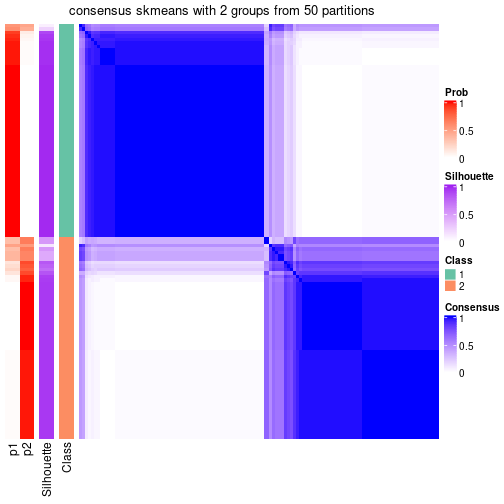</p>

</div>
<div id='tab-node-04-consensus-heatmap-2'>
<pre><code class="r">consensus_heatmap(res, k = 3)
</code></pre>

<p>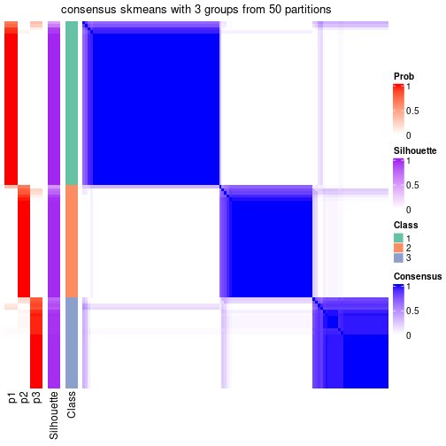</p>

</div>
<div id='tab-node-04-consensus-heatmap-3'>
<pre><code class="r">consensus_heatmap(res, k = 4)
</code></pre>

<p></p>

</div>
<div id='tab-node-04-consensus-heatmap-4'>
<pre><code class="r">consensus_heatmap(res, k = 5)
</code></pre>

<p>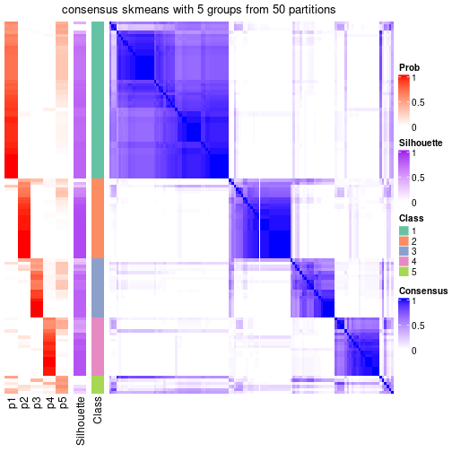</p>

</div>
<div id='tab-node-04-consensus-heatmap-5'>
<pre><code class="r">consensus_heatmap(res, k = 6)
</code></pre>

<p>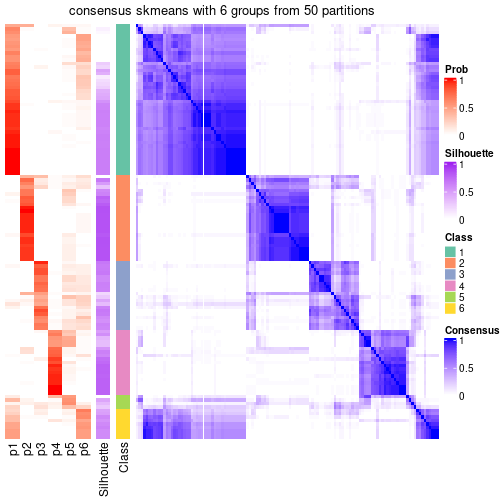</p>

</div>
<div id='tab-node-04-consensus-heatmap-6'>
<pre><code class="r">consensus_heatmap(res, k = 7)
</code></pre>

<p></p>

</div>
<div id='tab-node-04-consensus-heatmap-7'>
<pre><code class="r">consensus_heatmap(res, k = 8)
</code></pre>

<p>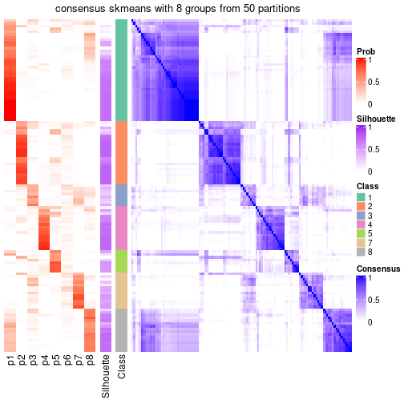</p>

</div>
</div>

Heatmaps for the membership of samples in all partitions to see how consistent they are:


<script>
$( function() {
	$( '#tabs-node-04-membership-heatmap' ).tabs();
} );
</script>
<div id='tabs-node-04-membership-heatmap'>
<ul>
<li><a href='#tab-node-04-membership-heatmap-1'>k = 2</a></li>
<li><a href='#tab-node-04-membership-heatmap-2'>k = 3</a></li>
<li><a href='#tab-node-04-membership-heatmap-3'>k = 4</a></li>
<li><a href='#tab-node-04-membership-heatmap-4'>k = 5</a></li>
<li><a href='#tab-node-04-membership-heatmap-5'>k = 6</a></li>
<li><a href='#tab-node-04-membership-heatmap-6'>k = 7</a></li>
<li><a href='#tab-node-04-membership-heatmap-7'>k = 8</a></li>
</ul>
<div id='tab-node-04-membership-heatmap-1'>
<pre><code class="r">membership_heatmap(res, k = 2)
</code></pre>

<p>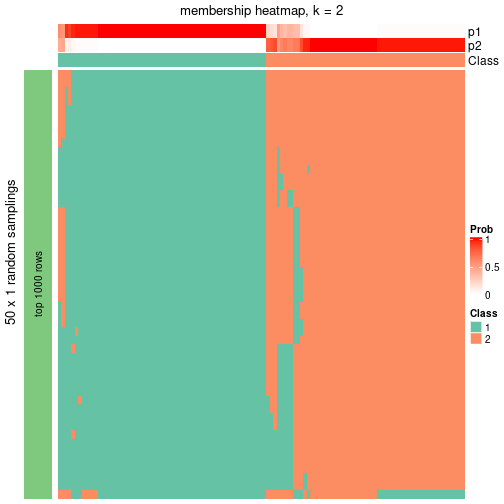</p>

</div>
<div id='tab-node-04-membership-heatmap-2'>
<pre><code class="r">membership_heatmap(res, k = 3)
</code></pre>

<p>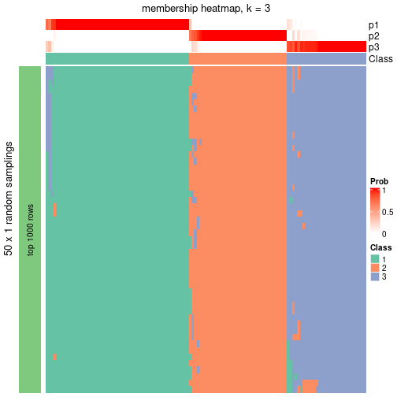</p>

</div>
<div id='tab-node-04-membership-heatmap-3'>
<pre><code class="r">membership_heatmap(res, k = 4)
</code></pre>

<p>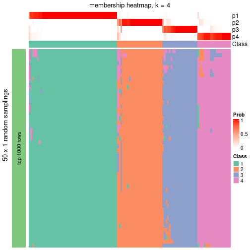</p>

</div>
<div id='tab-node-04-membership-heatmap-4'>
<pre><code class="r">membership_heatmap(res, k = 5)
</code></pre>

<p>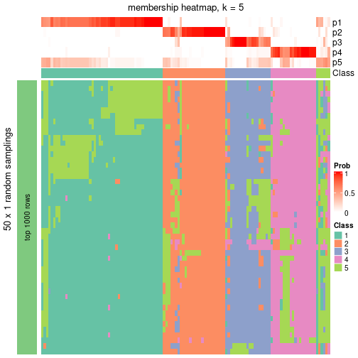</p>

</div>
<div id='tab-node-04-membership-heatmap-5'>
<pre><code class="r">membership_heatmap(res, k = 6)
</code></pre>

<p>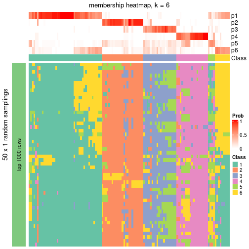</p>

</div>
<div id='tab-node-04-membership-heatmap-6'>
<pre><code class="r">membership_heatmap(res, k = 7)
</code></pre>

<p>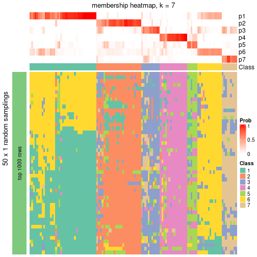</p>

</div>
<div id='tab-node-04-membership-heatmap-7'>
<pre><code class="r">membership_heatmap(res, k = 8)
</code></pre>

<p>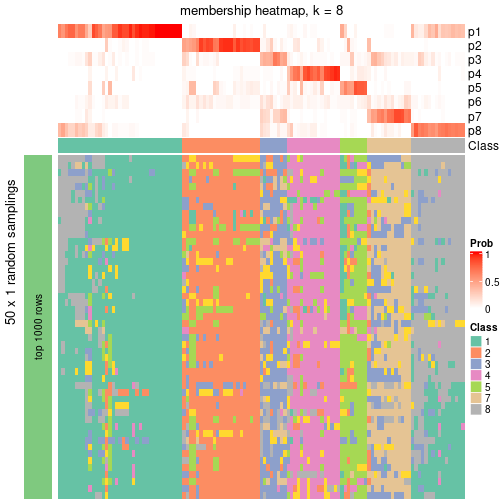</p>

</div>
</div>

As soon as the classes for columns are determined, the signatures
that are significantly different between subgroups can be looked for. 
Following are the heatmaps for signatures.


<script>
$( function() {
	$( '#tabs-node-04-get-signatures' ).tabs();
} );
</script>
<div id='tabs-node-04-get-signatures'>
<ul>
<li><a href='#tab-node-04-get-signatures-1'>k = 2</a></li>
<li><a href='#tab-node-04-get-signatures-2'>k = 3</a></li>
<li><a href='#tab-node-04-get-signatures-3'>k = 4</a></li>
<li><a href='#tab-node-04-get-signatures-4'>k = 5</a></li>
<li><a href='#tab-node-04-get-signatures-5'>k = 6</a></li>
<li><a href='#tab-node-04-get-signatures-6'>k = 7</a></li>
<li><a href='#tab-node-04-get-signatures-7'>k = 8</a></li>
</ul>
<div id='tab-node-04-get-signatures-1'>
<pre><code class="r">get_signatures(res, k = 2)
</code></pre>

<p>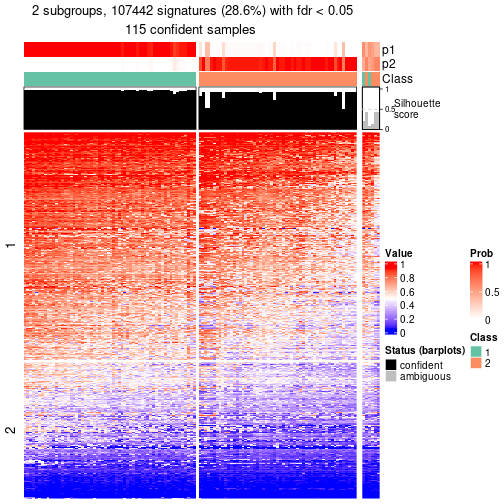</p>

</div>
<div id='tab-node-04-get-signatures-2'>
<pre><code class="r">get_signatures(res, k = 3)
</code></pre>

<p>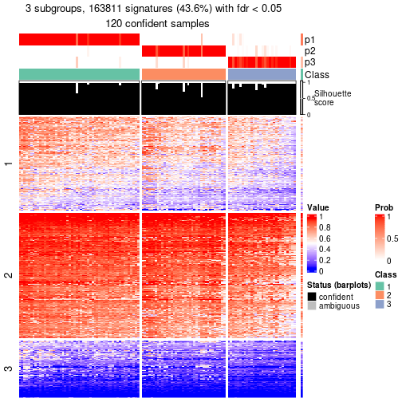</p>

</div>
<div id='tab-node-04-get-signatures-3'>
<pre><code class="r">get_signatures(res, k = 4)
</code></pre>

<p>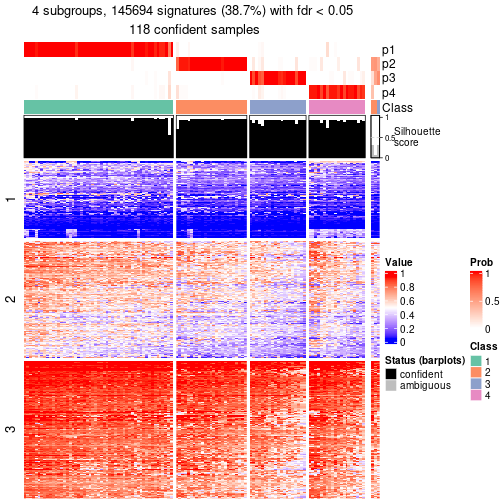</p>

</div>
<div id='tab-node-04-get-signatures-4'>
<pre><code class="r">get_signatures(res, k = 5)
</code></pre>

<p>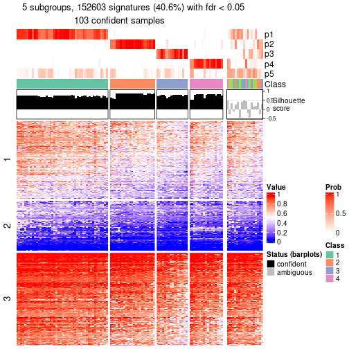</p>

</div>
<div id='tab-node-04-get-signatures-5'>
<pre><code class="r">get_signatures(res, k = 6)
</code></pre>

<p></p>

</div>
<div id='tab-node-04-get-signatures-6'>
<pre><code class="r">get_signatures(res, k = 7)
</code></pre>

<p></p>

</div>
<div id='tab-node-04-get-signatures-7'>
<pre><code class="r">get_signatures(res, k = 8)
</code></pre>

<p>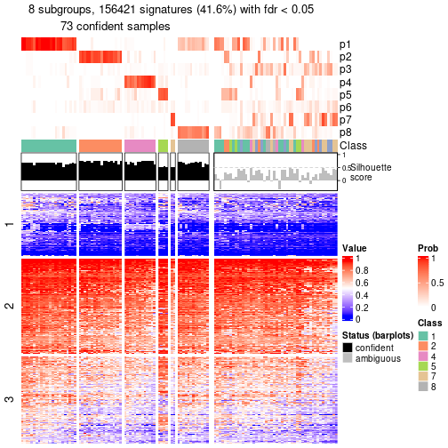</p>

</div>
</div>


Compare the overlap of signatures from different k:

```r
compare_signatures(res)
```

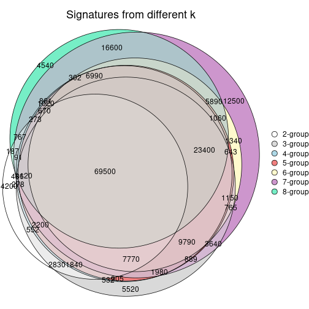

`get_signature()` returns a data frame invisibly. To get the list of signatures, the function
call should be assigned to a variable explicitly. In following code, if `plot` argument is set
to `FALSE`, no heatmap is plotted while only the differential analysis is performed.

```r
# code only for demonstration
tb = get_signature(res, k = ..., plot = FALSE)
```

An example of the output of `tb` is:

```
#>   which_row         fdr    mean_1    mean_2 scaled_mean_1 scaled_mean_2 km
#> 1        38 0.042760348  8.373488  9.131774    -0.5533452     0.5164555  1
#> 2        40 0.018707592  7.106213  8.469186    -0.6173731     0.5762149  1
#> 3        55 0.019134737 10.221463 11.207825    -0.6159697     0.5749050  1
#> 4        59 0.006059896  5.921854  7.869574    -0.6899429     0.6439467  1
#> 5        60 0.018055526  8.928898 10.211722    -0.6204761     0.5791110  1
#> 6        98 0.009384629 15.714769 14.887706     0.6635654    -0.6193277  2
...
```

The columns in `tb` are:

1. `which_row`: row indices corresponding to the input matrix.
2. `fdr`: FDR for the differential test. 
3. `mean_x`: The mean value in group x.
4. `scaled_mean_x`: The mean value in group x after rows are scaled.
5. `km`: Row groups if k-means clustering is applied to rows (which is done by automatically selecting number of clusters).

If there are too many signatures, `top_signatures = ...` can be set to only show the 
signatures with the highest FDRs:

```r
# code only for demonstration
# e.g. to show the top 500 most significant rows
tb = get_signature(res, k = ..., top_signatures = 500)
```

If the signatures are defined as these which are uniquely high in current group, `diff_method` argument
can be set to `"uniquely_high_in_one_group"`:

```r
# code only for demonstration
tb = get_signature(res, k = ..., diff_method = "uniquely_high_in_one_group")
```


UMAP plot which shows how samples are separated.


<script>
$( function() {
	$( '#tabs-node-04-dimension-reduction' ).tabs();
} );
</script>
<div id='tabs-node-04-dimension-reduction'>
<ul>
<li><a href='#tab-node-04-dimension-reduction-1'>k = 2</a></li>
<li><a href='#tab-node-04-dimension-reduction-2'>k = 3</a></li>
<li><a href='#tab-node-04-dimension-reduction-3'>k = 4</a></li>
<li><a href='#tab-node-04-dimension-reduction-4'>k = 5</a></li>
<li><a href='#tab-node-04-dimension-reduction-5'>k = 6</a></li>
<li><a href='#tab-node-04-dimension-reduction-6'>k = 7</a></li>
<li><a href='#tab-node-04-dimension-reduction-7'>k = 8</a></li>
</ul>
<div id='tab-node-04-dimension-reduction-1'>
<pre><code class="r">dimension_reduction(res, k = 2, method = &quot;UMAP&quot;)
</code></pre>

<p>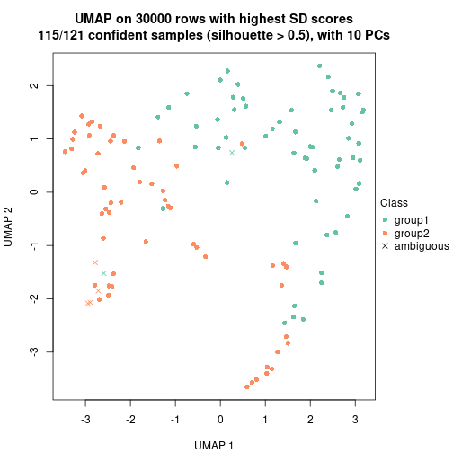</p>

</div>
<div id='tab-node-04-dimension-reduction-2'>
<pre><code class="r">dimension_reduction(res, k = 3, method = &quot;UMAP&quot;)
</code></pre>

<p>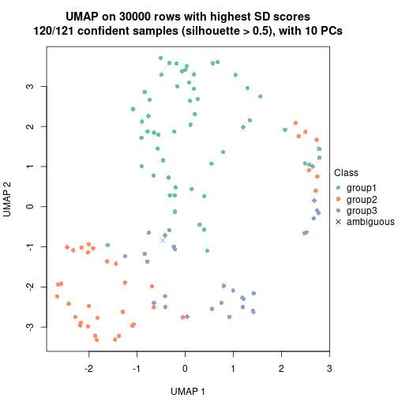</p>

</div>
<div id='tab-node-04-dimension-reduction-3'>
<pre><code class="r">dimension_reduction(res, k = 4, method = &quot;UMAP&quot;)
</code></pre>

<p>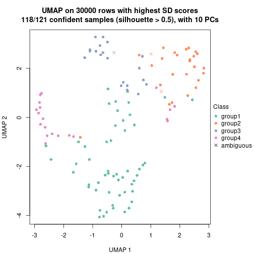</p>

</div>
<div id='tab-node-04-dimension-reduction-4'>
<pre><code class="r">dimension_reduction(res, k = 5, method = &quot;UMAP&quot;)
</code></pre>

<p></p>

</div>
<div id='tab-node-04-dimension-reduction-5'>
<pre><code class="r">dimension_reduction(res, k = 6, method = &quot;UMAP&quot;)
</code></pre>

<p>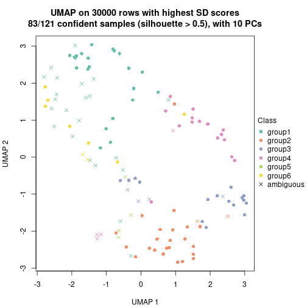</p>

</div>
<div id='tab-node-04-dimension-reduction-6'>
<pre><code class="r">dimension_reduction(res, k = 7, method = &quot;UMAP&quot;)
</code></pre>

<p>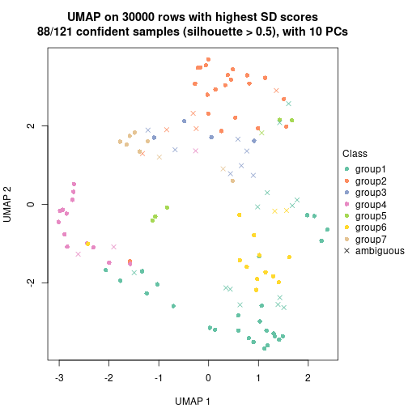</p>

</div>
<div id='tab-node-04-dimension-reduction-7'>
<pre><code class="r">dimension_reduction(res, k = 8, method = &quot;UMAP&quot;)
</code></pre>

<p>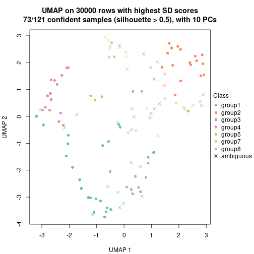</p>

</div>
</div>


Following heatmap shows how subgroups are split when increasing `k`:

```r
collect_classes(res)
```

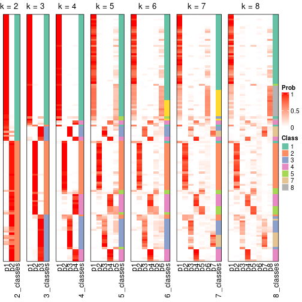


If matrix rows can be associated to genes, consider to use `functional_enrichment(res,
...)` to perform function enrichment for the signature genes. See [this vignette](https://jokergoo.github.io/cola_vignettes/functional_enrichment.html) for more detailed explanations.


 

---------------------------------------------------


### Node041


Parent node: [Node04](#Node04).
Child nodes: 
                Node0111-leaf
        ,
                Node0112-leaf
        ,
                Node0113-leaf
        ,
                Node0121-leaf
        ,
                Node0122-leaf
        ,
                Node0123-leaf
        ,
                Node0124-leaf
        ,
                Node0311-leaf
        ,
                Node0312-leaf
        ,
                Node0331-leaf
        ,
                Node0332-leaf
        ,
                Node0341-leaf
        ,
                Node0342-leaf
        ,
                Node0411-leaf
        ,
                [Node0412](#Node0412)
        ,
                Node0413-leaf
        ,
                Node0421-leaf
        ,
                Node0422-leaf
        ,
                Node0423-leaf
        ,
                Node0431-leaf
        ,
                [Node0432](#Node0432)
        ,
                Node0433-leaf
        ,
                Node0511-leaf
        ,
                Node0512-leaf
        ,
                Node0513-leaf
        ,
                [Node0521](#Node0521)
        ,
                Node0522-leaf
        ,
                Node0531-leaf
        ,
                Node0532-leaf
        ,
                Node0533-leaf
        .


The object with results only for a single top-value method and a single partitioning method 
can be extracted as:

```r
res = res_rh["041"]
```

A summary of `res` and all the functions that can be applied to it:

```r
res
```

```
#> A 'ConsensusPartition' object with k = 2, 3, 4, 5, 6, 7, 8.
#>   On a matrix with 30000 rows and 54 columns.
#>   Top rows (1000) are extracted by 'ATC' method.
#>   Subgroups are detected by 'kmeans' method.
#>   Performed in total 350 partitions by row resampling.
#>   Best k for subgroups seems to be 3.
#> 
#> Following methods can be applied to this 'ConsensusPartition' object:
#>  [1] "cola_report"             "collect_classes"         "collect_plots"          
#>  [4] "collect_stats"           "colnames"                "compare_partitions"     
#>  [7] "compare_signatures"      "consensus_heatmap"       "dimension_reduction"    
#> [10] "functional_enrichment"   "get_anno_col"            "get_anno"               
#> [13] "get_classes"             "get_consensus"           "get_matrix"             
#> [16] "get_membership"          "get_param"               "get_signatures"         
#> [19] "get_stats"               "is_best_k"               "is_stable_k"            
#> [22] "membership_heatmap"      "ncol"                    "nrow"                   
#> [25] "plot_ecdf"               "predict_classes"         "rownames"               
#> [28] "select_partition_number" "show"                    "suggest_best_k"         
#> [31] "test_to_known_factors"   "top_rows_heatmap"
```

`collect_plots()` function collects all the plots made from `res` for all `k` (number of subgroups)
into one single page to provide an easy and fast comparison between different `k`.

```r
collect_plots(res)
```

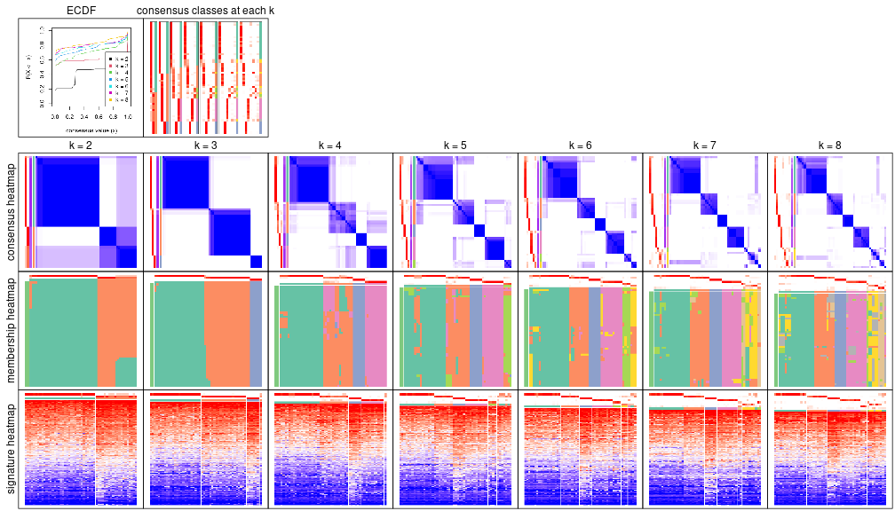

The plots are:

- The first row: a plot of the eCDF (empirical cumulative distribution
  function) curves of the consensus matrix for each `k` and the heatmap of
  predicted classes for each `k`.
- The second row: heatmaps of the consensus matrix for each `k`.
- The third row: heatmaps of the membership matrix for each `k`.
- The fouth row: heatmaps of the signatures for each `k`.

All the plots in panels can be made by individual functions and they are
plotted later in this section.

`select_partition_number()` produces several plots showing different
statistics for choosing "optimized" `k`. There are following statistics:

- eCDF curves of the consensus matrix for each `k`;
- 1-PAC. [The PAC score](https://en.wikipedia.org/wiki/Consensus_clustering#Over-interpretation_potential_of_consensus_clustering)
  measures the proportion of the ambiguous subgrouping.
- Mean silhouette score.
- Concordance. The mean probability of fiting the consensus subgroup labels in all
  partitions.
- Area increased. Denote $A_k$ as the area under the eCDF curve for current
  `k`, the area increased is defined as $A_k - A_{k-1}$.
- Rand index. The percent of pairs of samples that are both in a same cluster
  or both are not in a same cluster in the partition of k and k-1.
- Jaccard index. The ratio of pairs of samples are both in a same cluster in
  the partition of k and k-1 and the pairs of samples are both in a same
  cluster in the partition k or k-1.

The detailed explanations of these statistics can be found in [the _cola_
vignette](https://jokergoo.github.io/cola_vignettes/cola.html#toc_13).

Generally speaking, higher 1-PAC score, higher mean silhouette score or higher
concordance corresponds to better partition. Rand index and Jaccard index
measure how similar the current partition is compared to partition with `k-1`.
If they are too similar, we won't accept `k` is better than `k-1`.

```r
select_partition_number(res)
```

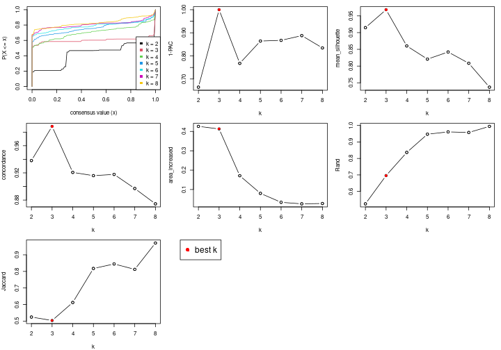

The numeric values for all these statistics can be obtained by `get_stats()`.

```r
get_stats(res)
```

```
#>   k 1-PAC mean_silhouette concordance area_increased  Rand Jaccard
#> 2 2 0.665           0.915       0.938         0.4262 0.525   0.525
#> 3 3 1.000           0.968       0.989         0.4129 0.696   0.504
#> 4 4 0.768           0.860       0.921         0.1713 0.836   0.613
#> 5 5 0.864           0.821       0.916         0.0801 0.947   0.818
#> 6 6 0.867           0.842       0.918         0.0340 0.961   0.845
#> 7 7 0.888           0.808       0.897         0.0261 0.957   0.812
#> 8 8 0.835           0.737       0.874         0.0278 0.994   0.971
```

`suggest_best_k()` suggests the best $k$ based on these statistics. The rules are as follows:

- All $k$ with Jaccard index larger than 0.95 are removed because increasing
  $k$ does not provide enough extra information. If all $k$ are removed, it is
  marked as no subgroup is detected.
- For all $k$ with 1-PAC score larger than 0.9, the maximal $k$ is taken as
  the best $k$, and other $k$ are marked as optional $k$.
- If it does not fit the second rule. The $k$ with the maximal vote of the
  highest 1-PAC score, highest mean silhouette, and highest concordance is
  taken as the best $k$.

```r
suggest_best_k(res)
```

```
#> [1] 3
```


Following is the table of the partitions (You need to click the **show/hide
code output** link to see it). The membership matrix (columns with name `p*`)
is inferred by
[`clue::cl_consensus()`](https://www.rdocumentation.org/link/cl_consensus?package=clue)
function with the `SE` method. Basically the value in the membership matrix
represents the probability to belong to a certain group. The finall subgroup
label for an item is determined with the group with highest probability it
belongs to.

In `get_classes()` function, the entropy is calculated from the membership
matrix and the silhouette score is calculated from the consensus matrix.


<script>
$( function() {
	$( '#tabs-node-041-get-classes' ).tabs();
} );
</script>
<div id='tabs-node-041-get-classes'>
<ul>
<li><a href='#tab-node-041-get-classes-1'>k = 2</a></li>
<li><a href='#tab-node-041-get-classes-2'>k = 3</a></li>
<li><a href='#tab-node-041-get-classes-3'>k = 4</a></li>
<li><a href='#tab-node-041-get-classes-4'>k = 5</a></li>
<li><a href='#tab-node-041-get-classes-5'>k = 6</a></li>
<li><a href='#tab-node-041-get-classes-6'>k = 7</a></li>
<li><a href='#tab-node-041-get-classes-7'>k = 8</a></li>
</ul>

<div id='tab-node-041-get-classes-1'>
<p><a id='tab-node-041-get-classes-1-a' style='color:#0366d6' href='#'>show/hide code output</a></p>
<pre><code class="r">cbind(get_classes(res, k = 2), get_membership(res, k = 2))
</code></pre>

<pre><code>#&gt;                 class entropy silhouette   p1   p2
#&gt; TCGA.22.5479.01     2   0.855      0.808 0.28 0.72
#&gt; TCGA.33.4586.01     1   0.000      0.988 1.00 0.00
#&gt; TCGA.LA.A7SW.01     1   0.000      0.988 1.00 0.00
#&gt; TCGA.77.8133.01     2   0.855      0.808 0.28 0.72
#&gt; TCGA.33.AASB.01     1   0.827      0.538 0.74 0.26
#&gt; TCGA.92.8063.01     1   0.000      0.988 1.00 0.00
#&gt; TCGA.92.8064.01     2   0.000      0.824 0.00 1.00
#&gt; TCGA.85.8052.01     1   0.000      0.988 1.00 0.00
#&gt; TCGA.52.7809.01     1   0.000      0.988 1.00 0.00
#&gt; TCGA.22.5474.01     2   0.795      0.817 0.24 0.76
#&gt; TCGA.56.5898.01     1   0.000      0.988 1.00 0.00
#&gt; TCGA.85.A4CN.01     1   0.000      0.988 1.00 0.00
#&gt; TCGA.18.3417.01     1   0.141      0.968 0.98 0.02
#&gt; TCGA.43.7657.01     1   0.000      0.988 1.00 0.00
#&gt; TCGA.85.7844.01     1   0.141      0.968 0.98 0.02
#&gt; TCGA.LA.A446.01     1   0.000      0.988 1.00 0.00
#&gt; TCGA.33.4566.01     2   0.000      0.824 0.00 1.00
#&gt; TCGA.77.A5G8.01     2   0.855      0.808 0.28 0.72
#&gt; TCGA.85.8479.01     2   0.000      0.824 0.00 1.00
#&gt; TCGA.58.A46K.01     1   0.000      0.988 1.00 0.00
#&gt; TCGA.94.8491.01     2   0.000      0.824 0.00 1.00
#&gt; TCGA.77.7335.01     2   0.000      0.824 0.00 1.00
#&gt; TCGA.34.A5IX.01     1   0.000      0.988 1.00 0.00
#&gt; TCGA.56.8504.01     2   0.855      0.808 0.28 0.72
#&gt; TCGA.77.7338.01     1   0.000      0.988 1.00 0.00
#&gt; TCGA.56.8626.01     1   0.000      0.988 1.00 0.00
#&gt; TCGA.43.8118.01     1   0.000      0.988 1.00 0.00
#&gt; TCGA.J1.A4AH.01     1   0.000      0.988 1.00 0.00
#&gt; TCGA.63.A5MP.01     2   0.855      0.808 0.28 0.72
#&gt; TCGA.56.A4BW.01     1   0.000      0.988 1.00 0.00
#&gt; TCGA.92.7340.01     2   0.000      0.824 0.00 1.00
#&gt; TCGA.77.7142.01     2   0.000      0.824 0.00 1.00
#&gt; TCGA.77.A5GA.01     2   0.855      0.808 0.28 0.72
#&gt; TCGA.58.A46L.01     1   0.000      0.988 1.00 0.00
#&gt; TCGA.94.A5I6.01     1   0.000      0.988 1.00 0.00
#&gt; TCGA.85.8276.01     2   0.827      0.814 0.26 0.74
#&gt; TCGA.O2.A52N.01     1   0.000      0.988 1.00 0.00
#&gt; TCGA.34.5928.01     1   0.000      0.988 1.00 0.00
#&gt; TCGA.85.6561.01     1   0.000      0.988 1.00 0.00
#&gt; TCGA.85.8350.01     1   0.000      0.988 1.00 0.00
#&gt; TCGA.NC.A5HK.01     2   0.000      0.824 0.00 1.00
#&gt; TCGA.98.A53J.01     2   0.855      0.808 0.28 0.72
#&gt; TCGA.33.A4WN.01     1   0.000      0.988 1.00 0.00
#&gt; TCGA.56.8305.01     1   0.000      0.988 1.00 0.00
#&gt; TCGA.39.5019.01     1   0.000      0.988 1.00 0.00
#&gt; TCGA.85.A53L.01     1   0.000      0.988 1.00 0.00
#&gt; TCGA.68.8251.01     1   0.141      0.968 0.98 0.02
#&gt; TCGA.NC.A5HL.01     2   0.855      0.808 0.28 0.72
#&gt; TCGA.68.A59J.01     1   0.000      0.988 1.00 0.00
#&gt; TCGA.85.A4CL.01     1   0.000      0.988 1.00 0.00
#&gt; TCGA.98.A539.01     1   0.000      0.988 1.00 0.00
#&gt; TCGA.85.A4QQ.01     2   0.855      0.808 0.28 0.72
#&gt; TCGA.56.A4ZK.01     1   0.000      0.988 1.00 0.00
#&gt; TCGA.98.A53I.01     2   0.000      0.824 0.00 1.00
</code></pre>

<script>
$('#tab-node-041-get-classes-1-a').parent().next().next().hide();
$('#tab-node-041-get-classes-1-a').click(function(){
  $('#tab-node-041-get-classes-1-a').parent().next().next().toggle();
  return(false);
});
</script>
</div>

<div id='tab-node-041-get-classes-2'>
<p><a id='tab-node-041-get-classes-2-a' style='color:#0366d6' href='#'>show/hide code output</a></p>
<pre><code class="r">cbind(get_classes(res, k = 3), get_membership(res, k = 3))
</code></pre>

<pre><code>#&gt;                 class entropy silhouette   p1   p2 p3
#&gt; TCGA.22.5479.01     2  0.0000      0.968 0.00 1.00  0
#&gt; TCGA.33.4586.01     1  0.0000      0.996 1.00 0.00  0
#&gt; TCGA.LA.A7SW.01     1  0.0000      0.996 1.00 0.00  0
#&gt; TCGA.77.8133.01     2  0.0000      0.968 0.00 1.00  0
#&gt; TCGA.33.AASB.01     2  0.0000      0.968 0.00 1.00  0
#&gt; TCGA.92.8063.01     1  0.0000      0.996 1.00 0.00  0
#&gt; TCGA.92.8064.01     2  0.0000      0.968 0.00 1.00  0
#&gt; TCGA.85.8052.01     1  0.0000      0.996 1.00 0.00  0
#&gt; TCGA.52.7809.01     1  0.0000      0.996 1.00 0.00  0
#&gt; TCGA.22.5474.01     2  0.0000      0.968 0.00 1.00  0
#&gt; TCGA.56.5898.01     1  0.0000      0.996 1.00 0.00  0
#&gt; TCGA.85.A4CN.01     2  0.0000      0.968 0.00 1.00  0
#&gt; TCGA.18.3417.01     2  0.0000      0.968 0.00 1.00  0
#&gt; TCGA.43.7657.01     1  0.0000      0.996 1.00 0.00  0
#&gt; TCGA.85.7844.01     2  0.0000      0.968 0.00 1.00  0
#&gt; TCGA.LA.A446.01     1  0.0000      0.996 1.00 0.00  0
#&gt; TCGA.33.4566.01     3  0.0000      1.000 0.00 0.00  1
#&gt; TCGA.77.A5G8.01     2  0.0000      0.968 0.00 1.00  0
#&gt; TCGA.85.8479.01     3  0.0000      1.000 0.00 0.00  1
#&gt; TCGA.58.A46K.01     2  0.0000      0.968 0.00 1.00  0
#&gt; TCGA.94.8491.01     3  0.0000      1.000 0.00 0.00  1
#&gt; TCGA.77.7335.01     2  0.0000      0.968 0.00 1.00  0
#&gt; TCGA.34.A5IX.01     2  0.6126      0.345 0.40 0.60  0
#&gt; TCGA.56.8504.01     2  0.0000      0.968 0.00 1.00  0
#&gt; TCGA.77.7338.01     1  0.0892      0.974 0.98 0.02  0
#&gt; TCGA.56.8626.01     1  0.0000      0.996 1.00 0.00  0
#&gt; TCGA.43.8118.01     1  0.0000      0.996 1.00 0.00  0
#&gt; TCGA.J1.A4AH.01     1  0.0000      0.996 1.00 0.00  0
#&gt; TCGA.63.A5MP.01     2  0.0000      0.968 0.00 1.00  0
#&gt; TCGA.56.A4BW.01     1  0.0000      0.996 1.00 0.00  0
#&gt; TCGA.92.7340.01     3  0.0000      1.000 0.00 0.00  1
#&gt; TCGA.77.7142.01     3  0.0000      1.000 0.00 0.00  1
#&gt; TCGA.77.A5GA.01     2  0.0000      0.968 0.00 1.00  0
#&gt; TCGA.58.A46L.01     1  0.0000      0.996 1.00 0.00  0
#&gt; TCGA.94.A5I6.01     1  0.0000      0.996 1.00 0.00  0
#&gt; TCGA.85.8276.01     2  0.0000      0.968 0.00 1.00  0
#&gt; TCGA.O2.A52N.01     2  0.2537      0.880 0.08 0.92  0
#&gt; TCGA.34.5928.01     1  0.0000      0.996 1.00 0.00  0
#&gt; TCGA.85.6561.01     2  0.2066      0.904 0.06 0.94  0
#&gt; TCGA.85.8350.01     1  0.0000      0.996 1.00 0.00  0
#&gt; TCGA.NC.A5HK.01     2  0.0000      0.968 0.00 1.00  0
#&gt; TCGA.98.A53J.01     2  0.0000      0.968 0.00 1.00  0
#&gt; TCGA.33.A4WN.01     1  0.0000      0.996 1.00 0.00  0
#&gt; TCGA.56.8305.01     1  0.0000      0.996 1.00 0.00  0
#&gt; TCGA.39.5019.01     1  0.0000      0.996 1.00 0.00  0
#&gt; TCGA.85.A53L.01     1  0.0000      0.996 1.00 0.00  0
#&gt; TCGA.68.8251.01     2  0.0000      0.968 0.00 1.00  0
#&gt; TCGA.NC.A5HL.01     2  0.0000      0.968 0.00 1.00  0
#&gt; TCGA.68.A59J.01     1  0.2066      0.923 0.94 0.06  0
#&gt; TCGA.85.A4CL.01     1  0.0000      0.996 1.00 0.00  0
#&gt; TCGA.98.A539.01     1  0.0000      0.996 1.00 0.00  0
#&gt; TCGA.85.A4QQ.01     2  0.0000      0.968 0.00 1.00  0
#&gt; TCGA.56.A4ZK.01     1  0.0000      0.996 1.00 0.00  0
#&gt; TCGA.98.A53I.01     3  0.0000      1.000 0.00 0.00  1
</code></pre>

<script>
$('#tab-node-041-get-classes-2-a').parent().next().next().hide();
$('#tab-node-041-get-classes-2-a').click(function(){
  $('#tab-node-041-get-classes-2-a').parent().next().next().toggle();
  return(false);
});
</script>
</div>

<div id='tab-node-041-get-classes-3'>
<p><a id='tab-node-041-get-classes-3-a' style='color:#0366d6' href='#'>show/hide code output</a></p>
<pre><code class="r">cbind(get_classes(res, k = 4), get_membership(res, k = 4))
</code></pre>

<pre><code>#&gt;                 class entropy silhouette   p1   p2  p3   p4
#&gt; TCGA.22.5479.01     4  0.0000      0.982 0.00 0.00 0.0 1.00
#&gt; TCGA.33.4586.01     1  0.2921      0.843 0.86 0.14 0.0 0.00
#&gt; TCGA.LA.A7SW.01     1  0.0000      0.967 1.00 0.00 0.0 0.00
#&gt; TCGA.77.8133.01     4  0.0000      0.982 0.00 0.00 0.0 1.00
#&gt; TCGA.33.AASB.01     2  0.1637      0.695 0.00 0.94 0.0 0.06
#&gt; TCGA.92.8063.01     1  0.0000      0.967 1.00 0.00 0.0 0.00
#&gt; TCGA.92.8064.01     4  0.0000      0.982 0.00 0.00 0.0 1.00
#&gt; TCGA.85.8052.01     1  0.0000      0.967 1.00 0.00 0.0 0.00
#&gt; TCGA.52.7809.01     1  0.0000      0.967 1.00 0.00 0.0 0.00
#&gt; TCGA.22.5474.01     4  0.0000      0.982 0.00 0.00 0.0 1.00
#&gt; TCGA.56.5898.01     1  0.0000      0.967 1.00 0.00 0.0 0.00
#&gt; TCGA.85.A4CN.01     2  0.4522      0.617 0.00 0.68 0.0 0.32
#&gt; TCGA.18.3417.01     2  0.1637      0.695 0.00 0.94 0.0 0.06
#&gt; TCGA.43.7657.01     1  0.0000      0.967 1.00 0.00 0.0 0.00
#&gt; TCGA.85.7844.01     2  0.4134      0.674 0.00 0.74 0.0 0.26
#&gt; TCGA.LA.A446.01     1  0.0000      0.967 1.00 0.00 0.0 0.00
#&gt; TCGA.33.4566.01     3  0.0000      1.000 0.00 0.00 1.0 0.00
#&gt; TCGA.77.A5G8.01     4  0.0000      0.982 0.00 0.00 0.0 1.00
#&gt; TCGA.85.8479.01     3  0.0000      1.000 0.00 0.00 1.0 0.00
#&gt; TCGA.58.A46K.01     2  0.4134      0.674 0.00 0.74 0.0 0.26
#&gt; TCGA.94.8491.01     3  0.0000      1.000 0.00 0.00 1.0 0.00
#&gt; TCGA.77.7335.01     4  0.0000      0.982 0.00 0.00 0.0 1.00
#&gt; TCGA.34.A5IX.01     2  0.2921      0.687 0.14 0.86 0.0 0.00
#&gt; TCGA.56.8504.01     4  0.0000      0.982 0.00 0.00 0.0 1.00
#&gt; TCGA.77.7338.01     2  0.4994      0.115 0.48 0.52 0.0 0.00
#&gt; TCGA.56.8626.01     1  0.0000      0.967 1.00 0.00 0.0 0.00
#&gt; TCGA.43.8118.01     1  0.0000      0.967 1.00 0.00 0.0 0.00
#&gt; TCGA.J1.A4AH.01     2  0.4277      0.604 0.28 0.72 0.0 0.00
#&gt; TCGA.63.A5MP.01     4  0.0000      0.982 0.00 0.00 0.0 1.00
#&gt; TCGA.56.A4BW.01     1  0.0000      0.967 1.00 0.00 0.0 0.00
#&gt; TCGA.92.7340.01     3  0.0000      1.000 0.00 0.00 1.0 0.00
#&gt; TCGA.77.7142.01     3  0.0000      1.000 0.00 0.00 1.0 0.00
#&gt; TCGA.77.A5GA.01     4  0.2011      0.884 0.00 0.08 0.0 0.92
#&gt; TCGA.58.A46L.01     1  0.0000      0.967 1.00 0.00 0.0 0.00
#&gt; TCGA.94.A5I6.01     1  0.2921      0.843 0.86 0.14 0.0 0.00
#&gt; TCGA.85.8276.01     4  0.0000      0.982 0.00 0.00 0.0 1.00
#&gt; TCGA.O2.A52N.01     2  0.0707      0.696 0.02 0.98 0.0 0.00
#&gt; TCGA.34.5928.01     1  0.0000      0.967 1.00 0.00 0.0 0.00
#&gt; TCGA.85.6561.01     2  0.4642      0.686 0.02 0.74 0.0 0.24
#&gt; TCGA.85.8350.01     1  0.0000      0.967 1.00 0.00 0.0 0.00
#&gt; TCGA.NC.A5HK.01     2  0.4610      0.598 0.00 0.80 0.1 0.10
#&gt; TCGA.98.A53J.01     4  0.1637      0.918 0.00 0.06 0.0 0.94
#&gt; TCGA.33.A4WN.01     1  0.3172      0.818 0.84 0.16 0.0 0.00
#&gt; TCGA.56.8305.01     1  0.0000      0.967 1.00 0.00 0.0 0.00
#&gt; TCGA.39.5019.01     1  0.0000      0.967 1.00 0.00 0.0 0.00
#&gt; TCGA.85.A53L.01     1  0.2647      0.863 0.88 0.12 0.0 0.00
#&gt; TCGA.68.8251.01     2  0.4855      0.516 0.00 0.60 0.0 0.40
#&gt; TCGA.NC.A5HL.01     2  0.4713      0.562 0.00 0.64 0.0 0.36
#&gt; TCGA.68.A59J.01     2  0.4134      0.629 0.26 0.74 0.0 0.00
#&gt; TCGA.85.A4CL.01     1  0.0000      0.967 1.00 0.00 0.0 0.00
#&gt; TCGA.98.A539.01     1  0.0000      0.967 1.00 0.00 0.0 0.00
#&gt; TCGA.85.A4QQ.01     2  0.3400      0.621 0.00 0.82 0.0 0.18
#&gt; TCGA.56.A4ZK.01     1  0.1211      0.935 0.96 0.04 0.0 0.00
#&gt; TCGA.98.A53I.01     3  0.0000      1.000 0.00 0.00 1.0 0.00
</code></pre>

<script>
$('#tab-node-041-get-classes-3-a').parent().next().next().hide();
$('#tab-node-041-get-classes-3-a').click(function(){
  $('#tab-node-041-get-classes-3-a').parent().next().next().toggle();
  return(false);
});
</script>
</div>

<div id='tab-node-041-get-classes-4'>
<p><a id='tab-node-041-get-classes-4-a' style='color:#0366d6' href='#'>show/hide code output</a></p>
<pre><code class="r">cbind(get_classes(res, k = 5), get_membership(res, k = 5))
</code></pre>

<pre><code>#&gt;                 class entropy silhouette   p1   p2   p3   p4   p5
#&gt; TCGA.22.5479.01     4  0.0000      0.972 0.00 0.00 0.00 1.00 0.00
#&gt; TCGA.33.4586.01     1  0.4675      0.382 0.60 0.38 0.00 0.00 0.02
#&gt; TCGA.LA.A7SW.01     1  0.1732      0.858 0.92 0.00 0.00 0.00 0.08
#&gt; TCGA.77.8133.01     4  0.0000      0.972 0.00 0.00 0.00 1.00 0.00
#&gt; TCGA.33.AASB.01     5  0.2873      0.889 0.00 0.12 0.00 0.02 0.86
#&gt; TCGA.92.8063.01     1  0.1732      0.858 0.92 0.00 0.00 0.00 0.08
#&gt; TCGA.92.8064.01     4  0.0000      0.972 0.00 0.00 0.00 1.00 0.00
#&gt; TCGA.85.8052.01     1  0.0000      0.890 1.00 0.00 0.00 0.00 0.00
#&gt; TCGA.52.7809.01     1  0.0609      0.886 0.98 0.00 0.00 0.00 0.02
#&gt; TCGA.22.5474.01     4  0.0000      0.972 0.00 0.00 0.00 1.00 0.00
#&gt; TCGA.56.5898.01     1  0.0000      0.890 1.00 0.00 0.00 0.00 0.00
#&gt; TCGA.85.A4CN.01     2  0.2331      0.754 0.00 0.90 0.00 0.08 0.02
#&gt; TCGA.18.3417.01     5  0.3999      0.825 0.00 0.24 0.00 0.02 0.74
#&gt; TCGA.43.7657.01     1  0.0000      0.890 1.00 0.00 0.00 0.00 0.00
#&gt; TCGA.85.7844.01     2  0.0609      0.796 0.00 0.98 0.00 0.00 0.02
#&gt; TCGA.LA.A446.01     1  0.0000      0.890 1.00 0.00 0.00 0.00 0.00
#&gt; TCGA.33.4566.01     3  0.0000      1.000 0.00 0.00 1.00 0.00 0.00
#&gt; TCGA.77.A5G8.01     4  0.0000      0.972 0.00 0.00 0.00 1.00 0.00
#&gt; TCGA.85.8479.01     3  0.0000      1.000 0.00 0.00 1.00 0.00 0.00
#&gt; TCGA.58.A46K.01     2  0.0609      0.796 0.00 0.98 0.00 0.00 0.02
#&gt; TCGA.94.8491.01     3  0.0000      1.000 0.00 0.00 1.00 0.00 0.00
#&gt; TCGA.77.7335.01     4  0.0000      0.972 0.00 0.00 0.00 1.00 0.00
#&gt; TCGA.34.A5IX.01     2  0.0609      0.796 0.00 0.98 0.00 0.00 0.02
#&gt; TCGA.56.8504.01     4  0.0000      0.972 0.00 0.00 0.00 1.00 0.00
#&gt; TCGA.77.7338.01     2  0.2012      0.769 0.06 0.92 0.00 0.00 0.02
#&gt; TCGA.56.8626.01     1  0.1043      0.880 0.96 0.00 0.00 0.00 0.04
#&gt; TCGA.43.8118.01     1  0.0000      0.890 1.00 0.00 0.00 0.00 0.00
#&gt; TCGA.J1.A4AH.01     2  0.0609      0.791 0.02 0.98 0.00 0.00 0.00
#&gt; TCGA.63.A5MP.01     4  0.0000      0.972 0.00 0.00 0.00 1.00 0.00
#&gt; TCGA.56.A4BW.01     1  0.1043      0.880 0.96 0.00 0.00 0.00 0.04
#&gt; TCGA.92.7340.01     3  0.0000      1.000 0.00 0.00 1.00 0.00 0.00
#&gt; TCGA.77.7142.01     3  0.0000      1.000 0.00 0.00 1.00 0.00 0.00
#&gt; TCGA.77.A5GA.01     4  0.1216      0.932 0.00 0.02 0.00 0.96 0.02
#&gt; TCGA.58.A46L.01     1  0.0000      0.890 1.00 0.00 0.00 0.00 0.00
#&gt; TCGA.94.A5I6.01     1  0.4613      0.424 0.62 0.36 0.00 0.00 0.02
#&gt; TCGA.85.8276.01     4  0.0000      0.972 0.00 0.00 0.00 1.00 0.00
#&gt; TCGA.O2.A52N.01     2  0.2280      0.734 0.00 0.88 0.00 0.00 0.12
#&gt; TCGA.34.5928.01     1  0.1732      0.858 0.92 0.00 0.00 0.00 0.08
#&gt; TCGA.85.6561.01     2  0.0609      0.796 0.00 0.98 0.00 0.00 0.02
#&gt; TCGA.85.8350.01     1  0.0609      0.886 0.98 0.00 0.00 0.00 0.02
#&gt; TCGA.NC.A5HK.01     5  0.2675      0.834 0.00 0.04 0.02 0.04 0.90
#&gt; TCGA.98.A53J.01     4  0.2929      0.743 0.00 0.18 0.00 0.82 0.00
#&gt; TCGA.33.A4WN.01     2  0.3796      0.450 0.30 0.70 0.00 0.00 0.00
#&gt; TCGA.56.8305.01     1  0.0000      0.890 1.00 0.00 0.00 0.00 0.00
#&gt; TCGA.39.5019.01     1  0.0000      0.890 1.00 0.00 0.00 0.00 0.00
#&gt; TCGA.85.A53L.01     1  0.4227      0.298 0.58 0.42 0.00 0.00 0.00
#&gt; TCGA.68.8251.01     2  0.4456      0.422 0.00 0.66 0.00 0.32 0.02
#&gt; TCGA.NC.A5HL.01     2  0.5927      0.277 0.00 0.54 0.00 0.34 0.12
#&gt; TCGA.68.A59J.01     2  0.2280      0.734 0.00 0.88 0.00 0.00 0.12
#&gt; TCGA.85.A4CL.01     1  0.0000      0.890 1.00 0.00 0.00 0.00 0.00
#&gt; TCGA.98.A539.01     1  0.0000      0.890 1.00 0.00 0.00 0.00 0.00
#&gt; TCGA.85.A4QQ.01     5  0.4075      0.879 0.00 0.16 0.00 0.06 0.78
#&gt; TCGA.56.A4ZK.01     1  0.4227      0.248 0.58 0.42 0.00 0.00 0.00
#&gt; TCGA.98.A53I.01     3  0.0000      1.000 0.00 0.00 1.00 0.00 0.00
</code></pre>

<script>
$('#tab-node-041-get-classes-4-a').parent().next().next().hide();
$('#tab-node-041-get-classes-4-a').click(function(){
  $('#tab-node-041-get-classes-4-a').parent().next().next().toggle();
  return(false);
});
</script>
</div>

<div id='tab-node-041-get-classes-5'>
<p><a id='tab-node-041-get-classes-5-a' style='color:#0366d6' href='#'>show/hide code output</a></p>
<pre><code class="r">cbind(get_classes(res, k = 6), get_membership(res, k = 6))
</code></pre>

<pre><code>#&gt;                 class entropy silhouette   p1   p2 p3   p4   p5   p6
#&gt; TCGA.22.5479.01     4  0.0000      0.930 0.00 0.00  0 1.00 0.00 0.00
#&gt; TCGA.33.4586.01     1  0.5569      0.165 0.52 0.16  0 0.00 0.00 0.32
#&gt; TCGA.LA.A7SW.01     1  0.2094      0.868 0.90 0.00  0 0.00 0.02 0.08
#&gt; TCGA.77.8133.01     4  0.0000      0.930 0.00 0.00  0 1.00 0.00 0.00
#&gt; TCGA.33.AASB.01     5  0.1480      0.898 0.00 0.02  0 0.00 0.94 0.04
#&gt; TCGA.92.8063.01     1  0.2094      0.868 0.90 0.00  0 0.00 0.02 0.08
#&gt; TCGA.92.8064.01     4  0.1267      0.915 0.00 0.00  0 0.94 0.00 0.06
#&gt; TCGA.85.8052.01     1  0.0000      0.913 1.00 0.00  0 0.00 0.00 0.00
#&gt; TCGA.52.7809.01     1  0.0547      0.909 0.98 0.00  0 0.00 0.00 0.02
#&gt; TCGA.22.5474.01     4  0.0547      0.926 0.00 0.00  0 0.98 0.00 0.02
#&gt; TCGA.56.5898.01     1  0.0000      0.913 1.00 0.00  0 0.00 0.00 0.00
#&gt; TCGA.85.A4CN.01     2  0.0547      0.826 0.00 0.98  0 0.02 0.00 0.00
#&gt; TCGA.18.3417.01     5  0.2048      0.821 0.00 0.12  0 0.00 0.88 0.00
#&gt; TCGA.43.7657.01     1  0.0000      0.913 1.00 0.00  0 0.00 0.00 0.00
#&gt; TCGA.85.7844.01     2  0.0547      0.832 0.00 0.98  0 0.00 0.02 0.00
#&gt; TCGA.LA.A446.01     1  0.0000      0.913 1.00 0.00  0 0.00 0.00 0.00
#&gt; TCGA.33.4566.01     3  0.0000      1.000 0.00 0.00  1 0.00 0.00 0.00
#&gt; TCGA.77.A5G8.01     4  0.0000      0.930 0.00 0.00  0 1.00 0.00 0.00
#&gt; TCGA.85.8479.01     3  0.0000      1.000 0.00 0.00  1 0.00 0.00 0.00
#&gt; TCGA.58.A46K.01     2  0.0000      0.834 0.00 1.00  0 0.00 0.00 0.00
#&gt; TCGA.94.8491.01     3  0.0000      1.000 0.00 0.00  1 0.00 0.00 0.00
#&gt; TCGA.77.7335.01     4  0.1267      0.915 0.00 0.00  0 0.94 0.00 0.06
#&gt; TCGA.34.A5IX.01     2  0.0547      0.832 0.00 0.98  0 0.00 0.02 0.00
#&gt; TCGA.56.8504.01     4  0.0000      0.930 0.00 0.00  0 1.00 0.00 0.00
#&gt; TCGA.77.7338.01     2  0.0000      0.834 0.00 1.00  0 0.00 0.00 0.00
#&gt; TCGA.56.8626.01     1  0.0547      0.909 0.98 0.00  0 0.00 0.00 0.02
#&gt; TCGA.43.8118.01     1  0.0000      0.913 1.00 0.00  0 0.00 0.00 0.00
#&gt; TCGA.J1.A4AH.01     2  0.1267      0.775 0.00 0.94  0 0.00 0.00 0.06
#&gt; TCGA.63.A5MP.01     4  0.0547      0.928 0.00 0.00  0 0.98 0.00 0.02
#&gt; TCGA.56.A4BW.01     1  0.0547      0.909 0.98 0.00  0 0.00 0.00 0.02
#&gt; TCGA.92.7340.01     3  0.0000      1.000 0.00 0.00  1 0.00 0.00 0.00
#&gt; TCGA.77.7142.01     3  0.0000      1.000 0.00 0.00  1 0.00 0.00 0.00
#&gt; TCGA.77.A5GA.01     4  0.0937      0.904 0.00 0.04  0 0.96 0.00 0.00
#&gt; TCGA.58.A46L.01     1  0.0000      0.913 1.00 0.00  0 0.00 0.00 0.00
#&gt; TCGA.94.A5I6.01     1  0.5569      0.165 0.52 0.16  0 0.00 0.00 0.32
#&gt; TCGA.85.8276.01     4  0.0547      0.928 0.00 0.00  0 0.98 0.00 0.02
#&gt; TCGA.O2.A52N.01     6  0.3499      0.947 0.00 0.32  0 0.00 0.00 0.68
#&gt; TCGA.34.5928.01     1  0.2094      0.868 0.90 0.00  0 0.00 0.02 0.08
#&gt; TCGA.85.6561.01     2  0.0000      0.834 0.00 1.00  0 0.00 0.00 0.00
#&gt; TCGA.85.8350.01     1  0.0547      0.909 0.98 0.00  0 0.00 0.00 0.02
#&gt; TCGA.NC.A5HK.01     5  0.2793      0.835 0.00 0.00  0 0.00 0.80 0.20
#&gt; TCGA.98.A53J.01     4  0.5523      0.146 0.00 0.14  0 0.50 0.00 0.36
#&gt; TCGA.33.A4WN.01     2  0.2793      0.607 0.20 0.80  0 0.00 0.00 0.00
#&gt; TCGA.56.8305.01     1  0.0000      0.913 1.00 0.00  0 0.00 0.00 0.00
#&gt; TCGA.39.5019.01     1  0.0000      0.913 1.00 0.00  0 0.00 0.00 0.00
#&gt; TCGA.85.A53L.01     1  0.3711      0.619 0.72 0.26  0 0.00 0.00 0.02
#&gt; TCGA.68.8251.01     2  0.2581      0.700 0.00 0.86  0 0.12 0.02 0.00
#&gt; TCGA.NC.A5HL.01     6  0.4067      0.900 0.00 0.26  0 0.04 0.00 0.70
#&gt; TCGA.68.A59J.01     6  0.3499      0.947 0.00 0.32  0 0.00 0.00 0.68
#&gt; TCGA.85.A4CL.01     1  0.0000      0.913 1.00 0.00  0 0.00 0.00 0.00
#&gt; TCGA.98.A539.01     1  0.0000      0.913 1.00 0.00  0 0.00 0.00 0.00
#&gt; TCGA.85.A4QQ.01     5  0.0547      0.897 0.00 0.02  0 0.00 0.98 0.00
#&gt; TCGA.56.A4ZK.01     2  0.3499      0.451 0.32 0.68  0 0.00 0.00 0.00
#&gt; TCGA.98.A53I.01     3  0.0000      1.000 0.00 0.00  1 0.00 0.00 0.00
</code></pre>

<script>
$('#tab-node-041-get-classes-5-a').parent().next().next().hide();
$('#tab-node-041-get-classes-5-a').click(function(){
  $('#tab-node-041-get-classes-5-a').parent().next().next().toggle();
  return(false);
});
</script>
</div>

<div id='tab-node-041-get-classes-6'>
<p><a id='tab-node-041-get-classes-6-a' style='color:#0366d6' href='#'>show/hide code output</a></p>
<pre><code class="r">cbind(get_classes(res, k = 7), get_membership(res, k = 7))
</code></pre>

<pre><code>#&gt;                 class entropy silhouette   p1   p2 p3   p4   p5   p6   p7
#&gt; TCGA.22.5479.01     4  0.0000      0.977 0.00 0.00  0 1.00 0.00 0.00 0.00
#&gt; TCGA.33.4586.01     6  0.5429      0.264 0.40 0.02  0 0.00 0.00 0.46 0.12
#&gt; TCGA.LA.A7SW.01     1  0.1671      0.865 0.90 0.00  0 0.00 0.00 0.00 0.10
#&gt; TCGA.77.8133.01     4  0.0000      0.977 0.00 0.00  0 1.00 0.00 0.00 0.00
#&gt; TCGA.33.AASB.01     5  0.4214     -0.451 0.00 0.00  0 0.00 0.56 0.04 0.40
#&gt; TCGA.92.8063.01     1  0.2572      0.781 0.80 0.00  0 0.00 0.00 0.00 0.20
#&gt; TCGA.92.8064.01     4  0.0863      0.972 0.00 0.00  0 0.96 0.00 0.04 0.00
#&gt; TCGA.85.8052.01     1  0.0000      0.928 1.00 0.00  0 0.00 0.00 0.00 0.00
#&gt; TCGA.52.7809.01     1  0.0000      0.928 1.00 0.00  0 0.00 0.00 0.00 0.00
#&gt; TCGA.22.5474.01     4  0.0000      0.977 0.00 0.00  0 1.00 0.00 0.00 0.00
#&gt; TCGA.56.5898.01     1  0.0000      0.928 1.00 0.00  0 0.00 0.00 0.00 0.00
#&gt; TCGA.85.A4CN.01     2  0.0504      0.903 0.00 0.98  0 0.02 0.00 0.00 0.00
#&gt; TCGA.18.3417.01     7  0.4426      0.903 0.00 0.06  0 0.00 0.38 0.00 0.56
#&gt; TCGA.43.7657.01     1  0.0000      0.928 1.00 0.00  0 0.00 0.00 0.00 0.00
#&gt; TCGA.85.7844.01     2  0.1886      0.868 0.00 0.88  0 0.00 0.00 0.00 0.12
#&gt; TCGA.LA.A446.01     1  0.0000      0.928 1.00 0.00  0 0.00 0.00 0.00 0.00
#&gt; TCGA.33.4566.01     3  0.0000      1.000 0.00 0.00  1 0.00 0.00 0.00 0.00
#&gt; TCGA.77.A5G8.01     4  0.0000      0.977 0.00 0.00  0 1.00 0.00 0.00 0.00
#&gt; TCGA.85.8479.01     3  0.0000      1.000 0.00 0.00  1 0.00 0.00 0.00 0.00
#&gt; TCGA.58.A46K.01     2  0.1166      0.894 0.00 0.94  0 0.00 0.00 0.00 0.06
#&gt; TCGA.94.8491.01     3  0.0000      1.000 0.00 0.00  1 0.00 0.00 0.00 0.00
#&gt; TCGA.77.7335.01     4  0.0863      0.972 0.00 0.00  0 0.96 0.00 0.04 0.00
#&gt; TCGA.34.A5IX.01     2  0.3086      0.804 0.00 0.80  0 0.00 0.00 0.04 0.16
#&gt; TCGA.56.8504.01     4  0.0000      0.977 0.00 0.00  0 1.00 0.00 0.00 0.00
#&gt; TCGA.77.7338.01     2  0.0504      0.903 0.00 0.98  0 0.02 0.00 0.00 0.00
#&gt; TCGA.56.8626.01     1  0.1166      0.898 0.94 0.00  0 0.00 0.00 0.00 0.06
#&gt; TCGA.43.8118.01     1  0.0000      0.928 1.00 0.00  0 0.00 0.00 0.00 0.00
#&gt; TCGA.J1.A4AH.01     2  0.0863      0.894 0.00 0.96  0 0.00 0.00 0.00 0.04
#&gt; TCGA.63.A5MP.01     4  0.0863      0.972 0.00 0.00  0 0.96 0.00 0.04 0.00
#&gt; TCGA.56.A4BW.01     1  0.1671      0.865 0.90 0.00  0 0.00 0.00 0.00 0.10
#&gt; TCGA.92.7340.01     3  0.0000      1.000 0.00 0.00  1 0.00 0.00 0.00 0.00
#&gt; TCGA.77.7142.01     3  0.0000      1.000 0.00 0.00  1 0.00 0.00 0.00 0.00
#&gt; TCGA.77.A5GA.01     4  0.1166      0.938 0.00 0.00  0 0.94 0.00 0.00 0.06
#&gt; TCGA.58.A46L.01     1  0.0504      0.919 0.98 0.00  0 0.00 0.00 0.00 0.02
#&gt; TCGA.94.A5I6.01     6  0.5429      0.264 0.40 0.02  0 0.00 0.00 0.46 0.12
#&gt; TCGA.85.8276.01     4  0.0863      0.972 0.00 0.00  0 0.96 0.00 0.04 0.00
#&gt; TCGA.O2.A52N.01     6  0.1433      0.480 0.00 0.08  0 0.00 0.00 0.92 0.00
#&gt; TCGA.34.5928.01     1  0.1671      0.865 0.90 0.00  0 0.00 0.00 0.00 0.10
#&gt; TCGA.85.6561.01     2  0.0000      0.902 0.00 1.00  0 0.00 0.00 0.00 0.00
#&gt; TCGA.85.8350.01     1  0.0000      0.928 1.00 0.00  0 0.00 0.00 0.00 0.00
#&gt; TCGA.NC.A5HK.01     5  0.0000      0.234 0.00 0.00  0 0.00 1.00 0.00 0.00
#&gt; TCGA.98.A53J.01     6  0.6189      0.174 0.00 0.06  0 0.28 0.00 0.46 0.20
#&gt; TCGA.33.A4WN.01     2  0.2016      0.848 0.06 0.90  0 0.00 0.00 0.00 0.04
#&gt; TCGA.56.8305.01     1  0.0000      0.928 1.00 0.00  0 0.00 0.00 0.00 0.00
#&gt; TCGA.39.5019.01     1  0.0000      0.928 1.00 0.00  0 0.00 0.00 0.00 0.00
#&gt; TCGA.85.A53L.01     1  0.4945      0.159 0.52 0.36  0 0.00 0.00 0.00 0.12
#&gt; TCGA.68.8251.01     2  0.2569      0.855 0.00 0.84  0 0.02 0.00 0.00 0.14
#&gt; TCGA.NC.A5HL.01     6  0.3770      0.422 0.00 0.08  0 0.00 0.00 0.74 0.18
#&gt; TCGA.68.A59J.01     6  0.1433      0.480 0.00 0.08  0 0.00 0.00 0.92 0.00
#&gt; TCGA.85.A4CL.01     1  0.0504      0.919 0.98 0.00  0 0.00 0.00 0.00 0.02
#&gt; TCGA.98.A539.01     1  0.0000      0.928 1.00 0.00  0 0.00 0.00 0.00 0.00
#&gt; TCGA.85.A4QQ.01     7  0.4214      0.898 0.00 0.04  0 0.00 0.40 0.00 0.56
#&gt; TCGA.56.A4ZK.01     2  0.1433      0.847 0.08 0.92  0 0.00 0.00 0.00 0.00
#&gt; TCGA.98.A53I.01     3  0.0000      1.000 0.00 0.00  1 0.00 0.00 0.00 0.00
</code></pre>

<script>
$('#tab-node-041-get-classes-6-a').parent().next().next().hide();
$('#tab-node-041-get-classes-6-a').click(function(){
  $('#tab-node-041-get-classes-6-a').parent().next().next().toggle();
  return(false);
});
</script>
</div>

<div id='tab-node-041-get-classes-7'>
<p><a id='tab-node-041-get-classes-7-a' style='color:#0366d6' href='#'>show/hide code output</a></p>
<pre><code class="r">cbind(get_classes(res, k = 8), get_membership(res, k = 8))
</code></pre>

<pre><code>#&gt;                 class entropy silhouette   p1   p2   p3   p4   p5   p6   p7   p8
#&gt; TCGA.22.5479.01     4  0.0471      0.872 0.00 0.00 0.00 0.98 0.02 0.00 0.00 0.00
#&gt; TCGA.33.4586.01     6  0.5528      0.472 0.24 0.04 0.00 0.00 0.02 0.56 0.00 0.14
#&gt; TCGA.LA.A7SW.01     1  0.2852      0.672 0.72 0.00 0.00 0.00 0.28 0.00 0.00 0.00
#&gt; TCGA.77.8133.01     4  0.0941      0.866 0.00 0.00 0.00 0.96 0.02 0.00 0.00 0.02
#&gt; TCGA.33.AASB.01     7  0.3073      0.627 0.00 0.00 0.00 0.00 0.10 0.00 0.80 0.10
#&gt; TCGA.92.8063.01     1  0.4747      0.474 0.54 0.00 0.00 0.00 0.30 0.00 0.00 0.16
#&gt; TCGA.92.8064.01     4  0.2025      0.857 0.00 0.00 0.00 0.88 0.02 0.00 0.00 0.10
#&gt; TCGA.85.8052.01     1  0.0471      0.856 0.98 0.00 0.00 0.00 0.02 0.00 0.00 0.00
#&gt; TCGA.52.7809.01     1  0.0000      0.863 1.00 0.00 0.00 0.00 0.00 0.00 0.00 0.00
#&gt; TCGA.22.5474.01     4  0.0471      0.865 0.00 0.00 0.00 0.98 0.00 0.00 0.00 0.02
#&gt; TCGA.56.5898.01     1  0.0000      0.863 1.00 0.00 0.00 0.00 0.00 0.00 0.00 0.00
#&gt; TCGA.85.A4CN.01     2  0.0941      0.854 0.00 0.96 0.00 0.02 0.00 0.00 0.00 0.02
#&gt; TCGA.18.3417.01     7  0.0941      0.796 0.00 0.02 0.00 0.00 0.02 0.00 0.96 0.00
#&gt; TCGA.43.7657.01     1  0.0000      0.863 1.00 0.00 0.00 0.00 0.00 0.00 0.00 0.00
#&gt; TCGA.85.7844.01     2  0.3619      0.739 0.00 0.74 0.00 0.00 0.00 0.00 0.14 0.12
#&gt; TCGA.LA.A446.01     1  0.0000      0.863 1.00 0.00 0.00 0.00 0.00 0.00 0.00 0.00
#&gt; TCGA.33.4566.01     3  0.0000      0.993 0.00 0.00 1.00 0.00 0.00 0.00 0.00 0.00
#&gt; TCGA.77.A5G8.01     4  0.1091      0.838 0.00 0.00 0.00 0.94 0.00 0.00 0.00 0.06
#&gt; TCGA.85.8479.01     3  0.0000      0.993 0.00 0.00 1.00 0.00 0.00 0.00 0.00 0.00
#&gt; TCGA.58.A46K.01     2  0.1765      0.819 0.00 0.88 0.00 0.00 0.00 0.00 0.00 0.12
#&gt; TCGA.94.8491.01     3  0.0000      0.993 0.00 0.00 1.00 0.00 0.00 0.00 0.00 0.00
#&gt; TCGA.77.7335.01     4  0.2350      0.855 0.00 0.00 0.00 0.86 0.04 0.00 0.00 0.10
#&gt; TCGA.34.A5IX.01     2  0.4758      0.562 0.00 0.60 0.00 0.00 0.02 0.00 0.12 0.26
#&gt; TCGA.56.8504.01     4  0.0000      0.872 0.00 0.00 0.00 1.00 0.00 0.00 0.00 0.00
#&gt; TCGA.77.7338.01     2  0.0471      0.860 0.02 0.98 0.00 0.00 0.00 0.00 0.00 0.00
#&gt; TCGA.56.8626.01     1  0.3619      0.689 0.74 0.00 0.00 0.00 0.12 0.00 0.00 0.14
#&gt; TCGA.43.8118.01     1  0.0000      0.863 1.00 0.00 0.00 0.00 0.00 0.00 0.00 0.00
#&gt; TCGA.J1.A4AH.01     2  0.0471      0.857 0.00 0.98 0.00 0.00 0.00 0.00 0.00 0.02
#&gt; TCGA.63.A5MP.01     4  0.2025      0.857 0.00 0.00 0.00 0.88 0.02 0.00 0.00 0.10
#&gt; TCGA.56.A4BW.01     1  0.4069      0.625 0.68 0.00 0.00 0.00 0.14 0.00 0.00 0.18
#&gt; TCGA.92.7340.01     3  0.0000      0.993 0.00 0.00 1.00 0.00 0.00 0.00 0.00 0.00
#&gt; TCGA.77.7142.01     3  0.0000      0.993 0.00 0.00 1.00 0.00 0.00 0.00 0.00 0.00
#&gt; TCGA.77.A5GA.01     4  0.3586      0.584 0.00 0.06 0.00 0.78 0.00 0.00 0.04 0.12
#&gt; TCGA.58.A46L.01     1  0.0471      0.856 0.98 0.00 0.00 0.00 0.02 0.00 0.00 0.00
#&gt; TCGA.94.A5I6.01     6  0.5528      0.472 0.24 0.04 0.00 0.00 0.02 0.56 0.00 0.14
#&gt; TCGA.85.8276.01     4  0.2350      0.855 0.00 0.00 0.00 0.86 0.04 0.00 0.00 0.10
#&gt; TCGA.O2.A52N.01     6  0.0471      0.455 0.00 0.02 0.00 0.00 0.00 0.98 0.00 0.00
#&gt; TCGA.34.5928.01     1  0.2852      0.672 0.72 0.00 0.00 0.00 0.28 0.00 0.00 0.00
#&gt; TCGA.85.6561.01     2  0.0000      0.860 0.00 1.00 0.00 0.00 0.00 0.00 0.00 0.00
#&gt; TCGA.85.8350.01     1  0.0000      0.863 1.00 0.00 0.00 0.00 0.00 0.00 0.00 0.00
#&gt; TCGA.NC.A5HK.01     5  0.4862      0.000 0.00 0.00 0.00 0.00 0.60 0.02 0.22 0.16
#&gt; TCGA.98.A53J.01     8  0.5512      0.000 0.00 0.02 0.00 0.28 0.00 0.26 0.00 0.44
#&gt; TCGA.33.A4WN.01     2  0.0941      0.855 0.02 0.96 0.00 0.00 0.00 0.00 0.00 0.02
#&gt; TCGA.56.8305.01     1  0.0000      0.863 1.00 0.00 0.00 0.00 0.00 0.00 0.00 0.00
#&gt; TCGA.39.5019.01     1  0.0000      0.863 1.00 0.00 0.00 0.00 0.00 0.00 0.00 0.00
#&gt; TCGA.85.A53L.01     1  0.5751      0.155 0.46 0.30 0.00 0.00 0.06 0.00 0.00 0.18
#&gt; TCGA.68.8251.01     2  0.4061      0.732 0.00 0.72 0.00 0.02 0.00 0.00 0.14 0.12
#&gt; TCGA.NC.A5HL.01     6  0.3570     -0.155 0.00 0.02 0.00 0.00 0.00 0.62 0.00 0.36
#&gt; TCGA.68.A59J.01     6  0.0471      0.455 0.00 0.02 0.00 0.00 0.00 0.98 0.00 0.00
#&gt; TCGA.85.A4CL.01     1  0.0471      0.856 0.98 0.00 0.00 0.00 0.02 0.00 0.00 0.00
#&gt; TCGA.98.A539.01     1  0.0000      0.863 1.00 0.00 0.00 0.00 0.00 0.00 0.00 0.00
#&gt; TCGA.85.A4QQ.01     7  0.0000      0.813 0.00 0.00 0.00 0.00 0.00 0.00 1.00 0.00
#&gt; TCGA.56.A4ZK.01     2  0.0941      0.855 0.02 0.96 0.00 0.00 0.00 0.00 0.00 0.02
#&gt; TCGA.98.A53I.01     3  0.0941      0.962 0.00 0.00 0.96 0.00 0.02 0.00 0.00 0.02
</code></pre>

<script>
$('#tab-node-041-get-classes-7-a').parent().next().next().hide();
$('#tab-node-041-get-classes-7-a').click(function(){
  $('#tab-node-041-get-classes-7-a').parent().next().next().toggle();
  return(false);
});
</script>
</div>
</div>

Heatmaps for the consensus matrix. It visualizes the probability of two
samples to be in a same group.


<script>
$( function() {
	$( '#tabs-node-041-consensus-heatmap' ).tabs();
} );
</script>
<div id='tabs-node-041-consensus-heatmap'>
<ul>
<li><a href='#tab-node-041-consensus-heatmap-1'>k = 2</a></li>
<li><a href='#tab-node-041-consensus-heatmap-2'>k = 3</a></li>
<li><a href='#tab-node-041-consensus-heatmap-3'>k = 4</a></li>
<li><a href='#tab-node-041-consensus-heatmap-4'>k = 5</a></li>
<li><a href='#tab-node-041-consensus-heatmap-5'>k = 6</a></li>
<li><a href='#tab-node-041-consensus-heatmap-6'>k = 7</a></li>
<li><a href='#tab-node-041-consensus-heatmap-7'>k = 8</a></li>
</ul>
<div id='tab-node-041-consensus-heatmap-1'>
<pre><code class="r">consensus_heatmap(res, k = 2)
</code></pre>

<p>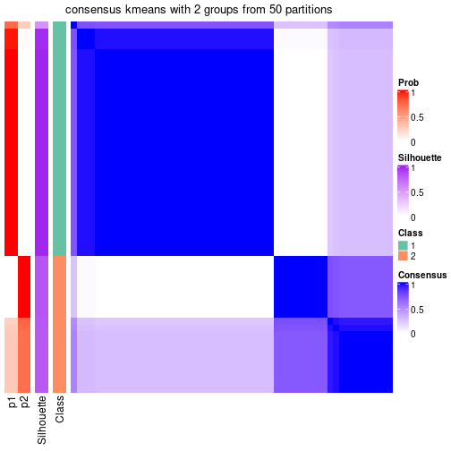</p>

</div>
<div id='tab-node-041-consensus-heatmap-2'>
<pre><code class="r">consensus_heatmap(res, k = 3)
</code></pre>

<p>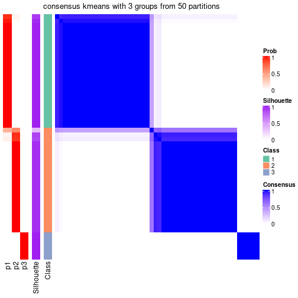</p>

</div>
<div id='tab-node-041-consensus-heatmap-3'>
<pre><code class="r">consensus_heatmap(res, k = 4)
</code></pre>

<p>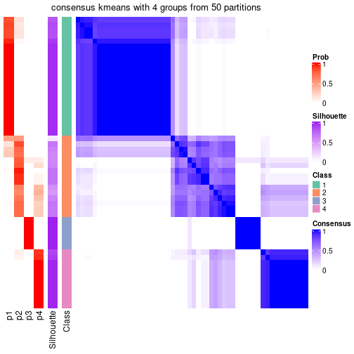</p>

</div>
<div id='tab-node-041-consensus-heatmap-4'>
<pre><code class="r">consensus_heatmap(res, k = 5)
</code></pre>

<p>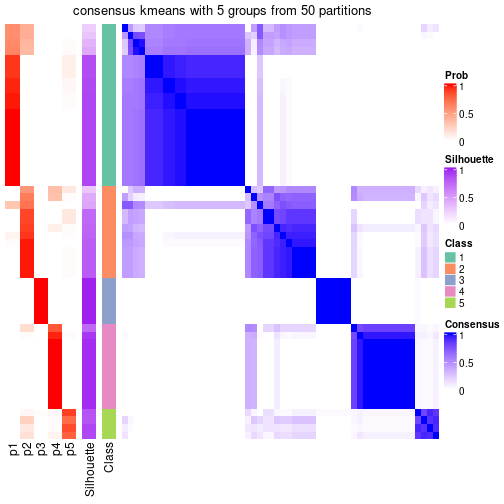</p>

</div>
<div id='tab-node-041-consensus-heatmap-5'>
<pre><code class="r">consensus_heatmap(res, k = 6)
</code></pre>

<p>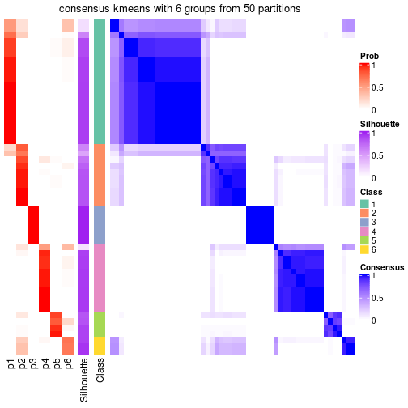</p>

</div>
<div id='tab-node-041-consensus-heatmap-6'>
<pre><code class="r">consensus_heatmap(res, k = 7)
</code></pre>

<p>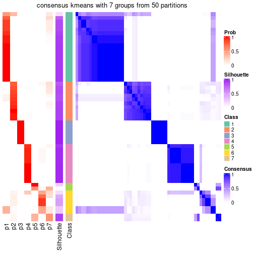</p>

</div>
<div id='tab-node-041-consensus-heatmap-7'>
<pre><code class="r">consensus_heatmap(res, k = 8)
</code></pre>

<p>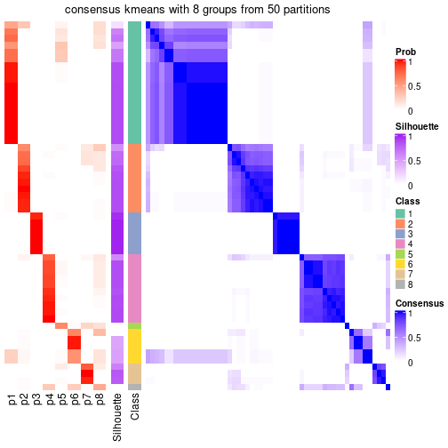</p>

</div>
</div>

Heatmaps for the membership of samples in all partitions to see how consistent they are:


<script>
$( function() {
	$( '#tabs-node-041-membership-heatmap' ).tabs();
} );
</script>
<div id='tabs-node-041-membership-heatmap'>
<ul>
<li><a href='#tab-node-041-membership-heatmap-1'>k = 2</a></li>
<li><a href='#tab-node-041-membership-heatmap-2'>k = 3</a></li>
<li><a href='#tab-node-041-membership-heatmap-3'>k = 4</a></li>
<li><a href='#tab-node-041-membership-heatmap-4'>k = 5</a></li>
<li><a href='#tab-node-041-membership-heatmap-5'>k = 6</a></li>
<li><a href='#tab-node-041-membership-heatmap-6'>k = 7</a></li>
<li><a href='#tab-node-041-membership-heatmap-7'>k = 8</a></li>
</ul>
<div id='tab-node-041-membership-heatmap-1'>
<pre><code class="r">membership_heatmap(res, k = 2)
</code></pre>

<p>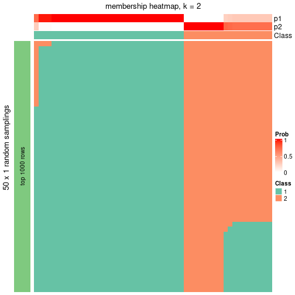</p>

</div>
<div id='tab-node-041-membership-heatmap-2'>
<pre><code class="r">membership_heatmap(res, k = 3)
</code></pre>

<p>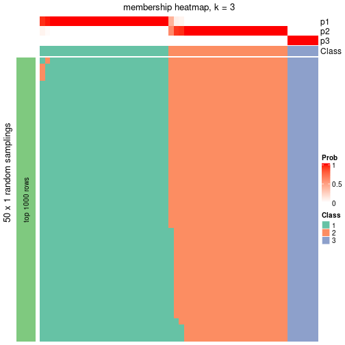</p>

</div>
<div id='tab-node-041-membership-heatmap-3'>
<pre><code class="r">membership_heatmap(res, k = 4)
</code></pre>

<p>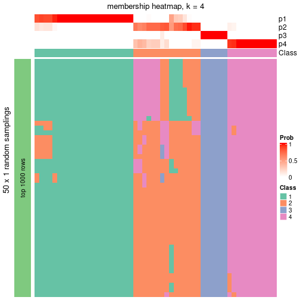</p>

</div>
<div id='tab-node-041-membership-heatmap-4'>
<pre><code class="r">membership_heatmap(res, k = 5)
</code></pre>

<p>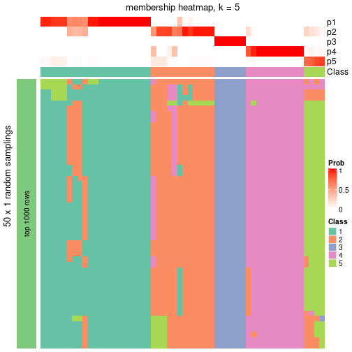</p>

</div>
<div id='tab-node-041-membership-heatmap-5'>
<pre><code class="r">membership_heatmap(res, k = 6)
</code></pre>

<p>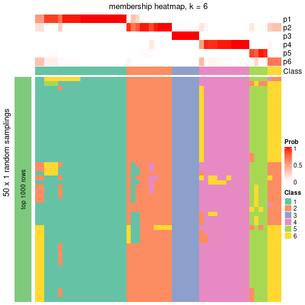</p>

</div>
<div id='tab-node-041-membership-heatmap-6'>
<pre><code class="r">membership_heatmap(res, k = 7)
</code></pre>

<p>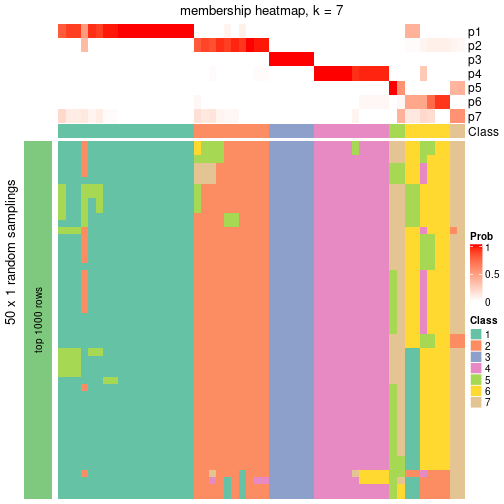</p>

</div>
<div id='tab-node-041-membership-heatmap-7'>
<pre><code class="r">membership_heatmap(res, k = 8)
</code></pre>

<p>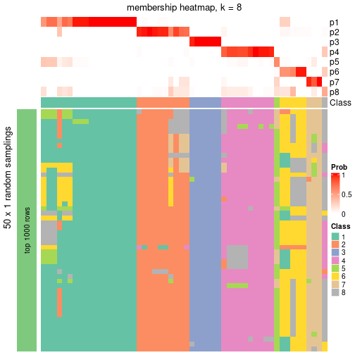</p>

</div>
</div>

As soon as the classes for columns are determined, the signatures
that are significantly different between subgroups can be looked for. 
Following are the heatmaps for signatures.


<script>
$( function() {
	$( '#tabs-node-041-get-signatures' ).tabs();
} );
</script>
<div id='tabs-node-041-get-signatures'>
<ul>
<li><a href='#tab-node-041-get-signatures-1'>k = 2</a></li>
<li><a href='#tab-node-041-get-signatures-2'>k = 3</a></li>
<li><a href='#tab-node-041-get-signatures-3'>k = 4</a></li>
<li><a href='#tab-node-041-get-signatures-4'>k = 5</a></li>
<li><a href='#tab-node-041-get-signatures-5'>k = 6</a></li>
<li><a href='#tab-node-041-get-signatures-6'>k = 7</a></li>
<li><a href='#tab-node-041-get-signatures-7'>k = 8</a></li>
</ul>
<div id='tab-node-041-get-signatures-1'>
<pre><code class="r">get_signatures(res, k = 2)
</code></pre>

<p>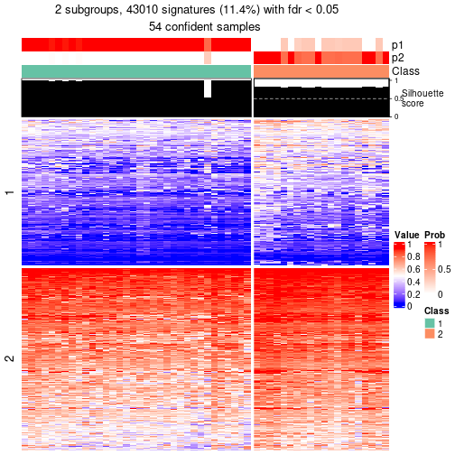</p>

</div>
<div id='tab-node-041-get-signatures-2'>
<pre><code class="r">get_signatures(res, k = 3)
</code></pre>

<p>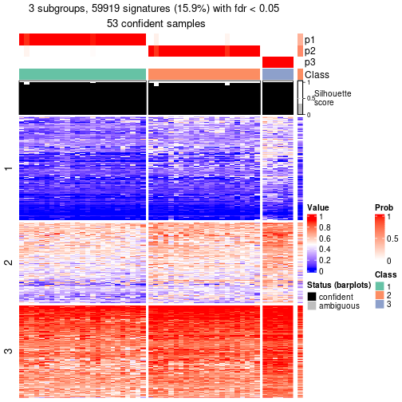</p>

</div>
<div id='tab-node-041-get-signatures-3'>
<pre><code class="r">get_signatures(res, k = 4)
</code></pre>

<p>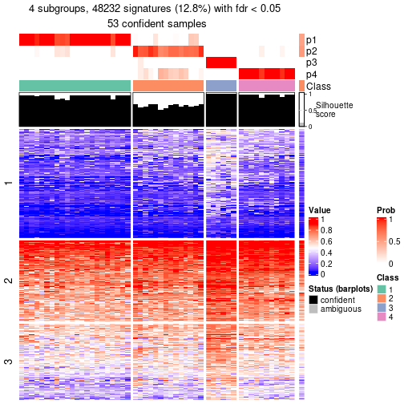</p>

</div>
<div id='tab-node-041-get-signatures-4'>
<pre><code class="r">get_signatures(res, k = 5)
</code></pre>

<p>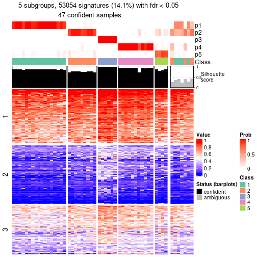</p>

</div>
<div id='tab-node-041-get-signatures-5'>
<pre><code class="r">get_signatures(res, k = 6)
</code></pre>

<p>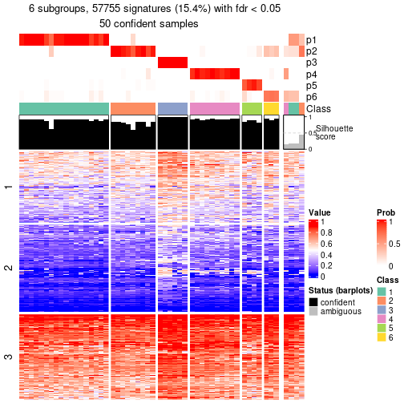</p>

</div>
<div id='tab-node-041-get-signatures-6'>
<pre><code class="r">get_signatures(res, k = 7)
</code></pre>

<p>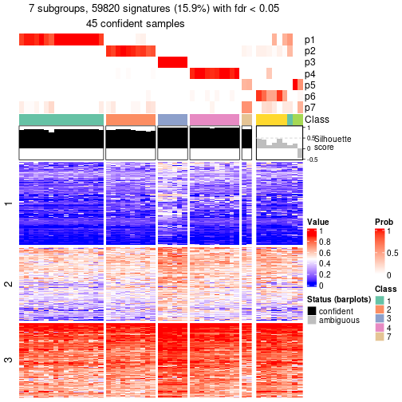</p>

</div>
<div id='tab-node-041-get-signatures-7'>
<pre><code class="r">get_signatures(res, k = 8)
</code></pre>

<p>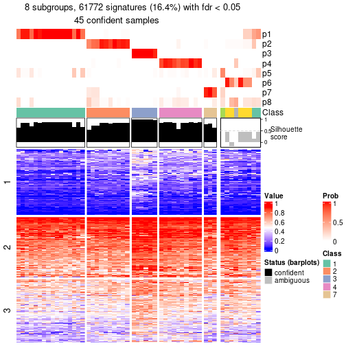</p>

</div>
</div>


Compare the overlap of signatures from different k:

```r
compare_signatures(res)
```

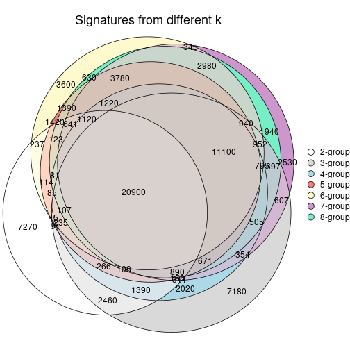

`get_signature()` returns a data frame invisibly. To get the list of signatures, the function
call should be assigned to a variable explicitly. In following code, if `plot` argument is set
to `FALSE`, no heatmap is plotted while only the differential analysis is performed.

```r
# code only for demonstration
tb = get_signature(res, k = ..., plot = FALSE)
```

An example of the output of `tb` is:

```
#>   which_row         fdr    mean_1    mean_2 scaled_mean_1 scaled_mean_2 km
#> 1        38 0.042760348  8.373488  9.131774    -0.5533452     0.5164555  1
#> 2        40 0.018707592  7.106213  8.469186    -0.6173731     0.5762149  1
#> 3        55 0.019134737 10.221463 11.207825    -0.6159697     0.5749050  1
#> 4        59 0.006059896  5.921854  7.869574    -0.6899429     0.6439467  1
#> 5        60 0.018055526  8.928898 10.211722    -0.6204761     0.5791110  1
#> 6        98 0.009384629 15.714769 14.887706     0.6635654    -0.6193277  2
...
```

The columns in `tb` are:

1. `which_row`: row indices corresponding to the input matrix.
2. `fdr`: FDR for the differential test. 
3. `mean_x`: The mean value in group x.
4. `scaled_mean_x`: The mean value in group x after rows are scaled.
5. `km`: Row groups if k-means clustering is applied to rows (which is done by automatically selecting number of clusters).

If there are too many signatures, `top_signatures = ...` can be set to only show the 
signatures with the highest FDRs:

```r
# code only for demonstration
# e.g. to show the top 500 most significant rows
tb = get_signature(res, k = ..., top_signatures = 500)
```

If the signatures are defined as these which are uniquely high in current group, `diff_method` argument
can be set to `"uniquely_high_in_one_group"`:

```r
# code only for demonstration
tb = get_signature(res, k = ..., diff_method = "uniquely_high_in_one_group")
```


UMAP plot which shows how samples are separated.


<script>
$( function() {
	$( '#tabs-node-041-dimension-reduction' ).tabs();
} );
</script>
<div id='tabs-node-041-dimension-reduction'>
<ul>
<li><a href='#tab-node-041-dimension-reduction-1'>k = 2</a></li>
<li><a href='#tab-node-041-dimension-reduction-2'>k = 3</a></li>
<li><a href='#tab-node-041-dimension-reduction-3'>k = 4</a></li>
<li><a href='#tab-node-041-dimension-reduction-4'>k = 5</a></li>
<li><a href='#tab-node-041-dimension-reduction-5'>k = 6</a></li>
<li><a href='#tab-node-041-dimension-reduction-6'>k = 7</a></li>
<li><a href='#tab-node-041-dimension-reduction-7'>k = 8</a></li>
</ul>
<div id='tab-node-041-dimension-reduction-1'>
<pre><code class="r">dimension_reduction(res, k = 2, method = &quot;UMAP&quot;)
</code></pre>

<p>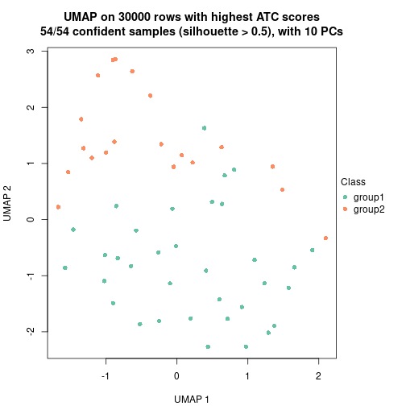</p>

</div>
<div id='tab-node-041-dimension-reduction-2'>
<pre><code class="r">dimension_reduction(res, k = 3, method = &quot;UMAP&quot;)
</code></pre>

<p>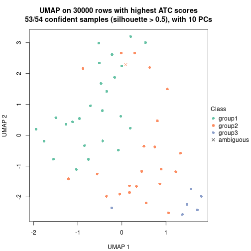</p>

</div>
<div id='tab-node-041-dimension-reduction-3'>
<pre><code class="r">dimension_reduction(res, k = 4, method = &quot;UMAP&quot;)
</code></pre>

<p>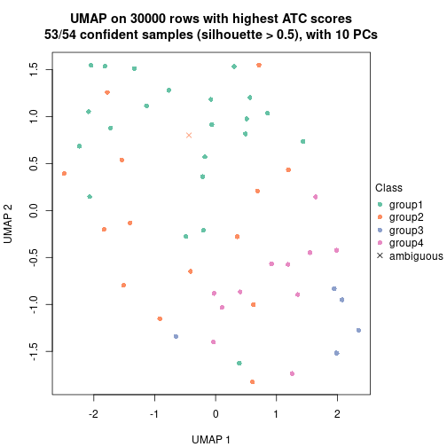</p>

</div>
<div id='tab-node-041-dimension-reduction-4'>
<pre><code class="r">dimension_reduction(res, k = 5, method = &quot;UMAP&quot;)
</code></pre>

<p>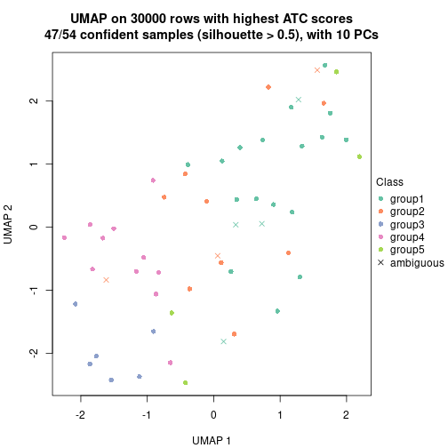</p>

</div>
<div id='tab-node-041-dimension-reduction-5'>
<pre><code class="r">dimension_reduction(res, k = 6, method = &quot;UMAP&quot;)
</code></pre>

<p>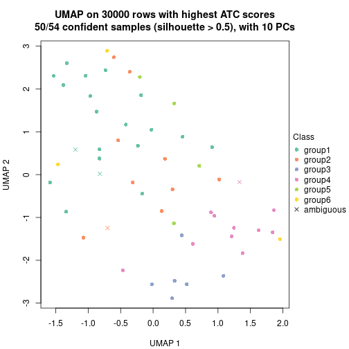</p>

</div>
<div id='tab-node-041-dimension-reduction-6'>
<pre><code class="r">dimension_reduction(res, k = 7, method = &quot;UMAP&quot;)
</code></pre>

<p>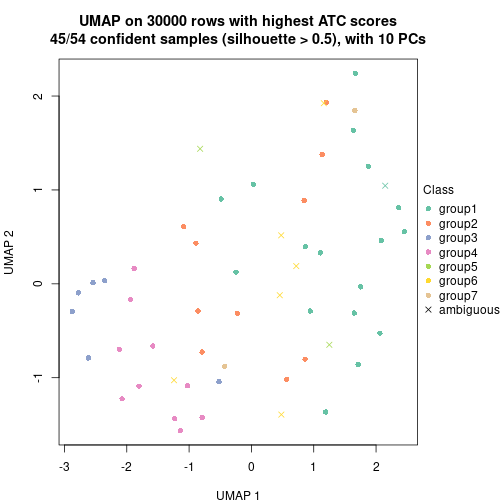</p>

</div>
<div id='tab-node-041-dimension-reduction-7'>
<pre><code class="r">dimension_reduction(res, k = 8, method = &quot;UMAP&quot;)
</code></pre>

<p>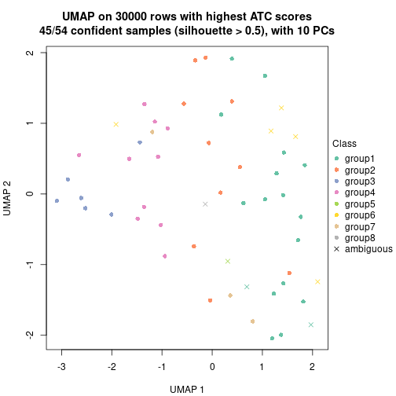</p>

</div>
</div>


Following heatmap shows how subgroups are split when increasing `k`:

```r
collect_classes(res)
```

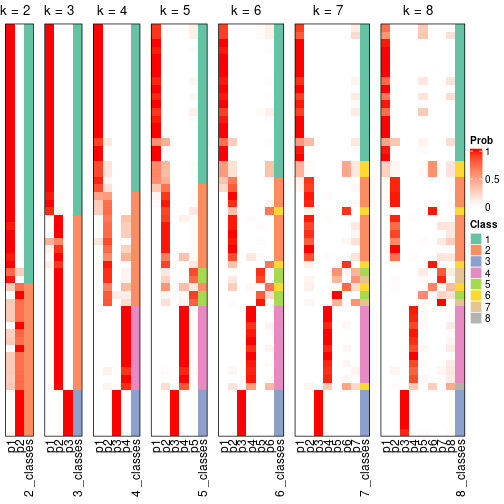


If matrix rows can be associated to genes, consider to use `functional_enrichment(res,
...)` to perform function enrichment for the signature genes. See [this vignette](https://jokergoo.github.io/cola_vignettes/functional_enrichment.html) for more detailed explanations.


 

---------------------------------------------------


### Node0412


Parent node: [Node041](#Node041).
Child nodes: 
                Node04121-leaf
        ,
                Node04122-leaf
        ,
                Node04123-leaf
        ,
                Node04321-leaf
        ,
                Node04322-leaf
        ,
                Node04323-leaf
        ,
                Node05211-leaf
        ,
                Node05212-leaf
        .


The object with results only for a single top-value method and a single partitioning method 
can be extracted as:

```r
res = res_rh["0412"]
```

A summary of `res` and all the functions that can be applied to it:

```r
res
```

```
#> A 'ConsensusPartition' object with k = 2, 3, 4, 5, 6, 7, 8.
#>   On a matrix with 30000 rows and 23 columns.
#>   Top rows (1000) are extracted by 'ATC' method.
#>   Subgroups are detected by 'skmeans' method.
#>   Performed in total 350 partitions by row resampling.
#>   Best k for subgroups seems to be 2.
#> 
#> Following methods can be applied to this 'ConsensusPartition' object:
#>  [1] "cola_report"             "collect_classes"         "collect_plots"          
#>  [4] "collect_stats"           "colnames"                "compare_partitions"     
#>  [7] "compare_signatures"      "consensus_heatmap"       "dimension_reduction"    
#> [10] "functional_enrichment"   "get_anno_col"            "get_anno"               
#> [13] "get_classes"             "get_consensus"           "get_matrix"             
#> [16] "get_membership"          "get_param"               "get_signatures"         
#> [19] "get_stats"               "is_best_k"               "is_stable_k"            
#> [22] "membership_heatmap"      "ncol"                    "nrow"                   
#> [25] "plot_ecdf"               "predict_classes"         "rownames"               
#> [28] "select_partition_number" "show"                    "suggest_best_k"         
#> [31] "test_to_known_factors"   "top_rows_heatmap"
```

`collect_plots()` function collects all the plots made from `res` for all `k` (number of subgroups)
into one single page to provide an easy and fast comparison between different `k`.

```r
collect_plots(res)
```


The plots are:

- The first row: a plot of the eCDF (empirical cumulative distribution
  function) curves of the consensus matrix for each `k` and the heatmap of
  predicted classes for each `k`.
- The second row: heatmaps of the consensus matrix for each `k`.
- The third row: heatmaps of the membership matrix for each `k`.
- The fouth row: heatmaps of the signatures for each `k`.

All the plots in panels can be made by individual functions and they are
plotted later in this section.

`select_partition_number()` produces several plots showing different
statistics for choosing "optimized" `k`. There are following statistics:

- eCDF curves of the consensus matrix for each `k`;
- 1-PAC. [The PAC score](https://en.wikipedia.org/wiki/Consensus_clustering#Over-interpretation_potential_of_consensus_clustering)
  measures the proportion of the ambiguous subgrouping.
- Mean silhouette score.
- Concordance. The mean probability of fiting the consensus subgroup labels in all
  partitions.
- Area increased. Denote $A_k$ as the area under the eCDF curve for current
  `k`, the area increased is defined as $A_k - A_{k-1}$.
- Rand index. The percent of pairs of samples that are both in a same cluster
  or both are not in a same cluster in the partition of k and k-1.
- Jaccard index. The ratio of pairs of samples are both in a same cluster in
  the partition of k and k-1 and the pairs of samples are both in a same
  cluster in the partition k or k-1.

The detailed explanations of these statistics can be found in [the _cola_
vignette](https://jokergoo.github.io/cola_vignettes/cola.html#toc_13).

Generally speaking, higher 1-PAC score, higher mean silhouette score or higher
concordance corresponds to better partition. Rand index and Jaccard index
measure how similar the current partition is compared to partition with `k-1`.
If they are too similar, we won't accept `k` is better than `k-1`.

```r
select_partition_number(res)
```

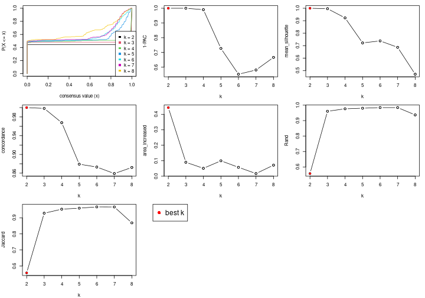

The numeric values for all these statistics can be obtained by `get_stats()`.

```r
get_stats(res)
```

```
#>   k 1-PAC mean_silhouette concordance area_increased  Rand Jaccard
#> 2 2 1.000           1.000       1.000         0.4432 0.557   0.557
#> 3 3 1.000           0.996       0.998         0.0898 0.960   0.929
#> 4 4 0.990           0.923       0.968         0.0509 0.976   0.954
#> 5 5 0.727           0.722       0.879         0.0993 0.980   0.961
#> 6 6 0.552           0.738       0.873         0.0574 0.984   0.968
#> 7 7 0.581           0.687       0.859         0.0170 0.984   0.968
#> 8 8 0.667           0.471       0.872         0.0712 0.937   0.869
```

`suggest_best_k()` suggests the best $k$ based on these statistics. The rules are as follows:

- All $k$ with Jaccard index larger than 0.95 are removed because increasing
  $k$ does not provide enough extra information. If all $k$ are removed, it is
  marked as no subgroup is detected.
- For all $k$ with 1-PAC score larger than 0.9, the maximal $k$ is taken as
  the best $k$, and other $k$ are marked as optional $k$.
- If it does not fit the second rule. The $k$ with the maximal vote of the
  highest 1-PAC score, highest mean silhouette, and highest concordance is
  taken as the best $k$.

```r
suggest_best_k(res)
```

```
#> [1] 2
```


Following is the table of the partitions (You need to click the **show/hide
code output** link to see it). The membership matrix (columns with name `p*`)
is inferred by
[`clue::cl_consensus()`](https://www.rdocumentation.org/link/cl_consensus?package=clue)
function with the `SE` method. Basically the value in the membership matrix
represents the probability to belong to a certain group. The finall subgroup
label for an item is determined with the group with highest probability it
belongs to.

In `get_classes()` function, the entropy is calculated from the membership
matrix and the silhouette score is calculated from the consensus matrix.


<script>
$( function() {
	$( '#tabs-node-0412-get-classes' ).tabs();
} );
</script>
<div id='tabs-node-0412-get-classes'>
<ul>
<li><a href='#tab-node-0412-get-classes-1'>k = 2</a></li>
<li><a href='#tab-node-0412-get-classes-2'>k = 3</a></li>
<li><a href='#tab-node-0412-get-classes-3'>k = 4</a></li>
<li><a href='#tab-node-0412-get-classes-4'>k = 5</a></li>
<li><a href='#tab-node-0412-get-classes-5'>k = 6</a></li>
<li><a href='#tab-node-0412-get-classes-6'>k = 7</a></li>
<li><a href='#tab-node-0412-get-classes-7'>k = 8</a></li>
</ul>

<div id='tab-node-0412-get-classes-1'>
<p><a id='tab-node-0412-get-classes-1-a' style='color:#0366d6' href='#'>show/hide code output</a></p>
<pre><code class="r">cbind(get_classes(res, k = 2), get_membership(res, k = 2))
</code></pre>

<pre><code>#&gt;                 class entropy silhouette p1 p2
#&gt; TCGA.22.5479.01     1       0          1  1  0
#&gt; TCGA.77.8133.01     1       0          1  1  0
#&gt; TCGA.33.AASB.01     2       0          1  0  1
#&gt; TCGA.92.8064.01     1       0          1  1  0
#&gt; TCGA.22.5474.01     1       0          1  1  0
#&gt; TCGA.85.A4CN.01     1       0          1  1  0
#&gt; TCGA.18.3417.01     2       0          1  0  1
#&gt; TCGA.85.7844.01     1       0          1  1  0
#&gt; TCGA.77.A5G8.01     1       0          1  1  0
#&gt; TCGA.58.A46K.01     1       0          1  1  0
#&gt; TCGA.77.7335.01     1       0          1  1  0
#&gt; TCGA.34.A5IX.01     2       0          1  0  1
#&gt; TCGA.56.8504.01     1       0          1  1  0
#&gt; TCGA.63.A5MP.01     1       0          1  1  0
#&gt; TCGA.77.A5GA.01     1       0          1  1  0
#&gt; TCGA.85.8276.01     1       0          1  1  0
#&gt; TCGA.O2.A52N.01     2       0          1  0  1
#&gt; TCGA.85.6561.01     1       0          1  1  0
#&gt; TCGA.NC.A5HK.01     2       0          1  0  1
#&gt; TCGA.98.A53J.01     1       0          1  1  0
#&gt; TCGA.68.8251.01     2       0          1  0  1
#&gt; TCGA.NC.A5HL.01     1       0          1  1  0
#&gt; TCGA.85.A4QQ.01     2       0          1  0  1
</code></pre>

<script>
$('#tab-node-0412-get-classes-1-a').parent().next().next().hide();
$('#tab-node-0412-get-classes-1-a').click(function(){
  $('#tab-node-0412-get-classes-1-a').parent().next().next().toggle();
  return(false);
});
</script>
</div>

<div id='tab-node-0412-get-classes-2'>
<p><a id='tab-node-0412-get-classes-2-a' style='color:#0366d6' href='#'>show/hide code output</a></p>
<pre><code class="r">cbind(get_classes(res, k = 3), get_membership(res, k = 3))
</code></pre>

<pre><code>#&gt;                 class entropy silhouette p1   p2   p3
#&gt; TCGA.22.5479.01     1   0.000      1.000  1 0.00 0.00
#&gt; TCGA.77.8133.01     1   0.000      1.000  1 0.00 0.00
#&gt; TCGA.33.AASB.01     3   0.000      1.000  0 0.00 1.00
#&gt; TCGA.92.8064.01     1   0.000      1.000  1 0.00 0.00
#&gt; TCGA.22.5474.01     1   0.000      1.000  1 0.00 0.00
#&gt; TCGA.85.A4CN.01     1   0.000      1.000  1 0.00 0.00
#&gt; TCGA.18.3417.01     2   0.000      0.990  0 1.00 0.00
#&gt; TCGA.85.7844.01     1   0.000      1.000  1 0.00 0.00
#&gt; TCGA.77.A5G8.01     1   0.000      1.000  1 0.00 0.00
#&gt; TCGA.58.A46K.01     1   0.000      1.000  1 0.00 0.00
#&gt; TCGA.77.7335.01     1   0.000      1.000  1 0.00 0.00
#&gt; TCGA.34.A5IX.01     2   0.000      0.990  0 1.00 0.00
#&gt; TCGA.56.8504.01     1   0.000      1.000  1 0.00 0.00
#&gt; TCGA.63.A5MP.01     1   0.000      1.000  1 0.00 0.00
#&gt; TCGA.77.A5GA.01     1   0.000      1.000  1 0.00 0.00
#&gt; TCGA.85.8276.01     1   0.000      1.000  1 0.00 0.00
#&gt; TCGA.O2.A52N.01     2   0.000      0.990  0 1.00 0.00
#&gt; TCGA.85.6561.01     1   0.000      1.000  1 0.00 0.00
#&gt; TCGA.NC.A5HK.01     3   0.000      1.000  0 0.00 1.00
#&gt; TCGA.98.A53J.01     1   0.000      1.000  1 0.00 0.00
#&gt; TCGA.68.8251.01     2   0.000      0.990  0 1.00 0.00
#&gt; TCGA.NC.A5HL.01     1   0.000      1.000  1 0.00 0.00
#&gt; TCGA.85.A4QQ.01     2   0.153      0.958  0 0.96 0.04
</code></pre>

<script>
$('#tab-node-0412-get-classes-2-a').parent().next().next().hide();
$('#tab-node-0412-get-classes-2-a').click(function(){
  $('#tab-node-0412-get-classes-2-a').parent().next().next().toggle();
  return(false);
});
</script>
</div>

<div id='tab-node-0412-get-classes-3'>
<p><a id='tab-node-0412-get-classes-3-a' style='color:#0366d6' href='#'>show/hide code output</a></p>
<pre><code class="r">cbind(get_classes(res, k = 4), get_membership(res, k = 4))
</code></pre>

<pre><code>#&gt;                 class entropy silhouette   p1   p2 p3   p4
#&gt; TCGA.22.5479.01     1  0.0000      0.994 1.00 0.00  0 0.00
#&gt; TCGA.77.8133.01     1  0.0000      0.994 1.00 0.00  0 0.00
#&gt; TCGA.33.AASB.01     3  0.0000      1.000 0.00 0.00  1 0.00
#&gt; TCGA.92.8064.01     1  0.0000      0.994 1.00 0.00  0 0.00
#&gt; TCGA.22.5474.01     1  0.0707      0.981 0.98 0.00  0 0.02
#&gt; TCGA.85.A4CN.01     1  0.0000      0.994 1.00 0.00  0 0.00
#&gt; TCGA.18.3417.01     2  0.1637      0.896 0.00 0.94  0 0.06
#&gt; TCGA.85.7844.01     1  0.1913      0.945 0.94 0.04  0 0.02
#&gt; TCGA.77.A5G8.01     1  0.0000      0.994 1.00 0.00  0 0.00
#&gt; TCGA.58.A46K.01     1  0.0000      0.994 1.00 0.00  0 0.00
#&gt; TCGA.77.7335.01     1  0.0000      0.994 1.00 0.00  0 0.00
#&gt; TCGA.34.A5IX.01     2  0.2647      0.866 0.00 0.88  0 0.12
#&gt; TCGA.56.8504.01     1  0.0000      0.994 1.00 0.00  0 0.00
#&gt; TCGA.63.A5MP.01     1  0.0000      0.994 1.00 0.00  0 0.00
#&gt; TCGA.77.A5GA.01     1  0.0000      0.994 1.00 0.00  0 0.00
#&gt; TCGA.85.8276.01     1  0.0000      0.994 1.00 0.00  0 0.00
#&gt; TCGA.O2.A52N.01     4  0.4855      0.239 0.00 0.40  0 0.60
#&gt; TCGA.85.6561.01     1  0.0000      0.994 1.00 0.00  0 0.00
#&gt; TCGA.NC.A5HK.01     3  0.0000      1.000 0.00 0.00  1 0.00
#&gt; TCGA.98.A53J.01     1  0.0707      0.981 0.98 0.00  0 0.02
#&gt; TCGA.68.8251.01     2  0.0707      0.886 0.00 0.98  0 0.02
#&gt; TCGA.NC.A5HL.01     1  0.0000      0.994 1.00 0.00  0 0.00
#&gt; TCGA.85.A4QQ.01     4  0.0707      0.513 0.00 0.02  0 0.98
</code></pre>

<script>
$('#tab-node-0412-get-classes-3-a').parent().next().next().hide();
$('#tab-node-0412-get-classes-3-a').click(function(){
  $('#tab-node-0412-get-classes-3-a').parent().next().next().toggle();
  return(false);
});
</script>
</div>

<div id='tab-node-0412-get-classes-4'>
<p><a id='tab-node-0412-get-classes-4-a' style='color:#0366d6' href='#'>show/hide code output</a></p>
<pre><code class="r">cbind(get_classes(res, k = 5), get_membership(res, k = 5))
</code></pre>

<pre><code>#&gt;                 class entropy silhouette   p1   p2   p3   p4   p5
#&gt; TCGA.22.5479.01     1  0.1043      0.932 0.96 0.00 0.00 0.00 0.04
#&gt; TCGA.77.8133.01     1  0.1410      0.932 0.94 0.00 0.00 0.00 0.06
#&gt; TCGA.33.AASB.01     3  0.1043      0.967 0.00 0.00 0.96 0.00 0.04
#&gt; TCGA.92.8064.01     1  0.0609      0.934 0.98 0.00 0.00 0.00 0.02
#&gt; TCGA.22.5474.01     1  0.3109      0.846 0.80 0.00 0.00 0.00 0.20
#&gt; TCGA.85.A4CN.01     1  0.1043      0.932 0.96 0.00 0.00 0.00 0.04
#&gt; TCGA.18.3417.01     2  0.4227     -0.498 0.00 0.58 0.00 0.00 0.42
#&gt; TCGA.85.7844.01     1  0.3109      0.846 0.80 0.00 0.00 0.00 0.20
#&gt; TCGA.77.A5G8.01     1  0.1043      0.932 0.96 0.00 0.00 0.00 0.04
#&gt; TCGA.58.A46K.01     1  0.1732      0.922 0.92 0.00 0.00 0.00 0.08
#&gt; TCGA.77.7335.01     1  0.0609      0.934 0.98 0.00 0.00 0.00 0.02
#&gt; TCGA.34.A5IX.01     2  0.2616      0.229 0.00 0.88 0.02 0.10 0.00
#&gt; TCGA.56.8504.01     1  0.1043      0.932 0.96 0.00 0.00 0.00 0.04
#&gt; TCGA.63.A5MP.01     1  0.1043      0.935 0.96 0.00 0.00 0.00 0.04
#&gt; TCGA.77.A5GA.01     1  0.1732      0.928 0.92 0.00 0.00 0.00 0.08
#&gt; TCGA.85.8276.01     1  0.1410      0.926 0.94 0.00 0.00 0.00 0.06
#&gt; TCGA.O2.A52N.01     2  0.5263      0.285 0.00 0.66 0.00 0.24 0.10
#&gt; TCGA.85.6561.01     1  0.0609      0.934 0.98 0.00 0.00 0.00 0.02
#&gt; TCGA.NC.A5HK.01     3  0.0000      0.967 0.00 0.00 1.00 0.00 0.00
#&gt; TCGA.98.A53J.01     1  0.3109      0.853 0.80 0.00 0.00 0.00 0.20
#&gt; TCGA.68.8251.01     5  0.4829      0.000 0.00 0.48 0.00 0.02 0.50
#&gt; TCGA.NC.A5HL.01     1  0.1410      0.935 0.94 0.00 0.00 0.00 0.06
#&gt; TCGA.85.A4QQ.01     4  0.0000      0.000 0.00 0.00 0.00 1.00 0.00
</code></pre>

<script>
$('#tab-node-0412-get-classes-4-a').parent().next().next().hide();
$('#tab-node-0412-get-classes-4-a').click(function(){
  $('#tab-node-0412-get-classes-4-a').parent().next().next().toggle();
  return(false);
});
</script>
</div>

<div id='tab-node-0412-get-classes-5'>
<p><a id='tab-node-0412-get-classes-5-a' style='color:#0366d6' href='#'>show/hide code output</a></p>
<pre><code class="r">cbind(get_classes(res, k = 6), get_membership(res, k = 6))
</code></pre>

<pre><code>#&gt;                 class entropy silhouette   p1   p2   p3   p4   p5   p6
#&gt; TCGA.22.5479.01     1  0.1556      0.898 0.92 0.00 0.08 0.00 0.00 0.00
#&gt; TCGA.77.8133.01     1  0.0937      0.903 0.96 0.00 0.04 0.00 0.00 0.00
#&gt; TCGA.33.AASB.01     5  0.3045      0.863 0.00 0.00 0.10 0.00 0.84 0.06
#&gt; TCGA.92.8064.01     1  0.0937      0.893 0.96 0.00 0.04 0.00 0.00 0.00
#&gt; TCGA.22.5474.01     1  0.3076      0.826 0.76 0.00 0.24 0.00 0.00 0.00
#&gt; TCGA.85.A4CN.01     1  0.0547      0.899 0.98 0.00 0.02 0.00 0.00 0.00
#&gt; TCGA.18.3417.01     2  0.4892      0.481 0.00 0.50 0.44 0.00 0.00 0.06
#&gt; TCGA.85.7844.01     1  0.4348      0.713 0.64 0.00 0.32 0.00 0.00 0.04
#&gt; TCGA.77.A5G8.01     1  0.1814      0.894 0.90 0.00 0.10 0.00 0.00 0.00
#&gt; TCGA.58.A46K.01     1  0.2581      0.868 0.86 0.00 0.12 0.00 0.00 0.02
#&gt; TCGA.77.7335.01     1  0.0547      0.903 0.98 0.00 0.02 0.00 0.00 0.00
#&gt; TCGA.34.A5IX.01     2  0.0000      0.336 0.00 1.00 0.00 0.00 0.00 0.00
#&gt; TCGA.56.8504.01     1  0.2260      0.882 0.86 0.00 0.14 0.00 0.00 0.00
#&gt; TCGA.63.A5MP.01     1  0.0547      0.900 0.98 0.00 0.00 0.00 0.00 0.02
#&gt; TCGA.77.A5GA.01     1  0.1556      0.897 0.92 0.00 0.08 0.00 0.00 0.00
#&gt; TCGA.85.8276.01     1  0.1814      0.898 0.90 0.00 0.10 0.00 0.00 0.00
#&gt; TCGA.O2.A52N.01     6  0.5267      0.000 0.00 0.32 0.00 0.12 0.00 0.56
#&gt; TCGA.85.6561.01     1  0.0547      0.899 0.98 0.00 0.02 0.00 0.00 0.00
#&gt; TCGA.NC.A5HK.01     5  0.0000      0.863 0.00 0.00 0.00 0.00 1.00 0.00
#&gt; TCGA.98.A53J.01     1  0.3309      0.795 0.72 0.00 0.28 0.00 0.00 0.00
#&gt; TCGA.68.8251.01     2  0.5841      0.476 0.00 0.48 0.22 0.00 0.00 0.30
#&gt; TCGA.NC.A5HL.01     1  0.1480      0.885 0.94 0.00 0.04 0.00 0.00 0.02
#&gt; TCGA.85.A4QQ.01     4  0.0000      0.000 0.00 0.00 0.00 1.00 0.00 0.00
</code></pre>

<script>
$('#tab-node-0412-get-classes-5-a').parent().next().next().hide();
$('#tab-node-0412-get-classes-5-a').click(function(){
  $('#tab-node-0412-get-classes-5-a').parent().next().next().toggle();
  return(false);
});
</script>
</div>

<div id='tab-node-0412-get-classes-6'>
<p><a id='tab-node-0412-get-classes-6-a' style='color:#0366d6' href='#'>show/hide code output</a></p>
<pre><code class="r">cbind(get_classes(res, k = 7), get_membership(res, k = 7))
</code></pre>

<pre><code>#&gt;                 class entropy silhouette   p1   p2   p3  p4  p5   p6   p7
#&gt; TCGA.22.5479.01     1  0.1433      0.895 0.92 0.00 0.08 0.0 0.0 0.00 0.00
#&gt; TCGA.77.8133.01     1  0.0504      0.898 0.98 0.00 0.02 0.0 0.0 0.00 0.00
#&gt; TCGA.33.AASB.01     5  0.4872      0.633 0.00 0.08 0.30 0.0 0.6 0.02 0.00
#&gt; TCGA.92.8064.01     1  0.2376      0.885 0.86 0.00 0.12 0.0 0.0 0.02 0.00
#&gt; TCGA.22.5474.01     1  0.2422      0.863 0.82 0.00 0.18 0.0 0.0 0.00 0.00
#&gt; TCGA.85.A4CN.01     1  0.0863      0.895 0.96 0.00 0.04 0.0 0.0 0.00 0.00
#&gt; TCGA.18.3417.01     2  0.2906      0.000 0.00 0.80 0.00 0.0 0.0 0.02 0.18
#&gt; TCGA.85.7844.01     1  0.4264      0.658 0.62 0.00 0.32 0.0 0.0 0.00 0.06
#&gt; TCGA.77.A5G8.01     1  0.1886      0.880 0.88 0.00 0.12 0.0 0.0 0.00 0.00
#&gt; TCGA.58.A46K.01     1  0.1433      0.900 0.92 0.00 0.08 0.0 0.0 0.00 0.00
#&gt; TCGA.77.7335.01     1  0.0000      0.901 1.00 0.00 0.00 0.0 0.0 0.00 0.00
#&gt; TCGA.34.A5IX.01     6  0.6542      0.270 0.00 0.20 0.28 0.0 0.0 0.42 0.10
#&gt; TCGA.56.8504.01     1  0.2572      0.874 0.80 0.00 0.20 0.0 0.0 0.00 0.00
#&gt; TCGA.63.A5MP.01     1  0.0863      0.898 0.96 0.00 0.04 0.0 0.0 0.00 0.00
#&gt; TCGA.77.A5GA.01     1  0.1886      0.896 0.88 0.00 0.12 0.0 0.0 0.00 0.00
#&gt; TCGA.85.8276.01     1  0.1671      0.898 0.90 0.00 0.10 0.0 0.0 0.00 0.00
#&gt; TCGA.O2.A52N.01     6  0.1671      0.302 0.00 0.00 0.00 0.1 0.0 0.90 0.00
#&gt; TCGA.85.6561.01     1  0.1664      0.896 0.92 0.00 0.06 0.0 0.0 0.02 0.00
#&gt; TCGA.NC.A5HK.01     5  0.0000      0.633 0.00 0.00 0.00 0.0 1.0 0.00 0.00
#&gt; TCGA.98.A53J.01     1  0.2572      0.834 0.80 0.00 0.20 0.0 0.0 0.00 0.00
#&gt; TCGA.68.8251.01     7  0.0000      0.000 0.00 0.00 0.00 0.0 0.0 0.00 1.00
#&gt; TCGA.NC.A5HL.01     1  0.1671      0.881 0.90 0.00 0.10 0.0 0.0 0.00 0.00
#&gt; TCGA.85.A4QQ.01     4  0.0000      0.000 0.00 0.00 0.00 1.0 0.0 0.00 0.00
</code></pre>

<script>
$('#tab-node-0412-get-classes-6-a').parent().next().next().hide();
$('#tab-node-0412-get-classes-6-a').click(function(){
  $('#tab-node-0412-get-classes-6-a').parent().next().next().toggle();
  return(false);
});
</script>
</div>

<div id='tab-node-0412-get-classes-7'>
<p><a id='tab-node-0412-get-classes-7-a' style='color:#0366d6' href='#'>show/hide code output</a></p>
<pre><code class="r">cbind(get_classes(res, k = 8), get_membership(res, k = 8))
</code></pre>

<pre><code>#&gt;                 class entropy silhouette   p1   p2   p3   p4   p5   p6   p7   p8
#&gt; TCGA.22.5479.01     1  0.1341      0.794 0.92 0.00 0.08 0.00 0.00 0.00 0.00 0.00
#&gt; TCGA.77.8133.01     1  0.1091      0.794 0.94 0.00 0.06 0.00 0.00 0.00 0.00 0.00
#&gt; TCGA.33.AASB.01     5  0.5325      0.591 0.00 0.00 0.26 0.00 0.56 0.00 0.10 0.08
#&gt; TCGA.92.8064.01     1  0.1091      0.790 0.94 0.00 0.06 0.00 0.00 0.00 0.00 0.00
#&gt; TCGA.22.5474.01     1  0.3237     -0.155 0.60 0.00 0.40 0.00 0.00 0.00 0.00 0.00
#&gt; TCGA.85.A4CN.01     1  0.1091      0.793 0.94 0.00 0.06 0.00 0.00 0.00 0.00 0.00
#&gt; TCGA.18.3417.01     2  0.0000      0.000 0.00 1.00 0.00 0.00 0.00 0.00 0.00 0.00
#&gt; TCGA.85.7844.01     3  0.3449      0.000 0.32 0.00 0.66 0.00 0.00 0.00 0.02 0.00
#&gt; TCGA.77.A5G8.01     1  0.1804      0.785 0.90 0.00 0.08 0.00 0.00 0.00 0.02 0.00
#&gt; TCGA.58.A46K.01     1  0.2534      0.555 0.78 0.00 0.22 0.00 0.00 0.00 0.00 0.00
#&gt; TCGA.77.7335.01     1  0.0808      0.799 0.96 0.00 0.04 0.00 0.00 0.00 0.00 0.00
#&gt; TCGA.34.A5IX.01     6  0.0000      0.000 0.00 0.00 0.00 0.00 0.00 1.00 0.00 0.00
#&gt; TCGA.56.8504.01     1  0.1765      0.764 0.88 0.00 0.12 0.00 0.00 0.00 0.00 0.00
#&gt; TCGA.63.A5MP.01     1  0.0808      0.802 0.96 0.00 0.04 0.00 0.00 0.00 0.00 0.00
#&gt; TCGA.77.A5GA.01     1  0.2267      0.668 0.82 0.00 0.18 0.00 0.00 0.00 0.00 0.00
#&gt; TCGA.85.8276.01     1  0.1563      0.761 0.90 0.00 0.10 0.00 0.00 0.00 0.00 0.00
#&gt; TCGA.O2.A52N.01     8  0.1557      0.000 0.00 0.00 0.00 0.02 0.00 0.06 0.00 0.92
#&gt; TCGA.85.6561.01     1  0.0808      0.797 0.96 0.00 0.04 0.00 0.00 0.00 0.00 0.00
#&gt; TCGA.NC.A5HK.01     5  0.0000      0.591 0.00 0.00 0.00 0.00 1.00 0.00 0.00 0.00
#&gt; TCGA.98.A53J.01     1  0.3272     -0.101 0.58 0.00 0.42 0.00 0.00 0.00 0.00 0.00
#&gt; TCGA.68.8251.01     7  0.2132      0.000 0.00 0.08 0.00 0.00 0.00 0.04 0.88 0.00
#&gt; TCGA.NC.A5HL.01     1  0.0808      0.797 0.96 0.00 0.04 0.00 0.00 0.00 0.00 0.00
#&gt; TCGA.85.A4QQ.01     4  0.0000      0.000 0.00 0.00 0.00 1.00 0.00 0.00 0.00 0.00
</code></pre>

<script>
$('#tab-node-0412-get-classes-7-a').parent().next().next().hide();
$('#tab-node-0412-get-classes-7-a').click(function(){
  $('#tab-node-0412-get-classes-7-a').parent().next().next().toggle();
  return(false);
});
</script>
</div>
</div>

Heatmaps for the consensus matrix. It visualizes the probability of two
samples to be in a same group.


<script>
$( function() {
	$( '#tabs-node-0412-consensus-heatmap' ).tabs();
} );
</script>
<div id='tabs-node-0412-consensus-heatmap'>
<ul>
<li><a href='#tab-node-0412-consensus-heatmap-1'>k = 2</a></li>
<li><a href='#tab-node-0412-consensus-heatmap-2'>k = 3</a></li>
<li><a href='#tab-node-0412-consensus-heatmap-3'>k = 4</a></li>
<li><a href='#tab-node-0412-consensus-heatmap-4'>k = 5</a></li>
<li><a href='#tab-node-0412-consensus-heatmap-5'>k = 6</a></li>
<li><a href='#tab-node-0412-consensus-heatmap-6'>k = 7</a></li>
<li><a href='#tab-node-0412-consensus-heatmap-7'>k = 8</a></li>
</ul>
<div id='tab-node-0412-consensus-heatmap-1'>
<pre><code class="r">consensus_heatmap(res, k = 2)
</code></pre>

<p>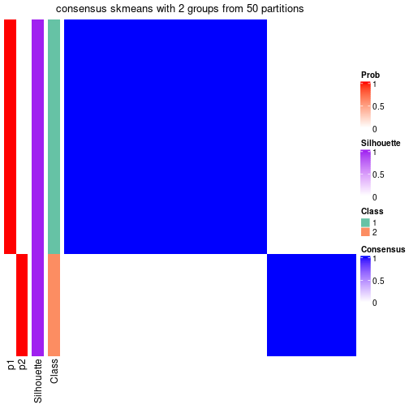</p>

</div>
<div id='tab-node-0412-consensus-heatmap-2'>
<pre><code class="r">consensus_heatmap(res, k = 3)
</code></pre>

<p>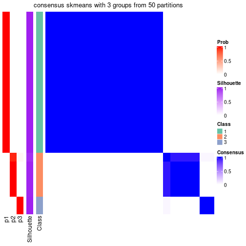</p>

</div>
<div id='tab-node-0412-consensus-heatmap-3'>
<pre><code class="r">consensus_heatmap(res, k = 4)
</code></pre>

<p></p>

</div>
<div id='tab-node-0412-consensus-heatmap-4'>
<pre><code class="r">consensus_heatmap(res, k = 5)
</code></pre>

<p>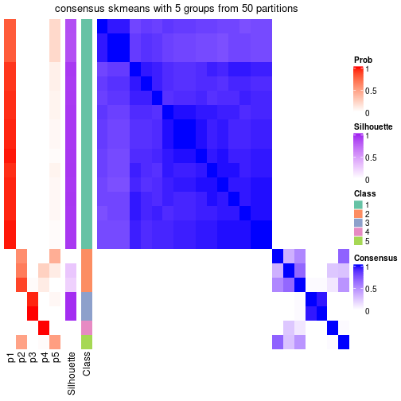</p>

</div>
<div id='tab-node-0412-consensus-heatmap-5'>
<pre><code class="r">consensus_heatmap(res, k = 6)
</code></pre>

<p>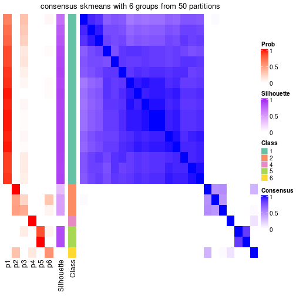</p>

</div>
<div id='tab-node-0412-consensus-heatmap-6'>
<pre><code class="r">consensus_heatmap(res, k = 7)
</code></pre>

<p>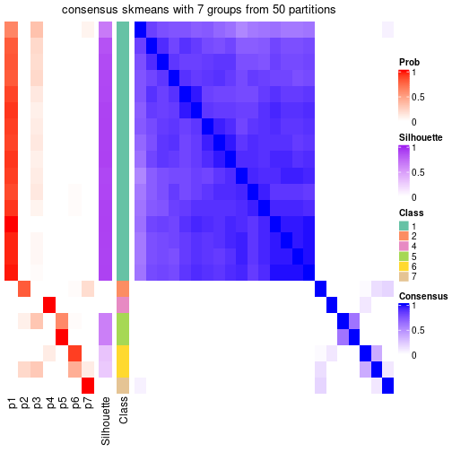</p>

</div>
<div id='tab-node-0412-consensus-heatmap-7'>
<pre><code class="r">consensus_heatmap(res, k = 8)
</code></pre>

<p>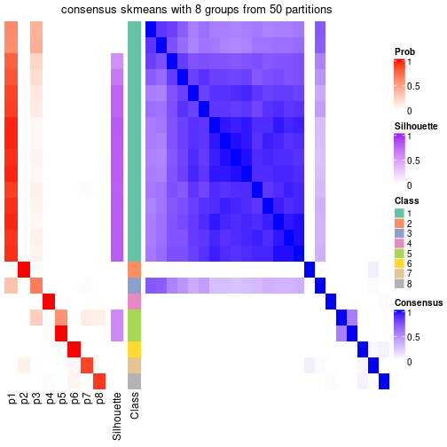</p>

</div>
</div>

Heatmaps for the membership of samples in all partitions to see how consistent they are:


<script>
$( function() {
	$( '#tabs-node-0412-membership-heatmap' ).tabs();
} );
</script>
<div id='tabs-node-0412-membership-heatmap'>
<ul>
<li><a href='#tab-node-0412-membership-heatmap-1'>k = 2</a></li>
<li><a href='#tab-node-0412-membership-heatmap-2'>k = 3</a></li>
<li><a href='#tab-node-0412-membership-heatmap-3'>k = 4</a></li>
<li><a href='#tab-node-0412-membership-heatmap-4'>k = 5</a></li>
<li><a href='#tab-node-0412-membership-heatmap-5'>k = 6</a></li>
<li><a href='#tab-node-0412-membership-heatmap-6'>k = 7</a></li>
<li><a href='#tab-node-0412-membership-heatmap-7'>k = 8</a></li>
</ul>
<div id='tab-node-0412-membership-heatmap-1'>
<pre><code class="r">membership_heatmap(res, k = 2)
</code></pre>

<p></p>

</div>
<div id='tab-node-0412-membership-heatmap-2'>
<pre><code class="r">membership_heatmap(res, k = 3)
</code></pre>

<p>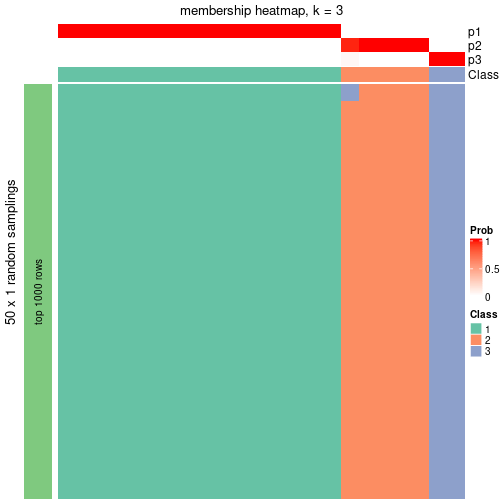</p>

</div>
<div id='tab-node-0412-membership-heatmap-3'>
<pre><code class="r">membership_heatmap(res, k = 4)
</code></pre>

<p>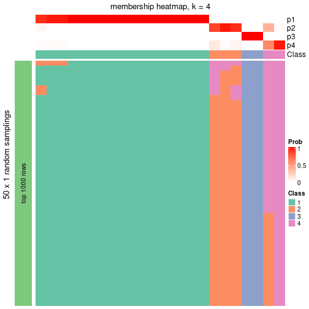</p>

</div>
<div id='tab-node-0412-membership-heatmap-4'>
<pre><code class="r">membership_heatmap(res, k = 5)
</code></pre>

<p>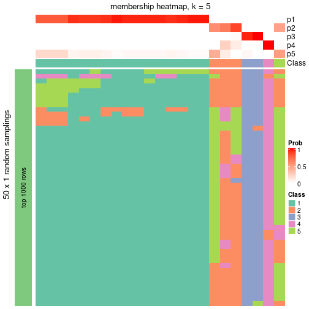</p>

</div>
<div id='tab-node-0412-membership-heatmap-5'>
<pre><code class="r">membership_heatmap(res, k = 6)
</code></pre>

<p>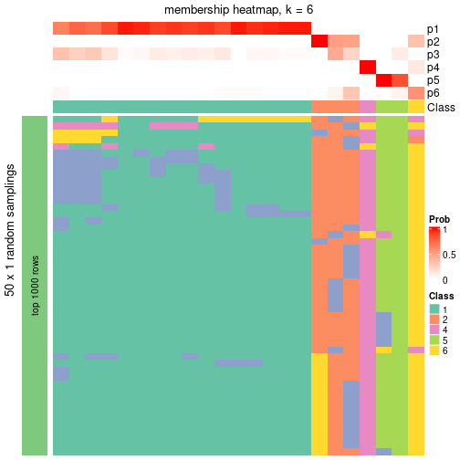</p>

</div>
<div id='tab-node-0412-membership-heatmap-6'>
<pre><code class="r">membership_heatmap(res, k = 7)
</code></pre>

<p>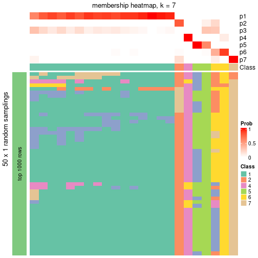</p>

</div>
<div id='tab-node-0412-membership-heatmap-7'>
<pre><code class="r">membership_heatmap(res, k = 8)
</code></pre>

<p>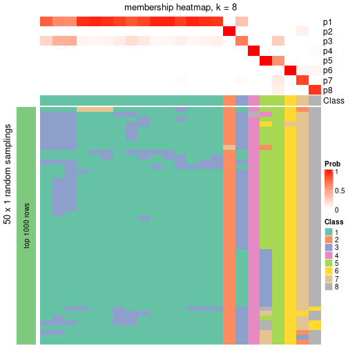</p>

</div>
</div>

As soon as the classes for columns are determined, the signatures
that are significantly different between subgroups can be looked for. 
Following are the heatmaps for signatures.


<script>
$( function() {
	$( '#tabs-node-0412-get-signatures' ).tabs();
} );
</script>
<div id='tabs-node-0412-get-signatures'>
<ul>
<li><a href='#tab-node-0412-get-signatures-1'>k = 2</a></li>
<li><a href='#tab-node-0412-get-signatures-2'>k = 3</a></li>
<li><a href='#tab-node-0412-get-signatures-3'>k = 4</a></li>
<li><a href='#tab-node-0412-get-signatures-4'>k = 5</a></li>
<li><a href='#tab-node-0412-get-signatures-5'>k = 6</a></li>
<li><a href='#tab-node-0412-get-signatures-6'>k = 7</a></li>
<li><a href='#tab-node-0412-get-signatures-7'>k = 8</a></li>
</ul>
<div id='tab-node-0412-get-signatures-1'>
<pre><code class="r">get_signatures(res, k = 2)
</code></pre>

<p>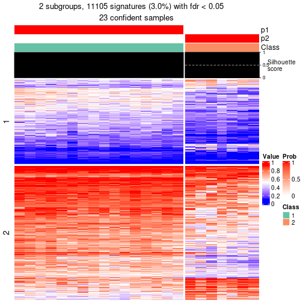</p>

</div>
<div id='tab-node-0412-get-signatures-2'>
<pre><code class="r">get_signatures(res, k = 3)
</code></pre>

<p>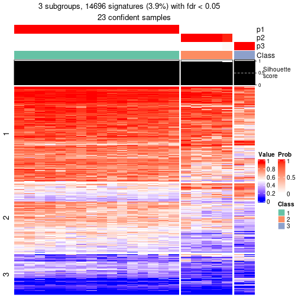</p>

</div>
<div id='tab-node-0412-get-signatures-3'>
<pre><code class="r">get_signatures(res, k = 4)
</code></pre>

<p>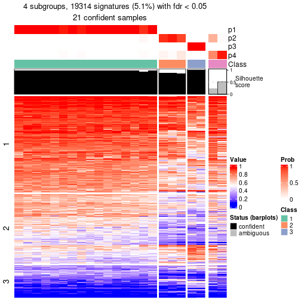</p>

</div>
<div id='tab-node-0412-get-signatures-4'>
<pre><code class="r">get_signatures(res, k = 5)
</code></pre>

<p>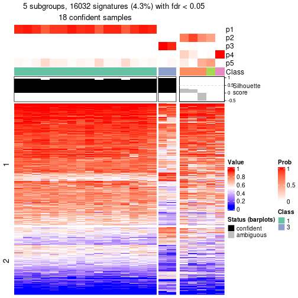</p>

</div>
<div id='tab-node-0412-get-signatures-5'>
<pre><code class="r">get_signatures(res, k = 6)
</code></pre>

<p>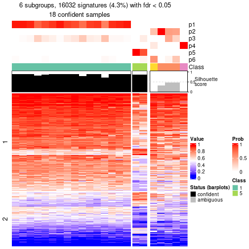</p>

</div>
<div id='tab-node-0412-get-signatures-6'>
<pre><code class="r">get_signatures(res, k = 7)
</code></pre>

<p>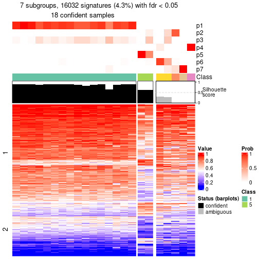</p>

</div>
<div id='tab-node-0412-get-signatures-7'>
<pre><code class="r">get_signatures(res, k = 8)
</code></pre>

<p>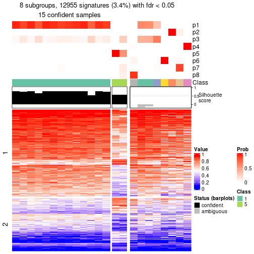</p>

</div>
</div>


Compare the overlap of signatures from different k:

```r
compare_signatures(res)
```


`get_signature()` returns a data frame invisibly. To get the list of signatures, the function
call should be assigned to a variable explicitly. In following code, if `plot` argument is set
to `FALSE`, no heatmap is plotted while only the differential analysis is performed.

```r
# code only for demonstration
tb = get_signature(res, k = ..., plot = FALSE)
```

An example of the output of `tb` is:

```
#>   which_row         fdr    mean_1    mean_2 scaled_mean_1 scaled_mean_2 km
#> 1        38 0.042760348  8.373488  9.131774    -0.5533452     0.5164555  1
#> 2        40 0.018707592  7.106213  8.469186    -0.6173731     0.5762149  1
#> 3        55 0.019134737 10.221463 11.207825    -0.6159697     0.5749050  1
#> 4        59 0.006059896  5.921854  7.869574    -0.6899429     0.6439467  1
#> 5        60 0.018055526  8.928898 10.211722    -0.6204761     0.5791110  1
#> 6        98 0.009384629 15.714769 14.887706     0.6635654    -0.6193277  2
...
```

The columns in `tb` are:

1. `which_row`: row indices corresponding to the input matrix.
2. `fdr`: FDR for the differential test. 
3. `mean_x`: The mean value in group x.
4. `scaled_mean_x`: The mean value in group x after rows are scaled.
5. `km`: Row groups if k-means clustering is applied to rows (which is done by automatically selecting number of clusters).

If there are too many signatures, `top_signatures = ...` can be set to only show the 
signatures with the highest FDRs:

```r
# code only for demonstration
# e.g. to show the top 500 most significant rows
tb = get_signature(res, k = ..., top_signatures = 500)
```

If the signatures are defined as these which are uniquely high in current group, `diff_method` argument
can be set to `"uniquely_high_in_one_group"`:

```r
# code only for demonstration
tb = get_signature(res, k = ..., diff_method = "uniquely_high_in_one_group")
```


UMAP plot which shows how samples are separated.


<script>
$( function() {
	$( '#tabs-node-0412-dimension-reduction' ).tabs();
} );
</script>
<div id='tabs-node-0412-dimension-reduction'>
<ul>
<li><a href='#tab-node-0412-dimension-reduction-1'>k = 2</a></li>
<li><a href='#tab-node-0412-dimension-reduction-2'>k = 3</a></li>
<li><a href='#tab-node-0412-dimension-reduction-3'>k = 4</a></li>
<li><a href='#tab-node-0412-dimension-reduction-4'>k = 5</a></li>
<li><a href='#tab-node-0412-dimension-reduction-5'>k = 6</a></li>
<li><a href='#tab-node-0412-dimension-reduction-6'>k = 7</a></li>
<li><a href='#tab-node-0412-dimension-reduction-7'>k = 8</a></li>
</ul>
<div id='tab-node-0412-dimension-reduction-1'>
<pre><code class="r">dimension_reduction(res, k = 2, method = &quot;UMAP&quot;)
</code></pre>

<p>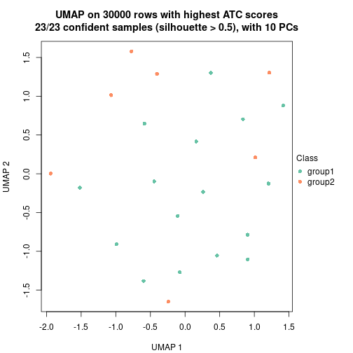</p>

</div>
<div id='tab-node-0412-dimension-reduction-2'>
<pre><code class="r">dimension_reduction(res, k = 3, method = &quot;UMAP&quot;)
</code></pre>

<p>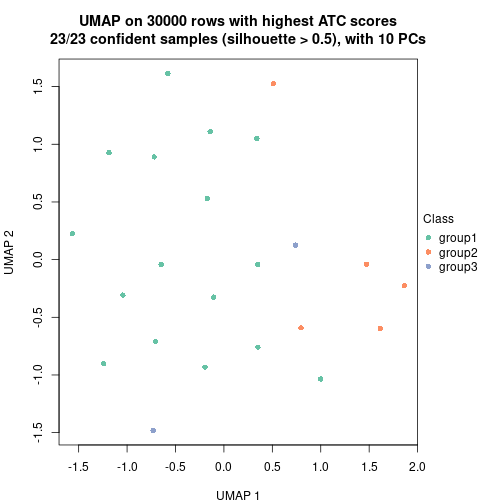</p>

</div>
<div id='tab-node-0412-dimension-reduction-3'>
<pre><code class="r">dimension_reduction(res, k = 4, method = &quot;UMAP&quot;)
</code></pre>

<p>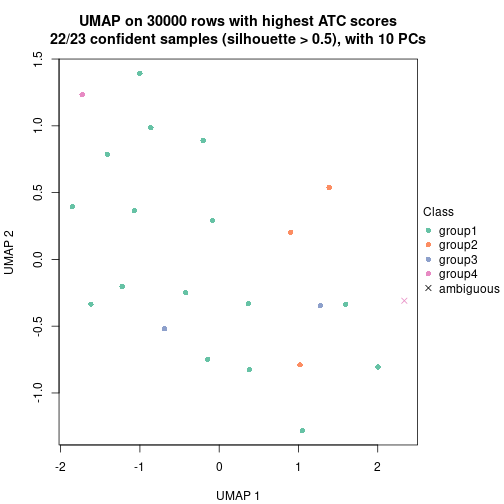</p>

</div>
<div id='tab-node-0412-dimension-reduction-4'>
<pre><code class="r">dimension_reduction(res, k = 5, method = &quot;UMAP&quot;)
</code></pre>

<p>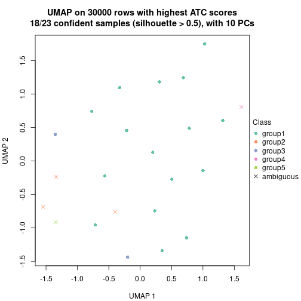</p>

</div>
<div id='tab-node-0412-dimension-reduction-5'>
<pre><code class="r">dimension_reduction(res, k = 6, method = &quot;UMAP&quot;)
</code></pre>

<p>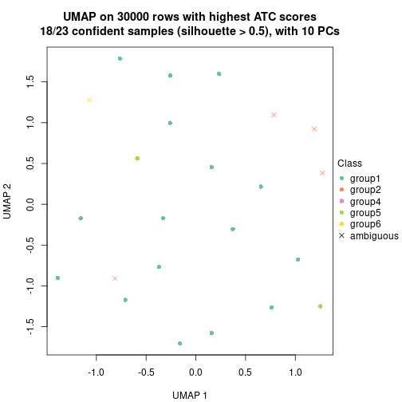</p>

</div>
<div id='tab-node-0412-dimension-reduction-6'>
<pre><code class="r">dimension_reduction(res, k = 7, method = &quot;UMAP&quot;)
</code></pre>

<p>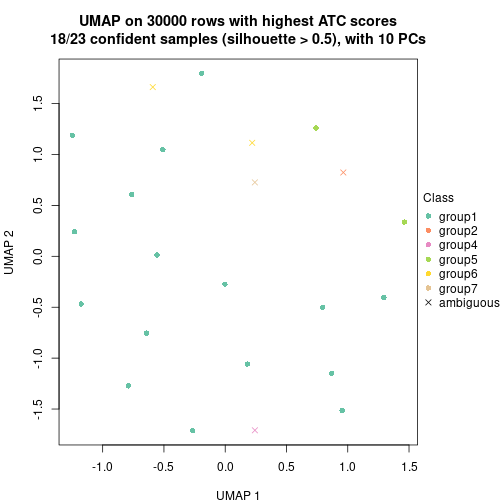</p>

</div>
<div id='tab-node-0412-dimension-reduction-7'>
<pre><code class="r">dimension_reduction(res, k = 8, method = &quot;UMAP&quot;)
</code></pre>

<p>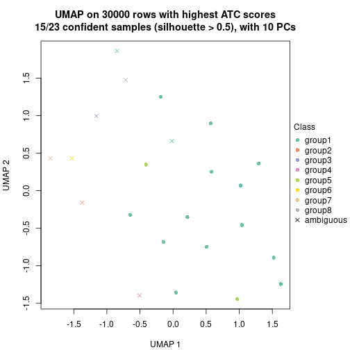</p>

</div>
</div>


Following heatmap shows how subgroups are split when increasing `k`:

```r
collect_classes(res)
```

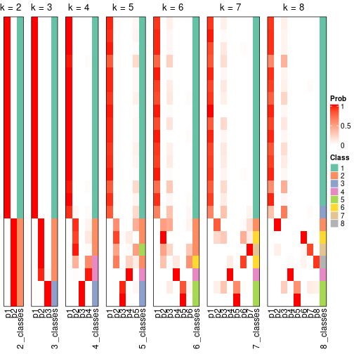


If matrix rows can be associated to genes, consider to use `functional_enrichment(res,
...)` to perform function enrichment for the signature genes. See [this vignette](https://jokergoo.github.io/cola_vignettes/functional_enrichment.html) for more detailed explanations.


 

---------------------------------------------------


### Node042


Parent node: [Node04](#Node04).
Child nodes: 
                Node0111-leaf
        ,
                Node0112-leaf
        ,
                Node0113-leaf
        ,
                Node0121-leaf
        ,
                Node0122-leaf
        ,
                Node0123-leaf
        ,
                Node0124-leaf
        ,
                Node0311-leaf
        ,
                Node0312-leaf
        ,
                Node0331-leaf
        ,
                Node0332-leaf
        ,
                Node0341-leaf
        ,
                Node0342-leaf
        ,
                Node0411-leaf
        ,
                [Node0412](#Node0412)
        ,
                Node0413-leaf
        ,
                Node0421-leaf
        ,
                Node0422-leaf
        ,
                Node0423-leaf
        ,
                Node0431-leaf
        ,
                [Node0432](#Node0432)
        ,
                Node0433-leaf
        ,
                Node0511-leaf
        ,
                Node0512-leaf
        ,
                Node0513-leaf
        ,
                [Node0521](#Node0521)
        ,
                Node0522-leaf
        ,
                Node0531-leaf
        ,
                Node0532-leaf
        ,
                Node0533-leaf
        .


The object with results only for a single top-value method and a single partitioning method 
can be extracted as:

```r
res = res_rh["042"]
```

A summary of `res` and all the functions that can be applied to it:

```r
res
```

```
#> A 'ConsensusPartition' object with k = 2, 3, 4, 5, 6, 7, 8.
#>   On a matrix with 30000 rows and 37 columns.
#>   Top rows (1000) are extracted by 'ATC' method.
#>   Subgroups are detected by 'kmeans' method.
#>   Performed in total 350 partitions by row resampling.
#>   Best k for subgroups seems to be 3.
#> 
#> Following methods can be applied to this 'ConsensusPartition' object:
#>  [1] "cola_report"             "collect_classes"         "collect_plots"          
#>  [4] "collect_stats"           "colnames"                "compare_partitions"     
#>  [7] "compare_signatures"      "consensus_heatmap"       "dimension_reduction"    
#> [10] "functional_enrichment"   "get_anno_col"            "get_anno"               
#> [13] "get_classes"             "get_consensus"           "get_matrix"             
#> [16] "get_membership"          "get_param"               "get_signatures"         
#> [19] "get_stats"               "is_best_k"               "is_stable_k"            
#> [22] "membership_heatmap"      "ncol"                    "nrow"                   
#> [25] "plot_ecdf"               "predict_classes"         "rownames"               
#> [28] "select_partition_number" "show"                    "suggest_best_k"         
#> [31] "test_to_known_factors"   "top_rows_heatmap"
```

`collect_plots()` function collects all the plots made from `res` for all `k` (number of subgroups)
into one single page to provide an easy and fast comparison between different `k`.

```r
collect_plots(res)
```

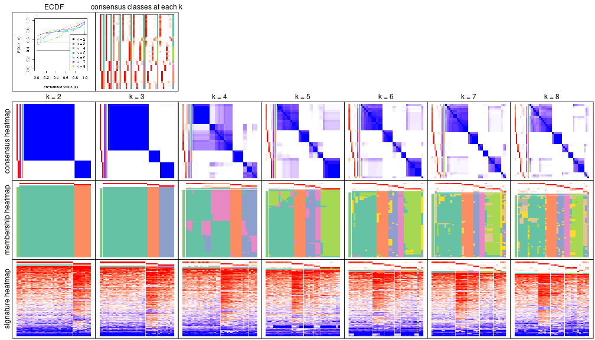

The plots are:

- The first row: a plot of the eCDF (empirical cumulative distribution
  function) curves of the consensus matrix for each `k` and the heatmap of
  predicted classes for each `k`.
- The second row: heatmaps of the consensus matrix for each `k`.
- The third row: heatmaps of the membership matrix for each `k`.
- The fouth row: heatmaps of the signatures for each `k`.

All the plots in panels can be made by individual functions and they are
plotted later in this section.

`select_partition_number()` produces several plots showing different
statistics for choosing "optimized" `k`. There are following statistics:

- eCDF curves of the consensus matrix for each `k`;
- 1-PAC. [The PAC score](https://en.wikipedia.org/wiki/Consensus_clustering#Over-interpretation_potential_of_consensus_clustering)
  measures the proportion of the ambiguous subgrouping.
- Mean silhouette score.
- Concordance. The mean probability of fiting the consensus subgroup labels in all
  partitions.
- Area increased. Denote $A_k$ as the area under the eCDF curve for current
  `k`, the area increased is defined as $A_k - A_{k-1}$.
- Rand index. The percent of pairs of samples that are both in a same cluster
  or both are not in a same cluster in the partition of k and k-1.
- Jaccard index. The ratio of pairs of samples are both in a same cluster in
  the partition of k and k-1 and the pairs of samples are both in a same
  cluster in the partition k or k-1.

The detailed explanations of these statistics can be found in [the _cola_
vignette](https://jokergoo.github.io/cola_vignettes/cola.html#toc_13).

Generally speaking, higher 1-PAC score, higher mean silhouette score or higher
concordance corresponds to better partition. Rand index and Jaccard index
measure how similar the current partition is compared to partition with `k-1`.
If they are too similar, we won't accept `k` is better than `k-1`.

```r
select_partition_number(res)
```

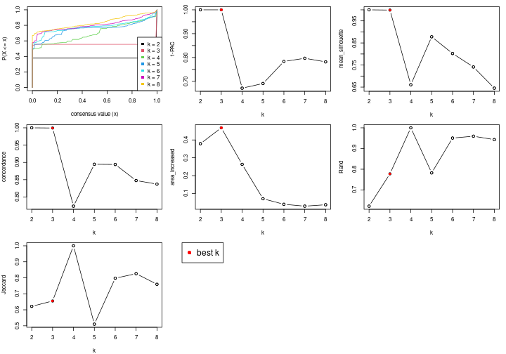

The numeric values for all these statistics can be obtained by `get_stats()`.

```r
get_stats(res)
```

```
#>   k 1-PAC mean_silhouette concordance area_increased  Rand Jaccard
#> 2 2 1.000           1.000       1.000         0.3790 0.622   0.622
#> 3 3 1.000           0.999       0.999         0.4681 0.778   0.655
#> 4 4 0.671           0.661       0.774         0.2633 1.000   1.000
#> 5 5 0.691           0.878       0.895         0.0704 0.782   0.510
#> 6 6 0.783           0.802       0.894         0.0394 0.950   0.798
#> 7 7 0.797           0.741       0.848         0.0288 0.959   0.826
#> 8 8 0.782           0.645       0.837         0.0368 0.943   0.759
```

`suggest_best_k()` suggests the best $k$ based on these statistics. The rules are as follows:

- All $k$ with Jaccard index larger than 0.95 are removed because increasing
  $k$ does not provide enough extra information. If all $k$ are removed, it is
  marked as no subgroup is detected.
- For all $k$ with 1-PAC score larger than 0.9, the maximal $k$ is taken as
  the best $k$, and other $k$ are marked as optional $k$.
- If it does not fit the second rule. The $k$ with the maximal vote of the
  highest 1-PAC score, highest mean silhouette, and highest concordance is
  taken as the best $k$.

```r
suggest_best_k(res)
```

```
#> [1] 3
#> attr(,"optional")
#> [1] 2
```

There is also optional best $k$ = 2 that is worth to check.

Following is the table of the partitions (You need to click the **show/hide
code output** link to see it). The membership matrix (columns with name `p*`)
is inferred by
[`clue::cl_consensus()`](https://www.rdocumentation.org/link/cl_consensus?package=clue)
function with the `SE` method. Basically the value in the membership matrix
represents the probability to belong to a certain group. The finall subgroup
label for an item is determined with the group with highest probability it
belongs to.

In `get_classes()` function, the entropy is calculated from the membership
matrix and the silhouette score is calculated from the consensus matrix.


<script>
$( function() {
	$( '#tabs-node-042-get-classes' ).tabs();
} );
</script>
<div id='tabs-node-042-get-classes'>
<ul>
<li><a href='#tab-node-042-get-classes-1'>k = 2</a></li>
<li><a href='#tab-node-042-get-classes-2'>k = 3</a></li>
<li><a href='#tab-node-042-get-classes-3'>k = 4</a></li>
<li><a href='#tab-node-042-get-classes-4'>k = 5</a></li>
<li><a href='#tab-node-042-get-classes-5'>k = 6</a></li>
<li><a href='#tab-node-042-get-classes-6'>k = 7</a></li>
<li><a href='#tab-node-042-get-classes-7'>k = 8</a></li>
</ul>

<div id='tab-node-042-get-classes-1'>
<p><a id='tab-node-042-get-classes-1-a' style='color:#0366d6' href='#'>show/hide code output</a></p>
<pre><code class="r">cbind(get_classes(res, k = 2), get_membership(res, k = 2))
</code></pre>

<pre><code>#&gt;                 class entropy silhouette p1 p2
#&gt; TCGA.33.AASI.01     1       0          1  1  0
#&gt; TCGA.22.5481.01     2       0          1  0  1
#&gt; TCGA.94.7033.01     1       0          1  1  0
#&gt; TCGA.39.5035.01     1       0          1  1  0
#&gt; TCGA.77.8146.01     1       0          1  1  0
#&gt; TCGA.98.8021.01     1       0          1  1  0
#&gt; TCGA.98.8020.01     1       0          1  1  0
#&gt; TCGA.77.8130.01     1       0          1  1  0
#&gt; TCGA.92.8065.01     1       0          1  1  0
#&gt; TCGA.43.8116.01     1       0          1  1  0
#&gt; TCGA.56.7822.01     1       0          1  1  0
#&gt; TCGA.68.7756.01     1       0          1  1  0
#&gt; TCGA.22.4609.01     1       0          1  1  0
#&gt; TCGA.22.5472.01     1       0          1  1  0
#&gt; TCGA.90.7767.01     2       0          1  0  1
#&gt; TCGA.22.5480.01     2       0          1  0  1
#&gt; TCGA.85.7699.01     2       0          1  0  1
#&gt; TCGA.43.7658.01     2       0          1  0  1
#&gt; TCGA.77.A5GH.01     1       0          1  1  0
#&gt; TCGA.96.7544.01     1       0          1  1  0
#&gt; TCGA.O2.A5IB.01     2       0          1  0  1
#&gt; TCGA.77.A5G7.01     1       0          1  1  0
#&gt; TCGA.56.8622.01     1       0          1  1  0
#&gt; TCGA.77.7337.01     1       0          1  1  0
#&gt; TCGA.58.8388.01     2       0          1  0  1
#&gt; TCGA.63.A5MR.01     1       0          1  1  0
#&gt; TCGA.34.8455.01     1       0          1  1  0
#&gt; TCGA.85.7950.01     2       0          1  0  1
#&gt; TCGA.85.8288.01     1       0          1  1  0
#&gt; TCGA.63.A5MV.01     1       0          1  1  0
#&gt; TCGA.21.A5DI.01     1       0          1  1  0
#&gt; TCGA.56.6545.01     1       0          1  1  0
#&gt; TCGA.85.8351.01     1       0          1  1  0
#&gt; TCGA.NK.A5CX.01     1       0          1  1  0
#&gt; TCGA.34.5239.01     2       0          1  0  1
#&gt; TCGA.98.A53B.01     1       0          1  1  0
#&gt; TCGA.58.8386.01     1       0          1  1  0
</code></pre>

<script>
$('#tab-node-042-get-classes-1-a').parent().next().next().hide();
$('#tab-node-042-get-classes-1-a').click(function(){
  $('#tab-node-042-get-classes-1-a').parent().next().next().toggle();
  return(false);
});
</script>
</div>

<div id='tab-node-042-get-classes-2'>
<p><a id='tab-node-042-get-classes-2-a' style='color:#0366d6' href='#'>show/hide code output</a></p>
<pre><code class="r">cbind(get_classes(res, k = 3), get_membership(res, k = 3))
</code></pre>

<pre><code>#&gt;                 class entropy silhouette   p1 p2   p3
#&gt; TCGA.33.AASI.01     1  0.0000      0.999 1.00  0 0.00
#&gt; TCGA.22.5481.01     2  0.0000      1.000 0.00  1 0.00
#&gt; TCGA.94.7033.01     1  0.0000      0.999 1.00  0 0.00
#&gt; TCGA.39.5035.01     1  0.0000      0.999 1.00  0 0.00
#&gt; TCGA.77.8146.01     1  0.0000      0.999 1.00  0 0.00
#&gt; TCGA.98.8021.01     3  0.0000      1.000 0.00  0 1.00
#&gt; TCGA.98.8020.01     1  0.0000      0.999 1.00  0 0.00
#&gt; TCGA.77.8130.01     1  0.0000      0.999 1.00  0 0.00
#&gt; TCGA.92.8065.01     3  0.0000      1.000 0.00  0 1.00
#&gt; TCGA.43.8116.01     1  0.0000      0.999 1.00  0 0.00
#&gt; TCGA.56.7822.01     1  0.0000      0.999 1.00  0 0.00
#&gt; TCGA.68.7756.01     1  0.0000      0.999 1.00  0 0.00
#&gt; TCGA.22.4609.01     1  0.0000      0.999 1.00  0 0.00
#&gt; TCGA.22.5472.01     1  0.0000      0.999 1.00  0 0.00
#&gt; TCGA.90.7767.01     2  0.0000      1.000 0.00  1 0.00
#&gt; TCGA.22.5480.01     2  0.0000      1.000 0.00  1 0.00
#&gt; TCGA.85.7699.01     3  0.0000      1.000 0.00  0 1.00
#&gt; TCGA.43.7658.01     2  0.0000      1.000 0.00  1 0.00
#&gt; TCGA.77.A5GH.01     3  0.0000      1.000 0.00  0 1.00
#&gt; TCGA.96.7544.01     1  0.0000      0.999 1.00  0 0.00
#&gt; TCGA.O2.A5IB.01     2  0.0000      1.000 0.00  1 0.00
#&gt; TCGA.77.A5G7.01     1  0.0000      0.999 1.00  0 0.00
#&gt; TCGA.56.8622.01     1  0.0000      0.999 1.00  0 0.00
#&gt; TCGA.77.7337.01     1  0.0000      0.999 1.00  0 0.00
#&gt; TCGA.58.8388.01     2  0.0000      1.000 0.00  1 0.00
#&gt; TCGA.63.A5MR.01     1  0.0000      0.999 1.00  0 0.00
#&gt; TCGA.34.8455.01     1  0.0000      0.999 1.00  0 0.00
#&gt; TCGA.85.7950.01     3  0.0000      1.000 0.00  0 1.00
#&gt; TCGA.85.8288.01     3  0.0000      1.000 0.00  0 1.00
#&gt; TCGA.63.A5MV.01     1  0.0892      0.979 0.98  0 0.02
#&gt; TCGA.21.A5DI.01     1  0.0000      0.999 1.00  0 0.00
#&gt; TCGA.56.6545.01     3  0.0000      1.000 0.00  0 1.00
#&gt; TCGA.85.8351.01     1  0.0000      0.999 1.00  0 0.00
#&gt; TCGA.NK.A5CX.01     1  0.0000      0.999 1.00  0 0.00
#&gt; TCGA.34.5239.01     3  0.0000      1.000 0.00  0 1.00
#&gt; TCGA.98.A53B.01     1  0.0000      0.999 1.00  0 0.00
#&gt; TCGA.58.8386.01     1  0.0000      0.999 1.00  0 0.00
</code></pre>

<script>
$('#tab-node-042-get-classes-2-a').parent().next().next().hide();
$('#tab-node-042-get-classes-2-a').click(function(){
  $('#tab-node-042-get-classes-2-a').parent().next().next().toggle();
  return(false);
});
</script>
</div>

<div id='tab-node-042-get-classes-3'>
<p><a id='tab-node-042-get-classes-3-a' style='color:#0366d6' href='#'>show/hide code output</a></p>
<pre><code class="r">cbind(get_classes(res, k = 4), get_membership(res, k = 4))
</code></pre>

<pre><code>#&gt;                 class entropy silhouette   p1   p2   p3   p4
#&gt; TCGA.33.AASI.01     1  0.4949      0.475 0.76 0.00 0.06 0.18
#&gt; TCGA.22.5481.01     2  0.0000      0.991 0.00 1.00 0.00 0.00
#&gt; TCGA.94.7033.01     1  0.2011      0.598 0.92 0.00 0.00 0.08
#&gt; TCGA.39.5035.01     1  0.7135      0.180 0.56 0.00 0.24 0.20
#&gt; TCGA.77.8146.01     1  0.4994      0.614 0.52 0.00 0.00 0.48
#&gt; TCGA.98.8021.01     3  0.5661      0.660 0.08 0.00 0.70 0.22
#&gt; TCGA.98.8020.01     1  0.4994      0.614 0.52 0.00 0.00 0.48
#&gt; TCGA.77.8130.01     1  0.4994      0.614 0.52 0.00 0.00 0.48
#&gt; TCGA.92.8065.01     3  0.5661      0.660 0.08 0.00 0.70 0.22
#&gt; TCGA.43.8116.01     1  0.3610      0.517 0.80 0.00 0.00 0.20
#&gt; TCGA.56.7822.01     1  0.2011      0.637 0.92 0.00 0.00 0.08
#&gt; TCGA.68.7756.01     1  0.4994      0.614 0.52 0.00 0.00 0.48
#&gt; TCGA.22.4609.01     1  0.7135      0.180 0.56 0.00 0.24 0.20
#&gt; TCGA.22.5472.01     1  0.4994      0.614 0.52 0.00 0.00 0.48
#&gt; TCGA.90.7767.01     2  0.0000      0.991 0.00 1.00 0.00 0.00
#&gt; TCGA.22.5480.01     2  0.0000      0.991 0.00 1.00 0.00 0.00
#&gt; TCGA.85.7699.01     3  0.3975      0.757 0.00 0.00 0.76 0.24
#&gt; TCGA.43.7658.01     2  0.0000      0.991 0.00 1.00 0.00 0.00
#&gt; TCGA.77.A5GH.01     3  0.2011      0.773 0.00 0.00 0.92 0.08
#&gt; TCGA.96.7544.01     1  0.0707      0.635 0.98 0.00 0.00 0.02
#&gt; TCGA.O2.A5IB.01     2  0.0000      0.991 0.00 1.00 0.00 0.00
#&gt; TCGA.77.A5G7.01     1  0.0000      0.629 1.00 0.00 0.00 0.00
#&gt; TCGA.56.8622.01     1  0.4994      0.614 0.52 0.00 0.00 0.48
#&gt; TCGA.77.7337.01     1  0.0707      0.635 0.98 0.00 0.00 0.02
#&gt; TCGA.58.8388.01     2  0.1637      0.955 0.00 0.94 0.00 0.06
#&gt; TCGA.63.A5MR.01     1  0.2921      0.564 0.86 0.00 0.00 0.14
#&gt; TCGA.34.8455.01     1  0.4994      0.614 0.52 0.00 0.00 0.48
#&gt; TCGA.85.7950.01     3  0.3975      0.757 0.00 0.00 0.76 0.24
#&gt; TCGA.85.8288.01     3  0.1637      0.791 0.00 0.00 0.94 0.06
#&gt; TCGA.63.A5MV.01     1  0.7135      0.180 0.56 0.00 0.24 0.20
#&gt; TCGA.21.A5DI.01     1  0.4994      0.614 0.52 0.00 0.00 0.48
#&gt; TCGA.56.6545.01     3  0.0707      0.788 0.00 0.00 0.98 0.02
#&gt; TCGA.85.8351.01     1  0.4994      0.614 0.52 0.00 0.00 0.48
#&gt; TCGA.NK.A5CX.01     1  0.0707      0.635 0.98 0.00 0.00 0.02
#&gt; TCGA.34.5239.01     3  0.3975      0.757 0.00 0.00 0.76 0.24
#&gt; TCGA.98.A53B.01     1  0.4790      0.622 0.62 0.00 0.00 0.38
#&gt; TCGA.58.8386.01     1  0.2647      0.577 0.88 0.00 0.00 0.12
</code></pre>

<script>
$('#tab-node-042-get-classes-3-a').parent().next().next().hide();
$('#tab-node-042-get-classes-3-a').click(function(){
  $('#tab-node-042-get-classes-3-a').parent().next().next().toggle();
  return(false);
});
</script>
</div>

<div id='tab-node-042-get-classes-4'>
<p><a id='tab-node-042-get-classes-4-a' style='color:#0366d6' href='#'>show/hide code output</a></p>
<pre><code class="r">cbind(get_classes(res, k = 5), get_membership(res, k = 5))
</code></pre>

<pre><code>#&gt;                 class entropy silhouette   p1   p2   p3   p4   p5
#&gt; TCGA.33.AASI.01     1  0.3106      0.878 0.84 0.00 0.00 0.02 0.14
#&gt; TCGA.22.5481.01     2  0.0000      0.978 0.00 1.00 0.00 0.00 0.00
#&gt; TCGA.94.7033.01     1  0.2929      0.883 0.82 0.00 0.00 0.00 0.18
#&gt; TCGA.39.5035.01     1  0.3694      0.746 0.82 0.00 0.02 0.14 0.02
#&gt; TCGA.77.8146.01     5  0.0000      0.967 0.00 0.00 0.00 0.00 1.00
#&gt; TCGA.98.8021.01     4  0.3390      0.912 0.10 0.00 0.06 0.84 0.00
#&gt; TCGA.98.8020.01     5  0.0000      0.967 0.00 0.00 0.00 0.00 1.00
#&gt; TCGA.77.8130.01     5  0.0000      0.967 0.00 0.00 0.00 0.00 1.00
#&gt; TCGA.92.8065.01     4  0.3390      0.912 0.10 0.00 0.06 0.84 0.00
#&gt; TCGA.43.8116.01     1  0.2616      0.855 0.88 0.00 0.00 0.02 0.10
#&gt; TCGA.56.7822.01     1  0.3684      0.818 0.72 0.00 0.00 0.00 0.28
#&gt; TCGA.68.7756.01     5  0.0000      0.967 0.00 0.00 0.00 0.00 1.00
#&gt; TCGA.22.4609.01     1  0.2616      0.776 0.88 0.00 0.00 0.10 0.02
#&gt; TCGA.22.5472.01     5  0.0000      0.967 0.00 0.00 0.00 0.00 1.00
#&gt; TCGA.90.7767.01     2  0.0609      0.970 0.02 0.98 0.00 0.00 0.00
#&gt; TCGA.22.5480.01     2  0.0000      0.978 0.00 1.00 0.00 0.00 0.00
#&gt; TCGA.85.7699.01     3  0.0609      0.819 0.00 0.00 0.98 0.02 0.00
#&gt; TCGA.43.7658.01     2  0.0000      0.978 0.00 1.00 0.00 0.00 0.00
#&gt; TCGA.77.A5GH.01     3  0.4876      0.626 0.08 0.00 0.70 0.22 0.00
#&gt; TCGA.96.7544.01     1  0.3999      0.867 0.74 0.00 0.00 0.02 0.24
#&gt; TCGA.O2.A5IB.01     2  0.0000      0.978 0.00 1.00 0.00 0.00 0.00
#&gt; TCGA.77.A5G7.01     1  0.3999      0.867 0.74 0.00 0.00 0.02 0.24
#&gt; TCGA.56.8622.01     5  0.0000      0.967 0.00 0.00 0.00 0.00 1.00
#&gt; TCGA.77.7337.01     1  0.3424      0.862 0.76 0.00 0.00 0.00 0.24
#&gt; TCGA.58.8388.01     2  0.2797      0.903 0.06 0.88 0.00 0.06 0.00
#&gt; TCGA.63.A5MR.01     1  0.2732      0.883 0.84 0.00 0.00 0.00 0.16
#&gt; TCGA.34.8455.01     5  0.0000      0.967 0.00 0.00 0.00 0.00 1.00
#&gt; TCGA.85.7950.01     3  0.1648      0.805 0.02 0.00 0.94 0.04 0.00
#&gt; TCGA.85.8288.01     3  0.3852      0.683 0.02 0.00 0.76 0.22 0.00
#&gt; TCGA.63.A5MV.01     1  0.2616      0.776 0.88 0.00 0.00 0.10 0.02
#&gt; TCGA.21.A5DI.01     5  0.0609      0.955 0.02 0.00 0.00 0.00 0.98
#&gt; TCGA.56.6545.01     4  0.2732      0.805 0.00 0.00 0.16 0.84 0.00
#&gt; TCGA.85.8351.01     5  0.0609      0.955 0.02 0.00 0.00 0.00 0.98
#&gt; TCGA.NK.A5CX.01     1  0.3424      0.862 0.76 0.00 0.00 0.00 0.24
#&gt; TCGA.34.5239.01     3  0.0609      0.819 0.00 0.00 0.98 0.02 0.00
#&gt; TCGA.98.A53B.01     5  0.3109      0.684 0.20 0.00 0.00 0.00 0.80
#&gt; TCGA.58.8386.01     1  0.2516      0.880 0.86 0.00 0.00 0.00 0.14
</code></pre>

<script>
$('#tab-node-042-get-classes-4-a').parent().next().next().hide();
$('#tab-node-042-get-classes-4-a').click(function(){
  $('#tab-node-042-get-classes-4-a').parent().next().next().toggle();
  return(false);
});
</script>
</div>

<div id='tab-node-042-get-classes-5'>
<p><a id='tab-node-042-get-classes-5-a' style='color:#0366d6' href='#'>show/hide code output</a></p>
<pre><code class="r">cbind(get_classes(res, k = 6), get_membership(res, k = 6))
</code></pre>

<pre><code>#&gt;                 class entropy silhouette   p1   p2   p3   p4   p5   p6
#&gt; TCGA.33.AASI.01     1  0.1865      0.864 0.92 0.00 0.00 0.00 0.04 0.04
#&gt; TCGA.22.5481.01     2  0.0547      0.952 0.00 0.98 0.00 0.00 0.02 0.00
#&gt; TCGA.94.7033.01     1  0.0937      0.871 0.96 0.00 0.00 0.00 0.04 0.00
#&gt; TCGA.39.5035.01     6  0.4552      0.000 0.30 0.00 0.00 0.06 0.00 0.64
#&gt; TCGA.77.8146.01     5  0.0937      0.907 0.04 0.00 0.00 0.00 0.96 0.00
#&gt; TCGA.98.8021.01     4  0.0547      0.982 0.02 0.00 0.00 0.98 0.00 0.00
#&gt; TCGA.98.8020.01     5  0.0937      0.907 0.04 0.00 0.00 0.00 0.96 0.00
#&gt; TCGA.77.8130.01     5  0.2190      0.899 0.04 0.00 0.00 0.00 0.90 0.06
#&gt; TCGA.92.8065.01     4  0.0547      0.982 0.02 0.00 0.00 0.98 0.00 0.00
#&gt; TCGA.43.8116.01     1  0.1814      0.761 0.90 0.00 0.00 0.00 0.00 0.10
#&gt; TCGA.56.7822.01     1  0.1267      0.869 0.94 0.00 0.00 0.00 0.06 0.00
#&gt; TCGA.68.7756.01     5  0.0937      0.907 0.04 0.00 0.00 0.00 0.96 0.00
#&gt; TCGA.22.4609.01     1  0.0937      0.776 0.96 0.00 0.00 0.04 0.00 0.00
#&gt; TCGA.22.5472.01     5  0.2190      0.899 0.04 0.00 0.00 0.00 0.90 0.06
#&gt; TCGA.90.7767.01     2  0.0937      0.944 0.00 0.96 0.00 0.00 0.00 0.04
#&gt; TCGA.22.5480.01     2  0.0000      0.958 0.00 1.00 0.00 0.00 0.00 0.00
#&gt; TCGA.85.7699.01     3  0.1092      0.747 0.00 0.00 0.96 0.00 0.02 0.02
#&gt; TCGA.43.7658.01     2  0.0000      0.958 0.00 1.00 0.00 0.00 0.00 0.00
#&gt; TCGA.77.A5GH.01     3  0.5832      0.508 0.04 0.00 0.56 0.10 0.00 0.30
#&gt; TCGA.96.7544.01     1  0.2512      0.851 0.88 0.00 0.00 0.00 0.06 0.06
#&gt; TCGA.O2.A5IB.01     2  0.0000      0.958 0.00 1.00 0.00 0.00 0.00 0.00
#&gt; TCGA.77.A5G7.01     1  0.2512      0.851 0.88 0.00 0.00 0.00 0.06 0.06
#&gt; TCGA.56.8622.01     5  0.0937      0.907 0.04 0.00 0.00 0.00 0.96 0.00
#&gt; TCGA.77.7337.01     1  0.1807      0.867 0.92 0.00 0.00 0.00 0.06 0.02
#&gt; TCGA.58.8388.01     2  0.2793      0.832 0.00 0.80 0.00 0.00 0.00 0.20
#&gt; TCGA.63.A5MR.01     1  0.0937      0.871 0.96 0.00 0.00 0.00 0.04 0.00
#&gt; TCGA.34.8455.01     5  0.1865      0.903 0.04 0.00 0.00 0.00 0.92 0.04
#&gt; TCGA.85.7950.01     3  0.2094      0.728 0.00 0.00 0.90 0.02 0.00 0.08
#&gt; TCGA.85.8288.01     3  0.5227      0.600 0.02 0.00 0.64 0.10 0.00 0.24
#&gt; TCGA.63.A5MV.01     1  0.3679      0.335 0.76 0.00 0.00 0.04 0.00 0.20
#&gt; TCGA.21.A5DI.01     5  0.3647      0.480 0.36 0.00 0.00 0.00 0.64 0.00
#&gt; TCGA.56.6545.01     4  0.0547      0.964 0.00 0.00 0.02 0.98 0.00 0.00
#&gt; TCGA.85.8351.01     5  0.3475      0.812 0.14 0.00 0.00 0.00 0.80 0.06
#&gt; TCGA.NK.A5CX.01     1  0.1267      0.869 0.94 0.00 0.00 0.00 0.06 0.00
#&gt; TCGA.34.5239.01     3  0.0000      0.755 0.00 0.00 1.00 0.00 0.00 0.00
#&gt; TCGA.98.A53B.01     1  0.3309      0.536 0.72 0.00 0.00 0.00 0.28 0.00
#&gt; TCGA.58.8386.01     1  0.0937      0.871 0.96 0.00 0.00 0.00 0.04 0.00
</code></pre>

<script>
$('#tab-node-042-get-classes-5-a').parent().next().next().hide();
$('#tab-node-042-get-classes-5-a').click(function(){
  $('#tab-node-042-get-classes-5-a').parent().next().next().toggle();
  return(false);
});
</script>
</div>

<div id='tab-node-042-get-classes-6'>
<p><a id='tab-node-042-get-classes-6-a' style='color:#0366d6' href='#'>show/hide code output</a></p>
<pre><code class="r">cbind(get_classes(res, k = 7), get_membership(res, k = 7))
</code></pre>

<pre><code>#&gt;                 class entropy silhouette   p1   p2   p3   p4   p5   p6   p7
#&gt; TCGA.33.AASI.01     1  0.1928     0.8218 0.90 0.00 0.08 0.00 0.00 0.02 0.00
#&gt; TCGA.22.5481.01     2  0.0000     0.9381 0.00 1.00 0.00 0.00 0.00 0.00 0.00
#&gt; TCGA.94.7033.01     1  0.0504     0.8496 0.98 0.00 0.00 0.00 0.00 0.02 0.00
#&gt; TCGA.39.5035.01     6  0.4500     0.0000 0.08 0.00 0.00 0.02 0.00 0.68 0.22
#&gt; TCGA.77.8146.01     5  0.0863     0.7803 0.04 0.00 0.00 0.00 0.96 0.00 0.00
#&gt; TCGA.98.8021.01     4  0.0000     1.0000 0.00 0.00 0.00 1.00 0.00 0.00 0.00
#&gt; TCGA.98.8020.01     5  0.1363     0.7741 0.04 0.00 0.00 0.00 0.94 0.02 0.00
#&gt; TCGA.77.8130.01     5  0.5733     0.7006 0.08 0.00 0.18 0.00 0.62 0.10 0.02
#&gt; TCGA.92.8065.01     4  0.0000     1.0000 0.00 0.00 0.00 1.00 0.00 0.00 0.00
#&gt; TCGA.43.8116.01     1  0.3541     0.7605 0.80 0.00 0.02 0.00 0.00 0.10 0.08
#&gt; TCGA.56.7822.01     1  0.0504     0.8496 0.98 0.00 0.00 0.00 0.00 0.02 0.00
#&gt; TCGA.68.7756.01     5  0.0863     0.7803 0.04 0.00 0.00 0.00 0.96 0.00 0.00
#&gt; TCGA.22.4609.01     1  0.2509     0.7991 0.88 0.00 0.00 0.02 0.00 0.04 0.06
#&gt; TCGA.22.5472.01     5  0.5036     0.7323 0.04 0.00 0.18 0.00 0.68 0.08 0.02
#&gt; TCGA.90.7767.01     2  0.1006     0.9203 0.00 0.96 0.00 0.00 0.02 0.02 0.00
#&gt; TCGA.22.5480.01     2  0.0000     0.9381 0.00 1.00 0.00 0.00 0.00 0.00 0.00
#&gt; TCGA.85.7699.01     3  0.3294     0.8677 0.00 0.00 0.66 0.00 0.00 0.00 0.34
#&gt; TCGA.43.7658.01     2  0.0000     0.9381 0.00 1.00 0.00 0.00 0.00 0.00 0.00
#&gt; TCGA.77.A5GH.01     7  0.1433     0.4755 0.00 0.00 0.00 0.08 0.00 0.00 0.92
#&gt; TCGA.96.7544.01     1  0.1928     0.8226 0.90 0.00 0.02 0.00 0.00 0.08 0.00
#&gt; TCGA.O2.A5IB.01     2  0.0000     0.9381 0.00 1.00 0.00 0.00 0.00 0.00 0.00
#&gt; TCGA.77.A5G7.01     1  0.1928     0.8226 0.90 0.00 0.02 0.00 0.00 0.08 0.00
#&gt; TCGA.56.8622.01     5  0.1363     0.7741 0.04 0.00 0.00 0.00 0.94 0.02 0.00
#&gt; TCGA.77.7337.01     1  0.0504     0.8458 0.98 0.00 0.02 0.00 0.00 0.00 0.00
#&gt; TCGA.58.8388.01     2  0.4569     0.6811 0.00 0.70 0.08 0.00 0.00 0.18 0.04
#&gt; TCGA.63.A5MR.01     1  0.0863     0.8477 0.96 0.00 0.00 0.00 0.00 0.04 0.00
#&gt; TCGA.34.8455.01     5  0.4892     0.7400 0.04 0.00 0.16 0.00 0.70 0.08 0.02
#&gt; TCGA.85.7950.01     3  0.4356     0.7746 0.00 0.00 0.56 0.00 0.02 0.02 0.40
#&gt; TCGA.85.8288.01     7  0.4418     0.1507 0.00 0.00 0.30 0.08 0.00 0.00 0.62
#&gt; TCGA.63.A5MV.01     1  0.4990    -0.0309 0.48 0.00 0.00 0.04 0.00 0.04 0.44
#&gt; TCGA.21.A5DI.01     1  0.3221     0.4700 0.68 0.00 0.00 0.00 0.32 0.00 0.00
#&gt; TCGA.56.6545.01     4  0.0000     1.0000 0.00 0.00 0.00 1.00 0.00 0.00 0.00
#&gt; TCGA.85.8351.01     5  0.6240     0.3317 0.38 0.00 0.14 0.00 0.42 0.04 0.02
#&gt; TCGA.NK.A5CX.01     1  0.1006     0.8424 0.96 0.00 0.02 0.00 0.00 0.02 0.00
#&gt; TCGA.34.5239.01     3  0.3358     0.8705 0.00 0.00 0.64 0.00 0.00 0.00 0.36
#&gt; TCGA.98.A53B.01     1  0.1886     0.7662 0.88 0.00 0.00 0.00 0.12 0.00 0.00
#&gt; TCGA.58.8386.01     1  0.0504     0.8496 0.98 0.00 0.00 0.00 0.00 0.02 0.00
</code></pre>

<script>
$('#tab-node-042-get-classes-6-a').parent().next().next().hide();
$('#tab-node-042-get-classes-6-a').click(function(){
  $('#tab-node-042-get-classes-6-a').parent().next().next().toggle();
  return(false);
});
</script>
</div>

<div id='tab-node-042-get-classes-7'>
<p><a id='tab-node-042-get-classes-7-a' style='color:#0366d6' href='#'>show/hide code output</a></p>
<pre><code class="r">cbind(get_classes(res, k = 8), get_membership(res, k = 8))
</code></pre>

<pre><code>#&gt;                 class entropy silhouette   p1   p2   p3   p4   p5   p6   p7   p8
#&gt; TCGA.33.AASI.01     1  0.4400     0.5630 0.68 0.00 0.00 0.00 0.00 0.20 0.04 0.08
#&gt; TCGA.22.5481.01     2  0.0000     0.9271 0.00 1.00 0.00 0.00 0.00 0.00 0.00 0.00
#&gt; TCGA.94.7033.01     1  0.1563     0.7126 0.90 0.00 0.00 0.00 0.00 0.00 0.10 0.00
#&gt; TCGA.39.5035.01     8  0.1607     0.0000 0.04 0.00 0.00 0.00 0.00 0.00 0.04 0.92
#&gt; TCGA.77.8146.01     5  0.0000     0.7970 0.00 0.00 0.00 0.00 1.00 0.00 0.00 0.00
#&gt; TCGA.98.8021.01     4  0.0000     0.9901 0.00 0.00 0.00 1.00 0.00 0.00 0.00 0.00
#&gt; TCGA.98.8020.01     5  0.0000     0.7970 0.00 0.00 0.00 0.00 1.00 0.00 0.00 0.00
#&gt; TCGA.77.8130.01     5  0.5190     0.3726 0.26 0.00 0.00 0.00 0.42 0.32 0.00 0.00
#&gt; TCGA.92.8065.01     4  0.0471     0.9802 0.00 0.00 0.00 0.98 0.00 0.02 0.00 0.00
#&gt; TCGA.43.8116.01     1  0.5350     0.4788 0.54 0.00 0.00 0.00 0.00 0.06 0.28 0.12
#&gt; TCGA.56.7822.01     1  0.1091     0.7164 0.94 0.00 0.00 0.00 0.00 0.00 0.06 0.00
#&gt; TCGA.68.7756.01     5  0.0471     0.7893 0.02 0.00 0.00 0.00 0.98 0.00 0.00 0.00
#&gt; TCGA.22.4609.01     1  0.3660     0.6061 0.70 0.00 0.00 0.00 0.00 0.00 0.24 0.06
#&gt; TCGA.22.5472.01     5  0.2852     0.7127 0.00 0.00 0.00 0.00 0.72 0.28 0.00 0.00
#&gt; TCGA.90.7767.01     2  0.0000     0.9271 0.00 1.00 0.00 0.00 0.00 0.00 0.00 0.00
#&gt; TCGA.22.5480.01     2  0.0000     0.9271 0.00 1.00 0.00 0.00 0.00 0.00 0.00 0.00
#&gt; TCGA.85.7699.01     3  0.2864     0.7148 0.00 0.00 0.84 0.00 0.00 0.08 0.06 0.02
#&gt; TCGA.43.7658.01     2  0.0000     0.9271 0.00 1.00 0.00 0.00 0.00 0.00 0.00 0.00
#&gt; TCGA.77.A5GH.01     7  0.4466    -0.0853 0.00 0.00 0.32 0.04 0.00 0.04 0.60 0.00
#&gt; TCGA.96.7544.01     1  0.4979     0.5249 0.64 0.00 0.00 0.00 0.00 0.08 0.16 0.12
#&gt; TCGA.O2.A5IB.01     2  0.0000     0.9271 0.00 1.00 0.00 0.00 0.00 0.00 0.00 0.00
#&gt; TCGA.77.A5G7.01     1  0.4893     0.5305 0.64 0.00 0.00 0.00 0.00 0.06 0.18 0.12
#&gt; TCGA.56.8622.01     5  0.0000     0.7970 0.00 0.00 0.00 0.00 1.00 0.00 0.00 0.00
#&gt; TCGA.77.7337.01     1  0.0941     0.7125 0.96 0.00 0.00 0.00 0.00 0.02 0.02 0.00
#&gt; TCGA.58.8388.01     2  0.4174     0.5384 0.00 0.62 0.00 0.00 0.00 0.32 0.02 0.04
#&gt; TCGA.63.A5MR.01     1  0.1765     0.7118 0.88 0.00 0.00 0.00 0.00 0.00 0.12 0.00
#&gt; TCGA.34.8455.01     5  0.2756     0.7232 0.00 0.00 0.00 0.00 0.74 0.26 0.00 0.00
#&gt; TCGA.85.7950.01     3  0.2864     0.7277 0.00 0.00 0.84 0.00 0.00 0.06 0.08 0.02
#&gt; TCGA.85.8288.01     3  0.4186     0.5124 0.00 0.00 0.72 0.06 0.00 0.02 0.18 0.02
#&gt; TCGA.63.A5MV.01     7  0.2534     0.1329 0.22 0.00 0.00 0.00 0.00 0.00 0.78 0.00
#&gt; TCGA.21.A5DI.01     1  0.2650     0.5403 0.76 0.00 0.00 0.00 0.24 0.00 0.00 0.00
#&gt; TCGA.56.6545.01     4  0.0000     0.9901 0.00 0.00 0.00 1.00 0.00 0.00 0.00 0.00
#&gt; TCGA.85.8351.01     1  0.5163    -0.2320 0.42 0.00 0.00 0.00 0.34 0.24 0.00 0.00
#&gt; TCGA.NK.A5CX.01     1  0.1275     0.7053 0.94 0.00 0.00 0.00 0.00 0.04 0.02 0.00
#&gt; TCGA.34.5239.01     3  0.0000     0.7680 0.00 0.00 1.00 0.00 0.00 0.00 0.00 0.00
#&gt; TCGA.98.A53B.01     1  0.1091     0.6983 0.94 0.00 0.00 0.00 0.06 0.00 0.00 0.00
#&gt; TCGA.58.8386.01     1  0.1563     0.7126 0.90 0.00 0.00 0.00 0.00 0.00 0.10 0.00
</code></pre>

<script>
$('#tab-node-042-get-classes-7-a').parent().next().next().hide();
$('#tab-node-042-get-classes-7-a').click(function(){
  $('#tab-node-042-get-classes-7-a').parent().next().next().toggle();
  return(false);
});
</script>
</div>
</div>

Heatmaps for the consensus matrix. It visualizes the probability of two
samples to be in a same group.


<script>
$( function() {
	$( '#tabs-node-042-consensus-heatmap' ).tabs();
} );
</script>
<div id='tabs-node-042-consensus-heatmap'>
<ul>
<li><a href='#tab-node-042-consensus-heatmap-1'>k = 2</a></li>
<li><a href='#tab-node-042-consensus-heatmap-2'>k = 3</a></li>
<li><a href='#tab-node-042-consensus-heatmap-3'>k = 4</a></li>
<li><a href='#tab-node-042-consensus-heatmap-4'>k = 5</a></li>
<li><a href='#tab-node-042-consensus-heatmap-5'>k = 6</a></li>
<li><a href='#tab-node-042-consensus-heatmap-6'>k = 7</a></li>
<li><a href='#tab-node-042-consensus-heatmap-7'>k = 8</a></li>
</ul>
<div id='tab-node-042-consensus-heatmap-1'>
<pre><code class="r">consensus_heatmap(res, k = 2)
</code></pre>

<p></p>

</div>
<div id='tab-node-042-consensus-heatmap-2'>
<pre><code class="r">consensus_heatmap(res, k = 3)
</code></pre>

<p>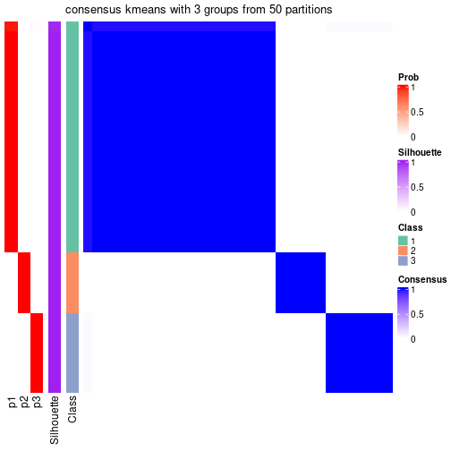</p>

</div>
<div id='tab-node-042-consensus-heatmap-3'>
<pre><code class="r">consensus_heatmap(res, k = 4)
</code></pre>

<p>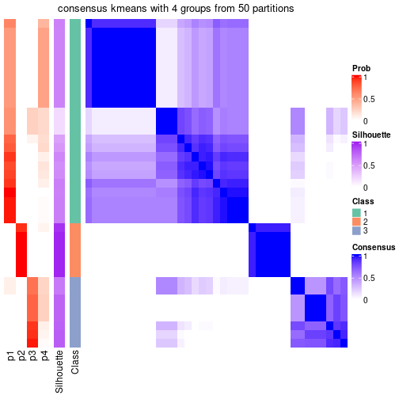</p>

</div>
<div id='tab-node-042-consensus-heatmap-4'>
<pre><code class="r">consensus_heatmap(res, k = 5)
</code></pre>

<p>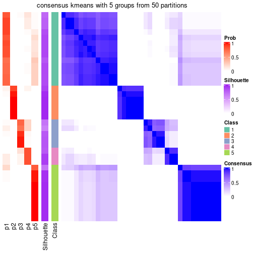</p>

</div>
<div id='tab-node-042-consensus-heatmap-5'>
<pre><code class="r">consensus_heatmap(res, k = 6)
</code></pre>

<p>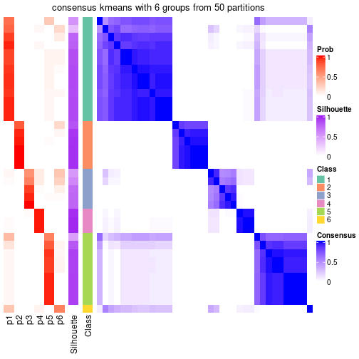</p>

</div>
<div id='tab-node-042-consensus-heatmap-6'>
<pre><code class="r">consensus_heatmap(res, k = 7)
</code></pre>

<p>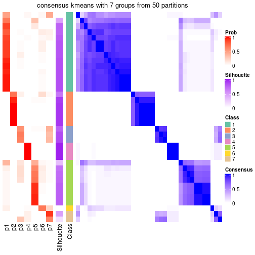</p>

</div>
<div id='tab-node-042-consensus-heatmap-7'>
<pre><code class="r">consensus_heatmap(res, k = 8)
</code></pre>

<p>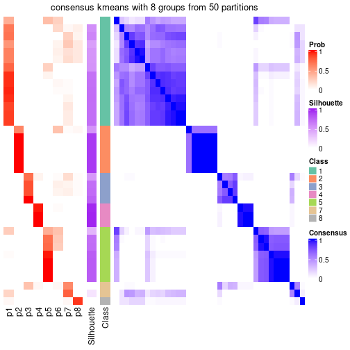</p>

</div>
</div>

Heatmaps for the membership of samples in all partitions to see how consistent they are:


<script>
$( function() {
	$( '#tabs-node-042-membership-heatmap' ).tabs();
} );
</script>
<div id='tabs-node-042-membership-heatmap'>
<ul>
<li><a href='#tab-node-042-membership-heatmap-1'>k = 2</a></li>
<li><a href='#tab-node-042-membership-heatmap-2'>k = 3</a></li>
<li><a href='#tab-node-042-membership-heatmap-3'>k = 4</a></li>
<li><a href='#tab-node-042-membership-heatmap-4'>k = 5</a></li>
<li><a href='#tab-node-042-membership-heatmap-5'>k = 6</a></li>
<li><a href='#tab-node-042-membership-heatmap-6'>k = 7</a></li>
<li><a href='#tab-node-042-membership-heatmap-7'>k = 8</a></li>
</ul>
<div id='tab-node-042-membership-heatmap-1'>
<pre><code class="r">membership_heatmap(res, k = 2)
</code></pre>

<p>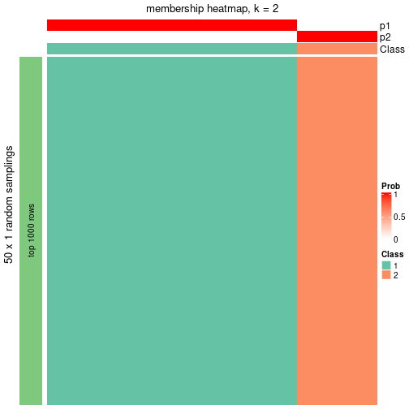</p>

</div>
<div id='tab-node-042-membership-heatmap-2'>
<pre><code class="r">membership_heatmap(res, k = 3)
</code></pre>

<p>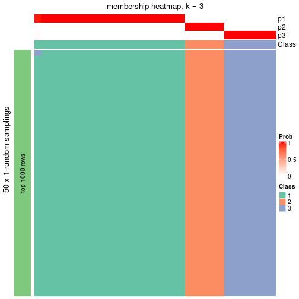</p>

</div>
<div id='tab-node-042-membership-heatmap-3'>
<pre><code class="r">membership_heatmap(res, k = 4)
</code></pre>

<p>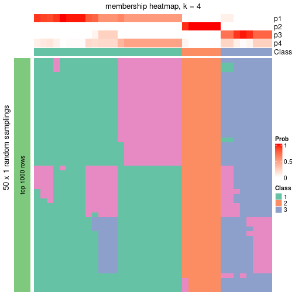</p>

</div>
<div id='tab-node-042-membership-heatmap-4'>
<pre><code class="r">membership_heatmap(res, k = 5)
</code></pre>

<p>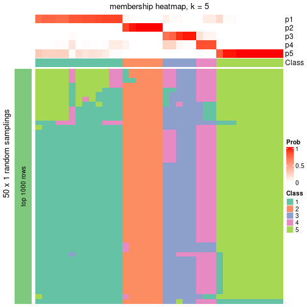</p>

</div>
<div id='tab-node-042-membership-heatmap-5'>
<pre><code class="r">membership_heatmap(res, k = 6)
</code></pre>

<p>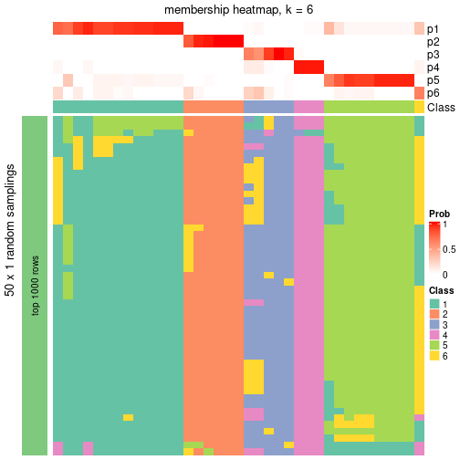</p>

</div>
<div id='tab-node-042-membership-heatmap-6'>
<pre><code class="r">membership_heatmap(res, k = 7)
</code></pre>

<p>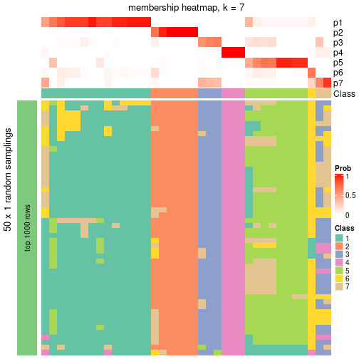</p>

</div>
<div id='tab-node-042-membership-heatmap-7'>
<pre><code class="r">membership_heatmap(res, k = 8)
</code></pre>

<p>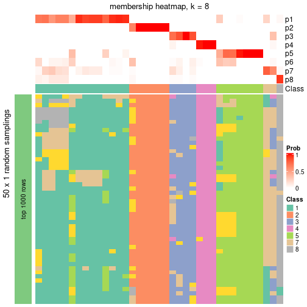</p>

</div>
</div>

As soon as the classes for columns are determined, the signatures
that are significantly different between subgroups can be looked for. 
Following are the heatmaps for signatures.


<script>
$( function() {
	$( '#tabs-node-042-get-signatures' ).tabs();
} );
</script>
<div id='tabs-node-042-get-signatures'>
<ul>
<li><a href='#tab-node-042-get-signatures-1'>k = 2</a></li>
<li><a href='#tab-node-042-get-signatures-2'>k = 3</a></li>
<li><a href='#tab-node-042-get-signatures-3'>k = 4</a></li>
<li><a href='#tab-node-042-get-signatures-4'>k = 5</a></li>
<li><a href='#tab-node-042-get-signatures-5'>k = 6</a></li>
<li><a href='#tab-node-042-get-signatures-6'>k = 7</a></li>
<li><a href='#tab-node-042-get-signatures-7'>k = 8</a></li>
</ul>
<div id='tab-node-042-get-signatures-1'>
<pre><code class="r">get_signatures(res, k = 2)
</code></pre>

<p></p>

</div>
<div id='tab-node-042-get-signatures-2'>
<pre><code class="r">get_signatures(res, k = 3)
</code></pre>

<p>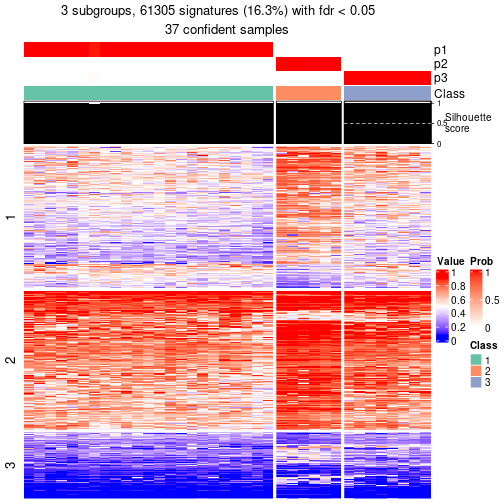</p>

</div>
<div id='tab-node-042-get-signatures-3'>
<pre><code class="r">get_signatures(res, k = 4)
</code></pre>

<p>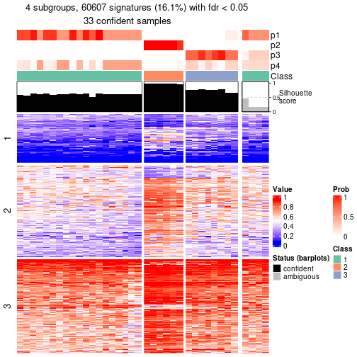</p>

</div>
<div id='tab-node-042-get-signatures-4'>
<pre><code class="r">get_signatures(res, k = 5)
</code></pre>

<p>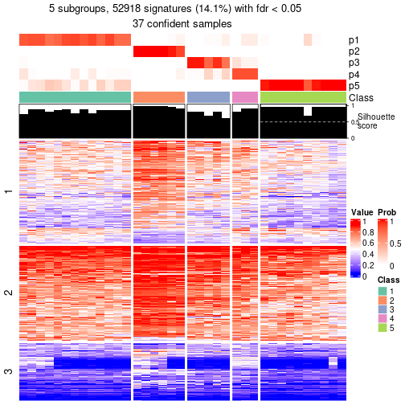</p>

</div>
<div id='tab-node-042-get-signatures-5'>
<pre><code class="r">get_signatures(res, k = 6)
</code></pre>

<p>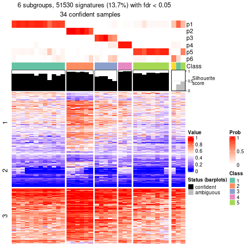</p>

</div>
<div id='tab-node-042-get-signatures-6'>
<pre><code class="r">get_signatures(res, k = 7)
</code></pre>

<p>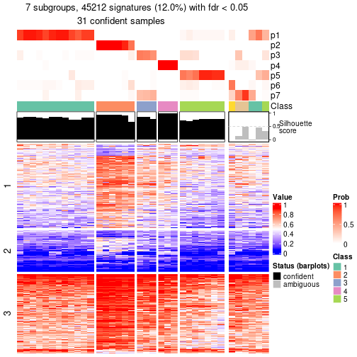</p>

</div>
<div id='tab-node-042-get-signatures-7'>
<pre><code class="r">get_signatures(res, k = 8)
</code></pre>

<p>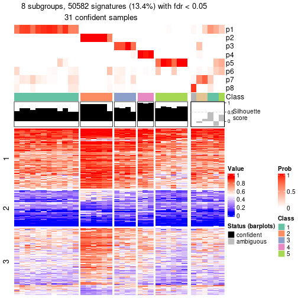</p>

</div>
</div>


Compare the overlap of signatures from different k:

```r
compare_signatures(res)
```

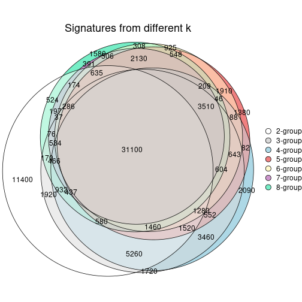

`get_signature()` returns a data frame invisibly. To get the list of signatures, the function
call should be assigned to a variable explicitly. In following code, if `plot` argument is set
to `FALSE`, no heatmap is plotted while only the differential analysis is performed.

```r
# code only for demonstration
tb = get_signature(res, k = ..., plot = FALSE)
```

An example of the output of `tb` is:

```
#>   which_row         fdr    mean_1    mean_2 scaled_mean_1 scaled_mean_2 km
#> 1        38 0.042760348  8.373488  9.131774    -0.5533452     0.5164555  1
#> 2        40 0.018707592  7.106213  8.469186    -0.6173731     0.5762149  1
#> 3        55 0.019134737 10.221463 11.207825    -0.6159697     0.5749050  1
#> 4        59 0.006059896  5.921854  7.869574    -0.6899429     0.6439467  1
#> 5        60 0.018055526  8.928898 10.211722    -0.6204761     0.5791110  1
#> 6        98 0.009384629 15.714769 14.887706     0.6635654    -0.6193277  2
...
```

The columns in `tb` are:

1. `which_row`: row indices corresponding to the input matrix.
2. `fdr`: FDR for the differential test. 
3. `mean_x`: The mean value in group x.
4. `scaled_mean_x`: The mean value in group x after rows are scaled.
5. `km`: Row groups if k-means clustering is applied to rows (which is done by automatically selecting number of clusters).

If there are too many signatures, `top_signatures = ...` can be set to only show the 
signatures with the highest FDRs:

```r
# code only for demonstration
# e.g. to show the top 500 most significant rows
tb = get_signature(res, k = ..., top_signatures = 500)
```

If the signatures are defined as these which are uniquely high in current group, `diff_method` argument
can be set to `"uniquely_high_in_one_group"`:

```r
# code only for demonstration
tb = get_signature(res, k = ..., diff_method = "uniquely_high_in_one_group")
```


UMAP plot which shows how samples are separated.


<script>
$( function() {
	$( '#tabs-node-042-dimension-reduction' ).tabs();
} );
</script>
<div id='tabs-node-042-dimension-reduction'>
<ul>
<li><a href='#tab-node-042-dimension-reduction-1'>k = 2</a></li>
<li><a href='#tab-node-042-dimension-reduction-2'>k = 3</a></li>
<li><a href='#tab-node-042-dimension-reduction-3'>k = 4</a></li>
<li><a href='#tab-node-042-dimension-reduction-4'>k = 5</a></li>
<li><a href='#tab-node-042-dimension-reduction-5'>k = 6</a></li>
<li><a href='#tab-node-042-dimension-reduction-6'>k = 7</a></li>
<li><a href='#tab-node-042-dimension-reduction-7'>k = 8</a></li>
</ul>
<div id='tab-node-042-dimension-reduction-1'>
<pre><code class="r">dimension_reduction(res, k = 2, method = &quot;UMAP&quot;)
</code></pre>

<p>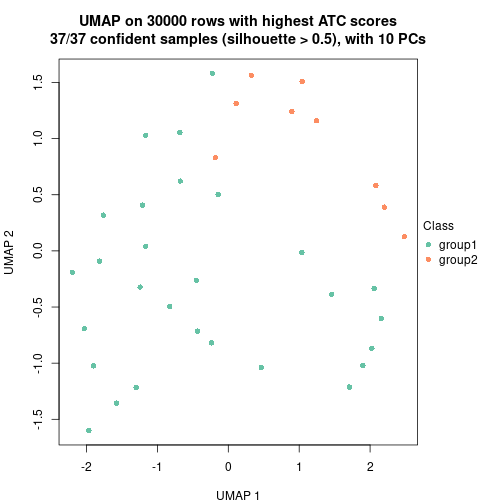</p>

</div>
<div id='tab-node-042-dimension-reduction-2'>
<pre><code class="r">dimension_reduction(res, k = 3, method = &quot;UMAP&quot;)
</code></pre>

<p>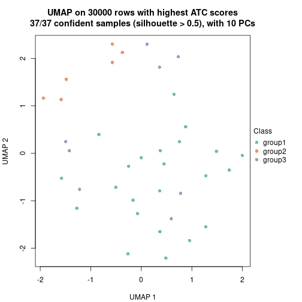</p>

</div>
<div id='tab-node-042-dimension-reduction-3'>
<pre><code class="r">dimension_reduction(res, k = 4, method = &quot;UMAP&quot;)
</code></pre>

<p>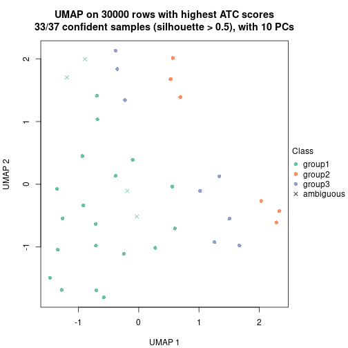</p>

</div>
<div id='tab-node-042-dimension-reduction-4'>
<pre><code class="r">dimension_reduction(res, k = 5, method = &quot;UMAP&quot;)
</code></pre>

<p>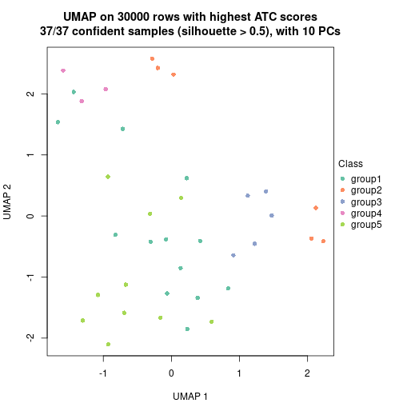</p>

</div>
<div id='tab-node-042-dimension-reduction-5'>
<pre><code class="r">dimension_reduction(res, k = 6, method = &quot;UMAP&quot;)
</code></pre>

<p>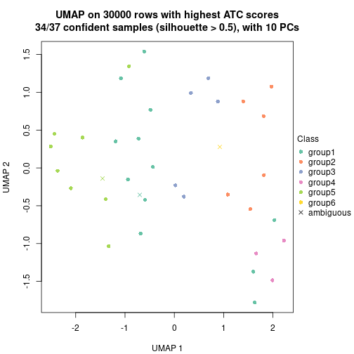</p>

</div>
<div id='tab-node-042-dimension-reduction-6'>
<pre><code class="r">dimension_reduction(res, k = 7, method = &quot;UMAP&quot;)
</code></pre>

<p>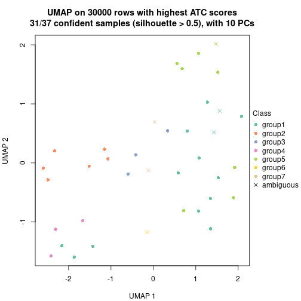</p>

</div>
<div id='tab-node-042-dimension-reduction-7'>
<pre><code class="r">dimension_reduction(res, k = 8, method = &quot;UMAP&quot;)
</code></pre>

<p>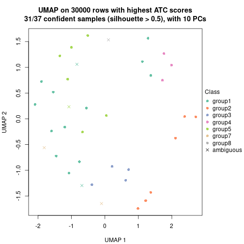</p>

</div>
</div>


Following heatmap shows how subgroups are split when increasing `k`:

```r
collect_classes(res)
```

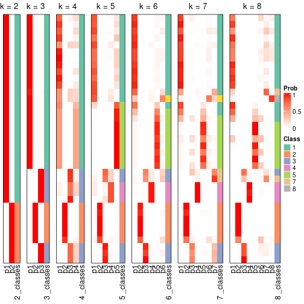


If matrix rows can be associated to genes, consider to use `functional_enrichment(res,
...)` to perform function enrichment for the signature genes. See [this vignette](https://jokergoo.github.io/cola_vignettes/functional_enrichment.html) for more detailed explanations.


 

---------------------------------------------------


### Node043


Parent node: [Node04](#Node04).
Child nodes: 
                Node0111-leaf
        ,
                Node0112-leaf
        ,
                Node0113-leaf
        ,
                Node0121-leaf
        ,
                Node0122-leaf
        ,
                Node0123-leaf
        ,
                Node0124-leaf
        ,
                Node0311-leaf
        ,
                Node0312-leaf
        ,
                Node0331-leaf
        ,
                Node0332-leaf
        ,
                Node0341-leaf
        ,
                Node0342-leaf
        ,
                Node0411-leaf
        ,
                [Node0412](#Node0412)
        ,
                Node0413-leaf
        ,
                Node0421-leaf
        ,
                Node0422-leaf
        ,
                Node0423-leaf
        ,
                Node0431-leaf
        ,
                [Node0432](#Node0432)
        ,
                Node0433-leaf
        ,
                Node0511-leaf
        ,
                Node0512-leaf
        ,
                Node0513-leaf
        ,
                [Node0521](#Node0521)
        ,
                Node0522-leaf
        ,
                Node0531-leaf
        ,
                Node0532-leaf
        ,
                Node0533-leaf
        .


The object with results only for a single top-value method and a single partitioning method 
can be extracted as:

```r
res = res_rh["043"]
```

A summary of `res` and all the functions that can be applied to it:

```r
res
```

```
#> A 'ConsensusPartition' object with k = 2, 3, 4, 5, 6, 7, 8.
#>   On a matrix with 30000 rows and 30 columns.
#>   Top rows (1000) are extracted by 'ATC' method.
#>   Subgroups are detected by 'kmeans' method.
#>   Performed in total 350 partitions by row resampling.
#>   Best k for subgroups seems to be 3.
#> 
#> Following methods can be applied to this 'ConsensusPartition' object:
#>  [1] "cola_report"             "collect_classes"         "collect_plots"          
#>  [4] "collect_stats"           "colnames"                "compare_partitions"     
#>  [7] "compare_signatures"      "consensus_heatmap"       "dimension_reduction"    
#> [10] "functional_enrichment"   "get_anno_col"            "get_anno"               
#> [13] "get_classes"             "get_consensus"           "get_matrix"             
#> [16] "get_membership"          "get_param"               "get_signatures"         
#> [19] "get_stats"               "is_best_k"               "is_stable_k"            
#> [22] "membership_heatmap"      "ncol"                    "nrow"                   
#> [25] "plot_ecdf"               "predict_classes"         "rownames"               
#> [28] "select_partition_number" "show"                    "suggest_best_k"         
#> [31] "test_to_known_factors"   "top_rows_heatmap"
```

`collect_plots()` function collects all the plots made from `res` for all `k` (number of subgroups)
into one single page to provide an easy and fast comparison between different `k`.

```r
collect_plots(res)
```

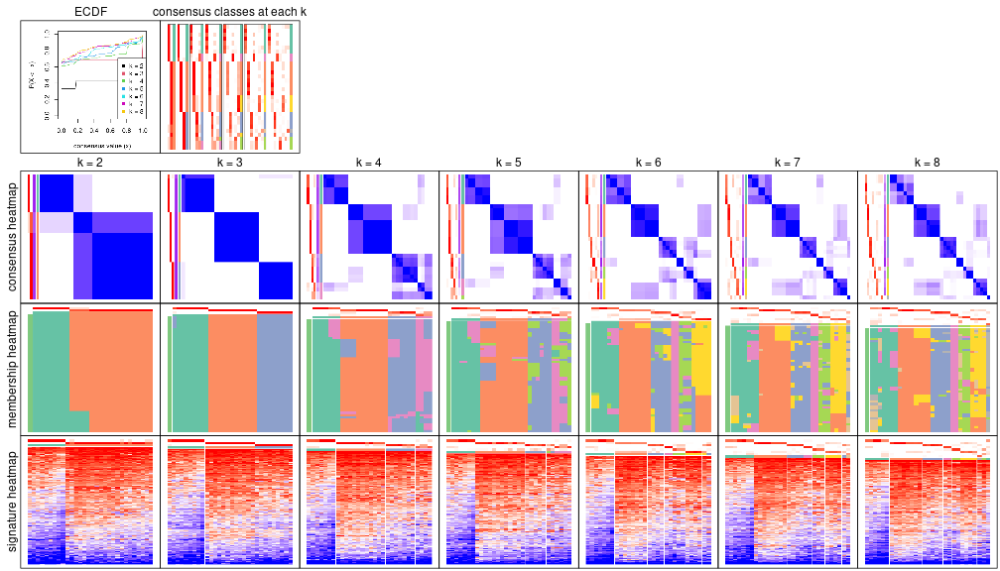

The plots are:

- The first row: a plot of the eCDF (empirical cumulative distribution
  function) curves of the consensus matrix for each `k` and the heatmap of
  predicted classes for each `k`.
- The second row: heatmaps of the consensus matrix for each `k`.
- The third row: heatmaps of the membership matrix for each `k`.
- The fouth row: heatmaps of the signatures for each `k`.

All the plots in panels can be made by individual functions and they are
plotted later in this section.

`select_partition_number()` produces several plots showing different
statistics for choosing "optimized" `k`. There are following statistics:

- eCDF curves of the consensus matrix for each `k`;
- 1-PAC. [The PAC score](https://en.wikipedia.org/wiki/Consensus_clustering#Over-interpretation_potential_of_consensus_clustering)
  measures the proportion of the ambiguous subgrouping.
- Mean silhouette score.
- Concordance. The mean probability of fiting the consensus subgroup labels in all
  partitions.
- Area increased. Denote $A_k$ as the area under the eCDF curve for current
  `k`, the area increased is defined as $A_k - A_{k-1}$.
- Rand index. The percent of pairs of samples that are both in a same cluster
  or both are not in a same cluster in the partition of k and k-1.
- Jaccard index. The ratio of pairs of samples are both in a same cluster in
  the partition of k and k-1 and the pairs of samples are both in a same
  cluster in the partition k or k-1.

The detailed explanations of these statistics can be found in [the _cola_
vignette](https://jokergoo.github.io/cola_vignettes/cola.html#toc_13).

Generally speaking, higher 1-PAC score, higher mean silhouette score or higher
concordance corresponds to better partition. Rand index and Jaccard index
measure how similar the current partition is compared to partition with `k-1`.
If they are too similar, we won't accept `k` is better than `k-1`.

```r
select_partition_number(res)
```

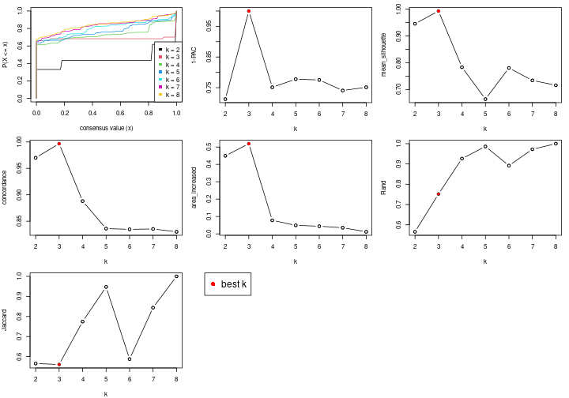

The numeric values for all these statistics can be obtained by `get_stats()`.

```r
get_stats(res)
```

```
#>   k 1-PAC mean_silhouette concordance area_increased  Rand Jaccard
#> 2 2 0.713           0.945       0.970         0.4495 0.566   0.566
#> 3 3 1.000           0.993       0.997         0.5192 0.752   0.561
#> 4 4 0.751           0.784       0.888         0.0780 0.926   0.775
#> 5 5 0.778           0.665       0.836         0.0492 0.986   0.947
#> 6 6 0.775           0.781       0.835         0.0441 0.892   0.588
#> 7 7 0.741           0.734       0.835         0.0355 0.972   0.844
#> 8 8 0.751           0.716       0.830         0.0120 1.000   1.000
```

`suggest_best_k()` suggests the best $k$ based on these statistics. The rules are as follows:

- All $k$ with Jaccard index larger than 0.95 are removed because increasing
  $k$ does not provide enough extra information. If all $k$ are removed, it is
  marked as no subgroup is detected.
- For all $k$ with 1-PAC score larger than 0.9, the maximal $k$ is taken as
  the best $k$, and other $k$ are marked as optional $k$.
- If it does not fit the second rule. The $k$ with the maximal vote of the
  highest 1-PAC score, highest mean silhouette, and highest concordance is
  taken as the best $k$.

```r
suggest_best_k(res)
```

```
#> [1] 3
```


Following is the table of the partitions (You need to click the **show/hide
code output** link to see it). The membership matrix (columns with name `p*`)
is inferred by
[`clue::cl_consensus()`](https://www.rdocumentation.org/link/cl_consensus?package=clue)
function with the `SE` method. Basically the value in the membership matrix
represents the probability to belong to a certain group. The finall subgroup
label for an item is determined with the group with highest probability it
belongs to.

In `get_classes()` function, the entropy is calculated from the membership
matrix and the silhouette score is calculated from the consensus matrix.


<script>
$( function() {
	$( '#tabs-node-043-get-classes' ).tabs();
} );
</script>
<div id='tabs-node-043-get-classes'>
<ul>
<li><a href='#tab-node-043-get-classes-1'>k = 2</a></li>
<li><a href='#tab-node-043-get-classes-2'>k = 3</a></li>
<li><a href='#tab-node-043-get-classes-3'>k = 4</a></li>
<li><a href='#tab-node-043-get-classes-4'>k = 5</a></li>
<li><a href='#tab-node-043-get-classes-5'>k = 6</a></li>
<li><a href='#tab-node-043-get-classes-6'>k = 7</a></li>
<li><a href='#tab-node-043-get-classes-7'>k = 8</a></li>
</ul>

<div id='tab-node-043-get-classes-1'>
<p><a id='tab-node-043-get-classes-1-a' style='color:#0366d6' href='#'>show/hide code output</a></p>
<pre><code class="r">cbind(get_classes(res, k = 2), get_membership(res, k = 2))
</code></pre>

<pre><code>#&gt;                 class entropy silhouette   p1   p2
#&gt; TCGA.77.8140.01     2    0.68      0.824 0.18 0.82
#&gt; TCGA.43.8115.01     2    0.00      0.953 0.00 1.00
#&gt; TCGA.94.8035.01     2    0.00      0.953 0.00 1.00
#&gt; TCGA.98.8022.01     2    0.00      0.953 0.00 1.00
#&gt; TCGA.77.6842.01     2    0.68      0.824 0.18 0.82
#&gt; TCGA.77.8143.01     1    0.00      1.000 1.00 0.00
#&gt; TCGA.77.8139.01     1    0.00      1.000 1.00 0.00
#&gt; TCGA.39.5029.01     1    0.00      1.000 1.00 0.00
#&gt; TCGA.77.8145.01     2    0.00      0.953 0.00 1.00
#&gt; TCGA.21.5782.01     2    0.00      0.953 0.00 1.00
#&gt; TCGA.39.5031.01     2    0.00      0.953 0.00 1.00
#&gt; TCGA.22.5478.01     2    0.68      0.824 0.18 0.82
#&gt; TCGA.43.7656.01     1    0.00      1.000 1.00 0.00
#&gt; TCGA.94.7557.01     2    0.68      0.824 0.18 0.82
#&gt; TCGA.22.5492.01     2    0.00      0.953 0.00 1.00
#&gt; TCGA.56.8628.01     2    0.00      0.953 0.00 1.00
#&gt; TCGA.56.8304.01     1    0.00      1.000 1.00 0.00
#&gt; TCGA.56.7580.01     2    0.00      0.953 0.00 1.00
#&gt; TCGA.56.A5DR.01     1    0.00      1.000 1.00 0.00
#&gt; TCGA.56.A49D.01     1    0.00      1.000 1.00 0.00
#&gt; TCGA.77.7463.01     1    0.00      1.000 1.00 0.00
#&gt; TCGA.58.8387.01     2    0.00      0.953 0.00 1.00
#&gt; TCGA.96.8169.01     2    0.00      0.953 0.00 1.00
#&gt; TCGA.56.8307.01     2    0.00      0.953 0.00 1.00
#&gt; TCGA.43.A56V.01     2    0.68      0.824 0.18 0.82
#&gt; TCGA.O2.A52W.01     2    0.00      0.953 0.00 1.00
#&gt; TCGA.68.8250.01     2    0.00      0.953 0.00 1.00
#&gt; TCGA.85.8287.01     2    0.00      0.953 0.00 1.00
#&gt; TCGA.85.A4JB.01     2    0.00      0.953 0.00 1.00
#&gt; TCGA.98.A538.01     1    0.00      1.000 1.00 0.00
</code></pre>

<script>
$('#tab-node-043-get-classes-1-a').parent().next().next().hide();
$('#tab-node-043-get-classes-1-a').click(function(){
  $('#tab-node-043-get-classes-1-a').parent().next().next().toggle();
  return(false);
});
</script>
</div>

<div id='tab-node-043-get-classes-2'>
<p><a id='tab-node-043-get-classes-2-a' style='color:#0366d6' href='#'>show/hide code output</a></p>
<pre><code class="r">cbind(get_classes(res, k = 3), get_membership(res, k = 3))
</code></pre>

<pre><code>#&gt;                 class entropy silhouette  p1 p2  p3
#&gt; TCGA.77.8140.01     3   0.000      1.000 0.0  0 1.0
#&gt; TCGA.43.8115.01     2   0.000      1.000 0.0  1 0.0
#&gt; TCGA.94.8035.01     3   0.000      1.000 0.0  0 1.0
#&gt; TCGA.98.8022.01     2   0.000      1.000 0.0  1 0.0
#&gt; TCGA.77.6842.01     3   0.000      1.000 0.0  0 1.0
#&gt; TCGA.77.8143.01     1   0.000      0.987 1.0  0 0.0
#&gt; TCGA.77.8139.01     1   0.000      0.987 1.0  0 0.0
#&gt; TCGA.39.5029.01     1   0.000      0.987 1.0  0 0.0
#&gt; TCGA.77.8145.01     3   0.000      1.000 0.0  0 1.0
#&gt; TCGA.21.5782.01     3   0.000      1.000 0.0  0 1.0
#&gt; TCGA.39.5031.01     2   0.000      1.000 0.0  1 0.0
#&gt; TCGA.22.5478.01     3   0.000      1.000 0.0  0 1.0
#&gt; TCGA.43.7656.01     1   0.000      0.987 1.0  0 0.0
#&gt; TCGA.94.7557.01     3   0.000      1.000 0.0  0 1.0
#&gt; TCGA.22.5492.01     2   0.000      1.000 0.0  1 0.0
#&gt; TCGA.56.8628.01     2   0.000      1.000 0.0  1 0.0
#&gt; TCGA.56.8304.01     1   0.000      0.987 1.0  0 0.0
#&gt; TCGA.56.7580.01     2   0.000      1.000 0.0  1 0.0
#&gt; TCGA.56.A5DR.01     1   0.296      0.889 0.9  0 0.1
#&gt; TCGA.56.A49D.01     1   0.000      0.987 1.0  0 0.0
#&gt; TCGA.77.7463.01     1   0.000      0.987 1.0  0 0.0
#&gt; TCGA.58.8387.01     2   0.000      1.000 0.0  1 0.0
#&gt; TCGA.96.8169.01     3   0.000      1.000 0.0  0 1.0
#&gt; TCGA.56.8307.01     2   0.000      1.000 0.0  1 0.0
#&gt; TCGA.43.A56V.01     3   0.000      1.000 0.0  0 1.0
#&gt; TCGA.O2.A52W.01     2   0.000      1.000 0.0  1 0.0
#&gt; TCGA.68.8250.01     2   0.000      1.000 0.0  1 0.0
#&gt; TCGA.85.8287.01     2   0.000      1.000 0.0  1 0.0
#&gt; TCGA.85.A4JB.01     2   0.000      1.000 0.0  1 0.0
#&gt; TCGA.98.A538.01     1   0.000      0.987 1.0  0 0.0
</code></pre>

<script>
$('#tab-node-043-get-classes-2-a').parent().next().next().hide();
$('#tab-node-043-get-classes-2-a').click(function(){
  $('#tab-node-043-get-classes-2-a').parent().next().next().toggle();
  return(false);
});
</script>
</div>

<div id='tab-node-043-get-classes-3'>
<p><a id='tab-node-043-get-classes-3-a' style='color:#0366d6' href='#'>show/hide code output</a></p>
<pre><code class="r">cbind(get_classes(res, k = 4), get_membership(res, k = 4))
</code></pre>

<pre><code>#&gt;                 class entropy silhouette   p1  p2   p3   p4
#&gt; TCGA.77.8140.01     4  0.4977      0.197 0.00 0.0 0.46 0.54
#&gt; TCGA.43.8115.01     2  0.4079      0.839 0.00 0.8 0.18 0.02
#&gt; TCGA.94.8035.01     3  0.0707      0.805 0.00 0.0 0.98 0.02
#&gt; TCGA.98.8022.01     2  0.0000      0.924 0.00 1.0 0.00 0.00
#&gt; TCGA.77.6842.01     3  0.3610      0.697 0.00 0.0 0.80 0.20
#&gt; TCGA.77.8143.01     1  0.0000      0.909 1.00 0.0 0.00 0.00
#&gt; TCGA.77.8139.01     1  0.0000      0.909 1.00 0.0 0.00 0.00
#&gt; TCGA.39.5029.01     1  0.3400      0.863 0.82 0.0 0.00 0.18
#&gt; TCGA.77.8145.01     3  0.0707      0.794 0.00 0.0 0.98 0.02
#&gt; TCGA.21.5782.01     3  0.0707      0.794 0.00 0.0 0.98 0.02
#&gt; TCGA.39.5031.01     2  0.0000      0.924 0.00 1.0 0.00 0.00
#&gt; TCGA.22.5478.01     3  0.4522      0.573 0.00 0.0 0.68 0.32
#&gt; TCGA.43.7656.01     4  0.3400      0.423 0.18 0.0 0.00 0.82
#&gt; TCGA.94.7557.01     4  0.4977      0.197 0.00 0.0 0.46 0.54
#&gt; TCGA.22.5492.01     2  0.4079      0.839 0.00 0.8 0.18 0.02
#&gt; TCGA.56.8628.01     2  0.0000      0.924 0.00 1.0 0.00 0.00
#&gt; TCGA.56.8304.01     1  0.0000      0.909 1.00 0.0 0.00 0.00
#&gt; TCGA.56.7580.01     2  0.4079      0.839 0.00 0.8 0.18 0.02
#&gt; TCGA.56.A5DR.01     4  0.4292      0.542 0.10 0.0 0.08 0.82
#&gt; TCGA.56.A49D.01     1  0.3400      0.863 0.82 0.0 0.00 0.18
#&gt; TCGA.77.7463.01     1  0.0000      0.909 1.00 0.0 0.00 0.00
#&gt; TCGA.58.8387.01     2  0.0000      0.924 0.00 1.0 0.00 0.00
#&gt; TCGA.96.8169.01     3  0.0000      0.804 0.00 0.0 1.00 0.00
#&gt; TCGA.56.8307.01     2  0.0000      0.924 0.00 1.0 0.00 0.00
#&gt; TCGA.43.A56V.01     3  0.3400      0.699 0.00 0.0 0.82 0.18
#&gt; TCGA.O2.A52W.01     2  0.4079      0.839 0.00 0.8 0.18 0.02
#&gt; TCGA.68.8250.01     2  0.0000      0.924 0.00 1.0 0.00 0.00
#&gt; TCGA.85.8287.01     2  0.0000      0.924 0.00 1.0 0.00 0.00
#&gt; TCGA.85.A4JB.01     2  0.0000      0.924 0.00 1.0 0.00 0.00
#&gt; TCGA.98.A538.01     1  0.3172      0.872 0.84 0.0 0.00 0.16
</code></pre>

<script>
$('#tab-node-043-get-classes-3-a').parent().next().next().hide();
$('#tab-node-043-get-classes-3-a').click(function(){
  $('#tab-node-043-get-classes-3-a').parent().next().next().toggle();
  return(false);
});
</script>
</div>

<div id='tab-node-043-get-classes-4'>
<p><a id='tab-node-043-get-classes-4-a' style='color:#0366d6' href='#'>show/hide code output</a></p>
<pre><code class="r">cbind(get_classes(res, k = 5), get_membership(res, k = 5))
</code></pre>

<pre><code>#&gt;                 class entropy silhouette   p1   p2   p3   p4   p5
#&gt; TCGA.77.8140.01     4  0.5884     0.1065 0.00 0.00 0.42 0.48 0.10
#&gt; TCGA.43.8115.01     2  0.4644     0.7054 0.00 0.68 0.04 0.00 0.28
#&gt; TCGA.94.8035.01     3  0.0000     0.5914 0.00 0.00 1.00 0.00 0.00
#&gt; TCGA.98.8022.01     2  0.0000     0.8539 0.00 1.00 0.00 0.00 0.00
#&gt; TCGA.77.6842.01     3  0.3684     0.0246 0.00 0.00 0.72 0.00 0.28
#&gt; TCGA.77.8143.01     1  0.0609     0.8919 0.98 0.00 0.00 0.00 0.02
#&gt; TCGA.77.8139.01     1  0.0000     0.8960 1.00 0.00 0.00 0.00 0.00
#&gt; TCGA.39.5029.01     1  0.3109     0.8380 0.80 0.00 0.00 0.20 0.00
#&gt; TCGA.77.8145.01     3  0.3684     0.5659 0.00 0.00 0.72 0.00 0.28
#&gt; TCGA.21.5782.01     3  0.2929     0.6659 0.00 0.00 0.82 0.00 0.18
#&gt; TCGA.39.5031.01     2  0.0000     0.8539 0.00 1.00 0.00 0.00 0.00
#&gt; TCGA.22.5478.01     5  0.5394     0.0000 0.00 0.00 0.40 0.06 0.54
#&gt; TCGA.43.7656.01     4  0.1410     0.4836 0.06 0.00 0.00 0.94 0.00
#&gt; TCGA.94.7557.01     4  0.5884     0.1065 0.00 0.00 0.42 0.48 0.10
#&gt; TCGA.22.5492.01     2  0.4748     0.6946 0.00 0.66 0.04 0.00 0.30
#&gt; TCGA.56.8628.01     2  0.1043     0.8473 0.00 0.96 0.00 0.00 0.04
#&gt; TCGA.56.8304.01     1  0.0000     0.8960 1.00 0.00 0.00 0.00 0.00
#&gt; TCGA.56.7580.01     2  0.4748     0.6946 0.00 0.66 0.04 0.00 0.30
#&gt; TCGA.56.A5DR.01     4  0.1410     0.4836 0.06 0.00 0.00 0.94 0.00
#&gt; TCGA.56.A49D.01     1  0.3109     0.8380 0.80 0.00 0.00 0.20 0.00
#&gt; TCGA.77.7463.01     1  0.0609     0.8919 0.98 0.00 0.00 0.00 0.02
#&gt; TCGA.58.8387.01     2  0.0000     0.8539 0.00 1.00 0.00 0.00 0.00
#&gt; TCGA.96.8169.01     3  0.2732     0.6738 0.00 0.00 0.84 0.00 0.16
#&gt; TCGA.56.8307.01     2  0.1043     0.8473 0.00 0.96 0.00 0.00 0.04
#&gt; TCGA.43.A56V.01     3  0.1043     0.5366 0.00 0.00 0.96 0.04 0.00
#&gt; TCGA.O2.A52W.01     2  0.4748     0.6946 0.00 0.66 0.04 0.00 0.30
#&gt; TCGA.68.8250.01     2  0.1043     0.8473 0.00 0.96 0.00 0.00 0.04
#&gt; TCGA.85.8287.01     2  0.0000     0.8539 0.00 1.00 0.00 0.00 0.00
#&gt; TCGA.85.A4JB.01     2  0.1043     0.8473 0.00 0.96 0.00 0.00 0.04
#&gt; TCGA.98.A538.01     1  0.3521     0.8530 0.82 0.00 0.00 0.14 0.04
</code></pre>

<script>
$('#tab-node-043-get-classes-4-a').parent().next().next().hide();
$('#tab-node-043-get-classes-4-a').click(function(){
  $('#tab-node-043-get-classes-4-a').parent().next().next().toggle();
  return(false);
});
</script>
</div>

<div id='tab-node-043-get-classes-5'>
<p><a id='tab-node-043-get-classes-5-a' style='color:#0366d6' href='#'>show/hide code output</a></p>
<pre><code class="r">cbind(get_classes(res, k = 6), get_membership(res, k = 6))
</code></pre>

<pre><code>#&gt;                 class entropy silhouette   p1   p2   p3   p4   p5   p6
#&gt; TCGA.77.8140.01     5  0.5438      0.792 0.00 0.00 0.28 0.16 0.56 0.00
#&gt; TCGA.43.8115.01     6  0.0547      0.771 0.00 0.02 0.00 0.00 0.00 0.98
#&gt; TCGA.94.8035.01     3  0.2260      0.643 0.00 0.00 0.86 0.00 0.14 0.00
#&gt; TCGA.98.8022.01     2  0.3706      0.966 0.00 0.62 0.00 0.00 0.00 0.38
#&gt; TCGA.77.6842.01     3  0.4244      0.399 0.00 0.20 0.72 0.00 0.08 0.00
#&gt; TCGA.77.8143.01     1  0.2581      0.796 0.86 0.12 0.00 0.00 0.02 0.00
#&gt; TCGA.77.8139.01     1  0.0000      0.838 1.00 0.00 0.00 0.00 0.00 0.00
#&gt; TCGA.39.5029.01     1  0.2941      0.768 0.78 0.00 0.00 0.22 0.00 0.00
#&gt; TCGA.77.8145.01     6  0.3864     -0.258 0.00 0.00 0.48 0.00 0.00 0.52
#&gt; TCGA.21.5782.01     3  0.2941      0.664 0.00 0.00 0.78 0.00 0.00 0.22
#&gt; TCGA.39.5031.01     2  0.3706      0.966 0.00 0.62 0.00 0.00 0.00 0.38
#&gt; TCGA.22.5478.01     5  0.2790      0.603 0.00 0.02 0.14 0.00 0.84 0.00
#&gt; TCGA.43.7656.01     4  0.0000      1.000 0.00 0.00 0.00 1.00 0.00 0.00
#&gt; TCGA.94.7557.01     5  0.5438      0.792 0.00 0.00 0.28 0.16 0.56 0.00
#&gt; TCGA.22.5492.01     6  0.0547      0.773 0.00 0.00 0.00 0.00 0.02 0.98
#&gt; TCGA.56.8628.01     2  0.3578      0.965 0.00 0.66 0.00 0.00 0.00 0.34
#&gt; TCGA.56.8304.01     1  0.0000      0.838 1.00 0.00 0.00 0.00 0.00 0.00
#&gt; TCGA.56.7580.01     6  0.0547      0.771 0.00 0.02 0.00 0.00 0.00 0.98
#&gt; TCGA.56.A5DR.01     4  0.0000      1.000 0.00 0.00 0.00 1.00 0.00 0.00
#&gt; TCGA.56.A49D.01     1  0.2941      0.768 0.78 0.00 0.00 0.22 0.00 0.00
#&gt; TCGA.77.7463.01     1  0.2581      0.796 0.86 0.12 0.00 0.00 0.02 0.00
#&gt; TCGA.58.8387.01     2  0.3706      0.966 0.00 0.62 0.00 0.00 0.00 0.38
#&gt; TCGA.96.8169.01     3  0.2454      0.706 0.00 0.00 0.84 0.00 0.00 0.16
#&gt; TCGA.56.8307.01     2  0.4078      0.952 0.00 0.64 0.00 0.00 0.02 0.34
#&gt; TCGA.43.A56V.01     3  0.2094      0.681 0.00 0.00 0.90 0.02 0.08 0.00
#&gt; TCGA.O2.A52W.01     6  0.0000      0.778 0.00 0.00 0.00 0.00 0.00 1.00
#&gt; TCGA.68.8250.01     2  0.3578      0.965 0.00 0.66 0.00 0.00 0.00 0.34
#&gt; TCGA.85.8287.01     2  0.3706      0.966 0.00 0.62 0.00 0.00 0.00 0.38
#&gt; TCGA.85.A4JB.01     2  0.3578      0.965 0.00 0.66 0.00 0.00 0.00 0.34
#&gt; TCGA.98.A538.01     1  0.3746      0.790 0.78 0.00 0.00 0.14 0.08 0.00
</code></pre>

<script>
$('#tab-node-043-get-classes-5-a').parent().next().next().hide();
$('#tab-node-043-get-classes-5-a').click(function(){
  $('#tab-node-043-get-classes-5-a').parent().next().next().toggle();
  return(false);
});
</script>
</div>

<div id='tab-node-043-get-classes-6'>
<p><a id='tab-node-043-get-classes-6-a' style='color:#0366d6' href='#'>show/hide code output</a></p>
<pre><code class="r">cbind(get_classes(res, k = 7), get_membership(res, k = 7))
</code></pre>

<pre><code>#&gt;                 class entropy silhouette   p1   p2   p3   p4   p5   p6   p7
#&gt; TCGA.77.8140.01     5  0.4308      0.766 0.00 0.00 0.16 0.10 0.72 0.00 0.02
#&gt; TCGA.43.8115.01     6  0.2945      0.827 0.00 0.26 0.00 0.00 0.00 0.74 0.00
#&gt; TCGA.94.8035.01     3  0.1664      0.681 0.00 0.00 0.92 0.00 0.06 0.02 0.00
#&gt; TCGA.98.8022.01     2  0.2081      0.882 0.00 0.86 0.00 0.00 0.00 0.14 0.00
#&gt; TCGA.77.6842.01     7  0.4945      0.000 0.00 0.00 0.36 0.00 0.12 0.00 0.52
#&gt; TCGA.77.8143.01     1  0.3667      0.606 0.74 0.00 0.00 0.00 0.00 0.06 0.20
#&gt; TCGA.77.8139.01     1  0.0863      0.706 0.96 0.00 0.00 0.00 0.00 0.04 0.00
#&gt; TCGA.39.5029.01     1  0.3139      0.589 0.70 0.00 0.00 0.30 0.00 0.00 0.00
#&gt; TCGA.77.8145.01     3  0.4003      0.392 0.00 0.00 0.64 0.00 0.00 0.32 0.04
#&gt; TCGA.21.5782.01     3  0.1671      0.710 0.00 0.00 0.90 0.00 0.00 0.10 0.00
#&gt; TCGA.39.5031.01     2  0.2081      0.882 0.00 0.86 0.00 0.00 0.00 0.14 0.00
#&gt; TCGA.22.5478.01     5  0.1886      0.541 0.00 0.00 0.00 0.00 0.88 0.00 0.12
#&gt; TCGA.43.7656.01     4  0.0863      1.000 0.04 0.00 0.00 0.96 0.00 0.00 0.00
#&gt; TCGA.94.7557.01     5  0.3985      0.767 0.00 0.00 0.18 0.10 0.72 0.00 0.00
#&gt; TCGA.22.5492.01     6  0.4732      0.764 0.00 0.14 0.02 0.04 0.00 0.72 0.08
#&gt; TCGA.56.8628.01     2  0.0000      0.885 0.00 1.00 0.00 0.00 0.00 0.00 0.00
#&gt; TCGA.56.8304.01     1  0.0000      0.707 1.00 0.00 0.00 0.00 0.00 0.00 0.00
#&gt; TCGA.56.7580.01     6  0.2422      0.898 0.00 0.18 0.00 0.00 0.00 0.82 0.00
#&gt; TCGA.56.A5DR.01     4  0.0863      1.000 0.04 0.00 0.00 0.96 0.00 0.00 0.00
#&gt; TCGA.56.A49D.01     1  0.3139      0.589 0.70 0.00 0.00 0.30 0.00 0.00 0.00
#&gt; TCGA.77.7463.01     1  0.3667      0.606 0.74 0.00 0.00 0.00 0.00 0.06 0.20
#&gt; TCGA.58.8387.01     2  0.2081      0.882 0.00 0.86 0.00 0.00 0.00 0.14 0.00
#&gt; TCGA.96.8169.01     3  0.2016      0.693 0.00 0.00 0.90 0.00 0.00 0.04 0.06
#&gt; TCGA.56.8307.01     2  0.0863      0.859 0.00 0.96 0.00 0.00 0.00 0.00 0.04
#&gt; TCGA.43.A56V.01     3  0.1363      0.653 0.00 0.00 0.94 0.00 0.02 0.00 0.04
#&gt; TCGA.O2.A52W.01     6  0.2422      0.898 0.00 0.18 0.00 0.00 0.00 0.82 0.00
#&gt; TCGA.68.8250.01     2  0.0000      0.885 0.00 1.00 0.00 0.00 0.00 0.00 0.00
#&gt; TCGA.85.8287.01     2  0.2081      0.882 0.00 0.86 0.00 0.00 0.00 0.14 0.00
#&gt; TCGA.85.A4JB.01     2  0.0000      0.885 0.00 1.00 0.00 0.00 0.00 0.00 0.00
#&gt; TCGA.98.A538.01     1  0.4821      0.595 0.66 0.00 0.00 0.22 0.00 0.08 0.04
</code></pre>

<script>
$('#tab-node-043-get-classes-6-a').parent().next().next().hide();
$('#tab-node-043-get-classes-6-a').click(function(){
  $('#tab-node-043-get-classes-6-a').parent().next().next().toggle();
  return(false);
});
</script>
</div>

<div id='tab-node-043-get-classes-7'>
<p><a id='tab-node-043-get-classes-7-a' style='color:#0366d6' href='#'>show/hide code output</a></p>
<pre><code class="r">cbind(get_classes(res, k = 8), get_membership(res, k = 8))
</code></pre>

<pre><code>#&gt;                 class entropy silhouette   p1   p2   p3   p4   p5   p6   p7   p8
#&gt; TCGA.77.8140.01     5  0.1341      0.702 0.00 0.00 0.08 0.00 0.92 0.00 0.00 0.00
#&gt; TCGA.43.8115.01     6  0.3015      0.688 0.00 0.32 0.00 0.00 0.00 0.68 0.00 0.00
#&gt; TCGA.94.8035.01     3  0.0808      0.878 0.00 0.00 0.96 0.00 0.04 0.00 0.00 0.00
#&gt; TCGA.98.8022.01     2  0.2267      0.824 0.00 0.82 0.00 0.00 0.00 0.18 0.00 0.00
#&gt; TCGA.77.6842.01     8  0.3036      0.000 0.00 0.00 0.18 0.00 0.04 0.00 0.00 0.78
#&gt; TCGA.77.8143.01     1  0.5062      0.507 0.60 0.00 0.00 0.00 0.00 0.04 0.18 0.18
#&gt; TCGA.77.8139.01     1  0.0000      0.685 1.00 0.00 0.00 0.00 0.00 0.00 0.00 0.00
#&gt; TCGA.39.5029.01     1  0.2650      0.594 0.76 0.00 0.00 0.24 0.00 0.00 0.00 0.00
#&gt; TCGA.77.8145.01     3  0.2114      0.727 0.00 0.00 0.84 0.00 0.00 0.16 0.00 0.00
#&gt; TCGA.21.5782.01     3  0.0471      0.885 0.00 0.00 0.98 0.00 0.00 0.02 0.00 0.00
#&gt; TCGA.39.5031.01     2  0.2267      0.824 0.00 0.82 0.00 0.00 0.00 0.18 0.00 0.00
#&gt; TCGA.22.5478.01     5  0.4008      0.322 0.00 0.00 0.00 0.00 0.48 0.00 0.48 0.04
#&gt; TCGA.43.7656.01     4  0.1563      1.000 0.00 0.00 0.00 0.90 0.10 0.00 0.00 0.00
#&gt; TCGA.94.7557.01     5  0.1341      0.702 0.00 0.00 0.08 0.00 0.92 0.00 0.00 0.00
#&gt; TCGA.22.5492.01     6  0.5421      0.633 0.00 0.14 0.02 0.08 0.00 0.62 0.14 0.00
#&gt; TCGA.56.8628.01     2  0.0000      0.835 0.00 1.00 0.00 0.00 0.00 0.00 0.00 0.00
#&gt; TCGA.56.8304.01     1  0.0000      0.685 1.00 0.00 0.00 0.00 0.00 0.00 0.00 0.00
#&gt; TCGA.56.7580.01     6  0.2406      0.819 0.00 0.20 0.00 0.00 0.00 0.80 0.00 0.00
#&gt; TCGA.56.A5DR.01     4  0.1563      1.000 0.00 0.00 0.00 0.90 0.10 0.00 0.00 0.00
#&gt; TCGA.56.A49D.01     1  0.2650      0.594 0.76 0.00 0.00 0.24 0.00 0.00 0.00 0.00
#&gt; TCGA.77.7463.01     1  0.5062      0.507 0.60 0.00 0.00 0.00 0.00 0.04 0.18 0.18
#&gt; TCGA.58.8387.01     2  0.2406      0.799 0.00 0.80 0.00 0.00 0.00 0.20 0.00 0.00
#&gt; TCGA.96.8169.01     3  0.1607      0.875 0.00 0.00 0.92 0.00 0.00 0.04 0.00 0.04
#&gt; TCGA.56.8307.01     2  0.1275      0.785 0.00 0.94 0.00 0.00 0.00 0.00 0.04 0.02
#&gt; TCGA.43.A56V.01     3  0.1607      0.869 0.00 0.00 0.92 0.00 0.04 0.00 0.00 0.04
#&gt; TCGA.O2.A52W.01     6  0.3303      0.819 0.00 0.20 0.00 0.02 0.00 0.76 0.00 0.02
#&gt; TCGA.68.8250.01     2  0.0000      0.835 0.00 1.00 0.00 0.00 0.00 0.00 0.00 0.00
#&gt; TCGA.85.8287.01     2  0.2267      0.824 0.00 0.82 0.00 0.00 0.00 0.18 0.00 0.00
#&gt; TCGA.85.A4JB.01     2  0.0000      0.835 0.00 1.00 0.00 0.00 0.00 0.00 0.00 0.00
#&gt; TCGA.98.A538.01     1  0.6389      0.436 0.52 0.00 0.02 0.18 0.02 0.10 0.16 0.00
</code></pre>

<script>
$('#tab-node-043-get-classes-7-a').parent().next().next().hide();
$('#tab-node-043-get-classes-7-a').click(function(){
  $('#tab-node-043-get-classes-7-a').parent().next().next().toggle();
  return(false);
});
</script>
</div>
</div>

Heatmaps for the consensus matrix. It visualizes the probability of two
samples to be in a same group.


<script>
$( function() {
	$( '#tabs-node-043-consensus-heatmap' ).tabs();
} );
</script>
<div id='tabs-node-043-consensus-heatmap'>
<ul>
<li><a href='#tab-node-043-consensus-heatmap-1'>k = 2</a></li>
<li><a href='#tab-node-043-consensus-heatmap-2'>k = 3</a></li>
<li><a href='#tab-node-043-consensus-heatmap-3'>k = 4</a></li>
<li><a href='#tab-node-043-consensus-heatmap-4'>k = 5</a></li>
<li><a href='#tab-node-043-consensus-heatmap-5'>k = 6</a></li>
<li><a href='#tab-node-043-consensus-heatmap-6'>k = 7</a></li>
<li><a href='#tab-node-043-consensus-heatmap-7'>k = 8</a></li>
</ul>
<div id='tab-node-043-consensus-heatmap-1'>
<pre><code class="r">consensus_heatmap(res, k = 2)
</code></pre>

<p>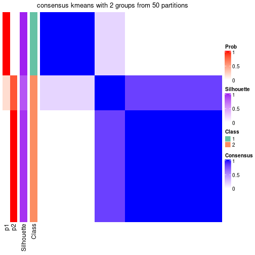</p>

</div>
<div id='tab-node-043-consensus-heatmap-2'>
<pre><code class="r">consensus_heatmap(res, k = 3)
</code></pre>

<p>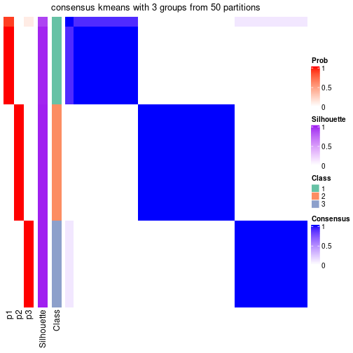</p>

</div>
<div id='tab-node-043-consensus-heatmap-3'>
<pre><code class="r">consensus_heatmap(res, k = 4)
</code></pre>

<p>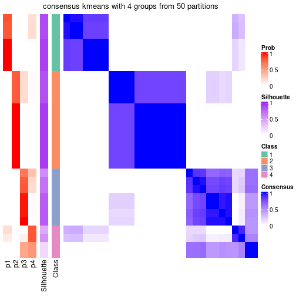</p>

</div>
<div id='tab-node-043-consensus-heatmap-4'>
<pre><code class="r">consensus_heatmap(res, k = 5)
</code></pre>

<p>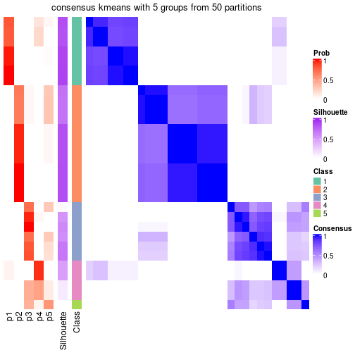</p>

</div>
<div id='tab-node-043-consensus-heatmap-5'>
<pre><code class="r">consensus_heatmap(res, k = 6)
</code></pre>

<p>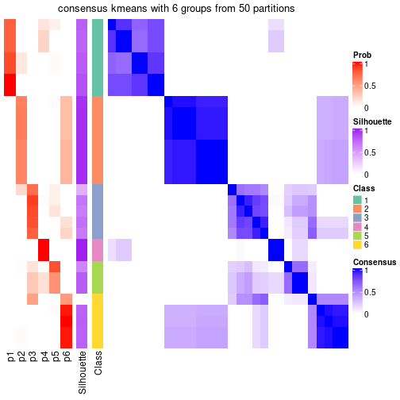</p>

</div>
<div id='tab-node-043-consensus-heatmap-6'>
<pre><code class="r">consensus_heatmap(res, k = 7)
</code></pre>

<p>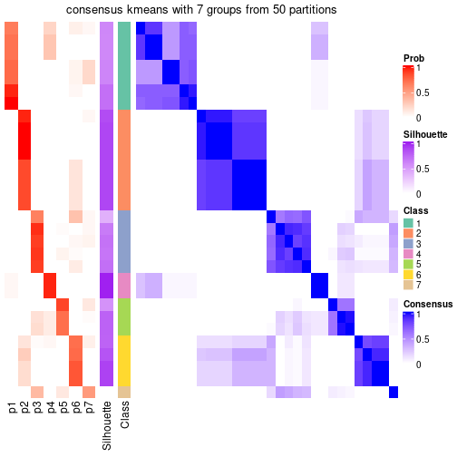</p>

</div>
<div id='tab-node-043-consensus-heatmap-7'>
<pre><code class="r">consensus_heatmap(res, k = 8)
</code></pre>

<p>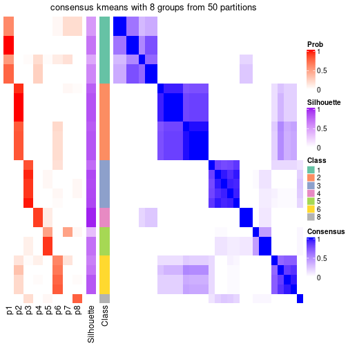</p>

</div>
</div>

Heatmaps for the membership of samples in all partitions to see how consistent they are:


<script>
$( function() {
	$( '#tabs-node-043-membership-heatmap' ).tabs();
} );
</script>
<div id='tabs-node-043-membership-heatmap'>
<ul>
<li><a href='#tab-node-043-membership-heatmap-1'>k = 2</a></li>
<li><a href='#tab-node-043-membership-heatmap-2'>k = 3</a></li>
<li><a href='#tab-node-043-membership-heatmap-3'>k = 4</a></li>
<li><a href='#tab-node-043-membership-heatmap-4'>k = 5</a></li>
<li><a href='#tab-node-043-membership-heatmap-5'>k = 6</a></li>
<li><a href='#tab-node-043-membership-heatmap-6'>k = 7</a></li>
<li><a href='#tab-node-043-membership-heatmap-7'>k = 8</a></li>
</ul>
<div id='tab-node-043-membership-heatmap-1'>
<pre><code class="r">membership_heatmap(res, k = 2)
</code></pre>

<p>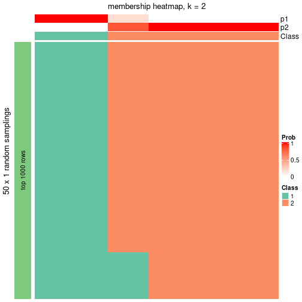</p>

</div>
<div id='tab-node-043-membership-heatmap-2'>
<pre><code class="r">membership_heatmap(res, k = 3)
</code></pre>

<p>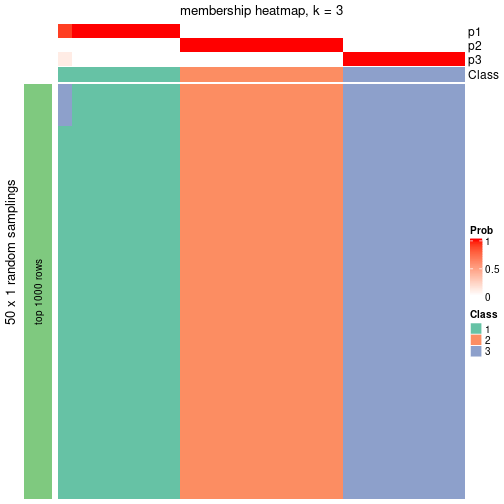</p>

</div>
<div id='tab-node-043-membership-heatmap-3'>
<pre><code class="r">membership_heatmap(res, k = 4)
</code></pre>

<p>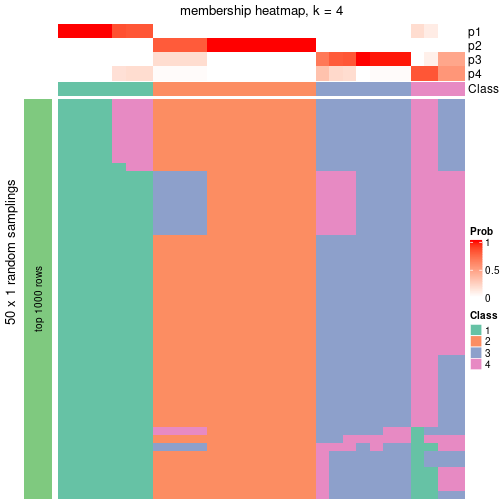</p>

</div>
<div id='tab-node-043-membership-heatmap-4'>
<pre><code class="r">membership_heatmap(res, k = 5)
</code></pre>

<p>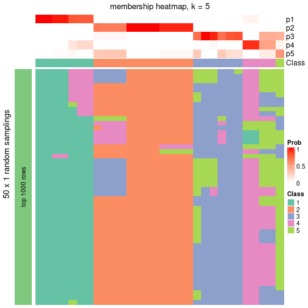</p>

</div>
<div id='tab-node-043-membership-heatmap-5'>
<pre><code class="r">membership_heatmap(res, k = 6)
</code></pre>

<p>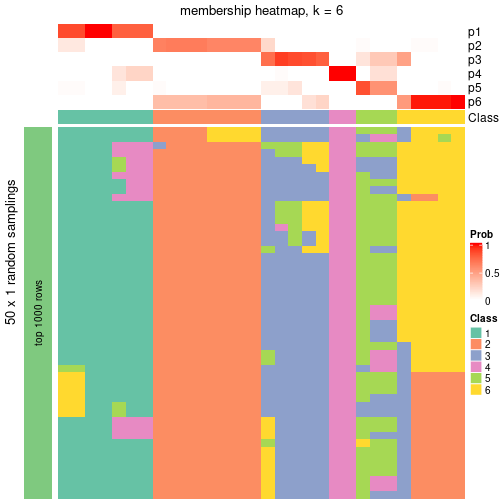</p>

</div>
<div id='tab-node-043-membership-heatmap-6'>
<pre><code class="r">membership_heatmap(res, k = 7)
</code></pre>

<p>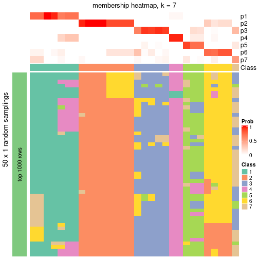</p>

</div>
<div id='tab-node-043-membership-heatmap-7'>
<pre><code class="r">membership_heatmap(res, k = 8)
</code></pre>

<p></p>

</div>
</div>

As soon as the classes for columns are determined, the signatures
that are significantly different between subgroups can be looked for. 
Following are the heatmaps for signatures.


<script>
$( function() {
	$( '#tabs-node-043-get-signatures' ).tabs();
} );
</script>
<div id='tabs-node-043-get-signatures'>
<ul>
<li><a href='#tab-node-043-get-signatures-1'>k = 2</a></li>
<li><a href='#tab-node-043-get-signatures-2'>k = 3</a></li>
<li><a href='#tab-node-043-get-signatures-3'>k = 4</a></li>
<li><a href='#tab-node-043-get-signatures-4'>k = 5</a></li>
<li><a href='#tab-node-043-get-signatures-5'>k = 6</a></li>
<li><a href='#tab-node-043-get-signatures-6'>k = 7</a></li>
<li><a href='#tab-node-043-get-signatures-7'>k = 8</a></li>
</ul>
<div id='tab-node-043-get-signatures-1'>
<pre><code class="r">get_signatures(res, k = 2)
</code></pre>

<p>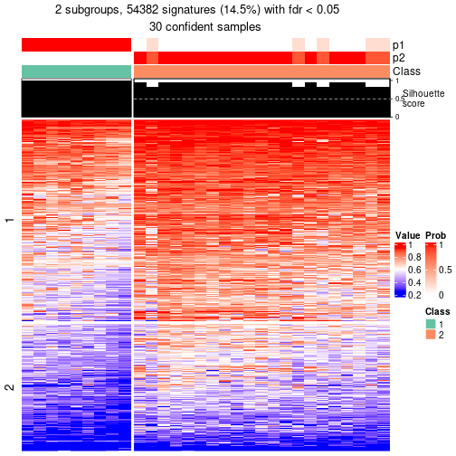</p>

</div>
<div id='tab-node-043-get-signatures-2'>
<pre><code class="r">get_signatures(res, k = 3)
</code></pre>

<p>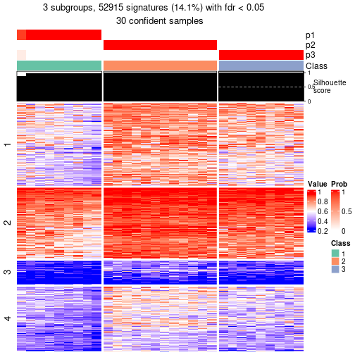</p>

</div>
<div id='tab-node-043-get-signatures-3'>
<pre><code class="r">get_signatures(res, k = 4)
</code></pre>

<p>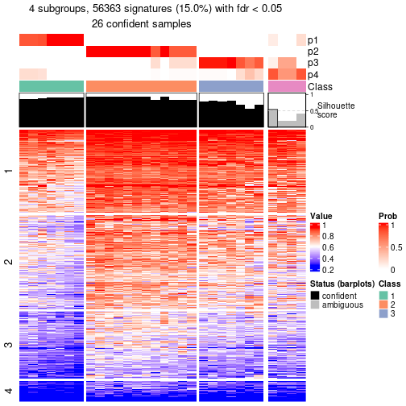</p>

</div>
<div id='tab-node-043-get-signatures-4'>
<pre><code class="r">get_signatures(res, k = 5)
</code></pre>

<p>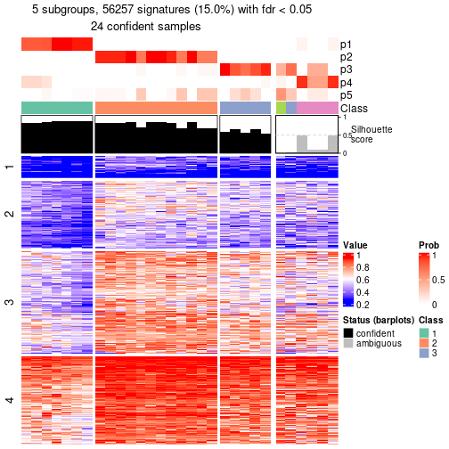</p>

</div>
<div id='tab-node-043-get-signatures-5'>
<pre><code class="r">get_signatures(res, k = 6)
</code></pre>

<p>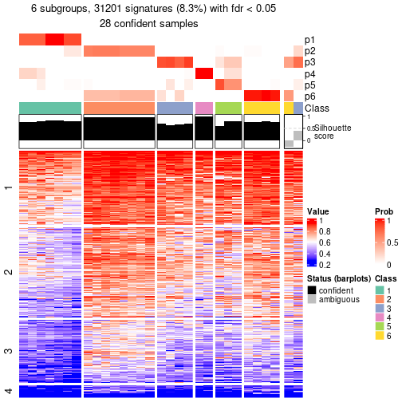</p>

</div>
<div id='tab-node-043-get-signatures-6'>
<pre><code class="r">get_signatures(res, k = 7)
</code></pre>

<p>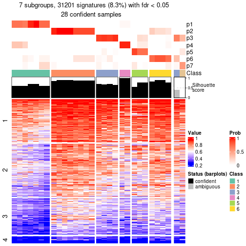</p>

</div>
<div id='tab-node-043-get-signatures-7'>
<pre><code class="r">get_signatures(res, k = 8)
</code></pre>

<p>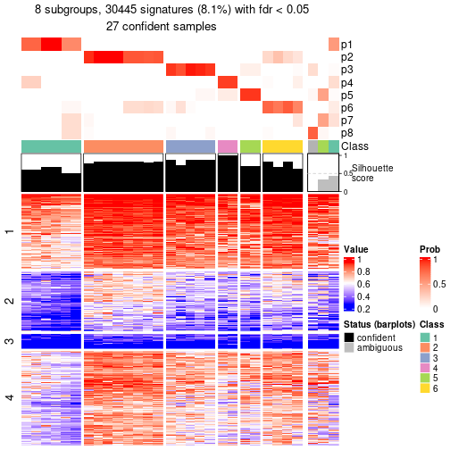</p>

</div>
</div>


Compare the overlap of signatures from different k:

```r
compare_signatures(res)
```

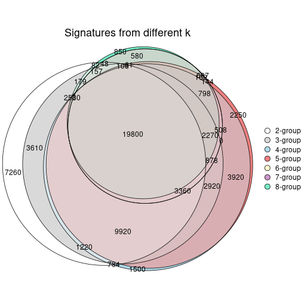

`get_signature()` returns a data frame invisibly. To get the list of signatures, the function
call should be assigned to a variable explicitly. In following code, if `plot` argument is set
to `FALSE`, no heatmap is plotted while only the differential analysis is performed.

```r
# code only for demonstration
tb = get_signature(res, k = ..., plot = FALSE)
```

An example of the output of `tb` is:

```
#>   which_row         fdr    mean_1    mean_2 scaled_mean_1 scaled_mean_2 km
#> 1        38 0.042760348  8.373488  9.131774    -0.5533452     0.5164555  1
#> 2        40 0.018707592  7.106213  8.469186    -0.6173731     0.5762149  1
#> 3        55 0.019134737 10.221463 11.207825    -0.6159697     0.5749050  1
#> 4        59 0.006059896  5.921854  7.869574    -0.6899429     0.6439467  1
#> 5        60 0.018055526  8.928898 10.211722    -0.6204761     0.5791110  1
#> 6        98 0.009384629 15.714769 14.887706     0.6635654    -0.6193277  2
...
```

The columns in `tb` are:

1. `which_row`: row indices corresponding to the input matrix.
2. `fdr`: FDR for the differential test. 
3. `mean_x`: The mean value in group x.
4. `scaled_mean_x`: The mean value in group x after rows are scaled.
5. `km`: Row groups if k-means clustering is applied to rows (which is done by automatically selecting number of clusters).

If there are too many signatures, `top_signatures = ...` can be set to only show the 
signatures with the highest FDRs:

```r
# code only for demonstration
# e.g. to show the top 500 most significant rows
tb = get_signature(res, k = ..., top_signatures = 500)
```

If the signatures are defined as these which are uniquely high in current group, `diff_method` argument
can be set to `"uniquely_high_in_one_group"`:

```r
# code only for demonstration
tb = get_signature(res, k = ..., diff_method = "uniquely_high_in_one_group")
```


UMAP plot which shows how samples are separated.


<script>
$( function() {
	$( '#tabs-node-043-dimension-reduction' ).tabs();
} );
</script>
<div id='tabs-node-043-dimension-reduction'>
<ul>
<li><a href='#tab-node-043-dimension-reduction-1'>k = 2</a></li>
<li><a href='#tab-node-043-dimension-reduction-2'>k = 3</a></li>
<li><a href='#tab-node-043-dimension-reduction-3'>k = 4</a></li>
<li><a href='#tab-node-043-dimension-reduction-4'>k = 5</a></li>
<li><a href='#tab-node-043-dimension-reduction-5'>k = 6</a></li>
<li><a href='#tab-node-043-dimension-reduction-6'>k = 7</a></li>
<li><a href='#tab-node-043-dimension-reduction-7'>k = 8</a></li>
</ul>
<div id='tab-node-043-dimension-reduction-1'>
<pre><code class="r">dimension_reduction(res, k = 2, method = &quot;UMAP&quot;)
</code></pre>

<p>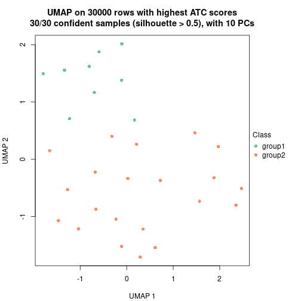</p>

</div>
<div id='tab-node-043-dimension-reduction-2'>
<pre><code class="r">dimension_reduction(res, k = 3, method = &quot;UMAP&quot;)
</code></pre>

<p>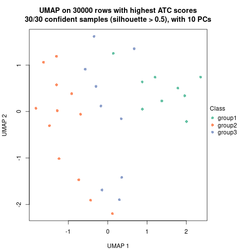</p>

</div>
<div id='tab-node-043-dimension-reduction-3'>
<pre><code class="r">dimension_reduction(res, k = 4, method = &quot;UMAP&quot;)
</code></pre>

<p>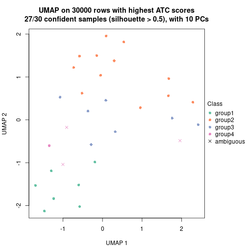</p>

</div>
<div id='tab-node-043-dimension-reduction-4'>
<pre><code class="r">dimension_reduction(res, k = 5, method = &quot;UMAP&quot;)
</code></pre>

<p>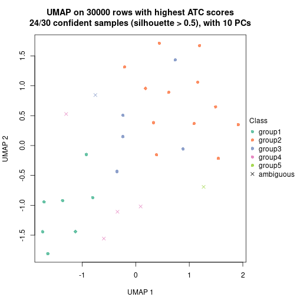</p>

</div>
<div id='tab-node-043-dimension-reduction-5'>
<pre><code class="r">dimension_reduction(res, k = 6, method = &quot;UMAP&quot;)
</code></pre>

<p>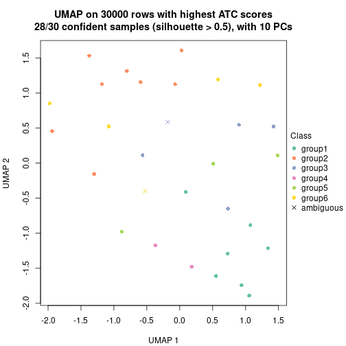</p>

</div>
<div id='tab-node-043-dimension-reduction-6'>
<pre><code class="r">dimension_reduction(res, k = 7, method = &quot;UMAP&quot;)
</code></pre>

<p>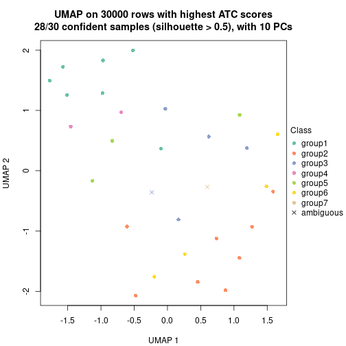</p>

</div>
<div id='tab-node-043-dimension-reduction-7'>
<pre><code class="r">dimension_reduction(res, k = 8, method = &quot;UMAP&quot;)
</code></pre>

<p>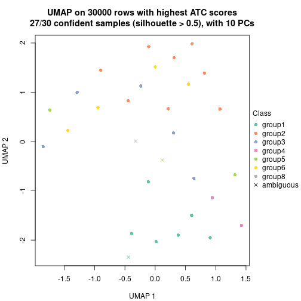</p>

</div>
</div>


Following heatmap shows how subgroups are split when increasing `k`:

```r
collect_classes(res)
```

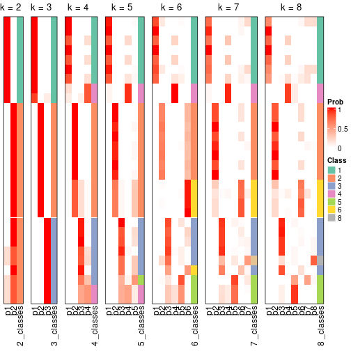


If matrix rows can be associated to genes, consider to use `functional_enrichment(res,
...)` to perform function enrichment for the signature genes. See [this vignette](https://jokergoo.github.io/cola_vignettes/functional_enrichment.html) for more detailed explanations.


 

---------------------------------------------------


### Node0432


Parent node: [Node043](#Node043).
Child nodes: 
                Node04121-leaf
        ,
                Node04122-leaf
        ,
                Node04123-leaf
        ,
                Node04321-leaf
        ,
                Node04322-leaf
        ,
                Node04323-leaf
        ,
                Node05211-leaf
        ,
                Node05212-leaf
        .


The object with results only for a single top-value method and a single partitioning method 
can be extracted as:

```r
res = res_rh["0432"]
```

A summary of `res` and all the functions that can be applied to it:

```r
res
```

```
#> A 'ConsensusPartition' object with k = 2, 3, 4, 5, 6, 7, 8.
#>   On a matrix with 30000 rows and 12 columns.
#>   Top rows (1000) are extracted by 'SD' method.
#>   Subgroups are detected by 'kmeans' method.
#>   Performed in total 350 partitions by row resampling.
#>   Best k for subgroups seems to be 2.
#> 
#> Following methods can be applied to this 'ConsensusPartition' object:
#>  [1] "cola_report"             "collect_classes"         "collect_plots"          
#>  [4] "collect_stats"           "colnames"                "compare_partitions"     
#>  [7] "compare_signatures"      "consensus_heatmap"       "dimension_reduction"    
#> [10] "functional_enrichment"   "get_anno_col"            "get_anno"               
#> [13] "get_classes"             "get_consensus"           "get_matrix"             
#> [16] "get_membership"          "get_param"               "get_signatures"         
#> [19] "get_stats"               "is_best_k"               "is_stable_k"            
#> [22] "membership_heatmap"      "ncol"                    "nrow"                   
#> [25] "plot_ecdf"               "predict_classes"         "rownames"               
#> [28] "select_partition_number" "show"                    "suggest_best_k"         
#> [31] "test_to_known_factors"   "top_rows_heatmap"
```

`collect_plots()` function collects all the plots made from `res` for all `k` (number of subgroups)
into one single page to provide an easy and fast comparison between different `k`.

```r
collect_plots(res)
```

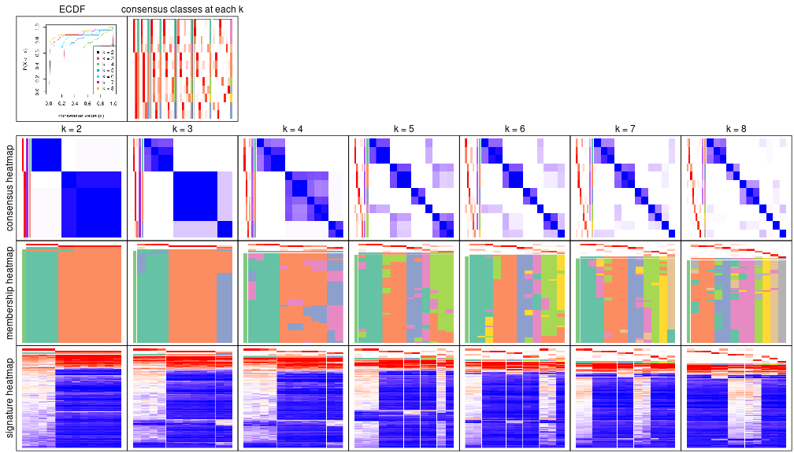

The plots are:

- The first row: a plot of the eCDF (empirical cumulative distribution
  function) curves of the consensus matrix for each `k` and the heatmap of
  predicted classes for each `k`.
- The second row: heatmaps of the consensus matrix for each `k`.
- The third row: heatmaps of the membership matrix for each `k`.
- The fouth row: heatmaps of the signatures for each `k`.

All the plots in panels can be made by individual functions and they are
plotted later in this section.

`select_partition_number()` produces several plots showing different
statistics for choosing "optimized" `k`. There are following statistics:

- eCDF curves of the consensus matrix for each `k`;
- 1-PAC. [The PAC score](https://en.wikipedia.org/wiki/Consensus_clustering#Over-interpretation_potential_of_consensus_clustering)
  measures the proportion of the ambiguous subgrouping.
- Mean silhouette score.
- Concordance. The mean probability of fiting the consensus subgroup labels in all
  partitions.
- Area increased. Denote $A_k$ as the area under the eCDF curve for current
  `k`, the area increased is defined as $A_k - A_{k-1}$.
- Rand index. The percent of pairs of samples that are both in a same cluster
  or both are not in a same cluster in the partition of k and k-1.
- Jaccard index. The ratio of pairs of samples are both in a same cluster in
  the partition of k and k-1 and the pairs of samples are both in a same
  cluster in the partition k or k-1.

The detailed explanations of these statistics can be found in [the _cola_
vignette](https://jokergoo.github.io/cola_vignettes/cola.html#toc_13).

Generally speaking, higher 1-PAC score, higher mean silhouette score or higher
concordance corresponds to better partition. Rand index and Jaccard index
measure how similar the current partition is compared to partition with `k-1`.
If they are too similar, we won't accept `k` is better than `k-1`.

```r
select_partition_number(res)
```

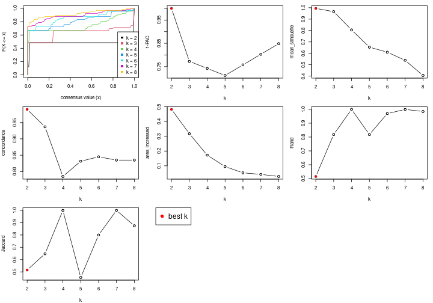

The numeric values for all these statistics can be obtained by `get_stats()`.

```r
get_stats(res)
```

```
#>   k 1-PAC mean_silhouette concordance area_increased  Rand Jaccard
#> 2 2 1.000           0.994       0.990         0.4819 0.515   0.515
#> 3 3 0.773           0.966       0.937         0.3176 0.818   0.647
#> 4 4 0.742           0.805       0.785         0.1726 1.000   1.000
#> 5 5 0.712           0.654       0.832         0.0951 0.818   0.455
#> 6 6 0.758           0.610       0.845         0.0528 0.970   0.800
#> 7 7 0.803           0.539       0.835         0.0423 1.000   1.000
#> 8 8 0.848           0.406       0.835         0.0281 0.985   0.875
```

`suggest_best_k()` suggests the best $k$ based on these statistics. The rules are as follows:

- All $k$ with Jaccard index larger than 0.95 are removed because increasing
  $k$ does not provide enough extra information. If all $k$ are removed, it is
  marked as no subgroup is detected.
- For all $k$ with 1-PAC score larger than 0.9, the maximal $k$ is taken as
  the best $k$, and other $k$ are marked as optional $k$.
- If it does not fit the second rule. The $k$ with the maximal vote of the
  highest 1-PAC score, highest mean silhouette, and highest concordance is
  taken as the best $k$.

```r
suggest_best_k(res)
```

```
#> [1] 2
```


Following is the table of the partitions (You need to click the **show/hide
code output** link to see it). The membership matrix (columns with name `p*`)
is inferred by
[`clue::cl_consensus()`](https://www.rdocumentation.org/link/cl_consensus?package=clue)
function with the `SE` method. Basically the value in the membership matrix
represents the probability to belong to a certain group. The finall subgroup
label for an item is determined with the group with highest probability it
belongs to.

In `get_classes()` function, the entropy is calculated from the membership
matrix and the silhouette score is calculated from the consensus matrix.


<script>
$( function() {
	$( '#tabs-node-0432-get-classes' ).tabs();
} );
</script>
<div id='tabs-node-0432-get-classes'>
<ul>
<li><a href='#tab-node-0432-get-classes-1'>k = 2</a></li>
<li><a href='#tab-node-0432-get-classes-2'>k = 3</a></li>
<li><a href='#tab-node-0432-get-classes-3'>k = 4</a></li>
<li><a href='#tab-node-0432-get-classes-4'>k = 5</a></li>
<li><a href='#tab-node-0432-get-classes-5'>k = 6</a></li>
<li><a href='#tab-node-0432-get-classes-6'>k = 7</a></li>
<li><a href='#tab-node-0432-get-classes-7'>k = 8</a></li>
</ul>

<div id='tab-node-0432-get-classes-1'>
<p><a id='tab-node-0432-get-classes-1-a' style='color:#0366d6' href='#'>show/hide code output</a></p>
<pre><code class="r">cbind(get_classes(res, k = 2), get_membership(res, k = 2))
</code></pre>

<pre><code>#&gt;                 class entropy silhouette   p1   p2
#&gt; TCGA.43.8115.01     1   0.000      1.000 1.00 0.00
#&gt; TCGA.98.8022.01     2   0.141      0.994 0.02 0.98
#&gt; TCGA.39.5031.01     1   0.000      1.000 1.00 0.00
#&gt; TCGA.22.5492.01     1   0.000      1.000 1.00 0.00
#&gt; TCGA.56.8628.01     2   0.141      0.994 0.02 0.98
#&gt; TCGA.56.7580.01     2   0.141      0.994 0.02 0.98
#&gt; TCGA.58.8387.01     2   0.141      0.994 0.02 0.98
#&gt; TCGA.56.8307.01     1   0.000      1.000 1.00 0.00
#&gt; TCGA.O2.A52W.01     2   0.000      0.983 0.00 1.00
#&gt; TCGA.68.8250.01     2   0.000      0.983 0.00 1.00
#&gt; TCGA.85.8287.01     2   0.141      0.994 0.02 0.98
#&gt; TCGA.85.A4JB.01     2   0.141      0.994 0.02 0.98
</code></pre>

<script>
$('#tab-node-0432-get-classes-1-a').parent().next().next().hide();
$('#tab-node-0432-get-classes-1-a').click(function(){
  $('#tab-node-0432-get-classes-1-a').parent().next().next().toggle();
  return(false);
});
</script>
</div>

<div id='tab-node-0432-get-classes-2'>
<p><a id='tab-node-0432-get-classes-2-a' style='color:#0366d6' href='#'>show/hide code output</a></p>
<pre><code class="r">cbind(get_classes(res, k = 3), get_membership(res, k = 3))
</code></pre>

<pre><code>#&gt;                 class entropy silhouette   p1   p2   p3
#&gt; TCGA.43.8115.01     1   0.000      0.928 1.00 0.00 0.00
#&gt; TCGA.98.8022.01     2   0.000      1.000 0.00 1.00 0.00
#&gt; TCGA.39.5031.01     1   0.000      0.928 1.00 0.00 0.00
#&gt; TCGA.22.5492.01     1   0.153      0.923 0.96 0.00 0.04
#&gt; TCGA.56.8628.01     2   0.000      1.000 0.00 1.00 0.00
#&gt; TCGA.56.7580.01     2   0.000      1.000 0.00 1.00 0.00
#&gt; TCGA.58.8387.01     2   0.000      1.000 0.00 1.00 0.00
#&gt; TCGA.56.8307.01     1   0.502      0.810 0.76 0.00 0.24
#&gt; TCGA.O2.A52W.01     3   0.502      1.000 0.00 0.24 0.76
#&gt; TCGA.68.8250.01     3   0.502      1.000 0.00 0.24 0.76
#&gt; TCGA.85.8287.01     2   0.000      1.000 0.00 1.00 0.00
#&gt; TCGA.85.A4JB.01     2   0.000      1.000 0.00 1.00 0.00
</code></pre>

<script>
$('#tab-node-0432-get-classes-2-a').parent().next().next().hide();
$('#tab-node-0432-get-classes-2-a').click(function(){
  $('#tab-node-0432-get-classes-2-a').parent().next().next().toggle();
  return(false);
});
</script>
</div>

<div id='tab-node-0432-get-classes-3'>
<p><a id='tab-node-0432-get-classes-3-a' style='color:#0366d6' href='#'>show/hide code output</a></p>
<pre><code class="r">cbind(get_classes(res, k = 4), get_membership(res, k = 4))
</code></pre>

<pre><code>#&gt;                 class entropy silhouette   p1   p2   p3   p4
#&gt; TCGA.43.8115.01     1  0.0000      0.867 1.00 0.00 0.00 0.00
#&gt; TCGA.98.8022.01     2  0.0000      0.742 0.00 1.00 0.00 0.00
#&gt; TCGA.39.5031.01     1  0.0000      0.867 1.00 0.00 0.00 0.00
#&gt; TCGA.22.5492.01     1  0.2335      0.855 0.92 0.00 0.02 0.06
#&gt; TCGA.56.8628.01     2  0.4948      0.767 0.00 0.56 0.00 0.44
#&gt; TCGA.56.7580.01     2  0.4977      0.757 0.00 0.54 0.00 0.46
#&gt; TCGA.58.8387.01     2  0.4522      0.790 0.00 0.68 0.00 0.32
#&gt; TCGA.56.8307.01     1  0.4855      0.640 0.60 0.00 0.00 0.40
#&gt; TCGA.O2.A52W.01     3  0.3335      0.922 0.00 0.02 0.86 0.12
#&gt; TCGA.68.8250.01     3  0.0707      0.922 0.00 0.02 0.98 0.00
#&gt; TCGA.85.8287.01     2  0.3610      0.794 0.00 0.80 0.00 0.20
#&gt; TCGA.85.A4JB.01     2  0.0000      0.742 0.00 1.00 0.00 0.00
</code></pre>

<script>
$('#tab-node-0432-get-classes-3-a').parent().next().next().hide();
$('#tab-node-0432-get-classes-3-a').click(function(){
  $('#tab-node-0432-get-classes-3-a').parent().next().next().toggle();
  return(false);
});
</script>
</div>

<div id='tab-node-0432-get-classes-4'>
<p><a id='tab-node-0432-get-classes-4-a' style='color:#0366d6' href='#'>show/hide code output</a></p>
<pre><code class="r">cbind(get_classes(res, k = 5), get_membership(res, k = 5))
</code></pre>

<pre><code>#&gt;                 class entropy silhouette   p1   p2   p3   p4   p5
#&gt; TCGA.43.8115.01     1   0.000      0.832 1.00 0.00 0.00 0.00 0.00
#&gt; TCGA.98.8022.01     2   0.000      0.826 0.00 1.00 0.00 0.00 0.00
#&gt; TCGA.39.5031.01     1   0.000      0.832 1.00 0.00 0.00 0.00 0.00
#&gt; TCGA.22.5492.01     1   0.422      0.594 0.78 0.00 0.00 0.12 0.10
#&gt; TCGA.56.8628.01     5   0.327      0.721 0.00 0.22 0.00 0.00 0.78
#&gt; TCGA.56.7580.01     5   0.410      0.708 0.00 0.20 0.00 0.04 0.76
#&gt; TCGA.58.8387.01     5   0.634      0.321 0.00 0.40 0.00 0.16 0.44
#&gt; TCGA.56.8307.01     4   0.398      0.000 0.34 0.00 0.00 0.66 0.00
#&gt; TCGA.O2.A52W.01     3   0.000      0.822 0.00 0.00 1.00 0.00 0.00
#&gt; TCGA.68.8250.01     3   0.417      0.822 0.00 0.00 0.78 0.14 0.08
#&gt; TCGA.85.8287.01     2   0.327      0.545 0.00 0.78 0.00 0.00 0.22
#&gt; TCGA.85.A4JB.01     2   0.000      0.826 0.00 1.00 0.00 0.00 0.00
</code></pre>

<script>
$('#tab-node-0432-get-classes-4-a').parent().next().next().hide();
$('#tab-node-0432-get-classes-4-a').click(function(){
  $('#tab-node-0432-get-classes-4-a').parent().next().next().toggle();
  return(false);
});
</script>
</div>

<div id='tab-node-0432-get-classes-5'>
<p><a id='tab-node-0432-get-classes-5-a' style='color:#0366d6' href='#'>show/hide code output</a></p>
<pre><code class="r">cbind(get_classes(res, k = 6), get_membership(res, k = 6))
</code></pre>

<pre><code>#&gt;                 class entropy silhouette   p1   p2   p3   p4   p5   p6
#&gt; TCGA.43.8115.01     1   0.358      0.775 0.66 0.00 0.00 0.34 0.00 0.00
#&gt; TCGA.98.8022.01     2   0.000      0.800 0.00 1.00 0.00 0.00 0.00 0.00
#&gt; TCGA.39.5031.01     1   0.400      0.775 0.66 0.00 0.00 0.32 0.02 0.00
#&gt; TCGA.22.5492.01     1   0.000      0.497 1.00 0.00 0.00 0.00 0.00 0.00
#&gt; TCGA.56.8628.01     5   0.209      0.784 0.00 0.08 0.00 0.00 0.90 0.02
#&gt; TCGA.56.7580.01     5   0.393      0.787 0.00 0.08 0.00 0.16 0.76 0.00
#&gt; TCGA.58.8387.01     6   0.529      0.000 0.00 0.22 0.00 0.00 0.18 0.60
#&gt; TCGA.56.8307.01     4   0.608      0.000 0.30 0.00 0.00 0.40 0.00 0.30
#&gt; TCGA.O2.A52W.01     3   0.000      0.778 0.00 0.00 1.00 0.00 0.00 0.00
#&gt; TCGA.68.8250.01     3   0.476      0.778 0.00 0.00 0.74 0.10 0.06 0.10
#&gt; TCGA.85.8287.01     2   0.320      0.546 0.00 0.74 0.00 0.00 0.26 0.00
#&gt; TCGA.85.A4JB.01     2   0.000      0.800 0.00 1.00 0.00 0.00 0.00 0.00
</code></pre>

<script>
$('#tab-node-0432-get-classes-5-a').parent().next().next().hide();
$('#tab-node-0432-get-classes-5-a').click(function(){
  $('#tab-node-0432-get-classes-5-a').parent().next().next().toggle();
  return(false);
});
</script>
</div>

<div id='tab-node-0432-get-classes-6'>
<p><a id='tab-node-0432-get-classes-6-a' style='color:#0366d6' href='#'>show/hide code output</a></p>
<pre><code class="r">cbind(get_classes(res, k = 7), get_membership(res, k = 7))
</code></pre>

<pre><code>#&gt;                 class entropy silhouette   p1   p2   p3   p4   p5   p6   p7
#&gt; TCGA.43.8115.01     1  0.1433      0.702 0.92 0.00 0.00 0.00 0.00 0.08 0.00
#&gt; TCGA.98.8022.01     2  0.0000      0.800 0.00 1.00 0.00 0.00 0.00 0.00 0.00
#&gt; TCGA.39.5031.01     1  0.0000      0.702 1.00 0.00 0.00 0.00 0.00 0.00 0.00
#&gt; TCGA.22.5492.01     1  0.3546      0.410 0.54 0.00 0.00 0.46 0.00 0.00 0.00
#&gt; TCGA.56.8628.01     5  0.0863      0.478 0.00 0.00 0.00 0.00 0.96 0.04 0.00
#&gt; TCGA.56.7580.01     5  0.3525      0.495 0.00 0.00 0.00 0.00 0.56 0.00 0.44
#&gt; TCGA.58.8387.01     6  0.3058      0.000 0.00 0.08 0.00 0.00 0.10 0.82 0.00
#&gt; TCGA.56.8307.01     7  0.5073      0.000 0.16 0.00 0.00 0.30 0.00 0.00 0.54
#&gt; TCGA.O2.A52W.01     3  0.0000      0.753 0.00 0.00 1.00 0.00 0.00 0.00 0.00
#&gt; TCGA.68.8250.01     3  0.4308      0.753 0.00 0.00 0.72 0.16 0.00 0.10 0.02
#&gt; TCGA.85.8287.01     2  0.4264      0.578 0.00 0.70 0.00 0.06 0.22 0.00 0.02
#&gt; TCGA.85.A4JB.01     2  0.0863      0.792 0.00 0.96 0.00 0.04 0.00 0.00 0.00
</code></pre>

<script>
$('#tab-node-0432-get-classes-6-a').parent().next().next().hide();
$('#tab-node-0432-get-classes-6-a').click(function(){
  $('#tab-node-0432-get-classes-6-a').parent().next().next().toggle();
  return(false);
});
</script>
</div>

<div id='tab-node-0432-get-classes-7'>
<p><a id='tab-node-0432-get-classes-7-a' style='color:#0366d6' href='#'>show/hide code output</a></p>
<pre><code class="r">cbind(get_classes(res, k = 8), get_membership(res, k = 8))
</code></pre>

<pre><code>#&gt;                 class entropy silhouette   p1   p2  p3   p4   p5   p6   p7   p8
#&gt; TCGA.43.8115.01     4  0.0000      0.671 0.00 0.00 0.0 1.00 0.00 0.00 0.00 0.00
#&gt; TCGA.98.8022.01     2  0.0000      0.786 0.00 1.00 0.0 0.00 0.00 0.00 0.00 0.00
#&gt; TCGA.39.5031.01     4  0.2132      0.671 0.08 0.00 0.0 0.88 0.00 0.04 0.00 0.00
#&gt; TCGA.22.5492.01     4  0.5994      0.333 0.18 0.00 0.0 0.46 0.26 0.00 0.10 0.00
#&gt; TCGA.56.8628.01     5  0.3198      0.000 0.00 0.00 0.0 0.00 0.72 0.02 0.00 0.26
#&gt; TCGA.56.7580.01     8  0.0000      0.000 0.00 0.00 0.0 0.00 0.00 0.00 0.00 1.00
#&gt; TCGA.58.8387.01     6  0.0941      0.000 0.00 0.02 0.0 0.00 0.00 0.96 0.00 0.02
#&gt; TCGA.56.8307.01     7  0.1091      0.000 0.00 0.00 0.0 0.06 0.00 0.00 0.94 0.00
#&gt; TCGA.O2.A52W.01     3  0.3333      0.529 0.50 0.00 0.5 0.00 0.00 0.00 0.00 0.00
#&gt; TCGA.68.8250.01     3  0.0000      0.529 0.00 0.00 1.0 0.00 0.00 0.00 0.00 0.00
#&gt; TCGA.85.8287.01     2  0.4835      0.580 0.22 0.64 0.0 0.00 0.02 0.00 0.02 0.10
#&gt; TCGA.85.A4JB.01     2  0.1741      0.771 0.02 0.92 0.0 0.00 0.02 0.00 0.04 0.00
</code></pre>

<script>
$('#tab-node-0432-get-classes-7-a').parent().next().next().hide();
$('#tab-node-0432-get-classes-7-a').click(function(){
  $('#tab-node-0432-get-classes-7-a').parent().next().next().toggle();
  return(false);
});
</script>
</div>
</div>

Heatmaps for the consensus matrix. It visualizes the probability of two
samples to be in a same group.


<script>
$( function() {
	$( '#tabs-node-0432-consensus-heatmap' ).tabs();
} );
</script>
<div id='tabs-node-0432-consensus-heatmap'>
<ul>
<li><a href='#tab-node-0432-consensus-heatmap-1'>k = 2</a></li>
<li><a href='#tab-node-0432-consensus-heatmap-2'>k = 3</a></li>
<li><a href='#tab-node-0432-consensus-heatmap-3'>k = 4</a></li>
<li><a href='#tab-node-0432-consensus-heatmap-4'>k = 5</a></li>
<li><a href='#tab-node-0432-consensus-heatmap-5'>k = 6</a></li>
<li><a href='#tab-node-0432-consensus-heatmap-6'>k = 7</a></li>
<li><a href='#tab-node-0432-consensus-heatmap-7'>k = 8</a></li>
</ul>
<div id='tab-node-0432-consensus-heatmap-1'>
<pre><code class="r">consensus_heatmap(res, k = 2)
</code></pre>

<p>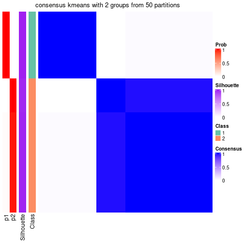</p>

</div>
<div id='tab-node-0432-consensus-heatmap-2'>
<pre><code class="r">consensus_heatmap(res, k = 3)
</code></pre>

<p>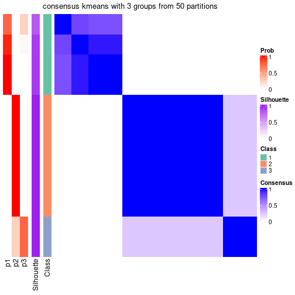</p>

</div>
<div id='tab-node-0432-consensus-heatmap-3'>
<pre><code class="r">consensus_heatmap(res, k = 4)
</code></pre>

<p>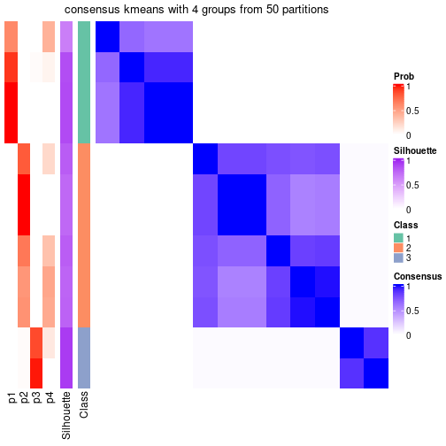</p>

</div>
<div id='tab-node-0432-consensus-heatmap-4'>
<pre><code class="r">consensus_heatmap(res, k = 5)
</code></pre>

<p>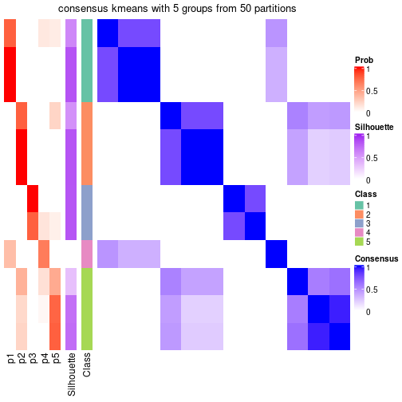</p>

</div>
<div id='tab-node-0432-consensus-heatmap-5'>
<pre><code class="r">consensus_heatmap(res, k = 6)
</code></pre>

<p>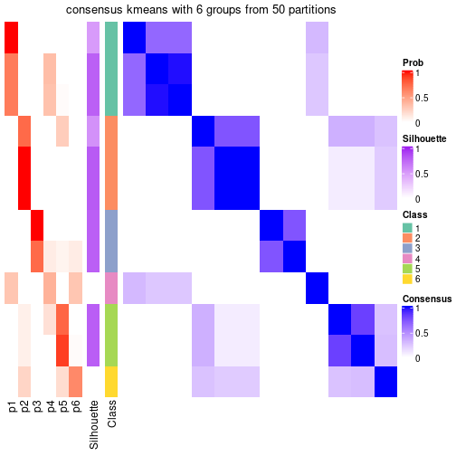</p>

</div>
<div id='tab-node-0432-consensus-heatmap-6'>
<pre><code class="r">consensus_heatmap(res, k = 7)
</code></pre>

<p>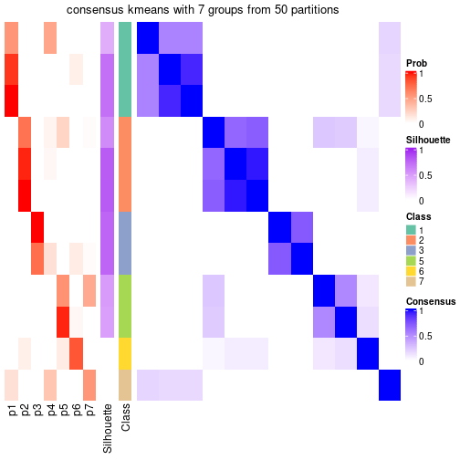</p>

</div>
<div id='tab-node-0432-consensus-heatmap-7'>
<pre><code class="r">consensus_heatmap(res, k = 8)
</code></pre>

<p>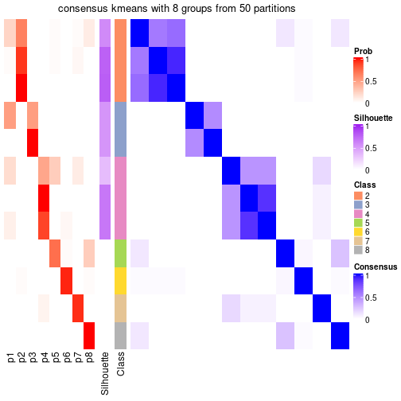</p>

</div>
</div>

Heatmaps for the membership of samples in all partitions to see how consistent they are:


<script>
$( function() {
	$( '#tabs-node-0432-membership-heatmap' ).tabs();
} );
</script>
<div id='tabs-node-0432-membership-heatmap'>
<ul>
<li><a href='#tab-node-0432-membership-heatmap-1'>k = 2</a></li>
<li><a href='#tab-node-0432-membership-heatmap-2'>k = 3</a></li>
<li><a href='#tab-node-0432-membership-heatmap-3'>k = 4</a></li>
<li><a href='#tab-node-0432-membership-heatmap-4'>k = 5</a></li>
<li><a href='#tab-node-0432-membership-heatmap-5'>k = 6</a></li>
<li><a href='#tab-node-0432-membership-heatmap-6'>k = 7</a></li>
<li><a href='#tab-node-0432-membership-heatmap-7'>k = 8</a></li>
</ul>
<div id='tab-node-0432-membership-heatmap-1'>
<pre><code class="r">membership_heatmap(res, k = 2)
</code></pre>

<p>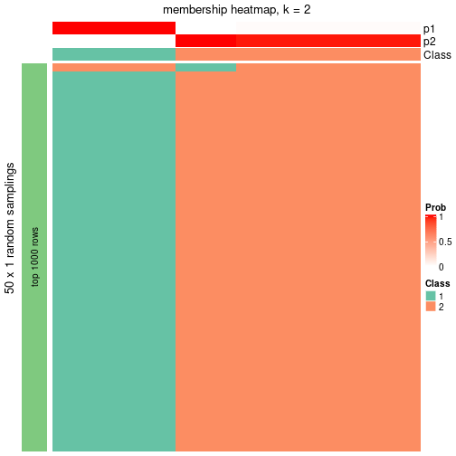</p>

</div>
<div id='tab-node-0432-membership-heatmap-2'>
<pre><code class="r">membership_heatmap(res, k = 3)
</code></pre>

<p>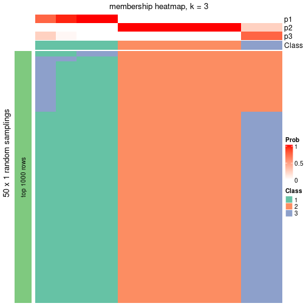</p>

</div>
<div id='tab-node-0432-membership-heatmap-3'>
<pre><code class="r">membership_heatmap(res, k = 4)
</code></pre>

<p>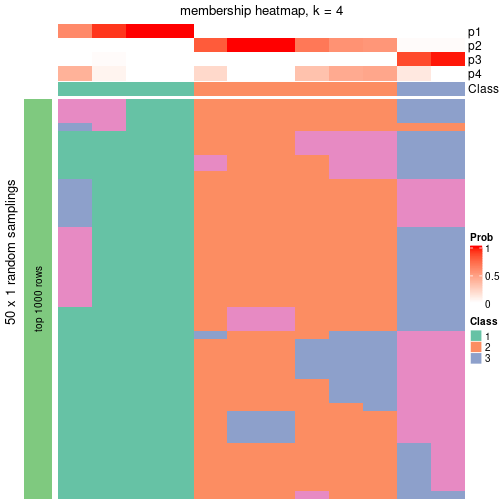</p>

</div>
<div id='tab-node-0432-membership-heatmap-4'>
<pre><code class="r">membership_heatmap(res, k = 5)
</code></pre>

<p>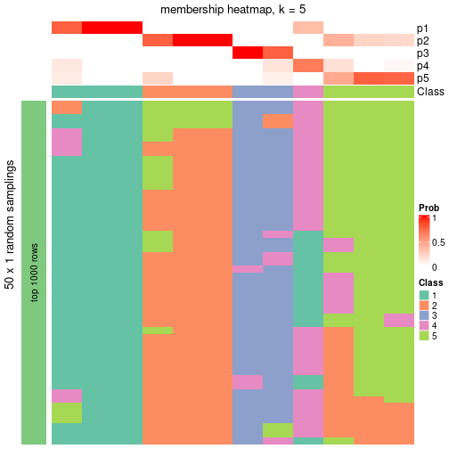</p>

</div>
<div id='tab-node-0432-membership-heatmap-5'>
<pre><code class="r">membership_heatmap(res, k = 6)
</code></pre>

<p>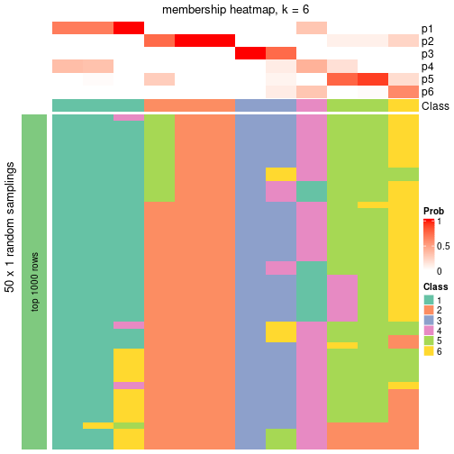</p>

</div>
<div id='tab-node-0432-membership-heatmap-6'>
<pre><code class="r">membership_heatmap(res, k = 7)
</code></pre>

<p></p>

</div>
<div id='tab-node-0432-membership-heatmap-7'>
<pre><code class="r">membership_heatmap(res, k = 8)
</code></pre>

<p>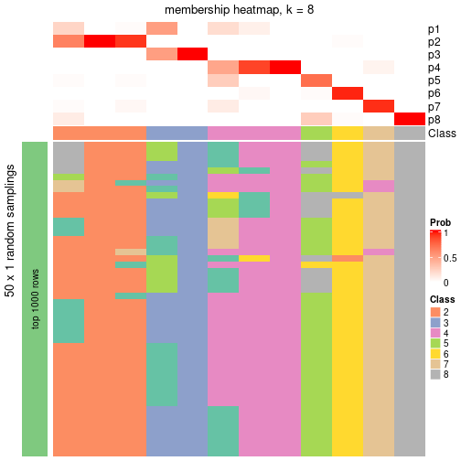</p>

</div>
</div>

As soon as the classes for columns are determined, the signatures
that are significantly different between subgroups can be looked for. 
Following are the heatmaps for signatures.


<script>
$( function() {
	$( '#tabs-node-0432-get-signatures' ).tabs();
} );
</script>
<div id='tabs-node-0432-get-signatures'>
<ul>
<li><a href='#tab-node-0432-get-signatures-1'>k = 2</a></li>
<li><a href='#tab-node-0432-get-signatures-2'>k = 3</a></li>
<li><a href='#tab-node-0432-get-signatures-3'>k = 4</a></li>
<li><a href='#tab-node-0432-get-signatures-4'>k = 5</a></li>
<li><a href='#tab-node-0432-get-signatures-5'>k = 6</a></li>
<li><a href='#tab-node-0432-get-signatures-6'>k = 7</a></li>
<li><a href='#tab-node-0432-get-signatures-7'>k = 8</a></li>
</ul>
<div id='tab-node-0432-get-signatures-1'>
<pre><code class="r">get_signatures(res, k = 2)
</code></pre>

<p>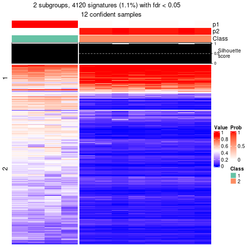</p>

</div>
<div id='tab-node-0432-get-signatures-2'>
<pre><code class="r">get_signatures(res, k = 3)
</code></pre>

<p>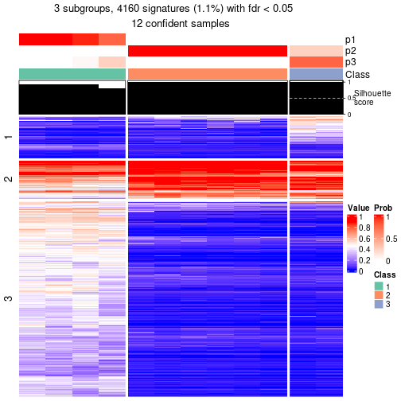</p>

</div>
<div id='tab-node-0432-get-signatures-3'>
<pre><code class="r">get_signatures(res, k = 4)
</code></pre>

<p>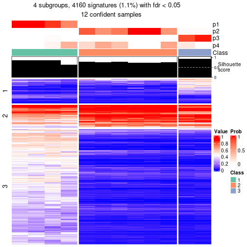</p>

</div>
<div id='tab-node-0432-get-signatures-4'>
<pre><code class="r">get_signatures(res, k = 5)
</code></pre>

<p>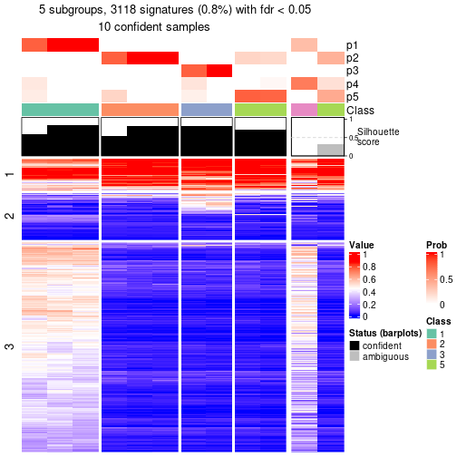</p>

</div>
<div id='tab-node-0432-get-signatures-5'>
<pre><code class="r">get_signatures(res, k = 6)
</code></pre>

<p>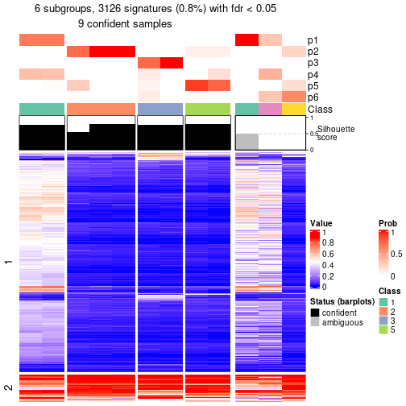</p>

</div>
<div id='tab-node-0432-get-signatures-6'>
<pre><code class="r">get_signatures(res, k = 7)
</code></pre>

<p>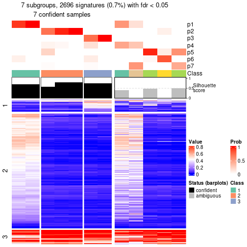</p>

</div>
<div id='tab-node-0432-get-signatures-7'>
<pre><code class="r">get_signatures(res, k = 8)
</code></pre>

<p>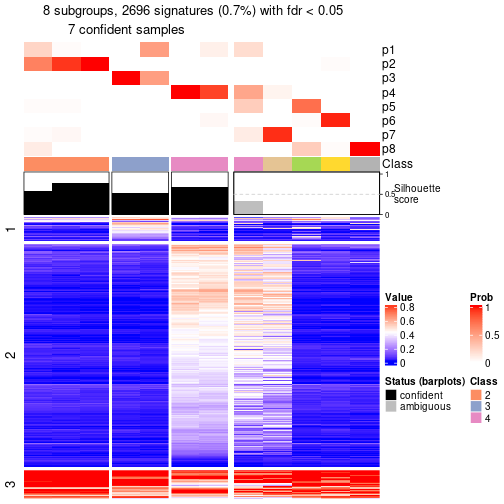</p>

</div>
</div>


Compare the overlap of signatures from different k:

```r
compare_signatures(res)
```

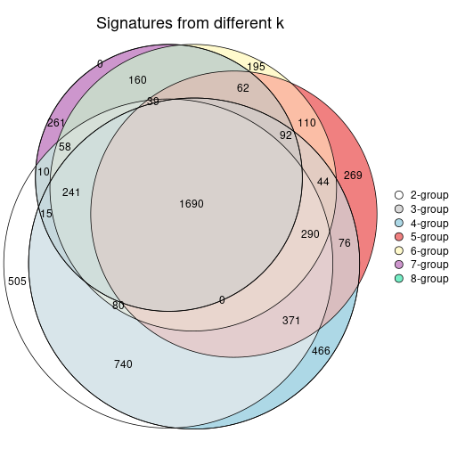

`get_signature()` returns a data frame invisibly. To get the list of signatures, the function
call should be assigned to a variable explicitly. In following code, if `plot` argument is set
to `FALSE`, no heatmap is plotted while only the differential analysis is performed.

```r
# code only for demonstration
tb = get_signature(res, k = ..., plot = FALSE)
```

An example of the output of `tb` is:

```
#>   which_row         fdr    mean_1    mean_2 scaled_mean_1 scaled_mean_2 km
#> 1        38 0.042760348  8.373488  9.131774    -0.5533452     0.5164555  1
#> 2        40 0.018707592  7.106213  8.469186    -0.6173731     0.5762149  1
#> 3        55 0.019134737 10.221463 11.207825    -0.6159697     0.5749050  1
#> 4        59 0.006059896  5.921854  7.869574    -0.6899429     0.6439467  1
#> 5        60 0.018055526  8.928898 10.211722    -0.6204761     0.5791110  1
#> 6        98 0.009384629 15.714769 14.887706     0.6635654    -0.6193277  2
...
```

The columns in `tb` are:

1. `which_row`: row indices corresponding to the input matrix.
2. `fdr`: FDR for the differential test. 
3. `mean_x`: The mean value in group x.
4. `scaled_mean_x`: The mean value in group x after rows are scaled.
5. `km`: Row groups if k-means clustering is applied to rows (which is done by automatically selecting number of clusters).

If there are too many signatures, `top_signatures = ...` can be set to only show the 
signatures with the highest FDRs:

```r
# code only for demonstration
# e.g. to show the top 500 most significant rows
tb = get_signature(res, k = ..., top_signatures = 500)
```

If the signatures are defined as these which are uniquely high in current group, `diff_method` argument
can be set to `"uniquely_high_in_one_group"`:

```r
# code only for demonstration
tb = get_signature(res, k = ..., diff_method = "uniquely_high_in_one_group")
```


UMAP plot which shows how samples are separated.


<script>
$( function() {
	$( '#tabs-node-0432-dimension-reduction' ).tabs();
} );
</script>
<div id='tabs-node-0432-dimension-reduction'>
<ul>
<li><a href='#tab-node-0432-dimension-reduction-1'>k = 2</a></li>
<li><a href='#tab-node-0432-dimension-reduction-2'>k = 3</a></li>
<li><a href='#tab-node-0432-dimension-reduction-3'>k = 4</a></li>
<li><a href='#tab-node-0432-dimension-reduction-4'>k = 5</a></li>
<li><a href='#tab-node-0432-dimension-reduction-5'>k = 6</a></li>
<li><a href='#tab-node-0432-dimension-reduction-6'>k = 7</a></li>
<li><a href='#tab-node-0432-dimension-reduction-7'>k = 8</a></li>
</ul>
<div id='tab-node-0432-dimension-reduction-1'>
<pre><code class="r">dimension_reduction(res, k = 2, method = &quot;UMAP&quot;)
</code></pre>

<p>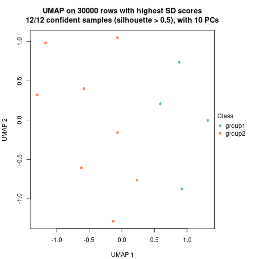</p>

</div>
<div id='tab-node-0432-dimension-reduction-2'>
<pre><code class="r">dimension_reduction(res, k = 3, method = &quot;UMAP&quot;)
</code></pre>

<p>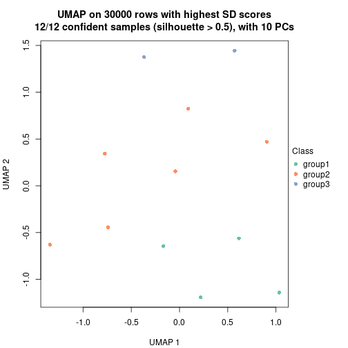</p>

</div>
<div id='tab-node-0432-dimension-reduction-3'>
<pre><code class="r">dimension_reduction(res, k = 4, method = &quot;UMAP&quot;)
</code></pre>

<p>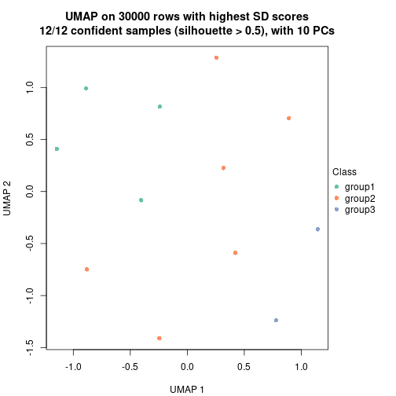</p>

</div>
<div id='tab-node-0432-dimension-reduction-4'>
<pre><code class="r">dimension_reduction(res, k = 5, method = &quot;UMAP&quot;)
</code></pre>

<p>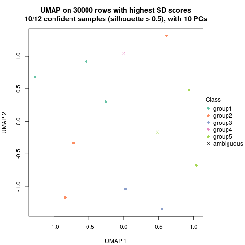</p>

</div>
<div id='tab-node-0432-dimension-reduction-5'>
<pre><code class="r">dimension_reduction(res, k = 6, method = &quot;UMAP&quot;)
</code></pre>

<p>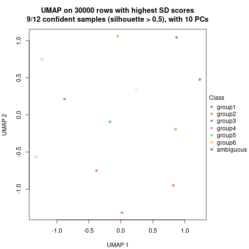</p>

</div>
<div id='tab-node-0432-dimension-reduction-6'>
<pre><code class="r">dimension_reduction(res, k = 7, method = &quot;UMAP&quot;)
</code></pre>

<p>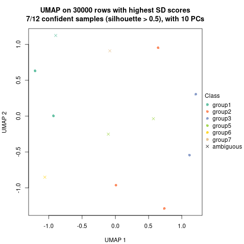</p>

</div>
<div id='tab-node-0432-dimension-reduction-7'>
<pre><code class="r">dimension_reduction(res, k = 8, method = &quot;UMAP&quot;)
</code></pre>

<p>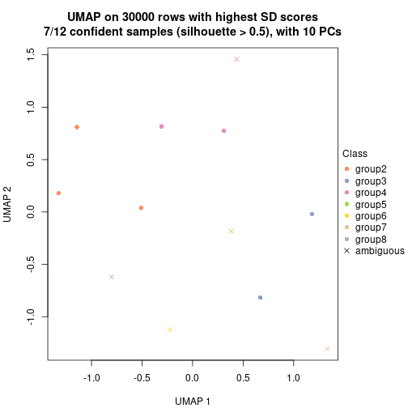</p>

</div>
</div>


Following heatmap shows how subgroups are split when increasing `k`:

```r
collect_classes(res)
```

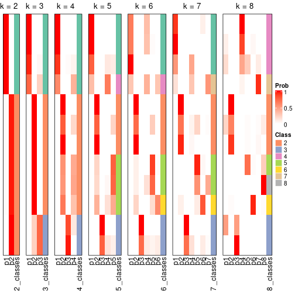


If matrix rows can be associated to genes, consider to use `functional_enrichment(res,
...)` to perform function enrichment for the signature genes. See [this vignette](https://jokergoo.github.io/cola_vignettes/functional_enrichment.html) for more detailed explanations.


 

---------------------------------------------------


### Node05


Parent node: [Node0](#Node0).
Child nodes: 
                [Node011](#Node011)
        ,
                [Node012](#Node012)
        ,
                Node013-leaf
        ,
                Node021-leaf
        ,
                Node022-leaf
        ,
                Node023-leaf
        ,
                [Node031](#Node031)
        ,
                Node032-leaf
        ,
                [Node033](#Node033)
        ,
                [Node034](#Node034)
        ,
                Node035-leaf
        ,
                [Node041](#Node041)
        ,
                [Node042](#Node042)
        ,
                [Node043](#Node043)
        ,
                [Node051](#Node051)
        ,
                [Node052](#Node052)
        ,
                [Node053](#Node053)
        .


The object with results only for a single top-value method and a single partitioning method 
can be extracted as:

```r
res = res_rh["05"]
```

A summary of `res` and all the functions that can be applied to it:

```r
res
```

```
#> A 'ConsensusPartition' object with k = 2, 3, 4, 5, 6, 7, 8.
#>   On a matrix with 30000 rows and 86 columns.
#>   Top rows (1000) are extracted by 'SD' method.
#>   Subgroups are detected by 'kmeans' method.
#>   Performed in total 350 partitions by row resampling.
#>   Best k for subgroups seems to be 3.
#> 
#> Following methods can be applied to this 'ConsensusPartition' object:
#>  [1] "cola_report"             "collect_classes"         "collect_plots"          
#>  [4] "collect_stats"           "colnames"                "compare_partitions"     
#>  [7] "compare_signatures"      "consensus_heatmap"       "dimension_reduction"    
#> [10] "functional_enrichment"   "get_anno_col"            "get_anno"               
#> [13] "get_classes"             "get_consensus"           "get_matrix"             
#> [16] "get_membership"          "get_param"               "get_signatures"         
#> [19] "get_stats"               "is_best_k"               "is_stable_k"            
#> [22] "membership_heatmap"      "ncol"                    "nrow"                   
#> [25] "plot_ecdf"               "predict_classes"         "rownames"               
#> [28] "select_partition_number" "show"                    "suggest_best_k"         
#> [31] "test_to_known_factors"   "top_rows_heatmap"
```

`collect_plots()` function collects all the plots made from `res` for all `k` (number of subgroups)
into one single page to provide an easy and fast comparison between different `k`.

```r
collect_plots(res)
```

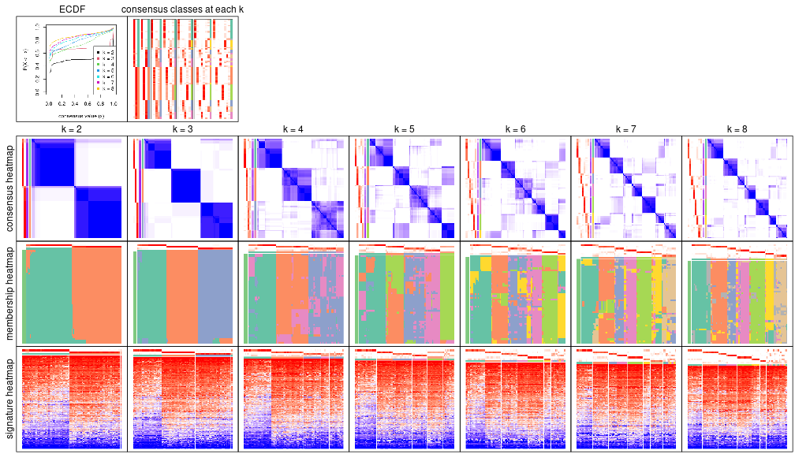

The plots are:

- The first row: a plot of the eCDF (empirical cumulative distribution
  function) curves of the consensus matrix for each `k` and the heatmap of
  predicted classes for each `k`.
- The second row: heatmaps of the consensus matrix for each `k`.
- The third row: heatmaps of the membership matrix for each `k`.
- The fouth row: heatmaps of the signatures for each `k`.

All the plots in panels can be made by individual functions and they are
plotted later in this section.

`select_partition_number()` produces several plots showing different
statistics for choosing "optimized" `k`. There are following statistics:

- eCDF curves of the consensus matrix for each `k`;
- 1-PAC. [The PAC score](https://en.wikipedia.org/wiki/Consensus_clustering#Over-interpretation_potential_of_consensus_clustering)
  measures the proportion of the ambiguous subgrouping.
- Mean silhouette score.
- Concordance. The mean probability of fiting the consensus subgroup labels in all
  partitions.
- Area increased. Denote $A_k$ as the area under the eCDF curve for current
  `k`, the area increased is defined as $A_k - A_{k-1}$.
- Rand index. The percent of pairs of samples that are both in a same cluster
  or both are not in a same cluster in the partition of k and k-1.
- Jaccard index. The ratio of pairs of samples are both in a same cluster in
  the partition of k and k-1 and the pairs of samples are both in a same
  cluster in the partition k or k-1.

The detailed explanations of these statistics can be found in [the _cola_
vignette](https://jokergoo.github.io/cola_vignettes/cola.html#toc_13).

Generally speaking, higher 1-PAC score, higher mean silhouette score or higher
concordance corresponds to better partition. Rand index and Jaccard index
measure how similar the current partition is compared to partition with `k-1`.
If they are too similar, we won't accept `k` is better than `k-1`.

```r
select_partition_number(res)
```

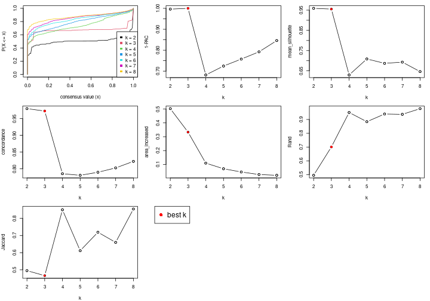

The numeric values for all these statistics can be obtained by `get_stats()`.

```r
get_stats(res)
```

```
#>   k 1-PAC mean_silhouette concordance area_increased  Rand Jaccard
#> 2 2 0.996           0.959       0.980         0.5026 0.495   0.495
#> 3 3 1.000           0.955       0.973         0.3334 0.701   0.466
#> 4 4 0.682           0.630       0.785         0.1096 0.950   0.849
#> 5 5 0.724           0.709       0.781         0.0690 0.884   0.612
#> 6 6 0.758           0.687       0.790         0.0457 0.940   0.719
#> 7 7 0.792           0.693       0.803         0.0274 0.937   0.660
#> 8 8 0.846           0.646       0.822         0.0218 0.978   0.854
```

`suggest_best_k()` suggests the best $k$ based on these statistics. The rules are as follows:

- All $k$ with Jaccard index larger than 0.95 are removed because increasing
  $k$ does not provide enough extra information. If all $k$ are removed, it is
  marked as no subgroup is detected.
- For all $k$ with 1-PAC score larger than 0.9, the maximal $k$ is taken as
  the best $k$, and other $k$ are marked as optional $k$.
- If it does not fit the second rule. The $k$ with the maximal vote of the
  highest 1-PAC score, highest mean silhouette, and highest concordance is
  taken as the best $k$.

```r
suggest_best_k(res)
```

```
#> [1] 3
#> attr(,"optional")
#> [1] 2
```

There is also optional best $k$ = 2 that is worth to check.

Following is the table of the partitions (You need to click the **show/hide
code output** link to see it). The membership matrix (columns with name `p*`)
is inferred by
[`clue::cl_consensus()`](https://www.rdocumentation.org/link/cl_consensus?package=clue)
function with the `SE` method. Basically the value in the membership matrix
represents the probability to belong to a certain group. The finall subgroup
label for an item is determined with the group with highest probability it
belongs to.

In `get_classes()` function, the entropy is calculated from the membership
matrix and the silhouette score is calculated from the consensus matrix.


<script>
$( function() {
	$( '#tabs-node-05-get-classes' ).tabs();
} );
</script>
<div id='tabs-node-05-get-classes'>
<ul>
<li><a href='#tab-node-05-get-classes-1'>k = 2</a></li>
<li><a href='#tab-node-05-get-classes-2'>k = 3</a></li>
<li><a href='#tab-node-05-get-classes-3'>k = 4</a></li>
<li><a href='#tab-node-05-get-classes-4'>k = 5</a></li>
<li><a href='#tab-node-05-get-classes-5'>k = 6</a></li>
<li><a href='#tab-node-05-get-classes-6'>k = 7</a></li>
<li><a href='#tab-node-05-get-classes-7'>k = 8</a></li>
</ul>

<div id='tab-node-05-get-classes-1'>
<p><a id='tab-node-05-get-classes-1-a' style='color:#0366d6' href='#'>show/hide code output</a></p>
<pre><code class="r">cbind(get_classes(res, k = 2), get_membership(res, k = 2))
</code></pre>

<pre><code>#&gt;                 class entropy silhouette   p1   p2
#&gt; TCGA.22.4601.01     2   0.000      0.978 0.00 1.00
#&gt; TCGA.63.7020.01     1   0.000      0.979 1.00 0.00
#&gt; TCGA.6A.AB49.01     1   0.000      0.979 1.00 0.00
#&gt; TCGA.79.5596.01     1   0.000      0.979 1.00 0.00
#&gt; TCGA.63.5131.01     1   0.000      0.979 1.00 0.00
#&gt; TCGA.22.4613.01     1   0.000      0.979 1.00 0.00
#&gt; TCGA.77.8154.01     1   0.000      0.979 1.00 0.00
#&gt; TCGA.34.5240.01     2   0.000      0.978 0.00 1.00
#&gt; TCGA.85.6798.01     2   0.000      0.978 0.00 1.00
#&gt; TCGA.77.6844.01     1   0.000      0.979 1.00 0.00
#&gt; TCGA.77.6843.01     2   0.000      0.978 0.00 1.00
#&gt; TCGA.56.A62T.01     2   0.000      0.978 0.00 1.00
#&gt; TCGA.33.4583.01     2   0.000      0.978 0.00 1.00
#&gt; TCGA.85.8072.01     2   0.000      0.978 0.00 1.00
#&gt; TCGA.33.AAS8.01     1   0.000      0.979 1.00 0.00
#&gt; TCGA.39.5036.01     2   0.000      0.978 0.00 1.00
#&gt; TCGA.33.4582.01     1   0.000      0.979 1.00 0.00
#&gt; TCGA.39.5037.01     1   0.000      0.979 1.00 0.00
#&gt; TCGA.33.AASJ.01     2   0.000      0.978 0.00 1.00
#&gt; TCGA.33.4579.01     1   0.000      0.979 1.00 0.00
#&gt; TCGA.77.8144.01     2   0.242      0.958 0.04 0.96
#&gt; TCGA.34.7107.01     1   0.242      0.948 0.96 0.04
#&gt; TCGA.22.4599.01     2   0.925      0.492 0.34 0.66
#&gt; TCGA.85.7710.01     2   0.242      0.958 0.04 0.96
#&gt; TCGA.56.A4BY.01     2   0.000      0.978 0.00 1.00
#&gt; TCGA.58.A46M.01     2   0.000      0.978 0.00 1.00
#&gt; TCGA.21.5786.01     2   0.242      0.958 0.04 0.96
#&gt; TCGA.39.5016.01     2   0.000      0.978 0.00 1.00
#&gt; TCGA.85.7698.01     2   0.000      0.978 0.00 1.00
#&gt; TCGA.96.A4JK.01     1   0.795      0.694 0.76 0.24
#&gt; TCGA.22.5485.01     1   0.000      0.979 1.00 0.00
#&gt; TCGA.22.5471.01     1   0.760      0.728 0.78 0.22
#&gt; TCGA.22.5473.01     2   0.000      0.978 0.00 1.00
#&gt; TCGA.33.4587.01     1   0.000      0.979 1.00 0.00
#&gt; TCGA.94.A4VJ.01     1   0.141      0.965 0.98 0.02
#&gt; TCGA.52.7810.01     1   0.000      0.979 1.00 0.00
#&gt; TCGA.85.7696.01     2   0.242      0.958 0.04 0.96
#&gt; TCGA.90.7766.01     1   0.000      0.979 1.00 0.00
#&gt; TCGA.43.5670.01     1   0.402      0.910 0.92 0.08
#&gt; TCGA.85.7843.01     1   0.141      0.965 0.98 0.02
#&gt; TCGA.22.5482.01     2   0.000      0.978 0.00 1.00
#&gt; TCGA.56.7223.01     2   0.000      0.978 0.00 1.00
#&gt; TCGA.43.A474.01     1   0.000      0.979 1.00 0.00
#&gt; TCGA.22.A5C4.01     2   0.242      0.958 0.04 0.96
#&gt; TCGA.94.7943.01     1   0.000      0.979 1.00 0.00
#&gt; TCGA.56.7222.01     1   0.000      0.979 1.00 0.00
#&gt; TCGA.56.7579.01     1   0.000      0.979 1.00 0.00
#&gt; TCGA.21.5783.01     2   0.242      0.958 0.04 0.96
#&gt; TCGA.63.A5MJ.01     2   0.000      0.978 0.00 1.00
#&gt; TCGA.63.A5MW.01     2   0.000      0.978 0.00 1.00
#&gt; TCGA.77.7141.01     2   0.000      0.978 0.00 1.00
#&gt; TCGA.77.7465.01     1   0.000      0.979 1.00 0.00
#&gt; TCGA.90.7964.01     1   0.000      0.979 1.00 0.00
#&gt; TCGA.63.A5MI.01     1   0.000      0.979 1.00 0.00
#&gt; TCGA.NC.A5HD.01     2   0.242      0.958 0.04 0.96
#&gt; TCGA.56.7221.01     1   0.000      0.979 1.00 0.00
#&gt; TCGA.85.8352.01     2   0.529      0.874 0.12 0.88
#&gt; TCGA.77.A5GF.01     2   0.000      0.978 0.00 1.00
#&gt; TCGA.37.A5EM.01     1   0.000      0.979 1.00 0.00
#&gt; TCGA.63.A5M9.01     2   0.000      0.978 0.00 1.00
#&gt; TCGA.92.7341.01     2   0.000      0.978 0.00 1.00
#&gt; TCGA.58.8391.01     2   0.000      0.978 0.00 1.00
#&gt; TCGA.51.6867.01     2   0.000      0.978 0.00 1.00
#&gt; TCGA.56.8629.01     2   0.000      0.978 0.00 1.00
#&gt; TCGA.85.8277.01     2   0.000      0.978 0.00 1.00
#&gt; TCGA.NC.A5HR.01     2   0.000      0.978 0.00 1.00
#&gt; TCGA.NK.A5D1.01     1   0.000      0.979 1.00 0.00
#&gt; TCGA.63.A5MB.01     2   0.000      0.978 0.00 1.00
#&gt; TCGA.85.A512.01     2   0.000      0.978 0.00 1.00
#&gt; TCGA.NC.A5HI.01     1   0.000      0.979 1.00 0.00
#&gt; TCGA.34.5927.01     1   0.000      0.979 1.00 0.00
#&gt; TCGA.43.6770.01     1   0.000      0.979 1.00 0.00
#&gt; TCGA.NC.A5HP.01     1   0.000      0.979 1.00 0.00
#&gt; TCGA.L3.A524.01     2   0.000      0.978 0.00 1.00
#&gt; TCGA.22.5483.01     2   0.000      0.978 0.00 1.00
#&gt; TCGA.NC.A5HQ.01     2   0.242      0.958 0.04 0.96
#&gt; TCGA.56.8308.01     1   0.141      0.965 0.98 0.02
#&gt; TCGA.39.5027.01     1   0.000      0.979 1.00 0.00
#&gt; TCGA.34.5929.01     1   0.000      0.979 1.00 0.00
#&gt; TCGA.94.A5I4.01     2   0.242      0.958 0.04 0.96
#&gt; TCGA.46.6025.01     2   0.242      0.958 0.04 0.96
#&gt; TCGA.NC.A5HM.01     1   0.000      0.979 1.00 0.00
#&gt; TCGA.NC.A5HO.01     1   0.680      0.787 0.82 0.18
#&gt; TCGA.37.A5EN.01     2   0.327      0.940 0.06 0.94
#&gt; TCGA.O2.A52S.01     2   0.000      0.978 0.00 1.00
#&gt; TCGA.98.A53A.01     1   0.000      0.979 1.00 0.00
</code></pre>

<script>
$('#tab-node-05-get-classes-1-a').parent().next().next().hide();
$('#tab-node-05-get-classes-1-a').click(function(){
  $('#tab-node-05-get-classes-1-a').parent().next().next().toggle();
  return(false);
});
</script>
</div>

<div id='tab-node-05-get-classes-2'>
<p><a id='tab-node-05-get-classes-2-a' style='color:#0366d6' href='#'>show/hide code output</a></p>
<pre><code class="r">cbind(get_classes(res, k = 3), get_membership(res, k = 3))
</code></pre>

<pre><code>#&gt;                 class entropy silhouette   p1   p2   p3
#&gt; TCGA.22.4601.01     2  0.0000      0.997 0.00 1.00 0.00
#&gt; TCGA.63.7020.01     1  0.0000      0.953 1.00 0.00 0.00
#&gt; TCGA.6A.AB49.01     1  0.6192      0.274 0.58 0.00 0.42
#&gt; TCGA.79.5596.01     1  0.2066      0.931 0.94 0.00 0.06
#&gt; TCGA.63.5131.01     1  0.0000      0.953 1.00 0.00 0.00
#&gt; TCGA.22.4613.01     1  0.2066      0.931 0.94 0.00 0.06
#&gt; TCGA.77.8154.01     1  0.0000      0.953 1.00 0.00 0.00
#&gt; TCGA.34.5240.01     2  0.0000      0.997 0.00 1.00 0.00
#&gt; TCGA.85.6798.01     2  0.0000      0.997 0.00 1.00 0.00
#&gt; TCGA.77.6844.01     1  0.0000      0.953 1.00 0.00 0.00
#&gt; TCGA.77.6843.01     2  0.2066      0.934 0.00 0.94 0.06
#&gt; TCGA.56.A62T.01     2  0.0000      0.997 0.00 1.00 0.00
#&gt; TCGA.33.4583.01     2  0.0000      0.997 0.00 1.00 0.00
#&gt; TCGA.85.8072.01     2  0.0000      0.997 0.00 1.00 0.00
#&gt; TCGA.33.AAS8.01     1  0.4555      0.804 0.80 0.00 0.20
#&gt; TCGA.39.5036.01     2  0.0000      0.997 0.00 1.00 0.00
#&gt; TCGA.33.4582.01     1  0.0000      0.953 1.00 0.00 0.00
#&gt; TCGA.39.5037.01     3  0.0000      0.962 0.00 0.00 1.00
#&gt; TCGA.33.AASJ.01     2  0.0000      0.997 0.00 1.00 0.00
#&gt; TCGA.33.4579.01     1  0.0000      0.953 1.00 0.00 0.00
#&gt; TCGA.77.8144.01     3  0.2066      0.957 0.00 0.06 0.94
#&gt; TCGA.34.7107.01     3  0.0000      0.962 0.00 0.00 1.00
#&gt; TCGA.22.4599.01     3  0.0000      0.962 0.00 0.00 1.00
#&gt; TCGA.85.7710.01     3  0.2066      0.957 0.00 0.06 0.94
#&gt; TCGA.56.A4BY.01     2  0.0000      0.997 0.00 1.00 0.00
#&gt; TCGA.58.A46M.01     2  0.0000      0.997 0.00 1.00 0.00
#&gt; TCGA.21.5786.01     3  0.2066      0.957 0.00 0.06 0.94
#&gt; TCGA.39.5016.01     2  0.0000      0.997 0.00 1.00 0.00
#&gt; TCGA.85.7698.01     2  0.0000      0.997 0.00 1.00 0.00
#&gt; TCGA.96.A4JK.01     3  0.0000      0.962 0.00 0.00 1.00
#&gt; TCGA.22.5485.01     3  0.0000      0.962 0.00 0.00 1.00
#&gt; TCGA.22.5471.01     3  0.0000      0.962 0.00 0.00 1.00
#&gt; TCGA.22.5473.01     2  0.0000      0.997 0.00 1.00 0.00
#&gt; TCGA.33.4587.01     1  0.0000      0.953 1.00 0.00 0.00
#&gt; TCGA.94.A4VJ.01     3  0.2066      0.945 0.06 0.00 0.94
#&gt; TCGA.52.7810.01     1  0.0000      0.953 1.00 0.00 0.00
#&gt; TCGA.85.7696.01     3  0.0000      0.962 0.00 0.00 1.00
#&gt; TCGA.90.7766.01     1  0.0000      0.953 1.00 0.00 0.00
#&gt; TCGA.43.5670.01     3  0.2414      0.955 0.04 0.02 0.94
#&gt; TCGA.85.7843.01     3  0.1529      0.954 0.04 0.00 0.96
#&gt; TCGA.22.5482.01     2  0.0892      0.977 0.00 0.98 0.02
#&gt; TCGA.56.7223.01     2  0.0000      0.997 0.00 1.00 0.00
#&gt; TCGA.43.A474.01     1  0.0000      0.953 1.00 0.00 0.00
#&gt; TCGA.22.A5C4.01     3  0.2066      0.957 0.00 0.06 0.94
#&gt; TCGA.94.7943.01     1  0.2959      0.878 0.90 0.00 0.10
#&gt; TCGA.56.7222.01     1  0.0000      0.953 1.00 0.00 0.00
#&gt; TCGA.56.7579.01     1  0.2066      0.931 0.94 0.00 0.06
#&gt; TCGA.21.5783.01     3  0.2066      0.957 0.00 0.06 0.94
#&gt; TCGA.63.A5MJ.01     2  0.0000      0.997 0.00 1.00 0.00
#&gt; TCGA.63.A5MW.01     3  0.2066      0.957 0.00 0.06 0.94
#&gt; TCGA.77.7141.01     2  0.0000      0.997 0.00 1.00 0.00
#&gt; TCGA.77.7465.01     3  0.2066      0.945 0.06 0.00 0.94
#&gt; TCGA.90.7964.01     1  0.3340      0.857 0.88 0.00 0.12
#&gt; TCGA.63.A5MI.01     1  0.0000      0.953 1.00 0.00 0.00
#&gt; TCGA.NC.A5HD.01     3  0.2066      0.957 0.00 0.06 0.94
#&gt; TCGA.56.7221.01     1  0.0000      0.953 1.00 0.00 0.00
#&gt; TCGA.85.8352.01     3  0.2414      0.958 0.02 0.04 0.94
#&gt; TCGA.77.A5GF.01     2  0.0000      0.997 0.00 1.00 0.00
#&gt; TCGA.37.A5EM.01     1  0.2066      0.931 0.94 0.00 0.06
#&gt; TCGA.63.A5M9.01     2  0.0000      0.997 0.00 1.00 0.00
#&gt; TCGA.92.7341.01     2  0.0000      0.997 0.00 1.00 0.00
#&gt; TCGA.58.8391.01     2  0.0000      0.997 0.00 1.00 0.00
#&gt; TCGA.51.6867.01     2  0.0000      0.997 0.00 1.00 0.00
#&gt; TCGA.56.8629.01     2  0.0000      0.997 0.00 1.00 0.00
#&gt; TCGA.85.8277.01     2  0.0000      0.997 0.00 1.00 0.00
#&gt; TCGA.NC.A5HR.01     3  0.2066      0.957 0.00 0.06 0.94
#&gt; TCGA.NK.A5D1.01     3  0.2066      0.945 0.06 0.00 0.94
#&gt; TCGA.63.A5MB.01     2  0.0000      0.997 0.00 1.00 0.00
#&gt; TCGA.85.A512.01     2  0.0000      0.997 0.00 1.00 0.00
#&gt; TCGA.NC.A5HI.01     1  0.0000      0.953 1.00 0.00 0.00
#&gt; TCGA.34.5927.01     1  0.0000      0.953 1.00 0.00 0.00
#&gt; TCGA.43.6770.01     1  0.2066      0.931 0.94 0.00 0.06
#&gt; TCGA.NC.A5HP.01     3  0.0000      0.962 0.00 0.00 1.00
#&gt; TCGA.L3.A524.01     2  0.0000      0.997 0.00 1.00 0.00
#&gt; TCGA.22.5483.01     3  0.2066      0.957 0.00 0.06 0.94
#&gt; TCGA.NC.A5HQ.01     3  0.2066      0.957 0.00 0.06 0.94
#&gt; TCGA.56.8308.01     3  0.0000      0.962 0.00 0.00 1.00
#&gt; TCGA.39.5027.01     1  0.2066      0.931 0.94 0.00 0.06
#&gt; TCGA.34.5929.01     1  0.0000      0.953 1.00 0.00 0.00
#&gt; TCGA.94.A5I4.01     3  0.0000      0.962 0.00 0.00 1.00
#&gt; TCGA.46.6025.01     3  0.2066      0.957 0.00 0.06 0.94
#&gt; TCGA.NC.A5HM.01     3  0.2066      0.945 0.06 0.00 0.94
#&gt; TCGA.NC.A5HO.01     3  0.0000      0.962 0.00 0.00 1.00
#&gt; TCGA.37.A5EN.01     3  0.0000      0.962 0.00 0.00 1.00
#&gt; TCGA.O2.A52S.01     2  0.0000      0.997 0.00 1.00 0.00
#&gt; TCGA.98.A53A.01     3  0.0000      0.962 0.00 0.00 1.00
</code></pre>

<script>
$('#tab-node-05-get-classes-2-a').parent().next().next().hide();
$('#tab-node-05-get-classes-2-a').click(function(){
  $('#tab-node-05-get-classes-2-a').parent().next().next().toggle();
  return(false);
});
</script>
</div>

<div id='tab-node-05-get-classes-3'>
<p><a id='tab-node-05-get-classes-3-a' style='color:#0366d6' href='#'>show/hide code output</a></p>
<pre><code class="r">cbind(get_classes(res, k = 4), get_membership(res, k = 4))
</code></pre>

<pre><code>#&gt;                 class entropy silhouette   p1   p2   p3   p4
#&gt; TCGA.22.4601.01     2  0.3610     0.7601 0.00 0.80 0.00 0.20
#&gt; TCGA.63.7020.01     1  0.1211     0.8552 0.96 0.00 0.04 0.00
#&gt; TCGA.6A.AB49.01     1  0.4994     0.1433 0.52 0.00 0.48 0.00
#&gt; TCGA.79.5596.01     1  0.5327     0.6785 0.72 0.00 0.06 0.22
#&gt; TCGA.63.5131.01     1  0.0000     0.8693 1.00 0.00 0.00 0.00
#&gt; TCGA.22.4613.01     1  0.5327     0.6785 0.72 0.00 0.06 0.22
#&gt; TCGA.77.8154.01     1  0.1211     0.8552 0.96 0.00 0.04 0.00
#&gt; TCGA.34.5240.01     2  0.3801     0.8257 0.00 0.78 0.00 0.22
#&gt; TCGA.85.6798.01     2  0.2011     0.8121 0.00 0.92 0.00 0.08
#&gt; TCGA.77.6844.01     1  0.0000     0.8693 1.00 0.00 0.00 0.00
#&gt; TCGA.77.6843.01     2  0.4907     0.4754 0.00 0.58 0.00 0.42
#&gt; TCGA.56.A62T.01     2  0.1211     0.8213 0.00 0.96 0.00 0.04
#&gt; TCGA.33.4583.01     2  0.3801     0.8257 0.00 0.78 0.00 0.22
#&gt; TCGA.85.8072.01     2  0.2011     0.8121 0.00 0.92 0.00 0.08
#&gt; TCGA.33.AAS8.01     4  0.7198     0.5093 0.18 0.00 0.28 0.54
#&gt; TCGA.39.5036.01     2  0.3400     0.7702 0.00 0.82 0.00 0.18
#&gt; TCGA.33.4582.01     1  0.0000     0.8693 1.00 0.00 0.00 0.00
#&gt; TCGA.39.5037.01     4  0.4994     0.8132 0.00 0.00 0.48 0.52
#&gt; TCGA.33.AASJ.01     2  0.3801     0.8257 0.00 0.78 0.00 0.22
#&gt; TCGA.33.4579.01     1  0.0000     0.8693 1.00 0.00 0.00 0.00
#&gt; TCGA.77.8144.01     3  0.3525     0.5088 0.00 0.04 0.86 0.10
#&gt; TCGA.34.7107.01     4  0.5000     0.8020 0.00 0.00 0.50 0.50
#&gt; TCGA.22.4599.01     4  0.4994     0.7941 0.00 0.00 0.48 0.52
#&gt; TCGA.85.7710.01     3  0.3400     0.4712 0.00 0.00 0.82 0.18
#&gt; TCGA.56.A4BY.01     2  0.3400     0.7719 0.00 0.82 0.00 0.18
#&gt; TCGA.58.A46M.01     2  0.3610     0.8300 0.00 0.80 0.00 0.20
#&gt; TCGA.21.5786.01     3  0.5636     0.5373 0.00 0.06 0.68 0.26
#&gt; TCGA.39.5016.01     2  0.4134     0.8219 0.00 0.74 0.00 0.26
#&gt; TCGA.85.7698.01     2  0.3801     0.8257 0.00 0.78 0.00 0.22
#&gt; TCGA.96.A4JK.01     4  0.5000     0.8020 0.00 0.00 0.50 0.50
#&gt; TCGA.22.5485.01     3  0.4994    -0.7590 0.00 0.00 0.52 0.48
#&gt; TCGA.22.5471.01     3  0.2921     0.4047 0.00 0.00 0.86 0.14
#&gt; TCGA.22.5473.01     2  0.0000     0.8286 0.00 1.00 0.00 0.00
#&gt; TCGA.33.4587.01     1  0.0000     0.8693 1.00 0.00 0.00 0.00
#&gt; TCGA.94.A4VJ.01     3  0.3247     0.5618 0.06 0.00 0.88 0.06
#&gt; TCGA.52.7810.01     1  0.0000     0.8693 1.00 0.00 0.00 0.00
#&gt; TCGA.85.7696.01     3  0.4855    -0.5185 0.00 0.00 0.60 0.40
#&gt; TCGA.90.7766.01     1  0.0000     0.8693 1.00 0.00 0.00 0.00
#&gt; TCGA.43.5670.01     3  0.5147     0.5400 0.00 0.06 0.74 0.20
#&gt; TCGA.85.7843.01     3  0.0707     0.5187 0.00 0.00 0.98 0.02
#&gt; TCGA.22.5482.01     2  0.5392     0.6232 0.00 0.68 0.04 0.28
#&gt; TCGA.56.7223.01     2  0.3801     0.7477 0.00 0.78 0.00 0.22
#&gt; TCGA.43.A474.01     1  0.0000     0.8693 1.00 0.00 0.00 0.00
#&gt; TCGA.22.A5C4.01     3  0.2647     0.5702 0.00 0.00 0.88 0.12
#&gt; TCGA.94.7943.01     1  0.3172     0.7617 0.84 0.00 0.16 0.00
#&gt; TCGA.56.7222.01     1  0.1637     0.8443 0.94 0.00 0.06 0.00
#&gt; TCGA.56.7579.01     1  0.5327     0.6785 0.72 0.00 0.06 0.22
#&gt; TCGA.21.5783.01     3  0.5767     0.5222 0.00 0.06 0.66 0.28
#&gt; TCGA.63.A5MJ.01     2  0.3610     0.8300 0.00 0.80 0.00 0.20
#&gt; TCGA.63.A5MW.01     3  0.3801     0.5759 0.00 0.00 0.78 0.22
#&gt; TCGA.77.7141.01     2  0.3610     0.8300 0.00 0.80 0.00 0.20
#&gt; TCGA.77.7465.01     3  0.2830     0.5290 0.06 0.00 0.90 0.04
#&gt; TCGA.90.7964.01     1  0.4624     0.5254 0.66 0.00 0.34 0.00
#&gt; TCGA.63.A5MI.01     1  0.1211     0.8552 0.96 0.00 0.04 0.00
#&gt; TCGA.NC.A5HD.01     3  0.5767     0.5222 0.00 0.06 0.66 0.28
#&gt; TCGA.56.7221.01     1  0.0000     0.8693 1.00 0.00 0.00 0.00
#&gt; TCGA.85.8352.01     3  0.4284     0.5736 0.02 0.00 0.78 0.20
#&gt; TCGA.77.A5GF.01     2  0.3801     0.8257 0.00 0.78 0.00 0.22
#&gt; TCGA.37.A5EM.01     1  0.5327     0.6785 0.72 0.00 0.06 0.22
#&gt; TCGA.63.A5M9.01     2  0.0707     0.8255 0.00 0.98 0.00 0.02
#&gt; TCGA.92.7341.01     2  0.3610     0.7601 0.00 0.80 0.00 0.20
#&gt; TCGA.58.8391.01     2  0.3610     0.8300 0.00 0.80 0.00 0.20
#&gt; TCGA.51.6867.01     2  0.3975     0.7318 0.00 0.76 0.00 0.24
#&gt; TCGA.56.8629.01     2  0.3610     0.7602 0.00 0.80 0.00 0.20
#&gt; TCGA.85.8277.01     2  0.3801     0.8257 0.00 0.78 0.00 0.22
#&gt; TCGA.NC.A5HR.01     3  0.5428     0.0226 0.00 0.02 0.60 0.38
#&gt; TCGA.NK.A5D1.01     3  0.5106     0.5580 0.04 0.00 0.72 0.24
#&gt; TCGA.63.A5MB.01     2  0.2647     0.8350 0.00 0.88 0.00 0.12
#&gt; TCGA.85.A512.01     2  0.3801     0.8257 0.00 0.78 0.00 0.22
#&gt; TCGA.NC.A5HI.01     1  0.0000     0.8693 1.00 0.00 0.00 0.00
#&gt; TCGA.34.5927.01     1  0.0000     0.8693 1.00 0.00 0.00 0.00
#&gt; TCGA.43.6770.01     1  0.5767     0.6018 0.66 0.00 0.06 0.28
#&gt; TCGA.NC.A5HP.01     3  0.4977    -0.7263 0.00 0.00 0.54 0.46
#&gt; TCGA.L3.A524.01     2  0.0000     0.8286 0.00 1.00 0.00 0.00
#&gt; TCGA.22.5483.01     3  0.6988     0.2294 0.00 0.12 0.50 0.38
#&gt; TCGA.NC.A5HQ.01     3  0.2345     0.5405 0.00 0.00 0.90 0.10
#&gt; TCGA.56.8308.01     4  0.5000     0.7562 0.00 0.00 0.50 0.50
#&gt; TCGA.39.5027.01     1  0.5327     0.6785 0.72 0.00 0.06 0.22
#&gt; TCGA.34.5929.01     1  0.0000     0.8693 1.00 0.00 0.00 0.00
#&gt; TCGA.94.A5I4.01     3  0.4907    -0.5379 0.00 0.00 0.58 0.42
#&gt; TCGA.46.6025.01     3  0.4731     0.5435 0.00 0.06 0.78 0.16
#&gt; TCGA.NC.A5HM.01     3  0.3972     0.5530 0.08 0.00 0.84 0.08
#&gt; TCGA.NC.A5HO.01     3  0.4406    -0.0776 0.00 0.00 0.70 0.30
#&gt; TCGA.37.A5EN.01     4  0.4907     0.7613 0.00 0.00 0.42 0.58
#&gt; TCGA.O2.A52S.01     2  0.3400     0.8322 0.00 0.82 0.00 0.18
#&gt; TCGA.98.A53A.01     3  0.4406     0.0735 0.00 0.00 0.70 0.30
</code></pre>

<script>
$('#tab-node-05-get-classes-3-a').parent().next().next().hide();
$('#tab-node-05-get-classes-3-a').click(function(){
  $('#tab-node-05-get-classes-3-a').parent().next().next().toggle();
  return(false);
});
</script>
</div>

<div id='tab-node-05-get-classes-4'>
<p><a id='tab-node-05-get-classes-4-a' style='color:#0366d6' href='#'>show/hide code output</a></p>
<pre><code class="r">cbind(get_classes(res, k = 5), get_membership(res, k = 5))
</code></pre>

<pre><code>#&gt;                 class entropy silhouette   p1   p2   p3   p4   p5
#&gt; TCGA.22.4601.01     2  0.1410     0.7902 0.00 0.94 0.00 0.00 0.06
#&gt; TCGA.63.7020.01     1  0.4433     0.6902 0.74 0.00 0.06 0.00 0.20
#&gt; TCGA.6A.AB49.01     3  0.6455     0.0471 0.32 0.00 0.48 0.00 0.20
#&gt; TCGA.79.5596.01     1  0.5579     0.4447 0.60 0.00 0.00 0.30 0.10
#&gt; TCGA.63.5131.01     1  0.0000     0.7832 1.00 0.00 0.00 0.00 0.00
#&gt; TCGA.22.4613.01     1  0.5263     0.5277 0.66 0.00 0.00 0.24 0.10
#&gt; TCGA.77.8154.01     1  0.4096     0.7027 0.76 0.00 0.04 0.00 0.20
#&gt; TCGA.34.5240.01     5  0.5157     0.9602 0.00 0.44 0.00 0.04 0.52
#&gt; TCGA.85.6798.01     2  0.0000     0.7723 0.00 1.00 0.00 0.00 0.00
#&gt; TCGA.77.6844.01     1  0.2873     0.7469 0.86 0.00 0.02 0.00 0.12
#&gt; TCGA.77.6843.01     2  0.3521     0.6730 0.00 0.82 0.00 0.04 0.14
#&gt; TCGA.56.A62T.01     2  0.0000     0.7723 0.00 1.00 0.00 0.00 0.00
#&gt; TCGA.33.4583.01     5  0.5157     0.9602 0.00 0.44 0.00 0.04 0.52
#&gt; TCGA.85.8072.01     2  0.0000     0.7723 0.00 1.00 0.00 0.00 0.00
#&gt; TCGA.33.AAS8.01     4  0.3390     0.7718 0.06 0.00 0.00 0.84 0.10
#&gt; TCGA.39.5036.01     2  0.1410     0.7902 0.00 0.94 0.00 0.00 0.06
#&gt; TCGA.33.4582.01     1  0.1216     0.7758 0.96 0.00 0.02 0.00 0.02
#&gt; TCGA.39.5037.01     4  0.2020     0.8207 0.00 0.00 0.00 0.90 0.10
#&gt; TCGA.33.AASJ.01     5  0.4302     0.9438 0.00 0.48 0.00 0.00 0.52
#&gt; TCGA.33.4579.01     1  0.4263     0.7041 0.76 0.00 0.06 0.00 0.18
#&gt; TCGA.77.8144.01     3  0.3274     0.6860 0.00 0.00 0.78 0.22 0.00
#&gt; TCGA.34.7107.01     4  0.0000     0.8496 0.00 0.00 0.00 1.00 0.00
#&gt; TCGA.22.4599.01     4  0.0000     0.8496 0.00 0.00 0.00 1.00 0.00
#&gt; TCGA.85.7710.01     3  0.3895     0.5591 0.00 0.00 0.68 0.32 0.00
#&gt; TCGA.56.A4BY.01     2  0.1410     0.7902 0.00 0.94 0.00 0.00 0.06
#&gt; TCGA.58.A46M.01     5  0.4302     0.9438 0.00 0.48 0.00 0.00 0.52
#&gt; TCGA.21.5786.01     3  0.5129     0.7185 0.00 0.02 0.72 0.08 0.18
#&gt; TCGA.39.5016.01     5  0.5157     0.9602 0.00 0.44 0.00 0.04 0.52
#&gt; TCGA.85.7698.01     5  0.5157     0.9602 0.00 0.44 0.00 0.04 0.52
#&gt; TCGA.96.A4JK.01     4  0.0609     0.8481 0.00 0.00 0.02 0.98 0.00
#&gt; TCGA.22.5485.01     4  0.3946     0.7887 0.00 0.00 0.12 0.80 0.08
#&gt; TCGA.22.5471.01     3  0.5425     0.5942 0.00 0.00 0.60 0.32 0.08
#&gt; TCGA.22.5473.01     2  0.0609     0.7473 0.00 0.98 0.00 0.00 0.02
#&gt; TCGA.33.4587.01     1  0.0000     0.7832 1.00 0.00 0.00 0.00 0.00
#&gt; TCGA.94.A4VJ.01     3  0.2438     0.7458 0.00 0.00 0.90 0.06 0.04
#&gt; TCGA.52.7810.01     1  0.0000     0.7832 1.00 0.00 0.00 0.00 0.00
#&gt; TCGA.85.7696.01     4  0.1043     0.8411 0.00 0.00 0.04 0.96 0.00
#&gt; TCGA.90.7766.01     1  0.0000     0.7832 1.00 0.00 0.00 0.00 0.00
#&gt; TCGA.43.5670.01     3  0.3319     0.7370 0.00 0.00 0.82 0.02 0.16
#&gt; TCGA.85.7843.01     3  0.3109     0.7019 0.00 0.00 0.80 0.20 0.00
#&gt; TCGA.22.5482.01     2  0.5777     0.2441 0.00 0.58 0.02 0.34 0.06
#&gt; TCGA.56.7223.01     2  0.3110     0.7372 0.00 0.86 0.06 0.00 0.08
#&gt; TCGA.43.A474.01     1  0.0000     0.7832 1.00 0.00 0.00 0.00 0.00
#&gt; TCGA.22.A5C4.01     3  0.2438     0.7458 0.00 0.00 0.90 0.06 0.04
#&gt; TCGA.94.7943.01     1  0.5444     0.6155 0.66 0.00 0.16 0.00 0.18
#&gt; TCGA.56.7222.01     1  0.5597     0.5967 0.64 0.00 0.16 0.00 0.20
#&gt; TCGA.56.7579.01     1  0.5130     0.5493 0.68 0.00 0.00 0.22 0.10
#&gt; TCGA.21.5783.01     3  0.4837     0.7128 0.00 0.02 0.74 0.06 0.18
#&gt; TCGA.63.A5MJ.01     5  0.4302     0.9438 0.00 0.48 0.00 0.00 0.52
#&gt; TCGA.63.A5MW.01     3  0.3291     0.7506 0.00 0.00 0.84 0.04 0.12
#&gt; TCGA.77.7141.01     5  0.4302     0.9438 0.00 0.48 0.00 0.00 0.52
#&gt; TCGA.77.7465.01     3  0.4637     0.6890 0.00 0.00 0.74 0.16 0.10
#&gt; TCGA.90.7964.01     1  0.6548     0.1723 0.42 0.00 0.38 0.00 0.20
#&gt; TCGA.63.A5MI.01     1  0.4725     0.6748 0.72 0.00 0.08 0.00 0.20
#&gt; TCGA.NC.A5HD.01     3  0.5129     0.7185 0.00 0.02 0.72 0.08 0.18
#&gt; TCGA.56.7221.01     1  0.0000     0.7832 1.00 0.00 0.00 0.00 0.00
#&gt; TCGA.85.8352.01     3  0.3291     0.7506 0.00 0.00 0.84 0.04 0.12
#&gt; TCGA.77.A5GF.01     5  0.5157     0.9602 0.00 0.44 0.00 0.04 0.52
#&gt; TCGA.37.A5EM.01     1  0.5579     0.4447 0.60 0.00 0.00 0.30 0.10
#&gt; TCGA.63.A5M9.01     2  0.0000     0.7723 0.00 1.00 0.00 0.00 0.00
#&gt; TCGA.92.7341.01     2  0.1410     0.7902 0.00 0.94 0.00 0.00 0.06
#&gt; TCGA.58.8391.01     5  0.4302     0.9438 0.00 0.48 0.00 0.00 0.52
#&gt; TCGA.51.6867.01     2  0.3641     0.6993 0.00 0.82 0.06 0.00 0.12
#&gt; TCGA.56.8629.01     2  0.3641     0.6993 0.00 0.82 0.06 0.00 0.12
#&gt; TCGA.85.8277.01     5  0.5157     0.9602 0.00 0.44 0.00 0.04 0.52
#&gt; TCGA.NC.A5HR.01     4  0.5258     0.5234 0.00 0.00 0.14 0.68 0.18
#&gt; TCGA.NK.A5D1.01     3  0.4837     0.7151 0.02 0.00 0.74 0.06 0.18
#&gt; TCGA.63.A5MB.01     2  0.4126    -0.6229 0.00 0.62 0.00 0.00 0.38
#&gt; TCGA.85.A512.01     5  0.5157     0.9602 0.00 0.44 0.00 0.04 0.52
#&gt; TCGA.NC.A5HI.01     1  0.0000     0.7832 1.00 0.00 0.00 0.00 0.00
#&gt; TCGA.34.5927.01     1  0.0000     0.7832 1.00 0.00 0.00 0.00 0.00
#&gt; TCGA.43.6770.01     1  0.5783     0.3277 0.54 0.00 0.00 0.36 0.10
#&gt; TCGA.NC.A5HP.01     4  0.1648     0.8402 0.02 0.00 0.04 0.94 0.00
#&gt; TCGA.L3.A524.01     2  0.0609     0.7473 0.00 0.98 0.00 0.00 0.02
#&gt; TCGA.22.5483.01     4  0.7278     0.2056 0.00 0.14 0.22 0.54 0.10
#&gt; TCGA.NC.A5HQ.01     3  0.2929     0.7147 0.00 0.00 0.82 0.18 0.00
#&gt; TCGA.56.8308.01     4  0.2754     0.8313 0.00 0.00 0.04 0.88 0.08
#&gt; TCGA.39.5027.01     1  0.5727     0.3721 0.56 0.00 0.00 0.34 0.10
#&gt; TCGA.34.5929.01     1  0.0000     0.7832 1.00 0.00 0.00 0.00 0.00
#&gt; TCGA.94.A5I4.01     4  0.1732     0.8183 0.00 0.00 0.08 0.92 0.00
#&gt; TCGA.46.6025.01     3  0.4982     0.7100 0.00 0.00 0.70 0.20 0.10
#&gt; TCGA.NC.A5HM.01     3  0.3690     0.6353 0.02 0.00 0.78 0.00 0.20
#&gt; TCGA.NC.A5HO.01     4  0.2020     0.7973 0.00 0.00 0.10 0.90 0.00
#&gt; TCGA.37.A5EN.01     4  0.2020     0.8207 0.00 0.00 0.00 0.90 0.10
#&gt; TCGA.O2.A52S.01     5  0.4818     0.9548 0.00 0.46 0.00 0.02 0.52
#&gt; TCGA.98.A53A.01     3  0.5659     0.4601 0.00 0.00 0.58 0.32 0.10
</code></pre>

<script>
$('#tab-node-05-get-classes-4-a').parent().next().next().hide();
$('#tab-node-05-get-classes-4-a').click(function(){
  $('#tab-node-05-get-classes-4-a').parent().next().next().toggle();
  return(false);
});
</script>
</div>

<div id='tab-node-05-get-classes-5'>
<p><a id='tab-node-05-get-classes-5-a' style='color:#0366d6' href='#'>show/hide code output</a></p>
<pre><code class="r">cbind(get_classes(res, k = 6), get_membership(res, k = 6))
</code></pre>

<pre><code>#&gt;                 class entropy silhouette   p1   p2   p3   p4   p5   p6
#&gt; TCGA.22.4601.01     2  0.3007      0.864 0.00 0.86 0.00 0.02 0.08 0.04
#&gt; TCGA.63.7020.01     1  0.1480      0.637 0.94 0.04 0.02 0.00 0.00 0.00
#&gt; TCGA.6A.AB49.01     1  0.6806      0.131 0.56 0.06 0.20 0.04 0.00 0.14
#&gt; TCGA.79.5596.01     6  0.3351      0.844 0.16 0.00 0.00 0.04 0.00 0.80
#&gt; TCGA.63.5131.01     1  0.3309      0.695 0.72 0.00 0.00 0.00 0.00 0.28
#&gt; TCGA.22.4613.01     6  0.3156      0.824 0.18 0.00 0.00 0.02 0.00 0.80
#&gt; TCGA.77.8154.01     1  0.0547      0.668 0.98 0.00 0.00 0.00 0.00 0.02
#&gt; TCGA.34.5240.01     5  0.0547      0.943 0.00 0.00 0.00 0.02 0.98 0.00
#&gt; TCGA.85.6798.01     2  0.2631      0.864 0.00 0.82 0.00 0.00 0.18 0.00
#&gt; TCGA.77.6844.01     1  0.2048      0.685 0.88 0.00 0.00 0.00 0.00 0.12
#&gt; TCGA.77.6843.01     2  0.2350      0.818 0.00 0.88 0.00 0.00 0.02 0.10
#&gt; TCGA.56.A62T.01     2  0.2941      0.851 0.00 0.78 0.00 0.00 0.22 0.00
#&gt; TCGA.33.4583.01     5  0.0547      0.943 0.00 0.00 0.00 0.02 0.98 0.00
#&gt; TCGA.85.8072.01     2  0.2941      0.851 0.00 0.78 0.00 0.00 0.22 0.00
#&gt; TCGA.33.AAS8.01     6  0.4609     -0.125 0.00 0.04 0.00 0.42 0.00 0.54
#&gt; TCGA.39.5036.01     2  0.1814      0.873 0.00 0.90 0.00 0.00 0.10 0.00
#&gt; TCGA.33.4582.01     1  0.3711      0.688 0.72 0.02 0.00 0.00 0.00 0.26
#&gt; TCGA.39.5037.01     4  0.4282      0.348 0.00 0.00 0.00 0.56 0.02 0.42
#&gt; TCGA.33.AASJ.01     5  0.0547      0.939 0.00 0.02 0.00 0.00 0.98 0.00
#&gt; TCGA.33.4579.01     1  0.2725      0.645 0.88 0.06 0.02 0.00 0.00 0.04
#&gt; TCGA.77.8144.01     3  0.6742      0.569 0.04 0.04 0.54 0.24 0.00 0.14
#&gt; TCGA.34.7107.01     4  0.1807      0.738 0.00 0.00 0.00 0.92 0.02 0.06
#&gt; TCGA.22.4599.01     4  0.1807      0.738 0.00 0.00 0.00 0.92 0.02 0.06
#&gt; TCGA.85.7710.01     4  0.7060     -0.345 0.04 0.04 0.36 0.42 0.00 0.14
#&gt; TCGA.56.A4BY.01     2  0.2048      0.874 0.00 0.88 0.00 0.00 0.12 0.00
#&gt; TCGA.58.A46M.01     5  0.0547      0.939 0.00 0.02 0.00 0.00 0.98 0.00
#&gt; TCGA.21.5786.01     3  0.3321      0.657 0.00 0.10 0.82 0.08 0.00 0.00
#&gt; TCGA.39.5016.01     5  0.2190      0.892 0.00 0.06 0.00 0.04 0.90 0.00
#&gt; TCGA.85.7698.01     5  0.0547      0.943 0.00 0.00 0.00 0.02 0.98 0.00
#&gt; TCGA.96.A4JK.01     4  0.1807      0.738 0.00 0.00 0.00 0.92 0.02 0.06
#&gt; TCGA.22.5485.01     4  0.6418      0.244 0.04 0.06 0.04 0.46 0.00 0.40
#&gt; TCGA.22.5471.01     3  0.4845      0.371 0.00 0.06 0.54 0.40 0.00 0.00
#&gt; TCGA.22.5473.01     2  0.3076      0.834 0.00 0.76 0.00 0.00 0.24 0.00
#&gt; TCGA.33.4587.01     1  0.3309      0.695 0.72 0.00 0.00 0.00 0.00 0.28
#&gt; TCGA.94.A4VJ.01     3  0.5177      0.665 0.06 0.02 0.72 0.06 0.00 0.14
#&gt; TCGA.52.7810.01     1  0.3309      0.695 0.72 0.00 0.00 0.00 0.00 0.28
#&gt; TCGA.85.7696.01     4  0.1092      0.740 0.00 0.00 0.00 0.96 0.02 0.02
#&gt; TCGA.90.7766.01     1  0.3309      0.695 0.72 0.00 0.00 0.00 0.00 0.28
#&gt; TCGA.43.5670.01     3  0.2350      0.676 0.00 0.10 0.88 0.02 0.00 0.00
#&gt; TCGA.85.7843.01     3  0.6475      0.600 0.06 0.02 0.58 0.20 0.00 0.14
#&gt; TCGA.22.5482.01     2  0.6802      0.443 0.00 0.50 0.00 0.14 0.12 0.24
#&gt; TCGA.56.7223.01     2  0.3324      0.858 0.00 0.84 0.00 0.02 0.08 0.06
#&gt; TCGA.43.A474.01     1  0.3309      0.695 0.72 0.00 0.00 0.00 0.00 0.28
#&gt; TCGA.22.A5C4.01     3  0.4664      0.668 0.06 0.00 0.74 0.06 0.00 0.14
#&gt; TCGA.94.7943.01     1  0.2725      0.601 0.88 0.06 0.02 0.00 0.00 0.04
#&gt; TCGA.56.7222.01     1  0.4162      0.512 0.78 0.04 0.06 0.00 0.00 0.12
#&gt; TCGA.56.7579.01     6  0.3156      0.824 0.18 0.00 0.00 0.02 0.00 0.80
#&gt; TCGA.21.5783.01     3  0.3321      0.657 0.00 0.10 0.82 0.08 0.00 0.00
#&gt; TCGA.63.A5MJ.01     5  0.0547      0.939 0.00 0.02 0.00 0.00 0.98 0.00
#&gt; TCGA.63.A5MW.01     3  0.1480      0.685 0.00 0.04 0.94 0.02 0.00 0.00
#&gt; TCGA.77.7141.01     5  0.0547      0.939 0.00 0.02 0.00 0.00 0.98 0.00
#&gt; TCGA.77.7465.01     3  0.7580      0.537 0.16 0.04 0.48 0.18 0.00 0.14
#&gt; TCGA.90.7964.01     1  0.6544      0.236 0.60 0.06 0.16 0.04 0.00 0.14
#&gt; TCGA.63.A5MI.01     1  0.0547      0.653 0.98 0.00 0.00 0.00 0.00 0.02
#&gt; TCGA.NC.A5HD.01     3  0.4213      0.631 0.00 0.10 0.78 0.08 0.00 0.04
#&gt; TCGA.56.7221.01     1  0.3309      0.695 0.72 0.00 0.00 0.00 0.00 0.28
#&gt; TCGA.85.8352.01     3  0.1092      0.688 0.00 0.02 0.96 0.02 0.00 0.00
#&gt; TCGA.77.A5GF.01     5  0.0547      0.943 0.00 0.00 0.00 0.02 0.98 0.00
#&gt; TCGA.37.A5EM.01     6  0.3351      0.844 0.16 0.00 0.00 0.04 0.00 0.80
#&gt; TCGA.63.A5M9.01     2  0.2941      0.851 0.00 0.78 0.00 0.00 0.22 0.00
#&gt; TCGA.92.7341.01     2  0.2725      0.854 0.00 0.88 0.00 0.02 0.06 0.04
#&gt; TCGA.58.8391.01     5  0.0547      0.939 0.00 0.02 0.00 0.00 0.98 0.00
#&gt; TCGA.51.6867.01     2  0.2725      0.854 0.00 0.88 0.00 0.02 0.06 0.04
#&gt; TCGA.56.8629.01     2  0.2474      0.859 0.00 0.88 0.04 0.00 0.08 0.00
#&gt; TCGA.85.8277.01     5  0.0547      0.943 0.00 0.00 0.00 0.02 0.98 0.00
#&gt; TCGA.NC.A5HR.01     4  0.1267      0.704 0.00 0.00 0.00 0.94 0.06 0.00
#&gt; TCGA.NK.A5D1.01     3  0.3321      0.657 0.00 0.10 0.82 0.08 0.00 0.00
#&gt; TCGA.63.A5MB.01     5  0.4247      0.561 0.00 0.24 0.00 0.00 0.70 0.06
#&gt; TCGA.85.A512.01     5  0.1092      0.934 0.00 0.00 0.00 0.02 0.96 0.02
#&gt; TCGA.NC.A5HI.01     1  0.3309      0.695 0.72 0.00 0.00 0.00 0.00 0.28
#&gt; TCGA.34.5927.01     1  0.3309      0.695 0.72 0.00 0.00 0.00 0.00 0.28
#&gt; TCGA.43.6770.01     6  0.4162      0.813 0.12 0.04 0.00 0.06 0.00 0.78
#&gt; TCGA.NC.A5HP.01     4  0.1807      0.729 0.00 0.02 0.00 0.92 0.00 0.06
#&gt; TCGA.L3.A524.01     2  0.3076      0.834 0.00 0.76 0.00 0.00 0.24 0.00
#&gt; TCGA.22.5483.01     4  0.4947      0.519 0.00 0.12 0.08 0.74 0.02 0.04
#&gt; TCGA.NC.A5HQ.01     3  0.6475      0.602 0.06 0.02 0.58 0.20 0.00 0.14
#&gt; TCGA.56.8308.01     4  0.6109      0.332 0.00 0.04 0.06 0.48 0.02 0.40
#&gt; TCGA.39.5027.01     6  0.3475      0.839 0.14 0.00 0.00 0.06 0.00 0.80
#&gt; TCGA.34.5929.01     1  0.3309      0.695 0.72 0.00 0.00 0.00 0.00 0.28
#&gt; TCGA.94.A5I4.01     4  0.0547      0.732 0.00 0.00 0.00 0.98 0.02 0.00
#&gt; TCGA.46.6025.01     3  0.6678      0.610 0.02 0.10 0.56 0.22 0.00 0.10
#&gt; TCGA.NC.A5HM.01     3  0.7152      0.489 0.28 0.06 0.48 0.04 0.00 0.14
#&gt; TCGA.NC.A5HO.01     4  0.0547      0.732 0.00 0.00 0.00 0.98 0.02 0.00
#&gt; TCGA.37.A5EN.01     4  0.4575      0.465 0.00 0.02 0.00 0.62 0.02 0.34
#&gt; TCGA.O2.A52S.01     5  0.1635      0.928 0.00 0.02 0.00 0.02 0.94 0.02
#&gt; TCGA.98.A53A.01     3  0.6774      0.240 0.00 0.08 0.46 0.30 0.00 0.16
</code></pre>

<script>
$('#tab-node-05-get-classes-5-a').parent().next().next().hide();
$('#tab-node-05-get-classes-5-a').click(function(){
  $('#tab-node-05-get-classes-5-a').parent().next().next().toggle();
  return(false);
});
</script>
</div>

<div id='tab-node-05-get-classes-6'>
<p><a id='tab-node-05-get-classes-6-a' style='color:#0366d6' href='#'>show/hide code output</a></p>
<pre><code class="r">cbind(get_classes(res, k = 7), get_membership(res, k = 7))
</code></pre>

<pre><code>#&gt;                 class entropy silhouette   p1   p2   p3   p4   p5   p6   p7
#&gt; TCGA.22.4601.01     2  0.3396     0.8679 0.00 0.80 0.00 0.00 0.14 0.04 0.02
#&gt; TCGA.63.7020.01     1  0.5643     0.5079 0.54 0.08 0.00 0.00 0.00 0.08 0.30
#&gt; TCGA.6A.AB49.01     7  0.3315     0.5423 0.02 0.08 0.00 0.00 0.00 0.08 0.82
#&gt; TCGA.79.5596.01     6  0.4003     0.7041 0.32 0.00 0.00 0.04 0.00 0.64 0.00
#&gt; TCGA.63.5131.01     1  0.0000     0.7827 1.00 0.00 0.00 0.00 0.00 0.00 0.00
#&gt; TCGA.22.4613.01     6  0.3867     0.6639 0.38 0.00 0.00 0.02 0.00 0.60 0.00
#&gt; TCGA.77.8154.01     1  0.4139     0.6905 0.72 0.02 0.00 0.00 0.00 0.06 0.20
#&gt; TCGA.34.5240.01     5  0.1006     0.9457 0.00 0.00 0.00 0.02 0.96 0.02 0.00
#&gt; TCGA.85.6798.01     2  0.2708     0.8634 0.00 0.78 0.00 0.00 0.22 0.00 0.00
#&gt; TCGA.77.6844.01     1  0.3680     0.7217 0.78 0.02 0.00 0.00 0.00 0.06 0.14
#&gt; TCGA.77.6843.01     2  0.2572     0.7037 0.00 0.80 0.00 0.00 0.00 0.20 0.00
#&gt; TCGA.56.A62T.01     2  0.3863     0.8607 0.00 0.74 0.02 0.00 0.20 0.04 0.00
#&gt; TCGA.33.4583.01     5  0.0504     0.9495 0.00 0.00 0.00 0.02 0.98 0.00 0.00
#&gt; TCGA.85.8072.01     2  0.2708     0.8634 0.00 0.78 0.00 0.00 0.22 0.00 0.00
#&gt; TCGA.33.AAS8.01     6  0.2832     0.3886 0.00 0.00 0.00 0.24 0.00 0.76 0.00
#&gt; TCGA.39.5036.01     2  0.2081     0.8761 0.00 0.86 0.00 0.00 0.14 0.00 0.00
#&gt; TCGA.33.4582.01     1  0.2509     0.7474 0.88 0.06 0.00 0.00 0.00 0.04 0.02
#&gt; TCGA.39.5037.01     4  0.3546     0.1370 0.00 0.00 0.00 0.54 0.00 0.46 0.00
#&gt; TCGA.33.AASJ.01     5  0.0000     0.9482 0.00 0.00 0.00 0.00 1.00 0.00 0.00
#&gt; TCGA.33.4579.01     1  0.6389     0.4792 0.46 0.14 0.00 0.00 0.00 0.12 0.28
#&gt; TCGA.77.8144.01     7  0.5134     0.6063 0.00 0.02 0.14 0.04 0.00 0.12 0.68
#&gt; TCGA.34.7107.01     4  0.0504     0.8385 0.00 0.00 0.00 0.98 0.00 0.02 0.00
#&gt; TCGA.22.4599.01     4  0.0504     0.8385 0.00 0.00 0.00 0.98 0.00 0.02 0.00
#&gt; TCGA.85.7710.01     7  0.4379     0.6119 0.00 0.00 0.06 0.10 0.00 0.10 0.74
#&gt; TCGA.56.A4BY.01     2  0.2722     0.8666 0.00 0.84 0.00 0.00 0.12 0.04 0.00
#&gt; TCGA.58.A46M.01     5  0.0863     0.9350 0.00 0.00 0.00 0.00 0.96 0.04 0.00
#&gt; TCGA.21.5786.01     3  0.1166     0.7835 0.00 0.06 0.94 0.00 0.00 0.00 0.00
#&gt; TCGA.39.5016.01     5  0.1860     0.9178 0.00 0.04 0.00 0.02 0.92 0.02 0.00
#&gt; TCGA.85.7698.01     5  0.0504     0.9495 0.00 0.00 0.00 0.02 0.98 0.00 0.00
#&gt; TCGA.96.A4JK.01     4  0.0504     0.8385 0.00 0.00 0.00 0.98 0.00 0.02 0.00
#&gt; TCGA.22.5485.01     7  0.5401     0.1303 0.00 0.00 0.00 0.20 0.00 0.36 0.44
#&gt; TCGA.22.5471.01     3  0.4266     0.2526 0.00 0.00 0.52 0.44 0.00 0.00 0.04
#&gt; TCGA.22.5473.01     2  0.3186     0.8575 0.00 0.76 0.00 0.00 0.22 0.02 0.00
#&gt; TCGA.33.4587.01     1  0.2159     0.7425 0.90 0.06 0.00 0.00 0.00 0.02 0.02
#&gt; TCGA.94.A4VJ.01     7  0.3294     0.5537 0.00 0.00 0.34 0.00 0.00 0.00 0.66
#&gt; TCGA.52.7810.01     1  0.0863     0.7814 0.96 0.00 0.00 0.00 0.00 0.04 0.00
#&gt; TCGA.85.7696.01     4  0.0000     0.8352 0.00 0.00 0.00 1.00 0.00 0.00 0.00
#&gt; TCGA.90.7766.01     1  0.0000     0.7827 1.00 0.00 0.00 0.00 0.00 0.00 0.00
#&gt; TCGA.43.5670.01     3  0.1664     0.7845 0.00 0.06 0.92 0.00 0.00 0.00 0.02
#&gt; TCGA.85.7843.01     7  0.4108     0.5871 0.00 0.00 0.28 0.06 0.00 0.00 0.66
#&gt; TCGA.22.5482.01     6  0.7087    -0.1659 0.00 0.32 0.00 0.02 0.14 0.36 0.16
#&gt; TCGA.56.7223.01     2  0.4357     0.7778 0.00 0.76 0.10 0.00 0.04 0.08 0.02
#&gt; TCGA.43.A474.01     1  0.0000     0.7827 1.00 0.00 0.00 0.00 0.00 0.00 0.00
#&gt; TCGA.22.A5C4.01     7  0.3294     0.5537 0.00 0.00 0.34 0.00 0.00 0.00 0.66
#&gt; TCGA.94.7943.01     1  0.6468     0.4038 0.42 0.14 0.00 0.00 0.00 0.12 0.32
#&gt; TCGA.56.7222.01     7  0.5822    -0.3419 0.42 0.08 0.00 0.00 0.00 0.08 0.42
#&gt; TCGA.56.7579.01     6  0.3867     0.6639 0.38 0.00 0.00 0.02 0.00 0.60 0.00
#&gt; TCGA.21.5783.01     3  0.1664     0.7845 0.00 0.06 0.92 0.00 0.00 0.00 0.02
#&gt; TCGA.63.A5MJ.01     5  0.0504     0.9438 0.00 0.00 0.00 0.00 0.98 0.02 0.00
#&gt; TCGA.63.A5MW.01     3  0.0863     0.7406 0.00 0.00 0.96 0.00 0.00 0.00 0.04
#&gt; TCGA.77.7141.01     5  0.0504     0.9438 0.00 0.00 0.00 0.00 0.98 0.02 0.00
#&gt; TCGA.77.7465.01     7  0.3244     0.6236 0.00 0.00 0.18 0.04 0.00 0.00 0.78
#&gt; TCGA.90.7964.01     7  0.3315     0.5423 0.02 0.08 0.00 0.00 0.00 0.08 0.82
#&gt; TCGA.63.A5MI.01     1  0.4377     0.6483 0.68 0.02 0.00 0.00 0.00 0.06 0.24
#&gt; TCGA.NC.A5HD.01     3  0.1664     0.7801 0.00 0.06 0.92 0.00 0.00 0.02 0.00
#&gt; TCGA.56.7221.01     1  0.0000     0.7827 1.00 0.00 0.00 0.00 0.00 0.00 0.00
#&gt; TCGA.85.8352.01     3  0.1671     0.6893 0.00 0.00 0.90 0.00 0.00 0.00 0.10
#&gt; TCGA.77.A5GF.01     5  0.0504     0.9495 0.00 0.00 0.00 0.02 0.98 0.00 0.00
#&gt; TCGA.37.A5EM.01     6  0.4127     0.6847 0.36 0.00 0.00 0.04 0.00 0.60 0.00
#&gt; TCGA.63.A5M9.01     2  0.3519     0.8534 0.00 0.74 0.00 0.00 0.22 0.04 0.00
#&gt; TCGA.92.7341.01     2  0.3396     0.8679 0.00 0.80 0.00 0.00 0.14 0.04 0.02
#&gt; TCGA.58.8391.01     5  0.0000     0.9482 0.00 0.00 0.00 0.00 1.00 0.00 0.00
#&gt; TCGA.51.6867.01     2  0.3826     0.7934 0.00 0.80 0.10 0.00 0.04 0.04 0.02
#&gt; TCGA.56.8629.01     2  0.3000     0.8101 0.00 0.84 0.10 0.00 0.04 0.02 0.00
#&gt; TCGA.85.8277.01     5  0.0504     0.9495 0.00 0.00 0.00 0.02 0.98 0.00 0.00
#&gt; TCGA.NC.A5HR.01     4  0.1006     0.8152 0.00 0.00 0.00 0.96 0.02 0.00 0.02
#&gt; TCGA.NK.A5D1.01     3  0.3548     0.7259 0.00 0.12 0.80 0.00 0.00 0.04 0.04
#&gt; TCGA.63.A5MB.01     5  0.4644     0.5677 0.00 0.18 0.00 0.00 0.68 0.12 0.02
#&gt; TCGA.85.A512.01     5  0.1006     0.9457 0.00 0.00 0.00 0.02 0.96 0.02 0.00
#&gt; TCGA.NC.A5HI.01     1  0.0000     0.7827 1.00 0.00 0.00 0.00 0.00 0.00 0.00
#&gt; TCGA.34.5927.01     1  0.0000     0.7827 1.00 0.00 0.00 0.00 0.00 0.00 0.00
#&gt; TCGA.43.6770.01     6  0.3911     0.6918 0.24 0.00 0.00 0.06 0.00 0.70 0.00
#&gt; TCGA.NC.A5HP.01     4  0.0504     0.8385 0.00 0.00 0.00 0.98 0.00 0.02 0.00
#&gt; TCGA.L3.A524.01     2  0.3637     0.8345 0.00 0.72 0.00 0.00 0.24 0.04 0.00
#&gt; TCGA.22.5483.01     4  0.4392     0.6190 0.00 0.10 0.06 0.76 0.00 0.06 0.02
#&gt; TCGA.NC.A5HQ.01     7  0.4569     0.5832 0.00 0.00 0.28 0.06 0.00 0.02 0.64
#&gt; TCGA.56.8308.01     6  0.5375     0.0671 0.00 0.00 0.00 0.34 0.00 0.46 0.20
#&gt; TCGA.39.5027.01     6  0.4191     0.7095 0.30 0.00 0.00 0.06 0.00 0.64 0.00
#&gt; TCGA.34.5929.01     1  0.0000     0.7827 1.00 0.00 0.00 0.00 0.00 0.00 0.00
#&gt; TCGA.94.A5I4.01     4  0.0504     0.8289 0.00 0.00 0.00 0.98 0.00 0.00 0.02
#&gt; TCGA.46.6025.01     7  0.5425     0.5750 0.00 0.02 0.18 0.04 0.00 0.12 0.64
#&gt; TCGA.NC.A5HM.01     7  0.3940     0.5554 0.00 0.08 0.06 0.00 0.00 0.08 0.78
#&gt; TCGA.NC.A5HO.01     4  0.0863     0.8225 0.00 0.00 0.00 0.96 0.00 0.00 0.04
#&gt; TCGA.37.A5EN.01     4  0.3968     0.1568 0.00 0.00 0.00 0.54 0.00 0.44 0.02
#&gt; TCGA.O2.A52S.01     5  0.1664     0.9315 0.00 0.00 0.00 0.02 0.92 0.06 0.00
#&gt; TCGA.98.A53A.01     3  0.6625     0.2541 0.00 0.00 0.42 0.16 0.00 0.28 0.14
</code></pre>

<script>
$('#tab-node-05-get-classes-6-a').parent().next().next().hide();
$('#tab-node-05-get-classes-6-a').click(function(){
  $('#tab-node-05-get-classes-6-a').parent().next().next().toggle();
  return(false);
});
</script>
</div>

<div id='tab-node-05-get-classes-7'>
<p><a id='tab-node-05-get-classes-7-a' style='color:#0366d6' href='#'>show/hide code output</a></p>
<pre><code class="r">cbind(get_classes(res, k = 8), get_membership(res, k = 8))
</code></pre>

<pre><code>#&gt;                 class entropy silhouette   p1   p2   p3   p4   p5   p6   p7   p8
#&gt; TCGA.22.4601.01     2  0.2569    0.79929 0.00 0.82 0.02 0.00 0.00 0.00 0.00 0.16
#&gt; TCGA.63.7020.01     1  0.3594    0.27055 0.68 0.00 0.00 0.00 0.00 0.00 0.04 0.28
#&gt; TCGA.6A.AB49.01     7  0.5748   -0.92255 0.22 0.00 0.04 0.00 0.00 0.00 0.40 0.34
#&gt; TCGA.79.5596.01     6  0.0941    0.85300 0.02 0.00 0.00 0.02 0.00 0.96 0.00 0.00
#&gt; TCGA.63.5131.01     1  0.2114    0.79735 0.84 0.00 0.00 0.00 0.00 0.16 0.00 0.00
#&gt; TCGA.22.4613.01     6  0.0808    0.83937 0.04 0.00 0.00 0.00 0.00 0.96 0.00 0.00
#&gt; TCGA.77.8154.01     1  0.0471    0.70007 0.98 0.00 0.00 0.00 0.00 0.00 0.02 0.00
#&gt; TCGA.34.5240.01     5  0.0808    0.89759 0.00 0.00 0.00 0.00 0.96 0.00 0.00 0.04
#&gt; TCGA.85.6798.01     2  0.1341    0.87144 0.00 0.92 0.00 0.00 0.00 0.00 0.00 0.08
#&gt; TCGA.77.6844.01     1  0.0471    0.73166 0.98 0.00 0.00 0.00 0.00 0.02 0.00 0.00
#&gt; TCGA.77.6843.01     2  0.0808    0.87018 0.00 0.96 0.00 0.00 0.00 0.00 0.00 0.04
#&gt; TCGA.56.A62T.01     2  0.1804    0.86121 0.00 0.90 0.02 0.00 0.00 0.00 0.00 0.08
#&gt; TCGA.33.4583.01     5  0.0000    0.90719 0.00 0.00 0.00 0.00 1.00 0.00 0.00 0.00
#&gt; TCGA.85.8072.01     2  0.1341    0.87144 0.00 0.92 0.00 0.00 0.00 0.00 0.00 0.08
#&gt; TCGA.33.AAS8.01     6  0.2569    0.65937 0.00 0.00 0.00 0.16 0.00 0.82 0.00 0.02
#&gt; TCGA.39.5036.01     2  0.0471    0.87204 0.00 0.98 0.00 0.00 0.00 0.00 0.00 0.02
#&gt; TCGA.33.4582.01     1  0.3178    0.76749 0.80 0.00 0.04 0.00 0.00 0.14 0.00 0.02
#&gt; TCGA.39.5037.01     4  0.4004    0.01933 0.00 0.00 0.00 0.50 0.00 0.46 0.00 0.04
#&gt; TCGA.33.AASJ.01     5  0.1091    0.90287 0.00 0.00 0.00 0.00 0.94 0.00 0.00 0.06
#&gt; TCGA.33.4579.01     1  0.4106    0.20324 0.64 0.00 0.04 0.00 0.00 0.00 0.02 0.30
#&gt; TCGA.77.8144.01     7  0.4616    0.49409 0.00 0.00 0.06 0.04 0.00 0.02 0.68 0.20
#&gt; TCGA.34.7107.01     4  0.0000    0.80998 0.00 0.00 0.00 1.00 0.00 0.00 0.00 0.00
#&gt; TCGA.22.4599.01     4  0.0471    0.79860 0.00 0.00 0.00 0.98 0.00 0.00 0.00 0.02
#&gt; TCGA.85.7710.01     7  0.4031    0.48793 0.00 0.00 0.00 0.10 0.00 0.02 0.72 0.16
#&gt; TCGA.56.A4BY.01     2  0.0808    0.87018 0.00 0.96 0.00 0.00 0.00 0.00 0.00 0.04
#&gt; TCGA.58.A46M.01     5  0.1804    0.88427 0.00 0.02 0.00 0.00 0.90 0.00 0.00 0.08
#&gt; TCGA.21.5786.01     3  0.1341    0.79795 0.00 0.00 0.92 0.00 0.00 0.00 0.08 0.00
#&gt; TCGA.39.5016.01     5  0.2350    0.83946 0.00 0.04 0.00 0.00 0.86 0.00 0.00 0.10
#&gt; TCGA.85.7698.01     5  0.0000    0.90719 0.00 0.00 0.00 0.00 1.00 0.00 0.00 0.00
#&gt; TCGA.96.A4JK.01     4  0.0000    0.80998 0.00 0.00 0.00 1.00 0.00 0.00 0.00 0.00
#&gt; TCGA.22.5485.01     7  0.6502    0.14191 0.00 0.00 0.00 0.24 0.00 0.18 0.36 0.22
#&gt; TCGA.22.5471.01     4  0.4940   -0.05461 0.00 0.00 0.40 0.48 0.00 0.00 0.10 0.02
#&gt; TCGA.22.5473.01     2  0.1563    0.86537 0.00 0.90 0.00 0.00 0.00 0.00 0.00 0.10
#&gt; TCGA.33.4587.01     1  0.2569    0.79005 0.82 0.00 0.00 0.00 0.00 0.16 0.00 0.02
#&gt; TCGA.94.A4VJ.01     7  0.0000    0.55530 0.00 0.00 0.00 0.00 0.00 0.00 1.00 0.00
#&gt; TCGA.52.7810.01     1  0.2114    0.79735 0.84 0.00 0.00 0.00 0.00 0.16 0.00 0.00
#&gt; TCGA.85.7696.01     4  0.0000    0.80998 0.00 0.00 0.00 1.00 0.00 0.00 0.00 0.00
#&gt; TCGA.90.7766.01     1  0.2114    0.79735 0.84 0.00 0.00 0.00 0.00 0.16 0.00 0.00
#&gt; TCGA.43.5670.01     3  0.0808    0.80157 0.00 0.00 0.96 0.00 0.00 0.00 0.04 0.00
#&gt; TCGA.85.7843.01     7  0.1275    0.57508 0.00 0.00 0.00 0.02 0.00 0.00 0.94 0.04
#&gt; TCGA.22.5482.01     2  0.5245    0.49209 0.00 0.58 0.00 0.00 0.00 0.08 0.10 0.24
#&gt; TCGA.56.7223.01     2  0.3594    0.67481 0.00 0.68 0.04 0.00 0.00 0.00 0.00 0.28
#&gt; TCGA.43.A474.01     1  0.2114    0.79735 0.84 0.00 0.00 0.00 0.00 0.16 0.00 0.00
#&gt; TCGA.22.A5C4.01     7  0.1887    0.50052 0.00 0.00 0.06 0.00 0.00 0.00 0.90 0.04
#&gt; TCGA.94.7943.01     1  0.4466    0.09841 0.60 0.00 0.04 0.00 0.00 0.00 0.04 0.32
#&gt; TCGA.56.7222.01     1  0.4983   -0.38815 0.50 0.00 0.00 0.00 0.00 0.00 0.22 0.28
#&gt; TCGA.56.7579.01     6  0.0808    0.83937 0.04 0.00 0.00 0.00 0.00 0.96 0.00 0.00
#&gt; TCGA.21.5783.01     3  0.1275    0.79398 0.00 0.00 0.94 0.00 0.00 0.02 0.00 0.04
#&gt; TCGA.63.A5MJ.01     5  0.1091    0.90287 0.00 0.00 0.00 0.00 0.94 0.00 0.00 0.06
#&gt; TCGA.63.A5MW.01     3  0.4028    0.68810 0.00 0.00 0.66 0.00 0.00 0.02 0.28 0.04
#&gt; TCGA.77.7141.01     5  0.1341    0.89637 0.00 0.00 0.00 0.00 0.92 0.00 0.00 0.08
#&gt; TCGA.77.7465.01     7  0.1408    0.56305 0.02 0.00 0.00 0.02 0.00 0.00 0.94 0.02
#&gt; TCGA.90.7964.01     8  0.5758    0.00000 0.22 0.00 0.04 0.00 0.00 0.00 0.36 0.38
#&gt; TCGA.63.A5MI.01     1  0.0941    0.68561 0.96 0.00 0.00 0.00 0.00 0.00 0.02 0.02
#&gt; TCGA.NC.A5HD.01     3  0.1887    0.79534 0.00 0.00 0.90 0.00 0.00 0.00 0.04 0.06
#&gt; TCGA.56.7221.01     1  0.2114    0.79735 0.84 0.00 0.00 0.00 0.00 0.16 0.00 0.00
#&gt; TCGA.85.8352.01     3  0.3746    0.63191 0.00 0.00 0.64 0.00 0.00 0.00 0.32 0.04
#&gt; TCGA.77.A5GF.01     5  0.0000    0.90719 0.00 0.00 0.00 0.00 1.00 0.00 0.00 0.00
#&gt; TCGA.37.A5EM.01     6  0.0941    0.85300 0.02 0.00 0.00 0.02 0.00 0.96 0.00 0.00
#&gt; TCGA.63.A5M9.01     2  0.1341    0.86807 0.00 0.92 0.00 0.00 0.00 0.00 0.00 0.08
#&gt; TCGA.92.7341.01     2  0.2569    0.79929 0.00 0.82 0.02 0.00 0.00 0.00 0.00 0.16
#&gt; TCGA.58.8391.01     5  0.1341    0.89637 0.00 0.00 0.00 0.00 0.92 0.00 0.00 0.08
#&gt; TCGA.51.6867.01     2  0.2569    0.79929 0.00 0.82 0.02 0.00 0.00 0.00 0.00 0.16
#&gt; TCGA.56.8629.01     2  0.0471    0.87054 0.00 0.98 0.02 0.00 0.00 0.00 0.00 0.00
#&gt; TCGA.85.8277.01     5  0.0000    0.90719 0.00 0.00 0.00 0.00 1.00 0.00 0.00 0.00
#&gt; TCGA.NC.A5HR.01     4  0.0808    0.78749 0.00 0.00 0.00 0.96 0.04 0.00 0.00 0.00
#&gt; TCGA.NK.A5D1.01     3  0.1557    0.78910 0.00 0.00 0.92 0.00 0.00 0.02 0.00 0.06
#&gt; TCGA.63.A5MB.01     5  0.4996    0.37433 0.00 0.20 0.00 0.00 0.48 0.00 0.00 0.32
#&gt; TCGA.85.A512.01     5  0.1091    0.88986 0.00 0.00 0.00 0.00 0.94 0.00 0.00 0.06
#&gt; TCGA.NC.A5HI.01     1  0.1947    0.79327 0.86 0.00 0.00 0.00 0.00 0.14 0.00 0.00
#&gt; TCGA.34.5927.01     1  0.2114    0.79735 0.84 0.00 0.00 0.00 0.00 0.16 0.00 0.00
#&gt; TCGA.43.6770.01     6  0.0941    0.83212 0.00 0.00 0.00 0.02 0.00 0.96 0.00 0.02
#&gt; TCGA.NC.A5HP.01     4  0.0000    0.80998 0.00 0.00 0.00 1.00 0.00 0.00 0.00 0.00
#&gt; TCGA.L3.A524.01     2  0.1341    0.86807 0.00 0.92 0.00 0.00 0.00 0.00 0.00 0.08
#&gt; TCGA.22.5483.01     4  0.4728    0.53920 0.00 0.04 0.06 0.66 0.02 0.00 0.00 0.22
#&gt; TCGA.NC.A5HQ.01     7  0.0941    0.57323 0.00 0.00 0.00 0.02 0.00 0.00 0.96 0.02
#&gt; TCGA.56.8308.01     6  0.6188   -0.00414 0.00 0.00 0.00 0.34 0.00 0.36 0.20 0.10
#&gt; TCGA.39.5027.01     6  0.0941    0.85300 0.02 0.00 0.00 0.02 0.00 0.96 0.00 0.00
#&gt; TCGA.34.5929.01     1  0.2114    0.79735 0.84 0.00 0.00 0.00 0.00 0.16 0.00 0.00
#&gt; TCGA.94.A5I4.01     4  0.0000    0.80998 0.00 0.00 0.00 1.00 0.00 0.00 0.00 0.00
#&gt; TCGA.46.6025.01     7  0.4962    0.45539 0.00 0.00 0.14 0.04 0.00 0.02 0.66 0.14
#&gt; TCGA.NC.A5HM.01     7  0.5898   -0.80781 0.16 0.00 0.08 0.00 0.00 0.00 0.42 0.34
#&gt; TCGA.NC.A5HO.01     4  0.0000    0.80998 0.00 0.00 0.00 1.00 0.00 0.00 0.00 0.00
#&gt; TCGA.37.A5EN.01     4  0.4370    0.14120 0.00 0.00 0.00 0.52 0.00 0.40 0.00 0.08
#&gt; TCGA.O2.A52S.01     5  0.1804    0.86094 0.00 0.02 0.00 0.00 0.90 0.00 0.00 0.08
#&gt; TCGA.98.A53A.01     3  0.6456    0.40079 0.00 0.00 0.42 0.10 0.00 0.12 0.04 0.32
</code></pre>

<script>
$('#tab-node-05-get-classes-7-a').parent().next().next().hide();
$('#tab-node-05-get-classes-7-a').click(function(){
  $('#tab-node-05-get-classes-7-a').parent().next().next().toggle();
  return(false);
});
</script>
</div>
</div>

Heatmaps for the consensus matrix. It visualizes the probability of two
samples to be in a same group.


<script>
$( function() {
	$( '#tabs-node-05-consensus-heatmap' ).tabs();
} );
</script>
<div id='tabs-node-05-consensus-heatmap'>
<ul>
<li><a href='#tab-node-05-consensus-heatmap-1'>k = 2</a></li>
<li><a href='#tab-node-05-consensus-heatmap-2'>k = 3</a></li>
<li><a href='#tab-node-05-consensus-heatmap-3'>k = 4</a></li>
<li><a href='#tab-node-05-consensus-heatmap-4'>k = 5</a></li>
<li><a href='#tab-node-05-consensus-heatmap-5'>k = 6</a></li>
<li><a href='#tab-node-05-consensus-heatmap-6'>k = 7</a></li>
<li><a href='#tab-node-05-consensus-heatmap-7'>k = 8</a></li>
</ul>
<div id='tab-node-05-consensus-heatmap-1'>
<pre><code class="r">consensus_heatmap(res, k = 2)
</code></pre>

<p>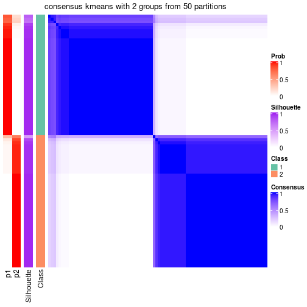</p>

</div>
<div id='tab-node-05-consensus-heatmap-2'>
<pre><code class="r">consensus_heatmap(res, k = 3)
</code></pre>

<p>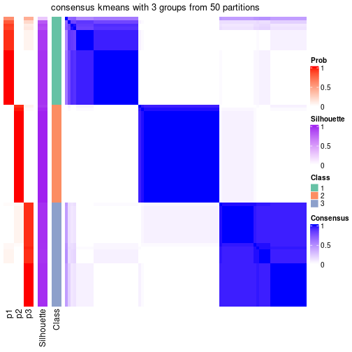</p>

</div>
<div id='tab-node-05-consensus-heatmap-3'>
<pre><code class="r">consensus_heatmap(res, k = 4)
</code></pre>

<p>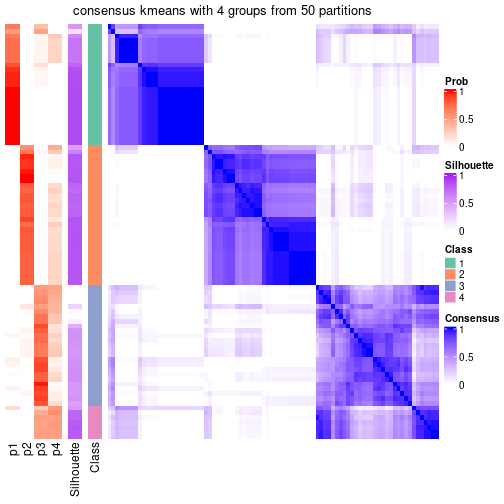</p>

</div>
<div id='tab-node-05-consensus-heatmap-4'>
<pre><code class="r">consensus_heatmap(res, k = 5)
</code></pre>

<p>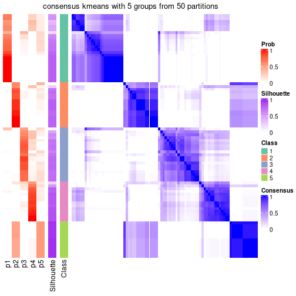</p>

</div>
<div id='tab-node-05-consensus-heatmap-5'>
<pre><code class="r">consensus_heatmap(res, k = 6)
</code></pre>

<p>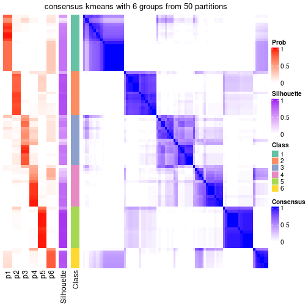</p>

</div>
<div id='tab-node-05-consensus-heatmap-6'>
<pre><code class="r">consensus_heatmap(res, k = 7)
</code></pre>

<p>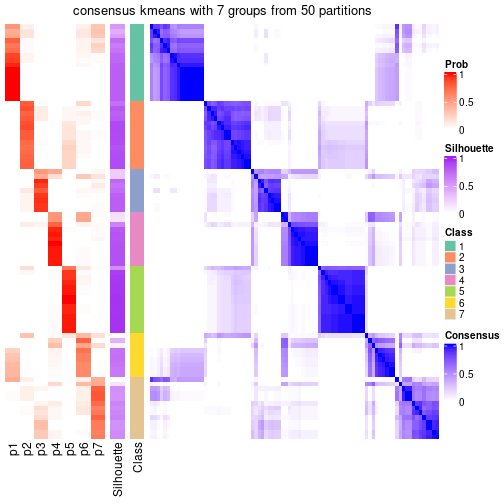</p>

</div>
<div id='tab-node-05-consensus-heatmap-7'>
<pre><code class="r">consensus_heatmap(res, k = 8)
</code></pre>

<p>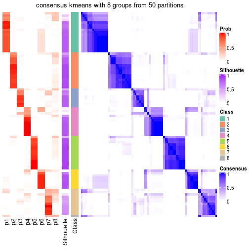</p>

</div>
</div>

Heatmaps for the membership of samples in all partitions to see how consistent they are:


<script>
$( function() {
	$( '#tabs-node-05-membership-heatmap' ).tabs();
} );
</script>
<div id='tabs-node-05-membership-heatmap'>
<ul>
<li><a href='#tab-node-05-membership-heatmap-1'>k = 2</a></li>
<li><a href='#tab-node-05-membership-heatmap-2'>k = 3</a></li>
<li><a href='#tab-node-05-membership-heatmap-3'>k = 4</a></li>
<li><a href='#tab-node-05-membership-heatmap-4'>k = 5</a></li>
<li><a href='#tab-node-05-membership-heatmap-5'>k = 6</a></li>
<li><a href='#tab-node-05-membership-heatmap-6'>k = 7</a></li>
<li><a href='#tab-node-05-membership-heatmap-7'>k = 8</a></li>
</ul>
<div id='tab-node-05-membership-heatmap-1'>
<pre><code class="r">membership_heatmap(res, k = 2)
</code></pre>

<p>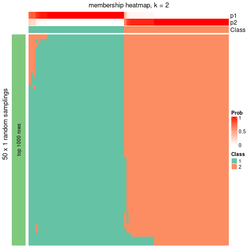</p>

</div>
<div id='tab-node-05-membership-heatmap-2'>
<pre><code class="r">membership_heatmap(res, k = 3)
</code></pre>

<p>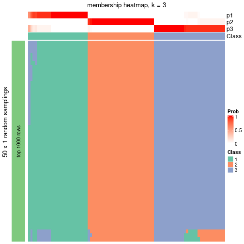</p>

</div>
<div id='tab-node-05-membership-heatmap-3'>
<pre><code class="r">membership_heatmap(res, k = 4)
</code></pre>

<p>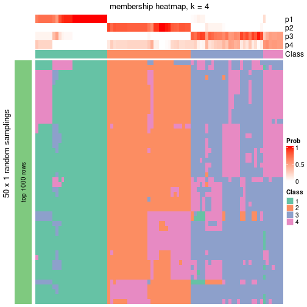</p>

</div>
<div id='tab-node-05-membership-heatmap-4'>
<pre><code class="r">membership_heatmap(res, k = 5)
</code></pre>

<p>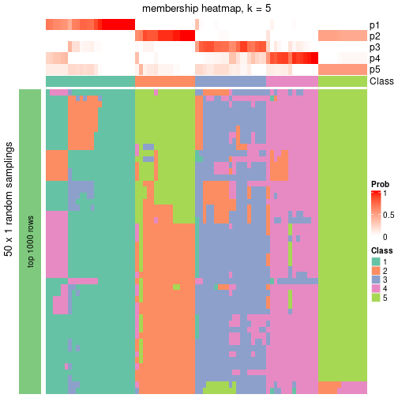</p>

</div>
<div id='tab-node-05-membership-heatmap-5'>
<pre><code class="r">membership_heatmap(res, k = 6)
</code></pre>

<p>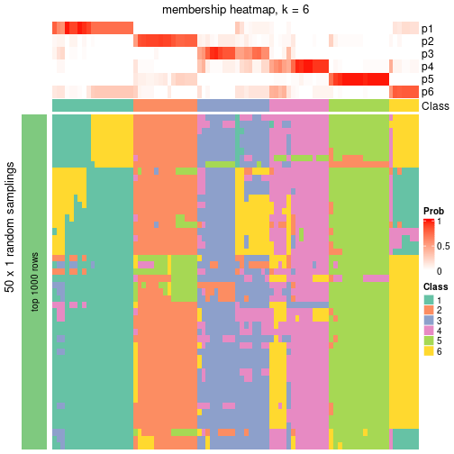</p>

</div>
<div id='tab-node-05-membership-heatmap-6'>
<pre><code class="r">membership_heatmap(res, k = 7)
</code></pre>

<p>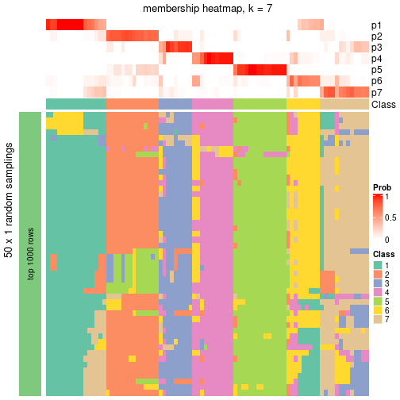</p>

</div>
<div id='tab-node-05-membership-heatmap-7'>
<pre><code class="r">membership_heatmap(res, k = 8)
</code></pre>

<p>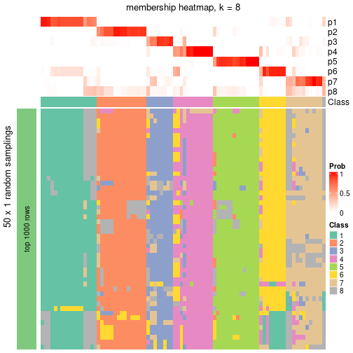</p>

</div>
</div>

As soon as the classes for columns are determined, the signatures
that are significantly different between subgroups can be looked for. 
Following are the heatmaps for signatures.


<script>
$( function() {
	$( '#tabs-node-05-get-signatures' ).tabs();
} );
</script>
<div id='tabs-node-05-get-signatures'>
<ul>
<li><a href='#tab-node-05-get-signatures-1'>k = 2</a></li>
<li><a href='#tab-node-05-get-signatures-2'>k = 3</a></li>
<li><a href='#tab-node-05-get-signatures-3'>k = 4</a></li>
<li><a href='#tab-node-05-get-signatures-4'>k = 5</a></li>
<li><a href='#tab-node-05-get-signatures-5'>k = 6</a></li>
<li><a href='#tab-node-05-get-signatures-6'>k = 7</a></li>
<li><a href='#tab-node-05-get-signatures-7'>k = 8</a></li>
</ul>
<div id='tab-node-05-get-signatures-1'>
<pre><code class="r">get_signatures(res, k = 2)
</code></pre>

<p>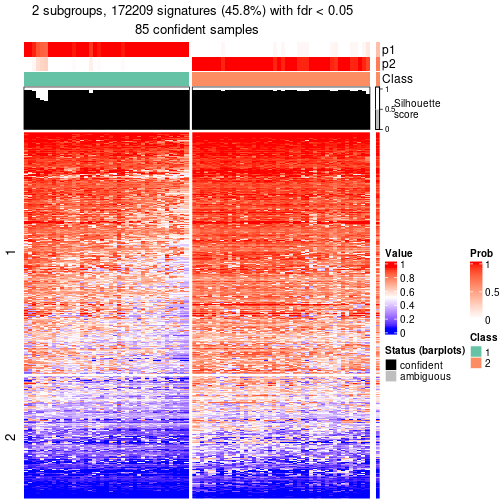</p>

</div>
<div id='tab-node-05-get-signatures-2'>
<pre><code class="r">get_signatures(res, k = 3)
</code></pre>

<p>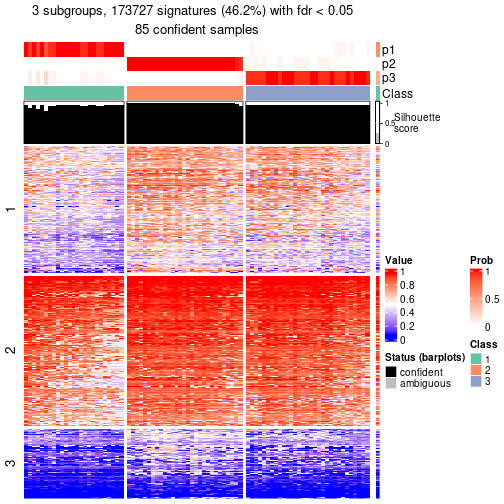</p>

</div>
<div id='tab-node-05-get-signatures-3'>
<pre><code class="r">get_signatures(res, k = 4)
</code></pre>

<p>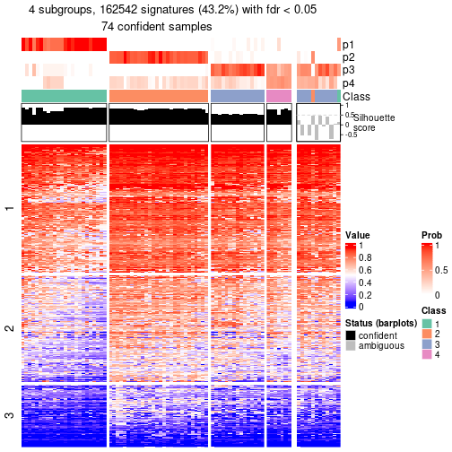</p>

</div>
<div id='tab-node-05-get-signatures-4'>
<pre><code class="r">get_signatures(res, k = 5)
</code></pre>

<p>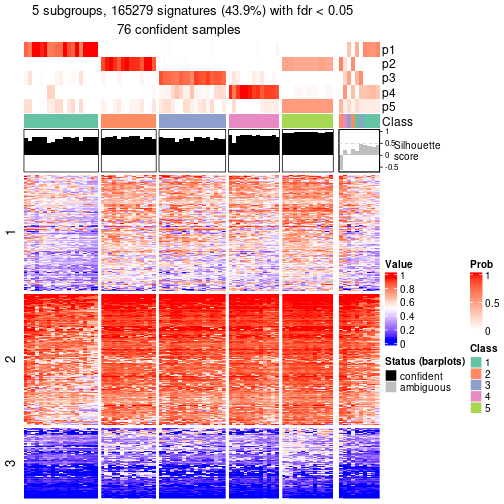</p>

</div>
<div id='tab-node-05-get-signatures-5'>
<pre><code class="r">get_signatures(res, k = 6)
</code></pre>

<p>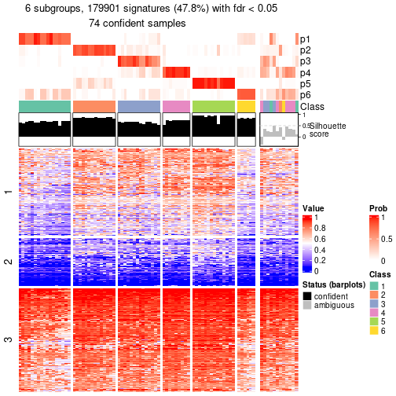</p>

</div>
<div id='tab-node-05-get-signatures-6'>
<pre><code class="r">get_signatures(res, k = 7)
</code></pre>

<p>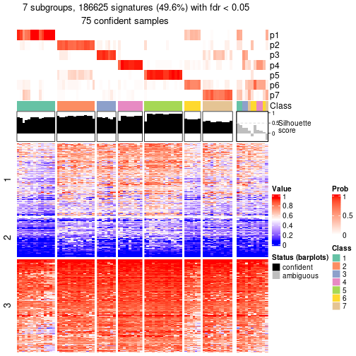</p>

</div>
<div id='tab-node-05-get-signatures-7'>
<pre><code class="r">get_signatures(res, k = 8)
</code></pre>

<p>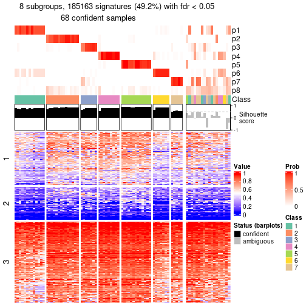</p>

</div>
</div>


Compare the overlap of signatures from different k:

```r
compare_signatures(res)
```

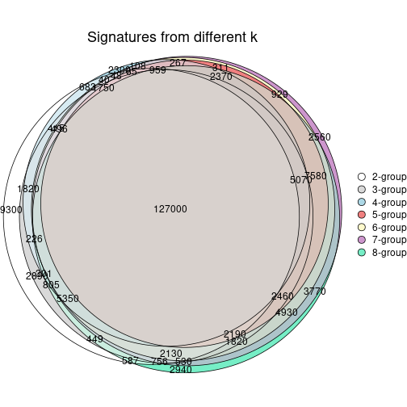

`get_signature()` returns a data frame invisibly. To get the list of signatures, the function
call should be assigned to a variable explicitly. In following code, if `plot` argument is set
to `FALSE`, no heatmap is plotted while only the differential analysis is performed.

```r
# code only for demonstration
tb = get_signature(res, k = ..., plot = FALSE)
```

An example of the output of `tb` is:

```
#>   which_row         fdr    mean_1    mean_2 scaled_mean_1 scaled_mean_2 km
#> 1        38 0.042760348  8.373488  9.131774    -0.5533452     0.5164555  1
#> 2        40 0.018707592  7.106213  8.469186    -0.6173731     0.5762149  1
#> 3        55 0.019134737 10.221463 11.207825    -0.6159697     0.5749050  1
#> 4        59 0.006059896  5.921854  7.869574    -0.6899429     0.6439467  1
#> 5        60 0.018055526  8.928898 10.211722    -0.6204761     0.5791110  1
#> 6        98 0.009384629 15.714769 14.887706     0.6635654    -0.6193277  2
...
```

The columns in `tb` are:

1. `which_row`: row indices corresponding to the input matrix.
2. `fdr`: FDR for the differential test. 
3. `mean_x`: The mean value in group x.
4. `scaled_mean_x`: The mean value in group x after rows are scaled.
5. `km`: Row groups if k-means clustering is applied to rows (which is done by automatically selecting number of clusters).

If there are too many signatures, `top_signatures = ...` can be set to only show the 
signatures with the highest FDRs:

```r
# code only for demonstration
# e.g. to show the top 500 most significant rows
tb = get_signature(res, k = ..., top_signatures = 500)
```

If the signatures are defined as these which are uniquely high in current group, `diff_method` argument
can be set to `"uniquely_high_in_one_group"`:

```r
# code only for demonstration
tb = get_signature(res, k = ..., diff_method = "uniquely_high_in_one_group")
```


UMAP plot which shows how samples are separated.


<script>
$( function() {
	$( '#tabs-node-05-dimension-reduction' ).tabs();
} );
</script>
<div id='tabs-node-05-dimension-reduction'>
<ul>
<li><a href='#tab-node-05-dimension-reduction-1'>k = 2</a></li>
<li><a href='#tab-node-05-dimension-reduction-2'>k = 3</a></li>
<li><a href='#tab-node-05-dimension-reduction-3'>k = 4</a></li>
<li><a href='#tab-node-05-dimension-reduction-4'>k = 5</a></li>
<li><a href='#tab-node-05-dimension-reduction-5'>k = 6</a></li>
<li><a href='#tab-node-05-dimension-reduction-6'>k = 7</a></li>
<li><a href='#tab-node-05-dimension-reduction-7'>k = 8</a></li>
</ul>
<div id='tab-node-05-dimension-reduction-1'>
<pre><code class="r">dimension_reduction(res, k = 2, method = &quot;UMAP&quot;)
</code></pre>

<p>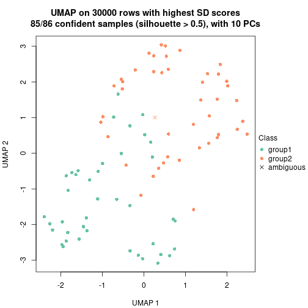</p>

</div>
<div id='tab-node-05-dimension-reduction-2'>
<pre><code class="r">dimension_reduction(res, k = 3, method = &quot;UMAP&quot;)
</code></pre>

<p>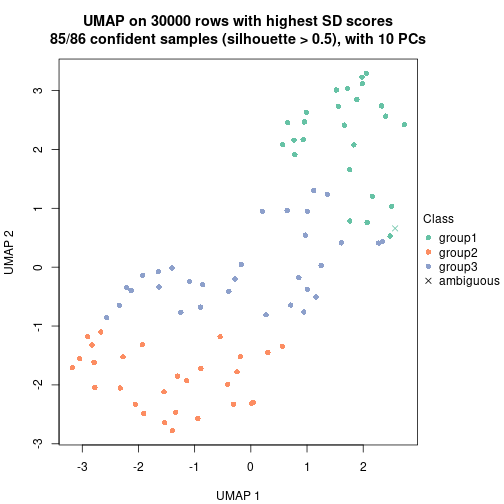</p>

</div>
<div id='tab-node-05-dimension-reduction-3'>
<pre><code class="r">dimension_reduction(res, k = 4, method = &quot;UMAP&quot;)
</code></pre>

<p>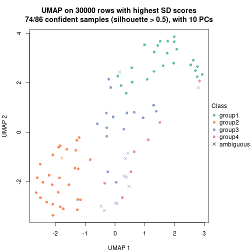</p>

</div>
<div id='tab-node-05-dimension-reduction-4'>
<pre><code class="r">dimension_reduction(res, k = 5, method = &quot;UMAP&quot;)
</code></pre>

<p>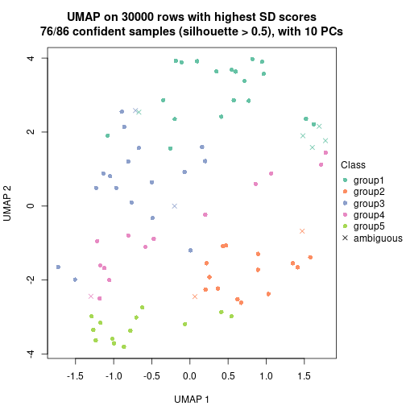</p>

</div>
<div id='tab-node-05-dimension-reduction-5'>
<pre><code class="r">dimension_reduction(res, k = 6, method = &quot;UMAP&quot;)
</code></pre>

<p>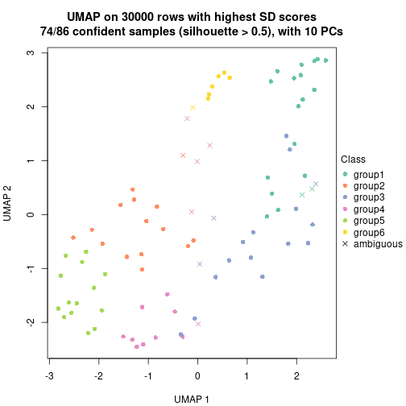</p>

</div>
<div id='tab-node-05-dimension-reduction-6'>
<pre><code class="r">dimension_reduction(res, k = 7, method = &quot;UMAP&quot;)
</code></pre>

<p>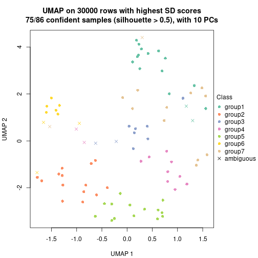</p>

</div>
<div id='tab-node-05-dimension-reduction-7'>
<pre><code class="r">dimension_reduction(res, k = 8, method = &quot;UMAP&quot;)
</code></pre>

<p>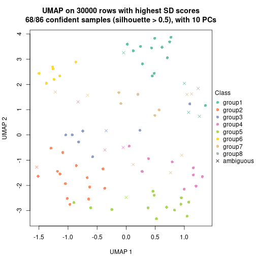</p>

</div>
</div>


Following heatmap shows how subgroups are split when increasing `k`:

```r
collect_classes(res)
```

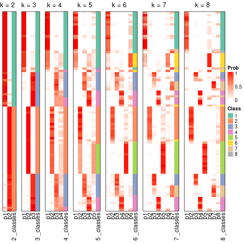


If matrix rows can be associated to genes, consider to use `functional_enrichment(res,
...)` to perform function enrichment for the signature genes. See [this vignette](https://jokergoo.github.io/cola_vignettes/functional_enrichment.html) for more detailed explanations.


 

---------------------------------------------------


### Node051


Parent node: [Node05](#Node05).
Child nodes: 
                Node0111-leaf
        ,
                Node0112-leaf
        ,
                Node0113-leaf
        ,
                Node0121-leaf
        ,
                Node0122-leaf
        ,
                Node0123-leaf
        ,
                Node0124-leaf
        ,
                Node0311-leaf
        ,
                Node0312-leaf
        ,
                Node0331-leaf
        ,
                Node0332-leaf
        ,
                Node0341-leaf
        ,
                Node0342-leaf
        ,
                Node0411-leaf
        ,
                [Node0412](#Node0412)
        ,
                Node0413-leaf
        ,
                Node0421-leaf
        ,
                Node0422-leaf
        ,
                Node0423-leaf
        ,
                Node0431-leaf
        ,
                [Node0432](#Node0432)
        ,
                Node0433-leaf
        ,
                Node0511-leaf
        ,
                Node0512-leaf
        ,
                Node0513-leaf
        ,
                [Node0521](#Node0521)
        ,
                Node0522-leaf
        ,
                Node0531-leaf
        ,
                Node0532-leaf
        ,
                Node0533-leaf
        .


The object with results only for a single top-value method and a single partitioning method 
can be extracted as:

```r
res = res_rh["051"]
```

A summary of `res` and all the functions that can be applied to it:

```r
res
```

```
#> A 'ConsensusPartition' object with k = 2, 3, 4, 5, 6, 7, 8.
#>   On a matrix with 30000 rows and 26 columns.
#>   Top rows (1000) are extracted by 'ATC' method.
#>   Subgroups are detected by 'kmeans' method.
#>   Performed in total 350 partitions by row resampling.
#>   Best k for subgroups seems to be 3.
#> 
#> Following methods can be applied to this 'ConsensusPartition' object:
#>  [1] "cola_report"             "collect_classes"         "collect_plots"          
#>  [4] "collect_stats"           "colnames"                "compare_partitions"     
#>  [7] "compare_signatures"      "consensus_heatmap"       "dimension_reduction"    
#> [10] "functional_enrichment"   "get_anno_col"            "get_anno"               
#> [13] "get_classes"             "get_consensus"           "get_matrix"             
#> [16] "get_membership"          "get_param"               "get_signatures"         
#> [19] "get_stats"               "is_best_k"               "is_stable_k"            
#> [22] "membership_heatmap"      "ncol"                    "nrow"                   
#> [25] "plot_ecdf"               "predict_classes"         "rownames"               
#> [28] "select_partition_number" "show"                    "suggest_best_k"         
#> [31] "test_to_known_factors"   "top_rows_heatmap"
```

`collect_plots()` function collects all the plots made from `res` for all `k` (number of subgroups)
into one single page to provide an easy and fast comparison between different `k`.

```r
collect_plots(res)
```


The plots are:

- The first row: a plot of the eCDF (empirical cumulative distribution
  function) curves of the consensus matrix for each `k` and the heatmap of
  predicted classes for each `k`.
- The second row: heatmaps of the consensus matrix for each `k`.
- The third row: heatmaps of the membership matrix for each `k`.
- The fouth row: heatmaps of the signatures for each `k`.

All the plots in panels can be made by individual functions and they are
plotted later in this section.

`select_partition_number()` produces several plots showing different
statistics for choosing "optimized" `k`. There are following statistics:

- eCDF curves of the consensus matrix for each `k`;
- 1-PAC. [The PAC score](https://en.wikipedia.org/wiki/Consensus_clustering#Over-interpretation_potential_of_consensus_clustering)
  measures the proportion of the ambiguous subgrouping.
- Mean silhouette score.
- Concordance. The mean probability of fiting the consensus subgroup labels in all
  partitions.
- Area increased. Denote $A_k$ as the area under the eCDF curve for current
  `k`, the area increased is defined as $A_k - A_{k-1}$.
- Rand index. The percent of pairs of samples that are both in a same cluster
  or both are not in a same cluster in the partition of k and k-1.
- Jaccard index. The ratio of pairs of samples are both in a same cluster in
  the partition of k and k-1 and the pairs of samples are both in a same
  cluster in the partition k or k-1.

The detailed explanations of these statistics can be found in [the _cola_
vignette](https://jokergoo.github.io/cola_vignettes/cola.html#toc_13).

Generally speaking, higher 1-PAC score, higher mean silhouette score or higher
concordance corresponds to better partition. Rand index and Jaccard index
measure how similar the current partition is compared to partition with `k-1`.
If they are too similar, we won't accept `k` is better than `k-1`.

```r
select_partition_number(res)
```

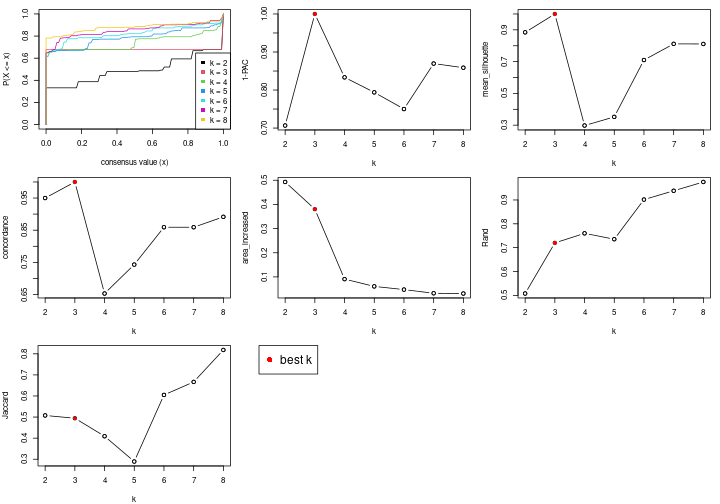

The numeric values for all these statistics can be obtained by `get_stats()`.

```r
get_stats(res)
```

```
#>   k 1-PAC mean_silhouette concordance area_increased  Rand Jaccard
#> 2 2 0.707           0.884       0.950         0.4928 0.508   0.508
#> 3 3 1.000           1.000       1.000         0.3804 0.720   0.494
#> 4 4 0.833           0.298       0.653         0.0909 0.760   0.409
#> 5 5 0.794           0.352       0.743         0.0608 0.735   0.289
#> 6 6 0.750           0.710       0.859         0.0476 0.902   0.605
#> 7 7 0.870           0.812       0.859         0.0323 0.938   0.667
#> 8 8 0.859           0.811       0.892         0.0313 0.975   0.818
```

`suggest_best_k()` suggests the best $k$ based on these statistics. The rules are as follows:

- All $k$ with Jaccard index larger than 0.95 are removed because increasing
  $k$ does not provide enough extra information. If all $k$ are removed, it is
  marked as no subgroup is detected.
- For all $k$ with 1-PAC score larger than 0.9, the maximal $k$ is taken as
  the best $k$, and other $k$ are marked as optional $k$.
- If it does not fit the second rule. The $k$ with the maximal vote of the
  highest 1-PAC score, highest mean silhouette, and highest concordance is
  taken as the best $k$.

```r
suggest_best_k(res)
```

```
#> [1] 3
```


Following is the table of the partitions (You need to click the **show/hide
code output** link to see it). The membership matrix (columns with name `p*`)
is inferred by
[`clue::cl_consensus()`](https://www.rdocumentation.org/link/cl_consensus?package=clue)
function with the `SE` method. Basically the value in the membership matrix
represents the probability to belong to a certain group. The finall subgroup
label for an item is determined with the group with highest probability it
belongs to.

In `get_classes()` function, the entropy is calculated from the membership
matrix and the silhouette score is calculated from the consensus matrix.


<script>
$( function() {
	$( '#tabs-node-051-get-classes' ).tabs();
} );
</script>
<div id='tabs-node-051-get-classes'>
<ul>
<li><a href='#tab-node-051-get-classes-1'>k = 2</a></li>
<li><a href='#tab-node-051-get-classes-2'>k = 3</a></li>
<li><a href='#tab-node-051-get-classes-3'>k = 4</a></li>
<li><a href='#tab-node-051-get-classes-4'>k = 5</a></li>
<li><a href='#tab-node-051-get-classes-5'>k = 6</a></li>
<li><a href='#tab-node-051-get-classes-6'>k = 7</a></li>
<li><a href='#tab-node-051-get-classes-7'>k = 8</a></li>
</ul>

<div id='tab-node-051-get-classes-1'>
<p><a id='tab-node-051-get-classes-1-a' style='color:#0366d6' href='#'>show/hide code output</a></p>
<pre><code class="r">cbind(get_classes(res, k = 2), get_membership(res, k = 2))
</code></pre>

<pre><code>#&gt;                 class entropy silhouette   p1   p2
#&gt; TCGA.63.7020.01     2   0.000      0.957 0.00 1.00
#&gt; TCGA.6A.AB49.01     2   0.000      0.957 0.00 1.00
#&gt; TCGA.79.5596.01     1   0.000      0.930 1.00 0.00
#&gt; TCGA.63.5131.01     1   0.000      0.930 1.00 0.00
#&gt; TCGA.22.4613.01     1   0.000      0.930 1.00 0.00
#&gt; TCGA.77.8154.01     1   0.000      0.930 1.00 0.00
#&gt; TCGA.77.6844.01     1   0.000      0.930 1.00 0.00
#&gt; TCGA.33.AAS8.01     2   0.000      0.957 0.00 1.00
#&gt; TCGA.33.4582.01     2   0.000      0.957 0.00 1.00
#&gt; TCGA.33.4579.01     2   0.000      0.957 0.00 1.00
#&gt; TCGA.33.4587.01     2   0.000      0.957 0.00 1.00
#&gt; TCGA.52.7810.01     2   0.000      0.957 0.00 1.00
#&gt; TCGA.90.7766.01     1   0.000      0.930 1.00 0.00
#&gt; TCGA.43.A474.01     1   0.000      0.930 1.00 0.00
#&gt; TCGA.94.7943.01     2   0.000      0.957 0.00 1.00
#&gt; TCGA.56.7222.01     1   0.000      0.930 1.00 0.00
#&gt; TCGA.56.7579.01     1   0.000      0.930 1.00 0.00
#&gt; TCGA.90.7964.01     2   0.000      0.957 0.00 1.00
#&gt; TCGA.63.A5MI.01     1   0.680      0.788 0.82 0.18
#&gt; TCGA.56.7221.01     1   0.000      0.930 1.00 0.00
#&gt; TCGA.37.A5EM.01     2   0.925      0.396 0.34 0.66
#&gt; TCGA.NC.A5HI.01     1   0.680      0.788 0.82 0.18
#&gt; TCGA.34.5927.01     1   0.000      0.930 1.00 0.00
#&gt; TCGA.43.6770.01     1   0.881      0.622 0.70 0.30
#&gt; TCGA.39.5027.01     1   0.881      0.622 0.70 0.30
#&gt; TCGA.34.5929.01     1   0.000      0.930 1.00 0.00
</code></pre>

<script>
$('#tab-node-051-get-classes-1-a').parent().next().next().hide();
$('#tab-node-051-get-classes-1-a').click(function(){
  $('#tab-node-051-get-classes-1-a').parent().next().next().toggle();
  return(false);
});
</script>
</div>

<div id='tab-node-051-get-classes-2'>
<p><a id='tab-node-051-get-classes-2-a' style='color:#0366d6' href='#'>show/hide code output</a></p>
<pre><code class="r">cbind(get_classes(res, k = 3), get_membership(res, k = 3))
</code></pre>

<pre><code>#&gt;                 class entropy silhouette p1 p2 p3
#&gt; TCGA.63.7020.01     3       0          1  0  0  1
#&gt; TCGA.6A.AB49.01     2       0          1  0  1  0
#&gt; TCGA.79.5596.01     1       0          1  1  0  0
#&gt; TCGA.63.5131.01     1       0          1  1  0  0
#&gt; TCGA.22.4613.01     3       0          1  0  0  1
#&gt; TCGA.77.8154.01     1       0          1  1  0  0
#&gt; TCGA.77.6844.01     1       0          1  1  0  0
#&gt; TCGA.33.AAS8.01     2       0          1  0  1  0
#&gt; TCGA.33.4582.01     2       0          1  0  1  0
#&gt; TCGA.33.4579.01     2       0          1  0  1  0
#&gt; TCGA.33.4587.01     3       0          1  0  0  1
#&gt; TCGA.52.7810.01     2       0          1  0  1  0
#&gt; TCGA.90.7766.01     1       0          1  1  0  0
#&gt; TCGA.43.A474.01     1       0          1  1  0  0
#&gt; TCGA.94.7943.01     2       0          1  0  1  0
#&gt; TCGA.56.7222.01     1       0          1  1  0  0
#&gt; TCGA.56.7579.01     1       0          1  1  0  0
#&gt; TCGA.90.7964.01     2       0          1  0  1  0
#&gt; TCGA.63.A5MI.01     3       0          1  0  0  1
#&gt; TCGA.56.7221.01     1       0          1  1  0  0
#&gt; TCGA.37.A5EM.01     3       0          1  0  0  1
#&gt; TCGA.NC.A5HI.01     3       0          1  0  0  1
#&gt; TCGA.34.5927.01     1       0          1  1  0  0
#&gt; TCGA.43.6770.01     3       0          1  0  0  1
#&gt; TCGA.39.5027.01     3       0          1  0  0  1
#&gt; TCGA.34.5929.01     1       0          1  1  0  0
</code></pre>

<script>
$('#tab-node-051-get-classes-2-a').parent().next().next().hide();
$('#tab-node-051-get-classes-2-a').click(function(){
  $('#tab-node-051-get-classes-2-a').parent().next().next().toggle();
  return(false);
});
</script>
</div>

<div id='tab-node-051-get-classes-3'>
<p><a id='tab-node-051-get-classes-3-a' style='color:#0366d6' href='#'>show/hide code output</a></p>
<pre><code class="r">cbind(get_classes(res, k = 4), get_membership(res, k = 4))
</code></pre>

<pre><code>#&gt;                 class entropy silhouette   p1   p2   p3   p4
#&gt; TCGA.63.7020.01     3  0.2921     0.8555 0.00 0.00 0.86 0.14
#&gt; TCGA.6A.AB49.01     1  0.5000    -0.4055 0.50 0.50 0.00 0.00
#&gt; TCGA.79.5596.01     1  0.6211     0.0848 0.48 0.48 0.02 0.02
#&gt; TCGA.63.5131.01     2  0.5000    -0.5273 0.50 0.50 0.00 0.00
#&gt; TCGA.22.4613.01     3  0.0707     0.9331 0.00 0.00 0.98 0.02
#&gt; TCGA.77.8154.01     1  0.5000     0.0752 0.50 0.50 0.00 0.00
#&gt; TCGA.77.6844.01     2  0.5000    -0.5273 0.50 0.50 0.00 0.00
#&gt; TCGA.33.AAS8.01     2  0.8183     0.2352 0.32 0.50 0.06 0.12
#&gt; TCGA.33.4582.01     2  0.6988     0.2458 0.38 0.50 0.00 0.12
#&gt; TCGA.33.4579.01     2  0.5000     0.1974 0.50 0.50 0.00 0.00
#&gt; TCGA.33.4587.01     3  0.4790     0.6922 0.00 0.00 0.62 0.38
#&gt; TCGA.52.7810.01     2  0.6988     0.2458 0.38 0.50 0.00 0.12
#&gt; TCGA.90.7766.01     1  0.5606     0.1033 0.50 0.48 0.02 0.00
#&gt; TCGA.43.A474.01     4  0.5000     1.0000 0.00 0.50 0.00 0.50
#&gt; TCGA.94.7943.01     1  0.5000    -0.4055 0.50 0.50 0.00 0.00
#&gt; TCGA.56.7222.01     2  0.5000    -1.0000 0.00 0.50 0.00 0.50
#&gt; TCGA.56.7579.01     1  0.6211     0.0848 0.48 0.48 0.02 0.02
#&gt; TCGA.90.7964.01     2  0.5000     0.1974 0.50 0.50 0.00 0.00
#&gt; TCGA.63.A5MI.01     3  0.1211     0.9306 0.00 0.00 0.96 0.04
#&gt; TCGA.56.7221.01     4  0.5000     1.0000 0.00 0.50 0.00 0.50
#&gt; TCGA.37.A5EM.01     3  0.0707     0.9308 0.00 0.00 0.98 0.02
#&gt; TCGA.NC.A5HI.01     3  0.0707     0.9331 0.00 0.00 0.98 0.02
#&gt; TCGA.34.5927.01     4  0.5000     1.0000 0.00 0.50 0.00 0.50
#&gt; TCGA.43.6770.01     3  0.0000     0.9332 0.00 0.00 1.00 0.00
#&gt; TCGA.39.5027.01     3  0.0000     0.9332 0.00 0.00 1.00 0.00
#&gt; TCGA.34.5929.01     2  0.5000    -1.0000 0.00 0.50 0.00 0.50
</code></pre>

<script>
$('#tab-node-051-get-classes-3-a').parent().next().next().hide();
$('#tab-node-051-get-classes-3-a').click(function(){
  $('#tab-node-051-get-classes-3-a').parent().next().next().toggle();
  return(false);
});
</script>
</div>

<div id='tab-node-051-get-classes-4'>
<p><a id='tab-node-051-get-classes-4-a' style='color:#0366d6' href='#'>show/hide code output</a></p>
<pre><code class="r">cbind(get_classes(res, k = 5), get_membership(res, k = 5))
</code></pre>

<pre><code>#&gt;                 class entropy silhouette   p1   p2   p3   p4   p5
#&gt; TCGA.63.7020.01     5  0.3796      0.295 0.00 0.00 0.30 0.00 0.70
#&gt; TCGA.6A.AB49.01     2  0.0000      0.875 0.00 1.00 0.00 0.00 0.00
#&gt; TCGA.79.5596.01     1  0.4182      0.623 0.60 0.00 0.00 0.40 0.00
#&gt; TCGA.63.5131.01     1  0.0000      0.825 1.00 0.00 0.00 0.00 0.00
#&gt; TCGA.22.4613.01     3  0.4182     -0.144 0.00 0.00 0.60 0.00 0.40
#&gt; TCGA.77.8154.01     1  0.0000      0.825 1.00 0.00 0.00 0.00 0.00
#&gt; TCGA.77.6844.01     1  0.0000      0.825 1.00 0.00 0.00 0.00 0.00
#&gt; TCGA.33.AAS8.01     2  0.4644      0.754 0.00 0.68 0.04 0.00 0.28
#&gt; TCGA.33.4582.01     2  0.3424      0.819 0.00 0.76 0.00 0.00 0.24
#&gt; TCGA.33.4579.01     2  0.0000      0.875 0.00 1.00 0.00 0.00 0.00
#&gt; TCGA.33.4587.01     5  0.4398      0.398 0.00 0.00 0.04 0.24 0.72
#&gt; TCGA.52.7810.01     2  0.3424      0.819 0.00 0.76 0.00 0.00 0.24
#&gt; TCGA.90.7766.01     1  0.0609      0.813 0.98 0.00 0.02 0.00 0.00
#&gt; TCGA.43.A474.01     4  0.6697      1.000 0.24 0.00 0.38 0.38 0.00
#&gt; TCGA.94.7943.01     2  0.0000      0.875 0.00 1.00 0.00 0.00 0.00
#&gt; TCGA.56.7222.01     4  0.6697      1.000 0.24 0.00 0.38 0.38 0.00
#&gt; TCGA.56.7579.01     1  0.4182      0.623 0.60 0.00 0.00 0.40 0.00
#&gt; TCGA.90.7964.01     2  0.0000      0.875 0.00 1.00 0.00 0.00 0.00
#&gt; TCGA.63.A5MI.01     3  0.4262     -0.188 0.00 0.00 0.56 0.00 0.44
#&gt; TCGA.56.7221.01     3  0.6697     -1.000 0.24 0.00 0.38 0.38 0.00
#&gt; TCGA.37.A5EM.01     3  0.4227     -0.175 0.00 0.00 0.58 0.00 0.42
#&gt; TCGA.NC.A5HI.01     3  0.4227     -0.159 0.00 0.00 0.58 0.00 0.42
#&gt; TCGA.34.5927.01     3  0.6697     -1.000 0.24 0.00 0.38 0.38 0.00
#&gt; TCGA.43.6770.01     3  0.4182     -0.146 0.00 0.00 0.60 0.00 0.40
#&gt; TCGA.39.5027.01     3  0.4182     -0.146 0.00 0.00 0.60 0.00 0.40
#&gt; TCGA.34.5929.01     3  0.6697     -1.000 0.24 0.00 0.38 0.38 0.00
</code></pre>

<script>
$('#tab-node-051-get-classes-4-a').parent().next().next().hide();
$('#tab-node-051-get-classes-4-a').click(function(){
  $('#tab-node-051-get-classes-4-a').parent().next().next().toggle();
  return(false);
});
</script>
</div>

<div id='tab-node-051-get-classes-5'>
<p><a id='tab-node-051-get-classes-5-a' style='color:#0366d6' href='#'>show/hide code output</a></p>
<pre><code class="r">cbind(get_classes(res, k = 6), get_membership(res, k = 6))
</code></pre>

<pre><code>#&gt;                 class entropy silhouette   p1   p2   p3   p4   p5   p6
#&gt; TCGA.63.7020.01     5  0.4282      0.296 0.00 0.00 0.42 0.00 0.56 0.02
#&gt; TCGA.6A.AB49.01     2  0.0000      0.757 0.00 1.00 0.00 0.00 0.00 0.00
#&gt; TCGA.79.5596.01     1  0.2048      0.637 0.88 0.00 0.00 0.12 0.00 0.00
#&gt; TCGA.63.5131.01     1  0.5672      0.832 0.52 0.00 0.00 0.10 0.36 0.02
#&gt; TCGA.22.4613.01     3  0.2474      0.853 0.00 0.00 0.88 0.00 0.08 0.04
#&gt; TCGA.77.8154.01     1  0.5672      0.832 0.52 0.00 0.00 0.10 0.36 0.02
#&gt; TCGA.77.6844.01     1  0.5235      0.832 0.52 0.00 0.00 0.10 0.38 0.00
#&gt; TCGA.33.AAS8.01     5  0.6470      0.163 0.04 0.32 0.18 0.00 0.46 0.00
#&gt; TCGA.33.4582.01     2  0.3851      0.144 0.00 0.54 0.00 0.00 0.46 0.00
#&gt; TCGA.33.4579.01     2  0.0000      0.757 0.00 1.00 0.00 0.00 0.00 0.00
#&gt; TCGA.33.4587.01     6  0.0547      0.000 0.00 0.00 0.02 0.00 0.00 0.98
#&gt; TCGA.52.7810.01     2  0.3828      0.195 0.00 0.56 0.00 0.00 0.44 0.00
#&gt; TCGA.90.7766.01     1  0.5235      0.832 0.52 0.00 0.00 0.10 0.38 0.00
#&gt; TCGA.43.A474.01     4  0.0000      1.000 0.00 0.00 0.00 1.00 0.00 0.00
#&gt; TCGA.94.7943.01     2  0.0000      0.757 0.00 1.00 0.00 0.00 0.00 0.00
#&gt; TCGA.56.7222.01     4  0.0000      1.000 0.00 0.00 0.00 1.00 0.00 0.00
#&gt; TCGA.56.7579.01     1  0.2048      0.637 0.88 0.00 0.00 0.12 0.00 0.00
#&gt; TCGA.90.7964.01     2  0.0000      0.757 0.00 1.00 0.00 0.00 0.00 0.00
#&gt; TCGA.63.A5MI.01     3  0.4841      0.755 0.06 0.00 0.72 0.00 0.16 0.06
#&gt; TCGA.56.7221.01     4  0.0000      1.000 0.00 0.00 0.00 1.00 0.00 0.00
#&gt; TCGA.37.A5EM.01     3  0.0000      0.865 0.00 0.00 1.00 0.00 0.00 0.00
#&gt; TCGA.NC.A5HI.01     3  0.3631      0.833 0.04 0.00 0.82 0.00 0.10 0.04
#&gt; TCGA.34.5927.01     4  0.0000      1.000 0.00 0.00 0.00 1.00 0.00 0.00
#&gt; TCGA.43.6770.01     3  0.0000      0.865 0.00 0.00 1.00 0.00 0.00 0.00
#&gt; TCGA.39.5027.01     3  0.0000      0.865 0.00 0.00 1.00 0.00 0.00 0.00
#&gt; TCGA.34.5929.01     4  0.0000      1.000 0.00 0.00 0.00 1.00 0.00 0.00
</code></pre>

<script>
$('#tab-node-051-get-classes-5-a').parent().next().next().hide();
$('#tab-node-051-get-classes-5-a').click(function(){
  $('#tab-node-051-get-classes-5-a').parent().next().next().toggle();
  return(false);
});
</script>
</div>

<div id='tab-node-051-get-classes-6'>
<p><a id='tab-node-051-get-classes-6-a' style='color:#0366d6' href='#'>show/hide code output</a></p>
<pre><code class="r">cbind(get_classes(res, k = 7), get_membership(res, k = 7))
</code></pre>

<pre><code>#&gt;                 class entropy silhouette   p1   p2   p3   p4   p5   p6   p7
#&gt; TCGA.63.7020.01     5  0.2864      0.494 0.02 0.00 0.12 0.00 0.84 0.00 0.02
#&gt; TCGA.6A.AB49.01     2  0.0000      0.992 0.00 1.00 0.00 0.00 0.00 0.00 0.00
#&gt; TCGA.79.5596.01     7  0.4669      1.000 0.40 0.00 0.00 0.08 0.00 0.00 0.52
#&gt; TCGA.63.5131.01     1  0.3494      0.839 0.80 0.00 0.00 0.06 0.12 0.02 0.00
#&gt; TCGA.22.4613.01     3  0.2832      0.805 0.00 0.00 0.76 0.00 0.00 0.00 0.24
#&gt; TCGA.77.8154.01     1  0.3494      0.839 0.80 0.00 0.00 0.06 0.12 0.02 0.00
#&gt; TCGA.77.6844.01     1  0.1166      0.827 0.94 0.00 0.00 0.06 0.00 0.00 0.00
#&gt; TCGA.33.AAS8.01     5  0.5273      0.599 0.02 0.14 0.02 0.00 0.64 0.00 0.18
#&gt; TCGA.33.4582.01     5  0.3221      0.684 0.00 0.32 0.00 0.00 0.68 0.00 0.00
#&gt; TCGA.33.4579.01     2  0.0000      0.992 0.00 1.00 0.00 0.00 0.00 0.00 0.00
#&gt; TCGA.33.4587.01     6  0.1433      0.000 0.00 0.00 0.08 0.00 0.00 0.92 0.00
#&gt; TCGA.52.7810.01     5  0.3221      0.684 0.00 0.32 0.00 0.00 0.68 0.00 0.00
#&gt; TCGA.90.7766.01     1  0.1363      0.812 0.94 0.00 0.02 0.04 0.00 0.00 0.00
#&gt; TCGA.43.A474.01     4  0.0000      0.981 0.00 0.00 0.00 1.00 0.00 0.00 0.00
#&gt; TCGA.94.7943.01     2  0.0000      0.992 0.00 1.00 0.00 0.00 0.00 0.00 0.00
#&gt; TCGA.56.7222.01     4  0.1664      0.922 0.00 0.00 0.00 0.92 0.00 0.06 0.02
#&gt; TCGA.56.7579.01     7  0.4669      1.000 0.40 0.00 0.00 0.08 0.00 0.00 0.52
#&gt; TCGA.90.7964.01     2  0.0504      0.976 0.00 0.98 0.00 0.00 0.02 0.00 0.00
#&gt; TCGA.63.A5MI.01     3  0.2213      0.601 0.04 0.00 0.90 0.00 0.04 0.00 0.02
#&gt; TCGA.56.7221.01     4  0.0000      0.981 0.00 0.00 0.00 1.00 0.00 0.00 0.00
#&gt; TCGA.37.A5EM.01     3  0.4248      0.808 0.00 0.00 0.66 0.00 0.08 0.00 0.26
#&gt; TCGA.NC.A5HI.01     3  0.0504      0.675 0.00 0.00 0.98 0.00 0.02 0.00 0.00
#&gt; TCGA.34.5927.01     4  0.0000      0.981 0.00 0.00 0.00 1.00 0.00 0.00 0.00
#&gt; TCGA.43.6770.01     3  0.4015      0.820 0.00 0.00 0.68 0.00 0.06 0.00 0.26
#&gt; TCGA.39.5027.01     3  0.4015      0.820 0.00 0.00 0.68 0.00 0.06 0.00 0.26
#&gt; TCGA.34.5929.01     4  0.0000      0.981 0.00 0.00 0.00 1.00 0.00 0.00 0.00
</code></pre>

<script>
$('#tab-node-051-get-classes-6-a').parent().next().next().hide();
$('#tab-node-051-get-classes-6-a').click(function(){
  $('#tab-node-051-get-classes-6-a').parent().next().next().toggle();
  return(false);
});
</script>
</div>

<div id='tab-node-051-get-classes-7'>
<p><a id='tab-node-051-get-classes-7-a' style='color:#0366d6' href='#'>show/hide code output</a></p>
<pre><code class="r">cbind(get_classes(res, k = 8), get_membership(res, k = 8))
</code></pre>

<pre><code>#&gt;                 class entropy silhouette   p1   p2   p3   p4   p5 p6   p7   p8
#&gt; TCGA.63.7020.01     5  0.4443      0.526 0.00 0.00 0.10 0.00 0.70  0 0.06 0.14
#&gt; TCGA.6A.AB49.01     2  0.0000      1.000 0.00 1.00 0.00 0.00 0.00  0 0.00 0.00
#&gt; TCGA.79.5596.01     7  0.2114      1.000 0.16 0.00 0.00 0.00 0.00  0 0.84 0.00
#&gt; TCGA.63.5131.01     1  0.0000      0.871 1.00 0.00 0.00 0.00 0.00  0 0.00 0.00
#&gt; TCGA.22.4613.01     3  0.1563      0.748 0.00 0.00 0.90 0.00 0.00  0 0.00 0.10
#&gt; TCGA.77.8154.01     1  0.0000      0.871 1.00 0.00 0.00 0.00 0.00  0 0.00 0.00
#&gt; TCGA.77.6844.01     1  0.2862      0.868 0.82 0.00 0.00 0.00 0.10  0 0.00 0.08
#&gt; TCGA.33.AAS8.01     5  0.5431      0.534 0.00 0.04 0.10 0.00 0.64  0 0.10 0.12
#&gt; TCGA.33.4582.01     5  0.2852      0.675 0.00 0.28 0.00 0.00 0.72  0 0.00 0.00
#&gt; TCGA.33.4579.01     2  0.0000      1.000 0.00 1.00 0.00 0.00 0.00  0 0.00 0.00
#&gt; TCGA.33.4587.01     6  0.0000      0.000 0.00 0.00 0.00 0.00 0.00  1 0.00 0.00
#&gt; TCGA.52.7810.01     5  0.2852      0.675 0.00 0.28 0.00 0.00 0.72  0 0.00 0.00
#&gt; TCGA.90.7766.01     1  0.3054      0.859 0.80 0.00 0.00 0.00 0.12  0 0.00 0.08
#&gt; TCGA.43.A474.01     4  0.0000      0.995 0.00 0.00 0.00 1.00 0.00  0 0.00 0.00
#&gt; TCGA.94.7943.01     2  0.0000      1.000 0.00 1.00 0.00 0.00 0.00  0 0.00 0.00
#&gt; TCGA.56.7222.01     4  0.0471      0.981 0.00 0.00 0.00 0.98 0.02  0 0.00 0.00
#&gt; TCGA.56.7579.01     7  0.2114      1.000 0.16 0.00 0.00 0.00 0.00  0 0.84 0.00
#&gt; TCGA.90.7964.01     2  0.0000      1.000 0.00 1.00 0.00 0.00 0.00  0 0.00 0.00
#&gt; TCGA.63.A5MI.01     8  0.2406      0.558 0.00 0.00 0.20 0.00 0.00  0 0.00 0.80
#&gt; TCGA.56.7221.01     4  0.0000      0.995 0.00 0.00 0.00 1.00 0.00  0 0.00 0.00
#&gt; TCGA.37.A5EM.01     3  0.1741      0.816 0.00 0.00 0.92 0.00 0.04  0 0.02 0.02
#&gt; TCGA.NC.A5HI.01     8  0.3333      0.350 0.00 0.00 0.50 0.00 0.00  0 0.00 0.50
#&gt; TCGA.34.5927.01     4  0.0000      0.995 0.00 0.00 0.00 1.00 0.00  0 0.00 0.00
#&gt; TCGA.43.6770.01     3  0.0000      0.889 0.00 0.00 1.00 0.00 0.00  0 0.00 0.00
#&gt; TCGA.39.5027.01     3  0.0000      0.889 0.00 0.00 1.00 0.00 0.00  0 0.00 0.00
#&gt; TCGA.34.5929.01     4  0.0000      0.995 0.00 0.00 0.00 1.00 0.00  0 0.00 0.00
</code></pre>

<script>
$('#tab-node-051-get-classes-7-a').parent().next().next().hide();
$('#tab-node-051-get-classes-7-a').click(function(){
  $('#tab-node-051-get-classes-7-a').parent().next().next().toggle();
  return(false);
});
</script>
</div>
</div>

Heatmaps for the consensus matrix. It visualizes the probability of two
samples to be in a same group.


<script>
$( function() {
	$( '#tabs-node-051-consensus-heatmap' ).tabs();
} );
</script>
<div id='tabs-node-051-consensus-heatmap'>
<ul>
<li><a href='#tab-node-051-consensus-heatmap-1'>k = 2</a></li>
<li><a href='#tab-node-051-consensus-heatmap-2'>k = 3</a></li>
<li><a href='#tab-node-051-consensus-heatmap-3'>k = 4</a></li>
<li><a href='#tab-node-051-consensus-heatmap-4'>k = 5</a></li>
<li><a href='#tab-node-051-consensus-heatmap-5'>k = 6</a></li>
<li><a href='#tab-node-051-consensus-heatmap-6'>k = 7</a></li>
<li><a href='#tab-node-051-consensus-heatmap-7'>k = 8</a></li>
</ul>
<div id='tab-node-051-consensus-heatmap-1'>
<pre><code class="r">consensus_heatmap(res, k = 2)
</code></pre>

<p>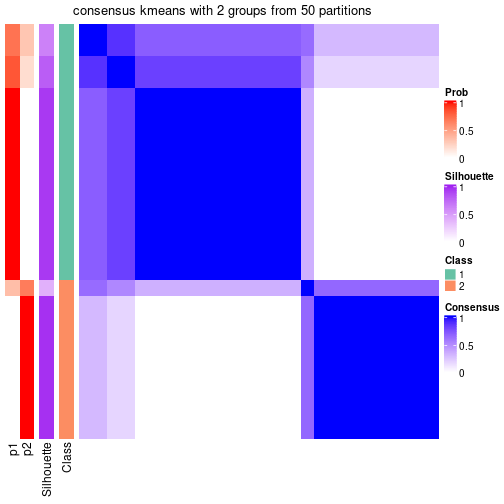</p>

</div>
<div id='tab-node-051-consensus-heatmap-2'>
<pre><code class="r">consensus_heatmap(res, k = 3)
</code></pre>

<p>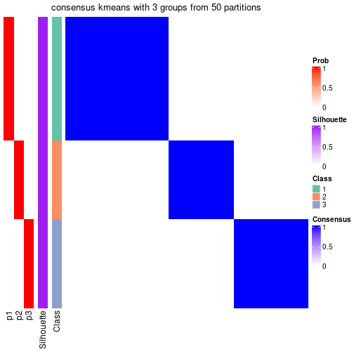</p>

</div>
<div id='tab-node-051-consensus-heatmap-3'>
<pre><code class="r">consensus_heatmap(res, k = 4)
</code></pre>

<p>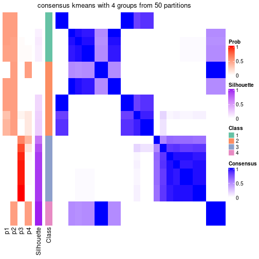</p>

</div>
<div id='tab-node-051-consensus-heatmap-4'>
<pre><code class="r">consensus_heatmap(res, k = 5)
</code></pre>

<p>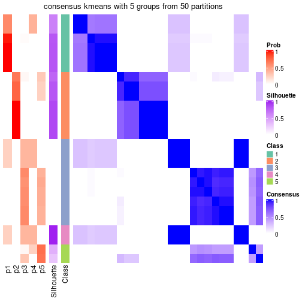</p>

</div>
<div id='tab-node-051-consensus-heatmap-5'>
<pre><code class="r">consensus_heatmap(res, k = 6)
</code></pre>

<p>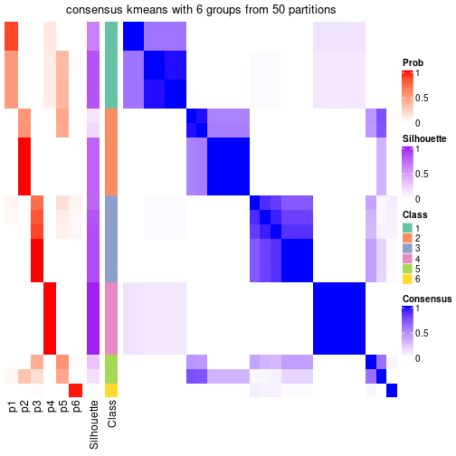</p>

</div>
<div id='tab-node-051-consensus-heatmap-6'>
<pre><code class="r">consensus_heatmap(res, k = 7)
</code></pre>

<p>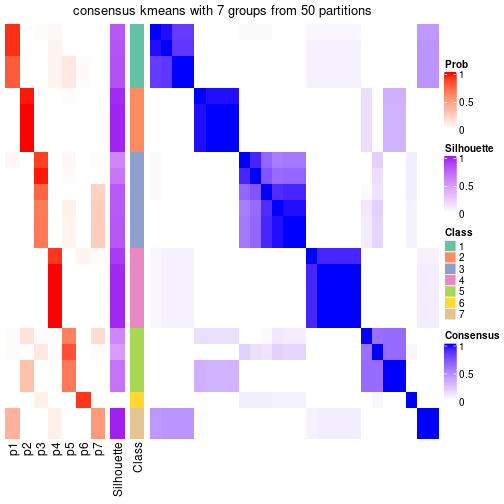</p>

</div>
<div id='tab-node-051-consensus-heatmap-7'>
<pre><code class="r">consensus_heatmap(res, k = 8)
</code></pre>

<p>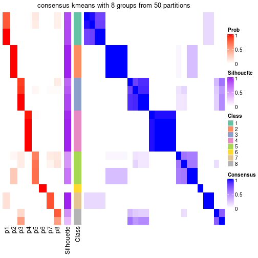</p>

</div>
</div>

Heatmaps for the membership of samples in all partitions to see how consistent they are:


<script>
$( function() {
	$( '#tabs-node-051-membership-heatmap' ).tabs();
} );
</script>
<div id='tabs-node-051-membership-heatmap'>
<ul>
<li><a href='#tab-node-051-membership-heatmap-1'>k = 2</a></li>
<li><a href='#tab-node-051-membership-heatmap-2'>k = 3</a></li>
<li><a href='#tab-node-051-membership-heatmap-3'>k = 4</a></li>
<li><a href='#tab-node-051-membership-heatmap-4'>k = 5</a></li>
<li><a href='#tab-node-051-membership-heatmap-5'>k = 6</a></li>
<li><a href='#tab-node-051-membership-heatmap-6'>k = 7</a></li>
<li><a href='#tab-node-051-membership-heatmap-7'>k = 8</a></li>
</ul>
<div id='tab-node-051-membership-heatmap-1'>
<pre><code class="r">membership_heatmap(res, k = 2)
</code></pre>

<p>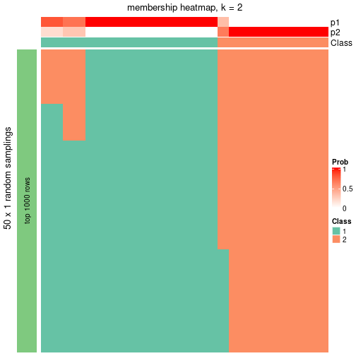</p>

</div>
<div id='tab-node-051-membership-heatmap-2'>
<pre><code class="r">membership_heatmap(res, k = 3)
</code></pre>

<p>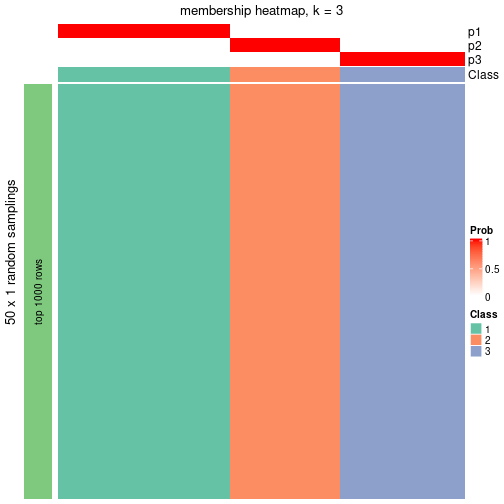</p>

</div>
<div id='tab-node-051-membership-heatmap-3'>
<pre><code class="r">membership_heatmap(res, k = 4)
</code></pre>

<p>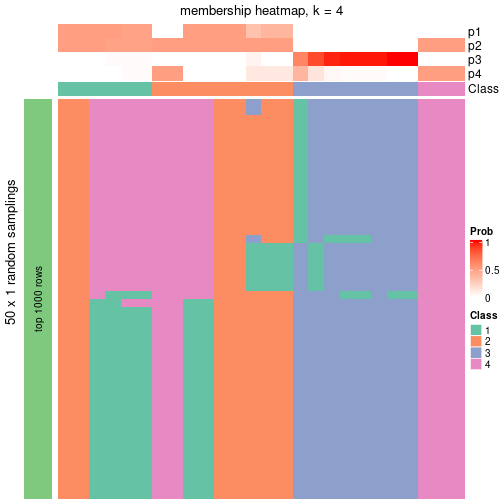</p>

</div>
<div id='tab-node-051-membership-heatmap-4'>
<pre><code class="r">membership_heatmap(res, k = 5)
</code></pre>

<p>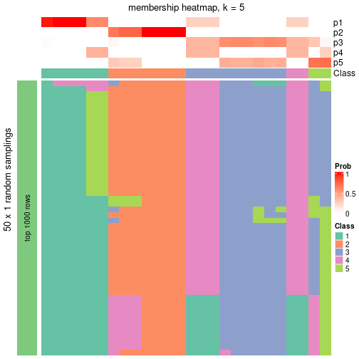</p>

</div>
<div id='tab-node-051-membership-heatmap-5'>
<pre><code class="r">membership_heatmap(res, k = 6)
</code></pre>

<p>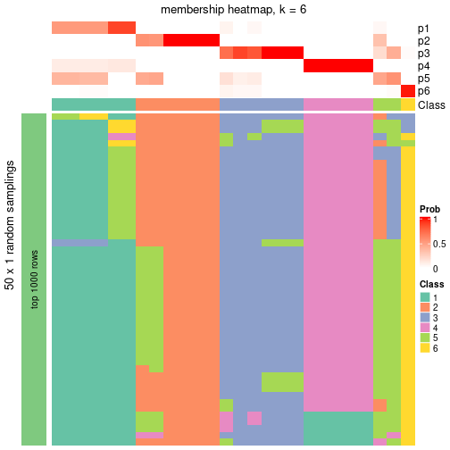</p>

</div>
<div id='tab-node-051-membership-heatmap-6'>
<pre><code class="r">membership_heatmap(res, k = 7)
</code></pre>

<p>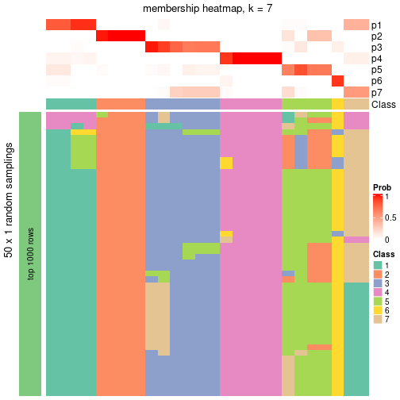</p>

</div>
<div id='tab-node-051-membership-heatmap-7'>
<pre><code class="r">membership_heatmap(res, k = 8)
</code></pre>

<p>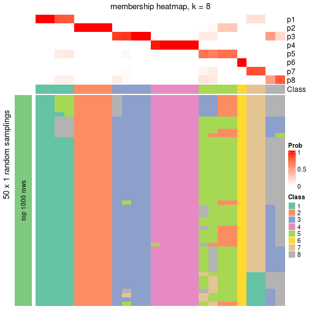</p>

</div>
</div>

As soon as the classes for columns are determined, the signatures
that are significantly different between subgroups can be looked for. 
Following are the heatmaps for signatures.


<script>
$( function() {
	$( '#tabs-node-051-get-signatures' ).tabs();
} );
</script>
<div id='tabs-node-051-get-signatures'>
<ul>
<li><a href='#tab-node-051-get-signatures-1'>k = 2</a></li>
<li><a href='#tab-node-051-get-signatures-2'>k = 3</a></li>
<li><a href='#tab-node-051-get-signatures-3'>k = 4</a></li>
<li><a href='#tab-node-051-get-signatures-4'>k = 5</a></li>
<li><a href='#tab-node-051-get-signatures-5'>k = 6</a></li>
<li><a href='#tab-node-051-get-signatures-6'>k = 7</a></li>
<li><a href='#tab-node-051-get-signatures-7'>k = 8</a></li>
</ul>
<div id='tab-node-051-get-signatures-1'>
<pre><code class="r">get_signatures(res, k = 2)
</code></pre>

<p>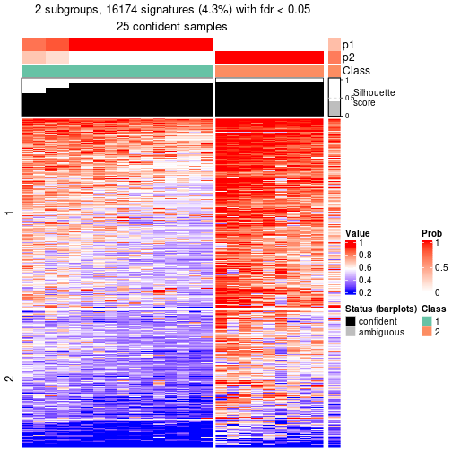</p>

</div>
<div id='tab-node-051-get-signatures-2'>
<pre><code class="r">get_signatures(res, k = 3)
</code></pre>

<p>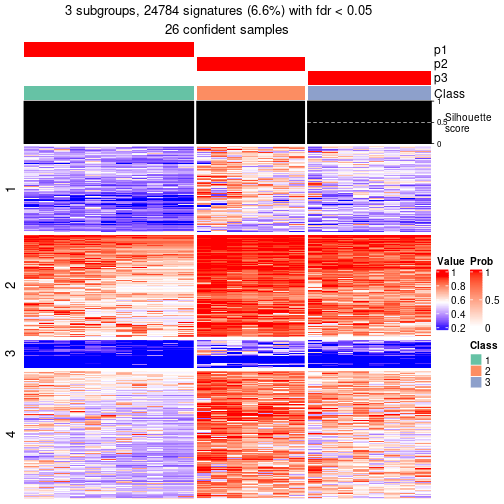</p>

</div>
<div id='tab-node-051-get-signatures-3'>
<pre><code class="r">get_signatures(res, k = 4)
</code></pre>

<p>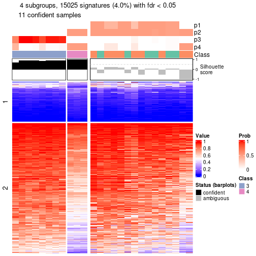</p>

</div>
<div id='tab-node-051-get-signatures-4'>
<pre><code class="r">get_signatures(res, k = 5)
</code></pre>

<p></p>

</div>
<div id='tab-node-051-get-signatures-5'>
<pre><code class="r">get_signatures(res, k = 6)
</code></pre>

<p>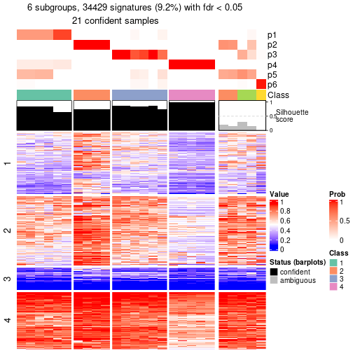</p>

</div>
<div id='tab-node-051-get-signatures-6'>
<pre><code class="r">get_signatures(res, k = 7)
</code></pre>

<p>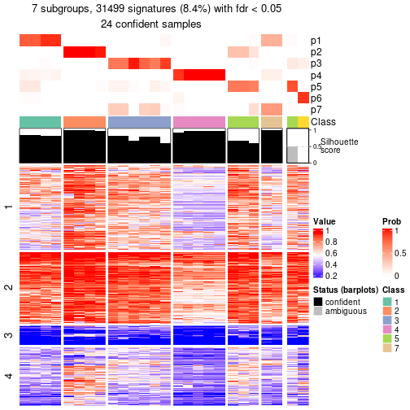</p>

</div>
<div id='tab-node-051-get-signatures-7'>
<pre><code class="r">get_signatures(res, k = 8)
</code></pre>

<p>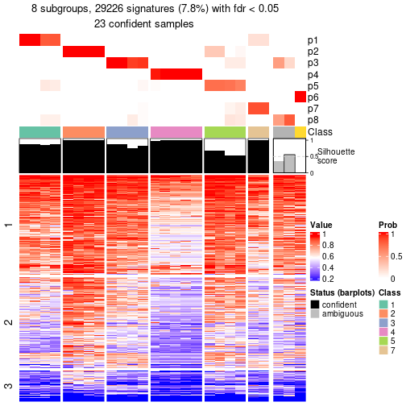</p>

</div>
</div>


Compare the overlap of signatures from different k:

```r
compare_signatures(res)
```

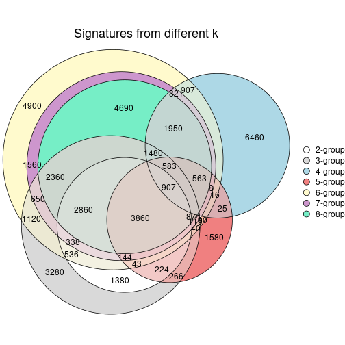

`get_signature()` returns a data frame invisibly. To get the list of signatures, the function
call should be assigned to a variable explicitly. In following code, if `plot` argument is set
to `FALSE`, no heatmap is plotted while only the differential analysis is performed.

```r
# code only for demonstration
tb = get_signature(res, k = ..., plot = FALSE)
```

An example of the output of `tb` is:

```
#>   which_row         fdr    mean_1    mean_2 scaled_mean_1 scaled_mean_2 km
#> 1        38 0.042760348  8.373488  9.131774    -0.5533452     0.5164555  1
#> 2        40 0.018707592  7.106213  8.469186    -0.6173731     0.5762149  1
#> 3        55 0.019134737 10.221463 11.207825    -0.6159697     0.5749050  1
#> 4        59 0.006059896  5.921854  7.869574    -0.6899429     0.6439467  1
#> 5        60 0.018055526  8.928898 10.211722    -0.6204761     0.5791110  1
#> 6        98 0.009384629 15.714769 14.887706     0.6635654    -0.6193277  2
...
```

The columns in `tb` are:

1. `which_row`: row indices corresponding to the input matrix.
2. `fdr`: FDR for the differential test. 
3. `mean_x`: The mean value in group x.
4. `scaled_mean_x`: The mean value in group x after rows are scaled.
5. `km`: Row groups if k-means clustering is applied to rows (which is done by automatically selecting number of clusters).

If there are too many signatures, `top_signatures = ...` can be set to only show the 
signatures with the highest FDRs:

```r
# code only for demonstration
# e.g. to show the top 500 most significant rows
tb = get_signature(res, k = ..., top_signatures = 500)
```

If the signatures are defined as these which are uniquely high in current group, `diff_method` argument
can be set to `"uniquely_high_in_one_group"`:

```r
# code only for demonstration
tb = get_signature(res, k = ..., diff_method = "uniquely_high_in_one_group")
```


UMAP plot which shows how samples are separated.


<script>
$( function() {
	$( '#tabs-node-051-dimension-reduction' ).tabs();
} );
</script>
<div id='tabs-node-051-dimension-reduction'>
<ul>
<li><a href='#tab-node-051-dimension-reduction-1'>k = 2</a></li>
<li><a href='#tab-node-051-dimension-reduction-2'>k = 3</a></li>
<li><a href='#tab-node-051-dimension-reduction-3'>k = 4</a></li>
<li><a href='#tab-node-051-dimension-reduction-4'>k = 5</a></li>
<li><a href='#tab-node-051-dimension-reduction-5'>k = 6</a></li>
<li><a href='#tab-node-051-dimension-reduction-6'>k = 7</a></li>
<li><a href='#tab-node-051-dimension-reduction-7'>k = 8</a></li>
</ul>
<div id='tab-node-051-dimension-reduction-1'>
<pre><code class="r">dimension_reduction(res, k = 2, method = &quot;UMAP&quot;)
</code></pre>

<p>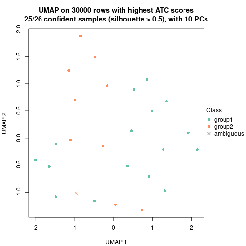</p>

</div>
<div id='tab-node-051-dimension-reduction-2'>
<pre><code class="r">dimension_reduction(res, k = 3, method = &quot;UMAP&quot;)
</code></pre>

<p>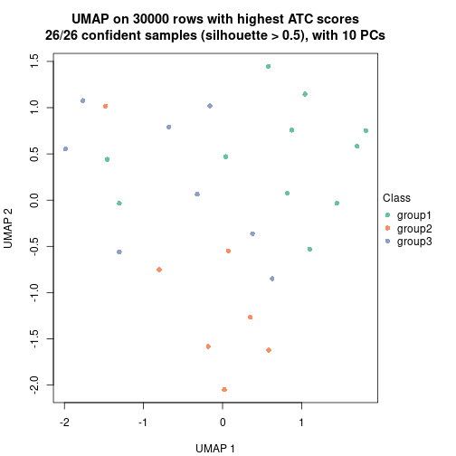</p>

</div>
<div id='tab-node-051-dimension-reduction-3'>
<pre><code class="r">dimension_reduction(res, k = 4, method = &quot;UMAP&quot;)
</code></pre>

<p>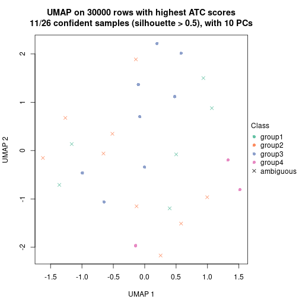</p>

</div>
<div id='tab-node-051-dimension-reduction-4'>
<pre><code class="r">dimension_reduction(res, k = 5, method = &quot;UMAP&quot;)
</code></pre>

<p>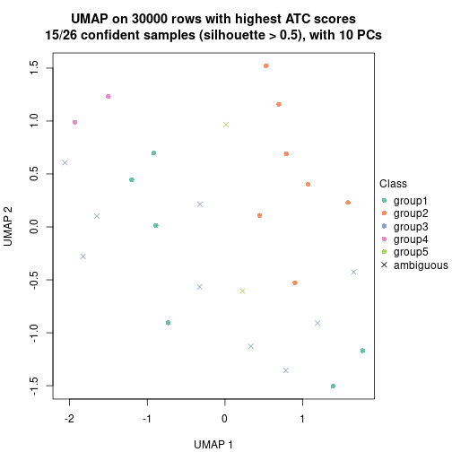</p>

</div>
<div id='tab-node-051-dimension-reduction-5'>
<pre><code class="r">dimension_reduction(res, k = 6, method = &quot;UMAP&quot;)
</code></pre>

<p>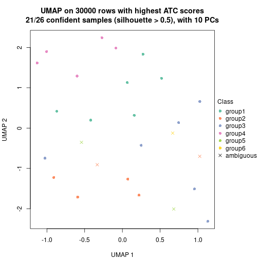</p>

</div>
<div id='tab-node-051-dimension-reduction-6'>
<pre><code class="r">dimension_reduction(res, k = 7, method = &quot;UMAP&quot;)
</code></pre>

<p>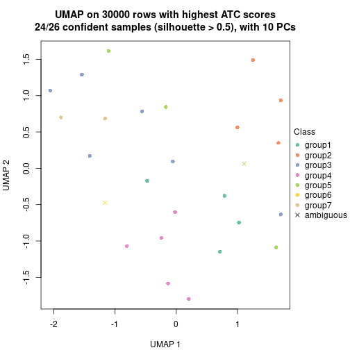</p>

</div>
<div id='tab-node-051-dimension-reduction-7'>
<pre><code class="r">dimension_reduction(res, k = 8, method = &quot;UMAP&quot;)
</code></pre>

<p>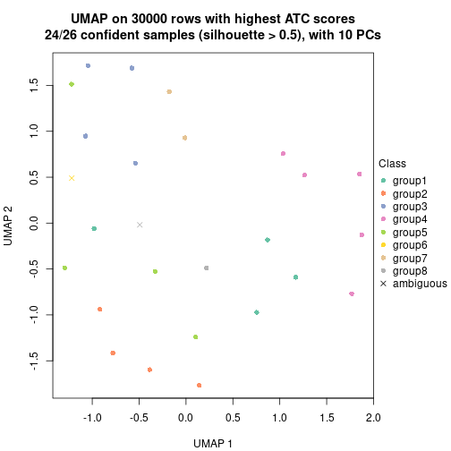</p>

</div>
</div>


Following heatmap shows how subgroups are split when increasing `k`:

```r
collect_classes(res)
```

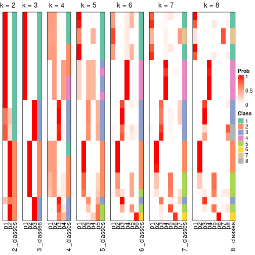


If matrix rows can be associated to genes, consider to use `functional_enrichment(res,
...)` to perform function enrichment for the signature genes. See [this vignette](https://jokergoo.github.io/cola_vignettes/functional_enrichment.html) for more detailed explanations.


 

---------------------------------------------------


### Node052


Parent node: [Node05](#Node05).
Child nodes: 
                Node0111-leaf
        ,
                Node0112-leaf
        ,
                Node0113-leaf
        ,
                Node0121-leaf
        ,
                Node0122-leaf
        ,
                Node0123-leaf
        ,
                Node0124-leaf
        ,
                Node0311-leaf
        ,
                Node0312-leaf
        ,
                Node0331-leaf
        ,
                Node0332-leaf
        ,
                Node0341-leaf
        ,
                Node0342-leaf
        ,
                Node0411-leaf
        ,
                [Node0412](#Node0412)
        ,
                Node0413-leaf
        ,
                Node0421-leaf
        ,
                Node0422-leaf
        ,
                Node0423-leaf
        ,
                Node0431-leaf
        ,
                [Node0432](#Node0432)
        ,
                Node0433-leaf
        ,
                Node0511-leaf
        ,
                Node0512-leaf
        ,
                Node0513-leaf
        ,
                [Node0521](#Node0521)
        ,
                Node0522-leaf
        ,
                Node0531-leaf
        ,
                Node0532-leaf
        ,
                Node0533-leaf
        .


The object with results only for a single top-value method and a single partitioning method 
can be extracted as:

```r
res = res_rh["052"]
```

A summary of `res` and all the functions that can be applied to it:

```r
res
```

```
#> A 'ConsensusPartition' object with k = 2, 3, 4, 5, 6, 7, 8.
#>   On a matrix with 30000 rows and 29 columns.
#>   Top rows (1000) are extracted by 'ATC' method.
#>   Subgroups are detected by 'kmeans' method.
#>   Performed in total 350 partitions by row resampling.
#>   Best k for subgroups seems to be 2.
#> 
#> Following methods can be applied to this 'ConsensusPartition' object:
#>  [1] "cola_report"             "collect_classes"         "collect_plots"          
#>  [4] "collect_stats"           "colnames"                "compare_partitions"     
#>  [7] "compare_signatures"      "consensus_heatmap"       "dimension_reduction"    
#> [10] "functional_enrichment"   "get_anno_col"            "get_anno"               
#> [13] "get_classes"             "get_consensus"           "get_matrix"             
#> [16] "get_membership"          "get_param"               "get_signatures"         
#> [19] "get_stats"               "is_best_k"               "is_stable_k"            
#> [22] "membership_heatmap"      "ncol"                    "nrow"                   
#> [25] "plot_ecdf"               "predict_classes"         "rownames"               
#> [28] "select_partition_number" "show"                    "suggest_best_k"         
#> [31] "test_to_known_factors"   "top_rows_heatmap"
```

`collect_plots()` function collects all the plots made from `res` for all `k` (number of subgroups)
into one single page to provide an easy and fast comparison between different `k`.

```r
collect_plots(res)
```

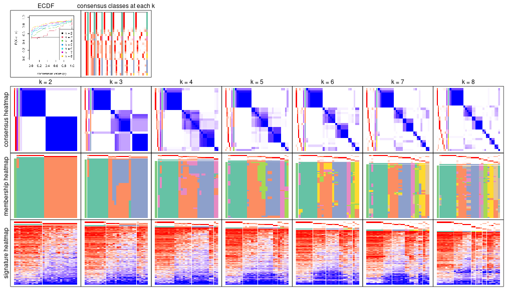

The plots are:

- The first row: a plot of the eCDF (empirical cumulative distribution
  function) curves of the consensus matrix for each `k` and the heatmap of
  predicted classes for each `k`.
- The second row: heatmaps of the consensus matrix for each `k`.
- The third row: heatmaps of the membership matrix for each `k`.
- The fouth row: heatmaps of the signatures for each `k`.

All the plots in panels can be made by individual functions and they are
plotted later in this section.

`select_partition_number()` produces several plots showing different
statistics for choosing "optimized" `k`. There are following statistics:

- eCDF curves of the consensus matrix for each `k`;
- 1-PAC. [The PAC score](https://en.wikipedia.org/wiki/Consensus_clustering#Over-interpretation_potential_of_consensus_clustering)
  measures the proportion of the ambiguous subgrouping.
- Mean silhouette score.
- Concordance. The mean probability of fiting the consensus subgroup labels in all
  partitions.
- Area increased. Denote $A_k$ as the area under the eCDF curve for current
  `k`, the area increased is defined as $A_k - A_{k-1}$.
- Rand index. The percent of pairs of samples that are both in a same cluster
  or both are not in a same cluster in the partition of k and k-1.
- Jaccard index. The ratio of pairs of samples are both in a same cluster in
  the partition of k and k-1 and the pairs of samples are both in a same
  cluster in the partition k or k-1.

The detailed explanations of these statistics can be found in [the _cola_
vignette](https://jokergoo.github.io/cola_vignettes/cola.html#toc_13).

Generally speaking, higher 1-PAC score, higher mean silhouette score or higher
concordance corresponds to better partition. Rand index and Jaccard index
measure how similar the current partition is compared to partition with `k-1`.
If they are too similar, we won't accept `k` is better than `k-1`.

```r
select_partition_number(res)
```

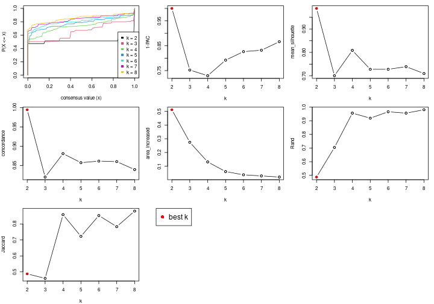

The numeric values for all these statistics can be obtained by `get_stats()`.

```r
get_stats(res)
```

```
#>   k 1-PAC mean_silhouette concordance area_increased  Rand Jaccard
#> 2 2 1.000           0.988       0.994         0.5112 0.488   0.488
#> 3 3 0.752           0.701       0.820         0.2745 0.704   0.459
#> 4 4 0.729           0.809       0.881         0.1314 0.956   0.858
#> 5 5 0.792           0.728       0.857         0.0610 0.919   0.723
#> 6 6 0.826           0.728       0.861         0.0374 0.966   0.853
#> 7 7 0.832           0.739       0.860         0.0295 0.956   0.783
#> 8 8 0.866           0.710       0.839         0.0212 0.980   0.881
```

`suggest_best_k()` suggests the best $k$ based on these statistics. The rules are as follows:

- All $k$ with Jaccard index larger than 0.95 are removed because increasing
  $k$ does not provide enough extra information. If all $k$ are removed, it is
  marked as no subgroup is detected.
- For all $k$ with 1-PAC score larger than 0.9, the maximal $k$ is taken as
  the best $k$, and other $k$ are marked as optional $k$.
- If it does not fit the second rule. The $k$ with the maximal vote of the
  highest 1-PAC score, highest mean silhouette, and highest concordance is
  taken as the best $k$.

```r
suggest_best_k(res)
```

```
#> [1] 2
```


Following is the table of the partitions (You need to click the **show/hide
code output** link to see it). The membership matrix (columns with name `p*`)
is inferred by
[`clue::cl_consensus()`](https://www.rdocumentation.org/link/cl_consensus?package=clue)
function with the `SE` method. Basically the value in the membership matrix
represents the probability to belong to a certain group. The finall subgroup
label for an item is determined with the group with highest probability it
belongs to.

In `get_classes()` function, the entropy is calculated from the membership
matrix and the silhouette score is calculated from the consensus matrix.


<script>
$( function() {
	$( '#tabs-node-052-get-classes' ).tabs();
} );
</script>
<div id='tabs-node-052-get-classes'>
<ul>
<li><a href='#tab-node-052-get-classes-1'>k = 2</a></li>
<li><a href='#tab-node-052-get-classes-2'>k = 3</a></li>
<li><a href='#tab-node-052-get-classes-3'>k = 4</a></li>
<li><a href='#tab-node-052-get-classes-4'>k = 5</a></li>
<li><a href='#tab-node-052-get-classes-5'>k = 6</a></li>
<li><a href='#tab-node-052-get-classes-6'>k = 7</a></li>
<li><a href='#tab-node-052-get-classes-7'>k = 8</a></li>
</ul>

<div id='tab-node-052-get-classes-1'>
<p><a id='tab-node-052-get-classes-1-a' style='color:#0366d6' href='#'>show/hide code output</a></p>
<pre><code class="r">cbind(get_classes(res, k = 2), get_membership(res, k = 2))
</code></pre>

<pre><code>#&gt;                 class entropy silhouette   p1   p2
#&gt; TCGA.22.4601.01     2   0.000      1.000 0.00 1.00
#&gt; TCGA.34.5240.01     1   0.000      0.987 1.00 0.00
#&gt; TCGA.85.6798.01     2   0.000      1.000 0.00 1.00
#&gt; TCGA.77.6843.01     2   0.000      1.000 0.00 1.00
#&gt; TCGA.56.A62T.01     2   0.000      1.000 0.00 1.00
#&gt; TCGA.33.4583.01     1   0.000      0.987 1.00 0.00
#&gt; TCGA.85.8072.01     2   0.000      1.000 0.00 1.00
#&gt; TCGA.39.5036.01     2   0.000      1.000 0.00 1.00
#&gt; TCGA.33.AASJ.01     1   0.000      0.987 1.00 0.00
#&gt; TCGA.56.A4BY.01     2   0.000      1.000 0.00 1.00
#&gt; TCGA.58.A46M.01     1   0.000      0.987 1.00 0.00
#&gt; TCGA.39.5016.01     1   0.634      0.810 0.84 0.16
#&gt; TCGA.85.7698.01     1   0.000      0.987 1.00 0.00
#&gt; TCGA.22.5473.01     2   0.000      1.000 0.00 1.00
#&gt; TCGA.22.5482.01     2   0.000      1.000 0.00 1.00
#&gt; TCGA.56.7223.01     1   0.000      0.987 1.00 0.00
#&gt; TCGA.63.A5MJ.01     1   0.000      0.987 1.00 0.00
#&gt; TCGA.77.7141.01     2   0.000      1.000 0.00 1.00
#&gt; TCGA.77.A5GF.01     1   0.000      0.987 1.00 0.00
#&gt; TCGA.63.A5M9.01     2   0.000      1.000 0.00 1.00
#&gt; TCGA.92.7341.01     2   0.000      1.000 0.00 1.00
#&gt; TCGA.58.8391.01     2   0.000      1.000 0.00 1.00
#&gt; TCGA.51.6867.01     2   0.000      1.000 0.00 1.00
#&gt; TCGA.56.8629.01     2   0.000      1.000 0.00 1.00
#&gt; TCGA.85.8277.01     1   0.000      0.987 1.00 0.00
#&gt; TCGA.63.A5MB.01     1   0.000      0.987 1.00 0.00
#&gt; TCGA.85.A512.01     1   0.000      0.987 1.00 0.00
#&gt; TCGA.L3.A524.01     2   0.000      1.000 0.00 1.00
#&gt; TCGA.O2.A52S.01     1   0.000      0.987 1.00 0.00
</code></pre>

<script>
$('#tab-node-052-get-classes-1-a').parent().next().next().hide();
$('#tab-node-052-get-classes-1-a').click(function(){
  $('#tab-node-052-get-classes-1-a').parent().next().next().toggle();
  return(false);
});
</script>
</div>

<div id='tab-node-052-get-classes-2'>
<p><a id='tab-node-052-get-classes-2-a' style='color:#0366d6' href='#'>show/hide code output</a></p>
<pre><code class="r">cbind(get_classes(res, k = 3), get_membership(res, k = 3))
</code></pre>

<pre><code>#&gt;                 class entropy silhouette  p1   p2   p3
#&gt; TCGA.22.4601.01     2   0.000    0.69799 0.0 1.00 0.00
#&gt; TCGA.34.5240.01     1   0.556    0.69644 0.7 0.00 0.30
#&gt; TCGA.85.6798.01     3   0.613    0.81062 0.0 0.40 0.60
#&gt; TCGA.77.6843.01     3   0.613    0.81062 0.0 0.40 0.60
#&gt; TCGA.56.A62T.01     3   0.613    0.81062 0.0 0.40 0.60
#&gt; TCGA.33.4583.01     1   0.000    0.97115 1.0 0.00 0.00
#&gt; TCGA.85.8072.01     2   0.000    0.69799 0.0 1.00 0.00
#&gt; TCGA.39.5036.01     3   0.613    0.81062 0.0 0.40 0.60
#&gt; TCGA.33.AASJ.01     1   0.000    0.97115 1.0 0.00 0.00
#&gt; TCGA.56.A4BY.01     3   0.613    0.81062 0.0 0.40 0.60
#&gt; TCGA.58.A46M.01     2   0.613    0.43184 0.0 0.60 0.40
#&gt; TCGA.39.5016.01     2   0.613    0.43184 0.0 0.60 0.40
#&gt; TCGA.85.7698.01     1   0.000    0.97115 1.0 0.00 0.00
#&gt; TCGA.22.5473.01     3   0.613    0.81062 0.0 0.40 0.60
#&gt; TCGA.22.5482.01     2   0.604   -0.30428 0.0 0.62 0.38
#&gt; TCGA.56.7223.01     3   0.991   -0.30533 0.3 0.30 0.40
#&gt; TCGA.63.A5MJ.01     1   0.000    0.97115 1.0 0.00 0.00
#&gt; TCGA.77.7141.01     2   0.153    0.65458 0.0 0.96 0.04
#&gt; TCGA.77.A5GF.01     1   0.000    0.97115 1.0 0.00 0.00
#&gt; TCGA.63.A5M9.01     2   0.000    0.69799 0.0 1.00 0.00
#&gt; TCGA.92.7341.01     2   0.000    0.69799 0.0 1.00 0.00
#&gt; TCGA.58.8391.01     2   0.556   -0.00311 0.0 0.70 0.30
#&gt; TCGA.51.6867.01     3   0.613    0.81062 0.0 0.40 0.60
#&gt; TCGA.56.8629.01     3   0.613    0.81062 0.0 0.40 0.60
#&gt; TCGA.85.8277.01     1   0.000    0.97115 1.0 0.00 0.00
#&gt; TCGA.63.A5MB.01     1   0.000    0.97115 1.0 0.00 0.00
#&gt; TCGA.85.A512.01     1   0.000    0.97115 1.0 0.00 0.00
#&gt; TCGA.L3.A524.01     2   0.000    0.69799 0.0 1.00 0.00
#&gt; TCGA.O2.A52S.01     1   0.000    0.97115 1.0 0.00 0.00
</code></pre>

<script>
$('#tab-node-052-get-classes-2-a').parent().next().next().hide();
$('#tab-node-052-get-classes-2-a').click(function(){
  $('#tab-node-052-get-classes-2-a').parent().next().next().toggle();
  return(false);
});
</script>
</div>

<div id='tab-node-052-get-classes-3'>
<p><a id='tab-node-052-get-classes-3-a' style='color:#0366d6' href='#'>show/hide code output</a></p>
<pre><code class="r">cbind(get_classes(res, k = 4), get_membership(res, k = 4))
</code></pre>

<pre><code>#&gt;                 class entropy silhouette   p1   p2   p3   p4
#&gt; TCGA.22.4601.01     2   0.693      0.694 0.00 0.56 0.14 0.30
#&gt; TCGA.34.5240.01     1   0.651      0.447 0.64 0.18 0.00 0.18
#&gt; TCGA.85.6798.01     3   0.000      0.948 0.00 0.00 1.00 0.00
#&gt; TCGA.77.6843.01     3   0.000      0.948 0.00 0.00 1.00 0.00
#&gt; TCGA.56.A62T.01     3   0.121      0.937 0.00 0.00 0.96 0.04
#&gt; TCGA.33.4583.01     1   0.000      0.928 1.00 0.00 0.00 0.00
#&gt; TCGA.85.8072.01     2   0.428      0.673 0.00 0.78 0.02 0.20
#&gt; TCGA.39.5036.01     3   0.000      0.948 0.00 0.00 1.00 0.00
#&gt; TCGA.33.AASJ.01     1   0.000      0.928 1.00 0.00 0.00 0.00
#&gt; TCGA.56.A4BY.01     3   0.000      0.948 0.00 0.00 1.00 0.00
#&gt; TCGA.58.A46M.01     4   0.191      0.892 0.02 0.04 0.00 0.94
#&gt; TCGA.39.5016.01     2   0.413      0.393 0.00 0.74 0.00 0.26
#&gt; TCGA.85.7698.01     1   0.000      0.928 1.00 0.00 0.00 0.00
#&gt; TCGA.22.5473.01     3   0.201      0.894 0.00 0.08 0.92 0.00
#&gt; TCGA.22.5482.01     2   0.428      0.606 0.00 0.72 0.28 0.00
#&gt; TCGA.56.7223.01     4   0.201      0.897 0.08 0.00 0.00 0.92
#&gt; TCGA.63.A5MJ.01     1   0.000      0.928 1.00 0.00 0.00 0.00
#&gt; TCGA.77.7141.01     2   0.141      0.630 0.00 0.96 0.02 0.02
#&gt; TCGA.77.A5GF.01     1   0.000      0.928 1.00 0.00 0.00 0.00
#&gt; TCGA.63.A5M9.01     2   0.672      0.714 0.00 0.60 0.14 0.26
#&gt; TCGA.92.7341.01     2   0.659      0.716 0.00 0.62 0.14 0.24
#&gt; TCGA.58.8391.01     2   0.141      0.630 0.00 0.96 0.02 0.02
#&gt; TCGA.51.6867.01     3   0.423      0.788 0.00 0.12 0.82 0.06
#&gt; TCGA.56.8629.01     3   0.121      0.937 0.00 0.00 0.96 0.04
#&gt; TCGA.85.8277.01     1   0.000      0.928 1.00 0.00 0.00 0.00
#&gt; TCGA.63.A5MB.01     1   0.380      0.682 0.78 0.00 0.00 0.22
#&gt; TCGA.85.A512.01     1   0.000      0.928 1.00 0.00 0.00 0.00
#&gt; TCGA.L3.A524.01     2   0.684      0.703 0.00 0.58 0.14 0.28
#&gt; TCGA.O2.A52S.01     1   0.000      0.928 1.00 0.00 0.00 0.00
</code></pre>

<script>
$('#tab-node-052-get-classes-3-a').parent().next().next().hide();
$('#tab-node-052-get-classes-3-a').click(function(){
  $('#tab-node-052-get-classes-3-a').parent().next().next().toggle();
  return(false);
});
</script>
</div>

<div id='tab-node-052-get-classes-4'>
<p><a id='tab-node-052-get-classes-4-a' style='color:#0366d6' href='#'>show/hide code output</a></p>
<pre><code class="r">cbind(get_classes(res, k = 5), get_membership(res, k = 5))
</code></pre>

<pre><code>#&gt;                 class entropy silhouette   p1   p2   p3   p4   p5
#&gt; TCGA.22.4601.01     2  0.5631      0.682 0.00 0.54 0.04 0.02 0.40
#&gt; TCGA.34.5240.01     5  0.5689      0.113 0.44 0.00 0.00 0.08 0.48
#&gt; TCGA.85.6798.01     3  0.0000      0.919 0.00 0.00 1.00 0.00 0.00
#&gt; TCGA.77.6843.01     3  0.0000      0.919 0.00 0.00 1.00 0.00 0.00
#&gt; TCGA.56.A62T.01     3  0.3037      0.843 0.00 0.04 0.86 0.00 0.10
#&gt; TCGA.33.4583.01     1  0.0000      0.934 1.00 0.00 0.00 0.00 0.00
#&gt; TCGA.85.8072.01     2  0.3627      0.590 0.00 0.84 0.04 0.02 0.10
#&gt; TCGA.39.5036.01     3  0.0000      0.919 0.00 0.00 1.00 0.00 0.00
#&gt; TCGA.33.AASJ.01     1  0.0000      0.934 1.00 0.00 0.00 0.00 0.00
#&gt; TCGA.56.A4BY.01     3  0.0000      0.919 0.00 0.00 1.00 0.00 0.00
#&gt; TCGA.58.A46M.01     4  0.0000      1.000 0.00 0.00 0.00 1.00 0.00
#&gt; TCGA.39.5016.01     5  0.5341      0.170 0.00 0.30 0.00 0.08 0.62
#&gt; TCGA.85.7698.01     1  0.0000      0.934 1.00 0.00 0.00 0.00 0.00
#&gt; TCGA.22.5473.01     3  0.2516      0.809 0.00 0.14 0.86 0.00 0.00
#&gt; TCGA.22.5482.01     2  0.1732      0.511 0.00 0.92 0.08 0.00 0.00
#&gt; TCGA.56.7223.01     4  0.0000      1.000 0.00 0.00 0.00 1.00 0.00
#&gt; TCGA.63.A5MJ.01     1  0.0000      0.934 1.00 0.00 0.00 0.00 0.00
#&gt; TCGA.77.7141.01     2  0.3999      0.224 0.00 0.74 0.02 0.00 0.24
#&gt; TCGA.77.A5GF.01     1  0.0000      0.934 1.00 0.00 0.00 0.00 0.00
#&gt; TCGA.63.A5M9.01     2  0.5588      0.691 0.00 0.56 0.04 0.02 0.38
#&gt; TCGA.92.7341.01     2  0.5588      0.691 0.00 0.56 0.04 0.02 0.38
#&gt; TCGA.58.8391.01     2  0.3999      0.224 0.00 0.74 0.02 0.00 0.24
#&gt; TCGA.51.6867.01     2  0.6619      0.541 0.00 0.42 0.22 0.00 0.36
#&gt; TCGA.56.8629.01     3  0.3037      0.843 0.00 0.04 0.86 0.00 0.10
#&gt; TCGA.85.8277.01     1  0.0000      0.934 1.00 0.00 0.00 0.00 0.00
#&gt; TCGA.63.A5MB.01     1  0.4613      0.360 0.62 0.02 0.00 0.36 0.00
#&gt; TCGA.85.A512.01     1  0.0000      0.934 1.00 0.00 0.00 0.00 0.00
#&gt; TCGA.L3.A524.01     2  0.5588      0.691 0.00 0.56 0.04 0.02 0.38
#&gt; TCGA.O2.A52S.01     1  0.0609      0.917 0.98 0.02 0.00 0.00 0.00
</code></pre>

<script>
$('#tab-node-052-get-classes-4-a').parent().next().next().hide();
$('#tab-node-052-get-classes-4-a').click(function(){
  $('#tab-node-052-get-classes-4-a').parent().next().next().toggle();
  return(false);
});
</script>
</div>

<div id='tab-node-052-get-classes-5'>
<p><a id='tab-node-052-get-classes-5-a' style='color:#0366d6' href='#'>show/hide code output</a></p>
<pre><code class="r">cbind(get_classes(res, k = 6), get_membership(res, k = 6))
</code></pre>

<pre><code>#&gt;                 class entropy silhouette   p1   p2   p3   p4   p5   p6
#&gt; TCGA.22.4601.01     2  0.5239     0.5559 0.00 0.68 0.00 0.04 0.16 0.12
#&gt; TCGA.34.5240.01     5  0.3156     0.6695 0.18 0.00 0.00 0.02 0.80 0.00
#&gt; TCGA.85.6798.01     3  0.0000     0.8365 0.00 0.00 1.00 0.00 0.00 0.00
#&gt; TCGA.77.6843.01     3  0.0000     0.8365 0.00 0.00 1.00 0.00 0.00 0.00
#&gt; TCGA.56.A62T.01     3  0.3854     0.7514 0.00 0.12 0.80 0.00 0.04 0.04
#&gt; TCGA.33.4583.01     1  0.0000     0.9380 1.00 0.00 0.00 0.00 0.00 0.00
#&gt; TCGA.85.8072.01     2  0.1267     0.6555 0.00 0.94 0.00 0.00 0.00 0.06
#&gt; TCGA.39.5036.01     3  0.0000     0.8365 0.00 0.00 1.00 0.00 0.00 0.00
#&gt; TCGA.33.AASJ.01     1  0.0000     0.9380 1.00 0.00 0.00 0.00 0.00 0.00
#&gt; TCGA.56.A4BY.01     3  0.0000     0.8365 0.00 0.00 1.00 0.00 0.00 0.00
#&gt; TCGA.58.A46M.01     4  0.2728     0.9081 0.00 0.04 0.00 0.86 0.00 0.10
#&gt; TCGA.39.5016.01     5  0.3846     0.6604 0.00 0.10 0.00 0.02 0.80 0.08
#&gt; TCGA.85.7698.01     1  0.0000     0.9380 1.00 0.00 0.00 0.00 0.00 0.00
#&gt; TCGA.22.5473.01     3  0.3869     0.0385 0.00 0.00 0.50 0.00 0.00 0.50
#&gt; TCGA.22.5482.01     2  0.4902    -0.5920 0.00 0.48 0.06 0.00 0.00 0.46
#&gt; TCGA.56.7223.01     4  0.0937     0.9088 0.00 0.04 0.00 0.96 0.00 0.00
#&gt; TCGA.63.A5MJ.01     1  0.0000     0.9380 1.00 0.00 0.00 0.00 0.00 0.00
#&gt; TCGA.77.7141.01     6  0.4172     1.0000 0.00 0.28 0.00 0.00 0.04 0.68
#&gt; TCGA.77.A5GF.01     1  0.0000     0.9380 1.00 0.00 0.00 0.00 0.00 0.00
#&gt; TCGA.63.A5M9.01     2  0.0547     0.6897 0.00 0.98 0.00 0.00 0.02 0.00
#&gt; TCGA.92.7341.01     2  0.0547     0.6873 0.00 0.98 0.00 0.00 0.00 0.02
#&gt; TCGA.58.8391.01     6  0.4172     1.0000 0.00 0.28 0.00 0.00 0.04 0.68
#&gt; TCGA.51.6867.01     2  0.6211     0.5202 0.00 0.64 0.06 0.04 0.14 0.12
#&gt; TCGA.56.8629.01     3  0.3854     0.7514 0.00 0.12 0.80 0.00 0.04 0.04
#&gt; TCGA.85.8277.01     1  0.0000     0.9380 1.00 0.00 0.00 0.00 0.00 0.00
#&gt; TCGA.63.A5MB.01     1  0.4700     0.4097 0.60 0.00 0.00 0.34 0.00 0.06
#&gt; TCGA.85.A512.01     1  0.0000     0.9380 1.00 0.00 0.00 0.00 0.00 0.00
#&gt; TCGA.L3.A524.01     2  0.0547     0.6915 0.00 0.98 0.00 0.00 0.02 0.00
#&gt; TCGA.O2.A52S.01     1  0.1267     0.8934 0.94 0.00 0.00 0.00 0.00 0.06
</code></pre>

<script>
$('#tab-node-052-get-classes-5-a').parent().next().next().hide();
$('#tab-node-052-get-classes-5-a').click(function(){
  $('#tab-node-052-get-classes-5-a').parent().next().next().toggle();
  return(false);
});
</script>
</div>

<div id='tab-node-052-get-classes-6'>
<p><a id='tab-node-052-get-classes-6-a' style='color:#0366d6' href='#'>show/hide code output</a></p>
<pre><code class="r">cbind(get_classes(res, k = 7), get_membership(res, k = 7))
</code></pre>

<pre><code>#&gt;                 class entropy silhouette   p1   p2   p3   p4   p5   p6   p7
#&gt; TCGA.22.4601.01     7  0.3525      0.891 0.00 0.44 0.00 0.00 0.00 0.00 0.56
#&gt; TCGA.34.5240.01     5  0.2654      0.802 0.10 0.00 0.00 0.00 0.86 0.02 0.02
#&gt; TCGA.85.6798.01     3  0.0000      0.843 0.00 0.00 1.00 0.00 0.00 0.00 0.00
#&gt; TCGA.77.6843.01     3  0.0000      0.843 0.00 0.00 1.00 0.00 0.00 0.00 0.00
#&gt; TCGA.56.A62T.01     3  0.4211      0.666 0.00 0.26 0.68 0.00 0.04 0.00 0.02
#&gt; TCGA.33.4583.01     1  0.0000      0.901 1.00 0.00 0.00 0.00 0.00 0.00 0.00
#&gt; TCGA.85.8072.01     2  0.1363      0.714 0.00 0.94 0.00 0.00 0.04 0.02 0.00
#&gt; TCGA.39.5036.01     3  0.0000      0.843 0.00 0.00 1.00 0.00 0.00 0.00 0.00
#&gt; TCGA.33.AASJ.01     1  0.0000      0.901 1.00 0.00 0.00 0.00 0.00 0.00 0.00
#&gt; TCGA.56.A4BY.01     3  0.0000      0.843 0.00 0.00 1.00 0.00 0.00 0.00 0.00
#&gt; TCGA.58.A46M.01     4  0.0000      0.747 0.00 0.00 0.00 1.00 0.00 0.00 0.00
#&gt; TCGA.39.5016.01     5  0.1718      0.801 0.00 0.04 0.00 0.00 0.92 0.04 0.00
#&gt; TCGA.85.7698.01     1  0.0000      0.901 1.00 0.00 0.00 0.00 0.00 0.00 0.00
#&gt; TCGA.22.5473.01     6  0.4328      0.445 0.00 0.00 0.34 0.00 0.00 0.60 0.06
#&gt; TCGA.22.5482.01     2  0.5775      0.192 0.00 0.54 0.04 0.00 0.04 0.32 0.06
#&gt; TCGA.56.7223.01     4  0.4193      0.753 0.00 0.00 0.00 0.72 0.04 0.04 0.20
#&gt; TCGA.63.A5MJ.01     1  0.0000      0.901 1.00 0.00 0.00 0.00 0.00 0.00 0.00
#&gt; TCGA.77.7141.01     6  0.1433      0.746 0.00 0.08 0.00 0.00 0.00 0.92 0.00
#&gt; TCGA.77.A5GF.01     1  0.0000      0.901 1.00 0.00 0.00 0.00 0.00 0.00 0.00
#&gt; TCGA.63.A5M9.01     2  0.0863      0.670 0.00 0.96 0.00 0.00 0.04 0.00 0.00
#&gt; TCGA.92.7341.01     2  0.1363      0.714 0.00 0.94 0.00 0.00 0.04 0.02 0.00
#&gt; TCGA.58.8391.01     6  0.1433      0.746 0.00 0.08 0.00 0.00 0.00 0.92 0.00
#&gt; TCGA.51.6867.01     7  0.4214      0.896 0.00 0.40 0.04 0.00 0.00 0.00 0.56
#&gt; TCGA.56.8629.01     3  0.4211      0.666 0.00 0.26 0.68 0.00 0.04 0.00 0.02
#&gt; TCGA.85.8277.01     1  0.0000      0.901 1.00 0.00 0.00 0.00 0.00 0.00 0.00
#&gt; TCGA.63.A5MB.01     1  0.6752     -0.134 0.38 0.00 0.00 0.20 0.04 0.04 0.34
#&gt; TCGA.85.A512.01     1  0.0000      0.901 1.00 0.00 0.00 0.00 0.00 0.00 0.00
#&gt; TCGA.L3.A524.01     2  0.1363      0.667 0.00 0.94 0.00 0.04 0.00 0.00 0.02
#&gt; TCGA.O2.A52S.01     1  0.2722      0.775 0.84 0.00 0.00 0.00 0.00 0.04 0.12
</code></pre>

<script>
$('#tab-node-052-get-classes-6-a').parent().next().next().hide();
$('#tab-node-052-get-classes-6-a').click(function(){
  $('#tab-node-052-get-classes-6-a').parent().next().next().toggle();
  return(false);
});
</script>
</div>

<div id='tab-node-052-get-classes-7'>
<p><a id='tab-node-052-get-classes-7-a' style='color:#0366d6' href='#'>show/hide code output</a></p>
<pre><code class="r">cbind(get_classes(res, k = 8), get_membership(res, k = 8))
</code></pre>

<pre><code>#&gt;                 class entropy silhouette   p1   p2   p3   p4   p5   p6   p7   p8
#&gt; TCGA.22.4601.01     7  0.2938      0.862 0.00 0.30 0.00 0.00 0.00 0.00 0.70 0.00
#&gt; TCGA.34.5240.01     5  0.1275      0.915 0.04 0.00 0.00 0.00 0.94 0.00 0.00 0.02
#&gt; TCGA.85.6798.01     3  0.0000      0.769 0.00 0.00 1.00 0.00 0.00 0.00 0.00 0.00
#&gt; TCGA.77.6843.01     3  0.0000      0.769 0.00 0.00 1.00 0.00 0.00 0.00 0.00 0.00
#&gt; TCGA.56.A62T.01     3  0.5644      0.441 0.00 0.16 0.46 0.00 0.02 0.00 0.02 0.34
#&gt; TCGA.33.4583.01     1  0.0000      0.961 1.00 0.00 0.00 0.00 0.00 0.00 0.00 0.00
#&gt; TCGA.85.8072.01     2  0.0471      0.692 0.00 0.98 0.00 0.00 0.02 0.00 0.00 0.00
#&gt; TCGA.39.5036.01     3  0.0000      0.769 0.00 0.00 1.00 0.00 0.00 0.00 0.00 0.00
#&gt; TCGA.33.AASJ.01     1  0.0000      0.961 1.00 0.00 0.00 0.00 0.00 0.00 0.00 0.00
#&gt; TCGA.56.A4BY.01     3  0.0000      0.769 0.00 0.00 1.00 0.00 0.00 0.00 0.00 0.00
#&gt; TCGA.58.A46M.01     4  0.0471      0.457 0.00 0.02 0.00 0.98 0.00 0.00 0.00 0.00
#&gt; TCGA.39.5016.01     5  0.0471      0.915 0.00 0.02 0.00 0.00 0.98 0.00 0.00 0.00
#&gt; TCGA.85.7698.01     1  0.0000      0.961 1.00 0.00 0.00 0.00 0.00 0.00 0.00 0.00
#&gt; TCGA.22.5473.01     6  0.4700      0.543 0.00 0.00 0.26 0.00 0.00 0.62 0.08 0.04
#&gt; TCGA.22.5482.01     2  0.5464      0.290 0.00 0.60 0.02 0.00 0.02 0.24 0.08 0.04
#&gt; TCGA.56.7223.01     4  0.4399      0.295 0.00 0.00 0.00 0.50 0.00 0.02 0.04 0.44
#&gt; TCGA.63.A5MJ.01     1  0.0000      0.961 1.00 0.00 0.00 0.00 0.00 0.00 0.00 0.00
#&gt; TCGA.77.7141.01     6  0.1275      0.769 0.00 0.04 0.00 0.00 0.00 0.94 0.00 0.02
#&gt; TCGA.77.A5GF.01     1  0.0000      0.961 1.00 0.00 0.00 0.00 0.00 0.00 0.00 0.00
#&gt; TCGA.63.A5M9.01     2  0.2265      0.645 0.00 0.88 0.00 0.00 0.02 0.00 0.02 0.08
#&gt; TCGA.92.7341.01     2  0.0000      0.696 0.00 1.00 0.00 0.00 0.00 0.00 0.00 0.00
#&gt; TCGA.58.8391.01     6  0.0808      0.772 0.00 0.04 0.00 0.00 0.00 0.96 0.00 0.00
#&gt; TCGA.51.6867.01     7  0.4050      0.853 0.00 0.34 0.00 0.00 0.00 0.00 0.60 0.06
#&gt; TCGA.56.8629.01     3  0.5534      0.464 0.00 0.14 0.48 0.00 0.02 0.00 0.02 0.34
#&gt; TCGA.85.8277.01     1  0.0000      0.961 1.00 0.00 0.00 0.00 0.00 0.00 0.00 0.00
#&gt; TCGA.63.A5MB.01     8  0.6146      0.000 0.26 0.00 0.00 0.10 0.00 0.00 0.22 0.42
#&gt; TCGA.85.A512.01     1  0.0000      0.961 1.00 0.00 0.00 0.00 0.00 0.00 0.00 0.00
#&gt; TCGA.L3.A524.01     2  0.3630      0.526 0.00 0.78 0.00 0.10 0.00 0.00 0.04 0.08
#&gt; TCGA.O2.A52S.01     1  0.3314      0.651 0.80 0.00 0.00 0.00 0.00 0.02 0.08 0.10
</code></pre>

<script>
$('#tab-node-052-get-classes-7-a').parent().next().next().hide();
$('#tab-node-052-get-classes-7-a').click(function(){
  $('#tab-node-052-get-classes-7-a').parent().next().next().toggle();
  return(false);
});
</script>
</div>
</div>

Heatmaps for the consensus matrix. It visualizes the probability of two
samples to be in a same group.


<script>
$( function() {
	$( '#tabs-node-052-consensus-heatmap' ).tabs();
} );
</script>
<div id='tabs-node-052-consensus-heatmap'>
<ul>
<li><a href='#tab-node-052-consensus-heatmap-1'>k = 2</a></li>
<li><a href='#tab-node-052-consensus-heatmap-2'>k = 3</a></li>
<li><a href='#tab-node-052-consensus-heatmap-3'>k = 4</a></li>
<li><a href='#tab-node-052-consensus-heatmap-4'>k = 5</a></li>
<li><a href='#tab-node-052-consensus-heatmap-5'>k = 6</a></li>
<li><a href='#tab-node-052-consensus-heatmap-6'>k = 7</a></li>
<li><a href='#tab-node-052-consensus-heatmap-7'>k = 8</a></li>
</ul>
<div id='tab-node-052-consensus-heatmap-1'>
<pre><code class="r">consensus_heatmap(res, k = 2)
</code></pre>

<p>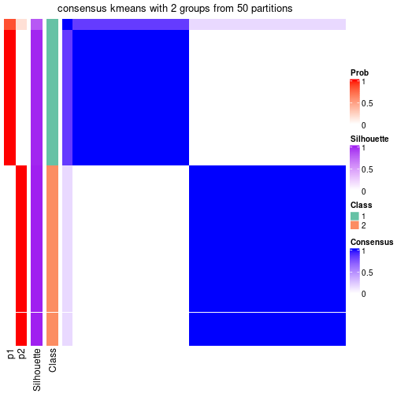</p>

</div>
<div id='tab-node-052-consensus-heatmap-2'>
<pre><code class="r">consensus_heatmap(res, k = 3)
</code></pre>

<p>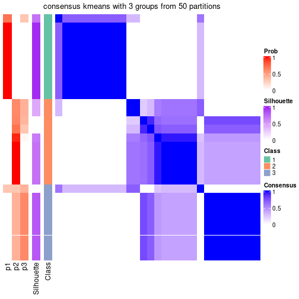</p>

</div>
<div id='tab-node-052-consensus-heatmap-3'>
<pre><code class="r">consensus_heatmap(res, k = 4)
</code></pre>

<p>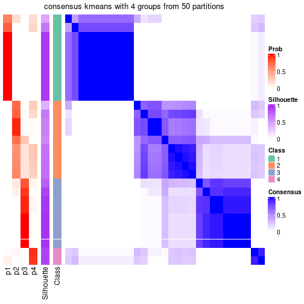</p>

</div>
<div id='tab-node-052-consensus-heatmap-4'>
<pre><code class="r">consensus_heatmap(res, k = 5)
</code></pre>

<p>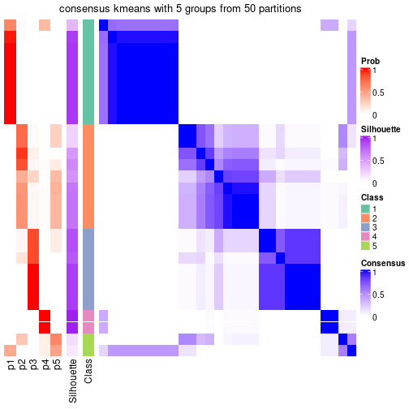</p>

</div>
<div id='tab-node-052-consensus-heatmap-5'>
<pre><code class="r">consensus_heatmap(res, k = 6)
</code></pre>

<p>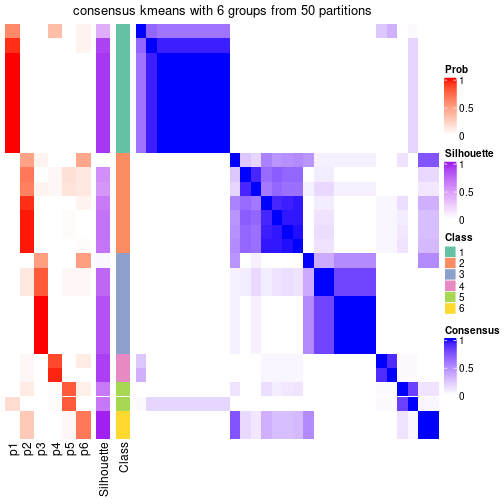</p>

</div>
<div id='tab-node-052-consensus-heatmap-6'>
<pre><code class="r">consensus_heatmap(res, k = 7)
</code></pre>

<p>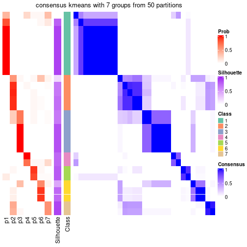</p>

</div>
<div id='tab-node-052-consensus-heatmap-7'>
<pre><code class="r">consensus_heatmap(res, k = 8)
</code></pre>

<p>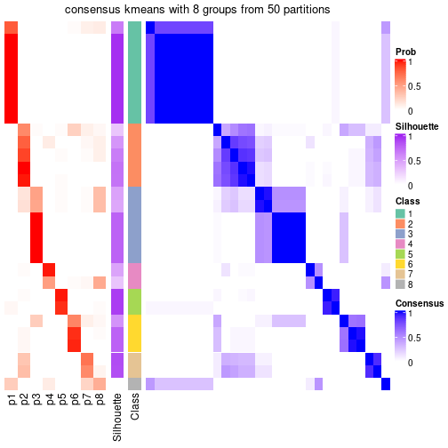</p>

</div>
</div>

Heatmaps for the membership of samples in all partitions to see how consistent they are:


<script>
$( function() {
	$( '#tabs-node-052-membership-heatmap' ).tabs();
} );
</script>
<div id='tabs-node-052-membership-heatmap'>
<ul>
<li><a href='#tab-node-052-membership-heatmap-1'>k = 2</a></li>
<li><a href='#tab-node-052-membership-heatmap-2'>k = 3</a></li>
<li><a href='#tab-node-052-membership-heatmap-3'>k = 4</a></li>
<li><a href='#tab-node-052-membership-heatmap-4'>k = 5</a></li>
<li><a href='#tab-node-052-membership-heatmap-5'>k = 6</a></li>
<li><a href='#tab-node-052-membership-heatmap-6'>k = 7</a></li>
<li><a href='#tab-node-052-membership-heatmap-7'>k = 8</a></li>
</ul>
<div id='tab-node-052-membership-heatmap-1'>
<pre><code class="r">membership_heatmap(res, k = 2)
</code></pre>

<p>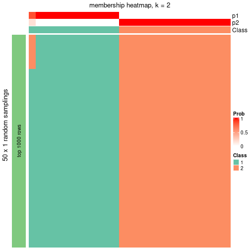</p>

</div>
<div id='tab-node-052-membership-heatmap-2'>
<pre><code class="r">membership_heatmap(res, k = 3)
</code></pre>

<p>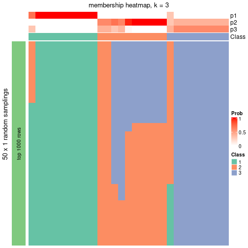</p>

</div>
<div id='tab-node-052-membership-heatmap-3'>
<pre><code class="r">membership_heatmap(res, k = 4)
</code></pre>

<p>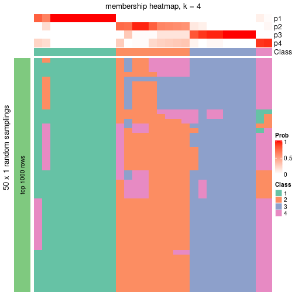</p>

</div>
<div id='tab-node-052-membership-heatmap-4'>
<pre><code class="r">membership_heatmap(res, k = 5)
</code></pre>

<p>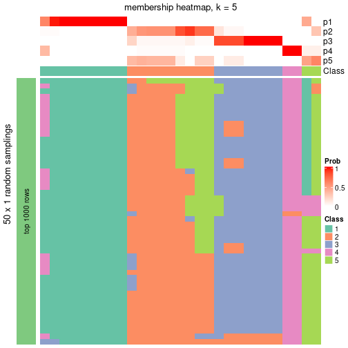</p>

</div>
<div id='tab-node-052-membership-heatmap-5'>
<pre><code class="r">membership_heatmap(res, k = 6)
</code></pre>

<p>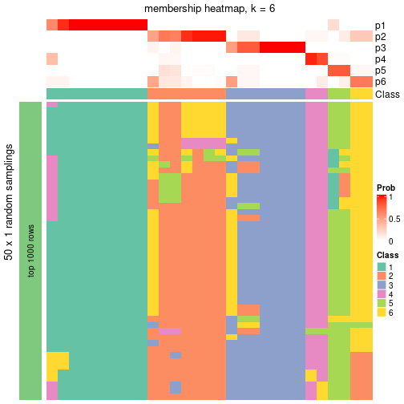</p>

</div>
<div id='tab-node-052-membership-heatmap-6'>
<pre><code class="r">membership_heatmap(res, k = 7)
</code></pre>

<p>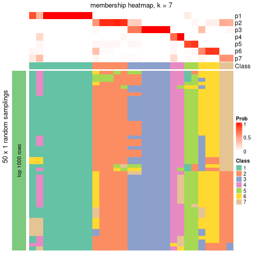</p>

</div>
<div id='tab-node-052-membership-heatmap-7'>
<pre><code class="r">membership_heatmap(res, k = 8)
</code></pre>

<p>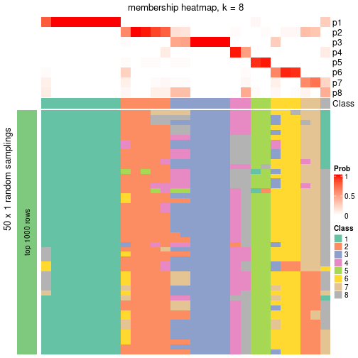</p>

</div>
</div>

As soon as the classes for columns are determined, the signatures
that are significantly different between subgroups can be looked for. 
Following are the heatmaps for signatures.


<script>
$( function() {
	$( '#tabs-node-052-get-signatures' ).tabs();
} );
</script>
<div id='tabs-node-052-get-signatures'>
<ul>
<li><a href='#tab-node-052-get-signatures-1'>k = 2</a></li>
<li><a href='#tab-node-052-get-signatures-2'>k = 3</a></li>
<li><a href='#tab-node-052-get-signatures-3'>k = 4</a></li>
<li><a href='#tab-node-052-get-signatures-4'>k = 5</a></li>
<li><a href='#tab-node-052-get-signatures-5'>k = 6</a></li>
<li><a href='#tab-node-052-get-signatures-6'>k = 7</a></li>
<li><a href='#tab-node-052-get-signatures-7'>k = 8</a></li>
</ul>
<div id='tab-node-052-get-signatures-1'>
<pre><code class="r">get_signatures(res, k = 2)
</code></pre>

<p>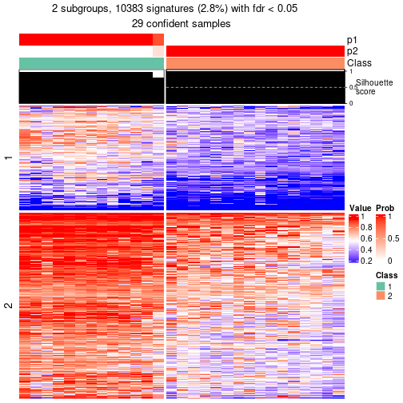</p>

</div>
<div id='tab-node-052-get-signatures-2'>
<pre><code class="r">get_signatures(res, k = 3)
</code></pre>

<p>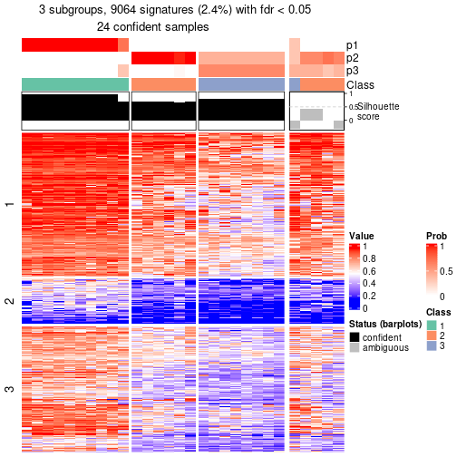</p>

</div>
<div id='tab-node-052-get-signatures-3'>
<pre><code class="r">get_signatures(res, k = 4)
</code></pre>

<p>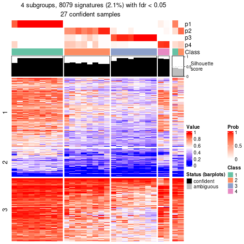</p>

</div>
<div id='tab-node-052-get-signatures-4'>
<pre><code class="r">get_signatures(res, k = 5)
</code></pre>

<p></p>

</div>
<div id='tab-node-052-get-signatures-5'>
<pre><code class="r">get_signatures(res, k = 6)
</code></pre>

<p>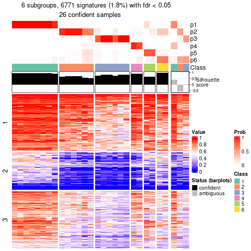</p>

</div>
<div id='tab-node-052-get-signatures-6'>
<pre><code class="r">get_signatures(res, k = 7)
</code></pre>

<p>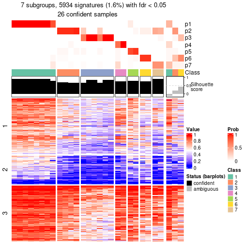</p>

</div>
<div id='tab-node-052-get-signatures-7'>
<pre><code class="r">get_signatures(res, k = 8)
</code></pre>

<p>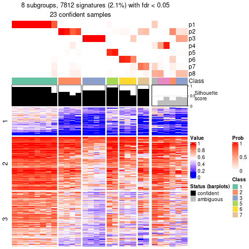</p>

</div>
</div>


Compare the overlap of signatures from different k:

```r
compare_signatures(res)
```

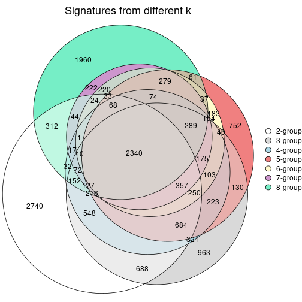

`get_signature()` returns a data frame invisibly. To get the list of signatures, the function
call should be assigned to a variable explicitly. In following code, if `plot` argument is set
to `FALSE`, no heatmap is plotted while only the differential analysis is performed.

```r
# code only for demonstration
tb = get_signature(res, k = ..., plot = FALSE)
```

An example of the output of `tb` is:

```
#>   which_row         fdr    mean_1    mean_2 scaled_mean_1 scaled_mean_2 km
#> 1        38 0.042760348  8.373488  9.131774    -0.5533452     0.5164555  1
#> 2        40 0.018707592  7.106213  8.469186    -0.6173731     0.5762149  1
#> 3        55 0.019134737 10.221463 11.207825    -0.6159697     0.5749050  1
#> 4        59 0.006059896  5.921854  7.869574    -0.6899429     0.6439467  1
#> 5        60 0.018055526  8.928898 10.211722    -0.6204761     0.5791110  1
#> 6        98 0.009384629 15.714769 14.887706     0.6635654    -0.6193277  2
...
```

The columns in `tb` are:

1. `which_row`: row indices corresponding to the input matrix.
2. `fdr`: FDR for the differential test. 
3. `mean_x`: The mean value in group x.
4. `scaled_mean_x`: The mean value in group x after rows are scaled.
5. `km`: Row groups if k-means clustering is applied to rows (which is done by automatically selecting number of clusters).

If there are too many signatures, `top_signatures = ...` can be set to only show the 
signatures with the highest FDRs:

```r
# code only for demonstration
# e.g. to show the top 500 most significant rows
tb = get_signature(res, k = ..., top_signatures = 500)
```

If the signatures are defined as these which are uniquely high in current group, `diff_method` argument
can be set to `"uniquely_high_in_one_group"`:

```r
# code only for demonstration
tb = get_signature(res, k = ..., diff_method = "uniquely_high_in_one_group")
```


UMAP plot which shows how samples are separated.


<script>
$( function() {
	$( '#tabs-node-052-dimension-reduction' ).tabs();
} );
</script>
<div id='tabs-node-052-dimension-reduction'>
<ul>
<li><a href='#tab-node-052-dimension-reduction-1'>k = 2</a></li>
<li><a href='#tab-node-052-dimension-reduction-2'>k = 3</a></li>
<li><a href='#tab-node-052-dimension-reduction-3'>k = 4</a></li>
<li><a href='#tab-node-052-dimension-reduction-4'>k = 5</a></li>
<li><a href='#tab-node-052-dimension-reduction-5'>k = 6</a></li>
<li><a href='#tab-node-052-dimension-reduction-6'>k = 7</a></li>
<li><a href='#tab-node-052-dimension-reduction-7'>k = 8</a></li>
</ul>
<div id='tab-node-052-dimension-reduction-1'>
<pre><code class="r">dimension_reduction(res, k = 2, method = &quot;UMAP&quot;)
</code></pre>

<p>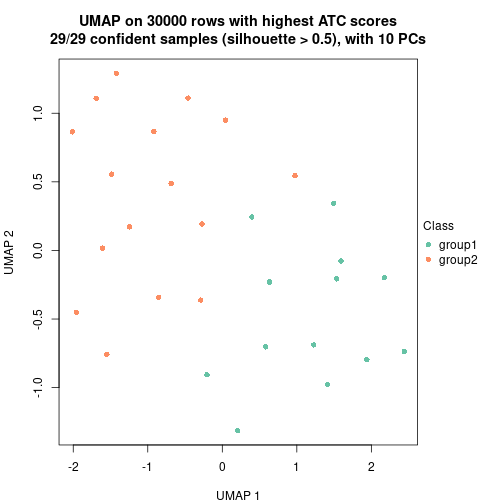</p>

</div>
<div id='tab-node-052-dimension-reduction-2'>
<pre><code class="r">dimension_reduction(res, k = 3, method = &quot;UMAP&quot;)
</code></pre>

<p>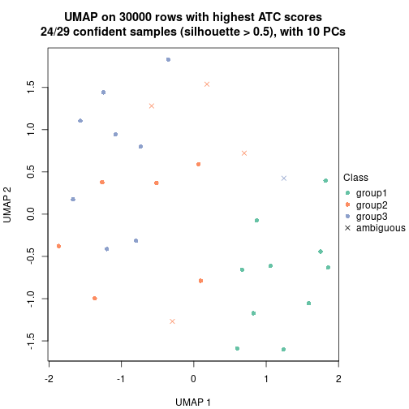</p>

</div>
<div id='tab-node-052-dimension-reduction-3'>
<pre><code class="r">dimension_reduction(res, k = 4, method = &quot;UMAP&quot;)
</code></pre>

<p>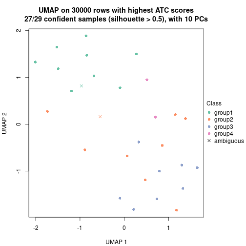</p>

</div>
<div id='tab-node-052-dimension-reduction-4'>
<pre><code class="r">dimension_reduction(res, k = 5, method = &quot;UMAP&quot;)
</code></pre>

<p>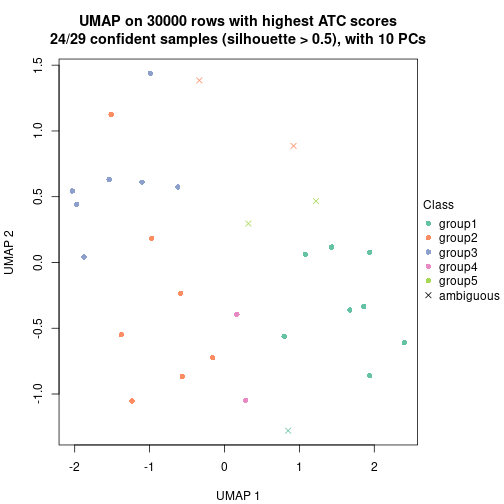</p>

</div>
<div id='tab-node-052-dimension-reduction-5'>
<pre><code class="r">dimension_reduction(res, k = 6, method = &quot;UMAP&quot;)
</code></pre>

<p></p>

</div>
<div id='tab-node-052-dimension-reduction-6'>
<pre><code class="r">dimension_reduction(res, k = 7, method = &quot;UMAP&quot;)
</code></pre>

<p>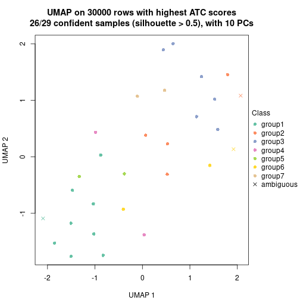</p>

</div>
<div id='tab-node-052-dimension-reduction-7'>
<pre><code class="r">dimension_reduction(res, k = 8, method = &quot;UMAP&quot;)
</code></pre>

<p>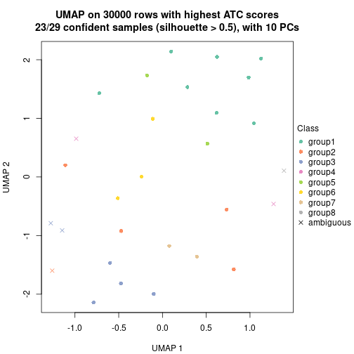</p>

</div>
</div>


Following heatmap shows how subgroups are split when increasing `k`:

```r
collect_classes(res)
```

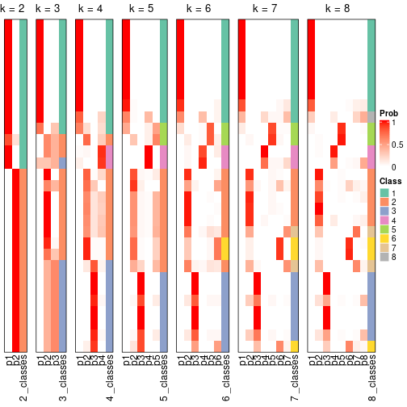


If matrix rows can be associated to genes, consider to use `functional_enrichment(res,
...)` to perform function enrichment for the signature genes. See [this vignette](https://jokergoo.github.io/cola_vignettes/functional_enrichment.html) for more detailed explanations.


 

---------------------------------------------------


### Node0521


Parent node: [Node052](#Node052).
Child nodes: 
                Node04121-leaf
        ,
                Node04122-leaf
        ,
                Node04123-leaf
        ,
                Node04321-leaf
        ,
                Node04322-leaf
        ,
                Node04323-leaf
        ,
                Node05211-leaf
        ,
                Node05212-leaf
        .


The object with results only for a single top-value method and a single partitioning method 
can be extracted as:

```r
res = res_rh["0521"]
```

A summary of `res` and all the functions that can be applied to it:

```r
res
```

```
#> A 'ConsensusPartition' object with k = 2, 3, 4, 5, 6, 7, 8.
#>   On a matrix with 30000 rows and 13 columns.
#>   Top rows (1000) are extracted by 'ATC' method.
#>   Subgroups are detected by 'kmeans' method.
#>   Performed in total 350 partitions by row resampling.
#>   Best k for subgroups seems to be 2.
#> 
#> Following methods can be applied to this 'ConsensusPartition' object:
#>  [1] "cola_report"             "collect_classes"         "collect_plots"          
#>  [4] "collect_stats"           "colnames"                "compare_partitions"     
#>  [7] "compare_signatures"      "consensus_heatmap"       "dimension_reduction"    
#> [10] "functional_enrichment"   "get_anno_col"            "get_anno"               
#> [13] "get_classes"             "get_consensus"           "get_matrix"             
#> [16] "get_membership"          "get_param"               "get_signatures"         
#> [19] "get_stats"               "is_best_k"               "is_stable_k"            
#> [22] "membership_heatmap"      "ncol"                    "nrow"                   
#> [25] "plot_ecdf"               "predict_classes"         "rownames"               
#> [28] "select_partition_number" "show"                    "suggest_best_k"         
#> [31] "test_to_known_factors"   "top_rows_heatmap"
```

`collect_plots()` function collects all the plots made from `res` for all `k` (number of subgroups)
into one single page to provide an easy and fast comparison between different `k`.

```r
collect_plots(res)
```

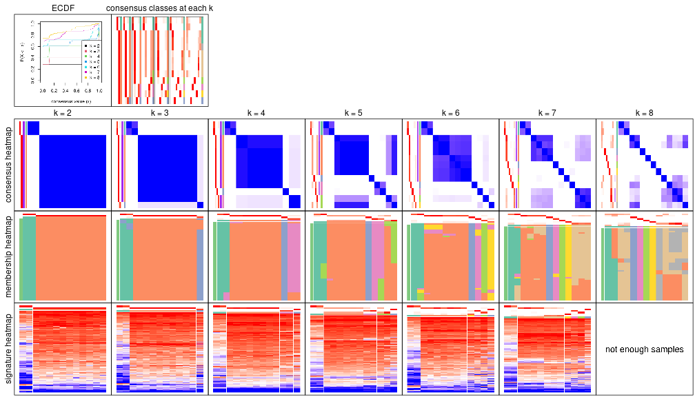

The plots are:

- The first row: a plot of the eCDF (empirical cumulative distribution
  function) curves of the consensus matrix for each `k` and the heatmap of
  predicted classes for each `k`.
- The second row: heatmaps of the consensus matrix for each `k`.
- The third row: heatmaps of the membership matrix for each `k`.
- The fouth row: heatmaps of the signatures for each `k`.

All the plots in panels can be made by individual functions and they are
plotted later in this section.

`select_partition_number()` produces several plots showing different
statistics for choosing "optimized" `k`. There are following statistics:

- eCDF curves of the consensus matrix for each `k`;
- 1-PAC. [The PAC score](https://en.wikipedia.org/wiki/Consensus_clustering#Over-interpretation_potential_of_consensus_clustering)
  measures the proportion of the ambiguous subgrouping.
- Mean silhouette score.
- Concordance. The mean probability of fiting the consensus subgroup labels in all
  partitions.
- Area increased. Denote $A_k$ as the area under the eCDF curve for current
  `k`, the area increased is defined as $A_k - A_{k-1}$.
- Rand index. The percent of pairs of samples that are both in a same cluster
  or both are not in a same cluster in the partition of k and k-1.
- Jaccard index. The ratio of pairs of samples are both in a same cluster in
  the partition of k and k-1 and the pairs of samples are both in a same
  cluster in the partition k or k-1.

The detailed explanations of these statistics can be found in [the _cola_
vignette](https://jokergoo.github.io/cola_vignettes/cola.html#toc_13).

Generally speaking, higher 1-PAC score, higher mean silhouette score or higher
concordance corresponds to better partition. Rand index and Jaccard index
measure how similar the current partition is compared to partition with `k-1`.
If they are too similar, we won't accept `k` is better than `k-1`.

```r
select_partition_number(res)
```

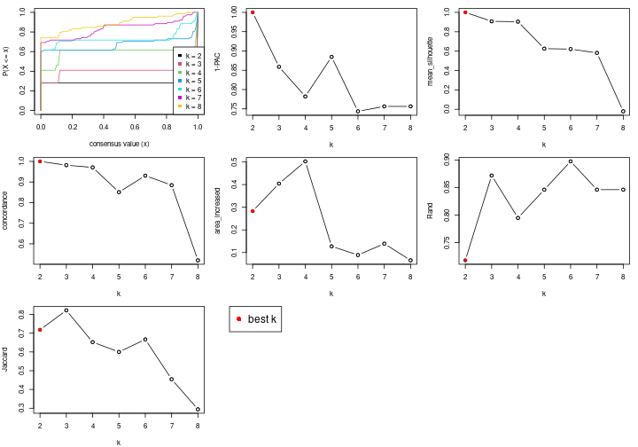

The numeric values for all these statistics can be obtained by `get_stats()`.

```r
get_stats(res)
```

```
#>   k 1-PAC mean_silhouette concordance area_increased  Rand Jaccard
#> 2 2 1.000           1.000       1.000         0.2828 0.718   0.718
#> 3 3 0.859           0.908       0.982         0.4043 0.872   0.821
#> 4 4 0.782           0.904       0.971         0.5023 0.795   0.652
#> 5 5 0.885           0.626       0.851         0.1273 0.846   0.600
#> 6 6 0.744           0.621       0.931         0.0892 0.897   0.667
#> 7 7 0.756           0.582       0.885         0.1393 0.846   0.455
#> 8 8 0.756          -0.021       0.520         0.0658 0.846   0.294
```

`suggest_best_k()` suggests the best $k$ based on these statistics. The rules are as follows:

- All $k$ with Jaccard index larger than 0.95 are removed because increasing
  $k$ does not provide enough extra information. If all $k$ are removed, it is
  marked as no subgroup is detected.
- For all $k$ with 1-PAC score larger than 0.9, the maximal $k$ is taken as
  the best $k$, and other $k$ are marked as optional $k$.
- If it does not fit the second rule. The $k$ with the maximal vote of the
  highest 1-PAC score, highest mean silhouette, and highest concordance is
  taken as the best $k$.

```r
suggest_best_k(res)
```

```
#> [1] 2
```


Following is the table of the partitions (You need to click the **show/hide
code output** link to see it). The membership matrix (columns with name `p*`)
is inferred by
[`clue::cl_consensus()`](https://www.rdocumentation.org/link/cl_consensus?package=clue)
function with the `SE` method. Basically the value in the membership matrix
represents the probability to belong to a certain group. The finall subgroup
label for an item is determined with the group with highest probability it
belongs to.

In `get_classes()` function, the entropy is calculated from the membership
matrix and the silhouette score is calculated from the consensus matrix.


<script>
$( function() {
	$( '#tabs-node-0521-get-classes' ).tabs();
} );
</script>
<div id='tabs-node-0521-get-classes'>
<ul>
<li><a href='#tab-node-0521-get-classes-1'>k = 2</a></li>
<li><a href='#tab-node-0521-get-classes-2'>k = 3</a></li>
<li><a href='#tab-node-0521-get-classes-3'>k = 4</a></li>
<li><a href='#tab-node-0521-get-classes-4'>k = 5</a></li>
<li><a href='#tab-node-0521-get-classes-5'>k = 6</a></li>
<li><a href='#tab-node-0521-get-classes-6'>k = 7</a></li>
<li><a href='#tab-node-0521-get-classes-7'>k = 8</a></li>
</ul>

<div id='tab-node-0521-get-classes-1'>
<p><a id='tab-node-0521-get-classes-1-a' style='color:#0366d6' href='#'>show/hide code output</a></p>
<pre><code class="r">cbind(get_classes(res, k = 2), get_membership(res, k = 2))
</code></pre>

<pre><code>#&gt;                 class entropy silhouette p1 p2
#&gt; TCGA.34.5240.01     2       0          1  0  1
#&gt; TCGA.33.4583.01     2       0          1  0  1
#&gt; TCGA.33.AASJ.01     2       0          1  0  1
#&gt; TCGA.58.A46M.01     2       0          1  0  1
#&gt; TCGA.39.5016.01     2       0          1  0  1
#&gt; TCGA.85.7698.01     2       0          1  0  1
#&gt; TCGA.56.7223.01     1       0          1  1  0
#&gt; TCGA.63.A5MJ.01     2       0          1  0  1
#&gt; TCGA.77.A5GF.01     2       0          1  0  1
#&gt; TCGA.85.8277.01     2       0          1  0  1
#&gt; TCGA.63.A5MB.01     1       0          1  1  0
#&gt; TCGA.85.A512.01     2       0          1  0  1
#&gt; TCGA.O2.A52S.01     2       0          1  0  1
</code></pre>

<script>
$('#tab-node-0521-get-classes-1-a').parent().next().next().hide();
$('#tab-node-0521-get-classes-1-a').click(function(){
  $('#tab-node-0521-get-classes-1-a').parent().next().next().toggle();
  return(false);
});
</script>
</div>

<div id='tab-node-0521-get-classes-2'>
<p><a id='tab-node-0521-get-classes-2-a' style='color:#0366d6' href='#'>show/hide code output</a></p>
<pre><code class="r">cbind(get_classes(res, k = 3), get_membership(res, k = 3))
</code></pre>

<pre><code>#&gt;                 class entropy silhouette   p1   p2   p3
#&gt; TCGA.34.5240.01     2   0.000      1.000 0.00 1.00 0.00
#&gt; TCGA.33.4583.01     2   0.000      1.000 0.00 1.00 0.00
#&gt; TCGA.33.AASJ.01     2   0.000      1.000 0.00 1.00 0.00
#&gt; TCGA.58.A46M.01     2   0.000      1.000 0.00 1.00 0.00
#&gt; TCGA.39.5016.01     2   0.000      1.000 0.00 1.00 0.00
#&gt; TCGA.85.7698.01     2   0.000      1.000 0.00 1.00 0.00
#&gt; TCGA.56.7223.01     1   0.334      0.901 0.88 0.00 0.12
#&gt; TCGA.63.A5MJ.01     2   0.000      1.000 0.00 1.00 0.00
#&gt; TCGA.77.A5GF.01     2   0.000      1.000 0.00 1.00 0.00
#&gt; TCGA.85.8277.01     2   0.000      1.000 0.00 1.00 0.00
#&gt; TCGA.63.A5MB.01     1   0.000      0.901 1.00 0.00 0.00
#&gt; TCGA.85.A512.01     3   0.334      0.000 0.00 0.12 0.88
#&gt; TCGA.O2.A52S.01     2   0.000      1.000 0.00 1.00 0.00
</code></pre>

<script>
$('#tab-node-0521-get-classes-2-a').parent().next().next().hide();
$('#tab-node-0521-get-classes-2-a').click(function(){
  $('#tab-node-0521-get-classes-2-a').parent().next().next().toggle();
  return(false);
});
</script>
</div>

<div id='tab-node-0521-get-classes-3'>
<p><a id='tab-node-0521-get-classes-3-a' style='color:#0366d6' href='#'>show/hide code output</a></p>
<pre><code class="r">cbind(get_classes(res, k = 4), get_membership(res, k = 4))
</code></pre>

<pre><code>#&gt;                 class entropy silhouette  p1   p2 p3   p4
#&gt; TCGA.34.5240.01     2  0.0707      0.980 0.0 0.98  0 0.02
#&gt; TCGA.33.4583.01     2  0.0000      0.994 0.0 1.00  0 0.00
#&gt; TCGA.33.AASJ.01     2  0.0707      0.980 0.0 0.98  0 0.02
#&gt; TCGA.58.A46M.01     4  0.2647      1.000 0.0 0.12  0 0.88
#&gt; TCGA.39.5016.01     2  0.0000      0.994 0.0 1.00  0 0.00
#&gt; TCGA.85.7698.01     2  0.0000      0.994 0.0 1.00  0 0.00
#&gt; TCGA.56.7223.01     1  0.2345      0.916 0.9 0.00  0 0.10
#&gt; TCGA.63.A5MJ.01     2  0.0000      0.994 0.0 1.00  0 0.00
#&gt; TCGA.77.A5GF.01     2  0.0000      0.994 0.0 1.00  0 0.00
#&gt; TCGA.85.8277.01     2  0.0000      0.994 0.0 1.00  0 0.00
#&gt; TCGA.63.A5MB.01     1  0.0000      0.916 1.0 0.00  0 0.00
#&gt; TCGA.85.A512.01     3  0.0000      0.000 0.0 0.00  1 0.00
#&gt; TCGA.O2.A52S.01     4  0.2647      1.000 0.0 0.12  0 0.88
</code></pre>

<script>
$('#tab-node-0521-get-classes-3-a').parent().next().next().hide();
$('#tab-node-0521-get-classes-3-a').click(function(){
  $('#tab-node-0521-get-classes-3-a').parent().next().next().toggle();
  return(false);
});
</script>
</div>

<div id='tab-node-0521-get-classes-4'>
<p><a id='tab-node-0521-get-classes-4-a' style='color:#0366d6' href='#'>show/hide code output</a></p>
<pre><code class="r">cbind(get_classes(res, k = 5), get_membership(res, k = 5))
</code></pre>

<pre><code>#&gt;                 class entropy silhouette  p1   p2 p3   p4   p5
#&gt; TCGA.34.5240.01     5  0.0000     0.0572 0.0 0.00  0 0.00 1.00
#&gt; TCGA.33.4583.01     2  0.4302     0.9846 0.0 0.52  0 0.00 0.48
#&gt; TCGA.33.AASJ.01     5  0.4302    -0.9165 0.0 0.48  0 0.00 0.52
#&gt; TCGA.58.A46M.01     4  0.0609     0.7502 0.0 0.02  0 0.98 0.00
#&gt; TCGA.39.5016.01     2  0.4302     0.9846 0.0 0.52  0 0.00 0.48
#&gt; TCGA.85.7698.01     2  0.4302     0.9846 0.0 0.52  0 0.00 0.48
#&gt; TCGA.56.7223.01     1  0.3109     0.8259 0.8 0.20  0 0.00 0.00
#&gt; TCGA.63.A5MJ.01     2  0.4287     0.9217 0.0 0.54  0 0.00 0.46
#&gt; TCGA.77.A5GF.01     2  0.4302     0.9846 0.0 0.52  0 0.00 0.48
#&gt; TCGA.85.8277.01     2  0.4302     0.9846 0.0 0.52  0 0.00 0.48
#&gt; TCGA.63.A5MB.01     1  0.0000     0.8259 1.0 0.00  0 0.00 0.00
#&gt; TCGA.85.A512.01     3  0.0000     0.0000 0.0 0.00  1 0.00 0.00
#&gt; TCGA.O2.A52S.01     4  0.3561     0.7502 0.0 0.26  0 0.74 0.00
</code></pre>

<script>
$('#tab-node-0521-get-classes-4-a').parent().next().next().hide();
$('#tab-node-0521-get-classes-4-a').click(function(){
  $('#tab-node-0521-get-classes-4-a').parent().next().next().toggle();
  return(false);
});
</script>
</div>

<div id='tab-node-0521-get-classes-5'>
<p><a id='tab-node-0521-get-classes-5-a' style='color:#0366d6' href='#'>show/hide code output</a></p>
<pre><code class="r">cbind(get_classes(res, k = 6), get_membership(res, k = 6))
</code></pre>

<pre><code>#&gt;                 class entropy silhouette   p1   p2 p3   p4   p5   p6
#&gt; TCGA.34.5240.01     5  0.1814      0.000 0.00 0.10  0 0.00 0.90 0.00
#&gt; TCGA.33.4583.01     2  0.2260      0.915 0.00 0.86  0 0.00 0.00 0.14
#&gt; TCGA.33.AASJ.01     2  0.2790      0.903 0.00 0.84  0 0.00 0.02 0.14
#&gt; TCGA.58.A46M.01     4  0.0000      0.000 0.00 0.00  0 1.00 0.00 0.00
#&gt; TCGA.39.5016.01     2  0.2048      0.921 0.00 0.88  0 0.00 0.00 0.12
#&gt; TCGA.85.7698.01     2  0.2048      0.921 0.00 0.88  0 0.00 0.00 0.12
#&gt; TCGA.56.7223.01     1  0.3045      0.862 0.84 0.00  0 0.00 0.10 0.06
#&gt; TCGA.63.A5MJ.01     2  0.0547      0.889 0.00 0.98  0 0.02 0.00 0.00
#&gt; TCGA.77.A5GF.01     2  0.0000      0.901 0.00 1.00  0 0.00 0.00 0.00
#&gt; TCGA.85.8277.01     2  0.0000      0.901 0.00 1.00  0 0.00 0.00 0.00
#&gt; TCGA.63.A5MB.01     1  0.0000      0.862 1.00 0.00  0 0.00 0.00 0.00
#&gt; TCGA.85.A512.01     3  0.0000      0.000 0.00 0.00  1 0.00 0.00 0.00
#&gt; TCGA.O2.A52S.01     6  0.2793      0.000 0.00 0.00  0 0.20 0.00 0.80
</code></pre>

<script>
$('#tab-node-0521-get-classes-5-a').parent().next().next().hide();
$('#tab-node-0521-get-classes-5-a').click(function(){
  $('#tab-node-0521-get-classes-5-a').parent().next().next().toggle();
  return(false);
});
</script>
</div>

<div id='tab-node-0521-get-classes-6'>
<p><a id='tab-node-0521-get-classes-6-a' style='color:#0366d6' href='#'>show/hide code output</a></p>
<pre><code class="r">cbind(get_classes(res, k = 7), get_membership(res, k = 7))
</code></pre>

<pre><code>#&gt;                 class entropy silhouette   p1   p2 p3   p4   p5   p6   p7
#&gt; TCGA.34.5240.01     5   0.000      0.000 0.00 0.00  0 0.00 1.00 0.00 0.00
#&gt; TCGA.33.4583.01     2   0.000      0.867 0.00 1.00  0 0.00 0.00 0.00 0.00
#&gt; TCGA.33.AASJ.01     2   0.202      0.825 0.00 0.90  0 0.00 0.04 0.00 0.06
#&gt; TCGA.58.A46M.01     4   0.117      0.000 0.00 0.00  0 0.94 0.00 0.06 0.00
#&gt; TCGA.39.5016.01     2   0.167      0.863 0.00 0.90  0 0.00 0.00 0.00 0.10
#&gt; TCGA.85.7698.01     2   0.167      0.871 0.00 0.90  0 0.00 0.00 0.00 0.10
#&gt; TCGA.56.7223.01     1   0.379      0.750 0.72 0.00  0 0.06 0.00 0.00 0.22
#&gt; TCGA.63.A5MJ.01     7   0.271      0.857 0.00 0.22  0 0.00 0.00 0.00 0.78
#&gt; TCGA.77.A5GF.01     7   0.329      0.883 0.00 0.34  0 0.00 0.00 0.00 0.66
#&gt; TCGA.85.8277.01     7   0.314      0.900 0.00 0.30  0 0.00 0.00 0.00 0.70
#&gt; TCGA.63.A5MB.01     1   0.000      0.750 1.00 0.00  0 0.00 0.00 0.00 0.00
#&gt; TCGA.85.A512.01     3   0.000      0.000 0.00 0.00  1 0.00 0.00 0.00 0.00
#&gt; TCGA.O2.A52S.01     6   0.000      0.000 0.00 0.00  0 0.00 0.00 1.00 0.00
</code></pre>

<script>
$('#tab-node-0521-get-classes-6-a').parent().next().next().hide();
$('#tab-node-0521-get-classes-6-a').click(function(){
  $('#tab-node-0521-get-classes-6-a').parent().next().next().toggle();
  return(false);
});
</script>
</div>

<div id='tab-node-0521-get-classes-7'>
<p><a id='tab-node-0521-get-classes-7-a' style='color:#0366d6' href='#'>show/hide code output</a></p>
<pre><code class="r">cbind(get_classes(res, k = 8), get_membership(res, k = 8))
</code></pre>

<pre><code>#&gt;                 class entropy silhouette   p1   p2 p3 p4 p5 p6   p7   p8
#&gt; TCGA.34.5240.01     5   0.000    0.00000 0.00 0.00  0  0  1  0 0.00 0.00
#&gt; TCGA.33.4583.01     1   0.470   -0.68901 0.44 0.00  0  0  0  0 0.12 0.44
#&gt; TCGA.33.AASJ.01     7   0.422   -0.08620 0.44 0.06  0  0  0  0 0.50 0.00
#&gt; TCGA.58.A46M.01     4   0.000    0.00000 0.00 0.00  0  1  0  0 0.00 0.00
#&gt; TCGA.39.5016.01     8   0.490    0.00000 0.28 0.00  0  0  0  0 0.20 0.52
#&gt; TCGA.85.7698.01     1   0.522   -0.78496 0.38 0.00  0  0  0  0 0.26 0.36
#&gt; TCGA.56.7223.01     1   0.455   -0.00915 0.48 0.10  0  0  0  0 0.00 0.42
#&gt; TCGA.63.A5MJ.01     7   0.333    0.20896 0.00 0.50  0  0  0  0 0.50 0.00
#&gt; TCGA.77.A5GF.01     7   0.156    0.55290 0.02 0.06  0  0  0  0 0.92 0.00
#&gt; TCGA.85.8277.01     7   0.000    0.54412 0.00 0.00  0  0  0  0 1.00 0.00
#&gt; TCGA.63.A5MB.01     1   0.330   -0.00915 0.56 0.44  0  0  0  0 0.00 0.00
#&gt; TCGA.85.A512.01     3   0.000    0.00000 0.00 0.00  1  0  0  0 0.00 0.00
#&gt; TCGA.O2.A52S.01     6   0.000    0.00000 0.00 0.00  0  0  0  1 0.00 0.00
</code></pre>

<script>
$('#tab-node-0521-get-classes-7-a').parent().next().next().hide();
$('#tab-node-0521-get-classes-7-a').click(function(){
  $('#tab-node-0521-get-classes-7-a').parent().next().next().toggle();
  return(false);
});
</script>
</div>
</div>

Heatmaps for the consensus matrix. It visualizes the probability of two
samples to be in a same group.


<script>
$( function() {
	$( '#tabs-node-0521-consensus-heatmap' ).tabs();
} );
</script>
<div id='tabs-node-0521-consensus-heatmap'>
<ul>
<li><a href='#tab-node-0521-consensus-heatmap-1'>k = 2</a></li>
<li><a href='#tab-node-0521-consensus-heatmap-2'>k = 3</a></li>
<li><a href='#tab-node-0521-consensus-heatmap-3'>k = 4</a></li>
<li><a href='#tab-node-0521-consensus-heatmap-4'>k = 5</a></li>
<li><a href='#tab-node-0521-consensus-heatmap-5'>k = 6</a></li>
<li><a href='#tab-node-0521-consensus-heatmap-6'>k = 7</a></li>
<li><a href='#tab-node-0521-consensus-heatmap-7'>k = 8</a></li>
</ul>
<div id='tab-node-0521-consensus-heatmap-1'>
<pre><code class="r">consensus_heatmap(res, k = 2)
</code></pre>

<p></p>

</div>
<div id='tab-node-0521-consensus-heatmap-2'>
<pre><code class="r">consensus_heatmap(res, k = 3)
</code></pre>

<p>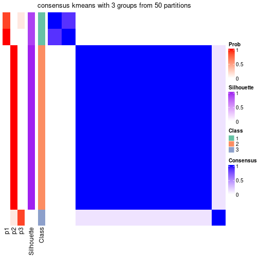</p>

</div>
<div id='tab-node-0521-consensus-heatmap-3'>
<pre><code class="r">consensus_heatmap(res, k = 4)
</code></pre>

<p></p>

</div>
<div id='tab-node-0521-consensus-heatmap-4'>
<pre><code class="r">consensus_heatmap(res, k = 5)
</code></pre>

<p>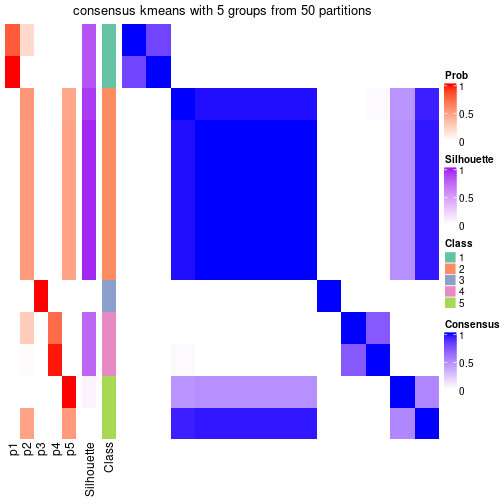</p>

</div>
<div id='tab-node-0521-consensus-heatmap-5'>
<pre><code class="r">consensus_heatmap(res, k = 6)
</code></pre>

<p>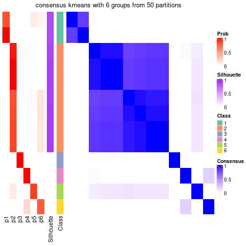</p>

</div>
<div id='tab-node-0521-consensus-heatmap-6'>
<pre><code class="r">consensus_heatmap(res, k = 7)
</code></pre>

<p>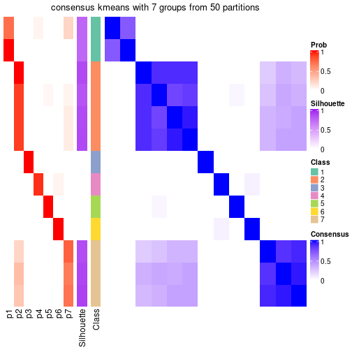</p>

</div>
<div id='tab-node-0521-consensus-heatmap-7'>
<pre><code class="r">consensus_heatmap(res, k = 8)
</code></pre>

<p>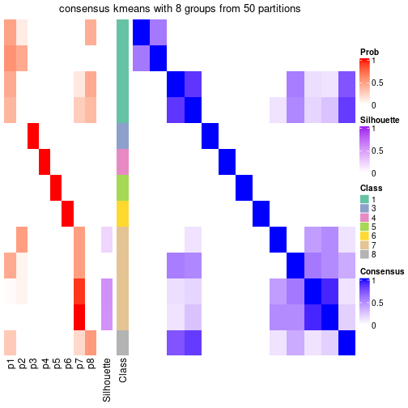</p>

</div>
</div>

Heatmaps for the membership of samples in all partitions to see how consistent they are:


<script>
$( function() {
	$( '#tabs-node-0521-membership-heatmap' ).tabs();
} );
</script>
<div id='tabs-node-0521-membership-heatmap'>
<ul>
<li><a href='#tab-node-0521-membership-heatmap-1'>k = 2</a></li>
<li><a href='#tab-node-0521-membership-heatmap-2'>k = 3</a></li>
<li><a href='#tab-node-0521-membership-heatmap-3'>k = 4</a></li>
<li><a href='#tab-node-0521-membership-heatmap-4'>k = 5</a></li>
<li><a href='#tab-node-0521-membership-heatmap-5'>k = 6</a></li>
<li><a href='#tab-node-0521-membership-heatmap-6'>k = 7</a></li>
<li><a href='#tab-node-0521-membership-heatmap-7'>k = 8</a></li>
</ul>
<div id='tab-node-0521-membership-heatmap-1'>
<pre><code class="r">membership_heatmap(res, k = 2)
</code></pre>

<p>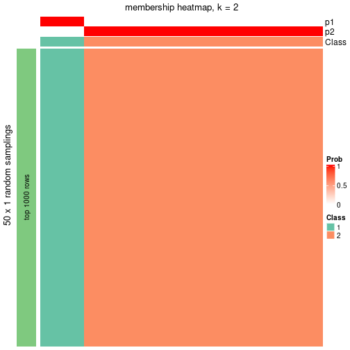</p>

</div>
<div id='tab-node-0521-membership-heatmap-2'>
<pre><code class="r">membership_heatmap(res, k = 3)
</code></pre>

<p>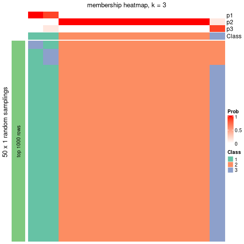</p>

</div>
<div id='tab-node-0521-membership-heatmap-3'>
<pre><code class="r">membership_heatmap(res, k = 4)
</code></pre>

<p>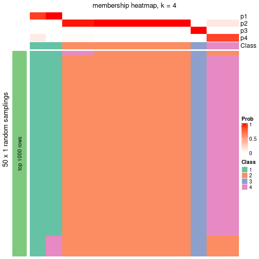</p>

</div>
<div id='tab-node-0521-membership-heatmap-4'>
<pre><code class="r">membership_heatmap(res, k = 5)
</code></pre>

<p>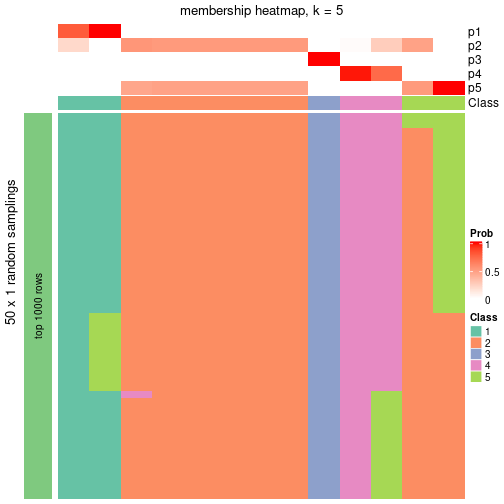</p>

</div>
<div id='tab-node-0521-membership-heatmap-5'>
<pre><code class="r">membership_heatmap(res, k = 6)
</code></pre>

<p>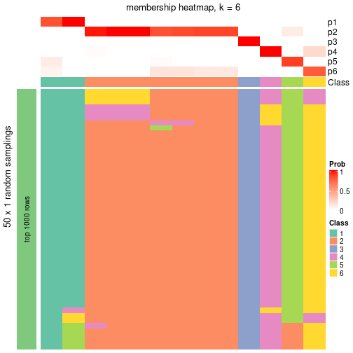</p>

</div>
<div id='tab-node-0521-membership-heatmap-6'>
<pre><code class="r">membership_heatmap(res, k = 7)
</code></pre>

<p>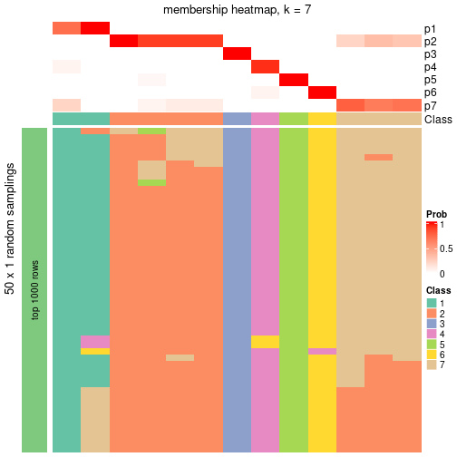</p>

</div>
<div id='tab-node-0521-membership-heatmap-7'>
<pre><code class="r">membership_heatmap(res, k = 8)
</code></pre>

<p>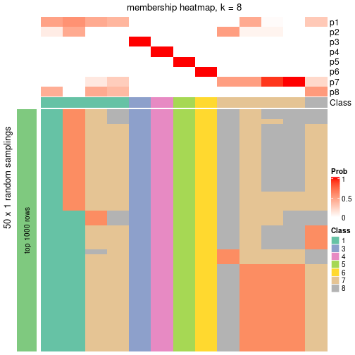</p>

</div>
</div>

As soon as the classes for columns are determined, the signatures
that are significantly different between subgroups can be looked for. 
Following are the heatmaps for signatures.


<script>
$( function() {
	$( '#tabs-node-0521-get-signatures' ).tabs();
} );
</script>
<div id='tabs-node-0521-get-signatures'>
<ul>
<li><a href='#tab-node-0521-get-signatures-1'>k = 2</a></li>
<li><a href='#tab-node-0521-get-signatures-2'>k = 3</a></li>
<li><a href='#tab-node-0521-get-signatures-3'>k = 4</a></li>
<li><a href='#tab-node-0521-get-signatures-4'>k = 5</a></li>
<li><a href='#tab-node-0521-get-signatures-5'>k = 6</a></li>
<li><a href='#tab-node-0521-get-signatures-6'>k = 7</a></li>
<li><a href='#tab-node-0521-get-signatures-7'>k = 8</a></li>
</ul>
<div id='tab-node-0521-get-signatures-1'>
<pre><code class="r">get_signatures(res, k = 2)
</code></pre>

<p>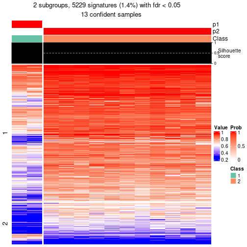</p>

</div>
<div id='tab-node-0521-get-signatures-2'>
<pre><code class="r">get_signatures(res, k = 3)
</code></pre>

<p>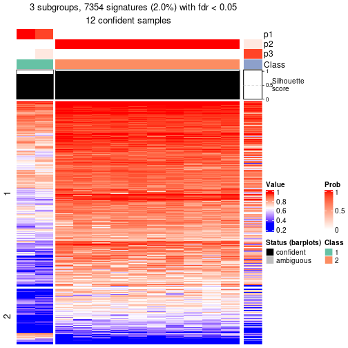</p>

</div>
<div id='tab-node-0521-get-signatures-3'>
<pre><code class="r">get_signatures(res, k = 4)
</code></pre>

<p>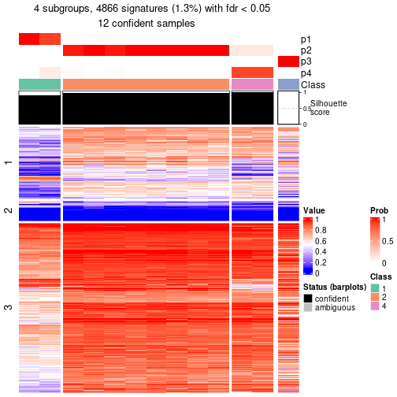</p>

</div>
<div id='tab-node-0521-get-signatures-4'>
<pre><code class="r">get_signatures(res, k = 5)
</code></pre>

<p>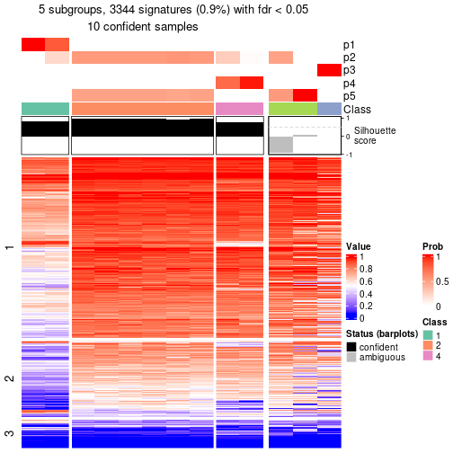</p>

</div>
<div id='tab-node-0521-get-signatures-5'>
<pre><code class="r">get_signatures(res, k = 6)
</code></pre>

<p>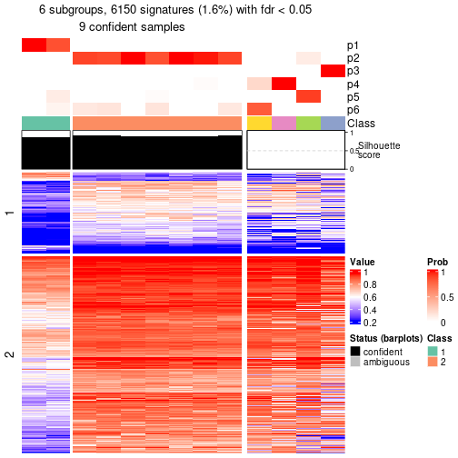</p>

</div>
<div id='tab-node-0521-get-signatures-6'>
<pre><code class="r">get_signatures(res, k = 7)
</code></pre>

<p>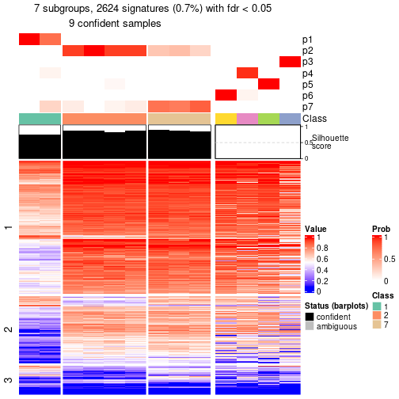</p>

</div>
<div id='tab-node-0521-get-signatures-7'>
<pre><code class="r">get_signatures(res, k = 8)
</code></pre>

<p></p>

</div>
</div>


Compare the overlap of signatures from different k:

```r
compare_signatures(res)
```

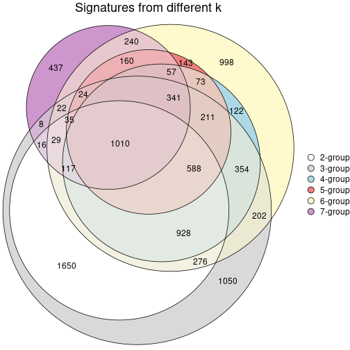

`get_signature()` returns a data frame invisibly. To get the list of signatures, the function
call should be assigned to a variable explicitly. In following code, if `plot` argument is set
to `FALSE`, no heatmap is plotted while only the differential analysis is performed.

```r
# code only for demonstration
tb = get_signature(res, k = ..., plot = FALSE)
```

An example of the output of `tb` is:

```
#>   which_row         fdr    mean_1    mean_2 scaled_mean_1 scaled_mean_2 km
#> 1        38 0.042760348  8.373488  9.131774    -0.5533452     0.5164555  1
#> 2        40 0.018707592  7.106213  8.469186    -0.6173731     0.5762149  1
#> 3        55 0.019134737 10.221463 11.207825    -0.6159697     0.5749050  1
#> 4        59 0.006059896  5.921854  7.869574    -0.6899429     0.6439467  1
#> 5        60 0.018055526  8.928898 10.211722    -0.6204761     0.5791110  1
#> 6        98 0.009384629 15.714769 14.887706     0.6635654    -0.6193277  2
...
```

The columns in `tb` are:

1. `which_row`: row indices corresponding to the input matrix.
2. `fdr`: FDR for the differential test. 
3. `mean_x`: The mean value in group x.
4. `scaled_mean_x`: The mean value in group x after rows are scaled.
5. `km`: Row groups if k-means clustering is applied to rows (which is done by automatically selecting number of clusters).

If there are too many signatures, `top_signatures = ...` can be set to only show the 
signatures with the highest FDRs:

```r
# code only for demonstration
# e.g. to show the top 500 most significant rows
tb = get_signature(res, k = ..., top_signatures = 500)
```

If the signatures are defined as these which are uniquely high in current group, `diff_method` argument
can be set to `"uniquely_high_in_one_group"`:

```r
# code only for demonstration
tb = get_signature(res, k = ..., diff_method = "uniquely_high_in_one_group")
```


UMAP plot which shows how samples are separated.


<script>
$( function() {
	$( '#tabs-node-0521-dimension-reduction' ).tabs();
} );
</script>
<div id='tabs-node-0521-dimension-reduction'>
<ul>
<li><a href='#tab-node-0521-dimension-reduction-1'>k = 2</a></li>
<li><a href='#tab-node-0521-dimension-reduction-2'>k = 3</a></li>
<li><a href='#tab-node-0521-dimension-reduction-3'>k = 4</a></li>
<li><a href='#tab-node-0521-dimension-reduction-4'>k = 5</a></li>
<li><a href='#tab-node-0521-dimension-reduction-5'>k = 6</a></li>
<li><a href='#tab-node-0521-dimension-reduction-6'>k = 7</a></li>
<li><a href='#tab-node-0521-dimension-reduction-7'>k = 8</a></li>
</ul>
<div id='tab-node-0521-dimension-reduction-1'>
<pre><code class="r">dimension_reduction(res, k = 2, method = &quot;UMAP&quot;)
</code></pre>

<p>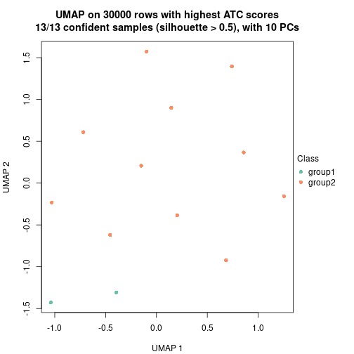</p>

</div>
<div id='tab-node-0521-dimension-reduction-2'>
<pre><code class="r">dimension_reduction(res, k = 3, method = &quot;UMAP&quot;)
</code></pre>

<p>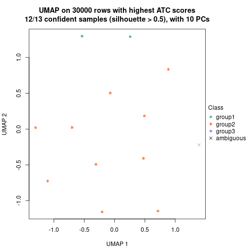</p>

</div>
<div id='tab-node-0521-dimension-reduction-3'>
<pre><code class="r">dimension_reduction(res, k = 4, method = &quot;UMAP&quot;)
</code></pre>

<p>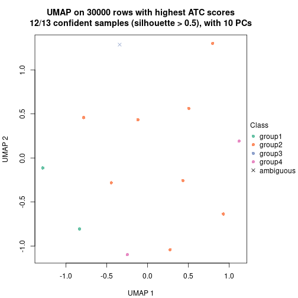</p>

</div>
<div id='tab-node-0521-dimension-reduction-4'>
<pre><code class="r">dimension_reduction(res, k = 5, method = &quot;UMAP&quot;)
</code></pre>

<p>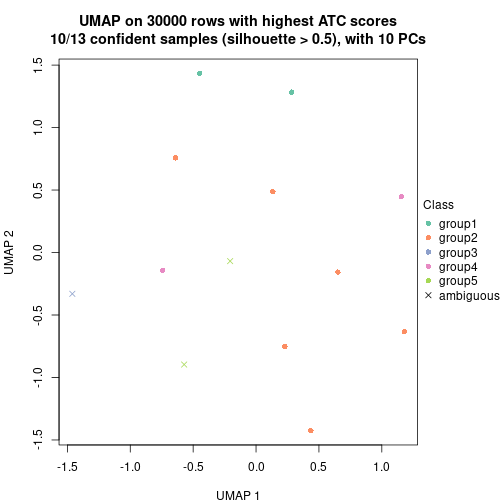</p>

</div>
<div id='tab-node-0521-dimension-reduction-5'>
<pre><code class="r">dimension_reduction(res, k = 6, method = &quot;UMAP&quot;)
</code></pre>

<p>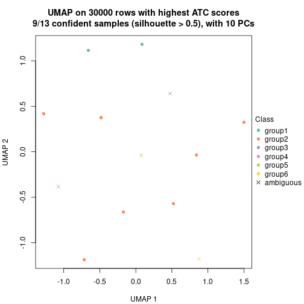</p>

</div>
<div id='tab-node-0521-dimension-reduction-6'>
<pre><code class="r">dimension_reduction(res, k = 7, method = &quot;UMAP&quot;)
</code></pre>

<p>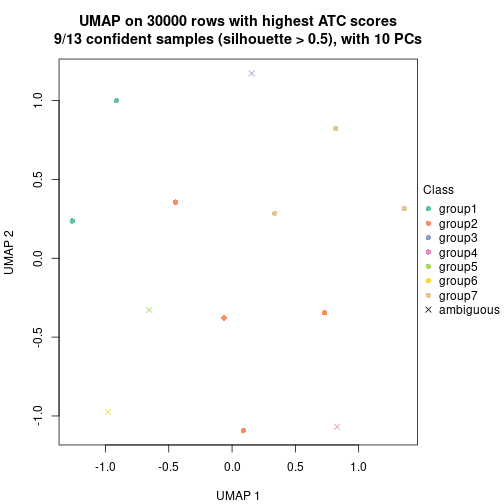</p>

</div>
<div id='tab-node-0521-dimension-reduction-7'>
<pre><code class="r">dimension_reduction(res, k = 8, method = &quot;UMAP&quot;)
</code></pre>

<p>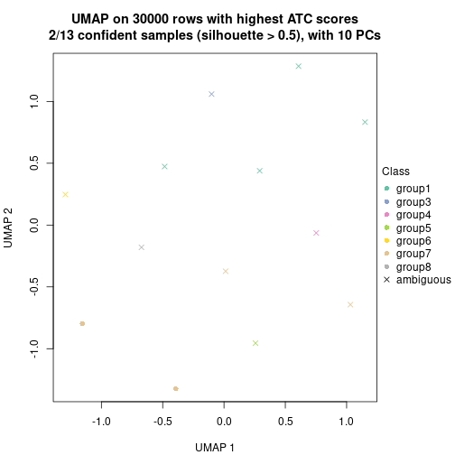</p>

</div>
</div>


Following heatmap shows how subgroups are split when increasing `k`:

```r
collect_classes(res)
```

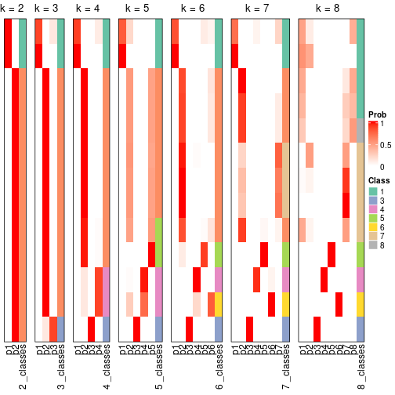


If matrix rows can be associated to genes, consider to use `functional_enrichment(res,
...)` to perform function enrichment for the signature genes. See [this vignette](https://jokergoo.github.io/cola_vignettes/functional_enrichment.html) for more detailed explanations.


 

---------------------------------------------------


### Node053


Parent node: [Node05](#Node05).
Child nodes: 
                Node0111-leaf
        ,
                Node0112-leaf
        ,
                Node0113-leaf
        ,
                Node0121-leaf
        ,
                Node0122-leaf
        ,
                Node0123-leaf
        ,
                Node0124-leaf
        ,
                Node0311-leaf
        ,
                Node0312-leaf
        ,
                Node0331-leaf
        ,
                Node0332-leaf
        ,
                Node0341-leaf
        ,
                Node0342-leaf
        ,
                Node0411-leaf
        ,
                [Node0412](#Node0412)
        ,
                Node0413-leaf
        ,
                Node0421-leaf
        ,
                Node0422-leaf
        ,
                Node0423-leaf
        ,
                Node0431-leaf
        ,
                [Node0432](#Node0432)
        ,
                Node0433-leaf
        ,
                Node0511-leaf
        ,
                Node0512-leaf
        ,
                Node0513-leaf
        ,
                [Node0521](#Node0521)
        ,
                Node0522-leaf
        ,
                Node0531-leaf
        ,
                Node0532-leaf
        ,
                Node0533-leaf
        .


The object with results only for a single top-value method and a single partitioning method 
can be extracted as:

```r
res = res_rh["053"]
```

A summary of `res` and all the functions that can be applied to it:

```r
res
```

```
#> A 'ConsensusPartition' object with k = 2, 3, 4, 5, 6, 7, 8.
#>   On a matrix with 30000 rows and 31 columns.
#>   Top rows (1000) are extracted by 'ATC' method.
#>   Subgroups are detected by 'skmeans' method.
#>   Performed in total 350 partitions by row resampling.
#>   Best k for subgroups seems to be 3.
#> 
#> Following methods can be applied to this 'ConsensusPartition' object:
#>  [1] "cola_report"             "collect_classes"         "collect_plots"          
#>  [4] "collect_stats"           "colnames"                "compare_partitions"     
#>  [7] "compare_signatures"      "consensus_heatmap"       "dimension_reduction"    
#> [10] "functional_enrichment"   "get_anno_col"            "get_anno"               
#> [13] "get_classes"             "get_consensus"           "get_matrix"             
#> [16] "get_membership"          "get_param"               "get_signatures"         
#> [19] "get_stats"               "is_best_k"               "is_stable_k"            
#> [22] "membership_heatmap"      "ncol"                    "nrow"                   
#> [25] "plot_ecdf"               "predict_classes"         "rownames"               
#> [28] "select_partition_number" "show"                    "suggest_best_k"         
#> [31] "test_to_known_factors"   "top_rows_heatmap"
```

`collect_plots()` function collects all the plots made from `res` for all `k` (number of subgroups)
into one single page to provide an easy and fast comparison between different `k`.

```r
collect_plots(res)
```

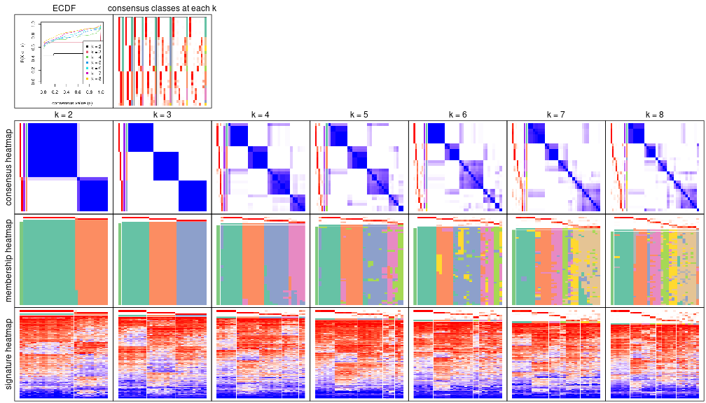

The plots are:

- The first row: a plot of the eCDF (empirical cumulative distribution
  function) curves of the consensus matrix for each `k` and the heatmap of
  predicted classes for each `k`.
- The second row: heatmaps of the consensus matrix for each `k`.
- The third row: heatmaps of the membership matrix for each `k`.
- The fouth row: heatmaps of the signatures for each `k`.

All the plots in panels can be made by individual functions and they are
plotted later in this section.

`select_partition_number()` produces several plots showing different
statistics for choosing "optimized" `k`. There are following statistics:

- eCDF curves of the consensus matrix for each `k`;
- 1-PAC. [The PAC score](https://en.wikipedia.org/wiki/Consensus_clustering#Over-interpretation_potential_of_consensus_clustering)
  measures the proportion of the ambiguous subgrouping.
- Mean silhouette score.
- Concordance. The mean probability of fiting the consensus subgroup labels in all
  partitions.
- Area increased. Denote $A_k$ as the area under the eCDF curve for current
  `k`, the area increased is defined as $A_k - A_{k-1}$.
- Rand index. The percent of pairs of samples that are both in a same cluster
  or both are not in a same cluster in the partition of k and k-1.
- Jaccard index. The ratio of pairs of samples are both in a same cluster in
  the partition of k and k-1 and the pairs of samples are both in a same
  cluster in the partition k or k-1.

The detailed explanations of these statistics can be found in [the _cola_
vignette](https://jokergoo.github.io/cola_vignettes/cola.html#toc_13).

Generally speaking, higher 1-PAC score, higher mean silhouette score or higher
concordance corresponds to better partition. Rand index and Jaccard index
measure how similar the current partition is compared to partition with `k-1`.
If they are too similar, we won't accept `k` is better than `k-1`.

```r
select_partition_number(res)
```

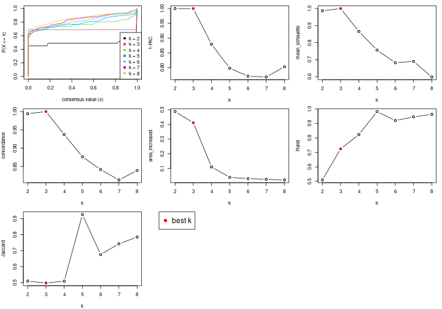

The numeric values for all these statistics can be obtained by `get_stats()`.

```r
get_stats(res)
```

```
#>   k 1-PAC mean_silhouette concordance area_increased  Rand Jaccard
#> 2 2 1.000           0.987       0.994         0.4878 0.510   0.510
#> 3 3 1.000           1.000       1.000         0.4116 0.725   0.498
#> 4 4 0.879           0.866       0.937         0.1101 0.824   0.509
#> 5 5 0.798           0.756       0.877         0.0391 0.983   0.925
#> 6 6 0.771           0.682       0.842         0.0305 0.920   0.675
#> 7 7 0.768           0.690       0.814         0.0256 0.946   0.742
#> 8 8 0.803           0.599       0.839         0.0214 0.963   0.785
```

`suggest_best_k()` suggests the best $k$ based on these statistics. The rules are as follows:

- All $k$ with Jaccard index larger than 0.95 are removed because increasing
  $k$ does not provide enough extra information. If all $k$ are removed, it is
  marked as no subgroup is detected.
- For all $k$ with 1-PAC score larger than 0.9, the maximal $k$ is taken as
  the best $k$, and other $k$ are marked as optional $k$.
- If it does not fit the second rule. The $k$ with the maximal vote of the
  highest 1-PAC score, highest mean silhouette, and highest concordance is
  taken as the best $k$.

```r
suggest_best_k(res)
```

```
#> [1] 3
#> attr(,"optional")
#> [1] 2
```

There is also optional best $k$ = 2 that is worth to check.

Following is the table of the partitions (You need to click the **show/hide
code output** link to see it). The membership matrix (columns with name `p*`)
is inferred by
[`clue::cl_consensus()`](https://www.rdocumentation.org/link/cl_consensus?package=clue)
function with the `SE` method. Basically the value in the membership matrix
represents the probability to belong to a certain group. The finall subgroup
label for an item is determined with the group with highest probability it
belongs to.

In `get_classes()` function, the entropy is calculated from the membership
matrix and the silhouette score is calculated from the consensus matrix.


<script>
$( function() {
	$( '#tabs-node-053-get-classes' ).tabs();
} );
</script>
<div id='tabs-node-053-get-classes'>
<ul>
<li><a href='#tab-node-053-get-classes-1'>k = 2</a></li>
<li><a href='#tab-node-053-get-classes-2'>k = 3</a></li>
<li><a href='#tab-node-053-get-classes-3'>k = 4</a></li>
<li><a href='#tab-node-053-get-classes-4'>k = 5</a></li>
<li><a href='#tab-node-053-get-classes-5'>k = 6</a></li>
<li><a href='#tab-node-053-get-classes-6'>k = 7</a></li>
<li><a href='#tab-node-053-get-classes-7'>k = 8</a></li>
</ul>

<div id='tab-node-053-get-classes-1'>
<p><a id='tab-node-053-get-classes-1-a' style='color:#0366d6' href='#'>show/hide code output</a></p>
<pre><code class="r">cbind(get_classes(res, k = 2), get_membership(res, k = 2))
</code></pre>

<pre><code>#&gt;                 class entropy silhouette   p1   p2
#&gt; TCGA.39.5037.01     1    0.00      1.000 1.00 0.00
#&gt; TCGA.77.8144.01     2    0.68      0.780 0.18 0.82
#&gt; TCGA.34.7107.01     1    0.00      1.000 1.00 0.00
#&gt; TCGA.22.4599.01     1    0.00      1.000 1.00 0.00
#&gt; TCGA.85.7710.01     1    0.00      1.000 1.00 0.00
#&gt; TCGA.21.5786.01     2    0.00      0.983 0.00 1.00
#&gt; TCGA.96.A4JK.01     1    0.00      1.000 1.00 0.00
#&gt; TCGA.22.5485.01     1    0.00      1.000 1.00 0.00
#&gt; TCGA.22.5471.01     1    0.00      1.000 1.00 0.00
#&gt; TCGA.94.A4VJ.01     2    0.00      0.983 0.00 1.00
#&gt; TCGA.85.7696.01     1    0.00      1.000 1.00 0.00
#&gt; TCGA.43.5670.01     2    0.00      0.983 0.00 1.00
#&gt; TCGA.85.7843.01     1    0.00      1.000 1.00 0.00
#&gt; TCGA.22.A5C4.01     2    0.00      0.983 0.00 1.00
#&gt; TCGA.21.5783.01     2    0.00      0.983 0.00 1.00
#&gt; TCGA.63.A5MW.01     2    0.00      0.983 0.00 1.00
#&gt; TCGA.77.7465.01     2    0.00      0.983 0.00 1.00
#&gt; TCGA.NC.A5HD.01     2    0.00      0.983 0.00 1.00
#&gt; TCGA.85.8352.01     2    0.00      0.983 0.00 1.00
#&gt; TCGA.NC.A5HR.01     1    0.00      1.000 1.00 0.00
#&gt; TCGA.NK.A5D1.01     2    0.00      0.983 0.00 1.00
#&gt; TCGA.NC.A5HP.01     1    0.00      1.000 1.00 0.00
#&gt; TCGA.22.5483.01     1    0.00      1.000 1.00 0.00
#&gt; TCGA.NC.A5HQ.01     1    0.00      1.000 1.00 0.00
#&gt; TCGA.56.8308.01     1    0.00      1.000 1.00 0.00
#&gt; TCGA.94.A5I4.01     1    0.00      1.000 1.00 0.00
#&gt; TCGA.46.6025.01     1    0.00      1.000 1.00 0.00
#&gt; TCGA.NC.A5HM.01     2    0.00      0.983 0.00 1.00
#&gt; TCGA.NC.A5HO.01     1    0.00      1.000 1.00 0.00
#&gt; TCGA.37.A5EN.01     1    0.00      1.000 1.00 0.00
#&gt; TCGA.98.A53A.01     1    0.00      1.000 1.00 0.00
</code></pre>

<script>
$('#tab-node-053-get-classes-1-a').parent().next().next().hide();
$('#tab-node-053-get-classes-1-a').click(function(){
  $('#tab-node-053-get-classes-1-a').parent().next().next().toggle();
  return(false);
});
</script>
</div>

<div id='tab-node-053-get-classes-2'>
<p><a id='tab-node-053-get-classes-2-a' style='color:#0366d6' href='#'>show/hide code output</a></p>
<pre><code class="r">cbind(get_classes(res, k = 3), get_membership(res, k = 3))
</code></pre>

<pre><code>#&gt;                 class entropy silhouette p1 p2 p3
#&gt; TCGA.39.5037.01     1       0          1  1  0  0
#&gt; TCGA.77.8144.01     3       0          1  0  0  1
#&gt; TCGA.34.7107.01     1       0          1  1  0  0
#&gt; TCGA.22.4599.01     1       0          1  1  0  0
#&gt; TCGA.85.7710.01     3       0          1  0  0  1
#&gt; TCGA.21.5786.01     2       0          1  0  1  0
#&gt; TCGA.96.A4JK.01     1       0          1  1  0  0
#&gt; TCGA.22.5485.01     1       0          1  1  0  0
#&gt; TCGA.22.5471.01     3       0          1  0  0  1
#&gt; TCGA.94.A4VJ.01     2       0          1  0  1  0
#&gt; TCGA.85.7696.01     1       0          1  1  0  0
#&gt; TCGA.43.5670.01     2       0          1  0  1  0
#&gt; TCGA.85.7843.01     3       0          1  0  0  1
#&gt; TCGA.22.A5C4.01     2       0          1  0  1  0
#&gt; TCGA.21.5783.01     2       0          1  0  1  0
#&gt; TCGA.63.A5MW.01     2       0          1  0  1  0
#&gt; TCGA.77.7465.01     3       0          1  0  0  1
#&gt; TCGA.NC.A5HD.01     2       0          1  0  1  0
#&gt; TCGA.85.8352.01     2       0          1  0  1  0
#&gt; TCGA.NC.A5HR.01     3       0          1  0  0  1
#&gt; TCGA.NK.A5D1.01     2       0          1  0  1  0
#&gt; TCGA.NC.A5HP.01     1       0          1  1  0  0
#&gt; TCGA.22.5483.01     3       0          1  0  0  1
#&gt; TCGA.NC.A5HQ.01     3       0          1  0  0  1
#&gt; TCGA.56.8308.01     1       0          1  1  0  0
#&gt; TCGA.94.A5I4.01     1       0          1  1  0  0
#&gt; TCGA.46.6025.01     3       0          1  0  0  1
#&gt; TCGA.NC.A5HM.01     2       0          1  0  1  0
#&gt; TCGA.NC.A5HO.01     3       0          1  0  0  1
#&gt; TCGA.37.A5EN.01     1       0          1  1  0  0
#&gt; TCGA.98.A53A.01     3       0          1  0  0  1
</code></pre>

<script>
$('#tab-node-053-get-classes-2-a').parent().next().next().hide();
$('#tab-node-053-get-classes-2-a').click(function(){
  $('#tab-node-053-get-classes-2-a').parent().next().next().toggle();
  return(false);
});
</script>
</div>

<div id='tab-node-053-get-classes-3'>
<p><a id='tab-node-053-get-classes-3-a' style='color:#0366d6' href='#'>show/hide code output</a></p>
<pre><code class="r">cbind(get_classes(res, k = 4), get_membership(res, k = 4))
</code></pre>

<pre><code>#&gt;                 class entropy silhouette   p1   p2   p3   p4
#&gt; TCGA.39.5037.01     1  0.0000      0.933 1.00 0.00 0.00 0.00
#&gt; TCGA.77.8144.01     4  0.1637      0.890 0.00 0.00 0.06 0.94
#&gt; TCGA.34.7107.01     1  0.0000      0.933 1.00 0.00 0.00 0.00
#&gt; TCGA.22.4599.01     1  0.4855      0.199 0.60 0.00 0.40 0.00
#&gt; TCGA.85.7710.01     3  0.1211      0.881 0.00 0.00 0.96 0.04
#&gt; TCGA.21.5786.01     2  0.0000      0.978 0.00 1.00 0.00 0.00
#&gt; TCGA.96.A4JK.01     1  0.0000      0.933 1.00 0.00 0.00 0.00
#&gt; TCGA.22.5485.01     1  0.0000      0.933 1.00 0.00 0.00 0.00
#&gt; TCGA.22.5471.01     3  0.0000      0.890 0.00 0.00 1.00 0.00
#&gt; TCGA.94.A4VJ.01     4  0.3610      0.688 0.00 0.20 0.00 0.80
#&gt; TCGA.85.7696.01     3  0.3400      0.763 0.18 0.00 0.82 0.00
#&gt; TCGA.43.5670.01     2  0.2011      0.932 0.00 0.92 0.00 0.08
#&gt; TCGA.85.7843.01     4  0.3172      0.859 0.00 0.00 0.16 0.84
#&gt; TCGA.22.A5C4.01     2  0.2011      0.932 0.00 0.92 0.00 0.08
#&gt; TCGA.21.5783.01     2  0.0000      0.978 0.00 1.00 0.00 0.00
#&gt; TCGA.63.A5MW.01     2  0.0000      0.978 0.00 1.00 0.00 0.00
#&gt; TCGA.77.7465.01     4  0.1211      0.889 0.00 0.00 0.04 0.96
#&gt; TCGA.NC.A5HD.01     2  0.0000      0.978 0.00 1.00 0.00 0.00
#&gt; TCGA.85.8352.01     2  0.0000      0.978 0.00 1.00 0.00 0.00
#&gt; TCGA.NC.A5HR.01     3  0.1211      0.888 0.04 0.00 0.96 0.00
#&gt; TCGA.NK.A5D1.01     2  0.0000      0.978 0.00 1.00 0.00 0.00
#&gt; TCGA.NC.A5HP.01     3  0.4855      0.355 0.40 0.00 0.60 0.00
#&gt; TCGA.22.5483.01     3  0.0707      0.895 0.02 0.00 0.98 0.00
#&gt; TCGA.NC.A5HQ.01     4  0.3400      0.844 0.00 0.00 0.18 0.82
#&gt; TCGA.56.8308.01     1  0.0000      0.933 1.00 0.00 0.00 0.00
#&gt; TCGA.94.A5I4.01     1  0.0000      0.933 1.00 0.00 0.00 0.00
#&gt; TCGA.46.6025.01     3  0.1211      0.881 0.00 0.00 0.96 0.04
#&gt; TCGA.NC.A5HM.01     4  0.0000      0.876 0.00 0.00 0.00 1.00
#&gt; TCGA.NC.A5HO.01     3  0.0000      0.890 0.00 0.00 1.00 0.00
#&gt; TCGA.37.A5EN.01     1  0.0000      0.933 1.00 0.00 0.00 0.00
#&gt; TCGA.98.A53A.01     3  0.0707      0.895 0.02 0.00 0.98 0.00
</code></pre>

<script>
$('#tab-node-053-get-classes-3-a').parent().next().next().hide();
$('#tab-node-053-get-classes-3-a').click(function(){
  $('#tab-node-053-get-classes-3-a').parent().next().next().toggle();
  return(false);
});
</script>
</div>

<div id='tab-node-053-get-classes-4'>
<p><a id='tab-node-053-get-classes-4-a' style='color:#0366d6' href='#'>show/hide code output</a></p>
<pre><code class="r">cbind(get_classes(res, k = 5), get_membership(res, k = 5))
</code></pre>

<pre><code>#&gt;                 class entropy silhouette   p1   p2   p3   p4   p5
#&gt; TCGA.39.5037.01     1  0.0000     0.9061 1.00 0.00 0.00 0.00 0.00
#&gt; TCGA.77.8144.01     4  0.5263     0.4545 0.00 0.00 0.10 0.66 0.24
#&gt; TCGA.34.7107.01     1  0.0609     0.8984 0.98 0.00 0.00 0.02 0.00
#&gt; TCGA.22.4599.01     1  0.4829    -0.0959 0.50 0.00 0.48 0.02 0.00
#&gt; TCGA.85.7710.01     3  0.4075     0.7080 0.00 0.00 0.78 0.16 0.06
#&gt; TCGA.21.5786.01     2  0.0000     0.8910 0.00 1.00 0.00 0.00 0.00
#&gt; TCGA.96.A4JK.01     1  0.0000     0.9061 1.00 0.00 0.00 0.00 0.00
#&gt; TCGA.22.5485.01     1  0.0000     0.9061 1.00 0.00 0.00 0.00 0.00
#&gt; TCGA.22.5471.01     3  0.3274     0.6840 0.00 0.00 0.78 0.00 0.22
#&gt; TCGA.94.A4VJ.01     4  0.4433     0.5134 0.00 0.20 0.00 0.74 0.06
#&gt; TCGA.85.7696.01     3  0.3106     0.7514 0.14 0.00 0.84 0.02 0.00
#&gt; TCGA.43.5670.01     2  0.3983     0.5598 0.00 0.66 0.00 0.34 0.00
#&gt; TCGA.85.7843.01     5  0.2012     1.0000 0.00 0.00 0.06 0.02 0.92
#&gt; TCGA.22.A5C4.01     2  0.3796     0.6197 0.00 0.70 0.00 0.30 0.00
#&gt; TCGA.21.5783.01     2  0.0000     0.8910 0.00 1.00 0.00 0.00 0.00
#&gt; TCGA.63.A5MW.01     2  0.0000     0.8910 0.00 1.00 0.00 0.00 0.00
#&gt; TCGA.77.7465.01     4  0.4726     0.4299 0.00 0.00 0.02 0.58 0.40
#&gt; TCGA.NC.A5HD.01     2  0.0609     0.8835 0.00 0.98 0.00 0.02 0.00
#&gt; TCGA.85.8352.01     2  0.0609     0.8835 0.00 0.98 0.00 0.02 0.00
#&gt; TCGA.NC.A5HR.01     3  0.1043     0.8150 0.00 0.00 0.96 0.00 0.04
#&gt; TCGA.NK.A5D1.01     2  0.0000     0.8910 0.00 1.00 0.00 0.00 0.00
#&gt; TCGA.NC.A5HP.01     3  0.4132     0.6178 0.26 0.00 0.72 0.02 0.00
#&gt; TCGA.22.5483.01     3  0.2020     0.7921 0.00 0.00 0.90 0.00 0.10
#&gt; TCGA.NC.A5HQ.01     5  0.2012     1.0000 0.00 0.00 0.06 0.02 0.92
#&gt; TCGA.56.8308.01     1  0.0000     0.9061 1.00 0.00 0.00 0.00 0.00
#&gt; TCGA.94.A5I4.01     1  0.0609     0.8984 0.98 0.00 0.00 0.02 0.00
#&gt; TCGA.46.6025.01     3  0.3731     0.7234 0.00 0.00 0.80 0.16 0.04
#&gt; TCGA.NC.A5HM.01     4  0.3922     0.5855 0.00 0.04 0.00 0.78 0.18
#&gt; TCGA.NC.A5HO.01     3  0.0609     0.8173 0.00 0.00 0.98 0.00 0.02
#&gt; TCGA.37.A5EN.01     1  0.0000     0.9061 1.00 0.00 0.00 0.00 0.00
#&gt; TCGA.98.A53A.01     3  0.1043     0.8126 0.00 0.00 0.96 0.00 0.04
</code></pre>

<script>
$('#tab-node-053-get-classes-4-a').parent().next().next().hide();
$('#tab-node-053-get-classes-4-a').click(function(){
  $('#tab-node-053-get-classes-4-a').parent().next().next().toggle();
  return(false);
});
</script>
</div>

<div id='tab-node-053-get-classes-5'>
<p><a id='tab-node-053-get-classes-5-a' style='color:#0366d6' href='#'>show/hide code output</a></p>
<pre><code class="r">cbind(get_classes(res, k = 6), get_membership(res, k = 6))
</code></pre>

<pre><code>#&gt;                 class entropy silhouette   p1   p2   p3   p4   p5   p6
#&gt; TCGA.39.5037.01     1  0.0000      1.000 1.00 0.00 0.00 0.00 0.00 0.00
#&gt; TCGA.77.8144.01     6  0.7023      0.000 0.00 0.00 0.08 0.34 0.20 0.38
#&gt; TCGA.34.7107.01     1  0.0000      1.000 1.00 0.00 0.00 0.00 0.00 0.00
#&gt; TCGA.22.4599.01     3  0.4199      0.450 0.38 0.00 0.60 0.00 0.00 0.02
#&gt; TCGA.85.7710.01     3  0.4765      0.434 0.00 0.00 0.64 0.02 0.04 0.30
#&gt; TCGA.21.5786.01     2  0.0000      0.879 0.00 1.00 0.00 0.00 0.00 0.00
#&gt; TCGA.96.A4JK.01     1  0.0000      1.000 1.00 0.00 0.00 0.00 0.00 0.00
#&gt; TCGA.22.5485.01     1  0.0000      1.000 1.00 0.00 0.00 0.00 0.00 0.00
#&gt; TCGA.22.5471.01     3  0.4873      0.502 0.00 0.00 0.60 0.00 0.32 0.08
#&gt; TCGA.94.A4VJ.01     4  0.1267      0.412 0.00 0.06 0.00 0.94 0.00 0.00
#&gt; TCGA.85.7696.01     3  0.1814      0.733 0.10 0.00 0.90 0.00 0.00 0.00
#&gt; TCGA.43.5670.01     4  0.4002      0.453 0.00 0.32 0.00 0.66 0.00 0.02
#&gt; TCGA.85.7843.01     5  0.0000      0.957 0.00 0.00 0.00 0.00 1.00 0.00
#&gt; TCGA.22.A5C4.01     4  0.4310      0.306 0.00 0.44 0.00 0.54 0.00 0.02
#&gt; TCGA.21.5783.01     2  0.0000      0.879 0.00 1.00 0.00 0.00 0.00 0.00
#&gt; TCGA.63.A5MW.01     2  0.0000      0.879 0.00 1.00 0.00 0.00 0.00 0.00
#&gt; TCGA.77.7465.01     4  0.6251     -0.447 0.00 0.00 0.02 0.48 0.22 0.28
#&gt; TCGA.NC.A5HD.01     2  0.3592      0.753 0.00 0.74 0.00 0.02 0.00 0.24
#&gt; TCGA.85.8352.01     2  0.3819      0.721 0.00 0.70 0.00 0.02 0.00 0.28
#&gt; TCGA.NC.A5HR.01     3  0.1807      0.739 0.02 0.00 0.92 0.00 0.06 0.00
#&gt; TCGA.NK.A5D1.01     2  0.0000      0.879 0.00 1.00 0.00 0.00 0.00 0.00
#&gt; TCGA.NC.A5HP.01     3  0.3950      0.647 0.24 0.00 0.72 0.00 0.00 0.04
#&gt; TCGA.22.5483.01     3  0.2790      0.705 0.00 0.00 0.84 0.00 0.14 0.02
#&gt; TCGA.NC.A5HQ.01     5  0.0547      0.957 0.00 0.00 0.02 0.00 0.98 0.00
#&gt; TCGA.56.8308.01     1  0.0000      1.000 1.00 0.00 0.00 0.00 0.00 0.00
#&gt; TCGA.94.A5I4.01     1  0.0000      1.000 1.00 0.00 0.00 0.00 0.00 0.00
#&gt; TCGA.46.6025.01     3  0.4067      0.515 0.00 0.00 0.70 0.00 0.04 0.26
#&gt; TCGA.NC.A5HM.01     4  0.0937      0.343 0.00 0.00 0.00 0.96 0.04 0.00
#&gt; TCGA.NC.A5HO.01     3  0.2629      0.738 0.02 0.00 0.88 0.00 0.08 0.02
#&gt; TCGA.37.A5EN.01     1  0.0000      1.000 1.00 0.00 0.00 0.00 0.00 0.00
#&gt; TCGA.98.A53A.01     3  0.2790      0.715 0.02 0.00 0.84 0.00 0.00 0.14
</code></pre>

<script>
$('#tab-node-053-get-classes-5-a').parent().next().next().hide();
$('#tab-node-053-get-classes-5-a').click(function(){
  $('#tab-node-053-get-classes-5-a').parent().next().next().toggle();
  return(false);
});
</script>
</div>

<div id='tab-node-053-get-classes-6'>
<p><a id='tab-node-053-get-classes-6-a' style='color:#0366d6' href='#'>show/hide code output</a></p>
<pre><code class="r">cbind(get_classes(res, k = 7), get_membership(res, k = 7))
</code></pre>

<pre><code>#&gt;                 class entropy silhouette   p1   p2   p3   p4   p5   p6   p7
#&gt; TCGA.39.5037.01     1  0.0000     0.9653 1.00 0.00 0.00 0.00 0.00 0.00 0.00
#&gt; TCGA.77.8144.01     6  0.5420     0.3514 0.00 0.00 0.02 0.24 0.06 0.62 0.06
#&gt; TCGA.34.7107.01     1  0.1166     0.9422 0.94 0.00 0.06 0.00 0.00 0.00 0.00
#&gt; TCGA.22.4599.01     7  0.4191     0.5042 0.30 0.00 0.06 0.00 0.00 0.00 0.64
#&gt; TCGA.85.7710.01     6  0.3358     0.3850 0.00 0.00 0.00 0.00 0.00 0.64 0.36
#&gt; TCGA.21.5786.01     2  0.0000     0.8716 0.00 1.00 0.00 0.00 0.00 0.00 0.00
#&gt; TCGA.96.A4JK.01     1  0.0504     0.9682 0.98 0.00 0.02 0.00 0.00 0.00 0.00
#&gt; TCGA.22.5485.01     1  0.0504     0.9605 0.98 0.00 0.00 0.00 0.00 0.02 0.00
#&gt; TCGA.22.5471.01     7  0.4107     0.4527 0.00 0.00 0.02 0.00 0.24 0.04 0.70
#&gt; TCGA.94.A4VJ.01     4  0.0504     0.7494 0.00 0.02 0.00 0.98 0.00 0.00 0.00
#&gt; TCGA.85.7696.01     7  0.3680     0.5891 0.14 0.00 0.06 0.00 0.00 0.02 0.78
#&gt; TCGA.43.5670.01     4  0.2572     0.7495 0.00 0.20 0.00 0.80 0.00 0.00 0.00
#&gt; TCGA.85.7843.01     5  0.1363     0.8869 0.00 0.00 0.02 0.00 0.94 0.00 0.04
#&gt; TCGA.22.A5C4.01     4  0.3294     0.5910 0.00 0.34 0.00 0.66 0.00 0.00 0.00
#&gt; TCGA.21.5783.01     2  0.0000     0.8716 0.00 1.00 0.00 0.00 0.00 0.00 0.00
#&gt; TCGA.63.A5MW.01     2  0.0000     0.8716 0.00 1.00 0.00 0.00 0.00 0.00 0.00
#&gt; TCGA.77.7465.01     6  0.6601     0.0632 0.00 0.00 0.32 0.20 0.10 0.38 0.00
#&gt; TCGA.NC.A5HD.01     2  0.3911     0.7177 0.00 0.70 0.24 0.06 0.00 0.00 0.00
#&gt; TCGA.85.8352.01     2  0.3927     0.6906 0.00 0.66 0.30 0.04 0.00 0.00 0.00
#&gt; TCGA.NC.A5HR.01     7  0.0504     0.6022 0.00 0.00 0.02 0.00 0.00 0.00 0.98
#&gt; TCGA.NK.A5D1.01     2  0.0000     0.8716 0.00 1.00 0.00 0.00 0.00 0.00 0.00
#&gt; TCGA.NC.A5HP.01     7  0.5295     0.4210 0.34 0.00 0.08 0.00 0.00 0.04 0.54
#&gt; TCGA.22.5483.01     7  0.3656     0.5397 0.00 0.00 0.08 0.00 0.08 0.04 0.80
#&gt; TCGA.NC.A5HQ.01     5  0.2163     0.8844 0.00 0.00 0.00 0.00 0.88 0.02 0.10
#&gt; TCGA.56.8308.01     1  0.0504     0.9682 0.98 0.00 0.02 0.00 0.00 0.00 0.00
#&gt; TCGA.94.A5I4.01     1  0.1166     0.9422 0.94 0.00 0.06 0.00 0.00 0.00 0.00
#&gt; TCGA.46.6025.01     6  0.3909     0.3040 0.00 0.00 0.00 0.00 0.02 0.58 0.40
#&gt; TCGA.NC.A5HM.01     4  0.1006     0.7262 0.00 0.00 0.00 0.96 0.02 0.02 0.00
#&gt; TCGA.NC.A5HO.01     7  0.1363     0.6025 0.02 0.00 0.00 0.00 0.04 0.00 0.94
#&gt; TCGA.37.A5EN.01     1  0.0504     0.9682 0.98 0.00 0.02 0.00 0.00 0.00 0.00
#&gt; TCGA.98.A53A.01     7  0.5240     0.3829 0.00 0.00 0.26 0.00 0.02 0.14 0.58
</code></pre>

<script>
$('#tab-node-053-get-classes-6-a').parent().next().next().hide();
$('#tab-node-053-get-classes-6-a').click(function(){
  $('#tab-node-053-get-classes-6-a').parent().next().next().toggle();
  return(false);
});
</script>
</div>

<div id='tab-node-053-get-classes-7'>
<p><a id='tab-node-053-get-classes-7-a' style='color:#0366d6' href='#'>show/hide code output</a></p>
<pre><code class="r">cbind(get_classes(res, k = 8), get_membership(res, k = 8))
</code></pre>

<pre><code>#&gt;                 class entropy silhouette   p1   p2   p3   p4   p5   p6   p7   p8
#&gt; TCGA.39.5037.01     1  0.0000     0.9809 1.00 0.00 0.00 0.00 0.00 0.00 0.00 0.00
#&gt; TCGA.77.8144.01     6  0.4345     0.2930 0.00 0.00 0.12 0.18 0.00 0.68 0.00 0.02
#&gt; TCGA.34.7107.01     1  0.1408     0.9511 0.94 0.00 0.00 0.02 0.00 0.02 0.00 0.02
#&gt; TCGA.22.4599.01     7  0.3404     0.5563 0.24 0.00 0.00 0.00 0.00 0.00 0.72 0.04
#&gt; TCGA.85.7710.01     6  0.2650     0.6422 0.00 0.00 0.00 0.00 0.00 0.76 0.24 0.00
#&gt; TCGA.21.5786.01     2  0.0808     0.7666 0.00 0.96 0.00 0.00 0.00 0.00 0.00 0.04
#&gt; TCGA.96.A4JK.01     1  0.0000     0.9809 1.00 0.00 0.00 0.00 0.00 0.00 0.00 0.00
#&gt; TCGA.22.5485.01     1  0.0000     0.9809 1.00 0.00 0.00 0.00 0.00 0.00 0.00 0.00
#&gt; TCGA.22.5471.01     5  0.5747    -0.0652 0.00 0.00 0.06 0.00 0.42 0.06 0.42 0.04
#&gt; TCGA.94.A4VJ.01     4  0.0808     0.7074 0.00 0.04 0.00 0.96 0.00 0.00 0.00 0.00
#&gt; TCGA.85.7696.01     7  0.1275     0.7016 0.02 0.00 0.00 0.00 0.00 0.00 0.94 0.04
#&gt; TCGA.43.5670.01     4  0.3036     0.6807 0.00 0.18 0.00 0.78 0.00 0.00 0.00 0.04
#&gt; TCGA.85.7843.01     5  0.1741     0.5036 0.00 0.00 0.02 0.00 0.92 0.02 0.00 0.04
#&gt; TCGA.22.A5C4.01     4  0.3907     0.3859 0.00 0.38 0.00 0.58 0.00 0.00 0.00 0.04
#&gt; TCGA.21.5783.01     2  0.0000     0.7981 0.00 1.00 0.00 0.00 0.00 0.00 0.00 0.00
#&gt; TCGA.63.A5MW.01     2  0.0000     0.7981 0.00 1.00 0.00 0.00 0.00 0.00 0.00 0.00
#&gt; TCGA.77.7465.01     3  0.2807     0.0000 0.00 0.00 0.84 0.10 0.04 0.02 0.00 0.00
#&gt; TCGA.NC.A5HD.01     2  0.4399    -0.5149 0.00 0.50 0.02 0.04 0.00 0.00 0.00 0.44
#&gt; TCGA.85.8352.01     8  0.3594     0.0000 0.00 0.28 0.00 0.04 0.00 0.00 0.00 0.68
#&gt; TCGA.NC.A5HR.01     7  0.0941     0.7088 0.00 0.00 0.00 0.00 0.02 0.00 0.96 0.02
#&gt; TCGA.NK.A5D1.01     2  0.0000     0.7981 0.00 1.00 0.00 0.00 0.00 0.00 0.00 0.00
#&gt; TCGA.NC.A5HP.01     7  0.3262     0.6473 0.10 0.00 0.00 0.02 0.00 0.02 0.82 0.04
#&gt; TCGA.22.5483.01     7  0.5321     0.4115 0.00 0.00 0.06 0.00 0.18 0.02 0.62 0.12
#&gt; TCGA.NC.A5HQ.01     5  0.0941     0.5373 0.00 0.00 0.02 0.00 0.96 0.00 0.02 0.00
#&gt; TCGA.56.8308.01     1  0.0000     0.9809 1.00 0.00 0.00 0.00 0.00 0.00 0.00 0.00
#&gt; TCGA.94.A5I4.01     1  0.1408     0.9511 0.94 0.00 0.00 0.02 0.00 0.02 0.00 0.02
#&gt; TCGA.46.6025.01     6  0.4599     0.5675 0.00 0.00 0.04 0.00 0.02 0.60 0.32 0.02
#&gt; TCGA.NC.A5HM.01     4  0.0941     0.6766 0.00 0.02 0.02 0.96 0.00 0.00 0.00 0.00
#&gt; TCGA.NC.A5HO.01     7  0.2680     0.6622 0.00 0.00 0.00 0.00 0.12 0.02 0.84 0.02
#&gt; TCGA.37.A5EN.01     1  0.0000     0.9809 1.00 0.00 0.00 0.00 0.00 0.00 0.00 0.00
#&gt; TCGA.98.A53A.01     7  0.5456     0.4974 0.00 0.00 0.10 0.00 0.02 0.12 0.62 0.14
</code></pre>

<script>
$('#tab-node-053-get-classes-7-a').parent().next().next().hide();
$('#tab-node-053-get-classes-7-a').click(function(){
  $('#tab-node-053-get-classes-7-a').parent().next().next().toggle();
  return(false);
});
</script>
</div>
</div>

Heatmaps for the consensus matrix. It visualizes the probability of two
samples to be in a same group.


<script>
$( function() {
	$( '#tabs-node-053-consensus-heatmap' ).tabs();
} );
</script>
<div id='tabs-node-053-consensus-heatmap'>
<ul>
<li><a href='#tab-node-053-consensus-heatmap-1'>k = 2</a></li>
<li><a href='#tab-node-053-consensus-heatmap-2'>k = 3</a></li>
<li><a href='#tab-node-053-consensus-heatmap-3'>k = 4</a></li>
<li><a href='#tab-node-053-consensus-heatmap-4'>k = 5</a></li>
<li><a href='#tab-node-053-consensus-heatmap-5'>k = 6</a></li>
<li><a href='#tab-node-053-consensus-heatmap-6'>k = 7</a></li>
<li><a href='#tab-node-053-consensus-heatmap-7'>k = 8</a></li>
</ul>
<div id='tab-node-053-consensus-heatmap-1'>
<pre><code class="r">consensus_heatmap(res, k = 2)
</code></pre>

<p>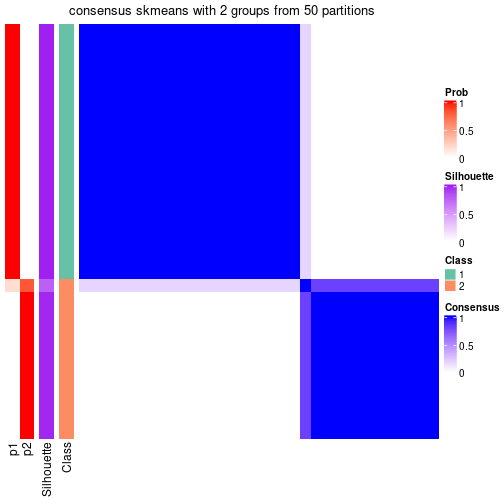</p>

</div>
<div id='tab-node-053-consensus-heatmap-2'>
<pre><code class="r">consensus_heatmap(res, k = 3)
</code></pre>

<p>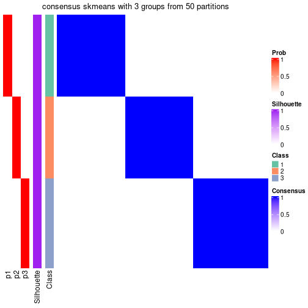</p>

</div>
<div id='tab-node-053-consensus-heatmap-3'>
<pre><code class="r">consensus_heatmap(res, k = 4)
</code></pre>

<p>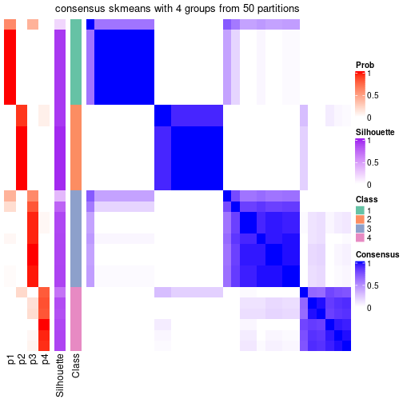</p>

</div>
<div id='tab-node-053-consensus-heatmap-4'>
<pre><code class="r">consensus_heatmap(res, k = 5)
</code></pre>

<p>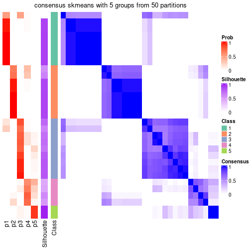</p>

</div>
<div id='tab-node-053-consensus-heatmap-5'>
<pre><code class="r">consensus_heatmap(res, k = 6)
</code></pre>

<p>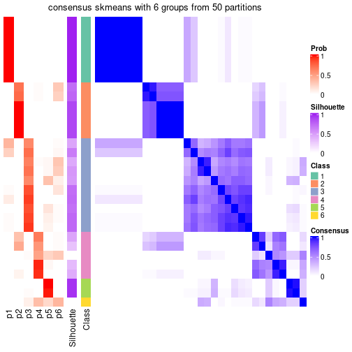</p>

</div>
<div id='tab-node-053-consensus-heatmap-6'>
<pre><code class="r">consensus_heatmap(res, k = 7)
</code></pre>

<p>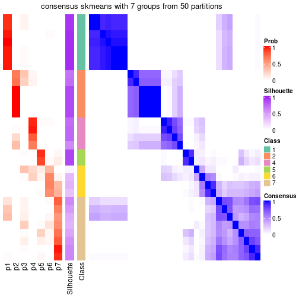</p>

</div>
<div id='tab-node-053-consensus-heatmap-7'>
<pre><code class="r">consensus_heatmap(res, k = 8)
</code></pre>

<p>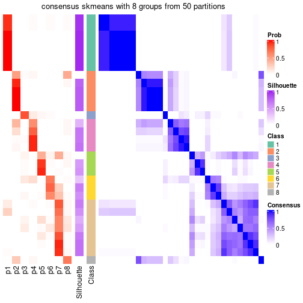</p>

</div>
</div>

Heatmaps for the membership of samples in all partitions to see how consistent they are:


<script>
$( function() {
	$( '#tabs-node-053-membership-heatmap' ).tabs();
} );
</script>
<div id='tabs-node-053-membership-heatmap'>
<ul>
<li><a href='#tab-node-053-membership-heatmap-1'>k = 2</a></li>
<li><a href='#tab-node-053-membership-heatmap-2'>k = 3</a></li>
<li><a href='#tab-node-053-membership-heatmap-3'>k = 4</a></li>
<li><a href='#tab-node-053-membership-heatmap-4'>k = 5</a></li>
<li><a href='#tab-node-053-membership-heatmap-5'>k = 6</a></li>
<li><a href='#tab-node-053-membership-heatmap-6'>k = 7</a></li>
<li><a href='#tab-node-053-membership-heatmap-7'>k = 8</a></li>
</ul>
<div id='tab-node-053-membership-heatmap-1'>
<pre><code class="r">membership_heatmap(res, k = 2)
</code></pre>

<p>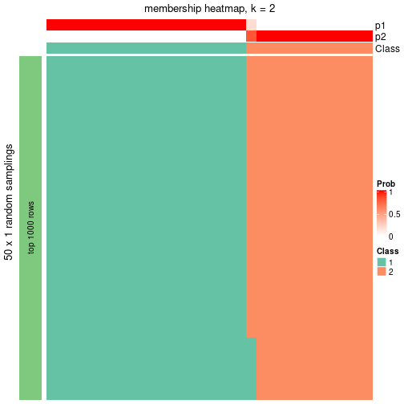</p>

</div>
<div id='tab-node-053-membership-heatmap-2'>
<pre><code class="r">membership_heatmap(res, k = 3)
</code></pre>

<p>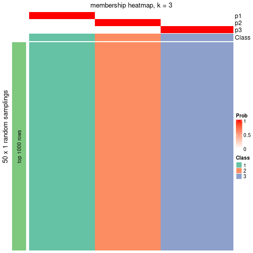</p>

</div>
<div id='tab-node-053-membership-heatmap-3'>
<pre><code class="r">membership_heatmap(res, k = 4)
</code></pre>

<p>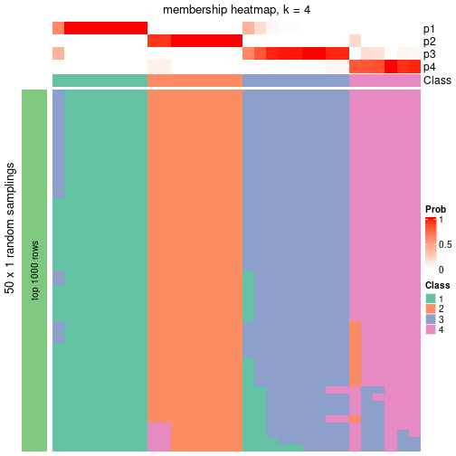</p>

</div>
<div id='tab-node-053-membership-heatmap-4'>
<pre><code class="r">membership_heatmap(res, k = 5)
</code></pre>

<p>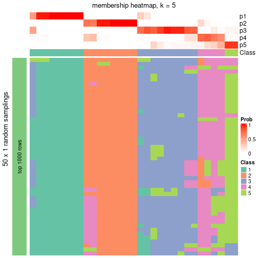</p>

</div>
<div id='tab-node-053-membership-heatmap-5'>
<pre><code class="r">membership_heatmap(res, k = 6)
</code></pre>

<p>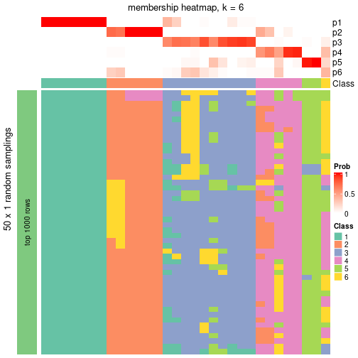</p>

</div>
<div id='tab-node-053-membership-heatmap-6'>
<pre><code class="r">membership_heatmap(res, k = 7)
</code></pre>

<p></p>

</div>
<div id='tab-node-053-membership-heatmap-7'>
<pre><code class="r">membership_heatmap(res, k = 8)
</code></pre>

<p>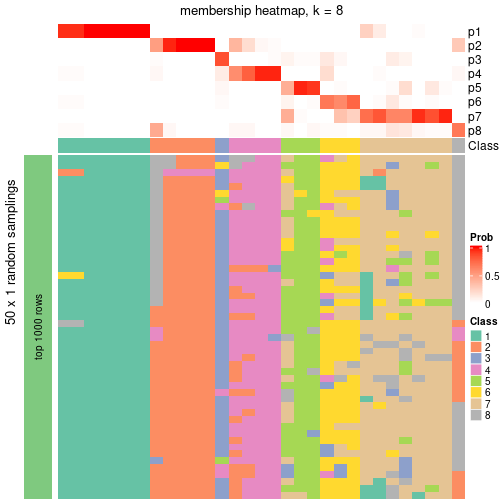</p>

</div>
</div>

As soon as the classes for columns are determined, the signatures
that are significantly different between subgroups can be looked for. 
Following are the heatmaps for signatures.


<script>
$( function() {
	$( '#tabs-node-053-get-signatures' ).tabs();
} );
</script>
<div id='tabs-node-053-get-signatures'>
<ul>
<li><a href='#tab-node-053-get-signatures-1'>k = 2</a></li>
<li><a href='#tab-node-053-get-signatures-2'>k = 3</a></li>
<li><a href='#tab-node-053-get-signatures-3'>k = 4</a></li>
<li><a href='#tab-node-053-get-signatures-4'>k = 5</a></li>
<li><a href='#tab-node-053-get-signatures-5'>k = 6</a></li>
<li><a href='#tab-node-053-get-signatures-6'>k = 7</a></li>
<li><a href='#tab-node-053-get-signatures-7'>k = 8</a></li>
</ul>
<div id='tab-node-053-get-signatures-1'>
<pre><code class="r">get_signatures(res, k = 2)
</code></pre>

<p>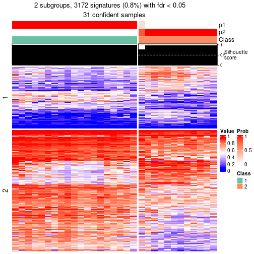</p>

</div>
<div id='tab-node-053-get-signatures-2'>
<pre><code class="r">get_signatures(res, k = 3)
</code></pre>

<p></p>

</div>
<div id='tab-node-053-get-signatures-3'>
<pre><code class="r">get_signatures(res, k = 4)
</code></pre>

<p>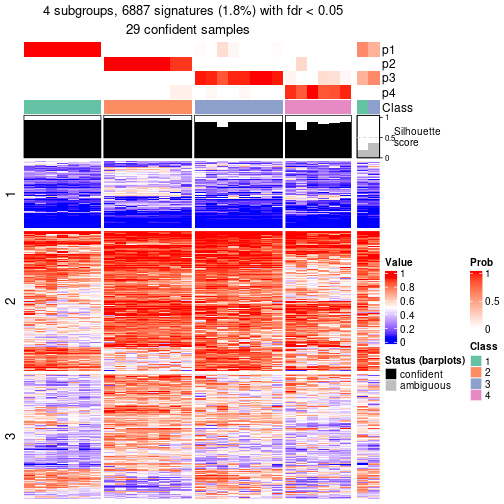</p>

</div>
<div id='tab-node-053-get-signatures-4'>
<pre><code class="r">get_signatures(res, k = 5)
</code></pre>

<p>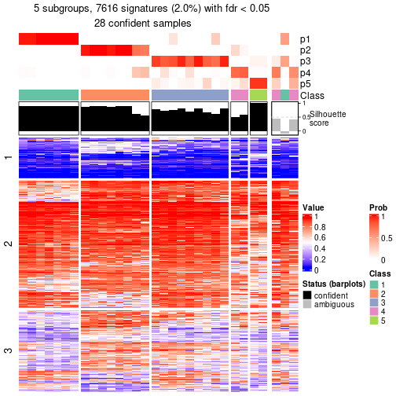</p>

</div>
<div id='tab-node-053-get-signatures-5'>
<pre><code class="r">get_signatures(res, k = 6)
</code></pre>

<p>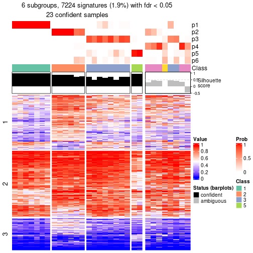</p>

</div>
<div id='tab-node-053-get-signatures-6'>
<pre><code class="r">get_signatures(res, k = 7)
</code></pre>

<p>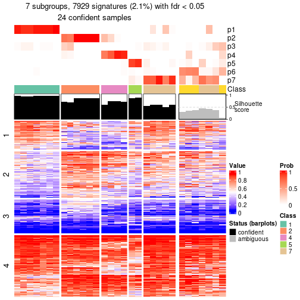</p>

</div>
<div id='tab-node-053-get-signatures-7'>
<pre><code class="r">get_signatures(res, k = 8)
</code></pre>

<p>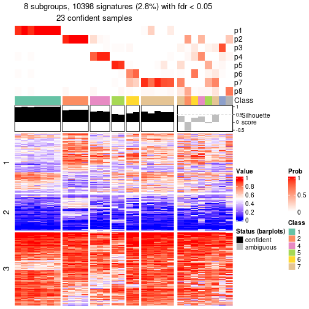</p>

</div>
</div>


Compare the overlap of signatures from different k:

```r
compare_signatures(res)
```

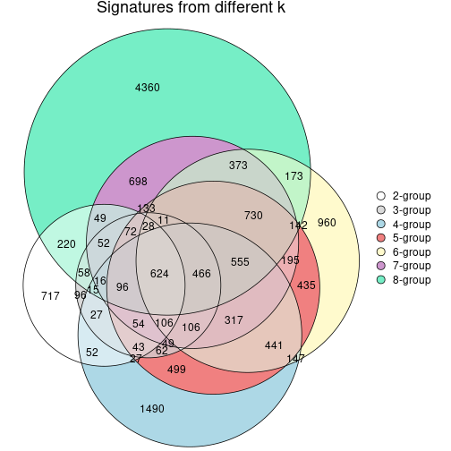

`get_signature()` returns a data frame invisibly. To get the list of signatures, the function
call should be assigned to a variable explicitly. In following code, if `plot` argument is set
to `FALSE`, no heatmap is plotted while only the differential analysis is performed.

```r
# code only for demonstration
tb = get_signature(res, k = ..., plot = FALSE)
```

An example of the output of `tb` is:

```
#>   which_row         fdr    mean_1    mean_2 scaled_mean_1 scaled_mean_2 km
#> 1        38 0.042760348  8.373488  9.131774    -0.5533452     0.5164555  1
#> 2        40 0.018707592  7.106213  8.469186    -0.6173731     0.5762149  1
#> 3        55 0.019134737 10.221463 11.207825    -0.6159697     0.5749050  1
#> 4        59 0.006059896  5.921854  7.869574    -0.6899429     0.6439467  1
#> 5        60 0.018055526  8.928898 10.211722    -0.6204761     0.5791110  1
#> 6        98 0.009384629 15.714769 14.887706     0.6635654    -0.6193277  2
...
```

The columns in `tb` are:

1. `which_row`: row indices corresponding to the input matrix.
2. `fdr`: FDR for the differential test. 
3. `mean_x`: The mean value in group x.
4. `scaled_mean_x`: The mean value in group x after rows are scaled.
5. `km`: Row groups if k-means clustering is applied to rows (which is done by automatically selecting number of clusters).

If there are too many signatures, `top_signatures = ...` can be set to only show the 
signatures with the highest FDRs:

```r
# code only for demonstration
# e.g. to show the top 500 most significant rows
tb = get_signature(res, k = ..., top_signatures = 500)
```

If the signatures are defined as these which are uniquely high in current group, `diff_method` argument
can be set to `"uniquely_high_in_one_group"`:

```r
# code only for demonstration
tb = get_signature(res, k = ..., diff_method = "uniquely_high_in_one_group")
```


UMAP plot which shows how samples are separated.


<script>
$( function() {
	$( '#tabs-node-053-dimension-reduction' ).tabs();
} );
</script>
<div id='tabs-node-053-dimension-reduction'>
<ul>
<li><a href='#tab-node-053-dimension-reduction-1'>k = 2</a></li>
<li><a href='#tab-node-053-dimension-reduction-2'>k = 3</a></li>
<li><a href='#tab-node-053-dimension-reduction-3'>k = 4</a></li>
<li><a href='#tab-node-053-dimension-reduction-4'>k = 5</a></li>
<li><a href='#tab-node-053-dimension-reduction-5'>k = 6</a></li>
<li><a href='#tab-node-053-dimension-reduction-6'>k = 7</a></li>
<li><a href='#tab-node-053-dimension-reduction-7'>k = 8</a></li>
</ul>
<div id='tab-node-053-dimension-reduction-1'>
<pre><code class="r">dimension_reduction(res, k = 2, method = &quot;UMAP&quot;)
</code></pre>

<p>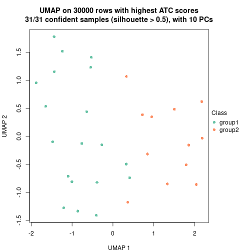</p>

</div>
<div id='tab-node-053-dimension-reduction-2'>
<pre><code class="r">dimension_reduction(res, k = 3, method = &quot;UMAP&quot;)
</code></pre>

<p>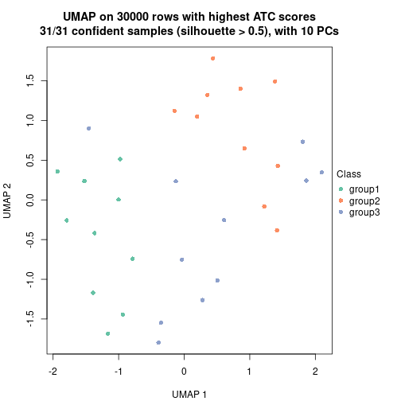</p>

</div>
<div id='tab-node-053-dimension-reduction-3'>
<pre><code class="r">dimension_reduction(res, k = 4, method = &quot;UMAP&quot;)
</code></pre>

<p>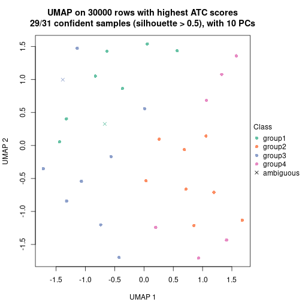</p>

</div>
<div id='tab-node-053-dimension-reduction-4'>
<pre><code class="r">dimension_reduction(res, k = 5, method = &quot;UMAP&quot;)
</code></pre>

<p>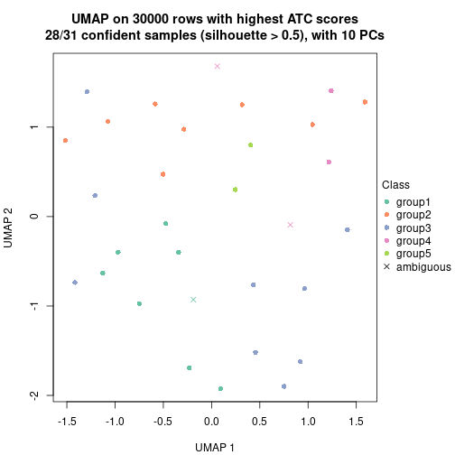</p>

</div>
<div id='tab-node-053-dimension-reduction-5'>
<pre><code class="r">dimension_reduction(res, k = 6, method = &quot;UMAP&quot;)
</code></pre>

<p>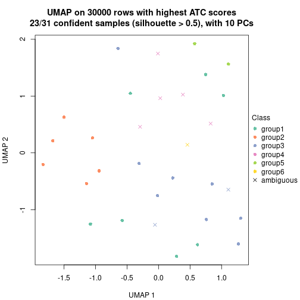</p>

</div>
<div id='tab-node-053-dimension-reduction-6'>
<pre><code class="r">dimension_reduction(res, k = 7, method = &quot;UMAP&quot;)
</code></pre>

<p>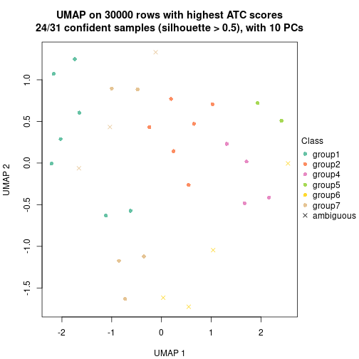</p>

</div>
<div id='tab-node-053-dimension-reduction-7'>
<pre><code class="r">dimension_reduction(res, k = 8, method = &quot;UMAP&quot;)
</code></pre>

<p>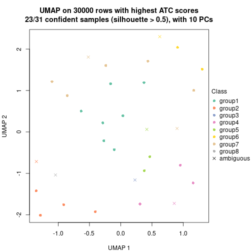</p>

</div>
</div>


Following heatmap shows how subgroups are split when increasing `k`:

```r
collect_classes(res)
```

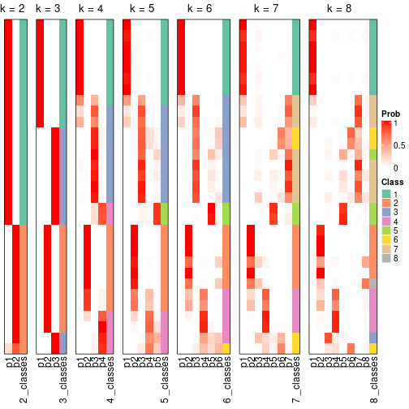


If matrix rows can be associated to genes, consider to use `functional_enrichment(res,
...)` to perform function enrichment for the signature genes. See [this vignette](https://jokergoo.github.io/cola_vignettes/functional_enrichment.html) for more detailed explanations.


 

## Session info


```r
sessionInfo()
```

```
#> R version 4.1.0 (2021-05-18)
#> Platform: x86_64-pc-linux-gnu (64-bit)
#> Running under: CentOS Linux 7 (Core)
#> 
#> Matrix products: default
#> BLAS/LAPACK: /usr/lib64/libopenblas-r0.3.3.so
#> 
#> locale:
#>  [1] LC_CTYPE=en_US.UTF-8       LC_NUMERIC=C               LC_TIME=en_US.UTF-8       
#>  [4] LC_COLLATE=en_US.UTF-8     LC_MONETARY=en_US.UTF-8    LC_MESSAGES=en_US.UTF-8   
#>  [7] LC_PAPER=en_US.UTF-8       LC_NAME=C                  LC_ADDRESS=C              
#> [10] LC_TELEPHONE=C             LC_MEASUREMENT=en_US.UTF-8 LC_IDENTIFICATION=C       
#> 
#> attached base packages:
#> [1] grid      stats     graphics  grDevices utils     datasets  methods   base     
#> 
#> other attached packages:
#> [1] genefilter_1.74.0    ComplexHeatmap_2.8.0 markdown_1.1         knitr_1.33          
#> [5] matrixStats_0.59.0   cola_1.9.4          
#> 
#> loaded via a namespace (and not attached):
#>   [1] bitops_1.0-7           bit64_4.0.5            doParallel_1.0.16      RColorBrewer_1.1-2    
#>   [5] httr_1.4.2             GenomeInfoDb_1.28.1    data.tree_1.0.0        tools_4.1.0           
#>   [9] utf8_1.2.1             R6_2.5.0               irlba_2.3.3            DBI_1.1.1             
#>  [13] BiocGenerics_0.38.0    colorspace_2.0-2       GetoptLong_1.0.5       gridExtra_2.3         
#>  [17] tidyselect_1.1.1       bit_4.0.4              compiler_4.1.0         Biobase_2.52.0        
#>  [21] Cairo_1.5-12.2         xml2_1.3.2             microbenchmark_1.4-7   slam_0.1-48           
#>  [25] scales_1.1.1           askpass_1.1            stringr_1.4.0          digest_0.6.27         
#>  [29] XVector_0.32.0         pkgconfig_2.0.3        umap_0.2.7.0           fastmap_1.1.0         
#>  [33] highr_0.9              rlang_0.4.11           GlobalOptions_0.1.2    rstudioapi_0.13       
#>  [37] RSQLite_2.2.7          impute_1.66.0          generics_0.1.0         shape_1.4.6           
#>  [41] jsonlite_1.7.2         mclust_5.4.7           dplyr_1.0.7            dendextend_1.15.1     
#>  [45] RCurl_1.98-1.3         magrittr_2.0.1         GenomeInfoDbData_1.2.6 Matrix_1.3-4          
#>  [49] fansi_0.5.0            Rcpp_1.0.7             munsell_0.5.0          S4Vectors_0.30.0      
#>  [53] viridis_0.6.1          reticulate_1.20        lifecycle_1.0.0        scatterplot3d_0.3-41  
#>  [57] stringi_1.7.3          zlibbioc_1.38.0        blob_1.2.1             parallel_4.1.0        
#>  [61] crayon_1.4.1           lattice_0.20-44        Biostrings_2.60.1      splines_4.1.0         
#>  [65] annotate_1.70.0        circlize_0.4.13        KEGGREST_1.32.0        polylabelr_0.2.0      
#>  [69] pillar_1.6.1           rjson_0.2.20           codetools_0.2-18       stats4_4.1.0          
#>  [73] XML_3.99-0.6           glue_1.4.2             evaluate_0.14          png_0.1-7             
#>  [77] vctrs_0.3.8            foreach_1.5.1          polyclip_1.10-0        purrr_0.3.4           
#>  [81] gtable_0.3.0           openssl_1.4.4          assertthat_0.2.1       clue_0.3-59           
#>  [85] cachem_1.0.5           ggplot2_3.3.5          xfun_0.24              eulerr_6.1.0          
#>  [89] xtable_1.8-4           skmeans_0.2-13         RSpectra_0.16-0        viridisLite_0.4.0     
#>  [93] survival_3.2-11        tibble_3.1.2           Polychrome_1.3.1       iterators_1.0.13      
#>  [97] AnnotationDbi_1.54.1   memoise_2.0.0          IRanges_2.26.0         cluster_2.1.2         
#> [101] ellipsis_0.3.2         brew_1.0-6
```


